# 18 部署 Kubernetes：多节点和多架构集群

您可以在不了解集群架构以及所有组件如何协同工作的情况下做很多事情——您在前 17 章中已经做到了这一点。但额外的知识将帮助您了解 Kubernetes 中的高可用性是什么样的，以及如果您想运行自己的集群，您需要考虑什么。了解所有 Kubernetes 组件的最好方式是从头开始安装集群，这正是本章要做的。练习从普通的虚拟机开始，引导您完成多节点集群的基本 Kubernetes 设置，您可以使用它来运行书中熟悉的一些示例应用程序。

到目前为止，我们运行的所有应用程序都使用了为 Intel 64 位处理器构建的 Linux 容器，但 Kubernetes 是一个多架构平台。单个集群可以包含具有不同操作系统和不同类型 CPU 的节点，因此您可以运行各种工作负载。在本章中，您还将向您的集群添加一个 Windows Server 节点并运行一些 Windows 应用程序。这部分是可选的，但如果您不是 Windows 用户，那么跟随这些练习了解 Kubernetes 如何使用相同的建模语言来处理不同的架构，只需对清单进行一些调整，这也是值得的。

## 18.1 Kubernetes 集群内部有什么？

您需要一些不同的工具来跟随本章的内容，以及一些虚拟机镜像，下载这些镜像需要一些时间。您现在可以开始安装，等到我们完成对 Kubernetes 架构的查看时，您应该已经准备好开始使用了。

现在试试吧！您将使用 Vagrant，这是一个用于虚拟机管理的免费开源工具，来运行虚拟机。您还需要一个虚拟机运行时；您可以使用 VirtualBox、Hyper-V（在 Windows 上）或 Parallels（在 macOS 上）来运行这些机器。安装 Vagrant，然后下载您将用于集群的基础虚拟机镜像。

```
# install Vagrant-
# browse to https://www.vagrantup.com to download
# OR on Windows you can use: choco install vagrant
# OR on macOS you can use: brew cask install vagrant

# Vagrant packages VM images into "boxes"
# download a Linux box--this will ask you to choose a provider,
# and you should select your VM runtime:
vagrant box add bento/ubuntu-20.04

# if you want to add Windows, download a Windows box:
vagrant box add kiamol/windows-2019 
```

好的，当这一切在进行时，是时候学习 Kubernetes 的架构了。您知道集群由一个或多个称为节点的服务器组成，但这些节点可以扮演不同的角色。有 Kubernetes 的 *控制平面*，这是集群的管理方面（之前称为主节点），然后是 *节点*，它们运行您的工作负载（这些曾经被称为从节点）。在较高层次上，控制平面是接收您的 kubectl 部署请求的东西，并通过在节点上调度 Pods 来执行这些操作。图 18.1 展示了从用户体验级别的集群。

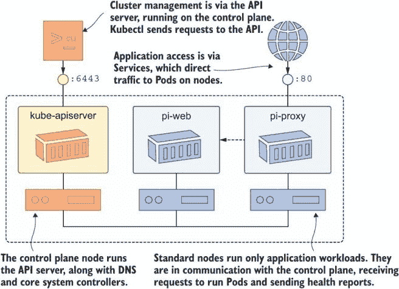

图 18.1 从用户的角度来看，这是一个包含管理和应用端点的集群。

在云中的托管 Kubernetes 平台上，控制平面由您负责，因此您只需关注自己的节点（在 AKS 中，控制平面完全抽象，您只能看到并支付工作节点）。这就是托管平台如此吸引人的一个原因——控制平面包含多个组件，如果您运行自己的环境，则需要管理这些组件。以下组件对于集群的正常运行至关重要：

+   API *服务器*是管理接口。它是一个 HTTPS 端点的 REST API，您可以通过 kubectl 连接到它，Pod 也可以内部使用。它运行在 kube-apiserver Pod 中，并且可以扩展以实现高可用性。

+   *调度器*监视新的 Pod 请求并选择一个节点来运行它们。它运行在 kube-scheduler Pod 中，但它是一个可插拔组件——您可以部署自己的自定义调度器。

+   *控制器管理器*运行核心控制器，这些是内部组件，不是像 Deployments 这样的可见控制器。kube-controller-manager Pod 运行观察节点可用性和管理服务端点的控制器。

+   *etcd*是 Kubernetes 数据存储，所有集群数据都存储在这里。它是一个分布式键值数据库，数据在多个实例之间进行复制。

您需要运行多个控制平面节点以实现高可用性。使用奇数以支持故障，因此如果管理节点宕机，剩余的节点可以投票选举一个新的管理节点。每个控制平面节点运行所有这些组件的实例，如图 18.2 所示。API 服务器是负载均衡的，后端数据是复制的，因此任何控制平面节点都可以处理请求，并且将以相同的方式进行处理。

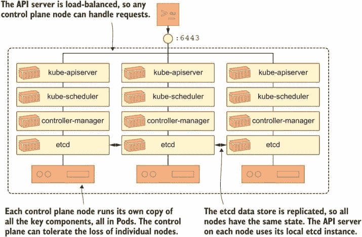

图 18.2 生产集群需要多个控制平面节点以实现高可用性。

您的下载应该现在几乎完成了，所以我们将查看每个节点上运行的组件的更详细的一级——节点负责创建 Pod 并确保其容器持续运行，以及将 Pod 连接到 Kubernetes 网络。

+   *kubelet*是一个在服务器上运行的背景代理——不在 Pod 或容器中。它接收创建 Pod 的请求，管理 Pod 的生命周期，并向 API 服务器发送心跳以确认节点健康。

+   *kube-proxy*是网络组件，负责在 Pod 之间或从 Pod 到外部世界路由流量。它作为一个 DaemonSet 运行，每个节点上的 Pod 管理该节点的流量。

+   由 kubelet 用于管理 Pod 容器的*容器运行时*。通常是 Docker、containerd 或 CRI-O，这是可插拔的，可以与支持 CRI（容器运行时接口）的任何运行时一起使用。

图 18.3 显示了每个节点上的内部组件，这些组件也运行在控制平面节点上。

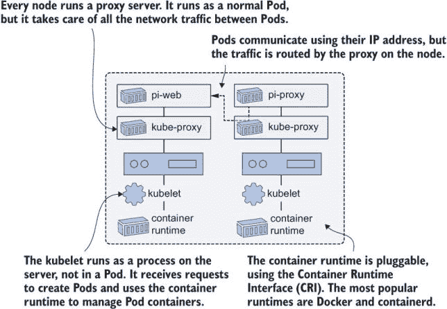

图 18.3 节点的下一级细节——kubelet、kube-proxy 和容器运行时

你可以看到，Kubernetes 是一个由许多组件组成的复杂平台。这些只是核心组件；还有 Pod 网络、DNS，以及在云中，一个独立的云控制器管理器，它集成了云服务。你可以使用 100%的开源组件来部署和管理自己的 Kubernetes 集群，但你需要意识到你将要承担的复杂性。而且理论已经足够多了——让我们去构建一个集群。

## 18.2 初始化控制平面

在部署 Kubernetes 的大部分工作都由一个名为 kubeadm 的工具来完成。它是一个管理命令行工具，可以初始化新的控制平面，将节点加入集群，并升级 Kubernetes 版本。在你使用 kubeadm 之前，你需要安装几个依赖项。在生产环境中，你会在虚拟机镜像中已经安装了这些依赖项，但为了展示它是如何工作的，我们将从头开始。

现在尝试一下 运行一个 Linux 虚拟机，它将成为控制平面节点，并安装所有的 Kubernetes 依赖项。如果你在 Windows 上使用 Hyper-V，你需要以管理员身份运行你的 shell。

```
# switch to this chapter’s source:
cd ch18

# use Vagrant to start a new VM--depending on your VM runtime,
# you’ll get prompts asking you to choose a network and to
# provide your credentials to mount folders from your machine: 
vagrant up kiamol-control

# connect to the VM:
vagrant ssh kiamol-control

# this folder maps the ch18 source folder:
cd /vagrant/setup

# make the install script executable, and run it:
sudo chmod +x linux-setup.sh && sudo ./linux-setup.sh

# confirm Docker has been installed:
which docker

# confirm all the Kubernetes tools have been installed:
ls /usr/bin/kube*
```

图 18.4 展示了重点——创建虚拟机、运行设置脚本，并验证所有工具都已安装。如果你检查本章源代码中的`linux-setup.sh`脚本，你会看到它安装了 Docker 和 Kubernetes 工具，并为服务器设置了一些内存和网络配置。

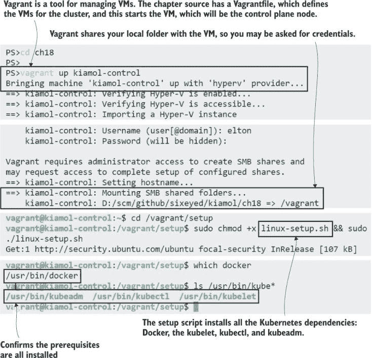

图 18.4 Kubeadm 是设置集群的工具，但它需要容器运行时和 kubelet。

现在这台机器已经准备好成为 Kubernetes 控制平面节点了。经过所有这些准备工作，接下来的练习将会很平淡：你只需要运行一个命令来初始化集群并启动所有控制平面组件。注意输出，你将看到你在 18.1 节中学到的所有组件开始启动。

现在尝试一下 使用 kubeadm 初始化一个新的集群，并为 Pod 和 Service 分配一组固定的网络地址。

```
# initialize a new cluster:
sudo kubeadm init --pod-network-cidr="10.244.0.0/16" --service-cidr="10.96.0.0/12"
                  --apiserver-advertise-address=$(cat /tmp/ip.txt)

# create a folder for the kubectl config file:
mkdir ~/.kube

# copy the admin configuration to your folder:
sudo cp /etc/kubernetes/admin.conf ~/.kube/config

# make the file readable so kubectl can access it:
sudo chmod +r ~/.kube/config

# confirm you have a Kubernetes cluster:
kubectl get nodes
```

初始化集群的输出会告诉你下一步该做什么，包括你将在其他节点上运行的命令以加入集群（你将在后面的练习中需要它，所以请确保将其复制到某个文本文件中）。该命令还会生成一个配置文件，你可以使用它通过 kubectl 管理集群。你可以在图 18.5 中看到，集群存在，但只有一个控制平面节点，而这个节点不在 Ready 状态。

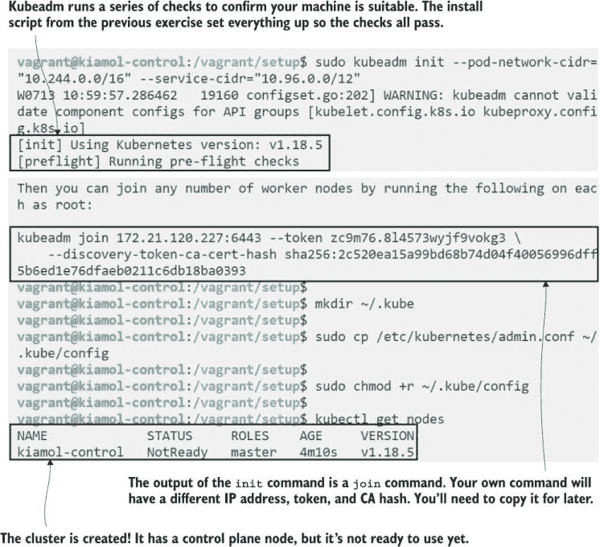

图 18.5 初始化集群很简单：kubeadm 启动所有控制平面组件。

集群尚未准备好，因为它没有安装 Pod 网络。你从第十六章知道 Kubernetes 有一个网络插件模型，不同的插件有不同的功能。在第十六章中，我们使用 Calico 来演示网络策略执行，而在本章中，我们将使用 flannel（另一个开源选项），因为它对混合架构集群的支持最为成熟。你将以与 Calico 相同的方式安装 flannel：在控制平面节点上应用 Kubernetes 清单。

现在试试看 向您的新的集群添加一个网络插件，使用现成的 flannel 清单。

```
# deploy flannel:
kubectl apply -f flannel.yaml

# wait for the DNS Pods to start:
kubectl -n kube-system wait --for=condition=ContainersReady pod -l k8s-app=kube-dns

# print the node status:
kubectl get nodes

# leave the control plane VM:
exit
```

Kubeadm 在`kube-system`命名空间中以 Pod 的形式部署集群的 DNS 服务器，但那些 Pod 在网络插件运行之前无法启动。一旦 flannel 部署完成，DNS Pods 就会启动，节点就准备好了。我在图 18.6 中的输出显示了 flannel 的多架构支持。如果你想将 IBM 大型机添加到你的 Kubernetes 集群中，你可以做到。

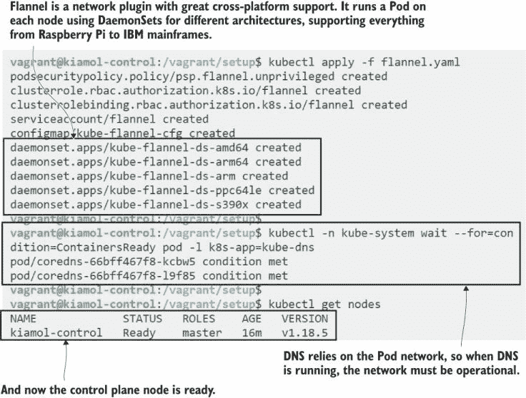

图 18.6 Kubeadm 不部署 Pod 网络；flannel 是一个好的多架构选项。

对于控制平面，你需要的就这些。我略过了网络设置——kubeadm 命令中使用的 IP 地址范围是 flannel 期望的配置——但你需要规划好，以便与你的网络兼容。而且我跳过了 kubeadm 的其他 25 个选项，但如果你认真管理自己的集群，你将需要研究它们。目前，你有一个简单的单节点集群。你还不能用它来运行应用程序工作负载，因为默认设置限制了控制平面节点，它们只能运行系统工作负载。接下来，我们将添加另一个节点并运行一些应用程序。

## 18.3 添加节点和运行 Linux 工作负载

kubeadm 初始化的输出会给你运行在其他服务器上的命令，以便将它们加入集群。新的 Linux 节点需要与控制平面节点相同的设置，包括容器运行时和所有 Kubernetes 工具。在下一个练习中，你将创建另一个虚拟机，并使用与控制平面相同的设置脚本安装先决条件。

现在试试看 使用 Vagrant 创建第二个虚拟机，并安装它加入 Kubernetes 集群所需的先决条件。

```
# start the node VM:
vagrant up kiamol-node

# connect to the VM:
vagrant ssh kiamol-node

# run the setup script:
sudo /vagrant/setup/linux-setup.sh
```

图 18.7 几乎与图 18.5 相同，只是机器名称不同，因此你可以看到设置脚本确实应该是虚拟机配置的一部分。这样，当你使用 Vagrant（或 Terraform 或其他适用于您基础设施的工具）启动新机器时，它将具备所有先决条件，并准备好加入集群。

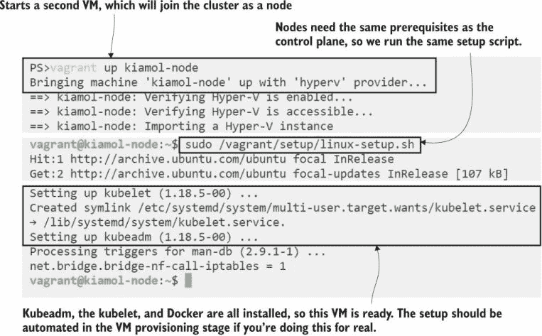

图 18.7 安装所需依赖项——节点需要与控制平面相同的初始设置。

现在你可以通过加入一个新节点来将你的 Kubernetes 集群的大小加倍。kubeadm `init`命令的输出包含你需要的一切——一个 CA 证书哈希，以便新节点可以信任控制平面，以及一个`join`令牌，以便控制平面允许新服务器加入。`join`令牌是敏感的，你需要安全地分发它以防止恶意节点加入你的集群。任何可以访问控制平面和令牌的网络机器都可能加入。你的新虚拟机与控制平面虚拟机位于同一虚拟网络中，所以你只需要运行`join`命令。

现在尝试一下 使用 kubeadm 和从控制平面执行的`join`命令加入集群。

```
# you’ll need to use your own join command;
# the control plane IP address,  token, and CA hash 
# will be different--this just shows you how it looks:

sudo kubeadm join 172.21.125.229:6443 
--token 3sqpc7.a19sx21toelnar5i 
--discovery-token-ca-cert-hash sha256:ed01ef0e33f7ecd56f1d39b5db0fbaa56811ac055f43adb37688a2a2d9cc86b9

# if your token has expired, run this on the control plane node:
kubeadm token create --print-join-command
```

在这个练习中，你会看到 kubelet 关于 TLS 引导的日志。控制平面为新节点生成 TLS 证书，以便 kubelet 可以与 API 服务器进行身份验证。你可以自定义 kubeadm 安装以提供自己的证书颁发机构，但这又是一个额外的细节层（包括证书续订和外部 CA），我们在这里不会讨论。图 18.8 显示我的新节点成功使用简单的默认设置加入集群。

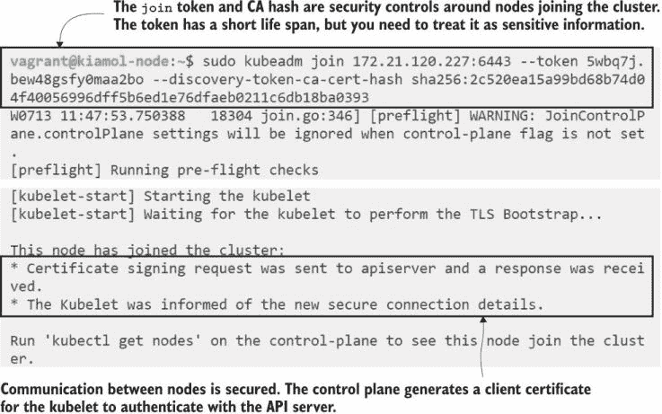

图 18.8 将节点加入集群设置了与控制平面的安全通信。

新节点运行控制平面已运行的组件的子集。kubelet 作为 Kubernetes 之外的背景进程运行，与 Docker 通信，Docker 也作为背景进程运行。它在 Pod 中运行另外两个组件：网络代理和网络插件。所有其他组件——DNS、控制器管理器和 API 服务器——都是针对控制平面节点特定的，不会在标准节点上运行。切换回控制平面节点，你就可以看到 Pods。

现在尝试一下 Kubectl 仅在控制平面设置，尽管你可以共享配置文件从另一台机器连接。切换回那个控制平面节点以查看所有集群资源。

```
# connect to the control plane node:
vagrant ssh kiamol-control

# print the node status:
kubectl get nodes

# list all the Pods on the new node:
kubectl get pods --all-namespaces --field-selector spec.nodeName=kiamol-node
```

我的输出显示在图 18.9 中。除非法兰绒豆还在启动中，否则你应该看到相同的结果，在这种情况下，新节点可能还没有准备好。

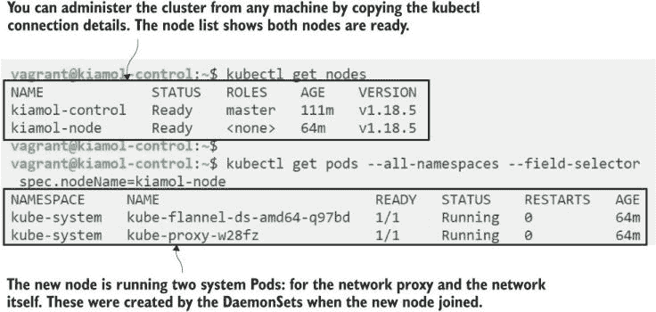

图 18.9 中的 DaemonSets 在每个节点上运行一个 Pod；新 Pod 在加入时运行系统组件。

现在你可以部署应用程序了，但你需要意识到这个集群的限制。没有设置默认的存储类，也没有卷提供程序，所以你无法部署动态持久卷声明（我们在第六章中讨论过），你将只能使用`HostPath`卷。也没有负载均衡器集成，所以你不能使用负载均衡器服务。在数据中心，你可以使用网络文件系统（NFS）共享来实现分布式存储，以及一个名为 MetalLB 的项目来支持负载均衡器。这一切都超出了本章的范围，所以我们将继续使用没有存储要求的简单应用程序，并使用 NodePort 服务将流量引入集群。

NodePorts 是一种更简单的服务类型：它们与其他服务一样工作，将流量分发到 Pods，但它们在节点上的特定端口上监听传入的流量。每个节点都监听相同的端口，因此任何服务器都可以接收请求并将其路由到正确的 Pod，即使该 Pod 在不同的节点上运行。如果您在本地集群中有一个现有的负载均衡器，则可以使用 NodePorts，但 NodePorts 限制在特定的端口范围内，因此您的负载均衡器需要进行一些端口映射。列表 18.1 展示了用于每日天文图片 web 应用的 NodePort 服务规范。

列表 18.1 web.yaml，一个以 NodePort 暴露的服务

```
apiVersion: v1
kind: Service
metadata:
  name: apod-web
spec:
  type: NodePort       # Every node will listen on the port.
 ports:
    - port: 8016       # The internal ClusterIP port
      targetPort: web  # The container port to send to
      nodePort: 30000  # The port the node listens on--
  selector:            # it must be >= 30000, a security restriction.
    app: apod-web
```

APOD 应用包含三个组件，与我们已经部署的其他规范相比，服务类型是唯一的区别。当您运行应用程序时，您可能会期望 Kubernetes 将 Pods 分布在集群的各个地方，但请记住，默认情况下控制平面节点与用户工作负载是隔离的。

现在尝试一下 将应用程序部署到您的新集群，并查看 Pods 被调度到哪个节点运行。

```
# deploy the manifests in the usual way:
kubectl apply -f /vagrant/apod/

# print the Pod status:
kubectl get pods -o wide
```

您可以在图 18.10 中看到，每个 Pod 都被调度在相同的节点上。这是一个没有任何本书容器镜像的新 VM，因此它将从 Docker Hub 下载它们。在发生这种情况时，Pod 将处于 ContainerCreating 状态。此应用程序的最大镜像只有 200 多 MB，因此启动 shouldn’t take too long.

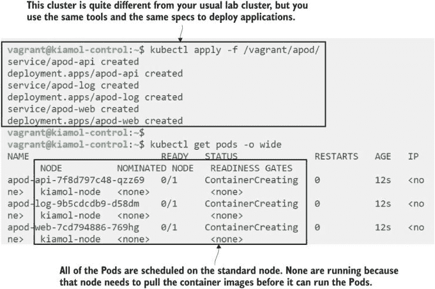

图 18.10 对于所有 Kubernetes 集群，用户体验基本上是相同的。

如果这是您第一次使用与您正常的实验室环境不同的 Kubernetes 集群，那么现在您就可以看到 Kubernetes 的强大之处。这是一个完全不同的设置，可能使用的是 Kubernetes 的不同版本，可能使用的是不同的容器运行时，以及不同的主机操作系统。通过更改规范的一次，您可以以与之前完全相同的方式部署和管理 APOD 应用程序。您可以从这本书的任何练习中选择并在这里部署，但您必须更改服务和卷，以便它们使用新集群的有效类型。

Kubernetes 停止控制平面节点运行应用程序工作负载，以确保它们不会因计算资源不足而受饿。如果您的控制平面节点在计算 Pi 到一百万位小数时达到最大 CPU，那么 API 服务器和 DNS Pods 就没有剩余的资源了，您的集群将变得不可用。您应该在真实集群中保留这个安全防护，但在实验室设置中，您可以放松它以充分利用您的服务器。

现在尝试一下 Kubernetes 使用污点来分类节点，而 `master` 污点阻止应用程序工作负载运行。移除该污点，并扩展应用程序以查看新的 Pods 被调度到控制平面节点。

```
# remove the master taint from all nodes:
kubectl taint nodes --all node-role.kubernetes.io/master-

# scale up, adding two more APOD API Pods:
kubectl scale deploy apod-api --replicas=3

# print the Pods to see where they’re scheduled:
kubectl get pods -l app=apod-api -o wide
```

您将在第十九章中了解有关污点和调度的所有内容；目前，只需知道污点是一种标记特定节点以防止 Pod 在其上运行的方法。移除污点使控制平面节点有资格运行应用程序工作负载，因此当您扩展 API 部署时，新的 Pods 将在控制平面节点上调度。您可以在图 18.11 中看到这些 Pods 处于 ContainerCreating 状态，因为每个节点都有自己的镜像存储，控制平面节点需要下载 API 镜像。您的容器镜像的大小直接影响到您在这个场景中扩展的速度，这也是为什么您需要投资优化您的 Dockerfile 的原因。

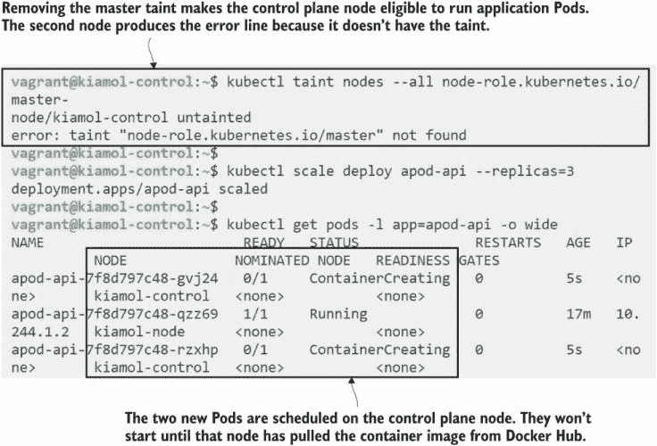

图 18.11 您可以在控制平面节点上运行应用程序 Pod，但在生产环境中不应这样做。

应用程序正在运行，NodePort 服务意味着所有节点都在监听端口 30000，包括控制平面节点。如果您浏览到任何节点的 IP 地址，您将看到 APOD 应用程序。您的请求将被导向标准节点上的 Web Pod，并执行 API 调用，这可能被导向任意节点的 Pod。

现在试试看 您的虚拟机运行时设置您的网络，以便您可以通过 IP 地址访问虚拟机。获取任意节点的地址，然后在您的宿主机上浏览到它。

```
# print the IP address saved in the setup script:
cat /tmp/ip.txt

# browse to port 30000 on that address--if your VM 
# provider uses a complicated network stack, you may
# not be able to reach the VM externally :(
```

我的输出显示在图 18.12 中。我在做练习时看到的图片要生动得多，但我没有截图，所以我们只有这张彗星图片。

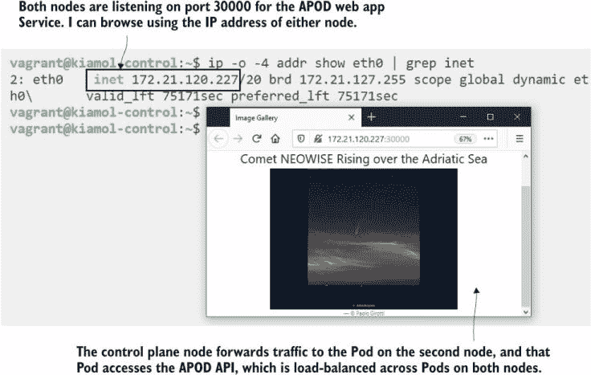

图 18.12 NodePort 和 ClusterIP 服务跨越 Pod 网络，以便流量可以路由到任意节点。

如果您愿意保持简单，使用 NodePorts、HostPaths 和可能还有 NFS 卷，构建自己的 Kubernetes 集群并不复杂。如果您想扩展这个集群并添加更多节点；Vagrant 设置包括 `kiamol-node2` 和 `kiamol-node3` 的机器定义，因此您可以使用这些虚拟机名称重复本节的前两个练习来构建一个四节点集群。但这仅仅给您一个无聊的全 Linux 集群。Kubernetes 的一个巨大好处是它可以运行各种应用程序。接下来，我们将看到如何向集群添加不同的架构——一个 Windows 服务器——这样我们就可以运行全 Windows 或混合 Linux-Windows 应用程序。

## 18.4 添加 Windows 节点并运行混合工作负载

Kubernetes 网站本身就说 *Windows 应用程序构成了许多组织中运行的服务和应用程序的大部分*，如果您考虑跳过这一节，请记住这一点。我不会过多地详细介绍 Windows 容器和与 Linux 的区别（关于这一点，您可以阅读我的书 *Windows 上的 Docker*；Packt 出版，2019）——只是基础知识，以便您了解 Windows 应用程序如何在 Kubernetes 中适配。

容器镜像是为特定架构构建的：操作系统和 CPU 的组合。容器使用它们运行所在机器的内核，因此必须与镜像的架构相匹配。您可以在树莓派上构建 Docker 镜像，但不能在您的笔记本电脑上运行，因为 Pi 使用 Arm CPU 而您的笔记本电脑使用 Intel。操作系统也是如此——您可以在 Windows 机器上构建用于运行 Windows 应用程序的镜像，但不能在 Linux 服务器上的容器中运行该镜像。Kubernetes 通过在同一个集群中拥有不同架构的节点来支持不同类型的工作负载。

您对集群的多样性有一些限制，但图 18.13 中的内容是您可以真正构建的。控制平面仅支持 Linux，但 kubelet 和代理是跨平台的。AWS 有基于 Arm 的服务器，其价格几乎相当于 Intel 服务器的半价，您可以将它们用作 EKS 中的节点。如果您有一个大型应用程序套件，其中一些应用程序在 Arm 上的 Linux 中运行，一些需要 Intel 上的 Linux，还有一些是 Windows 系统，您可以在一个集群中运行和管理它们所有。

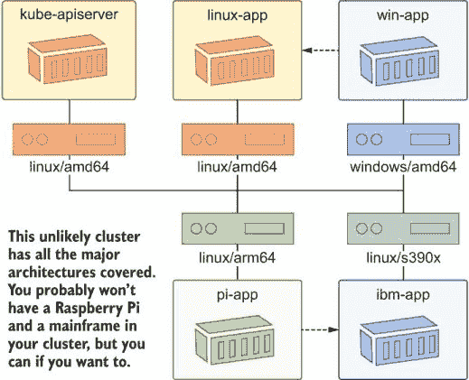

图 18.13 谁没有闲置的树莓派和积满灰尘的 IBM Z 大型机？

让我们开始操作，将一个 Windows 节点添加到您的集群中。方法与添加 Linux 节点相同——启动一个新的虚拟机，添加容器运行时和 Kubernetes 工具，并将其加入集群。Windows Server 2019 是 Kubernetes 支持的最小版本，Docker 是当时可用的唯一容器运行时——Windows 的 containerd 支持正在进行中。

现在试试看 创建一个 Windows 虚拟机，并安装 Kubernetes 的先决条件。Vagrant 中的文件夹共享对于 Windows 并不总是有效，因此您需要从 GitHub 上的书籍源下载设置脚本。

```
# spin up a Windows Server 2019 machine:
vagrant up kiamol-node-win

# connect--you need the password, which is vagrant
vagrant ssh kiamol-node-win

# switch to PowerShell:
powershell

# download the setup script:
curl.exe -s -O windows-setup.ps1 https://raw.githubusercontent.com/sixeyed/kiamol/master/ch18/setup/windows-setup.ps1

# run the script--this reboots the VM when it finishes:
./windows-setup.ps1
```

Windows 设置需要启用操作系统功能并安装 Docker；完成这些操作后，脚本会重启虚拟机。您可以在图 18.14 中看到，我的会话已经回到了正常的命令行。

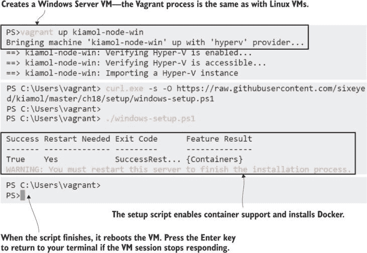

图 18.14 添加 Windows 节点第一阶段是安装容器运行时。

这只是设置的第一部分，因为控制平面需要配置以支持 Windows。标准的 flannel 和 kube proxy 部署不会为 Windows 节点创建 DaemonSet，因此我们需要将其作为额外步骤来设置。新的 DaemonSets 在规范中使用 Windows 容器镜像，并且 Pod 被配置为与 Windows 服务器一起设置网络。

现在试试看 部署 Windows 节点的新的系统组件。

```
# connect to the control plane:
vagrant ssh kiamol-control

# create the Windows proxy:
kubectl apply -f /vagrant/setup/kube-proxy.yml

# create the Windows network:
kubectl apply -f /vagrant/setup/flannel-overlay.yml

# confirm that the new DaemonSets are there:
kubectl get ds -n kube-system
```

再次强调，如果你认真考虑运行自己的混合集群，这将是你需要添加到初始集群设置中的内容。我将其作为一个单独的步骤，以便你可以看到需要更改什么以添加 Windows 支持——只要你运行的集群是 Kubernetes 1.14 或更高版本，你就可以使用现有的集群来实现这一点。图 18.15 中的输出显示了新的特定于 Windows 的 DaemonSets，期望计数为零，因为 Windows 节点尚未加入。

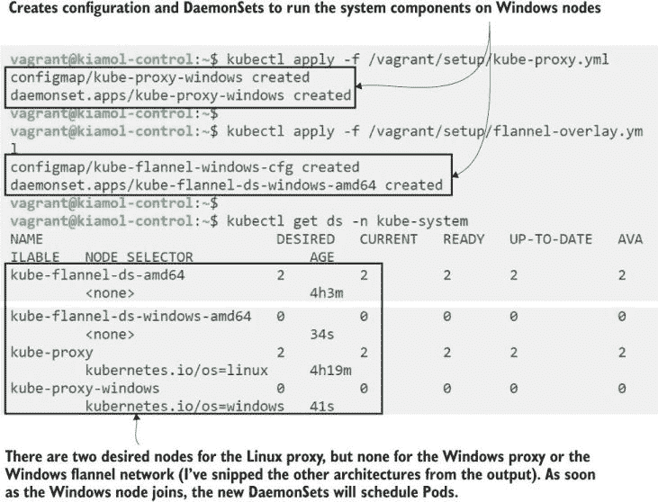

图 18.15 更新控制平面以在 Windows 节点上调度系统组件

加入 Windows 节点。它将为代理和网络组件安排 Pod，因此它将下载镜像并启动容器。一个不同之处在于，Windows 容器比 Linux 容器更受限制，因此 flannel 设置略有不同。Kubernetes 的 Windows 特别兴趣小组（SIG）发布了一个辅助脚本，用于设置 flannel 和 kubelet。我在本章的源文件夹中有一个该脚本的快照，它与我们在运行的 Kubernetes 版本相匹配；在第二个设置脚本之后，节点就准备好加入集群了。

现在试试看，将剩余的依赖项添加到 Windows 节点，并将其加入集群。

```
# connect to the Windows node:
vagrant ssh kiamol-node-win

# run PowerShell:
powershell

# download the second setup script:
curl.exe -s -o PrepareNode.ps1
 https://raw.githubusercontent.com/sixeyed/kiamol/master/ch18/setup/PrepareNode.ps1

# run the script:
.\PrepareNode.ps1

# run the join command--remember to use your command; this
# is just a reminder of how the command looks:
kubeadm join 172.21.120.227:6443 
--token 5wbq7j.bew48gsfy0maa2bo     
--discovery-token-ca-cert-hash sha256:2c520ea15a99bd68b74d04f40056996dff5b6ed1e76dfaeb0211c6db18ba0393
```

你在图 18.16 中看到的“此节点已加入集群”的愉快信息有点过于乐观。新节点需要下载代理和网络镜像。flannel 镜像为 5 GB，因此 Windows 节点准备就绪可能需要几分钟。

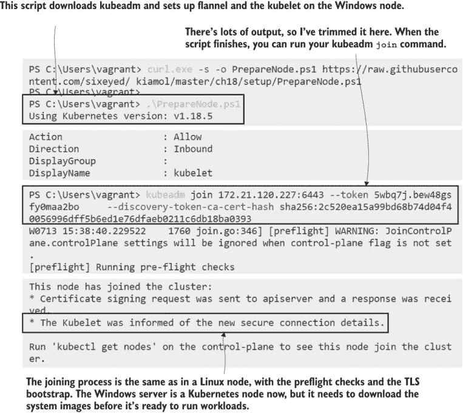

图 18.16 显示加入 Windows 节点使用与 Linux 节点相同的 kubeadm 命令。

当下载进行时，我们将探讨如何对运行在不同架构上的应用程序进行建模。Kubernetes 不会自动确定哪些节点适合哪些 Pod——仅从镜像名称本身很难做到这一点。相反，你需要在 Pod 规范中添加一个选择器来指定 Pod 需要的架构。列表 18.2 显示了一个将 Pod 设置为在 Windows 节点上运行的选择器。

列表 18.2 api.yaml，使用节点选择器请求特定的操作系统

```
spec:                                        # Pod spec in the Deployment
  containers:
    - name: api
    image: kiamol/ch03-numbers-api:windows   # A Windows-specific image
  nodeSelector:
    kubernetes.io/os: windows                # Selects nodes with Windows OS
```

就这些了。记住，Pod 在单个节点上运行，所以如果你的 Pod 规范中有多个容器，它们都需要使用相同的架构。如果你正在运行一个多架构集群，为每个 Pod 包含一个节点选择器是一个好习惯，以确保 Pod 总是出现在它们应该出现的地方。你可以包括操作系统、CPU 架构或两者都包括。

18.2 节中的列表是随机数 API 的 Windows 版本，它还附带了一个 Linux 版本的网站。网站规范包括 Linux 操作系统的节点选择器。你可以部署应用程序，Pod 将在不同的节点上运行，但网站仍然通过 ClusterIP 服务以通常的方式访问 API Pod，即使它运行在 Windows 上。

现在试试这个 这是一个混合应用程序，包含一个 Windows 组件和一个 Linux 组件。两者都使用相同的 YAML 格式，在规格说明中，只有节点选择器显示它们需要在不同的架构上运行。

```
# connect to the control plane:
vagrant ssh kiamol-control

# wait for all the nodes to be ready:
kubectl -n kube-system wait --for=condition=Ready node --all

# deploy the hybrid app:
kubectl apply -f /vagrant/numbers

# wait for the Windows Pod to be ready:
kubectl wait --for=condition=ContainersReady pod -l app=numbers,component=api

# confirm where the Pods are running:
kubectl get pods -o wide -l app=numbers

# browse to port 30001 on any node to use the app
```

真遗憾，图 18.17 中的演示应用程序如此基础，因为这个功能已经花费了 Kubernetes 社区和微软、Docker 的工程团队多年的时间和大量努力。

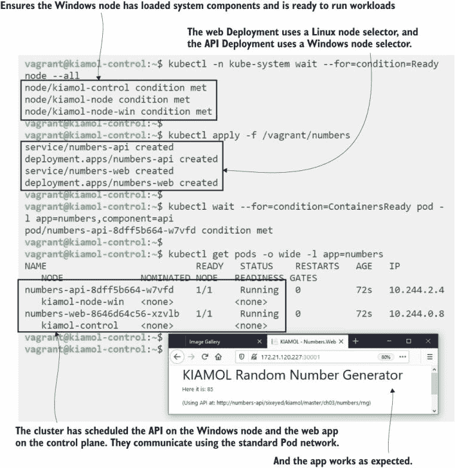

图 18.17 一个世界级的容器编排器运行混合应用程序以生成一个随机数

白天，我作为顾问帮助公司采用容器技术，这里的模式正是许多组织希望对其 Windows 应用程序做的事情——在不做任何更改的情况下将它们迁移到 Kubernetes，然后逐步通过在轻量级 Linux 容器中运行的新组件来分解单体架构。这是一种实用且风险低的现代化应用程序的方法，充分利用了 Kubernetes 的所有功能，并为你提供了轻松迁移到云的途径。

在第一章中，我说 Kubernetes 运行你的应用程序，但它实际上并不关心那些应用程序是什么。我们将通过最后一次部署到集群：Windows 宠物商店应用程序来证明这一点。微软在 2008 年构建了这个演示应用程序来展示 .NET 的最新功能。它使用的技术和方法早已被取代，但源代码仍然存在，我已经打包好以在 Windows 容器中运行，并在 Docker Hub 上发布了镜像。这个练习表明，你真的可以在 Kubernetes 中运行十年前的应用程序，而无需对代码进行任何更改。

现在试试这个 部署一个遗留的 Windows 应用程序。这个应用程序会下载更多的容器镜像，所以启动需要一段时间。

```
# on the control plane, deploy the Petshop app:
kubectl apply -f /vagrant/petshop/

# wait for all the Pods to start--it might need more than five minutes:
kubectl wait --for=condition=ContainersReady pod -l app=petshop --timeout=5m
kubectl get pods -o wide -l app=petshop

# browse to port 30002 on any node to see the app 
```

就这样了。图 18.18 可能是伪造的——但不是——你可以自己运行这个来证明它。（我必须承认我试了两次——我的 Windows 虚拟机第一次尝试时失去了网络连接，这很可能是 Hyper-V 的问题。）宠物商店是一个最后一次代码更改是在 12 年前的应用程序，现在运行在 Kubernetes 的最新版本中。

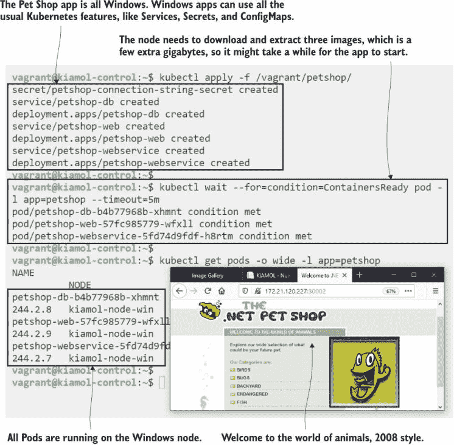

图 18.18 我打赌这本书很久没有宠物商店的截图了。

我们就到这里为止这个集群。如果你想添加更多的 Windows 节点，你可以重复本节的设置和加入练习，用于 Vagrant 中定义的两个更多机器：`kiamol-node-win2` 和 `kiamol-node-win3`。如果你至少有 16 GB 的内存，你几乎可以将控制平面节点、三个 Linux 节点和三个 Windows 节点挤在你的机器上。我们将以查看多节点 Kubernetes 集群的考虑因素和多架构的未来结束。

## 18.5 规模化理解 Kubernetes

无论您是否认真遵循本章中的练习，还是只是浏览了一下，您现在对设置和管理 Kubernetes 集群的复杂性有了很好的了解，您也会理解为什么我建议在实验室环境中使用 Docker Desktop 或 K3s。部署多节点集群是一个很好的学习练习，可以了解所有部件是如何组合在一起的，但这不是我为生产推荐的事情。

Kubernetes 的一切都是关于高可用性和可扩展性，您拥有的节点越多，管理起来就越复杂。您需要多个控制平面节点来实现高可用性；如果您丢失了控制平面，您的应用程序将继续在节点上运行，但您无法使用 kubectl 来管理它们，它们也不再是自我修复的。控制平面将所有数据存储在 etcd 中。为了更好的冗余，您可以在集群外部运行 etcd。为了提高性能，您可以运行一个额外的 etcd 数据库，专门用于存储 Kubernetes 为对象记录的事件。事情开始看起来很复杂，但我们仍在处理单个集群，而不是多个集群的高可用性。

您可以构建运行在巨大规模的 Kubernetes 集群：最新版本支持单个集群中最多 5,000 个节点和 150,000 个 Pod。在实践中，当您达到大约 500 个节点时，您可能会遇到 etcd 或您的网络插件的性能问题，然后您需要独立扩展控制平面的部分。好消息是，如果您那些节点相当强大，您可以使用仅由三个节点管理的控制平面运行一个拥有数百个工作节点的集群。坏消息是您需要管理所有这些，并且您需要决定您是更倾向于一个大型集群还是多个较小的集群。

尺度的另一面是能够在单个平台上尽可能多地运行你的应用程序目录。在本章中，您可以看到通过添加 Windows 节点可以运行多架构集群——Arm 和 IBM 节点以相同的方式工作——这意味着您几乎可以在 Kubernetes 中运行任何东西。旧应用程序会带来自己的挑战，但 Kubernetes 的一个重大优势是您不需要重写这些应用程序。将单体应用程序分解为更云原生架构可以带来好处，但这可以是长期计划的一部分，该计划从将应用程序迁移到 Kubernetes 开始。

我们没有空间继续讨论了。您应该让您的集群在实验室中继续运行，但完成之后，请回到这个最后的练习来清理它。

现在尝试一下 您有几种关闭集群的方法——在尝试实验室之后选择一个。

```
# suspend the VMs--this preserves state so the VMs 
# still consume disk or memory:
vagrant suspend

# OR stop the VMs--you can start them again, but they might 
# get new IP addresses, and then your cluster won’t be accessible:
vagrant halt

# Or, if you’re really done with the cluster, delete everything:
vagrant destroy
```

## 18.6 实验室

这里是本章的一个简单实验，但需要一些研究。在你部署你的集群之后，时间会流逝，在某个时刻，节点将需要进行维护工作。Kubernetes 允许你安全地将一个节点从集群中移除——将其 Pods 移动到另一个节点——完成维护后再将其重新上线。让我们为集群中的 Linux 节点做这个操作。只有一个提示：你可以用 kubectl 完成所有操作。

这是一个有用的实验，值得尝试，因为无论你使用哪个平台，你都会希望暂时从服务中移除一个节点。我的解决方案在 GitHub 的常规位置供你参考：[`github.com/sixeyed/kiamol/blob/master/ch18/lab/README.md`](https://github.com/sixeyed/kiamol/blob/master/ch18/lab/README.md)。
