# 19 控制工作负载放置和自动扩展

Kubernetes 决定在哪里运行你的工作负载，将它们分散在集群中以充分利用你的服务器并为你的应用程序提供最高的可用性。决定哪个节点将运行新的 Pod 是调度器的任务，它是控制平面组件之一。调度器使用它能获取的所有信息来选择一个节点。它查看服务器的计算能力以及现有 Pod 使用的资源。它还使用你可以将其钩入应用程序规范中的策略，以对 Pod 运行的地点有更多的控制。在本章中，你将学习如何将 Pod 指向特定的节点以及如何根据其他 Pod 来安排 Pod 的放置。

我们还将在本章中介绍工作负载放置的两个其他方面：自动扩展和 Pod 驱逐。自动扩展允许你指定应用程序副本的最小和最大数量，以及 Kubernetes 用来衡量应用程序工作强度的某些指标。如果 Pod 过载，集群会自动扩展，添加更多副本，并在负载减少时再次缩小。驱逐是节点资源达到极限的极端情况，Kubernetes 会移除 Pod 以保持服务器稳定。我们将介绍一些复杂细节，但了解原则对于获得健康集群和性能良好的应用程序的正确平衡至关重要。

## 19.1 Kubernetes 如何调度工作负载

当你创建一个新的 Pod 时，它进入挂起状态，直到它被分配到一个节点。调度器看到新的 Pod 并尝试找到运行它的最佳节点。调度过程包括两个部分：首先是*过滤*，排除任何不合适的节点，然后是*评分*，对剩余的节点进行排名并选择最佳选项。图 19.1 显示了简化示例。

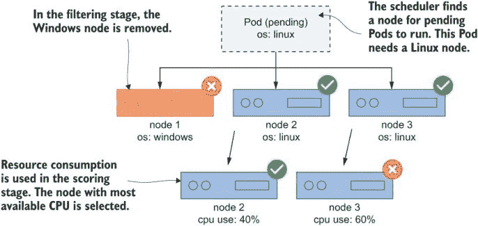

图 19.1 调度器根据节点的适用性和当前工作负载选择节点。

你已经在第十七章中看到了过滤阶段的实际应用，当时你了解到控制平面节点与应用工作负载是隔离的。这是通过污点（taint）实现的，污点是一种标记节点的方式，表示它不适合一般工作。默认情况下，`master`污点应用于控制平面节点，但污点实际上是一种特殊的标签类型，你可以向节点添加自己的污点。污点与标签一样有一个键值对，它们还具有一个效果，告诉调度器如何处理这个节点。你将使用污点来识别与其他节点不同的节点。在下一个练习中，我们将向节点添加一个污点来记录节点所拥有的磁盘类型。

现在试试 Run a simple sleep app, and then add a taint to your node to see how it affects the workload.

```
# switch to the chapter’s source:
cd ch19

# print the taints already on the nodes:
kubectl get nodes -o=jsonpath='{range .items[*]}{.metadata.name}{.spec.taints[*].key}{end}'

# deploy the sleep app:
kubectl apply -f sleep/sleep.yaml

# add a taint to all nodes:
kubectl taint nodes --all kiamol-disk=hdd:NoSchedule

# confirm that the sleep Pod is still running:
kubectl get pods -l app=sleep
```

污点的键值部分是任意的，你可以用它来记录你关心的节点方面的任何内容——也许有些节点内存较少或网卡较慢。这个污点的效果是`NoSchedule`，这意味着除非它们明确*容忍*污点，否则工作负载不会在这个节点上调度。如图 19.2 所示，应用`NoSchedule`污点不会影响现有工作负载——在节点被污染后，sleep Pod 仍然在运行。

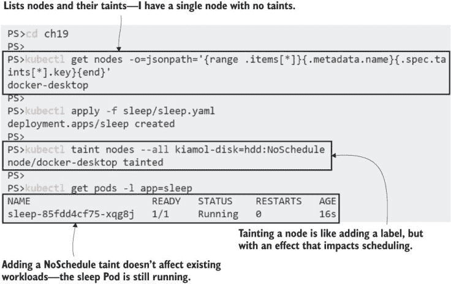

图 19.2 Pod 需要在受污染的节点上运行时需要容忍，除非它们在污染之前就已经在运行。

现在有了污点，调度器将过滤掉所有新的 Pod，除非 Pod 规范包含对污点的容忍。容忍表示工作负载承认污点并愿意与其一起工作。在这个例子中，我们标记了带有旋转磁盘的节点，这些节点可能比带有固态磁盘的节点性能较低。列表 19.1 包含一个容忍，表示这个 Pod 愿意在这些较慢的节点上运行。

列表 19.1 sleep2-with-tolerations.yaml，容忍受污染的节点

```
spec:                           # The Pod spec in a Deployment
  containers:
    - name: sleep
      image: kiamol/ch03-sleep      
  tolerations:                  # Lists taints this Pod is happy with
      - key: "kiamol-disk"      # The key, value, and effect all need 
        operator: "Equal"       # to match the taint on the node.
        value: "hdd"
        effect: "NoSchedule"
```

在这个练习中，我们污染了每个节点，以便调度器将它们全部过滤掉以供新的 Pod 请求使用，除非规范包含容忍。无法调度的 Pod 将保持挂起状态，直到发生变化——一个没有污点的节点加入，或者从现有节点移除污点，或者 Pod 规范发生变化。一旦发生变化并且调度器可以找到合适的放置位置，Pod 将被调度以运行。

现在试试看：不使用容忍来部署 sleep 应用的副本。它将保持挂起状态。更新它以添加容忍，然后它将运行。

```
# create a Pod without a toleration:
kubectl apply -f sleep/sleep2.yaml

# confirm the Pod is pending:
kubectl get po -l app=sleep2

# add the toleration from listing 19.1:
kubectl apply -f sleep/update/sleep2-with-tolerations.yaml
kubectl get po -l app=sleep2
```

这个练习使用了 Deployment，因此容忍实际上被添加到了一个新的 Pod 中，并且新的 Pod 被调度了——你可以在图 19.3 中看到这一点。但是，如果你创建了一个没有容忍的普通 Pod，它将进入挂起状态，当你添加容忍时，同一个 Pod 将被调度；调度器会继续尝试为任何未调度的 Pod 找到节点。

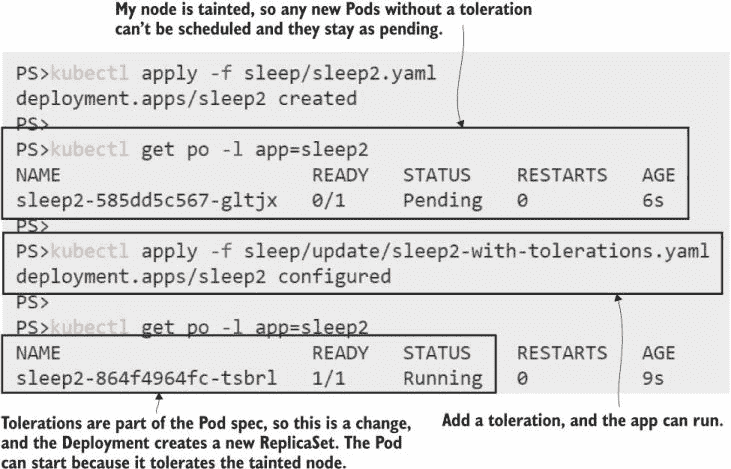

图 19.3 如果 Pod 的容忍与节点的污点匹配，那么它可以在该节点上运行。

`NoSchedule`效果是一个硬污点——它在调度器的过滤阶段，因此除非有容忍，否则 Pod 不会在受污染的节点上运行。一个较软的替代方案是`PreferNoSchedule`，它将限制移动到评分阶段。受污染的节点不会被过滤掉，但它们的评分低于没有污点的节点。`PreferNoSchedule`污点意味着 Pod 不应该在该节点上运行，除非它们有对该污点的容忍，除非没有其他合适的节点。

重要的是要理解污点（taints）和容忍度（tolerations）是用来表达关于节点的负面信息，这意味着它只适合某些 Pod；它不是节点和 Pod 之间的积极关联。具有容忍度的 Pod 可能运行在污点化的节点上，也可能不运行，因此容忍度不是确保 Pod 仅在特定节点上运行的良策。你可能需要像 PCI 合规性这样的东西，其中财务应用程序应该仅在经过加固的节点上运行。为此，你需要使用`NodeSelector`，它根据标签过滤节点——我们在第十七章中使用了它来确保 Pod 在正确的 CPU 架构上运行。列表 19.2 显示了不同类型的调度提示如何协同工作。

列表 19.2 sleep2-with-nodeSelector.yaml，一个容忍度和一个节点选择器

```
spec:
  containers:
    - name: sleep
      image: kiamol/ch03-sleep      
  tolerations:                            # The Pod tolerates nodes 
    - key: "kiamol-disk"                  # with the hdd taint.
      operator: "Equal"
      value: "hdd"
      effect: "NoSchedule"
  nodeSelector:                           # The Pod will run only on nodes
    kubernetes.io/arch: zxSpectrum        # that match this CPU type.
```

这个规范说明 Pod 可以容忍具有硬盘污点的节点，但架构必须是 ZX Spectrum。你的集群中不会有 ZX Spectrum，所以当你部署这个时，新的 Pod 不会被调度。我选择那个 CPU 不仅是因为怀旧，还为了强调这些标签只是没有验证的键值对。`os`和`arch`标签由 Kubernetes 在节点上设置，但在你的 Pod 规范中，你可能会不小心使用错误的值，并且你的 Pod 会保持挂起状态。

现在试试看：部署列表 19.2 中的 sleep 应用更新，看看你的集群中是否有匹配的节点。

```
# show the node’s labels:
kubectl get nodes --show-labels

# update the Deployment with an incorrect node selector:
kubectl apply -f sleep/update/sleep2-with-nodeSelector.yaml

# print the Pod status:
kubectl get pods -l app=sleep2 
```

你可以在图 19.4 的输出中看到我们为什么使用 Deployment 来运行这个应用程序。新的 Pod 进入挂起状态，并且它将保持在那里，直到你在你的集群中添加 ZX Spectrum（这意味着构建 kubelet 的八位版本和容器运行时）。应用程序仍然在运行，因为 Deployment 不会在替换达到所需容量之前缩小旧的 ReplicaSet。

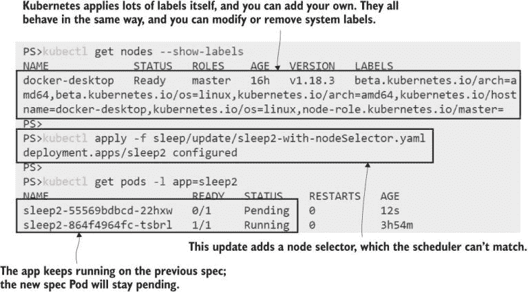

图 19.4 如果 Pod 无法调度，当它在 Deployment 中运行时不会中断应用程序。

节点选择器确保应用程序仅在具有特定标签值的节点上运行，但你通常希望比直接相等匹配有更多的灵活性。更细粒度的控制可以通过*亲和力*和*反亲和力*来实现。

## 19.2 使用亲和力和反亲和力指导 Pod 放置

Kubernetes 为节点应用一组标准的标签，但标准会随时间变化。系统提供的标签以命名空间为前缀，命名空间以与对象规范 API 版本相同的方式进行版本控制。新集群使用`kubernetes.io`作为标签前缀，但旧版本使用`beta.kubernetes.io`。beta 标签表示一个功能还不稳定，规范可能会改变，但功能可以通过多个 Kubernetes 版本保持 beta 状态。如果你想要 Pod 仅限于特定的架构，你需要允许 beta 命名空间，以便你的规范可以在不同的 Kubernetes 版本之间移植。

亲和力提供了一种丰富的方式来向调度器表达偏好或要求。您可以通过声明对某些节点的亲和力来确保 Pod 落在那些节点上。亲和力使用节点选择器，但使用匹配表达式而不是简单的相等检查。匹配表达式支持多个子句，因此您可以构建更复杂的请求。列表 19.3 使用亲和力来说明 Pod 应该在 64 位 Intel 节点上运行，这种方式适用于新旧集群。

列表 19.3 sleep2-with-nodeAffinity-required.yaml，一个具有节点亲和力的 Pod

```
affinity:                           # Affinity expresses a requirement
  nodeAffinity:                     # or a preference for nodes.
    requiredDuringSchedulingIgnoredDuringExecution:
      nodeSelectorTerms:
        - matchExpressions:               # Match expressions work on
          - key: kubernetes.io/arch       # labels, and you can supply
            operator: In                  # a list of values that 
            values:                       # should match or not match.
              - amd64
        - matchExpressions:               # Multiple match expressions
          - key: beta.kubernetes.io/arch  # work as a logical OR.
            operator: In
            values:
              - amd64
```

听起来令人恐惧的`requiredDuringSchedulingIgnoredDuringExecution`实际上只是意味着这是一个对调度器的硬性规则，但它不会影响任何现有的 Pod——一旦它们被调度，即使节点标签发生变化，它们也不会被移除。这两个匹配表达式涵盖了新旧标签命名空间中的“或”情况，取代了列表 19.2 中的简单节点选择器。列表 19.3 的完整规范包含硬盘容忍度，因此当您部署此规范时，sleep 应用将停止等待 ZX Spectrum 加入集群，并将在您的 Intel 节点上运行。

现在尝试一下 更新 sleep 应用。您的节点上应该有一个架构标签，因此新的 Pod 将运行并替换现有的 Pod。

```
# deploy the spec from listing 19.3:
kubectl apply -f sleep/update/sleep2-with-nodeAffinity-required.yaml

# confirm that the new Pod runs:
kubectl get po -l app=sleep2
```

图 19.5 对您来说应该不会带来惊喜：它只是展示了正在实施的新亲和规则。现在调度器可以找到一个符合要求的节点，以便 Pod 运行。

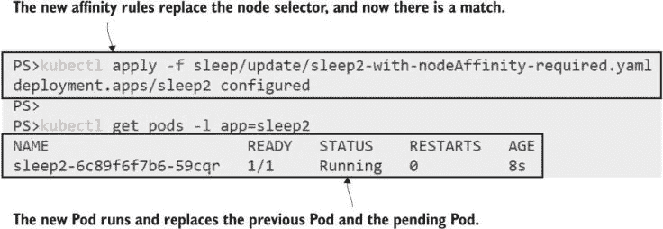

图 19.5 显示了节点选择规则的更复杂集合。

我还有一个节点亲和力的例子，因为语法有点复杂，但了解您可以做什么是很好的。节点亲和力是一种清晰的方式来表达结合硬性规则和软性偏好的调度要求，您可以使用它做的比容忍度和简单的节点选择器更多。列表 19.4 是一个规范的缩写，告诉调度器：Pod 必须在 Intel 节点上运行，并且它必须是 Windows 或 Linux，但最好是 Linux。

列表 19.4 sleep2-with-nodeAffinity-preferred.yaml，要求和偏好

```
affinity:
  nodeAffinity:
    requiredDuringSchedulingIgnoredDuringExecution:
      nodeSelectorTerms:
        - matchExpressions:
          - key: kubernetes.io/arch        # This rule requires 
            operator: In                   # an Intel CPU.
            values:
              - amd64
          - key: kubernetes.io/os  
            operator: In
            values:                        # And either Linux
              - linux                      # or Windows OS
              - windows
    preferredDuringSchedulingIgnoredDuringExecution:
      - weight: 1
        preference:                        # But the preference
        matchExpressions:                  # is for Linux.
        - key: kubernetes.io/os
          operator: In
           values:
            - linux
```

如果您有一个以 Linux 为主、仅有少数 Windows 节点运行旧应用的混合架构集群，这个过程就非常棒。您可以构建混合架构的 Docker 镜像，因此相同的镜像标签可以在 Linux 和 Windows（或 Arm 或任何其他操作系统和架构组合）上使用，所以一个容器规范适用于多个系统。具有此规范的 Pod 将优先选择 Linux 节点，但如果 Linux 节点已满，而 Windows 节点有容量，那么我们将使用该容量并运行 Windows Pods。

亲和力语法有点难以操作，因为它非常通用。在*必需*规则中，多个匹配表达式作为一个逻辑 AND 工作，多个选择器作为一个 OR 工作。在*首选*规则中，多个匹配表达式是一个 AND，你使用多个首选来描述一个 OR。列表 19.4 的完整规范包括 OR 逻辑来覆盖多个命名空间；我们不会运行它，因为输出与之前的练习相同，但如果你在表达亲和力时遇到困难，它是一个很好的参考。图 19.6 显示了规则的外观。

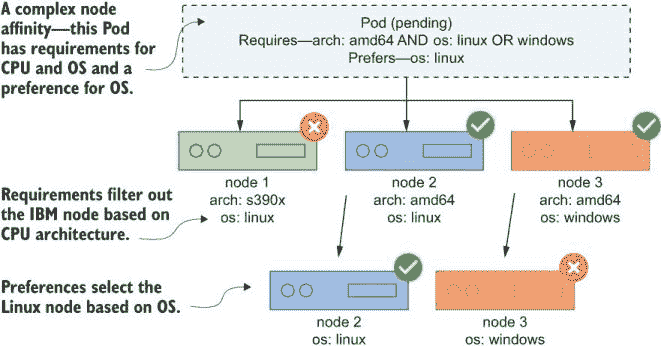

图 19.6 你可以使用不同的节点标签使用多个条件来表示亲和力规则。

你应该很好地掌握亲和力，因为你可以用它不仅仅与节点一起使用：Pod 可以表达对其他 Pod 的亲和力，以便它们被调度在同一个节点上，或者反亲和力，以便它们被调度在不同的节点上。这种能力支持两个常见的用例。第一个是你希望不同组件的 Pod 被放置在一起以减少它们之间的网络延迟。第二个是你希望同一组件的副本在集群中分布以增加冗余。列表 19.5 显示了随机数 Web 应用程序的第一个场景。

列表 19.5 web.yaml，Pod 亲和力以放置组件

```
affinity:                           # Affinity rules for Pods use
  podAffinity:                      # the same spec as node affinity.
    requiredDuringSchedulingIgnoredDuringExecution:
      - labelSelector:
          matchExpressions:         # This looks for the app and
            - key: app              # component labels to match.
              operator: In
              values:
                - numbers
            - key: component
              operator: In
              values:
                - api
        topologyKey: "kubernetes.io/hostname"  
```

Pod 亲和力遵循与节点亲和力相同的规范，如果你真的想让你团队感到困惑，你可以包括两者。列表 19.4 是一个必需的规则，所以如果调度器无法满足它，Pod 将被留下等待。匹配表达式作为一个标签选择器工作，所以这意味着 Pod 必须被调度在已经运行具有标签`app=numbers`和`component=api`的 Pod 的节点上。这就是放置，所以只剩下*拓扑键*来描述，这将需要它自己的段落。

拓扑描述了你的集群的物理布局——节点所在的位置——这在不同细节级别的节点标签中设置。主机名标签始终存在，并且对于节点是唯一的；集群可以添加自己的细节。云提供商通常会添加区域和区域标签，这些标签说明了服务器所在的位置；本地集群可能会添加数据中心和机架标签。拓扑键设置亲和力应用的水平：主机名实际上意味着将 Pod 放在同一个节点上，而区域则意味着将 Pod 放在与另一个 Pod 在同一区域内的任何节点上。主机名是一个足够好的拓扑键来观察亲和力的作用，你可以在单个节点上做到这一点。

现在试试看 部署随机数应用程序，使用 Pod 亲和力以确保 Web 和 API Pod 在同一个节点上运行。

```
# remove the taint we applied to simplify things:
kubectl taint nodes --all kiamol-disk=hdd:NoSchedule-

# deploy the random-number app:
kubectl apply -f numbers/

# confirm that both Pods are scheduled on the same node:
kubectl get pods -l app=numbers -o wide
```

您可以在图 19.7 中看到，这正如预期的那样——我只有一个节点，当然，两个 Pod 都调度在那里。在一个更大的集群中，web Pod 将保持挂起状态，直到 API Pod 被调度，然后它会跟随 API Pod 到同一个节点。如果该节点没有运行 web Pod 的容量，它将保持挂起状态，因为需要这个规则（一个首选规则将允许 Pod 在没有 API Pod 的节点上运行）。

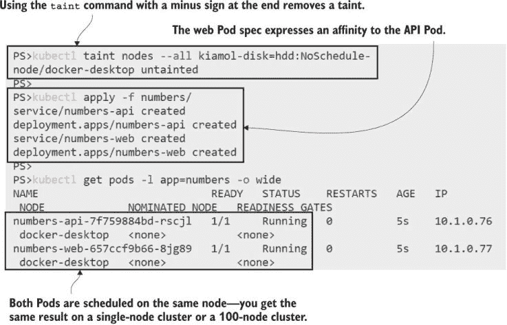

图 19.7 Pod 亲和性控制工作负载相对于现有工作负载的放置。

反亲和性使用相同的语法，您可以使用它来使 Pod 远离节点或其他 Pod。反亲和性在需要高可用性的大规模组件中非常有用——回想一下第八章中的 Postgres 数据库。该应用程序使用了一个具有多个副本的 StatefulSet，但 Pod 本身可能都最终在同一个节点上。这违背了使用副本的全部目的，因为如果节点宕机，它会带走所有的数据库副本。反亲和性可以用来表达规则：让我远离像我这样的其他 Pod，这样可以将 Pod 分散到不同的节点上。我们不会回到 StatefulSet；我们将保持简单，为随机数 API 部署该规则，并看看扩容时会发生什么。

现在尝试一下：更新 API 部署以使用 Pod 反亲和性，使所有副本都在不同的节点上运行。然后扩容并确认状态。

```
# add an antiaffinity rule to the API Pod:
kubectl apply -f numbers/update/api.yaml

# print the API Pod status:
kubectl get pods -l app=numbers

#scale up the API and the web components:
kubectl scale deploy/numbers-api --replicas 3
kubectl scale deploy/numbers-web --replicas 3

# print all the web and API Pod statuses:
kubectl get pods -l app=numbers 
```

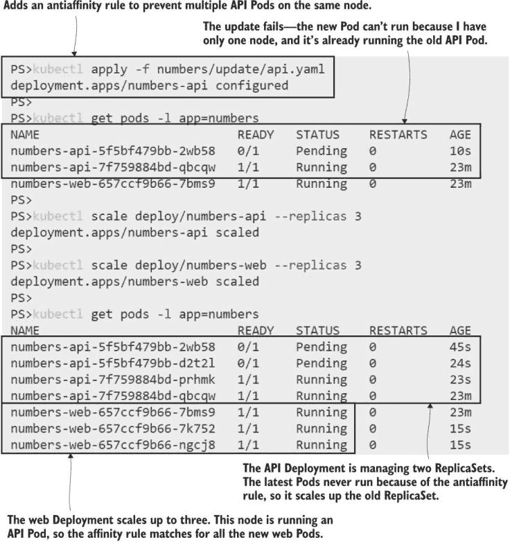

图 19.8 在单节点集群上，节点反亲和性产生了意外的结果。

您需要仔细查看图 19.8，因为结果可能并非您所预期。更新的 API 部署创建了一个新的 ReplicaSet，它创建了一个新的 Pod。该 Pod 保持挂起状态，因为反亲和性规则不允许它在与现有 API Pod（它试图替换的那个 Pod）相同的节点上运行。当 API 部署扩容时，另一个副本确实运行了，因此我们在同一节点上有两个 API Pod——但这是由前一个 ReplicaSet 创建的，它不包括反亲和性规则。部署试图在两个 ReplicaSet 之间遵守三个副本的请求，但由于新 Pod 没有上线，它又扩展了旧 Pod 的另一个副本。

那么 web Pods 呢——您期望看到三个都在运行吗？好吧，不管您是否期望，现在有三个正在运行。亲和性和反亲和性规则只检查 Pod 标签的存在，而不是 Pod 的数量。web Pod 的亲和性规则表示它需要在有 API Pod 的地方运行，而不是只有一个 API Pod 的地方。如果您只想有一个 web Pod 与一个 API Pod 一起运行，您需要在 web Pod 规范中为其他 web Pods 设置反亲和性规则。

调度偏好变得复杂，因为调度器在决策中考虑了众多因素。你简单的亲和规则可能不会按预期工作，你可能需要调查污点、节点标签、Pod 标签、资源限制和配额——甚至控制平面节点的调度器日志文件。记住，如果调度器找不到节点，所需的规则将阻止你的 Pod 运行，所以考虑有一个备份首选规则。这个主题是本章中较为复杂的话题之一；接下来，我们将探讨如何让 Kubernetes 为我们自动调度更多的副本，这实际上比尝试控制工作负载放置要简单得多。

## 19.3 使用自动扩展控制容量

Kubernetes 可以通过添加或删除 Pod 来自动扩展你的应用程序。这种扩展是**水平**的，因为它利用了现有的节点；还有集群扩展，它添加和删除节点，但你主要会在云平台上看到它。我们将坚持使用水平 Pod 自动扩展，它的用户体验与我们在第十六章中讨论的 NetworkPolicy 对象略有不同。你可以部署一个自动扩展规范，描述你希望如何扩展 Pod，但除非 Kubernetes 可以检查现有 Pod 的负载，否则它不会对此采取任何行动。更广泛地说，Kubernetes 项目提供了 metrics-server 组件来进行基本的负载检查——一些发行版默认包含它；对于其他发行版，你需要手动部署它。

现在尝试一下 确认你的集群是否已安装 metrics-server 组件，如果没有，部署它，启用指标自动扩展，并使用 kubectl `top`命令。

```
# top shows resource usage if you have metrics-server installed:
kubectl top nodes

# if you get an error about “heapster,” 
# you need to install metrics-server:
kubectl apply -f metrics-server/

# wait for it to spin up:
kubectl wait --for=condition=ContainersReady pod -l k8s-app=metrics-server -n kube-system

# it takes a minute or so for collection to start:
sleep 60

# print the metric-server Pod logs:
kubectl logs -n kube-system -l k8s-app=metrics-server --tail 2

# look at node usage again:
kubectl top nodes
```

图 19.9 显示，我的实验室环境尚未部署`metrics-server`（它不是 Docker Desktop 或 Kind 的一部分，但已安装在 K3s 中），但幸运的是，补救措施比选择 Pod 网络简单得多。`metrics-server`部署是一个单一实现：如果你从 kubectl `top`命令中获得响应，你的集群正在收集所有用于自动扩展所需的指标；如果没有，只需部署`metrics-server`。

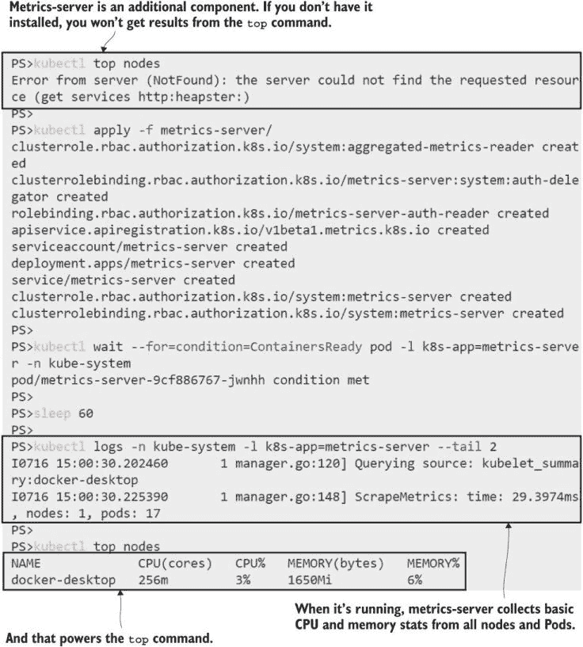

图 19.9 `metrics-server`收集 CPU 和内存统计数据，但它是一个可选组件。

不要将这些与我们第十四章中设置的 Prometheus 指标混淆。`metrics-server`收集的统计数据仅跟踪基本的计算资源，CPU 和内存，并且当被查询时只返回当前值。如果你的工作负载是 CPU 或内存密集型，这是一个用于自动扩展的简单选项，因为 Kubernetes 知道如何使用它而无需任何额外配置。列表 19.6 显示了使用 CPU 作为扩展指标的 Pod 自动扩展规范。

列表 19.6 hpa-cpu.yaml，基于 CPU 负载的水平 Pod 自动扩展

```
apiVersion: autoscaling/v1
kind: HorizontalPodAutoscaler            # I love this name.
metadata:
  name: pi-cpu
spec:
  scaleTargetRef:                        # The target is the controller
    apiVersion: apps/v1                  # to scale--this targets the
    kind: Deployment                     # Pi app Deployment.
    name: pi-web
  minReplicas: 1                         # Range of the replica count
  maxReplicas: 5
  targetCPUUtilizationPercentage: 75     # Target CPU usage
```

自动扩展参数定义在单独的对象中，即 HorizontalPodAutoscaler (HPA)，它作用于一个缩放目标——例如 Deployment 或 StatefulSet 这样的 Pod 控制器。它指定了副本数量的范围和期望的 CPU 利用率。自动扩展器通过监控所有当前 Pod 的平均 CPU 使用率（作为 Pod 规范中请求 CPU 数量的百分比）来工作。如果平均利用率低于目标，副本数量会减少，直到最小值。如果利用率高于目标，则会添加新的副本，直到最大值。我们在这本书中使用的 Pi web 应用是计算密集型的，因此它将展示自动扩展是如何工作的。

现在尝试一下 部署带有 HPA 的 Pi web 应用，并检查 Pods 的状态。

```
# deploy the manifests:
kubectl apply -f pi/

# wait for the Pod to start:
kubectl wait --for=condition=ContainersReady pod -l app=pi-web

# print the status of the autoscaler:
kubectl get hpa pi-cpu
```

现在，Pi 应用正在运行，规范请求了 125 毫核的 CPU（一个核心的八分之一）。最初，有一个副本，这是在 Deployment 规范中设置的，现在 HPA 正在监视是否需要创建更多的 Pods。HPA 从`metrics-server`获取数据，需要一两分钟才能跟上。你可以在图 19.10 中看到，当前的 CPU 利用率未知，但很快就会变成 0%，因为 Pod 没有进行任何工作。

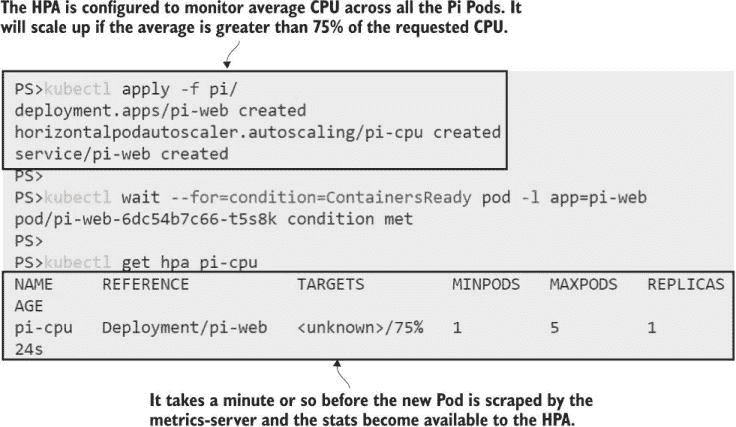

图 19.10 HPA 与 metrics-server 合作收集统计数据，并与 Deployment 一起管理缩放。

这个 Pod 规范有一个 250 毫核的 CPU 限制，是请求量的两倍。向计算 Pi 的请求发送一个高精度的十进制数，你很快就会用完 0.25 个核心，平均利用率会急剧上升到 200%。然后 HPA 会启动并扩展，添加新的副本以帮助处理负载。

现在尝试一下 运行一个脚本，对 Pi web 应用进行一些并发调用，请求 10 万位十进制数，造成高 CPU 负载。确认 HPA 进行了扩展。

```
# run the load script--on Windows: 
.\loadpi.ps1

# OR on Linux/macOS:
chmod +x ./loadpi.sh && ./loadpi.sh

# give the metrics-server and HPA time to work:
sleep 60

# confirm that the Deployment has been scaled up:
kubectl get hpa pi-cpu

# print the Pod compute usage:
kubectl top pods -l app=pi-web
```

额外的 Pods 是否真正帮助处理负载取决于你的应用程序。在这种情况下，接收 Web 请求的任何 Pod 都会处理计算直到完成，因此新的 Pod 不会共享现有的负载。你可以在图 19.11 中看到，原始 Pod 正在以大约最大 250 毫核的速度运行，而新的 Pod 在 1 毫核下什么也不做。但那些额外的 Pod 增加了应用程序的容量，并且它们可以处理任何新到达的请求。

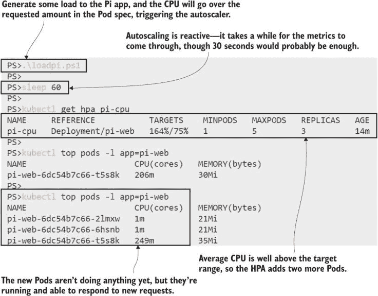

图 19.11 自动扩展的实际应用：当 CPU 使用率激增时，HPA 触发新的 Pods。

当你运行这个练习时，你应该看到类似的结果。HPA 会扩展到三个 Pod，在它进一步扩展之前，应用程序返回 Pi 响应，CPU 利用率下降，它不再需要扩展。HPA 每 15 秒添加更多的 Pod，直到利用率在目标范围内。当一个 Pod 达到最大容量而另外两个 Pod 无所事事时，平均 CPU 下降到 66%，这低于 75%的目标，所以 HPA 不会添加更多的 Pod（你可以重复几次负载脚本以确认它达到五个 Pod 的峰值）。当你停止发送请求时，负载将再次下降到 0%，然后 HPA 等待确保应用程序在五分钟内保持在目标范围内，然后它将缩放到一个副本。

我们这里有几个参数：在扩展或缩放之前等待多长时间，添加或删除多少 Pod，添加或删除 Pod 的速度有多快。在版本 1 的 HPA 规范中，这些值都不能更改，但在版本 2 规范中它们都被公开了。新的规范仍然是 Kubernetes 1.18 中的 beta-2 功能，这是一个相当重大的变化。基于 CPU 的单一缩放选项已被替换为通用的指标部分，并且可以控制缩放行为。列表 19.7 显示了更新 Pi HPA 的新规范。

列表 19.7 hpa-cpu-v2.yaml，版本 2 中的扩展 HPA 规范

```
metrics:                        # Metrics spec inside a version 2 HPA
- type: Resource
  resource:
    name: cpu                   # The resource to monitor is generic.
    target:                     # This checks for CPU, but you can use
      type: Utilization         # other metrics. 
      averageUtilization: 75
  behavior:
    scaleDown:                            # This sets the parameters 
      stabilizationWindowSeconds: 30      # when the HPA is scaling 
      policies:                           # down--it waits for 30 seconds
      - type: Percent                     # and scales down by 50% 
        value: 50                         # of the Pod count.
        periodSeconds: 15
```

我说自动缩放比亲和性更简单，但我的意思只是版本 1。版本 2 规范复杂，因为它支持其他类型的指标，并且你可以使用 Prometheus 指标作为缩放决策的来源。你需要更多的组件来实现这一点，所以我不深入细节，但请记住这是一个选项。这意味着你可以根据你收集的任何指标进行缩放，比如传入 HTTP 请求的速率或队列中的消息数量。

我们在这里坚持 75%的 CPU 目标，它使用相同的`metrics-server`统计信息，但我们已经调整了缩放行为，所以一旦处理完 Pi 请求，我们会看到 Pod 数量下降得更快。

现在试试看 更新 HPA 以使用版本 2 规范；这为缩放事件设置了一个较短的稳定期，所以你会看到 Pod 计数下降得更快。

```
# update the HPA settings:
kubectl apply -f pi/update/hpa-cpu-v2.yaml

# run the load script again--on Windows:
.\loadpi.ps1 

# OR on macOS/Linux:
./loadpi.sh

# wait for the HPA to scale up:
sleep 60

# confirm there are more replicas:
kubectl get hpa pi-cpu # go up

# there’s no more load, wait for the HPA to scale down:
sleep 60

# confirm there’s only one replica:
kubectl get hpa pi-cpu

# print the Deployment status:
kubectl get deploy pi-web
```

在这个练习中，你会看到缩放行为以相同的方式工作，因为版本 2 的默认值与版本 1 的默认值相同。这次缩放不会花费那么长时间，尽管你可能看到——如图 19.12 所示——查询 HPA 状态并不像部署本身那样快速反映变化。

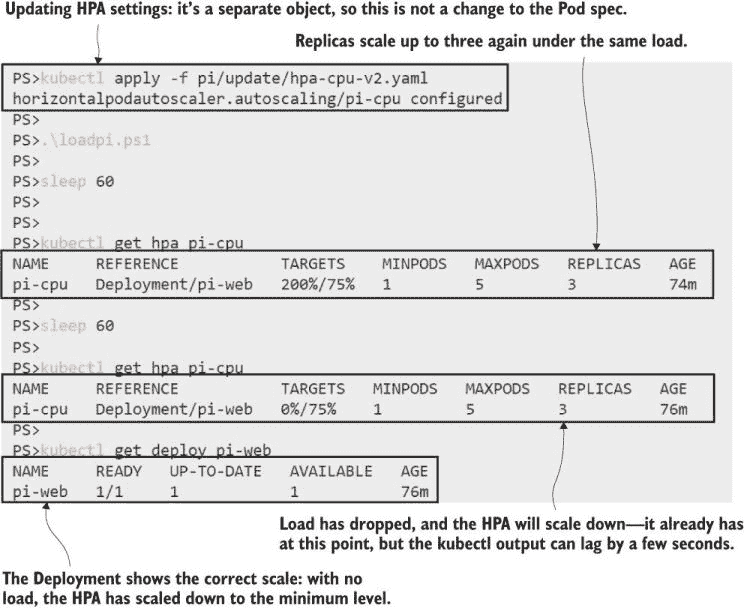

图 19.12 新的 HPA 规范倾向于快速缩放，适合突发性工作负载。

改变行为可以让您模拟 HPA 如何响应扩展事件。默认值是一个相当保守的版本，快速扩展和缓慢缩减，但您可以将其切换，使扩展更渐进，缩减更立即。“立即”并不是真的，因为收集的指标和提供给 HPA 之间的延迟只有几十秒。HPA 针对一个特定的目标，因此您可以为应用程序的不同部分设置不同的扩展规则和速率。

我们已经涵盖了 Pod 放置、扩展和缩减，而 HPA 只是指示控制器进行扩展，因此 Pod 规范中的任何调度要求都适用于所有 Pod。工作负载管理中的最后一个主题是*抢占*，即故意导致 Pod 失败的过程。

## 19.4 使用抢占和优先级保护资源

有时 Kubernetes 意识到一个节点工作过于努力，它会*抢占*一些 Pod 可能会失败，并提前关闭它们，给节点时间恢复。这是*驱逐*，仅在极端情况下发生，如果集群不采取行动，节点可能会变得无响应。被驱逐的 Pod 仍然留在节点上，这样您就有证据来追踪问题，但 Pod 容器被停止并移除，释放内存和磁盘。如果 Pod 由控制器管理，将创建一个替换 Pod，该 Pod 可能被调度到不同的节点上。

如果您在资源规格、配额、调度和扩展方面都做错了，就会发生抢占，因此节点运行了比它能管理的更多 Pod，并且内存或磁盘资源不足。如果发生这种情况，Kubernetes 认为该节点处于压力之下，并且驱逐 Pod 直到压力情况结束。同时，它会在节点上添加污点，以防止新的 Pod 被调度到该节点上。随着压力情况的缓解，它会移除污点，节点能够接受新的工作负载。

在演示或练习中，无法伪造内存或磁盘压力，因此要了解这是如何工作的，我们需要将您的实验室内存使用率最大化。与磁盘相比，使用内存更容易做到这一点，但这仍然不容易；默认情况下，当节点可用内存少于 100 MB 时，就会开始驱逐，这意味着几乎用完了您的所有内存。如果您想跟随本节中的练习，您真的需要在虚拟机中启动一个单独的实验室，这样您就可以调整 Kubernetes 设置并在虚拟机上而不是在您的机器上最大化内存。

现在尝试一下 使用 Vagrant 启动一个专用虚拟机。此设置已安装 Kind 并分配了 3 GB 的 RAM。创建一个新的 Kind 集群，并使用自定义 kubelet 配置降低驱逐的内存阈值。

```
# from the kiamol source root, create a VM with Vagrant:
cd ch01/vagrant/

# create the new VM:
vagrant up

# connect to the VM:
vagrant ssh

# switch to this chapter’s source inside the VM:
cd /kiamol/ch19

# create a customized Kind cluster:
kind create cluster --name kiamol-ch19--config ./kind/kiamol-ch19-config.yaml --image kindest/node:v1.18.8 

# wait for the node to be ready:
kubectl -n kube-system wait --for=condition=Ready node --all

# print the VM’s memory stats:
./kind/print-memory.sh
```

本练习中的脚本使用与 kubelet 相同的逻辑来确定它可以访问多少空闲内存。您可以在图 19.13 中看到，我的虚拟机报告总共有不到 3 GB 的内存和不到 1.5 GB 的空闲内存，这正是 Kubernetes 所看到的。

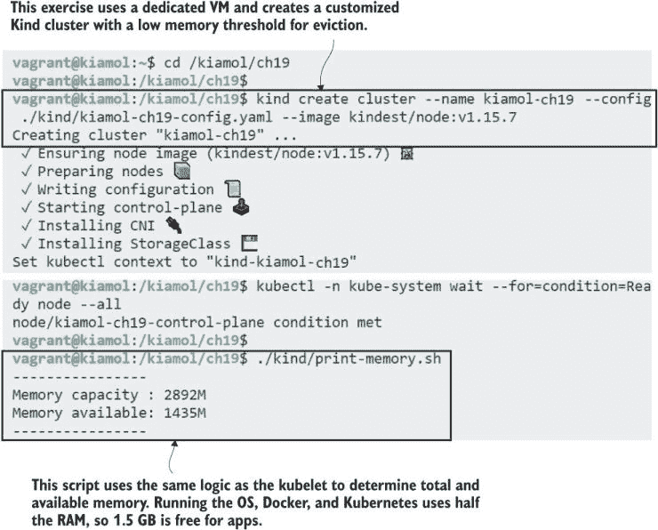

图 19.13 如果你想测试内存压力，最好在一个专用环境中进行。

如果你不想为这些练习启动一个单独的虚拟机，那也行——但请记住默认的内存阈值是 100 MB。为了强制内存压力情况，你需要分配你机器上几乎所有的内存，这可能会也导致 CPU 峰值，并使整个系统变得无响应。你可以通过检查 kubelet 的实时配置来确认内存限制；它有一个可以通过使用 kubectl 代理请求的 HTTP 端点。

现在试试看 查询节点的配置 API 以查看 kubelet 的活动设置，并确认驱逐级别已被设置。

```
# run a proxy to the Kubernetes API server:
kubectl proxy

# in a new terminal connect to the VM again: 
cd ch01/vagrant/
vagrant ssh

# make a GET request to see the kubelet config:
curl -sSL "http://localhost:8001/api/v1/nodes/$(kubectl get node -o jsonpath={‘.items[0].metadata.name’})/proxy/configz"
```

在这个环境中，kubelet 被配置为当节点上只有 40%的内存可用时触发驱逐，正如你在图 19.14 中看到的。这是一个故意设置得很低的阈值，这样我们就可以轻松地触发驱逐；在生产环境中，你会将其设置得更高。如果你使用了一个没有在 kubelet 中明确设置的不同的实验室环境，你将使用默认的 100 MB。

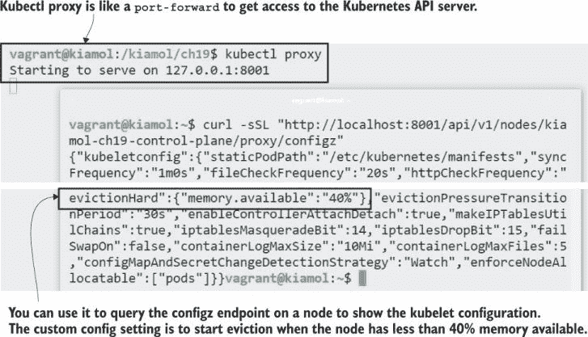

图 19.14 低级设置在 kubelet 配置中指定，你可以使用代理查看。

警告已经足够了……好吧——还有一个：当我计划这些练习时，试图强制内存压力时，我破坏了我的 Docker Desktop 环境。Kubectl 没有响应，我不得不卸载并重新安装一切。让我们继续触发预选。我已经构建了一个容器镜像，其中包含了 Linux 的`stress`工具，并且我有一个包含四个副本的 Deployment 规范，每个副本分配 300 MB 的内存。这应该会让节点只剩下不到 40%的总内存可用，并将其推入内存压力状态。

现在试试看 运行一个分配大量内存的应用程序，看看当节点处于内存压力时，Kubernetes 是如何驱逐 Pods 的。

```
# the stress Pods will allocate 1.2 GB of RAM:
kubectl apply -f stress/stress.yaml

# wait for them all to start:
kubectl wait --for=condition=ContainersReady pod -l app=stress

# print the node’s memory stats:
./kind/print-memory.sh

# list the Pods:
kubectl get pods -l app=stress

# remove the Deployment:
kubectl delete -f stress/stress.yaml
```

预选发生得很快，压力状态之间的转换也发生得很快。我在图 19.15 中剪掉了输出，因为我运行 Pod `list`命令太慢了，等到我运行的时候，节点已经驱逐了 23 个 Pod。

为什么会有这么多驱逐？Kubernetes 为什么不在节点处于内存压力时只驱逐一个 Pod，而将替换 Pod 留在挂起状态？它确实这样做了。但是，一旦 Pod 被驱逐，它就释放了一大批内存，节点迅速脱离了内存压力。与此同时，Deployment 创建了一个新的 Pod 来替换被驱逐的 Pod，这个 Pod 运行在不再被标记的节点上，但它立即分配了更多的内存，并再次触发了压力开关，导致另一个驱逐。由于这个应用程序在启动时分配了大量内存，这种情况可能会快速发生，但如果你的集群过载，使用真实的应用程序也可能出现相同的情况。

在生产环境中，预占事件应该是罕见的，但如果它确实发生了，你想要确保你的最不重要的工作负载被驱逐。kubelet 通过对它们进行排名来决定在内存压力情况下驱逐哪个 Pod。这种排名考虑了 Pod 相对于 Pod 规范中请求的内存量以及 Pod 的 *优先级类别*。优先级类别，本章的最后一个新概念，是分类你的工作负载重要性的简单方法。列表 19.8 显示了一个具有低值的自定义优先级类别。

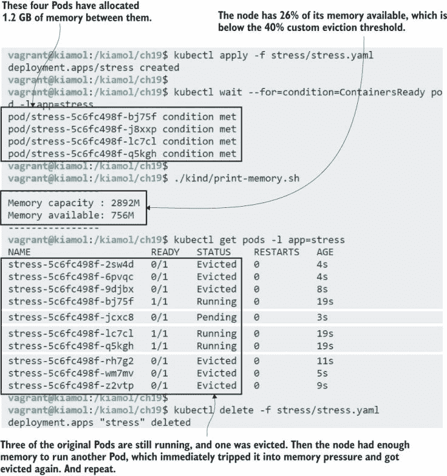

图 19.15 许多 Pods。资源密集型 Pods 可能会导致驱逐/创建循环。

列表 19.8 low.yaml，一个用于低优先级工作负载的类别

```
apiVersion: scheduling.k8s.io/v1
kind: PriorityClass
metadata:
  name: kiamol-low    # The Pod spec uses this name to state its priority.
value: 100            # Priority is an integer up to 1 billion.
globalDefault: true
description: "Low priority--OK to be evicted"
```

数字值是决定优先级的因素：越大意味着越重要。Kubernetes 没有任何默认的优先级类别，所以如果你想保护更重要的工作负载，你需要自己映射。你通过在 Pod 规范中添加 `PriorityClassName` 字段来为一个工作负载分配优先级。在最后的练习中，我们将部署压力应用的两个版本：一个具有高优先级，一个具有低优先级。当内存压力到来时，我们将看到低优先级 Pods 被驱逐。

现在试试看 再次运行压力练习，但这次使用两个 Deployment，每个 Deployment 运行两个 Pods。内存分配是相同的，但 Pods 具有不同的优先级。

```
# create the custom priority classes:
kubectl apply -f priority-classes/

# deploy apps with high and low priorities:
kubectl apply -f stress/with-priorities/

# wait for the Pods to run:
kubectl wait --for=condition=ContainersReady pod -l app=stress
wait

# print the memory stats:
./kind/print-memory.sh

# confirm that the node is under memory pressure:
kubectl describe node | grep MemoryPressure

# print the Pod list:
kubectl get pods -l app=stress
```

当我运行练习时，一切工作得非常完美，你可以在图 19.16 中看到输出。节点可以管理三个 Pods 而不会陷入内存压力，被驱逐的第四个 Pod 总是来自低优先级规范；高优先级 Pods 继续运行。

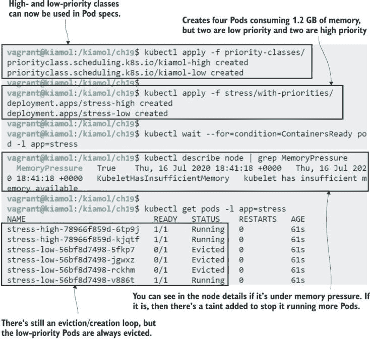

图 19.16 添加优先级类别是保护关键 Pod 避免驱逐的简单保障措施。

不仅优先级类别可以保持高优先级 Pods 运行。所有 Pods 都使用了比它们请求的更多内存，所以它们都有资格被驱逐。这就是考虑优先级的时候。如果所有有资格的 Pods 具有相同的优先级（或没有优先级），Kubernetes 将根据实际使用量超过请求量的多少来做出选择，从而驱逐最严重的违规者。在 Pod 规范中包含资源请求以及限制是很重要的，但优先级类别是保护更重要工作负载的有用保护措施。

这是对工作负载管理主要方面的广泛巡礼。它们都是你将在生产中使用的功能，我们将通过回顾它们能提供什么以及它们如何协同工作来结束本章。

## 19.5 理解管理工作负载的控制方法

调度、自动扩展和驱逐都是比我们这里所涵盖的更高级的话题，它们具有更多的细微差别。你肯定会在你的 Kubernetes 之旅中使用它们，因此尽早引入一些控制措施是值得的。它们解决你在管理你的应用程序时遇到的不同问题，但它们都会相互影响，所以你需要谨慎使用。

在大型集群中，亲和性是你将使用最多的功能。节点亲和性允许你通过比仅使用命名空间更严格的隔离来分离工作负载，而 Pod 亲和性允许你模拟应用程序的可用性要求。你可以将 Pod 亲和性与节点拓扑结构结合使用，以确保副本在不同的故障域中运行，这样即使一个机架或区域丢失，也不会导致你的应用程序崩溃，因为其他 Pod 在不同的区域运行。记住，所需的亲和性是调度器的硬规则：如果你要求 Pod 在不同的区域，而你只有三个区域，第四个副本将永远处于挂起状态。

如果你的应用程序受 CPU 限制，自动扩展是一个很棒的功能，也很容易使用。然后你可以使用默认的 `metrics-server` 和简单的版本 1 HPA，确保你的 Pod 规范中有 CPU 请求。如果你想要基于更高级别的指标进行扩展，事情会变得更加复杂，但这绝对值得调查。当关键服务级别未达到时，应用程序自动扩展是 Kubernetes 的一个主要好处，这也是在生产环境中建立时应该努力实现的目标。扩展只是增加或减少副本的数量，所以如果你在规范中有亲和性规则，你需要确保它们可以在最大扩展级别上得到满足。

预占是 Kubernetes 处理内存或磁盘不足节点的安全机制。CPU 则不同，因为 Pod 可以通过限制来回收 CPU，而不需要停止容器。Kubernetes 通过驱逐 Pod 来缓解内存或磁盘压力，如果你的集群和应用程序大小合适，你很少会看到这种情况。你应该在你的 Pod 规范中包含资源请求，以便驱逐最严重的违规者，如果你有一些比其他工作负载更重要的工作负载，请考虑优先级类别。如果你确实遇到了预占情况，你需要迅速调查以确保节点不会不断在压力下翻转，不断添加然后驱逐 Pod（我们添加了节点压力指标到第十四章的集群仪表板，就是为了这个原因）。

那就是关于工作负载管理的一切。现在是时候清理集群（们）以腾出空间进行实验室操作了。

现在试试吧 清理你的主要实验室环境；如果你创建了一个自定义环境，它可以被移除。

```
# remove objects on your main cluster:
kubectl delete all,priorityclass,hpa -l kiamol=ch19

# if you deployed the metrics-server in section 19.3, remove it:
kubectl delete -f metrics-server/

# if you created a new VM in section 19.4, it can go too:
cd ch01/vagrant/
vagrant destroy
```

## 19.6 实验室

我们将使用 Pi 应用程序进入生产！在这个实验室中，你的任务是添加到规范中，这样我们就可以控制工作负载。这是我们需要的设置：

+   由于数据主权问题，应用程序必须在欧洲地区运行。

+   它应该基于目标 CPU 利用率 50% 自动扩展。

+   必须运行两个到五个副本。

+   负载最好在欧洲地区多个节点之间分散。

你可以在本章的练习中找到所有这些示例，除了一个，你可能需要查看 API 文档来了解如何构建最后一条规则。记住，节点拓扑是通过标签完成的，并且你可以为你的节点添加任何你想要的标签。我的解决方案在通常的位置：[`github.com/sixeyed/kiamol/blob/master/ch19/lab/README.md`](https://github.com/sixeyed/kiamol/blob/master/ch19/lab/README.md).
