# 20 通过自定义资源和 Operators 扩展 Kubernetes

Kubernetes 的核心是一个高可用数据库和一个具有一致工作方式的 REST API。当你通过 API 创建一个 Pod 时，其定义会被存储在数据库中，并且控制器会收到通知，知道它需要将 Pod 分配给一个节点以使其运行。这是一个通用的模式，其中不同的控制器处理不同类型的对象，并且它是可扩展的，因此你可以添加自己的资源定义和自定义控制器来作用于这些资源。这可能听起来像是一个晦涩难懂的话题，但许多产品都会扩展 Kubernetes 以使产品本身更容易使用。这也是一种直接的方式来定制 Kubernetes，使其在你的组织中工作得更好。

自定义资源和控制器可以隐藏应用程序中的许多复杂性，在本章中，你将了解如何定义和操作它们。定义部分很简单，但控制器需要自定义代码。我们不会专注于代码，但我们会提供一些自定义化的示例，以便你可以看到它们能做什么。我们还将在本章中介绍 Operator 模式，这是一种使用自定义资源和控制器来自动化应用程序部署和持续操作任务的方法。

## 20.1 如何通过自定义资源扩展 Kubernetes

kubectl 命令与 Kubernetes REST API 密切对应。当你运行 `kubectl get` 时，它会向 API 发送请求以获取资源或资源列表。所有资源都有一组标准的操作可用，并且根据第十七章中介绍的 RBAC 规则，它们被定义为动词：`create`（创建）、`get`（获取）、`list`（列出）、`watch`（监视）和 `delete`（删除）。当你定义 Kubernetes 中的自定义资源时，它会自动支持 API 中的所有这些操作；Kubernetes 客户端也理解自定义资源，因此你可以像处理任何其他对象一样使用 kubectl 与它们一起工作。图 20.1 展示了集群如何支持自定义资源。

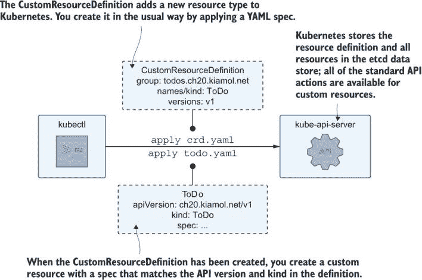


你通过在 YAML 中指定资源的类型和在规范中所有字段来定义标准的 Kubernetes 对象——Pod 规范有一个容器列表，容器规范有一个镜像名称和一组端口。Kubernetes 将这些字段存储在模式中，因此它知道资源的结构并可以验证新对象。这就是 API 版本字段发挥作用的地方——HorizontalPodAutoscaler 资源的第 1 版结构与 v2beta2 不同。自定义资源也有一个已知的结构，你可以在自定义资源定义（CRD）对象中创建自己的模式。列表 20.1 展示了一个简单的 CRD，用于将待办事项记录为 Kubernetes 对象。

列表 20.1 todo-crd.yaml，一个用于在 Kubernetes 中存储待办事项的 CRD

```
apiVersion: apiextensions.k8s.io/v1
kind: CustomResourceDefinition     
metadata:                           # The name of the CRD needs to match
  name: todos.ch20.kiamol.net       # the names in the resource spec.
spec:
  group: ch20.kiamol.net      # Classifies a set of CRDs
  scope: Namespaced           # Can be clusterwide or namespaced
  names:                      # The names are how you refer to  
    plural: todos             # custom resources in YAML and kubectl.
    singular: todo
    kind: ToDo
  versions:                   # You have multiple versions.
    - name: v1                # Each version has a schema.
      served: true            # Makes resources available in the API
      storage: true           # Saves resources in etcd
      schema:
        openAPIV3Schema:
          type: object
          properties:
            spec:             # The schema sets the structure of the
              type: object    # custom resource--ToDo objects have a
              properties:     # spec field, which has an item field.
                item:
                  type: string 
```

CRD 结构本身很冗长，尤其是模式部分读起来特别别扭，但它使用标准的 JSONSchema 项目来定义资源的结构，你的定义可以像你需要的那样复杂或简单。列表 20.1 中的 CRD 在视觉上可能有些刺眼，但它构成了一个简单的自定义资源。列表 20.2 展示了一个使用这种结构的 ToDo 项目。

列表 20.2 todo-ch20.yaml，一个 ToDo 自定义资源

```
apiVersion: "ch20.kiamol.net/v1"   # Group name and version of the CRD
kind: ToDo                         # The resource type  
metadata:                          # Standard metadata 
  name: ch20
spec:                              
  item: "Finish KIAMOL Ch20"       # The spec needs to match the CRD schema.
```

这看起来就像一个正常的 Kubernetes YAML，这正是 CRD 的全部意义——在 Kubernetes 中存储你自己的资源，并使它们感觉像标准对象。API 版本标识它为本书这一章节中的自定义资源，版本为 1。元数据是标准的元数据，因此它可以包括标签和注解，而 spec 是在 CRD 中定义的自定义结构。现在我们已经有了足够的 YAML，让我们将其付诸实践，并使用 Kubernetes 作为我们的待办事项列表应用程序。

现在试试看 部署一个自定义资源定义和一些资源，看看你是如何使用 kubectl 与它们一起工作的。

```
# switch to this chapter’s source:
cd ch20

# deploy the CRD:
kubectl apply -f todo-custom/

# print CRD details:
kubectl get crd -l kiamol=ch20

# create some custom resources:
kubectl apply -f todo-custom/items/

# list all the resources:
kubectl get todos
```

你可以在图 20.2 中看到，你与自定义资源的工作方式就像与其他任何资源一样。一旦 CRD 部署完成，API 现在支持 ToDo 对象，你可以通过应用 YAML 来创建项目。Kubectl 是管理自定义资源的工具，现在 `get`、`describe` 和 `delete` 命令对 ToDo 对象和 Pods 的工作方式相同。

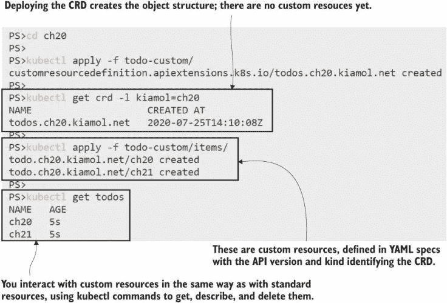

图 20.2 中的 CRDs 和自定义资源是用 YAML 描述并通过 kubectl 部署的。

CRD 规范丰富，允许你在资源周围构建大量逻辑，包括验证规则、子资源和多个版本。我们不会深入到那个层面的细节，但你可以确信自定义资源是 Kubernetes 中的一个成熟特性，它提供了你管理不断发展的对象定义集所需的所有功能。CRD 的目的是提供简化的用户体验，我们可以对 ToDo CRD 进行一些小的修改，使其更易于使用。

现在试试看 CRD 规范的更新使得 kubectl 输出更加有用。这次更新不会影响自定义资源；它只是增加了打印的列。

```
# update the CRD, adding output columns:
kubectl apply -f todo-custom/update/

# list the to-do resources again:
kubectl get todos

# delete one of the resources:
kubectl delete todo ch21

# show the detail of the other resource:
kubectl describe todo ch20
```

这个练习通过添加额外的打印列更新了 CRD，因此 API 在 `get` 请求中返回了额外的信息。你可以在图 20.3 中看到，这现在是一个功能齐全的待办事项列表应用程序。它甚至允许你删除项目，所以它比我们在本书中运行的待办事项 Web 应用程序更好。

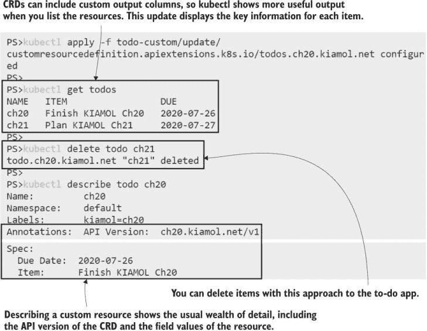

图 20.3 是一个由 Kubernetes 驱动的完全功能的待办事项应用程序，没有任何自定义代码！

这对于简单的演示来说是可以的，我们可能会分心编写一个自定义控制器，该控制器监视这些资源，将项目添加到你的 Google 日历中，并在到期时发送电子邮件提醒，但我们不会这样做。这不是自定义资源的良好用途，因为我们存储的对象和它们触发的操作与 Kubernetes 无关；我们不是与其他对象集成或扩展集群的功能——我们只是在将 Kubernetes 作为一个过度指定的内容管理系统使用。我们可以做得更好，我们将从清理 ToDo 资源开始。

现在试试看：移除待办 CRD，并确认自定义资源也被删除了。

```
# list the CRDs registered in your cluster:
kubectl get crds

# delete the to-do item CRD:
kubectl delete crd todos.ch20.kiamol.net

# try to list the to-do items:
kubectl get todos
```

你可以在这个练习和图 20.4 中看到，没有 CRD（Custom Resource Definition）自定义资源就无法存在——Kubernetes 不会存储任何未知对象。删除 CRD 会删除所有其资源，所以如果你使用了自定义资源，你需要确保围绕 CRD 本身的 RBAC（Role-Based Access Control）权限是严格的。


图 20.4 当定义自定义资源的 CRD 被移除时，自定义资源也会被移除。

我们将继续添加不同的 CRD，并将其与自定义控制器配对，以向 Kubernetes 添加用户认证系统。

## 20.2 使用自定义控制器触发工作流程

你从第十七章知道，生产 Kubernetes 集群通常与外部身份提供者集成以认证用户。较小的组织通常使用服务账户作为最终用户账户，这意味着你不需要外部系统。然而，你需要管理组别的命名空间，并处理创建账户和令牌。这是一个 Kubernetes 为你提供所有部件的情况，但你将需要做相当多的工作来将它们组合起来。这正是你应该考虑自定义资源和自定义控制器的时候。

这里的自定义资源是*用户*，主要的工作流程是添加和删除用户。一个简单的用户 CRD 只需要存储一个名称和一个组，也许还有联系详情。你可以使用 kubectl 添加和删除用户。当这样做时，工作流程将由自定义控制器处理。控制器只是一个运行在 Pod 中的应用程序，并连接到 Kubernetes API。它监视用户对象的变化，然后创建或删除必要的资源：命名空间、服务账户和令牌。图 20.5 显示了添加工作流程，而删除工作流程实际上是相反的。

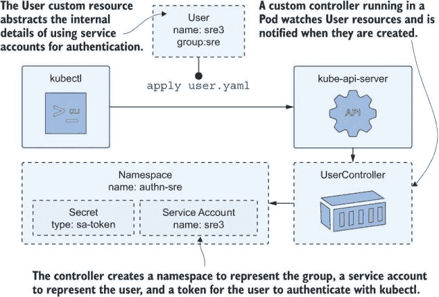

图 20.5 在自定义认证系统中添加用户会创建所有的 Kubernetes 资源。

我们将首先部署用户 CRD 和一些用户。由于 schema（模式），CRD 难以阅读，但其中没有新的内容，所以我们将跳过列表（如果你想要查看，它是文件`user-crd.yaml`）。用户资源本身很简单。列表 20.3 显示了 SRE 团队中的一个用户。

列表 20.3 user-crd.yaml，用户资源的 spec

```
apiVersion: "ch20.kiamol.net/v1"     # This is the same group and version
kind: User                           # as the other CRDs in this chapter.
metadata:
  name: sre3
spec:                                # Records the user details
  email: sre3@kiamol.net
  group: sre
```

你需要意识到 CRD 需要几秒钟的时间在 API 服务器上注册，所以你通常不能一次性部署一个 CRD 和自定义资源的文件夹，因为 CRD 往往没有及时准备好。你需要先部署 CRD，然后才能部署资源。我们现在将使用 SRE 用户和一个测试用户来做这件事。

现在试试看 创建用户的 CRD 和一些用户资源。

```
# deploy the CRD first:
kubectl apply -f users/crd/

# deploy the users:
kubectl apply -f users/

# print the user list:
kubectl get users
```

图 20.6 的输出显示用户体验良好。CRD 只需部署一次，然后你可以使用像列表 20.3 中的简单 YAML 那样添加尽可能多的用户。现在自定义用户对象存储在 Kubernetes 中，但没有控制器运行，所以目前还没有任何事情发生。

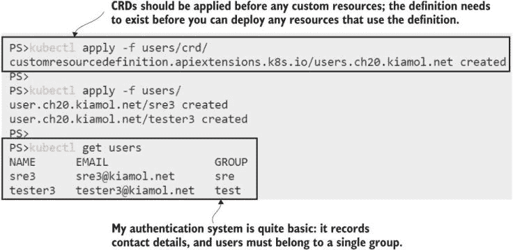

图 20.6 创建 CRD 和一些用户——没有控制器，这不会触发任何事情。

自定义控制器通常用 Go 编写。一些包负责处理你需要做的样板连接。不过，Kubernetes API 客户端存在于所有主要语言中，我的用户控制器是用 .NET 编写的。我不想给你一堆源代码，但你应该意识到构建自定义控制器的一些事情。列表 20.4 是一些 C# 代码，它是添加用户工作流程的一部分（完整文件在本章的源代码中）。

列表 20.4 UserAddedHandler.cs，使用客户端库调用 Kubernetes API

```
// lists service accounts in a namespace, using a 
// field selector to search for an account by name:
var accounts = _client.ListNamespacedServiceAccount(
           groupNamespaceName,
           fieldSelector: $"metadata.name={serviceAccountName}");

// if there’s no match then we need to create the account:
if (!serviceAccounts.Items.Any())
{
  var serviceAccount = new V1ServiceAccount
  {
    // set up the spec of the service account
  };

  // create the resource:
  _client.CreateNamespacedServiceAccount(
            serviceAccount, 
            groupNamespaceName);
}
```

你首先会注意到，使用 Kubernetes API 感觉很自然，因为所有的操作实际上都是你在 kubectl 中所做的相同事情，只是语法不同，所以编写控制器并不困难。第二点是，你通常在代码中构建 Kubernetes 资源，所以你需要将你心中的 YAML 转换为一系列对象——因此编写控制器比较繁琐。幸运的是，我有我来为你做这件事，当你部署用户控制器时，它会立即通知新用户，并运行添加用户的工作流程。

现在试试看 部署自定义控制器，并验证添加用户过程是否被触发并创建了所有认证资源。

```
# on Windows, you’ll need to run this so you can decode Secrets:
. .\base64.ps1

# deploy the custom controller:
kubectl apply -f user-controller/

# wait for it to spin up:
kubectl wait --for=condition=ContainersReady pod -l app=user-controller

# check the controller logs:
kubectl logs -l app=user-controller

# print the Secret, which is the user’s token:
kubectl get secret tester3-token -n kiamol-ch20-authn-test -o jsonpath='{.data.token}' | base64 -d
```

你会看到在这个练习中，控制器自动执行了我们手动在 17.3 节中做的所有操作——为组创建命名空间、在命名空间中创建服务账户，并请求新的令牌。实际上，它做的不仅仅是这些，因为它首先检查这些资源是否存在，只有在需要时才创建它们。图 20.7 显示结果是服务账户，可以通过对组（即命名空间）应用 RBAC 规则来保护，以及令牌，可以分发给用户，让他们存储在他们的 kubectl 上下文中。

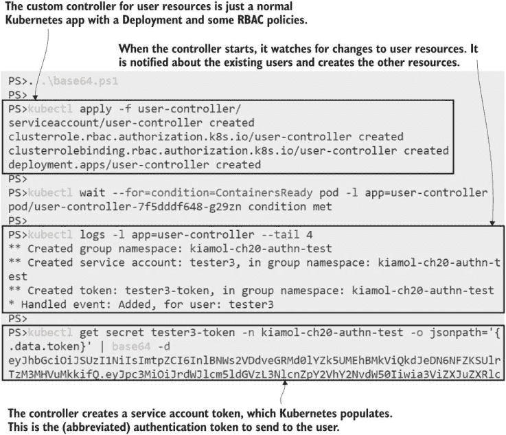

图 20.7 控制器自动化了入职流程，除了分发凭证。

请不要将此控制器用作您的生产认证系统；它只是快速展示如何使用自定义控制器与 CRDs 一起扩展您的 Kubernetes 体验。代码不处理对象的更新，设计允许每个用户只有一个组，但您可以看到管理 Kubernetes 内认证的基础都在那里。您可以将所有用户 YAML 和组 RBAC 规则存储在一个源代码库中，并将其作为部署任何新集群的一部分。

任何控制器的基本作用是实现控制循环，持续监视对象的变化，并执行将系统的实际状态转换为对象中指定的所需状态的任何任务。它们通过监视资源的变化来实现这一点——就像使用 kubectl 中的`watch`参数一样。`watch`是一个无限循环，当对象被创建、更新或删除时，它会收到通知。用户控制器在启动时添加了它找到的用户，并且它仍在后台运行，等待您添加另一个用户。

现在尝试一下。控制器正在监视新用户。创建另一个用户资源，并确认控制器执行了其操作。

```
# deploy a new user in the same SRE group:
kubectl apply -f users/update/

# print the latest controller logs:
kubectl logs -l app=user-controller --tail 4

# confirm the new user has a token:
kubectl get secret sre4-token -n kiamol-ch20-authn-sre -o jsonpath='{.data.token}' | base64 -d
```

我在图 20.8 中的输出显示，控制器表现正常；期望状态是用户应该作为一个服务账户被创建，并为组创建一个命名空间。命名空间已经存在，因此控制器在那里不需要做任何事情；它只是创建服务账户和令牌。自定义控制器需要按照与标准控制器相同的原则工作：无论初始状态如何，它们都能达到所需状态。

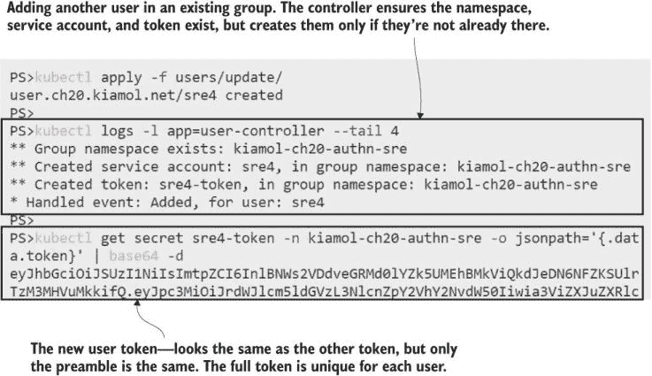

图 20.8 在自定义控制器中应使用声明性期望状态方法。

自定义控制器也需要拥有清理逻辑，因为创建自定义资源和看到大量额外资源被创建之间存在脱节。这是扩展 Kubernetes 的一个问题——您的控制器代码需要稳固，以确保任何故障都不会留下集群管理员不期望的对象。这对于存储在 Secrets 中的敏感数据尤其重要，例如为用户创建的令牌。

现在尝试一下。删除测试用户。现在组中没有用户了，因此命名空间也应该被删除。

```
# check the authentication namespaces:
kubectl get ns -l kiamol=ch20

# delete the test user:
kubectl delete user tester3

# print the controller logs:
kubectl logs -l app=user-controller --tail 3

# confirm the tester namespace has been removed:
kubectl get ns -l kiamol=ch20
```

您可以在图 20.9 中看到，控制器没有明确删除 Secret，但此类型的 Secret 在服务账户被删除时，Kubernetes 会自动删除。控制器会检查组中是否还有其他用户，如果没有，它会删除命名空间。如果您在那个命名空间中添加了任何其他资源，那么它们现在都将消失。

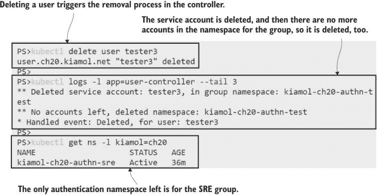

当对象被移除时，控制器会收到通知，以便它们可以清理它们创建的资源。

自定义资源是扩展 Kubernetes 的强大方式，特别是对于像这样的用例，你希望提供比标准 Kubernetes 对象更高层次的概念抽象。但那些对象只是集群中的普通资源，你的控制器代码需要允许管理员在不知道它们由控制器管理的情况下删除它们。用户控制器还应监视机密、服务帐户和命名空间，以重新创建控制器过程外删除的任何内容。

更复杂的控制器可能会部署自己的 RBAC 规则以限制干扰，并支持跨多个 Pod 运行以实现高可用性。如果你想探索 CRDs 和自定义控制器的生产级示例，cert-manager 项目([`cert-manager.io`](https://cert-manager.io))是一个很好的例子。它是一个 CNCF 项目，为 Kubernetes 添加了 TLS 证书管理功能，可以请求证书并将它们应用到你的 Web 应用程序中。更高级的复杂性来自于操作符模式。

## 20.3 使用操作符管理第三方组件

操作符使用自定义资源和控制器来提供应用程序的全生命周期管理。它们用于需要大量操作任务且超出标准 Kubernetes 功能集的复杂应用程序。有状态应用程序是一个很好的例子——如果你决定在 Kubernetes 中运行数据库，那么升级数据库服务器可能意味着将数据库置于只读模式并在升级前进行备份。

你不能用标准 Kubernetes 资源表达这样的要求；你可以通过 Helm 安装钩子实现类似的功能，但通常逻辑相当复杂，你需要更多的控制。操作符的目标是使用控制器和自定义资源实现所有这些操作要求，通过简单的资源如数据库对象和备份对象来抽象复杂性。

如果第三方组件可以通过操作符部署，那么与你的应用程序依赖的组件一起工作会容易得多，因为它为你提供了一个 as-a-service 体验，你可以专注于你的应用程序，而将依赖项的管理留给它们自己。在本节中，我们将部署待办事项 Web 应用程序的修改版本，使用操作符来管理依赖项：一个数据库和一个消息队列，用于组件之间的异步通信。

现在试试这个待办事项应用版本使用了一个名为 NATS 的消息队列服务器。NATS 团队发布了一个操作符，该操作符运行高度可用的队列服务器集群。

```
# deploy the CRDs and RBAC rules for the Operator:
kubectl apply -f nats/operator/00-prereqs.yaml

# deploy the Operator itself:
kubectl apply -f nats/operator/10-deployment.yaml

# wait for it to spin up:
kubectl wait --for=condition=ContainersReady pod -l name=nats-operator

# list the CRDs to see the new NATS types:
kubectl get crd
```

NATS 是一个充当应用程序组件之间的中介的消息队列，因此它们通过传递消息而不是直接连接来通信。它是一个强大且非常能够的技术（另一个 CNCF 项目），但在生产环境中，为了确保消息不会丢失，需要仔细设置以实现高可用性。没有比 NATS 团队更好的团队来做这件事了，他们提供了你刚刚部署的操作员。如图 20.10 所示，它为 NatsCluster 对象添加了一个 CRD，你可以使用它来部署分布式消息队列。

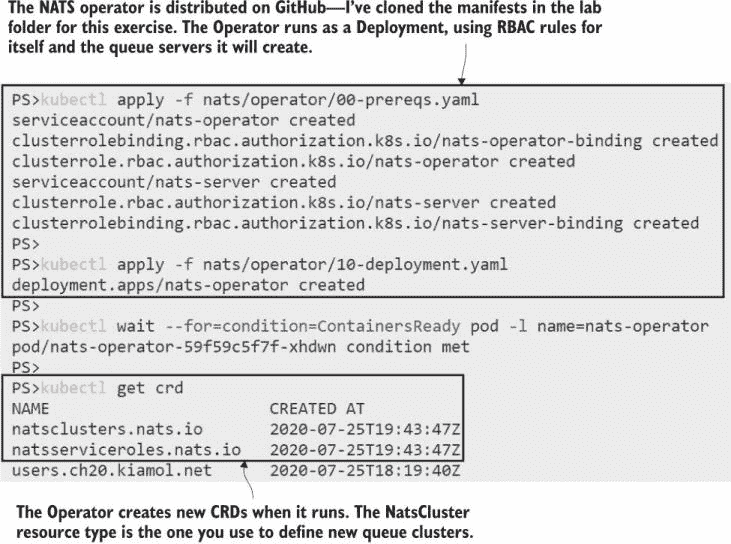

图 20.10 操作员应该简单易部署，并创建它们需要的所有资源。

更新后的待办事项应用使用消息队列来提高性能和可伸缩性。当用户在新版本中保存消息时，Web 应用会将消息发送到队列，然后返回给用户。另一个组件监听这些消息并将项目添加到数据库中。你可以扩展到数百个 Web Pod，而无需扩展数据库，因为队列充当缓冲区，平滑任何流量峰值。队列成为应用中的关键组件，列表 20.5 展示了使用 NATS 操作员部署生产级队列是多么简单。

列表 20.5 todo-list-queue.yaml，一个消息队列的自定义资源

```
apiVersion: nats.io/v1alpha2     # The CRD uses an alpha version,  
kind: NatsCluster                # but it has been stable for 
metadata:                        # a few years.
  name: todo-list-queue
spec:                            # The spec defines the size of    
  size: 3                        # the queue cluster and NATS version.
  version: "1.3.0"
```

NatsCluster 资源包含两个字段：你希望在高度可用的队列集群中运行的队列服务器 Pod 数量以及要使用的 NATS 版本。当你部署它时，操作员会为应用使用队列创建一个服务，为 NATS 实例创建一个服务以相互协调，以及一组 Pod，每个 Pod 运行 NATS 并配置了一个 Secret 以作为高度可用、分布式的队列运行。

现在试试看 创建 NATS 集群资源，并确认操作员是否创建了所有队列资源。

```
# deploy the queue spec from listing 20.5:
kubectl apply -f  todo-list/msgq/

# list the queues:
kubectl get nats

# list the Pods created by the Operator:
kubectl get pods -l app=nats

# list the Services:
kubectl get svc -l app=nats

# list Secrets:
kubectl get secrets -l app=nats
```

图 20.11 显示我的 NATS 集群已经启动并运行。容器镜像的大小只有几兆字节，所以 Pod 会很快启动，即使在需要拉取镜像的节点上也是如此。如果你描述一个 Pod，你会看到规范使用了你从这本书中学到的一些最佳实践，比如容器探测和 Pod 优先级。但 Pod 不是由 Deployment 或 StatefulSet 管理的；NATS 操作员是 Pod 控制器，这意味着它可以使用自己的方法来维护可用性。

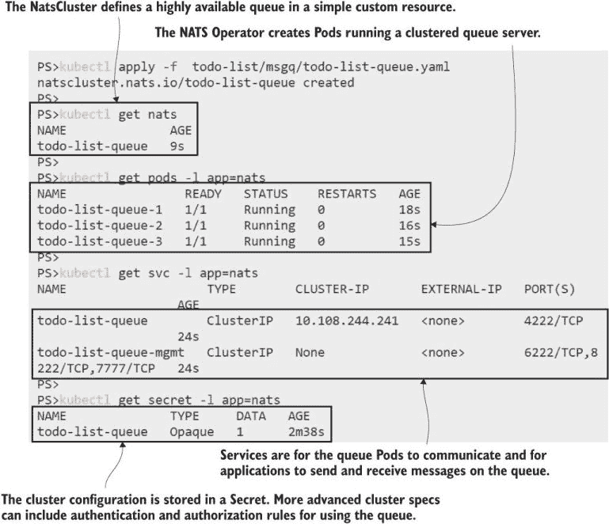

图 20.11 在自定义资源中使用两行 YAML，即可获得一个分布式消息队列。

Operator 模式是一个宽泛的定义；Kubernetes 中没有 Operator 对象，设计、构建和分发它们的决定权在项目团队。NATS Operator 是从 GitHub 上发布的 YAML 清单部署的；其他项目可能使用 Helm 或称为 Operator Lifecycle Manager（OLM）的工具。OLM 通过一个目录来发布和分发 Operator，增加了一些一致性，但它是在 Kubernetes 生态系统边缘的技术之一，到目前为止还没有得到广泛的应用。

您可以访问 OperatorHub 网站([`operatorhub.io`](https://operatorhub.io))，查看通过 OLM 可用的项目类型。其中一些由产品团队维护；其他由第三方或个人发布。在撰写本文时，有三个 Postgres 数据库的 Operator——它们都没有得到 Postgres 项目的支持——它们在功能和易用性方面差异很大。没有 MySQL 的 Operator，尽管有一个 MariaDB（MySQL 的分支）的 Operator，但它由 GitHub 上的一位个人维护——这可能不是您对核心组件所期望的支持结构。

这并不是说 Operator 不是一种可行的技术；只是这种模式并不局限于 OLM。如果您正在寻找某个产品的 Operator，您需要比 OperatorHub 网站更广泛地搜索，并调查选项的成熟度。待办事项应用可以使用 MySQL 作为数据存储——来自 Presslabs 团队的一个非常好的 MySQL Operator 可用于在 Kubernetes 中大规模运行 MySQL，为他们的 WordPress 平台提供服务。该 Operator 易于使用，文档齐全，维护良好，并且使用 Helm 安装简单。

现在尝试一下 使用 Helm 部署 MySQL Operator，它可以在集群中部署和管理复制的 MySQL 数据库。

```
# add the Helm repository for the Operator:
helm repo add presslabs https://presslabs.github.io/charts

# deploy a known version:
helm install mysql-operator presslabs/mysql-operator --version v0.4.0 --atomic 

# wait for the Operator Pod to spin up:
kubectl wait --for=condition=ContainersReady pod -l app=mysql-operator

# list the CRDs it installs:
kubectl get crd -l app=mysql-operator
```

MySQL Operator 为您提供了数据库即服务（DBaaS）的体验：Helm 发布创建了数据库和数据库备份对象的 CRD 以及运行这些对象的 Operator。我在图 20.12 中的输出被截断，但 Helm 发布说明还显示了如何创建数据库——您只需要一个 MySQL 密码的 Secret 和一个 MysqlCluster 对象。

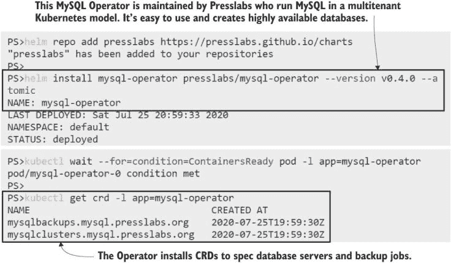

如果您找到一个好的 Operator，复杂软件的部署和管理就变得容易了。

您现在可以使用简单的资源规范部署高度可用的数据库。列表 20.6 显示了待办事项数据库的清单，同时也说明了自定义资源的某些局限性。CRD 模式允许您设置 MySQL 配置，并自定义 Operator 为数据库服务器生成的 Pod 定义，因此您可以设置资源请求和限制、亲和规则和优先级类别。这些 Kubernetes 细节会泄露到数据库对象规范中，所以它不仅仅是您需要的数据库的描述，但它比我们在第八章从头开始设置的复制的 Postgres 数据库要简单得多。

列表 20.6 todo-list-db.yaml，一个使用操作员的复制的 MySQL 数据库

```
apiVersion: mysql.presslabs.org/v1alpha1
kind: MysqlCluster
metadata:
  name: todo-db
spec:
  mysqlVersion: "5.7.24"
  replicas: 2
  secretName: todo-db-secret  
  podSpec:    
    resources:
      limits:
        memory: 200Mi
        cpu: 200m
```

当你部署 MysqlCluster 对象时，操作员创建一个 StatefulSet 来运行一个复制的 MySQL 数据库，并为消费者连接到数据库创建一组服务。有针对整个集群以及管理器和副本节点的一组单独的服务，所以你可以选择你的客户端应用程序如何连接。

现在试试它 部署数据库，并确认操作员创建了预期的资源。

```
# create the MysqlCluster resource:
kubectl apply -f todo-list/db/

# confirm the status:
kubectl get mysql

# show the StatefulSet:
kubectl get statefulset todo-db-mysql -o wide

# show the database Services:
kubectl get svc -l app.kubernetes.io/component=database
```

当你查看 StatefulSet 时，你会看到 Pod 运行一个 MySQL 容器和一组边车容器，包括 MySQL 的 Prometheus 导出器，如图 20.13 所示。这是操作员的一个大优点：它们使用最佳实践来建模应用程序，这样你就不需要自己深入研究细节。如果你查看 Pod 的规范，你会看到它有我们在第十四章中使用的标准 Prometheus 注释，所以如果你在集群中运行 Prometheus，操作员将自动检测新的数据库 Pod，无需任何额外配置，你还可以将 MySQL 度量添加到你的仪表板中。

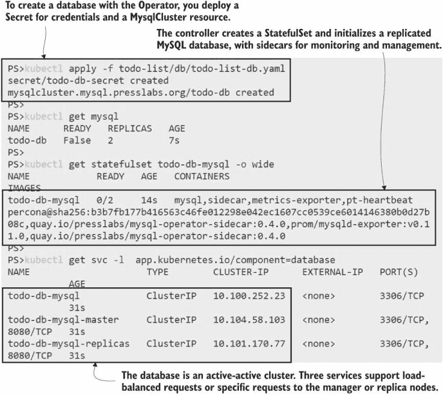

图 20.13 操作员使用常见的最佳实践设置了一个有偏见的 MySQL 数据库。

现在我们有一个生产级别的数据库和消息队列正在运行，仅用 20 行 YAML 定义。我们可以将 NATS 和 MySQL 标准化为所有我们的应用程序，操作员将负责多个数据库和队列。操作员通常是集群范围的，所以你仍然可以在不同的命名空间中隔离应用程序工作负载。这就是新待办事项应用程序的所有依赖项，因此我们可以部署其余的组件，即网站和消息处理器，它将数据保存到数据库中。

现在试试它 部署应用程序组件，一个网站和一个消息处理器，它们都使用队列和数据库。

```
# create shared app configuration:
kubectl apply -f todo-list/config/

# deploy the web app and handler:
kubectl apply -f todo-list/save-handler/ -f todo-list/web/

# wait for the Pods to start:
kubectl wait --for=condition=ContainersReady pod -l app=todo-list

# print the app logs:
kubectl logs -l app=todo-list,component=save-handler

# browse to the app Service on port 8020, and add a new item

# print the latest logs from the message handler:
kubectl logs -l app=todo-list,component=save-handler --tail 3
```

在这个练习中，你会看到应用程序工作得就像它一直以来的那样，与我们定制的 Postgres 版本相比，我们显著减少了需要维护的 YAML 数量。我的输出，如图 20.14 所示，实际上隐藏了这样一个事实：应用程序并不完全按原来的方式工作——现在待办数据被保存在一个单独的进程中。你会发现添加一个条目和看到它在列表中之间有一个延迟，所以你需要刷新。欢迎来到*最终一致性*，这是新消息架构的副作用；这与操作员无关，所以如果你对此概念是新手，我会让你去研究。

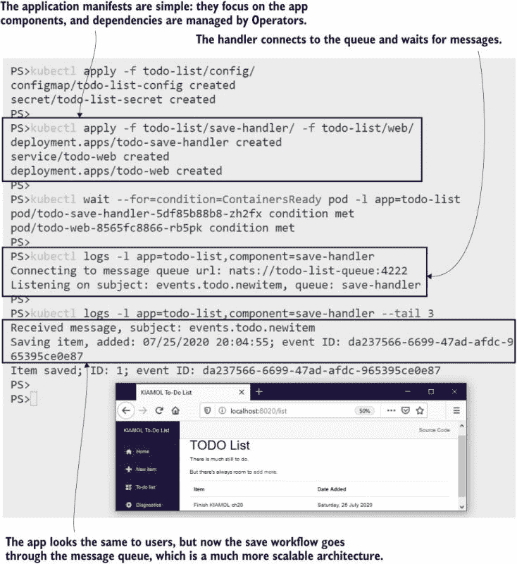

图 20.14 消息队列和数据库是关键组件，操作员以高可用性运行它们。

我们从 Operator 中获得的不只是部署的便捷性和高可用性；它们还会负责核心组件的安全升级，并且可以通过创建 MysqlBackup 对象将 MySQL 数据库备份到云存储。我们不会进一步探讨这一点，因为我们实际上并没有运行一个生产级别的待办事项列表应用。事实上，我们现在运行的设置可能正在消耗你实验室机器上相当多的资源，所以在我们继续之前，我们将将其清除。

现在试试吧！移除应用、自定义资源和 Operator。

```
# delete the app components:
kubectl delete -f todo-list/web/ -f todo-list/save-handler/ -f todo-list/config/

# delete the custom resources:
kubectl delete -f todo-list/db/ -f todo-list/msgq/

# uninstall the NATS Operator:
kubectl delete -f nats/operator/

# uninstall the MySQL Operator:
helm uninstall mysql-operator
```

你可以在图 20.15 中看到我的输出，其中卸载所有内容只是部署的反向操作。Operator 并不一定删除它们创建的所有资源，因为它们可能包含你不希望丢失的数据。预期在移除 Operator 后，ConfigMaps、Secrets、PersistentVolumeClaims 甚至 CRDs 仍然存在，这又是使用单独的命名空间为你的 app 提供的一个好理由，这样你可以干净利落地移除所有内容。

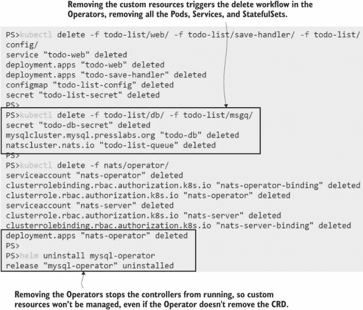

图 20.15 Operator 在删除时并不一定会清理，所以你需要手动检查剩余的资源。

Operator 是一种管理第三方依赖的整洁方式。你需要投入一些精力去找到一个适合你的 Operator，并且记住，这些中的许多都是开源项目，可能没有太多的动力。比较 Prometheus Operator（OperatorHub 上最好的例子之一），它有 350 位贡献者，几乎每天都有新的更新，以及来自 Oracle 的 MySQL Operator，它有 18 位贡献者，在撰写本文时，已经两年没有更新了。许多 Operator 被标记为 alpha 或 beta 软件，这些通常是关键组件，所以你需要对你集群中引入的任何东西的成熟度水平感到舒适。

但 Operator 不仅限于第三方软件；你可以构建自己的 Operator 来简化你自己的应用的部署和持续维护。

## 20.4 为自己的应用构建 Operator

构建自己的 Operator 有两个主要原因。第一个原因是针对那些具有复杂操作需求的 app，第二个原因是针对那些作为许多项目服务安装的通用组件。为待办事项 app 设计的 Operator 可能包含自定义升级逻辑——例如更新服务以将流量导向“维护中”页面，或者等待消息队列为空然后备份数据库。任何具有可自动化常规操作任务的 app 都可能是定制 Operator 的潜在候选者。

构建自己的操作员不是一项简单的工作，因为它涉及到多个自定义资源类型和多个自定义控制器。复杂性在于规划所有场景，不仅包括操作员拥有的工作流程，还包括它需要执行的其他任何工作以纠正人为操作员的干扰。本章的资源中有一个自定义操作员，但我不打算关注代码——它是一个用于我们在第十章中使用的 web-ping 应用程序的 as-a-service 操作员的示例。这是一个按计划对 Web 地址执行`GET`请求并记录响应时间的应用程序。如果可能，我可能会说服你这是一个许多团队都会使用的用于监控应用程序正常运行时间的服务。

现在试试看 The web-ping 操作员使用与 NATS 操作员相同的 YAML 清单进行部署。安装它以查看其运行方式和部署的 CRD。

```
# deploy RBAC rules and the Operator:
kubectl apply -f web-ping/operator/

# wait for it to be running:
kubectl wait --for=condition=ContainersReady pod -l app=web-ping-operator

# print the logs from the installer container:
kubectl logs -l app=web-ping-operator -c installer

# list new CRDs:
kubectl get crd -l operator --show-labels

# list the Pods for the Operator:
kubectl get pods -l app=web-ping-operator 
```

你会看到操作员 Pod 有几个角色：它安装了两个 CRD 并运行了两个容器，每个自定义资源都有一个自定义控制器。图 20.16 显示了 CRD 是用于 WebPinger 资源，它定义了要使用的地址和计划，以及 WebPingerArchive 资源，用于归档 WebPinger 资源的结果。

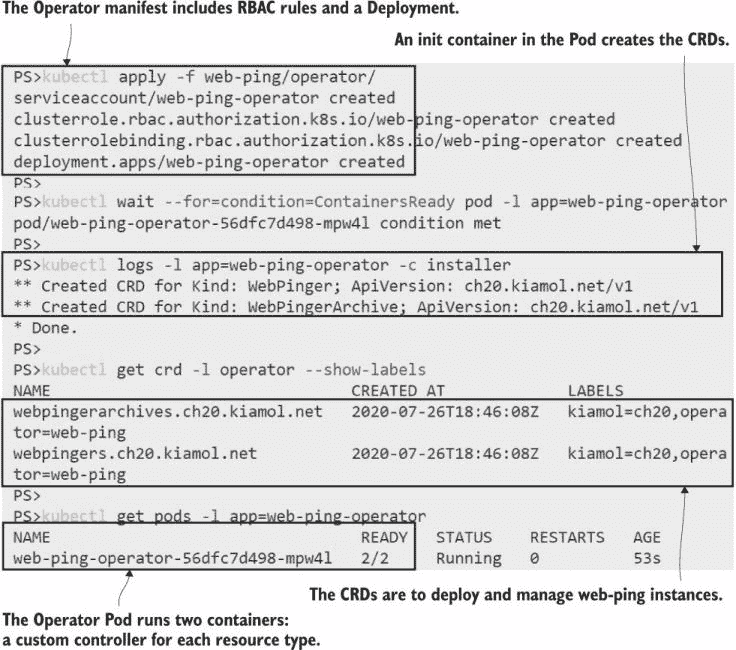

图 20.16 web-ping 操作员具有最小的清单，并在运行时部署其他资源。

操作员模式的一个目标是将用户体验保持简单，因此尽可能在操作员内部处理安装。这保持了部署规范简单，并消除了任何潜在的错误——操作员不依赖于复杂的清单（除了 RBAC 规则，这些规则需要提前准备）。你刚刚部署的操作员规范在列表 20.7 中显示；有一个初始化容器，用于创建 CRD，以及两个容器，用于运行控制器。

列表 20.7 02-wpo-deployment.yaml，操作员的 Pod 规范

```
# This is the Pod spec in the Deployment resource.
spec:
  serviceAccountName: web-ping-operator    # Uses an account set up with
  automountServiceAccountToken: true       # RBAC rules for access
  initContainers:
    - name: installer                      # Creates CRDs
      image: kiamol/ch20-wpo-installer
  containers:                              # App containers are controllers.
    - name: pinger-controller
      image: kiamol/ch20-wpo-pinger-controller
    - name: archive-controller
      image: kiamol/ch20-wpo-archive-controller
```

在这里不太可能出错。如果操作员需要 ConfigMaps、Secrets、Services 和 PersistentVolumeClaims，它将拥有创建它们的全部权限，从而将复杂性从管理员那里移开。web-ping 应用程序有一些参数可以指定要测试的地址、HTTP 请求类型和请求之间的间隔。CRD 允许用户声明这些字段，并且运行在操作员中的自定义控制器为应用程序的每个实例创建一个正确配置的 Deployment。列表 20.8 显示了一个配置为测试我的博客的 WebPinger 资源。

列表 20.8 webpinger-blog.yaml，一个用于测试 Web 地址的自定义资源

```
apiVersion: "ch20.kiamol.net/v1"
kind: WebPinger
metadata:
  name: blog-sixeyed-com
spec:                               # Parameters for the app are
  target: blog.sixeyed.com          # much easier to specify in a
  method: HEAD                      # custom resource than using
  interval: "7s"                    # environment variables in a Pod.
```

当你部署这个操作员时，它会创建一个具有特殊配置的 web-ping 应用程序实例，将响应记录到 JSON 格式的文件中进行分析。Pod 还包括一个侧边容器，它提供了一个 HTTP API 来清除日志文件，并支持归档功能。

现在试试看 创建一个 web ping 资源，并确认操作员创建了一个应用程序实例，该实例向我的博客发送 HTTP 请求。

```
# create the custom resource:
kubectl apply -f web-ping/pingers/webpinger-blog.yaml

# print the latest logs from the Operator:
kubectl logs -l app=web-ping-operator -c pinger-controller --tail 4

# list web-ping Pods:
kubectl get po -l app=web-ping --show-labels

# print the logs from the app:
kubectl logs -l app=web-ping,target=blog.sixeyed.com -c web --tail 2

# confirm logs are also written to the JSON file:
kubectl exec deploy/wp-blog-sixeyed-com -c web -- tail /logs/web-ping.log -n 2
```

这是一个简单且易于部署对网站进行简单黑盒观察的好方法，每个团队都可以在他们的生产部署中包含一个 WebPinger 规范，以监控他们应用程序的运行时间。如果团队熟悉 web-ping 应用，它将以与手动部署相同的方式运行，将可读日志打印到标准输出流。正如你在图 20.17 中看到的，日志也被写入为 JSON，这就是存档需求出现以保护磁盘空间的原因。

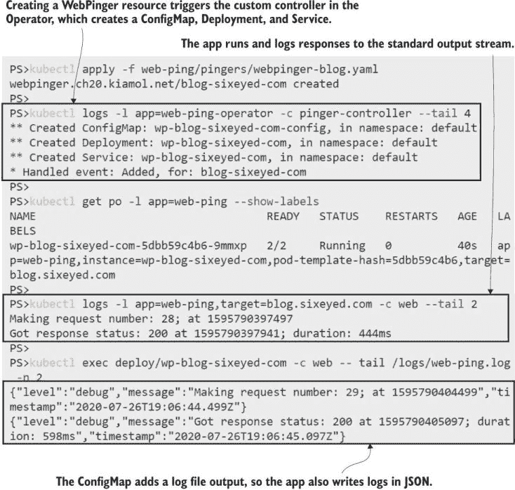

图 20.17 网络 ping 应用现在可以轻松地在多个实例中部署和管理。

存档是 web-ping Operator 提供的唯一操作功能，使用起来很简单：创建一个指定目标域名名的 WebPingerArchive 资源。该资源的自定义控制器会寻找与域名匹配的 web-ping Pod，并使用边车容器中的 API 抓取当前日志文件的快照，然后清除文件。这个存档功能是自动化操作任务所需工作的一个好例子。这不仅仅是 CRD 和控制器；应用程序本身需要一个边车来提供额外的管理功能。

现在试试看——测试 web-ping 应用的操作方面——创建博客请求的日志存档。

```
# print the number of lines in the log file:
kubectl exec deploy/wp-blog-sixeyed-com -c web -- wc -l /logs/web-ping.log

# create the archive resource:
kubectl apply -f web-ping/pingers/archives/webpingerarchive-blog.yaml

# confirm that the Operator creates a Job for the archive task:
kubectl get jobs -l kiamol=ch20

# print the logs from the archive Pod:
kubectl logs -l app=web-ping-archive,target=blog.sixeyed.com --tail 2

# confirm the application log file has been cleared down:
kubectl exec deploy/wp-blog-sixeyed-com -c web -- wc -l /logs/web-ping.log
```

我的输出显示在图 20.18 中。这是一个人为设计的例子，但它是观察 Operators 如何解决复杂问题而不迷失在实际问题中的好方法。在归档运行后，ping 结果将在作业的 Pod 日志中可用，而 web-ping Pod 仍在愉快地消耗我的带宽，并且有一个空日志文件开始再次填充。

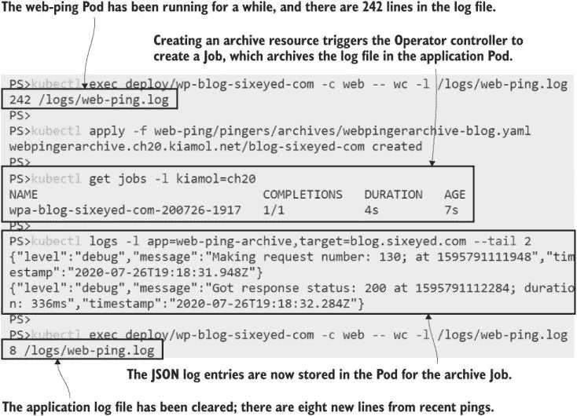

图 20.18 存档工作流程由 Operator 管理，并通过创建另一个自定义资源来触发。

Kubernetes Operators 通常是用 Go 编写的，如果你有 Go，两个工具会为你处理很多样板代码：来自 Google 的 Kubebuilder 和 Operator SDK，后者是 Operator Lifecycle Manager 工具集的一部分。我的 Go 并非真正精通，所以我用 .NET 编写了 Operator，构建这个部分的 Operator 大约花费了我一天的时间进行编码。深入挖掘 Kubernetes API 并编写创建和管理资源的代码，以及在代码中构建对象确实让你更加欣赏 YAML。

但现在是停止 ping 我的博客的时候了。这个 Operator 没有任何准入控制器来阻止你删除它的 CRDs，所以你可以删除它们。这将触发自定义资源的删除，然后控制器将清理它们创建的资源。

现在试试看——删除 Operator 的 CRDs。自定义资源将被删除，这将触发 Operator 中的删除工作流程。

```
# delete the CRDs by their labels:
kubectl delete crd -l operator=web-ping

# print the latest logs from the web-ping controller:
kubectl logs -l app=web-ping-operator -c pinger-controller --tail 4

# delete the latest logs from the archive controller:
kubectl logs -l app=web-ping-operator -c archive-controller --tail 2
```

在图 20.19 中，你可以看到在这个 Operator 中，控制器贯穿始终。WebPing 自定义控制器删除 Deployment 资源，然后系统控制器删除 ReplicaSet 和 Pod。Operator 并不试图取代或复制 Kubernetes 的功能——它是基于它的，使用已经在全球范围内使用多年的标准资源，将它们抽象化以提供简单的用户体验。

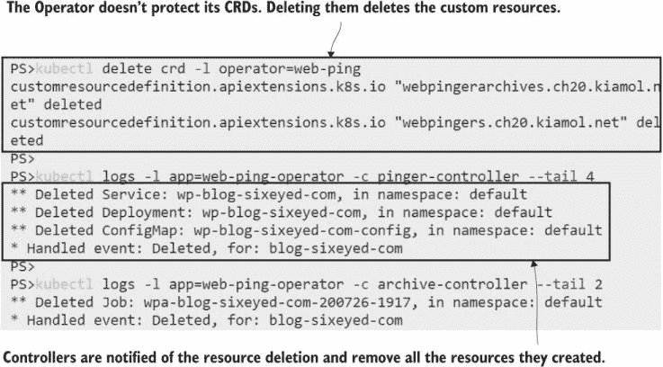

图 20.19 这个 Operator 中的自定义控制器管理标准的 Kubernetes 资源。

你需要理解 Operator 模式是如何工作的，因为你肯定会在你的 Kubernetes 之旅中遇到它，尽管你更有可能使用他人的 Operator 而不是自己构建。关键是要理解，它是一种松散的分类，用于使应用程序易于使用和维护，利用 Kubernetes 的可扩展性，并充分利用核心系统资源。

## 20.5 理解何时扩展 Kubernetes

在本章中，我们没有深入细节，但已经覆盖了很多内容。扩展 Kubernetes 是让集群运行你自己的代码，而在代码中发生什么取决于你试图解决的问题。尽管你更有可能使用他人的 Operator 而不是自己构建，但这些模式是通用的，图 20.20 显示了 Operator、自定义资源和自定义控制器如何与 web-ping 应用程序的所有部分协同工作。

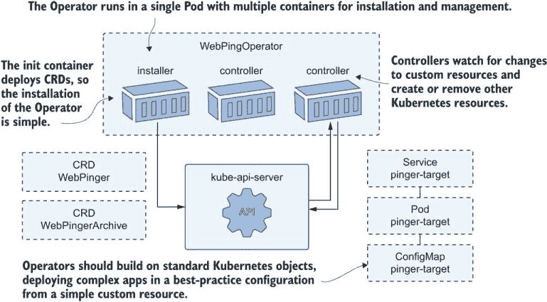

图 20.20 Operator 和自定义控制器通过抽象复杂性使应用程序易于管理。

扩展 Kubernetes 有一些指导原则。首先，确保你真的需要这样做。为运行 Deployment、ConfigMap 和 Service 的应用程序编写 Operator 以节省 YAML 是过度的。如果你的目标是确保应用程序以适当的规范部署，那么使用 admission controllers 会更好。编写和维护自定义控制器和 Operator 是一项大量工作，如果你没有规划好所有工作流程，你的应用程序可能会进入不一致的状态，然后 Operator 会使维护变得更加困难。管理员不会喜欢手动构建规范和部署自定义控制器应该拥有的资源。

如果你确实有明确的需求，那么就从 CRDs 和控制器开始，并专注于用户体验；自定义资源的全部意义在于简化复杂问题。如果你用 Go 编写，请使用开发工具包，并设计你的控制器以与 Kubernetes 协同工作，基于标准资源而不是重新发明它们。当你有几个具体的例子可以参考时，构建一个通用系统总是更好的，这样你就知道通用方法将涵盖所有需求。当你完成了一些复杂的升级并且了解了工作流程，或者当你多次部署了通用组件并且了解了变体，那么就是时候设计你的 Operator 了。

第三方操作符是使用他人的生产经验来提高你自己的应用程序可靠性的好方法。关键在于找到一个好的，这需要一些调查和尝试不同的选项。使用操作符来管理第三方组件是一个大的依赖。你不想发现项目停滞不前，你需要逆向工程操作符并自己承担所有权。操作符框架是拥有 OLM 和操作符 SDK 的母项目，它在我写这一章的前几周被添加为新的 CNCF 项目，这可能会给操作符 Hub 带来一些新的活力。

这就是扩展 Kubernetes 的全部内容，所以我们可以在进入实验室之前进行清理。

现在尝试一下 清理掉任何剩余的资源。

```
kubectl delete all,crd,secret,clusterrolebinding,clusterrole,serviceaccount,ns -l kiamol=ch20

kubectl delete pvc -l app=mysql-operator

kubectl delete configmap mysql-operator-leader-election
```

## 20.6 实验室

本实验室将为你提供一些编写 CRD 和管理自定义控制器的一些经验。别担心；控制器已经为你准备好了。在实验室文件夹中，有一个为 timecheck 应用定制的资源规范，但没有 CRD，所以你不能部署它。任务是构建 CRD，部署控制器和资源，并验证它们是否按预期工作。这里有一些提示：

+   自定义控制器已经在`timecheck-controller`文件夹中准备好了。

+   你的 CRD 名称需要与资源中的名称匹配。

+   部署控制器时，你需要查看日志；根据你接近实验室的顺序，它可能不会按预期工作。

你可以像往常一样在 GitHub 上查看我的解决方案：[`github.com/sixeyed/kiamol/blob/master/ch20/lab/README.md`](https://github.com/sixeyed/kiamol/blob/master/ch20/lab/README.md).
