# 21 在 Kubernetes 中运行无服务器函数

欢迎来到本书的最后一章！我们将以高调结束，学习如何将你的 Kubernetes 集群转变为无服务器平台。许多无服务器平台都在云中，但它们大多是定制系统，你无法轻易地将 AWS Lambda 组件迁移到 Azure Functions。Kubernetes 的可扩展性使得在集群中部署无服务器运行时变得容易，这与其他所有应用程序一样具有可移植性。在本章中，我们将介绍一些开源项目，它们为你提供了非常类似 Lambda 的体验，你只需关注代码，平台会为你打包和部署。无服务器函数作为容器在 Pods 中运行，因此你以通常的方式管理它们，但平台添加了一些高级抽象。

Kubernetes 生态系统中存在多个无服务器平台，它们采取了略微不同的方法。最受欢迎的是来自 Google 的 Knative 项目，但它有一个不寻常的工作流程：你需要自己打包函数到 Docker 镜像中，然后 Knative 会为你部署它们。我更倾向于代码优先的方法，即你带来代码，平台在容器中运行它；这符合无服务器函数简单工作流程的目标。在本章中，我们将使用另一个流行的平台 Kubeless，我们还将看到如何使用 Serverless 项目抽象无服务器平台本身。

## 21.1 Kubernetes 中无服务器平台的工作原理

在 Kubernetes 的背景下，无服务器意味着什么？显然，服务器是集群中的节点，因此肯定涉及服务器。这实际上是在编写代码和将其运行在 Pod 中之间去除所有仪式——消除了编译应用程序、构建容器镜像、设计部署和编写 YAML 规范的所有开销。AWS Lambda 和 Azure Functions 都有一个命令行界面 (CLI)，你可以上传代码文件，函数就会在云中的某个地方开始运行。Kubernetes 的无服务器为你提供了相同的流程，但你确切地知道函数运行的位置：在你的集群中的 Pod 中。

Kubeless 工作流程特别简洁：你只需将源代码文件部署为函数，使用 Kubeless CLI 即可。无需额外描述函数的工件，CLI 会创建一个包含所有细节和源代码的自定义资源。Kubeless 控制器作用于函数资源，并创建一个 Pod 来运行该函数。你可以通过 CLI 手动触发函数，或者创建一个永久触发器，使函数能够监听 HTTP 请求、订阅消息队列或按计划运行。图 21.1 展示了 Kubeless 函数的架构。

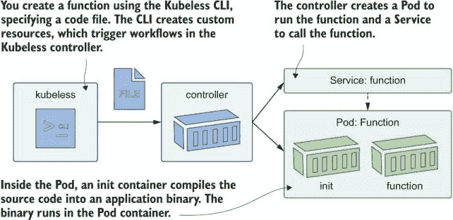

图 21.1 使用 Kubeless 的无服务器函数将你的代码转换为正在运行的 Pod。

This workflow means you run one command to get a code file running in a Pod and another command if you want to expose it over HTTP. It’s perfect for webhooks, integration components, and simple APIs. Other serverless platforms support Kubernetes and work in similar ways: Nuclio, OpenWhisk, and Fn Project all take your code, package it into a container to run, and support multiple triggers to invoke the function. They use standard resources, like Pods and Services, and standard patterns, like ingress controllers and message queues. In this chapter, you’ll use Kubeless to add new features to an existing app without changing the app itself. We’ll start simple with a Hello, Kiamol example.

Try it now Start by deploying Kubeless in your cluster. There’s a snapshot of the most recent release in this chapter’s folder.

```
# switch to this chapter’s source:
cd ch21

# deploy the CRDs and controllers:
kubectl apply -f kubeless/

# wait for the controller to start:
kubectl wait --for=condition=ContainersReady pod -l kubeless=controller -n kubeless

# list the CRDs:
kubectl get crd
```

You can see in figure 21.2 that Kubeless uses the techniques you learned in chapter 20: CustomResourceDefinitions for the HTTP and schedule triggers, and for serverless functions themselves. A controller monitors all those resources and turns functions into Pods, HTTP triggers into Ingress rules, and scheduled triggers into CronJobs.

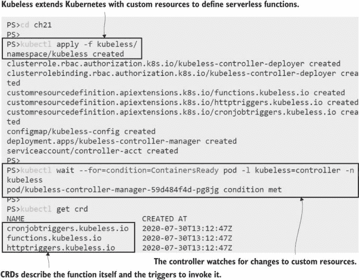

图 21.2 Kubeless 架构通过添加新资源来提供无服务器抽象。

You can create Kubeless custom resources yourself, which fits neatly if your function code is all in source control and you already have a CI/CD process that uses kubectl. The Kubeless CLI is an easier option: you run simple commands, and it creates the resources for you. The CLI is a single binary you can install on macOS, Linux, or Windows. You’ve installed enough software already, though, so we’ll run Kubeless in a Pod that has the CLI installed and kubectl configured to work with your cluster.

现在试试 Run the Kubeless CLI in a Pod, and confirm it can connect to your cluster.

```
# create a Pod with the Kubeless CLI installed:
kubectl apply -f kubeless-cli.yaml

# wait for it to start:
kubectl wait --for=condition=ContainersReady pod kubeless-cli

# connect to a session in the Pod:
kubectl exec -it kubeless-cli -- sh

# print the Kubeless setup:
kubeless get-server-config

# stay connected to the Pod for the next exercise
```

Kubeless supports a lot of languages, as you see in figure 21.3, from common ones like Java, .NET, and Python, to interesting newcomers like Ballerina and Vert.x (which itself supports multiple JVM variants like Java, Kotlin, and Groovy). If any of those fit with your tech stack, you can deploy functions with Kubeless—it’s a great way to evaluate new versions of your runtime or try out new languages.

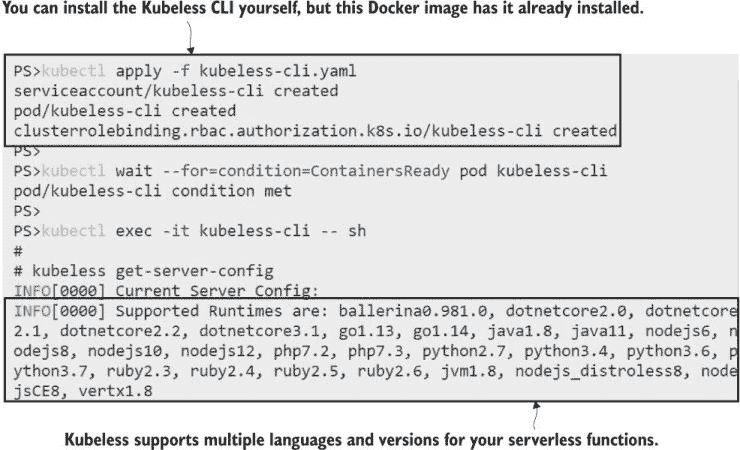

图 21.3 使用 Kubeless，无服务器函数可以用所有主要语言编写。

无服务器函数旨在执行单个专注的任务，源代码通常应该是一个文件，但 Kubeless 确实允许你部署更大的项目。它理解所有运行时的依赖管理系统，并在部署过程中获取依赖项。当你创建一个新的函数时，你可以上传包含整个项目结构的 zip 存档，或者你可以上传单个文件。列表 21.1 显示了一个简单的 Java 欢迎函数。不必太担心源代码——这个例子只是为了向你展示，无论你使用什么语言，编写 Kubeless 函数都有一种标准的方法。

列表 21.1 hello-kiamol.java，一个简单的 Java 无服务器函数

```
# the code is in a normal Java class:
public class Kiamol {

    # this is the method that Kubeless invokes:
    public String hello(io.kubeless.Event event, io.kubeless.Context context) {

        # it just returns a string:
        return "Hello from chapter 21!";
    }
}
```

每个函数接收两个字段：一个包含关于事件的详细信息，包括触发器的类型和调用者发送的任何数据，另一个包含函数本身的上下文，包括函数的运行时间和为函数完成设置的超时时间。没有服务账户令牌用于与 Kubernetes API 服务器进行身份验证，并且你的函数通常将是应用程序功能而不是 Kubernetes 扩展（尽管它们确实在 Pod 中运行，所以如果需要，令牌可以自动挂载到文件系统中）。

当函数被调用时，它们执行所需的所有操作，并且可以返回一个字符串，如果函数是由 HTTP 请求触发的，则将该字符串作为响应发送给调用者。函数代码在 Pod 容器内部执行，因此你可以将日志条目写入标准输出流并在 Pod 日志中查看它们。你可以部署列表 21.1 中的简单函数并检查 Pod 规范以了解 Kubeless 的工作方式。

现在试试看 部署简单的 Hello Java 函数使用 Kubeless CLI，并查看它创建的 Kubernetes 对象。

```
# inside the Pod is a copy of the book’s code:
cd /kiamol/ch21

# deploy the Java function from listing 21.1:
kubeless function deploy hello-kiamol --runtime java11 --handler Kiamol.hello
                                      --from-file functions/hello-kiamol/hello-kiamol.java

# list all functions:
kubeless function ls

# list Pods and ConfigMaps for the function:
kubectl get pods -l function=hello-kiamol
kubectl get cm -l function=hello-kiamol

# print the details, showing the build steps:
kubectl describe pod -l function=hello-kiamol | grep INFO | tail -n 5
```

图 21.4 以 Pod 中 init 容器的日志结束。Kubeless 有一种打包应用程序的好方法，无需构建和推送容器镜像。每个支持的运行时都有一个 init 容器镜像，其中包含运行时的所有构建工具——在本例中，是 Java JDK 和 Maven 用于依赖管理。init 容器从 ConfigMap 卷加载函数源代码，构建应用程序，并将输出复制到 `EmptyDir` 卷。应用程序容器从一个包含语言运行时的镜像运行，并从共享的 `EmptyDir` 卷启动编译后的应用程序。

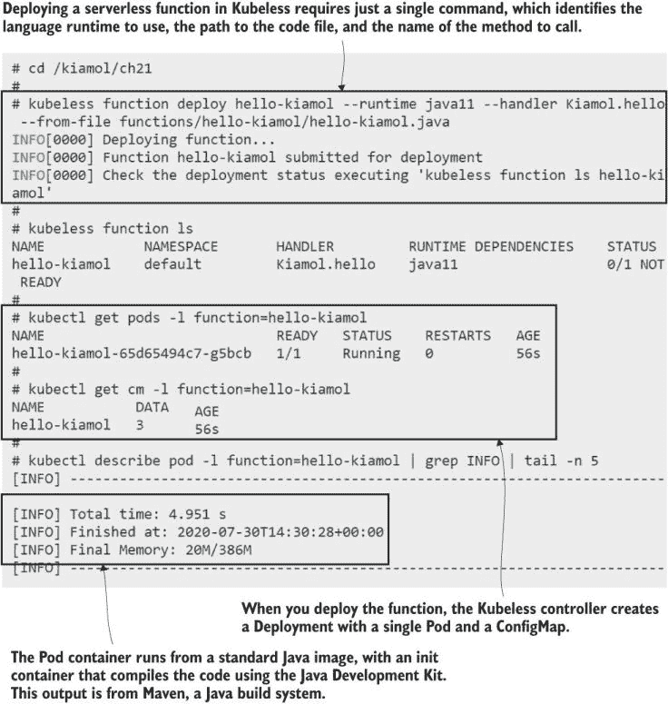

图 21.4 Kubeless 充分利用 init 容器来编译函数而不构建镜像。

这种方法意味着与为每个函数构建和推送镜像的平台相比，函数的启动时间较慢，但它为开发者消除了许多摩擦。这也意味着你的集群不需要配置具有对注册表写入权限的 Secrets，而且你甚至不需要使用可以构建和推送镜像的容器运行时。现在你有一个在 Pod 中运行的函数，而你不需要构建服务器或安装 Java 或 Maven。

函数 Pod 有一个监听请求的 HTTP 服务器。当你创建一个触发器时，它会向 Pod 的服务发送请求。你可以像标准应用程序 Pod 一样扩展和自动扩展函数，并且请求由服务以通常的方式负载均衡。Kubeless 建立在已建立的 Kubernetes 资源之上，为你提供了一个简单的方法来运行你的应用程序。这个函数还没有任何触发器，因此你无法从集群外部调用它，但你可以使用 kubectl 启动代理并直接调用服务。

现在尝试一下 你可以使用 kubectl 代理的 HTTP 请求来调用函数，或者你可以使用 Kubeless CLI——我们仍然在这个练习的 Pod 会话中。

```
# show the Service for the function:
kubectl get svc -l function=hello-kiamol

# start a proxy to route HTTP requests to the cluster:
kubectl proxy -p 8080 &

# call the function using the proxy:
curl http://localhost:8080/api/v1/namespaces/default/services/hello-kiamol:http-function-port/proxy/

# but it’s simpler to call it with the CLI:
kubeless function call hello-kiamol

# we’re done with the Pod session for now:
exit
```

你可以在图 21.5 中看到，Kubeless CLI 为你提供了一个与函数交互的简单方法，但每个函数都是一个 Kubernetes 应用程序，因此你也可以使用通常的 kubectl 命令来与之交互。

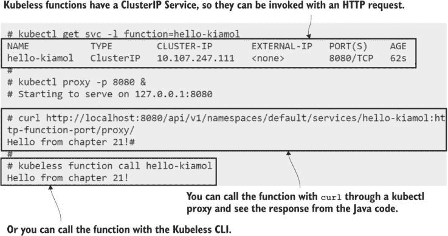

图 21.5 无服务器实际上是一种部署抽象：Kubeless 创建了标准的 Kubernetes 资源。

这个函数并不太有用。无服务器函数真正发光的地方是向现有应用程序添加新功能，而无需对主应用程序进行任何更改或部署。在接下来的几节中，我们将使用无服务器函数向备受喜爱的（或者可能现在不再如此）待办事项应用程序添加一些急需的功能。

## 21.2 从 HTTP 请求触发函数

你在第十五章学习了入口的概念。它是将进入请求路由到集群中运行的多个应用程序的常用方法。入口规则还隐藏了单个应用程序是如何组合起来的细节，因此同一域名中的不同路径可能由一个组件或不同的组件提供服务。你可以利用这一点，通过无服务器函数添加看起来像是主应用程序一部分的新功能。

我们将为此为待办事项应用程序添加一个新的 REST API，基于我们在第二十章所做的工作。在那里，我们介绍了一个用于网站和将新项目保存到数据库的消息处理程序之间的通信的消息队列。任何具有访问权限的组件都可以向队列中发布消息，因此我们可以在无服务器函数中运行一个简单的 API 来完成这个任务。让我们先让待办事项应用程序重新运行起来。

现在尝试一下 使用简单的 Deployment 规范部署待办事项应用程序，用于 NATS 消息队列和数据库。

```
# deploy all the components of the app:
kubectl apply -f todo-list/config/ -f todo-list/db/ -f todo-list/msgq/ -f todo-list/web/ -f todo-list/save-handler/

# wait for the application Pods to start:
kubectl wait --for=condition=ContainersReady pod -l app=todo-list

# fetch the URL for the app:
kubectl get svc todo-web -o jsonpath='http://{.status.loadBalancer.ingress[0].*}:8021'

# browse the app to confirm it’s working
```

图 21.6 没有什么特别之处——只是运行着的老式待办事项应用程序。这不是使用操作员管理消息队列和数据库的完整生产部署，但它具有相同的架构和功能。


图 21.6 显示，如果应用程序具有正确的架构，无服务器函数可以很好地与你的应用程序集成。

在本节中，我将使用多种不同的语言来编写无服务器函数，这样您可以了解它们是如何工作的，并看到运行时之间的相似性。待办 API 使用 Node.js，它使用一些额外的库来向 NATS 发送消息。Kubeless 负责在函数 Pod 启动时在初始化容器中加载依赖项；您只需在文件中使用运行时的标准格式指定依赖项即可。列表 21.2 显示了使用 NATS 库发送消息的 API 函数的主要部分。

列表 21.2 server.js，Node.js 中的无服务器 API

```
# the function method receives the same event and context data:
function handler(event, context) {

  # inside the function, the code builds a message:
  var newItemEvent = {
    Item: {
      Item: event.data,
      DateAdded: new Date().toISOString()
    }
  }

  # and publishes it to the NATS queue:
  nc.publish('events.todo.newitem', newItemEvent)
} 
```

Node.js 函数的结构与列表 21.1 中的 Java 函数相同：它接收包含调用详细信息的 event 和 context 对象。数据是由调用者发送的新待办事项，代码将其构建成一个消息，并将其发布到队列中。格式与网站发布的格式相同，因此消息处理程序将接收来自 API 和 Web 应用的消息，并将新项目保存到数据库中。与代码文件并列的是包文件，它列出了依赖项，因此它可以与 Kubeless 一起部署。

现在尝试一下；具有依赖关系的函数以相同的方式部署；您只需在 Deployment 命令中指定依赖文件以及代码文件即可。

```
# connect to a session in the CLI Pod:
kubectl exec -it kubeless-cli -- sh

# switch to the chapter folder:
cd /kiamol/ch21

# deploy the API function with the dependencies:
kubeless function deploy todo-api --runtime nodejs12 --handler server.handler
 --from-file functions/todo-api/server.js
 --dependencies functions/todo-api/package.json

# show the function:
kubeless function ls todo-api

# wait for the Pod to be ready:
kubectl wait --for=condition=ContainersReady pod -l function=todo-api

# call the function:
kubeless function call todo-api --data 'Finish KIAMOL ch21'

# print the function logs:
kubeless function logs todo-api | grep event

# print the message handler logs:
kubectl logs -l component=save-handler --tail 1

# leave the session, and refresh your browser
exit
```

消息架构使得这种新的功能变得简单。消息处理程序监听当创建新项目时的事件，并将它们保存到数据库中。事件来源无关紧要。如图 21.7 所示，API 函数发布了一条带有随机事件 ID 的消息，这就是处理程序接收到的消息。如果您在浏览器中刷新待办事项列表，您会看到新项目已经在那里。

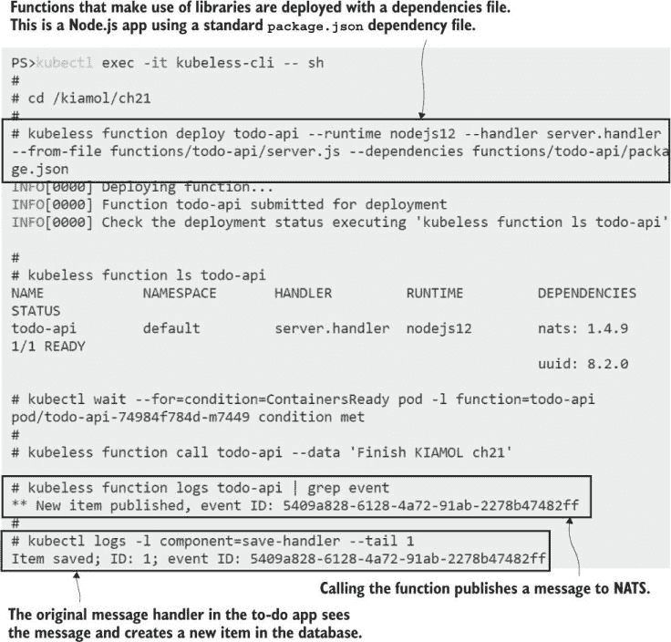

图 21.7 在 20 行代码内运行的待办应用 API

无服务器函数非常适合事件驱动架构，因为它们可以简单地连接到消息流，生成或消费不同类型的事件。这并不意味着消息是必需的，因为函数始终可以以不同级别与应用程序集成。没有消息队列，新的 API 函数可以使用数据库集成并写入新行到表中。更好的是拥有高级别的集成，这样您可以让组件拥有自己的数据，但您的函数代码可以执行与您当前架构相匹配的任何操作。

目前您已经有了待办事项 Web 应用的服务和 API 功能。下一步是将它们两者都通过 Ingress 发布。当您将无服务器函数与现有应用混合时，您可以选择您的 URL 结构。在这种情况下，我将为函数使用一个子域名，因此应用将在`todo.kiamol.local`上可用，而函数在`api.todo.kiamol.local`上。为了使其工作，您需要部署一个 ingress 控制器并在您的 hosts 文件中设置一些域名。

现在尝试一下：部署一个入口控制器，并将一些域名添加到你的 hosts 文件中。在 Windows 上，你需要以管理员身份运行终端，而在 Linux 或 macOS 上使用 sudo。

```
# run an Nginx ingress controller:
kubectl apply -f ingress-nginx/

# deploy ingress rules for the app and API:
kubectl apply -f todo-list/web/ingress/ -f functions/todo-api/ingress/

# print the ingress rules:
kubectl get ingress

# add domains to your hosts file--on Windows:
.\add-todo-to-hosts.ps1

# OR on Linux/macOS:
chmod +x ./add-todo-to-hosts.sh && ./add-todo-to-hosts.sh

# insert a new item with the API:
curl --data 'Plan KIAMOL ch22' http://api.todo.kiamol.local/todos

# browse to http://todo.kiamol.local/list
```

在那个练习中，你会发现入口规则隐藏了关于应用 Pod 和函数 Pod 的所有细节，消费者只使用 URL，这些 URL 看起来像是单个大型应用程序的不同部分。图 21.8 中的一个小截图显示了列表中的两个项目；这两个项目都是由新的 API 函数添加的，但它们的行为就像它们是在网站上添加的一样。

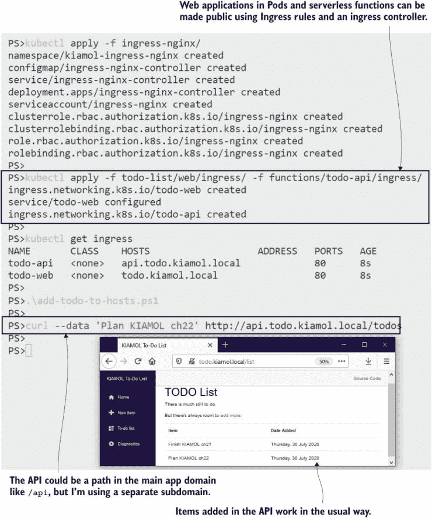

图 21.8 入口规则隐藏了内部架构，这可能是一个应用程序或多个函数。

你可以使用无服务器函数构建整个 API，每个路径使用不同的函数，但对于大型 API，这意味着会有很多 Pod，每个 Pod 都有自己的计算需求。Kubeless 默认不应用资源请求或限制，因此运行数百个函数 Pod 更有可能让你的节点承受内存压力，而不是运行单个 API Pod 的数十个副本。如果你严重依赖无服务器函数，我们讨论的第十九章中提到的驱逐场景更有可能出现，因为每个函数都会使用一些内存来加载语言运行时。

这并不是说无服务器 API 不可行；只是需要一些额外的规划。如果你在 YAML 中自己创建自定义资源而不是使用 Kubeless CLI，你可以向功能规范中添加资源块。你还需要仔细考虑你使用的运行时，因为镜像大小会影响你快速扩展的能力，并且更大的镜像提供了更大的攻击面。截至 Kubeless 1.0.7 版本，Go 运行时镜像小于 60 MB，而 Node.js 镜像的大小是其 10 倍。

现在你已经看到了无服务器函数如何扩展现有应用程序，我们将使用不同的语言和不同的触发器添加一些更多功能来完善待办事项应用。

## 21.3 从事件和计划触发函数

所有无服务器平台都具有类似的架构，其中函数可以通过不同的触发器被调用；HTTP 请求、队列上到达的消息和计划是常见的触发类型。将触发器与函数本身分离简化了代码，因为平台为你连接一切，你可以以不同的方式调用同一个函数。我们可以使用消息队列触发器为待办事项应用添加审计功能，记录新项目创建的时间。

新功能将监听现有消息处理器用于将项目保存到数据库的相同新项目消息。像 NATS 这样的队列支持发布-订阅模式，这意味着可以有任意数量的订阅者监听新项目消息，并且他们都会收到一份副本。Kubeless 将订阅队列，并在有传入事件时调用函数，因此函数内部无需特殊消息代码。审计处理器为它看到的每个项目写入日志条目，函数代码只是 Python 中显示的 21.3 列表中的两行。

列表 21.3 audit.py，一个 Python 审计函数

```
def handler(event, context):    
    print(f"AUDIT @ {event['data']['Item']['DateAdded']}: {event['data']['Item']['Item']}")
```

函数的设置没有差异；Kubeless 提供标准的事件和上下文对象，无论哪种类型的触发器调用函数。Kubeless CLI 中的`call`命令也以相同的方式工作，因此您可以部署此函数，并通过发送与新项目消息格式相同的数据来验证它。

现在试试吧 部署 Python 审计函数，并使用 Kubeless CLI 直接调用它以测试它。

```
# deploy the function:
kubeless function deploy todo-audit --runtime python3.7 --handler audit.handler
                                    --from-file functions/todo-audit/audit.py

# wait for the function Pod to be ready:
kubectl wait --for=condition=ContainersReady pod -l function=todo-audit

# confirm the function status:
kubeless function ls todo-audit

# connect to a Kubelss CLI session:
kubectl exec -it kubeless-cli -- sh

# call the new function:
kubeless function call todo-audit
 --data '{"Item":{"Item":"FAKE ITEM!","DateAdded":"2020-07-31T08:37:41"}}'

# print function logs:
kubeless function logs todo-audit | grep AUDIT

# leave the Pod session:
exit
```

图 21.9 显示这是一个简单的开发者体验。当函数部署时，没有默认触发器，因此除了从 Kubeless CLI（或通过代理访问函数服务）之外，没有其他方式可以调用它。开发者可以快速部署函数并测试它，使用`kubeless` `update`命令迭代代码，并且只有在他们对它满意时才发布触发器来连接函数。

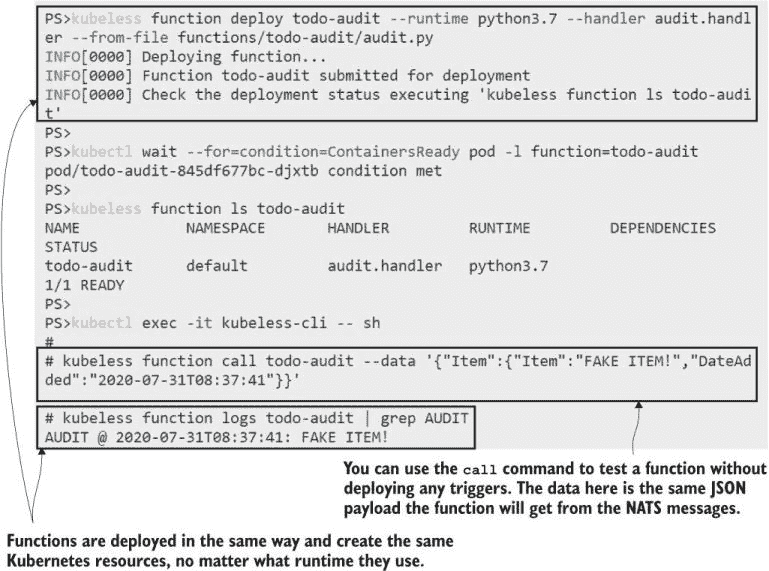

图 21.9 这就是无服务器工作流的值：使用单个命令进行部署和测试。

Kubeless 原生支持 Kafka 消息系统的消息触发器，并且它具有可插拔的架构，因此您可以添加一个 NATS 触发器。Kubeless 项目维护该触发器（以及其他插件，如 AWS Kinesis 数据流触发器），您可以将它部署以创建一个新的 CRD 和控制器，用于 NATS 触发器资源。

现在试试吧 部署 Kubeless 的 NATS 插件，并为新项目队列添加一个 NATS 触发器，以便在消息发布到新项目队列时调用审计函数。

```
# deploy the NATS trigger:
kubectl apply -f kubeless/nats-trigger/

# wait for the controller to be ready:
kubectl wait --for=condition=ContainersReady pod -l kubeless=nats-trigger-controller -n kubeless

# connect to a Kubeless session:
kubectl exec -it kubeless-cli -- sh

# create the trigger:
kubeless trigger nats create todo-audit
    --function-selector function=todo-audit --trigger-topic events.todo.newitem

# leave the session:
exit

# call the API function:
curl --data 'Promote DIAMOL serialization on YouTube' http://api.todo.kiamol.local/todos

# print the audit logs:
kubectl logs -l function=todo-audit 
```

函数 Pod 的完整日志相当冗长，因为它们包括来自容器存活探测的 HTTP 请求条目。我在图 21.10 中的输出被截断，但您可以看到新工作流程的实际操作：通过 API 函数使用其 HTTP 触发器添加项目，该函数将消息放入队列，这触发了审计函数，该函数写入日志条目。

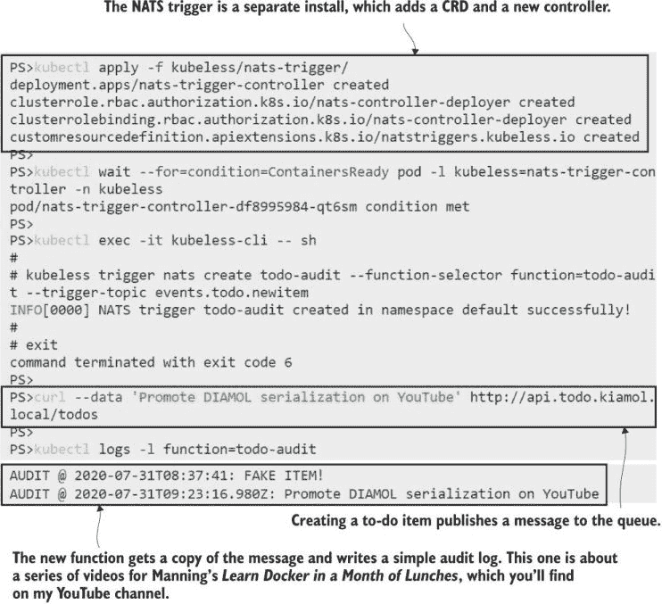

图 21.10 显示消息队列解耦组件；在这里，当 API 函数发布消息时，会调用审计函数，而函数之间没有直接通信。

这又是灵活架构如何帮助您快速、轻松地添加功能的一个好例子——而且安全，因为现有应用程序没有任何改变。像银行这样的高度监管行业通常有几乎完全由新法律驱动的产品积压，而将逻辑注入现有工作流程的能力是服务器无服务器架构的一个强大论据。幕后，NATS 触发控制器订阅事件消息，当它们到达时，它使用其 HTTP 端点调用函数。所有这些都从函数代码中抽象出来，函数代码只需专注于任务。

本节将再举一个例子，以总结 Kubeless 的主要功能：使用计划触发器和通过 YAML 创建函数而不是使用 CLI。Kubeless CLI 只是一个包装器，为您创建自定义资源。在 `todo-mutating-handler` 文件夹中有两个自定义资源的 YAML 清单：一个用于函数，一个用于 CronJobTrigger。我不会在这里重复规格说明，但如果您查看函数，您会看到它使用 PHP，源代码位于自定义资源规范内部。这种方法与 CI/CD 管道配合得很好，因为您可以使用 kubectl 部署而无需构建 Kubeless 命令。

现在试试看。将新函数作为自定义资源部署。您不需要 Kubeless CLI 来完成此工作流程，因此不需要连接到 CLI Pod 中的会话。

```
# create the Kubeless resources:
kubectl apply -f functions/todo-mutating-handler/

# print all the schedule triggers:
kubectl get cronjobtriggers

# print the Kubernetes CronJobs:
kubectl get cronjobs

# wait for the Job to run:
sleep 90

# print the logs from the Job Pod:
kubectl logs -l job-name --tail 2

# refresh your to-do list in the browser
```

当您运行此练习时，您会看到它为待办事项应用程序添加了一些急需的功能，以清理传入的数据。CronJob 每分钟调用一次函数，PHP 脚本执行以清理数据并确保待办事项列表项是有用的任务。我的输出如图 21.11 所示。

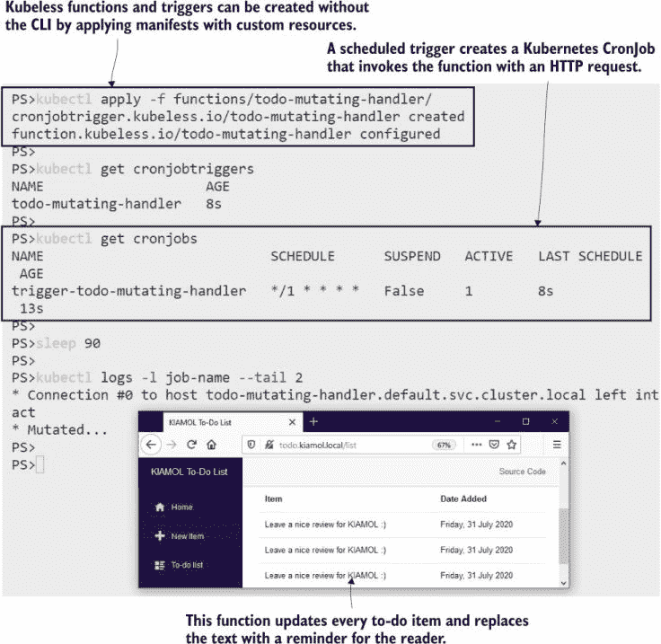

图 21.11 此处理程序有一些不寻常的行为，但它展示了您可以使用函数做什么。

Kubeless 是一种很好的入门服务器无服务器的方式，看看函数即服务模型是否适合您。对代码的关注使 Kubeless 成为使用 Kubernetes 进行服务器无服务器的一个更好的平台之一，但该项目最近不太活跃，部分原因是因为所有主要功能已经稳定了一段时间。当您将任何开源项目引入您的组织时，您需要接受它可能变得过时的风险，并且您需要投入自己的工程时间来帮助支持它。您可以通过使用名为 Serverless 的通用项目来抽象服务器无服务器实现来减轻这种情况。

## 21.4 使用 Serverless 抽象服务器无服务器函数

请注意本节中的大小写——*Serverless* 是一个标准化函数定义并集成底层 *无服务器* 平台以执行实际工作的项目。因此，你可以在 Kubeless 之上部署 Serverless，并使用 Serverless 规范为你的函数而不是直接使用 Kubeless。这意味着如果你想在某个时候从 Kubeless 转移到 Knative 或 OpenWhisk 或 Fn Project，你可以通过最小的工作量来完成，因为 Serverless 也支持这些平台。图 21.12 展示了 Serverless 与 Kubeless 的架构。

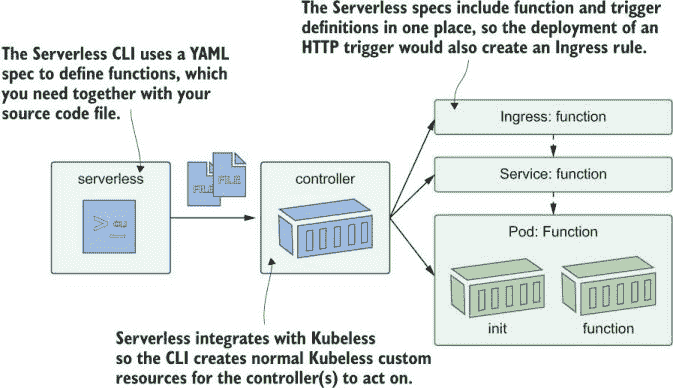

图 21.12 说明了 Serverless 引入了自己的规范语言，但使用底层的无服务器平台来运行函数。

Serverless 并不完全像 Kubeless 那样干净利落，因为它为函数添加了一个额外的 YAML 规范，所以你无法直接带上代码文件并启动它。优点在于这个规范相当简单，它将函数定义和触发器放在一个地方。列表 21.4 展示了 to-do API 函数的规范。这个文件位于项目文件夹中，与源代码一起，代码文件本身与你在 21.2 节中用 Kubeless 部署的文件相同。

列表 21.4 serverless.yml，一个 Serverless 函数规范

```
service: todo-api            # A service can group many functions.
provider:                    
  name: kubeless             # The provider is the actual platform.
  runtime: nodejs12          # You can use any runtime it supports.  

  hostname: api.todo.kiamol.local    # This is used for ingress rules.

plugins:
  - serverless-kubeless
functions:                   # This is the function definition.
  todo-api:                    
    description: 'ToDo list - create item API'
    handler: server.handler
    events:                  # Complete with the trigger events.
      - http:
          path: /todos
```

Serverless 开发者体验也不如 Kubeless 那么干净。Serverless 使用一个命令行工具，这是一个 Node.js 包，所以你需要安装 Node.js，然后安装 Serverless，这将下载大量的依赖项。我已经将 CLI 打包在一个容器镜像中，这样你就不需要这样做，在本节中，我们将用 Serverless 的版本替换 Kubeless 函数。

现在试试看！移除 Kubeless 函数，并使用 Serverless 作为抽象层重新部署它们。

```
# delete the custom resources to remove functions and triggers:
kubectl delete cronjobtriggers,natstriggers,httptriggers,functions --all

# create a Pod with the Serverless CLI:
kubectl apply -f serverless-cli.yaml

# wait for it to be ready:
kubectl wait --for=condition=ContainersReady pod serverless-cli

# confirm the Serverless CLI is set up:
kubectl exec serverless-cli -- serverless --version
```

Serverless CLI 使用 *提供者* 将通用的函数规范适配为平台组件。它实际上替换了 Kubeless CLI，使用 Kubeless 提供者和 Kubernetes 客户端库来创建自定义资源，这些资源由正常的 Kubeless 控制器管理。图 21.13 展示了 CLI 已安装并正在运行，但这还不是你需要的全部。提供者和 Kubernetes 客户端库需要与大约 100 个其他依赖项一起安装到项目文件夹中。

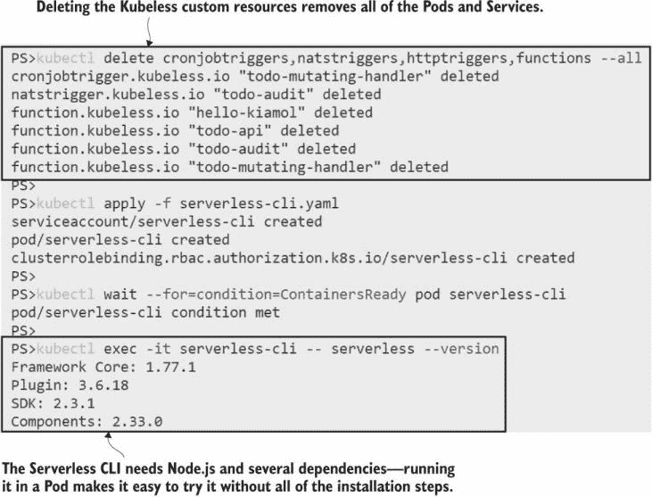

图 21.13 Serverless 提供了一种替代的部署体验，最终会创建与 Kubeless 相同的函数资源。

无服务器不是一个简单的项目，但它非常受欢迎。它不仅适用于在 Kubernetes 上运行的无服务器平台，还可以用作 AWS Lambda 和 Azure Functions 的抽象层。你不能直接将为 Kubeless 编写的函数提升并作为 Azure Functions 部署，因为平台以不同的方式使用不同的参数调用方法，但函数代码的核心将是相同的。接下来，我们将看到使用 Serverless 部署待办事项 API 函数的部署情况。

现在试试看 再次使用相同的代码文件创建待办事项 API 函数，但使用 Serverless 来定义和部署它。

```
# connect to a Serverless CLI session:
kubectl exec -it serverless-cli -- sh

# switch to the API code folder:
cd /kiamol/ch21/serverless/todo-api

# install all the deployment dependencies:
npm install

# deploy the function:
serverless deploy

# list Kubeless functions:
kubectl get functions
# confirm the Pod has been created:
kubectl get pods -l function=todo-api

# list HTTP triggers:
kubectl get httptriggers
```

你可以从图 21.14 中看到，使用 Kubeless 作为提供者的无服务器函数的安装结果与使用 Kubeless CLI 或直接部署自定义资源相同。你必须为每个项目执行设置阶段，但只有在第一次部署它或升级提供者时才需要这样做，因为 Serverless 实际上只是一个用于部署和管理函数的客户端工具。

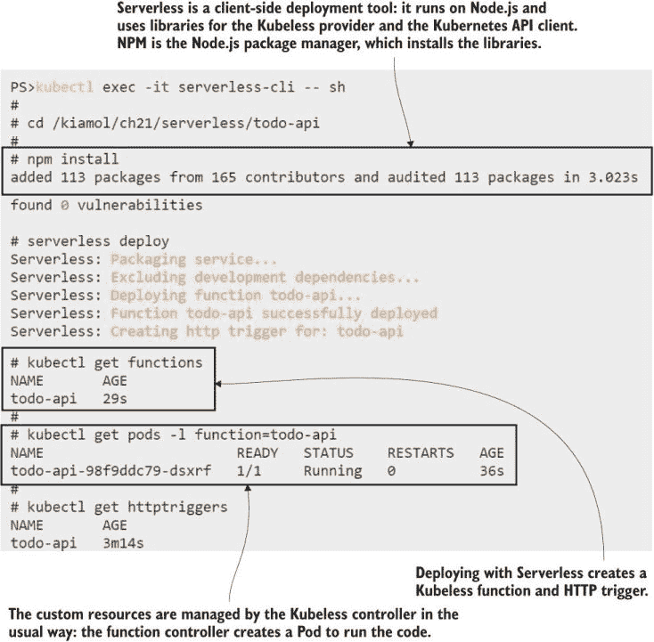

图 21.14 无服务器是一个无服务器平台的抽象。这个部署创建了一个 Kubeless 函数和触发器。

我们不会部署修改函数，因为我预计你在上一节已经收到了消息，但我们将继续部署审计函数，并确认一切仍然按预期工作。Serverless 支持不同的事件类型来触发函数，审计函数规范包括一个用于 NATS 新项目消息的队列触发器。

现在试试看 仍然处于你的无服务器 CLI 会话中，切换到审计函数的文件夹，并使用消息队列触发器部署它。

```
# switch to the function folder:
cd /kiamol/ch21/serverless/todo-audit

# deploy the Serverless Node.js dependencies:
npm install

# deploy the function itself:
serverless deploy

# confirm the function has been deployed:
kubectl get functions

# along with its trigger:
kubectl get natstriggers

# we’re done with the CLI Pod now:
exit
```

我的输出如图 21.15 所示，你可以看到无论你使用 Kubeless CLI、Serverless CLI 还是 kubectl 应用自定义资源规范，结果都是相同的。这些都是围绕无服务器模型的不同抽象，而该模型本身是标准 Kubernetes 应用模型的一个抽象。

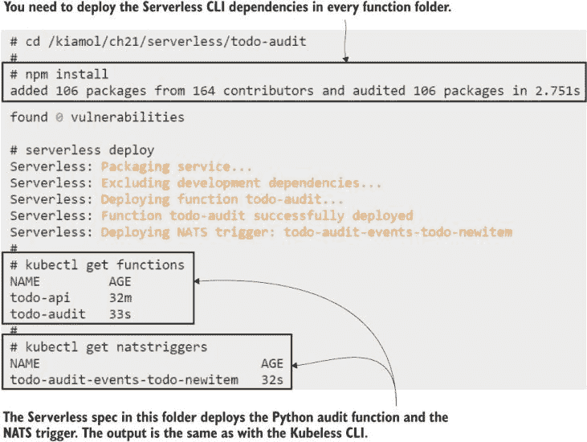

图 21.15 不同触发类型的函数在 Serverless YAML 规范中定义，并以相同的方式部署。

Serverless 的一项限制是 CLI 只在单个函数的上下文中运行——你需要在该函数目录中运行命令，以便 CLI 可以读取规范并找到函数。你可以将多个函数分组在一个文件夹和一个 Serverless 规范中，但它们都必须使用相同的运行时，所以这不适合本节的多语言函数。实际上，如果你使用 Serverless，你将混合使用 Serverless CLI 和 kubectl 来获得完整的管理体验。现在函数和触发器都已部署，我们实际上根本不需要使用 Serverless 来与之交互。

现在试试看 API 函数的 HTTP 触发器使用相同的入口规则，审计函数的 NATS 触发器使用相同的队列，因此端到端可以以相同的方式进行测试。

```
# if you’re running in PowerShell, add a grep function to your session:
.\grep.ps1

# make a call to the API:
curl --data 'Sketch out volume III of the trilogy' http://api.todo.kiamol.local/todos

# print the latest logs from the message handler:
kubectl logs -l component=save-handler --tail 2

# print the audit function:
kubectl logs -l function=todo-audit | grep AUDIT
```

通过这个练习和图 21.16 可以清楚地看出，Kubeless 和 Serverless 在构建和部署阶段添加了抽象层，但在运行阶段并不需要使用它们。函数可以直接从单个代码文件中交付，而不需要复杂的 CI/CD 管道，甚至不需要构建容器镜像。部署的组件只是标准的 Kubernetes 资源，你可以像往常一样管理它们。如果你在集群中设置了集中的日志记录和监控，你的无服务器函数将以与其他应用程序相同的方式与它们集成。

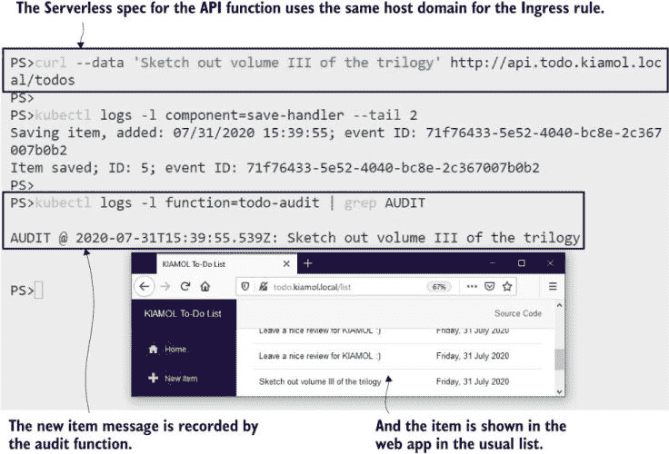

图 21.16 使用 Serverless 部署的函数与 Kubeless 提供程序的行为方式相同。

我们就到这里讨论无服务器（以及无服务器）了。它是一个有用的架构，并且在使用 Kubernetes 的过程中积累一些经验是很好的，这样你可以理解从代码到 Pod 的转换是如何工作的。

## 21.5 理解无服务器函数的位置

云端无服务器平台所承诺的是，你带来你的代码，你就可以忘记操作方面——部署很简单，平台会根据需求自动扩展和缩减，而不需要你任何干预。这对于许多用例来说非常有吸引力，但它有一个主要的缺点，那就是你的应用程序的无服务器组件与其他所有组件都不同。围绕无服务器的流程是最小的，但它们仍然是必需的，这让你有了与所有其他应用程序不同的部署管道、监控工具和故障排除工作流程。

这就是 Kubernetes 上的无服务器的作用所在。这是一个折衷方案，因为你不会得到云无服务器平台的零操作承诺，你也不能随意扩展，因为你需要平衡计算资源与你的其他应用程序。但正如你在本章中看到的，你确实得到了流畅的开发者工作流程，并且你可以像管理你的其他 Kubernetes 部署一样管理你的无服务器函数。这可能不是你第二天就带到你的集群中的东西，但它是一个作为选项的强大工具。

这就留下了一个问题：究竟哪个工具？截至 2021 年，没有无服务器项目在 CNCF 下，我在本章中提到的选项是开源和商业项目的混合体，它们的采用率和活跃度相当多样。目前，Kubeless 和 Knative 是主要的选择，值得对两者都进行评估，考虑到 Serverless 项目在隔离你与底层平台的同时，需要承担更多的 YAML 规范。CNCF 运行了一个无服务器工作组，该工作组演变成了 CloudEvents，这是一个通用的规范，用于触发函数及其数据结构的事件，这正在为无服务器平台带来标准化。

这就带我们到了结尾，所以剩下的就是整理一下，然后尝试实验室。

现在尝试一下。移除 Kubeless 组件，这将移除所有正在运行的功能，然后清理其余的部署。

```
kubectl delete -f kubeless/

kubectl delete ns,all,secret,configmap,pvc,ingress -l kiamol=ch21
```

## 21.6 实验室

我在本章中提到了 Knative 几次，现在轮到你来尝试了。你的任务是部署一个 Knative 版本的待办事项 API，该 API 可在 21.4 节中使用的相同 URL 上找到。Docker 镜像已经构建完成，但像你这样的经验丰富的 Kubernetes 用户不需要太多提示。这是你探索 Knative 文档并看看你是否更喜欢 Kubeless 方法的时机。

+   你的 API 镜像名为 `kiamol/ch21-todo-api`。你可以使用 Knative CLI 或自定义资源定义来创建它作为一个 Knative 函数。

+   实验室文件夹包含一个 Knative 部署和待办事项应用的新版本。

+   这个 Knative 设置使用了一个名为 Contour 的 CNCF 项目作为入口控制器。访问你的应用的 IP 地址位于 `contour-external` 命名空间中的 `envoy` 服务中。

+   Knative 使用 Knative Service 的名称和 Kubernetes 命名空间来构建入口域名，因此你在部署函数时需要小心谨慎。

实际上有很多提示。这个可能需要一些调查，但不要气馁——解决方案很简单，尽管你需要调整很多因素才能使函数按预期运行。我的解决方案在 GitHub 上：[`github.com/sixeyed/kiamol/blob/master/ch21/lab/README.md`](https://github.com/sixeyed/kiamol/blob/master/ch21/lab/README.md)。
