# 附录 B. 通过容器化监控添加可观察性

自主应用程序会根据传入流量自动扩展和缩减，并在出现间歇性故障时自我修复。这听起来太好了，以至于可能不太真实——可能确实如此。如果你在构建 Docker 镜像时包含健康检查，容器平台可以为你完成很多操作工作，但你仍然需要持续的监控和警报，以便在事情变得糟糕时人类可以介入。如果你对你的容器化应用程序没有任何洞察，这将是你无法进入生产环境的头号障碍。

当你在容器中运行应用程序时，可观察性是软件景观中的一个关键部分——它告诉你应用程序在做什么以及它们的性能如何，并且可以帮助你定位问题的根源。在本章中，你将学习如何使用与 Docker 相结合的成熟监控方法：从你的应用程序容器中公开指标，并使用 Prometheus 收集它们，使用 Grafana 在用户友好的仪表板中可视化它们。这些工具是开源的，跨平台的，并且与你的应用程序一起在容器中运行。这意味着你可以在从开发到生产的每个环境中获得对应用程序性能的相同洞察。

本附录摘自 Elton Stoneman 所著的《Learn Docker in a Month of Lunches》（Manning，2020）的第九章，“通过容器化监控添加可观察性”。任何章节引用或对代码仓库的引用都指该书的相关章节或代码仓库。

## B.1 容器化应用程序的监控堆栈

当应用程序在容器中运行时，监控方式有所不同。在传统环境中，你可能有一个监控仪表板显示服务器列表及其当前利用率——磁盘空间、内存、CPU——以及警报来告诉你是否有任何服务器过载并且可能停止响应。容器化应用程序更加动态——它们可能运行在数十或数百个短暂存在的容器中，这些容器由容器平台创建或删除。

你需要一个容器感知的监控方法，使用能够连接到容器平台进行发现并找到所有运行中的应用程序的工具，而无需静态的容器 IP 地址列表。Prometheus 是一个开源项目，正是这样做的。它是一个成熟的产品，由云原生计算基金会（Kubernetes 和 containerd 容器运行时的背后基金会）监督。Prometheus 在 Docker 容器中运行，因此你可以轻松地为你的应用程序添加监控堆栈。图 B.1 展示了该堆栈的外观。

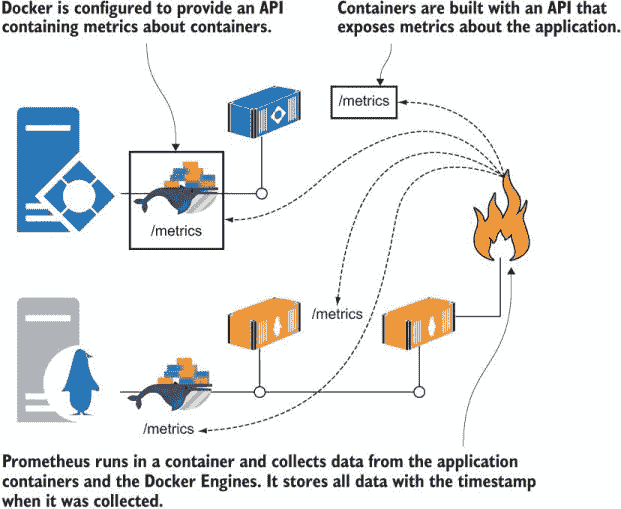

图 B.1 在容器中运行 Prometheus 以监控其他容器和 Docker 本身

Prometheus 为监控带来了一个非常重要的方面：一致性。您可以导出所有应用程序的相同类型的指标，因此您有一个标准的方式来监控它们，无论它们是 Windows 容器中的 .NET 应用还是 Linux 容器中的 Node.js 应用。您只需学习一种查询语言，就可以将其应用于整个应用程序堆栈。

使用 Prometheus 的另一个好理由是 Docker 引擎也可以以该格式导出指标，这使您能够深入了解容器平台正在发生的事情。您需要在 Docker 引擎配置中显式启用 Prometheus 指标。在 Windows 上，您可以直接在 `C:\ProgramData\docker\config` 中编辑 `daemon.json` 文件，或在 Linux 上的 `/etc/docker`。或者，在 Docker Desktop 上，您可以通过右键单击鲸鱼图标，选择设置，并在守护进程部分编辑配置。

现在尝试一下 打开您的配置设置并添加两个新值：

```
"metrics-addr" : "0.0.0.0:9323", 
"experimental": true 
```

这些设置启用了监控并在端口 9323 上发布指标。

您可以在图 B.2 中看到我的完整配置文件。

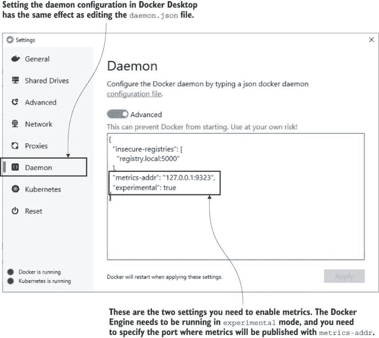

图 B.2 配置 Docker 引擎以导出 Prometheus 格式的指标

Docker 引擎指标目前是一个实验性功能，这意味着它提供的详细信息可能会改变。但它已经是一个实验性功能很长时间了，并且已经稳定。值得将其包含在您的仪表板中，因为它为系统的整体健康状况添加了另一层细节。现在您已经启用了指标，您可以浏览到 http://localhost:9323/metrics 并查看 Docker 提供的所有信息。图 B.3 显示了我的指标，包括 Docker 运行的机器信息以及 Docker 管理的容器信息。

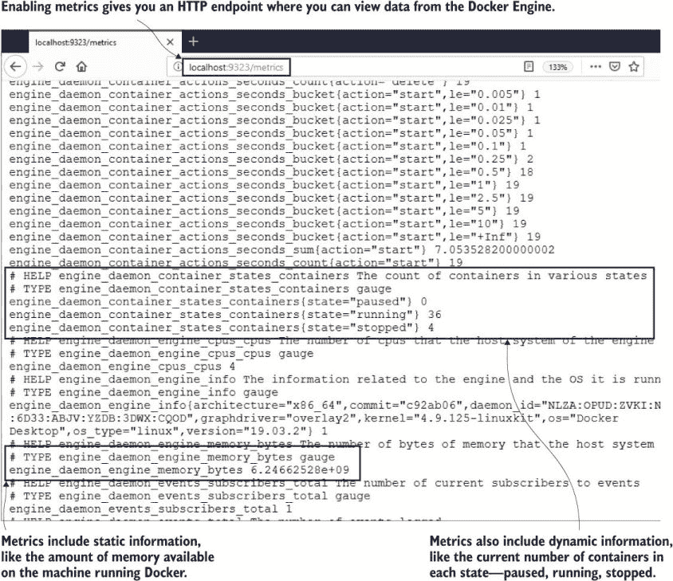

图 B.3 Docker 捕获的样本指标并通过 HTTP API 暴露

此输出格式为 Prometheus。它是一种简单的基于文本的表示，其中每个指标都显示其名称和值，指标前有一些帮助文本说明指标是什么以及数据类型。这些基本的文本行是您容器监控解决方案的核心。每个组件都会暴露一个类似这样的端点，提供当前指标；当 Prometheus 收集它们时，会在数据中添加时间戳，并将它们与所有之前的收集存储在一起，因此您可以查询聚合数据或跟踪随时间的变化。

现在尝试一下 您可以在容器中运行 Prometheus 以读取 Docker 机器的指标，但首先您需要获取机器的 IP 地址。容器不知道它们运行的服务器的 IP 地址，因此您需要先找到它，并将其作为环境变量传递给容器：

```
# load your machine's IP address into a variable - on Windows:
$hostIP = $(Get-NetIPConfiguration | Where-Object {$_.IPv4DefaultGateway -ne $null }).IPv4Address.IPAddress

# on Linux:
hostIP=$(ip route get 1 | awk '{print $NF;exit}')

# and on Mac:
hostIP=$(ifconfig en0 | grep -e 'inet\s' | awk '{print $2}')

# pass your IP address as an environment variable for the container:
docker container run -e DOCKER_HOST=$hostIP -d -p 9090:9090 diamol/prometheus:2.13.1
```

在`diamol/prometheus` Prometheus 镜像中的配置使用`DOCKER_HOST` IP 地址与你的主机机器通信并收集你在 Docker Engine 中配置的指标。通常情况下，你不需要从容器内部访问主机上的服务，如果你这样做，你通常会使用你的服务器名称，Docker 会找到 IP 地址。在一个开发环境中，这可能不起作用，但 IP 地址方法应该没问题。

Prometheus 现在正在运行。它执行几件事情：它运行一个计划任务从你的 Docker 主机拉取指标，它将这些指标值及其时间戳存储在其自己的数据库中，并且它有一个基本的 Web UI，你可以用它来导航指标。Prometheus UI 显示了 Docker 的`/metrics`端点的所有信息，你可以过滤指标并在表格或图形中显示它们。

现在尝试一下 浏览到 http://localhost:9090，你会看到 Prometheus 的 Web 界面。你可以通过浏览到状态 > 目标菜单选项来检查 Prometheus 是否可以访问指标。你的`DOCKER_HOST`状态应该是绿色的，这意味着 Prometheus 已经找到了它。

然后切换到“图形”菜单，你会看到一个下拉列表，显示 Prometheus 从 Docker 收集的所有可用指标。其中之一是`engine_daemon_container_actions_seconds_sum`，它记录了不同容器操作所花费的时间。选择该指标并点击执行，你的输出将类似于我的图 B.4，显示创建、删除和启动容器所需的时间。

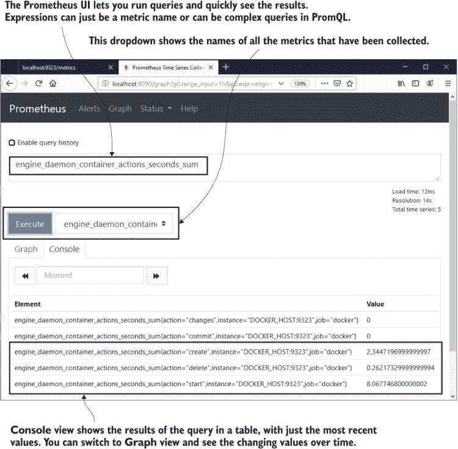

图 B.4 Prometheus 有一个简单的 Web UI，你可以用它来查找指标和运行查询。

Prometheus UI 是一个简单的方式来查看正在收集的内容并运行一些查询。在指标周围看看，你会发现 Docker 记录了大量的信息点。有些是高级读数，如每个状态的容器数量和失败的检查数量；其他提供低级细节，如 Docker Engine 分配的内存量；还有一些是静态信息，如 Docker 可用的 CPU 数量。这些都是基础设施级别的指标，所有这些都可以包括在你的状态仪表板中。

你的应用程序将公开它们自己的指标，这些指标也会在不同级别记录详细信息。目标是每个容器都有一个指标端点，并且 Prometheus 定期从它们中收集指标。Prometheus 将存储足够的信息，让你构建一个仪表板，显示整个系统的整体健康状况。

## B.2 从你的应用程序公开指标

我们已经查看 Docker Engine 公开的指标，因为这是一个开始使用 Prometheus 的简单方法。从每个应用程序容器中公开一组有用的指标需要更多的努力，因为你需要代码来捕获指标并为 Prometheus 提供 HTTP 端点。这不像听起来那么困难，因为所有主要编程语言都有 Prometheus 客户端库来为你做这件事。

在本章的代码中，我重新审视了 NASA 图片库应用，并为每个组件添加了 Prometheus 指标。我使用了 Java 和 Go 的官方 Prometheus 客户端，以及 Node.js 的社区客户端库。图 B.5 展示了每个应用程序容器现在都打包了一个 Prometheus 客户端，该客户端收集并公开指标。

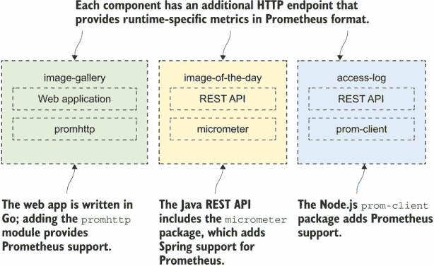

图 B.5 展示了你的应用中的 Prometheus 客户端库使指标端点在容器中可用。

从 Prometheus 客户端库收集的信息点是运行时级别的指标。它们提供了关于你的容器正在做什么以及它工作有多努力的关键信息，这些信息与应用程序运行时相关。Go 应用程序的指标包括活跃的 Goroutines 数量；Java 应用程序的指标包括 JVM 使用的内存。每个运行时都有自己的重要指标，客户端库在收集和导出这些指标方面做得很好。

现在试试看。本章的练习中有一个 Docker Compose 文件，它会启动一个带有每个容器中指标的图片库应用版本。使用该应用，然后浏览到其中一个指标端点：

```
cd ./ch09/exercises

# clear down existing containers:
docker container rm -f $(docker container ls -aq)

# create the nat network - if you've already created it 
# you'll get a warning which you can ignore:
docker network create nat

# start the project
docker-compose up -d

# browse to http://localhost:8010 to use the app

# then browse to http://localhost:8010/metrics
```

我的结果在图 B.6 中。这是 Go 前端 Web 应用程序的指标——不需要自定义代码来生成这些数据。你只需将 Go 客户端库添加到应用程序中并设置它，就可以免费获得所有这些数据。

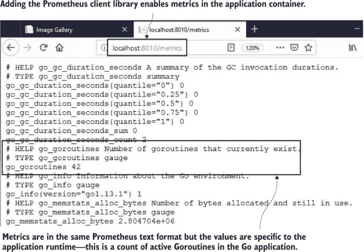

 Prometheus 关于 Go 运行时的指标，来自图片库的 Web 容器

如果你浏览到 http://localhost:8011/actuator/prometheus，你会看到 Java REST API 的类似指标。指标端点是文本的海洋，但所有关键数据点都在那里，可以构建一个仪表板，显示容器是否运行“过热”——如果它们正在使用大量的计算资源，如 CPU 时间、内存或处理器线程。

这些运行时指标是你在从 Docker 的基础设施指标之后想要查看的下一级详细信息，但这两个级别并没有告诉你整个故事。最终的数据点是应用程序指标，你明确捕获这些指标以记录关于应用程序的关键信息。这些指标可以是操作导向的，显示组件处理的事件数量或处理响应的平均时间。或者它们可以是业务导向的，显示当前活跃用户数量或注册新服务的人数。

Prometheus 客户端库也允许您记录这类指标，但您需要显式编写代码来捕获应用程序中的信息。这并不困难。列表 B.1 展示了一个使用 Node.js 库的示例，该示例位于图像库应用程序 `access-log` 组件的代码中。我不想向您展示一大堆代码，但随着您在容器方面进一步学习，您肯定会在 Prometheus 上花费更多的时间，而这个来自 `server.js` 文件的片段展示了几个关键点。

列表 B.1 在 Node.js 中声明和使用自定义 Prometheus 指标值

```
//declare custom metrics:
const accessCounter = new prom.Counter({
  name: "access_log_total",
  help: "Access Log - total log requests"
});

const clientIpGauge = new prom.Gauge({
  name: "access_client_ip_current",
  help: "Access Log - current unique IP addresses"
});

//and later, update the metrics values:
accessCounter.inc();
clientIpGauge.set(countOfIpAddresses);
```

在本章的源代码中，您将看到我是如何在用 Go 编写的 `image-gallery` 网络应用程序和用 Java 编写的 `image-of-the-day` REST API 中添加指标的。每个 Prometheus 客户端库的工作方式都不同。在 `main.go` 源文件中，我以类似于 Node.js 应用程序的方式初始化计数器和仪表，但随后使用来自客户端库的仪表化处理程序，而不是显式设置指标。Java 应用程序又有所不同——在 `ImageController.java` 中，我使用了 `@Timed` 属性并在源代码中增加了一个 `registry.counter` 对象。每个客户端库都以对语言最合理的方式工作。

Prometheus 中有不同的指标类型——我在这些应用程序中使用了最简单的类型：计数器和仪表。它们都是数值。计数器保持一个增加或保持不变的值，而仪表保持可以增加或减少的值。选择指标类型并在正确的时间设置其值取决于您或您的应用程序开发者；其余的由 Prometheus 和客户端库处理。

现在试试看 您已经从上一个练习中运行了图像库应用程序，因此这些指标已经被收集。向应用程序运行一些负载，然后浏览到 Node.js 应用程序的指标端点：

```
# loop to make 5 HTTP GET request - on Windows:
for ($i=1; $i -le 5; $i++) { iwr -useb http://localhost:8010 | Out-Null }

# or on Linux:
for i in {1..5}; do curl http://localhost:8010 > /dev/null; done

# now browse to http://localhost:8012/metrics 
```

您可以在图 B.7 中看到我的输出——我运行了更多的循环来发送流量。前两条记录显示了我的自定义指标，记录了接收到的访问请求数量和使用的总 IP 地址数。这些是简单的数据点（而 IP 计数实际上是假的），但它们起到了收集和展示指标的作用。Prometheus 允许您记录更复杂的指标类型，但即使使用简单的计数器和仪表，您也可以在应用程序中捕获详细的仪表化信息。

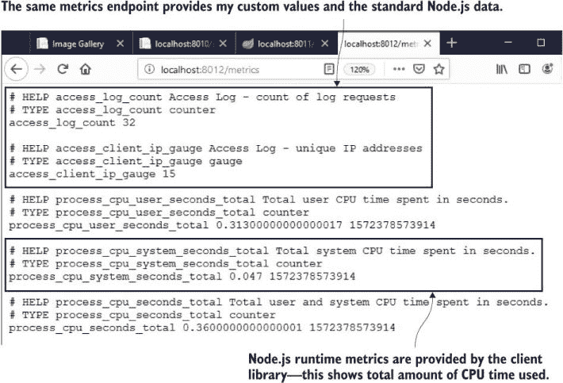

图 B.7 包含自定义数据和 Node.js 运行时数据的指标端点

您捕获的内容取决于您的应用程序，但以下列表提供了一些有用的指南——您可以在月底准备为您的应用程序添加详细监控时返回这些指南。

+   当您与外部系统通信时，记录调用花费的时间和响应是否成功——您将很快就能看到是否有其他系统正在减慢您的速度或破坏它。

+   任何值得记录的事件都可能在指标中记录——与写入日志条目相比，在内存、磁盘和 CPU 上增加计数器可能更便宜，而且更容易可视化事件发生的频率。

+   任何关于应用或用户行为，业务团队希望报告的细节都应该记录为指标——这样你就可以构建实时仪表板，而不是发送历史报告。

## B.3 运行 Prometheus 容器以收集指标

Prometheus 使用拉模型来收集指标。它不是让其他系统发送数据给它，而是从这些系统中获取数据。它称之为 *抓取*，当你部署 Prometheus 时，你需要配置它要抓取的端点。在一个生产容器平台上，你可以配置 Prometheus，使其自动发现集群中的所有容器。在单个服务器的 Docker Compose 中，你使用一个简单的服务名称列表，Prometheus 通过 Docker 的 DNS 来查找容器。

列表 B.2 展示了我为 Prometheus 配置的抓取图像库应用中两个组件的配置。有一个 `global` 设置，它使用默认的 10 秒间隔进行抓取，然后为每个组件有一个 `job`。作业有一个名称，配置指定了指标端点的 URL 路径以及 Prometheus 将查询的目标列表。我这里使用了两种类型。首先，`static_configs` 指定了一个目标主机名，这对于单个容器来说是可以的。我还使用了 `dns_sd_configs`，这意味着 Prometheus 将使用 DNS 服务发现——这将找到为服务提供的多个容器，并且它支持大规模运行。

列表 B.2 Prometheus 用于抓取应用指标的配置

```
global:
  scrape_interval: 10s

scrape_configs:
  - job_name: "image-gallery"
    metrics_path: /metrics
    static_configs:
      - targets: ["image-gallery"]

  - job_name: "iotd-api"
    metrics_path: /actuator/prometheus
    static_configs:
      - targets: ["iotd"]

  - job_name: "access-log"
    metrics_path: /metrics
    dns_sd_configs:
      - names:
          - accesslog
        type: A
        port: 80
```

此配置将 Prometheus 设置为每 10 秒轮询一次所有容器。它将使用 DNS 获取容器 IP 地址，但对于 `image-gallery`，它只期望找到一个容器，所以如果你扩展该组件，你会得到意外的行为。如果 DNS 响应包含多个 IP 地址，Prometheus 总是使用列表中的第一个 IP 地址，所以当 Docker 对指标端点进行负载均衡时，你会从不同的容器中获得指标。`accesslog` 组件配置为支持多个 IP 地址，所以 Prometheus 将构建一个包含所有容器 IP 地址的列表，并按照相同的计划轮询它们。图 B.8 展示了抓取过程是如何运行的。


图 B.8 Prometheus 在容器中运行，配置为从应用容器抓取指标

我为图像库应用构建了一个定制的 Prometheus Docker 镜像。它基于 Prometheus 团队在 Docker Hub 上发布的官方镜像，并复制了我的配置文件（你可以在本章源代码中找到 Dockerfile）。这种方法给我提供了一个预配置的 Prometheus 镜像，我可以无需任何额外配置即可运行，但如果需要，我可以在其他环境中覆盖配置文件。

当运行大量容器时，指标更有趣。我们可以将图像库应用的 Node.js 组件扩展到多个容器上运行，Prometheus 将从所有容器中抓取和收集指标。

现在尝试一下 该章节的练习文件夹中还有一个 Docker Compose 文件，它为 `access-log` 服务发布了一个随机端口，因此该服务可以大规模运行。运行三个实例并向网站发送更多负载：

```
docker-compose -f docker-compose-scale.yml up -d --scale accesslog=3

# loop to make 10 HTTP GET request - on Windows:
for ($i=1; $i -le 10; $i++) { iwr -useb http://localhost:8010 | Out-Null }

# or on Linux:
for i in {1..10}; do curl http://localhost:8010 > /dev/null; done
```

每次网站处理请求时都会调用 `access-log` 服务——运行该服务的有三个容器，因此调用应该在这所有容器之间进行负载均衡。我们如何检查负载均衡是否有效？该组件的指标包括一个标签，用于捕获发送指标的机器的主机名——在这种情况下是 Docker 容器 ID。打开 Prometheus UI 并检查 `access-log` 指标。你应该看到三组数据。

现在尝试一下 浏览到 http://localhost:9090/graph。在指标下拉菜单中，选择 `access_log_total` 并点击执行。

你会看到与我图 B.9 中类似的输出——每个容器都有一个指标值，标签包含主机名。每个容器的实际值将显示负载均衡的均匀程度。在理想情况下，这些数值应该是相等的，但由于存在许多网络因素（如 DNS 缓存和 HTTP 保持连接），这意味着如果你在单台机器上运行，你可能看不到这种情况。

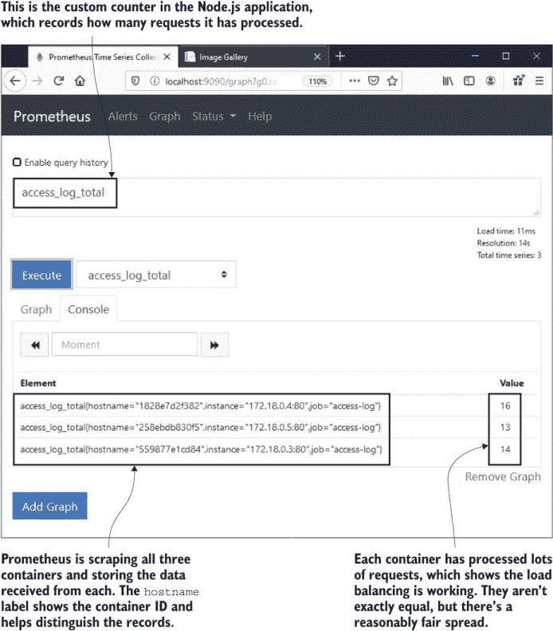

图 B.9 处理指标可以用来验证请求是否正在负载均衡。

使用标签记录额外信息是 Prometheus 最强大的功能之一。它允许你在不同粒度级别上使用单个指标。目前你看到的是指标的原始数据，表格中每行显示每个容器的最新指标值。你可以使用 `sum()` 查询跨所有容器进行聚合，忽略单个标签并显示总合，你还可以在图中显示随时间增加的使用情况。

现在尝试一下 在 Prometheus UI 中，点击添加图形按钮以添加新的查询。在表达式文本框中，粘贴以下查询：

```
sum(access_log_total) without(hostname, instance)
```

点击执行，你会看到一个带有时间序列的折线图，这是 Prometheus 表示数据的方式——一组带有时间戳记录的指标。

在我添加新的图形之前，我向本地应用发送了一些更多的 HTTP 请求——你可以在图 B.10 中看到我的输出。

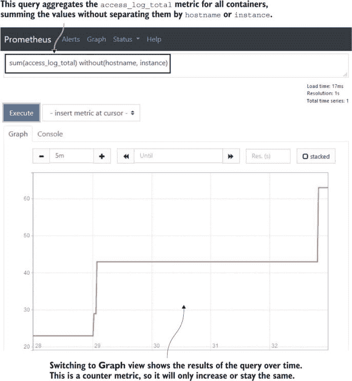

图 B.10 将指标聚合，从所有容器中汇总值并显示结果图

`sum()` 查询是用 Prometheus 自有的查询语言 *PromQL* 编写的。它是一种功能强大的语言，包含统计函数，允许你查询随时间的变化和变化率，并且你可以添加子查询来关联不同的指标。但是，你不需要深入到任何这种复杂性中就可以构建有用的仪表板。Prometheus 的格式结构非常良好，你可以通过简单的查询来可视化关键指标。你可以使用标签来过滤值，并汇总结果以进行聚合，仅这些功能就能为你提供一个有用的仪表板。

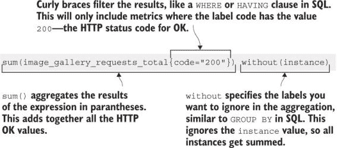

图 B.11 一个简单的 Prometheus 查询。你不需要学习比这更多的 PromQL。

图 B.11 展示了一个典型的查询，它将被用于仪表板。这个查询聚合了所有 `image_gallery_request` 指标的值，过滤出响应代码为 `200` 的情况，并且没有使用 `instance` 标签进行汇总，因此我们将从所有容器中获取指标。结果将是所有运行图像库网络应用程序的容器发送的 200 个“OK”响应的总数。

Prometheus UI 适用于检查你的配置，验证所有抓取目标是否可访问，以及制定查询。但它并不是一个仪表板——这正是 Grafana 的作用所在。

## B.4 运行 Grafana 容器以可视化指标

在本章中，我们涵盖了大量的内容，因为监控是容器的一个核心主题，但我们进展很快，因为更详细的内容都是非常依赖于应用程序的。你需要捕获哪些指标将取决于你的业务和运营需求，以及你如何捕获它们将取决于你使用的应用程序运行时以及该运行时的 Prometheus 客户端库的机制。

一旦你的数据在 Prometheus 中，事情就变得简单了——它成为所有应用程序的相当标准的做法。你将使用 Prometheus UI 来导航你记录的指标并制定查询以获取你想要看到的数据。然后你将运行 Grafana 并将这些查询连接到仪表板。每个数据点都以用户友好的可视化形式出现，整个仪表板展示了你的应用程序正在发生的事情。

我们一直在本章中致力于构建图像库应用程序的 Grafana 仪表板，图 B.12 展示了最终结果。这是一种非常整洁的方式来展示所有应用程序组件和 Docker 运行时的核心信息。这些查询也构建来支持扩展，因此相同的仪表板可以在生产集群中使用。

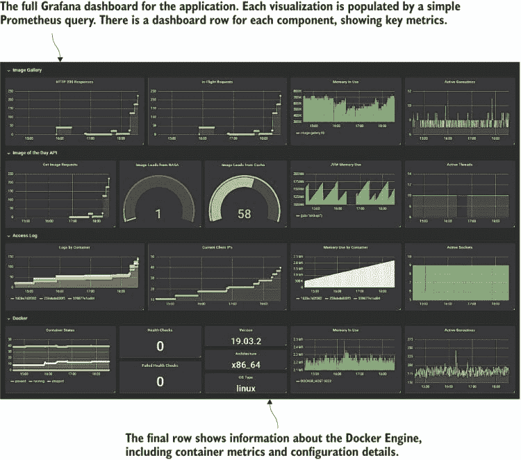

图 B.12 应用程序的 Grafana 仪表板。看起来很复杂，但实际上构建起来相当简单。

Grafana 仪表板在应用程序的许多不同级别传达关键信息。它看起来很复杂，但每个可视化都由一个单一的 PromQL 查询提供支持，并且没有任何查询比过滤和聚合更复杂。图 B.12 的缩小视图没有给出完整的画面，但我已经将仪表板打包到一个自定义的 Grafana 图像中，这样您就可以在容器中运行它并探索。

现在试试看 您需要再次捕获计算机的 IP 地址，这次作为 Compose 文件查找并注入 Prometheus 容器中的环境变量。然后使用 Docker Compose 运行应用程序并生成一些负载：

```
# load your machine's IP address into an environment variable - on Windows:
$env:HOST_IP = $(Get-NetIPConfiguration | Where-Object {$_.IPv4DefaultGateway -ne $null }).IPv4Address.IPAddress

# on Linux:
export HOST_IP=$(ip route get 1 | awk '{print $NF;exit}')

# run the app with a Compose file which includes Grafana:
docker-compose -f ./docker-compose-with-grafana.yml up -d --scale accesslog=3

# now send in some load to prime the metrics - on Windows:
for ($i=1; $i -le 20; $i++) { iwr -useb http://localhost:8010 | Out-Null }

# or on Linux:
for i in {1..20}; do curl http://localhost:8010 > /dev/null; done

# and browse to http://localhost:3000
```

Grafana 使用端口 3000 用于 Web UI。当您首次浏览时，您需要登录——凭据是用户名 `admin`，密码 `admin`。您将在第一次登录时被要求更改管理员密码，但如果您点击跳过，我不会评判您。当 UI 加载时，您将进入您的“主页”仪表板——点击左上角的“主页”链接，您将看到图 B.13 中的仪表板列表。点击图像库以加载应用程序仪表板。

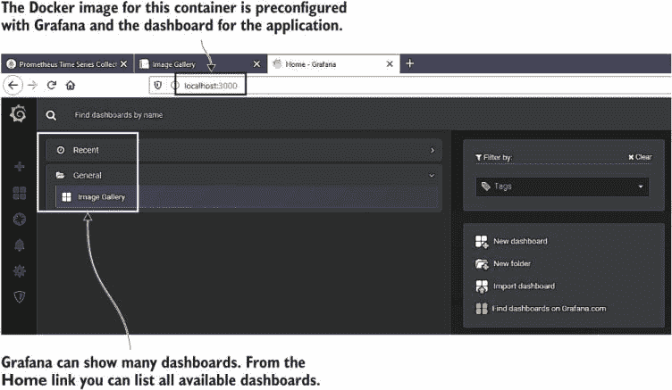

图 B.13 在 Grafana 中导航仪表板——最近使用的文件夹显示在此处

我的仪表板是一个合理的生产系统设置。您需要一些关键数据点，以确保您正在监控正确的事情——Google 在 *网站可靠性工程* 书籍中讨论了这一点 ([`mng.bz/EdZj`](http://mng.bz/EdZj))。他们的重点是延迟、流量、错误和饱和度，他们称之为“黄金信号”。

我将详细说明我的第一组可视化，以便您可以看到一个智能仪表板可以从基本的查询和正确的可视化选择中构建。图 B.14 显示了图像库 Web UI 的指标行——我将这一行分割开来以便更容易查看，但在仪表板上这些指标显示在同一行。

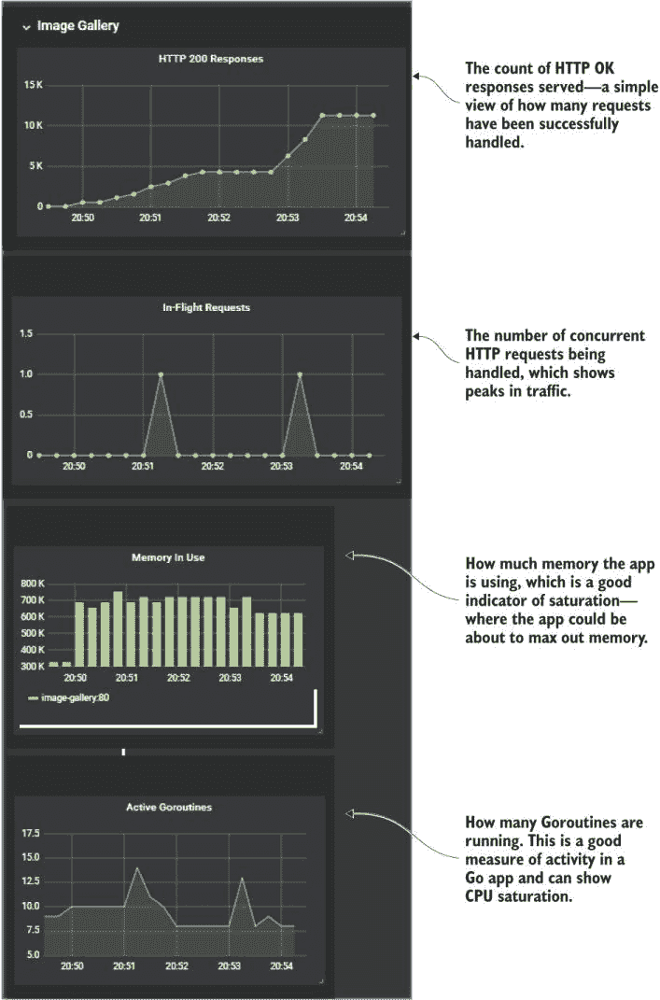

图 B.14 更仔细地查看应用程序仪表板以及可视化如何与黄金信号相关

这里有四个指标显示了系统被使用的程度以及系统为了支持这种使用水平所付出的努力：

+   *HTTP 200 响应*——这是网站随时间发送的 HTTP “OK” 响应的简单计数。PromQL 查询是对应用程序的计数器指标的总和：`sum(image_gallery_requests_total{code="200"})` `without(instance)`。我可以添加一个类似的图表，通过查询过滤 `code="500"` 来显示错误数量。

+   *飞行请求*——这显示了在任何给定时间点的活动请求数量。这是一个 Prometheus 仪表，因此它可以上升或下降。对此没有过滤器，图表将显示所有容器中的总数，因此查询是另一个求和：`sum(image_gallery_in_flight_requests)` `without(instance)`。

+   *内存使用量*——这显示了图像库容器使用的系统内存量。这是一个柱状图，对于这类数据来说更容易观察；当我扩展 Web 组件时，它将显示每个容器的条形图。PromQL 查询根据作业名称进行筛选：`go_memstats_stack_inuse_bytes{job="image-gallery"}`。我需要这个筛选器，因为这是一个标准的 Go 指标，而 Docker Engine 作业返回的指标具有相同的名称。

+   *活跃的 Goroutines*——这是一个粗略的指标，表明组件工作有多努力——Goroutine 是 Go 中的工作单元，可以并发运行多个。这个图表将显示 Web 组件是否突然出现处理活动的峰值。这是另一个标准的 Go 指标，所以 PromQL 查询从 Web 作业筛选统计信息并求和：`sum(go_goroutines{job="image-gallery"})` `without(instance)`。

仪表板其他行中的可视化都使用类似的查询。不需要复杂的 PromQL——选择正确的指标来显示以及正确的可视化方式来展示它们，这才是你真正需要的。

在这些可视化中，实际值不如趋势有用。我的 Web 应用平均使用 200 MB 内存或 800 MB 实际上并不重要——重要的是当出现突然的峰值偏离正常情况时。组件的指标集应该帮助你快速看到异常并找到相关性。如果错误响应的图表呈上升趋势，并且每几秒钟活跃的 Goroutines 数量翻倍，那么很明显有问题——组件可能已饱和，因此你可能需要通过增加更多容器来扩展以处理负载。

Grafana 是一个非常强大的工具，但使用起来非常简单。它是现代应用中最受欢迎的仪表板系统，因此值得学习——它可以查询许多不同的数据源，并且可以向不同的系统发送警报。构建仪表板与编辑现有仪表板相同——你可以添加或编辑可视化（称为*面板*），调整大小并移动它们，然后将你的仪表板保存到文件中。

现在试试看 Google SRE 方法认为 HTTP 错误计数是一个核心指标，但这个指标在仪表板中缺失，所以我们现在将其添加到图像库行。如果你还没有运行整个图像库应用，请重新运行它，浏览到 Grafana 的 http://locahost:3000，并使用用户名`admin`和密码`admin`登录。

打开图像库仪表板，点击屏幕右上角的添加面板图标——如图 B.15 所示，它是一个带有加号的柱状图。

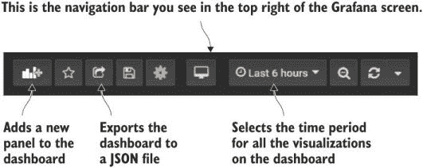

图 B.15 Grafana 工具栏，用于添加面板、选择时间段和保存仪表板

现在点击新面板窗口中的添加查询，你将看到一个屏幕，你可以捕捉到可视化的所有细节。选择 Prometheus 作为查询的数据源，并在指标字段粘贴以下 PromQL 表达式：

```
sum(image_gallery_requests_total{code="500"}) without(instance)
```

您的面板应该看起来像图 B.16 中的我的那样。图像库应用程序大约有 10%的时间会返回错误响应，所以如果您发出足够的请求，您会在图表中看到一些错误。

按下 Esc 键返回主仪表板。

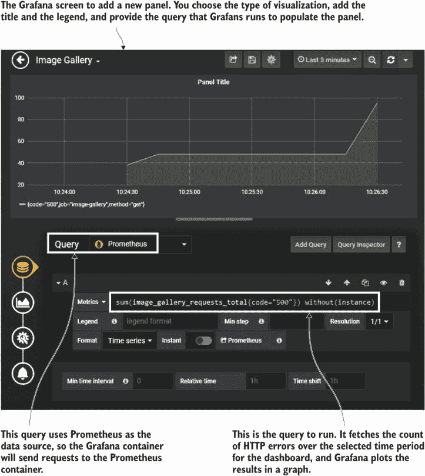

图 B.16 向 Grafana 仪表板添加新面板以显示 HTTP 错误

您可以通过拖动底右角来调整面板大小，通过拖动标题来移动它们。当仪表板看起来符合您的要求时，您可以从工具面板中点击“共享仪表板”图标（再次查看图 B.15），在那里您可以选择将仪表板导出为 JSON 文件。

使用 Grafana 的最终步骤是打包您自己的 Docker 镜像，该镜像已经配置了 Prometheus 作为数据源和应用程序仪表板。我已经为`diamol/ch09-grafana`镜像做了这件事。列表 B.3 显示了完整的 Dockerfile。

列表 B.3 打包自定义 Grafana 镜像的 Dockerfile

```
FROM diamol/grafana:6.4.3

COPY datasource-prometheus.yaml ${GF_PATHS_PROVISIONING}/datasources/
COPY dashboard-provider.yaml ${GF_PATHS_PROVISIONING}/dashboards/
COPY dashboard.json /var/lib/grafana/dashboards/
```

镜像从一个特定的 Grafana 版本开始，然后只是复制一组 YAML 和 JSON 文件。Grafana 遵循我在本书中已经推广的配置模式——内置了一些默认配置，但您可以应用自己的配置。当容器启动时，Grafana 会在特定文件夹中查找文件，并应用它找到的任何配置文件。YAML 文件设置 Prometheus 连接并加载位于`/var/lib/Grafana/dashboards`文件夹中的任何仪表板。最后一行将我的仪表板 JSON 复制到该文件夹，因此当容器启动时它会加载。

您可以使用 Grafana 配置进行更多操作，您还可以使用 API 创建用户并设置他们的偏好。构建一个包含多个仪表板和具有访问所有这些仪表板权限的只读用户（这些仪表板可以组合成一个 Grafana 播放列表）的 Grafana 镜像并不需要做太多工作。然后您可以在办公室的大屏幕上浏览 Grafana，并自动循环显示所有仪表板。

## B.5 理解可观察性的级别

当您从简单的概念验证容器转移到准备生产时，可观察性是一个关键要求。但我在本章引入 Prometheus 和 Grafana 的另一个非常好的原因是：学习 Docker 不仅仅是关于 Dockerfile 和 Docker Compose 文件的机制。Docker 的魔力之一是围绕容器成长起来的巨大生态系统以及围绕该生态系统出现的模式。

当容器最初变得流行时，监控确实是个头疼的问题。我那时的生产发布与今天一样容易构建和部署，但我在应用程序运行时没有洞察力。我必须依赖外部服务如 Pingdom 来检查我的 API 是否仍然可用，并依赖用户报告来确保应用程序运行正确。今天监控容器的做法是一条经过验证且值得信赖的道路。我们在本章中遵循了这条道路，图 B.17 总结了这种方法。

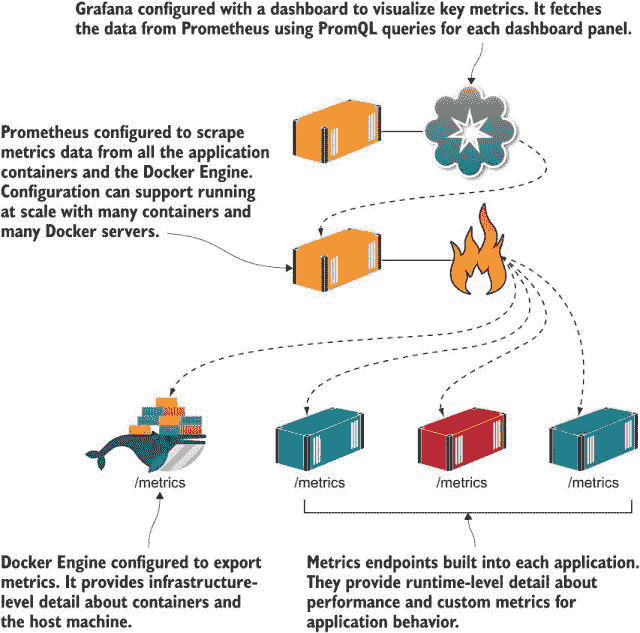

图 B.17 容器化应用程序的监控架构-Prometheus 位于中心。

我已经为图像库应用程序走过了单个仪表板，这是应用程序的整体视图。在生产环境中，你会有额外的仪表板，深入到更详细的层次。会有一个基础设施仪表板显示所有服务器的可用磁盘空间、可用 CPU 和内存以及网络饱和度。每个组件可能都有自己的仪表板，显示额外的信息，例如，为 Web 应用程序的每一页或每个 API 端点提供服务的响应时间分解。

摘要仪表板是关键。你应该能够将应用程序指标中的所有最重要的数据点汇总到一个屏幕上，这样你就可以一眼看出是否有问题，并在问题恶化之前采取规避措施。

## B.6 实验室

本章为图像库应用程序添加了监控，这个实验室要求你对待办事项列表应用程序做同样的事情。你不需要深入研究源代码——我已经构建了一个包含 Prometheus 指标的新版本的应用程序镜像。从 `diamol/ch09-todo-list` 运行一个容器，浏览到应用程序，添加一些项目，你将看到 `/metrics` URL 上可用的指标。对于实验室，你希望将那个应用程序带到与图像库相同的位置：

+   编写一个 Docker Compose 文件，你可以使用它来运行应用程序，它还会启动一个 Prometheus 容器和 Grafana 容器。

+   Prometheus 容器应该已经配置为从待办事项列表应用程序抓取指标。

+   Grafana 容器应该配置了一个仪表板，以显示应用程序的三个关键指标：创建的任务数量、处理的 HTTP 请求总数以及当前正在处理的 HTTP 请求数量。

这听起来像是一大堆工作，但实际上并不是——本章的练习涵盖了所有细节。这是一个很好的实验室，因为它将为你提供与新的应用程序一起处理指标的经验。

和往常一样，你可以在 GitHub 上找到我的解决方案，以及我最终仪表板的图形：[`github.com/sixeyed/diamol/blob/master/ch09/lab/README.md`](https://github.com/sixeyed/diamol/blob/master/ch09/lab/README.md)。
