# 附录 C. 容器中的应用配置管理

应用程序需要从它们运行的运行环境中加载其配置，这通常是环境变量和从磁盘读取的文件的组合。Docker 为在容器中运行的应用程序创建该环境，它可以设置环境变量并从许多不同的来源构建文件系统。所有这些部件都是为了帮助您为应用程序构建一个灵活的配置方法，因此当您部署到生产环境时，您使用的是通过了所有测试阶段的相同镜像。您只需做一些工作来将这些部件组合在一起，设置您的应用程序以从多个位置合并配置值。

本章将通过.NET Core、Java、Go 和 Node.js 中的示例，向您介绍推荐的方法（以及一些替代方案）。这里的一些工作位于开发空间中，引入库以提供配置管理，其余部分位于开发和运维之间的灰色区域，该区域依赖于沟通，以便双方都了解配置模型的工作方式。

本附录摘自 Elton Stoneman 所著的《Learn Docker in a Month of Lunches》第十八章“容器中的应用配置管理”（Manning, 2020）。任何章节引用或代码仓库引用均指该书的相关章节或代码仓库。

## C.1 应用配置的多层方法

您的配置模型应反映您存储的数据的结构，这通常是以下三种类型之一：

+   版本级别的设置，对于给定版本的所有环境都是相同的

+   环境级别的设置，对于每个环境都是不同的

+   特性级别的设置，可用于在版本之间更改行为

其中一些是相当静态的，一些是动态的，具有一组已知的变量，而其他一些是动态的，具有一组未知的变量。图 C.1 展示了某些示例配置设置以及它们可以从环境中读取的位置。

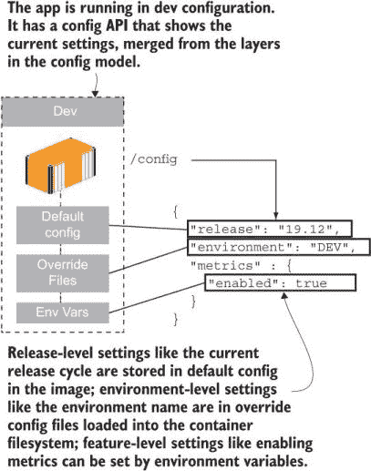

图 C.1 从镜像、文件系统和环境变量中获取设置的配置层次结构

我们将使用的第一个示例是 Node.js，以及一个流行的配置管理库 node-config。该库允许您从层次结构中的多个文件位置读取配置，并用环境变量覆盖它们。本章练习中的 access-log 示例应用使用了 node-config 库，并设置了两个目录来读取配置文件

+   `config`—这将与默认设置一起打包到 Docker 镜像中。

+   `config-override`—该镜像中不存在，但可以从卷、配置对象或密钥中在容器文件系统中配置。

现在尝试一下 运行带有默认配置的示例应用，然后是带有开发环境覆盖文件的相同镜像：

```
cd ch18/exercises/access-log

# run a container with the default config in the image:
docker container run -d -p 8080:80 diamol/ch18-access-log

# run a container loading a local config file override:
docker container run -d -p 8081:80 -v "$(pwd)/config/dev:/app/config-override" diamol/ch18-access-log

# check the config APIs in each container:
curl http://localhost:8080/config
curl http://localhost:8081/config
```

第一个容器仅使用图像中打包的默认配置文件——该文件指定了发布周期名称（19.12）并设置了要启用的 Prometheus 指标。环境名称有一个`UNKNOWN`设置——如果你看到这个设置，你就知道环境级别的配置设置还没有被正确应用。第二个容器将本地配置目录作为卷加载到应用程序预期的位置以查找覆盖——它设置了环境名称并将指标功能关闭。当你调用配置 API 时，你会看到来自同一图像的容器应用了不同的设置——我的设置在图 C.2 中。

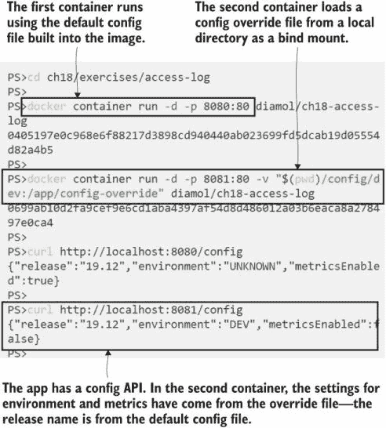

图 C.2 使用卷、配置对象或秘密合并配置文件很简单。

从应用程序代码中已知路径加载配置覆盖，让你可以从任何来源提供它们到容器中。我正在使用本地绑定挂载，但源可以是配置对象或存储在容器集群中的秘密，行为将是相同的。这个模式有一个细微差别——你的配置目标可以是特定的文件路径或目录。目录目标更灵活（Windows 容器不支持从单个文件加载卷），但源文件名需要与应用程序期望的配置文件名匹配。在这个例子中，绑定源是目录 `config/dev`，它包含一个文件——容器看到 `/app/config-override/local.json`，这是它查找覆盖的地方。

节点配置包还可以从环境变量中加载设置，并且它们会覆盖从文件层次结构加载的任何设置。这是在《十二要素应用》中推荐的方法（[`12factor.net`](https://12factor.net)）——一种现代的应用架构风格，其中环境变量始终优先于其他配置源。这是一个有用的方法，有助于你养成容器是瞬时的思维模式，因为更改环境变量以设置应用程序配置意味着替换容器。Node-config 有一个稍微不同寻常的实现：不是将单个设置指定为环境变量，你需要以 JSON 格式的字符串形式在环境变量中提供设置。

现在试试看 运行第三个版本的访问日志容器，以开发模式运行但启用指标。使用卷挂载加载开发配置，并使用环境变量覆盖指标设置：

```
cd ch18/exercises/access-log

# run a container with an override file and an environment variable:
docker container run -d -p 8082:80 -v "$(pwd)/config/dev:/app/config-override" -e NODE_CONFIG='{\"metrics\": {\"enabled\":\"true\"}}' diamol/ch18-access-log

# check the config:
curl http://localhost:8082/config
```

第三个容器合并了来自镜像中默认文件、卷中的本地配置覆盖文件和特定环境变量设置的配置。这是一个构建配置以使开发者工作流程顺利运行的优秀示例。开发者可以运行默认设置而不启用度量（这将节省 CPU 周期和内存），但当他们需要为某些调试打开度量时，他们可以使用相同的镜像和环境变量切换来完成。图 C.3 显示了我的输出。

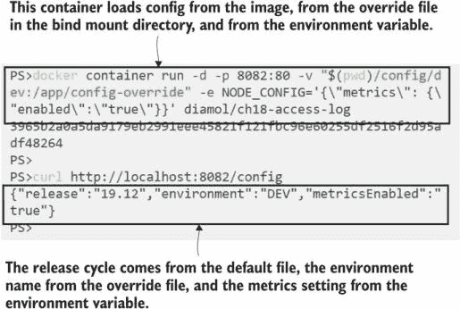

图 C.3 从环境变量合并配置使得更改特定功能变得容易。

这是您应该在所有应用程序中应用的配置核心模式。从这个例子中，您可以清楚地看到模式，但细节很重要，这就是在交付和部署之间知识可能崩溃的灰色区域。访问日志应用程序允许您使用新的配置文件覆盖默认配置文件，但该目标文件必须位于特定位置。您还可以使用环境变量覆盖所有文件设置，但环境变量需要是 JSON 格式。最终，这将在您用于部署的 YAML 文件中记录，但您需要意识到这种模式有可能出错。一种替代方法可以消除这种风险，但代价是使配置管理变得不那么灵活。

## C.2 为每个环境打包配置

许多应用程序框架支持一种配置管理系统，其中您将部署中每个环境的所有配置文件捆绑在一起，在运行时设置单个值以指定正在运行的环境名称。应用程序平台加载与匹配环境名称的配置文件，您的应用程序就完全配置好了。.NET Core 通过其默认配置提供程序设置来实现这一点，配置设置从以下来源合并：

+   `appsettings.json`—所有环境的默认值

+   `appsettings.{Environment}.json`—指定环境的覆盖

+   *环境变量*—用于指定环境名称，以及设置覆盖

本章介绍了一种新的待办事项列表应用程序版本，该版本采用将所有配置文件打包到 Docker 镜像中的方法。您使用特定的环境变量来提供当前环境名称，该名称在加载其他配置文件之前被加载。

现在尝试一下 运行默认配置的待办事项列表应用程序，默认配置设置为环境名称开发，然后使用测试环境设置：

```
# run the to-do list app with default config:
docker container run -d -p 8083:80 diamol/ch18-todo-list

# run the app with the config for the test environment:
docker container run -d -p 8084:80 -e DOTNET_ENVIRONMENT=Test diamol/ch18-todo-list
```

两个容器是从相同的镜像运行的，但加载不同的配置文件。在镜像内部，有针对开发、测试和生产环境的配置文件。第一个容器将核心 `appsettings.json` 与 `appsettings.Development.json` 合并——它以开发模式运行，因为在 Dockerfile 中将 Development 设置为默认环境。第二个容器将 `appsettings.json` 与 `appsettings.Test.json` 合并。这两个环境配置文件已经存在于 Docker 镜像中，因此不需要挂载外部源以获取新的配置。浏览到 http://localhost:8083/diagnostics 以查看开发配置，并浏览到 http://localhost:8084/diagnostics 以查看测试版本。我的输出在图 C.4 中。

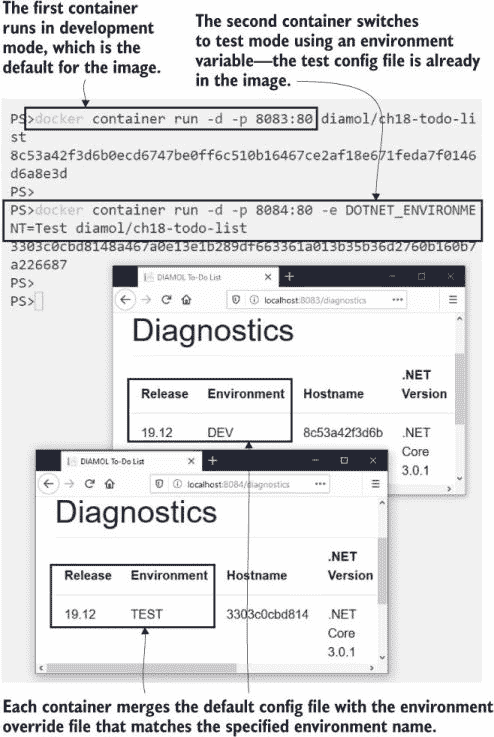

图 C.4 将每个环境的配置文件打包到镜像中，使得切换环境变得容易。

如果你有一个单独的系统来管理你的配置文件和源代码，这种方法可以很好地工作。CI/CD 管道可以将配置文件作为构建的一部分带入 Docker 镜像，这样你就可以将配置管理从开发中分离出来。缺点是，你仍然不能打包每个设置，因为你需要将机密信息从 Docker 镜像中排除。你需要有一个多层次的安全方法，并假设你的注册表可能会被攻破——在这种情况下，你不想让某人找到你镜像中的所有密码和 API 密钥。

如果你喜欢这种方法，你仍然需要允许覆盖文件和最终的环境变量覆盖。待办事项列表应用程序就是这样做的，如果存在，它会从名为 `config-overrides` 的文件夹中加载文件，并使用 .NET Core 的标准方法最后加载环境变量。这让你能够做些有用的事情，比如如果你正在尝试复制一个问题，可以在本地运行生产环境，但覆盖环境设置以使用数据库文件而不是远程数据库服务器。

现在尝试一下 尽管所有环境配置都打包在应用程序中，待办事项列表应用程序仍然支持配置覆盖。如果你以生产模式运行，应用程序会失败，因为它期望找到一个数据库服务器，但你可以使用覆盖文件以使用数据库文件而不是数据库服务器来以生产模式运行：

```
cd ch18/exercises/todo-list

docker container run -d -p 8085:80 -e DOTNET_ENVIRONMENT=Production -v "$(pwd)/config/prod-local:/app/config-override" diamol/ch18-todo-list
```

你可以浏览到 http://localhost:8085/diagnostics 并看到应用程序正在以生产模式运行，但配置文件覆盖更改了数据库设置，因此应用程序仍然可以在不运行 Postgres 容器的情况下工作。我的输出在图 C.5 中。

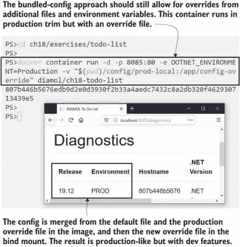

图 C.5 选择运行的环境仍然应该支持来自附加文件的配置覆盖。

此容器将默认的`appsettings.json`文件与`prod-local`文件夹中的环境文件`appsettings.Production.json`和重写文件`local.json`合并。设置类似于 Node.js 示例，因此在文件夹和文件名方面有一些一致性，但.NET Core 在设置环境变量重写方面采取了不同的方法。在 node-config 中，你通过将 JSON 字符串作为环境变量传递来覆盖设置，但在.NET Core 中，你指定单个设置作为环境变量。

现在试试看 运行与生产相同的本地版本，但通过用环境变量覆盖该设置来使用自定义发布名称：

```
# run the container with a bind mount and a custom environment variable:
docker container run -d -p 8086:80 -e DOTNET_ENVIRONMENT=Production -e release=CUSTOM -v "$(pwd)/config/prod-local:/app/config-override" diamol/ch18-todo-list
```

浏览到 http://localhost:8086/diagnostics，你会看到来自环境变量的自定义发布名称。我的输出在图 C.6 中。

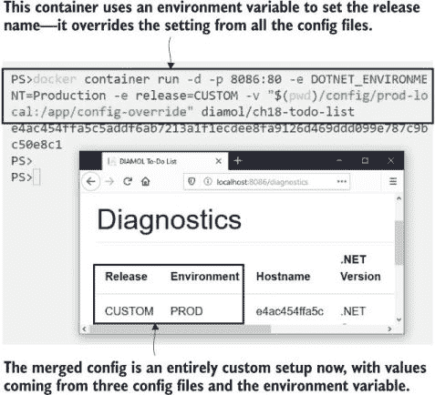

图 C.6 配置层次结构覆盖了任何配置文件中的环境变量值。

我必须说我不喜欢这种打包多个配置文件的方式，尽管这在许多应用平台上是一种常见的做法。存在一种风险，你可能会在镜像中包含一些你认为不敏感的配置设置，但你的安全团队可能不同意。服务器名称、URL、文件路径、日志级别，甚至缓存大小都可能是有意攻击你系统的人有用的信息。在你将所有机密设置移动到从运行时应用的重写文件之前，这些打包的环境文件中可能已经所剩无几了。我也不喜欢这种分割，其中一些设置在源代码控制中管理，而其他设置在配置管理系统中。

容器的美丽之处在于你可以遵循你喜欢的任何模式，所以不要让我为你做决定。某些方法更适合你的组织和技术堆栈。如果你要处理多个堆栈，事情也会变得更加复杂——你将在下一个使用 Go 应用的示例中看到这一点。

## C.3 从运行时加载配置

Go 有一个流行的配置模块叫做 Viper，它提供了与.NET Core 库或 node-config 类似的许多功能。你将模块添加到你的包列表中，并在你的应用程序代码中指定配置目录的路径以及你是否希望环境变量用来覆盖配置文件。我已经将它添加到本章的图像库应用程序中，使用与其他示例类似的层次结构：

+   首先从`config`目录加载文件，该目录在 Docker 镜像中已填充。

+   特定于环境的文件从`config-override`目录加载，该目录在镜像中为空，可以是容器文件系统挂载的目标。

+   环境变量覆盖文件设置。

Viper 支持比其他示例更广泛的配置文件语言集。您可以使用 JSON 或 YAML，但在 Go 世界中流行的格式是 TOML（以创建者 Tom Preston-Werner 命名）。TOML 非常适合配置文件，因为它可以轻松地映射到代码中的字典，并且比 JSON 或 YAML 更容易阅读。表 C.1 显示了图像库应用程序的 TOML 配置。

表 C.1 TOML 格式使得配置文件易于管理

```
release = "19.12"
environment = "UNKNOWN"

[metrics]
enabled = true

[apis]

 [apis.image]
 url = "http://iotd/image"

 [apis.access]
 url = "http://accesslog/access-log"
```

您会在许多云原生项目中看到 TOML 的使用，因为它比替代方案容易得多。如果您可以选择格式，TOML 值得考虑，因为“易于阅读”也意味着易于调试，并且易于在合并工具中查看版本之间的差异。除了文件格式之外，此示例与 Node.js 应用程序以相同的方式工作，默认的`config.toml`文件打包到 Docker 镜像中。

现在尝试一下：运行应用程序，无需任何额外的配置设置，以检查默认值：

```
# run the container:
docker container run -d -p 8086:80 diamol/ch18-image-gallery

# check the config API:
curl http://localhost:8086/config
```

当您运行此练习时，您将看到当前应用程序配置，所有这些配置都来自默认的 TOML 文件。我的输出在图 C.7 中，显示了发布周期和应用程序所消耗的 API 的默认 URL。

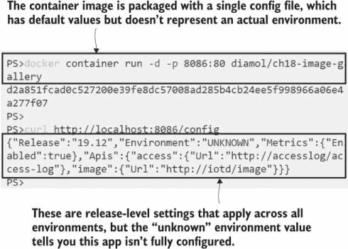

图 C.7 您可以使用默认设置打包应用程序，这些设置可以工作，但不是完整的开发环境。

输出来自一个配置 API，该 API 返回当前配置设置的 JSON。当您有多个配置源时，配置 API 是您应用程序中的一个非常有用的功能；它使得调试配置问题变得容易得多，但您需要保护这些数据。如果任何人尝试浏览到`/config`都可以公开读取机密设置，那么使用机密设置来保护机密设置就没有意义，所以如果您要添加配置 API，您需要做三件事：

+   不要只发布整个配置；要有选择性，永远不要包含机密信息。

+   保护端点，以确保只有授权用户可以访问它。

+   将配置 API 制作成一个可以通过配置启用的功能。

图像库应用程序采用与分层配置模型略有不同的方法——默认设置保存在图像中，但不是针对任何特定环境。预期是每个环境都将指定自己的附加配置文件，该文件扩展或覆盖默认文件中的设置，以设置完整的开发环境。

现在尝试一下：再次运行相同的应用程序，使用覆盖文件来构建完整的开发环境：

```
cd ch18/exercises/image-gallery

# run the container with a bind mount to the local config directory:
docker container run -d -p 8087:80 -v "$(pwd)/config/dev:/app/config-override" diamol/ch18-image-gallery

# check config again:
curl http://localhost:8087/config
```

图 C.8 我在图 C.8 中的输出显示，应用程序现在已完全配置为开发环境，将镜像中的发布级别配置文件与环境覆盖文件合并。

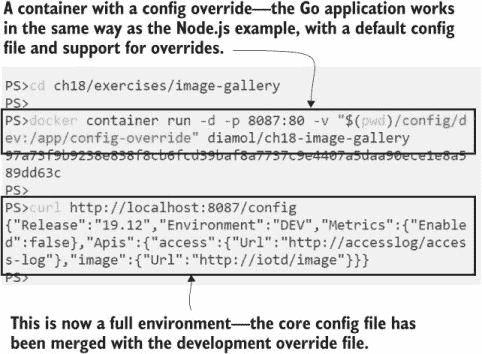

图 C.8 Go Viper 模块以与 node-config 包相同的方式合并配置文件。

展示所有这些关于配置主题的细微差异并不仅仅是为了填补章节内容。当组织采用 Docker 时，他们往往会发现使用速度加快，很快就会有大量应用程序在容器中运行，每个应用程序都有自己的配置观点。由于应用程序平台在提供的功能和期望的约定上有所不同，因此必然会发生许多这样的小差异。您可以在高层次上应用标准——镜像必须包含默认配置，并且必须支持文件和环境变量覆盖——但是配置文件和环境变量格式的细节将难以标准化。

我们将在最后一个 Go 应用程序的例子中看到这一点。Viper 模块支持使用环境变量覆盖配置文件中的设置，但与 node-config 和.NET Core 的约定不同。

现在尝试一下：使用环境变量覆盖运行容器。这个应用程序中的配置模型只使用以`IG`为前缀的环境变量：

```
cd ch18/exercises/image-gallery

# run the container with config override and an environment variable:
docker container run -d -p 8088:80 -v "$(pwd)/config/dev:/app/config-override" -e IG_METRICS.ENABLED=TRUE diamol/ch18-image-gallery

# check the config:
curl http://localhost:8088/config
```

Viper 的约定是，你应该在环境变量名称前加上前缀，以避免与其他环境变量冲突。在这个应用程序中，前缀是`IG`，后面跟着一个下划线，然后是配置设置名称的点表示法（因此`IG_METRICS.ENABLED`与 TOML 文件中`metrics`组中的`enabled`值匹配）。您可以从我的输出中看到，图 C.9 中的这种设置在默认设置之上添加了开发环境，但随后覆盖了指标设置以启用 Prometheus 指标。

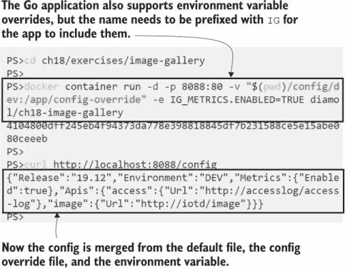

图 C.9 所有示例应用程序都支持配置环境变量，但有一些小的差异。

我们已经用三个不同的应用程序走过了配置建模，我们有三种略有不同的方法。这些差异是可控的，并且很容易在应用程序清单文件中记录下来，并且实际上它们不会影响您构建镜像或运行容器的方式。在本章中，我们将查看一个最后的例子，它采用相同的配置模型并将其应用于没有漂亮的新配置库的应用程序，因此需要做一些额外的工作来使其表现得像现代应用程序。

## C.4 以与新型应用程序相同的方式配置传统应用程序

传统应用程序对配置有自己的想法，通常不涉及环境变量或文件合并。例如，Windows 上的.NET Framework 应用程序——它们期望在特定位置有 XML 配置文件。它们不喜欢在应用程序根文件夹外寻找文件，并且根本不查看环境变量。您仍然可以使用相同的配置方法来处理这些应用程序，但您需要在 Dockerfile 中做一些额外的工作。

这里采用的方法是将实用应用程序或脚本集打包，将容器环境中的配置设置转换为应用程序期望的配置模型。具体的实现将取决于你的应用程序框架以及它如何使用配置文件，但逻辑可能如下所示：

1.  从容器中指定的源文件读取配置覆盖设置。

1.  从环境变量中读取覆盖设置。

1.  合并两组覆盖设置，使环境变量具有优先权。

1.  将合并后的覆盖设置写入容器中指定的目标文件。

在本章的练习中，有一个使用此方法的每日图像 Java API 的更新版本。它实际上不是一个遗留应用程序，但我已经按照遗留模式构建了镜像，好像应用程序不能使用正常的容器配置选项。有一个在启动时运行的实用程序来设置配置，所以尽管内部配置机制不同，用户仍然可以像其他示例一样配置容器。

现在尝试运行“遗留”应用程序，使用默认配置设置和文件覆盖：

```
cd ch18/exercises/image-of-the-day

# run a container with default configuration:
docker container run -d -p 8089:80 diamol/ch18-image-of-the-day

# run with a config override file in a bind mount:
docker container run -d -p 8090:80 -v "$(pwd)/config/dev:/config-override"
                     -e CONFIG_SOURCE_PATH="/config-override/application.properties" diamol/ch18-image-of-the-day

# check the config settings:
curl http://localhost:8089/config
curl http://localhost:8090/config
```

用户体验与其他应用程序非常相似——挂载带有环境覆盖文件的卷（源可以是配置对象或密钥）——但你必须另外指定覆盖文件的位置在环境变量中，这样启动实用程序就知道在哪里查找。你将在输出中看到，镜像中的默认配置指定了发布周期，但没有指定环境——这将在第二个容器中的覆盖文件中合并。我的输出在图 C.10 中。

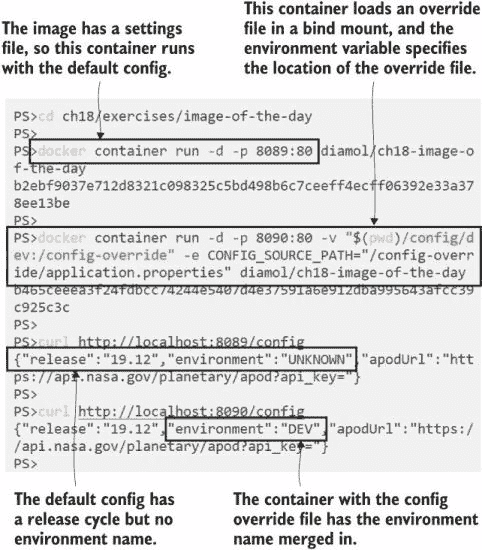

图 C.10 此应用程序有一个实用程序来引导配置模型，但用户体验保持不变。

魔法在这里发生在一个简单的 Java 实用应用程序中，它与应用程序的其他部分一起编译和打包在同一个多阶段构建中。列表 C.2 显示了构建实用程序并将其设置为启动时运行的 Dockerfile 的关键部分。

列表 C.2 在 Dockerfile 中构建和使用配置加载实用程序

```
FROM diamol/maven AS builder
# ...
RUN mvn package

# config util
FROM diamol/maven as utility-builder
WORKDIR /usr/src/utilities
COPY ./src/utilities/ConfigLoader.java .
RUN javac ConfigLoader.java

# app
FROM diamol/openjdk
ENV CONFIG_SOURCE_PATH="" \
    CONFIG_TARGET_PATH="/app/config/application.properties"

CMD java ConfigLoader && \
    java -jar /app/iotd-service-0.1.0.jar

WORKDIR /app
COPY --from=utility-builder /usr/src/utilities/ConfigLoader.class .
COPY --from=builder /usr/src/iotd/target/iotd-service-0.1.0.jar .
```

这里的重要收获是你可以扩展你的 Docker 镜像，使旧应用程序的行为与新应用程序相同。你控制启动逻辑，因此可以在启动实际应用程序之前运行所需的任何步骤。当你这样做时，你增加了容器启动和应用程序准备就绪之间的时间，同时也增加了容器可能失败的风险（如果启动逻辑有错误）。你应该始终在你的镜像或应用程序清单中包含健康检查，以减轻这种风险。

我的配置加载实用程序应用程序支持 12 因子方法，其中环境变量覆盖其他设置。它将环境变量与覆盖配置文件合并，并将输出写入应用程序期望的位置的配置文件。该实用程序采用与 Viper 相同的方法，寻找具有特定前缀的环境变量，这有助于将应用程序设置与其他容器中的设置分开。

现在试试看。遗留应用程序不使用环境变量，但配置实用程序会设置它们，以便用户体验与现代应用程序相同。

```
# run a container with an override file and an environment variable:
docker run -d -p 8091:80 -v "$(pwd)/config/dev:/config-override"
                         -e CONFIG_SOURCE_PATH="/config-override/application.properties"
                         -e IOTD_ENVIRONMENT="custom" diamol/ch18-image-of-the-day

# check the config settings:
curl http://localhost:8091/config
```

该实用程序允许我以与其他应用程序相同的方式使用我的旧应用程序。对用户来说，这主要是透明的——他们只需设置环境变量并将覆盖文件加载到卷中。对应用程序来说也是透明的，它只读取它期望看到的配置文件——这里没有对原始应用程序代码的更改。图 C.11 显示，这个“遗留”应用程序使用了现代的多层配置方法。

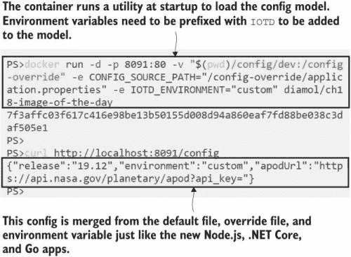

图 C.11 环境变量使这个旧应用程序的配置模型表现得像新应用程序。

现在，图像库应用程序中的每个组件都使用相同的配置模式。所有组件之间都有一个标准化水平，但也有一些小的实现差异。每个组件都可以通过文件覆盖来配置以在开发模式下运行，并且每个组件都可以通过环境变量来配置以启用 Prometheus 指标。您实际上如何做到这一点因应用程序而异，这就是我一开始提到的灰色区域——由于应用程序平台的工作方式不同，很难强制执行一个标准，即当环境变量`ENABLE_METRICS=true`时，每个组件都将运行 Prometheus 端点。

文档是消除这种混淆的方法，在 Docker 世界中，部署文档最好在应用程序清单文件中完成。本章的练习中有一个 Docker Compose 文件，它正好执行了我之前段落中描述的操作——将每个组件设置为开发模式，但启用 Prometheus 指标。列表 C.3 显示了 Compose 文件的配置部分。

列表 C.3 在 Docker Compose 中记录配置设置

```
version: "3.7"

services:
  accesslog:
    image: diamol/ch18-access-log
    environment:
      NODE_CONFIG: '{"metrics": {"enabled":"true"}}'
    secrets:
      - source: access-log-config
        target: /app/config-override/local.json

  iotd:
    image: diamol/ch18-image-of-the-day
    environment:
      CONFIG_SOURCE_PATH: "/config-override/application.properties"
      IOTD_MANAGEMENT_ENDPOINTS_WEB_EXPOSURE_INCLUDE: "health,prometheus"
    secrets:
      - source: iotd-config
        target: /config-override/application.properties

  image-gallery:
    image: diamol/ch18-image-gallery
    environment:
      IG_METRICS.ENABLED: "TRUE"
    secrets:
      - source: image-gallery-config
        target: /app/config-override/config.toml

secrets:
  access-log-config:
    file: access-log/config/dev/local.json
  iotd-config:
    file: image-of-the-day/config/dev/application.properties
  image-gallery-config:
    file: image-gallery/config/dev/config.toml
```

这是一段相当长的代码列表，但我希望将所有这些内容放在一个地方，以便您可以看到模式是相同的，尽管细节不同。Node.js 应用程序使用环境变量中的 JSON 字符串来启用指标，并加载 JSON 文件作为配置覆盖。

Java 应用程序使用一个环境变量来列出要包含的管理端点；在其中添加 Prometheus 可以启用指标收集。然后它从属性文件中加载配置覆盖，这是一个键/值对的序列。

Go 应用程序使用环境变量中的一个简单的`"TRUE"`字符串来启用指标，并以 TOML 文件的形式加载配置覆盖。我在 Docker Compose 中使用了文件源的秘密支持，但模式对于集群中的卷挂载或配置对象是一样的。

这里的用户体验既有好的一面也有不好的一面。好的一面是你可以通过更改配置覆盖的源路径来轻松加载不同的环境，并且你可以使用环境变量更改单个设置。不好的一面是你需要了解应用程序的怪癖。项目团队可能会演变各种 Docker Compose 覆盖来覆盖不同的配置，因此编辑配置设置不会是一个常见的活动。运行应用程序将会更加常见，而且这和用 Compose 启动任何应用程序一样简单。

现在试试看。让我们使用一组固定的配置来运行所有组件的应用程序。首先，移除所有正在运行的容器，然后使用 Docker Compose 运行应用程序：

```
# clear all containers:
docker container rm -f $(docker container ls -aq)

cd ch18/exercises

# run the app with the config settings:
docker-compose up -d

# check all the config APIs:
curl http://localhost:8030/config
curl http://localhost:8020/config
curl http://localhost:8010/config
```

你可以浏览到`http:/ /localhost:8010`并按正常方式使用应用程序，并浏览到 Prometheus 端点以查看组件指标（在[`localhost:8010/metrics`](http://localhost:8010/metrics)，http://localhost:8030/metrics，和 http://localhost:8020/actuator/prometheus）。但实际上，所有确认应用程序配置正确的信息都来自那些配置 API。

你可以在图 C.12 中看到我的输出。每个组件都从镜像中的默认配置文件加载发布周期名称，从配置覆盖文件中加载环境名称，并从环境变量中加载指标设置。

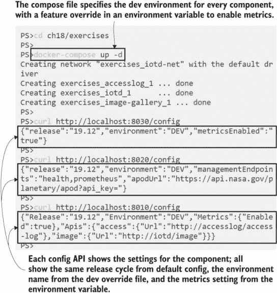

图 C.12 Docker Compose 可以记录应用程序配置设置，并使用该配置启动应用程序。

关于从容器环境获取配置的应用程序构建模式，我们实际上需要涵盖的就是这些。我们将以关于多级配置模型能带你到哪里的思考来结束这一章。

## C.5 理解为什么灵活的配置模型会带来回报

你将使用 CI/CD 管道将应用程序打包并部署到生产环境中，该管道的核心设计是构建一个镜像，你的部署过程就是将这个镜像通过你的环境提升到生产环境。你的应用程序在每个环境中都需要稍微有所不同，而为了保持单镜像方法同时支持这一点，你可以使用多级配置模型。

在实践中，你将使用内置在容器镜像中的发布级别设置，几乎在所有情况下，使用容器平台提供的环境级别覆盖文件，但能够使用环境变量设置功能级别的配置是一个有用的补充。这意味着你可以快速响应生产问题——如果这是一个性能问题，则降低日志级别，或者关闭存在安全漏洞的功能。这也意味着你可以在开发机器上创建一个类似生产的环境来复现错误，使用移除机密的配置覆盖，并使用环境变量。

能够在任何环境中运行完全相同的镜像，这是在配置模型上投入时间的回报。图 C.13 显示了从 CI/CD 管道开始的镜像生命周期。

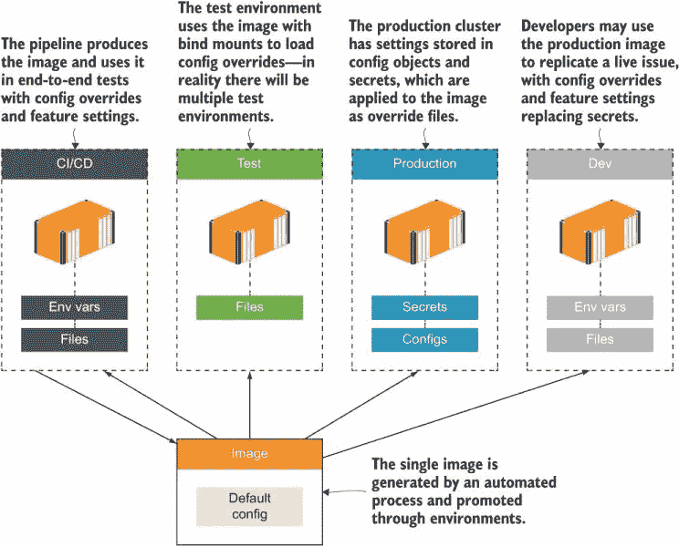

图 C.13 CI/CD 管道生成一个镜像，你使用配置模型来改变行为。

你在创建这个灵活的配置模型时所做的努力将大大有助于确保你的应用在未来具有可维护性。所有容器运行时都支持从配置对象或机密中加载文件到容器中，并设置环境变量。本章图像库应用的 Docker 镜像将以相同的方式与 Docker Compose、Docker Swarm 或 Kubernetes 一起工作。而且不仅限于容器运行时——标准的配置文件和环境变量也是平台即服务（PAAS）产品和无服务器函数中使用的模型。

## C.6 实验室

对于新应用深入挖掘配置模型并找出如何设置覆盖文件和配置功能覆盖可能有些棘手，所以你将在本实验中获得一些练习。你将使用相同的图像库应用——在本章的实验室文件夹中有一个指定了应用组件的 Docker Compose 文件，但没有配置。你的任务是设置每个组件以

+   使用卷来加载配置覆盖文件。

+   加载测试环境的配置覆盖。

+   将发布周期重置为“20.01”而不是“19.12”。

这应该相当直接，但花些时间调整应用配置而不对应用进行任何更改将很有用。当你使用 `docker-compose` `up` 运行应用时，你应该能够浏览到 http://localhost:8010，并且应用应该能够正常工作。你应该能够浏览到所有三个配置 API，并看到发布名称是 20.01，环境是 TEST。

我的解决方案在同一个文件夹中的 `docker-compose-solution.yml` 文件中，或者你可以在 GitHub 上查看：[`github.com/sixeyed/diamol/blob/master/ch18/lab/README.md`](https://github.com/sixeyed/diamol/blob/master/ch18/lab/README.md)。
