# 附录 D. 使用 Docker 编写和管理应用程序日志

记录日志通常是学习新技术中最无聊的部分，但 Docker 不是这样。基本原理很简单：你需要确保你的应用程序日志被写入标准输出流，因为那是 Docker 寻找它们的地方。有几个方法可以实现这一点，我们将在本章中介绍，然后乐趣就开始了。Docker 有一个可插拔的日志框架——你需要确保你的应用程序日志从容器中输出，然后 Docker 可以将它们发送到不同的地方。这让你可以构建一个强大的日志模型，其中所有容器的应用程序日志都被发送到一个中央日志存储，并在其上方有一个可搜索的用户界面——所有这些都使用开源组件，所有都在容器中运行。

本附录摘自第十九章，“使用 Docker 编写和管理应用程序日志”，来自 Elton Stoneman 的《一个月午餐时间学习 Docker》（Manning，2020）。任何章节引用或对代码仓库的引用都指该书的相关章节或代码仓库。

## D.1 欢迎来到 stderr 和 stdout！

Docker 镜像是你应用程序的二进制文件和依赖项的文件系统快照，同时也包含一些元数据，告诉 Docker 当你从镜像运行容器时应该启动哪个进程。该进程在前景运行，所以就像启动一个 shell 会话然后运行一个命令。只要命令是活跃的，它就控制着终端的输入和输出。命令将日志条目写入标准输出和标准错误流（称为*stdout*和*stderr*），所以在终端会话中你会在你的窗口中看到输出。在容器中，Docker 会监视 stdout 和 stderr，并从流中收集输出——这就是容器日志的来源。

现在试试看！如果你在容器中运行一个简单的 timecheck 应用，你可以轻松地看到这一点。应用程序本身在前台运行，并将日志条目写入 stdout：

```
# run the container in the foreground: 
docker container run diamol/ch15-timecheck:3.0

# exit the container with Ctrl-C when you're done
```

你会在你的终端中看到一些日志行，你会发现你不能再输入任何命令——容器正在前台运行，所以就像在你的终端中运行应用程序本身一样。每隔几秒钟应用程序就会向 stdout 写入另一个时间戳，所以你会在你的会话窗口中看到另一行。我的输出在图 D.1 中。

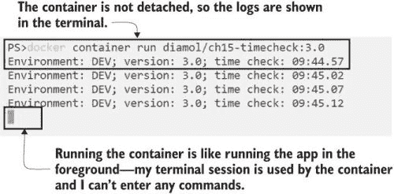

图 D.1 前台的容器接管终端会话，直到它退出。

这就是容器的标准操作模型——Docker 在容器内启动一个进程，并收集该进程的输出流作为日志。本书中我们使用的所有应用程序都遵循相同的模式：应用程序进程在前台运行——这可能是一个 Go 可执行文件或 Java 运行时——应用程序本身配置为将日志写入 stdout（或 stderr；Docker 以相同的方式处理这两个流）。这些应用程序日志由运行时写入输出流，并由 Docker 收集。图 D.2 显示了应用程序、输出流和 Docker 之间的交互。

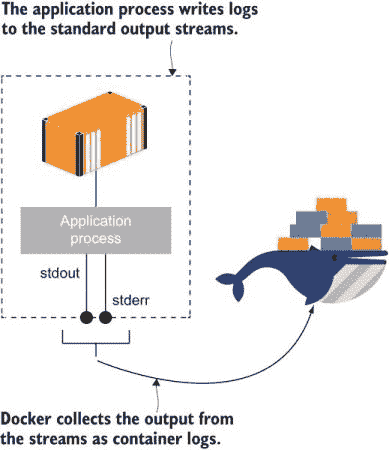

图 D.2 Docker 监视容器中的应用程序进程，并收集其输出流。

容器日志以 JSON 文件的形式存储，因此即使没有终端会话的分离容器，或者已经退出的容器（没有应用程序进程），日志条目仍然可用。Docker 会为您管理这些 JSON 文件，它们的生命周期与容器相同——当容器被移除时，日志文件也会被移除。

现在尝试一下：在后台以分离容器的方式运行与同一镜像的容器，然后检查日志以及日志文件路径：

```
# run a detached container
docker container run -d --name timecheck diamol/ch15-timecheck:3.0

# check the most recent log entry:
docker container logs --tail 1 timecheck

# stop the container and check the logs again:
docker container stop timecheck
docker container logs --tail 1 timecheck

# check where Docker stores the container log file:
docker container inspect --format='{{.LogPath}}' timecheck
```

如果你使用的是带有 Linux 容器的 Docker Desktop，请记住 Docker Engine 是在 Docker 为您管理的虚拟机（VM）中运行的——你可以看到容器日志文件的路径，但你无法访问 VM，因此无法直接读取文件。如果你在 Linux 上运行 Docker CE 或使用 Windows 容器，日志文件的路径将在你的本地机器上，你可以打开文件以查看原始内容。你可以在图 D.3 中看到我的输出（使用 Windows 容器）。


图 D.3 Docker 将容器日志存储在 JSON 文件中，并管理该文件的生命周期。

日志文件实际上只是一个实现细节，你通常不需要担心。其格式非常简单；它包含一个 JSON 对象，每个日志条目都有一个包含日志的字符串、日志来源的流名称（stdout 或 stderr）和一个时间戳。列表 D.1 显示了 timecheck 容器日志的示例。

列表 D.1 容器日志的原始格式是一个简单的 JSON 对象

```
{"log":"Environment: DEV; version: 3.0; time check: 09:42.56\r\n","stream":"stdout","time":"2019-12-19T09:42:56.814277Z"}
{"log":"Environment: DEV; version: 3.0; time check: 09:43.01\r\n","stream":"stdout","time":"2019-12-19T09:43:01.8162961Z"}
```

您唯一需要考虑 JSON 的情况是，如果您有一个产生大量日志的容器，并且您希望保留所有日志条目一段时间，但希望它们在一个可管理的文件结构中。默认情况下，Docker 为每个容器创建一个单一的 JSON 日志文件，并允许它增长到任何大小（直到填满您的磁盘）。您可以配置 Docker 使用滚动文件，并设置最大大小限制，这样当日志文件填满时，Docker 开始写入新文件。您还可以配置要使用多少个日志文件，当它们都满了之后，Docker 开始覆盖第一个文件。您可以在 Docker 引擎级别设置这些选项，以便更改适用于每个容器，或者您可以为单个容器设置它们。为特定容器配置日志选项是获取一个小型轮换日志文件的一种好方法，但可以保留其他容器的所有日志。

现在尝试一下：再次运行相同的应用程序，但这次指定使用三个滚动日志文件，每个文件最大 5 KB：

```
# run with log options and an app setting to write lots of logs:
docker container run -d --name timecheck2 --log-opt max-size=5k
                        --log-opt max-file=3 -e Timer__IntervalSeconds=1 diamol/ch15-timecheck:3.0

# wait for a few minutes

# check the logs:
docker container inspect --format='{{.LogPath}}' timecheck2
```

您会看到容器的日志路径仍然只是一个单一的 JSON 文件，但 Docker 实际上正在使用该名称作为基础，但带有日志文件编号后缀来轮换日志文件。如果您正在运行 Windows 容器或在 Linux 上运行 Docker CE，您可以列出存储日志的目录的内容，您将看到那些文件后缀。我的在图 D.4 中显示。

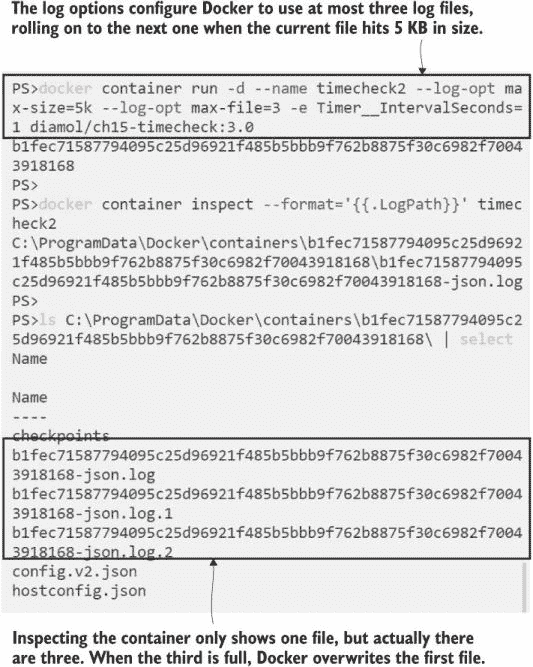

图 D.4 滚动日志文件允许您为每个容器保留已知数量的日志数据。

对于来自 stdout 的应用程序日志有一个收集和处理阶段，您可以在其中配置 Docker 如何处理日志。在上一个练习中，我们配置了日志处理以控制 JSON 文件结构，并且您可以使用容器日志做更多的事情。为了充分利用这一点，您需要确保每个应用程序都将日志推送到容器外，在某些情况下这可能需要更多的工作。

## D.2 从其他 sinks 中转发日志到 stdout

并非每个应用程序都与标准日志模型完美匹配；当您将某些应用程序容器化时，Docker 在输出流中看不到任何日志。一些应用程序作为 Windows 服务或 Linux 守护进程在后台运行，因此容器启动过程实际上不是应用程序过程。其他应用程序可能使用现有的日志框架，将日志写入日志文件或其他位置（在日志世界中称为*sinks*），如 Linux 中的 syslog 或 Windows 事件日志。无论如何，容器启动过程中没有来自应用程序的日志，因此 Docker 看不到任何日志。

现在尝试一下：本章有一个新的 timecheck 应用程序版本，它将日志写入文件而不是 stdout。当您运行此版本时，没有容器日志，尽管应用程序日志正在存储在容器文件系统中：

```
# run a container from the new image:
docker container run -d --name timecheck3 diamol/ch19-timecheck:4.0

# check - there are no logs coming from stdout:
docker container logs timecheck3

# now connect to the running container, for Linux:
docker container exec -it timecheck3 sh

# OR windows containers:
docker container exec -it timecheck3 cmd

# and read the application log file:
cat /logs/timecheck.log
```

尽管应用程序本身写入了很多日志条目，但你不会看到任何容器日志。我的输出在图 D.5 中——我需要连接到容器并从容器文件系统中读取日志文件以查看日志条目。

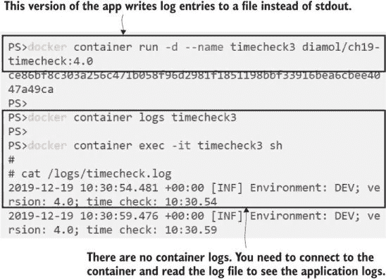

图 D.5 如果应用程序没有写入任何内容到输出流，你将看不到任何容器日志。

这是因为应用正在使用自己的日志接收器——在这个练习中是一个文件，而 Docker 对此接收器一无所知。Docker 只会从 stdout 读取日志；没有方法可以配置它从容器内的不同日志接收器读取。

处理此类应用的模式是在容器启动命令中运行第二个进程，该进程从应用程序使用的接收器读取日志条目并将它们写入 stdout。这个过程可以是 shell 脚本或简单的实用应用，并且它是启动序列中的最后一个进程，因此 Docker 读取其输出流，应用程序日志作为容器日志被传递。图 D.6 显示了它是如何工作的。

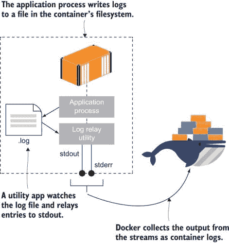

图 D.6 你需要在容器镜像中打包一个实用工具来从文件中传递日志。

这不是一个完美的解决方案。您的实用进程正在前台运行，因此它需要健壮，因为如果它失败，容器会退出，即使实际的应用程序仍在后台工作。反之亦然：如果应用程序失败但日志中继仍在运行，容器会保持运行，尽管应用程序已经不再工作。您需要在镜像中添加健康检查以防止这种情况发生。最后，这并不是对磁盘的高效使用，特别是如果您的应用程序写入大量日志——它们会在容器文件系统中填充一个文件，并在 Docker 主机机器上填充一个 JSON 文件。

即使如此，了解这个模式也是有用的。如果你的应用在前台运行，并且你可以调整配置将日志写入 stdout，那么这是一种更好的方法。但如果你的应用在后台运行，就没有其他选择了，最好是接受低效并让应用像所有其他容器一样运行。

本章对 timecheck 应用进行了更新，添加了此模式，构建了一个小型实用应用来监视日志文件并将行传递到 stdout。列表 D.2 显示了多阶段 Dockerfile 的最终阶段——Linux 和 Windows 有不同的启动命令。

列表 D.2 使用您的应用构建和打包日志中继实用工具

```
# app image
FROM diamol/dotnet-runtime AS base
...
WORKDIR /app
COPY --from=builder /out/ .
COPY --from=utility /out/ .

# windows
FROM base AS windows
CMD start /B dotnet TimeCheck.dll && dotnet Tail.dll /logs timecheck.log

# linux
FROM base AS linux
CMD dotnet TimeCheck.dll & dotnet Tail.dll /logs timecheck.log
```

这两个`CMD`指令实现了相同的功能，但使用了两种不同的操作系统方法。首先，在 Windows 中使用`start`命令在后台启动.NET 应用程序进程，在 Linux 中在命令后添加单个与号`&`。然后启动.NET tail 实用程序，配置为读取应用程序写入的日志文件。tail 实用程序只是监视该文件，并将新写入的每一行转发，因此日志被暴露到 stdout 并成为容器日志。

现在尝试一下 运行新镜像的容器，并验证日志是否来自容器，并且它们仍然被写入文件系统：

```
# run a container with the tail utility process:
docker container run -d --name timecheck4 diamol/ch19-timecheck:5.0

# check the logs:
docker container logs timecheck4

# and connect to the container - on Linux:
docker container exec -it timecheck4 sh

# OR with Windows containers:
docker container exec -it timecheck4 cmd

# check the log file:
cat /logs/timecheck.log
```

现在日志来自容器。这是一个复杂的方法来达到这个目的，需要额外运行一个进程来将日志文件内容转发到标准输出（stdout），但一旦容器运行起来，这一切都是透明的。这种方法的缺点是日志转发使用了额外的处理能力，并且需要额外的磁盘空间来存储两次日志。您可以在图 D.7 中看到我的输出，它显示了日志文件仍然存在于容器文件系统中。

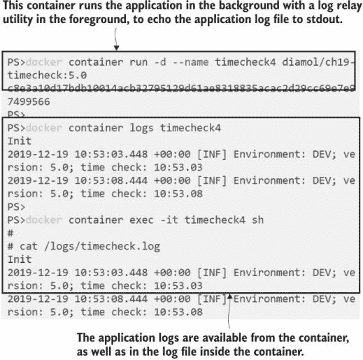

图 D.7 一个日志转发实用程序将应用程序日志输出到 Docker，但使用了两倍的磁盘空间。

在这个例子中，我使用了一个自定义的实用程序来转发日志条目，因为我希望应用程序能够在多个平台上工作。我可以用标准的 Linux `tail`命令代替，但在 Windows 中没有等效的命令。自定义实用程序方法也更加灵活，因为它可以从任何接收器读取并将数据转发到 stdout。这应该涵盖了任何场景，其中您的应用程序日志被锁定在容器中的某个地方，而 Docker 无法看到。

当您将所有容器镜像设置为将应用程序日志作为容器日志写入时，您就可以开始利用 Docker 的可插拔日志系统，并整合来自所有容器的所有日志。

## D.3 收集和转发容器日志

Docker 在所有应用程序上添加了一个一致的管理层——无论容器内部发生什么；您以相同的方式启动、停止和检查一切。当您将集中式日志系统引入架构时，这尤其有用，我们将通过最流行的开源示例之一：Fluentd，来了解这一点。

Fluentd 是一个统一的日志层。它可以从许多不同的来源摄取日志，过滤或丰富日志条目，然后将它们转发到许多不同的目标。它是由云原生计算基金会（它还管理 Kubernetes、Prometheus 以及 Docker 的容器运行时等项目）管理的项目，它是一个成熟且高度灵活的系统。您可以在容器中运行 Fluentd，它将监听日志条目。然后您可以运行其他容器，这些容器使用 Docker 的 Fluentd 日志驱动程序而不是标准的 JSON 文件，这些容器日志将被发送到 Fluentd。

现在试试吧 Fluentd 使用配置文件来处理日志。运行一个具有简单配置的容器，该配置将使 Fluentd 收集日志并将它们回显到容器中的 stdout。然后运行带有该容器发送日志到 Fluentd 的 timecheck 应用程序：

```
cd ch19/exercises/fluentd

# run Fluentd publishing the standard port and using a config file:
docker container run -d -p 24224:24224 --name fluentd -v "$(pwd)/conf:/fluentd/etc" -e FLUENTD_CONF=stdout.conf diamol/fluentd

# now run a timecheck container set to use Docker's Fluentd log driver:
docker container run -d --log-driver=fluentd --name timecheck5 diamol/ch19-timecheck:5.0

# check the timecheck container logs:
docker container logs timecheck5

# and check the Fluentd container logs:
docker container logs --tail 1 fluentd
```

当您尝试检查来自 timecheck 容器的日志时，您会看到一个错误——并不是所有的日志驱动程序都允许您直接从容器中查看日志条目。在这个练习中，它们被 Fluentd 收集，并且这个配置将输出写入 stdout，因此您可以通过查看 Fluentd 的日志来查看 timecheck 容器的日志。我的输出如图 D.8 所示。

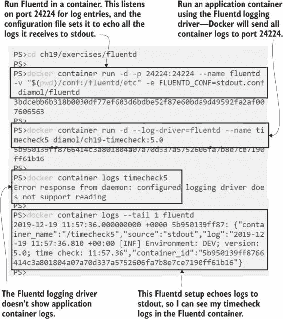

图 D.8 Fluentd 从其他容器收集日志，并且它可以存储它们或将它们写入 stdout。

当 Fluentd 存储日志时，它会为每条记录添加自己的元数据，包括容器 ID 和名称。这是必要的，因为 Fluentd 成为您所有容器的中央日志收集器，您需要能够识别哪些日志条目来自哪个应用程序。将 stdout 作为 Fluentd 的目标只是一个简单的查看一切如何工作的方法。通常，您会将日志转发到中央数据存储。Elasticsearch 是一个非常受欢迎的选择——它是一个适用于日志的无 SQL 文档数据库。您可以在容器中运行 Elasticsearch 以存储日志，并在另一个容器中运行配套的搜索 UI Kibana。图 D.9 显示了日志模型的外观。


图 D.9 集中式日志模型将所有容器日志发送到 Fluentd 进行处理和存储。

它看起来很复杂，但像 Docker 一样，始终很容易在 Docker Compose 文件中指定所有日志设置的部分，并使用一条命令启动整个堆栈。当您的日志基础设施在容器中运行时，您只需为任何希望加入集中式日志的容器使用 Fluentd 日志驱动程序即可。

现在试试吧 删除任何正在运行的容器，并启动 Fluentd-Elasticsearch-Kibana 日志容器。然后使用 Fluentd 日志驱动程序运行一个 timecheck 容器：

```
docker container rm -f $(docker container ls -aq)

cd ch19/exercises

# start the logging stack:
docker-compose -f fluentd/docker-compose.yml up -d

docker container run -d --log-driver=fluentd diamol/ch19-timecheck:5.0
```

给 Elasticsearch 几分钟的时间准备，然后浏览到 http://localhost:5601。点击 Discover 选项卡，Kibana 将要求输入要搜索的文档集合的名称。输入 `fluentd*`，如图 D.10 所示。

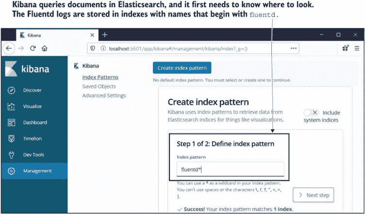

图 D.10 Elasticsearch 将文档存储在名为 indexes 的集合中——Fluentd 使用它自己的索引。

在下一屏幕中，您需要设置包含时间过滤器的字段——选择 `@timestamp`，如图 D.11 所示。

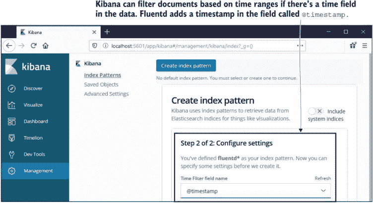

图 D.11 Fluentd 已经将数据保存到 Elasticsearch 中，因此 Kibana 可以看到字段名称。

你可以自动化 Kibana 的设置，但我还没有这么做，因为如果你是 Elasticsearch 堆栈的新手，逐步操作以了解各个组件如何组合在一起是值得的。Fluentd 收集的每条日志条目都保存为 Elasticsearch 中的一个文档，在一个名为 `fluentd-{date}` 的文档集中。Kibana 让你可以查看所有这些文档——在默认的 Discover 选项卡中，你会看到一个柱状图显示随时间创建的文档数量，并且你可以深入查看单个文档的详细信息。在这个练习中，每个文档都是来自 timecheck 应用的日志条目。你可以在图 D.12 中看到 Kibana 中的数据。

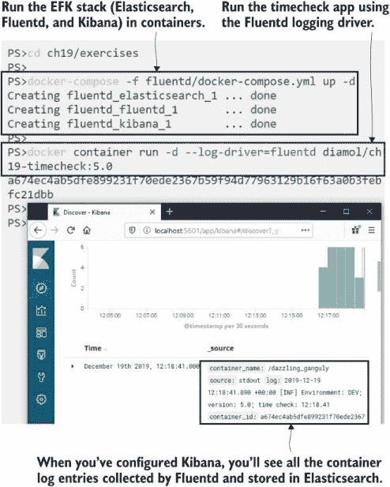

图 D.12 EFK 堆栈的全貌——收集并存储的容器日志，便于简单搜索

Kibana 允许你在所有文档中搜索特定的文本片段，或按日期或其他数据属性过滤文档。它还具有类似于 Grafana 的仪表板功能，因此你可以构建显示每个应用的日志计数或错误日志计数的图表。Elasticsearch 具有巨大的可扩展性，因此适用于生产中的大量数据，当你开始通过 Fluentd 发送所有容器的日志时，你很快会发现这比在控制台中滚动日志行要容易管理得多。

现在试试看：运行带有每个组件配置为使用 Fluentd 日志驱动的图像库应用：

```
# from the cd ch19/exercises folder

docker-compose -f image-gallery/docker-compose.yml up -d
```

浏览到 http://localhost:8010 生成一些流量，容器将开始写入日志。图像库应用的 Fluentd 设置为每条日志添加一个标签，标识生成它的组件，因此日志行可以轻松识别——比使用容器名称或容器 ID 更容易识别。你可以在图 D.13 中看到我的输出。我正在运行完整的图像库应用，但我正在 Kibana 中过滤日志，只显示 access-log 组件——记录应用访问时间的 API。

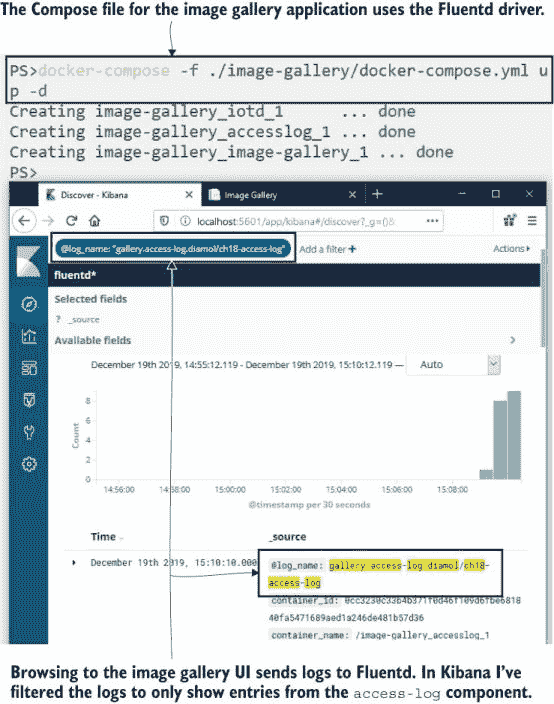

图 D.13 图像库和时间检查容器正在 Elasticsearch 中收集日志。

为 Fluentd 添加一个标签非常容易，它会显示为 `log_name` 字段用于过滤；这是日志驱动程序的一个选项。你可以使用一个固定的名称或注入一些有用的标识符——在这个练习中，我使用 `gallery` 作为应用前缀，然后添加生成日志的容器的组件名称和镜像名称。这是一种很好的方式来识别应用程序、组件以及每个日志行的确切版本。列表 D.3 显示了图像库应用的 Docker Compose 文件中的日志选项。

列表 D.3 使用标签识别 Fluentd 日志条目的来源

```
services:
  accesslog:
    image: diamol/ch18-access-log
         logging:
      driver: "fluentd"
      options:
        tag: " gallery.access-log.{{.ImageName}}"

  iotd:
    image: diamol/ch18-image-of-the-day
    logging:
      driver: "fluentd"
      options:
        tag: "gallery.iotd.{{.ImageName}}"

  image-gallery:
    image: diamol/ch18-image-gallery
    logging:
      driver: "fluentd"
      options:
        tag: "gallery.image-gallery.{{.ImageName}}"
...
```

当您为生产准备容器时，中央日志记录模型，包括可搜索的数据存储和用户友好的 UI，是一个您绝对应该考虑的模型。您不仅限于使用 Fluentd——Docker 有许多其他日志驱动程序，因此您可以使用其他流行的工具，如 Graylog，或商业工具，如 Splunk。记住，您可以在 Docker 配置的引擎级别设置默认日志驱动程序和选项，但我认为在应用程序清单中这样做更有价值——它清楚地说明了每个环境中使用的日志系统。

如果您还没有建立日志系统，Fluentd 是一个很好的选择。它易于使用，可以从单个开发机器扩展到完整的生产集群，并且您可以在每个环境中以相同的方式使用它。您还可以配置 Fluentd 以丰富日志数据，使其更容易处理，并过滤日志将它们发送到不同的目标。

## D.4 管理您的日志输出和收集

记录日志需要在捕获足够信息以用于诊断问题和不过度存储大量数据之间取得微妙的平衡。Docker 的日志模型为您提供了额外的灵活性，以帮助实现这种平衡，因为您可以在存储之前以比预期更冗长的级别生成容器日志，但过滤掉它们。然后，如果您需要查看更冗长的日志，您可以通过更改过滤配置而不是应用程序配置来替换 Fluentd 容器，而不是应用程序容器。

您可以在 Fluentd 配置文件中配置此级别的过滤。上一练习中的配置将所有日志发送到 Elasticsearch，但 D.4 列表中更新的配置过滤掉了来自更冗长的 access-log 组件的日志。这些日志将发送到 stdout，其余的应用程序日志将发送到 Elasticsearch。

列表 D.4 根据记录的标签将日志条目发送到不同的目标

```
<match gallery.access-log.**>
  @type copy
  <store>
    @type stdout
  </store>
</match>
<match gallery.**>
  @type copy
  <store>
    @type elasticsearch
...
```

`match`块告诉 Fluentd 如何处理日志记录，而过滤参数使用在日志驱动程序选项中设置的标签。当您运行此更新后的配置时，access-log 条目将匹配第一个 match 块，因为标签前缀是`gallery.access-log`。这些记录将不再在 Elasticsearch 中显示，并且只能通过读取 Fluentd 容器的日志来获取。更新的配置文件还丰富了所有日志条目，将标签拆分为应用程序名称、服务名称和镜像名称的单独字段，这使得在 Kibana 中的过滤变得更加容易。

现在尝试一下 更新 Fluentd 配置，通过部署一个指定新配置文件的 Docker Compose 覆盖文件，并更新图像库应用程序以生成更冗长的日志：

```
# update the Fluentd config:
docker-compose -f fluentd/docker-compose.yml -f fluentd/override-gallery-filtered.yml up -d

# update the application logging config:
docker-compose -f image-gallery/docker-compose.yml -f image-gallery/override-logging.yml up -d
```

您可以检查这些覆盖文件的內容，您会发现它们只是指定了应用程序的配置设置；所有镜像都是相同的。现在当您使用 http://localhost:8010 上的应用程序时，访问日志条目仍然会被生成，但它们会被 Fluentd 过滤掉，因此您在 Kibana 中不会看到任何新的日志。您将看到来自其他组件的日志，这些日志被添加了新的元数据字段。您可以在图 D.14 的我的输出中看到这一点。

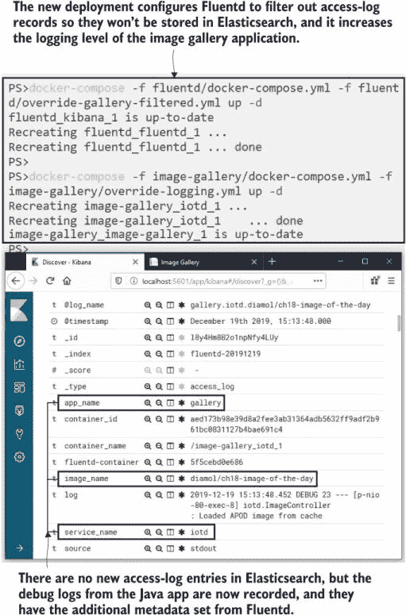

图 D.14 Fluentd 使用日志中的标签来过滤记录并生成新的字段。

访问日志条目仍然可用，因为它们在 Fluentd 容器内部写入到 stdout。您可以将它们视为容器日志，但它们来自 Fluentd 容器，而不是访问日志容器。

现在尝试一下：检查 Fluentd 容器日志以确保记录仍然可用：

```
docker container logs --tail 1 fluentd_fluentd_1
```

您可以在图 D.15 中看到我的输出。访问日志条目已被发送到不同的目标，但它仍然经过了相同的处理，以丰富记录中的应用程序、服务和镜像名称：

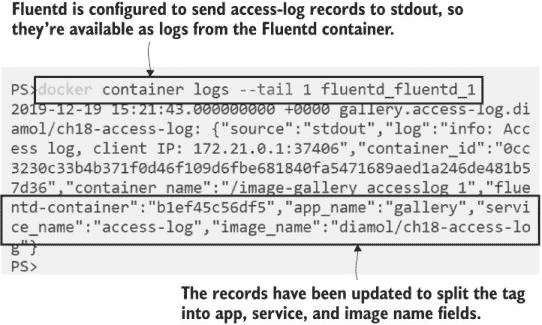

图 D.15 这些日志被过滤，因此它们不会存储在 Elasticsearch 中，而是回显到 stdout。

这是一种将核心应用程序日志与可选日志分开的好方法。在生产环境中，您不会使用 stdout，但您可能对不同类别的日志有不同的输出——性能关键组件可以将日志条目发送到 Kafka，面向用户的日志可以发送到 Elasticsearch，其余的可以存储在 Amazon S3 云存储中。这些都是 Fluentd 支持的日志存储。

本章有一个最后的练习来重置日志并将访问日志条目重新添加到 Elasticsearch。这模拟了生产环境中您发现系统问题并希望增加日志以查看发生了什么的情况。在我们现有的日志设置中，日志已经被应用程序写入。我们只需更改 Fluentd 配置文件就可以将其暴露出来。

现在尝试一下：部署一个新的 Fluentd 配置，将访问日志记录发送到 Elasticsearch：

```
docker-compose -f fluentd/docker-compose.yml -f fluentd/override-gallery.yml up -d
```

此部署使用一个配置文件，移除了访问日志记录的 `match` 块，因此所有画廊组件的日志都存储在 Elasticsearch 中。当您在浏览器中刷新图像画廊页面时，日志将被收集并存储。您可以在图 D.16 的我的输出中看到这些日志，其中显示了来自 API 和访问日志组件的最新日志。

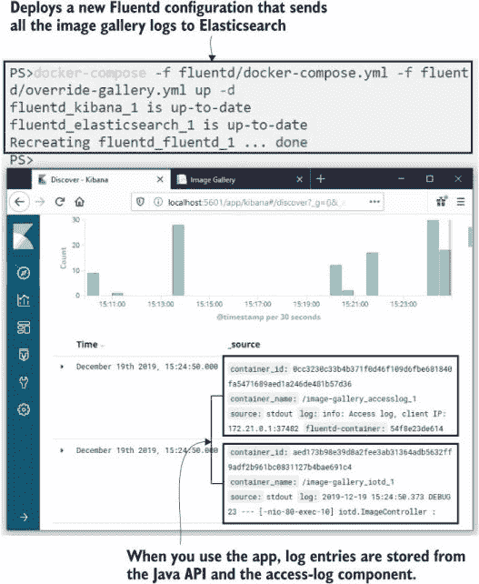

图 D.16 通过对 Fluentd 配置的修改，无需更改应用程序即可将日志重新添加到 Elasticsearch。

你确实需要意识到，这种方法可能会导致日志条目丢失。在部署期间，容器可能会发送日志，但此时没有 Fluentd 容器在运行以收集它们。Docker 在这种情况下会优雅地继续运行，你的应用程序容器也会继续运行，但日志条目不会被缓冲，因此它们将会丢失。在集群生产环境中，这不太可能成为问题，但即使发生了这种情况，重启应用程序容器并增加日志配置也是更好的选择——至少因为新的容器可能不会像旧容器那样有问题，所以你的新日志不会告诉你任何有趣的事情。

## D.5 理解容器日志模型

Docker 中的日志记录方法非常灵活，但前提是你需要将你的应用程序日志作为容器日志可见。你可以直接通过让应用程序将日志写入 stdout 来实现，或者间接地通过在你的容器中使用一个中继工具，将日志条目复制到 stdout。你需要花一些时间确保所有应用程序组件都写入容器日志，因为一旦你做到了这一点，你就可以按你喜欢的方式处理日志。

在本章中，我们使用了 EFK 堆栈——Elasticsearch、Fluentd 和 Kibana——你已经看到了如何轻松地将所有容器日志拉入一个具有用户友好搜索界面的集中式数据库。所有这些技术都是可互换的，但 Fluentd 是最常用的之一，因为它既简单又强大。该堆栈在单机环境中运行良好，并且也可以扩展到生产环境。图 D.17 显示了集群环境在每个节点上运行 Fluentd 容器的情况，其中 Fluentd 容器收集该节点上其他容器的日志并将它们发送到 Elasticsearch 集群——该集群也运行在容器中。

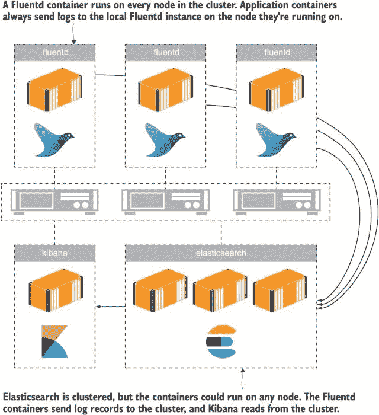

图 D.17 EFK 堆栈在生产环境中使用集群存储和多个 Fluentd 实例工作。

在我们进入实验室之前，我要提醒大家注意一点。有些团队不喜欢容器日志模型中的所有处理层；他们更喜欢直接将应用程序日志写入最终存储，因此，而不是写入 stdout 并让 Fluentd 将数据发送到 Elasticsearch，应用程序直接写入 Elasticsearch。我真的很不喜欢这种方法。你节省了一些处理时间和网络流量，但代价是完全缺乏灵活性。你将日志堆栈硬编码到所有应用程序中，如果你想切换到 Graylog 或 Splunk，你需要去重新工作你的应用程序。我总是更喜欢保持简单和灵活——将你的应用程序日志写入 stdout 并利用平台来收集、丰富、过滤和存储数据。

## D.6 实验室

在本章中，我没有过多关注 Fluentd 的配置，但获得一些设置该配置的经验是值得的，因此我将在实验室中要求您完成这项任务。在本章的实验室文件夹中，有一个随机数字应用的 Docker Compose 文件和一个 EFK 堆栈的 Docker Compose 文件。应用容器尚未配置为使用 Fluentd，Fluentd 设置也没有进行任何丰富操作，因此您有三个任务：

+   扩展 numbers 应用的 Compose 文件，以便所有组件都使用 Fluentd 日志驱动程序，并设置一个包含应用名称、服务名称和镜像的标签。

+   将 Fluentd 的配置文件 `elasticsearch.conf` 扩展，以便将标签拆分为应用名称、服务名称和镜像名称字段，以处理来自 numbers 应用的所有记录。

+   在 Fluentd 配置中添加一个安全检查 `match` 块，以便将所有非 numbers 应用记录转发到 stdout。

对于这一部分没有提示，因为这是一个通过配置图像库应用来处理配置设置并查看需要为 numbers 应用添加哪些组件的案例。一如既往，我的解决方案已上传到 GitHub 供您检查：[`github.com/sixeyed/diamol/blob/master/ch19/lab/README.md`](https://github.com/sixeyed/diamol/blob/master/ch19/lab/README.md)。
