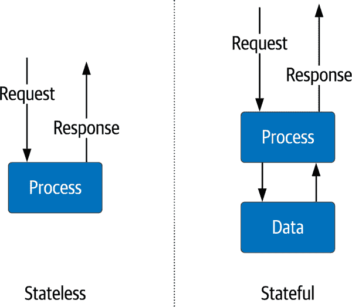
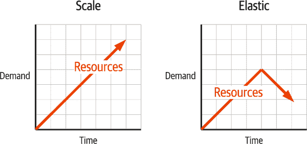
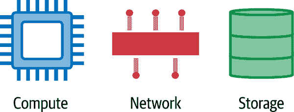
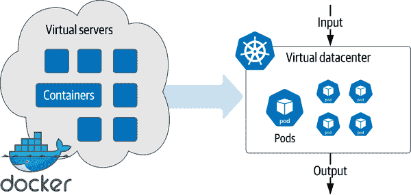

# 第一章：云原生数据基础设施介绍：持久性、流处理和批处理分析

您是否致力于解决数据问题，并发现自己需要现代化？您的云原生应用程序是否仅限于使用微服务和服务网格？如果您在 Kubernetes 上部署应用程序（有时简称为“K8s”），但没有涉及数据，那么您还没有完全拥抱云原生。您的应用程序的每个元素都应体现云原生的规模、弹性、自愈和可观察性原则，包括您如何处理数据。

数据工程师主要关注的是有状态服务，这也将是我们关注的重点：提升您在 Kubernetes 中管理数据的技能。通过阅读本书，我们的目标是丰富您向云原生数据迁移的旅程。如果您刚开始接触云原生应用程序，现在是将技术栈的每一个方面纳入的最佳时机。这种融合是我们将如何消费云资源的未来。

那么，我们一起创造的这个未来是什么样的呢？

太长时间以来，数据一直存在于 Kubernetes 之外，导致了大量额外的工作和复杂性。我们将详细探讨其中的合理原因，但现在是将整个技术栈结合起来，以更快速、按需规模构建应用程序的时候了。基于当前的技术，这是完全可能的。我们已经远离了部署单独服务器的过去，转向了可以部署整个虚拟数据中心的未来。曾经需要数月甚至数年的开发周期现在可以在几天甚至几周内完成。开源组件现在可以结合到一个 Kubernetes 上的单一部署中，这种部署从你的笔记本到最大的云服务提供商都可以移植。

开源贡献在其中占据了重要地位。除非另有说明，否则 Kubernetes 和本书讨论的项目均采用 Apache License 2.0，这是有充分理由的。如果我们构建能够在任何地方运行的基础设施，我们需要一个能够给予我们选择自由的许可模型。开源既是免费的（如啤酒那样的自由），也是自由的（如自由那样的自由），在构建基于 Kubernetes 的云原生应用程序时，这两者都至关重要。开源已经成为基础设施革命的推动力量，而这也不例外。

这就是我们正在构建的内容：完全实现的 Kubernetes 应用程序的接近未来现实。最后一个组成部分是最重要的，那就是你。作为本书的读者，你们中的一员将成为创造这一未来的人之一。作为工程师，创造是我们的工作。我们不断地重新发明我们部署复杂基础设施的方式，以应对增加的需求。当 1960 年为美国航空公司上线了第一个电子数据库系统时，一小群工程师确保它在线并全天候运行。进步使我们从大型机到小型计算机，再到微型计算机，最终到我们今天的舰队管理。现在，同样的进步正在继续进入云原生和 Kubernetes。

本章将探讨云原生应用程序的组成部分，运行有状态工作负载的挑战以及本书涵盖的基本领域。首先，让我们转向构成数据基础设施的构建模块。

# 基础设施类型

在过去的 20 年里，基础设施的方法慢慢分叉成两个领域，反映了我们如何部署分布式应用程序（如图 1-1 所示）。

无状态服务

这些服务仅在活动请求的即时生命周期中维护信息，例如，向移动客户端发送格式化的购物车信息的服务。一个典型的例子是执行购物车业务逻辑的应用服务器。然而，购物车内容的信息存储在这些服务之外。它们只需要在请求到响应的短时间内在线。用于提供服务的基础设施可以轻松地随需求增减，对整体应用的影响很小，可以在需要时扩展计算和网络资源。由于我们不在个别服务中存储关键数据，因此该数据可以快速创建和销毁，几乎不需要协调。无状态服务是分布式系统中的关键架构元素。

有状态服务

这些服务需要维护从一个请求到下一个请求的信息。磁盘和内存存储数据以供多个请求使用。一个例子是数据库或文件系统。由于通常需要复制以实现高可用性，扩展有状态服务更加复杂。这造成了对一致性和保持数据在副本之间同步的机制的需求。这些服务通常具有不同的扩展方法，包括垂直和水平扩展。因此，它们需要不同的操作任务集合，与无状态服务不同。

###### 图 1-1\. 无状态与有状态服务

除了信息存储方式外，我们还看到了向开发采纳自动化基础设施部署的转变。这些最新的进展包括以下内容：

+   物理服务器已经被易于部署和维护的虚拟机（VMs）所取代。

+   虚拟机（VMs）已经简化并专注于容器特定的应用程序。

+   容器使基础设施工程师能够将应用程序的操作系统要求打包成一个可执行文件。

容器的使用无疑增加了部署的一致性，这使得批量部署和运行基础设施变得更加容易。像 Kubernetes 这样的容器编排系统应运而生，并显著促进了容器的爆发式增长。这证明了它解决问题的能力。官方[文档](https://oreil.ly/3WKn4)这样描述 Kubernetes：

> Kubernetes 是一个便携式、可扩展的开源平台，用于管理容器化的工作负载和服务，支持声明性配置和自动化。它拥有一个庞大而快速增长的生态系统。Kubernetes 的服务、支持和工具广泛可用。

Kubernetes 最初设计用于无状态工作负载，传统上这是它最擅长的。Kubernetes 已经发展成为以云原生方式“构建平台的平台”的代名词。然而，有一个合理的论点认为完整的云原生解决方案必须考虑数据。这本书的目标就是探索如何在 Kubernetes 上构建云原生数据解决方案。但首先，让我们来解释一下“云原生”的含义。

# 什么是云原生数据？

让我们开始定义云原生数据的各个方面，这些方面有助于我们最终得出一个定义。首先，让我们从[Cloud Native Computing Foundation (CNCF)](https://oreil.ly/OTdhS)的定义开始：

> 云原生技术使组织能够在公共、私有和混合云等现代动态环境中构建和运行可扩展的应用程序。容器、服务网格、微服务、不可变基础设施和声明性 API 是这种方法的典范。
> 
> 这些技术使得系统松耦合，具备弹性、可管理性和可观测性。结合健壮的自动化，它们使工程师能够频繁且可预测地进行高影响的变更，减少重复劳动。

请注意，这一定义描述了一个目标状态、理想特性以及体现这些特性的技术示例。基于这一正式定义，我们可以综合出区分云原生应用程序与其他类型部署方式在处理数据方面特质的品质。让我们更详细地看看这些特质：

可扩展性

如果一个服务可以用一定的资源产生一单位的工作量，增加更多的资源应该能够增加服务的工作量。*可扩展性*描述了服务利用额外资源产生额外工作的能力。理想情况下，服务应该能够在有无限计算、网络和存储资源的情况下无限扩展。对于数据来说，这意味着在无需停机的情况下进行扩展。传统系统在增加新资源时需要维护期间，期间所有服务必须关闭。随着云原生应用程序的需求增加，停机已经不再可接受。

弹性

虽然*扩展*是为了满足需求而增加资源，弹性则是在不再需要这些资源时释放它们的能力。可扩展性和弹性的差异在图 1-2 中得到突显。弹性也可以称为*按需基础设施*。在私有数据中心等受限环境中，这对于共享有限资源至关重要。对于按资源使用付费的云基础设施而言，这是避免支付无需运行的服务费用的一种方法。在管理数据时，这意味着我们需要能力来回收存储空间并优化我们的使用，例如将旧数据移到更便宜的存储层次。

###### 图 1-2\. 比较可扩展性和弹性

自愈

发生不良事件时，你的基础设施将如何响应？自愈基础设施将重新路由流量，重新分配资源，并维持服务水平。随着部署更大更复杂的分布式应用程序，这成为云原生应用程序日益重要的特性。这可以避免你在凌晨三点接到电话的情况。对于数据来说，这意味着我们需要检测数据问题的能力，例如缺失数据和数据质量问题。

可观察性

如果某些事物发生了而你没有监控到它，那它是否发生了？不幸的是，答案不仅是肯定的，而且这可能是一个更糟糕的情况。分布式应用程序极具动态性，对每个服务的可见性至关重要，以维持服务水平。相互依赖关系可能导致复杂的故障场景，这就是为什么可观察性是构建云原生应用程序的关键部分。在数据系统中，常见的数据量需要高效的监控基础设施的流动和状态。在大多数情况下，对问题的早期警告可以帮助操作员避免昂贵的停机时间。

在所有先前的定义都已就绪的情况下，让我们尝试一个能表达这些属性的定义：

> *云原生数据*方法赋予那些采用云原生应用程序方法的组织综合整合数据的能力，而不是使用传统的人员、流程、技术遗留方式，使数据能够弹性地进行扩展和缩减，并促进可观察性和自愈。这通过容器化数据、声明式数据、数据 API、数据网格和云原生数据基础设施（即以云原生应用程序架构的数据库、流处理和分析技术）得以体现。

为了使数据基础设施与我们应用程序的其他部分保持一致，我们需要整合每一部分。这包括规模自动化、弹性和自愈。需要 API 来解耦服务并增加开发速度，还能帮助你观察应用程序整个堆栈以做出关键决策。总体而言，你的应用程序和数据基础设施应该表现为一个整体单元。

# 更多基础设施，更多问题

无论你的基础设施是在云端、本地，还是两者兼有（通常称为*混合*），你可能需要大量时间进行手动配置。在编辑器中输入内容和进行详细的配置工作需要对每种技术有深入的了解。在过去的 20 年里，DevOps 社区在代码和部署基础设施的方式上都取得了显著进展。这是现代基础设施演变的关键步骤。DevOps 让我们保持在应用程序所需规模的前沿，但勉强而已。可以说，完全编写脚本化一个单一数据库服务器部署需要相同的知识量。只是现在我们可以使用模板和脚本做到一百万次（如果需要的话）。缺失的是组件之间的连接性和整个应用程序堆栈的整体视图。让我们一起解决这个问题。（预示：这是一个需要解决的问题。）

就像任何良好的工程问题一样，让我们将其分解成可管理的部分。第一个是资源管理。无论我们已经开发了多少种规模工作的方式，基本上，我们都在尽可能高效地管理三样东西：计算、网络和存储，如图 1-3 所示。这些是每个应用程序所需的关键资源，也是在增长过程中消耗的燃料。毫不奇怪，这些资源也带有运行应用程序的货币成分。当我们明智地使用资源时，我们会得到回报，如果不这样做，我们将付出昂贵的代价。无论你在哪里运行应用程序，这些都是最基本的单元。在本地时，一切都是购买和拥有。在使用云时，我们是租赁的。

###### 图 1-3\. 云应用程序的基本资源：计算、网络和存储

问题的第二部分是将整个堆栈作为单个实体运行。DevOps 提供了许多工具来管理单个组件，但它们之间的连接组织为极高的效率提供了潜力——类似于如何为桌面打包应用程序，但在数据中心规模上运作。这种潜力推动了一个围绕云原生应用程序的整个社区。这些应用程序与我们过去部署的应用程序类似。不同之处在于，现代云应用程序不是一个具有业务逻辑的单一进程，而是许多容器化进程的复杂协调，需要安全和可靠地进行通信。存储必须匹配应用程序当前的需求，同时要意识到它如何促进应用程序的稳定性。当我们考虑在没有在同一个控制平面中管理数据的情况下部署无状态应用程序时，这听起来是不完整的，因为确实如此。将应用程序组件分解为不同的控制平面会增加更多复杂性，这与云原生的理念相悖。

# Kubernetes 引领潮流

正如前面提到的，DevOps 自动化使我们始终保持在满足规模需求的前沿。容器化产生了对更好编排的需求，而 Kubernetes 已经响应了这一需求。对于操作员来说，在部署文件中描述完整的应用程序堆栈使得基础设施可以重现和移植。这是因为 Kubernetes 已经远远超出了 DevOps 工具包中流行的简单部署管理。Kubernetes 控制平面应用部署要求到底层的计算、网络和存储，以管理整个应用程序基础设施生命周期。即使底层硬件发生变化，您的应用程序的期望状态也会得到维持。现在我们不再部署虚拟机，而是部署虚拟数据中心作为一个完整的定义，如 图 1-4 所示。

Kubernetes 的普及已经超越了所有其他在 DevOps 中使用的容器编排工具。它已经取代了我们部署基础设施的其他方式，并且显示出没有放缓的迹象。然而，早期采用主要集中在无状态服务。

在容器和 Kubernetes 的迁移之前，大规模管理数据基础设施是一个长期存在的问题。像数据库这样的有状态服务采取了与 Kubernetes 采用曲线平行的不同路径。许多专家建议 Kubernetes 不适合运行有状态服务，这些工作负载应保持在 Kubernetes 之外。这种方法在某些时候有效，但在其他时候则不然，许多相同的专家现在正在推动 Kubernetes 中所需的变化，以统一整个堆栈。

###### 图 1-4\. 从虚拟服务器到虚拟数据中心

那么，有哪些有状态服务的挑战呢？为什么使用 Kubernetes 部署数据基础设施很困难？让我们逐个考虑基础设施的每个组件。

## 在 Kubernetes 上管理计算

在数据基础设施中，依赖摩尔定律使升级成为了一个常规事件。摩尔定律预测计算能力每 18 个月翻一番。如果您的需求每 18 个月翻一番，您可以通过更换硬件来跟上。最终，原始计算能力开始趋于平稳。供应商开始添加更多的处理器和核心，以跟上摩尔定律，导致单服务器资源共享与虚拟机和容器，使我们能够利用留在物理服务器岛屿上的大量计算能力。Kubernetes 通过将整个数据中心视为跨多个物理设备的一个大资源池，扩展了计算资源管理的范围。

在数据世界中，与其他服务共享计算资源有些禁忌。数据工作负载通常资源密集，一个服务影响另一个服务的潜力（被称为 *noisy neighbor problem*）导致了保持它们与其他工作负载隔离的政策。这种一刀切的方法排除了更大利益的可能性。首先是假设所有数据服务的资源需求相同。Apache Pulsar 的代理比 Apache Spark 的工作节点要少得多，而且二者都不同于用于在线分析处理（OLAP）报告的大型 MySQL 实例。其次，将底层硬件与运行应用程序解耦使操作员拥有很多被低估的灵活性。需要规模化、弹性和自愈的云原生应用程序需要 Kubernetes 所能提供的。数据也不例外。

## 在 Kubernetes 上管理网络

构建分布式应用程序本质上需要可靠和安全的网络。云原生应用程序增加了添加和减少服务的复杂性，使动态网络配置成为新的需求。Kubernetes 在您的虚拟数据中心内自动管理所有这些。当新服务上线时，就像一个虚拟网络团队迅速行动起来。分配 IP 地址，创建路由，添加 DNS 条目，虚拟安全团队确保防火墙规则得到执行，并在需要时提供传输层安全（TLS）证书以进行端到端加密。

数据基础设施往往比微服务之类的东西不那么动态。数据库通常采用固定 IP 和主机名。像 Apache Flink 这样的分析系统在处理上是动态的，但硬件地址分配是固定的。服务质量通常位于需求列表的顶部，因此对专用硬件和专用网络的需求使管理员们对 Kubernetes 失去了兴趣。

数据基础设施在 Kubernetes 中运行的优势不再仅限于过去的需求，更多地关注未来的需求。动态扩展资源可能会导致一系列依赖关系的产生。自动化是保持干净高效网络的唯一途径，而这些网络是分布式无状态系统的生命线。云原生应用的未来将包括更多组件和新挑战，例如应用程序将在何处运行。我们可以在之前对延迟和吞吐量的关注之外，增加法规合规性和数据主权问题。Kubernetes 网络的声明性质使其非常适合用于数据基础设施。

## 在 Kubernetes 上管理存储

任何提供大数据量持久性或分析的服务都需要合适类型的存储设备。早期版本的 Kubernetes 认为存储是堆栈的基本商品部分，并假定大多数工作负载是短暂的。对于数据来说，这是一个巨大的不匹配——你不能让你的 Postgres 数据文件在每次容器移动时被删除。另外，在最初阶段，底层块存储从高性能 NVMe 硬盘到旧的 5400 转每分钟的旋转硬盘不等，你并不总能确定将会得到何种类型的硬件。幸运的是，这些问题在过去几年中已成为 Kubernetes 的重点关注，得到了显著改进。

借助 StorageClasses 等功能的增加，可以针对性能、容量或两者都有的具体要求进行处理。通过自动化，我们可以避免因性能或容量不足而导致的问题。避免意外是容量管理的领域——无论是初始化所需的容量还是在需要时扩展。当存储容量不足时，所有事情都会陷入停滞。

将 Kubernetes 的分布式特性与数据存储耦合，为自愈开辟了更多可能性。自动化的备份和快照使您可以应对潜在的数据丢失情况。将计算和存储放在一起可以最小化硬件故障风险，并在不可避免的故障发生时自动恢复到期望的状态。所有这些都使得 Kubernetes 的数据存储方面更加具有吸引力。

# 云原生数据组件

现在我们已经定义了云原生应用程序中消耗的资源，让我们澄清一下支持它们的数据基础设施类型。与其列出每种可能的产品，我们将它们分为具有相似特性的大类：

持久性

当我们谈论数据基础设施时，这可能是您首先考虑的类别。这些系统存储数据，并通过某种查询方法提供访问：如 MySQL 和 Postgres 等关系型数据库，以及 Apache Cassandra 和 MongoDB 等 NoSQL 系统。由于其严格的资源需求和高可用性要求，这些系统一直是迁移到 Kubernetes 的最后抵抗者。数据库通常对运行中的应用程序至关重要，并且是系统的每个其他部分的核心。

数据流

数据流的最基本功能是促进数据从一点到另一点的高速移动。流处理系统根据使用案例提供各种交付语义。在某些情况下，数据可以传递给多个客户端，或者在需要严格控制时仅传递一次。流处理的进一步增强是*处理*：在传输过程中修改或增强数据。对数据更快速见解的需求推动了流处理分析成为重要的关键任务，与持久性系统在重要性上趋于接近。移动数据的流系统的示例包括 Apache Flink 和 Apache Kafka，而处理系统的示例包括 Apache Flink 和 Apache Storm。

批处理分析

在大数据中，第一个问题之一是分析大量数据集以获取见解或重新利用为新数据。Apache Hadoop 是第一个大规模批处理分析系统，设定了使用大量计算和存储协调生成复杂分析过程结果的期望。通常，这些作业分布在整个集群中，这在 Spark 中是常见的。这些系统由于所需资源的大量而更容易受到成本的担忧。编排系统通过智能分配帮助缓解成本。

# 展望未来

云原生数据的未来充满吸引力。我们如何利用今天可用的资源以及未来可以拥有的资源取决于我们：负责数据基础设施的社区。正如我们一直所做的，我们面临新的挑战并应对。在这里，每个人都有很多事情要做，但结果可能非常惊人，并再次提升标准。

Rick 的观点特别是关于数据库的，但我们可以推广他对我们在 Kubernetes 上运行数据基础设施的行动呼吁。与在物理服务器上部署数据应用不同，引入 Kubernetes 控制平面需要与其运行的服务进行对话。

# 为革命做好准备

作为创建和运行数据基础设施的工程师，我们必须为即将到来的进步做好准备，无论是在操作方式上还是在我们对数据基础设施角色的思维方式上。接下来的章节描述了您可以为在 Kubernetes 上运行的云原生数据的未来做好准备的内容。

## 采纳 SRE 思维方式

随着云原生方法的采用，站点可靠性工程（SRE）的角色已经增长。如果我们打算让基础设施趋同，作为数据基础设施工程师，我们必须学习新技能并采纳新实践。让我们从[SRE 的维基百科定义](https://oreil.ly/lq1rc)开始：

> 站点可靠性工程是一组原则和实践，它将软件工程的各个方面应用于基础设施和运维问题。其主要目标是创建可扩展和高度可靠的软件系统。站点可靠性工程与 DevOps 密切相关，后者是结合了软件开发和 IT 运维的一组实践，而 SRE 也被描述为 DevOps 的一种具体实现。

部署数据基础设施主要关注特定的部署组件——“是什么”。例如，你可能专注于大规模部署 MySQL 或使用 Spark 分析大量数据。采用 SRE 思维意味着超越你正在部署的“是什么”，更关注“如何”。每个部分如何相互作用、所需访问权限（包括安全性）以及每个方面的可观察性，以确保满足服务水平，这种整体部署视角。

如果你目前的主要或次要角色是数据库管理员（DBA），那么现在是进行转型的最佳时机。LinkedIn 的趋势显示，数据库管理员角色的年度下降，而 SRE 角色则大幅增加。掌握运行关键数据库基础设施所需的技能，对于管理云原生数据至关重要。这些需求包括以下内容：

+   可用性

+   延迟

+   变更管理

+   应急响应

+   容量管理

要更好地适应整个应用程序更重要的责任，需要将新技能添加到此列表中。这些可能是你已经具备的技能，但它们包括以下内容：

CI/CD 管道

接受从代码库到生产的大局观。在组织中，没有什么比加速应用程序开发更快的了。持续集成（CI）将新代码构建到应用程序堆栈中，并自动化所有测试以确保质量。持续交付（CD）获取完全测试和认证的构建，并自动部署到生产环境中。结合使用（管道），组织可以大幅提高开发速度和生产力。

可观察性

DevOps 从业者喜欢区分“什么”（你实际部署的服务）和“如何”（部署该服务的方法）。每个有基础设施经验的人都熟悉监控。在 DevOps 的“什么”部分，你监控的属性可以让你知道你的服务是否健康，并提供诊断问题所需的信息。可观察性将监控扩展到应用程序的“如何”，通过考虑整体来考虑一切——例如，跟踪高度分布式应用程序中延迟源头，洞察数据在系统中传输时经过的每个跳跃。

熟悉代码

当大型分布式应用程序出现问题时，问题并不总是进程失败。在许多情况下，问题可能是代码中的错误或微妙的实现细节。作为负责整个应用程序健康的人，你需要理解在提供的环境中执行的代码。正确实施的可观察性将帮助你找到问题，其中包括软件的仪器化。SREs 和开发团队需要进行清晰且定期的沟通，而代码是共同的基础。

## 拥抱分布式计算

在 Kubernetes 中部署应用程序意味着接受分布式计算所提供的一切。当你习惯于单一系统思维时，这种过渡可能很困难，主要是在期望和理解问题出现位置的思维转变方面。例如，每个进程都包含在单一系统中时，延迟将接近于零。这不是你需要管理的。CPU 和内存资源是那里的主要关注点。在 1990 年代，Sun Microsystems 在不断增长的分布式计算领域中处于领先地位，并发布了这份关于[分布式计算的八个常见误解](https://oreil.ly/XAR93)清单。

+   网络是可靠的。

+   延迟为零。

+   带宽是无限的。

+   网络是安全的。

+   拓扑结构不会改变。

+   只有一个管理员。

+   运输成本为零。

+   网络是同质的。

每个错误观念的背后肯定都有一个开发者的故事，他们做出了错误的假设，得到了意外的结果，并花费了无数小时来解决错误的问题。在长期来看，拥抱分布式方法是值得的。它们使我们能够构建大规模应用程序，并将继续如此很长一段时间。挑战值得回报，对于那些每天都在做这件事的人来说，这也可以很有趣！Kubernetes 应用程序将测试这些错误观念的每一个，考虑到其默认的分布式特性。在计划部署时，考虑诸如从一个地方到另一个地方的传输成本或延迟影响是非常重要的。它们将节省大量浪费的时间和重新设计的成本。

## 云原生数据基础设施的原则

作为工程专业人员，我们寻求标准和最佳实践来构建。为了使数据尽可能“云原生”，我们需要拥抱 Kubernetes 提供的一切。真正的云原生方法意味着采用 Kubernetes 设计范式的关键元素，并在此基础上构建。一个完全的云原生应用程序包括数据，必须能够在 Kubernetes 上有效运行。让我们探索一些指引方向的 Kubernetes 设计原则。

### 原则 1：利用计算、网络和存储作为商品化的 API

云计算成功的关键之一在于将计算、网络和存储作为可以通过简单 API 进行配置的资源进行商品化。考虑以下 AWS 服务示例：

计算

我们通过 Amazon Elastic Compute Cloud（EC2）和 Auto Scaling groups（ASG）分配虚拟机。

网络

我们使用 Elastic Load Balancers（ELB）、Route 53 和虚拟私有云（VPC）对流量进行管理。

存储

我们使用诸如 Simple Storage Service（S3）用于长期对象存储，或 Elastic Block Store（EBS）卷用于计算实例的持久化数据。

Kubernetes 提供自己的 API 来为容器化应用程序世界提供类似的服务：

计算

Pods、Deployments 和 ReplicaSets 管理计算硬件上容器的调度和生命周期。

网络

Services 和 Ingress 暴露容器的网络接口。

存储

PersistentVolumes（PV）和 StatefulSets 允许将容器灵活关联到存储。

Kubernetes 资源促进了应用在 Kubernetes 发行版和服务提供商之间的可移植性。对数据库意味着什么？它们只是利用计算、网络和存储资源来提供数据持久性和检索服务的应用程序：

计算

数据库需要足够的处理能力来处理传入的数据和查询。每个数据库节点部署为一个 Pod，并分组到 StatefulSets 中，使 Kubernetes 能够管理扩展和缩减。

网络

数据库需要暴露数据和控制的接口。我们可以使用 Kubernetes Services 和 Ingress controllers 来暴露这些接口。

存储

数据库使用指定 StorageClass 的 PersistentVolumes 来存储和检索数据。

将数据库视为其计算、网络和存储需求，有助于消除在 Kubernetes 上部署时涉及的大部分复杂性。

### 原则 2：分离控制平面和数据平面

Kubernetes 推广了控制平面和数据平面的分离。Kubernetes API 服务器是控制平面的前门，提供了数据平面用于请求计算资源的接口，而控制平面管理将这些请求映射到基础设施即服务（IaaS）平台的详细信息。

我们可以将同样的模式应用到数据库中。例如，数据库的数据平面包括为客户端暴露的端口，对于分布式数据库，还包括用于数据库节点之间通信的端口。控制平面包括数据库提供的用于管理和度量收集的接口，以及执行操作维护任务的工具。大部分甚至应该通过 Kubernetes 运营商模式来实现。运营商定义自定义资源（CRD）并提供控制循环来观察这些资源的状态，采取行动使其朝向期望的状态，有助于使用特定于领域的逻辑扩展 Kubernetes。

### 原则 3：使可观察性变得简单

可观测系统的三大支柱是日志、度量和追踪。Kubernetes 通过将每个容器的日志暴露给第三方日志聚合解决方案，为我们提供了一个很好的起点。度量、追踪和可视化都有多种解决方案可供选择，在本书中我们将探讨其中几种。

### 原则 4：使默认配置安全

Kubernetes 网络默认安全：必须显式地暴露端口才能从 Pod 外部访问。这为数据库部署设定了有价值的先例，迫使我们仔细考虑每个控制平面和数据平面接口如何被暴露，以及哪些接口应通过 Kubernetes 服务暴露。Kubernetes 还提供了用于秘密管理的设施，可用于共享加密密钥和配置管理账户。

### 原则 5：优先选择声明式配置

在 Kubernetes 的声明式方法中，您可以指定资源的期望状态，控制器将操作底层基础设施以实现该状态。数据基础设施的操作员可以智能地管理如何扩展，例如，在扩展额外节点时决定如何重新分配分片或分区，或选择何时移除节点以弹性地缩减规模。

下一代操作员应能够为存储数据大小、每秒事务数或两者都指定规则。也许我们将能够指定最大和最小的集群大小，以及何时将较少使用的数据移动到对象存储。这将有助于提升数据基础设施的自动化和效率。

# 概述

此刻，我们希望你已经准备好迎接前面页面上的激动人心的旅程。迁移到云原生应用必须包括数据，在这方面，我们将利用 Kubernetes 来包含无状态*和*有状态服务。本章涵盖了能够弹性扩展并抵御系统故障引起的任何停机的云原生数据基础设施，以及如何构建这些系统。作为工程师，我们必须拥抱云原生基础设施的原则，并在某些情况下学习新技能。恭喜你——你已经开始了构建云原生应用未来的美妙旅程。翻页吧，让我们出发！
