# 第二章：管理 Kubernetes 上的数据存储

> 没有无状态架构这种事。所有应用程序都在某处存储状态。
> 
> Alex Chircop，CEO，StorageOS

在前一章中，我们描绘了一个可能的不远未来场景，强大的、有状态的、数据密集型应用程序在 Kubernetes 上运行。为了达到这一目标，我们需要持久性、流处理和分析的数据基础设施。为了构建这个基础设施，我们需要利用 Kubernetes 提供的原语来帮助管理云计算的三种商品：计算、网络和存储。在接下来的几章中，我们将开始研究这些原语，从存储开始，以看看它们如何结合起来创建我们需要的数据基础设施。

为了响应 Alex Chircop 提出的观点，所有应用程序都必须将它们的状态存储在某处，这也是为什么我们将在本章节专注于 Kubernetes 提供的基本抽象，用于与存储互动。我们还将探讨由存储供应商和开源项目提供的新兴创新，这些项目为 Kubernetes 创建存储基础设施，体现了云原生的原则。

让我们从一般容器化应用程序中管理持久性开始探索，并将其作为我们研究 Kubernetes 上数据存储的起点。

# Docker、容器和状态

在分布式云原生应用程序中管理状态的问题并不局限于 Kubernetes。快速搜索将显示，有状态工作负载在其他容器编排平台（如 Mesos 和 Docker Swarm）上也是一个关注的领域。这部分原因与容器编排的性质有关，也与容器本身的性质有关。

首先，让我们考虑容器。容器的关键价值主张之一是它们的短暂性质。容器被设计为可丢弃和可替换的，因此它们需要快速启动，并尽可能少地使用资源进行开销处理。因此，大多数容器镜像都是从包含精简、基于 Linux 的开源操作系统（如 Ubuntu）的基础镜像构建而来，这些镜像能够快速引导，并且仅包含容器化应用程序或微服务的必要库。顾名思义，容器被设计为自包含的，将所有依赖项包含在不可变的镜像中，而其配置和数据则是外部化的。这些特性使得容器具有可移植性，可以在任何兼容的容器运行时环境中运行。

如图 2-1，容器的资源开销比传统的虚拟机少，传统虚拟机每个都有一个客户操作系统，使用[hypervisor layer](https://oreil.ly/5gE1u)将系统调用映射到底层宿主操作系统。

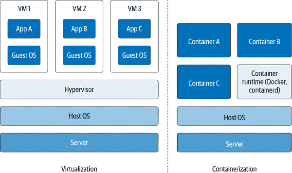

###### 图 2-1\. 将容器化与虚拟化进行比较

尽管容器使应用程序更加可移植，但使它们的数据可移植却是一个更大的挑战。因为容器本身是临时的，任何要在容器生命周期之外持久存在的数据必然需要外部存储。对于容器技术来说，关键特性是提供链接到持久存储的机制；对于容器编排技术来说，关键特性是能够有效地安排容器访问持久存储。

## 在 Docker 中管理状态

让我们来看看最流行的容器技术 Docker，看看容器如何存储数据。在 Docker 容器的视角下，*卷* 是一个可以支持读写或只读访问的目录。Docker 支持将多个数据存储挂载为卷。我们将介绍几个选项，以便稍后在 Kubernetes 中寻找它们的等效项。

## 绑定挂载

创建卷的最简单方法是将容器中的目录绑定到主机系统上的目录。这被称为*绑定挂载*，如图 Figure 2-2 所示。

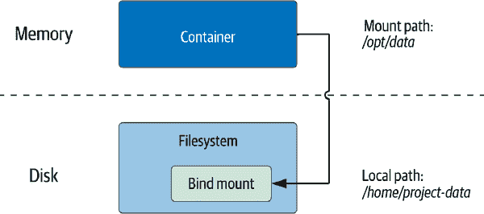

###### 图 2-2\. 使用 Docker 绑定挂载访问主机文件系统

在 Docker 中启动容器时，你可以使用 `--volume` 或 `-v` 选项指定绑定挂载，并指定本地文件系统路径和容器路径。例如，你可以启动一个 Nginx Web 服务器实例，并将本地开发机器上的项目文件夹映射到容器中。如果你安装了 Docker，可以在自己的环境中测试这个命令：

```
docker run -it --rm -d --name web -p 8080:80 \
  -v ~/site-content:/usr/share/nginx/html nginx

```

这会将本地主机上 8080 端口的 Web 服务器暴露出来。如果本地路径目录不存在，Docker 运行时将会创建它。Docker 允许你创建读写或只读权限的绑定挂载。因为卷被表示为一个目录，运行在容器中的应用程序可以将任何可以表示为文件的内容放入卷中，甚至是数据库。

绑定挂载对开发工作非常有用。然而，由于这样会导致容器依赖于主机上特定文件的存在，所以在生产环境中使用绑定挂载并不合适。这对单机部署可能还行，但是生产部署往往需要跨多个主机。另一个问题是，容器打开到主机文件系统的访问可能会带来安全隐患。因此，出于这些原因，我们需要另一种用于生产部署的方法。

## 卷

在 Docker 中，推荐使用卷。Docker 卷由 Docker 在主机文件系统的特定目录下创建和管理。使用 `docker volume create` 命令创建卷。例如，你可以创建一个名为 `site-content` 的卷来存储网站的文件：

```
docker volume create site-content
```

如果没有指定名称，Docker 会分配一个随机名称。创建后，生成的卷可以使用 `-v VOLUME-NAME:CONTAINER-PATH` 的形式挂载到容器中。例如，你可以使用刚创建的卷来让一个 Nginx 容器读取内容，同时允许另一个容器使用 `ro` 选项编辑内容：

```
docker run -it --rm -d --name web \
  -v site-content:/usr/share/nginx/html:ro nginx

```

# Docker 卷挂载语法

Docker 还支持 `--mount` 语法，允许更明确地指定源和目标文件夹。这种记法被认为更现代化，但也更冗长。前面例子中显示的语法仍然有效且更常用。

正如我们所示，一个 Docker 卷可以同时挂载到多个容器中，如图 2-3 所示。

使用 Docker 卷的优势在于 Docker 管理容器的文件系统访问，这使得在容器上更简单地强制执行容量和安全限制成为可能。

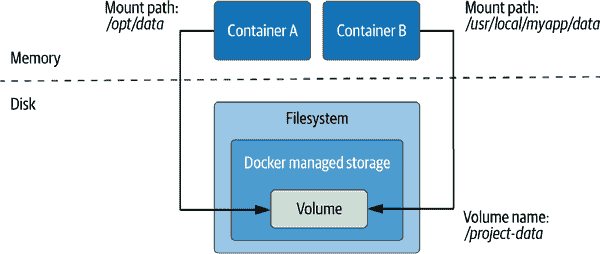

###### 图 2-3\. 在主机上创建 Docker 卷以在容器之间共享数据

## tmpfs 挂载

Docker 支持两种特定于主机操作系统的挂载类型：*tmpfs*（或*临时文件系统*）和*命名管道*。命名管道在 Docker for Windows 上可用，但由于它们通常不在 Kubernetes 中使用，我们在此不会过多考虑它们。

运行 Docker 在 Linux 上时，可以使用 tmpfs 挂载。tmpfs 挂载仅存在于容器的内存中，因此其内容不会存在于磁盘上，如图 2-4 所示。tmpfs 挂载适用于需要持久保存相对少量数据的应用程序，尤其是那些你不希望写入到主机文件系统的敏感数据。由于数据存储在内存中，访问速度更快也是一个附加好处。


###### 图 2-4\. 使用 Docker tmpfs 创建临时卷

要创建 tmpfs 挂载，可以使用 `docker run --tmpfs` 选项。例如，你可以使用以下命令指定一个 tmpfs 卷来存储处理敏感数据的 Web 服务器的 Nginx 日志：

```
docker run -it --rm -d --name web —-tmpfs /var/log/nginx nginx
```

`--mount` 选项也可以用于更多控制可配置选项。

## 卷驱动程序

Docker 引擎具有可扩展的架构，允许您通过插件添加自定义行为，包括网络、存储和授权等功能。第三方[存储插件](https://oreil.ly/b9P9X)可用于多个开源和商业提供者，包括公共云和各种网络文件系统。利用这些插件涉及在 Docker 引擎上安装插件，然后在使用该存储启动 Docker 容器时指定相关卷驱动程序，如 图 2-5 所示。

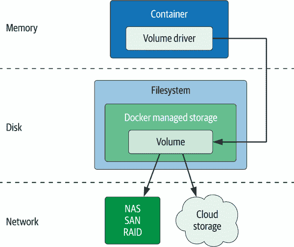

###### 图 2-5\. 使用 Docker 卷驱动程序访问网络存储

关于使用 Docker 支持的各种类型卷的更多信息，请参阅[Docker 存储文档](https://oreil.ly/vVPb4)，以及[`docker run` 命令](https://oreil.ly/Tj3NT)的文档。

# Kubernetes 数据存储资源

现在您已经了解了容器和云存储的基本概念，让我们看看 Kubernetes 带来了什么。在本节中，我们将介绍一些关键的 Kubernetes 概念，即 API 中用于将存储附加到容器化应用程序的*资源*。即使您对这些资源已有一定了解，也请继续关注，因为我们将特别关注每个资源如何与有状态数据相关联。

## Pod 和卷

新用户遇到的第一个 Kubernetes 资源之一是*Pod*。这是 Kubernetes 工作负载的基本部署单元。Pod 提供了运行容器的环境，Kubernetes 控制平面负责将 Pod 部署到 Kubernetes Worker 节点上。

*Kubelet* 是[Kubernetes 控制平面](https://oreil.ly/1ITFv)的一个组件，运行在每个 Worker 节点上。它负责在节点上运行 Pod，监视这些 Pod 及其内部容器的健康状态。这些元素在 图 2-6 中进行了总结。

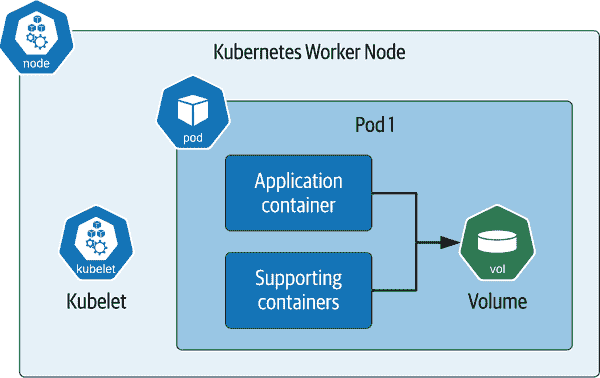

###### 图 2-6\. 在 Kubernetes Pod 中使用卷

虽然一个 Pod 可以包含多个容器，但最佳实践是一个 Pod 包含一个单独的应用程序容器，以及可选的额外辅助容器，如 图 2-6 所示。这些辅助容器可能包括在主应用程序容器之前运行以执行配置任务的*init 容器*，或者与主应用程序容器并行运行以提供辅助服务（如可观察性或管理）的*sidecar 容器*。在后续章节中，您将看到如何利用这些架构模式部署数据基础设施。

现在让我们看看持久性如何在这个 Pod 架构中得到支持。与 Docker 类似，容器中的“磁盘上”数据在容器崩溃时会丢失。Kubelet 负责重新启动容器，但这个新容器是原始容器的*替代* —— 它将具有独特的身份并以完全新的状态启动。

在 Kubernetes 中，术语*卷*用于表示 Pod 内部存储的访问。通过使用卷，容器具有持久化数据的能力，这些数据将超出容器的生命周期（可能还包括 Pod 的生命周期，我们很快会看到）。一个卷可以被 Pod 中的多个容器访问。每个容器在 Pod 内有自己的*volumeMount*，指定它应该被挂载到的目录，从而允许挂载点在容器之间有所不同。

在多种情况下，你可能希望在 Pod 中的容器之间共享数据：

+   一个 init 容器创建一个定制的配置文件，该文件由应用容器挂载以获取配置值。

+   应用 Pod 写入日志，而 sidecar Pod 读取这些日志以识别报告给外部监控工具的警报条件。

然而，你可能希望避免多个容器向同一个卷写入数据，因为你需要确保多个写入者不会发生冲突——Kubernetes 不会为你解决这个问题。

# 准备运行示例代码

本书的示例假设您可以访问一个运行中的 Kubernetes 集群。对于本章的示例，像 kind、K3s 或 Docker Desktop 这样的本地开发集群应该足够了。本节使用的源代码位于[本书的代码库](https://oreil.ly/VjIq1)中。

在 Pod 中使用卷需要两个步骤：定义卷并将卷挂载到每个需要访问的容器中。让我们看一个样例 YAML 配置，定义了一个具有单个应用容器（Nginx Web 服务器）和单个卷的 Pod。[源代码](https://oreil.ly/nlBJA) 存放在本书的代码库中：

```
apiVersion: v1
kind: Pod
metadata:
  name: my-pod
spec:
  containers:
  - name: my-app
    image: nginx
    volumeMounts:
    - name: web-data
      mountPath: /app/config
  volumes:
  - name: web-data
```

注意配置的两个部分：卷在 `spec.volumes` 下定义，卷的使用在 `spec.containers.volumeMounts` 下定义。首先，在 `volumeMounts` 下引用卷的 `name`，并且通过 `mountPath` 指定它将被挂载的目录。在声明 Pod 规范时，卷和挂载是一起的。为了使你的配置有效，必须在引用前声明卷，并且 Pod 中至少一个容器必须使用该卷。

您可能还注意到卷只有一个`name`。您并未指定任何其他信息。您认为这会有什么影响？您可以尝试使用示例源代码文件 *nginx-pod.yaml*，或将上述配置剪切并粘贴到以该名称命名的文件中，并针对已配置的 Kubernetes 集群执行`kubectl`命令来验证这一点：

```
kubectl apply -f nginx-pod.yaml
```

您可以通过使用`kubectl get pod`命令获取创建的 Pod 的更多信息，例如：

```
kubectl get pod my-pod -o yaml | grep -A 5 "  volumes:"
```

结果可能如下所示：

```
  volumes:
  - emptyDir: {}
    name: web-data
  - name: default-token-2fp89
    secret:
      defaultMode: 420
```

如您所见，当创建请求的卷时，Kubernetes 提供了额外的信息，默认将其设置为`emptyDir`类型。其他默认属性可能因您使用的 Kubernetes 引擎而异，但我们在这里不会进一步讨论。

可以在容器中挂载几种类型的卷；我们来看一下。

### 临时卷

您可能还记得我们在 Docker 卷的先前讨论中提到的 tmpfs 卷，它为单个容器的生命周期提供临时存储。Kubernetes 提供了一个 [*临时卷*](https://oreil.ly/zaiKG) 的概念，与之类似，但范围限定在 Pod 级别。在前面的示例中介绍的`emptyDir`就是一种临时卷类型。

临时卷可用于数据基础设施或其他希望创建快速访问缓存的应用程序。虽然它们不会持续超出 Pod 的生命周期，但它们仍然可以展示长期持久性的其他卷的一些典型属性，比如快照能力。临时卷的设置略微比 PersistentVolumes 更简单，因为它们完全在 Pod 定义中内联声明，无需引用其他 Kubernetes 资源。接下来将会看到，创建和使用 PersistentVolumes 会更复杂一些。

# 其他临时存储提供者

我们接下来将讨论一些提供 PersistentVolumes 的 in-tree 和 CSI 存储驱动程序，它们还提供了临时卷选项。您应查看特定提供者的文档，以了解可用的选项。

### 配置卷

Kubernetes 提供了几种将配置数据注入到 Pod 中作为卷的构造方法。从应用程序持久化其自身数据的角度来看，这些卷类型也被视为临时的。

以下卷类型与我们在本书中的探索相关，因为它们为在 Kubernetes 上运行的应用程序和数据基础设施提供了一种有用的配置手段。我们将简要描述每种卷：

ConfigMap 卷

配置映射（ConfigMap）是 Kubernetes 资源，用于将应用程序外部的配置值存储为一组名称-值对。例如，应用程序可能需要底层数据库的连接详情，如 IP 地址和端口号。将这些配置定义在 ConfigMap 中是从应用程序中外部化这些信息的好方法。生成的配置数据可以作为卷（volume）挂载到应用程序中，其中将显示为一个目录。每个配置值都表示为一个文件，其中文件名是键，文件的内容包含值。有关如何将 ConfigMap 挂载为卷的更多信息，请参阅 Kubernetes 文档 [mounting ConfigMaps as volumes](https://oreil.ly/zaiKG)。

Secret volumes

秘密（Secret）与 ConfigMap 类似，但用于安全访问需要保护的敏感数据。例如，您可能希望创建一个包含数据库访问凭据（如用户名和密码）的 Secret。配置和访问 Secret 与使用 ConfigMap 类似，额外的好处是 Kubernetes 在 Pod 内访问时帮助解密 Secret。有关如何将 Secret 挂载为卷的更多信息，请参阅 Kubernetes 文档 [mounting Secrets as volumes](https://oreil.ly/mPkMB)。

Downward API volumes

Kubernetes 下行 API 公开有关 Pod 和容器的元数据，可以作为环境变量或卷使用。这些元数据也是 `kubectl` 和其他客户端使用的相同元数据。

可用的 Pod 元数据包括 Pod 的名称、ID、命名空间、标签和注释。容器化应用程序可能希望使用 Pod 信息进行日志记录和指标报告，或者确定数据库或表名。

可用的容器元数据包括请求的资源量（如 CPU、内存和临时存储）和最大资源量。容器化应用程序可能希望使用这些信息来限制其资源使用。有关如何作为卷注入 Pod 信息的示例，请参阅 Kubernetes 文档 [injecting Pod information as a volume](https://oreil.ly/LrOn2)。

### 主机路径（hostPath）卷

一个 [`hostPath`](https://oreil.ly/kjr8P) 卷将文件或目录挂载到运行它的 Kubernetes 工作节点上的 Pod 中。这类似于 Docker 中的绑定挂载（bind mount）概念，可以参考 “Bind Mounts”。使用 `hostPath` 卷相比于 `emptyDir` 卷有一个优势：数据将在 Pod 重启后仍然存在。

然而，使用 `hostPath` 卷存在一些缺点。首先，为了让替换的 Pod 访问原始 Pod 的数据，它需要在相同的工作节点上重新启动。虽然 Kubernetes 允许您使用亲和性控制 Pod 放置在哪个节点上，但这往往会限制 Kubernetes 调度程序的最佳放置 Pod 的能力，如果节点因某些原因宕机，则 `hostPath` 卷中的数据将丢失。其次，与 Docker 绑定挂载一样，使用 `hostPath` 卷存在安全风险，涉及允许访问本地文件系统。因此，建议仅将 `hostPath` 卷用于开发部署。

### 云卷

可以创建 Kubernetes 卷，引用的存储位置不仅限于 Pod 运行的工作节点，如 图 2-7 所示。这些可以分为由命名云提供商提供的卷类型以及试图提供更通用接口的卷类型。

这些包括以下内容：

+   [`awsElasticBlockStore`](https://oreil.ly/CmTCt) 卷类型用于挂载亚马逊网络服务 (AWS) 弹性块存储 (EBS) 上的卷。许多数据库使用块存储作为其底层存储层。

+   [`gcePersistentDisk`](https://oreil.ly/01JEm) 卷类型用于挂载 Google 计算引擎 (GCE) 持久磁盘 (PD)，这是块存储的另一个示例。

+   Microsoft Azure 支持两种类型的卷：[`azureDisk`](https://oreil.ly/pIann) 用于 Azure 数据磁盘卷，以及 [`azureFile`](https://oreil.ly/kInGC) 用于 Azure 文件卷。

+   [`cinder`](https://oreil.ly/VVLrx) 卷类型可用于访问 OpenStack 部署中的 OpenStack Cinder 卷。

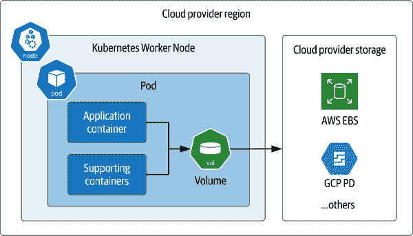

###### 图 2-7\. Kubernetes Pods 直接挂载云提供商存储

使用这些类型通常需要在云提供商上进行配置，并且从 Kubernetes 集群访问通常限于相同云区域和帐户中的存储。查阅您的云提供商文档以获取更多详细信息。

### 其他附加卷提供程序

还有许多其他类型的卷提供程序，提供的存储类型各不相同。以下是一些示例：

+   `fibreChannel` 卷类型可用于实施光纤通道协议的 SAN 解决方案。

+   `gluster` 卷类型用于访问使用之前引用的 [Gluster](https://www.gluster.org) 分布式文件系统的文件存储。

+   `iscsi` 卷将现有的 Internet Small Computer Systems Interface (iSCSI) 卷挂载到您的 Pod 中。

+   `nfs` 卷允许将现有的 NFS 共享挂载到 Pod 中。

我们将检查更多实现“容器附加存储”模式的卷提供程序，在 “容器附加存储” 中有详细说明。表 2-1 比较了我们迄今所涵盖的 Docker 和 Kubernetes 存储概念。

表 2-1\. 比较 Docker 和 Kubernetes 存储选项

| 存储类型 | Docker | Kubernetes |
| --- | --- | --- |
| 从各种提供者访问持久存储 | 卷（通过卷驱动程序访问） | 卷（通过 in-tree 或 CSI 驱动程序访问） |
| 访问主机文件系统（不建议用于生产） | Bind 挂载 | `hostPath` 卷 |
| 在容器（或 Pod）运行时可用的临时存储 | Tmpfs | `emptyDir` 和其他临时卷 |
| 配置和环境数据（只读） | （无直接等价） | ConfigMap、Secret、downward API |

在这一节中，我们讨论了如何使用卷来提供可以由同一 Pod 内的多个容器共享的存储。虽然对于一些用例来说使用卷已经足够，但它并不能满足所有需求。卷不能提供在 Pod 之间共享存储资源的能力。特定存储位置的定义与 Pod 的定义紧密相关。随着在您的 Kubernetes 集群中部署的 Pod 数量增加，为单个 Pod 管理存储并不会很好地扩展。

幸运的是，Kubernetes 提供了额外的基元，有助于简化为单个 Pod 和相关 Pod 组提供存储卷的过程。我们将在接下来的几节中探讨这些概念。

## 持久卷

Kubernetes 开发人员为管理存储引入的关键创新是[持久卷子系统](https://oreil.ly/ec8BB)。该子系统由三个额外的 Kubernetes 资源组成，它们共同工作：持久卷、持久卷声明和存储类。这些资源允许您将存储的定义和生命周期与 Pod 使用存储的方式分开，如图 2-8 所示：

+   集群管理员定义持久卷，可以通过显式定义或创建可以动态配置新持久卷的存储类来定义持久卷。

+   应用程序开发人员创建描述其应用程序存储资源需求的持久卷声明，并且这些持久卷声明可以作为卷定义的一部分在 Pod 中引用。

+   Kubernetes 控制平面管理将持久卷声明与持久卷绑定的过程。

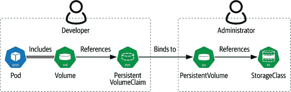

###### 图 2-8\. PersistentVolumes, PersistentVolumeClaims, 和 StorageClasses

首先让我们看一下 *PersistentVolume* 资源（通常缩写为 *PV*），它定义了访问特定位置存储的方式。PersistentVolumes 通常由集群管理员定义，供应用开发者使用。每个 PV 可以代表前面部分讨论的相同类型的存储，例如云提供商提供的存储、网络存储或直接在工作节点上的存储，如图 2-9 中所示。由于它们与特定的存储位置绑定，因此 PersistentVolumes 在 Kubernetes 集群之间不可移植。

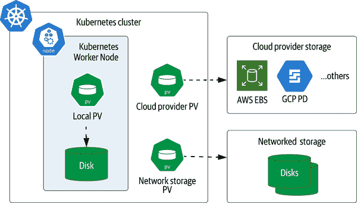

###### 图 2-9\. Kubernetes 持久卷的类型

### 本地 PersistentVolumes

图 2-9 还介绍了一种名为 `local` 的 PersistentVolume 类型，它表示直接挂载在 Kubernetes 工作节点（如磁盘或分区）上的存储。与 `hostPath` 卷类似，`local` 卷也可以表示一个目录。`local` 卷与 `hostPath` 卷的一个关键区别在于，当使用 `local` 卷的 Pod 重新启动时，Kubernetes 调度程序确保 Pod 被重新调度到同一节点，以便可以重新附加到相同的持久状态。因此，`local` 卷经常用作管理自身复制的数据基础设施的后备存储，正如我们将在第 4 章中看到的那样。

定义 PersistentVolume 的语法将看起来很熟悉，因为它类似于在 Pod 内定义卷。例如，这是一个定义本地 PersistentVolume 的 YAML 配置文件。[源代码](https://oreil.ly/b1zHe)位于本书的存储库中。

```
apiVersion: v1
kind: PersistentVolume
metadata:
  name: my-volume
spec:
  capacity:
    storage: 3Gi
  accessModes:
    - ReadWriteOnce
  local:
    path: /app/data
  nodeAffinity:
    required:
      nodeSelectorTerms:
      - matchExpressions:
        - key: kubernetes.io/hostname
          operator: In
          values:
          - node1
```

正如您所见，此代码在工作节点 `node1` 上定义了一个名为 `my-volume` 的 `local` 卷，大小为 3 GB，访问模式为 `ReadWriteOnce`。支持以下[访问模式](https://oreil.ly/mm5HT)用于 PersistentVolumes：

`ReadWriteOnce`

该卷可以由单个节点一次性挂载进行读写，尽管在该节点上运行的多个 Pod 可以访问该卷。

`ReadOnlyMany`

可以同时由多个节点挂载该卷，仅供读取。

`ReadWriteMany`

该卷可以同时由多个节点挂载，用于读写。

# 选择卷访问模式

给定卷的正确访问模式将受到工作负载类型的驱动。例如，许多分布式数据库将配置为每个 Pod 专用的存储，使 `ReadWriteOnce` 成为一个不错的选择。

除了[容量](https://oreil.ly/TSKOD)和访问模式外，PersistentVolumes 的其他属性包括以下内容：

+   `volumeMode` 默认为 `Filesystem`，但可以覆盖为 `Block`。

+   当一个 Pod 释放对 PersistentVolume 的声明时，`reclaimPolicy` 定义了发生的事情。合法的值包括 `Retain`、`Recycle` 和 `Delete`。

+   PersistentVolume 可以具有 `nodeAffinity`，指定可以访问该卷的 Worker Node 或节点。这对大多数类型来说是可选的，但对于 `local` 卷类型来说是必需的。

+   `class` 属性将此 PV 绑定到特定的 StorageClass，这是我们稍后在本章中介绍的概念。

+   一些 PersistentVolume 类型公开特定于该类型的 `mountOptions`。

# 卷选项的差异

不同的卷类型有不同的选项。例如，并非每种 PersistentVolume 类型都可以访问每种访问模式或回收策略，因此请参阅您选择类型的文档以获取更多详细信息。

使用 `kubectl describe persistentvolume` 命令（或简写为 `kubectl describe pv`）查看 PersistentVolume 的状态：

```
kubectl describe pv my-volume
Name:              my-volume
Labels:            <none>
Annotations:       <none>
Finalizers:        [kubernetes.io/pv-protection]
StorageClass:
Status:            Available
Claim:
Reclaim Policy:    Retain
Access Modes:      RWO
VolumeMode:        Filesystem
Capacity:          3Gi
Node Affinity:
  Required Terms:
    Term 0:        kubernetes.io/hostname in [node1]
Message:
Source:
    Type:  LocalVolume (a persistent volume backed by local storage on a node)
    Path:  /app/data
Events:    <none>
```

当首次创建时，PersistentVolume 的状态为 `可用`。PersistentVolume 可以具有多个状态值：

`可用`

PersistentVolume 是空闲的，尚未绑定到声明。

`已绑定`

PersistentVolume 已绑定到 PersistentVolumeClaim，这在 `describe` 输出中有列出。

`已释放`

PersistentVolume 上的现有声明已被删除，但资源尚未被回收，因此资源尚未 `可用`。

`失败`

该卷已经失败了其自动回收。

现在您已经了解了如何在 Kubernetes 中定义存储资源，下一步是学习如何在应用程序中使用该存储。

## PersistentVolumeClaims

正如我们所讨论的，Kubernetes 将存储的定义与其使用分开。通常由不同角色执行这些任务：集群管理员定义存储，而应用开发者使用存储。PersistentVolumes 通常由管理员定义，并引用特定于该集群的存储位置。然后，开发者可以使用 *PersistentVolumeClaims (PVCs)* 指定其应用程序的存储需求，Kubernetes 使用这些 PVCs 将 Pod 与符合指定条件的 PersistentVolume 关联起来。如 图 2-10 所示，PersistentVolumeClaim 用于引用我们之前介绍的各种卷类型，包括本地 PersistentVolumes 或由云或网络存储供应商提供的外部存储。

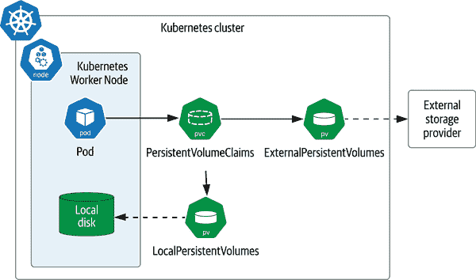

###### 图 2-10\. 使用 PersistentVolumeClaims 访问 PersistentVolumes

以下是从应用开发者角度来看这个过程的步骤。首先，您将创建一个 PVC，表示您的期望存储条件。例如，这里有一个请求 1 GB 存储空间并具有独占读写访问权限的声明。[源代码](https://oreil.ly/njKPH) 可在本书的存储库中找到：

```
apiVersion: v1
kind: PersistentVolumeClaim
metadata:
  name: my-claim
spec:
  storageClassName: ""
  accessModes:
  - ReadWriteOnce
  resources:
    requests:
      storage: 1Gi
```

您可能已经注意到关于此声明的一个有趣事实是，`storageClassName` 设置为空字符串。在下一节讨论 StorageClasses 时，我们将解释这一点的重要性。您可以像这样在 Pod 的定义中引用声明。这本书的 [源代码](https://oreil.ly/VnJN4) 存储在此书的存储库中：

```
apiVersion: v1
kind: Pod
metadata:
  name: my-pod
spec:
  containers:
  - name: nginx
    image: nginx
    volumeMounts:
    - mountPath: "/app/data"
      name: my-volume
  volumes:
  - name: my-volume
    persistentVolumeClaim:
      claimName: my-claim
```

正如您所见，PersistentVolume 在 Pod 中表示为一个卷。该卷被赋予一个名称和对声明的引用。这被认为是一种 `persistentVolumeClaim` 类型的卷。与其他卷一样，该卷被挂载到容器中的特定挂载点上 —— 在这种情况下，挂载到主应用程序 Nginx 容器的路径为 */app/data*。

PVC 还有一个状态，您可以通过检索状态来查看：

```
kubectl describe pvc my-claim
Name:          my-claim
Namespace:     default
StorageClass:
Status:        Bound
Volume:        my-volume
Labels:        <none>
Annotations:   pv.kubernetes.io/bind-completed: yes
               pv.kubernetes.io/bound-by-controller: yes
Finalizers:    [kubernetes.io/pvc-protection]
Capacity:      3Gi
Access Modes:  RWO
VolumeMode:    Filesystem
Mounted By:    <none>
Events:        <none>
```

PVC 有两种状态值之一：`Bound` 表示它已绑定到一个卷（就像这个例子中一样），或者 `Pending` 表示它尚未绑定到卷。通常，`Pending` 状态表示没有与声明匹配的 PV 存在。

这里是背后发生的事情。Kubernetes 使用 Pod 中引用的 PVC 作为卷，并在调度 Pod 时考虑这些卷。Kubernetes 标识与声明相关属性匹配的 PersistentVolumes，并将最小可用模块绑定到声明。这些属性可能包括标签或节点亲和性，就像我们之前为 `local` 卷所见。

启动 Pod 时，Kubernetes 控制平面确保将 PersistentVolumes 挂载到 Worker Node。然后，每个请求的存储卷被挂载到指定的挂载点上。

## StorageClasses

前面的例子展示了 Kubernetes 如何将 PVC 绑定到已经存在的 PersistentVolumes。这种模型，即在 Kubernetes 集群中显式创建 PersistentVolumes，被称为 *静态提供*。Kubernetes PersistentVolume 子系统还支持使用 *StorageClasses*（通常缩写为 *SC*）进行卷的 *动态提供*。StorageClass 负责根据集群中运行应用程序的需求提供（和取消提供）PersistentVolumes，如 图 2-11 所示。

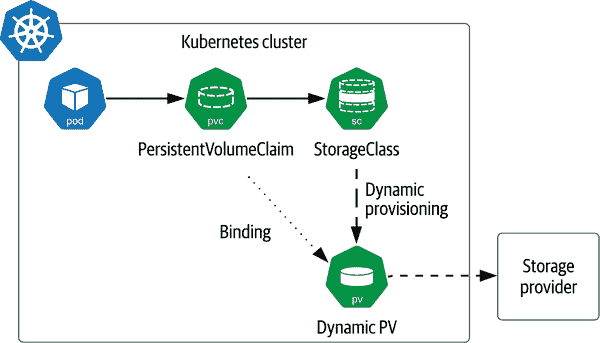

###### 图 2-11\. StorageClasses 支持动态提供卷

根据您使用的 Kubernetes 集群，可能已经有至少一个 StorageClass 可用。您可以使用命令 `kubectl get sc` 来验证这一点。如果在本地运行一个简单的 Kubernetes 分发版本并且看不到任何 StorageClasses，则可以使用以下命令安装 Rancher 的开源本地存储提供程序：

```
set GH_LINK=https://raw.githubusercontent.com
kubectl apply -f \
  $GH_LINK/rancher/local-path-provisioner/master/deploy/local-path-storage.yaml
```

此存储提供程序预先安装在 K3s 中，这也是 Rancher 提供的桌面发行版。如果您查看该语句中引用的 YAML 配置，请看看以下 StorageClass 的定义。该[source code](https://oreil.ly/nTocI)位于本书的存储库中：

```
apiVersion: storage.k8s.io/v1
kind: StorageClass
metadata:
  name: local-path
provisioner: rancher.io/local-path
volumeBindingMode: WaitForFirstConsumer
reclaimPolicy: Delete
```

正如您从定义中可以看到的那样，一个 StorageClass 由几个关键属性定义：

+   `provisioner`与底层存储提供程序接口，如公共云或存储系统，以便分配实际存储。提供程序可以是 Kubernetes 内置的提供程序之一（称为*in-tree*，因为它们是 Kubernetes 源代码的一部分），也可以是符合容器存储接口（CSI）的提供程序，我们稍后将在本章中进行详细讨论。

+   `reclaimPolicy`描述了在删除 PersistentVolume 时是否回收存储。默认值`Delete`可以被覆盖为`Retain`，在这种情况下，存储管理员将负责管理该存储的未来状态。

+   [`volumeBindingMode`](https://oreil.ly/iFvrm)控制存储何时被配置和绑定。如果值是`Immediate`，则当创建引用 StorageClass 的 PersistentVolumeClaim 时立即配置 PersistentVolume，并且该声明绑定到 PersistentVolume，而不管该声明是否在 Pod 中引用。许多存储插件还支持第二种模式，称为`WaitForFirstConsumer`，在这种情况下，直到创建引用声明的 Pod 后，才会配置 PersistentVolume。考虑到这种行为更为可取，因为它给了 Kubernetes 调度程序更大的灵活性。

+   尽管在此示例中未显示，还有一个可选的`allowVolumeExpansion`标志。这表示 StorageClass 是否支持对卷进行扩展的能力。如果是`true`，则可以通过增加 PersistentVolumeClaim 的`storage.request`字段的大小来扩展卷。此值默认为`false`。

+   一些 StorageClasses 还定义了`parameters`，这些是传递给提供程序的存储提供程序的特定配置选项。常见选项包括文件系统类型、加密设置以及每秒 I/O 操作（IOPS）的吞吐量。请查阅存储提供程序的文档以获取更多详细信息。

# 动态配置的限制

本地 PV 不能通过 StorageClass 动态配置，因此您必须自行手动创建它们。

应用程序开发人员可以在定义中添加`storageClass`属性来引用特定的 StorageClass，从而创建 PVC。例如，以下是引用`local-path` StorageClass 的 PVC 的 YAML 配置。该[source code](https://oreil.ly/Ixwv7)位于本书的存储库中：

```
apiVersion: v1
kind: PersistentVolumeClaim
metadata:
  name: my-local-path-claim
spec:
  storageClassName: local-path
  accessModes:
  - ReadWriteOnce
  resources:
    requests:
      storage: 1Gi
```

如果声明中未指定`storageClass`，则使用默认的 StorageClass。集群管理员可以设置默认的 StorageClass。正如我们在“持久卷”中所展示的，您可以通过使用空字符串来选择不使用 StorageClasses，这表示您正在使用静态配置的存储。

StorageClasses 提供了一个有用的抽象，集群管理员和应用程序开发人员可以作为合同使用：管理员定义 StorageClasses，开发人员按名称引用 StorageClasses。底层 StorageClass 实现的细节可以因 Kubernetes 平台提供商而异，促进应用程序的可移植性。

此灵活性允许管理员创建代表各种存储选项的 StorageClasses — 例如，根据吞吐量或延迟区分不同的服务质量保证。这个概念在其他存储系统中被称为*配置文件*。请参阅“开发者如何推动 Kubernetes 存储的未来”获取有关如何创新地利用 StorageClasses 的更多想法。

# Kubernetes 存储架构

在前面的部分中，我们讨论了 Kubernetes 通过其[API](https://oreil.ly/k1Ttm)支持的各种存储资源。在本章的其余部分，我们将探讨这些解决方案的构建方式，因为它们可以为我们提供构建云原生数据解决方案的宝贵见解。

# 定义云原生存储

本章讨论的大多数存储技术都作为“云原生存储”解决方案的一部分，列在[CNCF 景观](https://oreil.ly/vY3wF)中。[CNCF 存储白皮书](https://oreil.ly/bKRi9)是一个有用的资源，定义了云原生存储的关键术语和概念。这两个资源定期更新。

## Flexvolume

最初，Kubernetes 代码库包含多个内置存储插件（即与 Kubernetes 代码库的其他部分包含在同一个 GitHub 仓库中）。这有助于标准化与不同存储平台连接的代码，但也存在一些缺点。首先，许多 Kubernetes 开发人员对包含的广泛存储提供商的专业知识有限。更重要的是，升级存储插件的能力与 Kubernetes 发布周期捆绑在一起，这意味着如果您需要为存储插件进行修复或增强，您必须等待它被接受并发布到 Kubernetes 的周期中。这减缓了 Kubernetes 存储技术的成熟速度，结果也减缓了其采纳速度。

Kubernetes 社区创建了 *Flexvolume 规范*，以允许独立开发插件，即不依赖于 Kubernetes 源代码树，因此不受 Kubernetes 发布周期的限制。与此同时，其他容器编排系统的存储插件标准也在出现，这些社区的开发者开始质疑为解决同一个基本问题开发多个标准的智慧。

# 未来的 Flexvolume 支持

在 Kubernetes 1.23 中，Flexvolume 功能已被弃用，以支持容器存储接口。

## 容器存储接口

*容器存储接口（CSI）*倡议被确立为容器化应用程序存储的行业标准。CSI 是一个开放标准，用于定义能够跨容器编排系统（包括 Kubernetes、Mesos 和 Cloud Foundry）工作的插件。正如谷歌工程师兼 Kubernetes [存储特别兴趣小组（SIG）](https://oreil.ly/JDsVv) 主席 Saad Ali 在《The New Stack》中指出的那样，“容器存储接口允许 Kubernetes 与任意存储系统直接交互”。

CSI 规范可以在 [GitHub](https://oreil.ly/kCOhg) 上找到。Kubernetes 对 CSI 的支持始于 1.*x* 版本，并在 1.13 版本中 [正式推广（GA）](https://oreil.ly/AbUpe)。Kubernetes 仍在跟踪 CSI 规范的更新。

# 额外的 CSI 资源

[CSI 文档站点](https://oreil.ly/KFIXI) 提供了对希望开发符合 CSI 标准驱动程序的开发者和存储提供者的指导。该站点还提供了一个非常有用的[符合 CSI 标准的驱动程序列表](https://oreil.ly/wHkva)。这个列表通常比 Kubernetes 文档站点上提供的更新。

一旦在 Kubernetes 集群上部署了 CSI 实现，其功能可以通过标准 Kubernetes 存储资源（如 PVC、PV 和 SC）访问。在后端，每个 CSI 实现必须提供两个插件：一个节点插件和一个控制器插件，如 图 2-12 所示。

CSI 规范使用 gRPC 定义了这些插件的必需接口，但并未具体指定如何部署这些插件。让我们简要看一下每个服务的角色：

控制器插件

该插件支持对卷进行的操作，例如创建、删除、列出、发布/取消发布、跟踪和扩展卷容量。它还跟踪卷状态，包括每个卷附加到哪些节点。控制器插件还负责获取和管理快照，并使用快照来克隆卷。控制器插件可以在任何节点上运行，它是一个标准的 Kubernetes 控制器。

节点插件

此插件在每个 Kubernetes 工作节点上运行，其中配置的卷将被附加。节点插件负责本地存储以及在节点上挂载和卸载卷。Kubernetes 控制平面指示插件在调度任何需要该卷的 Pod 之前挂载卷。

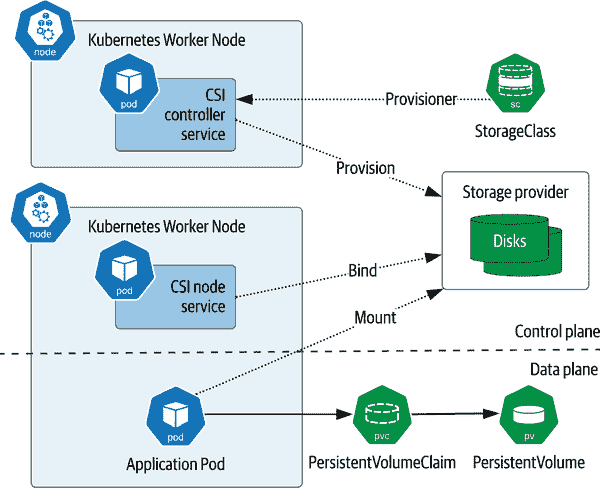

###### 图 2-12\. CSI 映射到 Kubernetes

## 容器附加存储

虽然 CSI 在标准化容器编排器上的存储管理方面是重要的一步，但它并没有提供关于存储软件如何或在哪里运行的实现指导。一些 CSI 实现基本上是围绕在 Kubernetes 集群外运行的传统存储管理软件的薄包装。虽然重用现有的存储资产确实有其好处，但许多开发人员表达了希望在 Kubernetes 中完全运行其应用程序旁边的存储管理解决方案的愿望。

*Container Attached Storage* 是一种设计模式，提供更云原生的存储管理方法。管理附加卷到应用程序的逻辑本身由运行在容器中的微服务组成。这使得存储层具有与在 Kubernetes 上部署的其他应用程序相同的特性，并减少了管理员需要跟踪的不同管理界面数量。存储层只是另一个 Kubernetes 应用程序。

正如 Evan Powell 在[“Container Attached Storage: A Primer”](https://oreil.ly/zplhD)中指出：

> 容器附加存储反映了重新发明特定类别或创建新类别的解决方案的更广泛趋势——通过建立在 Kubernetes 和微服务之上，并为基于 Kubernetes 的微服务环境提供功能。例如，云原生生态系统中出现了新的安全性、DNS、网络、网络策略管理、消息传递、跟踪、日志记录等项目。

几个项目和产品的例子体现了 CAS 存储方法。让我们来看一些开源选项。

### OpenEBS

*OpenEBS* 是由 MayaData 创建并捐赠给 CNCF 的项目，在 2019 年成为沙盒项目。该名称是对亚马逊弹性块存储的一种戏仿，OpenEBS 试图提供这种流行托管服务的开源替代。OpenEBS 提供用于管理本地和 NVMe 持久卷的存储引擎。

OpenEBS 为在 Kubernetes 上部署的符合 CSI 的实现提供了一个很好的例子，如图 2-13 所示。控制平面包括 OpenEBS 提供程序，该提供程序实现了 CSI 控制器接口，以及 OpenEBS API 服务器，为客户端提供配置界面，并与其他 Kubernetes 控制平面交互。

OpenEBS 数据平面包括节点磁盘管理器（NDM）以及每个持久卷的专用 Pod。NDM 在将要访问存储的每个 Kubernetes 工作节点上运行。它实现了 CSI 节点接口，并提供了自动检测连接到工作节点的块存储设备的有用功能。

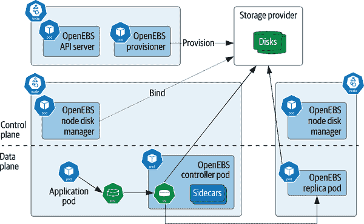

###### 图 2-13\. OpenEBS 架构

OpenEBS 为每个卷创建多个 Pod。一个控制器 Pod 被创建为主要副本，并在其他 Kubernetes 工作节点上为高可用性创建额外的副本 Pod。每个 Pod 包括用于指标收集和管理的 sidecars，这允许控制平面监视和管理数据平面。

### Longhorn

[Longhorn](https://longhorn.io) 是一个面向 Kubernetes 的开源分布式块存储系统。它最初由 Rancher 开发，并于 2019 年成为 CNCF 沙盒项目。Longhorn 专注于提供替代云供应商存储和昂贵外部存储阵列的解决方案。Longhorn 支持向 NFS 或兼容 S3 存储提供增量备份，并向另一个 Kubernetes 集群进行实时复制以进行灾难恢复。

Longhorn 使用与 OpenEBS 显示的类似架构；根据[文档](https://oreil.ly/TXTjG)，“Longhorn 为每个块设备卷创建一个专用存储控制器，并在多个节点上同步复制卷。存储控制器和副本本身使用 Kubernetes 进行编排。” Longhorn 还提供集成用户界面以简化操作。

### Rook 和 Ceph

根据其网站，“Rook 是一个开源的云原生存储编排器，为多样化的存储解决方案提供平台、框架和支持，以与云原生环境本地集成。” Rook 最初是作为可在 Kubernetes 中部署的 Ceph 的容器化版本创建的。[Ceph](https://ceph.io/en) 是一个提供块、文件和对象存储的开源分布式存储框架。Rook 是 CNCF 接受的第一个存储项目，现在被认为是[CNCF 毕业项目](https://oreil.ly/xmc1i)。

Rook 是一个真正的 Kubernetes 本地实现，因为它利用了 Kubernetes 自定义资源（CRDs）和自定义控制器称为操作员。Rook 为 Ceph、Cassandra 和 NFS 提供操作员。我们将在第四章中更多地了解自定义资源和操作员。

一些适用于 Kubernetes 的商业解决方案也体现了 CAS 模式。这些包括[MayaData](https://mayadata.io)（OpenEBS 的创建者）、由[Pure Storage](https://oreil.ly/3rJuQ)提供的[Portworx](https://portworx.com)、[Robin.io](https://robin.io) 和[StorageOS](https://storageos.com)。 这些公司不仅提供块和文件格式的原始存储，还提供了用于简化部署额外数据基础设施（如数据库和流解决方案）的集成。

## 容器对象存储接口

CSI 提供了对文件和块存储的支持，但对象存储 API 需要不同的语义，不太适合挂载卷的 CSI 范例。2020 年秋季，由[MinIO](https://min.io)领导的一组公司开始开发了容器编排平台中对象存储的新 API：*Container Object Storage Interface (COSI)*。 COSI 提供了一个更适合于在 Kubernetes 中进行对象存储配置和访问的 API，定义了`bucket`自定义资源，并包括创建桶和管理对桶的访问的操作。 COSI 控制平面和数据平面的设计是以 CSI 为模型的。 COSI 是一个具有广泛采纳潜力的新兴标准，可能在 Kubernetes 社区甚至更广泛的范围内得到广泛应用。

*正如您所见，Kubernetes 上的存储是一个涵盖了许多创新的领域，包括多个开源项目和商业供应商竞争提供最易用、成本效益高和性能卓越的解决方案。[云原生存储部分](https://oreil.ly/cm4Ms) CNCF 景观提供了一个有用的存储提供商及相关工具的列表，包括本章中提到的技术及其他许多技术。*  *# 总结

在这一章中，我们探讨了像 Docker 这样的容器系统以及像 Kubernetes 这样的容器编排系统中如何管理持久性。您已经了解了各种 Kubernetes 资源，可以用来管理有状态的工作负载，包括 Volumes、PersistentVolumes、PersistentVolumeClaims 和 StorageClasses。我们看到了容器存储接口和容器附加存储模式如何指引我们朝着更加云原生的存储管理方法迈进。现在，您已经准备好学习如何使用这些构建块和设计原则来管理包括数据库、流数据等在内的有状态工作负载了。
