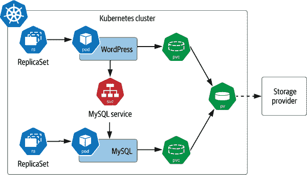
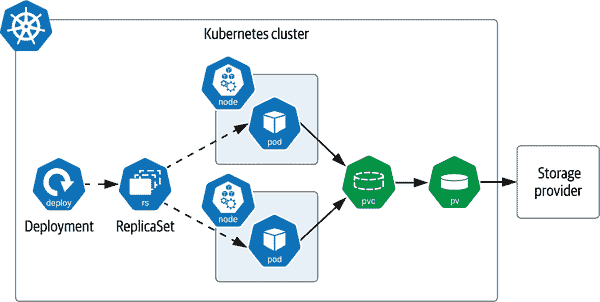
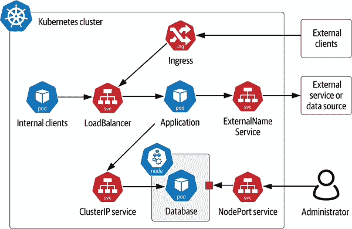
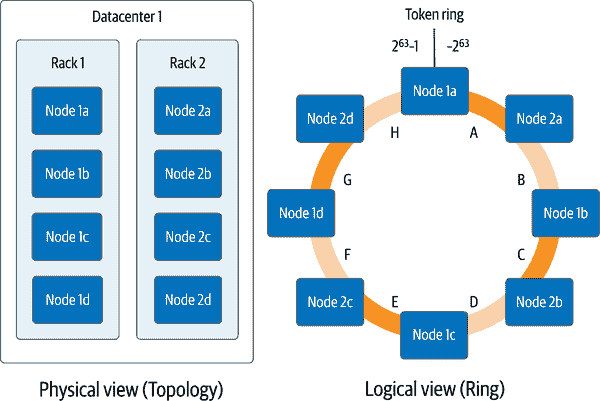
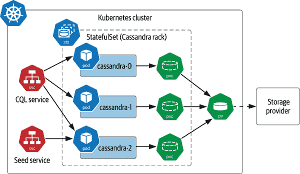

# 第三章：Kubernetes 上的数据库困难之路

正如我们在第一章中讨论的，Kubernetes 是为无状态工作负载而设计的。与此相关的是，无状态工作负载是 Kubernetes 做得最好的。因此，有人认为你不应该试图在 Kubernetes 上运行有状态工作负载，你可能会听到各种建议，比如“使用托管服务”，或者“将数据留在你的传统数据中心的传统数据库中”，或者甚至“在云中运行你的数据库，但使用传统虚拟机而不是容器”。

虽然这些建议仍然是可行的选择之一，但本书的主要目标之一是展示，在 Kubernetes 中运行数据基础设施不仅是一个可行的选择，而且是一个首选的选择。在他的文章[《从一个前怀疑论者的角度看 Kubernetes 上的数据库》](https://oreil.ly/SjQV0)，克里斯托弗·布拉德福德描述了他从怀疑在 Kubernetes 中运行任何有状态工作负载，到勉强接受在开发和测试工作负载中在 Kubernetes 上运行数据基础设施，再到热情地宣扬在生产环境中部署数据库在 Kubernetes 上的旅程。这一旅程是数据在 Kubernetes 社区中很多人的典型代表（DoKC）。到 2020 年中期，鲍里斯·库尔克切夫能够引用一个日益增长的共识，即在 Kubernetes 上管理有状态工作负载已经达到了可行性，甚至成熟性的点，他在文章[《将有状态应用引入 Kubernetes 的 3 个理由》](https://oreil.ly/xtm89)中提到了这一点。

这种变化是如何发生的？在过去的几年中，Kubernetes 社区的重点已经转向增加支持以云原生方式在 Kubernetes 上管理状态的功能。存储元素代表了这种转变的重要部分，我们在上一章中介绍了这些，包括 Kubernetes 持久卷子系统和 CSI 的采用。在本章中，我们将通过查看用于在这种存储基础上构建有状态应用的 Kubernetes 资源来完成这部分故事。我们将特别关注一种特定类型的有状态应用程序：数据基础设施。

# 困难的道路

“走弯路”这个短语现在常常与避免简单选择，而选择投入详细工作以完成具有持久意义结果的方式联系在一起。在整个历史上，各种开拓者都以为后代能够过上更美好生活而自豪，因为他们为此做出了牺牲，包括鲜血、汗水和眼泪。这些前辈们经常会听到后辈们未能理解他们所经历深度的感叹。

在技术世界中，情况也毫无不同。虽然像 API 和“无代码”环境这样的新创新有着巨大的潜力培养全球新一代开发人员，但深入理解底层技术仍然是管理全球规模高可用性和安全系统所必需的。当事情出错时，这种详细的知识证明了其价值。这就是为什么我们许多只在日常工作中作为软件开发人员，从未接触过物理服务器的人，却从通过手工布线芯片和电路板来建造自己的 PC 中获益良多。这也是为什么作为我们朋友和家人的非正式 IT 顾问带来的隐藏好处之一。

对于 Kubernetes 社区来说，“the hard way”（“艰难的方式”）自然有着更具体的涵义。谷歌工程师 Kelsey Hightower 的 [“Kubernetes the Hard Way”](https://oreil.ly/xd6ne) 已经成为想要深入理解 Kubernetes 集群组成元素的人们的一种入门仪式。这个受欢迎的教程引导你逐步下载、安装和配置组成 Kubernetes 控制平面的每个组件。其结果是一个可工作的 Kubernetes 集群，虽然不适合部署生产工作负载，但绝对足够进行开发和学习使用。这种方法的吸引力在于所有指令都是手工输入的。与其下载一堆为你做所有事情的脚本不同，你必须理解每一步发生了什么。

在本章中，我们将模仿这种方法，手把手地教你如何通过“the hard way”部署一些示例数据基础设施。在这个过程中，你将更多地实践你在第二章学到的存储资源，并且我们会介绍额外的 Kubernetes 资源类型，来完善我们在第一章中介绍的计算、网络、存储三位一体。你准备好动手了吗？让我们开始吧！

# 示例不适合生产环境使用

我们在本章中呈现的示例主要是为了介绍 Kubernetes API 的新元素，并不打算代表我们建议在生产环境中运行的部署。我们会确保突出任何差距，以便在即将到来的章节中展示如何填补它们。

# 在 Kubernetes 上运行数据基础设施的先决条件

要跟随本章的示例，您需要一个 Kubernetes 集群来工作。如果您以前从未尝试过，也许您会想按照 [“Kubernetes the Hard Way”](https://oreil.ly/sLopS) 的说明构建一个集群，然后再使用同一个集群以同样的方式添加数据基础设施。您也可以使用简单的桌面 Kubernetes，因为我们不会使用大量资源。如果您使用的是共享集群，您可能希望将这些示例安装在自己的命名空间中，以便将它们与其他人的工作隔离开来：

```
kubectl config set-context --current --namespace=<*insert-namespace-name-here*>
```

您还需要确保集群中有一个 StorageClass。如果您是从零开始构建集群，您可能没有这个。您可能想按照 “StorageClasses” 中的说明安装一个简单的 StorageClass 和提供程序，以公开本地存储。本书的仓库中有 [源代码](https://oreil.ly/iV1Tg)：

```
apiVersion: storage.k8s.io/v1
kind: StorageClass
metadata:
name: local-path
provisioner: rancher.io/local-path
volumeBindingMode: WaitForFirstConsumer
reclaimPolicy: Delete
```

您将需要使用支持 `WaitForFirstConsumer` 的 [`volumeBindingMode`](https://oreil.ly/rpNyc) 的 StorageClass。这使 Kubernetes 能够延迟到需要时再进行存储的预配。这种行为通常更适合生产部署，因此您最好养成这种习惯。

# 在 Kubernetes 上运行 MySQL

首先，让我们从一个超级简单的例子开始。MySQL 是最广泛使用的关系数据库之一，因为它的可靠性和易用性。对于本例，我们将在官方 Kubernetes 文档中的 [MySQL 教程](https://oreil.ly/cY6cv) 的基础上进行构建，并进行一些调整。您可以在 [“Deploying MySQL Example—Data on Kubernetes the Hard Way”](https://oreil.ly/YfjiG) 找到本节中使用的源代码。该教程包括两个 Kubernetes 部署：一个用于运行 MySQL Pod，另一个用于运行一个示例客户端——在这种情况下是 WordPress。这个配置显示在 图 3-1 中。



###### 图 3-1\. MySQL 的示例 Kubernetes 部署

在这个例子中，我们看到每个 Pod 都有一个 PersistentVolumeClaim。为了这个例子，我们假设这些声明都由默认的 StorageClass 提供的单个卷来满足。你还会注意到每个 Pod 都显示为 ReplicaSet 的一部分，并且为 MySQL 数据库暴露了一个服务。让我们暂停一下，介绍一下这些概念。

## ReplicaSets

在 Kubernetes 上，生产应用程序部署通常不会部署单独的 Pods，因为当节点消失时，单个 Pod 可能会轻易丢失。相反，Pods 通常在管理其生命周期的 Kubernetes 资源的上下文中部署。ReplicaSet 就是这些资源之一，另一个是稍后将在本章中查看的 StatefulSet。

ReplicaSet 的目的是确保在任何给定时间内保持给定 Pod 的指定数量的副本正在运行。当 Pod 被销毁时，将创建其他 Pod 来替换它们，以满足所需的副本数量。ReplicaSet 由 Pod 模板、副本数和选择器定义。Pod 模板定义了由 ReplicaSet 管理的 Pod 的规范，类似于我们在第二章中创建的个别 Pod 的示例。副本数可以是零个或更多个。选择器标识属于 ReplicaSet 的 Pod。

让我们看一下 WordPress 应用程序的 ReplicaSet 示例定义的部分，如图 3-1 所示：

```
apiVersion: apps/v1
kind: ReplicaSet
metadata:
  name: wordpress-mysql
  labels:
    app: wordpress
spec:
  replicas: 1
  selector:
    matchLabels:
      app: wordpress
      tier: mysql
  template:
    metadata:
      labels:
        app: wordpress
        tier: mysql
    spec:
      containers:
      - image: mysql:8.0
        name: mysql
        ...
```

ReplicaSet 负责创建或删除 Pod，以满足指定数量的副本。您可以通过更改此值来调整 ReplicaSet 的大小。创建新 Pod 时会使用 Pod 模板。由 ReplicaSet 管理的 Pod 在其 `metadata.ownerReferences` 字段中包含对 ReplicaSet 的引用。如果选择器匹配且 Pod 没有引用其他所有者，则 ReplicaSet 实际上可以负责管理其未创建的 Pod。这种 ReplicaSet 的行为称为*获取* Pod。

# 仔细定义 ReplicaSet 的选择器

如果确实直接创建 ReplicaSets，请确保您使用的选择器是唯一的，并且不匹配您不打算获取的任何裸 Pod。如果选择器匹配，可能会获取不匹配 Pod 模板的 Pod。有关管理 ReplicaSet 生命周期及其管理的 Pod 的更多信息，请参阅[Kubernetes 文档](https://oreil.ly/8Bc9D)。

您可能想知道为什么我们没有提供 ReplicaSet 的完整定义。事实证明，大多数应用程序开发人员最终不会直接使用 ReplicaSets，因为 Kubernetes 提供了另一种管理 ReplicaSets 的资源类型：部署。

## 部署

Kubernetes *部署* 是建立在 ReplicaSets 基础上的资源，具有用于生命周期管理的附加功能，包括部署新版本和回滚到先前版本的能力。如图 3-2 所示，创建部署也会创建 ReplicaSet。



###### 图 3-2\. 部署和 ReplicaSets

这张图突显了 ReplicaSet（因此管理它们的 Deployments）在克隆 Pod 的副本上运行，这意味着 Pod 的定义是相同的，即使是到 PersistentVolumeClaims 的级别也是如此。ReplicaSet 的定义引用了一个单独提供给它的 PVC，并且没有提供机制来克隆用于其他 Pod 的 PVC 定义。因此，如果您希望每个 Pod 都能访问其专用存储，Deployments 和 ReplicaSets 并不是一个好选择。

如果你的应用 Pod 不需要访问存储，或者你希望它们访问相同的存储，那么 Deployments 是一个很好的选择。但是，这种情况很少见，因为你可能不希望出现多个同时写入相同存储的情况。

让我们创建一个示例部署。首先，创建一个 Secret 来代表数据库的密码（用任何字符串替换密码）：

```
kubectl create secret generic mysql-root-password \
  --from-literal=password=<your password>
```

接下来，创建一个 PVC 来表示数据库可以使用的存储。[源代码](https://oreil.ly/CHccy)存放在本书的代码库中。在这种情况下，一个 PVC 就足够了，因为你正在创建一个单节点。只要你有一个合适的 StorageClass，就应该可以正常工作，正如前面提到的：

```
apiVersion: v1
kind: PersistentVolumeClaim
metadata:
  name: mysql-pv-claim
  labels:
    app: wordpress
spec:
  accessModes:
    - ReadWriteOnce
  resources:
    requests:
      storage: 1Gi
```

接下来，创建一个部署，使用一个运行 MySQL 的 Pod 模板规范。[源代码](https://oreil.ly/v9TEt)存放在本书的代码库中。请注意，它包含对你刚刚创建的 PVC 的引用，以及包含数据库根密码的 Secret：

```
apiVersion: apps/v1
kind: Deployment
metadata:
  name: wordpress-mysql
  labels:
    app: wordpress
spec:
  selector:
    matchLabels:
      app: wordpress
      tier: mysql
  strategy:
    type: Recreate
  template:
    metadata:
      labels:
        app: wordpress
        tier: mysql
    spec:
      containers:
      - image: mysql:8.0
        name: mysql
        env:
        - name: MYSQL_ROOT_PASSWORD
          valueFrom:
            secretKeyRef:
              name: mysql-root-password
              key: password
        ports:
        - containerPort: 3306
          name: mysql
        volumeMounts:
        - name: mysql-persistent-storage
          mountPath: /var/lib/mysql
      volumes:
      - name: mysql-persistent-storage
        persistentVolumeClaim:
          claimName: mysql-pv-claim
```

关于这个部署规范，我们有几点有趣的事情需要注意：

+   部署使用了`Recreate`策略。这是指部署在更新 Pod 模板时如何处理 Pod 替换的方式；我们稍后会讨论这个问题。

+   在 Pod 模板中，密码作为一个环境变量传递给 Pod，这个密码是从你在这个示例中创建的 Secret 中提取的。覆盖默认密码是保障任何数据库部署的重要方面。

+   MySQL 镜像只暴露了一个端口用于数据库访问，因为这只是一个相对简单的示例。在本书的其他示例中，我们会看到一些 Pod 需要额外暴露端口用于管理操作、指标收集等情况。默认禁用访问是 Kubernetes 的一个很好的特性。

+   MySQL 镜像使用在这个示例中定义的 PVC 挂载其持久化存储。

+   规范中没有提供副本数。这意味着将使用默认值 1。

应用配置后，尝试使用像`kubectl get deployments,rs,pods`这样的命令查看 Kubernetes 为您创建的项目。您会注意到一个以 Deployment 命名的 ReplicaSet，包括一个随机字符串（例如`wordpress-mysql-655c8d9c54`）。Pod 的名称引用 ReplicaSet 的名称，添加一些额外的随机字符（例如`wordpress-mysql-655c8d9c54-tgswd`）。这些名称为识别这些资源之间的关系提供了一种快速方法。

下面是 Deployment 执行以管理 ReplicaSet 生命周期的几种操作。保持 Kubernetes 对声明性操作的重视，这些操作大多数由更新 Deployment 规范触发：

初始部署

创建 Deployment 时，Kubernetes 使用您提供的规范创建 ReplicaSet。创建此 ReplicaSet 及其 Pods 的过程称为*部署*。作为滚动更新的一部分也执行部署。

扩展或缩减

更新 Deployment 以更改副本数量时，相应的 ReplicaSet 会相应地扩展或缩减。

滚动更新

当更新 Deployment 的 Pod 模板（例如，通过为 Pod 指定不同的容器镜像）时，Kubernetes 基于新的 Pod 模板创建一个新的 ReplicaSet。Kubernetes 管理旧 ReplicaSet 到新 ReplicaSet 之间的过渡方式由 Deployment 的`spec.strategy`属性描述，默认为`RollingUpdate`。在滚动更新过程中，新 ReplicaSet 通过创建符合新模板的 Pods 逐步扩展，同时缩减现有 ReplicaSet 中的 Pods 数量。在此过渡期间，Deployment 强制执行一组最大和最小 Pods 数量的百分比限制，由`spec.strategy.rollingupdate.maxSurge`和`maxUnavailable`属性设置。这些值默认为 25%。

重建更新

更新 Pod 模板的另一选项是`Recreate`。这是前面 Deployment 中设置的选项。使用此选项，在创建新 ReplicaSet 之前立即终止现有的 ReplicaSet。这种策略对于开发环境很有用，因为它可以更快地完成更新，而`RollingUpdate`更适合生产环境，因为它强调高可用性。这也适用于数据迁移。

回滚更新

在创建或更新 Deployment 时，可能会引入错误——例如，通过更新一个包含错误的版本的容器镜像来更新 Pod 中的错误。在这种情况下，由 Deployment 管理的 Pods 可能甚至无法完全初始化。你可以使用诸如 `kubectl` `rollout` `status` 等命令来检测这些类型的错误。Kubernetes 提供了一系列操作来管理 Deployment 的回滚历史。你可以通过诸如 `kubectl rollout history` 这样的命令访问这些操作，它提供了 Deployment 的回滚历史编号，以及 `kubectl rollout undo`，它可以将 Deployment 恢复到上一个回滚状态。你还可以使用 `--to-version` 选项将 `undo` 到特定的回滚版本。因为 `kubectl` 支持本章后面将介绍的其他资源类型的回滚（StatefulSets 和 DaemonSets），在使用这些命令时，你需要包括资源类型和名称——例如：

```
kubectl rollout history deployment/wordpress-mysql
```

这将产生如下输出：

```
deployment.apps/wordpress-mysql
REVISION  CHANGE-CAUSE
1         <none>
```

正如你所见，Kubernetes 的 Deployments 提供了一些复杂的行为来管理一组克隆 Pods 的生命周期。你可以通过更改 Deployment 的 YAML 规范并重新应用它来测试这些生命周期操作（除了回滚）。尝试将副本数量扩展到 2 再缩小，或者使用不同的 MySQL 镜像。在更新 Deployment 后，你可以使用像 `kubectl describe deployment` `wordpress-mysql` 这样的命令来观察 Kubernetes 启动的事件，将你的 Deployment 带到期望的状态。

其他选项可用于 Deployments，这里我们没有空间详细讨论——例如，如果尝试更新失败时 Kubernetes 应该如何处理。有关 Deployments 行为的更深入解释，请参阅 [Kubernetes 文档](https://oreil.ly/ibjpA)。

## Services

在前面的步骤中，你已经创建了一个 PVC 来指定数据库的存储需求，一个 Secret 来提供管理员凭据，并创建了一个 Deployment 来管理单个 MySQL Pod 的生命周期。现在你已经拥有一个运行中的数据库，你将希望让应用程序可以访问它。在我们介绍的计算、网络和存储方案中（详见 第一章），这是网络部分。

Kubernetes *Services* 是我们需要使用的原始方法，用来将我们的数据库作为网络服务暴露出来。一个 Service 提供了一个抽象，后面跟着一组运行的 Pods。在这个例子中，就像一个单独的 MySQL 节点一样，你可能会想知道为什么我们要费心创建这种抽象。一个 Service 支持的一个关键特性是提供一个始终不变的命名端点。当数据库 Pod 重新启动并获得新的 IP 地址时，你不希望处于必须更新客户端的情况。你可以通过使用像这样的 YAML 配置来创建访问 MySQL 的 Service。[源代码](https://oreil.ly/FyR9E) 存储在本书的代码库中：

```
apiVersion: v1
kind: Service
metadata:
  name: wordpress-mysql
  labels:
    app: wordpress
spec:
  ports:
    - port: 3306
  selector:
    app: wordpress
    tier: mysql
  clusterIP: None
```

关于这个配置，有几点需要注意：

+   这个配置指定了服务暴露的 `port` 是 3306\. 在定义服务时，实际上涉及两个端口：服务对客户端暴露的 `port` 和由服务面向的底层 Pod 暴露的 `targetPort`。由于你没有指定 `targetPort`，它默认为 `port` 的值。

+   `selector` 定义了服务将流量转发到哪些 Pod。在这个配置中，Deployment 管理的只有一个 MySQL Pod，这就够了。

+   如果您之前使用过 Kubernetes 服务，您可能会注意到此服务没有定义 `serviceType`，这意味着它是默认类型，称为 `ClusterIP`。此外，由于 `clusterIP` 属性设置为 `None`，这就是所谓的 *headless Service*，即服务的 DNS 名称直接映射到所选 Pod 的 IP 地址。

Kubernetes 支持多种服务类型来满足不同的使用场景，在 图 3-3 中展示。我们将在此简要介绍它们，以突出它们在数据基础设施中的适用性：

ClusterIP 服务

这种类型的服务暴露在集群内部 IP 地址上。ClusterIP 服务通常用于 Kubernetes 中的数据基础设施，特别是无头服务，因为这些基础设施通常与使用它的应用程序一起部署在 Kubernetes 中。

NodePort 服务

NodePort 服务在每个 Worker Node 的 IP 地址上对集群外部暴露。还在内部创建了一个 ClusterIP 服务，NodePort 将流量路由到该服务。您可以允许 Kubernetes 从一组端口（默认为 30000–32767）中选择外部使用的端口，或者通过使用 `NodePort` 属性指定您想要的端口。NodePort 服务最适合开发环境，在这种环境中，您需要调试特定实例的数据基础设施应用程序正在发生的情况。

LoadBalancer

LoadBalancer 服务代表 Kubernetes 运行时请求设置的外部负载均衡器，由底层云提供商提供。例如，在亚马逊的弹性 Kubernetes 服务 (EKS) 上，请求一个 LoadBalancer 服务会创建一个弹性负载均衡器 (ELB) 的实例。在多节点数据基础设施部署前面使用负载均衡器通常是不必要的，因为这些数据技术通常有自己的方法来分发负载。例如，Apache Cassandra 驱动程序了解 Cassandra 集群的拓扑，并为客户应用程序提供负载均衡功能，从而消除了负载均衡器的需要。

ExternalName 服务

ExternalName 服务通常用于表示访问集群外部的服务 - 例如，在 Kubernetes 外部运行的数据库。ExternalName 服务没有选择器，因为它不映射到任何 Pod。相反，它将服务名称映射到 CNAME 记录。例如，如果你创建一个 `my-external-database` 服务，并将 `externalName` 设置为 `database.mydomain.com`，那么应用程序 Pod 中对 `my-external-database` 的引用将映射到 `database.mydomain.com`。



###### 图 3-3\. Kubernetes 服务类型

还要注意图中包含 *Ingress* 的部分。虽然 Kubernetes Ingress 不是服务类型，但它与服务相关。Ingress 用于从集群外部通过 HTTP 提供对 Kubernetes 服务的访问。有多种 Ingress 实现可用，包括 Nginx、Traefik、Ambassador（基于 Envoy）等。Ingress 实现通常提供 SSL 终结和跨多个 Kubernetes 服务的负载平衡等功能。与 LoadBalancer 服务类似，Ingress 更通常用于应用程序层次。

## 访问 MySQL

现在你已经部署了数据库，可以准备部署一个使用它的应用程序 - WordPress 服务器。首先，服务器将需要自己的 PVC。这有助于说明一些应用程序直接利用存储 - 也许是用于存储文件的应用程序、使用数据基础设施的应用程序，以及两者兼而有之。由于这仅用于演示目的，因此可以进行小规模请求。该[源代码](https://oreil.ly/smKtM) 存储在本书的代码库中：

```
apiVersion: v1
kind: PersistentVolumeClaim
metadata:
  name: wp-pv-claim
  labels:
    app: wordpress
spec:
  accessModes:
    - ReadWriteOnce
  resources:
    requests:
      storage: 1Gi
```

接下来，为单个 WordPress 节点创建一个部署。该[源代码](https://oreil.ly/hLPdW)存储在本书的代码库中：

```
apiVersion: apps/v1
kind: Deployment
metadata:
  name: wordpress
  labels:
    app: wordpress
spec:
  selector:
    matchLabels:
      app: wordpress
      tier: frontend
  strategy:
    type: Recreate
  template:
    metadata:
      labels:
        app: wordpress
        tier: frontend
    spec:
      containers:
      - image: wordpress:4.8-apache
        name: wordpress
        env:
        - name: WORDPRESS_DB_HOST
          value: wordpress-mysql
        - name: WORDPRESS_DB_PASSWORD
          valueFrom:
            secretKeyRef:
              name: mysql-root-password
              key: password
        ports:
        - containerPort: 80
          name: wordpress
        volumeMounts:
        - name: wordpress-persistent-storage
          mountPath: /var/www/html
      volumes:
      - name: wordpress-persistent-storage
        persistentVolumeClaim:
          claimName: wp-pv-claim
```

注意，数据库主机和访问 MySQL 的密码作为环境变量传递给 WordPress。主机的值是你为上面的 MySQL 创建的服务的名称。这是将数据库连接路由到你的 MySQL 实例所需的所有信息。密码的值从 Secret 中提取，与前面配置 MySQL 部署的方式相同。

你还会注意到，WordPress 在端口 80 上暴露了 HTTP 接口，因此让我们创建一个服务来暴露 WordPress 服务器。该[源代码](https://oreil.ly/tEigE) 存储在本书的代码库中：

```
apiVersion: v1
kind: Service
metadata:
  name: wordpress
  labels:
    app: wordpress
spec:
  ports:
    - port: 80
  selector:
    app: wordpress
    tier: frontend
  type: LoadBalancer
```

注意，该服务的类型是 LoadBalancer，这样从本地机器访问它应该相当简单。执行命令 `kubectl get services` 来获取 LoadBalancer 的 IP 地址；然后你可以通过 URL `http://*<ip>*` 在浏览器中打开 WordPress 实例。尝试登录并创建一些页面。

# 从 Kubernetes 发行版访问服务

访问服务的确切细节将取决于您使用的 Kubernetes 发行版，以及您是在生产环境中部署应用程序，还是像我们在此处快速测试某些内容。如果您使用的是桌面 Kubernetes 发行版，您可能希望使用 NodePort 服务而不是 LoadBalancer，以简化操作。您还可以查阅文档以获取有关访问服务的指导，例如为[minikube](https://oreil.ly/euQLB)或[k3d](https://k3d.io)提供的指导。

当您完成对 WordPress 实例的实验后，请使用以下命令清理本地目录中使用的配置文件中指定的资源，包括您的 PersistentVolumeClaim 中存储的数据：

```
kubectl delete -k ./
```

此时，您可能会觉得这相对容易，尽管我们声称在“困难的方式”下进行操作。从某种意义上说，您是对的。到目前为止，我们部署了一个简单数据库的单个节点，使用了合理的默认设置，因此我们不需要花费太多时间进行配置。当然，如果您的应用程序只需要存储少量数据，创建单个节点是可以接受的。但是，这就是在 Kubernetes 上部署数据库的全部内容吗？当然不是！现在我们通过这个简单的数据库部署介绍了一些基本的 Kubernetes 资源之后，是时候稍微增加一些复杂性了。让我们认真做起来！

# 在 Kubernetes 上运行 Apache Cassandra

在这一节中，我们将看看如何在 Kubernetes 上使用 Apache Cassandra 运行多节点数据库。Cassandra 是一个 NoSQL 数据库，最初由 Facebook 开发，在 2010 年成为 Apache 软件基金会（ASF）的顶级项目。Cassandra 是一个操作性数据库，提供表格数据模型，其 Cassandra 查询语言（CQL）类似于 SQL。

Cassandra 是为云设计的数据库，通过添加节点（每个节点都是对等的）来实现水平扩展。这种去中心化设计已被证明具有接近线性的可伸缩性。Cassandra 支持高可用性，通过存储数据的多个副本或*副本*来实现，包括分发这些副本到多个数据中心和云区域的逻辑。Cassandra 的设计原则与 Kubernetes 类似，它被设计用于检测故障并在系统可以在后台恢复到预期状态时继续运行。所有这些特性使得 Cassandra 非常适合在 Kubernetes 上部署。

要讨论此部署如何工作，了解 Cassandra 分布数据的方法从两个角度看很有帮助：物理和逻辑。借用 Jeff Carpenter 和 Eben Hewitt（O'Reilly）的 [*Cassandra: The Definitive Guide*](https://learning.oreilly.com/library/view/cassandra-the-definitive/9781492097136) 中的一些视觉效果，您可以在 图 3-4 中看到这些视角。从物理视角看，Cassandra 节点（不要与 Kubernetes 工作节点混淆）使用 *机架* 和 *数据中心* 进行组织。尽管这些术语显示了 Cassandra 在 2000 年代中期部署在本地数据中心时的起源，但它们可以灵活应用。在云部署中，机架通常代表一个可用区，而数据中心代表云区域。无论如何表示，重要的是它们代表物理上分离的故障域。Cassandra 利用对这种拓扑的认识来确保在多个物理位置存储副本，以在发生故障时最大程度地提高数据的可用性，无论是单台机器、一整个机架、一个可用区还是整个区域。



###### 图 3-4\. Cassandra 分布式架构的物理和逻辑视图

逻辑视图帮助我们理解 Cassandra 如何确定将数据放置在每个节点上。Cassandra 中的每一行数据都由主键标识，主键由一个或多个分区键列组成，用于跨节点分配数据，还包括可选的聚集列，用于在分区内组织多行数据以实现高效访问。在 Cassandra 中，每次写入（以及大多数读取）都引用特定分区，提供分区键值，Cassandra 将这些值哈希在一起生成一个*令牌*，其值介于−2⁶³和 2⁶³^(−1)之间。Cassandra 为其每个节点分配一个或多个令牌范围的责任（在 图 3-4 中显示为每个节点的单一范围，标有字母 A 到 H，以简化说明）。物理拓扑在分配令牌范围时被考虑进去，以确保数据的副本分布在机架和数据中心之间。

现在我们准备探讨 Cassandra 如何映射到 Kubernetes。考虑 Cassandra 的架构有两个重要影响点是很重要的：

有状态性

每个 Cassandra 节点都有其负责维护的状态。Cassandra 有机制通过从其他副本流式传输数据到新节点来替换节点，这意味着可以配置节点使用本地临时存储，但启动时间会更长。然而，更常见的是配置每个 Cassandra 节点使用持久存储。无论哪种情况，每个 Cassandra 节点都需要有自己独特的 PersistentVolumeClaim。

身份

尽管每个 Cassandra 节点在其代码、配置和完全对等的体系结构中是相同的，但节点在其实际角色上是不同的。每个节点在数据中心和机架拓扑中的位置以及其分配的令牌范围都有一个身份标识。

这些身份要求和与特定 PersistentVolumeClaim 的关联为部署和 ReplicaSets 提供了一些它们未设计处理的挑战。早在 Kubernetes 存在的早期阶段，就意识到需要另一种机制来管理像 Cassandra 这样的有状态工作负载。

## StatefulSets

Kubernetes 在 1.3 版本的 PetSets alpha 发布时开始提供管理有状态工作负载的资源。这一能力随着时间的推移而成熟，并且现在被称为*StatefulSets*（见 “您的有状态工作负载是宠物还是牛？”）。StatefulSet 与 ReplicaSet 类似，负责管理一组 Pod 的生命周期，但它管理方式上有一些显著区别。为了满足我们列出的 Cassandra 等有状态应用程序的需求，StatefulSets 展示了以下关键特性：

Pod 的稳定标识

首先，StatefulSets 为 Pod 提供了稳定的名称和网络标识。每个 Pod 根据 StatefulSet 的名称和序数编号分配一个名称。例如，一个名为 `cassandra` 的 StatefulSet 将拥有如 `cassandra-0`、`cassandra-1`、`cassandra-2` 等的 Pod，如 图 3-5 所示。这些是稳定的名称，因此如果一个 Pod 丢失并需要替换，新的 Pod 将具有相同的名称，即使它启动在不同的工作节点上也是如此。Pod 的名称设置为其主机名，因此如果创建一个无头服务，您实际上可以根据需要直接访问各个 Pod，例如：`cassandra-1.cqlservice.default.svc.cluster.local`。图中还包括一个种子服务，我们将在 “访问 Cassandra” 中讨论它。



###### 图 3-5\. 在 Kubernetes 上使用 StatefulSets 部署 Cassandra 的示例

有序的生命周期管理

StatefulSets 为管理 Pod 的生命周期提供可预测的行为。当扩展 StatefulSet 中的 Pod 数量时，新的 Pod 将根据下一个可用编号添加，与 ReplicaSets 不同，后者的 Pod 名称后缀基于通用唯一标识符（UUID）。例如，在图 3-5 中扩展 StatefulSet 将导致创建诸如`cassandra-4`和`cassandra-5`的 Pod。缩减的行为相反，因为首先删除具有最高序数编号的 Pod。这种可预测性简化了管理，例如在减少集群大小之前明确应备份哪些节点。

持久磁盘

与创建单个 PersistentVolumeClaim 共享给所有 Pod 的 ReplicaSets 不同，StatefulSets 为每个 Pod 创建一个关联的 PVC。如果 StatefulSet 中的 Pod 被替换，替换的 Pod 将绑定到具有它要替换状态的 PVC 上。Pod 失败或调度程序选择在其他节点上运行 Pod 以平衡负载可能导致替换。对于像 Cassandra 这样的数据库，当 Cassandra 节点丢失时，这使得替换节点可以立即从关联的 PersistentVolume 恢复其状态，而不需要从其他副本流式传输数据。

# 数据复制管理

在规划应用程序部署时，请确保考虑数据是在数据层还是存储层进行复制。像 Cassandra 这样的分布式数据库自行管理复制，根据您请求的复制因子，在多个节点上存储数据的副本，通常每个 Cassandra 数据中心为三个。您选择的存储提供程序也可能提供复制功能。如果每个 Cassandra Pod 的 Kubernetes 卷有三个副本，您可能最终存储九个数据副本。虽然这无疑提高了数据的生存能力，但这可能超出您的预算。

### 定义 StatefulSets

现在您已经了解了一些关于 StatefulSets 的知识，让我们来看看它们如何用于运行 Cassandra。您将使用 Kubernetes StatefulSet 配置一个简单的三节点集群，以“硬方式”表示单个包含单个机架的 Cassandra 数据中心。本节使用的源代码位于[本书的存储库](https://oreil.ly/yhg3w)中。这近似于图 3-5 中显示的配置。

要在 Kubernetes 中设置 Cassandra 集群，首先需要一个无头服务。此服务表示在图 3-5 中显示的 CQL 服务，提供一个终端，客户端可以使用该终端获取 StatefulSet 中所有 Cassandra 节点的地址。[源代码](https://oreil.ly/7nXxZ)位于本书的存储库中：

```
apiVersion: v1
kind: Service
metadata:
  labels:
    app: cassandra
  name: cassandra
spec:
  clusterIP: None
  ports:
  - port: 9042
  selector:
    app: cassandra
```

你将在一个 StatefulSet 的定义中引用此服务，该服务将管理你的 Cassandra 节点。[源代码](https://oreil.ly/0r6Cr) 存放在本书的代码库中。而不是立即应用此配置，你可能希望等到我们做一些快速解释后再进行。配置如下：

```
apiVersion: apps/v1
kind: StatefulSet
metadata:
  name: cassandra
  labels:
    app: cassandra
spec:
  serviceName: cassandra
  replicas: 3
  podManagementPolicy: OrderedReady
  updateStrategy:
    type: RollingUpdate
  selector:
    matchLabels:
      app: cassandra
  template:
    metadata:
      labels:
        app: cassandra
    spec:
      containers:
      - name: cassandra
        image: cassandra
        ports:
        - containerPort: 7000
          name: intra-node
        - containerPort: 7001
          name: tls-intra-node
        - containerPort: 7199
          name: jmx
        - containerPort: 9042
          name: cql
        lifecycle:
          preStop:
            exec:
              command:
              - /bin/sh
              - -c
              - nodetool drain
        env:
          - name: CASSANDRA_CLUSTER_NAME
            value: "cluster1"
          - name: CASSANDRA_DC
            value: "dc1"
          - name: CASSANDRA_RACK
            value: "rack1"
          - name: CASSANDRA_SEEDS
            value: "cassandra-0.cassandra.default.svc.cluster.local"
        volumeMounts:
        - name: cassandra-data
          mountPath: /var/lib/cassandra
  volumeClaimTemplates:
  - metadata:
      name: cassandra-data
    spec:
      accessModes: [ "ReadWriteOnce" ]
      storageClassName: standard
      resources:
        requests:
          storage: 1Gi
```

这是我们迄今为止一起讨论的最复杂的配置，让我们通过逐部分查看来简化它：

StatefulSet 元数据

我们已经命名和标记了这个名为 `cassandra` 的 StatefulSet，并且同样的字符串将作为属于该 StatefulSet 的 Pod 的选择器。

通过服务暴露 StatefulSet Pods

StatefulSet 的 `spec` 以对你创建的无头服务的引用开头。虽然根据 Kubernetes 规范，`serviceName` 不是必需的字段，但某些 Kubernetes 发行版和工具（如 Helm）期望它被填充，如果未提供值将生成警告或错误。

副本数量

`replicas` 字段标识了应该在此 StatefulSet 中可用的 Pod 数量。提供的值（`3`）反映了在实际生产部署中可能看到的最小 Cassandra 集群规模，而大多数部署要大得多，这是 Cassandra 在大规模环境中提供高性能和可用性的时候。

生命周期管理选项

`podManagementPolicy` 和 `updateStrategy` 描述了 Kubernetes 在集群扩展或缩减时如何管理 Pod 的滚动更新，以及如何管理 StatefulSet 中 Pod 的更新。我们将分析这些值在 “StatefulSet 生命周期管理” 中的重要性。

Pod 规范

StatefulSet 规范的下一部分是用于创建每个由 StatefulSet 管理的 Pod 的 `template`。模板有几个子部分。首先，在 `metadata` 下，每个 Pod 包含一个标签 `cassandra`，用于标识它属于该集合。

此模板在 `containers` 字段中包含一个条目，用于指定 Cassandra 容器的规范。`image` 字段选择官方 Cassandra [Docker 镜像](https://oreil.ly/arYaE) 的最新版本，在撰写本文时是 Cassandra 4.0。这是我们与之前引用的 Kubernetes StatefulSet 教程有所不同的地方，后者使用专门为该教程创建的自定义 Cassandra 3.11 镜像。因为我们选择使用的镜像是官方 Docker 镜像，你无需包含注册表或帐户信息来引用它，仅使用 `cassandra` 名称即足以标识将使用的镜像。

每个 Pod 将为各种接口暴露 `ports`：`cql` 端口供客户端使用，用于 Cassandra 集群节点间通信的 `intra-node` 和 `tls-intra-node` 端口，以及通过 Java 管理扩展（JMX）进行管理的 `jmx` 端口。

Pod 规范还包括帮助 Kubernetes 管理 Pod 生命周期的指令，包括`livenessProbe`和`preStop`命令。接下来将学习每个指令的使用方法。

根据其[文档](https://oreil.ly/WuTZo)，我们使用的镜像已经构建了两种定制 Cassandra 配置的方式，这些配置存储在*cassandra.yaml*文件中。一种方法是使用您提供的文件覆盖整个*cassandra.yaml*的内容。第二种方法是使用镜像公开的环境变量来覆盖最常用的一部分 Cassandra 配置选项。在`env`字段中设置这些值会导致*cassandra.yaml*文件中的相应设置被更新：

`CASSANDRA_CLUSTER_NAME`

此设置用于区分属于集群的节点。如果一个 Cassandra 节点与不匹配其集群名称的节点接触，它将忽略它们。

`CASSANDRA_DC`和`CASSANDRA_RACK`

这些设置标识了每个节点将属于的数据中心和机架。这突显了 StatefulSets 在公开 Pod 规范的方式中的一个有趣的细微差别。由于模板应用于每个 Pod 和容器，因此无法在 Cassandra Pods 之间变化配置的数据中心和机架名称。因此，通常使用一个 StatefulSet 每个机架部署 Cassandra。

`CASSANDRA_SEEDS`

这些定义了 Cassandra 集群中节点的已知位置，新节点可以使用它们引导自己进入集群。最佳实践是指定多个种子节点，以防其中一个在新节点加入时处于关闭或离线状态。但是，对于这个初始示例，通过 DNS 名称`cassandra-0.cassandra.default.svc.cluster.local`指定初始 Cassandra 副本作为种子足够了。我们将在第四章中使用服务来查看更强大的指定种子的方法，正如 Seed 服务在图 3-5 中所示。

容器规范中的最后一项是`volumeMount`，请求在*/var/lib/cassandra*目录挂载 PersistentVolume，这是 Cassandra 镜像配置为存储其数据文件的位置。由于每个 Pod 将需要自己的 PersistentVolumeClaim，因此名称`cassandra-data`是对下一个定义的 PersistentVolumeClaim 模板的引用。

`volumeClaimTemplates`

StatefulSet 规范的最后一部分是 `volumeClaimTemplates`。规范必须包括对之前容器规范中引用的每个名称的模板定义。在这种情况下，`cassandra-data` 模板引用了我们在这些示例中使用的 `standard` StorageClass。当 Kubernetes 启动 StatefulSet 中的新 Pod 时，它将使用此模板创建请求大小为 1 GB 的 PersistentVolumeClaim。

### StatefulSet 生命周期管理

现在我们有机会讨论 StatefulSet 规范的组件后，您可以继续应用源码：

```
kubectl apply -f cassandra-statefulset.yaml
```

当这个被应用时，您可以执行以下命令观察 StatefulSet 如何启动 Cassandra Pods：

```
kubectl get pods -w
```

让我们描述一些您可以从此命令输出中观察到的行为。首先，您会看到一个单独的 Pod，`cassandra-0`。一旦该 Pod 进入 `Ready` 状态，您会看到 `cassandra-1` Pod，随后是 `cassandra-2` 在 `cassandra-1` 就绪后。此行为由 StatefulSet 的 `podManagementPolicy` 选择指定。让我们探索可用的选项以及一些帮助定义 StatefulSet 中 Pods 管理方式的其他设置：

Pod 管理策略

`podManagementPolicy` 确定了向 StatefulSet 添加或移除 Pods 的时间。在我们的 Cassandra 示例中应用的 `OrderedReady` 策略是默认的。当此策略生效并且 Pods 被添加时，无论是在初始创建还是扩展规模，Kubernetes 逐个扩展 StatefulSet 中的 Pod。当每个 Pod 被添加时，Kubernetes 等待直到 Pod 报告为 `Ready` 状态才添加下一个 Pod。如果 Pod 规范包含 `readinessProbe`，Kubernetes 将迭代地执行提供的命令以确定 Pod 是否准备好接收流量。对于 Cassandra，可用性通常由 CQL 端口 (9042) 的可用性来衡量，这意味着节点能够响应 CQL 查询。

类似地，当 StatefulSet 被移除或者缩减规模时，Pods 会逐个被移除。在一个 Pod 被移除时，其容器中提供的 `preStop` 命令会被执行，以便它们有机会优雅地关闭。在我们当前的示例中，执行 `nodetool drain` 命令来帮助 Cassandra 节点干净地退出集群，将其 token 范围的责任分配给其他节点。Kubernetes 等待一个 Pod 完全终止后再移除下一个 Pod。`livenessProbe` 中指定的命令用于确定 Pod 是否活动，当它不再完成且没有错误时，Kubernetes 可以继续移除下一个 Pod。有关配置就绪性和存活探测的更多信息，请参阅 [Kubernetes 文档](https://oreil.ly/SsIuO)。

另一个 Pod 管理策略是`Parallel`。当此策略生效时，Kubernetes 会同时启动或终止多个 Pods，以便进行扩展或缩减。这会更快地将您的 StatefulSet 调整到所需的副本数，但可能会导致某些有状态工作负载需要更长时间来稳定。例如，像 Cassandra 这样的数据库在集群大小变化时会在节点之间移动数据以平衡负载，并且在逐个添加或移除节点时会更快地稳定。

无论是哪种策略，Kubernetes 都根据序号管理 Pods，始终在扩展时添加下一个未使用的序号的 Pods，并在缩减时删除具有最高序号的 Pods。

更新策略

`updateStrategy`描述了在更改 Pod 模板规范（例如更改容器映像）时，StatefulSet 中的 Pod 将如何更新。默认策略是`RollingUpdate`，就像这个示例中选择的那样。另一选项是`OnDelete`，您必须手动删除 Pods 才能应用新的 Pod 模板。

在滚动更新中，Kubernetes 将删除并重新创建 StatefulSet 中的每个 Pod，从最大序号的 Pod 开始向最小序号的 Pod 逐个更新。Pods 逐一更新，并且您可以指定一定数量的 Pods，称为*分区*，以执行分阶段发布或金丝雀发布。请注意，如果在发布过程中发现了不良的 Pod 配置，您需要将 Pod 模板规范更新为已知的良好状态，然后手动删除使用不良规范创建的任何 Pods。由于这些 Pods 永远不会达到`Ready`状态，Kubernetes 将不会决定将其替换为良好的配置。

请注意，Kubernetes 为 Deployments、ReplicaSets 和 DaemonSets 提供类似的生命周期管理选项，包括修订历史。

我们建议通过管理 StatefulSets 来获取更多实践经验，以强化您的知识。例如，您可以监视 StatefulSet 扩展时 PersistentVolumeClaims 的创建。另一个尝试的事项是：删除一个 StatefulSet 并重新创建它，验证新的 Pods 是否从原始 StatefulSet 恢复先前存储的数据。有关更多想法，您可能会发现这些指导性教程有帮助：来自 Kubernetes 文档的[“StatefulSet 基础”](https://oreil.ly/dOovM)和来自 Kubernetes 博客的[“StatefulSet：在 Kubernetes 中轻松运行和扩展有状态应用程序”](https://oreil.ly/TyJj2)。

# 更复杂的 StatefulSets 生命周期管理

关于 StatefulSets 的附加生命周期选项的一个有趣的观点集来自 OpenKruise，这是一个 CNCF Sandbox 项目，提供了[高级 StatefulSet](https://oreil.ly/xEqYf)。高级 StatefulSet 增加了以下功能：

+   具有最大数量不可用 Pods 的并行更新

+   基于提供的优先级策略，使用替代顺序进行滚动更新替换

+   更新 Pods，通过根据更新的 Pod 模板规范重新启动其容器来“就地”更新

此 Kubernetes 资源也被命名为`StatefulSet`，以便在最小影响现有配置的情况下使用它。您只需要更改`apiVersion`：从`apps/v1`到`apps.kruise.io/v1beta1`。

StatefulSets 在 Kubernetes 上管理有状态工作负载非常有用，甚至没有考虑到我们未解决的一些功能，如亲和性和反亲和性、管理内存和 CPU 的资源请求以及诸如 PodDisruptionBudgets（PDBs）等可用性约束。另一方面，您可能希望 StatefulSets 不能提供的功能，如备份/恢复持久卷或安全配置访问凭据。我们将讨论如何在 Kubernetes 上利用或构建这些功能，包括第四章及以后的内容。

## 访问 Cassandra

一旦您应用了我们列出的配置，您可以使用 Cassandra 的 CQL shell `cqlsh` 执行 CQL 命令。如果您是 Cassandra 用户，并在本地机器上安装了`cqlsh`的副本，您可以像客户端应用程序一样访问 Cassandra，使用与 StatefulSet 关联的 CQL 服务。然而，由于每个 Cassandra 节点也包含`cqlsh`，这为我们展示了通过直接连接到 StatefulSet 中的个体 Pod 与 Kubernetes 基础设施交互的另一种方式：

```
kubectl exec -it cassandra-0 -- cqlsh
```

这应该会启动`cqlsh`提示符，然后您可以使用`DESCRIBE KEYSPACES`来探索 Cassandra 内置表的内容，然后使用`USE`选择特定的 keyspace 并运行`DESCRIBE TABLES`。许多在线 Cassandra 教程可以指导您进行更多关于创建自己的表、插入和查询数据等示例。当您完成使用`cqlsh`进行实验时，可以输入`exit`退出 shell。

删除 StatefulSet 与删除任何其他 Kubernetes 资源相同 —— 例如，您可以按名称删除它：

```
kubectl delete sts cassandra
```

您还可以删除引用用于创建它的文件的 StatefulSet：

```
kubectl delete -f cassandra-statefulset.yaml
```

当您像本例中那样删除策略为`Retain`的 StatefulSet 时，它创建的 PersistentVolumeClaims 不会被删除。如果重新创建 StatefulSet，则会绑定到相同的 PVC，并重用现有数据。当您不再需要这些声明时，您需要手动删除它们。您需要执行的最后清理是删除 CQL 服务：

```
kubectl delete service cassandra
```

# 总结

在本章中，您已经学习了如何在 Kubernetes 上部署单节点和多节点分布式数据库，并进行了实际示例。在这过程中，您已经熟悉了 Kubernetes 资源，例如部署（Deployments）、副本集（ReplicaSets）、有状态集（StatefulSets）和守护集（DaemonSets），并了解了每种资源的最佳用例：

+   使用 Deployments/ReplicaSets 来管理无状态工作负载或简单的有状态工作负载，例如单节点数据库或依赖临时存储的缓存。

+   使用 StatefulSets 来管理涉及多个节点并需要与特定存储位置关联的有状态工作负载。

+   使用 DaemonSets 来管理利用特定 Worker Node 功能的工作负载。

你还学会了每个资源可以提供的限制。现在，你已经在 Kubernetes 上部署了有状态工作负载的经验，下一步是学习如何自动化所谓的“第二天”运维操作，以保持这些数据基础设施的运行。
