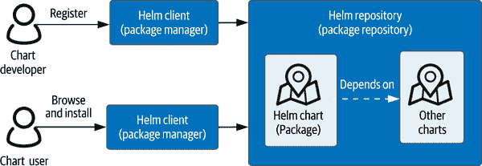
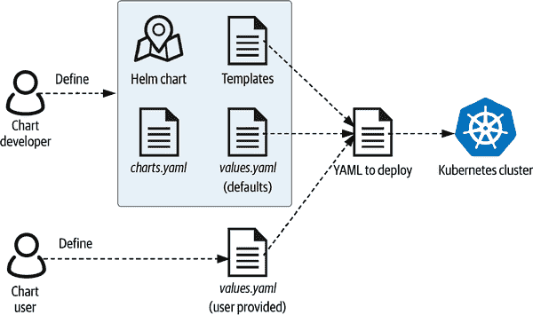
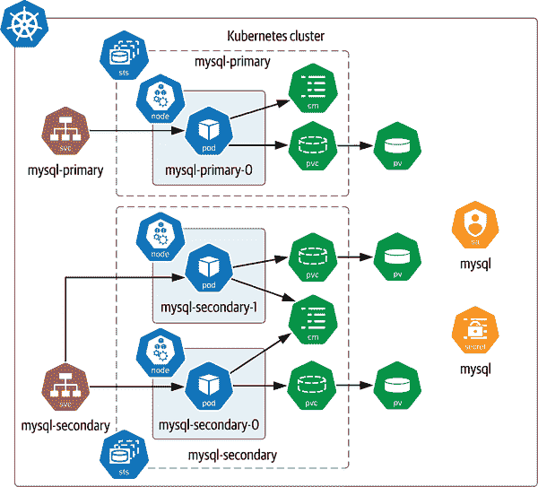
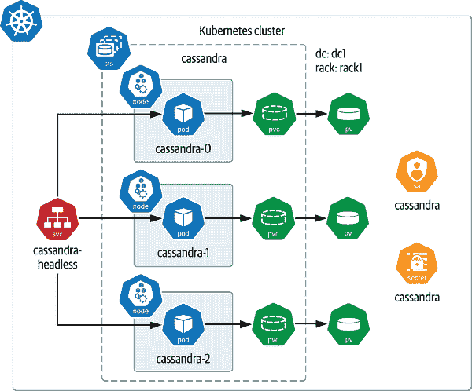

# 第四章：使用 Helm 在 Kubernetes 上自动化数据库部署

在前一章中，你学习了如何通过手工方式在 Kubernetes 上部署单节点和多节点数据库，逐个元素地创建。我们故意采取了“硬核”的方式，以帮助你最大程度地理解如何使用 Kubernetes 原语来设置数据库所需的计算、网络和存储资源。当然，这并不代表在 Kubernetes 上生产环境中运行数据库的体验，有几个原因。

首先，团队通常不会逐个 YAML 文件手动部署数据库。这可能变得非常乏味。即使将配置合并到单个文件中，对于更复杂的部署，也可能变得非常复杂。考虑在第三章中为 Cassandra 的多节点数据库部署所需的配置量的增加，与单节点 MySQL 部署相比。这对大型企业来说是不可扩展的。

其次，虽然部署数据库很棒，但如何确保其长期运行呢？您需要保证数据基础设施在长时间内保持可靠和高性能，而数据基础设施通常需要大量的维护和投入。换句话说，运行系统的任务通常分为“第一天”（将应用部署到生产环境的欣喜日子）和“第二天”（首次之后的每一天，需要操作和演进应用，同时保持高可用性）。

关于数据库部署和运维的这些考虑反映了朝向 DevOps 的更大行业趋势，即开发团队在支持生产中的应用方面发挥更积极的作用。DevOps 实践包括使用自动化工具进行应用的 CI/CD，缩短代码从开发者桌面到生产环境的时间。

在本章中，我们将介绍帮助标准化数据库和其他应用部署的工具。这些工具采用基础设施即代码（IaC）的方法，允许您以可自动执行的格式表示软件安装和配置选项，从而减少需要编写的整体配置代码量。在接下来的两章中，我们还将强调数据基础设施运营，并贯穿整本书的主题。

# 使用 Helm Charts 部署应用程序

让我们从看一个工具开始，这个工具有助于您管理管理配置的复杂性：[Helm](https://helm.sh)。这个 Kubernetes 的包管理器是开源的，也是 CNCF 的一个[毕业项目](https://oreil.ly/cDjD3)。包管理器的概念在多种编程语言中是一个常见的概念，例如 Python 的 `pip`、JavaScript 的 Node Package Manager (NPM) 和 Ruby 的 Gems 特性。特定操作系统的包管理器也存在，例如 Linux 的 Apt 或 macOS 的 Homebrew。正如在图 4-1 中所示，包管理系统的基本要素包括包、存储包的注册表以及包管理应用程序（或*客户端*），它帮助 chart 开发人员注册 charts 并允许 chart 用户在其本地系统上查找、安装和更新 packages。



###### 图 4-1\. Helm，Kubernetes 的包管理器

Helm 将包管理的概念扩展到 Kubernetes，具有一些有趣的差异。如果您曾经使用过前面列出的某个包管理器，您将会对一个包由二进制文件（可执行代码）及描述该二进制文件的元数据（如其功能、API 和安装说明）的概念感到熟悉。在 Helm 中，这些包称为*charts*。Charts 描述如何逐步构建 Kubernetes 应用程序，使用在前几章介绍的 Kubernetes 资源（如 Pods、Services 和 PersistentVolumeClaims）片段化地，例如计算工作负载，描述指向驻留在公共或私有容器注册表中的容器映像的情况。

Helm 允许 charts 引用其他 charts 作为依赖关系，这提供了一种通过创建 charts 的集合来组合应用程序的好方法。例如，您可以通过定义一个用于 WordPress 部署的 chart，引用一个定义 MySQL 部署的 chart 来定义一个应用程序，您希望重用这些定义。或者，您甚至可以找到一个定义了整个 WordPress 应用程序（包括数据库）的 Helm chart。

# Kubernetes 环境先决条件

本章中的示例假设您可以访问一个 Kubernetes 集群，并具有以下一些特征：

+   集群至少需要三个 Worker 节点，以展示 Kubernetes 提供的机制，允许您请求将 Pod 分布到集群中。您可以通过使用名为 kind 的开源发行版在桌面上创建一个简单的集群。有关安装 kind 和[创建多节点集群](https://oreil.ly/8nOHi)的说明，请参阅 kind 快速入门指南。此示例的代码还包含一个配置文件，您可能会发现它对创建一个简单的三节点 kind 集群很有用。

+   您还需要一个支持动态配置的 StorageClass。您可能希望按照“StorageClasses”中的说明安装一个简单的 StorageClass 和提供者，以公开本地存储。

# 使用 Helm 部署 MySQL

为了让事情更具体化，让我们使用 Helm 来部署您在第三章中使用的数据库。首先，如果它尚未安装在您的系统上，您需要使用 Helm 网站上的[文档](https://oreil.ly/tUPWL)来安装 Helm。接下来，添加 Bitnami Helm 存储库：

```
helm repo add bitnami https://charts.bitnami.com/bitnami
```

Bitnami Helm 存储库包含各种 Helm 图表，可帮助您部署基础设施，如数据库、分析引擎和日志管理系统，以及应用程序，包括电子商务、客户关系管理（CRM），还有您猜到的：WordPress。您可以在[GitHub](https://oreil.ly/lmcml)上的 Bitnami Charts 存储库中找到这些图表的源代码。这个存储库的*README*提供了在不同 Kubernetes 分发中使用图表的有用说明。

现在，让我们使用`bitnami`存储库中提供的 Helm 图表来部署 MySQL。在 Helm 的术语中，每个部署称为一个*release*。使用此图表创建的可能是最简单的发布如下所示：

```
# don’t execute me yet!
helm install mysql bitnami/mysql
```

如果您执行此命令，它将使用 Bitnami MySQL Helm 图表的默认设置创建一个名为`mysql`的发布。因此，您将拥有一个单独的 MySQL 节点。由于您已经在第三章中手动部署了一个单节点的 MySQL，请这次尝试做一些更有趣的事情并创建一个 MySQL 集群。为此，您可以创建一个*values.yaml*文件，并添加以下内容，或者您可以重用源代码中提供的[sample](https://oreil.ly/tsnuT)：

```
architecture: replication
secondary:
  replicaCount: 2
```

此*values.yaml*文件中的设置告诉 Helm 您希望在 Bitnami MySQL Helm 图表中使用选项来部署 MySQL 在一个有主节点和两个从节点的复制架构中。

# MySQL Helm 图表的配置选项

如果您查看了 Bitnami MySQL Helm 图表提供的默认[*values.yaml*文件](https://oreil.ly/SGsN5)，您会看到除了这里显示的简单选择外，还有很多可用的选项。可配置的值包括以下内容：

+   要拉取的图像及其位置

+   将用于生成持久卷的 Kubernetes StorageClass

+   用户和管理员账户的安全凭据

+   MySQL 主和从副本的配置设置

+   创建次要副本的数量

+   存活性、就绪探测的详细信息

+   亲和性和反亲和性设置

+   使用 Pod 中断预算来管理数据库的高可用性

许多这些概念您可能已经熟悉了，而像亲和性和 Pod 中断预算这样的概念将在本书的后面进行介绍。

创建了*values.yaml*文件后，您可以使用以下命令启动集群：

```
helm install mysql bitnami/mysql -f values.yaml
```

运行命令后，您将从 Helm 看到安装的状态，以及图表下`NOTES`中提供的说明：

```
NAME: mysql
LAST DEPLOYED: Thu Oct 21 20:39:19 2021
NAMESPACE: default
STATUS: deployed
REVISION: 1
TEST SUITE: None
NOTES:
…
```

我们在此处省略了备注，因为它们有些冗长。它们描述了监视 MySQL 初始化状态的建议命令，客户端和管理员如何连接到数据库，如何升级数据库等。

# 使用命名空间帮助隔离资源

由于我们没有指定命名空间，因此 Helm 发布已安装在默认的 Kubernetes 命名空间中，除非您在[kubeconfig](https://oreil.ly/C2vOM)中单独配置了命名空间。如果要在自己的命名空间中安装 Helm 发布，以便更有效地使用其资源，您可以运行类似以下命令：

```
helm install mysql bitnami/mysql \
  --namespace mysql --create-namespace
```

这将创建一个名为`mysql`的命名空间，并在其中安装`mysql`发布。

要获取您创建的 Helm 发布的信息，请使用`helm list`命令，它会生成类似以下格式的输出：

```
helm list
NAME   NAMESPACE  REVISION  UPDATED   
mysql  default    1         2021-10-21 20:39:19

STATUS    CHART        APP VERSION
deployed  mysql-8.8.8  8.0.26
```

如果您还没有将发布版本安装在其专用的命名空间中，您可以通过运行`kubectl get all`命令轻松查看 Helm 为您创建的计算资源，因为它们都已使用您发布的名称进行了标记。所有资源初始化可能需要几分钟，但完成后，它看起来将类似于以下内容：

```
kubectl get all
NAME                    READY   STATUS    RESTARTS   AGE
pod/mysql-primary-0     1/1     Running   0          3h40m
pod/mysql-secondary-0   1/1     Running   0          3h40m
pod/mysql-secondary-1   1/1     Running   0          3h38m

NAME                              TYPE       CLUSTER-IP     EXTERNAL-IP  PORT     
service/mysql-primary             ClusterIP  10.96.107.156  <none>       ...  
service/mysql-primary-headless    ClusterIP  None           <none>       ...  
service/mysql-secondary           ClusterIP  10.96.250.52   <none>       ... 
service/mysql-secondary-headless  ClusterIP  None           <none>       ...  

NAME                               READY   AGE
statefulset.apps/mysql-primary     1/1     3h40m
statefulset.apps/mysql-secondary   2/2     3h40m
```

正如您所见，Helm 创建了两个 StatefulSets，一个用于主要副本，另一个用于次要副本。`mysql-primary` StatefulSet 正在管理一个包含主要副本的 MySQL Pod，而`mysql-secondary` StatefulSet 正在管理包含次要副本的两个 MySQL Pods。使用`kubectl describe pod`命令，看看您能否确定每个 MySQL 副本运行在哪个 Kubernetes Worker Node 上。

从上述输出中，您还会注意到为每个 StatefulSet 创建了两个服务，一个是无头服务，另一个具有专用 IP 地址。由于`kubectl get all`只告诉您计算资源和服务的情况，您可能也想了解存储资源。要检查这些资源，请运行`kubectl get pv`命令。假设您安装了支持动态配置的 StorageClass，您应该看到绑定到 PersistentVolumeClaim 的 PersistentVolumes，命名为`data-mysql-primary-0`、`data-mysql-secondary-0`和`data-mysql-secondary-1`。

除了我们讨论过的资源之外，安装图表还导致创建了一些额外的资源，我们将在接下来探讨。

# 命名空间和 Kubernetes 资源范围

如果你选择在一个命名空间中安装你的 Helm 发布版，那么在大多数`kubectl get`命令中，你需要指定这个命名空间才能看到创建的资源。唯一的例外是`kubectl get pv`，因为 PersistentVolumes 是 Kubernetes 中不归属于任何命名空间的资源之一；也就是说，它们可以被任何命名空间中的 Pod 使用。要了解集群中哪些 Kubernetes 资源是命名空间的，哪些不是，请运行命令`kubectl api-resources`。

## Helm 的工作原理

当你执行带有提供的值文件的`helm install`命令时，你是否想知道发生了什么？要了解发生了什么，请看一下刚刚安装的 MySQL Helm 图表的源代码，如图 4-2 所示。



###### 图 4-2\. 使用 values.yaml 文件自定义 Helm 发布

查看 Helm 图表的内容时，你会注意到以下内容：

[README 文件](https://oreil.ly/i7XBa)

这解释了如何使用图表。这些说明与图表一起提供在注册表中。

[Chart.yaml 文件](https://oreil.ly/zZb2Y)

这包含关于图表的元数据，如名称、发布者、版本、关键字以及对其他图表的任何依赖关系。在 Helm 注册表中搜索图表时，这些属性非常有用。

[values.yaml 文件](https://oreil.ly/mhfhZ)

这会列出图表支持的可配置值及其默认值。这些文件通常包含很多注释，解释了可用选项。对于 Bitnami MySQL Helm 图表，提供了许多选项，正如我们所注意到的。

[templates 目录](https://oreil.ly/F21Lg)

这包含定义图表的 Go 模板。模板包括一个用于生成你之前在执行`helm install`命令后看到的输出的*Notes.txt*文件，以及一个或多个描述 Kubernetes 资源模式的 YAML 文件。这些 YAML 文件可能以子目录的形式组织（例如，定义 MySQL 主副本的 StatefulSet 的[模板](https://oreil.ly/iKedl)）。最后，*_helpers.tpl*文件描述了如何使用模板。根据所选的配置值，某些模板可能会被多次使用或根本不使用。

当你执行`helm install`命令时，Helm 客户端确保通过与源代码库检查来获取你命名的图表的最新副本。然后，它使用模板生成 YAML 配置代码，覆盖图表的*values.yaml*文件中的默认值以及你提供的任何值。然后，它使用`kubectl`命令将此配置应用于当前配置的 Kubernetes 集群。

如果你想在应用之前查看 Helm 图表生成的配置，可以使用方便的 `template` 命令。它支持与 `install` 命令相同的语法：

```
helm template mysql bitnami/mysql -f values.yaml
```

运行此命令将会产生大量输出，因此你可能想将其重定向到文件（在命令后添加 `> values-template.yaml`），以便长时间查看。或者，你可以查看我们在源代码仓库中保存的[副本](https://oreil.ly/DhEtc)。

你会注意到生成了几种类型的资源，如 图 4-3 所总结的。许多显示的资源已经讨论过，包括用于管理主副本的 StatefulSets，每个都有自己的服务（该图还创建了未在图中显示的无头服务）。每个 Pod 都有自己的 PersistentVolumeClaim，映射到唯一的 PersistentVolume。

图 4-3 包含了我们之前未讨论过的资源类型。首先注意到每个 StatefulSet 都有一个关联的 ConfigMap，用于为其 Pods 提供一组共享的配置设置。接着，注意到名为 `mysql` 的 Secret，用于存储访问数据库节点暴露的各种接口所需的密码。最后，每个由此 Helm 发布创建的 Pod 都应用了一个 ServiceAccount 资源。

让我们专注于此部署的一些有趣方面，包括标签、ServiceAccounts、Secrets 和 ConfigMaps 的使用。



###### 图 4-3\. 使用 Bitnami Helm 图表部署 MySQL

## 标签

如果你查看从 `helm template` 输出的内容，你会注意到这些资源具有一组共同的标签：

```
  labels:
    app.kubernetes.io/name: mysql
    helm.sh/chart: mysql-8.8.8
    app.kubernetes.io/instance: mysql
    app.kubernetes.io/managed-by: Helm
```

这些标签有助于识别资源作为 `mysql` 应用程序的一部分，并指示它们是通过特定图表版本由 Helm 管理的。标签对于选择资源非常有用，通常用于定义其他资源的配置。

## ServiceAccounts

Kubernetes 集群为了访问控制目的区分了人类用户和应用程序。ServiceAccount 是一个代表应用程序及其访问权限的 Kubernetes 资源。例如，ServiceAccount 可以被授予访问 Kubernetes API 的某些部分或者访问包含登录凭据等敏感信息的一个或多个 Secrets 的权限。后者的功能在你的 MySQL Helm 安装中用于在 Pods 之间共享凭据。

在 Kubernetes 中创建的每个 Pod 都有一个分配给它的 ServiceAccount。如果未指定，则使用默认的 ServiceAccount。安装 MySQL Helm 图表会创建一个名为 `mysql` 的 ServiceAccount。你可以在生成的模板中查看此资源的规范：

```
apiVersion: v1
kind: ServiceAccount
metadata:
  name: mysql
  namespace: default
  labels: ...
  annotations:
secrets:
  - name: mysql
```

如您所见，这个 ServiceAccount 可以访问名为 `mysql` 的 Secret，我们将很快讨论。ServiceAccount 还可以具有称为 `imagePullSecret` 的附加类型的 Secret。当应用程序需要使用来自私有注册表的镜像时，会使用这些 Secrets。

默认情况下，ServiceAccount 没有任何访问 Kubernetes API 的权限。为了给这个 ServiceAccount 提供所需的访问权限，MySQL Helm 图表创建一个角色，指定 Kubernetes 资源和操作，并创建一个 RoleBinding 将 ServiceAccount 绑定到该角色。我们将在第五章讨论 ServiceAccounts 和基于角色的访问控制。

## Secrets

正如您在第二章学到的那样，Secret 提供了安全访问需要保密的信息。您的 `mysql` Helm 发布包含一个名为 `mysql` 的 Secret，其中包含 MySQL 实例本身的登录凭据：

```
apiVersion: v1
kind: Secret
metadata:
  name: mysql
  namespace: default
  labels: ...
type: Opaque
data:
  mysql-root-password: "VzhyNEhIcmdTTQ=="
  mysql-password: "R2ZtNkFHNDhpOQ=="
  mysql-replication-password: "bDBiTWVzVmVORA=="
```

这三个密码代表不同类型的访问权限：`mysql-root-password` 提供对 MySQL 节点的管理访问，`mysql-replication-password` 用于节点之间进行数据复制的通信，而 `mysql-password` 则由客户端应用程序用于访问数据库以读写数据。

## ConfigMaps

Bitnami MySQL Helm 图表创建 Kubernetes ConfigMap 资源，用于表示运行 MySQL 主节点和次要复制节点的 Pod 的配置设置。ConfigMaps 将配置数据存储为键-值对。例如，Helm 图表为主复制品创建的 ConfigMap 如下所示：

```
apiVersion: v1
kind: ConfigMap
metadata:
  name: mysql-primary
  namespace: default
  labels: ...
data:
  my.cnf: |-

    [mysqld]
    default_authentication_plugin=mysql_native_password
    ...
```

在这种情况下，键是 `my.cnf` 的名称，表示文件名，值是代表配置文件内容的多行设置（在这里我们进行了简化）。接下来，查看主复制品的 StatefulSet 的定义。请注意，根据 StatefulSet 的 Pod 规范，ConfigMap 的内容被挂载为每个模板内的只读文件（再次为了关注关键区域，我们省略了一些细节）：

```
apiVersion: apps/v1
kind: StatefulSet
metadata:
  name: mysql-primary
  namespace: default
  labels: ...
spec:
  replicas: 1
  selector:
    matchLabels: ...
  serviceName: mysql-primary
  template:
    metadata:
      annotations: ...
      labels: ...
    spec:
      ...     
      serviceAccountName: mysql
      containers:
        - name: mysql
          image: docker.io/bitnami/mysql:8.0.26-debian-10-r60
          volumeMounts:
            - name: data
              mountPath: /bitnami/mysql
            - name: config
              mountPath: /opt/bitnami/mysql/conf/my.cnf
              subPath: my.cnf
      volumes:
        - name: config
          configMap:
            name: mysql-primary
```

将 ConfigMap 挂载为容器中的卷会在挂载目录中创建一个只读文件，文件名根据键命名，内容为对应的值。例如，在 Pod 的 `mysql` 容器中挂载 ConfigMap 将创建文件 */opt/bitnami/mysql/conf/my.cnf*。

这是 ConfigMaps 可以在 Kubernetes 应用程序中使用的几种方式之一：

+   如 [Kubernetes 文档](https://oreil.ly/yoEYv) 所述，您可以选择以更精细的键-值对存储配置数据，这样可以更轻松地访问应用程序中的各个值。

+   您还可以将单独的键-值对引用为传递给容器的环境变量。

+   最后，应用程序可以通过 Kubernetes API 访问 ConfigMap 的内容。

# 更多配置选项

现在，您已经有一个具有工作 MySQL 集群的 Helm 发布，您可以将一个应用程序指向它，例如 WordPress。为什么不尝试看看是否可以调整第三章中的 WordPress 部署，使其指向您在这里创建的 MySQL 集群呢？

进行进一步学习时，您还可以将您的配置结果与使用 MariaDB 而不是 MySQL 的 Bitnami WordPress Helm 图表生成的结果进行比较，但其余部分非常相似。

## 更新 Helm 图表

如果您在生产环境中运行 Helm 发布，很可能需要随时间维护它。您可能出于各种原因想要更新 Helm 发布：

+   图表的新版本已经可用。

+   您的应用程序使用的图像的新版本已经可用。

+   您想要更改所选的选项。

要检查图表的新版本，请执行`helm repo update`命令。运行此命令而不带任何选项将在您为 Helm 客户端配置的所有图表库中查找更新：

```
helm repo update
Hang tight while we grab the latest from your chart repositories...
...Successfully got an update from the "bitnami" chart repository
Update Complete. ⎈Happy Helming!⎈
```

接下来，您将希望对配置的值进行任何所需的更新。如果您要升级到图表的新版本，请确保检查可配置值的发布说明和文档。在应用之前测试升级是一个好主意。`--dry-run`选项允许您执行此操作，生成与`helm template`命令类似的值：

```
helm upgrade mysql bitnami/mysql -f values.yaml --dry-run
```

# 使用覆盖配置文件

您可以用于升级的一个有用选项是指定要在新配置文件中覆盖的值，并应用新旧两者，类似于这样：

```
helm upgrade mysql bitnami/mysql \
  -f values.yaml -f new-values.yaml
```

配置文件按照它们在命令行上出现的顺序应用，因此如果您使用此方法，请确保您的覆盖值文件出现在原始值文件之后。

升级应用后，Helm 开始执行其工作，仅更新受您配置更改影响的发布中的资源。如果您已经为 StatefulSet 的 Pod 模板指定了更改，则 Pod 将根据 StatefulSet 的更新策略重新启动，正如我们在“StatefulSet 生命周期管理”中讨论的那样。

## 卸载 Helm 图表

当您完成使用 Helm 发布时，可以按名称卸载它：

```
helm uninstall mysql
```

请注意，Helm 不会删除为此 Helm 图表创建的任何 PersistentVolumeClaims 或 PersistentVolumes，这遵循我们在第三章中讨论的 StatefulSets 的行为。

# 使用 Helm 部署 Apache Cassandra

现在让我们换个角度来看，使用 Helm 部署 Apache Cassandra。在本节中，您将使用 Bitnami 提供的另一个图表，因此不需要添加其他存储库。您可以在[GitHub](https://oreil.ly/WzvXp)上找到此图表的实现。Helm 提供了一种快速查看有关此图表的元数据的方法：

```
helm show chart bitnami/cassandra
```

在查看了元数据之后，你还会想了解可配置的值。你可以检查 GitHub 存储库中的[*values.yaml*文件](https://oreil.ly/z69Z7)，或者在`show`命令上使用另一个选项：

```
helm show values bitnami/cassandra
```

与 MySQL 图表相比，此图表的选项列表较短，因为 Cassandra 没有主要和次要副本的概念。然而，你肯定会看到类似的选项，如镜像、StorageClasses、安全性、存活和就绪探针等。一些配置选项是 Cassandra 特有的，例如与 JVM 设置和种子节点相关的选项（如第三章所讨论的）。

此图表的一个有趣功能是能够从 Cassandra 节点导出指标。如果设置了`metrics.enabled=true`，图表将在每个 Cassandra Pod 中注入一个 sidecar 容器，该容器公开一个可以被 Prometheus 抓取的端口。`metrics`下的其他值配置导出的指标、收集频率等。虽然我们这里不会使用此功能，但指标报告是管理数据基础设施的关键部分，我们将在第六章中进行介绍。

对于一个简单的三节点 Cassandra 配置，你可以将副本数设置为 3，并将其他配置值设置为默认值。然而，既然你只是覆盖了一个配置值，这是一个很好的机会来利用 Helm 支持的在命令行上设置值，而不是提供一个*values.yaml*文件：

```
helm install cassandra bitnami/cassandra --set replicaCount=3
```

正如之前讨论的，你可以使用`helm template`命令在安装之前检查配置，或查看我们在 GitHub 上保存的文件。然而，既然你已经创建了发布版本，你也可以使用这个命令：

```
helm get manifest cassandra
```

在 YAML 中查看资源时，你会看到已建立了类似的基础设施，如图 4-4 所示。

配置包括以下内容：

+   一个引用了包含`cassandra`管理员帐户密码的 Secret 的 ServiceAccount。

+   一个单一的 StatefulSet，使用无头 Service 引用其 Pod。Pod 均匀分布在可用的 Kubernetes Worker 节点上，我们将在下一节讨论。该 Service 公开了用于节点内通信的 Cassandra 端口（`7000`，使用 TLS 进行安全通信的`7001`），通过 JMX 进行管理的端口（`7199`），以及通过 CQL 进行客户端访问的端口（`9042`）。



###### 图 4-4\. 使用 Bitnami Helm 图表部署 Apache Cassandra

此配置表示一个简单的 Cassandra 拓扑结构，所有三个节点位于单个数据中心和机架中。这种简单的拓扑反映了此图表的一个限制——它无法创建由多个数据中心和机架组成的 Cassandra 集群。要创建更复杂的部署，您需要安装多个 Helm 发布，使用相同的`clusterName`（在本例中，使用默认名称`cassandra`），但每个部署中的数据中心和机架不同。您还需要获取第一个数据中心中几个节点的 IP 地址，用作在配置其他机架的发布时的`additionalSeeds`。

## 亲和性和反亲和性

如 Figure 4-4 所示，Cassandra 节点均匀分布在集群中的工作节点上。要在您自己的 Cassandra 发布中验证这一点，您可以运行类似以下内容的命令：

```
kubectl describe pods | grep "^Name:" -A 3
Name:         cassandra-0
Namespace:    default
Priority:     0
Node:         kind-worker/172.20.0.7
--
Name:         cassandra-1
Namespace:    default
Priority:     0
Node:         kind-worker2/172.20.0.6
--
Name:           cassandra-2
Namespace:      default
Priority:       0
Node:           kind-worker3/172.20.0.5
```

如您所见，每个 Cassandra 节点都运行在不同的工作节点上。如果您的 Kubernetes 集群至少有三个工作节点且没有其他工作负载，则可能会观察到类似的行为。尽管在负载均衡的集群中可能会自然发生这种均匀分配，但这可能并非在您的生产环境中的情况。然而，为了促进数据的最大可用性，我们希望尽量遵循 Cassandra 架构的意图，在不同的机器上运行节点以提高高可用性。

为了帮助保证此隔离性，Bitnami Helm 图表使用 Kubernetes 的亲和性能力，具体来说是反亲和性。如果您查看生成的 Cassandra StatefulSet 配置，您会看到以下内容：

```
apiVersion: apps/v1
kind: StatefulSet
metadata:
  name: cassandra
  namespace: default
  labels: ...
spec:
  ...
  template:
    metadata:
      labels: ...
    spec:
      ...
      affinity:
        podAffinity:

        podAntiAffinity:
          preferredDuringSchedulingIgnoredDuringExecution:
            - podAffinityTerm:
                labelSelector:
                  matchLabels:
                    app.kubernetes.io/name: cassandra
                    app.kubernetes.io/instance: cassandra
                namespaces:
                  - "default"
                topologyKey: kubernetes.io/hostname
              weight: 1
        nodeAffinity:
```

如此所示，Pod 模板规范列出了三种可能的亲和性类型，仅定义了`podAntiAffinity`。这些概念意味着什么？

Pod 亲和性

希望 Pod 被调度到另一个特定 Pod 正在运行的节点上。例如，Pod 亲和性可以用于将 Web 服务器与其缓存放置在一起。

Pod 反亲和性

Pod 反亲和性是 Pod 亲和性的相反，即不希望 Pod 被调度到另一个已有特定 Pod 的节点上。这是本例中使用的约束条件，稍后我们将讨论。

节点亲和性

希望 Pod 在具有特定特征的节点上运行。

每种类型的亲和性可以表示为硬约束或软约束。这些被称为`requiredDuringSchedulingIgnoredDuringExecution`和`preferredDuringSchedulingIgnoredDuringExecution`。第一个约束指定必须在 Pod 被调度到节点之前满足的规则，而第二个指定了调度器将尝试满足的首选项，但如果必要的话可以放松以便调度 Pod。

`IgnoredDuringExcecution` 意味着这些约束仅在首次调度 Pods 时应用。未来将添加新的 `RequiredDuringExecution` 选项，称为 `requiredDuringSchedulingRequiredDuringExecution` 和 `requiredDuringSchedulingRequiredDuringExecution`。这些选项将要求 Kubernetes 逐出 Pods（即将其移动到另一个节点），这些 Pods 不再满足条件，例如它们标签的变更。

查看前面的示例，Cassandra StatefulSet 的 Pod 模板规范指定了使用应用于每个 Cassandra Pod 的标签的反亲和性规则。其主要效果是 Kubernetes 将尝试在可用的 Worker 节点上分布这些 Pods。

这些是查看 Cassandra 的 Bitnami Helm 图表的亮点。为了清理事务，卸载 Cassandra 发行版：

```
helm uninstall cassandra
```

如果您不想再使用 Bitnami Helm 图表，您也可以从 Helm 客户端中删除该存储库：

```
helm repo remove bitnami
```

# 更多 Kubernetes 调度约束

Kubernetes 支持额外的机制来向其调度器提供有关 Pod 放置的提示。其中最简单的之一是 [NodeSelectors](https://oreil.ly/05hSU)，它与节点亲和力非常相似，但语法更少表达性，可以使用 AND 逻辑匹配一个或多个标签。由于您可能没有必要的权限将标签附加到集群中的 Worker 节点，Pod 亲和性通常是更好的选择。 [污点和容忍](https://oreil.ly/fbkTB) 是另一种机制，用于配置 Worker 节点以排斥特定的 Pods，以防它们被调度到这些节点上。

通常，您需要小心理解对 Kubernetes 调度器的各种工作负载施加的所有约束，以免过度限制其放置 Pod 的能力。有关 [调度约束](https://oreil.ly/aUWsi) 的更多信息，请参阅 Kubernetes 文档。我们还将查看 Kubernetes 允许您在 “Kubernetes 的替代调度器” 中插入不同的调度器。

# Helm、CI/CD 和运维

Helm 是一个专注于一个主要任务的强大工具：将复杂应用部署到 Kubernetes 集群。要从 Helm 中获得最大的利益，您需要考虑它如何融入您更大的 CI/CD 工具集中：

+   自动化服务器（如 [Jenkins](https://www.jenkins.io)）根据称为 *jobs* 的脚本自动构建、测试和部署软件。这些 jobs 通常基于预定义的触发器运行，例如提交到源代码库。可以在 jobs 中引用 Helm 图表，以在 Kubernetes 集群中安装应用程序及其支持基础设施。

+   IaC 自动化工具（如[Terraform](https://www.terraform.io)）允许您定义模板和脚本，描述如何在各种云环境中创建基础架构。例如，您可以编写一个 Terraform 脚本，自动创建特定云提供商中的新 VPC，并在该 VPC 内创建新的 Kubernetes 集群。然后，该脚本可以使用 Helm 在 Kubernetes 集群内安装应用程序。

尽管这些工具提供的功能存在重叠，但在构建工具集时，您需要考虑每个工具的优势和限制。因此，我们希望强调一下 Helm 在管理其部署的应用程序操作时存在的限制。为了全面了解涉及的挑战，我们与一位使用 Helm chart 构建复杂数据库部署的实践者进行了交流。这次讨论开始介绍 Kubernetes Custom Resource Definitions (CRDs) 和 operator 模式等概念，我们将在第五章中对其进行深入讨论。

正如 John Sanda 在他的评论中指出的那样，Helm 是一个强大的工具，用于脚本化部署由多个 Kubernetes 资源组成的应用程序，但在管理更复杂的操作任务时可能效果不佳。正如您将在接下来的章节中看到的，用于数据基础设施和其他复杂应用的常见模式是使用 Helm chart 来部署 operator，后者可以管理应用程序的部署和生命周期。

# 概要

在本章中，您已经学习了像 Helm 这样的包管理工具如何帮助您管理在 Kubernetes 上部署应用程序，包括数据库基础架构。在这过程中，您还学习了如何使用一些额外的 Kubernetes 资源，如 ServiceAccounts、Secrets 和 ConfigMaps。现在是时候进一步讨论在 Kubernetes 上运行数据库了。在下一章中，我们将深入探讨通过使用 operator 模式在 Kubernetes 上管理数据库操作。
