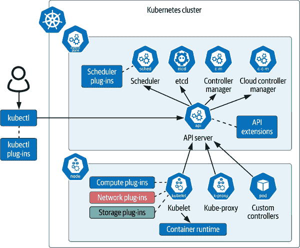
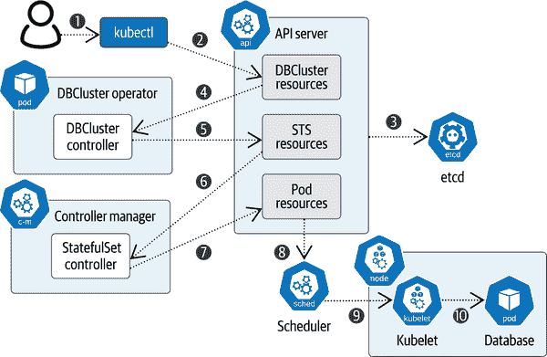
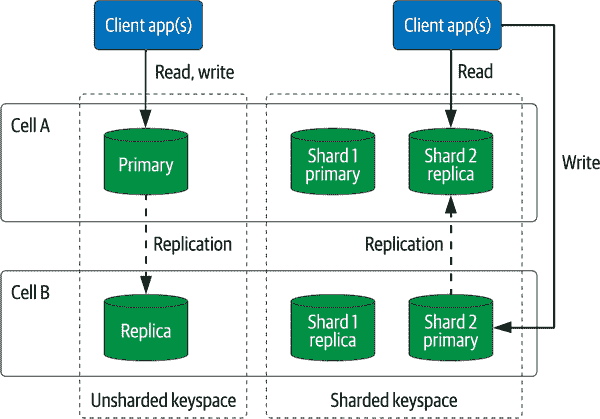
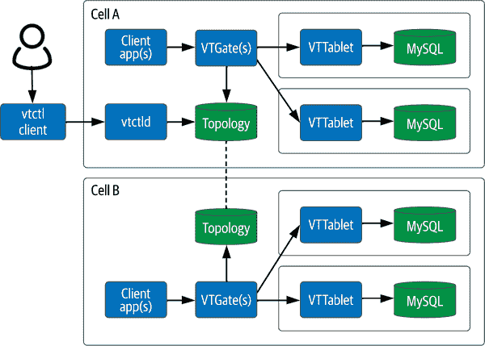
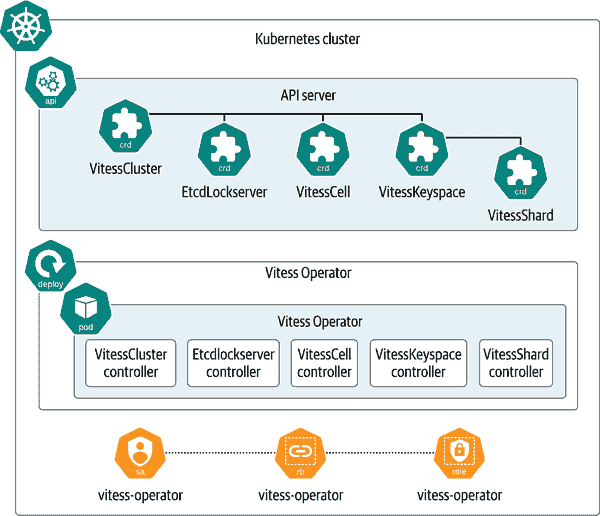
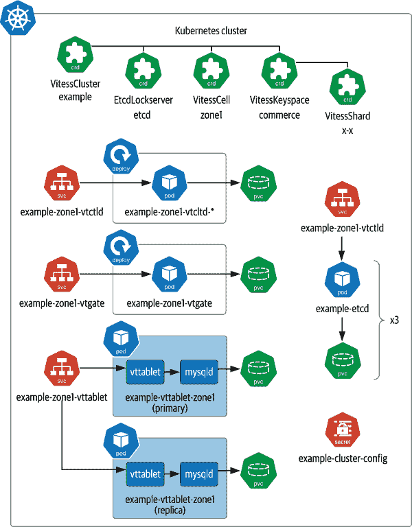

# 第五章：使用 Operator 在 Kubernetes 上自动化数据库管理。

在本章中，我们将继续探讨在 Kubernetes 上运行数据库的话题，但将焦点从安装转向操作。仅仅了解数据库应用程序的各个元素如何映射到 Kubernetes 提供的原语以进行初始部署是不够的。您还需要知道如何随着时间推移维护该基础设施，以支持业务关键的应用程序。在本章中，我们将详细研究 Kubernetes 的操作方法，以便您可以有效地保持数据库的运行。

数据库和其他数据基础设施的操作包括一个常见的“第二天”任务列表，包括以下内容：

+   扩展容量的上下调整，包括在调整大小的集群中重新分配工作负载。

+   监控数据库健康状态并替换失败（或正在失败）的实例。

+   执行常规维护任务，如在 Apache Cassandra 中进行修复操作。

+   更新和打补丁软件。

+   维护安全访问密钥和其他可能随时间过期的凭证。

+   执行备份，并在灾难恢复中使用它们来恢复数据。

尽管执行这些任务的具体细节在不同技术之间可能会有所不同，但共同关注的是如何利用自动化来减少人工操作员的工作量，并使我们能够在越来越大的规模上操作基础设施。我们如何整合人工操作员在这些任务中积累的知识？传统的云操作使用在云基础设施外部运行的脚本工具，而更符合云原生的方法是在您的 Kubernetes 集群中直接运行这些数据库控制逻辑。本章我们将探讨的问题是：如何用符合 Kubernetes 的方式来表示这种控制逻辑？

# 扩展 Kubernetes 控制平面。

好消息是，Kubernetes 的设计者们对这个问题并不感到意外。事实上，Kubernetes 的控制平面和 API 设计为可扩展的。Kelsey Hightower 和其他人称 Kubernetes 为 [“构建平台的平台”](https://oreil.ly/pFRDO)。

Kubernetes 提供多个扩展点，主要与其控制平面相关。图 5-1 包括 [Kubernetes 核心组件](https://oreil.ly/hsxFY) 如 API 服务器、调度器、Kubelet 和 `kubectl`，以及它们支持的 [扩展点](https://oreil.ly/UXbo0) 的指示。



###### 图 5-1\. Kubernetes 控制平面和扩展点。

现在让我们详细讨论扩展 Kubernetes 控制平面的细节，从本地客户端上的组件开始，到 Kubernetes 集群内部的组件。这些扩展点中许多与数据库和数据基础设施相关。

## 扩展 Kubernetes 客户端。

`kubectl` 命令行工具是许多用户与 Kubernetes 交互的主要接口。您可以通过下载并将插件放置在系统的 `PATH` 中，或使用 [Krew](https://krew.dev)，一个维护 [kubectl 插件列表](https://oreil.ly/iw93T) 的包管理器来扩展 `kubectl`。插件执行诸如跨 [多个资源](https://oreil.ly/AllQX) 或甚至 [多个集群](https://oreil.ly/3Bsj2) 的批量操作，或评估集群的状态并做出 [安全性](https://oreil.ly/BWbpn) 或 [成本](https://oreil.ly/Exxjp) 建议。在本章的特定焦点下，有几个插件可用于管理操作符和自定义资源。

## 扩展 Kubernetes 控制平面组件

Kubernetes 控制平面的核心包括几个 [控制平面组件](https://oreil.ly/ZnxfB)，包括 API 服务器、调度器、控制器管理器、云控制器管理器和 etcd。虽然这些组件可以在 Kubernetes 集群中的任何节点上运行，但通常会分配给专用节点，该节点不运行任何用户应用 Pod。这些组件如下：

API 服务器

这是 Kubernetes 集群的外部和内部客户端的主要接口。它通过 HTTP API 暴露 RESTful 接口。API 服务器扮演协调角色，将客户端的请求路由到其他组件以实现命令式和声明式指令。API 服务器支持两种类型的扩展：自定义资源和 API 聚合。CRD 允许您添加新类型的资源，并通过 `kubectl` 进行管理，无需进一步扩展。API 聚合允许您通过额外的 REST 端点扩展 Kubernetes API，API 服务器将这些请求委派给作为插件提供的独立 API 服务器。自定义资源是更常用的扩展机制，在本书的后续部分将是重点讨论的内容。

调度器

这决定了将 Pod 分配给工作节点的方式，考虑因素包括每个工作节点的负载，以及亲和性规则、污点和容忍性（如 第四章 中讨论的）。调度器可以通过插件进行扩展，在其决策过程的多个点上覆盖默认行为。例如，*调度插件* 可以过滤出特定类型的 Pod 的节点，或者通过分配分数设置节点的相对优先级。*绑定插件* 可以自定义准备节点以运行调度 Pod 的逻辑，例如挂载调度 Pod 需要的网络卷。依赖于运行大量短期任务的 Apache Spark 等数据基础设施可能会从这种对调度决策更细粒度控制的能力中受益，我们将在 “Kubernetes 的替代调度器” 中讨论这一点。

etcd

这个分布式键值存储由 API 服务器用于持久化集群配置和状态信息。当资源被添加、删除和更新时，API 服务器相应地更新 etcd 中的元数据，因此如果 API 服务器崩溃或需要重新启动，它可以轻松恢复其状态。作为一个支持高可用性的强一致性数据存储，etcd 经常被其他运行在 Kubernetes 上的数据基础设施频繁使用，正如我们将在整本书中经常看到的那样。

控制器管理器和云控制器管理器

控制器管理器和云控制器管理器集成了称为*控制器*的多个控制循环。这些管理器包含了多个逻辑上独立的控制器，编译成单个可执行文件，以简化 Kubernetes 管理自身的能力。控制器管理器包含管理内置资源类型（如 Pod、StatefulSets 等）的控制器。云控制器管理器包含了不同于 Kubernetes 提供者的控制器，以便管理特定于平台的资源，例如负载均衡器或虚拟机（VMs）。

## 扩展 Kubernetes 工作节点组件

Kubernetes 控制平面的某些元素在集群中的每个节点上运行。这些[工作节点组件](https://oreil.ly/KmmkS)包括 Kubelet、kube-proxy 和容器运行时：

Kubelet

这管理由调度程序分配给节点的 Pod，包括运行在 Pod 内的容器。Kubelet 在需要时重新启动容器，提供对容器日志的访问等功能。

计算、网络和存储插件

Kubelet 可以通过插件进行扩展，利用底层环境提供的独特计算、网络和存储能力。计算插件包括容器运行时，以及[设备插件](https://oreil.ly/cdqrT)，这些插件暴露了专用硬件功能，如 GPU 或可编程门阵列（FPGA）。[网络插件](https://oreil.ly/aMdKH)，包括符合容器网络接口（CNI）的插件，可以提供超出 Kubernetes 内置网络的功能，如带宽管理或网络策略管理。我们之前在“Kubernetes 存储架构”中讨论了存储插件，包括符合 CSI 的插件。

Kube-proxy

这维护运行在工作节点上的 Pod 的网络路由，以便它们可以与集群内运行的其他 Pod、或者集群外的客户端和服务进行通信。Kube-proxy 是 Kubernetes 服务实现的一部分，提供将虚拟 IP 映射到工作节点上单个 Pod 的功能。

容器运行时

Kubelet 使用容器运行时在工作节点的操作系统上执行容器。Linux 支持的容器运行时包括[containerd](https://oreil.ly/6ylhH) 和 [CRI-O](https://oreil.ly/8fk2x)。在 Kubernetes 1.20 中，[Docker](https://oreil.ly/col9R) 运行时支持已被弃用，并在 1.24 中完全移除。

自定义控制器和操作者

这些控制器负责使用自定义资源管理安装在 Kubernetes 集群上的应用程序。尽管这些控制器是 Kubernetes 控制平面的扩展，它们可以运行在任何工作节点上。

# 操作者模式

在这个背景下，我们现在可以研究 Kubernetes 中最常见的扩展模式之一：*操作者模式*。这种模式结合了自定义资源和对这些资源进行操作的控制器。让我们更详细地看看每个概念如何适用于数据基础设施，然后您将准备好深入研究一个 MySQL 操作者的示例。

## 控制器

控制器的概念源自电子和电气工程领域，其中控制器是在连续循环中运行的设备。在每次循环迭代中，设备接收一个输入信号，将其与设定值进行比较，并生成一个输出信号，旨在产生环境变化，未来的输入信号可以检测到这种变化。一个简单的例子是恒温器，当空间内的温度过高或过低时，它会启动空调或加热器。

*Kubernetes 控制器* 实现了类似的[控制循环](https://oreil.ly/LKefh)，包括以下步骤：

1.  读取资源的当前状态

1.  修改资源的状态

1.  更新资源的状态

1.  重复

这些步骤既由运行在控制器管理器中的 Kubernetes 内置控制器和云控制器管理器实现，也由提供给 Kubernetes 上运行应用程序的*自定义控制器* 实现。让我们看一些管理数据基础设施的控制器可能涉及的示例：

读取资源的当前状态

一个控制器跟踪一个或多个资源类型的状态，包括内置资源如 Pods、PersistentVolumes 和 Services，以及自定义资源（我们将在下一节中讨论）。控制器通过 API 服务器发送的通知驱动异步工作。API 服务器向控制器发送[*观察事件*](https://oreil.ly/UvOJY)，以通知它们资源状态的变化，例如资源的创建或删除，或者资源上发生的事件。

对于数据基础设施，这些变更可能包括集群请求副本数量的变更，或者包含数据库副本的 Pod 已经死亡的通知。由于在大型集群中可能会发生许多此类更新，控制器经常使用缓存。

修改资源状态

这是控制器的核心业务逻辑——比较资源的状态与其期望状态，并执行操作将状态更改为期望状态。在 Kubernetes API 中，当前状态以资源的`.status`字段表示，期望状态则以`.spec`字段表示。更改可能包括调用 Kubernetes API 以修改其他资源，对被管理应用程序的管理操作，甚至与 Kubernetes 集群外的交互。

例如，考虑一个管理具有多个副本的分布式数据库的控制器。当数据库控制器收到副本数量增加的通知时，控制器可以扩展正在使用的 Deployment 或 StatefulSet 以管理副本。随后，当收到关于创建用于托管新副本的 Pod 的通知时，控制器可以在一个或多个副本上启动操作，以重新平衡这些副本之间的工作负载。

更新资源的状态

在控制循环的最后一步中，控制器使用 API 服务器更新资源的`.status`字段，进而在 etcd 中更新该状态。在之前的章节中，您使用 `kubectl get` 和 `kubectl describe` 命令查看过诸如 Pods 和 PersistentVolumes 的状态。例如，Pod 的状态包括其总体状态（`Pending`、`Running`、`Succeeded`、`Failed`等）、最近记录各种条件的时间（`PodScheduled`、`ContainersReady`、`Initialized`、`Ready`）以及其每个容器的状态（`Waiting`、`Running`、`Terminated`）。自定义资源也可以定义自己的状态字段。例如，表示集群的自定义资源可能具有反映集群整体可用性及其当前拓扑的状态值。

### 事件

控制器还可以通过 Kubernetes API 生成*事件*，供人类操作员或其他应用程序消费。这些事件与之前描述的监视器事件不同，Kubernetes API 使用这些事件来通知控制器进行更改，但不会暴露给其他客户端。

# 编写自定义控制器

虽然您可能永远不需要编写自己的控制器，但熟悉涉及的概念是有帮助的。[*编程 Kubernetes*](https://oreil.ly/Ad4Ga) 对于那些有兴趣深入了解的人来说是一个很好的资源。

[controller-runtime 项目](https://oreil.ly/VjP9w) 提供了一组通用的库，帮助编写控制器，包括从 API 服务器注册通知、缓存资源状态、实现协调循环等。Controller-runtime 库是用 Go 编程语言实现的，因此大多数控制器也是用 Go 实现的，这一点并不令人惊讶。

[Go](https://go.dev) 最初于 2007 年在 Google 开发，并被用于包括 Borg（Kubernetes 的前身）在内的许多云原生应用中。Go 是一种强类型的编译语言（与解释性语言如 Java 和 JavaScript 相对），注重可用性和开发者生产力（作为对 C/C++ 学习曲线较高的反应）。

如果你曾经错误配置过 Pod 规范并观察到 `CrashLoopBackOff` 状态，你可能已经遇到了事件。使用 `kubectl describe pod` 命令，你可以观察到事件，例如容器启动失败，随后是回退周期，然后容器重新启动。事件在 API 服务器中的有效期为一小时，但常见的 Kubernetes 监控工具提供了跟踪它们的功能。控制器还可以为自定义资源创建事件。

## 自定义资源

控制器可以操作内置的 Kubernetes 资源以及[自定义资源](https://oreil.ly/62uQj)。我们已经简要提到这个概念，但现在让我们利用这个机会定义一下什么是自定义资源以及它们如何扩展 Kubernetes API。

从根本上讲，*自定义资源*是 Kubernetes 认可为其 API 的一部分的配置数据。虽然自定义资源类似于 ConfigMap，但其结构类似于内置资源：元数据、规范和状态。特定自定义资源类型的属性在 CRD 中定义。CRD 本身是一个用于描述自定义资源的 Kubernetes 资源。

在本书中，我们已经讨论了 Kubernetes 如何使您能够超越管理 VM 和容器，进而管理虚拟数据中心。CRD 提供了灵活性，有助于实现这一实际需求。您不再仅限于 Kubernetes 提供的现成资源，可以创建额外的抽象来扩展 Kubernetes 以满足您自己的需求。这是快速发展生态系统中的关键组成部分。

让我们从命令行了解一下 CRD 的相关知识。使用 `kubectl api-resources` 命令列出集群中定义的所有资源：

```
kubectl api-resources
NAME               SHORTNAMES  APIVERSION  NAMESPACED  KIND
bindings                       v1          true        Binding
componentstatuses  cs          v1          false       ComponentStatus
configmaps         cm          v1          true        ConfigMap
...
```

当你查看输出时，你会看到在前几章介绍过的许多资源类型及其简称：StorageClass (`sc`)、PersistentVolumes (`pv`)、Pods (`po`)、StatefulSets (`sts`) 等等。API 版本提供了每种资源类型来源的一些线索。例如，版本为 `v1` 的资源是核心 Kubernetes 资源。其他版本如 `apps/v1`、`networking.k8s.io/v1` 或 `storage.k8s.io/v1` 表示由不同的 Kubernetes SIGs 定义的资源。

根据你使用的 Kubernetes 集群的配置，可能已经定义了一些 CRD。如果有任何 CRD 存在，它们将出现在 `kubectl api-resources` 命令的输出中。它们将通过其 API 版本显著突出，通常包含除 `k8s.io` 之外的路径。

由于 CRD 本身是 Kubernetes 资源，您也可以使用命令`kubectl get crd`列出安装在 Kubernetes 集群中的自定义资源。例如，在安装了下一节中提到的 Vitess Operator 后，您会看到几个 CRD：

```
kubectl get crd
NAME                                   CREATED AT
etcdlockservers.planetscale.com        2021-11-21T22:06:04Z
vitessbackups.planetscale.com          2021-11-21T22:06:04Z
vitessbackupstorages.planetscale.com   2021-11-21T22:06:04Z
vitesscells.planetscale.com            2021-11-21T22:06:04Z
vitessclusters.planetscale.com         2021-11-21T22:06:04Z
vitesskeyspaces.planetscale.com        2021-11-21T22:06:04Z
vitessshards.planetscale.com           2021-11-21T22:06:04Z
```

我们将在本书的其余部分介绍这些自定义资源的用法，但现在让我们专注于特定 CRD 的机制，看看它如何扩展 Kubernetes。您可以使用`kubectl describe crd`或`kubectl get crd`命令查看 CRD 的定义。例如，要获取`vitesskeyspace`自定义资源的 YAML 格式描述，您可以运行以下命令：

```
kubectl get crd vitesskeyspaces.planetscale.com -o yaml
...
```

查看这个 CRD 的[原始 YAML 配置](https://oreil.ly/5ml3q)，您会看到类似于这样的内容：

```
apiVersion: apiextensions.k8s.io/v1beta1
kind: CustomResourceDefinition
metadata:
  annotations:
    controller-gen.kubebuilder.io/version: v0.3.0
  creationTimestamp: null
  name: vitesskeyspaces.planetscale.com
spec:
  group: planetscale.com
  names:
    kind: VitessKeyspace
    listKind: VitessKeyspaceList
    plural: vitesskeyspaces
    shortNames:
    - vtk
    singular: vitesskeyspace
  scope: Namespaced
  subresources:
    status: {}
  validation:
    openAPIV3Schema:
      properties:
        ...
```

从这部分定义中，您可以看到自定义资源的名称或种类以及`shortName`的声明。`scope`指定为`Namespaced`意味着此类型的自定义资源限定在单个命名空间中。

定义中最长的部分是`validation`部分，由于其相当大，我们已经省略了。Kubernetes 支持在自定义资源类型中定义属性，并使用 [OpenAPI v3 schema](https://oreil.ly/b13qP)（用于记录 RESTful API，进而使用 [JSON schema](http://json-schema.org) 描述用于验证 JSON 对象的规则）来定义这些类型的合法值。验证规则确保当您创建或更新自定义资源时，对象的定义是有效的，并且可以被 Kubernetes 控制平面理解。验证规则用于生成您在应用程序中定义这些自定义资源实例时使用的文档。

一旦 CRD 安装在您的 Kubernetes 集群中，您可以使用`kubectl`创建和与资源交互。例如，`kubectl get vitesskeyspaces`将返回一个 Vitess keyspace 列表。您可以通过向`kubectl apply`命令提供符合规范的 YAML 定义来创建 Vitess keyspace 的实例。

## 操作员

现在您已经了解了自定义控制器和自定义资源，让我们将这些线索重新联系在一起。[*操作员*](https://oreil.ly/BXc35)是自定义资源和自定义控制器的组合，用于维护这些资源的状态并管理 Kubernetes 中的应用程序（或*操作数）。

正如我们将在本书的其余部分中看到的示例一样，这个简单的定义可以涵盖相当广泛的实现。推荐的模式是为每个自定义资源提供一个自定义控制器，但除此之外，细节会有所不同。一个简单的操作员可能由单个资源和控制器组成，而一个更复杂的操作员可能有多个资源和控制器。这些多个控制器可能在同一进程空间中运行，也可能被分成单独的 Pod。

# 控制器与操作员

尽管在技术上来说，Kubernetes 中的运算符和控制器是不同的概念，但这两个术语经常被互换使用。习惯上会将部署的控制器或一组控制器称为“运算符”，在本书和社区中经常可以看到这种用法。

为了解开这种模式并查看运算符的不同元素以及 Kubernetes 控制平面如何协同工作，请考虑一个概念上的运算符，即 DBCluster 运算符的交互，如图 5-2 所示。

在管理员安装了 DBCluster 运算符和集群中的 `db-cluster` 自定义资源后，用户可以使用 `kubectl` 创建 `db-cluster` 资源的实例（1），该操作会将资源注册到 API 服务器（2），后者将状态存储在 etcd 中（3），以确保高可用性（其他与 etcd 的交互由于篇幅问题未列出）。



###### 图 5-2\. Kubernetes 控制器与运算符之间的交互

DBCluster 控制器（作为运算符的一部分）会被通知新的 `db-cluster` 资源（4）的创建，并使用 API 服务器（5）创建额外的 Kubernetes 资源，这可能包括 StatefulSets、Services、PersistentVolumes、PersistentVolumeClaims 等，正如我们在之前的数据库部署示例中所见。

关注 StatefulSet 路径，作为 Kubernetes 控制器管理器的一部分运行的 StatefulSet 控制器会被通知新的 StatefulSet（6）的创建，并创建新的 Pod 资源（7）。API 服务器请求调度程序将每个 Pod 分配给工作节点（8），并与所选工作节点上的 Kubelet（9）通信以启动每个所需的 Pod（10）。

正如您所见，创建 `db-cluster` 资源会触发一系列交互，因为各种控制器被通知 Kubernetes 资源的变化，并启动变更以使集群的状态符合期望的状态。从用户的角度来看，这些交互序列看起来复杂，但设计展示了强大的封装性：每个控制器的责任范围都明确定界，独立于其他控制器。这种关注点的分离是使 Kubernetes 控制平面如此可扩展的关键。

# 使用 Vitess 运算符在 Kubernetes 中管理 MySQL

现在您已经了解了操作员、自定义控制器和自定义资源的工作原理，是时候亲自体验一下我们一直作为主要关系数据库示例使用的数据库操作员了：MySQL。在前几章中，MySQL 的示例仅限于简单部署一个主副本和几个次要副本。虽然这可以为许多云应用程序提供足够的存储空间，但管理更大的集群可能会迅速变得非常复杂，无论它运行在裸机服务器上还是作为 Kubernetes 中的容器化应用程序。

## Vitess 概述

[*Vitess*](https://oreil.ly/7I0vO) 是一个自 2010 年起在 YouTube 开始的开源项目。在该公司被 Google 收购之前，YouTube 运行在 MySQL 上，并且随着 YouTube 的扩展，每天都会出现故障。Vitess 被创建为一个层，通过使用分片方法，将应用程序对数据库的访问抽象化为多个实例看起来像是单个数据库，将应用程序请求路由到适当的实例。在我们探索在 Kubernetes 上部署 Vitess 之前，让我们花些时间了解其架构。我们将从图 5-3 中显示的高层概念开始：单元、键空间、分片以及主和副本表格。



###### 图 5-3\. Vitess 集群拓扑结构：单元、键空间和分片

在高层次上，Vitess 集群由称为*表格*的多个 MySQL 实例组成，可以分布在多个数据中心或*单元*中。每个 MySQL 实例承担主或副本的角色，并可能专用于称为*分片*的数据库特定片段。让我们考虑每个概念对在 Vitess 中读写数据的影响：

单元

Vitess 的典型生产部署跨多个故障域，以提供高可用性。Vitess 将这些故障域称为[*单元*](https://oreil.ly/2VDke)。推荐的拓扑结构是每个数据中心或云提供商区域一个单元。虽然写入和复制涉及跨单元边界的通信，但 Vitess 的读取限制在本地单元以优化性能。

键空间

这是一个逻辑数据库，由一个或多个表组成。集群中的每个键空间可以是*分片*或*非分片*的。非分片的键空间有一个主单元，其中一个被指定为*主数据库*的 MySQL 实例将驻留在那里，而其他单元将包含*副本*。在左侧显示的非分片键空间中的 图 5-3，来自客户端应用程序的写入操作将被路由到主节点，并在后台复制到副本节点。读取可以从主节点或副本节点提供服务。

分片

Vitess 真正的强大之处在于其通过将 keyspace 的内容分布在多个复制的 MySQL 数据库（称为*shards*）上来实现扩展能力，同时为客户端应用程序提供单个数据库的抽象。右侧图中的客户端不知道数据如何分片。在写入时，Vitess 确定涉及哪些分片，然后将数据路由到适当的主实例。在读取时，Vitess 从本地单元的主节点或副本节点中收集数据。

keyspace 的分片规则在[Vitess Schema（VSchema）](https://oreil.ly/wDmQa)中指定，这是一个包含每个表所用的分片键（在 Vitess 中称为*keyspace ID*）的对象。为了在数据分片方式上提供最大的灵活性，Vitess 允许您指定表中用于计算 keyspace ID 的列，以及用于进行计算的算法（或*VIndex*）。表还可以具有辅助 VIndex，以支持跨多个 keyspace ID 的更高效查询。

要了解 Vitess 如何管理分片以及如何将查询路由到各个 MySQL 实例，您需要了解图 5-4（#vitess_architecture_including_vtgatecom）中显示的 Vitess 集群组件，包括 VTGate、VTTablet 和拓扑服务。



###### 图 5-4\. Vitess 架构包括 VTGate、VTTablets 和拓扑服务

让我们逐步了解这些组件，了解它们的作用及其如何交互：

VTGate

Vitess 网关（VTGate）是一个代理服务器，为客户端应用程序提供 SQL 二进制端点，使 Vitess 集群看起来像是一个单一的数据库。通常，Vitess 客户端连接到运行在同一单元（数据中心）中的 VTGate。VTGate 解析每个传入的读取或写入查询，并利用其对 VSchema 和集群拓扑的了解创建查询执行计划。VTGate 为每个分片执行查询，组装结果集并将其返回给客户端。VTGate 可以检测和限制可能影响内存或 CPU 利用率的查询，提供高可靠性并帮助确保一致的性能。尽管 VTGate 实例会缓存集群元数据，但它们是无状态的，因此通过在每个单元中运行多个 VTGate 实例可以提高集群的可靠性和可扩展性。

VTTablet

Vitess 表 t（VTTablet）是一个在与单个 MySQL 数据库相同计算实例上运行的代理，负责管理其访问和监控其健康情况。每个 VTTablet 承担集群中特定角色，如分片的主要节点或其副本之一。有两种类型的副本：可晋升以替换主要节点的副本和不能晋升的副本。后者通常用于提供额外容量，支持读密集型用例，如分析。VTTablet 提供 gRPC 接口，VTGate 使用该接口发送查询和控制命令，VTTablet 将其转换为 MySQL 实例上的 SQL 命令。VTTablet 维护到 MySQL 节点的长连接池，从而提高吞吐量、减少延迟和减少内存压力。

Topology 服务

Vitess 需要一个强一致的数据存储来维护描述集群拓扑的少量元数据，包括 keyspace 的定义及其 VSchema、每个分片存在的 VTTablets，以及哪个 VTTablet 是主要节点。Vitess 使用名为 Topology Service 的可插拔接口，项目提供了三种实现：etcd（默认）、ZooKeeper 和 Consul。VTGate 和 VTTablet 在后台与 Topology Service 接口，以维护对拓扑的感知，并避免在查询路径上与 Topology Service 交互以避免性能影响。对于多单元格集群，Vitess 结合了单元格本地的 Topology Service 和一个全局的 Topology Service，后者在多个单元格中维护整个集群的知识，以提供拓扑信息的高可用性。

`vtctld` 和 `vtctlclient`

Vitess 控制守护程序 `vtctld` 及其客户端 `vtctlclient` 提供用于配置和管理 Vitess 集群的控制平面。`vtctld` 部署在集群中一个或多个单元格上，而 `vtctlclient` 部署在管理集群的用户客户端机器上。`vtctld` 使用类似 Kubernetes 的声明式方法执行其工作：更新 Topology 服务中的集群元数据，VTGate 和 VTTablet 捕捉更改并相应地响应。

现在您了解了 Vitess 架构和基本概念，让我们讨论如何将它们映射到 Kubernetes 环境中。这对于任何应用程序都是重要考虑因素，尤其是对于像 Vitess 这样复杂的数据基础设施。

## PlanetScale Vitess Operator

随着时间的推移，Vitess 在几个关键方面有了发展。首先，它现在可以运行其他与 MySQL 兼容的数据库引擎，如 Percona。其次，对于我们的研究来说更为重要的是，PlanetScale 将 Vitess 打包为可部署到 Kubernetes 的容器化应用程序。

# 在 Kubernetes 中运行 Vitess 的演变选项

在 Kubernetes 中运行 Vitess 的最新技术已随时间演变。尽管 Vitess 曾包含一个 Helm 图表，在 2020 年中期的 7.0 版本中已经 [弃用](https://oreil.ly/xhUt4)。Vitess 项目还托管了一个运算符，大约在同一时间被 [弃用](https://oreil.ly/4RPMj)。这两个选项都被 PlanetScale 运算符取代，我们在本节中进行详细讨论。

看看使用 [PlanetScale Vitess 运算符](https://oreil.ly/W5Dc2)轻松部署多节点 MySQL 集群有多简单。由于 Vitess 项目已将 PlanetScale Vitess 运算符作为其官方支持的运算符，您可以参考 Vitess 项目文档中的 [入门指南](https://oreil.ly/Nl7e2)。我们将在这里部分地遵循该指南，以了解运算符的内容及其工作原理。

# 示例需要具备更多资源的 Kubernetes 集群

前几章的示例不需要大量计算资源，我们建议您在诸如 kind 或 K3s 的本地发行版上运行它们。从本章开始，示例变得更加复杂，可能需要比您的台式机或笔记本电脑更多的资源。对于这些情况，我们将提供文档或脚本的参考，以创建具有足够资源的 Kubernetes 集群。

### 安装 Vitess 运算符

你可以在[这本书的代码仓库](https://github.com/data-on-k8s-book/examples)中找到本节使用的源代码。文件为了方便起见从它们在[Vitess GitHub 仓库](https://oreil.ly/Kq7dm)的原始来源复制而来。首先，使用提供的配置文件安装运算符：

```
set GH_LINK=https://raw.githubusercontent.com
kubectl apply -f \
  $GH_LINK/vitessio/vitess/main/examples/operator/operator.yaml
customresourcedefinition.apiextensions.k8s.io/
  etcdlockservers.planetscale.com created
...
```

正如您将在 `kubectl apply` 命令的输出中看到的那样，此配置将创建多个 CRD，以及一个管理运算符单个实例的 Deployment。图 5-5 展示了您刚刚安装的许多元素，以突出一些乍一看不明显的有趣细节：

+   运算符包含与每个 CRD 对应的控制器。如果您有兴趣查看这在 Go 中的运算符源代码是什么样子，请将 [控制器实现](https://oreil.ly/ABID9) 与用于生成 CRD 配置的 [自定义资源规格](https://oreil.ly/tUD9z) 进行比较，这些配置是在 “构建运算符” 中介绍的。

+   图中显示了一组 CRD 的层次结构，代表它们之间的关系和预期的使用方法，如运算符的[API 参考](https://oreil.ly/25qhN)所述。要使用 Vitess 运算符，您需要定义一个 VitessCluster 资源，其中包含 VitessCells 和 VitessKeyspaces 的定义。VitessKeyspaces 又包含 VitessShards 的定义。虽然您可以单独查看每个 VitessCell、VitessKeyspace 和 VitessShard 的状态，但必须在父级 VitessCluster 资源的上下文中更新它们。

+   目前，Vitess Operator 仅支持将 etcd 作为拓扑服务实现。EtcdLockserver CRD 用于配置这些 etcd 集群。



###### 图 5-5\. Vitess Operator 和自定义资源定义

#### 角色和角色绑定

正如在图 5-5 底部所示，安装操作员会创建一个 ServiceAccount，并创建两个我们之前未讨论过的新资源：一个 Role 和一个 RoleBinding。这些额外的资源允许 ServiceAccount 访问 Kubernetes API 上的特定资源。首先，查看你用来[安装操作员](https://oreil.ly/q52Iq)的文件中 `vitess-operator` Role 的配置（可以搜索 `kind: Role` 来定位相关代码）：

```
apiVersion: rbac.authorization.k8s.io/v1
kind: Role
metadata:
  name: vitess-operator
rules:
- apiGroups:
  - ""
  resources:
  - pods
  - services
  - endpoints
  - persistentvolumeclaims
  - events
  - configmaps
  - secrets
  verbs:
  - '*'
...
```

角色定义的第一部分标识了核心 Kubernetes 分布中的资源，可以通过将 `apiGroup` 参数设为空字符串而不是 `k8s.io` 来指定。`verbs` 对应于 Kubernetes API 在资源上提供的操作，包括 `get`、`list`、`watch`、`create`、`update`、`patch` 和 `delete`。这个 Role 被赋予使用通配符 `*` 访问所有操作的权限。如果你访问示例中的 URL 并查看更多代码，还会看到如何授予这个 Role 访问其他资源的权限，包括 Deployments 和 ReplicaSets，以及 `apiGroup planetscale.com` 中的资源。

RoleBinding 将 ServiceAccount 与 Role 关联起来：

```
apiVersion: rbac.authorization.k8s.io/v1
kind: RoleBinding
metadata:
  name: vitess-operator
roleRef:
  apiGroup: rbac.authorization.k8s.io
  kind: Role
  name: vitess-operator
subjects:
- kind: ServiceAccount
  name: vitess-operator
```

# 运营商的最小特权

作为操作员的创建者或消费者，在选择授予操作员哪些权限时要小心，并意识到操作员被允许做什么可能会产生的影响。

#### 优先级类

另一个细节没有显示在图 5-4 中：安装操作员创建了两个 PriorityClass 资源。[PriorityClasses](https://oreil.ly/dlkRe) 提供给 Kubernetes 调度器的输入，指示 Pod 的相对优先级。优先级是一个整数值，较高的值表示较高的优先级。每当创建一个 Pod 资源并准备分配给工作节点时，调度器会考虑 Pod 的优先级作为决策的一部分。当有多个 Pod 等待调度时，较高优先级的 Pod 会先被分配。当集群的节点资源不足时，可能会停止或*驱逐*较低优先级的 Pod，以为较高优先级的 Pod 腾出空间，这个过程称为*抢占*。

PriorityClass 是一种方便的方式，用于为多个 Pod 或其他工作负载资源（如 Deployments 和 StatefulSets）设置优先级值。Vitess Operator 创建了两个 PriorityClasses：`vitess-operator-control-plane` 用于操作者和 `vtctld` Deployments 的较高优先级，而 `vitess` 类别用于数据平面组件，例如 VTGate 和 VTTablet Deployments。

# Kubernetes 调度复杂性

Kubernetes 提供了多个影响 Pod 调度的约束条件，包括优先级和抢占、亲和性和反亲和性，以及调度器扩展，如 “扩展 Kubernetes 客户端” 中讨论的那样。这些约束条件的交互可能是不可预测的，特别是在跨多个团队共享的大型集群中。当集群中的资源变得稀缺时，Pods 可能会被抢占或以你意想不到的方式无法调度。保持对集群中工作负载的各种调度需求和约束条件的意识是一种最佳实践，以避免出现意外情况。

### 创建 VitessCluster

现在让我们创建一个 VitessCluster 并让操作者开始工作。代码示例包含一个配置文件，定义了一个名为 `example` 的非常简单的集群，具有 VitessCell `zone1`，keyspace `commerce` 和单个分片，操作者给它命名为 `x-x`：

```
kubectl apply -f 101_initial_cluster.yaml
vitesscluster.planetscale.com/example created
secret/example-cluster-config created
```

命令的输出指示直接创建了几个项目。但在幕后还有更多工作，因为操作者检测到 VitessCluster 的创建并开始为其它资源提供支持，正如 Figure 5-6 中总结的那样。



###### 图 5-6\. VitessCluster `example` 管理的资源

通过与 Figure 5-6 的配置脚本进行比较，您可以对这个简单的 VitessCluster 做出几点观察。首先，顶层配置允许您指定集群的名称以及将用于各个组件的容器镜像：

```
apiVersion: planetscale.com/v2
kind: VitessCluster
metadata:
  name: example
spec:
  images:
    vtctld: vitess/lite:v12.0.0
    ...
```

接下来，VitessCluster 配置提供了 VitessCell `zone1` 的定义。提供给 `gateway` 的值指定了为该 cell 分配的单个 VTGate 实例，具有特定的计算资源限制：

```
  cells:
  - name: zone1
    gateway:
      authentication:
        static:
          secret:
            name: example-cluster-config
            key: users.json
      replicas: 1
      resources:
        ...
```

Vitess Operator 使用这些信息创建了一个以 `example-zone1-vtgate` 为前缀的 VTGate Deployment，包含一个副本，并提供访问服务。VTGate 实例的访问凭据存储在 `example-cluster-config` Secret 中。此 Secret 用于保护其他配置值，正如您将看到的那样。

VitessCluster 配置的下一部分指定创建单个 `vtctld` 实例（一个 *仪表盘*），具有控制 `zone1` 的权限。Vitess Operator 使用这些信息创建一个 Deployment 来管理指定资源限制的仪表盘，并创建一个 Service 来提供对 VTGate 的访问：

```
  vitessDashboard:
    cells:
    - zone1
    extraFlags:
      security_policy: read-only
    replicas: 1
    resources:
      ...
```

VitessCluster 还定义了 `commerce` keyspace，其中包含一个单独的分片（实质上是一个未分片的 keyspace）。这个单独的分片在 `zone1` 区域有两个 VTTablets 的池，每个分片将被分配 10 GB 的存储空间：

```
  keyspaces:
  - name: commerce
    turndownPolicy: Immediate
    partitionings:
    - equal:
        parts: 1
        shardTemplate:
          databaseInitScriptSecret:
            name: example-cluster-config
            key: init_db.sql
          replication:
            enforceSemiSync: false
          tabletPools:
          - cell: zone1
            type: replica
            replicas: 2
            vttablet:
              ...
            mysqld:
              ...
            dataVolumeClaimTemplate:
              accessModes: ["ReadWriteOnce"]
              resources:
                requests:
                  storage: 10Gi
```

如 图 5-6 所示，Vitess Operator 管理每个 VTTablet 的 Pod，并创建一个 Service 来管理对这些 tablet 的访问。操作员不使用 StatefulSet，因为 VTTablets 有不同的角色，一个是主要的，另一个是副本。每个 VTTablet Pod 包含多个容器，包括 `vttablet` sidecar，它配置和控制 `mysql` 容器。`vttablet` sidecar 使用 `example-cluster-config` Secret 中包含的脚本初始化 `mysql` 实例。

虽然此配置没有具体包括 etcd 的详细信息，但 Vitess Operator 使用其默认设置创建了一个三节点的 etcd 集群，作为 VitessCluster 的拓扑服务。由于 StatefulSets 的不足，操作员单独管理每个 Pod 和 PersistentVolumeClaim。这指向 Kubernetes 和操作员成熟后未来改进的可能性；也许 Kubernetes API 服务器有一天可以在 Vitess 架构中扮演拓扑服务的角色。

到目前为止，您在 Kubernetes 中已经配置了一个 VitessCluster 及其所有基础设施。接下来的步骤是创建数据库模式并配置应用程序以使用 VTGate Service 访问集群。您可以按照 Alkin Tezuysal 在其 2020 年的博客文章 [“Vitess Operator for Kubernetes”](https://oreil.ly/543Y8) 中描述的步骤进行操作，该文章还描述了在 Kubernetes 上管理 Vitess 安装的其他用例，包括模式迁移、备份和恢复。

备份/恢复功能利用 VitessBackupStorage 和 VitessBackup CRD，在安装过程中可能已经注意到。VitessBackupStorage 资源表示备份可以存储的位置。在配置 VitessCluster 的备份部分并指向备份位置后，操作员创建 VitessBackup 资源作为其执行的每个备份的记录。当向 VitessCluster 添加额外的副本时，操作员通过从最近的备份进行恢复来初始化它们的数据。

# 可视化更大的 Kubernetes 应用程序

使用 `kubectl get` 和 `kubectl describe` 命令来探索在安装运算符和创建集群时创建的所有资源是一个很好的练习。但是，您可能会发现使用像 [Lens](https://github.com/lensapp/lens) 这样的工具更容易，它提供了一个友好的图形界面，让您可以更快速地浏览资源，或者像 [K9s](https://k9scli.io) 这样的工具，提供命令行界面。

重新分片是另一个有趣的用例，当集群变得不平衡且一个或多个分片比其他分片更快地耗尽容量时，您可能需要执行此操作。您将需要使用 `vtctlclient` 修改 VSchema，然后通过添加额外的 VitessShards 来[更新 VitessCluster 资源](https://oreil.ly/i0n5S)，以便运算符配置所需的基础设施。这突显了责任的分工：Vitess 运算符管理 Kubernetes 资源，而 Vitess 控制守护进程 (`vtctld`) 提供更多的应用特定行为。

# 运算符生态系统的不断增长

运算符模式在 Kubernetes 社区中变得非常流行，部分得益于[运算符框架](https://operatorframework.io)的发展，这是一个用于创建和分发运算符的生态系统。在本节中，我们将检查运算符框架及其相关的开源项目。

## 选择运算符

虽然在本章中我们着重介绍了 Vitess 作为示例数据库运算符，但运算符显然与您数据栈的所有元素相关。在云原生数据的各个方面，我们看到越来越多成熟的开源运算符可用于您的部署，而我们将在未来的章节中查看更多不同类型数据基础设施在 Kubernetes 上运行时的其他运算符。

在选择运算符时，您应该考虑多个方面。它有哪些特性？它自动化程度如何？它的支持情况如何？它是专有的还是开源的？运算符框架提供了一个重要资源，[运算符中心](https://operatorhub.io)，这是您在寻找运算符时应该首先考虑的地方。运算符中心是一个井然有序的列表，涵盖了云原生软件的各个方面。它依赖于维护者提交其运算符以进行列表化，这意味着许多现有的运算符可能未列出。

运算符框架还包括运算符生命周期管理器（OLM），这是一个用于安装和管理集群中其他运算符的运算符。您可以管理您环境中允许的运算符的自定义目录，或使用其他人提供的目录。例如，运算符中心本身可以被视为一个[目录](https://oreil.ly/ble8P)。

运算符中心提供的部分典藏包括根据[运算符能力模型](https://oreil.ly/eYVEA)评级每个运算符的能力。这个能力模型的级别在表格 5-1 总结，我们还添加了额外的评论来强调数据库运算符的考虑事项。这些示例并非指导性建议，而是指出每个级别预期的能力类型。

表格 5-1\. 数据库运算符能力级别应用

| 能力级别 | 特征 | 数据库运算符示例 | 工具 |
| --- | --- | --- | --- |
| Level 1: 基本安装 | Kubernetes 和工作负载的安装和配置 | 运算符使用自定义资源为数据库集群提供集中的配置点。运算符通过创建部署、服务账户、角色绑定、持久卷索赔和机密等资源来部署数据库，并帮助初始化数据库架构。 | Helm, Ansible, Go |
| Level 2: 无缝更新 | 管理工作负载和运算符的升级 | 运算符可以将现有数据库升级到更新的版本，无需数据丢失（或希望没有停机）。运算符可以用更新的版本替换自身。 | Helm, Ansible, Go |
| Level 3: 完整生命周期 | 能够创建和从备份中恢复，能够故障转移或替换部分集群应用程序，能够扩展应用程序 | 运算符提供一种方法在多个数据节点上创建一致的备份，并能够使用这些备份来恢复或替换失败的数据库节点。运算符可以响应配置更改以添加或删除数据库节点，甚至数据中心。 | Ansible, Go |
| Level 4: 深入洞察 | 提供包括警报、监控、事件或计量在内的能力 | 运算符监视数据库软件的度量和日志输出，并使用这些信息执行健康和准备检查。运算符将度量和警报推送到其他基础设施。 | Ansible, Go |

| Level 5: 自动驾驶 | 提供包括自动扩展、自动修复、自动调优在内的能力 | 运算符根据性能需求自动调整集群中数据库节点的数量。运算符还可以动态调整持久卷的大小或更改用于各个数据库节点的存储类。运算符自动执行数据库维护，如重建索引以改善响应速度慢的问题。

运算符检测到异常的工作负载模式，并采取行动，如重新分片以平衡工作负载。 | Ansible, Go |

这些级别既有助于评估您可能希望使用的运算符，也为运算符开发人员提供了目标。它们还提供了基于 Helm 的运算符能够完成的任务的一个具有见解的观点，将其限制在第 2 级。对于全生命周期管理和自动化，需要更直接地与 Kubernetes 控制平面进行交互。对于第 5 级运算符，目标是完全无需手动干预的部署。

让我们快速浏览几种流行开源数据库的可用运算符：

Cass Operator

在 2021 年，几家 Cassandra 社区的公司，他们各自开发了自己的运算符，在支持由 DataStax 开发的运算符时[汇聚在一起](https://oreil.ly/AS16G)，该运算符以 [Cass Operator](https://oreil.ly/ueyGZ) 的昵称而闻名。Cass Operator 受到社区运算符最佳特性以及 DataStax 在运行基于 Cassandra 的数据库服务（DBaaS）Astra 方面的经验的启发。该运算符已经捐赠给了[K8ssandra 项目](https://k8ssandra.io)，它是在 Kubernetes 上部署 Cassandra 的更大生态系统的一部分。我们将在第七章深入了解 K8ssandra 和 Cass Operator。

PostgreSQL 运算符

对于 PostgreSQL，提供了几种运算符，这并不奇怪，因为它是继 MySQL 之后最受欢迎的开源数据库。其中两种最受欢迎的运算符是[Zalando PostgreSQL Operator](https://oreil.ly/i6Us5)，以及来自 Crunchy Data 的[PGO](https://oreil.ly/A40Qf)（代表 Postgres Operator）。阅读 Nikolay Bogdanov 的博文[“比较用于 PostgreSQL 的 Kubernetes Operators”](https://oreil.ly/AQcvB)，对比这些以及其他运算符会很有帮助。

MongoDB Kubernetes Operator

MongoDB 是最受欢迎的文档数据库，开发者喜爱它的易用性。MongoDB Community Kubernetes Operator 提供了基本支持，用于创建和管理 MongoDB ReplicaSets，扩展和缩减规模，以及升级操作。这个运算符可以在[GitHub](https://oreil.ly/dAhuV)上找到，但尚未列入 Operator Hub，可能是因为 MongoDB 还为其企业版本提供了单独的运算符。

Redis Operator

Redis 是一种内存中的键值存储，具有广泛的用例。应用开发者通常在需要超低延迟时将 Redis 作为其他数据基础设施的附属品使用。它擅长缓存、计数和共享数据结构。[Redis Operator](https://oreil.ly/SKLSz) 覆盖了基本的安装和升级，同时还管理了更复杂的操作，如集群故障转移和恢复。

可以看到，为许多流行的开源数据库提供了运算符，尽管有些供应商倾向于将 Kubernetes 运算符主要作为付费企业版本的特性差异化。

## 数据库运算符

尽管 Kubernetes 社区普遍认为，尽可能*使用*操作符来管理分布式数据基础设施，但对于*构建*操作符的具体人员意见不一。如果你不恰好在一个数据基础设施供应商工作，这可能是一个具有挑战性的问题。玛丽·布兰斯科姆在她的博客文章[“何时使用及避免操作符模式”](https://oreil.ly/hd8FE)提供了一些需要考虑的优秀问题，我们将在这里总结：

+   部署的规模是多大？如果你只部署一个数据库应用程序的实例，构建和维护操作符可能不是一种成本有效的方法。

+   你是否具备数据库方面的专业知识？最好的操作符通常由在生产环境中运行数据库的公司构建，包括提供 DBaaS 解决方案的供应商。

+   你是否需要更高水平的应用程序意识和自动化，或者使用 Helm 图表和标准的 Kubernetes 资源部署已经足够？

+   你是否尝试让操作符管理 Kubernetes 外部的资源？考虑一个解决方案，它更接近于被管理的资源，并且具有一个你可以从你的 Kubernetes 应用程序访问的 API。

+   你是否考虑了安全性问题？由于操作符是 Kubernetes 控制平面的扩展，你需要仔细管理你的操作符可以访问的资源。

如果你决定编写一个操作符，有几个出色的工具和资源可供使用：

[Operator SDK](https://oreil.ly/HtSZt)

这个软件开发工具包包含在操作符框架中，用于构建、测试和打包操作符。Operator SDK 使用模板自动生成新的操作符项目，并提供 API 和抽象来简化构建操作符的常见方面，特别是与 Kubernetes API 的交互。SDK 支持使用 Go、Ansible 或 Helm 创建操作符。

[Kubebuilder](https://book.kubebuilder.io)

这个用于构建操作符的工具包由 Kubernetes API 机器人 SIG 管理。与 Operator SDK 类似，Kubebuilder 提供了用于项目生成、测试和发布控制器和操作符的工具。Kubebuilder 和 Operator SDK 都构建在 Kubernetes [controller-runtime](https://oreil.ly/XR9y4) 上，这是一组用于构建控制器的 Go 库。魏泰在他的博客文章[“Kubebuilder vs. Operator SDK”](https://oreil.ly/NKC8d)提供了这些工具包之间差异的简洁总结。

[Kubernetes 通用声明性操作符 (KUDO)](https://kudo.dev)

这个操作符允许你使用 YAML 文件声明性地创建操作符。对于一些开发者来说，这是一种有吸引力的方法，因为它消除了编写 Go 代码的需要。德米特罗·韦德茨基在他的博客文章[“如何在 K8S 上使用 KUDO 操作符部署你的第一个应用”](https://oreil.ly/K71fK)介绍了如何使用 KUDO，并讨论了声明性方法的一些优缺点。

最后，Jason Dobies 和 Joshua Wood 的 [*Kubernetes Operators*](https://oreil.ly/rWIM0) 和 [*Programming Kubernetes*](https://oreil.ly/iczyv) 等 O’Reilly 出版的书籍，是理解运算符生态系统并深入编写 Go 中运算符和控制器细节的重要资源。

如你所见，Kubernetes 运算符的最新技术正在不断成熟。无论目标是构建统一的运算符还是使构建特定于数据库的运算符更加容易，可以明显看出，多个社区开始合作解决如集群成员资格、拓扑感知和领导选举等问题的共同 CRD，取得了重大进展。

# 总结

在本章中，你了解了几种扩展 Kubernetes 控制平面的方法，尤其是运算符和自定义资源。运算符模式提供了重要突破，使我们能够通过自动化简化 Kubernetes 中的数据库操作。虽然你肯定应该使用运算符在 Kubernetes 中运行分布式数据库，但在开始编写自己的运算符之前，请认真考虑。如果构建运算符是你的正确选择，那么有很多资源和框架可以帮助你一路前行。正如本章中专家们所讨论的那样，Kubernetes 本身也有改进的空间，以使编写运算符更加容易。

在过去的几章中，我们主要专注于在 Kubernetes 上运行数据库，现在让我们扩展焦点，考虑这些数据库与其他基础设施的交互方式。
