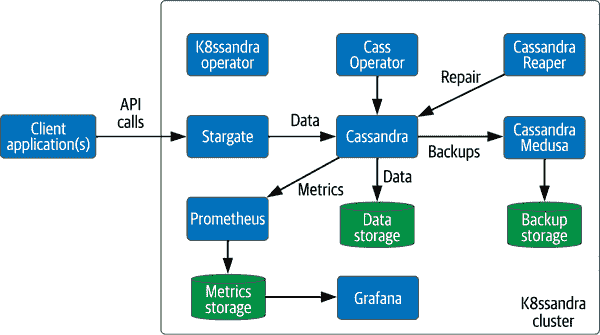
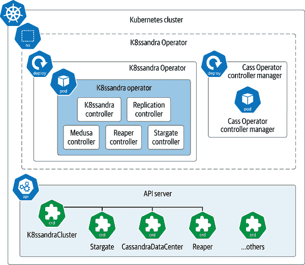
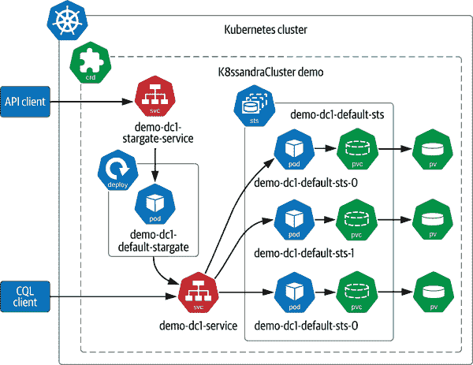
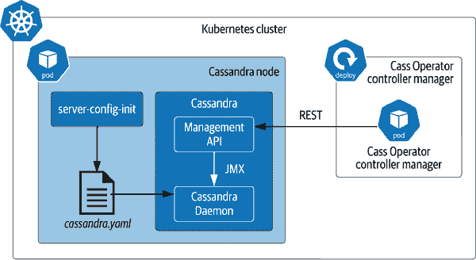
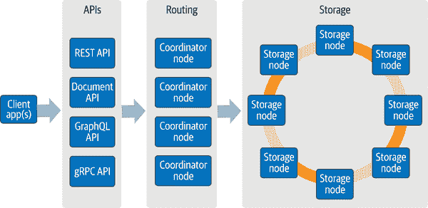
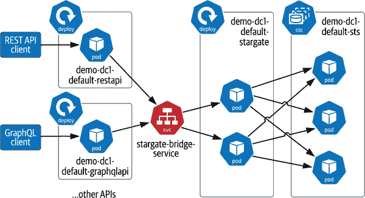
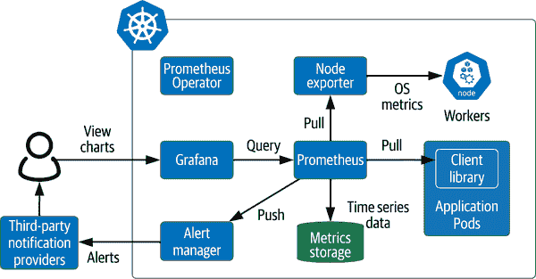
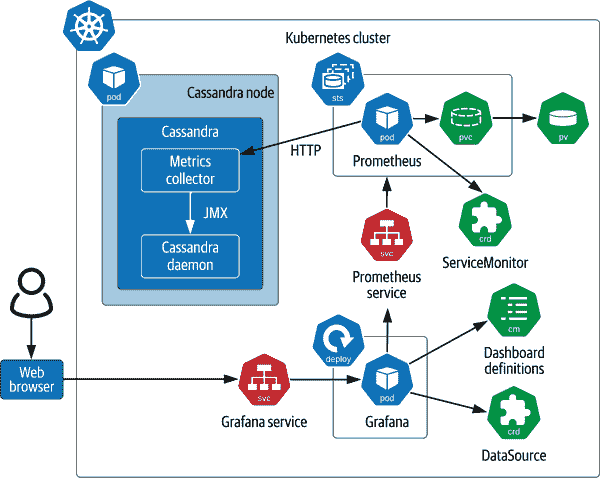
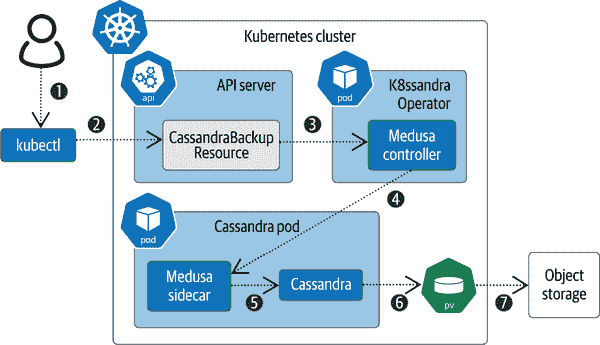
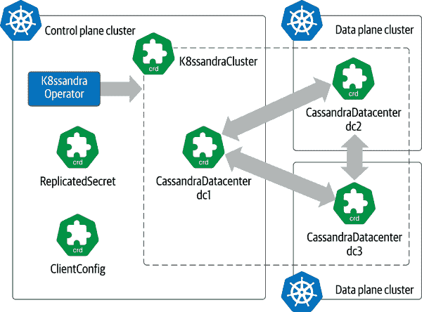

# 第六章：在 Kubernetes 堆栈中集成数据基础设施

在本书中，我们展示了运行在 Kubernetes 上的现代化、云原生应用程序的未来。直到此刻，我们指出历史上数据一直是实现这一现实的最困难部分之一。在之前的章节中，我们介绍了 Kubernetes 提供的用于管理计算、网络和存储资源的原语（第二章），并考虑了如何使用这些资源在 Kubernetes 上部署数据库（第三章）。我们还研究了使用控制器和操作者模式自动化基础设施（第四章）。

现在让我们扩展我们的关注点，考虑数据基础设施如何融入你在 Kubernetes 中的整体应用架构。在本章中，我们将探讨如何将前几章讨论的构建模块组合成集成的数据基础设施堆栈，这些堆栈易于部署并根据每个应用的独特需求进行定制。这些堆栈代表了我们在 第一章 中介绍的虚拟数据中心愿景的一步。为了了解构建和使用这些较大组件涉及的考虑因素，让我们深入了解 [K8ssandra](https://k8ssandra.io)。这个开源项目提供了一个基于 Apache Cassandra 的集成数据堆栈，我们在 “在 Kubernetes 上运行 Apache Cassandra” 中首次讨论了这个数据库。

# K8ssandra：基于 Kubernetes 的生产就绪 Cassandra

为了设定背景，让我们考虑将应用工作负载迁移到 Kubernetes 中的一些实际挑战。随着组织开始将现有应用迁移到 Kubernetes 并在 Kubernetes 中创建新的云原生应用程序，现代化数据层通常被推迟。无论延迟的原因是 Kubernetes 不适合有状态工作负载、缺乏开发资源还是其他因素，其结果都是在 Kubernetes 中运行应用程序并使数据库和其他数据基础设施在外部运行的不匹配架构。这导致开发者和 SRE（Site Reliability Engineer）的注意力分散，限制了生产力。同时，我们也经常看到监控应用程序和数据库基础设施采用不同的工具集，增加了云计算成本。

这种采纳挑战在 Cassandra 社区中变得明显。尽管围绕构建单个 Cassandra 操作者达成共识和增进协作如 第五章 所述，开发者仍面临关于数据库和操作者如何适应更大应用上下文的关键问题：

+   如何才能综合查看整个堆栈（包括应用程序和数据）的健康状态？

+   如何才能以符合我们管理数据中心方式的 Kubernetes 本地方式，定制安装、升级和其他运营任务的自动化？

为了帮助解决这些问题，DataStax 的 John Sanda 和一组工程师启动了一个名为 K8ssandra 的开源项目，旨在提供一个生产就绪的 Cassandra 部署，体现了在 Kubernetes 中运行 Cassandra 的最佳实践。K8ssandra 提供自定义资源，帮助管理包括集群部署、升级、扩展、数据备份和恢复等任务。您可以在 Jeff Carpenter 的博客文章 [“Why K8ssandra?”](https://oreil.ly/dB6mJ) 中详细了解该项目的动机。

## K8ssandra 架构

K8ssandra 部署为称为 *集群* 的单元，这与 Kubernetes 和 Cassandra 使用的术语类似。K8ssandra 集群包括一个 Cassandra 集群以及 图 6-1 中所示的其他组件，以提供完整的数据管理生态系统。让我们从顶部中心大致顺时针顺序考虑这些组件：

Cass Operator

介绍于 第五章 的 Kubernetes 操作者。它管理在 Kubernetes 上的 Cassandra 节点的生命周期，包括提供新节点和存储、扩展和缩减。

Cassandra Reaper

这管理维护 Cassandra 节点的详细信息，以保持高数据一致性。

Cassandra Medusa

提供对存储在 Cassandra 中的数据的备份和恢复功能。

Prometheus 和 Grafana

用于收集和可视化指标。

Stargate

作为对 CQL 的替代，提供 API 访问客户端应用程序的数据网关。

K8ssandra 操作者

管理所有其他组件，包括用于管理跨多个 Kubernetes 集群的 Cassandra 集群的多集群支持。



###### 图 6-1\. K8ssandra 架构

在接下来的部分中，我们将逐个查看 K8ssandra 项目的每个组件，以了解其在架构中的作用及与其他组件的关系。

## 安装 K8ssandra 操作者

让我们通过安装 K8ssandra 的实际操作经验来深入了解。要运行基本的 K8ssandra 安装，以完全展示操作者的功能，您需要一个具有多个工作节点的 Kubernetes 集群。

为了使部署更简单，K8ssandra 团队提供了脚本来自动化创建 Kubernetes 集群的过程，然后在这些集群上部署操作者。这些脚本使用 [kind clusters](https://kind.sigs.k8s.io) 来简化，所以在开始之前，请确保已安装它。

在 K8ssandra 网站上还提供了在各种云平台上安装的说明。我们在这里提供的说明基于 K8ssandra Operator 仓库中的 [安装指南](https://oreil.ly/4z2oH)。

# K8ssandra 2.0 发布状态

本章重点介绍 K8ssandra 2.0 发布，包括 K8ssandra Operator。在撰写本文时，K8ssandra 2.0 仍处于 beta 状态。随着 K8ssandra 2.0 向全面 GA 发布迈进，将更新 [K8ssandra 网站上的“入门”部分](https://oreil.ly/nT1n5) 中的说明，以引用新版本。

首先，从 GitHub 上克隆 K8ssandra operator 仓库：

```
git clone https://github.com/k8ssandra/k8ssandra-operator.git
```

接下来，您需要使用提供的 Makefile 创建一个 Kubernetes 集群，并将 K8ssandra Operator 部署到其中（假设您已安装 `make`）：

```
cd k8ssandra-operator
make single-up
```

如果您查看 Makefile，会注意到操作员是使用 Kustomize 安装的，我们在 “附加部署工具：Kustomize 和 Skaffold” 中讨论过这个工具。刚刚执行的目标会创建一个具有四个工作节点的 kind 集群，并更改当前上下文以指向该集群，您可以通过以下方式进行验证：

```
% kubectl config current-context
kind-k8ssandra-0
% kubectl get nodes
NAME                        STATUS   ROLES                  AGE     VERSION
k8ssandra-0-control-plane   Ready    control-plane,master   6m45s   v1.22.4
k8ssandra-0-worker          Ready    <none>                 6m13s   v1.22.4
k8ssandra-0-worker2         Ready    <none>                 6m13s   v1.22.4
k8ssandra-0-worker3         Ready    <none>                 6m13s   v1.22.4
k8ssandra-0-worker4         Ready    <none>                 6m13s   v1.22.4
```

现在来检查已创建的 CRD 列表：

```
% kubectl get crd
NAME                                          CREATED AT
cassandrabackups.medusa.k8ssandra.io          2022-02-05T17:31:35Z
cassandradatacenters.cassandra.datastax.com   2022-02-05T17:31:35Z
cassandrarestores.medusa.k8ssandra.io         2022-02-05T17:31:35Z
cassandratasks.control.k8ssandra.io           2022-02-05T17:31:36Z
certificaterequests.cert-manager.io           2022-02-05T17:31:16Z
certificates.cert-manager.io                  2022-02-05T17:31:16Z
challenges.acme.cert-manager.io               2022-02-05T17:31:16Z
clientconfigs.config.k8ssandra.io             2022-02-05T17:31:36Z
clusterissuers.cert-manager.io                2022-02-05T17:31:17Z
issuers.cert-manager.io                       2022-02-05T17:31:17Z
k8ssandraclusters.k8ssandra.io                2022-02-05T17:31:36Z
orders.acme.cert-manager.io                   2022-02-05T17:31:17Z
reapers.reaper.k8ssandra.io                   2022-02-05T17:31:36Z
replicatedsecrets.replication.k8ssandra.io    2022-02-05T17:31:36Z
stargates.stargate.k8ssandra.io               2022-02-05T17:31:36Z
```

正如您所见，与 cert-manager 和 K8ssandra 相关联的几个 CRD。还有 Cass Operator 使用的 CassandraDatacenter CRD。K8ssandra 和 Cass Operator 的 CRD 都是命名空间的，您可以使用 `kubectl api-resources` 命令进行验证，这意味着根据这些定义创建的资源将被分配到特定的命名空间。该命令还将显示每种资源类型的可接受缩写（例如 `k8c` 表示 `k8ssandracluster`）。

接下来，您可以检查已安装在 kind 集群中的内容。如果使用 `kubectl get ns` 列出命名空间，您会注意到两个新的命名空间：`cert-manager` 和 `k8ssandra-operator`。正如您可能猜到的那样，K8ssandra 使用与 Pulsar 相同的 cert-manager 项目，如 “使用 cert-manager 默认安全通信” 中描述的那样。让我们检查 `k8ssandra-operator` 命名空间中的内容，这些内容在 图 6-2 中概述，以及相关的 K8ssandra CRD。

检查工作负载，您会注意到已创建了两个部署：一个用于 K8ssandra Operator，另一个用于 Cass Operator。查看 K8ssandra Operator 的源代码，您会看到它包含多个控制器，而 Cass Operator 则由单个控制器组成。这种打包反映了 Cass Operator 是一个独立项目的事实，可以单独使用，而无需采用整个 K8ssandra 框架，否则它可能已作为 K8ssandra Operator 中的一个控制器包含。



###### 图 6-2\. K8ssandra Operator 架构

表 6-1 描述了这些各种控制器与它们交互的关键资源的映射。

表 6-1\. 将 K8ssandra CRD 映射到控制器

| Operator | Controller | 关键自定义资源 |
| --- | --- | --- |
| K8ssandra Operator | K8ssandra 控制器 | `K8ssandraCluster`, `CassandraDatacenter` |
| Medusa 控制器 | `CassandraBackup`, `CassandraRestore` |
| Reaper 控制器 | `Reaper` |
| Replication 控制器 | `ClientConfig`, `ReplicatedSecret` |
| Stargate 控制器 | `Stargate` |
| Cass Operator | Cass Operator 控制器管理器 | `CassandraDatacenter` |

我们将在接下来的章节中详细介绍每个 K8ssandra 和 Cass Operator CRD：

## 创建 K8ssandraCluster

一旦安装了 K8ssandra Operator，下一步就是创建一个 K8ssandraCluster。本节中使用的源代码在书的存储库的 [“Vitess Operator Example” 部分](https://oreil.ly/1n3k7) 中可用，基于 [K8ssandra Operator GitHub 存储库](https://oreil.ly/5WxRO) 中提供的示例。首先，请查看 *k8ssandra-cluster.yaml* 文件：

```
apiVersion: k8ssandra.io/v1alpha1
kind: K8ssandraCluster
metadata:
  name: demo
spec:
  cassandra:
    cluster: demo
    serverVersion: "4.0.1"
    datacenters:
      - metadata:
          name: dc1
        size: 3
        storageConfig:
          cassandraDataVolumeClaimSpec:
            storageClassName: standard
            accessModes:
              - ReadWriteOnce
            resources:
              requests:
                storage: 1Gi
        config:
          jvmOptions:
            heapSize: 512M
        stargate:
          size: 1
          heapSize: 256M
```

此代码指定了一个 K8ssandraCluster 资源，由一个运行三个 Cassandra 4.0.1 节点的单个数据中心 `dc1` 组成，其中每个 Cassandra 节点的 Pod 规范请求使用引用 `standard` StorageClass 的 PersistentVolumeClaim 的 1 GB 存储。此配置还包括一个单独的 Stargate 节点，以提供对 Cassandra 集群的 API 访问。这是一个接受大多数其他组件的默认配置的最小配置。使用以下命令在 `k8ssandra-operator` 命名空间中创建 `demo` K8ssandraCluster：

```
% kubectl apply -f k8ssandra-cluster.yaml -n k8ssandra-operator
k8ssandracluster.k8ssandra.io/demo created
```

一旦命令完成，您可以使用诸如 `kubectl get k8ssandraclusters`（或简写为 `kubectl get k8c`）之类的命令来检查 K8ssandraCluster 的安装情况。图 6-3 描述了在创建 `demo` K8ssandraCluster 时操作员为您建立的一些关键计算、网络和存储资源。



###### 图 6-3\. 一个简单的 K8ssandraCluster

以下是一些需要注意的关键项目：

+   已创建一个单独的 StatefulSet 以表示 Cassandra 数据中心 `dc1`，其中包含了您指定的三个副本 Pod。正如您将在下一节中了解到的那样，K8ssandra 使用 CassandraDatacenter CRD 通过 Cass Operator 管理此 StatefulSet。

+   虽然图中显示了一个名为 `demo-dc1-service` 的单个 Service，用作将 Cassandra 集群公开为单个端点的访问点，但这只是一个简化。您会发现配置了多个服务以为各种客户端提供访问。

+   有一个部署管理单个 Stargate Pod，以及提供 Stargate 提供的各种 API 服务的客户端终端的服务。这是另一种简化，我们将在 “使用 Stargate API 提升开发者的生产力” 中更详细地探讨这部分配置。

+   类似于我们在前几章中展示的基础设施示例，K8ssandra Operator 还会创建额外的支持安全资源，如 ServiceAccounts、Roles 和 RoleBindings。

一旦创建了一个 K8ssandraCluster，您可以将客户端应用程序指向 Cassandra 接口和 Stargate API，并执行集群维护操作。只需删除其资源即可删除 K8ssandraCluster，但由于我们还有很多内容要探索，您不会想这么做！随着我们更详细地检查每个 K8ssandra 组件，我们将描述其中几个交互。在此过程中，我们将确保记录 K8ssandra 和相关项目的贡献者在如何使用 Kubernetes 资源以及如何将 Kubernetes 之前的数据基础设施适应 Kubernetes 方式做事方面所做的一些有趣的设计选择。

# StackGres: 一个集成的 Kubernetes Stack，用于 Postgres

K8ssandra 项目并不是在 Kubernetes 上运行的集成数据堆栈的唯一实例。另一个例子可以在 [StackGres](https://stackgres.io) 中找到，这是由 OnGres 管理的项目。StackGres 使用 [Patroni](https://github.com/zalando/patroni) 支持集群化、高可用性的 Postgres 部署，并添加了自动备份功能。StackGres 支持与 Prometheus 和 Grafana 的集成，用于指标聚合和可视化，还可以选择使用 Envoy 代理来获取协议级别的更详细的指标。StackGres 由开源组件组成，并使用 [AGPLv3 许可证](https://www.gnu.org/licenses/agpl-3.0.en.html) 进行其社区版的发布。

# 使用 Cass Operator 在 Kubernetes 中管理 Cassandra

*Cass Operator* 是 DataStax 为 Apache Cassandra 提供的 Kubernetes Operator 的简称。这个开源项目可以在 [GitHub](https://oreil.ly/xWjZr) 找到，于 2021 年并入了 K8ssandra 项目，取代了其之前在 [DataStax GitHub 组织](https://oreil.ly/JAF3Y) 下的位置。

Cass Operator 是 K8ssandra 的关键组成部分，因为 Cassandra 集群是其他所有基础设施元素和工具的基础数据基础设施。然而，Cass Operator 在 K8ssandra 之前就已经开发，并将继续作为一个可单独部署的项目存在。这非常有帮助，因为并非所有 Cass Operator 的功能都通过 K8ssandra 暴露出来，特别是更高级的 Cassandra 配置选项。Cass Operator 在 [Operator Hub](https://oreil.ly/gPtl3) 中列为其自己的项目，可以通过 Kustomize 进行安装。

Cass Operator 提供了 Cassandra 拓扑概念的映射，包括集群、数据中心、机架和节点到 Kubernetes 资源的映射。关键构造是 CassandraDatacenter CRD，它表示 Cassandra 集群拓扑中的一个数据中心。（如果您需要关于 Cassandra 拓扑的复习，请参考第三章。）

在前一节创建 K8ssandraCluster 资源时，K8ssandra Operator 创建了一个单个的 CassandraDatacenter 资源，它看起来可能是这样的：

```
apiVersion: cassandra.datastax.com/v1beta1
kind: CassandraDatacenter
metadata:
  name: dc1
spec:
  clusterName: demo
  serverType: cassandra
  serverVersion: 4.0.1
  size: 3
  racks:
  - name: default
```

由于您在 K8ssandraCluster 定义中没有指定机架，K8ssandra 将其解释为名为`default`的单个机架。通过创建 CassandraDatacenter，K8ssandra Operator 委托 Cass Operator 操作此数据中心中的 Cassandra 节点。

# Cass Operator 和多数据中心

您可能想知道为什么 Cass Operator 没有定义表示 Cassandra 集群的 CRD。从 Cass Operator 的角度来看，Cassandra 集群基本上只是一个元数据片段——即 CassandraDatacenter 的`clusterName`，而不是一个实际的资源。这反映了在生产系统中使用的 Cassandra 集群通常部署在跨多个物理数据中心的情况，这超出了 Kubernetes 集群的范围。

虽然您可以确实创建多个 CassandraDatacenter 并使用相同的`clusterName`将它们链接在一起，但它们必须位于同一个 Kubernetes 集群中，以便 Cass Operator 能够管理它们。建议使用单独的 Namespace 来安装 Cass Operator 的专用实例以管理每个集群。您将看到 K8ssandra 如何支持创建跨多个物理数据中心（和 Kubernetes 集群）的 Cassandra 集群，形成多集群拓扑结构。

当 API 服务器通知 Cass Operator 创建 CassandraDatacenter 资源时，它将创建用于实施数据中心的资源，包括用于在每个机架中管理节点的 StatefulSet，以及各种服务和安全相关资源。StatefulSet 将并行启动请求的 Pod 数目。这带来了这样一个情况，即 Cass Operator 提供了适应 Cassandra 和 Kubernetes 操作方式之间的逻辑。

如果您之前曾使用过 Cassandra，可能已经了解到向集群添加节点的最佳实践是逐个添加，以简化节点加入集群的过程。这个过程被称为*引导*，包括协商节点将负责的数据以及可能从其他节点流式传输数据到新节点的步骤。然而，由于 StatefulSet 不知道这些约束条件，如何实现向新集群或现有集群逐个添加多个节点呢？

答案在于 Cass Operator 传递给 StatefulSet 的 Pod 规范的组合，然后用于创建每个 Cassandra 节点，如图 6-4 所示。



###### 图 6-4. Cass Operator 与 Cassandra Pods 的交互

Cass Operator 在其管理的每个 Cassandra Pod 中部署了 Cassandra 的自定义镜像。Pod 规范至少包括两个容器：一个名为`server-config-init`的初始化容器和一个名为`cassandra`的 Cassandra 容器。

作为初始化容器，`server-config-init`在 Cassandra 容器之前启动。它负责基于 CassandraDatacenter 的选择配置选项生成*cassandra.yaml*配置文件。你可以使用 CassandraDatacenter 资源的`config`部分指定额外的配置值，如[K8ssandra 文档](https://oreil.ly/SlN0F)中所述。

# Cassandra Pods 中的额外 Sidecar 容器

正如你将在接下来的章节中学到的，当在 K8ssandraCluster 中部署时，Cassandra Pod 可能会有额外的 Sidecar 容器，具体取决于你是否启用了其他 K8ssandra 组件。但目前，我们只关注最基本的安装。

`cassandra`容器实际上包含两个独立的进程：运行 Cassandra 实例的守护进程和一个管理 API。这在某种程度上违反了每个容器运行单一进程的传统最佳实践，但这个例外有其充分的理由。

Cassandra 的管理接口通过 Java Management Extensions（JMX）暴露。当项目刚开始时，这对于像 Cassandra 这样的基于 Java 的应用程序来说是一个合理的设计选择，但由于其复杂性和安全问题，JMX 已经不再受欢迎。尽管 Cassandra 的备选管理接口已经取得了一些进展，但工作尚未完成，因此 Cass Operator 的开发人员决定集成另一个开源项目，[Apache Cassandra 的管理 API](https://oreil.ly/1XIPi)。

管理 API 项目提供了一个 RESTful API，将基于 HTTP 的调用转换为 Cassandra 传统的 JMX 接口调用。通过在 Cassandra 容器内部运行管理 API，我们避免了将 JMX 端口暴露在 Cassandra 容器外部。这是云原生架构中经常使用的模式的一个实例，用于将自定义协议适配为基于 HTTP 的接口，因为在入口控制器中，这些接口有更好的路由和安全性支持。

Cass Operator 在每个 Cassandra Pod 上发现并连接到管理 API，以执行与 Kubernetes 无关的管理操作。在添加新节点时，这涉及使用管理 API 简单地验证节点是否正常运行，并相应地更新 Cassandra 数据中心的状态。这个过程在 [K8ssandra 文档](https://oreil.ly/T7io1) 中有更详细的描述。

# 定制 Cass Operator 使用的 Cassandra 镜像

管理 API 项目为最近的 Cassandra 3.*x* 和 4.*x* 系列版本提供镜像，这些镜像可以在 [Docker Hub](https://oreil.ly/FQa3q) 上获取。虽然可以使用自定义的 Cassandra 镜像来覆盖 Cass Operator 使用的镜像，但 Cass Operator 要求每个 Cassandra Pod 上都能够访问管理 API。如果需要构建包含管理 API 的自定义镜像，可以使用 [GitHub 仓库](https://oreil.ly/GKRP1) 中的 Dockerfiles 和支持脚本作为起点。

虽然本节主要关注刚刚描述的启动和扩展 Cassandra 集群，但 Cass Operator 提供了多个功能来部署和管理 Cassandra 集群：

拓扑管理

Cass Operator 使用 Kubernetes 亲和性原则来管理 Cassandra 节点（Pod）在 Kubernetes Worker 节点上的放置，以最大化数据的可用性。

缩减规模

就像逐个添加节点以扩展一样，Cass Operator 管理逐个减少节点以进行缩减。

替换节点

如果 Cassandra 节点由于崩溃或其所在的 Worker Node 关闭而丢失，Cass Operator 依赖 StatefulSet 来替换节点，并将新节点绑定到适当的 PersistentVolumeClaim。

升级镜像

Cass Operator 还利用 StatefulSet 的能力来对 Cassandra Pods 使用的镜像执行滚动升级。

管理种子节点

Cass Operator 创建 Kubernetes 服务来暴露每个数据中心中的种子节点，根据 Cassandra 建议的每个机架一个种子节点的约定，每个数据中心至少为三个。

您可以在 [Cass Operator 文档](https://oreil.ly/UafkF) 中阅读关于这些以及其他功能的信息。

# 使用 Stargate APIs 提升开发者的生产力

到目前为止，本书的重点主要集中在 Kubernetes 中部署数据基础设施（如数据库），而不是云原生应用程序中基础设施的使用方式。在 K8ssandra 中使用 [Stargate](https://stargate.io) 给我们提供了一个很好的机会来讨论这个问题。

在许多组织中，关于直接应用访问数据库与抽象数据库交互细节的利弊正在持续讨论。这场辩论尤其频繁出现在那些将应用开发团队和管理包括数据基础设施的平台团队分开的大型组织中。然而，在采用包括 DevOps 和微服务架构在内的现代实践的组织中，也可以观察到这种情况，其中每个微服务可能背后都有不同的数据存储。

多年来，提供对直接数据库访问的抽象化的想法采取了许多形式。即使在单片客户端-服务器应用程序时代，通常也会使用存储过程或通过对象关系映射工具（如 Hibernate）隔离数据访问和复杂查询逻辑，或者使用数据访问对象（DAO）等模式。

更近些年来，随着软件行业向面向服务的架构（SOA）和微服务迈进，类似的用于抽象数据访问的模式也开始出现。正如 Jeff 在他的文章["大众数据服务"](https://oreil.ly/u6K58)中所描述的，许多团队发现自己在架构中创建了一层专门用于数据访问的微服务，提供对特定数据类型或实体的创建、读取、更新和删除（CRUD）操作。这些服务抽象了与特定数据库后端交互的细节，如果执行和维护良好，可以帮助提高开发人员的生产力，并在需要时促进迁移到不同的数据库。

星门项目诞生于认识到多个团队正在构建非常相似的抽象层以通过 API 提供数据访问的事实。星门项目的目标是提供一个开源的*数据 API 网关*——一套通用的数据访问 API，以帮助消除团队开发和维护自己的定制 API 层的需求。尽管星门的初始实现基于 Cassandra，但该项目的目标是支持多个数据库后端，甚至支持缓存和流处理等其他类型的数据基础设施。

作为后端数据存储使用 Cassandra，星门架构可以描述为具有三层，如图 6-5 所示。



###### 图 6-5\. 带有 Cassandra 的星门概念架构

*API 层* 是最外层，由实现在基础 Cassandra 集群上的各种 API 的服务组成。可用的 API 包括 [REST API](https://oreil.ly/qTEY6)，通过 HTTP 提供对 JSON 文档的访问的 [文档 API](https://oreil.ly/ekhlV)，[GraphQL API](https://oreil.ly/BescX) 和 [gRPC API](https://oreil.ly/k2fNY)。*路由层*（或 *协调层*）由一组节点组成，这些节点充当 Cassandra 节点，但仅执行查询的路由，不存储数据。*存储层* 包括传统的 Cassandra 集群，目前可以是 Cassandra 3.11、Cassandra 4.0 或 DataStax Enterprise 6.8。

该架构的关键优势之一在于，它识别了管理计算和存储资源使用的责任分离，并提供根据客户应用需求独立扩展此使用的能力：

+   可以根据应用程序所需的存储容量增加或减少存储节点的数量。

+   协调节点和 API 实例的数量可以根据应用的读写负载进行增减，并优化吞吐量。

+   应用未使用的 API 可以缩减至零（禁用），以减少资源消耗。

K8ssandra 支持通过 Stargate CRD 在基础 Cassandra 集群的顶部部署 Stargate。由 Cass Operator 部署的 CassandraDatacenter 充当存储层，而 Stargate CRD 指定了路由和 API 层的配置。示例配置如 图 6-6 所示。



###### 图 6-6\. 在 Kubernetes 上部署 Stargate

安装包括一个部署来管理协调节点，以及一个服务来提供对 Bridge API 的访问，Bridge API 是在协调节点上公开的私有 gRPC 接口，可用于创建新的 API 实现。详细信息请参阅 [Stargate v2 设计](https://oreil.ly/6ct5m)。每个已启用的 API 在安装中也包括一个部署，并提供对客户应用程序的访问的服务。

如您所见，Stargate 项目为扩展您的数据基础设施提供了一个有前景的框架，该框架具有与底层数据库一起扩展的开发人员友好的 API。

# 使用 Prometheus 和 Grafana 的统一监控基础设施

现在我们考虑了为应用开发人员提供更轻松的基础设施之后，让我们来看看在 Kubernetes 堆栈中集成数据基础设施的更多操作重点。我们将从监控开始。

可观测性是部署在 Kubernetes 上的任何应用程序的关键属性，因为它影响您对其可用性、性能和成本的感知。您的目标应该是在应用程序和其依赖的基础设施之间实现集成视图。可观测性通常被描述为由三种类型的数据组成：指标、日志和跟踪。Kubernetes 本身提供了日志记录的能力，并能将事件与资源关联起来，您已经了解了 Cass Operator 如何促进从 Cassandra 节点收集日志。

在本节中，我们将重点介绍 K8ssandra 如何集成 Prometheus/Grafana 栈，以提供指标。*Prometheus* 是一个流行的开源监控平台。它支持多种接口用于从应用程序和服务收集数据，并将其存储在时间序列数据库中，可以使用 Prometheus 查询语言（PromQL）高效查询。它还包括 Alertmanager，根据指标阈值生成警报和其他通知。

在 K8ssandra 1.*x* 系列的先前版本中，将 Prometheus 栈作为 K8ssandra 的一部分进行集成，而 K8ssandra 2.*x* 则提供了与现有 Prometheus 安装集成的能力。

安装 Prometheus Operator 的一种简单方法是使用 [kube-prometheus](https://oreil.ly/tzDmJ)，这是 Prometheus Operator 项目的一部分提供的存储库。Kube-prometheus 旨在作为 Kubernetes 的综合监控栈，包括控制平面和应用程序。您可以克隆此存储库，并使用其中包含的清单（YAML 文件）库安装显示在 Figure 6-7 中的集成组件堆栈。



###### 图 6-7\. kube-prometheus 栈的组件

这些组件包括以下内容：

Prometheus Operator

图中单独设置的 Operator 管理其他组件。

Prometheus

指标数据库以高可用性配置运行，通过 StatefulSet 进行管理。Prometheus 使用具有后备 PersistentVolume 的时间序列数据库存储数据。

Node exporter

[node exporter](https://oreil.ly/Yt0YO) 在每个 Kubernetes Worker 节点上运行，允许 Prometheus 通过 HTTP 拉取操作系统指标。

客户端库

应用程序可以嵌入 Prometheus 客户端库，允许 Prometheus 通过 HTTP 拉取指标。

警报管理器

这可以配置为基于特定指标的阈值生成警报，通过电子邮件或 PagerDuty 等第三方工具进行传递。kube-prometheus 栈内置了用于 Kubernetes 集群的警报；还可以添加特定于应用程序的警报。

Grafana

此部署用于提供图表，用于向人类操作员显示指标。Grafana 使用 PromQL 从 Prometheus 访问指标，这个接口也对其他客户端可用。

虽然在图中未显示，该堆栈还包括[Kubernetes Metrics APIs 的 Prometheus 适配器](https://oreil.ly/g033n)，这是一个可选组件，用于将 Prometheus 收集的指标公开给 Kubernetes 控制平面，以便用于自动扩展应用程序。

将 K8ssandra 与 Prometheus 连接可以通过几个快速步骤完成。K8ssandra 文档中的[说明](https://oreil.ly/UOt4t)指导您安装 Prometheus Operator，如果您尚未安装 kube-prometheus。由于 kube-prometheus 在自己的命名空间中安装 Prometheus Operator，您需要确保操作员有权限管理其他命名空间中的资源。

要将 K8ssandra 与 Prometheus 集成，您可以在 K8ssandraCluster 资源上设置属性，以启用对 Cassandra 和 Stargate 节点的监控。例如，您可以像以下示例那样为集群中所有数据中心的节点启用监控：

```
apiVersion: k8ssandra.io/v1alpha1
kind: K8ssandraCluster
metadata:
  name: demo
spec:
  cassandra:
    datacenters:
      ...
    telemetry:
      prometheus:
        enabled: true
  stargate:
    telemetry:
      prometheus:
        enabled: true
```

也可以选择性地在单个数据中心上启用监控。

让我们看看集成是如何工作的。首先，让我们考虑 Cassandra 节点如何公开指标。如"在 Kubernetes 中使用 Cass Operator 管理 Cassandra"中讨论的，Cassandra 通过 JMX 公开管理功能，包括指标报告。[Apache Cassandra 的 Metric Collector (MCAC)](https://oreil.ly/CHNMQ)是一个开源项目，公开指标以便 Prometheus 或其他使用 Prometheus 协议通过 HTTP 访问的后端。K8ssandra 和 Cass Operator 使用包含 MCAC 以及作为附加进程运行在 Cassandra 容器中的管理 API 的 Cassandra Docker 镜像。这个配置显示在图 6-8 的左侧。



###### 图 6-8\. 使用 kube-prometheus 堆栈监控 Cassandra

图 6-8 的右侧显示了如何配置 Prometheus 和 Grafana 以消费和公开 Cassandra 指标。K8ssandra Operator 为每个启用监控的 CassandraDatacenter 创建 ServiceMonitor 资源。ServiceMonitor 是由 Prometheus Operator 定义的 CRD，包含了从一组 Pod 收集指标的配置细节，包括以下内容：

+   引用标识 Pod 的标签名称的`selector`

+   连接信息，例如从每个 Pod 收集指标所需的`scheme`（协议）、`port`和`path`

+   应该拉取指标的`interval`

+   可选的`metricRelabelings`，这些指令指示任何想要重命名指标的需求，甚至指示应该删除的指标，以避免被 Prometheus 采集

K8ssandra 为 Cassandra 和 Stargate 节点创建单独的 ServiceMonitor 实例，因为暴露的指标略有不同。要观察部署在您的集群中的 ServiceMonitors，您可以执行诸如`kubectl get servicemonitors -n monitoring`之类的命令。

Prometheus 通过一个作为 Kubernetes 服务公开的 PromQL 端点向 Grafana 和其他工具提供其指标的访问。kube-prometheus 安装配置了一个 Grafana 实例，以使用 Grafana Datasource CRD 的实例连接到 Prometheus。Grafana 接受使用 YAML 文件定义的仪表板，并作为 ConfigMaps 提供。请参阅 K8ssandra [文档](https://oreil.ly/vCfmR) 了解如何加载显示 Cassandra 和 Stargate 指标的仪表板定义。您可能还希望创建显示应用程序指标和 K8ssandra 提供的数据层指标的仪表板，以集成查看应用程序性能。

正如你所见，kube-prometheus 为 Kubernetes 集群提供了一个全面且可扩展的监控堆栈，就像 K8ssandra 为数据管理提供了一个堆栈一样。K8ssandra 与 kube-prometheus 的集成是如何组装集成的 Kubernetes 资源以形成更强大的应用程序的一个很好的例子。

# 使用 Cassandra Reaper 执行修复

作为一种 NoSQL 数据库，Cassandra 默认强调高性能（特别是写入操作）和高可用性。如果你熟悉 CAP 定理，你就会理解这意味着有时候 Cassandra 会暂时牺牲节点间数据一致性，以便在规模化时提供高性能和高可用性，这种方法被称为*最终一致性*。通过指定复制策略和每个查询所需的一致性级别，Cassandra 确实提供了调整一致性程度以满足需求的能力。用户和管理员应了解这些选项及其行为，以有效使用 Cassandra。

Cassandra 具有多种内置的“反熵”机制，如提示协作和修复，这有助于随着时间推移在节点之间保持数据的一致性。修复是一个后台过程，节点通过该过程比较它所拥有的数据的一部分与其他也负责该数据的节点的最新内容。尽管可以通过使用校验和来优化这些检查，但修复仍然可能是一个性能密集型的过程，并且最好在集群负载减少或低峰期执行。结合多种选项，包括全面和增量修复，执行修复通常需要针对每个集群进行一些定制。它也倾向于是一个手动过程，不幸的是，一些 Cassandra 集群管理员经常忽视它。

# Cassandra 中关于修复的更多详细信息

有关修复的更深入的处理，请参阅 [*Cassandra: The* *Definitive* *Guide*](https://learning.oreilly.com/library/view/cassandra-the-definitive/9781492097136)，其中第六章和第十二章分别描述了修复概念和可用选项。

[Cassandra Reaper](http://cassandra-reaper.io) 的创建旨在简化在 Cassandra 集群上执行修复的难度，并优化修复性能，以最小化对高度使用的集群运行修复的影响。Reaper 由 Spotify 创建，并由 The Last Pickle 增强，目前在 [GitHub](https://oreil.ly/2MttB) 上进行项目管理。Reaper 提供了一个 RESTful API，用于为一个或多个 Cassandra 集群配置修复计划，并提供命令行工具和 Web 界面，指导管理员完成创建计划的过程。

K8ssandra 提供了将 Cassandra Reaper 实例作为 K8ssandraCluster 的一部分进行集成的选项。K8ssandra Operator 包括一个 Reaper 控制器，负责通过其相关的 Reaper CRD 管理本地 Cassandra Reaper 管理进程。默认情况下，在 K8ssandraCluster 中启用 Reaper 将导致在每个安装中表示的 Kubernetes 集群中安装一个 Reaper 实例，但您也可以使用单个 Reaper 实例来管理跨多个数据中心甚至跨多个 Cassandra 集群的修复，只要它们可以通过网络访问。

# 使用 Cassandra Medusa 进行数据备份和恢复

管理备份是维护任何存储数据系统高可用性和灾难恢复计划的重要组成部分。Cassandra 支持通过创建指向用于数据持久化的 SSTable 文件的硬链接来进行完整和差异备份。Cassandra 本身不负责将 SSTable 文件复制到备份存储中，而是由用户来完成这一任务。同样，从备份恢复涉及将 SSTable 文件复制到要重新加载数据的 Cassandra 节点，然后可以指向本地文件以恢复其内容。

Cassandra 的备份和恢复操作通常通过单个节点上的 nodetool 执行，这是一个命令行工具，利用 Cassandra 的 JMX 接口。[Cassandra Medusa](https://oreil.ly/tmP91) 是由 Spotify 和 The Last Pickle 创建的开源命令行工具，用于执行 nodetool 命令来执行备份操作，包括跨多个节点同步备份。Medusa 支持 Amazon S3、Google Cloud Storage (GCS)、Azure Storage，以及像 MinIO 和 Ceph Object Gateway 这样的 S3 兼容存储，还可以通过 Apache Libcloud 项目扩展支持其他存储提供商。

Medusa 可以恢复单个节点，以支持快速替换掉线节点，或在灾难恢复场景下恢复整个集群。恢复到集群可以是原始集群，也可以是新集群。Medusa 能够将数据恢复到比原始集群具有不同大小或拓扑的集群，这在传统上是手动解决的一个挑战。

K8ssandra 已整合 Medusa，以提供在 Kubernetes 中运行的 Cassandra 集群的备份和恢复功能。要配置 K8ssandraCluster 中 Medusa 的使用，您需要配置`medusa`属性：

```
apiVersion: k8ssandra.io/v1alpha1
kind: K8ssandraCluster
metadata:
  name: demo
spec:
  cassandra:
    ...
  medusa:
    storageProperties:
      storageProvider: google_storage
      storageSecretRef:
        name: medusa-bucket-key
      bucketName: k8ssandra-medusa
      prefix: test
      ...
```

此处显示的选项包括存储提供程序、用于备份的 bucket、用于组织备份文件的目录名称的可选前缀，以及包含 bucket 登录凭据的 Kubernetes Secret 的名称。有关 Secret 内容的详细信息，请参阅[文档](https://oreil.ly/ujZYw)。其他可用选项包括在 bucket 连接上启用 SSL，并设置清除旧备份的策略，如最大年龄或备份数量。

## 创建备份

一旦启动了 K8ssandraCluster，您可以使用 CassandraBackup CRD 创建备份。例如，您可以使用以下命令启动对 CassandraDatacenter `dc1`的备份：

```
cat <<EOF | kubectl apply -f -n k8ssandra-operator -
apiVersion: medusa.k8ssandra.io/v1alpha1
kind: CassandraBackup
metadata:
  name: medusa-backup1
spec:
  cassandraDatacenter: dc1
  name: medusa-backup1
EOF
```

此资源的处理步骤如图 6-9 所示。



###### 图 6-9\. 使用 Medusa 执行 Datacenter 备份

当您应用资源定义（1）时，`kubectl`将资源注册到 API 服务器（2）。API 服务器通知作为 K8ssandra Operator 的一部分运行的 Medusa 控制器（3）。

Medusa 控制器联系一个 sidecar 容器（4），该容器已由 K8ssandra 注入到 Cassandra Pod 中，因为您选择在 K8ssandraCluster 上启用了 Medusa。Medusa sidecar 容器使用 nodetool 命令通过 JMX 在 Cassandra 节点上执行备份（5）（JMX 接口仅在 Pod 内部暴露）。

Cassandra 执行备份（6），标记 PersistentVolume 上标记当前快照的 SSTable 文件。Medusa sidecar 将快照文件从 PV 复制到 bucket（7）。步骤 4-7 将为 CassandraDatacenter 中的每个 Cassandra Pod 重复执行。

您可以通过检查资源的状态来监视备份的进度：

```
kubectl get cassandrabackup/medusa-backup1 -n k8ssandra-operator -o yaml
kind: CassandraBackup
metadata:
    name: medusa-backup1
spec:
  backupType: differential
  cassandraDatacenter: dc1
  name: medusa-backup1
status:
  ...
  ...
  finishTime: "2022-02-26T09:21:38Z"
  finished:
  - demo-dc1-default-sts-0
  - demo-dc1-default-sts-1
  - demo-dc1-default-sts-2
  startTime: "2022-02-26T09:21:35Z"
```

当`finishTime`属性填充时，您将知道备份已完成。已备份的 Pod 将列在`finished`属性下。

## 从备份恢复

从备份恢复数据的过程类似。要从备份数据中恢复整个 Datacenter，您可以创建类似以下的 CassandraRestore 资源：

```
cat <<EOF | kubectl apply -f -n k8ssandra-operator -
apiVersion: medusa.k8ssandra.io/v1alpha1
kind: CassandraRestore
metadata:
  name: restore-backup1
spec:
  cassandraDatacenter:
    name: dc1
    clusterName: demo
  backup: medusa-backup1
  inPlace: true
  shutdown: true
EOF
```

当 Medusa 控制器收到新资源通知时，它会定位 CassandraDatacenter 并更新管理 Cassandra Pod 的 StatefulSet 内的 Pod 模板。更新包括添加一个名为 `medusa-restore` 的新初始化容器，并设置 `medusa-restore` 将用于定位要恢复的数据文件的环境变量。对 Pod 模板的更新会导致 StatefulSet 控制器对 StatefulSet 中的 Cassandra Pod 执行滚动更新。随着每个 Pod 重新启动，`medusa-restore` 将文件从对象存储复制到节点的 PersistentVolume 上，然后 Cassandra 容器像往常一样启动。您可以通过检查 CassandraRestore 资源的状态来监视恢复的进度。

# 数据恢复的通用语言？

有趣的是注意到本章讨论的 K8ssandra 操作员和第五章讨论的 Vitess 操作员在支持备份和恢复操作方面的相似性和差异。

在 K8ssandra 中，CassandraBackup 和 CassandraRestore 资源的功能方式类似于 Kubernetes Job —— 它们表示您希望执行的任务以及任务的结果。相比之下，VitessBackup 资源表示 Vitess 操作员根据 VitessCluster 资源的配置执行的备份记录。在 Vitess 中没有等效于 CassandraRestore 操作员的资源。

虽然 K8ssandra 和 Vitess 在备份管理方法上有显著差异，但两者都将每个备份任务表示为资源。也许这种共同点可以成为开发通用资源定义以进行备份和恢复操作的起点，有助于实现第五章介绍的愿景（第五章）。

与 Cassandra Reaper 的行为类似，单个 Medusa 实例可以配置为跨多个数据中心或 Cassandra 集群管理备份和恢复操作。有关使用 Medusa 执行备份和恢复操作的更多详细信息，请参阅 K8ssandra [文档](https://oreil.ly/Y2EkE)。

# 在 Kubernetes 中部署多集群应用程序

像 Cassandra 这样的分布式数据库的一个主要卖点之一是其支持跨多个数据中心的部署。许多用户利用这一点来促进地理分布的数据中心之间的高可用性，以为应用程序和其用户提供更低延迟的读写服务。

然而，Kubernetes 本身最初并不是设计用于支持跨多个 Kubernetes 集群的应用程序。这通常意味着创建这种多地区应用程序会留下大量工作给开发团队。

这项工作主要分为两种形式：创建连接 Kubernetes 集群的网络基础设施，以及协调这些集群中资源的交互。让我们详细研究这些要求以及对像 Cassandra 这样的应用程序的影响：

多集群网络要求

从网络角度来看，关键是在数据中心之间建立安全可靠的网络连接。如果您的应用程序使用单一云提供商，使用主要云供应商提供的 VPC 功能可能相对简单。

如果您使用多个云，则需要一个第三方解决方案。在大多数情况下，Cassandra 需要其节点之间的可路由 IP，不依赖名称解析，但也有助于使用 DNS 简化管理 Cassandra 种子节点的过程。

Jeff 的博文[“在 Kubernetes 中部署多数据中心 Cassandra 集群”](https://oreil.ly/HpCYX)描述了在 Google Cloud Platform（GCP）上使用 CloudDNS 服务的示例配置，而 Raghavan Srinivas 的博文[“在 Amazon EKS 上使用 K8ssandra 和 Kubefed 部署多区域 Cassandra”](https://oreil.ly/9byYo)描述了类似配置。

多集群资源协调要求

管理跨多个 Kubernetes 集群的应用程序意味着每个集群中存在与 Kubernetes 控制平面无关的不同资源。为了管理应用程序的生命周期，包括部署、升级、扩展和撤销，您需要协调多个数据中心之间的资源。

Kubernetes 集群联邦项目（[KubeFed](https://oreil.ly/yvUCm) 简称）提供了一种管理跨集群资源的 API 集合的方法，可用于构建多集群应用程序。这包括将 Kubernetes 集群本身表示为资源的机制。尽管 KubeFed 还处于 beta 版，但 K8ssandra Operator 使用了类似的设计方法来管理跨集群资源。我们将在“Kubernetes 集群联邦”中详细探讨这一点。

要实现 Cassandra 的多集群 Kubernetes 部署，您需要根据具体情况在数据中心之间建立网络连接。在此基础上，K8ssandra Operator 提供了管理 Kubernetes 集群之间资源生命周期的功能。要了解如何简单部署多区域 K8ssandraCluster，请参阅 K8ssandra 文档中的[说明](https://oreil.ly/bmcil)，再次使用 Makefile：

```
make multi-up
```

这建立了两种集群类型，在每个集群中部署了 K8ssandra Operator，并创建了一个多集群的 K8ssandraCluster。使用 kind 进行简单演示的一个优势是 Docker 提供了集群间的网络连接。我们将逐步介绍此过程中的关键步骤，以描述 K8ssandra Operator 如何完成这项工作。

K8ssandra Operator 支持两种安装模式：控制平面（默认）和数据平面。对于多集群部署，一个 Kubernetes 集群必须被指定为控制平面集群，其他的作为数据平面集群。控制平面集群可以选择包含一个 CassandraDatacenter，就像在 Figure 6-10 中显示的配置一样。



###### 图 6-10\. K8ssandra 多集群架构

当安装在控制平面模式时，K8ssandra Operator 使用两个额外的 CRD 来管理多集群部署：ReplicatedSecret 和 ClientConfig。您可以在使用的 K8ssandraCluster 配置中看到 ClientConfig 的证据，其大致如下：

```
apiVersion: k8ssandra.io/v1alpha1
kind: K8ssandraCluster
metadata:
  name: demo
spec:
  cassandra:
    serverVersion: "4.0.1"
    ...
    networking:
      hostNetwork: true   
    datacenters:
      - metadata:
          name: dc1
        size: 3
        stargate:
          size: 1
      - metadata:
          name: dc2
        k8sContext: kind-k8ssandra-1
        size: 3
        stargate:
          size: 1
```

此配置指定了一个名为`demo`的 K8ssandraCluster，由两个 CassandraDatacenter `dc1` 和 `dc2` 组成。每个 Datacenter 都有自己的配置，因此您可以为 Pods 选择不同数量的 Cassandra 和 Stargate 节点，或者不同的资源分配。在`demo`配置中，`dc1` 运行在控制平面集群 `kind-k8ssandra-0` 中，而 `dc2` 运行在数据平面集群 `kind-k8ssandra-1` 中。

注意配置中的`k8sContext: kind-k8ssandra-1`行。这是对通过`make`命令创建的 ClientConfig 资源的引用。ClientConfig 是一个表示连接到另一个集群 API 服务器所需信息的资源，类似于`kubectl`在本地机器上存储不同集群信息的方式。ClientConfig 资源引用了一个 Secret，用于安全存储访问凭据。K8ssandra Operator 仓库包含一个[方便脚本](https://oreil.ly/wPINU)，可用于为 Kubernetes 集群创建 ClientConfig 资源。

在控制平面集群中创建 K8ssandraCluster 时，它使用 ClientConfigs 连接到每个远程 Kubernetes 集群，以创建指定的资源。对于前述配置，这包括 CassandraDatacenter 和 Stargate 资源，还可以包括其他资源如 Medusa 和 Prometheus ServiceMonitor。

ReplicatedSecret 是另一个涉及共享访问凭证的资源。控制平面的 K8ssandra Operator 使用此资源来跟踪它在每个远程集群中创建的 Secrets。这些 Secrets 被各种 K8ssandra 组件用于安全地相互通信，例如默认的 Cassandra 管理员凭据。K8ssandra Operator 自己创建和管理 ReplicatedSecret 资源；你不需要与它们交互。

K8ssandraCluster、ClientConfig 和 ReplicatedSecret 资源仅存在于控制平面集群中，当 K8ssandra Operator 以数据平面模式部署时，它甚至不运行与这些资源类型相关的控制器。

# K8ssandra Operator 的更多细节

这是一个关于多集群操作员复杂设计的快速摘要。有关该方法的更多详细信息，请参阅 K8ssandra Operator 的[架构概述](https://oreil.ly/ACAD2)和 John Sanda 在 Data on Kubernetes 社区（DoKC）聚会上的[演示](https://oreil.ly/RMK3E)。

现在让我们考虑一种更通用的构建多集群应用程序的方法，我们可以与 K8ssandra 的方法进行比较和对比。

正如你所看到的，Kubernetes 联邦领域有很大的增长潜力，可以跨越 Kubernetes 集群边界管理资源。例如，作为一个主要超能力是在多个数据中心运行的数据库，Cassandra 似乎是与类似 KubeFed 的多集群解决方案非常匹配的选择。

K8ssandra Operator 和 KubeFed 采用了类似的架构方法，其中自定义的“联邦”资源提供了在其他集群中定义资源的模板。这种共同点指向了未来在这些项目和其他基于类似设计原则的项目之间进行合作的可能性。也许在未来，像 K8ssandra 的 ClientConfig 和 ReplicatedSecret 这样的 CRD 可以被 KubeFed 提供的等效功能所取代。

# 总结

在本章中，你已经学会了如何将数据基础设施与其他基础设施组合起来构建可重复使用的 Kubernetes 堆栈。以 K8ssandra 项目为例，你已经了解了集成数据基础设施与 API 网关和监控解决方案以提供更全面功能解决方案的方面。

你还学会了将现有技术调整到 Kubernetes 上并创建多集群数据基础设施部署时的一些机遇和挑战。在下一章中，我们将探讨如何设计利用 Kubernetes 提供的一切而无需适应的新的云原生数据基础设施，并发现这将带来哪些新的可能性。
