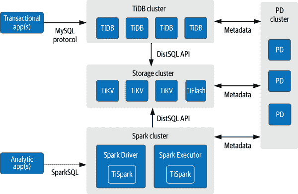
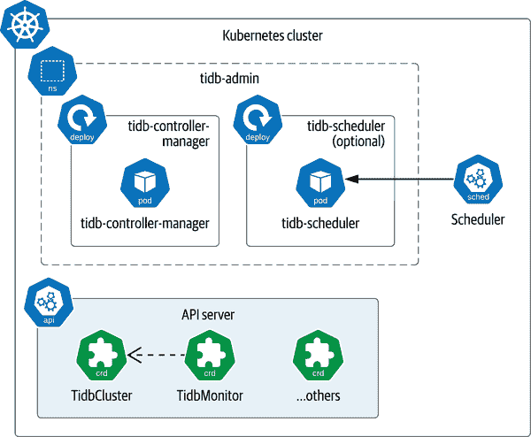
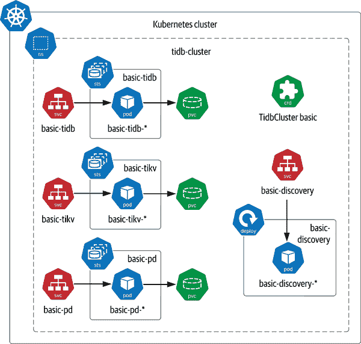
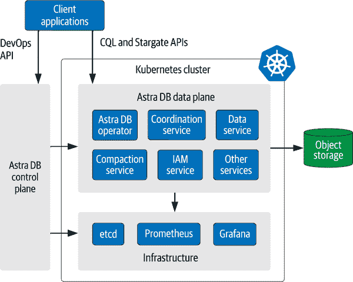
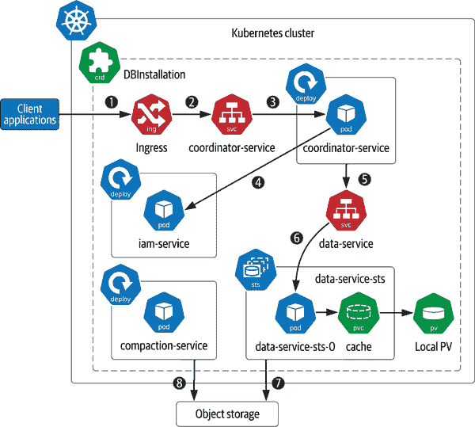
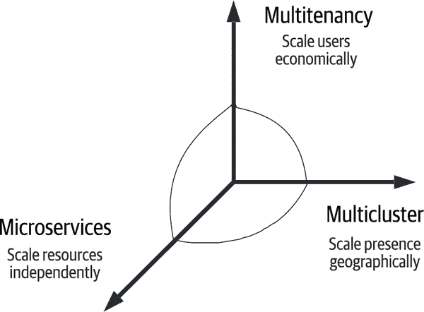

# 第七章：Kubernetes 原生数据库

软件行业充斥着用一个单词或短语定义主要趋势的术语。你可以在本书的标题中看到其中之一：*云原生*。另一个例子是 *微服务*，这是一种主要的架构范式，涉及我们在这里讨论的大部分技术。最近，出现了像 *Kubernetes 原生* 和 *无服务器* 这样的术语。

尽管简洁而引人注目，将一个复杂的主题或趋势归纳为一个单一的声音留下了模糊的空间，或者至少是一些合理的问题，比如“这究竟是什么意思？”进一步混淆视听的是，像这些术语一样经常在营销产品的背景下使用，作为获取优势或与其他竞争产品区分开来的一种方式。无论你正在消费的内容是明确陈述还是仅仅是含蓄的，你可能会想知道，一个技术是否必须在 Kubernetes 上运行才能比其他提供更好，因为它被标记为 *Kubernetes 原生*。

当然，对于我们评估和选择适合我们应用程序的正确技术来说，这些术语是否对我们有用的真正任务是澄清它们实际含义，就像我们在第一章中对 *云原生数据* 这个术语所做的那样。在本章中，我们将探讨数据技术被定义为 Kubernetes 原生的含义，并看看是否能得出一个我们可以达成共识的定义。为此，我们将检视几个宣称拥有这些术语的项目，并推导出共同的原则：TiDB 和 Astra DB。准备好了吗？让我们深入了解吧！

# 为什么需要 Kubernetes 原生方法

首先，让我们讨论为什么首次提出了 Kubernetes 原生数据库的概念。直到本书的这一部分，我们专注于在 Kubernetes 上部署现有的数据库，包括 MySQL 和 Cassandra。这些都是在 Kubernetes 存在之前就存在并且经过时间验证的成熟数据库。它们拥有庞大的安装基础和用户社区，正因为有这样的投资，你可以理解为什么在 Kubernetes 环境中运行这些数据库有如此大的激励，并且为什么有兴趣创建操作员来自动化它们。

与此同时，你可能已经注意到将这些数据库适应 Kubernetes 的一些尴尬之处。虽然通过改变挂载路径简单地将数据库指向基于 Kubernetes 的存储相对直接，但更紧密地集成 Kubernetes 来管理由多个节点组成的数据库可能会更复杂一些。这可以从相对简单的任务开始，比如在 Pod 中部署传统的管理 UI 并公开对 HTTP 端口的访问，到我们在第六章中看到的更复杂的部署 sidecar 以提供管理和指标收集的 API。

对这种复杂性的认识促使一些创新者从一开始就设计成 Kubernetes 原生的新数据库。在数据库行业中，有一个广为人知的公理是，一个新的数据库引擎需要 5 到 10 年的时间才能达到成熟阶段。因此，这些 Kubernetes 原生的数据库通常不是全新的实现，而是将现有数据库重构为可以独立扩展的微服务，同时保持与开发人员熟悉的现有 API 的兼容性。因此，将单体应用分解的趋势已经到达了数据层。新一代的数据库将基于新的架构来真正利用 Kubernetes 的优势。

为了帮助我们评估这些新数据库是否符合 Kubernetes 原生的标准，让我们使用“云原生数据基础设施原则”中介绍的云原生数据原则作为指南，制定一些问题来询问数据库与 Kubernetes 的交互方式：

原则 1：将计算、网络和存储作为商品 API 利用

数据库如何使用 Kubernetes 计算资源（Pods、Deployments、StatefulSets）、网络资源（Services 和 Ingress）以及存储资源（PersistentVolumes、PersistentVolumeClaims、StorageClasses）？

原则 2：分离控制平面和数据平面

数据库是否由 operator 部署和管理？它定义了哪些自定义资源？除了 operator 外，控制平面中是否还有其他工作负载？

原则 3：简化可观察性

架构中的各种服务如何暴露指标和日志，以便 Kubernetes 控制平面和第三方扩展进行收集？

原则 4：使默认配置安全

数据库和相关的 operator 是否使用 Kubernetes Secrets 共享凭据，并使用 Roles 和 RoleBindings 来管理角色访问？服务是否尽量减少暴露点的数量，并要求对其进行安全访问？

原则 5：优先使用声明式配置

扩展原则 2，数据库是否完全可以通过创建、更新或删除 Helm charts 和 Kubernetes 资源（无论是内置还是自定义资源）来管理，或者是否需要其他工具？

在接下来的章节中，我们将探讨两个数据库的答案，并了解关于什么是 Kubernetes 原生的更多信息。这将帮助我们在本章末尾制定一个清单，以帮助巩固我们的定义。（参见“在 Kubernetes 原生数据库中寻找什么”关于我们得出的内容。）

# 使用 TiDB 实现规模化的混合数据访问

到目前为止，本书中大部分关注的数据库代表了数据库架构中的两大主要趋势，这些趋势可以追溯到数十年甚至更久以前。MySQL 是一种关系数据库，提供其自己的 SQL 标准查询语言，这些规则是 Edgar Codd 在 1970 年代开发的。

在 21 世纪初，构建网络规模应用的公司开始挑战当时关系数据库的极限。随着数据库规模超过单一实例的可管理范围，诸如分片等技术开始用于跨多个实例的扩展。这些技术经常昂贵、难以操作，并且不总是可靠。

作为对这一需求的响应，Cassandra 和其他所谓的*NoSQL*数据库在一个充满创新和实验的时期出现。这些数据库通过增加额外节点实现线性扩展性。它们提供不同的数据模型或数据表示方式，例如 Redis 的键值存储、MongoDB 的文档数据库、Neo4j 的图数据库以及其他类型。NoSQL 数据库往往提供较弱的一致性保证，并省略了对像事务和连接这样的更复杂行为的支持，以实现高性能和可用性的规模化，这是 Eric Brewer 在他的[CAP 定理](https://oreil.ly/aJq6M)中记录的一种权衡。

由于开发者对传统关系型语义（如强一致性、事务和连接）的需求持续存在，从 2012 年开始，多个团队开始重新支持在分布式数据库中实现这些功能的想法。这些所谓的*NewSQL*数据库基于更高效和性能更好的共识算法。两篇关键论文推动了 NewSQL 运动的出现。首先是[Calvin 论文](https://oreil.ly/HLw2M)，引入了一个全局共识协议，这代表了一种更可靠和高效的方法，用于保证强一致性，并被 FaunaDB 和其他数据库后来采纳。其次是 Google 的[Spanner 论文](https://oreil.ly/zDl5z)，介绍了一种使用分片和新共识算法设计的分布式关系数据库，利用云基础设施提供跨数据中心时间同步的能力，这种方法除了 Google Spanner 外，还被 CockroachDB 和 YugabyteDB 等数据库实现。

# 更多关于一致性与共识的内容

虽然本书篇幅有限，无法深入讨论各种共识算法之间的权衡及其如何用于提供各种数据一致性保证，但理解这些概念有助于选择适合云应用程序的正确数据基础架构。如果您对这个领域有兴趣，Martin Kleppmann 的《*设计数据密集型应用*》（[O'Reilly](https://oreil.ly/6ndic)）是一个很好的资源，特别是第九章“一致性与共识”。

[TiDB](https://oreil.ly/jZNAI)（其中*Ti*代表*钛*）代表着云原生空间中 NewSQL 趋势的延续。TiDB 是一个开源的、兼容 MySQL 的数据库，支持事务和分析工作负载。它最初由 PingCAP 开发，并得到主要支持。虽然 TiDB 是一个旨在体现可扩展性和弹性的云原生数据库，但特别引人注目的是它明确设计为在 Kubernetes 上运行，并依赖于 Kubernetes 控制平面提供的功能。因此，可以说 TiDB 不仅仅是一个 Kubernetes 原生数据库，还是一个 Kubernetes *专属*数据库。让我们深入了解细节。

## TiDB 架构

TiDB 的一个关键特征是其能够支持事务和分析工作负载，这使其与本书中迄今为止我们审查过的其他数据库有所区别。这种方法被称为*混合事务/分析处理（HTAP）*，支持两种类型的查询，而无需单独的抽取、转换和加载（ETL）过程。如图 7-1 所示，TiDB 通过在底层提供两个数据库引擎来实现这一点：TiKV 和 TiFlash。这种方法受到 Google 的[F1 项目](https://oreil.ly/lakAf)的启发，该项目是建立在 Spanner 之上的一层。



###### 图 7-1\. TiDB 架构

使 TiDB 具有云原生架构的一个关键方面是将计算和存储操作打包成单独的组件，每个组件由独立可伸缩的服务组成，并组织成集群。让我们详细探讨每个组件的角色：

TiDB

每个 TiDB 实例是一个无状态的服务，向客户端应用程序暴露一个 MySQL 端点。TiDB 解析传入的 SQL 请求，并使用来自 Placement Driver（PD）的元数据创建执行计划，包含对存储集群中特定 TiKV 和 TiFlash 节点的查询。TiDB 执行这些查询，组装结果，并返回给客户端应用程序。TiDB 集群通常部署在代理之前，以提供负载均衡。

TiKV

存储集群由 TiKV 和 TiFlash 节点的混合组成。首先，让我们来看看[*TiKV*](https://tikv.org)，这是一个开源的、分布式键值数据库，使用[RocksDB](http://rocksdb.org)作为其后端存储引擎。TiKV 暴露一个自定义的分布式 SQL API，TiDB 节点使用它来执行存储和检索数据以及管理分布式事务的查询。TiKV 存储您的数据的多个副本，通常至少三个，以支持高可用性和自动故障转移。TiKV 是一个[CNCF 毕业项目](https://oreil.ly/ypLlC)，可以独立于 TiDB 使用，我们稍后将讨论这一点。

TiFlash

存储集群还包括 TiFlash 节点，数据写入时从 TiKV 节点复制到这些节点。TiFlash 是基于开源 [ClickHouse 分析数据库](https://oreil.ly/PCVlg) 的列式数据库，这意味着它将数据存储按列而不是行进行组织。列式数据库在需要跨多行提取同一列的分析查询中可以提供显著的性能优势。

TiSpark

此库专为 Apache Spark 构建，以支持复杂的 OLAP 查询。TiSpark 与 Spark Driver 和 Spark Executors 集成，通过分布式 SQL API 从 TiFlash 实例中摄取数据。我们将在第九章 中详细讨论 Spark 架构和在 Kubernetes 上部署 Spark 的细节。

Placement Driver（PD）

PD 管理 TiDB 安装的元数据。PD 实例部署在至少三个节点的集群中。TiDB 使用基于范围的分片机制，每个表中的键被划分为称为*region*的范围。PD 负责确定分配给每个 region 的数据范围，以及存储每个 region 数据的 TiKV 节点。它监视每个 region 中的数据量，并在 region 变得过大时拆分 region 以便扩展，并合并较小的 region 以缩小规模。

因为 TiDB 架构由各组件之间的明确定义接口组成，它是一种可扩展的架构，可以在其中插入不同的部件。例如，TiKV 提供了分布式键值存储解决方案，可以在其他应用程序中重用。[TiPrometheus 项目](https://oreil.ly/PkmqK) 就是一个示例，它在 TiKV 之上提供了符合 Prometheus 的计算层。另一个例子是，您可以提供 TiKV 的另一个实现，该实现在不同的存储引擎上实现了分布式 SQL API。

# 可插拔存储引擎

到目前为止，在本章中，我们多次提到“存储引擎”或“数据库引擎”。这个术语指的是数据库的一部分，负责在持久介质上管理数据的存储和检索。在分布式数据库中，通常区分存储引擎和位于其上的代理层，代理层用于管理节点之间的数据复制。来自 [*设计数据密集型应用*](https://oreil.ly/6ndic) 的第三章“存储和检索”包括对存储引擎类型的讨论，例如大多数关系数据库中使用的 B 树，以及 Apache Cassandra 和其他 NoSQL 数据库中使用的日志结构合并树（LSM 树）。

TiDB 的一个有趣之处在于它如何重用现有技术。我们已经在使用组件如 RocksDB 和 Spark 的示例中看到了这一点。TiDB 还使用其他组织开发的算法。以下是几个例子：

Raft 共识协议

在 TiDB 层面，使用 [Raft 共识协议](https://oreil.ly/Oi6Dk) 管理副本之间的一致性。Raft 在行为上类似于 Cassandra 使用的 Paxos 算法，但其设计更简单易学。TiDB 为每个区域使用一个单独的 Raft 组，其中一个组通常包含一个领导者和两个或更多个副本。如果丢失领导节点，则会运行选举来选择新的领导者，并且可以添加新的副本以确保所需的副本数。此外，TiFlash 节点被配置为一种特殊类型的副本，称为 *learner replicas*。数据从 TiDB 节点复制到 learner replicas，但它们不能被选为领导者。您可以在 [PingCAP 博客](https://oreil.ly/Y2YuS) 上进一步了解 TiDB 如何利用 Raft 实现高可用性及其他相关主题。

Percolator 事务管理

在 TiDB 层面，使用 [Percolator 算法](https://oreil.ly/heMho) 实现支持分布式事务，该算法进行了 TiDB 项目特定的优化。Percolator 最初由 Google 开发，用于支持对搜索索引的增量更新。

本章我们提出的一个论点是，数据基础设施成为云原生的一部分，意味着尽可能地组合现有的 API、服务和算法，TiDB 就是一个很好的例子。

## 在 Kubernetes 中部署 TiDB

虽然 TiDB 可以通过裸机和虚拟机等多种方式部署，但 TiDB 团队已经投入大量精力在工具和文档上，使 TiDB 成为真正的 Kubernetes 本地数据库。[TiDB Operator](https://oreil.ly/xZtGq) 管理 Kubernetes 中的 TiDB 集群，包括部署、升级、扩展、备份和恢复等操作。

操作员的 [文档](https://oreil.ly/iIZc0) 提供了桌面 Kubernetes 发行版（如 kind、minikube 和 Google Kubernetes Engine (GKE)）的 [快速入门指南](https://oreil.ly/5heDA)。这些说明将引导您完成包括使用 Helm 安装 CRDs 和 TiDB 操作员，以及包括监控服务的简单 TiDB 集群的步骤。我们将使用这些快速入门说明来介绍 TiDB 成为 Kubernetes 本地数据库的特点。

### 安装 TiDB CRDs

确保拥有符合定义先决条件的 Kubernetes 集群，例如拥有 [默认的 StorageClass](https://oreil.ly/7myfI)，使用操作员部署 TiDB 的第一步是安装操作员使用的 CRDs。可以通过类似以下的指令完成此操作（请注意实际的操作员版本号 `v1.3.2` 可能会有所不同）：

```
set GH_LINK=https://raw.githubusercontent.com
kubectl create -f \
  $GH_LINK/pingcap/tidb-operator/v1.3.2/manifests/crd.yaml
```

这导致创建了多个 CRDs，您可以通过运行 `kubectl get crd` 命令来观察这些 CRD，就像我们在前面的章节中所做的那样。我们将快速讨论每个资源的目的，因为其中几个资源暗示了其他感兴趣的功能：

+   TidbCluster 是描述 TiDB 集群所需配置的主要资源。稍后我们将看一个示例。

+   TidbMonitor 资源用于部署基于 Prometheus 的监控堆栈，以观察一个或多个 TidbCluster。正如我们在其他项目中所见，Prometheus（或其 API）已成为在 Kubernetes 上部署的数据库和其他基础设施的度量收集的事实标准。

+   备份和恢复资源表示执行备份或从备份中恢复的操作。这类似于我们之前从 Vitess（参见“PlanetScale Vitess Operator”）和 K8ssandra（第六章）项目中研究过的其他操作器。TiDB Operator 还提供了 BackupSchedule 资源，可用于配置定期备份。

+   TidbInitializer 是一个可选资源，您可以创建它来执行[TidbCluster 上的初始化任务](https://oreil.ly/qFsmu)，包括设置管理员凭据并执行用于架构创建或初始数据加载的 SQL 语句。

+   TidbClusterAutoScaler 是另一个可选资源，用于配置 TidbCluster 的[自动扩展行为](https://oreil.ly/wVbf2)。可以根据 CPU 利用率配置 TidbCluster 中 TiKV 或 TiDB 节点的最小和最大限制进行扩展。基于其他指标的扩展规则的添加已包含在项目路线图中。正如我们在“选择运算符”中讨论的那样，自动缩放被认为是运算符的 Level 5 或 Autopilot 功能，是最高成熟度级别的特性。

+   TidbNGMonitoring 是一个可选资源，配置 TidbCluster 以启用[连续剖析](https://oreil.ly/2n8k5)，可以达到系统调用级别。产生的剖析数据和火焰图可通过单独部署的[TiDB 仪表盘](https://oreil.ly/23pLs)进行观察。通常由项目工程师用于优化数据库，但应用和平台开发人员也可能会发现其有用。

+   DMCluster 资源用于部署 TiDB 数据迁移（DM）平台的一个实例，支持将 MySQL 和 MariaDB 数据库实例迁移到 TidbCluster。还可以配置从在 Kubernetes 外部现有的 TiDB 安装迁移到 TidbCluster。在由同一运算符管理的 Kubernetes 中部署数据迁移服务与目标 TidbCluster 并行的能力，是在 Kubernetes 中开发数据生态系统的一个极好的示例，这是我们希望在未来看到更多的模式。

在本节的其余部分，我们将重点关注 TidbCluster 和 TidbMonitoring 资源。

### 安装 TiDB Operator

安装完 CRD 后，下一步是使用 Helm 安装 TiDB Operator。在安装 TiDB Operator 到其自己的命名空间之前，您需要先添加 Helm 仓库：

```
helm repo add pingcap https://charts.pingcap.org
helm install –create-namespace --namespace tidb-admin tidb-operator \
  pingcap/tidb-operator --version v1.3.2
```

您可以使用 `kubectl get pods` 命令并引用 `tidb-admin` 命名空间来监视生成的 Pod。第 7-2 图 概述了到目前为止安装的元素。这包括用于管理 TiDB Operator（标记为 `tidb-controller-manager`）和 TiDB 调度器的部署。

TiDB 调度器是 Kubernetes 内置调度器的可选扩展。虽然它作为 TiDB Operator 的一部分默认部署，但可以禁用。假设未禁用 TiDB 调度器，仍需要通过将 `schedulerName` 属性设置为 `tidb-scheduler` 来选择使用它来为特定的 TidbCluster 进行调度。如果设置了此属性，TiDB Operator 将分配 TiDB 调度器作为 Kubernetes 创建 TiKV 和 PD Pod 时使用的调度器。

TiDB 调度器扩展了 Kubernetes 内置调度器，为 TidbCluster 中的 Pod 添加自定义调度规则，帮助实现数据库的高可用性，并在 Kubernetes 集群中的可用 Worker 节点上均匀分布负载。对于许多基础设施类型来说，Kubernetes 提供的影响默认调度器的现有机制，如亲和规则、污点和容忍度，已经足够使用。但 TiDB 提供了一个有用的例子，说明了何时以及如何实现自定义调度逻辑。我们将在第 9 章中详细讨论 Kubernetes 调度器的扩展。第 9 章 提供了更详细的信息。



###### 第 7-2 图。安装 TiDB Operator 和 CRD

# TiDB Operator Helm 图选项

此安装未使用 *values.yaml* 文件，但您可以通过运行以下命令查看可用选项：

```
helm show values pingcap/tidb-operator
```

这包括禁用 TiDB 调度器的选项。

### 创建 TidbCluster

安装完 TiDB Operator 后，您就可以准备创建 TidbCluster 资源了。虽然 TiDB Operator GitHub 存储库中提供了许多 [示例配置](https://oreil.ly/66uf7)，但让我们使用快速入门指南中引用的配置。

```
set GH_LINK=https://raw.githubusercontent.com
kubectl create namespace tidb-cluster
kubectl -n tidb-cluster apply -f \
  $GH_LINK/pingcap/tidb-operator/master/examples/basic/tidb-cluster.yaml
```

在创建 TidbCluster 的过程中，您可以引用此文件的内容，看起来类似于这样（删除了一些注释和细节）：

```
apiVersion: pingcap.com/v1alpha1
kind: TidbCluster
metadata:
  name: basic
spec:
  version: v5.4.0
  ...
  pd:
    baseImage: pingcap/pd
    maxFailoverCount: 0
    replicas: 1
    requests:
      storage: "1Gi"
    config: {}
  tikv:
    baseImage: pingcap/tikv
    maxFailoverCount: 0
    evictLeaderTimeout: 1m
    replicas: 1
    requests:
      storage: "1Gi"
    config:
      ...
  tidb:
    baseImage: pingcap/tidb
    maxFailoverCount: 0
    replicas: 1
    service:
      type: ClusterIP
    config: {}
```

注意，这将在 `tidb-cluster` 命名空间中创建一个名为 `basic` 的 TidbCluster，其中包括 TiDB、TiKV 和 PD 每个一个副本，使用标准的 PingCAP 镜像。还使用了其他选项来指定实现功能集群所需的最小计算和存储资源量。此简单配置不包括 TiFlash 节点。

# TidbCluster API

您可以在 GitHub 存储库中的[API](https://oreil.ly/XoC02)中找到 TidbCluster 的完整选项列表。同一页还包括 TiDB Operator 使用的其他 CRD 的选项。当您探索这些 CRD 的选项时，您会看到允许覆盖许多用于指定底层资源的选项的常见做法（例如，在部署中设置的 Pod 规范）的证据。

我们鼓励您利用`kubectl`或您喜欢的可视化工具，探索作为 TidbCluster 一部分创建的资源。这些资源的摘要在图 7-3 中提供。



###### 图 7-3\. 一个基本的 TidbCluster

正如您所见，TiDB Operator 创建了 StatefulSets 来管理 TiDB、TiKV 和 Placement Driver 实例，并为每个实例分配了 PVC。作为一个 I/O 密集型应用程序，默认配置是使用本地 PersistentVolumes 作为后备存储。

此外，还创建了一个 Deployment 来运行 Discovery Service，各个组件使用该服务来了解彼此的位置。Discovery Service 在本书中我们检查的其他数据技术中扮演了类似于 etcd 的角色。TiDB Operator 还为每个 StatefulSet 和 Deployment 配置了服务，以促进 TiDB 集群内部的通信，并向外部客户端公开功能。

TiDB Operator 支持部署 Prometheus 监控堆栈，可以管理一个或多个 TiDB 集群。您可以使用以下命令向先前创建的集群添加监控：

```
set GH_LINK=https://raw.githubusercontent.com
kubectl -n tidb-cluster apply -f \
  $GH_LINK/pingcap/tidb-operator/master/examples/basic/tidb-monitor.yaml
```

在部署过程中，让我们来查看*tidb-monitor.yaml*配置文件的内容：

```
apiVersion: pingcap.com/v1alpha1
kind: TidbMonitor
metadata:
  name: basic
spec:
  replicas: 1
  clusters:
  - name: basic
  prometheus:
    baseImage: prom/prometheus
    version: v2.27.1
  grafana:
    baseImage: grafana/grafana
    version: 7.5.11
  initializer:
    baseImage: pingcap/tidb-monitor-initializer
    version: v5.4.0
  reloader:
    baseImage: pingcap/tidb-monitor-reloader
    version: v1.0.1
  prometheusReloader:
    baseImage: quay.io/prometheus-operator/prometheus-config-reloader
    version: v0.49.0
  imagePullPolicy: IfNotPresent
```

正如您所见，TidbMonitor 资源可以指向一个或多个 TidbCluster。该 TidbMonitor 配置为管理您之前创建的`basic`集群。TidbMonitor 资源还允许您指定用于初始化和更新监控堆栈的 Prometheus、Grafana 和其他工具的版本。如果您检查`tidb-cluster`命名空间的内容，您将看到已创建用于管理这些元素的附加工作负载。

TiDB 与 K8ssandra 项目类似地使用 Prometheus 堆栈，正如我们在“使用 Prometheus 和 Grafana 实现统一监控基础设施”中讨论的那样。在这两个项目中，Prometheus 堆栈作为可选扩展得到支持，以提供您可以通过极少的定制即可使用的监控功能。配置和提供的可视化重点关注于驱动数据库健康意识的关键指标。即使您已经管理自己的监控基础设施或使用第三方软件即服务（SaaS）解决方案，这些配置和图表也可以帮助您快速整合数据库监控到您的可观察性方法中。

正如你所见，TiDB 是一个具有灵活可扩展架构的数据库，设计时考虑了云原生原则。它还倾向于能够在 Kubernetes 中有效部署和管理数据库，并为我们提供了一些有价值的见解，说明了什么是 Kubernetes 原生。有关诸如[部署到多个 Kubernetes 集群](https://oreil.ly/NPHxy)等功能的更多信息，请参阅 TiDB 文档。

# 使用 DataStax Astra DB 的无服务器 Cassandra。

自 21 世纪初云计算的出现以来，公共云提供商和基础设施供应商不断推进将我们架构堆栈的各个层次作为服务提供的商品化进程。这一趋势始于提供计算、网络和存储作为基础设施即服务（IaaS），并进一步涵盖其他趋势，包括平台即服务（PaaS）、软件即服务（SaaS）和函数即服务（FaaS），有时与无服务器（serverless）术语混淆。

在这里我们调查最相关的是所谓的*数据库即服务*（DBaaS）的托管数据基础设施提供的出现。该类别包括以下内容：

+   传统数据库作为托管云服务提供，例如亚马逊关系型数据库服务（RDS）和 PlanetScale。

+   仅作为云服务提供的云数据库，如 Google BigTable、Amazon Dynamo 和 Snowflake。

+   可在开源或源代码可用许可下也可以在本地运行的托管 NoSQL 或 NewSQL 数据库，例如 MongoDB Atlas、DataStax Astra DB、TiDB 和 Cockroach DB。

在过去的几年中，许多提供 DBaaS 服务的供应商已经开始迁移到 Kubernetes，以自动化操作，更有效地管理计算资源，并使他们的解决方案在不同云之间可移植。DataStax 是几家开始提供 Cassandra 服务的供应商之一。这些供应商通常使用基于在云环境中运行传统 Cassandra 集群的架构，使用各种“胶水代码”来集成网络、监控和管理等方面，这些并不完全适合目标部署环境，如 Kubernetes 和公共云 IaaS。这些技术包括使用 Sidecar 收集指标和日志，或使用 StatefulSets 部署 Cassandra 节点以有序地进行扩展和缩减。

即使使用这些在 Kubernetes 中运行的变通方法，Cassandra 的单体架构并不容易促进计算和存储的分离，这可能在扩展时造成一些尴尬。通过添加额外的节点来扩展 Cassandra 集群，每个节点都具有以下功能：

协调

接收读取和写入请求，并根据需要转发到其他节点以达到所需的副本数量（也称为*一致性级别*）

写入和读取

将数据写入内存缓存（memtables）和持久存储（SSTables），并根据需要读取回来

压缩和修复

由于 Cassandra 是 LSM 树数据库，一旦数据写入持久存储，就不会更新数据文件。压缩和修复是作为独立线程后台运行的任务。压缩通过合并不同时间写入的 SSTables 来帮助 Cassandra 保持高性能，忽略过时和已删除的值。修复是跨节点比较存储值以确保一致性的过程。

Cassandra 集群中的每个节点都实现了所有这些功能，并消耗等效的计算和存储资源。这使得独立扩展计算和存储变得困难，并可能导致集群在计算或存储资源上过度配置的情况。

在 2021 年，DataStax 发表了一篇名为[“DataStax Astra DB: 设计为无服务器云原生数据库即服务的数据库”](https://oreil.ly/yHSxz)的论文，描述了一种不同的方法。*Astra DB*是 Cassandra 的一个版本，经过重构为微服务，以实现更精细的可扩展性，并利用 Kubernetes 的优势。事实上，Astra DB 不仅仅是 Kubernetes 原生的；它本质上是一种仅适用于 Kubernetes 的数据库。图 7-4 展示了 Astra DB 架构的高层次视图，分为控制平面、数据平面和支持基础设施。



###### 图 7-4\. Astra DB 架构

让我们快速概述一下这个架构中的各层：

Astra DB 的控制平面

控制平面负责在各种云提供商区域中提供 Kubernetes 集群。它还在这些 Kubernetes 集群中配置 Astra DB 集群，并提供 API，允许客户端通过 Astra DB Web 应用程序或通过 DevOps API 编程方式创建和管理数据库。Jim Dickinson 的博文 [“我们如何构建 DataStax Astra DB 控制平面”](https://oreil.ly/jhU2Q) 描述了控制平面的架构以及如何迁移到 Kubernetes 原生。

Astra DB 数据平面

数据平面是实际运行 Astra DB 数据库的地方。数据平面由多个微服务组成，这些微服务共同提供了原本作为单个单片式 Cassandra 节点一部分的功能。每个数据库都部署在专用的 Kubernetes Namespace 中的 Kubernetes 集群中，并且可以跨多个租户共享，稍后会详细描述。

Astra DB 基础设施

每个 Kubernetes 集群还包含一组基础设施组件，这些组件在该集群中的所有 Astra DB 数据库之间共享，包括 etcd、Prometheus 和 Grafana。etcd 用于存储元数据，包括将租户分配给数据库和每个租户的数据库架构。它还存储有关集群拓扑的信息，取代了传统 Cassandra 架构中的 gossip 角色。Prometheus 和 Grafana 的部署方式与本书中其他架构中描述的方式类似。

现在让我们深入了解数据平面中的几个微服务：

Astra DB Operator

Astra DB Operator 通过管理每个数据库实例所需的 Kubernetes 资源（如 DBInstallation 自定义资源所描述的），如 图 7-5 所示。与我们在 “使用 Cass Operator 在 Kubernetes 中管理 Cassandra” 中讨论的 Cass Operator 项目类似，Astra DB Operator 自动化了许多与管理 Cassandra 集群相关的运维任务，这些任务通常由使用 *nodetool* 的运维人员执行。

Coordination Service

协调服务负责处理应用程序查询，包括读取、写入和模式管理。每个协调服务都是 Stargate 的一个实例（如 “使用 Stargate API 提升开发者生产力” 中讨论的），它公开了用于 CQL 和其他 API 的端点，具有专门的 Astra DB 插件，使其能够智能地将请求路由到 Data Service 实例以实际存储和检索数据。将这种计算密集型的路由功能分解为自己的微服务，可以根据查询流量的增减而独立地进行扩展。

数据服务

每个 Data Service 实例负责根据其在 Cassandra 令牌环中的位置管理每个分配租户的数据子集。Data Service 采用分层的数据存储方法，维护内存数据结构（如 memtables），使用本地磁盘进行缓存、提交日志和索引，并使用对象存储来长期保存 SSTable。对象存储的使用是 Astra DB 与迄今为止我们研究过的其他数据库的主要区别之一，我们将在本节中进一步探讨这种方法的其他好处。

压缩服务

Compaction Service 负责在对象存储中的 SSTable 上执行包括压缩和修复在内的维护任务。压缩和修复是计算密集型任务，历来由经验丰富的 Cassandra 操作员安排在非高峰时段以限制其对集群性能的影响。在 Astra DB 中，这些任务可以在任何需要时执行，而不会影响查询性能。工作由一个可以独立扩展的 Compaction Service 实例池处理，生成修复的、压缩的 SSTable，这些 SSTable 可以立即被 Data Services 访问。

IAM 服务

所有传入的应用程序请求都通过身份和访问管理（IAM）服务路由，该服务使用控制平面中定义的标准角色和权限集。尽管 Cassandra 长期以来一直具有可插拔的身份验证和授权架构，但将其分解为其自己的微服务可以提供更大的灵活性，并支持诸如 Okta 之类的其他提供者。

数据平面包括了在图 7-4 中出于简化而省略的其他服务，包括用于恢复失败的 Data Service 实例的 Commitlog Replayer Service，以及使用分析和机器学习建议操作员何时调整每个服务实例数量的 Autoscaling Service。

图 7-5 展示了在 Kubernetes 资源层面上典型的 DBInstallation 的样子。让我们逐个展示一些典型的交互，重点关注关键服务的各个实例，以演示每个资源如何发挥其作用。

每个集群配置了一个 Kubernetes Ingress 来管理来自客户应用程序的传入请求（1），并通过使用 Kubernetes Service（2）将请求路由到按租户使用的协调器服务。



###### 图 7-5\. Astra DB 在 Kubernetes 中的集群

协调器服务是由一个 Deployment 管理的无状态服务（3），它在每次调用时将身份验证和授权检查委托给 IAM 服务（4）。

授权请求然后根据租户路由到一个或多个 Data Services，再次使用 Kubernetes Service（5）。

数据服务使用 StatefulSets（6）进行管理，用于为每个实例分配本地 PersistentVolume，用于管理诸如提交日志等中间数据文件，该文件在写入时立即填充。在可能的情况下，从内存数据结构直接提供读取。

与 Cassandra 和其他 LSM 树存储引擎一样，数据服务偶尔会将 SSTable 文件写入持久存储（7）。对于 Astra DB 来说，该持久存储是由云提供商管理的外部对象存储，以实现高可用性。为了确保数据隐私，每个租户使用单独的对象存储桶。

补偿服务可以异步地在对象存储中对 SSTable 执行压缩和修复（8），不会对写入和读取查询产生影响。

Astra DB 还支持多区域数据库集群，其定义跨越多个 Kubernetes 集群。协调器和数据服务部署在数据中心（云区域）和机架（可用区），使用与 K8ssandra 中描述的类似方法，如在“在 Kubernetes 中部署多集群应用程序”中所述。

Astra DB 的微服务架构使其能够更优化地利用计算和存储资源，并隔离计算密集型操作，从而节省云中操作 Cassandra 集群的总体成本。通过添加允许每个集群跨多个租户共享的多租户功能，这些成本节省得以延伸。[Astra DB 白皮书](https://oreil.ly/Zq0yc)描述了一种称为*shuffle sharding*的技术，该技术用于将每个租户与可用的协调器和数据服务子集匹配，有效地为每个租户创建一个单独的 Cassandra 令牌环。随着 Astra DB 实例中租户的增加，可以轻松更新此拓扑以重新平衡负载而无需停机，并且可以配置较大的租户使用他们自己的专用数据库（DBInstallations）。此方法最小化成本同时满足性能和可用性 SLA。

在本节中，我们专注于 Astra DB 用于提供多租户、无服务器 Cassandra 的架构，该架构融合了云原生和 Kubernetes 原生原则，使用完全不同的部署风格。这延续了亚马逊 Dynamo 和谷歌 BigTable 论文的传统，在公开讨论新型数据库架构方面产生了广泛的讨论。此外，本书中提到的几个开源项目，包括 Cass Operator、K8ssandra 和 Stargate，都源于 Astra DB。在核心数据库、控制平面、变更数据捕获、流集成、数据迁移等领域，正在进行大量创新，因此请期待未来该团队更多的开源贡献和架构提案。

# 在 Kubernetes 原生数据库中需要关注的内容

在过去几章中所学的关于在 Kubernetes 上部署和管理各种数据库所需的一切之后，我们处于一个很好的位置来定义您在 Kubernetes 原生数据库中应寻找的内容。

## 基本要求

遵循我们的云原生数据原则，以下是应考虑的一些基本要求：

充分利用 Kubernetes API

数据库应尽可能与 Kubernetes API 紧密集成（例如，使用持久卷用于本地和远程存储，使用服务进行路由而不是维护其他节点 IP 列表等）。应使用第五章中描述的 Kubernetes 扩展点来补充内置的 Kubernetes 功能。

在某些领域，现有的 Kubernetes API 可能无法提供给定数据库或其他应用程序所需的确切行为，正如 Vitess 和 TiDB 项目创建备用 StatefulSet 实现所示。在这些情况下，应尽一切努力将改进捐赠回 Kubernetes 项目。

通过操作员进行自动化的声明式管理

应使用操作员和自定义资源在 Kubernetes 上部署和管理数据库。操作员应作为管理数据库的主要控制平面元素。虽然拥有允许 DBA 手动干预以优化数据库性能和解决问题的命令行工具或 `kubectl` 扩展可能是有帮助的，但这些功能最终应由操作员执行，因为它实现了第五章中讨论的更高成熟度水平。

目标应该是通过更新自定义资源中的所需状态并让操作员处理其余部分来完成对数据库的所有必需更改。当我们能够根据诸如延迟、吞吐量、可用性和单位成本等服务级目标配置数据库时，我们将处于一个很好的位置。操作员可以确定需要多少个数据库节点，使用什么计算和存储层级，何时执行备份等。

可通过标准 API 进行观察

我们开始看到关于 Kubernetes 上数据基础设施的可观察性的共同期望，涉及度量、日志和跟踪的熟悉三元组。Prometheus-Grafana 堆栈在度量收集和可视化方面已成为事实上的标准，数据库服务使用 Prometheus 格式暴露指标作为最低标准。提供 Prometheus 集成的项目应具有足够的灵活性，可以提供其自己的专用堆栈，或将指标推送到与其他应用程序共享的现有安装。

所有数据库应用程序容器的日志应通过侧车（如果必要）推送到标准输出(stdout)，以便日志聚合服务收集。虽然对于追踪可能需要更长时间来被广泛采用，但通过 OpenTracing 等 API 追踪单个客户端请求通过应用程序调用到数据库层将是未来云原生应用程序极为强大的调试工具。

默认安全

Kubernetes 项目本身提供了一个很好的例子，说明了默认安全的含义——例如，只有在特别启用时才公开 Pods 和容器的端口访问，并提供像 Secrets 这样的原语，我们可以用来保护登录凭据或敏感配置数据的访问。

数据库和其他基础设施需要利用这些工具，并采用零信任的行业标准和最佳实践（包括更改默认管理员凭据），限制应用程序和管理 API 的暴露。暴露的 API 应优先使用诸如 HTTPS 之类的加密协议。存储在 PersistentVolumes 中的数据应该进行加密，无论是应用程序、数据库还是 StorageClass 提供者执行加密。审计日志应作为应用程序日志的一部分提供，特别是涉及配置用户访问的操作。

总结来说，Kubernetes 原生数据库与 Kubernetes 的工作方式相符。它最大化地重用了 Kubernetes 内置的能力，而不是带来自己的重复的支持基础设施。因此，使用 Kubernetes 原生数据库的体验非常类似于使用 Kubernetes 本身。

## Kubernetes 原生的未来

随着对于什么是 Kubernetes 原生的基本要求和更高级期望的巩固，接下来会发生什么？我们开始看到在部署 Kubernetes 上的数据库项目中出现的共同模式，这可能指向未来的发展方向。尽管这些模式有些模糊，但让我们试着把其中一些聚焦起来。

### 多维度架构下的可伸缩性

你可能已经注意到在过去几章中多次重复出现的一些术语，比如*多集群*、*多租户*、*微服务*和*无服务器*。这些术语的一个共同主题是它们代表了可伸缩性的架构方法，正如图 7-6 所示。



###### 图 7-6\. 多维度扩展架构方法

考虑每种方法如何为可伸缩性提供独立的轴线。在图 7-6 中的可视化展示了你的应用程序的影响，作为一个随着每个轴向扩展而增长的三维表面：

微服务架构

微服务架构将数据库的各种功能分解为独立可扩展的服务。无服务器方法基于此构建，鼓励将持久状态隔离到尽可能少的有状态服务或甚至外部服务。Kubernetes 持久卷子系统中的存储 API 使得可以利用本地和网络存储选项。这些趋势允许真正地分离计算和存储，并独立地扩展这些资源。

多集群

*多集群*指的是跨多个 Kubernetes 集群扩展应用程序的能力。与相关术语如*多区域*、*多数据中心*和*多云*一起，这意味着在可能是异构环境的多个地理位置扩展提供的功能。这种能力的分布对于在最小延迟、云提供商成本优化和灾难恢复方面满足用户需求具有积极的影响。正如我们在第六章中讨论的那样，Kubernetes 在跨集群网络和服务发现的支持上历史上并不是特别强大。值得关注的是，数据库和其他应用程序如何利用预期中的 Kubernetes 联合进步。

多租户

这是在多个用户之间共享基础设施的能力，以实现资源的最有效使用。正如公共云提供商在其 IaaS 提供中所展示的，多租户方法可以非常有效地为创新性新项目提供低成本、低风险的基础设施访问，并在这些应用程序增长时提供额外资源。在数据基础设施中采用多租户方法也具有很大的潜在价值，前提是安全保证得到适当满足，并且在它们成为“吵闹的邻居”之前，有一个无缝的过渡路径转向专用基础设施。在目前阶段，Kubernetes 并未提供明确的多租户支持，尽管命名空间可以是为特定用户提供专用资源的有用工具。

尽管你建立的应用程序或数据基础设施可能不立即需要这三个扩展性轴的全部，但考虑到在每个方面的增长如何可以增强你所提供的整体价值。

### 通过开源和云服务的社区重点创新

在我们的叙述中，您可能已经注意到的另一个模式是开源数据库项目和 DBaaS 产品之间的持续创新循环。PingCAP 采用了开源的 MySQL 和 ClickHouse 数据库，并利用 Kubernetes 创建了一个数据库服务，帮助其在规模上管理数据库，然后发布了包括 TiDB 和 TiFlash 在内的开源项目。DataStax 采用了开源的 Cassandra，将其分解为微服务，添加了 API 层，并在 Kubernetes 上部署了其 Astra DB，并创建了多个开源项目，包括 Cass Operator、K8ssandra 和 Stargate。这些公司在 Dynamo、BigTable、Calvin 等论文的精神中也开源了架构。

这种创新循环反映了更大的 Kubernetes 社区的情况，其中主要的云服务提供商和存储供应商帮助推动了核心 Kubernetes 控制平面和 PersistentVolume 子系统的成熟发展。有趣的是观察到，围绕云服务的创新循环中具有最高的动力和最快的周期，而不是围绕传统的开源项目企业版本的经典开放核心模型。

作为软件供应商，提供云服务使您能够更快地迭代和评估新架构和功能。将这些创新反馈到开源项目中，使您能够通过支持灵活的消费模型来增加采用率。对于客户来说，“自己运行”和“租用我们的服务”都成为了合法的部署选项，可以根据不同的使用案例灵活选择。客户可以对您的技术的整体成熟度和安全性充满信心，因为他们可以检查和贡献的开源版本与您在 DBaaS 中运行的基本相同。

这些创新趋势的最终副作用之一是对经过验证的架构和组件的隐性推动。考虑以下例子：

+   etcd 被用作我们在本书中多个项目中（包括 Vitess 和 Astra DB）的元数据存储。

+   TiDB 利用了 F1 的架构，实现了 Raft 一致性协议，并扩展了 ClickHouse 的列存储。

+   Astra DB 利用了 PersistentVolume 子系统和符合 S3 标准的对象存储。

而不是发明新技术来解决诸如元数据管理和分布式事务等问题，这些项目正在将创新投入到新功能、开发者体验和我们在本章中探讨过的可扩展性轴上。

# 摘要

在本章中，我们深入探讨了 TiDB 和 Astra DB，以找出它们成为 Kubernetes 本地化的特质。这项工作的目的是什么？我们希望这种分析能够提供更深入的理解，帮助消费者提出更具洞察力的关于所使用数据基础设施的问题，并帮助那些构建数据基础设施和生态系统的人创建能够满足这些期望的技术。我们相信，不仅是云原生而且是 Kubernetes 本地化的数据基础设施将为每个人带来最佳的性能、可用性和成本效益的结果。
