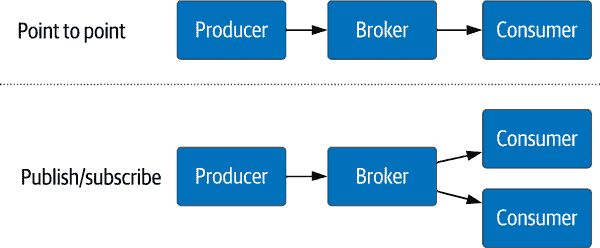
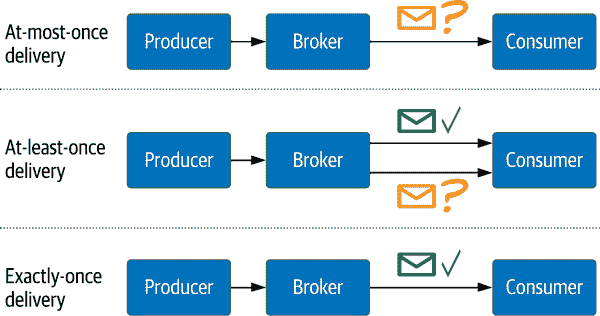
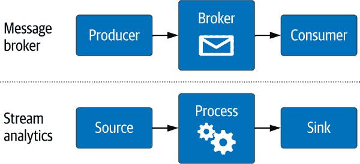
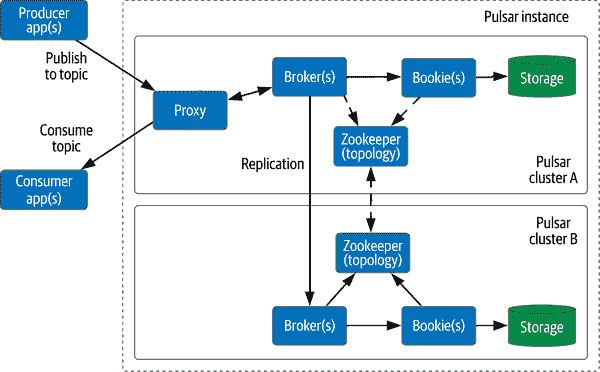
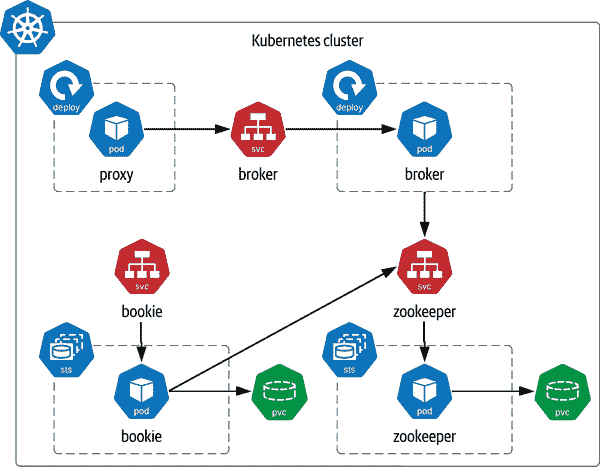
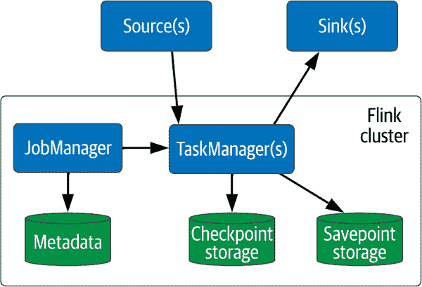
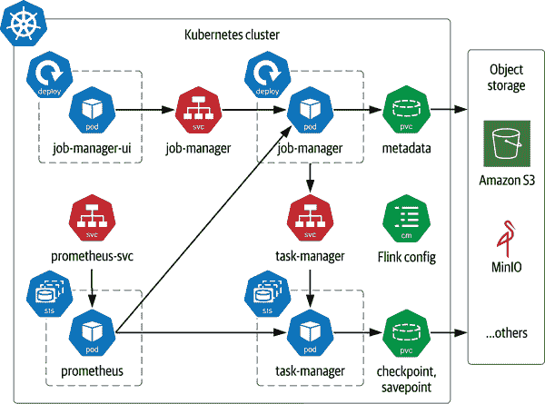
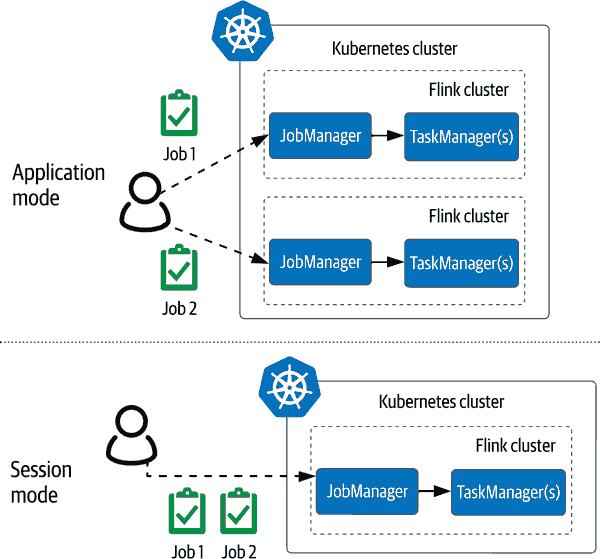

# 第八章：在 Kubernetes 上流式数据

当您考虑数据基础设施时，对于许多人来说，持久性是首先想到的事情——存储运行应用程序的状态。因此，到目前为止，我们的重点一直放在数据库和存储上。现在是时候考虑云原生数据堆栈的其他方面了。

对于那些管理数据管道的人来说，流媒体可能是您的起点，您的数据基础设施的其他部分则是次要关注点。无论起始点在哪里，数据移动都是整体数据堆栈的一个极其重要的部分。在本章中，我们将探讨如何在 Kubernetes 中使用流媒体技术来在您的云原生应用程序中安全可靠地共享数据。

# 流媒体简介

在第一章中，我们将*流媒体*定义为从一点移动数据到另一点，并且在某些情况下，在传输过程中处理数据的功能。流媒体的历史几乎与持久性的历史一样悠久。随着数据聚集在各种孤立存储中，显然将数据可靠地移动与可靠地存储数据同样重要。在那些日子里，这被称为*消息传递*。数据被缓慢但有序地传输，类似于邮政信件。消息基础设施将数据放置在一个地方，使其可以异步按顺序读取，并提供交付保证。在使用多台计算机时，这满足了一个关键需求，并成为分布式计算的基础之一。

现代应用程序需求已经从过去所谓的消息传递进化为今天的流媒体定义。通常，这意味着管理大量需要更快处理的数据，我们称之为*准实时*。在 Kubernetes 部署的分布式应用中，顺序和交付保证成为一个至关重要的特性，并且在许多情况下是必需的规模增长的关键推动因素。如何通过增加更多基础架构复杂性来帮助扩展？通过提供一种有序方式来管理数据的流动，从数据的创建到其可以使用和存储的地方。流通常不用作真实性的来源，但更重要的是，它们被用作真实性的*导管*。

对于初次使用者来说，围绕流媒体的软件和术语可能会令人困惑。与任何复杂话题一样，分解各部分有助于我们建立理解。在选择适合您使用情况的流媒体系统时，有三个评估区域：

+   交付类型

+   交付保证

+   流媒体的特性范围

让我们更详细地看看这些领域的每一个。

## 交付类型

要在您的应用程序中使用流处理，您需要了解从流处理系统的长列表中可用的传递方法。您需要根据应用程序的要求有效地规划从生产者到消费者的数据流动方式。例如，“我的消费者是否需要独占访问？”答案将决定哪种系统符合要求。图 8-1 展示了流处理系统中两种最常见的选择：点对点和发布/订阅：

点对点

在这个数据流中，由生产者创建的数据经过经纪人传递给单个消费者，实现一对一关系。这主要用作解耦直接生产者到消费者的连接的方法。它作为弹性的优秀特性，因为消费者可以随时添加或移除而不会丢失数据。同时，经纪人维护顺序和最后读取的消息，并且消费者可以通过偏移量进行寻址。

发布/订阅（pub/sub）

在这种传递方法中，经纪人充当单个生产者和一个或多个消费者的分发中心，实现一对多关系。消费者订阅主题，并接收生产者创建的任何新消息的通知——这是反应性或事件驱动架构的关键组成部分。



###### 图 8-1\. 传递类型

## 交付保证

结合传递类型，经纪人保证从生产者到消费者每种消息类型的交付保证，这种协议称为*合同*。典型的传递类型如图 8-2 所示：至多一次、至少一次和仅一次。该图展示了生产者发送消息和消费者接收消息预期之间的重要关系：

至多一次

最低保证用于避免由于分布式系统中可能发生的暂态错误而导致的任何潜在数据重复。例如，生产者可能在发送时超时。然而，消息可能刚刚通过而没有收到确认。在这种灰色区域中，为了避免重复数据，生产者不应尝试重新发送并继续进行是最安全的选择。需要理解的关键缺点是，由于设计原因可能会存在数据丢失的可能性。

At-least-once

这种保证是至多一次的反面。生产者创建的数据保证被消费者接收。新增的方面允许在第一次后任意次数重新传递。例如，这可能与唯一键（如日期戳或 ID 号）一起使用，在消费者端被认为是幂等的，多次处理不会影响它。消费者将始终看到生产者传递的数据，但可能会看到多次。您的应用程序需要考虑到这种可能性。

仅一次

这三种保证中最严格的一种意味着生产者创建的数据只会被送达给消费者一次——例如，在需要精确交易的场景下，如货币转移，需要确保减法或加法仅被传递和处理一次，以避免问题。这种保证让代理更难维护，因此您需要调整为代理分配的资源和您预期的吞吐量。



###### 图 8-2\. 交付保证

在为每种类型的消息选择交付保证时要小心。交付保证是需要仔细评估的，因为如果不完全理解，可能会对消费者造成意想不到的下游影响。诸如“我的应用程序能处理重复消息吗？”这样的问题需要一个好答案。“可能”是不够好的。

## 特性范围

许多流媒体技术都可以使用，其中一些已经存在了很多年。从表面上看，这些技术可能看起来相似，但每一种技术都因新的需求而解决不同的问题。其中大多数是开源项目，因此每个项目都有一群志同道合的人加入并推动项目的进展。就像许多不同的持久化数据存储适合于“数据库”的大伞下一样，“数据流”标题下的特性也可能有很大的差异。

特性范围很可能是评估要使用哪种流媒体技术时最重要的选择标准。但是，您还应该挑战自己，将适合 Kubernetes 的适用性作为一个标准，并考虑更复杂的特性是否值得增加的资源成本。幸运的是，第一次做出错误决策的代价相对较低。由于其短暂的特性，流数据系统往往是最容易迁移的。流媒体技术越深入您的功能堆栈，迁移就越困难。流媒体功能范围可以分为 图 8-3 中展示的两大类别：

消息代理

这是最简单的流媒体技术形式，可以通过一个或多个之前列出的传送方法和保证，方便地将数据从一个点移动到另一个点。很容易忽视这个功能的简单外观，但它是现代云原生应用的支柱。就像说联邦快递只是一个包裹送货公司一样，但是想象一下，如果它停止了一天，世界经济会发生什么？示例 OSS 消息代理包括 Apache Kafka、Apache Pulsar、RabbitMQ 和 Apache ActiveMQ。

流分析

在某些情况下，分析数据的最佳或唯一时机是在数据移动时。等待数据持久化然后开始分析可能太晚了，洞察的价值几乎是无用的。考虑欺诈检测。停止欺诈活动的唯一机会是在其发生时；等待报告第二天运行是行不通的。例如开源流分析系统包括 Apache 产品 Spark、Flink、Storm、Kafka Streams 和 Pulsar。



###### 图 8-3\. 流处理类型

# 流处理在 Kubernetes 中的角色

现在我们已经掌握了基本术语，那么流式处理如何适应运行在 Kubernetes 上的云原生应用程序呢？数据库应用程序遵循创建、读取、更新和删除（CRUD）模式。对于开发人员来说，数据库提供了一个数据的单一位置。添加流处理假设数据从一个地方到另一个地方有某种形式的运动。如果用于创建新数据，数据可能是短暂的。一些数据在传输过程中可能会被转换，有些最终可能会被持久化。流处理假设分布式架构，而扩展流处理系统的方法是管理计算、网络和存储的资源分配。这正好落入云原生架构的甜蜜点。在 Kubernetes 中基于流驱动的应用程序中，您需要管理数据在随时间变化的环境中的可靠流动。需要时分配所需资源。

# 流处理与数据工程

数据工程是一个相对新的并且快速增长的学科，因此我们要确保对其进行定义。这特别适用于数据流处理的实践。数据工程师关注于在复杂环境中高效地移动数据。在这种情况下，两个 T 很重要：传输和转换。数据科学家的角色是从数据中提取含义和洞察力。相比之下，数据工程师正在构建从各种位置收集数据、组织数据，并且在大多数情况下持久化到类似数据湖的管道。数据工程师与应用程序开发人员和数据科学家合作，以确保在数据日益分布化的环境中满足应用程序要求。

你的速度和灵活性的最关键方面是你的工具如何协同工作。当开发人员构想新应用程序时，这个想法能多快转变为生产部署？为一个应用程序部署和管理单独的基础设施（流处理、持久化、微服务）是繁琐且容易出错的。当询问为什么要将流处理集成到您的云原生堆栈中时，您应考虑在技术债务方面未集成整个堆栈的成本。创建自定义的数据移动方式会给应用程序和基础设施团队带来巨大负担。数据流处理工具是为特定目的构建的，具有庞大的用户和供应商社区，有助于您的成功。

对于数据工程师和站点可靠性工程师（SREs），您在 Kubernetes 上的流处理的规划和实施可能会极大地影响您的组织。云原生数据应该能够在提高敏捷性和速度的同时，尽可能地提高效率。作为本书的读者，您已经开始以不同的方式思考您的基础设施。根据杰西·安德森的建议，在您开始学习在 Kubernetes 上处理流数据时，有两个领域应该是您关注的重点：

资源分配

您是否同时规划了高峰和低谷？正如您在 第一章 中所了解的，弹性是云原生数据中更具挑战性的方面之一。在大规模系统中，扩展是一个常见的解决方案，但缩减可能会导致数据丢失，尤其是对于流处理系统。资源的流量需要在它们被下线之前重定向，而它们在本地管理的任何数据都需要在系统的其他部分进行考虑。弹性所涉及的风险是阻止其广泛使用的原因，其结果是大量未使用的容量。致力于资源永不闲置的理念，并建立使用所需且不过多的流处理系统。

灾难恢复规划

高效地移动数据是一个重要的问题需要解决，但同样重要的是如何管理不可避免的失败。如果不理解您的数据流动和耐久性要求，就不能仅仅依赖 Kubernetes 处理恢复。灾难恢复不仅仅是备份数据。如何调度 Pod 以减少物理服务器故障的影响？您可以从地理冗余中受益吗？您清楚数据持久化的位置，并理解这些存储系统的耐久性吗？最后，您有明确的计划在故障后恢复系统吗？在所有情况下，书写流程是第一步，但测试这些流程是成功与失败的分水岭。

我们已经介绍了在 Kubernetes 上进行流处理数据的什么和为什么，现在是时候着眼于如何进行，特别关注云原生部署。我们将快速概述如何在 Kubernetes 上安装这些技术，并强调一些重要的细节来帮助您的规划。您已经在之前的章节中学习了如何使用我们将需要的许多 Kubernetes 资源，因此我们将加快进度。让我们开始第一个云原生流处理技术。

# 使用 Apache Pulsar 在 Kubernetes 上进行流处理

Apache Pulsar 是一个令人兴奋的项目，适合云原生流媒体应用。在 Kubernetes 和云原生架构之前，流媒体软件大多是在其他时代建立的。Pulsar 最初由雅虎开发，该公司在高规模云原生工作负载方面拥有丰富经验。该项目已捐赠给 Apache 软件基金会，并于 2018 年成为顶级项目。其他项目，如 Apache Kafka 或 RabbitMQ，可能适合您的应用需求，但它们需要更多的规划和良好的运维操作才能达到 Pulsar 的高效水平。根据我们之前涵盖的流媒体定义，Pulsar 支持以下特性：

+   传输类型：一对一和发布/订阅

+   传输保证：至少一次、至多一次、仅一次

+   流媒体功能范围：消息代理、分析（通过函数）

那么，Pulsar 为什么适合 Kubernetes？

我们使用 Kubernetes 创建虚拟数据中心，以有效利用计算、网络和存储。Pulsar 从一开始就设计为将计算和存储资源类型分离，通过网络连接，类似于微服务架构。

这些资源甚至可以跨越多个 Kubernetes 集群或物理数据中心，如图 8-4 所示（参见 Figure 8-4）。部署选项为操作员提供了根据用例和工作负载安装和扩展运行中的 Pulsar 集群的灵活性。Pulsar 还考虑到了多租户，这在大型部署中能够产生显著的效率差异。与为每个应用程序安装单独的 Pulsar 实例不同，许多应用程序（租户）可以使用一个 Pulsar 实例，并设置防止资源争用的保护措施。最后，内置的存储分层创建了随着数据老化而自动选择存储持久性的替代方案，并且可以利用成本较低的存储。



###### 图 8-4\. Apache Pulsar 架构

Pulsar 的最高抽象级别是由一个或多个集群组成的实例。我们称本地逻辑管理域为*集群*，并部署在 Kubernetes 集群中，我们将集中精力关注于此处。各集群可以共享元数据和配置，使生产者和消费者无论位置如何都能看到一个单一的系统。每个集群由几部分共同运作，主要消耗计算或存储资源。

代理（计算）

生产者和消费者通过经纪人传递消息，这是一个无状态的集群组件。这意味着它仅仅是一个计算扩展单元，并且可以根据租户和连接的数量动态分配。经纪人维护一个 HTTP 端点用于客户端通信，在 Kubernetes 部署中为网络流量提供了几个选项。当使用多个集群时，经纪人支持在实例之间进行复制。经纪人可以在仅内存配置下运行，或者在需要消息持久性时使用 Apache BookKeeper（标记为*bookies*）。

Apache BookKeeper（存储）

BookKeeper 项目提供了管理分布式预写日志的基础设施。在 Pulsar 中，使用的各个实例称为*bookies*。存储单元称为*ledger*；每个主题可以有一个或多个 ledger。多个 bookie 实例提供负载均衡和故障保护。它们还提供存储分层功能，允许运营商根据使用情况提供快速和长期存储选项的混合。当经纪人与 bookies 互动时，它们读取和写入主题 ledger，这是一个只追加的数据结构。Bookies 提供账本的单一引用，但在主要接口背后管理复制和负载均衡。在 Kubernetes 环境中，了解数据存储位置对于保持弹性至关重要。

Apache ZooKeeper（计算）

ZooKeeper 是一个独立的项目，在许多分布式系统中用于协调、领导者选举和元数据管理。Pulsar 使用 ZooKeeper 进行服务协调，类似于在 Kubernetes 集群中使用 etcd，存储重要的元数据，如租户、主题和集群配置状态，以便经纪人保持无状态。Bookies 使用 ZooKeeper 进行账本元数据和多个存储节点之间的协调。

代理（网络）

代理是像 Kubernetes 这样的动态环境的解决方案。代替将每个经纪人暴露给 HTTP 流量，代理充当网关并创建到 Pulsar 集群的入口路由。随着经纪人的增加和减少，代理使用服务发现来保持与集群之间的连接流畅。在 Kubernetes 中使用 Pulsar 时，代理服务 IP 应该是应用程序访问运行中 Pulsar 集群的唯一入口。

函数（计算）

由于 Pulsar Functions 独立运行并消耗自己的计算资源，我们选择不在图 8-4 中包含它们。然而，在这种情况下值得一提的是，Pulsar Functions 与消息经纪人协同工作。当部署时，它们从一个主题获取数据，用用户代码修改后返回到另一个主题。添加到 Pulsar 集群的组件是工作者，它按需接受函数运行时。运营商可以将函数作为更大集群的一部分或独立部署，以实现更精细的资源管理。

## 准备您的环境

在准备进行首次安装时，您需要做出一些选择。由于每个用户都有独特的需求，我们建议您在阅读本节之前查看[官方文档](https://oreil.ly/KCqT2)，以获取有关在 Kubernetes 中安装 Pulsar 的最完整和最新信息。本节中的示例将更详细地查看可用的选择及其与不同云原生应用用例的关系，以帮助您做出决策。

首先，创建 Pulsar Helm chart 仓库的本地克隆目录：

```
git clone https://github.com/apache/pulsar-helm-chart
```

Pulsar 的这个子项目有很好的文档，包含几个有用的示例可供参考。在使用 Helm 部署 Pulsar 时，您将需要一个包含所有定制部署选项的 *values.yaml* 文件。您可以包含尽可能多的参数来进行更改。Pulsar Helm chart 具有一组默认值，适用于可能适合您的典型集群，但您需要调整值以适应您的特定环境。*examples* 目录包含各种部署场景。如果您选择像 *values-local-cluster.yaml* 文件中描述的默认安装，您将获得一组资源，如 图 8-5 所示。正如您所见，安装将代理和经纪人封装在 Deployments 中，并为应用程序提供统一的服务端点。

亲和性是 Kubernetes 中的一种机制，用于创建规则，指定哪些 Pods 可以和不能够共同驻留在同一物理节点上（如有需要，请参考第四章中更详细的讨论）。Pulsar 作为一个分布式系统，对于最大的弹性部署有要求。例如，经纪人。当部署多个经纪人时，每个 Pod 应在不同的物理节点上运行，以防故障。如果所有经纪人 Pod 都分组在同一个节点上并且该节点崩溃，Pulsar 集群将不可用。Kubernetes 仍将恢复运行时状态并重新启动 Pods。但在它们恢复上线时会有停机时间。



###### 图 8-5\. 在 Kubernetes 上进行简单的 Pulsar 安装

最简单的方法是不允许相同类型的 Pods 分组到同一节点上。启用反亲和性将阻止这种情况发生。如果您正在运行单节点系统（例如台式机），禁用它将允许您的集群在无关性的基础上启动：

```
affinity:
  anti_affinity: true
```

精细控制 Pulsar 组件副本计数允许您根据使用情况定制部署。每个副本 Pod 消耗资源，应在应用程序的生命周期中加以考虑。例如，从较少的经纪人和 BookKeeper Pods 开始可以管理某些级别的流量。但随着流量增加，可以通过 Helm 添加更多副本并更新配置：

```
zookeeper:
  replicaCount: 1

bookkeeper:
  replicaCount: 1

broker:
  replicaCount: 1

proxy:
  replicaCount: 1
```

您现在已经基本了解如何可靠地在应用程序和 Kubernetes 集群内外之间传输数据。Pulsar 非常适合云原生应用程序部署，因为它可以独立扩展计算和存储。部署的声明性质使数据工程师和 SRE 能够以一致的方式轻松部署。现在我们已经具备了数据通信的手段，让我们通过正确类型的网络安全措施进一步进行。

## 默认情况下使用 cert-manager 保护通信

在产品开发结束时我们面临的一个不幸的现实是剩下来要完成的事情：安全还是文档。不幸的是，Kubernetes 在建立文档方面没有太多的内容，但在安全方面，早期开始并且没有妥协是有很大进展的！

正如您所见，安装 Pulsar 创建了大量基础设施和元素之间的通信。高流量是一个典型的情况。当我们在 Kubernetes 中建立虚拟数据中心时，将产生大量节点内和外部网络流量。所有流量都应使用传输层安全性（TLS）和安全套接字层（SSL）进行加密，使用[X.509 证书](https://oreil.ly/JG794)。该系统的最重要部分是证书颁发机构（CA）。在公钥基础设施（PKI）安排中，CA 充当一个受信任的第三方，用于数字签名用于创建两个实体之间信任链的证书。通过由 CA 发行证书的过程历史上是一个手动和费时的过程，不幸的是，这导致了云应用程序中安全通信的缺失。

*cert-manager* 是一个工具，使用自动证书管理环境（ACME）协议，无缝地向您的 Kubernetes 基础设施添加证书管理。我们应该始终使用 TLS 来保护从一个服务到另一个服务的数据，尤其是对于我们的流应用程序。cert-manager 项目可能是您 Kubernetes 基础设施中最关键的部分之一，最终您会忘记它。这就是符合“它只是工作”的项目特征。

只需几个配置步骤，就能轻松地向您的 Pulsar 部署添加 TLS。在安装 Pulsar 之前，您需要在目标 Kubernetes 集群中设置 cert-manager 服务。首先，将 cert-manager 仓库添加到本地 Helm 安装中：

```
helm repo add jetstack https://charts.jetstack.io
```

# 什么是 ACME？

当使用 X.509 证书时，您经常会看到有关自动证书管理环境（ACME）的引用。ACME 允许在用户基础设施和证书颁发机构之间自动部署证书。它是由互联网安全研究组织设计的，当时他们正在建立其免费证书颁发机构 Let’s Encrypt。轻描淡写地说，这个出色的免费服务已经成为云原生基础设施的变革者。

安装过程需要一些参数，您应确保使用这些参数。首先是声明一个单独的 Namespace，以保持 cert-manager 在您的虚拟数据中心中的组织井然有序。第二是安装 CRD 资源。这组合允许您创建自动化管理证书的服务：

```
helm install \
  cert-manager jetstack/cert-manager \
  --namespace cert-manager \
  --create-namespace \
  --set installCRDs=true
```

安装 cert-manager 后，您需要配置证书发行者，以便在需要新证书时调用它。根据您操作的环境，您有很多选择，这些选择在文档中得到了广泛涵盖。在安装 cert-manager 时创建的自定义资源之一是 `Issuer`。最基本的 `Issuer` 是 `selfsigned-issuer`，它可以使用用户提供的私钥创建证书。您可以通过应用以下 YAML 配置来创建一个基本的 `Issuer`：

```
apiVersion: cert-manager.io/v1
kind: Issuer
metadata:
  name: selfsigned-issuer
  namespace: cert-manager
spec:
  selfSigned: {}
---
apiVersion: cert-manager.io/v1
kind: ClusterIssuer
metadata:
  name: selfsigned-cluster-issuer
spec:
  selfSigned: {}

```

当使用 Helm 安装 Pulsar 时，您可以通过几行 YAML 配置来保护服务之间的通信。您可以通过在定义 Pulsar 集群的 YAML 中将 TLS `enabled` 设置为 `true` 或 `false` 来选择要保护的服务。由项目提供的示例非常丰富，为了简洁起见，我们将关注一些关键区域：

```
tls:
  # settings for generating certs for proxy
  proxy:
    enabled: true
    cert_name: tls-proxy
  # settings for generating certs for broker
  broker:
    enabled: true
    cert_name: tls-broker
  # settings for generating certs for bookies
  bookie:
    enabled: false
    cert_name: tls-bookie
  # settings for generating certs for zookeeper
  zookeeper:
    enabled: false
    cert_name: tls-zookeeper
```

或者，您可以通过一个命令来保护整个集群：

```
tls:
  enabled: true
```

在您的配置文件中，稍后可以使用自签名证书来创建组件之间的 TLS 连接：

```
# issue selfsigning certs
certs:
  internal_issuer:
    enabled: true
    type: selfsigning
```

如果您之前参与过保护基础设施通信的工作，您就知道在处理所有步骤并应用 TLS 时的繁重工作。在 Kubernetes 虚拟数据中心中，您再也没有借口将网络通信留在未加密状态下。通过几行配置，一切都可以得到安全和维护。

cert-manager 应该是在新的 Kubernetes 集群中首先安装的东西之一。项目成熟度和简单性的结合使得安全性成为项目中最容易添加的第一项，而不是最后一项。这不仅适用于 Pulsar，还适用于在 Kubernetes 中部署的每个需要网络通信的服务。

## 使用 Helm 部署 Apache Pulsar

现在我们已经讲解了如何设计 Pulsar 集群以最大化资源利用，您可以使用 Helm 将其部署到 Kubernetes 中。首先，添加 Pulsar Helm 仓库：

```
helm repo add apache https://pulsar.apache.org/charts
```

Pulsar 的 Helm 安装的一个特殊要求是准备 Kubernetes。您之前克隆的 Git 存储库具有一个脚本，将通过所有准备工作，例如创建目标命名空间。更复杂的设置是带有关联密钥和令牌的角色。这对于 Pulsar 集群内部服务通信非常重要。从文档中，您可以使用以下示例调用准备脚本：

```
./scripts/pulsar/prepare_helm_release.sh -n *<k8s-namespace>* -k *<release-name>*
```

一旦 Kubernetes 集群已经为 Pulsar 准备好，可以运行最终安装。在这一点上，您应该有一个 YAML 配置文件，其中包含您需要的 Pulsar 用例设置，就像我们之前描述的那样。`helm install`命令将获取该配置文件，并指示 Kubernetes 满足您已指定的期望状态。创建新集群时，请使用`initalize=true`来在 ZooKeeper 中创建基本元数据配置：

```
helm install \
    --values *<config yaml file>* \
    --set initialize=true \
    --namespace *<namespace from prepare script>* \
    *<pulsar cluster name>* apache/pulsar
```

在典型的生产部署中，您应该预计设置时间需要 10 分钟或更长时间。在启动和排序 ZooKeeper、bookies、brokers 和最后是代理之后，需要解决许多依赖项。

# 使用 Apache Flink 进行流分析

现在，让我们看看在云原生部署中迅速流行的不同类型的流式处理项目：Apache Flink。 Flink 是一个主要设计用于以令人惊叹的规模进行流分析的系统。正如我们在本章开头讨论的那样，流系统有许多不同的类型，这是一个完美的例子。 Flink 有其与其他系统几乎没有重叠的能力；事实上，广泛看到 Pulsar 和 Flink 一起部署以在云原生应用程序中互补彼此的优势。

作为流式处理系统，Flink 提供以下功能：

+   交付类型：一对一

+   交付保证：仅一次

+   流式处理的特性范围：分析

Flink 架构的两个主要组件显示在图 8-6 中——JobManager 和 TaskManager：

JobManager

这是部署任何运行中的 Flink 应用程序代码的控制平面。 JobManager 消耗 CPU 资源，但仅用于维护作业控制；在 JobManager 上不执行实际处理。在高可用性（HA）模式下，这是专门用于在 Kubernetes 上运行的 Flink 的，将会提供多个待命的 JobManager，但仅当主要 JobManager 不再可用时才会空闲。

TaskManager

在运行中的 Flink 作业上完成工作。 JobManger 使用 TaskManagers 满足应用程序中所需的任务链。链是操作的顺序。在某些情况下，这些操作可以并行运行，有些需要按顺序运行。TaskManger 将仅运行一个离散任务并传递它。资源管理可以通过集群中 TaskManagers 的数量和每个 TaskManager 的执行插槽来控制。目前的指导建议是为每个 TaskManager 或插槽分配一个 CPU。



###### 图 8-6\. Apache Flink 架构

Flink 项目旨在管理有状态计算，这应该让你立即想到存储需求。在 Flink 中，每个事务都保证强一致性，没有单点故障。这些是在构建 Flink 旨在实现的高度可扩展系统时所需的特性。流处理分为有界和无界两种类型：

无界流处理

这些流处理系统会在数据到达时立即对新数据作出反应——没有可以停止和分析收集数据的终点。每个接收到的数据片段都是独立的。这种情况下的用例可能是在值发生警报或计数时要求精确性。反应式处理可以非常节约资源。

有界流处理

在其他系统中也称为*批处理*，但在 Flink 中是一种特殊情况。有界窗口可以由时间或特定值标记。在时间窗口的情况下，它们也可以向前滑动，具备在值上进行滚动更新的能力。基于要处理的数据窗口大小，应考虑资源的使用情况。边界大小的限制主要受内存约束。

Flink 的基础理念之一是对运维的强调。在云原生应用所需的规模下，易于使用和部署可能决定是否使用它。这包括在 Kubernetes 中对连续部署工作负载的核心支持，以及在可靠性和可观测性领域与云原生应用的功能平衡：

连续部署

Flink 的核心工作单元称为*作业*。作业是定义数据读取、分析和输出方式的 Java 或 Scala 程序。作业被串联在一起，并编译成 JAR 文件以创建一个 Flink 应用程序。Flink 提供了一个 Docker 镜像，将应用程序封装成易于在 Kubernetes 上部署的形式，并支持连续部署。

可靠性

Flink 还内置了对保存点的支持，通过在系统更新前后暂停和恢复作业来简化更新。如果处理 Pod 在作业中断时失败，保存点也可以用于快速恢复。与 Kubernetes 的更紧密集成使 Flink 在失败时能够通过恢复 Pod 和重新启动作业来自我修复。

可观测性

集群指标已经仪表化为 Prometheus 格式输出。运维团队可以通过时间详细信息跟踪 Flink 集群内的生命周期事件。应用开发者可以使用[Flink 度量系统](https://oreil.ly/0x0IS)暴露自定义指标，以进一步实现集成的可观测性。

Flink 提供了一种让数据团队参与整体云原生堆栈的方式，同时为运维人员提供管理整个部署所需的一切。构建微服务的应用程序开发人员可以与构建从应用程序生成的数据流分析的开发人员共享 CI/CD 管道。当堆栈的任何部分发生变化时，可以进行完整的集成测试并作为单个单元部署。团队可以更快地移动，并更有信心，因为没有可能在生产中出现的断开的要求。这种结果是在整个堆栈中采用云原生方法的一个坚实论据，因此现在是时候看看如何做到这一点了。

## 在 Kubernetes 上部署 Apache Flink

在将 Flink 集群部署到运行中的 Kubernetes 集群时，有几个要考虑的因素。Flink 项目采用了所谓的“Kubernetes Native”路线，可以在不使用 `kubectl` 或 Helm 的情况下编程安装所需的 Flink 组件。这些选择可能会在未来发生变化。Flink 生态系统中的边缘项目已经为 Kubernetes 运维人员带来更典型的体验，包括运维人员和 Helm 图表。目前，我们将讨论项目官方认可的方法。

如 图 8-7 所示，运行中的 Flink 集群有两个主要组件，我们将在 Pod 中部署：*JobManager* 和 *TaskManager*。这些是基本单元，但选择部署模式是您用例的关键考虑因素。它们决定了如何利用计算和网络资源。另一个需要注意的是如何在 Kubernetes 上部署。如前所述，没有官方项目运维人员或 Helm 图表。Flink [分发版](https://flink.apache.org/downloads.html) 包含命令行工具，将根据应用程序的模式部署到运行中的 Kubernetes 集群中。



###### 图 8-7\. 在 Kubernetes 上部署 Flink

图 8-8 展示了在 Kubernetes 中部署 Flink 集群的可用模式：应用模式和会话模式。Flink 还支持第三种模式称为每作业模式，但这在 Kubernetes 部署中不可用，因此我们只能选择应用模式和会话模式。

选择应用模式或会话模式取决于在 Kubernetes 集群中的资源管理，因此让我们分别看看它们以便做出明智的决定。

*应用模式*将每个 Flink 应用程序隔离到自己的集群中。作为提醒，一个 Flink 应用程序 JAR 可以由多个任务链式组合而成。集群的启动成本可以通过单个应用程序初始化和作业图表来最小化。一旦部署完成，资源将被用于客户端流量和应用程序中作业的执行。由于只有一个 JobManager，网络流量效率更高，并且客户端流量可以进行多路复用。



###### 图 8-8\. Apache Flink 模式

要启动应用程序模式，您需要使用`flink`命令调用`kubernetes-application`目标。您将需要通过`kubectl`访问的运行中的 Kubernetes 集群的名称。要运行的应用程序包含在 Docker 镜像中，并且在命令行中提供了 JAR 文件的路径。一旦启动，将创建 Flink 集群，初始化应用程序代码，然后准备好接受客户端连接：

```
./bin/flink run-application \
    --target kubernetes-application \
    -Dkubernetes.cluster-id=*<kubernetes cluster name>* \
    -Dkubernetes.container.image=*<custom docker image name>* \
    local:///opt/flink/usrlib/my-flink-job.jar
```

*会话模式*通过在特定场景下创建单个 Flink 集群来改变资源管理方式。与运行和消耗资源的多个独立集群不同，您可能会发现使用一个可以根据需要增长和缩小的单个集群更为高效。运维人员的不利之处在于，现在您有一个单一的集群，如果它失败，则会带走数个应用程序。Kubernetes 将重新启动失败的 Pods，但您需要管理资源重新分配的恢复时间。要启动会话模式，请使用`kubernetes-session` shell 文件，并给出您正在运行的 Kubernetes 集群的名称。默认情况下，该命令会执行并从集群分离。要重新连接或保持与运行中集群的交互模式，请使用`execution.attached=true`开关：

```
./bin/kubernetes-session.sh \
    -Dkubernetes.cluster-id=*<kubernetes cluster name>* \
    -Dexecution.attached=true
```

这只是一个关于广泛话题的快速概述，希望能激发您进一步深入了解。我们推荐的一个资源是[*使用 Apache Flink 进行流处理*](https://oreil.ly/Iocv6)，由 Fabian Hueske 和 Vasiliki Kalavri（O’Reilly）编著。将 Flink 添加到您的应用程序中不仅仅是选择一个平台来执行流处理。在云原生应用程序中，我们应该全面考虑我们试图在 Kubernetes 中部署的整个应用程序堆栈。Flink 使用容器，因为封装有助于与其他开发工作流集成。

# 概要

在本章中，我们从面向持久性数据基础设施扩展到流处理的世界。我们定义了流处理的概念，如何理解所有术语以及它们如何融入 Kubernetes 中。接着，我们深入研究了 Apache Pulsar，并学习了如何根据您的环境和应用程序需求将其部署到您的 Kubernetes 集群中。作为部署流处理的一部分，我们还简要了解了使用 cert-manager 进行默认安全通信的情况，以及如何创建自管理的加密通信。最后，我们查看了 Apache Flink 在 Kubernetes 上的部署，主要用于高规模流分析。

正如您在本章中看到的 Pulsar 和 cert-manager，运行云原生数据基础设施在 Kubernetes 上通常涉及多个组件的组合作为集成堆栈的一部分。我们将在下一章及以后讨论更多这方面的例子。
