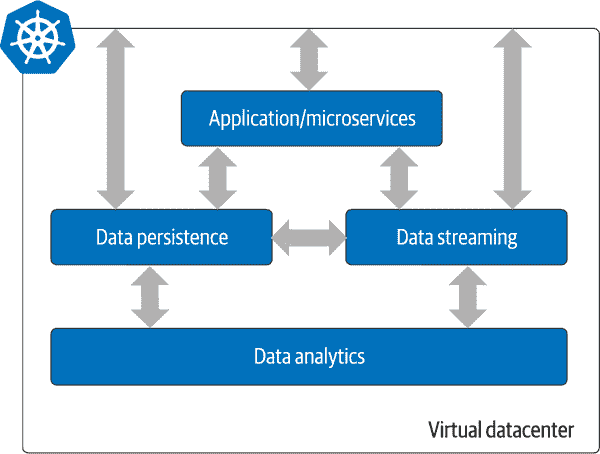
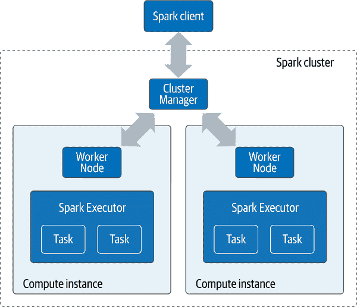
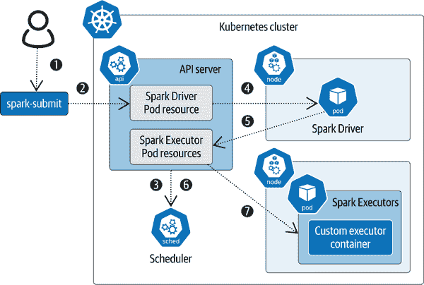
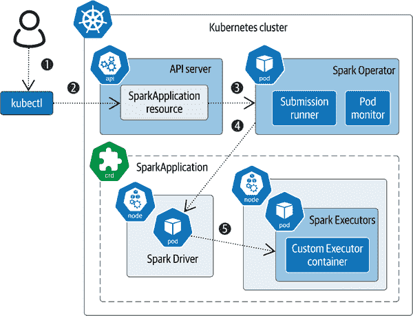
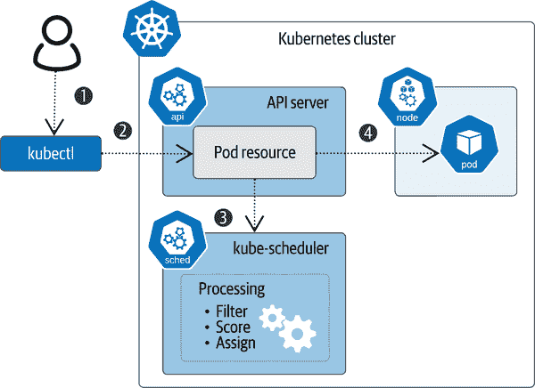
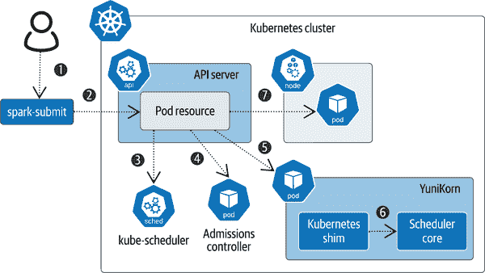
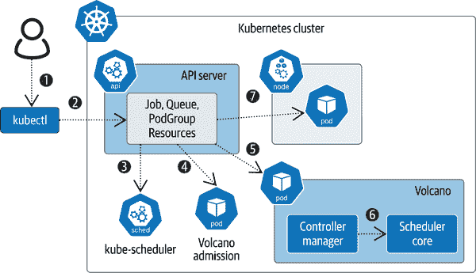

# 第九章：Kubernetes 上的数据分析

> 技术的进步在于我们有能力变得更懒。
> 
> 拉里安·基里卡博士

在 2000 年代初期，谷歌以公开宣布的目标“组织世界信息，使其普遍可访问和有用”迷住了互联网。这是一个雄心勃勃的目标，要实现它，就像用“计算机科学化”这个词来概括，需要从中提取出位。鉴于数据创建的速度不断增加，谷歌需要发明（和重新发明）管理以前从未考虑过的数据量的方法。围绕分析数据的全新社区、文化和行业应运而生，解决了最终被标记为“大数据”的问题。如今，分析已成为几乎每个应用程序堆栈的全面成员，而不仅仅是谷歌的问题。现在，这是每个人的问题；不再是一种仅限于少数专家的艺术形式，我们都需要知道如何使分析工作。组织需要可靠且快速的方法来部署带有分析功能的应用程序，以便他们可以做更多的事情而花费更少的精力。

基里卡博士在本章开头引用的玩笑话中谈到的懒惰描述了一个理想的未来。与其让一百人的团队日夜工作来分析一百万亿字节的数据，不如将其减少到一个人和几分钟？云原生方式运行数据基础设施是我们所有人应该朝着实现这种光荣懒惰的路径努力。

我们已经看过将有状态工作负载迁移到 Kubernetes 的几个方面，包括存储、数据库和流处理。在本章中，是时候看看分析以完成整个图景了。作为预览，图 9-1 显示了数据分析如何作为使用 Kubernetes 管理完整数据栈路线图的最后一部分。



###### 图 9-1\. 云原生虚拟数据中心

在这种架构中，不再需要外部网络要求来连接 Kubernetes 集群内外的资源，只需一个单一的虚拟数据中心，为我们的云原生应用程序服务。大块表示我们在第一章中讨论过的数据基础设施的宏组件，再加上用户应用程序代码，部署为微服务。

# 分析简介

分析工作负载及其伴随的基础设施操作与其他工作负载大不相同。分析不仅仅是另一个容器化的系统来编排。我们在前几章中研究的典型有状态应用程序（如数据库）具有许多相似的特征，但一旦部署，它们往往保持静态或可预见的缓慢增长。

然而，分析工作负载中的一个方面让许多管理员感到恐惧：数据量。虽然像数据库这样的持久数据存储可以消耗从千兆字节到百万兆字节的存储空间，但分析数据量可能会轻松地飙升到几个拍字节，从而产生一整套新的问题。它们不是毫无缘由地称为“大数据”。

*牛津英语词典*将分析定义为“数据或统计量的系统计算分析”。[维基百科](https://oreil.ly/Hc1Pp)补充道：“它被用于发现、解释和传达数据中的有意义的模式。”结合这些定义与大量的数据，我们应该期待云原生应用的何种结果？让我们详细分析各种类型的分析工作流程和方法：

批量分析

在计算机科学中，*批处理*是一系列应用于数据的指令，几乎没有用户交互。批处理作业的概念与通用计算同样古老。在像 Apache Hadoop 或 Apache Spark 这样的分布式系统中，每个单独的作业由一个程序组成，可以并行和分阶段地处理较小的数据块。较小的结果最终在作业结束时合并为一个单一的最终结果。MapReduce 就是这方面的一个例子，在本章的后续部分讨论。在大多数情况下，会进行统计分析，如计数、平均值和百分位数测量。批量分析是本章的重点。

流分析

如在第八章中讨论的那样，流分析关注的是*正在发生的事情*，而批量分析关注的是*已经发生的事情*。许多相同的 API 和开发方法在流分析和批量分析中都被使用。这可能会让人感到困惑，并使人误以为它们是同一件事情，但实际上它们有着非常不同的用例和实现方式。一个很好的例子是欺诈检测。用于检测和阻止欺诈的时间跨度可以以毫秒到秒计算，这符合流分析的用例。批量分析将用于在较长时间段内发现欺诈模式。

人工智能/机器学习（AI/ML）

虽然人工智能（AI）和机器学习（ML）可以被视为批量分析的子集，但它们是如此专业化的领域，以至于它们值得特别强调。AI 和 ML 经常被一起提到；然而，它们有着两种不同的输出目标。AI 试图在决策制定中模拟人类认知。ML 使用算法从数据池中推导意义，有时的方式并不容易明显。这两种方法都需要在大量数据上应用计算资源。这个主题在第十章中有更详细的讨论。

# 在 Kubernetes 中部署分析工作负载

Kubernetes 最初关注的是无状态应用程序的扩展和编排。正如你在本书中学到的，Kubernetes 正在演变以支持有状态应用程序。通过将更多工作负载移入虚拟数据中心，提高运行效率的承诺具有很高的激励作用。分析领域可以利用在减少无状态和有状态工作负载操作负担方面取得的进展。然而，Kubernetes 在管理分析工作负载方面面临一些独特的挑战；许多问题仍在解决中。Kubernetes 需要哪些功能来完善数据视图，并使分析工作负载达到与微服务和数据库等堆栈其他部分相当的水平？以下是本章将要探讨的一些关键考虑因素：

有序执行

分析工作负载的一个重要方面是分析大量数据所需的操作顺序。这不仅仅是确保 Pod 以适当的存储和网络资源启动，还包括应用程序与每个 Pod 中有序执行运行的映射。在这项任务中，Kubernetes 组件主要负责的是`kube-scheduler`（参见第五章），但 Jobs 和 CronJobs 的控制器也参与其中。这是 Kubernetes 社区在关注分析时的一个特定领域，我们将在本章进一步讨论。

存储管理

分析工作负载在处理数据的不同作业中使用临时和持久存储。真正的麻烦出现在识别和选择每个作业所需的正确存储时。许多分析工作负载需要临时存储来进行短期处理，以及更高效（更便宜）的持久存储来进行长期处理。正如你在第二章学到的，Kubernetes 存储已经显著成熟。在 Kubernetes 上运行的分析项目需要利用已经在有状态工作负载上完成的工作，并继续与 Kubernetes 社区合作，以改进 StorageClasses 和不同访问模式等领域的未来增强功能。

资源的高效利用

有句老话说，“大量事物的每一个都重要”，在分析中尤为明显。一项作业可能需要 1,000 个 Pods 运行 10 分钟，但如果需要 10,000 个呢？这对于 Kubernetes 控制平面是一个具有挑战性的问题。另一项作业可能需要数 TB 的交换磁盘空间，而这些空间仅在作业执行期间需要。在云原生世界中，作业应能快速分配所需资源，并在完成后释放这些资源。尽可能提高这些操作的效率不仅节省时间，更重要的是节省资金。分析的快速和爆发性特性给 Kubernetes API 服务器和调度器带来了一些挑战，以保持跟上需要运行的所有作业。如本章后续讨论，其中一些挑战已在处理中，而一些仍在进行中。

这些都是挑战，但没有一项是妨碍我们在 Kubernetes 中部署作为单一虚拟数据中心的完整云原生堆栈的梦想的绊脚石。

工程师们有时是自己最大的敌人。通常情况下，解决一个问题可能会带来更多需要解决的问题。然而，这在处理数据时可以看作是进步。尽管面临诸多挑战，但我们每一步的提升都为以前无法实现的新解决方案铺平了道路。今天，少数人可以完成曾几何时庞大团队无法完成的分析任务，这令人震惊。请参阅本章开头关于懒惰的引言。尽管仍需努力，接下来我们将看看在 Kubernetes 中分析数据的可用工具。

# Apache Spark 简介

谷歌通过在学术论文中简要描述，利用 MapReduce 算法改变了数据分析的世界。不久之后，[MapReduce 论文](https://oreil.ly/mryO0)引发了工程师们的讨论，随之而来的是一个开源实现：如今著名的 Apache Hadoop。围绕 Hadoop 建立了庞大的生态系统，包括工具和补充项目，如 Hadoop 分布式文件系统（HDFS）。

在这个快速发展的项目中遇到的成长阵痛为基于 Hadoop 的经验教训的下一代工具打开了大门。作为 Hadoop 替代方案，增长迅速的一个项目是[Apache Spark](https://oreil.ly/BlT4i)。Spark 通过引入弹性分布式数据集（RDD）API 和有向无环图（DAG）解决了可靠性和处理效率问题。

RDD 相比于 MapReduce 的强制线性处理模式是一个重大进步，后者涉及大量的磁盘读取、处理，然后再写回磁盘，反复进行。这使开发人员需要通过推理数据如何被处理来思考。RDD 将责任从开发人员转移开来，作为一个 API 创建了所有数据的统一视图，同时抽象了实际的处理细节。这些细节以工作流的方式创建，执行每个任务的 DAG 来表达。DAG 只是描述数据和操作以有序方式完成最终结果的优化路径。最终，RDD 被 Dataset 和 DataFrame API 取代，进一步提升了在大数据量上的开发人员生产力。

Spark 的操作复杂性大大降低，与 Hadoop 相比，后者因其基础作业所需的基础设施而臭名昭著。Spark 是下一代实现的一个极好例子，具有极为深刻的远见。在简化 Spark 架构方面付出了大量努力，利用分布式系统的概念。结果就是你在 Spark 集群中应该熟悉的三个常见组件，如图 9-2 所示。



###### 图 9-2\. Spark 集群的组件

让我们回顾一下这些组件各自的职责：

集群管理器

集群管理器是 Spark 集群中活动的中心枢纽，新作业在此提交进行处理。集群管理器还获取完成所提交任务所需的资源。集群管理器的不同版本主要基于资源管理方式（独立部署、YARN、Mesos 和 Kubernetes）。在使用 Kubernetes 部署你的 Spark 应用程序时，集群管理器至关重要。

工作节点

当 Spark 作业运行时，集群管理器将其分解为可管理的部分，并交给工作节点进行处理。它们作为硬件资源的本地管理器，是单一联系点。工作节点调用和管理 Spark 执行器。

Spark 执行器

每个发送到工作节点的应用程序将获得自己的 Spark 执行器。每个执行器是一个独立的 JVM 进程，独立运行并与工作节点进行通信。为应用程序的任务分配的计算资源被分解为线程消耗。

这些是 Spark 项目早期设计的传统组件。我们将看到，部署云原生版本的 Spark 的需求迫使一些架构进行了演进。基础原则保持不变，但执行框架已适应利用 Kubernetes 提供的优势并消除编排开销中的重复。在接下来的部分中，我们将看到这些变化以及如何在 Kubernetes 中使用 Spark。

# 在 Kubernetes 中部署 Apache Spark

自 Apache Spark 2.3 版本起，Kubernetes 是集群管理器中支持的模式之一。这对于作为云原生分析工具的 Spark 意味着什么可能轻易地被低估了。从 Spark 3.1 开始，Kubernetes 模式被认为是可以投入生产的，不断增加稳定的改进。当 Spark 项目考虑在集群编排平台内运行集群分析系统时，许多重叠之处变得显而易见。Kubernetes 已经具备了容器的生命周期管理、计算元素的动态提供和取消提供的机制，因此 Spark 让 Kubernetes 来处理这些工作。多余的部分被移除，Spark 与 Kubernetes 的工作方式更为接近。`spark-submit`命令行工具通过使用 Kubernetes API 与 Kubernetes 集群进行交互，为开发人员和数据工程师提供了一个熟悉的工具链。这些在 Kubernetes 中部署 Spark 时的独特方面显示在图 9-3 中。



###### 图 9-3\. Kubernetes 中的 Spark

让我们来突出几个不同之处：

Spark Driver

独立的 Spark 集群的专用集群管理器被原生 Kubernetes 集群管理替代，Spark 特定的管理由 Spark Driver 负责。当 Kubernetes API 服务器从`spark-submit`工具接收到作业时，将创建 Spark Driver Pod。它调用 Spark Executor Pods 来满足作业的需求。它还负责在作业结束后清理 Executor Pods，使其成为弹性工作负载的重要组成部分。

Spark Executor

就像独立的 Spark 集群一样，Executors 是工作的执行地点，也是消耗最多计算资源的地方。它们由 Spark Driver 调用，接收由`spark-submit`传递的作业指令，包括 CPU 和内存限制、存储信息以及安全凭证。Executor Pods 中使用的容器是用户预先创建的。

定制 Executor 容器

在使用`spark-submit`发送作业进行处理之前，用户必须构建一个定制的容器镜像，以满足应用程序的要求。Spark 发行版下载包含一个 Dockerfile，可以根据需要进行定制，并与*docker-image-tool.sh*脚本一起使用，用于在 Kubernetes 中提交 Spark 作业时构建和上传所需的容器。定制容器包含了在 Kubernetes 环境中运行所需的一切，例如基于所需的 Spark 发行版版本的 Spark Executor。

使用 Kubernetes 和默认设置准备和运行 Spark 作业的工作流可能相对简单，只需几个步骤即可。如果您已经熟悉并在生产环境中运行 Spark，则尤其如此。您需要一个运行中的 Kubernetes 集群，以及在本地文件路径中下载的 Spark 和 Spark 应用程序源代码。

## 构建您的自定义容器

Executor 容器封装了您的应用程序以及作为执行器 Pod 所需的运行时。构建脚本需要一个参数用于源代码仓库，并在推送到 Docker 注册表时为输出镜像分配标签：

```
./bin/docker-image-tool.sh -r <repo> -t <tag> build
```

输出将是一个包含您的应用程序代码的 JAR 文件的 Docker 镜像。然后，您需要将此镜像推送到您的 Docker 注册表中：

```
./bin/docker-image-tool.sh -r <repo> -t <tag> push
```

# Docker 镜像标签

请注意，标签名称必须正确标记和版本化。在生产中重复使用相同的标签名称可能会导致意外后果，正如我们有些人通过经验学到的那样。

## 提交并运行您的应用程序

一旦 Docker 镜像推送到仓库，使用 `**spark-submit**` 启动在 Kubernetes 中运行 Spark 应用程序的过程。这与其他模式中使用的 `spark-submit` 相同，因此使用许多相同的参数。这对应于图 9-3 中的 (1)：

```
./bin/spark-submit \
    --master k8s://https://<k8s-apiserver-host>:<k8s-apiserver-port> \
    --deploy-mode cluster \
    --name <application-name> \
    --class <fully-qualified-class-name> \
    --conf spark.executor.instances=<instance-number> \
    --conf spark.kubernetes.container.image=<spark-image> \
    local:///path/to/application.jar
```

这里发生了很多事情，但*最重要*的在于 `--master` 参数。为了指示这是为 Kubernetes 准备的，参数中的 URL 必须以 `k8s://` 开头，并指向本地 *.kubeconfig* 文件中指定的默认 Kubernetes 集群中的 API 服务器。`*<spark-image>*` 是您在 (1) 中创建的 Docker 镜像，应用程序路径指的是镜像中存储的应用程序。

接下来是 (2)，其中 `spark-submit` 与 Kubernetes 集群交互以安排 Spark Driver Pod (3) 和 (4)。Spark Driver 解析作业参数，并与 Kubernetes 调度程序一起设置 Spark Executor Pods (5)、(6) 和 (7) 来运行包含在客户容器镜像中的应用程序代码。应用程序将运行完成，最终使用的 Pod 将被终止，并将资源返回到 Kubernetes 集群中，这个过程称为*垃圾收集*。

这只是 Spark 在 Kubernetes 中的本机工作方式的概述。请参阅[官方文档](https://oreil.ly/upJeL)以获取更详细的信息。有许多方法可以自定义参数和参数，以最佳适应您的特定需求。

# 在 Kubernetes 上运行 Spark 时的安全考虑

当在 Kubernetes 中使用 Spark 时，默认情况下未启用安全性。第一道防线是认证。生产中的 Spark 应用程序应使用 Spark 中的内置认证功能，以确保访问应用程序的用户和进程是您预期的。

创建应用程序容器时，Spark 文档强烈建议将 `USER` 指令更改为非特权唯一标识符（UID）和组标识符（GID），以减少特权升级攻击的风险。这也可以通过作为 `spark-submit` 参数提供的 Pod 模板文件中的 SecurityContext 来完成。

也应限制与 Spark Driver 和 Spark Executor 的存储访问。具体来说，应限制可以被运行应用程序访问的路径，以消除在漏洞事件中的任意访问。这些可以在 PodSecurityAdmission 内设置，Spark 文档[建议](https://oreil.ly/xQcom)。

对于优化您的 Spark 应用程序的安全性，请使用 Kubernetes 提供的安全原语，并根据您的环境自定义默认设置。最好的安全性是您无需考虑的安全性。如果您是 SRE，这是您可以为开发人员和数据工程师做的最好的事情之一。默认安全！

# Apache Spark 的 Kubernetes 操作员

如果 Spark 可以通过`spark-submit`在 Kubernetes 中运行，为什么我们需要一个操作员呢？正如您在前面章节中学到的，Kubernetes 操作员为您管理应用程序提供了更多的灵活性，并且总体上提供了更云原生的体验。使用`spark-submit`来运行您的 Spark 应用程序需要在生产系统中设置具有本地安装 Spark 及其所有依赖项。Spark on Kubernetes Operator 允许 SRE 和开发人员使用 Kubernetes 工具（如 Helm 和`kubectl`）以声明方式管理 Spark 应用程序。它还允许更好地观察正在运行的作业并将指标导出到外部系统如 Prometheus。最后，使用操作员提供了一个体验，更接近于在 Kubernetes 中运行其他应用程序。

第一步是使用 Helm 将操作员安装到您的 Kubernetes 集群中：

```
helm repo add spark-operator \
 https://googlecloudplatform.github.io/spark-on-k8s-operator

helm install my-release spark-operator/spark-operator \
 --namespace spark-operator --create-namespace
```

完成后，您将有一个运行中的 SparkApplication 控制器，并且会查找 SparkApplication 对象。这是与`spark-submit`的第一个重大分歧。不再使用长长的命令行参数列表，而是使用 SparkApplication CRD 在 YAML 文件中定义 Spark 作业。让我们看一下来自[Spark on Kubernetes Operator 文档](https://oreil.ly/quNfG)的配置文件：

```
apiVersion: "sparkoperator.k8s.io/v1beta2"
kind: SparkApplication
metadata:
  name: spark-pi
  namespace: default
spec:
  type: Scala
  mode: cluster
  image: "gcr.io/spark-operator/spark:v3.1.1"
  imagePullPolicy: Always
  mainClass: org.apache.spark.examples.SparkPi
  mainApplicationFile: 
    "local:///opt/spark/examples/jars/spark-examples_2.12-3.1.1.jar"
  sparkVersion: "3.1.1"
  restartPolicy:
    type: Never
  volumes:
    - name: "test-volume"
      hostPath:
        path: "/tmp"
        type: Directory
  driver:
    cores: 1
    coreLimit: "1200m"
    memory: "512m"
    labels:
      version: 3.1.1
    serviceAccount: spark
    volumeMounts:
      - name: "test-volume"
        mountPath: "/tmp"
  executor:
    cores: 1
    instances: 1
    memory: "512m"
    labels:
      version: 3.1.1
    volumeMounts:
      - name: "test-volume"
        mountPath: "/tmp"
```

`spec:`部分类似于您在`spark-submit`中传递的应用程序参数，包含有关您的应用程序的详细信息。最重要的是容器镜像的位置。本示例使用了预安装了`spark-examples` JAR 文件的默认 Spark 容器。您将需要使用*docker-image-tool.sh*根据应用程序的要求构建镜像，如“构建您的自定义容器”中所述，并根据应用程序的需求修改`mainClass`和`mainApplicationFile`。

`spec`下的另外两个显著字段是`driver`和`executor`。它们为 Spark Driver Pods 和 Spark Executor Pods 的规范提供了说明，这些由 Spark Operator 部署。对于`driver`，只需要一个核心，但是 CPU 和内存分配需要足够以维持所需的执行器数量。此数字在`executor`部分的`instances`下设置。

# 注意资源管理

对于资源管理，在 `driver` 和 `spec` 下进行的请求需要仔细考虑资源管理。实例的数量以及其分配的 CPU 和内存可能会迅速耗尽资源。作业可能会无限期地挂起，等待资源释放，而这可能永远不会发生。

现在您的配置 YAML 已准备就绪，是时候将其投入实际应用了。有关操作步骤，请参考 图 9-4。



###### 图 9-4\. Spark on Kubernetes Operator

首先，使用 `kubectl apply -f *<filename>*`（1）将 SparkApplication 应用到正在运行的 Kubernetes 集群中（2）。Spark Operator 会监听新应用程序（3），当应用新配置对象时，提交运行控制器开始构建所需的 Pod。从这里开始，在 Kubernetes 集群中执行的操作与直接使用 `spark-submit` 完全相同，但本例中所有参数都通过 SparkApplication YAML 提供。提交运行器启动 Spark Driver Pod（4），然后指导 Spark Executor Pods（5），执行应用程序代码直至完成。包含在 Spark Operator 中的 Pod 监视器将 Spark 指标导出到 Prometheus 等可观察性工具。

Spark Operator 填补了 `spark-submit` 的工作方式与 SRE 和开发人员通常在 Kubernetes 中部署应用程序的方式之间的差距。这是对本节开头提出的问题的长篇回答。我们需要一个操作员来使使用 Spark 在云原生环境中更加便捷，从而在长期运行中更易管理。云原生的做法包括采用声明式方法来管理资源，并使这些资源可观察。

# Kubernetes 的替代调度程序

正如您在 第五章 中所学到的，Kubernetes 调度程序的基本但至关重要的任务是接收资源请求并分配计算、网络和存储以满足要求。让我们看一下执行此操作的默认方法，如 图 9-5 所示。



###### 图 9-5\. 典型的 Kubernetes 调度

典型的调度工作从创建描述所需资源的 *deployment.yaml* 文件开始（1），包括需要哪些 Pod 资源以及数量。当提交 YAML 文件（2）到 Kubernetes 集群的 API 服务器时，使用 `kubectl apply`，Pod 资源将以提供的参数创建，并准备好分配给节点。节点具有所需的资源池，`kube-scheduler` 的任务是在节点和 Pod 之间进行匹配。调度器在创建新的 Pod 资源时（3）执行状态匹配，并检查该 Pod 是否已分配了节点。如果没有，调度器将进行必要的计算以找到可用的节点。它检查 Pod 的需求，使用内部一组规则对可用节点进行评分，并选择一个节点来运行该 Pod（4）。这就是 Kubernetes 中容器编排的真正工作场所。

然而，我们在分析工作负载方面遇到了问题：默认的 Kubernetes 调度器并未设计用于批处理工作负载。设计过于基础，无法满足分析所需的方式。正如在 “在 Kubernetes 上进行分析是下一个前沿” 中提到的，Kubernetes 是为无状态工作负载的需求而构建的。这些是长时间运行的进程，虽然随着时间的推移可能会扩展或收缩，但倾向于保持相对静态。而像 Spark 这样的分析应用程序则不同，需要调度可能数以千计的短暂作业。

幸运的是，Kubernetes 的开发者预见到未来调度需求的扩展，并允许用户在配置中指定他们的调度器，绕过默认的调度方法。

强烈的愿望通过共同的控制平面管理整个应用程序栈一直是创新的推动力。正如在 “在 Kubernetes 上部署 Apache Spark” 中展示的那样，Spark 正在向 Kubernetes 靠拢。在本节中，我们将看看一些团队如何通过构建更合适的调度器将 Kubernetes 与 Spark 更紧密地结合起来。两个开源项目在这方面处于领先地位：Volcano 和 Apache YuniKorn。这些调度器共享相似的指导原则，通过提供以下替代特性，使它们更适合批处理工作负载：

多租户资源管理

默认的 Kubernetes 调度器根据请求分配 Pod，直到没有更多可用的资源与 Pod 的要求匹配。YuniKorn 和 Volcano 都提供了多种资源模式，以更好地满足您的应用需求，特别是在多租户环境中。资源管理的公平性可以防止一个分析作业因所需资源而饿死其他作业。在调度这些作业时，整个资源池都会考虑到基于优先级和吞吐量的平衡利用。

*团队调度* 添加了另一层智能。如果提交的作业需要一定数量的资源，如果不能启动每个 Pod，启动作业就没有意义。默认调度器会启动 Pod，直到集群资源耗尽，可能会导致作业等待更多 Pod 上线。团队调度器实施全有或全无的方式，只有当所有需要的资源对于完整的作业都可用时，作业才会启动。

作业队列管理

更智能的队列管理也能导致更好的资源管理。如果一个作业只需要少量资源，并且可以在运行更大作业的同时运行，调度器可以安排这个作业，从而提高 Kubernetes 集群的整体吞吐量。在某些情况下，用户需要控制哪些作业优先级高，并且哪些作业可以在提交时抢占或暂停其他正在运行的作业。作业提交后可以重新排序或重新设置优先级。可观察性工具提供队列洞察，帮助确定整个集群的健康状况和资源使用情况。

如果你考虑将分析工作负载投入生产环境，你应避免使用默认的调度器，`kube-scheduler`。在这种情况下，它并不适合你的需求。选择一个更好的调度器可以让你为 Kubernetes 的体验未来做好准备。让我们来看看每个调度器的一些亮点。

## Apache YuniKorn

*YuniKorn 项目* 是由 Cloudera 的工程师基于在 Spark 中处理分析工作负载时的操作困难构建而成的。在使用开源解决问题的社区精神下，YuniKorn 于 2020 年被捐赠给 Apache 软件基金会，并作为孵化项目被接受。名称直接来自其支持的两个系统，YARN 和 Kubernetes。（Y 统一 K. YuniKorn. 明白了吧？）它从 Spark 集群管理的角度解决了分析工作负载的特定资源管理和用户控制需求。YuniKorn 还增加了对 TensorFlow 和 Flink 作业的支持，并具有相同水平的资源控制。毫无疑问，这种支持源于在 Spark 中找到的相同操作困难。

使用 Helm 在 Kubernetes 中安装 YuniKorn。YuniKorn 的目标是将你的 Kubernetes 集群转变为一个对批处理作业资源需求友好的地方。这种转变的关键部分是替换默认的 `kube-scheduler`。为了演示这一点，让我们使用 图 9-6 来逐步了解其组件。

YuniKorn 旨在成为现有 Spark 工作流程最小更改的调度器替代方案的一部分，因此我们将从这里开始。当新的资源请求（1）通过`spark-submit`（2）发送到 Kubernetes API 服务器时，默认使用`kube-scheduler`（3）来匹配 Pod 和节点。当在您的集群中部署 YuniKorn 时，将创建一个`admissions-controller` Pod。`admissions-controller`的功能是监听新的资源请求（4），并进行小的更改，将`schedulerName: yunikorn`添加到资源请求中。如果需要更精细的控制，您可以禁用`admissions-controller`并通过手动将以下行添加到 SparkApplication YAML 来按作业基础启用 YuniKorn：

```
spec:
schedulerName: yunikorn
```



###### 图 9-6\. YuniKorn 架构

所有调度需求现在将由 YuniKorn Scheduler（5）处理。YuniKorn 被设计为与多个编排引擎一起运行，并提供一个称为*Kubernetes shim*的 API 转换层，用于管理 Kubernetes 与 YuniKorn 核心之间的通信（6）。yunikorn-core 通过添加适用于批处理工作负载（如 Spark）的选项，扩展了默认的`kube-scheduler`中可用的基本过滤器和评分算法。这些选项从简单的基于资源的队列到更高级的分层队列管理，允许队列和资源池映射到组织结构。在运行在单个 Kubernetes 集群中的多租户环境中，分层池对于那些在大型企业的许多部分中具有大量分析足迹的人士非常有帮助，也是至关重要的。

使用*queues.yaml*文件配置 YuniKorn 核心，该文件包含 YuniKorn 调度 Pod 到节点的所有细节，包括以下内容：

分区

一个或多个命名的[配置部分](https://oreil.ly/kxtHf)用于不同的应用需求。

队列

在分层排列中对资源进行精细化的[控制](https://oreil.ly/M5W1A)，以在多租户环境中提供资源保证。

节点排序策略

节点如何通过可用资源选择。选择包括[FairnessPolicy](https://oreil.ly/RUI7q)和[BinPackingPolicy](https://oreil.ly/sED2J)。

放置规则

描述和[过滤器](https://oreil.ly/sHvMP)基于用户或组成员资格进行 Pod 位置安置。

限制

用于在分区或队列上设置精细化资源限制的[定义](https://oreil.ly/ytYU9)。

新作业由 YuniKorn 核心处理，通过匹配详细信息并分配正确的队列。在这一点上，调度程序可以决定将 Pod 分配给节点，然后将其上线（7）。

YuniKorn 还配备了一个名为*scheduler UI*的可观察性基于 Web 的工具，提供作业和队列状态的洞察。它可以用于监控调度器的健康状况，并提供更好的洞察以排除任何作业问题。

## 火山

*Volcano*被开发为在 Kubernetes 中运行高性能计算（HPC）工作负载的通用调度器。Volcano 支持多种工作负载，包括 Spark、Flink、PyTorch、TensorFlow 以及专用系统，例如用于基因组测序的 KubeGene。工程师们在华为、腾讯和百度等公司开发了 Volcano，并将其捐赠给 CNCF，于 2020 年被接受为沙盒项目。

使用 Helm 安装 Volcano 并创建作业和队列的 CRDs，使得配置成为 Kubernetes 集群的核心部分，与更多作为旁路的 YuniKorn 不同。这反映了 Volcano 的通用性质。安装后，Volcano 调度器可用于任何需要高级调度和排队的进程。我们将使用图 9-7 来演示其工作原理。

要将 Volcano 用于批处理作业，您需要在作业的 YAML 文件中明确添加调度器配置（1）。如果您正在使用 Volcano 来运行 Spark 作业，Volcano 项目建议使用 Kubernetes 的 Spark Operator，并在您的 SparkApplication YAML 中添加一个字段：

```
spec:
batchScheduler: "volcano"
```



###### 图 9-7\. Volcano 架构

然后，您可以像平常一样使用`kubectl apply`提交您的作业（2）。如果没有指定 Volcano 调度器，Kubernetes 将使用默认的`kube-scheduler`来匹配 Pod 和节点（3）。

使用 Helm 安装 Volcano 将安装作业、队列和 PodGroup 的 CRDs，并创建一个名为 Volcano Admission 的新 Pod。Volcano Admission（4）连接到 API 服务器，并验证 Volcano 特定的 CRD 条目和要求使用 Volcano 调度器的作业：

工作

面向 HPC 的特定于 Volcano 的作业，具有扩展的[配置](https://oreil.ly/CknE0)。

队列

作为先进先出（FIFO）资源组管理的 PodGroup 集合。[配置](https://oreil.ly/MW2xq)定义了队列在不同情况下的行为。

PodGroup

与其目的相关的 Pod 集合。例如，为 Spark 和 TensorFlow 创建不同的[属性](https://oreil.ly/LzeBj)的组。

选定 Volcano 作为作业的调度器时（5），Volcano 调度器将获取 CRDs 并开始工作（6）。选择使用 Volcano 作为调度器的传入作业将与 PodGroup 和队列进行匹配。基于此分配，为每个 Pod 进行最终的节点放置（7）。

Volcano 调度器核心的集群特定配置存储在名为`volcano-scheduler-configmap`的 ConfigMap 中。此配置文件包含两个主要部分：`actions`和`plugins`。[Actions](https://oreil.ly/frTKk)是节点选择过程中每个作业步骤的有序列表：enqueue、allocate、preempt、reclaim 和 backfill。每个步骤都是可选的，并且可以根据需要重新排序。

插件是用于将 Pod 与节点匹配的算法。每种算法具有不同的用例和目的，并可以作为整体组合使用：

群组

此插件在队列中查找优先级较高的任务，并在需要时执行抢占和驱逐以释放资源。

BinPack

这是一个经典的算法，用于通过以最有效的方式混合不同大小的资源请求来找到使用每个可用资源的最佳适合。

符合性

忽略 Namespace `kube-system` 中任何任务以进行驱逐决策。

主导资源公平性（DRF）

这是一种算法，用于解决跨多种资源类型的公平性问题，确保所有作业具有相等的吞吐量。

比例

这是一种多租户算法，为运行作业分配独立的集群分配部分。

任务拓扑

此算法使用亲和性将网络密集型作业放置在物理上更接近以提高网络使用效率。

NodeOrder

此插件在选择之前会使用多个用户定义的维度对每个可用节点进行评分。

谓词

此功能在节点中寻找特定的谓词以进行选择（但目前仅支持 GPU 共享谓词）。

优先级

此插件根据用户提供的 `priorityClassName`、`createTime` 和 `id` 配置选择任务优先级。

服务级别协议（SLA）

此功能使用参数 `JobWaitingTime`，允许各个作业基于其需求时间控制优先级。

分时复用（TDM）

当节点同时用于 Kubernetes 和 YARN 时，TDM 将安排共享资源的 Pod。

NUMA 感知

提供带有对 CPU 资源拓扑的意识的 Pod 调度。

除了 Kubernetes 安装外，Volcano 还附带了一个名为 `vcctl` 的命令行工具。管理 Volcano 可完全通过 `kubectl` 完成。然而，`vcctl` 为熟悉作业控制系统的操作员提供了一个界面。

从 YuniKorn 和 Volcano 提供的功能列表中可以看出，拥有选择权是一件美好的事情。无论您选择哪个项目，您都将在 Kubernetes 中运行分析工作负载时获得更好的体验。

# Kubernetes 的分析引擎

Spark 是一个强大的工具，解决了许多分析用例。然而，一旦该工具不再按您的方式工作，仅有一个选择可能会限制性。Google 在 2004 年开发了 MapReduce 来满足数据转换的需求，例如对数据池进行计数等操作，这在今天依然是一个相关的问题，考虑到我们所创造的数据量。即使在 MapReduce 之前，大规模并行处理（MPP）也是数据分析的一种流行方法。这些“超级计算机”由一排排的个体计算机组成，被呈现为研究人员在物理学和气象学等领域运行大规模计算的单一处理网格。

在分析中处理 ML 和 AI 任务时，会出现类似的计算需求：许多过程需要分析大量数据。诸如 TensorFlow 的库需要超出数据转换的分析工具。借助 Kubernetes，数据科学家和工程师现在可以快速创建基于廉价计算、网络和存储的虚拟数据中心，以匹敌过去某些超级计算机的能力。这些技术的结合为开发人员带来了全新而令人兴奋的未来：基于自助服务使用模型构建基于 ML 和 AI 的应用，无需等待昂贵超级计算机上的时间（是的，这曾经是一件事）。

通过正确的 API 访问和在基于 Kubernetes 构建的正确基础设施上具备的能力，是数据科学和 Python 社区一直努力实现的强大组合。两个新项目已经开始崭露头角：Dask 和 Ray。正如 Dean 所指出的，Python 是数据科学的首选语言。Ray 和 Dask 都为内部和外部 Kubernetes 的大规模并行处理提供了本地 Python 接口。

## Dask

[Dask](https://www.dask.org) 是一个基于 Python 的大规模处理工具，用于抽象复杂的设置步骤。它可以用于任何您可以用 Python 程序表达的事物，但在数据科学领域因其众多可用的库而找到了真正的用武之地。scikit-learn、NumPy、TensorFlow 和 Pandas 都是成熟的数据科学库，可以在笔记本电脑上使用，然后借助 Dask 扩展到大规模计算机集群。

Dask 与 Kubernetes 集成良好，提供了操作员和开发人员已经习惯的便捷用户体验。Dask 的存储原语 Array、DataFrame 和 Bag 映射到许多云原生存储选择。例如，您可以将 DataFrame 映射到存储在 PersistentVolume 或对象存储桶（如 S3）中的文件。您的存储规模仅受基础资源和预算的限制。当 Python 代码处理数据时，Dask 无缝地管理多个工作节点之间的分块。

部署选项包括我们从 第四章 熟悉的手动 Helm 安装示例：

```
helm repo add dask https://helm.dask.org/
helm repo update
helm install my-dask dask/dask
```

或者作为另一种选择，您可以在 Kubernetes 中安装一个带有 Jupyter Notebook 实例的 Dask 集群进行内部工作：

```
helm install my-dask dask/daskhub
```

一旦您的 Dask 集群在 Kubernetes 中运行起来，您可以作为客户端连接，并使用 `HelmCluster` 对象在计算节点上运行您的 Python 代码。连接时，请使用安装时给集群命名的名称：

```
from dask_kubernetes import HelmCluster
from dask.distributed import Client

# Connect to the name of the helm installation
cluster = HelmCluster(release_name="my-dask")

# specify the number of workers(pods) explicitly
cluster.scale(10)

# or dynamically scale based on current workload
cluster.adapt(minimum=1, maximum=100)

# Your Python code here
```

如果这还不够简单，您可以完全跳过 Helm 安装，让 Dask 为您完成这部分工作。`KubeCluster`对象接受一个参数，该参数可以使用`make_pod_spec`方法或指定一个 YAML 配置文件来指定 Pod 配置。它将连接到通过`kubectl`访问的默认 Kubernetes 集群，并在运行的 Python 程序的一部分中在您的 Kubernetes 集群内调用集群创建：

```
from dask.distributed import Client
from dask_kubernetes import KubeCluster, make_pod_spec

pod_spec = make_pod_spec(image='daskdev/dask:latest',
                         memory_limit='4G', memory_request='4G',
                         cpu_limit=1, cpu_request=1)

cluster = KubeCluster(pod_spec)

# specify the number of workers(pods) explicitly
cluster.scale(10)

# or dynamically scale based on current workload
cluster.adapt(minimum=1, maximum=100)

# Connect Dask to the cluster
client = Client(cluster)

# Your Python code here
```

开发者访问 Kubernetes 集群以进行并行计算变得更加简单，而像 Dask 这样的新工具正是它们的吸引力所在。

## Ray

在与 Dask 中任意的 Python 代码有显著差异的同时，*Ray*采用了不同的方法来进行 Python 集群化，通过作为并行任务管理器运行，并包含一个具有大型[集成生态系统](https://oreil.ly/XY5rC)的分布式计算框架。对于最终用户，Ray 提供了低级别的 C++库，用于运行专门为数据科学中的计算密集工作负载而构建的分布式代码。Ray 核心是基础，它通过任务的概念来分发工作负载。当开发者使用 Ray 编写 Python 代码时，每个任务都表现为一个远程函数，正如从[Ray 文档](https://oreil.ly/gCmBs)中的这个例子所示：

```
# By adding the `@ray.remote` decorator, a regular Python function
# becomes a Ray remote function.
@ray.remote
def my_function():
    return 1
```

在这个基本的例子中，您可以看到 Ray 在分发工作上采取的方法的不同。开发者必须明确指出使用 Ray Core 处理计算管理与集群管理器的工作。

在 Kubernetes 中部署 Ray 旨在利用动态工作负载中的计算和网络资源管理。Ray Operator 包括自定义控制器和 CRD，用于部署连接到 Ray 集群所需的所有内容。提供了一个 Helm 图表以便于安装。但是，由于图表不在公共仓库中提供，因此您必须首先将整个 Ray 分发下载到本地文件系统。可以修改一个广泛的配置 YAML 文件，但是要使一个简单的 Ray 集群工作起来，使用默认设置即可，正如从[文档](https://oreil.ly/XjXJo)中所见：

```
cd ray/deploy/charts
helm -n ray install example-cluster --create-namespace ./ray
```

这导致安装了两种类型的 Pod。头节点处理集群中运行任务的通信和编排，而工作节点处理任务执行其代码的地方。在 Kubernetes 集群内运行 Ray 集群时，有两种方式可以运行 Ray 作业：通过 Ray 客户端进行交互式操作或作为通过`kubectl`提交的作业。

Ray 客户端嵌入到一个 Python 程序文件中，并初始化与 Ray 集群的连接。这需要通过 Ingress 或本地端口转发来公开头部服务 IP。除了远程函数代码外，初始化程序还将建立与外部化 Ray 集群主机 IP 和端口的连接：

```
import ray

ray.init("ray://<host>:<port>")

@ray.remote
def my_function():
    return 1
```

另一个选项是在 Kubernetes 集群内部运行您的代码，并将其附加到内部服务和端口。您可以使用`kubectl`提交作业以运行，并传递作业描述的 YAML 文件，该文件概述了要使用的 Python 程序和 Pod 资源信息。以下是来自[Ray 文档](https://oreil.ly/gCmBs)的示例作业文件：

```
apiVersion: batch/v1
kind: Job
metadata:
  name: ray-test-job
spec:
  template:
    spec:
      restartPolicy: Never
      containers:
        - name: ray
          image: rayproject/ray:latest
          imagePullPolicy: Always
          command: [ "/bin/bash", "-c", "--" ]
          args:
            - "wget <URL>/job_example.py &&
              python job_example.py"
          resources:
            requests:
              cpu: 100m
              memory: 512Mi
```

然后，可以使用`kubectl`将此文件提交到集群：

```
kubectl -n ray create -f job-example.yaml
```

在提交的 Python 文件内部，我们可以使用 Ray 服务头的 DNS 名称，并让 Kubernetes 确保网络路径路由：

```
ray.init("ray://example-cluster-ray-head:10001")
```

对于运行 Ray 程序的外部和内部模式，头节点利用 Kubernetes 调度程序来管理 Worker Node Pod 的生命周期以完成提交的作业。Ray 为开发人员提供了一个简单的编程 API，可以利用大规模集群计算而不需要学习 Kubernetes 管理。SRE（站点可靠性工程师）可以创建和管理 Kubernetes 集群，数据科学家可以使用他们偏爱的 Python 编程语言轻松使用这些集群。

# 摘要

这样就完成了云原生应用程序堆栈中数据组件的导览。通过添加分析功能，可以通过在大数据量中找到洞察力来完善整体数据图片，这些数据可以补充应用程序的其他部分。

分析处于云原生数据创新的前沿，因此，大数据不是你应该假设与其他数据基础设施同样适合于 Kubernetes 的内容。两个主要区别是涉及的数据量和工作负载的突发性质。需要进一步改进，使 Apache Spark 在 Kubernetes 上更有效地运行，特别是在作业管理和存储 API 方面。然而，现有的知识可以帮助您今天放心部署。像 Apache YuniKorn 和 Volcano 这样的项目已经在开源中引领了分析工作负载的更好基础。新兴的分析引擎如 Dask 和 Ray 可能是您用例的更好选择，并且可以与其他工具结合使用。

虽然分析工作负载可能不在您最初的 Kubernetes 部署计划中，但如果您的目标是构建虚拟数据中心的完整图片，特别是设计用来运行您的应用程序的目的，那么它们不能被跳过。
