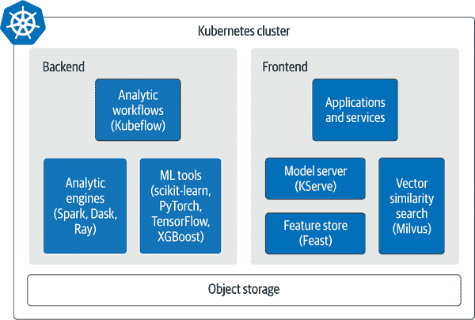
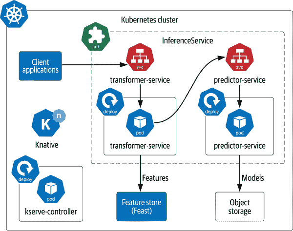
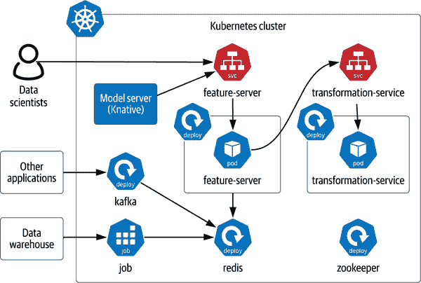
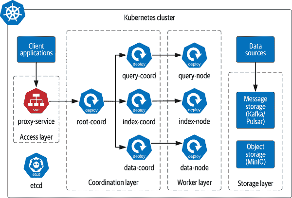
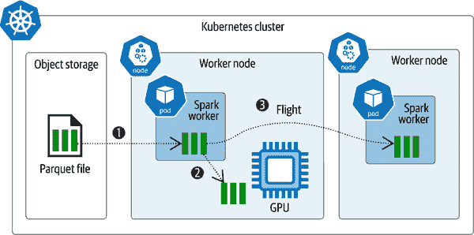
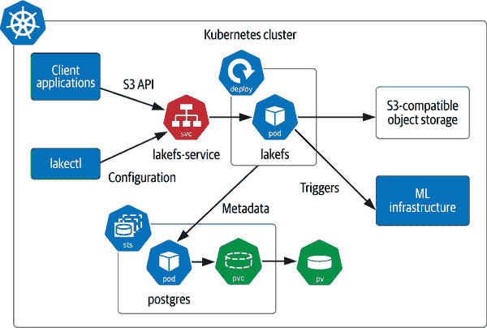

# 第十章：机器学习和其他新兴用例

在前几章中，我们涵盖了传统数据基础设施，包括数据库、流处理平台和分析引擎，重点放在 Kubernetes 上。现在是时候超越这些，探索正在开始将云原生作为目的地的项目和社区，特别是涉及 AI 和 ML 的项目。

每当多个箭头开始指向同一个方向时，都值得关注。数据基础设施中的方向箭头全部指向 Kubernetes 的整体宏观趋势收敛，由几个相互关联的趋势支持：

+   为管理计算密集型 AI/ML 工作负载正在出现常见堆栈，包括利用特定硬件如 GPU 的堆栈。

+   常见的数据格式有助于促进数据在计算、网络和存储资源之间的高效移动。

+   对象存储正变成数据基础设施的常见持久层。

在本章中，我们将探讨几种体现这些趋势的新兴技术，它们所支持的使用案例，以及它们如何有助于帮助您进一步管理计算、网络和存储等宝贵资源。我们选择了几个涉及机器学习和数据使用不同方面的项目——这绝不是对今天每种使用的技术的详尽调查。我们直接听取每个项目工程师的意见，并提供关于它们如何融入云原生数据堆栈的一些细节。强烈建议您继续深入您感兴趣的领域，超出此处呈现的内容。跟随您的好奇心，并为支持 Kubernetes 中新使用案例的社区做出贡献。

# 云原生 AI/ML 堆栈

如第九章所讨论的（第九章），在 Kubernetes 上进行的数据分析、人工智能（AI）和机器学习（ML）是一个值得更详细研究的主题。如果你对这个在数据世界中的专业不熟悉，它是一个令人兴奋的领域，增强了我们以规模化方式生成实时数据驱动决策的能力。虽然许多核心算法已存在几十年，但这项工作的性质在过去几年中发生了迅速变化。作为一个职业，数据科学传统上被局限在后台，历史数据的大量获取用于洞察发现意义并预测未来。数据科学家很少直接参与最终用户应用程序，他们的工作与用户界面应用程序是分离的。

随着数据工程师角色的出现，情况开始改变。数据工程师建立处理引擎和管道，以生产化数据科学，并打破学科之间的壁垒。作为数据基础设施新兴领域的典型情况，最大、最有发言权的组织设定了数据工程的节奏，他们的工具和方法已成为主流。

应用程序中数据的实时特性不能仅仅依赖于数据库和流处理平台。由数据科学家构建的产品必须更接近最终用户，以最大化其在应用程序中的效果。许多组织已经意识到这既是一个问题也是一个机会：我们如何使数据科学成为应用部署的另一个近实时组件？忠于自己的形式，在面对挑战时，社区已经应对，并建立了新的项目并创造了新的学科。因此，与传统的持久性、流处理和分析类别并行出现了基于 Kubernetes 的新型数据基础设施类别。这个新堆栈包括支持 AI 和 ML 特定实时数据服务的工具。

## AI/ML 定义

如果您是 AI/ML 领域的新手，可能会因术语而感到不知所措。在我们看一些云原生技术解决 AI 堆栈中的问题之前，让我们花些时间了解这个专业领域的新术语和概念。如果您对 AI/ML 熟悉，可以安全地跳到下一节。

首先，让我们简要回顾一些 AI/ML 中常见的术语。这些术语经常出现在项目和功能的描述中，您需要理解它们以选择正确的工具并有效地应用它们：

算法

ML 的基本计算构建块是算法。算法以代码形式表达为一组分析数据的指令。常见的算法包括线性回归、决策树、K 均值和随机森林。数据科学家花费时间与算法一起工作，以从数据中获得洞见。当过程和参数正确时，最终的、可重复的形式输出为模型。

模型

ML 旨在构建模仿人类学习方式的系统，以便根据提供的数据回答问题，而无需明确编程。示例问题包括识别两个对象是否相似，特定事件发生的可能性，或在多个候选项中选择最佳选项。用于这些问题的答案系统描述为数学模型（简称*模型*）。模型充当函数机器的角色：描述问题的数据输入，输出表示答案的新数据。

特征

特征是与特定用例相关的更大数据集的部分。特征既用于训练模型，也用于在生产中为模型提供输入。例如，如果您想要预测天气，可能会从更大的数据集中选择时间、地点和温度，忽略其他数据如空气质量。*特征选择*是确定要使用的数据的过程，这可能是一个迭代的过程。当您听到*特征*这个词时，您可以轻松地将其翻译为*数据*。

训练

模型由一个算法和应用该算法到特定领域的数据（特征）组成。为了训练一个模型，训练数据通过算法以帮助调整输出，以匹配基于所呈现数据的预期答案。这些训练数据包含相同的特征，这些特征将在生产中使用，唯一的区别在于已知期望的答案。例如，给定历史温度，模型中使用的参数是否预测了实际发生的情况？训练是机器学习中资源消耗最大的阶段。

流

流是*工作流程*的简称。一个机器学习工作流描述了构建工作模型所需的步骤。流通常包括数据收集、预处理和清理、特征工程、模型训练、验证和性能测试。这些通常是全自动化的过程。

向量

向量的经典数学定义是指示方向和大小的数量。机器学习模型是使用数值数据的数学公式。由于并非所有源数据都表示为数字，将输入数据归一化为向量表示是在流程预处理步骤中使用通用算法的关键。图像和文本是可以在流程的预处理步骤中进行向量编码的数据示例。

预测

预测是使用创建的模型根据输入数据生成可能的答案的步骤。例如，我们可以通过使用天气模型询问给定位置、日期和时间的预期温度。所回答的问题采取的形式是“将会发生什么？”

推断

推断模型通过颠倒输入和输出数据的关系来寻找原因。给定一个答案，是哪些特征导致了这个答案？这里有另一个天气的例子：基于降雨量，最相关的温度和气压是多少？所回答的问题是“这是如何发生的？”

漂移

模型是用来自某一时间点的数据快照训练的。漂移是一个条件，因为模型由于时间变化或不再与原始训练数据相关而失去准确性。当模型发生漂移时，解决方案是通过更新的训练数据来完善模型。

偏见

模型的好坏取决于所使用的算法以及这些算法的训练方式。偏见可以在几个方面引入：在算法本身、包含用户偏见或错误测量的样本数据中，或者数据的排除中。无论如何，机器学习的目标是尽可能准确，而偏见是一种准确性的衡量。检测数据中的偏见是一个复杂的问题，通过良好的数据治理和严格的流程更容易在早期解决。

这些是帮助您理解本节其余内容的一些关键概念。要进行更全面的介绍，请考虑阅读 Andreas C. Müller 和 Sarah Guido 的 [*Python 机器学习入门*](https://oreil.ly/6ii4d)（O'Reilly）或您喜欢的在线学习平台上的众多高质量课程之一。

## 定义 AI/ML 栈

在定义了这些概念之后，我们可以描述云原生 AI 栈的元素及其可以发挥的作用。新兴的学科和社区通过各种团队创新以解决自己的特定需求，实施具有轻微差异的相似实现。通过查看在生产规模上使用 AI/ML 的组织以及围绕 Kubernetes 采用的趋势，我们可以识别一些常见模式。图 10-1 展示了当前在生产中体系结构中发现的一些典型元素。在不指定特定解决方案的情况下，我们将其作为 AI/ML 实时组件类型工具及其如何组合以服务的示例。

###### 图 10-1\. 云原生 AI/ML 栈的常见元素

云原生 AI/ML 栈的目标应该是尽可能将 AI/ML 生成的洞见靠近您的用户，这意味着缩短后端分析处理与前端生产系统中使用其输出之间的距离。数据探索使用诸如 [scikit-learn](https://scikit-learn.org)、[PyTorch](https://pytorch.org)、[TensorFlow](https://www.tensorflow.org) 和 [XGBoost](https://xgboost.readthedocs.io) 等库提供的算法，使用存储在数据库或静态文件中的数据。Python 是最常用的具有 ML 库的语言。我们在 第九章 中讨论的系统，包括 Apache Spark、Dask 和 Ray，用于扩展处理所需的 Python 库以构建模型。[Kubeflow](https://www.kubeflow.org) 和类似工具允许数据工程师创建用于模型生成的 ML 工作流程。工作流程将模型文件输出到对象存储，提供了后端处理与前端生产使用之间的桥梁。

模型的用途在于使用，这是实时模型服务工具如 [KServe](https://github.com/kserve/kserve)、[Seldon](https://www.seldon.io) 和 [BentoML](https://www.bentoml.com) 所扮演的角色。这些工具代表应用程序使用来自对象存储和特征存储（例如 [Feast](https://feast.dev)）中现有模型进行预测。特征存储执行特征数据的完整生命周期管理，将新特征数据存储在在线数据库（如 Cassandra）中，进行训练，并将特征提供给模型。

向量相似性搜索引擎是实时服务堆栈的一个新但熟悉的补充。虽然传统搜索引擎（如[Apache Solr](https://solr.apache.org)）为文本搜索提供了便捷的 API，包括模糊匹配，但向量相似性搜索是一种更强大的算法，帮助回答“与我当前拥有的东西相似的是什么？”这一问题。为此，它利用数据中的关系，而不仅仅是搜索查询中的术语。向量相似性支持多种格式，包括文本、视频、音频以及任何可以分析为向量的内容。许多开源工具实现了向量相似性搜索，包括 [Milvus](https://milvus.io)、[Weaviate](https://weaviate.io)、[Qdrant](https://qdrant.tech)、[Vald](https://vald.vdaas.org) 和 [Vearch](https://github.com/vearch/vearch)。

让我们详细研究一下支持应用程序前端 ML 使用的几个工具，并了解它们在 Kubernetes 中的部署情况：KServe、Feast 和 Milvus。

## 使用 KServe 进行实时模型服务

AI/ML 中实时访问分析产品的“最后一英里”问题是 Kubernetes 很可能解决的问题。考虑现代 Web 应用程序的架构：看似简单提供 Web 页面的 HTTP 服务器背后往往有更复杂的逻辑。事实上，应用逻辑和数据基础设施结合在一起，以隐藏复杂性。就像监听请求并提供 Web 页面的 HTTP 服务器一样，模型服务器隐藏了加载和执行模型的复杂性，专注于数据科学完成后的开发者体验。

*KServe* 是一个原生于 Kubernetes 的模型服务器，可以轻松为生产环境中的应用程序提供预测能力。让我们从项目创始人之一那里更多地了解 KServe 的起源和功能。

图 10-2 展示了 KServe 在 Kubernetes 上的部署方式。控制平面由 KServe 控制器组成，管理称为推理服务的自定义资源。每个推理服务实例包含两个微服务，即 `Transformer` 服务和 `Predictor` 服务，每个都包含一个 Deployment 和一个 Service。Knative 框架用于请求处理，将它们视为无服务器微服务，在不使用时可以缩放到零，以实现最大效率。

###### 图 10-2\. 在 Kubernetes 中部署 KServe

`Transformer` 服务为来自客户端应用程序的预测请求提供端点。它还实现了预处理、预测和后处理的三阶段流程：

预处理

`Transformer`服务将传入的数据转换为模型可用的形式。例如，您可能有一个模型来预测图片中是否有热狗。在将图片传递给推理服务之前，`Transformer`服务将其转换为向量。在预处理过程中，`Transformer`服务还从诸如 Feast 之类的特征存储加载特征数据。

预测

`Transformer`服务委托预测工作给`Predictor`服务，后者负责从对象存储加载模型并使用提供的特征数据执行它。

后处理

`Transformer`服务接收预测结果并执行任何必要的后处理以准备响应给客户端应用程序。

如果您熟悉传统的 Web 服务，您会看到模型服务创建的有用类比。KServe 不仅提供 HTML 页面服务，还涵盖了为提供 AI/ML 工作负载而生的现代应用需求。作为 Kubernetes 原生项目，它可以无缝集成到您的云原生数据中心和应用堆栈中。

## 通过 Feast 进行完整的生命周期特征管理

生命周期管理是任何数据架构中的常见主题，涵盖数据随时间的添加、更新和删除。特征存储通过管理从发现到在生产系统中使用的 ML 模型特征的生命周期，起到协调作用，消除不同团队参与时可能出现的版本控制和协调问题。Feast 是如何产生的？

正如 Willem 所指出的，将 Feast 部署到 Kubernetes 的基本状态是成熟的。由于没有定义运算符或自定义资源，您可以使用 Helm 图表安装 Feast。图 10-3 展示了使用[Feast 网站上记录的示例](https://oreil.ly/GYNjR)，包括特征服务器和其他支持服务的样本安装。

###### 图 10-3. 在 Kubernetes 中部署 Feast

让我们来研究这些组件及其如何互动。数据科学家从现有数据源中识别特征，这个过程称为*特征工程*，并使用由特征服务器公开的接口创建特征（如在“用 Feast 桥接 ML 模型和数据”中定义）。用户可以在创建特征时提供特征数据，也可以连接到各种后端服务，以便数据可以持续更新。Feast 可以消费发布到 Kafka 主题的数据，或通过 Kubernetes 作业从数据仓库拉取数据。特征数据存储在在线数据库（如 Redis 或 Cassandra）中，以便可以轻松地提供给生产应用程序。ZooKeeper 用于协调元数据和服务发现。Helm 图表还支持部署 Grafana 来可视化指标。这可能听起来很熟悉，因为像 Redis、ZooKeeper 和 Grafana 这样的常见构建块的重复使用是我们在本书中几个其他示例中看到的模式。

当像 KServe 这样的模型服务工具被要求进行预测时，它们使用 Feast 中存储的特征作为真实记录。数据科学家通过相同的特征存储进行更新训练，消除了多源数据的需求。`Transformation`服务提供了一个可选的能力，通过对现有特征数据执行转换来按需生成新特征。

KServe 和 Feast 通常一起使用，以创建完整的实时模型服务堆栈。Feast 处理特征管理的动态部分，与在线和离线数据存储一起工作，随着新特征通过流式处理和数据仓库到达。KServe 使用 Knative 的无服务器能力处理模型服务的动态配置。这意味着当不使用时，KServe 可以自动缩放到零，并在有新请求到达时作出反应，通过仅使用所需资源来节省在基于 Kubernetes 的 AI/ML 堆栈中的宝贵资源。

## Milvus 的向量相似性搜索

现在我们已经看过了用于在生产系统中使用 ML 模型和特性的工具，让我们换个角度，看看另一种类型的 AI/ML 工具：向量相似性搜索（VSS）。正如在 “AI/ML 定义” 中讨论的那样，向量是在向量空间中从原点表示方向和大小的数值对象。VSS 是在 ML 中应用向量数学的一种应用。k-最近邻（KNN）算法是一种找出两个相邻物体“接近程度”的方法。此算法有许多变体，但都依赖于将数据表达为向量。要搜索的数据使用 CPU 密集型的 KNN 类型算法进行向量化处理；通常这是一个后端处理过程。VSS 服务器然后可以为向量数据建立索引，以提供 less CPU-intensive 的搜索查询机制，允许最终用户提供一个向量并找到与之接近的内容。

*Milvus* 是围绕新兴领域 VSS 设计的众多服务器之一。让我们了解一下 Milvus 的由来及其为 Kubernetes 所适配的原因。

正如 Xiaofan 所述，Milvus 支持独立部署和集群部署，使用所描述的四个层次。这两种模式在 Kubernetes 中都通过 Helm 支持，集群部署如 图 10-4 所示。

访问层包含代理服务，该服务使用 Kubernetes LoadBalancer 从客户端应用程序路由请求。协调层中的服务处理传入的搜索和索引查询，并将其路由到工作层中的核心服务器组件，这些组件处理查询并管理数据存储和索引。数据节点通过对象存储中的文件管理持久性。消息存储使用 Apache Pulsar 或 Apache Kafka 存储传入数据流，然后将其传递给数据节点。

可以看出，Milvus 设计为 Kubernetes 原生，具有水平可扩展的架构，非常适合处理包括数十亿甚至数万亿向量在内的大规模数据集。

###### 图 10-4\. 在 Kubernetes 中部署 Milvus

# 使用 Apache Arrow 进行高效数据移动

现在我们已经探索了一个 AI/ML Kubernetes 堆栈，帮助您更有效地管理计算资源，您可能想知道可以如何处理网络资源。我们在“拥抱分布式计算”中讨论的“分布式计算谬论”包括两个重要点：误以为带宽是无限的，以及传输成本为零。即使计算和存储资源看起来更有限，很容易忽视带宽会很容易用完。当您深入部署数据基础设施到 Kubernetes 时，您越可能发现这一点。早期采用 Apache Hadoop 的用户经常分享，随着他们集群的增长，他们的网络交换机需要用当时最好的交换机替换。只需考虑对 10TB 数据进行排序需要多少资源？1PB 呢？您明白了吧。

*Apache Arrow* 是一个项目，通过提供更高效的格式来解决带宽利用问题。实际上，在计算机科学的历史上并不陌生。IBM 引入了[扩展二进制编码的十进制互换码（EBCDIC）](https://oreil.ly/MI488)字符编码，以提供当时首选的传输方式——打孔卡片的效率。Arrow 从根本上解决了效率问题，避免了不断增加资源的无止境升级，证明了控制问题的解决方案永远不是“增加更多的动力”。让我们听听一些专家的意见，了解这是如何运作的。

使用 Arrow 启用的项目使您能够高效共享数据，减少计算、网络和存储资源的使用。Arrow 与 Spark 的示例用法显示在图 10-5 中。

###### 图 10-5\. 使用 Apache Arrow 移动数据

存储在对象存储中的 Parquet 数据文件，其中包含 Arrow 格式化的数据，可以在不需要反序列化步骤的情况下轻松加载（1）。然后，数据可以通过 Spark 应用程序进行分析（2），包括直接加载到支持的 GPU 进行处理。通过 Arrow Flight（3）在工作节点之间传递数据时，可以保持同样的效率水平。Arrow 记录批量被发送，无需任何中间内存复制或序列化，接收方可以在没有内存复制或反序列化的情况下重建 Arrow 记录。远程进程之间的高效关系消除了两个问题：发送数据的处理开销以及高效的 Arrow 记录格式，消除了带宽的浪费。

在 Spark 应用程序中常见的规模下，网络延迟和带宽的影响可以迅速累积。网络传输节省确保数据流畅移动，即使数据量达到了 TB 和 PB 级别。在 TU Delft 的 Tanveer Ahmad 进行的[研究](https://oreil.ly/rve9i)表明，使用 Arrow Flight 移动大容量数据可实现 20 至 30 倍的效率提升。

# 带 lakeFS 的版本化对象存储

对象存储正成为云原生数据持久化的标准。它降低了服务的复杂性，同时也指向了一种不同的数据可变性思维方式。与随机访问的文件存储不同，对象存储是预计算的，一次写入，多次读取。而不是更新数据文件，你会写入一个新文件，但如何区分哪些数据文件是当前的？因此，对象存储在磁盘空间管理方面存在问题。由于没有管理整个文件系统的概念，每个文件都是一个在虚拟无限资源中的对象。

对象存储 API 相对基础，功能简单，但数据团队需要更多仅仅基础功能以适应他们的使用场景。[lakeFS](https://lakefs.io)和[Nessie](https://projectnessie.org)是两个项目，旨在使对象存储更适合 Kubernetes 上新兴工作负载。让我们来看看 lakeFS 如何扩展云原生应用的对象存储功能。

在 Kubernetes 中使用 lakeFS 非常合适，因为它具有无状态设计和声明式部署。Helm 部署包括[配置](https://oreil.ly/GhZMB)lakeFS 服务，该服务随后作为与其他服务之间的通信网关。

与服务器的通信模拟 S3 对象存储，允许与支持 S3 API 的任何数据存储交互。入站通信绑定为 ClusterIP，用于通过 Deployment 管理的一个或多个无状态 lakeFS 服务器 Pod 提供 HTTP 流量服务。

lakeFS 使用 PostgreSQL 管理元数据，因此用户可以提供正在运行系统的端点，如图 10-6 所示，或者 lakeFS 可以在 lakeFS Pod 内运行一个嵌入式 PostgreSQL 服务器供其独占使用。当部署为集群时，PostgreSQL 是无状态 lakeFS 服务器的状态管理工具。

###### 图 10-6\. 在 Kubernetes 中部署 lakeFS

最重要的连接是到将存储实际数据的对象存储端点。当用户将数据持久化到 lakeFS 时，实际数据文件将通过到后端对象存储，并且版本化元数据存储在 PostgreSQL 中。

额外的出站连接用于与其他 ML 基础设施进行协作。Webhook 允许在发生操作（如提交）时触发，从而警报下游系统。这些触发器是自动化 ML 工作流和其他应用的关键组成部分。

# 摘要

正如你所看到的，使用 Kubernetes 处理数据的新方法的流水线在未来可延续。新项目正在根据云原生的弹性、可伸缩性和自愈性原则解决先进数据工作负载的挑战。

这些工具赋予你管理计算、网络和存储这些关键资源的能力。你可以通过 KServe 进行计算密集型工作负载的管理，例如 AI/ML 的交付，利用 Feast 进行模型管理，并使用 Milvus 将新的搜索方法实现操作化。网络资源受到容量和速度的简单法则的支配，在我们可以创建的数据量级别上，每一点进展都有助于减少数据量。Apache Arrow 通过在应用程序间创建一个共同的参考框架来降低这一数据量。围绕对象存储的统一提供了进一步的效率，像 lakeFS 这样的工具使对象存储更易于以符合应用程序数据存储需求的方式使用。

到目前为止，我们已经从像存储这样成熟领域一直到管理 AI/ML 人工智能/机器学习构件的前沿项目，审视了在 Kubernetes 上的数据基础设施。现在是时候将迄今为止获得的所有知识应用于实践。
