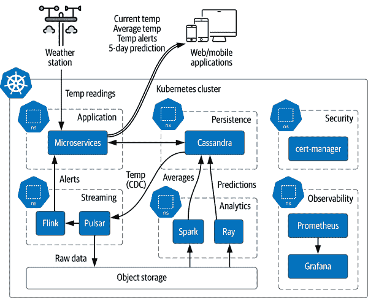
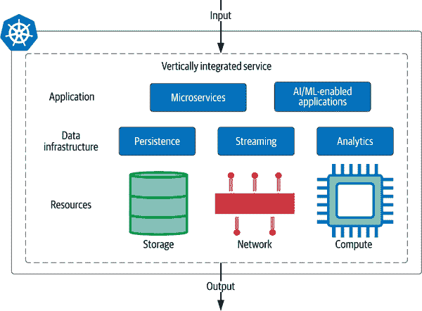
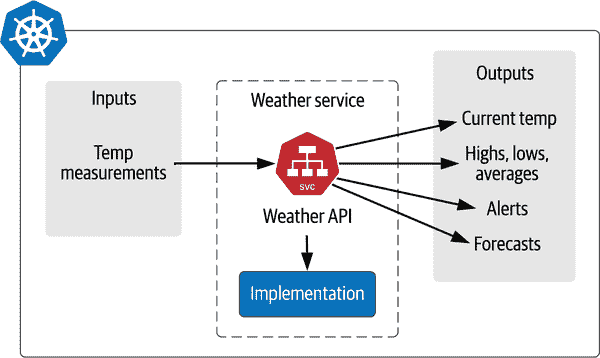
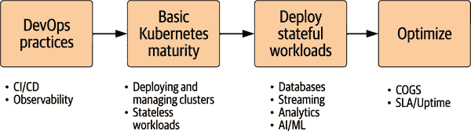

# 第十一章：迁移数据工作负载到 Kubernetes

在第一章中，我们提出了一个愿景，即将你的云原生应用所需的所有基础设施集成到一个地方：Kubernetes。我们的论点很简单：如果你在 Kubernetes 部署中排除了数据及其支持基础设施，那么你还没有完全接受云原生原则。自那时以来，我们已经涵盖了很多内容，探讨了不同类型的数据基础设施在 Kubernetes 上的工作方式，并展示了可能性的艺术。

那么，你接下来该怎么做呢？如何完全实现这一愿景？此时，你可能已经在 Kubernetes 中部署了应用的某些部分。很可能，你还有几代前的基础设施，比如容器、虚拟机或裸金属服务器，无论是在你自己的数据中心还是在云中运行。在本书的最后一章，我们将利用你迄今所学的一切，帮助你制定一个完整管理云原生数据在 Kubernetes 中的计划。

# 愿景：应用感知平台

整本书中，我们听到了社区中多样化的声音，他们分享了关于在 Kubernetes 中处理数据的智慧和实际建议，这对于这项重大工作至关重要。无论你处于哪个阶段，无论你是 Kubernetes 的初学者还是经验丰富的多年操作者，我们都可以从他们的专业知识中学到东西。现在是时候放大视角，考虑一下向 Kubernetes 的迁移如何与软件行业的其他趋势交汇。Craig McLuckie 曾是谷歌团队中创建 Kubernetes 的一员，并最终将其引入开源。他在云原生基础设施社区中非常活跃，并分享了一些在我们向 Kubernetes 数据迁移过程中可能遇到的可能性和挑战。

Craig 提出了一个鼓舞人心的愿景，即未来的基础设施将适应应用，而不是像今天一样应用与基础设施耦合。正如你在本书中探索的技术所看到的，通过 Kubernetes 控制平面进行声明性基础设施的协调已经无处不在。现在我们可以开始改变方式，从顶向下构建应用，而不是从底向上。这是一个改变你的组织如何利用数据技术的机会。你准备好开始了吗？现在是时候规划你的旅程了。

# 绘制通向成功的路径

在准备将你的有状态工作负载迁移到 Kubernetes 之前，你可能心中会有一些问题，比如“我们应该使用什么技术？”和“我们如何推出这些变更？”以及“我们如何确保我们的团队准备好了？”大多数这些问题都可以很好地映射到经典的 IT 框架人员、流程和技术（PPT）。由于每个组织的旅程都会有所不同，我们将在每个类别中提供建议，而不是详细的路线图。你的一部分重要工作是选择迁移到 Kubernetes 的内容和不迁移到的内容。每次迁移都应有充分的理由。

你可能已经在实施一些这些建议，所以实际需要做的工作是确保你在所有三个领域的努力朝着你期望的结果共同发力。一个警告：现在不是“快速行动，破坏一切”的时候。在确保核心元素就位之后，你会有充分的时间来做这些事情。有了坚实的基础，你将达到以前从未见过的敏捷和速度水平。

## 人员

任何 IT 组织的核心是它的人员。将任何工作负载迁移到 Kubernetes 代表了你的组织在思维方式上的巨大转变，并且需要适当的培训和准备工作。你需要理解这项技术的人员，或者愿意学习的人员。在准备迁移到有状态工作负载时，这一要求更为真实。除了明显的在 Kubernetes 上进行培训和阅读这类书籍的任务外，我们希望引起你对两个领域的关注：成功组织执行良好的特定工作角色以及利用开源社区作为你的团队的力量倍增器。

### 云原生数据的关键人员角色

我们可以列出许多对成功迁移至关键的角色，但我们将重点介绍三个对于管理云原生数据至关重要的角色，并讨论它们的关系：

云架构师

架构师为开发云应用程序的技术方向提供指导，影响你部署应用程序的云和区域选择，以及你将使用的数据基础设施。这包括何时依赖自管理的开源项目与托管服务。一名有效的云架构师精选技术以满足当前业务需求，同时留有未来扩展性的空间。

站点可靠性工程师

在第一章中，我们谈到了采纳 SRE 思维方式。虽然这种思维方式是你组织中每位工程师都应该朝向的方向，但 DBA 在成为 SRE 角色时具有极其战略性的机会。与仅仅部署数据库并离开不同，一个以数据为重点的 SRE 全面看待数据基础设施及其如何支持系统整体目标，以获取最佳性能和成本比。

数据工程师

虽然数据科学家关注从数据中提取价值，数据工程师负责数据的操作化。他们构建数据处理流程，组装系统，并考虑数据产品的最终用户消费。数据工程师不仅应精通基于 Kubernetes 的技术，还应了解哪些云服务可以结合使用，以获得优化的结果。数据工程师将在选择和部署支持我们在第十章中讨论的 AI/ML 工作负载的技术方面发挥重要作用，组合多个组件以实现对应用程序实时洞察的流程。

要考虑这些角色如何在组织中协同工作，请考虑农场操作的类比：

+   架构师类似于规划者，决定在每个季节种植什么作物，以及每种作物的数量。

+   SRE 类似于农民，他们种植和培育作物，以确保它们健康且富有生产力。

+   数据工程师类似于分销商，他们收获作物并确保其到达正确的目的地。

如果您的组织尚未定义这些角色，请不要担心。在许多情况下，可以对目前从事其他角色的工程师进行再培训。

### 加速创新的社区

要解释《塞尔达传说》中持剑老人的话，单独前行是危险的。带上朋友。在科技领域，社区是工作的核心部分，我们一起工作，共同学习，分享成功和失败。在踏上新的技术旅程时，寻找围绕该技术形成的社区。以下是云原生数据领域的几个显著社区。您可以寻找这些信息，加入对话，并希望能贡献自己的一份力量：

云原生计算基金会

也称为[CNCF](https://www.cncf.io)，这个组织是更广泛的[Linux 基金会](https://www.linuxfoundation.org)的一部分，这是一个致力于开源倡导的非营利组织。CNCF 是 Kubernetes 和许多在 Kubernetes 上运行的项目的家园，包括本书中介绍的几个特色项目。您可以从毕业和孵化项目列表中看到投入到 Kubernetes 原生项目中的能量。CNCF 的成员支付会费，用于支持基金会及其项目的倡导和管理工作。

技术监督委员会（TOC）负责批准和维护 CNCF 项目的技术愿景。随着如此多的项目需要维护，已经成立了技术咨询组（TAGs）来处理跨项目的关注点。每个 TAG 在最初的章程内保持自主性，为类似分组的项目创建一个维护互操作性标准的场所。每个 TAG 都维护自己的 Slack 工作空间和邮件列表，用于社区讨论。

所有项目的开发活动都集中在其 GitHub 仓库中。要参与贡献代码，请在每个项目的 GitHub Issues 中寻找 [“good first issue”](https://oreil.ly/xt2QR) 标签。如果你有更广泛的兴趣，可以考虑加入 TAGs 中正在进行的讨论，以帮助塑造未来的方向。每年两次，CNCF 在北美、中国和欧洲举办 [KubeCon + CloudNativeCon 用户大会](https://oreil.ly/Ijlki)，拥有大量的会议议程。一些最佳的议程是关于部署特定云原生技术的用户故事。

Apache 软件基金会

[ASF](https://www.apache.org) 是一个非营利性的软件保护组织。ASF 成员为被接受的项目提供治理、服务和支持。经过孵化过程后，项目毕业成为顶级项目，获得 Apache 名称（例如 Apache Cassandra、Apache Spark 和 Apache Pulsar）。每个项目都由一个项目管理委员会（PMC）独立运行，具有进行项目更改权限的用户被称为 *committers*。

在 Apache 项目周围，重要的是要注意项目社区和用户社区之间的区别。项目社区关注于构建项目，而用户社区则是下游，主要专注于在其应用程序中使用项目。这种关注分离在大多数项目中都体现在两个邮件列表上：*dev@<project name>.apache.org* 和 *user@<project name>.apache.org*。

如果你有兴趣贡献代码，直接跳进去是开始的最佳方式。Apache 项目使用 [Jira](https://oreil.ly/Odauf) 来跟踪变更和错误。在 Jira 问题中寻找“低 hanging fruit”或“好的首个项目”标签。在用户社区中，通过参与邮件列表或 Stack Overflow 来帮助他人是开始贡献的好方法。为 Apache 项目做演示是增加项目知名度的生命线，也是最佳贡献之一。

Kubernetes 社区数据（DoKC）

与 CNCF 和 ASF 不同，DoKC 是一个由行业供应商和最终用户组成的知识社区。DoKC 不是托管软件项目的地方，而是基础设施领域中人们的中心聚会场所。技术供应商赞助这个社区，但它的宗旨是在所有活动中保持供应商中立。这些活动包括线下和线上聚会、[*dok.community* 网站](https://dok.community) 上的博客以及与 KubeCon 的伴随活动 DoK Day。

除了聚集社区，DoKC 还制作有用的资源，帮助用户在 Kubernetes 上做出数据技术决策：

+   鉴于可用的数据技术数量，已经创建了[DoK Landscape](https://oreil.ly/HgYlL)来帮助比较和评估各种选项。您可以按照开源与商业许可证之类的属性进行搜索，或者是否提供了操作员或 Helm 图表。

+   每年进行一次[DoK 调查](https://oreil.ly/ZmaQu)，以评估行业观点并提供常见问题的指导。该报告免费，可用于您的演示文稿。

作为一个知识社区，参与 DoKC 的最佳方式是共享知识。在社区形成之初，关于在 Kubernetes 中运行有状态工作负载的最终用户信息很少。创建一个专注于数据主题的空间已经促进了一组共同的兴趣和概念的增长。本书中大多数的访谈来自我们在 DoKC 中遇到的人们。

在整本书中，我们看到了每个社区对使数据技术在 Kubernetes 上有效运行的贡献的好处：

+   我们在第二章中讨论的 PersistentVolume 子系统为 Kubernetes 上的各种开源和商业存储解决方案提供了坚实的基础。

+   我们在第五章中讨论的操作员框架，包括 Operator SDK、Kubebuilder 和 KUDO，已被证明是开发多种数据基础设施操作员的重要推动者，来自 ASF 和其他开源项目。

+   Kubernetes StatefulSets（首次在第三章中介绍）是一个有趣的案例。虽然它们已经证明在管理分布式数据库方面非常有价值，但社区也发现了一些改进的机会，我们期待未来能够解决这些问题。

+   同样地，Spark 和其他分析社区中的项目已经确定了 Kubernetes 默认调度器的挑战，正如您在第九章中了解到的那样。幸运的是，Kubernetes 提供了用于扩展调度器的 API，例如 Apache YuniKorn 和 Volcano 等项目可以利用。

正如您所看到的，这个互联社区生态系统中仍然有大量工作要做，需要来自云原生世界各个角落的贡献，才能使我们作为一个行业达到下一个成熟阶段。请记住，社区参与不仅限于向项目提供代码。向任何社区最重要的贡献之一是分享您的故事。想想您学习新技术的经历，您可能会回忆起良好的文档、出色的示例，以及最有价值的：“我们是如何构建这一切”的故事。请尽可能以任何方式分享您的故事。您的社区需要您！

## 技术

对于你们许多人来说，这是最令人兴奋的部分。酷炫的玩具！在考虑迁移到云原生数据时，你们将在选择使用的技术和集成到应用程序中的方式上做出重要决策。你们会从第一章中回忆起在 Kubernetes 中部署云原生数据的关键指导原则：

+   第一原则：利用计算、网络和存储作为通用 API。

+   第二原则：分离控制平面和数据平面。

+   第三原则：简化可观察性。

+   第四原则：确保默认配置的安全性。

+   第五原则：优先选择声明性配置。

结果表明，这些原则对于技术选择和集成非常有用，接下来将会看到。

### 选择云原生数据项目

多年来在数据特别是大规模基础设施方面的构建，已经产生了大量供应商和开源社区提供的工具。在这里，我们有意选择以项目为理由而不是选择技术。项目包含所需的技术，同时与我们需要的流程集成，由将推动成功的人员创建。你们在这里是因为相信 Kubernetes 是其中一个能够实现的项目，但你们如何做出下一步选择呢？以下是我们推荐的一些原则：

为 Kubernetes 准备好

第七章概述了 Kubernetes 本地数据库的要求，包括：

+   充分利用 Kubernetes API

+   自动化、声明性管理通过操作者

+   可通过标准 API（如 Prometheus）进行观察。

+   默认情况下安全

尽管你使用的每个项目都不必是 Kubernetes 本地的，但作为 Kubernetes 准备就绪的标准略宽。至少，你使用的项目应具有操作者或 Helm 图表。下一个级别是朝着 Kubernetes 本地的概念迈出一步，即对 Kubernetes 有深度集成的内置意识。一个例子是 Apache Spark，它具有使用专用容器的 Kubernetes 集群部署选项。最高级别的成熟度是由完全实现的云原生项目填充，因为它们依赖于 Kubernetes 集群中的组件，所以只能在 Kubernetes 中运行。这类项目的例子是 KServe，它没有在 Kubernetes 之外运行的方式。

开源

在云原生时代使用开源项目是关于选择。你可以在需要的地方部署你需要的内容。如果你选择使用基于开源项目的托管服务，它应该与开源版本完全兼容，没有限制返回自我管理解决方案的能力。选择正确的许可证让你有信心使用一个项目并保持你的选择。我们推荐采用 Apache 许可证 2.0（APLv2）的项目。所有 ASF 和 CNCF 项目都使用这个许可证，因此无论来自哪个来源的项目都保证了你获得一个宽松的许可证。[许多其他许可证](https://oreil.ly/61pjy)提供不同程度的宽松性和限制，你应该仔细考虑它们如何影响你的部署和要求。

当然，项目选择并不是你可以独立完成的事情。上游决策影响每一个后续决策，并且反过来可能限制可用选择。这就是为什么在许多情况下，看起来合理的是考虑那些可以很好地配合使用的项目组合，不论是经过故意设计还是标准接口。

### 云原生数据的新架构

云原生数据的未来应该更少关注新项目，而是更多关注新架构。这意味着使用我们今天拥有的项目组合，充分发挥每一个项目的优势。正如我们之前讨论过的，软件行业有利用持续一个或更长时间的前几代的思想来从新的角度进行创新的历史。在云原生世界中，过去的十年已经花费在建设规模基础设施上，接下来的十年可能将关注如何结合这些项目来满足我们的需求。

基础设施社区在集成解决共同问题的基础设施堆栈方面有着历史上的偏爱。一个例子是 LAMP 堆栈，在 2000 年初为 Web 应用程序流行，包括 Linux 操作系统、Apache HTTP 服务器、MySQL，以及根据询问者的不同选择的 PHP、Perl 或 Python。2010 年代带来了用于大数据应用的 SMACK 堆栈，具有 Spark 引擎、Mesos 作为资源管理器、Akka、Cassandra 和 Kafka。

尽管描述云原生数据的这样一个技术栈很诱人，但现实是因为用例的多样性和可用项目的数量实在太多，无法提出一个一刀切的解决方案。相反，让我们考虑一个简单天气应用案例的候选解决方案架构，如图 11-1 所示。该架构展示了本书中讨论的原则和建议，利用了我们数据基础设施的持久性、流式处理和分析类别。这是一个概念视角，我们可以作为社区讨论、批评和改进的起点。我们在这里做出的每个选择都有替代方案，应当被视为讨论的起点。

###### 图 11-1\. 天气应用程序的示例架构

让我们走一遍数据流，以了解这个架构如何满足具有多个数据需求的天气应用程序的需求。我们假设整个服务器端基础架构堆栈包含在单个 Kubernetes 集群中。这种架构的更高级形式可能包括多集群部署或包括负载均衡或 Ingress 等网络能力。目前，这将用来说明数据架构。

天气数据从气象站收集，并发布到等待 API 的 Ingress 端口，进入正在运行的 Kubernetes 集群。业务逻辑和服务器端应用程序代码被容器化，并作为微服务在 `application` 命名空间中运行。客户端的 Web 和移动应用程序也通过 API 调用使用这些微服务，因此所有外部数据通信都通过微服务层。

实时数据被发送到 Cassandra，用于在 `persistence` 命名空间中的即时使用。一旦数据以所需的一致性级别提交，变更数据捕获 (CDC) 将完全提交的数据发送到 `streaming` 命名空间中的 Pulsar 主题。Pulsar sink 将原始数据导出到放置在对象存储中的 Parquet 文件中。同时，订阅了主题的 Flink 消费者分析新数据，以查找用户定义的限制，如高温或低温。如果触发了边界条件，则将温度和站点数据发送回微服务，微服务将向用户应用发送推送警报。

在 `analytics` 命名空间中，两个独立的进程将使用对象存储中的 Parquet 数据。Spark 作业用于跨地理数据组织温度平均值。Ray 应用于对天气预测的预测分析，其分析代码用 Python 编写。每天都会构建以下五天的预测，通过查看最近的数据并应用建立在历史趋势上的模型。Spark 和 Ray 作业都在 Cassandra 中填充新的快速事务数据表。

这个候选架构还展示了一些建议，这些建议并不特定于天气应用程序，但你应考虑在所有部署中使用：

使用命名空间来分隔应用程序内的领域。

在 Kubernetes 集群中部署数百个 Pod 可能会带来组织问题，这在笔记本上的小集群中是遇不到的。我们在这里的建议很简单：大量使用命名空间来在复杂部署中创建秩序。在天气应用程序示例中，我们为基础设施的每个功能区域使用简单的命名空间：`application`、`persistence`、`streaming`、`analytics`、`security` 和 `observability`。这种方法将在处理服务或管理 Pod 时提供清晰的边界和命名。

自动化证书管理

在第八章中，我们断言最佳的安全解决方案是您无需考虑的解决方案。使用 cert-manager 自动化证书管理就是一个使这成为可能的优秀示例。对所有服务间通信使用 TLS。对于入口路由，确保所有流量均为 HTTPS。这两种情况使用 ACME 插件来旋转和分配证书，再也不会因为过期证书而遭遇停机事件。当安全审计来临时，您可以勾选一个框，表明您执行了所有政策和指南，并且所有网络通信都得到了充分的加密。就这么做吧。

更倾向于使用对象存储

在选择 Kubernetes 集群中有状态服务的存储时，应尽可能选择对象存储。正如在第七章中讨论的那样，这一推荐背后有几个原因，将使您在部署云原生数据时处于更好的位置。主要原因是不可变性对将存储与运行过程分离的影响。块存储通常与计算基础设施紧密对齐，并且具有较高的复杂性。必须打破计算和存储之间的紧密耦合，以构建真正的无服务器数据基础设施。对象存储已被证明是一个关键的支持者。您可以选择在 Kubernetes 内部实现自己的对象存储，也可以通过云服务来实现。

标准化 Prometheus API 用于指标

对于在 Kubernetes 中构建和运行的复杂基础设施，可观测性是强制性的，而 Prometheus API 是最广泛采用的指标解决方案。确保所有服务以 Prometheus 格式公开指标，并在一个地方收集它们。Prometheus API 在各种后端上实现，如 VictoriaMetrics 和 InfluxDB，为您管理自己的 Prometheus 部署或连接云服务提供了选择。最后，收集指标只是挑战的一部分，利用这些指标构建仪表板和警报则完成了整个方案。

正如这一架构展示的，您现在可以在 Kubernetes 中的单个部署中部署支持复杂应用所需的所有基础设施。这是一个灵活的架构，可以根据需求的变化尝试和拒绝或替换新组件：您正在使用最适合您应用需求的数据库吗？数据应该在流中分析还是在静态时分析？架构代表了基于能力、限制、知识和哲学的一系列选择。

我们期待未来的对话和会议演讲，分享奏效的模式以及应避免的反模式。

### 部署服务，而不是服务器

我们推荐的一种模式是从更高的抽象级别开始交付能力：作为服务而不是服务器。为了帮助界定这个讨论，可以将其比作建筑的架构设计。建筑师必须理解结构的需求，然后应用材料和风格的知识，创建一个计划供建筑师实施。当建筑师考虑放置门的位置时，它必须位于一个有用的位置，但不能削弱整体结构。在任何时候，他们都没有详细规定门是否必须有黄铜铰链。

在软件行业中，我们在到达部署阶段之前，历来要求大量关于个别计算、网络和存储资源的细节。例如，在裸金属基础设施时代，安装服务器是一件重要的事件。每台服务器代表一个物理设备，具有需要整套软件支持的网络连接，包括操作系统和应用程序以填补系统中的角色。采购、配置和部署 Web 服务器或数据库服务器是一个可能需要几个月的过程。

随着向云计算的迁移，有一句格言是我们应该把服务器看作是“牛群而非宠物”。尽管这种强调是有帮助的，但在许多情况下，对个别服务器的关心和维护仍然存在。网络服务器接受请求然后响应数据，仍然需要人员安装这些系统，进入到为今天的云原生应用程序所需的详细细节。这些细节产生摩擦。

Kubernetes 在这一领域推动了很大进展，强调使用 Deployments 和 StatefulSets 管理无状态和有状态服务的群集，而不是专注于单个 Pod。现在是将这种思维推向更高级别的时候了，而 Kubernetes 给了我们实现这一目标的工具。

考虑前一节中的架构如何可以描述为纵向集成服务——天气服务——由一组微服务和从 Kubernetes 原语构建的数据基础设施组成。回顾来自第一章的“虚拟数据中心”概念，图 11-2 描绘了一个纵向集成服务的内容，它暴露了一个简单的 API。尽管这样的服务可能包含广泛的业务逻辑和基础设施，但这种复杂性隐藏在一个简单的 API 背后。

###### 图 11-2\. 纵向集成服务

回到之前的天气服务示例，让我们看看这如何代表一个看似简单 API 背后的强大功能。当您放大视角时，部署基础设施的集合看起来像一个函数机。这个函数机不仅仅是一个简单的微服务，仅仅获取和放置数据记录，它接受多个输入并生成多个输出，如图 11-3 所示。

###### 图 11-3\. 作为函数机的天气服务

作为函数机，天气服务接收一系列温度测量数据并生成多个输出。除了能够检索最初插入的个别记录外，它还生成增值信息，如统计数据、警报和预测，帮助用户理解数据及其如何与个人相关联。

单个传统服务器无法满足所需的各种需求，这就是现代数据基础设施和架构存在的原因。需要进行架构工作来组装合适的部件、连接它们，并从单一输入值创建新的数据。

用户和其他应用期望能够响应其所需数据的服务端点。函数机内部发生的情况由实现满足 API 合同的方式决定。当思维转向结果时，清楚地表明部署服务取代了部署单个服务器的焦点。数据服务可以在各种规模上运行，具备弹性，并使用自动化来处理工具部署的微小细节，从而使我们不必担心这些问题。利用 Kubernetes，您可以像使用其他可消耗资源一样，通过使用计算、网络和存储来指定函数机将执行的操作。

## 过程

现在我们已经讨论了将有状态工作负载移至 Kubernetes 的人员和技术方面，让我们来看看成功执行此转变所需的实际流程步骤。需要明确的是，“过程”并不意味着需要更多的会议或参与决策的人员。词典定义过程为“为达到特定目标而采取的一系列行动或步骤”。对于云原生部署过程，让我们加上“自动化”这个词，这才是正确的精神。目标是定义和编码一个自动化过程，使您能够自信地持续部署。当您不仅在 Kubernetes 中管理完整的云原生应用程序堆栈，而且有一套可重复的步骤来复制该堆栈时，您就知道已经成功了。

在您的云原生旅程中，您可能处于起点或更进一步。无论起点在哪里，我们建议采用图 11-4 中显示的阶段，以在 Kubernetes 中采纳云原生数据。

###### 图 11-4\. 将数据工作负载移至 Kubernetes 的各个阶段

每个阶段都包含由成功进行过渡的组织开发的核心能力。在继续前进之前，你需要采纳并稳定这些能力。利用现有的许多资源花时间成为每个阶段的专家。我们接下来将更详细地探讨每个阶段。

### DevOps 实践

在你甚至开始采用 Kubernetes 之前，你应该完全掌握两个管理云原生基础设施的领域：

持续集成/持续交付（CI/CD）

多年来，DevOps 团队已广泛使用 CI/CD。正确实施后，这将使你拥有每天多次进行高信心更改的敏捷性系统。对于云原生基础设施，这也被描述为[GitOps](https://oreil.ly/p20Gt)。使用源代码控制作为基础设施更改的起点，系统如[Argo CD](https://oreil.ly/fdj2s)将用于自动化部署。犯了个错误？回滚它。

可观察性

你可能听过“信任但验证”的说法，在高度复杂的云原生部署中尤为重要。你需要看到发生了什么并进行调整，特别是在使用 CI/CD 时。在构建符合 SLA 的服务过程中，每一步都必须被观察到。这建立了对你所做更改是否有效的信心；如果不行，你可以回滚并重试。每一步都在被监视和记录。

虽然随着你开始采用 Kubernetes，你的 CI/CD 和可观察性实践的具体实施细节将不可避免地发生变化，但在这些领域建立坚实的基础将为你的成功打下良好的基础。

### 基本的 Kubernetes 成熟度

如果你刚开始接触 Kubernetes，这是一个至关重要的阶段。在你的笔记本电脑或云上设置基本的 Kubernetes 部署是学习的绝佳方式，但是你的第一个生产 Kubernetes 项目将考验你的运维能力。在这个阶段完全理解所有潜在问题和解决方案可能需要几个月的时间：

部署和管理集群

这是你可以获得的最重要的经验。尽管自己构建 Kubernetes 集群并安装自己的数据库可以获得很大的学习成果，正如我们在第三章中所提到的，通过使用托管 Kubernetes 服务或像 Terraform 这样的工具可以更快地实现生产能力。学习如何部署和连接集群内外的服务将为你带来最大的价值，这些任务让许多新用户感到意外地棘手。你还需要理解集群各个元素收集的指标以及它们对性能和容量的意义。

迁移无状态工作负载

一旦你熟练掌握 Kubernetes 的工作并理解一些复杂性，你可以开始移动无状态工作负载。这些工作负载的资源需求往往更加简单明了，而且已有大量关于部署无状态工作负载的先前实践。在此阶段，您可能需要管理外部网络到尚未移动的有状态工作负载和数据基础设施。经过几次成功的迁移后，您应该能够在 Kubernetes 中管理生产工作负载并开始看到运营节奏的改善。

这里是我们建议在开始移动无状态工作负载时建立的几个能力：

利用持续交付

在命令行上使用 `kubectl` 是学习的好方法，但在日常运营中却很糟糕。习惯于将资源组管理为服务，而不是单个 Pods，并让 Kubernetes Operators 来维护您的系统。

网络路由和 Ingress

当您试图与 Kubernetes 的工作方式对抗时，会发生不好的事情，新手在网络通信方面的一个常见失败点。您应优先使用服务名称而不是 IP 地址，并了解 LoadBalancer 和 Ingress API 的工作原理。

默认安全性和可观测性

部署的服务应默认处于安全状态，并公开可观测的接口，如无需手动配置的度量端点。确保每个新服务都使用网络级加密部署。为了有效管理系统，SRE 必须有可用的度量标准来诊断问题，确保覆盖没有间隙。

当您进入后续阶段时，这些能力将为您提供良好的服务。

### 部署有状态工作负载

接下来的阶段是将有状态工作负载迁移到 Kubernetes，包括它们的支持数据基础设施。在这种情况下，我们建议采用分阶段的方法，大致按以下顺序进行：

持久性

我们建议首先迁移数据库作为您的第一个有状态工作负载。数据库在 Kubernetes 中的运行时间比其他有状态工作负载长得多，并且有更高的成熟度和文档支持。第四章和第五章分别提供了使用 Helm 和 operators 部署的指导。从您的开发环境开始，并模拟在 Kubernetes 外部的相同生产流量负载。熟练掌握备份和恢复操作。确保您的测试案例包括数据库计算和存储资源的丢失，并在感到恢复响应足够时进入分阶段和生产环境。

流式处理

Kubernetes 对流处理工作负载的准备性正在变得更加成熟，但我们仍建议在持久性工作负载之后迁移这些工作负载。正如我们在第八章中讨论的那样，流处理工作负载具有一些独特的特性，这些特性可以使它们更容易进行迁移：大多数用例不需要长期消息存储，因此从一个流处理服务切换到另一个通常不需要数据迁移。由于流处理对网络的需求很高，精通 Kubernetes 网络是必要的。

分析

分析工作负载的复杂性使其成为在持久性和流式处理之后迁移到 Kubernetes 的下一个逻辑选择。一个良好的起步方法是将分析工作负载部署到一个专用的 Kubernetes 集群中，这样你就可以学习 Kubernetes 的部署模式以及作业管理和数据访问的特殊考虑因素。最终，你应该考虑使用不同的调度程序来支持批处理工作负载，比如 YuniKorn 或 Volcano，正如我们在第九章中讨论的那样。

AI/ML 工作负载

你可以考虑为额外的迁移加分考虑你的 AI/ML 工作负载。正如我们在第十章中讨论的那样，这是组织在数据基础设施方面最不成熟的领域之一。像 KServe 和 Feast 这样的项目非常适合 Kubernetes，因此这不是问题。真正的问题是你的组织是否精通 MLOps 和数据工程。你可能已经准备好了，但作为大多数组织的一般建议，这是你应该在处理其他分析工作负载之后考虑的一个领域。

你具体采用的采用计划的细节将根据你的 Kubernetes 准备情况、每个工作负载的成熟度以及其构建在其上的基础数据基础设施而有所不同。第七章中的 Kubernetes 本地定义为评估你的基础设施准备性提供了一种有价值的方式，以及在 Kubernetes 上正确部署和管理它时可能会遇到的额外工作。

### 持续优化你的部署

在互联网爆炸初期，即所谓的“点 com”年代，初创公司争相获得风险投资并提出计划。几乎每份推介文档都包含一张展示计划数据中心建设的幻灯片。这是有充分理由的：数据中心是一项重大的资本成本，而在筹集资金时，这一点必须考虑在预算内。

如今情况已然不同。现在的初创公司从云服务提供商那里租用他们所需的资源，而仍在管理数据中心的大型企业正在迅速减少其占地面积。在这个云原生的世界里，我们对使用的基础设施有了更多的灵活性，这为管理成本、质量以及它们之间的权衡提供了更大的机会：

优化成本

在任何业务中，你都有增加和减少的事项。金融人士称之为*销售成本*（*COGS*）。如果你在造汽车，COGS 可能包括像钢铁、工厂和劳动力等成本。销售汽车可以覆盖 COGS，并为公司带来利润。控制成本并使其可预测是创建可持续业务的一种方式。

在今天的应用软件技术中，COGS 有四个主要组成部分：人力劳动、计算、网络和存储。这些指标已经被长时间追踪，已经取得了很多降低成本和增加可预测性的进展。DevOps 已经减少了所需的人为交互量，云已经将基础设施成本正常化。如第一章所述，Kubernetes 并不是一场革命，它是一场进化，一个汇聚的地方，以帮助解决应用软件技术中 COGS 的问题，这是一个既不妥协质量又创造可预测性的解决方案。

弹性是云原生数据的一个方面，可以带来显著的成本节约。如果服务最初部署时具有固定容量，请优化您的部署能力，不仅可以在需要时扩展，而且可以在需要时缩小。尽可能使用自动化，例如[HorizontalPodAutoscaler](https://oreil.ly/AoiRm)，以便在负载下进行自动扩展，以维持性能。选择能支持弹性工作负载管理的项目是确保您以最佳性能获取最低成本的关键方式。

优化质量（可用性和性能）

减少人力劳动可以减少运行 Kubernetes 部署所需的人数。自动化部署和合理的默认设置可以很大程度上减少劳动，但是自愈基础设施将减少需要随时待命的人数。通过在集群中注入故障来测试服务恢复，优化您的自愈部署。杀死一个 Pod 或 StatefulSet。周围的服务会发生什么？如果这种情况让你感到紧张，你需要优化您的部署，直到对故障感到舒适。

绝不能通过牺牲质量来优化成本。不断优化价格和性能。当您不断寻求优化您的 Kubernetes 部署时，您应该问自己以下问题：

+   您是否在维护 SLA？

+   是否减少了人为交互的需求？

+   没有流量的情况下，你能否扩展到零？

鉴于运维领域当前的趋势，*AIOps* 是一个很快会进入你词汇表的术语，如果你还没有接触到的话。AIOps 并不是指针对 AI/ML 工作负载的运维，它指的是利用 AI/ML 智能管理基础设施。在观测性的强基础上，你收集的度量和其他信息可以被分析，并用来生成对基础设施的推荐调整。自动扩展和缩减部署和 StatefulSets 只是一个开始。我们希望很快能看到更先进的 AIOps 能力，例如：

+   一个系统检测到在特定区域使用率增加的垂直集成服务，并响应地部署微服务和支持基础设施到该区域，并主动复制数据以优化客户应用程序的延迟。

+   一个多租户系统，当特定租户展示出增加的使用情况时，检测到并将该租户的流量迁移到专用基础设施上。

这些只是我们可能实现的一些例子。我们已经在 Kubernetes 控制平面实现的控制器-协调器模式上有了基础。今天的运维人员是高度程序化的，但我们可以在未来的操作员中建立什么样的决策灵活性，以实现所需的服务质量？请继续关注，因为云原生世界正在不断演变。

# 云原生数据的未来

在信息技术领域的职业生涯中，你可能会见证几次世代变革。在五到十年的时间里，技术会逐渐演进，改变会悄然积累，直到有一天你意识到自己的工作方式已经彻底不同了。也许你的职业生涯的一部分是在物理服务器上安装操作系统。在更近代的世代中，我们开始使用脚本为云实例提供操作系统镜像，并准备安装软件。Kubernetes 代表了最新一代，工程师们可以在文本文件中定义所需的一切，控制平面在执行之时汇聚状态，并执行以前每一代工程师必须手动完成的所有任务。

从世代到世代，我们会继续看到怎样的进步？以下是一个关于非常可能的近期未来的虚构故事。这个故事展示了作为数据基础设施工程师社区的我们可能会走向何方的一个例子。变化将是微妙而深刻的。

这个故事旨在帮助您超越配置文件的繁琐和新项目的诱惑，关注如何拥抱云原生数据为更美好的明天打开大门。当基础设施的劳动力减少甚至消失时，想象一下我们拥有的新能力，以及这如何能够转化为具体的日常成果。这不是科幻小说，并且您不必等待下一代突破。正确应用现有技术，今天就能实现所有这些。

# 总结

您成功了！我们一起走了一段相当漫长的旅程，并且涵盖了很多内容，不仅仅是本章，而是整本书。一开始，我们提出了一个宏大的目标：在 Kubernetes 上运行有状态工作负载。正如我们从 Craig McLuckie 那里学到的，这与 Kubernetes 项目的最初目标非常一致。最终，我们将扭转应用程序对基础设施的感知趋势，并拥有应用程序感知的平台，并以速度、效率和信心构建应用程序。

希望我们已经说服您，从技术上讲，这是可行的，并且从成本和质量的角度来看非常具有吸引力。在本章中，我们专注于帮助您规划过渡的路线，重点放在您需要成功进行的人员、流程和技术变更上：

+   帮助您组织内的人们精通 Kubernetes 和数据技术，包括我们在这里涵盖的内容。如果您身居领导岗位，请帮助将人员安置到能够直接负责和承担基础设施选择的角色中。赋予他们参与和贡献开源社区的能力，并成为您组织中变革的催化剂。

+   选择体现云原生和 Kubernetes 原生原则的数据基础设施技术。使用 Kubernetes 自定义资源和操作符提升架构抽象级别，开始考虑管理实现了明确定义 API 的服务，而不是管理单个服务器。

+   更新您的流程，将“一切”自动化——从集成和交付（CI/CD）到可观察性和管理（AIOps）。在您战略性地将有状态工作负载迁移到 Kubernetes 时，利用这些成熟的流程。在成本和质量之间谨慎平衡，以可持续地为最终用户提供最佳体验。

现在，这段旅程的叙述转向了您和您选择带领我们前进的地方。虽然本书为您提供了关于 Kubernetes 上数据基础设施世界的广泛概述，但每一章都可能轻易填满一本书。我们鼓励您继续学习，深入到您特别感兴趣的领域，并分享您的所学，以持续填补我们集体知识的空白。当您成功地管理您在 Kubernetes 上的云原生数据时，我们期待听到您的故事。
