# 第一章：网络介绍

“有罪直到证明无罪。” 这是网络及其监督者的口头禅。 在本章的开篇中，我们将浏览网络技术和标准的发展，简要介绍网络的主要理论，并介绍我们的 Golang Web 服务器，这将是本书中 Kubernetes 和云中网络示例的基础。

让我们从…开始。

# 网络历史

我们今天所知的互联网是庞大的，海量电缆横跨海洋和山脉，连接城市的延迟低于以往任何时候。 巴雷特·里昂（Barrett Lyon）的“Mapping the Internet”，显示在图 1-1，展示了它的真实广度。 那幅图像展示了构成互联网的网络之间的所有连接。 网络的目的是从一个系统向另一个系统交换信息。 这对于一个分布式全球系统来说是一个巨大的要求，但互联网并不总是全球化的； 它始于一个概念模型，随着时间的推移逐渐建立起来，成为里昂视觉上令人惊叹的艺术作品中的庞然大物。 学习网络时需要考虑许多因素，例如最后一英里，客户家庭与其互联网服务提供商网络之间的连接，一直到互联网地缘政治格局的扩展。 互联网已融入我们社会的结构中。 在本书中，我们将讨论网络的运作方式以及 Kubernetes 如何为我们抽象它们。


###### 图 1-1\. 巴雷特·里昂，“Mapping the Internet”，2003

表格 1-1 简要概述了我们深入探讨前的网络历史。

表格 1-1\. 网络历史简要概述

| 年份 | 事件 |
| --- | --- |
| 1969 | ARPANET 首次连接测试 |
| 1969 | Telnet 1969 请求评论（RFC）15 起草 |
| 1971 | FTP RFC 114 起草 |
| 1973 | FTP RFC 354 起草 |
| 1974 | 由文特·瑟夫（Vint Cerf）、约根·达拉尔（Yogen Dalal）和卡尔·阳光（Carl Sunshine）起草的 TCP RFC 675 发布 |
| 1980 | 开放系统互联模型的开发开始 |
| 1981 | IP RFC 760 起草 |
| 1982 | NORSAR 和伦敦大学学院离开 ARPANET，并开始在 SATNET 上使用 TCP/IP |
| 1984 | ISO 7498 开放系统互联模型（OSI 模型）发布 |
| 1991 | 在阿尔·戈尔（Al Gore）的帮助下通过了国家信息基础设施（NII）法案 |
| 1991 | Linux 首个版本发布 |
| 2015 | Kubernetes 首个版本发布 |

在其最早期的形式中，网络是由政府运营或赞助的；在美国，国防部（DOD）赞助了先进研究项目署网络（ARPANET），早在阿尔·戈尔进入政界之前，这对后面将要讨论的话题非常重要。1969 年，ARPANET 在加州大学洛杉矶分校、斯坦福研究所增强研究中心、加州大学圣塔芭芭拉分校和犹他大学计算机学院部署。这些节点之间的通信直到 1970 年才完成，当时开始使用网络控制协议（NCP）。NCP 导致了像 Telnet 和文件传输协议（FTP）等第一个计算机对计算机协议的开发和使用。

ARPANET 和 NCP 的成功，第一个支持 ARPANET 的协议，导致了 NCP 的失败。它无法满足网络和连接的各种网络的需求。1974 年，文特·瑟夫（Vint Cerf）、约根·达拉尔（Yogen Dalal）和卡尔·阳光（Carl Sunshine）开始起草 RFC 675，用于传输控制协议（TCP）。（您将在几段后了解更多关于 RFC 的信息。）TCP 随后成为了网络连接的标准。TCP 允许在不同类型的网络之间交换数据包。1981 年，《Internet Protocol》（IP），在 RFC 791 中定义，帮助将 TCP 的职责拆分为一个单独的协议，增加了网络的模块化。在接下来的几年中，包括国防部在内的许多组织采用了 TCP 作为标准。到 1983 年 1 月，TCP/IP 已成为 ARPANET 上唯一批准的协议，取代了早期的 NCP，因为它的多功能性和模块化。

一个竞争的标准组织，国际标准化组织（ISO），开发并发布了 ISO 7498，“开放系统互联参考模型”，详细描述了 OSI 模型。随着其出版，也推出了支持它的协议。不幸的是，OSI 模型协议从未获得广泛应用，并输给了 TCP/IP 的流行。然而，OSI 模型仍然是理解网络分层方法的优秀学习工具。

1991 年，阿尔·戈尔发明了互联网（实际上是他帮助通过了国家信息基础设施[NII]法案），这有助于创建了互联网工程任务组（IETF）。如今，互联网的标准由 IETF 管理，这是一个由网络领域的领先专家和公司（如思科和瞻博）组成的开放联盟。RFC 由互联网协会和互联网工程任务组发布。RFC 通常由个人或工程师和计算机科学家小组撰写，详细描述了他们的过程、操作和互联网功能的应用。

IETF 的 RFC 有两种状态：

提议标准

协议规范已经得到足够的社区支持，被视为标准。设计稳定且广为人知。提议的标准可以部署、实施和测试。然而，可能会被进一步考虑。

互联网标准

根据 RFC 2026：“总的来说，互联网标准是一个稳定的规范，技术上具备了充分的理解，有多个独立且可互操作的实施经验，享有显著的公众支持，在互联网的某些部分被认为是有用的。”

###### 注意

草案标准是 2011 年停止使用的第三类分类。

数千种互联网标准定义了如何实施网络的各个方面的协议，包括无线、加密和数据格式等。每个标准都是由开源项目的贡献者和大型组织如思科私下实施的。

自从最初的连接测试以来，近 50 年来发生了很多事情。网络变得更加复杂和抽象，所以让我们从 OSI 模型开始。

# OSI 模型

OSI 模型是描述两个系统如何在网络上通信的概念框架。OSI 模型将跨网络发送数据的责任分解为多个层次。这对于教育目的来说描述了每个层次之间的关系及数据如何在网络上传输。有趣的是，它本来是一套用于驱动网络的协议套件，但输给了 TCP/IP。

以下是概述 OSI 模型和协议的 ISO 标准：

+   ISO/IEC 7498-1，“基本模型”

+   ISO/IEC 7498-2，“安全架构”

+   ISO/IEC 7498-3，“命名与寻址”

+   ISO/IEC 7498-4，“管理框架”

ISO/IEC 7498-1 描述了 OSI 模型试图传达的内容：

> 5.2.2.1 开放系统互联参考模型中的基本结构技术是分层。根据这种技术，每个开放系统被视为由一组有序的（N）子系统逻辑组成…相邻的（N）子系统通过它们的公共边界进行通信。同等级（N）的（N）子系统共同形成开放系统中的（N）层。每个开放系统中有且仅有一个（N）子系统用于第 N 层。一个（N）子系统由一个或多个（N）实体组成。每个（N）层中都存在实体。同一（N）层中的实体称为对等（N）实体。请注意，最高层没有（N+1）层在其上面，最低层没有（N-1）层在其下面。

OSI 模型的描述是一种复杂而准确的方式，类似于蛋糕或洋葱，来表达网络具有层次结构。OSI 模型将网络的责任分解为七个不同的层次，每个层次具有不同的功能，以帮助从一个系统向另一个系统传输信息，如图 1-2 所示。每一层将信息从其下面的层次封装起来；这些层次是应用、表示、会话、传输、网络、数据链路和物理层。在接下来的几页中，我们将详细介绍每一层的功能以及它们如何在两个系统之间发送数据。

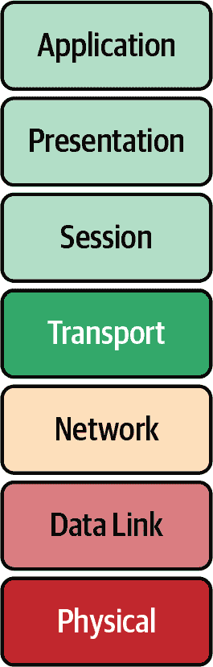

###### 图 1-2\. OSI 模型层

每一层从前一层接收数据并封装它以创建其协议数据单元（PDU）。PDU 用于描述每一层的数据。PDU 也是 TCP/IP 的一部分。会话层的应用程序被视为 PDU 的“数据”，为通信准备应用程序信息。传输使用端口来区分本地系统上负责数据的进程。网络层的 PDU 是数据包。数据包是在网络之间路由的不同数据片段。数据链路层是帧或段。每个数据包被分割成帧，检查错误并通过本地网络发送。物理层以比特形式在介质上传输帧。接下来我们将详细介绍每一层：

应用

应用层是 OSI 模型的顶层，也是最终用户每天与之交互的层。这一层不是实际应用程序所在的地方，但它为像 web 浏览器或 Office 365 这样使用它的应用程序提供接口。最大的接口是 HTTP；你可能正在通过 O'Reilly 的 web 服务器上的网页阅读这本书。我们每天使用的应用层的其他例子包括 DNS、SSH 和 SMTP。这些应用程序负责显示和安排通过网络请求和发送的数据。

表示

该层通过在应用程序和网络格式之间进行转换提供了对数据表示的独立性。它可以称为*语法层*。该层允许两个系统使用不同的数据编码并仍然在它们之间传递数据。加密也在此层进行，但这是一个更复杂的故事，我们将其保留给“TLS”。

会话

会话层负责连接的双工性，换句话说，即同时发送和接收数据。它还建立了执行会话检查点、挂起、重新启动和终止会话的过程。它建立、管理和终止本地和远程应用程序之间的连接。

传输

传输层在应用程序之间传输数据，为上层提供可靠的数据传输服务。传输层通过流量控制，分段和重新组合以及错误控制来控制给定连接的可靠性。一些协议是状态和连接导向的。该层跟踪段并重新传输失败的段。它还确认成功的数据传输并在没有错误发生时发送下一个数据。TCP/IP 在这一层有两个协议：TCP 和用户数据报协议（UDP）。

网络

网络层实现从一个网络上的主机到另一个网络上的主机的可变长度数据流的传输方式，并保持服务质量。网络层执行路由功能，并可能在报告传递错误时执行分段和重组。路由器在这一层操作，通过相邻网络发送数据。几个管理协议属于网络层，包括路由协议，组播组管理，网络层信息，错误处理和网络层地址分配，我们将在"TCP/IP"中进一步讨论。

数据链路

此层负责同一网络上的主机到主机的传输。它定义了创建和终止两个设备之间连接的协议。数据链路层在网络主机之间传输数据，并提供检测和可能纠正物理层错误的手段。数据链路帧作为第 2 层的 PDU 不会跨越本地网络的边界。

物理

物理层通过插入交换机的以太网线缆来进行可视化表示。这一层将数字比特形式的数据转换为电气、无线电或光信号。可以将这一层视为物理设备，如电缆、交换机和无线接入点。该层还定义了电线信号协议。

###### 注意

有许多助记符可以记住 OSI 模型的层次；我们最喜欢的是"All People Seem To Need Data Processing"。

表 1-2 总结了 OSI 层。

表 1-2\. OSI 层详细信息

| 层号 | 层名 | 协议数据单元 | 功能概述 |
| --- | --- | --- | --- |
| 7 | 应用 | 数据 | 高级 API 和应用协议，如 HTTP，DNS 和 SSH。 |
| 6 | 展示 | 数据 | 字符编码，数据压缩和加密/解密。 |
| 5 | 会话 | 数据 | 这里管理节点之间的连续数据交换：发送多少数据，何时发送更多。 |
| 4 | 传输 | 段，数据报 | 在网络上的端点之间传输数据段，包括分段，确认和多路复用。 |
| 3 | 网络 | 包 | 为网络上所有端点结构化和管理寻址，路由和流量控制。 |
| 2 | 数据链路 | 帧 | 在物理层连接的两个节点之间传输数据帧。 |
| 1 | 物理层 | 位 | 在介质上发送和接收位流。 |

OSI 模型分解了在两个主机之间通过网络发送数据包所需的所有必要功能。在 1980 年代末和 1990 年代初，它输给了 TCP/IP，在 DOD 和所有其他主要网络参与者中成为标准。ISO 7498 中定义的标准简要展示了当时大多数人认为复杂、低效且在某种程度上不可实施的实现细节。高层次上的 OSI 模型仍允许学习网络的人理解网络中的基本概念和挑战。此外，这些术语和功能在下一节涵盖的 TCP/IP 模型以及最终在 Kubernetes 抽象中使用。Kubernetes 服务根据其操作的层级来分解每个功能，例如层 3 的 IP 地址或层 4 的端口；您将在第四章中了解更多信息。接下来，我们将通过一个示例深入了解 TCP/IP 套件。

# TCP/IP

TCP/IP 创建了一个异构网络，具有独立于操作系统和架构差异的开放协议。无论主机运行 Windows、Linux 还是其他操作系统，TCP/IP 都允许它们通信；TCP/IP 并不关心您在应用层运行 Apache 还是 Nginx 作为您的 Web 服务器。与 OSI 模型类似的责任分离使这一点成为可能。在图 1-3 中，我们比较了 OSI 模型和 TCP/IP。

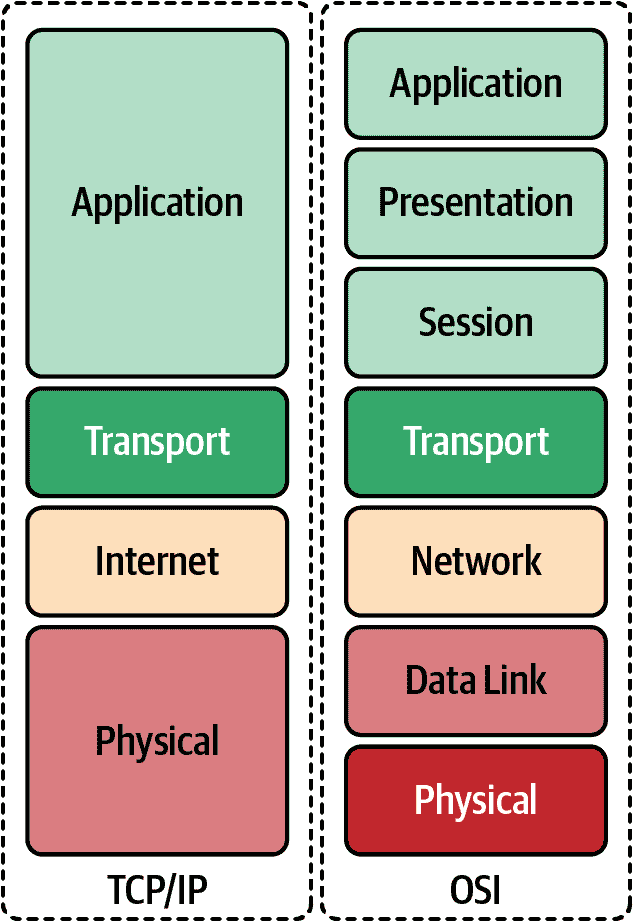

###### 图 1-3\. OSI 模型与 TCP/IP 的比较

这里我们详细探讨了 OSI 模型与 TCP/IP 之间的差异：

应用层

在 TCP/IP 中，应用层包括在 IP 网络中进程间通信所使用的通信协议。应用层标准化通信，并依赖底层传输层协议建立主机间的数据传输。较低的传输层还管理网络通信中的数据交换。此层的应用程序在 RFC 中定义；在本书中，我们将继续以 HTTP，RFC 7231 作为应用层的示例。

传输

TCP 和 UDP 是传输层的主要协议，为应用程序提供主机到主机的通信服务。传输协议负责面向连接的通信、可靠性、流量控制和多路复用。在 TCP 中，窗口大小管理流量控制，而 UDP 不管理拥塞流，并且被认为是不可靠的；你可以在“UDP”中了解更多信息。每个端口标识负责处理来自网络通信的信息的主机进程。HTTP 使用 80 号端口进行非安全通信和 443 号端口进行安全通信。服务器上的每个端口标识其流量，并且发送方在本地生成一个随机端口来标识自己。管理端口号分配的机构是互联网分配号码管理局（IANA）；共有 65535 个端口。

互联网

互联网或网络层负责在网络之间传输数据。对于传出的数据包，它选择下一个跳点主机，并通过将其传递给适当的链路层将其传输到该主机。一旦数据包被目标接收，互联网层将把数据包载荷传递给适当的传输层协议。

IP 根据最大传输单元（MTU）对数据包进行分段或重组；这是 IP 数据包的最大大小。IP 不保证数据包的正确到达。由于跨不同网络的数据包传输本质上是不可靠且容易出错的，这种负担在通信路径的端点而不是网络上。提供服务可靠性的功能位于传输层。校验和确保接收到的数据包信息准确，但此层不验证数据完整性。IP 地址用于标识网络上的数据包。

链路

TCP/IP 模型中的链路层包括仅在主机连接到的本地网络上运行的网络协议。数据包不会路由到非本地网络；这是互联网层的角色。以太网是该层的主要协议，并且主机通过链路层地址或通常是它们网络接口卡上的媒体访问控制地址来识别。一旦主机通过地址解析协议 9（ARP）确定了这些数据，远程网络上发送的数据由互联网层处理。该层还包括在两个互联网层主机之间移动数据包的协议。

物理层

物理层定义了用于网络的硬件组件。例如，物理网络层规定了通信介质的物理特性。TCP/IP 的物理层详细描述了硬件标准，如 IEEE 802.3，即以太网网络介质的规范。RFC 1122 的物理层有几种解释，与其他层一起包含在内；我们为完整性而添加这些。

在本书中，我们将使用最小的 Golang Web 服务器（也称为 Go）来展示从示例 1-1 开始的各种网络组件层次，从 Linux 系统调用的`tcpdump`到展示 Kubernetes 如何抽象系统调用的过程。本节将使用它来演示在应用程序、传输、网络和数据链路层各层发生的情况。

## 应用程序

如前所述，应用程序是 TCP/IP 堆栈中的最高层；在数据通过网络发送之前，用户与数据交互的地方。在我们的示例演示中，我们将使用超文本传输协议（HTTP）和简单的 HTTP 事务来演示 TCP/IP 堆栈的每一层发生了什么。

### HTTP

HTTP 负责发送和接收超文本标记语言（HTML）文档——你知道，网页。互联网上大部分我们看到和做的事情都是通过 HTTP 完成的：亚马逊购物、Reddit 帖子和推特都使用 HTTP。客户端将向我们的最小 Golang Web 服务器（来自示例 1-1）发出 HTTP 请求，它将发送一个带有“Hello”文本的 HTTP 响应。该 Web 服务器在 Ubuntu 虚拟机中本地运行，以测试完整的 TCP/IP 堆栈。

###### 注意

查看示例代码[存储库](https://oreil.ly/Jan5M)获取完整说明。

##### 示例 1-1\. Go 中的最小 Web 服务器

```
package main

import (
	"fmt"
	"net/http"
)

func hello(w http.ResponseWriter, _ *http.Request) {
	fmt.Fprintf(w, "Hello")
}

func main() {
	http.HandleFunc("/", hello)
	http.ListenAndServe("0.0.0.0:8080", nil)
}
```

在我们的 Ubuntu 虚拟机中，我们需要启动我们的最小 Web 服务器；或者，如果您在本地安装了 Golang，您可以直接运行以下命令：

```
go run web-server.go
```

让我们分解每个 TCP/IP 堆栈层的请求。

cURL 是我们 HTTP 请求示例中的请求客户端。通常情况下，对于网页，客户端将是 Web 浏览器，但我们使用 cURL 来简化并显示命令行。

###### 注意

[cURL](https://curl.haxx.se) 旨在通过 URL 上传和下载指定的数据。它是一个客户端程序（*c*），用于请求 URL 上的数据并返回响应。

在示例 1-2 中，我们可以看到 cURL 客户端正在进行的每个 HTTP 请求的各个部分以及响应。让我们审视所有这些选项和输出是什么。

##### 示例 1-2\. 客户端请求

```
○ → curl localhost:8080 -vvv 
*   Trying ::1...
* TCP_NODELAY set
* Connected to localhost (::1) port 8080 
> GET / HTTP/1.1 
> Host: localhost:8080 
> User-Agent: curl/7.64.1 
> Accept: */* 
>
< HTTP/1.1 200 OK 
< Date: Sat, 25 Jul 2020 14:57:46 GMT 
< Content-Length: 5 
< Content-Type: text/plain; charset=utf-8 
<
* Connection #0 to host localhost left intact Hello* Closing connection 0 
```


`curl` `localhost:8080` `-vvv`：这是打开与本地运行的 Web 服务器`localhost`在 TCP 端口 8080 上的连接的`curl`命令。`-vvv`设置输出的冗长程度，以便我们可以看到请求中发生的一切。此外，`TCP_NODELAY`指令 TCP 连接发送数据而无需延迟，这是客户端可设置的众多选项之一。


`已连接` `到` `localhost` `(::1)` `端口` `8080`：成功了！cURL 连接到了本地主机上的 Web 服务器，并通过端口 8080 进行了连接。


`Get` `/` `HTTP/1.1`: HTTP 有多种方法用于检索或更新信息。在我们的请求中，我们正在执行 HTTP GET 来检索我们的“Hello”响应。斜杠是下一个部分，Uniform Resource Locator (URL)，它指示我们将客户端请求发送到服务器的位置。此头部的最后部分是服务器正在使用的 HTTP 版本，1.1。


`Host:` `localhost:8080`: HTTP 有多个选项可用于发送关于请求的信息。在我们的请求中，cURL 进程已设置了 HTTP Host 头。客户端和服务器可以在 HTTP 请求或响应中传输信息。HTTP 头部包含其名称后跟一个冒号（:），然后是其值。


`User-Agent: cURL/7.64.1`: 用户代理是指示代表最终用户发出 HTTP 请求的计算机程序的字符串；在我们的情况下是 cURL。此字符串通常标识浏览器、其版本号和其主机操作系统。


`Accept:` `*/*`: 此头部指示 Web 服务器客户端理解的内容类型。表 1-3 展示了可以发送的常见内容类型示例。


`HTTP/1.1` `200` `OK`: 这是我们请求的服务器响应。服务器用 HTTP 版本和响应状态码进行响应。服务器可能会有多种响应。状态码 200 表示响应成功。1XX 表示信息性响应，2XX 表示成功，3XX 表示重定向，4XX 表示请求存在问题，5XX 通常指服务器问题。


`Date: Sat, July 25, 2020, 14:57:46 GMT`: `Date` 头字段表示消息生成的日期和时间。发送者生成该值作为消息生成的大致日期和时间。


`Content-Length: 5`: `Content-Length` 头部指示发送到接收者的消息正文大小，以字节为单位；在我们的情况下，消息为 5 字节。


`Content-Type: text/plain; charset=utf-8`: `Content-Type` 实体头部用于指示资源的媒体类型。我们的响应指示返回的是一个纯文本文件，使用 UTF-8 编码。


`Hello* Closing connection 0`: 这打印出我们的 Web 服务器的响应并关闭 HTTP 连接。

表 1-3\. HTTP 数据的常见内容类型

| 类型 | 描述 |
| --- | --- |
| application | 任何不明确属于其他类型的二进制数据。常见示例包括 application/json、application/pdf、application/pkcs8 和 application/zip。 |
| audio | 音频或音乐数据。例如 audio/mpeg 和 audio/vorbis。 |
| font | 字体/字型数据。常见示例包括 font/woff、font/ttf 和 font/otf。 |
| image | 包括位图和矢量图像的图像或图形数据，例如动画 GIF 或 APNG。常见示例包括 image/jpg、image/png 和 image/svg+xml。 |
| model | 用于 3D 对象或场景的模型数据。示例包括 model/3mf 和 model/vrml。 |
| text | 仅包含人类可读内容、源代码或文本数据的文本。例如 text/plain、text/csv 和 text/html。 |
| video | 视频数据或文件，例如 video/mp4。 |

这是每个 HTTP 请求中发生的简单视图。今天，单个网页在短短几秒钟内进行大量请求！这是一个针对集群管理员的简要示例，说明 HTTP（以及其他七层应用程序）的操作方式。我们将继续建立对 TCP/IP 协议栈各层如何完成这些请求的了解，然后介绍 Kubernetes 如何完成相同的请求。所有这些数据都在第 7 层格式化和设置选项，但真正的重活儿在 TCP/IP 协议栈的更低层完成，我们将在接下来的部分讨论它们。

## 传输

传输层协议负责面向连接的通信、可靠性、流量控制和复用；这在 TCP 中是大部分正确的。我们将在以下部分描述差异。我们的 Golang Web 服务器是一个使用 HTTP 的第 7 层应用程序；HTTP 依赖的传输层是 TCP。

### TCP

正如前面提到的，TCP 是一种面向连接的可靠协议，它提供流量控制和复用。TCP 被认为是面向连接的，因为它通过连接的生命周期管理连接状态。在 TCP 中，窗口大小管理流量控制，不像 UDP 那样管理拥塞流。此外，UDP 是不可靠的，数据可能无序到达。每个端口标识负责处理网络通信信息的主机进程。TCP 被称为主机到主机层协议。为了识别主机上负责连接的进程，TCP 使用 16 位端口号标识段。HTTP 服务器使用非安全通信的众所周知端口 80 和使用传输层安全性（TLS）进行安全通信的端口 443。请求建立新连接的客户端在本地使用 0–65534 范围内的源端口。

要了解 TCP 如何执行复用，请回顾一个简单的 HTML 页面检索：

1.  在 Web 浏览器中键入网页地址。

1.  浏览器打开连接以传输页面。

1.  浏览器为页面上的每个图像打开连接。

1.  浏览器为外部 CSS 打开另一个连接。

1.  每个连接使用不同的虚拟端口集。

1.  所有页面资源同时下载。

1.  浏览器重建页面。

让我们通过 TCP 段头部中提供的信息来了解 TCP 如何管理多路复用：

`源端口`（16 位）

这标识了发送端口。

`目的端口`（16 位）

这标识了接收端口。

`序列号`（32 位）

如果设置了 SYN 标志，则这是初始序列号。第一个数据字节的序列号以及对应 ACK 中的确认号是此序列号加 1。它还用于重新组装到达的乱序数据。

`确认号`（32 位）

如果设置了 ACK 标志，则此字段的值是发送方期望的下一个确认号。这确认接收到所有之前的字节（如果有的话）。每端的第一个 ACK 确认了另一端的初始序列号本身，但尚未发送任何数据。

`数据偏移量`（4 位）

这指定了 TCP 头部的大小，以 32 位字为单位。

`保留`（3 位）

这是未来使用的，并应设置为零。

`标志`（9 位）

TCP 头部定义了九个 1 位字段：

+   NS-ECN-nonce：掩蔽保护。

+   CWR：拥塞窗口减少；发送方降低了其发送速率。

+   ECE：ECN Echo；发送方接收到先前的拥塞通知。

+   URG：紧急；紧急指针字段有效，但很少使用。

+   ACK：确认；确认号字段有效，在建立连接后始终打开。

+   PSH：推送；接收方应尽快将此数据传递给应用程序。

+   RST：重置连接或连接中止，通常是因为错误。

+   SYN：同步序列号以启动连接。

+   FIN：段的发送方完成向其对等体发送数据。

###### 注意

NS 位字段在 RFC 3540 中进一步解释，“使用非掩码的鲁棒显式拥塞通知（ECN）信号”。该规范描述了 ECN 的可选增强部分，以提高对标记数据包的恶意或意外掩蔽的鲁棒性。

`窗口大小`（16 位）

这是接收窗口的大小。

`校验和`（16 位）

校验和字段用于检查 TCP 头部的错误。

`紧急指针`（16 位）

这是从序列号指示的最后紧急数据字节的偏移量。

`选项`

变量 0-320 位，以 32 位为单位。

`填充`

TCP 头部填充用于确保 TCP 头部结束，并且数据从 32 位边界开始。

`数据`

这是在此段中发送的应用数据片段。

在图 1-4 中，我们可以看到所有提供关于 TCP 流的 TCP 段头部的元数据。

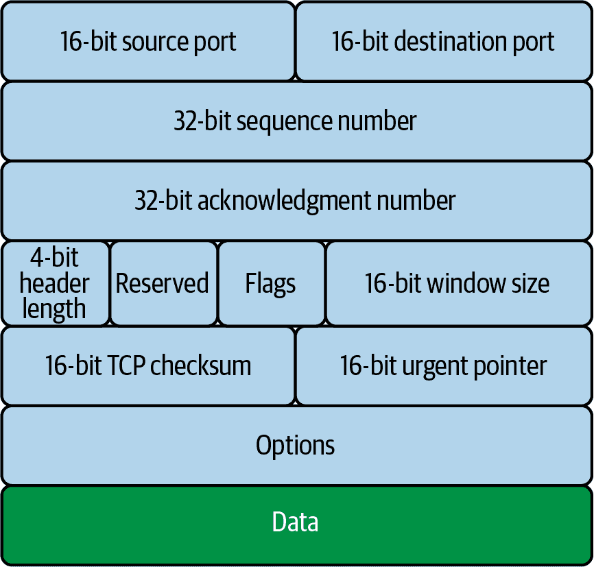

###### 图 1-4\. TCP 段头部

这些字段帮助管理两个系统之间的数据流。图 1-5 显示了 TCP/IP 协议栈的每个步骤如何将数据从一个主机上的一个应用程序通过在层 1 和层 2 通信的网络，发送到目标主机上。

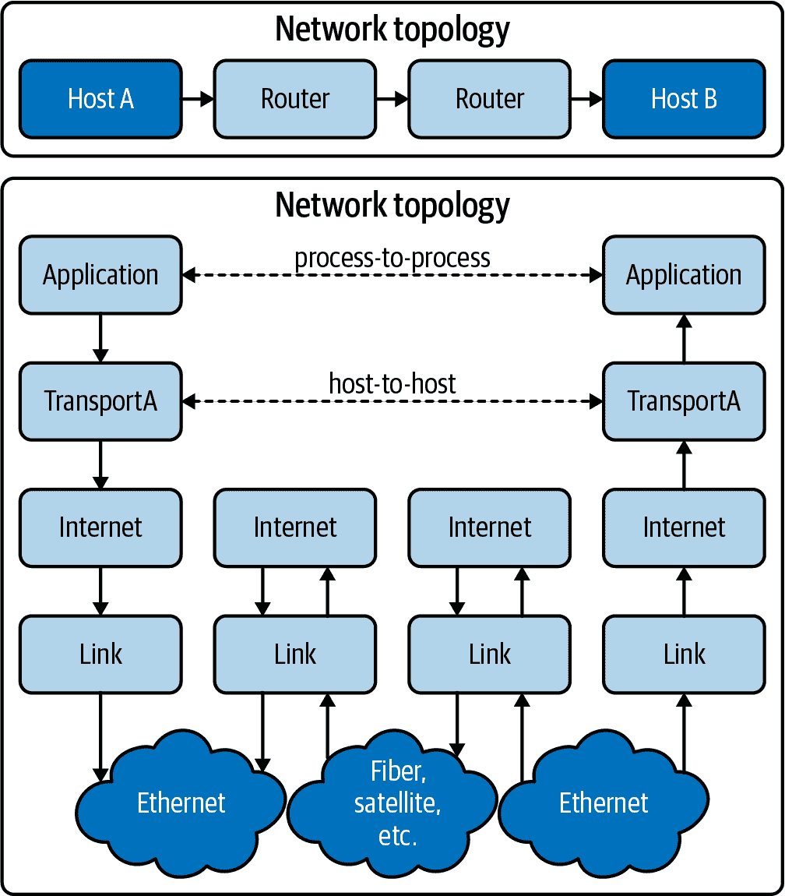

###### 图 1-5\. tcp/ip 数据流

在接下来的部分中，我们将展示 TCP 如何利用这些字段通过三次握手初始化连接。

### TCP 握手

TCP 使用三次握手（详见 图 1-6）来创建连接，通过沿途交换各种选项和标志的信息：

1.  请求节点通过 SYN 包发送连接请求以启动传输。

1.  如果接收节点正在监听发送方请求的端口，则接收节点将以 SYN-ACK 回复，确认已收到请求节点。

1.  请求节点返回一个 ACK 包，交换信息并让对方知道节点可以相互发送信息。

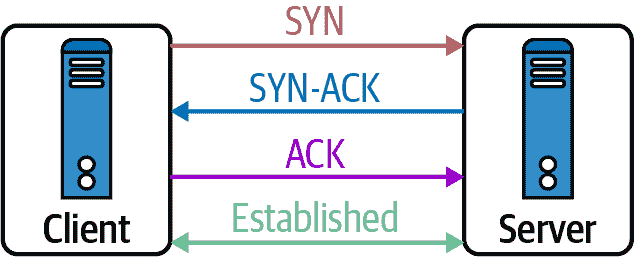

###### 图 1-6\. TCP 三次握手

现在连接已经建立。数据可以通过物理介质传输，在网络之间路由，以找到本地目的地，但是终端如何知道如何处理信息？在本地和远程主机上，创建了一个套接字来跟踪这个连接。套接字只是通信的逻辑端点。在 第二章 中，我们将讨论 Linux 客户端和服务器如何处理套接字。

TCP 是一种有状态的协议，跟踪连接在其生命周期中的状态。连接状态取决于发送方和接收方在连接流中的协商。连接状态关注的是谁在 TCP 流中发送和接收数据。TCP 在 TCP 段头部使用 9 位 TCP 标志进行复杂的状态转换，您可以在 图 1-7 中看到。

TCP 连接状态包括：

`LISTEN`（服务器）

表示等待来自任何远程 TCP 和端口的连接请求

`SYN-SENT`（客户端）

表示在发送连接请求后等待匹配的连接请求确认

`SYN-RECEIVED`（服务器）

表示在收到并发送连接请求后等待确认连接请求的确认连接请求

`ESTABLISHED`（服务器和客户端都是）

表示已建立连接；接收到的数据可以传递给用户——连接传输阶段的中间状态

`FIN-WAIT-1`（服务器和客户端都是）

表示等待远程主机的连接终止请求

`FIN-WAIT-2`（服务器和客户端都是）

表示等待来自远程 TCP 的连接终止请求

`CLOSE-WAIT`（服务器和客户端都是）

表示等待本地用户的连接终止请求

`CLOSING`（服务器和客户端都是）

表示等待远程 TCP 的连接终止请求确认。

`LAST-ACK`（服务器和客户端均是如此）

表示等待先前发送到远程主机的连接终止请求的确认。

`TIME-WAIT`（无论是服务器还是客户端）

表示等待足够的时间以确保远程主机收到其连接终止请求的确认。

`CLOSED`（服务器和客户端均是如此）

表示没有任何连接状态

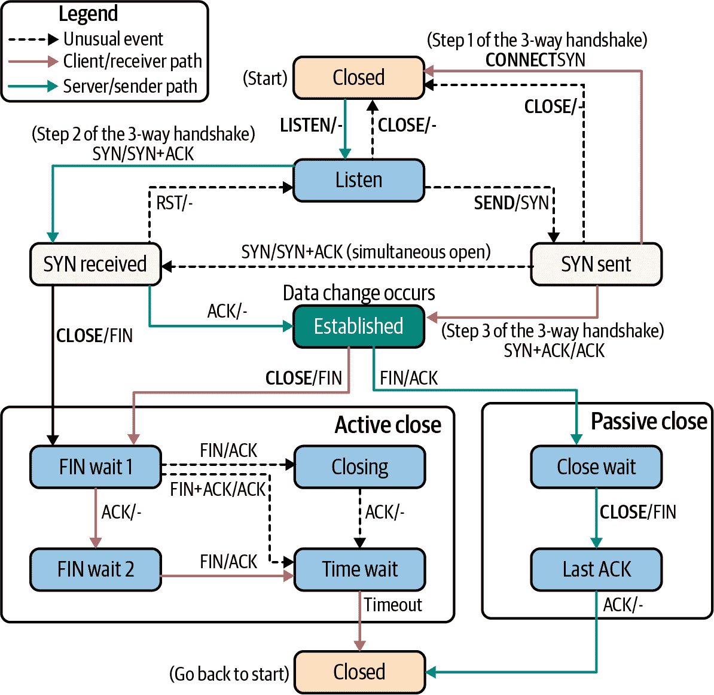

###### 图 1-7\. TCP 状态转换图

Example 1-3 是 Mac 的 TCP 连接示例，显示了它们的状态以及连接两端的地址。

##### 示例 1-3\. TCP 连接状态

```
○ → netstat -ap TCP
Active internet connections (including servers)
Proto Recv-Q Send-Q  Local Address          Foreign Address        (state)
tcp6       0      0  2607:fcc8:a205:c.53606 g2600-1407-2800-.https ESTABLISHED
tcp6       0      0  2607:fcc8:a205:c.53603 g2600-1408-5c00-.https ESTABLISHED
tcp4       0      0  192.168.0.17.53602     ec2-3-22-64-157..https ESTABLISHED
tcp6       0      0  2607:fcc8:a205:c.53600 g2600-1408-5c00-.https ESTABLISHED
tcp4       0      0  192.168.0.17.53598     164.196.102.34.b.https ESTABLISHED
tcp4       0      0  192.168.0.17.53597     server-99-84-217.https ESTABLISHED
tcp4       0      0  192.168.0.17.53596     151.101.194.137.https  ESTABLISHED
tcp4       0      0  192.168.0.17.53587     ec2-52-27-83-248.https ESTABLISHED
tcp6       0      0  2607:fcc8:a205:c.53586 iad23s61-in-x04..https ESTABLISHED
tcp6       0      0  2607:fcc8:a205:c.53542 iad23s61-in-x04..https ESTABLISHED
tcp4       0      0  192.168.0.17.53536     ec2-52-10-162-14.https ESTABLISHED
tcp4       0      0  192.168.0.17.53530     server-99-84-178.https ESTABLISHED
tcp4       0      0  192.168.0.17.53525     ec2-52-70-63-25..https ESTABLISHED
tcp6       0      0  2607:fcc8:a205:c.53480 upload-lb.eqiad..https ESTABLISHED
tcp6       0      0  2607:fcc8:a205:c.53477 text-lb.eqiad.wi.https ESTABLISHED
tcp4       0      0  192.168.0.17.53466     151.101.1.132.https    ESTABLISHED
tcp4       0      0  192.168.0.17.53420     ec2-52-0-84-183..https ESTABLISHED
tcp4       0      0  192.168.0.17.53410     192.168.0.18.8060      CLOSE_WAIT
tcp6       0      0  2607:fcc8:a205:c.53408 2600:1901:1:c36:.https ESTABLISHED
tcp4       0      0  192.168.0.17.53067     ec2-52-40-198-7..https ESTABLISHED
tcp4       0      0  192.168.0.17.53066     ec2-52-40-198-7..https ESTABLISHED
tcp4       0      0  192.168.0.17.53055     ec2-54-186-46-24.https ESTABLISHED
tcp4       0      0  localhost.16587        localhost.53029        ESTABLISHED
tcp4       0      0  localhost.53029        localhost.16587        ESTABLISHED
tcp46      0      0  *.16587                *.*                    LISTEN
tcp6      56      0  2607:fcc8:a205:c.56210 ord38s08-in-x0a..https CLOSE_WAIT
tcp6       0      0  2607:fcc8:a205:c.51699 2606:4700::6810:.https ESTABLISHED
tcp4       0      0  192.168.0.17.64407     do-77.lastpass.c.https ESTABLISHED
tcp4       0      0  192.168.0.17.64396     ec2-54-70-97-159.https ESTABLISHED
tcp4       0      0  192.168.0.17.60612     ac88393aca5853df.https ESTABLISHED
tcp4       0      0  192.168.0.17.58193     47.224.186.35.bc.https ESTABLISHED
tcp4       0      0  localhost.63342        *.*                    LISTEN
tcp4       0      0  localhost.6942         *.*                    LISTEN
tcp4       0      0  192.168.0.17.55273     ec2-50-16-251-20.https ESTABLISHED
```

现在我们更了解 TCP 如何构建和跟踪连接，让我们使用一个名为 `tcpdump` 的命令行工具，来回顾在传输层上使用 TCP 的我们的 Web 服务器的 HTTP 请求。为了实现这一目标，我们使用一个叫做 `tcpdump` 的命令行工具。

### tcpdump

> `tcpdump` 打印出与布尔表达式匹配的网络接口上数据包内容的描述。
> 
> tcpdump 手册页

`tcpdump` 允许管理员和用户显示系统上处理的所有数据包，并根据许多 TCP 段头部细节进行过滤。在请求中，我们过滤所有目的端口为 8080 的网络接口 lo0 上的数据包；这是 Mac 上的本地回环接口。我们的 Web 服务器运行在 0.0.0.0:8080。图 1-8\. Figure 1-8 显示了 `tcpdump` 收集数据的位置，参考完整的 TCP/IP 栈，位于网络接口卡（NIC）驱动程序和第二层之间。

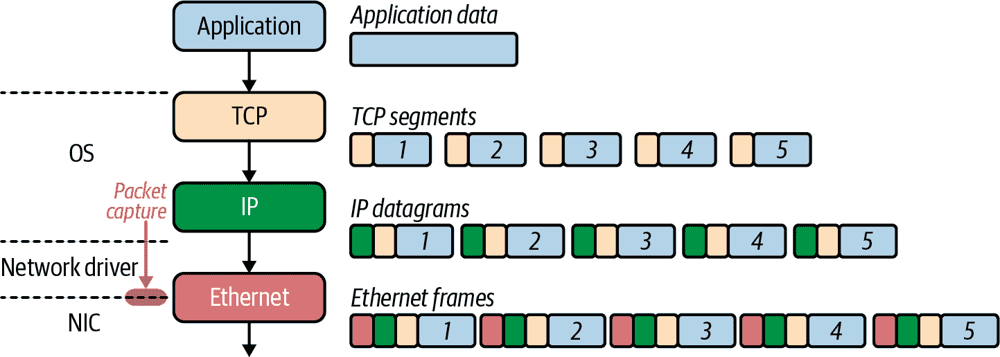

###### 图 1-8\. `tcpdump` 数据包捕获

###### 注意

回环接口是设备上的逻辑虚拟接口。回环接口不像以太网接口那样是物理接口。回环接口始终处于活动状态，即使主机上的其他接口关闭，它们也始终可用。

`tcpdump` 的一般输出格式将包含以下字段：`tos`, `TTL`, `id`, `offset`, `flags`, `proto`, `length` 和 `options`。让我们来回顾一下这些：

`tos`

服务类型字段。

`TTL`

存活时间；如果为零则不报告。

`id`

IP 标识字段。

`offset`

分段偏移字段；无论是否是分段数据报的一部分，都会打印此字段。

`flags`

DF（不分片）标志，指示数据包不能用于传输时分片。当未设置时，表示数据包可以分片。MF（更多分片）标志指示有包含更多分片的数据包，当未设置时，表示不再有分片。

`proto`

协议 ID 字段。

`length`

总长度字段。

`options`

IP 选项。

支持校验和卸载和 IP、TCP 和 UDP 校验和在传输到线路之前在 NIC 上计算的系统。由于我们在 NIC 之前运行`tcpdump`数据包捕获，所以像`cksum 0xfe34 (incorrect -> 0xb4c1)`这样的错误会出现在示例 1-4 的输出中。

要生成示例 1-4 的输出，请在另一个终端打开并在环回接口上开始`tcpdump`跟踪，仅针对 TCP 和端口 8080；否则，您将看到许多与我们示例无关的其他数据包。您需要使用升级特权来跟踪数据包，这意味着在这种情况下使用`sudo`。

##### 示例 1-4\. `tcpdump`

```
○ → sudo tcpdump -i lo0 tcp port 8080 -vvv  

tcpdump: listening on lo0, link-type NULL (BSD loopback),
capture size 262144 bytes  

08:13:55.009899 localhost.50399 > localhost.http-alt: Flags [S],
cksum 0x0034 (incorrect -> 0x1bd9), seq 2784345138,
win 65535, options [mss 16324,nop,wscale 6,nop,nop,TS val 587364215 ecr 0,
sackOK,eol], length 0 

08:13:55.009997 localhost.http-alt > localhost.50399: Flags [S.],
cksum 0x0034 (incorrect -> 0xbe5a), seq 195606347,
ack 2784345139, win 65535, options [mss 16324,nop,wscale 6,nop,nop,
TS val 587364215 ecr 587364215,sackOK,eol], length 0  

08:13:55.010012 localhost.50399 > localhost.http-alt: Flags [.],
cksum 0x0028 (incorrect -> 0x1f58), seq 1, ack 1,
win 6371, options [nop,nop,TS val 587364215 ecr 587364215],
length 0  

v 08:13:55.010021 localhost.http-alt > localhost.50399: Flags [.],
cksum 0x0028 (incorrect -> 0x1f58), seq 1, ack
1, win 6371, options [nop,nop,TS val 587364215 ecr 587364215],
length 0  

08:13:55.010079 localhost.50399 > localhost.http-alt: Flags [P.],
cksum 0x0076 (incorrect -> 0x78b2), seq 1:79,
ack 1, win 6371, options [nop,nop,TS val 587364215 ecr 587364215],
length 78: HTTP, length: 78  
GET / HTTP/1.1
Host: localhost:8080
User-Agent: curl/7.64.1
Accept: */*
08:13:55.010102 localhost.http-alt > localhost.50399: Flags [.],
cksum 0x0028 (incorrect -> 0x1f0b), seq 1,
ack 79, win 6370, options [nop,nop,TS val 587364215 ecr 587364215],
length 0  

08:13:55.010198 localhost.http-alt > localhost.50399: Flags [P.],
cksum 0x00a1 (incorrect -> 0x05d7), seq 1:122,
ack 79, win 6370, options [nop,nop,TS val 587364215 ecr 587364215],
length 121: HTTP, length: 121  
HTTP/1.1 200 OK
Date: Wed, 19 Aug 2020 12:13:55 GMT
Content-Length: 5
Content-Type: text/plain; charset=utf-8
Hello[!http]

08:13:55.010219 localhost.50399 > localhost.http-alt: Flags [.], cksum 0x0028
(incorrect -> 0x1e93), seq 79,
ack 122, win 6369, options [nop,nop,TS val 587364215 ecr 587364215], length 0  

08:13:55.010324 localhost.50399 > localhost.http-alt: Flags [F.],
cksum 0x0028 (incorrect -> 0x1e92), seq 79,
ack 122, win 6369, options [nop,nop,TS val 587364215 ecr 587364215],
length 0  

08:13:55.010343 localhost.http-alt > localhost.50399: Flags [.],
cksum 0x0028 (incorrect -> 0x1e91), seq 122,
\ack 80, win 6370, options [nop,nop,TS val 587364215 ecr 587364215],
length 0  

08:13:55.010379 localhost.http-alt > localhost.50399: Flags [F.],
cksum 0x0028 (incorrect -> 0x1e90), seq 122,
ack 80, win 6370, options [nop,nop,TS val 587364215 ecr 587364215],
length 0  

08:13:55.010403 localhost.50399 > localhost.http-alt: Flags [.],
cksum 0x0028 (incorrect -> 0x1e91), seq 80, ack
123, win 6369, options [nop,nop,TS val 587364215 ecr 587364215],
length 0  

 12 packets captured, 12062 packets received by filter
 0 packets dropped by kernel.  
```


这是使用其命令及其所有选项进行`tcpdump`收集的开始。`sudo`数据包捕获了所需的升级特权。`tcpdump`是`tcpdump`二进制文件。`-i lo0`是我们想要捕获数据包的接口。`dst port 8080`是匹配表达式，即手册中讨论的内容；这里我们匹配所有发送到 TCP 端口 8080 的数据包，这是 Web 服务用于接收请求的端口。`-v`是详细选项，允许我们从`tcpdump`捕获中查看更多细节。


`tcpdump`的反馈告诉我们关于运行的`tcpdump`过滤器。


这是 TCP 握手中的第一个数据包。我们可以通过设置的标志位`[S]`和由 cURL 设置的序列号`2784345138`来判断这是 SYN，本地进程号为`50399`。


由`tcpdump`从`localhost.http-alt`进程中过滤出的 SYN-ACK 数据包，即 Golang Web 服务器。标志为`[S.]`，因此是 SYN-ACK。数据包发送`195606347`作为下一个序列号，ACK 设置为`2784345139`以确认前一个数据包。


cURL 的确认数据包现在带有设置的 ACK 标志`[.]`，ACK 和 SYN 号设置为 1，表示准备发送数据。


确认号设置为 1，以指示在开放数据推送中客户端的 SYN 标志的接收。


TCP 连接已建立；客户端和服务器均已准备好进行数据传输。接下来的数据包是我们的 HTTP 请求数据传输，标志设置为数据推送和 ACK`[P.]`。前面的数据包长度为零，但 HTTP 请求为 78 字节长，序列号为 1:79。


服务器确认数据传输的接收，设置了 ACK 标志`[.]`，发送了序列号为 79 的确认号。


这个包是 HTTP 服务器对 cURL 请求的响应。数据推送标志被设置，`[P.]`，并用 ACK 数字 79 确认了前一个包。设置数据传输的新序列号为 122，数据长度为 121 字节。


cURL 客户端用设置 ACK 标志的包确认接收该包，将确认号设置为 122，并将序列号设置为 79。


开始关闭 TCP 连接，客户端发送 FIN-ACK 包，`[F.]`，确认接收了前一个包，编号为 122，并将新的序列号设为 80。


服务器将确认号增加到 80 并设置 ACK 标志。


TCP 要求发送方和接收方都设置 FIN 包以关闭连接。这是 FIN 和 ACK 标志被设置的包。


这是客户端的最终 ACK，确认号为 123。连接现在已关闭。


`tcpdump` 在退出时会告诉我们此次捕获的包数、在 `tcpdump` 期间捕获的包的总数，以及操作系统丢弃了多少包。

`tcpdump` 是网络工程师和集群管理员的一个优秀故障排除工具。能够在集群和网络的多个层面验证连通性是非常有价值的技能。你将在 第六章 中看到 `tcpdump` 的用处。

我们的示例是一个使用 TCP 的简单 HTTP 应用程序。所有这些数据都是以明文形式通过网络发送的。虽然这个示例是一个简单的 Hello World，但其他请求，如我们的银行登录，需要一些安全措施。传输层不会为通过网络传输的数据提供任何安全保护。TLS 在 TCP 上添加了额外的安全保护。让我们在下一节中深入了解。

### TLS

TLS 为 TCP 添加了加密。TLS 是 TCP/IP 套件的一个附加组件，不被视为 TCP 基本操作的一部分。HTTP 事务可以在没有 TLS 的情况下完成，但在网络中不会受到窃听者的攻击。TLS 是一种协议组合，用于确保发送者和接收者之间的流量安全。TLS 与 TCP 类似，使用握手建立加密能力并交换加密密钥。以下步骤详细介绍了客户端和服务器之间的 TLS 握手，也可以在 图 1-9 中看到：

1.  ClientHello：这包含客户端支持的密码套件和一个随机数。

1.  ServerHello：此消息包含它支持的密码及一个随机数。

1.  ServerCertificate：包含服务器的证书及其服务器公钥。

1.  ServerHelloDone：这是 ServerHello 的结束。如果客户端收到要求其证书的请求，则发送 ClientCertificate 消息。

1.  ClientKeyExchange：基于服务器的随机数，我们的客户端生成一个随机的预主密钥，用服务器的公钥证书加密后发送给服务器。

1.  密钥生成：客户端和服务器从预主密钥生成一个主密钥，并交换随机值。

1.  ChangeCipherSpec：现在客户端和服务器交换它们的 ChangeCipherSpec 以开始使用新密钥进行加密。

1.  完成客户端：客户端发送完成消息以确认密钥交换和认证成功。

1.  完成服务器：现在，服务器向客户端发送完成消息以结束握手。

Kubernetes 应用程序和组件将为开发人员管理 TLS，因此需要基本介绍；第五章 将进一步审视 TLS 和 Kubernetes。

如同我们的 Web 服务器、cURL 和 `tcpdump` 所示，TCP 是一种在主机之间发送数据的有状态可靠协议。它使用标志位、序列号和确认号的交互来在全球不可靠网络上传递数千条消息。然而，这种可靠性是有代价的。在我们设置的 12 个数据包中，只有两个是真正的数据传输。对于不需要像语音这样可靠性的应用程序来说，UDP 带来的开销提供了一种替代选择。现在我们理解了作为可靠连接导向协议的 TCP 如何运作，让我们来回顾一下 UDP 与 TCP 的区别。

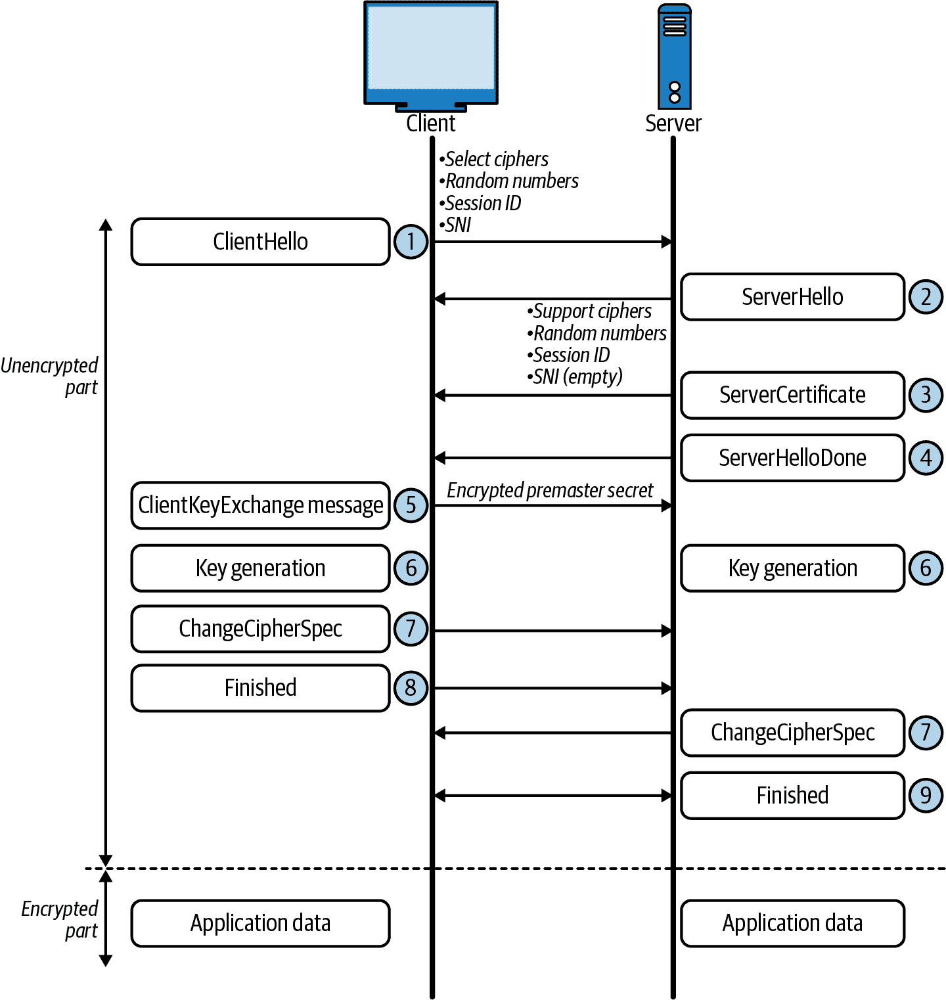

###### 图 1-9\. TLS 握手

### UDP

UDP 为那些不需要 TCP 提供的可靠性的应用程序提供了一种选择。UDP 对于能够承受数据包丢失的应用程序（例如语音和 DNS）非常适合。从网络角度来看，UDP 的开销很小，只有四个字段，没有数据确认，不像其冗长的兄弟 TCP。

它是事务导向的，适用于简单的查询和响应协议，如域名系统（DNS）和简单网络管理协议（SNMP）。UDP 将请求分割成数据报，因此适用于其他隧道协议（如虚拟专用网络（VPN））。它轻量且简单，非常适合在 DHCP 的情况下引导应用程序数据。数据传输的无状态性使 UDP 成为能够承受数据包丢失的应用程序（例如语音）的完美选择——你听到了吗？UDP 的不重新传输也使其成为流媒体视频的适当选择。

让我们看看 UDP 数据报中所需的少量头部信息（参见图 1-10）：

`源端口号`（2 字节）

标识发送端口。源主机是客户端；端口号是临时的。UDP 端口有像 DNS 的 53 或 DHCP 的 67/68 这样的众所周知的数字。

`目标端口号`（2 字节）

标识接收端口并且是必需的。

`长度`（2 字节）

指定 UDP 头部和 UDP 数据的长度（以字节为单位）。最小长度为 8 字节，即头部的长度。

`校验和`（2 字节）

用于对头部和数据进行错误检查。在 IPv4 中是可选的，但在 IPv6 中是强制的，如果未使用则全部为零。

UDP 和 TCP 是通用的传输协议，帮助主机之间发送和接收数据。Kubernetes 在网络上支持这两种协议，服务允许用户通过服务来负载均衡许多 Pod。还需要注意的是，在每个服务中，开发人员必须定义传输协议；如果未定义，则默认使用 TCP。

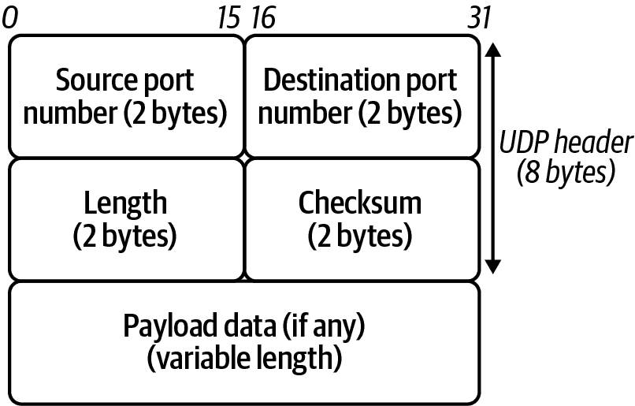

###### 图 1-10\. UDP 头部

TCP/IP 堆栈中的下一层是互联网层——这些是可以在组成互联网的广阔网络上发送的数据包。让我们回顾一下如何完成这个过程。

## 网络

所有的 TCP 和 UDP 数据在 TCP/IP 网络层中作为 IP 数据包进行传输。互联网或网络层负责在网络之间传输数据。出站数据包选择下一跳主机，并通过传递适当的链路层细节将数据发送给该主机；数据包由主机接收，去封装后发送到适当的传输层协议上。在 IPv4 中，无论是发送还是接收，IP 根据 MTU 提供数据包的分段或重组；这是 IP 数据包的最大大小。

IP 不保证数据包的正确到达；因为跨不同网络的数据包传递本质上是不可靠和容易出错的，这个负担在通信路径的端点上而不是网络上。如前所述，提供服务可靠性是传输层的功能。每个数据包都有一个校验和来确保接收到的数据包信息准确，但此层不验证数据完整性。源和目标 IP 地址标识网络上的数据包，我们将在下一步讨论。

## 互联网协议

这个强大的数据包在 RFC 791 中定义，用于在网络间发送数据。图 1-11 展示了 IPv4 头部的格式。

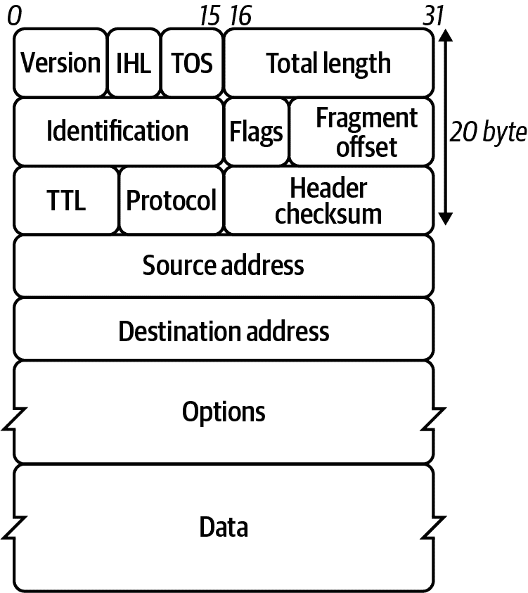

###### 图 1-11\. IPv4 头部格式

让我们更详细地查看头部字段：

`版本`

IP 数据包中的第一个头部字段是四位版本字段。对于 IPv4，这总是等于四。

`互联网头部长度`（IHL）

IPv4 头部由于可选的第 14 个字段选项而具有可变大小。

`服务类型`

最初定义为服务类型（ToS），现在是区分服务代码点（DSCP），此字段指定不同的服务。DSCP 允许路由器和网络在拥塞时对数据包优先级进行决策。诸如 VoIP 等技术使用 DSCP 以确保通话优先于其他流量。

`总长度`

这是整个数据包大小（以字节为单位）。

`标识`

这是标识字段，用于唯一标识单个 IP 数据报的片段组。

`标志`

这用于控制或识别片段。从最重要到最不重要的顺序：

+   第 0 位：保留，设为零

+   第 1 位：不分段

+   第 2 位：更多片段

`片段偏移`

这指定相对于第一个未分段 IP 数据包的明显片段的偏移量。第一个片段的偏移量始终为零。

`生存时间（TTL）`

8 位生存时间字段有助于防止数据包在网络上循环。

`协议`

这用于 IP 数据包的数据部分。IANA 在 RFC 790 中列出了 IP 协议号的列表；一些知名协议也在表 1-4 中详细说明。

表 1-4. IP 协议号

| 协议号 | 协议名称 | 缩写 |
| --- | --- | --- |
| 1 | 互联网控制消息协议 | ICMP |
| 2 | 互联网组管理协议 | IGMP |
| 6 | 传输控制协议 | TCP |
| 17 | 用户数据报协议 | UDP |
| 41 | IPv6 封装 | ENCAP |
| 89 | 开放最短路径优先 | OSPF |
| 132 | 流控制传输协议 | SCTP |

`头部校验和`（16 位）

IPv4 头部校验和字段用于错误检查。当数据包到达时，路由器计算头部的校验和；如果两个值不匹配，路由器将丢弃数据包。封装协议必须处理数据字段中的错误。UDP 和 TCP 均有校验和字段。

###### 注意

当路由器接收到一个数据包时，它将 TTL 字段减一。因此，路由器必须计算新的校验和。

`源地址`

这是数据包发送者的 IPv4 地址。

###### 注意

源地址可能会在传输过程中被网络地址转换设备更改；NAT 将在本章后面讨论，并在第三章中广泛讨论。

`目标地址`

这是数据包接收者的 IPv4 地址。与源地址一样，NAT 设备可以更改目标 IP 地址。

`选项`

头部中的可能选项是复制、选项类别、选项编号、选项长度和选项数据。

这里的关键组件是地址；这是网络识别的方式。它同时标识网络上的主机和整个网络本身（更多内容请参见“在网络中四处走动”）。理解如何识别 IP 地址对于工程师至关重要。首先，我们将回顾 IPv4，然后了解 IPv6 中的重大变化。

IPv4 地址对我们人类来说是点分十进制表示法；计算机将其读取为二进制字符串。图 1-12 详细描述了点分十进制表示法和二进制表示法。每个部分的长度为 8 位，共有四个部分，总长度为 32 位。IPv4 地址有两个部分：第一部分是网络，第二部分是网络上主机的唯一标识符。

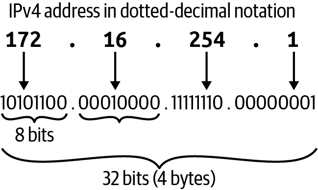

###### 图 1-12\. IPv4 地址

在示例 1-5 中，我们有计算机网络接口卡的 IP 地址输出，我们可以看到其 IPv4 地址是`192.168.1.2`。该 IP 地址还有与之关联的子网掩码或网络掩码，以确定其所分配的网络。示例的子网是以点分十进制表示的`netmask 0xffffff00`，即`255.255.255.0`。

##### 示例 1-5\. IP 地址

```
○ → ifconfig en0
en0: flags=8863<UP,BROADCAST,SMART,RUNNING,SIMPLEX,MULTICAST> mtu 1500
	options=400<CHANNEL_IO>
	ether 38:f9:d3:bc:8a:51
	inet6 fe80::8f4:bb53:e500:9557%en0 prefixlen 64 secured scopeid 0x6
	inet 192.168.1.2 netmask 0xffffff00 broadcast 192.168.1.255
	nd6 options=201<PERFORMNUD,DAD>
	media: autoselect
	status: active
```

子网提出了类地址分配的概念。最初，当分配 IP 地址范围时，一个范围被认为是 8 位、16 位或 24 位网络前缀与 24 位、16 位或 8 位主机标识符的组合。类 A 有 8 位用于主机，类 B 有 16 位，类 C 有 24 位。因此，类 A 有 2 的 16 次方个可用主机，即 16,777,216 个；类 B 有 65,536 个；类 C 有 256 个。每个类都有一个主机地址，第一个在其边界内，最后一个被指定为广播地址。图 1-13 为我们演示了这一点。

###### 注意

还有其他两个类别，但它们在 IP 寻址中通常不使用。类 D 地址用于 IP 多播，类 E 地址保留用于实验。

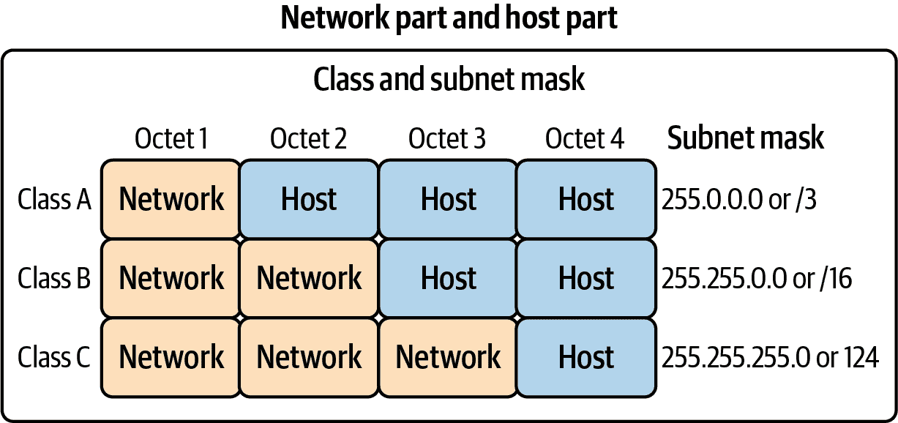

###### 图 1-13\. IP 类

传统的地址分配在互联网上是不可扩展的，为了帮助缓解这个规模问题，我们开始使用无类域间路由（CIDR）范围来打破类别边界。与其说是在一个类地址范围内拥有 1600 多万个地址，不如说互联网实体只分配该范围的一个子范围。这有效地允许网络工程师将子网边界移动到类范围内的任意位置，从而使他们在 CIDR 范围内更加灵活，并有助于扩展 IP 地址范围。

在图 1-14 中，我们可以看到`208.130.29.33` IPv4 地址的分解及其创建的层次结构。`208.128.0.0/11` CIDR 范围从 IANA 分配给 ARIN。ARIN 进一步将子网分解为更小的子网，以满足其需求，导致网络上的单个主机`208.130.29.33/32`。

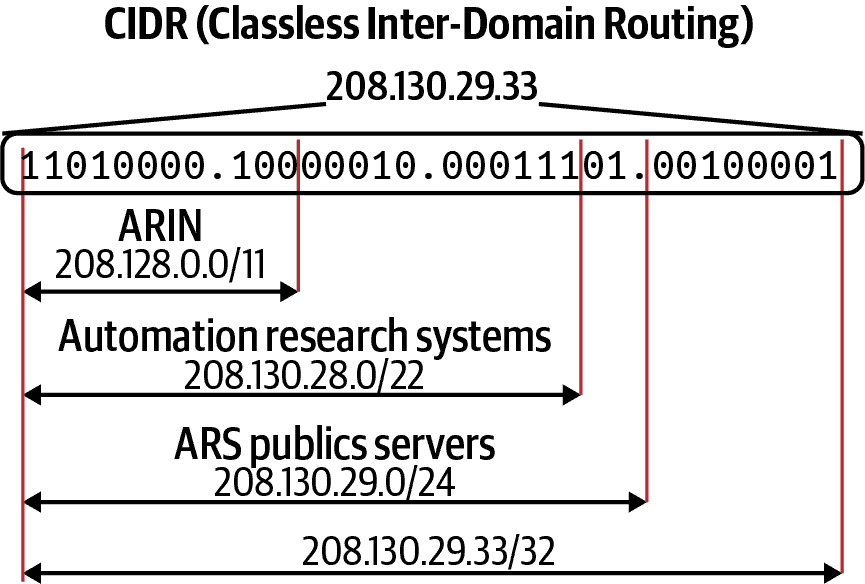

###### 图 1-14\. CIDR 示例

###### 注意

IANA 负责全球 DNS 根、IP 寻址和其他互联网协议资源的协调。

最终，即使这种使用 CIDR 扩展 IPv4 地址范围的做法也导致了可分配的地址空间的枯竭，这促使网络工程师和 IETF 制定了 IPv6 标准。

在图 1-15 中，我们可以看到 IPv6 与 IPv4 不同，它使用十六进制缩短地址以便书写。它与 IPv4 类似，具有主机和网络前缀的特性。

IPv4 与 IPv6 最显著的差异是地址空间的大小。IPv4 有 32 位，而 IPv6 有 128 位来生成其地址。为了让这种大小差异更具体化，这些数字如下：

IPv4 有 4,294,967,296。

IPv6 有 340,282,366,920,938,463,463,374,607,431,768,211,456。

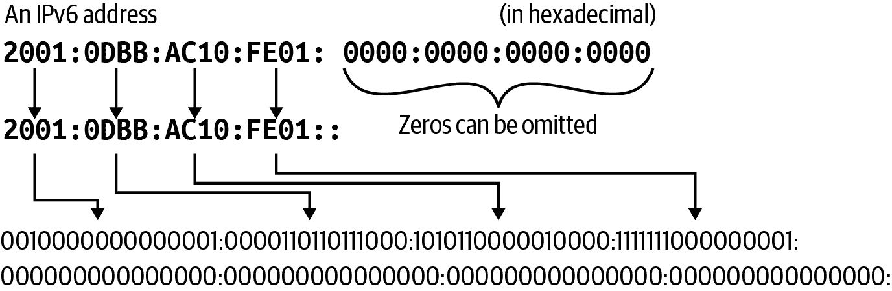

###### 图 1-15\. IPv6 地址

现在我们了解了如何识别网络中的单个主机以及它所属的网络，我们将探讨这些网络如何使用路由协议在彼此之间交换信息。

### 绕过网络

封包被寄出且数据准备好要送，但是我们的封包如何从我们的网络上的主机到达位于世界另一端的目标网络？这是路由的工作。有几种路由协议，但互联网依赖于边界网关协议（BGP），这是一种动态路由协议，用于管理互联网上边缘路由器之间的封包路由。对我们来说它是相关的，因为一些 Kubernetes 网络实现使用 BGP 在节点之间路由集群网络流量。在分隔的网络节点之间有一系列路由器。

如果我们参考图 1-1 中的互联网地图，互联网上的每个网络都被分配一个 BGP 自治系统号（ASN），用于指定代表互联网上通用和明确定义的路由策略的单个管理实体或公司。 BGP 和 ASN 允许网络管理员在互联网上宣布和总结其路由的同时，维护其内部网络路由的控制。表 1-5 列出了由 IANA 和其他区域实体管理的可用 ASN。^(1)

表 1-5\. 可用的自治系统号（ASN）

| 编号 | 位 | 描述 | 参考 |
| --- | --- | --- | --- |
| 0 | 16 | 保留 | RFC 1930, RFC 7607 |
| 1–23455 | 16 | 公共 ASN |  |
| 23456 | 16 | 保留用于 AS 池过渡 | RFC 6793 |
| 23457–64495 | 16 | 公共 ASN |  |
| 64496–64511 | 16 | 用于文档/示例代码保留 | RFC 5398 |
| 64512–65534 | 16 | 保留供私人使用 | RFC 1930, RFC 6996 |
| 65535 | 16 | 保留 | RFC 7300 |
| 65536–65551 | 32 | 用于文档和示例代码保留 | RFC 4893, RFC 5398 |
| 65552–131071 | 32 | 保留 |  |
| 131072–4199999999 | 32 | 公共 32 位 ASN |  |
| 4200000000–4294967294 | 32 | 保留供私人使用 | RFC 6996 |
| 4294967295 | 32 | 保留 | RFC 7300 |

在 图 1-16 中，我们有五个 AS 号码，100–500\. 位于 `130.10.1.200` 的主机想要到达位于 `150.10.2.300` 的目标主机。一旦位于主机 `130.10.1.200` 的本地路由器或默认网关接收到数据包，它将查找 BGP 为该路由确定的接口和路径。

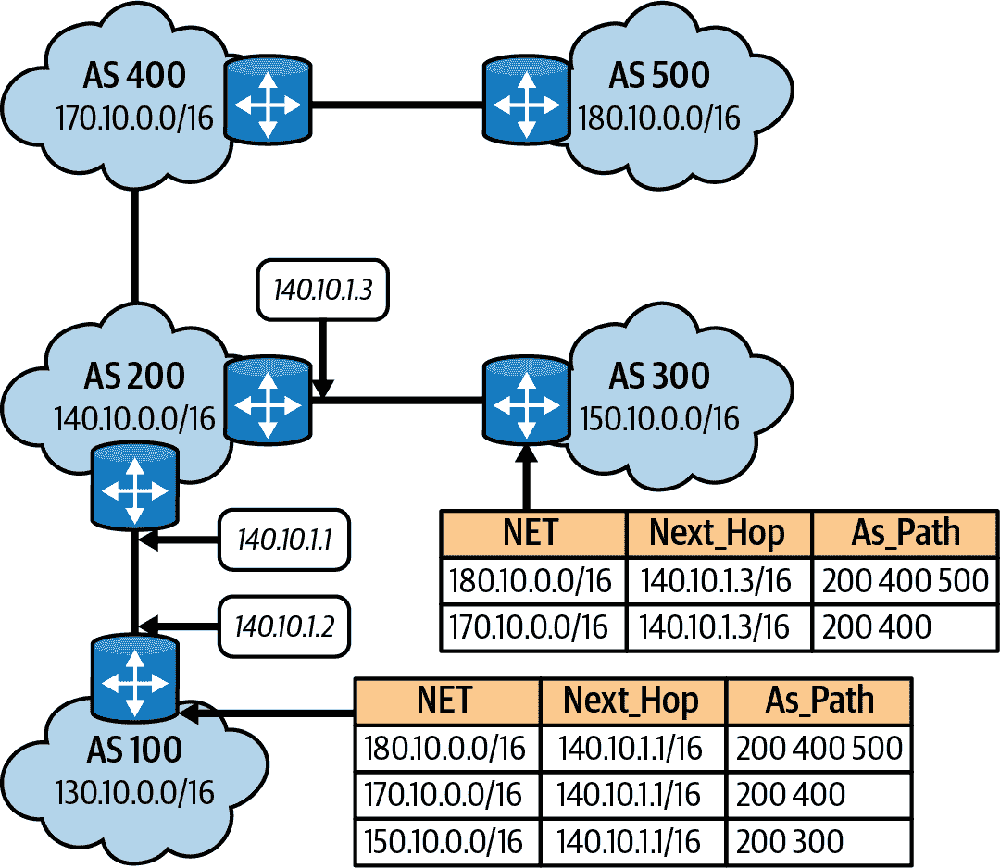

###### 图 1-16\. BGP 路由示例

基于 图 1-17 中的路由表，AS 100 的路由器确定数据包属于 AS 300，并且首选路径是通过接口 `140.10.1.1` 出去。在 AS 200 上重复此操作，直到 AS 300 上的本地路由器接收到该数据包。这里的流程在 图 1-6 中描述，显示了网络之间的 TCP/IP 数据流动。需要对 BGP 有基本的理解，因为一些容器网络项目（如 Calico）使用它进行节点之间的路由；您将在 第 3 章 中了解更多信息。

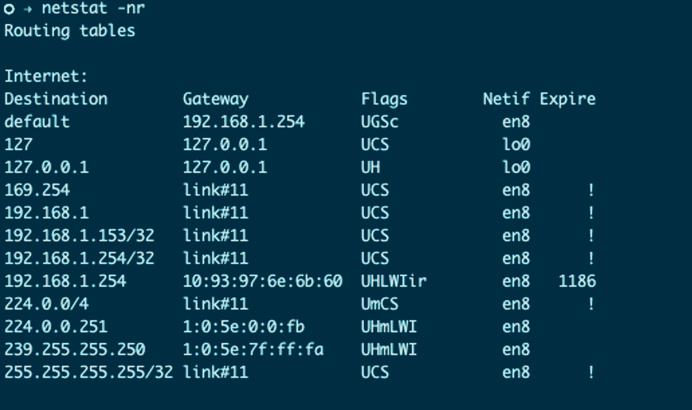

###### 图 1-17\. 本地路由表

图 1-17 显示了一个本地路由表。在路由表中，我们可以看到一个数据包将基于目标 IP 地址发送的接口。例如，一个目标为 `192.168.1.153` 的数据包将通过本地网络的 `link#11` 网关发送，无需进行路由。`192.168.1.254` 是连接到我们互联网的网络中的路由器。如果目标网络不可知，则发送到默认路由。

###### 注意

像所有的 Linux 和 BSD 操作系统一样，您可以在 `netstat` 的 man 页面中找到更多信息（`man netstat`）。Apple 的 `netstat` 源自 BSD 版本。在 [FreeBSD Handbook](https://oreil.ly/YM0eQ) 中可以找到更多信息。

路由器在互联网上持续通信，交换路由信息，并相互通知各自网络上的变化。BGP 负责处理大部分数据交换，但网络工程师和系统管理员可以使用 ICMP 协议和 `ping` 命令行工具来测试主机和路由器之间的连接。

### ICMP

`ping` 是一种网络实用工具，用于使用 ICMP 在网络上测试主机之间的连接。在 示例 1-6 中，我们看到对 `192.168.1.2` 的 `ping` 测试成功，五个数据包均返回了 ICMP 回显回复。

##### 示例 1-6\. ICMP 回显请求

```
○ → ping 192.168.1.2 -c 5
PING 192.168.1.2 (192.168.1.2): 56 data bytes
64 bytes from 192.168.1.2: icmp_seq=0 ttl=64 time=0.052 ms
64 bytes from 192.168.1.2: icmp_seq=1 ttl=64 time=0.089 ms
64 bytes from 192.168.1.2: icmp_seq=2 ttl=64 time=0.142 ms
64 bytes from 192.168.1.2: icmp_seq=3 ttl=64 time=0.050 ms
64 bytes from 192.168.1.2: icmp_seq=4 ttl=64 time=0.050 ms
--- 192.168.1.2 ping statistics ---
5 packets transmitted, 5 packets received, 0.0% packet loss
round-trip min/avg/max/stddev = 0.050/0.077/0.142/0.036 ms
```

示例 1-7 显示了尝试到达主机 `1.2.3.4` 的 `ping` 失败的情况，超时。路由器和管理员将使用 `ping` 进行连接测试，并在测试容器连接时也很有用。在 第 2 和 第 3 章 中，当我们将我们的极简 Golang Web 服务器部署到容器和 Pod 中时，您将了解更多相关内容。

##### 示例 1-7\. ICMP 回显请求失败

```
○ → ping 1.2.3.4 -c 4
PING 1.2.3.4 (1.2.3.4): 56 data bytes
Request timeout for icmp_seq 0
Request timeout for icmp_seq 1
Request timeout for icmp_seq 2
--- 1.2.3.4 ping statistics ---
4 packets transmitted, 0 packets received, 100.0% packet loss
```

与 TCP 和 UDP 一样，ICMP 数据包中有头部、数据和选项；它们在这里进行了审查，并在图 1-18 中显示：

`类型`

ICMP 类型。

`代码`

ICMP 子类型。

`校验和`

互联网校验和用于错误检查，由 ICMP 头部和数据计算，此字段的值为 0。

`其余头部`（4 字节字段）

内容根据 ICMP 类型和代码而变化。

`数据`

ICMP 错误消息包含一个数据部分，其中包括整个 IPv4 头。

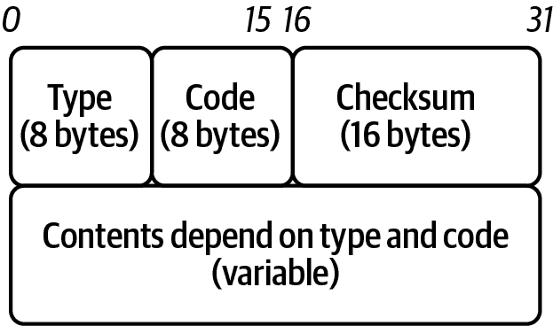

###### 图 1-18\. ICMP 头部

###### 注意

有些人认为 ICMP 是传输层协议，因为它不使用 TCP 或 UDP。根据 RFC 792，ICMP 定义了提供 IP 路由、诊断和错误功能的协议。虽然 ICMP 消息封装在 IP 数据报中，但 ICMP 处理被认为并通常作为 IP 层的一部分实现。ICMP 是 IP 协议 1，而 TCP 是 6，UDP 是 17。

此字段的值标识`类型`字段中的控制消息。`代码`字段为消息提供了额外的上下文信息。您可以在表 1-6 中找到一些标准的 ICMP 类型编号。

表 1-6\. 常见的 ICMP 类型编号

| 编号 | 名称 | 参考 |
| --- | --- | --- |
| 0 | 回显应答 | RFC 792 |
| 3 | 目标不可达 | RFC 792 |
| 5 | 重定向 | RFC 792 |
| 8 | 回显 | RFC 792 |

现在我们的数据包知道它们的源和目的地是哪些网络，是时候开始物理上将这些数据请求发送到网络上了；这是链路层的责任。

## 链路层

HTTP 请求已分成段，用于在互联网上进行路由，并且现在剩下的就是将数据发送到电线上。TCP/IP 堆栈的链路层包括两个子层：介质访问控制（MAC）子层和逻辑链路控制（LLC）子层。它们共同执行 OSI 模型的第 1 层和第 2 层，即数据链路层和物理层。链路层负责与本地网络的连接。第一个子层 MAC 负责访问物理介质。LLC 层有权管理流量控制和多路复用协议，通过 MAC 层发送和接收时进行解复用，如图 1-19 所示。IEEE 标准 802.3，即以太网，定义了用于封装 IP 数据包的协议。IEEE 802 是 LLC（802.2）、无线（802.11）和以太网/MAC（802.3）的总体标准。

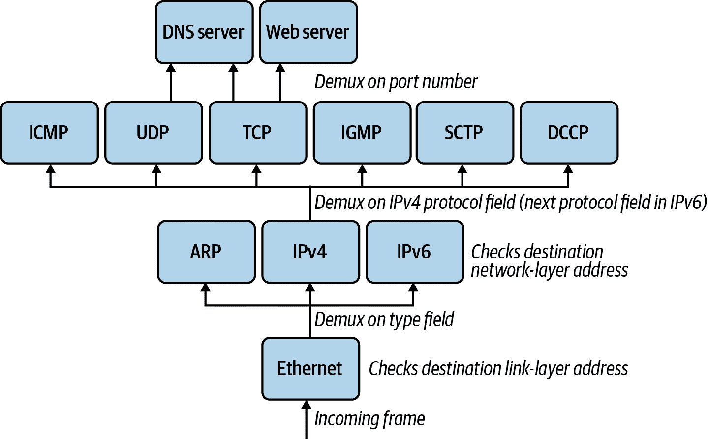

###### 图 1-19\. 以太网解复用示例

与其他 PDU 一样，以太网具有头部和页脚，如图 1-20 所示。

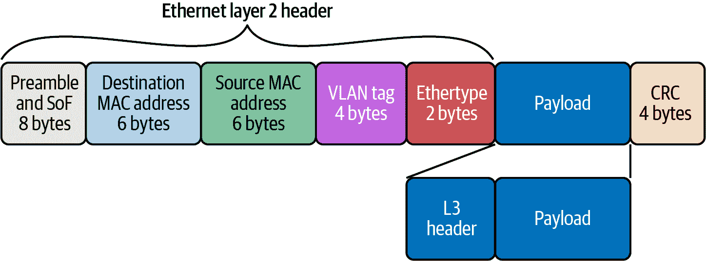

###### 图 1-20\. 以太网头部和页脚

让我们详细审查这些：

`前导码`（8 字节）

交替的 1 和 0 位字符串指示接收主机即将收到帧。

`目的 MAC 地址`（6 字节）

MAC 目的地址；以太网帧的接收者。

`源 MAC 地址`（6 字节）

MAC 源地址；以太网帧源。

`VLAN 标签`（4 字节）

用于区分网络段上的流量的可选 802.1Q 标记。

`Ether-type`（2 字节）

指示封装在帧的有效载荷中的协议。

`有效载荷`（可变长度）

封装的 IP 数据包。

`帧校验序列（FCS）`或`循环冗余校验（CRC）`（4 字节）

帧校验序列（FCS）是一个四字节的循环冗余校验（CRC），允许在接收端检测整个帧中的损坏数据。 CRC 是以太网帧尾部的一部分。

图 1-21 显示 MAC 地址在制造时分配给网络接口硬件。 MAC 地址有两部分：组织单位标识符（OUI）和 NIC 特定部分。

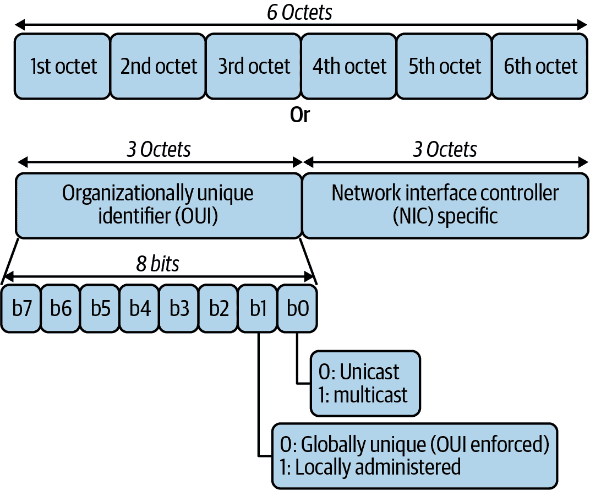

###### 图 1-21\. MAC 地址

帧向网络层数据包的接收方指示类型。 表 1-7 详细介绍了常见的处理的协议。 在 Kubernetes 中，我们主要关注 IPv4 和 ARP 数据包。 IPv6 最近在 1.19 版本中引入到 Kubernetes 中。

表 1-7\. 常见的 EtherType 协议

| EtherType | 协议 |
| --- | --- |
| 0x0800 | 互联网协议版本 4（IPv4） |
| 0x0806 | 地址解析协议（ARP） |
| 0x8035 | 反向地址解析协议（RARP） |
| 0x86DD | 互联网协议版本 6（IPv6） |
| 0x88E5 | MAC 安全（IEEE 802.1AE） |
| 0x9100 | 带有双标记的 VLAN 标记（IEEE 802.1Q）帧 |

当 IP 数据包到达目标网络时，目标 IP 地址通过 IPv4 的地址解析协议（IPv6 的邻居发现协议）解析为目标主机的 MAC 地址。 地址解析协议必须在以太网网络上管理从互联网地址到链路层地址的地址转换。 ARP 表用于快速查找已知主机，因此不必为主机要发送的每个帧发送 ARP 请求。 示例 1-8 显示了本地 ARP 表的输出。 网络上的所有设备都为此目的保留了 ARP 地址的缓存。

##### 示例 1-8\. ARP 表

```
○ → arp -a
? (192.168.0.1) at bc:a5:11:f1:5d:be on en0 ifscope [ethernet]
? (192.168.0.17) at 38:f9:d3:bc:8a:51 on en0 ifscope permanent [ethernet]
? (192.168.0.255) at ff:ff:ff:ff:ff:ff on en0 ifscope [ethernet]
? (224.0.0.251) at 1:0:5e:0:0:fb on en0 ifscope permanent [ethernet]
? (239.255.255.250) at 1:0:5e:7f:ff:fa on en0 ifscope permanent [ethernet]
```

图 1-22 展示了本地网络上主机之间的交换。浏览器向目标服务器发出一个获取托管网站的 HTTP 请求。通过 DNS，它确定服务器的 IP 地址为`10.0.0.1`。为了继续发送 HTTP 请求，还需要服务器的 MAC 地址。首先，请求计算机查询缓存的 ARP 表，查找`10.0.0.1`是否存在服务器 MAC 地址的记录。如果找到 MAC 地址，则发送一个以服务器 MAC 地址为目的地地址的以`10.0.0.1`寻址的 IP 数据包的以太网帧到链路上。如果缓存没有命中`10.0.0.2`的记录，则请求计算机必须发送一个以广播地址`FF:FF:FF:FF:FF:FF`为目的地 MAC 地址的 ARP 请求消息。该消息被本地网络上的所有主机接受，请求`10.0.0.1`的答复。服务器用包含其 MAC 和 IP 地址的 ARP 响应消息回应。作为响应请求的一部分，服务器可能会将请求计算机的 MAC 地址插入其 ARP 表以供将来使用。请求计算机接收并缓存响应信息到其 ARP 表中，现在可以发送 HTTP 数据包了。

这也引出了本地网络上的一个关键概念，即广播域。广播域上的所有主机都接收来自主机的所有 ARP 消息。此外，所有帧都发送到广播上的所有节点，主机将目标 MAC 地址与自身的 MAC 地址进行比较。不属于自身的帧将被丢弃。随着网络上主机的增加，广播流量也随之增加。

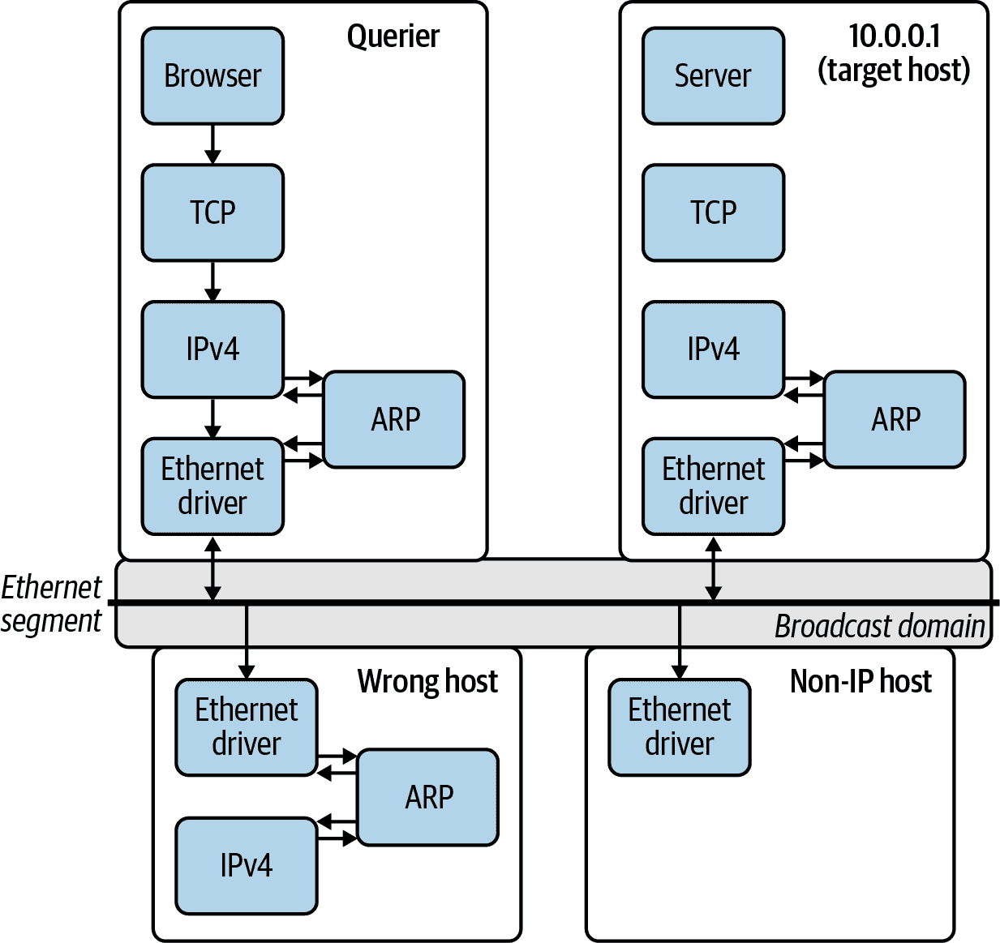

###### 图 1-22\. ARP 请求

我们可以使用`tcpdump`来查看在本地网络上发生的所有 ARP 请求，如示例 1-9 所示。数据包捕获详细描述了 ARP 数据包，使用的以太网类型为`Ethernet (len 6)`；以及更高层协议为`IPv4`。它还包括谁在请求 IP 地址的 MAC 地址，`Request who-has 192.168.0.1 tell 192.168.0.12`。

##### 示例 1-9\. ARP `tcpdump`

```
○ → sudo tcpdump -i en0 arp -vvv
tcpdump: listening on en0, link-type EN10MB (Ethernet), capture size 262144 bytes
17:26:25.906401 ARP, Ethernet (len 6), IPv4 (len 4),
Request who-has 192.168.0.1 tell 192.168.0.12, length 46
17:26:27.954867 ARP, Ethernet (len 6), IPv4 (len 4),
Request who-has 192.168.0.1 tell 192.168.0.12, length 46
17:26:29.797714 ARP, Ethernet (len 6), IPv4 (len 4),
Request who-has 192.168.0.1 tell 192.168.0.12, length 46
17:26:31.845838 ARP, Ethernet (len 6), IPv4 (len 4),
Request who-has 192.168.0.1 tell 192.168.0.12, length 46
17:26:33.897299 ARP, Ethernet (len 6), IPv4 (len 4),
Request who-has 192.168.0.1 tell 192.168.0.12, length 46
17:26:35.942221 ARP, Ethernet (len 6), IPv4 (len 4),
Request who-has 192.168.0.1 tell 192.168.0.12, length 46
17:26:37.785585 ARP, Ethernet (len 6), IPv4 (len 4),
Request who-has 192.168.0.1 tell 192.168.0.12, length 46
17:26:39.628958 ARP, Ethernet (len 6), IPv4 (len 4),
Request who-has 192.168.0.1 tell 192.168.0.13, length 28
17:26:39.833697 ARP, Ethernet (len 6), IPv4 (len 4),
Request who-has 192.168.0.1 tell 192.168.0.12, length 46
17:26:41.881322 ARP, Ethernet (len 6), IPv4 (len 4),
Request who-has 192.168.0.1 tell 192.168.0.12, length 46
17:26:43.929320 ARP, Ethernet (len 6), IPv4 (len 4),
Request who-has 192.168.0.1 tell 192.168.0.12, length 46
17:26:45.977691 ARP, Ethernet (len 6), IPv4 (len 4),
Request who-has 192.168.0.1 tell 192.168.0.12, length 46
17:26:47.820597 ARP, Ethernet (len 6), IPv4 (len 4),
Request who-has 192.168.0.1 tell 192.168.0.12, length 46
^C
13 packets captured
233 packets received by filter
0 packets dropped by kernel
```

为了进一步分割第二层网络，网络工程师可以使用虚拟局域网（VLAN）标记。在以太网帧头部内有一个可选的 VLAN 标签，用于区分 LAN 上的流量。使用 VLAN 来分割 LAN 并管理网络在同一个交换机或跨网络校园内的不同交换机上是很有用的。VLAN 之间的路由器过滤广播流量，启用网络安全性并减轻网络拥塞。它们对网络管理员来说在这些目的上是有用的，但是 Kubernetes 网络管理员可以使用 VLAN 技术的扩展版本，即*虚拟可扩展局域网*（VXLAN）。

图 1-23 展示了 VXLAN 是 VLAN 的扩展，允许网络工程师将层 2 帧封装到层 4 UDP 数据包中。VXLAN 增加了可扩展性，达到了 1600 万个逻辑网络，并允许在 IP 网络上实现层 2 邻接。这项技术用于 Kubernetes 网络以生成叠加网络，在后面的章节中您将更多了解。

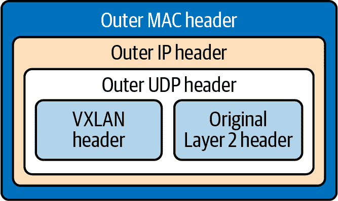

###### 图 1-23\. VXLAN 数据包

Ethernet 还详细说明了用于传输帧的媒介规格，例如双绞线、同轴电缆、光纤、无线或其他尚未发明的传输介质，例如驱动 Philotic Parallax 即时通信装置的 γ 射线网络。^(2) Ethernet 甚至定义了在电线上使用的编码和信令协议；这超出了我们的讨论范围。

在网络角度，链路层还涉及多个其他协议。像前面讨论的层一样，我们仅仅触及了链路层的表面。我们将本书限制在对 Kubernetes 网络模型链路层所需了解的细节。

## 重新审视我们的 Web 服务器

我们对 TCP/IP 所有层的旅程完成了。图 1-24 概述了 TCP/IP 模型的每一层产生的所有头部和尾部，以便在互联网上传输数据。

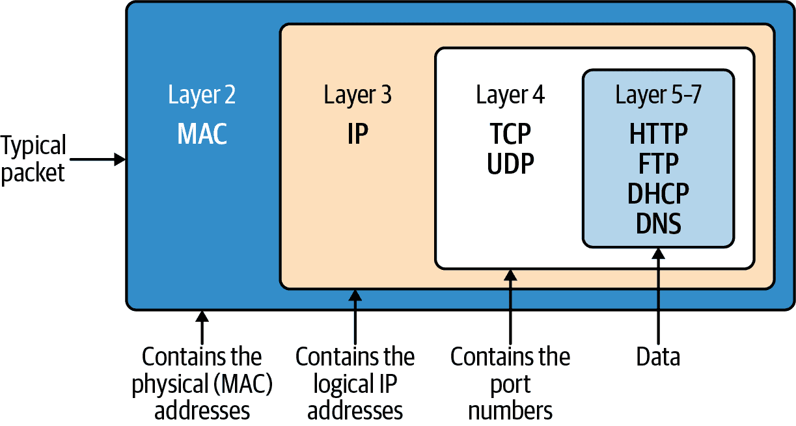

###### 图 1-24\. TCP/IP PDU 全景

让我们回顾旅程，并再次提醒自己我们现在详细了解每一层正在发生的事情。示例 1-10 再次显示我们的 Web 服务器，示例 1-11 显示了本章前面 cURL 请求的内容。

##### 示例 1-10\. Go 中的最小 Web 服务器

```
package main

import (
	"fmt"
	"net/http"
)

func hello(w http.ResponseWriter, _ *http.Request) {
	fmt.Fprintf(w, "Hello")
}

func main() {
	http.HandleFunc("/", hello)
	http.ListenAndServe("0.0.0.0:8080", nil)
}
```

##### 示例 1-11\. 客户端请求

```
○ → curl localhost:8080 -vvv
*   Trying ::1...
* TCP_NODELAY set
* Connected to localhost (::1) port 8080
> GET / HTTP/1.1
> Host: localhost:8080
> User-Agent: curl/7.64.1
> Accept: */*
>
< HTTP/1.1 200 OK
< Date: Sat, 25 Jul 2020 14:57:46 GMT
< Content-Length: 5
< Content-Type: text/plain; charset=utf-8
<
* Connection #0 to host localhost left intact
Hello* Closing connection 0
```

我们从 Web 服务器在示例 1-10 等待连接开始。cURL 请求 HTTP 服务器的`0.0.0.0`端口 8080。cURL 从 URL 确定 IP 地址和端口号，并建立与服务器的 TCP 连接。一旦建立连接，通过 TCP 握手，cURL 发送 HTTP 请求。当 Web 服务器启动时，在 HTTP 服务器上创建一个名为 8080 的套接字，该套接字与 TCP 端口 8080 匹配；在 cURL 客户端的随机端口上也是如此。接下来，此信息发送到网络层，将源和目标 IP 地址附加到数据包的 IP 头部。在客户端的数据链路层，将 NIC 的源 MAC 地址添加到以太网帧中。如果目标 MAC 地址未知，则发出 ARP 请求以查找它。然后，使用 NIC 将以太网帧传输到 Web 服务器。

当 Web 服务器接收到请求时，它会创建包含 HTTP 响应的数据包。这些数据包通过使用请求数据包上的源 IP 地址经过互联网路由发送回 cURL 进程。一旦 cURL 进程接收到数据包，数据包就会从设备发送到驱动程序。在数据链路层，MAC 地址被移除。在网络协议层，IP 地址被验证，然后从数据包中移除。因此，如果应用程序需要访问客户端 IP，则需要在应用程序层存储它；HTTP 请求和 X-Forwarded-For 头部就是最好的例子。现在根据 TCP 数据确定套接字并移除它。然后将数据包转发到创建该套接字的客户端应用程序。客户端读取并处理响应数据。在本例中，套接字 ID 是随机的，对应于 cURL 进程。所有数据包都发送到 cURL 并组合成一个 HTTP 响应。如果我们使用了`-O`输出选项，响应将保存到文件中；否则，cURL 将响应输出到终端的标准输出。

哇，这真是一大口气，50 页和 50 年的网络发展被压缩成了两段话！我们回顾的网络基础只是一个开始，但如果您想要运行规模化的 Kubernetes 集群和网络，这些知识是必不可少的。

# 结论

本章中建模的 HTTP 事务每毫秒在全球范围内的互联网和数据中心网络中发生。这种规模是 Kubernetes 网络 API 帮助开发人员将复杂问题抽象为简单 YAML 的类型。了解问题的规模是我们掌握 Kubernetes 网络管理的第一步。通过我们的简单示例——Golang Web 服务器，并学习网络的第一原则，您可以开始处理流入和流出集群的数据包。

到目前为止，我们已经涵盖了以下内容：

+   网络的历史

+   OSI 模型

+   TCP/IP

在本章中，我们讨论了与网络相关的许多内容，但只涉及学习使用 Kubernetes 抽象所需的内容。关于 TCP/IP 有几本 O’Reilly 的书籍；[*TCP/IP 网络管理*](https://oreil.ly/UIP62) 由克雷格·亨特（O’Reilly）是关于 TCP 所有方面的深度阅读。

我们讨论了网络如何演变，走过了 OSI 模型，将其转化为 TCP/IP 协议栈，并通过该协议栈完成了一个示例 HTTP 请求。在下一章中，我们将详细讲解这是如何在 Linux 网络中为客户端和服务器实现的。

^(1) [“自治系统（AS）编号”。](https://oreil.ly/Jgi2c) IANA.org. 2018-12-07\. 检索于 2018-12-31.

^(2) 在电影《异星战场》中，他们使用“安西布尔”网络实现了跨银河瞬时通信。Philotic Parallax 即时通信器是安西布尔网络的官方名称。
