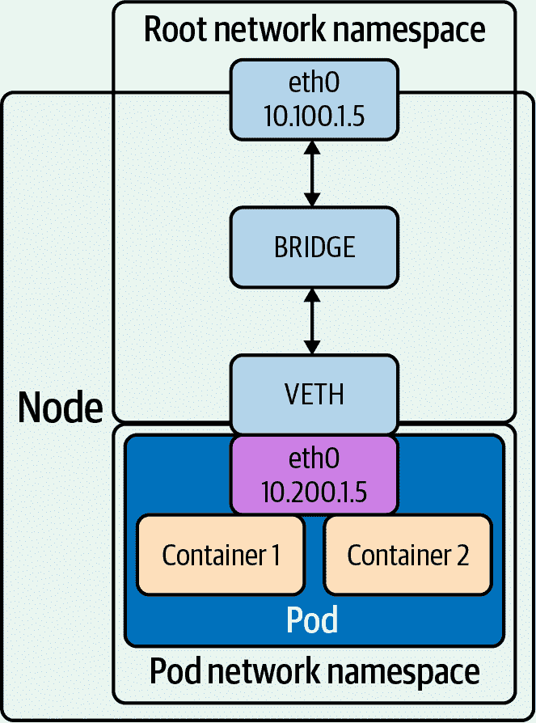
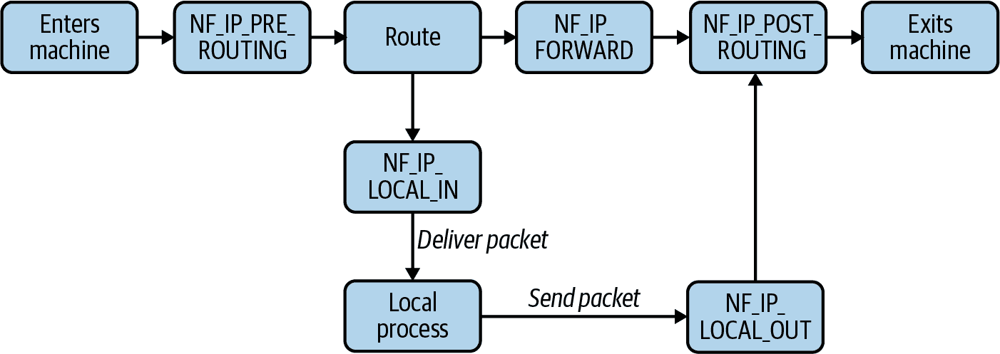
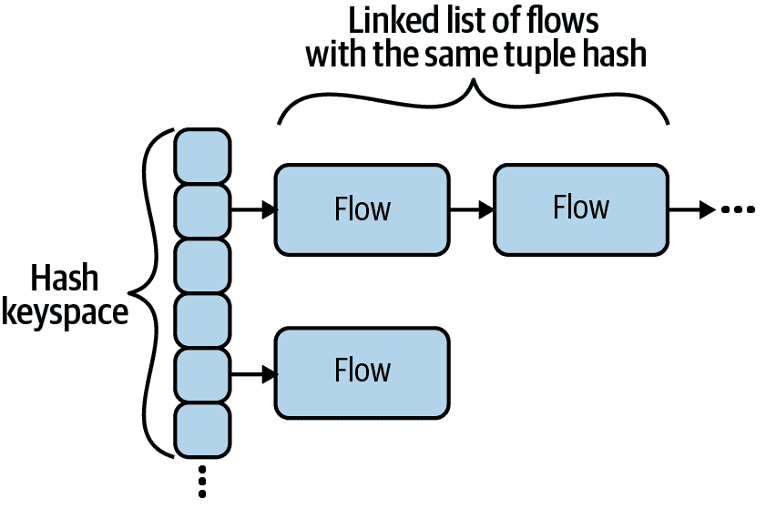
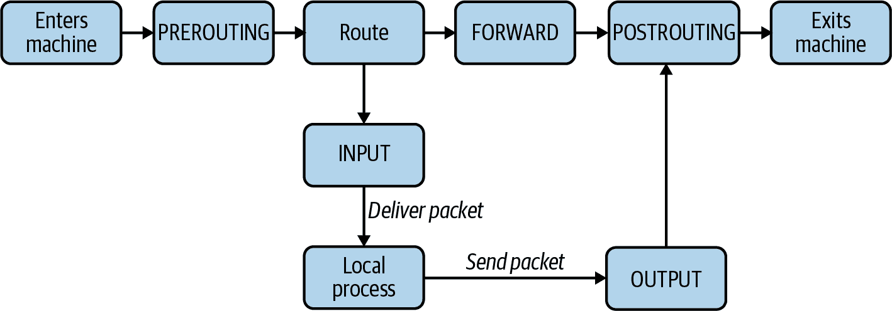
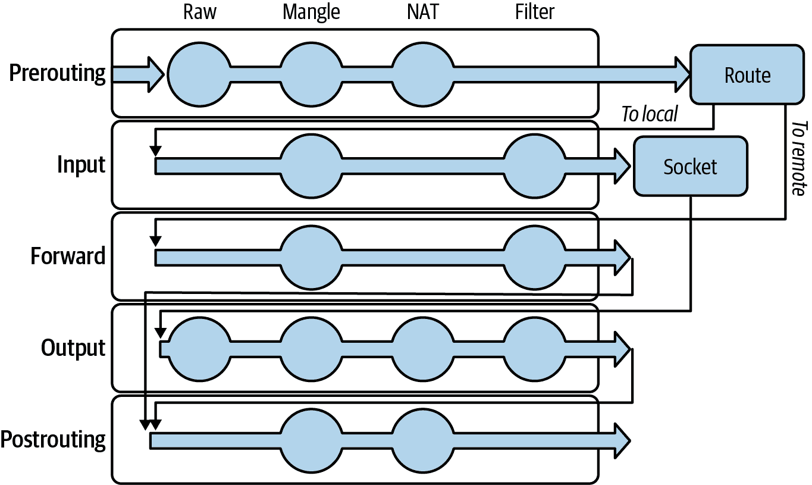
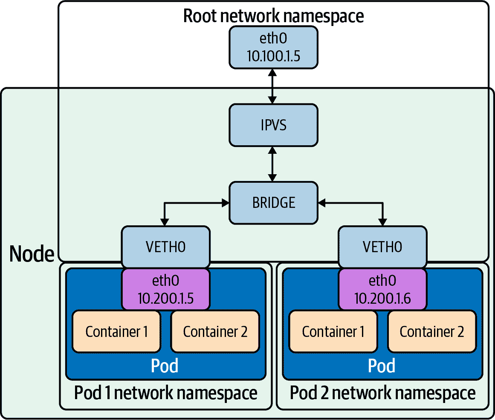
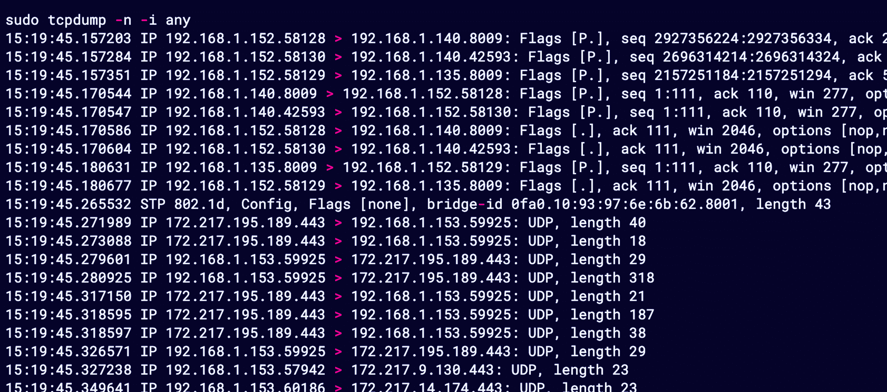
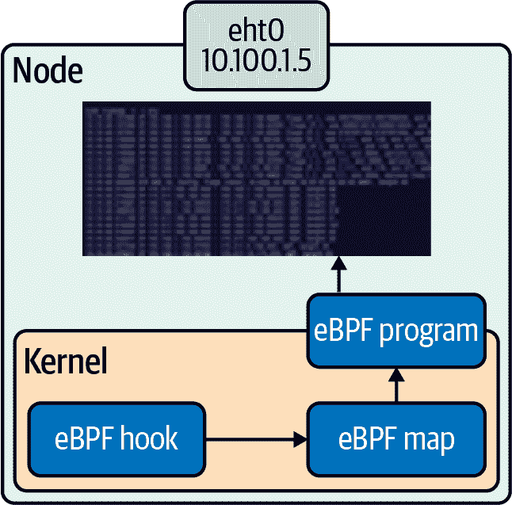

# 第二章：Linux 网络

要理解 Kubernetes 中网络实现的实施，我们需要了解 Linux 网络的基础知识。最终，Kubernetes 是 Linux（或 Windows！）机器的复杂管理工具，这在处理 Kubernetes 网络堆栈时是不可忽视的。本章将概述 Linux 网络堆栈，重点关注在 Kubernetes 中值得注意的领域。如果您对 Linux 网络和网络管理非常熟悉，您可以快速浏览或跳过本章。

###### 提示

本章介绍了许多 Linux 程序。可以通过`man <program>`访问手册页，以获取更多详细信息。

# 基础知识

让我们重新审视我们的 Go Web 服务器，在第一章中使用过。该 Web 服务器监听端口 8080，并对 HTTP 请求返回“Hello”至 / （参见示例 2-1）。

##### 示例 2-1\. Go 中的最小 Web 服务器

```
package main

import (
	"fmt"
	"net/http"
)

func hello(w http.ResponseWriter, _ *http.Request) {
	fmt.Fprintf(w, "Hello")
}

func main() {
	http.HandleFunc("/", hello)
	http.ListenAndServe("0.0.0.0:8080", nil)
}
```

###### 警告

端口 1-1023（也称为*众所周知的端口*）需要 root 权限才能绑定。

程序应该始终以最低权限运行，这意味着典型的 Web 服务不应该以 root 用户身份运行。因此，许多程序会监听 1024 或更高端口（特别是端口 8080 是 HTTP 服务的常见选择）。在可能的情况下，监听非特权端口，并使用基础设施重定向（负载均衡器转发、Kubernetes 服务等）将外部可见的特权端口转发到监听非特权端口的程序上。

这样，攻击者利用服务中可能存在的漏洞时，无法获得过于广泛的权限。

假设该程序正在运行在 Linux 服务器上，并且外部客户端向 `/` 发起请求。服务器会发生什么？首先，我们的程序需要监听一个地址和端口。程序会为该地址和端口创建一个套接字并绑定到它。该套接字将接收发往指定地址和端口的请求 - 在我们的案例中是端口 `8080` 和任意 IP 地址。

###### 注意

IPv4 中的 `0.0.0.0` 和 IPv6 中的 `[::]` 是通配地址。它们匹配其各自协议的所有地址，因此在套接字绑定时监听所有可用 IP 地址。

这对于暴露服务非常有用，而无需预先知道运行服务的机器将具有哪些 IP 地址。大多数网络暴露的服务都会绑定在这种方式上。

有多种方法可以检查套接字。例如，`ls -lah /proc/<server proc>/fd` 将列出套接字。本章末尾我们将讨论一些可以检查套接字的程序。

内核将给定的数据包映射到特定的连接，并使用内部状态机来管理连接状态。与套接字类似，连接可以通过各种工具进行检查，我们将在本章后面讨论。Linux 用文件表示每个连接。接受连接涉及内核向我们的程序发送的通知，然后我们能够流式传输文件中的内容。

回到我们的 Golang Web 服务器，我们可以使用`strace`来显示服务器正在执行的操作：

```
$ strace ./main
execve("./main", ["./main"], 0x7ebf2700 /* 21 vars */) = 0
brk(NULL)                               = 0x78e000
uname({sysname="Linux", nodename="raspberrypi", ...}) = 0
mmap2(NULL, 8192, PROT_READ|PROT_WRITE, MAP_PRIVATE|MAP_ANONYMOUS, -1, 0)
= 0x76f1d000
[Content cut]
```

因为`strace`捕获了服务器所做的所有系统调用，输出非常多。让我们将其减少到相关的网络系统调用。关键点已经突出显示，因为 Go HTTP 服务器在启动期间执行了许多系统调用：

```
openat(AT_FDCWD, "/proc/sys/net/core/somaxconn",
O_RDONLY|O_LARGEFILE|O_CLOEXEC) = 3
epoll_create1(EPOLL_CLOEXEC)            = 4 
epoll_ctl(4, EPOLL_CTL_ADD, 3, {EPOLLIN|EPOLLOUT|EPOLLRDHUP|EPOLLET,
    {u32=1714573248, u64=1714573248}}) = 0
fcntl(3, F_GETFL)                       = 0x20000 (flags O_RDONLY|O_LARGEFILE)
fcntl(3, F_SETFL, O_RDONLY|O_NONBLOCK|O_LARGEFILE) = 0
read(3, "128\n", 65536)                 = 4
read(3, "", 65532)                      = 0
epoll_ctl(4, EPOLL_CTL_DEL, 3, 0x20245b0) = 0
close(3)                                = 0
socket(AF_INET, SOCK_STREAM|SOCK_CLOEXEC|SOCK_NONBLOCK, IPPROTO_TCP) = 3
close(3)                                = 0
socket(AF_INET6, SOCK_STREAM|SOCK_CLOEXEC|SOCK_NONBLOCK, IPPROTO_TCP) = 3 
setsockopt(3, SOL_IPV6, IPV6_V6ONLY, [1], 4) = 0 
bind(3, {sa_family=AF_INET6, sin6_port=htons(0),
inet_pton(AF_INET6, "::1", &sin6_addr),
    sin6_flowinfo=htonl(0), sin6_scope_id=0}, 28) = 0
socket(AF_INET6, SOCK_STREAM|SOCK_CLOEXEC|SOCK_NONBLOCK, IPPROTO_TCP) = 5
setsockopt(5, SOL_IPV6, IPV6_V6ONLY, [0], 4) = 0
bind(5, {sa_family=AF_INET6,
sin6_port=htons(0), inet_pton(AF_INET6,
    "::ffff:127.0.0.1", &sin6_addr), sin6_flowinfo=htonl(0),
sin6_scope_id=0}, 28) = 0
close(5)                                = 0
close(3)                                = 0
socket(AF_INET6, SOCK_STREAM|SOCK_CLOEXEC|SOCK_NONBLOCK, IPPROTO_IP) = 3
setsockopt(3, SOL_IPV6, IPV6_V6ONLY, [0], 4) = 0
setsockopt(3, SOL_SOCKET, SO_BROADCAST, [1], 4) = 0
setsockopt(3, SOL_SOCKET, SO_REUSEADDR, [1], 4) = 0
bind(3, {sa_family=AF_INET6, sin6_port=htons(8080),
inet_pton(AF_INET6, "::", &sin6_addr),
    sin6_flowinfo=htonl(0), sin6_scope_id=0}, 28) = 0 
listen(3, 128)                          = 0
epoll_ctl(4, EPOLL_CTL_ADD, 3,
{EPOLLIN|EPOLLOUT|EPOLLRDHUP|EPOLLET, {u32=1714573248,
    u64=1714573248}}) = 0
getsockname(3, {sa_family=AF_INET6, sin6_port=htons(8080),

inet_pton(AF_INET6, "::", &sin6_addr), sin6_flowinfo=htonl(0),
sin6_scope_id=0},
    [112->28]) = 0
accept4(3, 0x2032d70, [112], SOCK_CLOEXEC|SOCK_NONBLOCK) = -1 EAGAIN
    (Resource temporarily unavailable)
epoll_wait(4, [], 128, 0)               = 0
epoll_wait(4, 
```


打开文件描述符。


为 IPv6 连接创建 TCP 套接字。


在套接字上禁用`IPV6_V6ONLY`。现在，它可以同时监听 IPv4 和 IPv6。


将 IPv6 套接字绑定到监听端口 8080（所有地址）。


等待请求。

一旦服务器启动，我们看到`strace`输出在`epoll_wait`上暂停。

此时，服务器正在监听其套接字，并等待内核通知其有数据包。当我们向我们的监听服务器发出请求时，我们看到“Hello”消息：

```
$ curl <ip>:8080/
Hello
```

###### 提示

如果您试图使用`strace`调试 Web 服务器的基础知识，您可能不想使用 Web 浏览器。对服务器发送的额外请求或元数据可能会导致服务器执行额外的工作，或者浏览器可能不会发出预期的请求。例如，许多浏览器会自动请求 favicon 文件。它们还会尝试缓存文件，重用连接，以及执行其他使得准确预测网络交互变得更加困难的操作。在需要简单或最小复制场景时，尝试使用诸如`curl`或`telnet`等工具。

在`strace`中，我们从我们的服务器进程看到以下内容：

```
[{EPOLLIN, {u32=1714573248, u64=1714573248}}], 128, -1) = 1
accept4(3, {sa_family=AF_INET6, sin6_port=htons(54202), inet_pton(AF_INET6,
    "::ffff:10.0.0.57", &sin6_addr), sin6_flowinfo=htonl(0), sin6_scope_id=0},
    [112->28], SOCK_CLOEXEC|SOCK_NONBLOCK) = 5
epoll_ctl(4, EPOLL_CTL_ADD, 5, {EPOLLIN|EPOLLOUT|EPOLLRDHUP|EPOLLET,
    {u32=1714573120, u64=1714573120}}) = 0
getsockname(5, {sa_family=AF_INET6, sin6_port=htons(8080),
    inet_pton(AF_INET6, "::ffff:10.0.0.30", &sin6_addr), sin6_flowinfo=htonl(0),
    sin6_scope_id=0}, [112->28]) = 0
setsockopt(5, SOL_TCP, TCP_NODELAY, [1], 4) = 0
setsockopt(5, SOL_SOCKET, SO_KEEPALIVE, [1], 4) = 0
setsockopt(5, SOL_TCP, TCP_KEEPINTVL, [180], 4) = 0
setsockopt(5, SOL_TCP, TCP_KEEPIDLE, [180], 4) = 0
accept4(3, 0x2032d70, [112], SOCK_CLOEXEC|SOCK_NONBLOCK) = -1 EAGAIN
    (Resource temporarily unavailable)
```

检查完套接字后，我们的服务器向文件描述符写入响应数据（在 HTTP 协议中包装的“Hello”）。然后，Linux 内核（以及其他一些用户空间系统）将请求转换为数据包，并将这些数据包传输回我们的 cURL 客户端。

总结一下服务器在收到请求时的操作：

1.  Epoll 返回并导致程序恢复。

1.  服务器在本示例中看到来自`::ffff:10.0.0.57`的连接 IP 地址。

1.  服务器检查套接字。

1.  服务器更改了`KEEPALIVE`选项：打开了`KEEPALIVE`，并设置了 180 秒的间隔来进行`KEEPALIVE`探测。

这是从应用开发者角度来看 Linux 网络的鸟瞰图。要让所有内容正常工作，还有很多工作要做。我们将更详细地查看对 Kubernetes 用户特别相关的网络堆栈部分。

# 网络接口

计算机使用*网络接口*与外部世界通信。网络接口可以是物理的（例如，以太网网络控制器）或虚拟的。虚拟网络接口不对应物理硬件；它们是主机或虚拟机监视器提供的抽象接口。

IP 地址分配给网络接口。典型接口可能具有一个 IPv4 地址和一个 IPv6 地址，但可以将多个地址分配给同一接口。

Linux 本身具有网络接口的概念，可以是物理的（如以太网卡和端口）或虚拟的。如果运行`ifconfig`，您将看到所有网络接口及其配置（包括 IP 地址）的列表。

*回环接口*是用于同主机通信的特殊接口。`127.0.0.1`是回环接口的标准 IP 地址。发送到回环接口的数据包将不会离开主机，而在`127.0.0.1`上监听的进程只能由同一主机上的其他进程访问。请注意，使进程在`127.0.0.1`上监听不是安全边界。CVE-2020-8558 是过去 Kubernetes 的一个漏洞，在此漏洞中，`kube-proxy`规则允许某些远程系统访问`127.0.0.1`。回环接口通常缩写为`lo`。

###### 提示

`ip`命令也可用于检查网络接口。

让我们看一个典型的`ifconfig`输出；参见示例 2-2。

##### 示例 2-2\. 一个带有一个物理网络接口（ens4）和回环接口的机器上的`ifconfig`输出

```
$ ifconfig
ens4: flags=4163<UP,BROADCAST,RUNNING,MULTICAST>  mtu 1460
        inet 10.138.0.4  netmask 255.255.255.255  broadcast 0.0.0.0
        inet6 fe80::4001:aff:fe8a:4  prefixlen 64  scopeid 0x20<link>
        ether 42:01:0a:8a:00:04  txqueuelen 1000  (Ethernet)
        RX packets 5896679  bytes 504372582 (504.3 MB)
        RX errors 0  dropped 0  overruns 0  frame 0
        TX packets 9962136  bytes 1850543741 (1.8 GB)
        TX errors 0  dropped 0 overruns 0  carrier 0  collisions 0

lo: flags=73<UP,LOOPBACK,RUNNING>  mtu 65536
        inet 127.0.0.1  netmask 255.0.0.0
        inet6 ::1  prefixlen 128  scopeid 0x10<host>
        loop  txqueuelen 1000  (Local Loopback)
        RX packets 352  bytes 33742 (33.7 KB)
        RX errors 0  dropped 0  overruns 0  frame 0
        TX packets 352  bytes 33742 (33.7 KB)
        TX errors 0  dropped 0 overruns 0  carrier 0  collisions 0
```

容器运行时在主机上为每个 pod 创建一个虚拟网络接口，因此在典型的 Kubernetes 节点上，列表会更长。我们将在第三章详细讨论容器网络。

# 桥接接口

桥接接口（如图 2-1 所示）允许系统管理员在单个主机上创建多个二层网络。换句话说，桥接功能类似于将主机上的网络接口连接起来的网络交换机，无缝连接它们。桥接允许具有各自网络接口的 pod 通过节点的网络接口与更广泛的网络交互。



###### 图 2-1\. 桥接口

###### 注意

您可以在[文档](https://oreil.ly/4BRsA)中了解有关 Linux 桥接的更多信息。

在示例 2-3 中，我们演示如何使用`ip`创建一个名为`br0`的桥接设备，并连接一个虚拟以太网（veth）设备`veth`和一个物理设备`eth0`。

##### 示例 2-3\. 创建桥接口并连接 veth 对

```
# # Add a new bridge interface named br0.
# ip link add br0 type bridge
# # Attach eth0 to our bridge.
# ip link set eth0 master br0
# # Attach veth to our bridge.
# ip link set veth master br0
```

桥接也可以使用 `brctl` 命令来管理和创建。示例 2-4 展示了一些可用的 `brctl` 选项。

##### 示例 2-4\. `brctl` 选项

```
$ brctl
$ commands:
        addbr           <bridge>                add bridge
        delbr           <bridge>                delete bridge
        addif           <bridge> <device>       add interface to bridge
        delif           <bridge> <device>       delete interface from bridge
        setageing       <bridge> <time>         set ageing time
        setbridgeprio   <bridge> <prio>         set bridge priority
        setfd           <bridge> <time>         set bridge forward delay
        sethello        <bridge> <time>         set hello time
        setmaxage       <bridge> <time>         set max message age
        setpathcost     <bridge> <port> <cost>  set path cost
        setportprio     <bridge> <port> <prio>  set port priority
        show                                    show a list of bridges
        showmacs        <bridge>                show a list of mac addrs
        showstp         <bridge>                show bridge stp info
        stp             <bridge> <state>        turn stp on/off
```

veth 设备是本地以太网隧道。Veth 设备成对创建，如图 2-1 所示，其中 pod 从 veth 看到 `eth0` 接口。在一对设备中传输的数据包会立即在另一对设备上接收到。如果任何一个设备关闭，该对的链接状态也会关闭。在 Linux 中添加桥接可以通过使用 `brctl` 命令或 `ip` 命令来完成。当命名空间需要与主机命名空间或彼此之间通信时，请使用 veth 配置。

示例 2-5 展示了如何设置 veth 配置。

##### 示例 2-5\. 创建 veth

```
# ip netns add net1
# ip netns add net2
# ip link add veth1 netns net1 type veth peer name veth2 netns net2
```

在 示例 2-5 中，我们展示了创建两个网络命名空间（与 Kubernetes 命名空间不同），`net1` 和 `net2`，以及一对 veth 设备的步骤，其中 `veth1` 分配给命名空间 `net1`，`veth2` 分配给命名空间 `net2`。这两个命名空间通过这对 veth 设备连接。分配一对 IP 地址后，您可以在两个命名空间之间进行 ping 和通信。

Kubernetes 与 CNI 项目协同使用此功能来管理容器网络命名空间、接口和 IP 地址。我们将在 第三章 中进一步探讨这一点。

# 内核中的数据包处理

Linux 内核负责在程序之间翻译数据包和一致的数据流。特别是，我们将关注内核如何处理连接，因为在 Kubernetes 中，路由和防火墙是非常依赖 Linux 底层数据包管理的关键部分。

## Netfilter

Netfilter 自 Linux 2.3 起被包括在内，是数据包处理的关键组件。Netfilter 是一个内核钩子的框架，允许用户空间程序代表内核处理数据包。简而言之，程序注册到特定的 Netfilter 钩子，并且内核调用该程序来处理适用的数据包。该程序可以告诉内核对数据包做某些操作（如丢弃），或者修改后返回给内核。借助此功能，开发人员可以构建在用户空间运行的正常程序来处理数据包。Netfilter 与 `iptables` 共同创建，以分离内核和用户空间代码。

###### 提示

[*netfilter.org*](https://netfilter.org) 包含了关于 Netfilter 和 `iptables` 设计和使用的优秀文档。

Netfilter 有五个钩子，在 表 2-1 中展示。

Netfilter 在数据包通过内核的旅程中的特定阶段触发每个钩子。理解 Netfilter 的钩子是理解本章后面 `iptables` 的关键，因为 `iptables` 直接将其 *chains* 的概念映射到 Netfilter 钩子。

表 2-1\. Netfilter 钩子

| Netfilter 钩子 | Iptables 链名称 | 描述 |
| --- | --- | --- |
| NF_IP_PRE_ROUTING | PREROUTING | 触发条件：数据包从外部系统到达时。 |
| NF_IP_LOCAL_IN | INPUT | 触发条件：数据包的目标 IP 地址与此主机匹配时。 |
| NF_IP_FORWARD | NAT | 触发条件：数据包中源地址和目标地址均不匹配机器的 IP 地址（换句话说，这些数据包是此机器代表其他机器进行路由的）。 |
| NF_IP_LOCAL_OUT | OUTPUT | 触发条件：数据包由主机发起，并离开主机时。 |
| NF_IP_POST_ROUTING | POSTROUTING | 触发条件：任何数据包（无论源）离开主机时。 |

Netfilter 在数据包处理的特定阶段触发每个钩子，并且在特定条件下，我们可以通过流程图可视化 Netfilter 钩子，如图 2-2 所示。



###### 图 2-2\. 数据包通过 Netfilter 钩子的可能流向

我们可以从我们的流程图中推断，对于任何给定的数据包，只有特定的 Netfilter 钩子调用排列组合是可能的。例如，从本地进程发起的数据包总是会触发 `NF_IP_LOCAL_OUT` 钩子，然后是 `NF_IP_POST_ROUTING` 钩子。具体来说，数据包的 Netfilter 钩子流程取决于两个因素：数据包的源是否为主机，以及数据包的目标是否为主机。请注意，如果一个进程发送一个目标地址为相同主机的数据包，它会在“重新进入”系统之前触发 `NF_IP_LOCAL_OUT` 和 `NF_IP_POST_ROUTING` 钩子，然后触发 `NF_IP_PRE_ROUTING` 和 `NF_IP_LOCAL_IN` 钩子。

在某些系统中，可以通过写入虚假的源地址（即伪造数据包具有源地址和目标地址为 `127.0.0.1`）来伪造此类数据包。当这样的数据包到达外部接口时，Linux 通常会对其进行过滤。更广泛地说，当数据包到达接口时，如果数据包的源地址在该网络上不存在，则 Linux 会过滤这些数据包。具有“不可能的”源 IP 地址的数据包被称为*火星数据包*。在 Linux 中，可以禁用火星数据包的过滤。但是，如果主机上的任何服务假定来自本地主机的流量比外部流量更“可信”，这可能带来重大风险。这可能是一个常见的假设，例如在向主机公开 API 或数据库时不使用强认证。

###### 注意

Kubernetes 至少有一个 CVE，即 CVE-2020-8558，其中来自另一台主机的数据包，源 IP 地址错误地设置为 `127.0.0.1`，可以访问本应仅本地可访问的端口。这意味着如果 Kubernetes 控制平面中的节点运行 `kube-proxy`，则该节点网络中的其他机器可以使用“信任认证”连接到 API 服务器，从而有效地控制整个集群。

这并不是火星包未被过滤的技术问题，因为有问题的包会来自回环设备，这与`127.0.0.1`处于同一网络。你可以在[GitHub](https://oreil.ly/A5HtN)上查看报告的问题。

表 2-2 展示了不同数据包来源和目的地的 Netfilter 钩子顺序。

表 2-2\. 关键 Netfilter 数据包流

| 数据包来源 | 数据包目的地 | 钩子（顺序） |
| --- | --- | --- |
| 本地机器 | 本地机器 | `NF_IP_LOCAL_OUT`, `NF_IP_LOCAL_IN` |
| 本地机器 | 外部机器 | `NF_IP_LOCAL_OUT`, `NF_IP_POST_ROUTING` |
| 外部机器 | 本地机器 | `NF_IP_PRE_ROUTING`, `NF_IP_LOCAL_IN` |
| 外部机器 | 外部机器 | `NF_IP_PRE_ROUTING`, `NF_IP_FORWARD`, `NF_IP_POST_ROUTING` |

注意，来自机器自身的数据包将触发`NF_IP_LOCAL_OUT`和`NF_IP_POST_ROUTING`，然后“离开”网络接口。它们将“重新进入”并像来自任何其他来源的数据包一样处理。

网络地址转换（NAT）仅在`NF_IP_PRE_ROUTING`和`NF_IP_LOCAL_OUT`钩子中影响本地路由决策（例如，一旦数据包到达`NF_IP_LOCAL_IN`钩子后，内核不再进行路由决策）。我们在`iptables`的设计中看到这一点，其中只能在特定的钩子/链中执行源和目标 NAT。

程序可以通过调用`NF_REGISTER_NET_HOOK`（Linux 4.13 之前的版本为`NF_REGISTER_HOOK`）注册一个钩子处理函数。每次数据包匹配时，钩子都会被调用。这就是像`iptables`这样的程序如何与 Netfilter 集成的方式，尽管你可能永远不需要自己这样做。

Netfilter 钩子可以触发几种操作，具体取决于返回值：

接受

继续处理数据包。

丢弃

丢弃数据包，不进行进一步处理。

排队

将数据包传递给用户空间程序。

偷窃

不再执行进一步的钩子，并允许用户空间程序接管数据包。

重复

使数据包“重新进入”钩子并重新处理。

钩子还可以返回变异的数据包。这允许程序执行诸如重新路由或伪装数据包、调整数据包 TTL 等操作。

## Conntrack

Conntrack 是 Netfilter 的一个组件，用于跟踪（到达和离开）机器的连接状态。连接跟踪直接将数据包与特定连接关联起来。没有连接跟踪，数据包的流动将更加不透明。Conntrack 可以是一种责任，也可以是一种有价值的工具，或者两者兼而有之，这取决于它的使用方式。总体而言，对于处理防火墙或 NAT 的系统，Conntrack 至关重要。

连接跟踪允许防火墙区分响应和任意数据包。防火墙可以配置为允许作为现有连接一部分的入站数据包，但不允许不是连接一部分的入站数据包。例如，程序可以允许建立出站连接并执行 HTTP 请求，而远程服务器则不能通过其他方式发送数据或发起入站连接。

NAT 依赖于 Conntrack 来运行。`iptables`将 NAT 公开为两种类型：SNAT（源地址转换，其中`iptables`重新编写源地址）和 DNAT（目标地址转换，其中`iptables`重新编写目标地址）。NAT 非常普遍；你家中路由器使用 SNAT 和 DNAT 将流量从公共 IPv4 地址转发到网络上每个设备的本地地址的可能性极高。使用连接跟踪，数据包会自动与其连接关联，并且可以轻松地通过相同的 SNAT/DNAT 更改进行修改。这使得可以进行一致的路由决策，例如在负载均衡器中将连接“固定”到特定的后端或机器上。后一种示例在 Kubernetes 中非常相关，这是因为`kube-proxy`通过`iptables`实现了服务负载均衡。如果没有连接跟踪，每个数据包都需要*确定性*地重新映射到相同的目标，这是不可行的（假设可能的目标列表可能会改变…）。

Conntrack 通过一个由源地址、源端口、目标地址、目标端口和 L4 协议组成的元组来识别连接。这五个信息是识别任何给定 L4 连接所需的最小标识符。所有 L4 连接在连接的每一侧都有地址和端口；毕竟，互联网使用地址进行路由，计算机使用端口号进行应用映射。最后一个部分，L4 协议，存在是因为程序将在 TCP *或* UDP 模式下绑定到端口（在一个模式下绑定并不排除在另一个模式下绑定）。Conntrack 称这些连接为*流*。流包含有关连接及其状态的元数据。

Conntrack 将流存储在哈希表中，显示在图 2-3，使用连接元组作为键。键空间的大小是可配置的。更大的键空间需要更多内存来保存底层数组，但会导致较少的流哈希到相同的键并链接在链表中，从而实现更快的流查找时间。流的最大数量也是可配置的。一个严重的问题是当 Conntrack 的连接跟踪空间耗尽时，无法建立新的连接。还有其他的配置选项，如连接的超时时间。在典型系统上，默认设置通常就够用了。然而，一个经历大量连接的系统会耗尽空间。如果您的主机直接暴露在互联网上，用短暂或不完整的连接压倒 Conntrack 是导致拒绝服务（DOS）的简单方法。



###### 图 2-3\. Conntrack 流的结构

Conntrack 的最大大小通常在 `/proc/sys/net/nf_conntrack_max` 中设置，哈希表大小通常在 `/sys/module/nf_conntrack/parameters/hashsize` 中设置。

Conntrack 条目包含连接状态，其中一个是四个状态之一。需要注意的是，作为第 3 层（网络层）工具，Conntrack 状态与第 4 层（协议层）的状态是不同的。表 2-3 详细描述了这四种状态。

表 2-3\. Conntrack 状态

| 状态 | 描述 | 示例 |
| --- | --- | --- |
| NEW | 发送或接收到一个有效的数据包，但没有看到响应。 | 收到 TCP SYN 数据包。 |
| ESTABLISHED | 在两个方向上观察到数据包。 | 收到 TCP SYN 数据包，并发送了 TCP SYN/ACK 数据包。 |
| RELATED | 打开了一个附加连接，元数据表明它与原始连接“相关”。相关连接处理比较复杂。 | 一个 FTP 程序，有一个已建立的连接，打开了额外的数据连接。 |
| INVALID | 数据包本身无效，或者不正确匹配另一个 Conntrack 连接状态。 | 收到 TCP RST 数据包，没有先前的连接。 |

尽管 Conntrack 是内核中的一部分，但它可能未在您的系统上激活。必须加载特定的内核模块，并且必须有相关的 `iptables` 规则（基本上，如果没有任何需要 Conntrack 的东西，它通常不会激活）。Conntrack 需要内核模块 `nf_conntrack_ipv4` 处于激活状态。`lsmod | grep nf_conntrack` 将显示模块是否已加载，`sudo modprobe nf_conntrack` 将加载它。您可能还需要安装 `conntrack` 命令行界面（CLI）以查看 Conntrack 的状态。

当 Conntrack 处于活动状态时，`conntrack -L` 显示所有当前流。额外的 Conntrack 标志将过滤要显示的流。

让我们来看看 Conntrack 流的解剖，如下所示：

```
tcp      6 431999 ESTABLISHED src=10.0.0.2 dst=10.0.0.1
sport=22 dport=49431 src=10.0.0.1 dst=10.0.0.2 sport=49431 dport=22 [ASSURED]
mark=0 use=1

<protocol> <protocol number> <flow TTL> [flow state>]
<source ip> <dest ip> <source port> <dest port> [] <expected return packet>
```

预期的返回数据包的形式为`<源 IP> <目标 IP> <源端口> <目标端口>`。这是我们期望在远程系统发送数据包时看到的标识符。请注意，在我们的例子中，源和目标值在地址和端口方面是相反的。这通常是这样，但并非总是如此。例如，如果一台机器在路由器后面，发送到该机器的数据包将寻址到路由器，而来自该机器的数据包将具有机器地址，而不是路由器地址，作为源。

在来自机器`10.0.0.2`的前一个例子中，`10.0.0.1`已经建立了从端口 49431 到`10.0.0.2`端口 22 的 TCP 连接。您可能会认出这是一个 SSH 连接，尽管 Conntrack 无法显示应用级行为。

像`grep`这样的工具对于检查 Conntrack 状态和临时统计非常有用：

```
grep ESTABLISHED /proc/net/ip_conntrack | wc -l
```

## 路由

在处理任何数据包时，内核必须决定将该数据包发送到哪里。在大多数情况下，目标机器不会在同一网络中。例如，假设您正在尝试从个人计算机连接到`1.2.3.4`。`1.2.3.4`不在您的网络上；您的计算机最好的做法是将其传递给另一台更接近能够到达`1.2.3.4`的主机。路由表通过将已知子网映射到网关 IP 地址和接口来实现此目的。您可以使用`route`（或`route -n`以显示原始 IP 地址而不是主机名）列出已知路由。典型的机器将具有本地网络的路由和`0.0.0.0/0`的路由。请记住，子网可以表示为 CIDR（例如，`10.0.0.0/24`）或一个 IP 地址和一个掩码（例如，`10.0.0.0`和`255.255.255.0`）。

这是一台连接到互联网的本地网络上的机器的典型路由表：

```
# route
Kernel IP routing table
Destination     Gateway         Genmask         Flags Metric Ref    Use Iface
0.0.0.0         10.0.0.1        0.0.0.0         UG    303    0        0 eth0
10.0.0.0        0.0.0.0         255.255.255.0   U     303    0        0 eth0
```

在前面的例子中，对`1.2.3.4`的请求将被发送到`10.0.0.1`，通过`eth0`接口，因为`1.2.3.4`在第一条规则描述的子网中（`0.0.0.0/0`），而不在第二条规则描述的子网中（`10.0.0.0/24`）。子网由目标和`genmask`值指定。

Linux 更喜欢按照*特定性*（匹配子网有多“小”）和然后按照权重（`route`输出中的“metric”）来路由数据包。根据我们的例子，寻址到`10.0.0.1`的数据包将始终被发送到网关`0.0.0.0`，因为该路由匹配了一个更小的地址集。如果我们有两个具有相同特定性的路由，则较低度量的路由将被优先选择。

一些 CNI 插件大量使用路由表。

现在我们已经介绍了 Linux 内核处理数据包的一些关键概念，我们可以看看更高级别的数据包和连接路由是如何工作的。

# 高级路由

Linux 具有复杂的数据包管理能力。此类工具允许 Linux 用户创建防火墙、记录流量、路由数据包，甚至实现负载均衡。Kubernetes 利用这些工具之一来处理节点和 Pod 的连接性，以及管理 Kubernetes 服务。在本书中，我们将介绍在 Kubernetes 中最常见的三种工具。所有 Kubernetes 设置都将使用`iptables`的某些功能，但是有许多管理服务的方法。我们还将介绍 IPVS（在`kube-proxy`中具有内置支持）和 eBPF，后者被 Cilium（一种`kube-proxy`替代方案）使用。

在第四章中我们将引用本节内容，讨论服务和`kube-proxy`。

## iptables

`iptables`是 Linux 系统管理员的重要工具，已经使用多年。`iptables`可用于创建防火墙和审计日志，修改和重定向数据包，甚至实现粗糙的连接分流。`iptables`使用 Netfilter，允许`iptables`拦截和修改数据包。

`iptables`规则可能变得非常复杂。有许多工具提供了更简单的界面来管理`iptables`规则；例如，像`ufw`和`firewalld`这样的防火墙。Kubernetes 组件（特别是`kubelet`和`kube-proxy`）以这种方式生成`iptables`规则。理解`iptables`对于了解大多数集群中 Pod 和节点的访问和路由至关重要。

###### 注意

大多数 Linux 发行版正在用`nftables`替换`iptables`，这是一个类似但性能更好的工具，建立在 Netfilter 之上。一些发行版已经使用由`nftables`驱动的`iptables`版本。

Kubernetes 在`iptables`/`nftables`过渡中存在许多已知问题。我们强烈建议在可预见的未来不要使用基于`nftables`的`iptables`版本。

`iptables`有三个关键概念：表、链和规则。它们被认为具有层次结构：表包含链，链包含规则。

表根据其影响类型组织规则。`iptables`具有广泛的功能，这些功能被分组到表中。最常用的三个适用表是：Filter（用于防火墙相关规则）、NAT（用于 NAT 相关规则）和 Mangle（用于非 NAT 数据包修改规则）。`iptables`按特定顺序执行表，我们稍后会详细介绍。

链包含一系列规则。当数据包执行链时，按顺序评估链中的规则。链存在于表中，并根据 Netfilter 钩子组织规则。有五个内置的顶级链，每个链对应一个 Netfilter 钩子（回顾 Netfilter 与`iptables`的联合设计）。因此，选择在哪个链中插入规则决定了是否/何时对给定数据包评估规则。

规则是条件和操作的组合（称为*目标*）。例如，“如果数据包地址为端口 22，则丢弃它。” `iptables` 评估单个数据包，尽管链和表决定了规则将针对哪些数据包进行评估。

表 → 链 → 目标执行的具体细节很复杂，有无数复杂的图表可描述完整的状态机。接下来，我们将更详细地检查每个部分。

###### 提示

在本节中继续时，参考之前的材料可能会有所帮助。表、链和规则的设计紧密相连，了解其中一个而不了解其他的是很难的。

### iptables 表

`iptables` 中的表映射到特定的*功能集*，每个表“负责”特定类型的操作。更具体地说，一个表只能包含特定的目标类型，而许多目标类型只能在特定的表中使用。`iptables` 有五个表，列在表 2-4 中。

表 2-4\. `iptables` 表

| 表 | 用途 |
| --- | --- |
| Filter | Filter 表处理数据包的接受和拒绝。 |
| NAT | NAT 表用于修改源或目标 IP 地址。 |
| Mangle | Mangle 表可对数据包头部进行通用编辑，但不适用于 NAT。它还可以使用 `iptables` 的元数据对数据包进行“标记”。 |
| Raw | Raw 表允许在连接跟踪和其他表处理之前进行数据包变异。它最常见的用途是为某些数据包禁用连接跟踪。 |
| 安全 | SELinux 使用安全表处理数据包。这在不使用 SELinux 的机器上不适用。 |

本书不会详细讨论安全表；但是，如果您使用 SELinux，您应该了解其用法。

`iptables` 按特定顺序执行表：Raw、Mangle、NAT、Filter。但是，执行顺序被链打破。Linux 用户通常接受“表包含链”的信条，但这可能会感到误导。执行顺序是链，*然后*是表。因此，例如，数据包将触发 `Raw PREROUTING`、`Mangle PREROUTING`、`NAT PREROUTING`，然后触发 `INPUT` 或 `FORWARD` 链中的 Mangle 表（取决于数据包）。我们将在下一节关于链的更详细部分中详细介绍这一点，以便更好地理解。

### iptables 链

`iptables` 链是一组规则。当数据包触发或通过链时，每条规则会依次评估，直到数据包与“终止目标”（如`DROP`）匹配，或数据包达到链的末尾。

内建的“顶层”链包括 `PREROUTING`、`INPUT`、`NAT`、`OUTPUT` 和 `POSTROUTING`。这些链由 Netfilter 钩子支持。每个链对应一个钩子。 表 2-5 显示了链和钩子的对应关系。还有用户定义的子链用于帮助组织规则。

表 2-5\. `iptables` 链和对应的 Netfilter 钩子

| iptables 链 | Netfilter 钩子 |
| --- | --- |
| `PREROUTIN` | `NF_IP_PRE_ROUTING` |
| `INPUT` | `NF_IP_LOCAL_IN` |
| `NAT` | `NF_IP_FORWARD` |
| `OUTPUT` | `NF_IP_LOCAL_OUT` |
| `POSTROUTING` | `NF_IP_POST_ROUTING` |

回到我们的 Netfilter 钩子顺序图，我们可以推断出特定数据包的 `iptables` 链执行和顺序图表（参见 图 2-4）。



###### 图 2-4\. 数据包通过 `iptables` 链的可能流程

再次，类似于 Netfilter，数据包穿越这些链的方式极少（假设数据包不会在途中被拒绝或丢弃）。我们以三台机器为例，它们的 IP 地址分别是 `10.0.0.1`、`10.0.0.2` 和 `10.0.0.3`。我们将从机器 1（IP 地址为 `10.0.0.1`）的视角来展示一些路由场景。我们在 表 2-6 中进行了详细的讨论。

表 2-6\. 不同场景下执行的 `iptables` 链

| 数据包描述 | 数据包源 | 数据包目标 | 处理的表格 |
| --- | --- | --- | --- |
| 来自另一台机器的入站数据包。 | `10.0.0.2` | `10.0.0.1` | `PREROUTING`、`INPUT` |
| 来自其他机器的入站数据包，目标不是本机。 | `10.0.0.2` | `10.0.0.3` | `PREROUTING`、`NAT`、`POSTROUTING` |
| 本地发起的出站数据包，目标是另一台机器。 | `10.0.0.1` | `10.0.0.2` | `OUTPUT`、`POSTROUTING` |
| 来自本地程序的数据包，目标是同一台机器。 | `127.0.0.1` | `127.0.0.1` | `OUTPUT`、`POSTROUTING`（然后通过回环接口再次进入时为 `PREROUTING`、`INPUT`） |

###### 提示

您可以使用 `LOG` 规则自行测试链的执行行为。例如：

```
iptables -A OUTPUT -p tcp --dport 22 -j LOG
--log-level info --log-prefix "ssh-output"
```

将在数据包通过 `OUTPUT` 链时记录 TCP 数据包到端口 22，日志前缀为 "`ssh-output`"。请注意，日志大小可能迅速变得难以管理。在重要主机上谨慎记录。

请记住，当数据包触发链时，`iptables` 按照以下顺序执行该链中的表格（具体是每个表格内的规则）：

1.  原始

1.  管理

1.  网络地址转换（NAT）

1.  过滤

大多数链不包含所有表格；但是，相对执行顺序保持不变。这是为了减少冗余的设计决策。例如，原始表格用于操作“进入” `iptables` 的数据包，因此只有 `PREROUTING` 和 `OUTPUT` 链，符合 Netfilter 的数据包流程。每个链包含的表格详见 表 2-7。

表 2-7\. 哪些 `iptables` 表（行）包含哪些链（列）

|  | Raw | Mangle | NAT | Filter |
| --- | --- | --- | --- | --- |
| `PREROUTING` | ✓ | ✓ | ✓ |  |
| `INPUT` |  | ✓ | ✓ | ✓ |
| `FORWARD` |  | ✓ |  | ✓ |
| `OUTPUT` | ✓ | ✓ | ✓ | ✓ |
| `POSTROUTING` |  | ✓ | ✓ |  |

您可以自行列出与特定表相对应的链，使用`iptables -L -t <table>`命令：

```
$ iptables -L -t filter
Chain INPUT (policy ACCEPT)
target     prot opt source destination

Chain FORWARD (policy ACCEPT)
target     prot opt source destination

Chain OUTPUT (policy ACCEPT)
target     prot opt source destination
```

对于 NAT 表有一个小注意事项：DNAT 可以在`PREROUTING`或`OUTPUT`中执行，而 SNAT 只能在`INPUT`或`POSTROUTING`中执行。

举个例子，假设我们有一个传入的数据包要发送到我们的主机。执行顺序如下：

1.  `PREROUTING`

    1.  Raw

    1.  Mangle

    1.  NAT

1.  `INPUT`

    1.  Mangle

    1.  NAT

    1.  Filter

现在我们已经了解了 Netfilter 钩子、表和链的相关内容，让我们最后再看一下数据包通过`iptables`的流程，如图 2-5 所示。



###### 图 2-5。数据包通过`iptables`表和链的流程。一个圆圈表示`iptables`中存在的表/钩子组合。

所有`iptables`规则都属于一个表和链，其可能的组合在我们的流程图中表示为点。`iptables`根据数据包触发的 Netfilter 钩子的顺序评估链（及其中的规则），基于链表中的顺序进行评估。对于给定的链，`iptables`在每个存在的表中评估该链（请注意，某些链/表组合不存在，如 Filter/`POSTROUTING`）。如果我们追踪从本地主机起始的数据包的流程，则按以下顺序评估表/链对：

1.  Raw/`OUTPUT`

1.  Mangle/`OUTPUT`

1.  NAT/`OUTPUT`

1.  Filter/`OUTPUT`

1.  Mangle/`POSTROUTING`

1.  NAT/`POSTROUTING`

### 子链

上述链是顶级或入口点链。然而，用户可以定义自己的子链，并使用 JUMP 目标执行它们。`iptables`以相同的方式执行这样的链，逐个目标地执行，直到匹配到终止目标为止。这对于逻辑分离或重用可以在多个上下文中执行的一系列目标非常有用（即，与将代码组织成函数的动机类似）。这样在链之间组织规则可以对性能产生重大影响。`iptables`实际上会对每个进出系统的数据包运行成十几甚至上百个`if`语句。这对数据包延迟、CPU 使用率和网络吞吐量都有可测量的影响。一个良好组织的链集合通过消除有效冗余的检查或操作来减少这种开销。然而，在具有许多 pod 的服务中，`iptables`的性能仍然是 Kubernetes 中的一个问题，这使得其他少量或不使用`iptables`的解决方案，如 IPVS 或 eBPF，更具吸引力。

让我们来看一下如何在示例 2-6 中创建新的链。

##### 示例 2-6。用于 SSH 防火墙的`iptables`链样本

```
# Create incoming-ssh chain.
$ iptables -N incoming-ssh

# Allow packets from specific IPs.
$ iptables -A incoming-ssh -s 10.0.0.1 -j ACCEPT
$ iptables -A incoming-ssh -s 10.0.0.2 -j ACCEPT

# Log the packet.
$ iptables -A incoming-ssh -j LOG --log-level info --log-prefix "ssh-failure"

# Drop packets from all other IPs.
$ iptables -A incoming-ssh -j DROP

# Evaluate the incoming-ssh chain,
# if the packet is an inbound TCP packet addressed to port 22.
$ iptables -A INPUT -p tcp --dport 22 -j incoming-ssh
```

此示例创建一个名为`incoming-ssh`的新链路，用于评估进入端口 22 的 TCP 数据包。该链路允许来自两个特定 IP 地址的数据包通过，其他地址的数据包则被记录并丢弃。

链路过滤结束于默认操作，例如如果没有匹配到前面的目标，则丢弃数据包。如果没有指定默认值，链路将默认为`ACCEPT`。`iptables -P <chain> <target>`设置默认操作。

### iptables 规则

规则有两部分：匹配条件和动作（称为*目标*）。匹配条件描述数据包属性。如果数据包匹配，则执行动作。如果数据包不匹配，则`iptables`将移动到下一条规则。

匹配条件检查给定数据包是否满足某些条件，例如，数据包是否具有特定的源地址。记住表/链路的操作顺序非常重要，因为先前的操作可以通过变异、丢弃或拒绝数据包来影响数据包。表 2-8 显示了一些常见的匹配类型。

表 2-8\. 一些常见的`iptables`匹配类型

| 匹配类型 | 标志 | 描述 |
| --- | --- | --- |
| 源 | `-s`, `--src`, `--source` | 匹配具有指定源地址的数据包。 |
| 目的地 | `-d`, `--dest`, `--destination` | 匹配具有指定目标源地址的数据包。 |
| 协议 | `-p`, `--protocol` | 匹配具有指定协议的数据包。 |
| 输入接口 | `-i`, `--in-interface` | 匹配通过指定接口输入的数据包。 |
| 输出接口 | `-o`, `--out-interface` | 匹配正在离开指定接口的数据包。 |
| 状态 | `-m state --state <states>` | 匹配处于指定逗号分隔状态的连接的数据包。这使用 Conntrack 状态（NEW，ESTABLISHED，RELATED，INVALID）。 |

###### 注意

使用`-m`或`--match`，`iptables`可以使用扩展来进行匹配条件。扩展包括诸如在单个规则中指定多个端口（multiport）等便利功能，以及诸如 eBPF 交互等更复杂的功能。`man iptables-extensions`包含更多信息。

目标动作有两种类型：终止和非终止。终止目标将阻止`iptables`继续检查链路中的后续目标，实际上起到最终决定作用。非终止目标将允许`iptables`继续检查链路中的后续目标。`ACCEPT`，`DROP`，`REJECT`和`RETURN`都是终止目标。注意，`ACCEPT`和`RETURN`仅在其链路内为终止目标。也就是说，如果数据包在子链中击中了`ACCEPT`目标，则父链将继续处理，并可能丢弃或拒绝目标。示例 2-7 显示了一组规则，这些规则将拒绝到端口 80 的数据包，尽管在某个时刻匹配到了`ACCEPT`。为简化起见，已删除某些命令输出。

##### 示例 2-7\. 会拒绝之前接受的一些数据包的规则序列

```
```

$ iptables -L --line-numbers

链 INPUT (策略 ACCEPT)

num  目标     协议  选项 源 目的地

1    接受所有  所有  --  任意地方             任意地方

2    拒绝     tcp  --  任意地方             任意地方

    tcp dpt:80 reject-with icmp-port-unreachable

链 accept-all (1 references)

num  目标     协议  选项 源 目的地

1               所有  --  任意地方             任意地方

```
```

表 2-9 总结了常见的目标类型及其行为。

表 2-9\. 常见的`iptables`目标类型及其行为

| 目标类型 | 适用表格 | 描述 |
| --- | --- | --- |
| `AUDIT` | 所有 | 记录有关接受、丢弃或拒绝的数据包的数据。 |
| `ACCEPT` | 过滤 | 允许数据包继续传输，无需进一步修改。 |
| `DNAT` | NAT | 修改目标地址。 |
| `DROPs` | 过滤 | 丢弃数据包。对外部观察者来说，看起来就像从未接收到数据包一样。 |
| `JUMP` | 所有 | 执行另一个链。一旦那个链执行完毕，父链的执行将继续。 |
| `LOG` | 所有 | 记录数据包内容到内核日志中。 |
| `MARK` | 所有 | 为数据包设置一个特殊整数，被 Netfilter 用作标识符。该整数可以在其他`iptables`决策中使用，但不会写入数据包本身。 |
| `MASQUERADE` | NAT | 修改数据包的源地址，用指定网络接口的地址替换。这类似于 SNAT，但不需要提前知道机器的 IP 地址。 |
| `REJECT` | 过滤 | 丢弃数据包并发送拒绝原因。 |
| `RETURN` | 所有 | 停止处理当前链（或子链）。请注意，这不是一个终止目标，如果有父链，那个链将继续处理。 |
| `SNAT` | NAT | 修改数据包的源地址，用固定地址替换。参见：`MASQUERADE`。 |

每种目标类型可能具有特定的选项，如端口或日志字符串，适用于规则。表 2-10 显示了一些示例命令及其解释。

表 2-10\. `iptables`目标命令示例

| 命令 | 解释 |
| --- | --- |
| iptables -A INPUT -s 10.0.0.1 | 如果源地址是`10.0.0.1`，则接受进入的数据包。 |
| iptables -A INPUT -p ICMP | 允许所有进入的 ICMP 数据包。 |
| iptables -A INPUT -p tcp --dport 443 | 允许所有进入的 TCP 数据包到 443 端口。 |
| iptables -A INPUT -p tcp --dport 22 -j DROP | 拒绝所有进入的 TCP 数据包到 22 端口。 |

一个目标同时属于一个表和一个链，它控制`iptables`在给定数据包时（如果有的话）执行上述目标的时机。接下来，我们将总结所学内容，并实际查看`iptables`命令。

### 实际的 iptables

您可以使用`iptables -L`显示`iptables`链：

```
$ iptables -L
Chain INPUT (policy ACCEPT)
target     prot opt source destination

Chain FORWARD (policy ACCEPT)
target     prot opt source destination

Chain OUTPUT (policy ACCEPT)
target     prot opt source destination
```

###### 警告

还有一个完全独立但几乎相同的程序 `ip6tables`，用于管理 IPv6 规则。`iptables` 和 `ip6tables` 规则是完全独立的。例如，使用 `iptables` 拒绝所有到 TCP `0.0.0.0:22` 的数据包不会阻止 TCP `[::]:22` 的连接，反之亦然。

为简单起见，在本节中我们将仅提到 `iptables` 和 IPv4 地址。

`--line-numbers` 在链中为每条规则显示编号。这在插入或删除规则时非常有用。`-I <chain> <line>` 在指定的行号之前插入规则，之前的规则在该行上。

与 `iptables` 规则交互的典型命令格式为：

```
iptables [-t table] {-A|-C|-D} chain rule-specification
```

`-A` 是 *追加*，`-C` 是 *检查*，`-D` 是 *删除*。

###### 警告

`iptables` 规则在重新启动后不会持久保存。`iptables` 提供了 `iptables-save` 和 `iptables-restore` 工具，可以手动使用或简单自动化捕获或重新加载规则。大多数防火墙工具在系统启动时都会自动创建自己的 `iptables` 规则，因此这一点并不突出。

`iptables` 可以伪装连接，使数据包看起来像是来自它们自己的 IP 地址。这对于向外界提供简化的外观非常有用。常见用例是为流量提供已知的主机，作为安全堡垒，或向第三方提供可预测的 IP 地址集合。在 Kubernetes 中，伪装可以使得 Pod 使用它们所在节点的 IP 地址，尽管 Pod 具有独特的 IP 地址。这在许多设置中是必要的，其中 Pod 具有内部 IP 地址，无法直接与互联网通信。`MASQUERADE` 目标类似于 SNAT；但不需要事先知道和指定 `--source-address`。而是使用指定接口的地址。在新源地址是静态的情况下，这比 SNAT 稍微低效，因为 `iptables` 必须不断获取地址：

```
$iptables -t nat -A POSTROUTING -o eth0 -j MASQUERADE
```

`iptables` 可以执行连接级负载均衡，或更准确地说是连接分流。该技术依赖于 DNAT 规则和随机选择（以防止每个连接都被路由到第一个 DNAT 目标）：

```
$ iptables -t nat -A OUTPUT -p tcp --dport 80 -d $FRONT_IP -m statistic \
--mode random --probability 0.5 -j DNAT --to-destination $BACKEND1_IP:80
$ iptables -t nat -A OUTPUT -p tcp --dport 80 -d $FRONT_IP \
-j DNAT --to-destination $BACKEND2_IP:80
```

在前面的例子中，有 50% 的几率路由到第一个后端。否则，数据包会继续到下一个规则，该规则保证将连接路由到第二个后端。当增加更多后端时，数学计算会变得有些繁琐。要使路由到任何后端的概率相等，第 n 个后端必须有 1/n 的概率被路由到。如果有三个后端，概率分别为 0.3（重复）、0.5 和 1：

```
Chain KUBE-SVC-I7EAKVFJLYM7WH25 (1 references)
target     prot opt source destination
KUBE-SEP-LXP5RGXOX6SCIC6C  all  --  anywhere             anywhere
    statistic mode random probability 0.25000000000
KUBE-SEP-XRJTEP3YTXUYFBMK  all  --  anywhere             anywhere
    statistic mode random probability 0.33332999982
KUBE-SEP-OMZR4HWUSCJLN33U  all  --  anywhere             anywhere
    statistic mode random probability 0.50000000000
KUBE-SEP-EELL7LVIDZU4CPY6  all  --  anywhere             anywhere
```

当 Kubernetes 使用 `iptables` 负载均衡服务时，会创建一个如上所示的链。仔细观察可以看到一个概率数字中的四舍五入误差。

使用 DNAT fan-out 进行负载均衡有几个注意事项。它对于给定后端的负载没有反馈，并且总是将应用层查询映射到相同的后端连接。由于 DNAT 结果持续连接的生命周期，如果长连接很常见，许多下游客户端可能会粘附到相同的上游后端，如果该后端的生命周期比其他后端长。以 Kubernetes 为例，假设一个 gRPC 服务只有两个副本，然后额外的副本进行了扩展。gRPC 会重用相同的 HTTP/2 连接，因此现有的下游客户端（使用 Kubernetes 服务而不是 gRPC 负载均衡）将保持连接到最初的两个副本，使 gRPC 后端之间的负载配置不均。因此，许多开发人员使用更智能的客户端（例如利用 gRPC 的客户端负载均衡），在服务器端和/或客户端强制定期重新连接，或者使用服务网格来外部化问题。我们将在第 4 和 5 章节中更详细地讨论负载均衡。

尽管 `iptables` 在 Linux 中被广泛使用，但在存在大量规则时可能变得缓慢，并且提供有限的负载均衡功能。接下来我们将看一下 IPVS，这是一个更适用于负载均衡的替代方案。

## IPVS

IP 虚拟服务器（IPVS）是一个 Linux 连接（L4）负载均衡器。图 2-6 显示了 IPVS 在路由数据包中的作用的简单图示。



###### 图 2-6\. IPVS

`iptables` 可以通过随机路由连接来进行简单的 L4 负载均衡，随机性由各个 DNAT 规则上的权重塑造。IPVS 支持多种负载均衡模式（与 `iptables` 不同），这些模式在 表 2-11 中概述。这使得 IPVS 可以根据 IPVS 配置和流量模式更有效地分散负载，而不同于 `iptables`。

表 2-11\. Kubernetes 中支持的 IPVS 模式

| 名称 | 简码 | 描述 |
| --- | --- | --- |
| 轮询 | `rr` | 将后续连接发送到循环中的“下一个”主机。与 `iptables` 启用的随机路由相比，这会增加发送到给定主机的后续连接之间的时间。 |
| 最少连接 | `lc` | 将连接发送到当前具有最少打开连接的主机。 |
| 目标哈希 | `dh` | 根据连接的目标地址确定性地将连接发送到特定主机。 |
| 源哈希 | `sh` | 根据连接的源地址确定性地将连接发送到特定主机。 |
| 最短预期延迟 | `sed` | 将连接发送到具有最低连接权重比的主机。 |
| 永不排队 | `nq` | 将连接发送到任何没有现有连接的主机，否则使用“最短预期延迟”策略。 |

IPVS 支持数据包转发模式：

+   NAT 重写源和目的地地址。

+   DR 将 IP 数据报封装在 IP 数据报中。

+   IP 隧道直接通过重写数据帧的 MAC 地址将数据包路由到后端服务器。

当涉及 `iptables` 作为负载均衡器的问题时，有三个方面需要考虑：

集群中的节点数

即使 Kubernetes 在版本 v1.6 中已经支持 5,000 个节点，`kube-proxy` 配合 `iptables` 作为一个瓶颈限制了将集群扩展到 5,000 个节点。例如，在一个 5,000 个节点的集群中，如果我们有 2,000 个服务，每个服务有 10 个 Pod，这将导致每个工作节点上至少有 20,000 条 `iptables` 记录，这可能会使内核非常繁忙。

时间

在有 5,000 个服务（40,000 条规则）时，添加一条规则的时间为 11 分钟。对于 20,000 个服务（160,000 条规则），需要 5 小时。

延迟

访问服务的延迟（路由延迟）；每个数据包必须遍历 `iptables` 列表直到匹配为止。添加/删除规则的延迟，插入和移除大量规则是一个大规模的繁重操作。

IPVS 还支持会话亲和性，这在服务中作为一个选项公开（`Service.spec.sessionAffinity` 和 `Service.spec.sessionAffinityConfig`）。在会话亲和时间窗口内的重复连接将路由到同一主机。这对于减少缓存未命中等场景很有用。在 Kubernetes 中，这也可以使任何模式下的路由实际上是有状态的（通过将来自同一地址的连接无限期地路由到同一主机），但在路由的粘性上不太绝对。

要创建一个基本的负载均衡器，使用两个权重相等的目的地，运行`ipvsadm -A -t <address> -s <mode>`。`-A`、`-E` 和 `-D` 分别用于添加、编辑和删除虚拟服务。小写形式 `-a`、`-e` 和 `-d` 分别用于添加、编辑和删除主机后端：

```
# ipvsadm -A -t 1.1.1.1:80 -s lc
# ipvsadm -a -t 1.1.1.1:80 -r 2.2.2.2 -m -w 100
# ipvsadm -a -t 1.1.1.1:80 -r 3.3.3.3 -m -w 100
```

您可以使用 `-L` 列出 IPVS 主机。显示每个虚拟服务器（唯一的 IP 地址和端口组合）及其后端：

```
# ipvsadm -L
IP Virtual Server version 1.2.1 (size=4096)
Prot LocalAddress:Port Scheduler Flags
  -> RemoteAddress:Port           Forward Weight ActiveConn InActConn
TCP  1.1.1.1.80:http lc
  -> 2.2.2.2:http             Masq    100    0          0
  -> 3.3.3.3:http             Masq    100    0          0
```

`-L` 支持多个选项，如`--stats`，以显示额外的连接统计信息。

## eBPF

eBPF 是一种允许在内核中运行特殊沙箱程序的编程系统，不像我们在 Netfilter 和`iptables` 中看到的那样需要在内核和用户空间之间来回传递。

在 eBPF 之前，有 Berkeley Packet Filter（BPF）。BPF 是一种在内核中使用的技术，用于分析网络流量等内容。BPF 支持过滤数据包，允许用户空间进程提供一个过滤器，指定要检查的数据包。其中一个 BPF 的用例是`tcpdump`，如图 2-7 所示。当您在`tcpdump`上指定过滤器时，它会将其编译为一个 BPF 程序并传递给 BPF。BPF 中的技术已扩展到其他进程和内核操作中。



###### 图 2-7\. `tcpdump`

一个 eBPF 程序可以直接访问系统调用。eBPF 程序可以直接监视和阻止系统调用，而无需通常的向用户空间程序添加内核钩子的方法。由于其性能特征，它非常适合编写网络软件。

###### Tip

您可以在其 [网站](http://ebpf.io) 上了解更多关于 eBPF 的信息。

除了套接字过滤外，内核中支持的其他附加点如下：

Kprobes

内核组件的动态跟踪。

Uprobes

用户空间跟踪。

Tracepoints

内核静态跟踪。这些由开发人员编程到内核中，比 kprobes 更稳定，后者可能在内核版本之间变化。

perf_events

数据和事件的定时采样。

XDP

特殊的 eBPF 程序可以低于内核空间，访问驱动程序空间，直接处理数据包。

让我们以 `tcpdump` 为例。图 2-8 显示了 `tcpdump` 与 eBPF 的简化互动。



###### 图 2-8\. eBPF 示例

假设我们运行 `tcpdump -i any`。

字符串通过 `pcap_compile` 编译为 BPF 程序。然后内核将使用此 BPF 程序过滤我们指定的所有网络设备上通过的所有数据包，例如我们的 `-I`。

它将通过一个映射使这些数据可用于 `tcpdump`。映射是一种由 BPF 程序用于交换数据的键值对数据结构。

使用 eBPF 与 Kubernetes 的许多原因：

性能（哈希表与 `iptables` 列表）

对于每个添加到 Kubernetes 的服务，必须遍历的 `iptables` 规则列表呈指数增长。由于缺乏增量更新，每次添加新规则时都必须替换整个规则列表。这导致安装代表 20,000 个 Kubernetes 服务的 160,000 个 `iptables` 规则的总时长达到 5 小时。

跟踪

使用 BPF，我们可以收集 pod 和容器级网络统计信息。BPF 套接字过滤器并不新鲜，但 cgroup 中的 BPF 套接字过滤器是新的。引入于 Linux 4.10 的 `cgroup-bpf` 允许将 eBPF 程序附加到 cgroup。一旦附加，该程序将为进入或退出 cgroup 中任何进程的所有数据包执行。

使用 eBPF 对 `kubectl exec` 进行审计

使用 eBPF，您可以附加一个程序，记录在 `kubectl exec` 会话中执行的任何命令，并将这些命令传递给一个用户空间程序，记录这些事件。

安全性

Seccomp

安全计算，限制允许的系统调用。Seccomp 过滤器可以在 eBPF 中编写。

Falco

使用 eBPF 的开源容器本地运行时安全性。

Kubernetes 中 eBPF 最常见的用途是 Cilium、CNI 和服务实现。Cilium 取代了 `kube-proxy`，后者写入 `iptables` 规则以将服务的 IP 地址映射到相应的 pod。

通过 eBPF，Cilium 可以在内核中直接拦截和路由所有数据包，这样做更快，并允许应用级别（第 7 层）的负载均衡。我们将在 第 4 章 中讨论 `kube-proxy`。

# 网络故障排除工具

用 Linux 解决与网络相关的问题是一个复杂的主题，甚至可以轻松填写一本书。在本节中，我们将介绍一些关键的故障排除工具及其基本用法（表 2-12 提供了一个简单的工具和适用用例的备忘单）。把这一节看作是常见 Kubernetes 相关工具使用的起点。手册页、`--help` 和互联网可以进一步指导你。我们描述的工具之间存在重叠，因此你可能会发现学习某些工具（或工具功能）会有重复。某些工具更适合特定任务（例如，多个工具可以捕获 TLS 错误，但 OpenSSL 提供了最丰富的调试信息）。具体的工具使用可能取决于个人偏好、熟悉程度和可用性。

表 2-12\. 常见故障排除案例和工具备忘单

| 情况 | 工具 |
| --- | --- |
| 检查连接性 | `traceroute`，`ping`，`telnet`，`netcat` |
| 端口扫描 | `nmap` |
| 检查 DNS 记录 | `dig`，在“检查连接性”中提到的命令 |
| 检查 HTTP/1 | cURL，`telnet`，`netcat` |
| 检查 HTTPS | OpenSSL，cURL |
| 检查监听程序 | `netstat` |

我们描述的一些网络工具可能不会预装在你选择的发行版中，但所有这些工具应该都可以通过你发行版的软件包管理器获得。在命令输出中，有时我们会使用 `# Truncated` 来表示我们已经省略了文本，以避免示例变得重复或过长。

## 安全警告

在深入工具细节之前，我们需要讨论安全性。攻击者可以利用此处列出的任何工具来探索和访问其他系统。关于此话题有很多强烈的意见，但我们认为最佳实践是在给定的机器上留下尽可能少的网络工具。

攻击者仍然可以下载工具本身（例如，通过从互联网下载二进制文件）或使用标准软件包管理器（如果他们具有足够的权限）。在大多数情况下，你只是在探索和利用之前引入了一些额外的摩擦。但是，在某些情况下，通过不预安装网络工具，你可以减少攻击者的能力。

Linux 文件权限包括一个称为*setuid 位*的内容，有时被网络工具使用。如果文件设置了 setuid 位，执行该文件将导致文件作为文件所有者而不是当前用户执行。你可以通过查看文件权限输出中的`s`而不是`x`来观察到这一点：

```
$ ls -la /etc/passwd
-rwsr-xr-x 1 root root 68208 May 28  2020 /usr/bin/passwd
```

这允许程序暴露有限的特权功能（例如，`passwd` 使用此功能允许用户更新其密码，而不允许对密码文件进行任意写入）。许多网络工具（如 `ping`、`nmap` 等）可能会在某些系统上使用 setuid 位来发送原始数据包、嗅探数据包等。如果攻击者下载自己的工具副本且无法获得 root 权限，则他们将无法像系统安装的具有设置 setuid 位的工具那样进行更多操作。

## ping

`ping` 是一个简单的程序，用于向网络设备发送 ICMP `ECHO_REQUEST` 数据包。它是一种常见且简单的方式，用于从一个主机向另一个主机测试网络连通性。

ICMP 是一个第四层协议，类似于 TCP 和 UDP。Kubernetes 服务支持 TCP 和 UDP，但不支持 ICMP。这意味着对 Kubernetes 服务的 ping 测试将始终失败。相反，您需要使用 `telnet` 或更高级的工具如 cURL 来检查与服务的连通性。根据您的网络配置，个别的 pod 可能仍可通过 `ping` 访问。

###### 警告

防火墙和路由软件可感知 ICMP 数据包，并可配置以过滤或路由特定 ICMP 数据包。通常而言，允许 ICMP 数据包有宽松规则是常见的，但不一定是必须的（或建议的）。一些网络管理员、网络软件或云服务提供商会默认允许 ICMP 数据包。

`ping` 的基本用法是简单的 `ping <address>`。地址可以是 IP 地址或域名。`ping` 将发送一个数据包，并在响应或超时时报告请求的状态。

默认情况下，`ping` 将无限发送数据包，并需要手动停止（例如，使用 Ctrl-C）。`-c <count>` 将使 `ping` 在关闭之前执行指定数量的数据包。关闭时，`ping` 还会打印汇总信息：

```
$ ping -c 2 k8s.io
PING k8s.io (34.107.204.206): 56 data bytes
64 bytes from 34.107.204.206: icmp_seq=0 ttl=117 time=12.665 ms
64 bytes from 34.107.204.206: icmp_seq=1 ttl=117 time=12.403 ms

--- k8s.io ping statistics ---
2 packets transmitted, 2 packets received, 0.0% packet loss
round-trip min/avg/max/stddev = 12.403/12.534/12.665/0.131 ms
```

表 2-13 显示了常见的 `ping` 选项。

表 2-13\. 有用的 `ping` 选项

| 选项 | 描述 |
| --- | --- |
| -c <count> | 发送指定数量的数据包。在接收到最后一个数据包或超时后退出。 |
| -i <seconds> | 设置发送数据包之间的等待间隔，默认为 1 秒。不推荐设置过低的值，因为 `ping` 可能会导致网络洪泛。 |
| -o | 收到 1 个数据包后退出。相当于 `-c 1`。 |
| -S <source address> | 使用指定的源地址发送数据包。 |
| -W <milliseconds> | 设置接收数据包的等待间隔。如果 `ping` 在等待时间之后接收到数据包，它仍将计入最终的汇总信息。 |

## traceroute

`traceroute` 显示从一个主机到另一个主机所采取的网络路径。这允许用户轻松验证和调试从一台机器到另一台机器的路径（或路由失败的位置）。

`traceroute` 发送具有特定 IP 生存时间值的数据包。回顾来自 第一章 的信息，每个处理数据包的主机都会将数据包的生存时间（TTL）减少 1，从而限制请求可以经过的主机数量。当主机接收到一个数据包并将 TTL 减少到 0 时，它会发送一个 `TIME_EXCEEDED` 包并丢弃原始数据包。`TIME_EXCEEDED` 响应包含数据包超时的机器的源地址。通过从 TTL 为 1 开始并为每个数据包增加 1 的方式，`traceroute` 能够从源地址到目的地址的每个主机获得响应。

`traceroute` 按行显示主机，从第一个外部机器开始。每行包含主机名（如果可用）、IP 地址和响应时间：

```
$traceroute k8s.io
traceroute to k8s.io (34.107.204.206), 64 hops max, 52 byte packets
 1  router (10.0.0.1)  8.061 ms  2.273 ms  1.576 ms
 2  192.168.1.254 (192.168.1.254)  2.037 ms  1.856 ms  1.835 ms
 3  adsl-71-145-208-1.dsl.austtx.sbcglobal.net (71.145.208.1)
4.675 ms  7.179 ms  9.930 ms
 4  * * *
 5  12.122.149.186 (12.122.149.186)  20.272 ms  8.142 ms  8.046 ms
 6  sffca22crs.ip.att.net (12.122.3.70)  14.715 ms  8.257 ms  12.038 ms
 7  12.122.163.61 (12.122.163.61)  5.057 ms  4.963 ms  5.004 ms
 8  12.255.10.236 (12.255.10.236)  5.560 ms
    12.255.10.238 (12.255.10.238)  6.396 ms
    12.255.10.236 (12.255.10.236)  5.729 ms
 9  * * *
10  206.204.107.34.bc.googleusercontent.com (34.107.204.206)
64.473 ms  10.008 ms  9.321 ms
```

如果 `traceroute` 在超时之前从某一跳收不到响应，它会打印一个***。一些主机可能拒绝发送 `TIME_EXCEEDED` 包，或者沿途的防火墙可能阻止成功传递。

表 2-14 展示了常见的 `traceroute` 选项。

表 2-14\. 有用的 `traceroute` 选项

| 选项 | 语法 | 描述 |
| --- | --- | --- |
| 初始 TTL | `-f <TTL>`, `-M <TTL>` | 设置起始 IP TTL（默认值：1）。将 TTL 设置为 `n` 将导致 `traceroute` 不报告前 `n-1` 个路由到目的地的主机。 |
| 最大 TTL | `-m <TTL>` | 设置最大 TTL，即 `traceroute` 将尝试通过的最大主机数量。 |
| 协议 | `-P <protocol>` | 发送指定协议的数据包（TCP、UDP、ICMP，有时还有其他选项）。UDP 是默认协议。 |
| 源地址 | `-s <address>` | 指定出站数据包的源 IP 地址。 |
| 等待时间 | `-w <seconds>` | 设置等待探测响应的时间。 |

## dig

`dig` 是一个 DNS 查询工具。您可以使用它从命令行进行 DNS 查询并显示结果。

`dig` 命令的一般形式是 `dig [options] <domain>`。默认情况下，`dig` 将显示 CNAME、A 和 AAAA 记录：

```
$ dig kubernetes.io

; <<>> DiG 9.10.6 <<>> kubernetes.io
;; global options: +cmd
;; Got answer:
;; ->>HEADER<<- opcode: QUERY, status: NOERROR, id: 51818
;; flags: qr rd ra; QUERY: 1, ANSWER: 1, AUTHORITY: 0, ADDITIONAL: 1

;; OPT PSEUDOSECTION:
; EDNS: version: 0, flags:; udp: 1452
;; QUESTION SECTION:
;kubernetes.io.			IN	A

;; ANSWER SECTION:
kubernetes.io.		960	IN	A	147.75.40.148

;; Query time: 12 msec
;; SERVER: 2600:1700:2800:7d4f:6238:e0ff:fe08:6a7b#53
(2600:1700:2800:7d4f:6238:e0ff:fe08:6a7b)
;; WHEN: Mon Jul 06 00:10:35 PDT 2020
;; MSG SIZE  rcvd: 71
```

要显示特定类型的 DNS 记录，运行 `dig <domain> <type>`（或 `dig -t <type> <domain>`）。这绝大多数是 `dig` 的主要用例：

```
$ dig kubernetes.io TXT

; <<>> DiG 9.10.6 <<>> -t TXT kubernetes.io
;; global options: +cmd
;; Got answer:
;; ->>HEADER<<- opcode: QUERY, status: NOERROR, id: 16443
;; flags: qr rd ra; QUERY: 1, ANSWER: 2, AUTHORITY: 0, ADDITIONAL: 1

;; OPT PSEUDOSECTION:
; EDNS: version: 0, flags:; udp: 512
;; QUESTION SECTION:
;kubernetes.io.			IN	TXT

;; ANSWER SECTION:
kubernetes.io.		3599	IN	TXT
"v=spf1 include:_spf.google.com ~all"
kubernetes.io.		3599	IN	TXT
"google-site-verification=oPORCoq9XU6CmaR7G_bV00CLmEz-wLGOL7SXpeEuTt8"

;; Query time: 49 msec
;; SERVER: 2600:1700:2800:7d4f:6238:e0ff:fe08:6a7b#53
(2600:1700:2800:7d4f:6238:e0ff:fe08:6a7b)
;; WHEN: Sat Aug 08 18:11:48 PDT 2020
;; MSG SIZE  rcvd: 171
```

表 2-15 展示了常见的 `dig` 选项。

表 2-15\. 有用的 `dig` 选项

| 选项 | 语法 | 描述 |
| --- | --- | --- |
| IPv4 | `-4` | 仅使用 IPv4。 |
| IPv6 | `-6` | 仅使用 IPv6。 |
| 地址 | `-b <address>[#<port>]` | 指定要进行 DNS 查询的地址。端口可以选择包括，前面带有 *#*。 |
| 端口 | `-p <port>` | 指定要查询的端口，如果 DNS 暴露在非标准端口上。默认为 53，DNS 标准端口。 |
| 域名 | `-q <domain>` | 要查询的域名。域名通常作为位置参数指定。 |
| 记录类型 | `-t <type>` | 要查询的 DNS 记录类型。也可以将记录类型指定为位置参数。 |

## telnet

`telnet` 既是一种网络协议，也是使用该协议的工具。`telnet` 曾用于远程登录，类似于 SSH。由于 SSH 具有更好的安全性，因此 SSH 已成为主流，但 `telnet` 仍然非常适用于调试使用基于文本的协议的服务器。例如，使用 `telnet`，您可以连接到 HTTP/1 服务器并手动发出请求。

`telnet` 的基本语法是 `telnet <address> <port>`。这将建立连接并提供一个交互式命令行界面。按两次 Enter 将发送一个命令，这样可以轻松编写多行命令。按 Ctrl-J 退出会话：

```
$ telnet kubernetes.io
Trying 147.75.40.148...
Connected to kubernetes.io.
Escape character is '^]'.
> HEAD / HTTP/1.1
> Host: kubernetes.io
>
HTTP/1.1 301 Moved Permanently
Cache-Control: public, max-age=0, must-revalidate
Content-Length: 0
Content-Type: text/plain
Date: Thu, 30 Jul 2020 01:23:53 GMT
Location: https://kubernetes.io/
Age: 2
Connection: keep-alive
Server: Netlify
X-NF-Request-ID: a48579f7-a045-4f13-af1a-eeaa69a81b2f-23395499
```

要充分利用 `telnet`，您需要了解您使用的应用程序协议的工作方式。`telnet` 是一个经典的工具，用于调试运行 HTTP、HTTPS、POP3、IMAP 等服务器。

## nmap

`nmap` 是一个端口扫描程序，允许您探索和检查网络上的服务。

`nmap` 的一般语法是 `nmap [选项] <目标>`，其中目标可以是域、IP 地址或 IP CIDR。`nmap` 的默认选项将快速而简要地总结主机上开放的端口：

```
$ nmap 1.2.3.4
Starting Nmap 7.80 ( https://nmap.org ) at 2020-07-29 20:14 PDT
Nmap scan report for my-host (1.2.3.4)
Host is up (0.011s latency).
Not shown: 997 closed ports
PORT     STATE SERVICE
22/tcp   open  ssh
3000/tcp open  ppp
5432/tcp open  postgresql

Nmap done: 1 IP address (1 host up) scanned in 0.45 seconds
```

在前面的例子中，`nmap` 检测到三个开放的端口，并猜测每个端口上运行的服务。 

###### 提示

因为 `nmap` 可以快速显示远程机器上可访问的服务，它可以快速而轻松地发现不应该暴露的服务。出于这个原因，`nmap` 是攻击者的最爱工具。

`nmap` 有大量的选项，可以改变扫描行为和提供的详细级别。与其他命令一样，我们将总结一些关键选项，但我们*强烈建议*阅读 `nmap` 的帮助/手册页面。

表 2-16 显示常见的 `nmap` 选项。

表 2-16\. 有用的 `nmap` 选项

| 选项 | 语法 | 描述 |
| --- | --- | --- |
| 附加检测 | `-A` | 启用操作系统检测、版本检测等功能。  |
| 减少详细程度 | `-d` | 减少命令的详细程度。使用多个 `d`（例如 `-dd`）会增加效果。 |
| 增加详细程度 | `-v` | 增加命令的详细程度。使用多个 `v`（例如 `-vv`）会增加效果。 |

## netstat

`netstat` 可以显示关于机器网络堆栈和连接的广泛信息：

```
$ netstat
Active internet connections (w/o servers)
Proto Recv-Q Send-Q Local Address           Foreign Address         State
tcp        0    164 my-host:ssh             laptop:50113            ESTABLISHED
tcp        0      0 my-host:50051           example-host:48760      ESTABLISHED
tcp6       0      0 2600:1700:2800:7d:54310 2600:1901:0:bae2::https TIME_WAIT
udp6       0      0 localhost:38125         localhost:38125         ESTABLISHED
Active UNIX domain sockets (w/o servers)
Proto RefCnt Flags   Type    State  I-Node  Path
unix  13     [ ]     DGRAM          8451    /run/systemd/journal/dev-log
unix  2      [ ]     DGRAM          8463    /run/systemd/journal/syslog
[Cut for brevity]
```

不带任何附加参数调用 `netstat` 将显示机器上所有*连接*的套接字。在我们的例子中，我们看到三个 TCP 套接字，一个 UDP 套接字和大量的 UNIX 套接字。输出包括连接的两端的地址（IP 地址和端口）。

我们可以使用 `-a` 标志来显示所有连接，或者使用 `-l` 来仅显示监听连接：

```
$ netstat -a
Active internet connections (servers and established)
Proto Recv-Q Send-Q Local Address           Foreign Address      State
tcp        0      0 0.0.0.0:ssh             0.0.0.0:*            LISTEN
tcp        0      0 0.0.0.0:postgresql      0.0.0.0:*            LISTEN
tcp        0    172 my-host:ssh             laptop:50113         ESTABLISHED
[Content cut]
```

`netstat` 的常见用途是检查哪个进程正在监听特定端口。为此，我们运行 `sudo netstat -lp` - `-l` 表示“监听”，`-p` 表示“程序”。可能需要使用 `sudo` 来查看 `netstat` 的所有程序信息。对于 `-l` 的输出显示服务正在监听的地址（例如 `0.0.0.0` 或 `127.0.0.1`）。

当我们寻找特定结果时，可以使用像 `grep` 这样的简单工具从 `netstat` 中获取清晰的输出：

```
$ sudo netstat -lp | grep 3000
tcp6     0    0 [::]:3000       [::]:*       LISTEN     613/grafana-server
```

表 2-17 展示了常见的 `netstat` 选项。

表 2-17\. 有用的 `netstat` 命令

| 选项 | 语法 | 描述 |
| --- | --- | --- |
| 显示所有套接字 | `netstat -a` | 显示所有套接字，而不仅仅是打开的连接。 |
| 显示统计信息 | `netstat -s` | 显示网络统计信息。默认情况下，`netstat` 显示所有协议的统计信息。 |
| 显示监听套接字 | `netstat -l` | 显示正在监听的套接字。这是查找运行服务的简便方法。 |
| TCP | `netstat -t` | `-t` 标志仅显示 TCP 数据。它可以与其他标志一起使用，例如 `-lt`（显示监听 TCP 的套接字）。 |
| UDP | `netstat -u` | `-u` 标志仅显示 UDP 数据。它可以与其他标志一起使用，例如 `-lu`（显示监听 UDP 的套接字）。 |

## netcat

`netcat` 是一个多功能工具，用于建立连接、发送数据或在套接字上侦听。作为一种“手动”运行服务器或客户端以详细检查发生情况的方式，`netcat` 可能与 `telnet` 类似，尽管 `netcat` 能够做更多事情。

###### 提示

`nc` 在大多数系统上是 `netcat` 的别名。

`netcat` 可以作为 `netcat <地址> <端口>` 被调用以连接服务器。`netcat` 具有交互式的 `stdin`，允许您手动输入数据或将数据管道传输到 `netcat`。到目前为止，它非常类似于 `telnet`。

```
$ echo -e "GET / HTTP/1.1\nHost: localhost\n" > cmd
$ nc localhost 80 < cmd
HTTP/1.1 302 Found
Cache-Control: no-cache
Content-Type: text/html; charset=utf-8
[Content cut]
```

## Openssl

OpenSSL 技术支持世界上大部分 HTTPS 连接。大部分 OpenSSL 的重要工作是通过语言绑定完成的，但它也有用于操作任务和调试的命令行界面。`openssl` 能够执行诸如创建密钥和证书、签署证书以及最相关于我们的测试 TLS/SSL 连接的操作。许多其他工具，包括本章中介绍的工具，都可以测试 TLS/SSL 连接。然而，`openssl` 以其丰富的功能和详细程度脱颖而出。

命令通常采用 `openssl [子命令] [参数] [选项]` 的形式。`openssl` 拥有大量的子命令（例如，`openssl rand` 允许您生成伪随机数据）。`list` 子命令允许您列出功能，具有一些搜索选项（例如，`openssl list --commands` 用于列出命令）。要了解有关单个子命令的更多信息，可以检查 `openssl <子命令> --help` 或其 man 页面（`man openssl-<子命令>` 或仅 `man <子命令>`）。

`openssl s_client -connect` 将连接到服务器并显示有关服务器证书的详细信息。以下是默认调用方式：

```
openssl s_client -connect k8s.io:443
CONNECTED(00000003)
depth=2 O = Digital Signature Trust Co., CN = DST Root CA X3
verify return:1
depth=1 C = US, O = Let's Encrypt, CN = Let's Encrypt Authority X3
verify return:1
depth=0 CN = k8s.io
verify return:1
---
Certificate chain
0 s:CN = k8s.io
i:C = US, O = Let's Encrypt, CN = Let's Encrypt Authority X3
1 s:C = US, O = Let's Encrypt, CN = Let's Encrypt Authority X3
i:O = Digital Signature Trust Co., CN = DST Root CA X3
---
Server certificate
-----BEGIN CERTIFICATE-----
[Content cut]
-----END CERTIFICATE-----
subject=CN = k8s.io

issuer=C = US, O = Let's Encrypt, CN = Let's Encrypt Authority X3

---
No client certificate CA names sent
Peer signing digest: SHA256
Peer signature type: RSA-PSS
Server Temp Key: X25519, 253 bits
---
SSL handshake has read 3915 bytes and written 378 bytes
Verification: OK
---
New, TLSv1.3, Cipher is TLS_AES_256_GCM_SHA384
Server public key is 2048 bit
Secure Renegotiation IS NOT supported
Compression: NONE
Expansion: NONE
No ALPN negotiated
Early data was not sent
Verify return code: 0 (ok)
---
```

如果你在使用自签名的 CA 证书，可以使用 `-CAfile <path>` 来指定该 CA。这将允许你建立和验证针对自签名证书的连接。

## cURL

cURL 是一个支持多种协议（尤其是 HTTP 和 HTTPS）的数据传输工具。

###### 提示

`wget` 是一个与 `curl` 类似的工具。一些发行版或管理员可能会安装它，而不是 `curl`。

cURL 命令的形式为 `curl [options] <URL>`。cURL 将 URL 的内容打印到标准输出，有时还会打印 cURL 特定的消息。默认行为是发起 HTTP GET 请求：

```
$ curl example.org
<!doctype html>
<html>
<head>
    <title>Example Domain</title>
# Truncated
```

cURL 默认不会自动遵循重定向，比如 HTTP 301 或协议升级。使用 `-L` 标志（或 `--location`）将启用重定向跟随功能：

```
$ curl kubernetes.io
Redirecting to https://kubernetes.io

$ curl -L kubernetes.io
<!doctype html><html lang=en class=no-js><head>
# Truncated
```

使用 `-X` 选项执行特定的 HTTP 动词；例如，使用 `curl -X DELETE foo/bar` 进行 `DELETE` 请求。

你可以通过几种方式提供数据（用于 POST、PUT 等请求）：

+   URL 编码格式：`-d "key1=value1&key2=value2"`

+   JSON 格式：`-d '{"key1":"value1", "key2":"value2"}'`

+   作为文件：`-d @data.txt`

`-H` 选项添加显式头信息，尽管基本的头信息如 `Content-Type` 会自动添加：

`-H "Content-Type: application/x-www-form-urlencoded"`

下面是一些示例：

```
$ curl -d "key1=value1" -X PUT localhost:8080

$ curl -H "X-App-Auth: xyz" -d "key1=value1&key2=value2"
-X POST https://localhost:8080/demo
```

###### 提示

cURL 在调试 TLS 问题时可能会有所帮助，但像 `openssl` 这样的更专业的工具可能更有帮助。

cURL 可以帮助诊断 TLS 问题。与可靠的浏览器一样，cURL 验证 HTTP 站点返回的证书链，并与主机的 CA 证书进行检查：

```
$ curl https://expired-tls-site
curl: (60) SSL certificate problem: certificate has expired
More details here: https://curl.haxx.se/docs/sslcerts.html

curl failed to verify the legitimacy of the server and therefore could not
establish a secure connection to it. To learn more about this situation and
how to fix it, please visit the web page mentioned above.
```

类似于许多程序，cURL 具有详细输出标志 `-v`，在调试 HTTP 等第 7 层协议时非常有价值：

```
$ curl https://expired-tls-site -v
*   Trying 1.2.3.4...
* TCP_NODELAY set
* Connected to expired-tls-site (1.2.3.4) port 443 (#0)
* ALPN, offering h2
* ALPN, offering http/1.1
* successfully set certificate verify locations:
*   CAfile: /etc/ssl/cert.pem
  CApath: none
* TLSv1.2 (OUT), TLS handshake, Client hello (1):
* TLSv1.2 (IN), TLS handshake, Server hello (2):
* TLSv1.2 (IN), TLS handshake, Certificate (11):
* TLSv1.2 (OUT), TLS alert, certificate expired (557):
* SSL certificate problem: certificate has expired
* Closing connection 0
curl: (60) SSL certificate problem: certificate has expired
More details here: https://curl.haxx.se/docs/sslcerts.html

# Truncated
```

cURL 还有许多未涉及的其他功能，例如超时设置、自定义 CA 证书、自定义 DNS 等。

# 结论

本章为你提供了 Linux 网络的一个快速概览。我们主要关注了理解 Kubernetes 实现、集群设置限制以及调试与 Kubernetes 相关的网络问题所需的概念（无论是在 Kubernetes 上的工作负载还是 Kubernetes 本身）。本章内容并非详尽无遗，你可能会发现进一步学习是很有价值的。

接下来，我们将开始查看 Linux 中的容器及其与网络的交互。
