# 第三章：容器网络基础知识

现在我们已经讨论了网络基础知识和 Linux 网络，接下来我们将讨论容器中网络是如何实现的。与网络类似，容器也有着悠久的历史。本章将回顾历史，讨论运行容器的各种选项，并探索可用的网络设置。目前，行业已经将 Docker 作为容器运行时的标准。因此，我们将深入探讨 Docker 网络模型，解释 CNI 与 Docker 网络模型的区别，并通过 Docker 容器的网络模式示例结束本章。

# 容器简介

在本节中，我们将讨论导致我们使用容器运行应用程序的演变过程。一些人会说容器不是真正的。它们只是操作系统内核底层技术的另一种抽象。技术上是正确的，但却忽略了技术的实质，也没有助于解决应用程序管理和部署这一艰难问题的路程。

## 应用程序

运行应用程序始终具有其挑战性。现在有很多种方法来提供应用程序：云端、本地部署，当然还有容器。应用程序开发人员和系统管理员面临许多问题，例如处理不同版本的库、完成部署的方法以及管理旧版本应用程序本身。长期以来，应用程序开发人员不得不处理这些问题。Bash 脚本和部署工具都有其缺点和问题。每家新公司都有自己的应用程序部署方式，因此每个新开发人员都必须学习这些技术。分工、权限控制和维护系统稳定性要求系统管理员限制开发人员对部署的访问。系统管理员还需管理同一主机上的多个应用程序，以提高该机器的效率，从而在开发人员希望部署新功能与系统管理员希望维护整个生态系统之间造成竞争。

通用操作系统支持尽可能多类型的应用程序，因此其内核包括各种驱动程序、协议库和调度程序。图 3-1 展示了一台机器，配备一种操作系统，但是有多种方法可以将应用程序部署到该主机上。应用程序部署是所有组织都必须解决的问题。

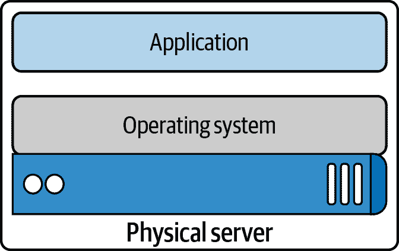

###### 图 3-1 应用服务器

从网络的角度来看，一个操作系统只有一个 TCP/IP 堆栈。这一单一堆栈会在主机机器上创建端口冲突问题。系统管理员在同一台机器上托管多个应用程序，每个应用程序必须在其端口上运行。因此，现在，系统管理员、应用程序开发人员和网络工程师都必须共同协调这一切。增加部署清单中的任务包括创建故障排除指南并处理所有 IT 请求。虚拟化软件是提高一台主机机器效率、解决单一操作系统/网络堆栈问题的一种方法。

## 虚拟化软件

虚拟化软件从主机机器模拟硬件资源、CPU 和内存，创建客户操作系统或虚拟机。2001 年，VMware 发布了其 x86 虚拟化软件；早期版本包括 IBM 的 z/Architecture 和 FreeBSD jails。2003 年发布了第一个开源虚拟化软件 Xen，2006 年发布了基于内核的虚拟化软件（KVM）。虚拟化软件允许系统管理员与多个客户操作系统共享底层硬件；图 3-2 展示了这一点。这种资源共享提高了主机机器的效率，缓解了系统管理员的问题。

虚拟化软件还为每个应用开发团队提供了独立的网络堆栈，解决了共享系统上端口冲突的问题。例如，团队 A 的 Tomcat 应用可以在端口 8080 上运行，而团队 B 的应用也可以在端口 8080 上运行，因为每个应用现在都可以有其独立的客户操作系统和网络堆栈。但对于应用开发人员来说，仍然存在库版本、部署和其他问题。他们如何打包和部署应用程序所需的一切，同时保持虚拟化软件和虚拟机引入的效率？这一问题促使了容器的发展。

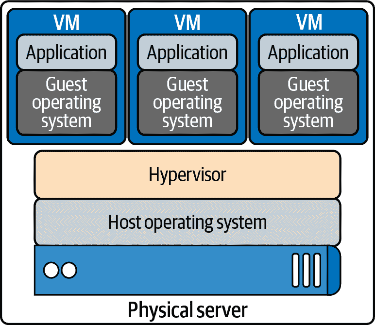

###### 图 3-2\. 虚拟化软件

## 容器

在 图 3-3 中，我们看到应用程序容器化的好处；每个容器都是独立的。应用程序开发人员可以使用他们需要的任何东西来运行他们的应用程序，而不依赖于底层库或主机操作系统。每个容器还有自己的网络堆栈。容器允许开发人员在保持主机机器效率的同时打包和部署应用程序。

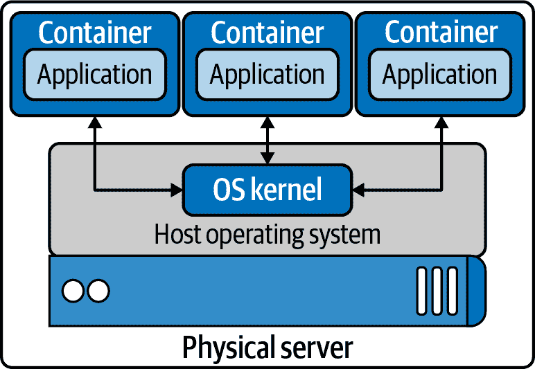

###### 图 3-3\. 运行在主机操作系统上的容器

任何技术都有其变化、竞争和创新历史，容器也不例外。以下是学习容器时可能令人困惑的术语列表。首先，我们列出了容器运行时的区别，讨论了每个运行时的功能，并展示了它们与 Kubernetes 的关系。容器运行时的功能可以分为“高级”和“低级”：

容器

运行中的容器镜像。

图像

容器镜像是从注册服务器拉取并在本地作为挂载点使用的文件。

容器引擎

容器引擎通过命令行选项接受用户请求来拉取镜像并运行容器。

容器运行时

容器运行时是容器引擎中处理运行容器的底层软件组件。

基础镜像

容器镜像的起点；为了减少构建镜像的大小和复杂性，用户可以从基础镜像开始，并在其上进行增量更改。

镜像层

仓库通常被称为镜像或容器镜像，但实际上它们由一个或多个层组成。仓库中的镜像层以父子关系连接。每个镜像层代表其与父层之间的变化。

镜像格式

容器引擎具有自己的容器镜像格式，如 LXD、RKT 和 Docker。

注册表

注册表存储容器镜像，并允许用户上传、下载和更新容器镜像。

仓库

仓库可以等同于一个容器镜像。重要的区别在于仓库由层和有关镜像的元数据组成；这是清单。

标签

标签是容器镜像不同版本的用户定义名称。

容器主机

容器主机是运行带有容器引擎的系统。

容器编排

这就是 Kubernetes 的工作方式！它动态地为容器主机集群调度容器工作负载。

###### 注意

Cgroups 和命名空间是用于创建容器的 Linux 原语；它们将在下一节中讨论。

“低级”功能的一个示例是为容器创建 cgroups 和命名空间，这是运行容器的最低要求。开发人员在处理容器时需要更多功能。他们需要构建和测试容器，并将其部署；这些被认为是“高级”功能。每个容器运行时都提供各种功能级别。以下是高级和低级功能的列表：

低级容器运行时功能

+   创建容器

+   运行容器

高级容器运行时功能

+   格式化容器镜像

+   构建容器镜像

+   管理容器镜像

+   管理容器实例

+   共享容器镜像

在接下来的几页中，我们将讨论实现前述功能的运行时。以下每个项目都有其优点和缺点，以提供高级和低级功能。一些项目因历史原因而值得了解，但已不复存在或已与其他项目合并：

低级容器运行时

LXC

用于创建 Linux 容器的 C API

runC

OCI 兼容容器的命令行界面

高级容器运行时

containerd

从 Docker 分离出来的容器运行时，一个毕业的 CNCF 项目

CRI-O

使用开放容器倡议（OCI）规范的容器运行时接口，一个孵化中的 CNCF 项目

Docker

开源容器平台

lmctfy

Google 容器化平台

rkt

CoreOS 容器规范

### OCI

OCI 促进容器技术的通用、最小、开放标准和规范。

创建容器图像格式和运行时的正式规范的想法允许容器在所有主要操作系统和平台之间可移植，以确保没有不必要的技术障碍。 OCI 项目的三个价值观如下：

可组合

管理容器的工具应具有清晰的界面。它们也不应绑定到特定的项目、客户端或框架，并且应该在所有平台上工作。

去中心化

格式和运行时应由社区明确定义和开发，而不是一个组织。 OCI 项目的另一个目标是独立实现工具以运行相同的容器。

极简主义者

OCI 规范力求做好几件事，保持简洁和稳定，促进创新和实验。

Docker 捐赠了一个基础格式和运行时的草案。它还捐赠了用于 OCI 的参考实现代码。 Docker 使用 libcontainer 项目的内容，使其独立于 Docker 运行，并捐赠给 OCI 项目。该代码库是 runC，可以在 [GitHub](https://oreil.ly/A49v0) 找到。

让我们讨论几个早期的容器倡议及其能力。本节将结束 Kubernetes 在容器运行时及其如何协同工作的地方。

### LXC

Linux 容器，LXC，创建于 2008 年。LXC 结合 cgroups 和命名空间，为运行应用程序提供了一个隔离的环境。LXC 的目标是尽可能接近标准 Linux 环境，而无需单独的内核。LXC 有独立的组件：`liblxc` 库、几种编程语言绑定、Python 版本 2 和 3、Lua、Go、Ruby、Haskell、一套标准工具和容器模板。

### runC

runC 是最广泛使用的容器运行时，最初作为 Docker 的一部分开发，后来作为单独的工具和库进行提取。runC 是一个命令行工具，用于运行按照 OCI 格式打包的应用程序，并且是 OCI 规范的兼容实现。runC 使用的是 `libcontainer`，这与 Docker 引擎安装中的容器库相同。在 1.11 版本之前，Docker 引擎用于管理卷、网络、容器、镜像等。现在，Docker 架构有几个组件，而 runC 的特性包括以下内容：

+   全面支持 Linux 命名空间，包括用户命名空间

+   对 Linux 中所有可用的安全特性的本地支持

    +   SELinux、AppArmor、seccomp、控制组、能力降低、`pivot_root`、UID/GID 降低等。

+   Windows 10 容器的本地支持

+   计划为整个硬件制造商生态系统提供本地支持

+   由 Linux 基金会的 OCI 管理的正式指定的配置格式

### containerd

containerd 是从 Docker 中拆分出来的一个高级运行时。containerd 是一个后台服务，作为各种容器运行时和操作系统的 API 门面。containerd 有各种组件提供高级功能。containerd 是 Linux 和 Windows 的服务，管理其主机系统的完整容器生命周期、镜像传输、存储、容器执行和网络附加。containerd 的客户端 CLI 工具是 `ctr`，用于开发和调试直接与 containerd 通信。containerd-shim 是允许无守护程序容器的组件。它作为容器进程的父进程驻留，以便完成几件事情。containerd 允许运行时（如 runC）在启动容器后退出。这样，我们就不需要为容器保持长时间运行的运行时进程。它还保持容器的标准 I/O 和其他文件描述符，如果 containerd 和 Docker 终止，则会关闭管道的父侧，容器会退出。如果 shim 未运行，则容器的退出状态也会向像 Docker 这样的高级工具报告，而不需要容器进程的实际父进程来执行此操作。

### lmctfy

Google 在 2013 年以其开源 Linux 容器技术 lmctfy 开始。lmctfy 是一个高级容器运行时，提供创建和删除容器的能力，但目前已不再积极维护，并且被移植到现在的 containerd 中。lmctfy 提供了 API 驱动的配置，无需开发者关心 cgroups 和命名空间内部的细节。

### rkt

rkt 在 2014 年作为 Docker 的替代品在 CoreOS 开始。它用 Go 语言编写，以 pod 作为基本计算单元，并允许为应用程序提供自包含环境。rkt 的原生镜像格式是 App Container Image (ACI)，在 App Container 规范中定义；这已被 OCI 格式和规范支持所取代。它支持 CNI 规范，并且可以运行 Docker 镜像和 OCI 镜像。rkt 项目由维护者在 2020 年 2 月归档。

### Docker

Docker 在 2013 年发布，解决了开发者在容器端到端运行中遇到的许多问题。它具备所有这些功能，供开发者创建、维护和部署容器：

+   格式化容器镜像

+   构建容器镜像

+   管理容器镜像

+   管理容器实例

+   共享容器镜像

+   运行容器

图 3-4 展示了 Docker 引擎及其各个组件的架构。Docker 最初是一个单体应用程序，将所有先前的功能构建成一个称为*Docker 引擎*的单一二进制文件。该引擎包含了允许开发人员构建、运行和推送容器和镜像的 Docker 客户端或 CLI。Docker 服务器作为守护进程运行，用于管理运行容器的数据卷和网络。客户端通过 Docker API 与服务器通信。它使用 containerd 管理容器生命周期，并使用 runC 生成容器进程。

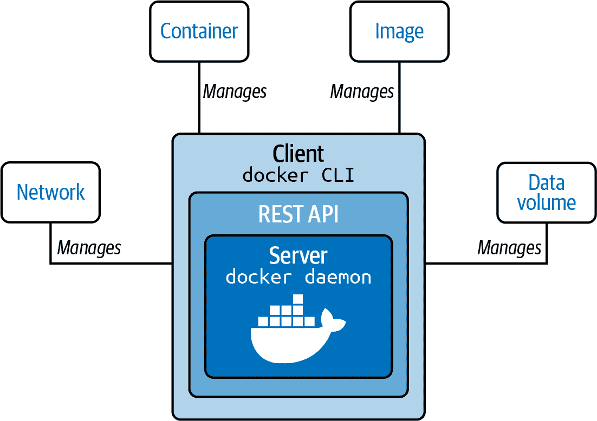

###### 图 3-4\. Docker 引擎

在过去的几年中，Docker 已经将这个单体应用程序拆分成了单独的组件。要运行一个容器，Docker 引擎创建镜像并将其传递给 containerd。containerd 调用 containerd-shim，后者使用 runC 来运行容器。然后，containerd-shim 允许运行时（在这种情况下是 runC）在启动容器后退出。这样，我们可以运行无守护进程的容器，因为我们不需要为容器运行长时间运行的运行时进程。

Docker 为应用程序开发人员和系统管理员提供了关注点分离。它允许开发人员专注于构建他们的应用程序，而系统管理员专注于部署。Docker 提供了快速的开发周期；要测试我们 Web 应用程序的新版本的 Golang，我们可以更新基础镜像并对其运行测试。Docker 在本地运行、云端或任何其他数据中心中运行时提供了应用程序可移植性。其座右铭是构建、发布和随处运行。可以快速为可伸缩性而部署新的容器，并在一个主机上运行更多的应用程序，提高该主机的效率。

### CRI-O

CRI-O 是基于 OCI 的 Kubernetes CRI 实现，OCI 是容器运行时引擎必须实现的一组规范。Red Hat 在 2016 年启动了 CRI 项目，并于 2019 年将其贡献给 CNCF。CRI 是一个插件接口，使 Kubernetes 能够通过`Kubelet`与满足 CRI 接口的任何容器运行时通信。在 Kubernetes 项目引入 CRI 后，CRI-O 的开发于 2016 年开始，CRI-O 1.0 于 2017 年发布。CRI-O 是一个轻量级的 CRI 运行时，作为基于 gRPC 和 Protobuf 的 UNIX 套接字上的专用于 Kubernetes 的高级运行时。图 3-5 指出了 CRI 在整个 Kubernetes 架构中的位置。CRI-O 在 Kubernetes 项目中提供稳定性，并致力于通过 Kubernetes 测试。

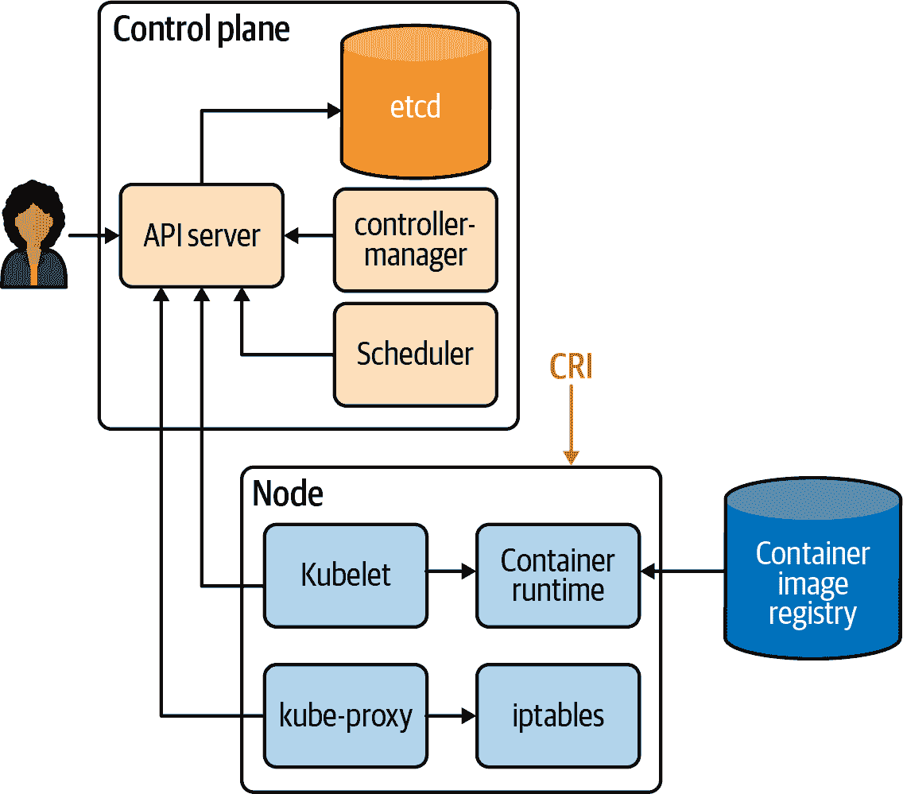

###### 图 3-5\. Kubernetes 的 CRI

在容器领域，已经涌现出许多公司、技术和创新。本节简要介绍了这方面的历史。行业已决定确保容器景观保持作为供所有人使用的开放 OCI 项目的状态。Kubernetes 在这方面的努力也为此做出了贡献，通过 CRI-O 接口的采用。理解容器的组件对所有容器部署的管理员和使用容器的开发者都至关重要。最近的一个例子是 Kubernetes 1.20 中，将停用 dockershim 支持。管理员使用 dockershim 的 Docker 运行时已被弃用，但开发者仍然可以使用 Docker 构建符合 OCI 标准的容器来运行。

###### 注意

第一个 CRI 实现是 dockershim，它在 Docker 引擎前提供了一层抽象。

现在我们将更深入地了解支持容器技术。

# 容器基元

无论您使用 Docker 还是 containerd，runC 都会启动和管理它们的实际容器。在本节中，我们将从容器的角度审视 runC 为开发者处理的内容。我们的每个容器都有作为 Linux 原语的 *控制组* 和 *命名空间*。图 3-6 展示了这一外观的示例；cgroups 控制我们容器内核资源的访问，而命名空间则是独立的资源片段，可以与根命名空间（即主机）分开管理。

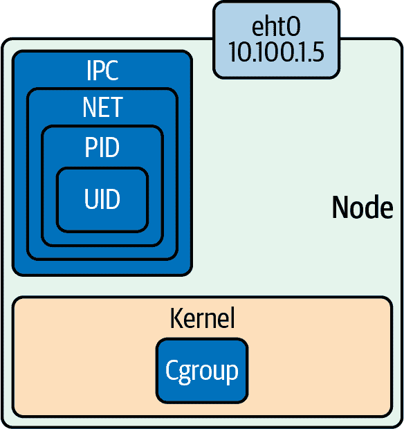

###### 图 3-6\. 命名空间和控制组

为了帮助巩固这些概念，让我们进一步深入控制组和命名空间。

## 控制组

简而言之，cgroup 是 Linux 内核的一个功能，用于限制、统计和隔离资源使用。最初在 Linux 2.6.24 中发布，cgroups 允许管理员控制不同 CPU 系统和内存的特定进程。cgroups 通过伪文件系统提供，并由 cgroups 中的核心内核代码维护。这些单独的子系统在内核中维护各种 cgroups：

CPU

可以保证进程至少有一定数量的 CPU 分享。

内存

这些设置了进程的内存限制。

磁盘 I/O

这些和其他设备通过设备 cgroup 子系统进行控制。

网络

这由 `net_cls` 维护，并标记离开 cgroup 的数据包。

`lscgroup` 是一个列出系统中当前所有 cgroups 的命令行工具。

runC 将在容器创建时创建这些 cgroup。cgroup 控制容器可以使用的资源量，而命名空间控制容器内的进程可以看到的内容。

## 命名空间

命名空间是 Linux 内核的特性，用于隔离和虚拟化一组进程的系统资源。以下是虚拟化资源的示例：

PID 命名空间

进程 ID，用于进程隔离

网络命名空间

管理网络接口和单独的网络堆栈

IPC 命名空间

管理对进程间通信（IPC）资源的访问

挂载命名空间

管理文件系统挂载点

UTS 命名空间

UNIX 时间共享；允许单个主机为不同的进程拥有不同的主机和域名

UID 命名空间

用户 ID；使用单独的用户和组分配隔离进程所有权

进程的用户和组 ID 在用户命名空间内外可能不同。在用户命名空间内，进程可以具有非特权用户 ID，同时在容器用户命名空间内具有用户 ID 0。进程在用户命名空间内具有 root 权限执行，但在命名空间外部进行操作时无特权。

示例 3-1 展示了如何检查进程的命名空间的示例。Linux 中所有进程的信息都在`/proc`文件系统中。PID 1 的 PID 命名空间是`4026531836`，列出所有命名空间显示 PID 命名空间 ID 匹配。

##### 示例 3-1\. 单个进程的命名空间

```
vagrant@ubuntu-xenial:~$ sudo ps -p 1 -o pid,pidns
  PID      PIDNS
    1 4026531836

vagrant@ubuntu-xenial:~$ sudo ls -l /proc/1/ns
total 0
lrwxrwxrwx 1 root root 0 Dec 12 20:41 cgroup -> cgroup:[4026531835]
lrwxrwxrwx 1 root root 0 Dec 12 20:41 ipc -> ipc:[4026531839]
lrwxrwxrwx 1 root root 0 Dec 12 20:41 mnt -> mnt:[4026531840]
lrwxrwxrwx 1 root root 0 Dec 12 20:41 net -> net:[4026531957]
lrwxrwxrwx 1 root root 0 Dec 12 20:41 pid -> pid:[4026531836]
lrwxrwxrwx 1 root root 0 Dec 12 20:41 user -> user:[4026531837]
lrwxrwxrwx 1 root root 0 Dec 12 20:41 uts -> uts:[4026531838]
```

图 3-7 显示，这两个 Linux 原语有效地允许应用程序开发人员控制和管理其应用程序，与主机和其他应用程序分开，无论是在容器中还是通过在主机上本地运行。

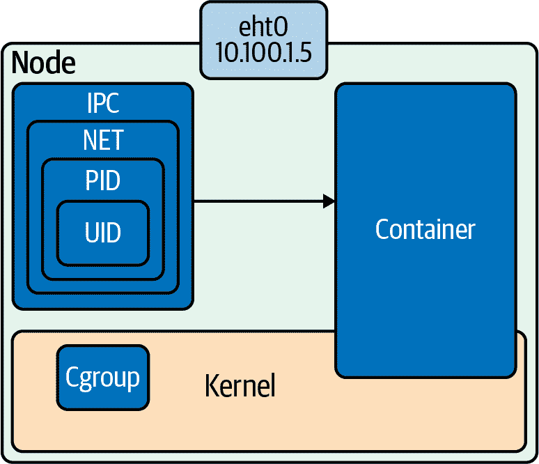

###### 图 3-7\. Cgroups 和命名空间的综合作用

以下示例使用 Ubuntu 16.04 LTS Xenial Xerus。如果您想在您的系统上跟随操作，可以在本书的代码库中找到更多信息。该代码库包含用于构建 Ubuntu 虚拟机和 Docker 容器的工具和配置。让我们开始设置和测试我们的命名空间。

## 设置命名空间

图 3-8 概述了基本容器网络设置。在接下来的页面中，我们将详细介绍用于容器网络创建的所有 Linux 命令，这些命令由低级运行时完成。

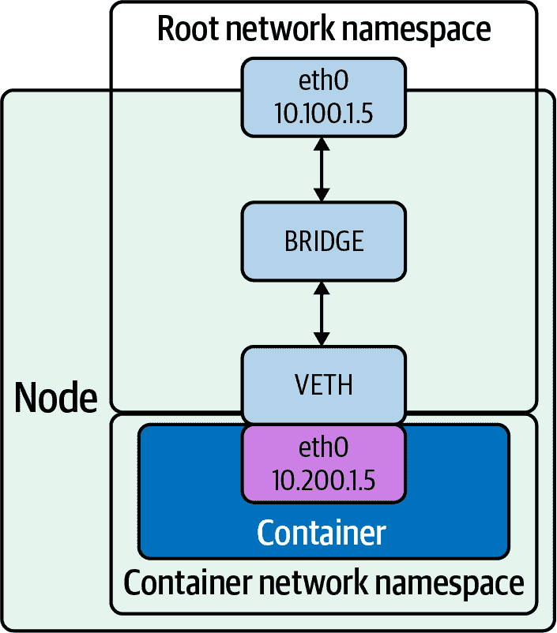

###### 图 3-8\. 根网络命名空间和容器网络命名空间

以下步骤展示了如何创建图 3-8 所示的网络设置：

1.  创建具有根网络命名空间的主机。

1.  创建新的网络命名空间。

1.  创建 veth 对。

1.  将 veth 对的一侧移入新的网络命名空间。

1.  处理新网络命名空间中 veth 对的一侧。

1.  创建桥接口。

1.  处理桥接口。

1.  将桥接到主机接口。

1.  将 veth 对的一侧附加到桥接口。

1.  获利。

以下是创建网络命名空间、桥接和 veth 对以及将它们连接在一起所需的所有 Linux 命令：

```
$ echo 1 > /proc/sys/net/ipv4/ip_forward
$ sudo ip netns add net1
$ sudo ip link add veth0 type veth peer name veth1
$ sudo ip link set veth1 netns net1
$ sudo ip link add veth0 type veth peer name veth1
$ sudo ip netns exec net1 ip addr add 192.168.1.101/24 dev veth1
$ sudo ip netns exec net1 ip link set dev veth1 up
$ sudo ip link add br0 type bridge
$ sudo ip link set dev br0 up
$ sudo ip link set enp0s3 master br0
$ sudo ip link set veth0 master br0
$ sudo ip netns exec net1  ip route add default via 192.168.1.100
```

让我们深入一个示例并概述每个命令。

Linux 命令`ip`设置并控制网络命名空间。

###### 注意

您可以在其[man 页](https://oreil.ly/jBKL7)上找到更多关于`ip`的信息。

在示例 3-2 中，我们使用 Vagrant 和 VirtualBox 创建了一个新的 Ubuntu 安装，用于我们的测试目的。

##### 示例 3-2\. Ubuntu 测试虚拟机

```
$ vagrant up
Bringing machine 'default' up with 'virtualbox' provider...
==> default: Importing base box 'ubuntu/xenial64'...
==> default: Matching MAC address for NAT networking...
==> default: Checking if box 'ubuntu/xenial64' version '20200904.0.0' is up to date...
==> default: Setting the name of the VM:
advanced_networking_code_examples_default_1600085275588_55198
==> default: Clearing any previously set network interfaces...
==> default: Available bridged network interfaces:
1) en12: USB 10/100 /1000LAN
2) en5: USB Ethernet(?)
3) en0: Wi-Fi (Wireless)
4) llw0
5) en11: USB 10/100/1000 LAN 2
6) en4: Thunderbolt 4
7) en1: Thunderbolt 1
8) en2: Thunderbolt 2
9) en3: Thunderbolt 3
==> default: When choosing an interface, it is usually the one that is
==> default: being used to connect to the internet.
==> default:
    default: Which interface should the network bridge to? 1
==> default: Preparing network interfaces based on configuration...
    default: Adapter 1: nat
    default: Adapter 2: bridged
==> default: Forwarding ports...
    default: 22 (guest) => 2222 (host) (adapter 1)
==> default: Running 'pre-boot' VM customizations...
==> default: Booting VM...
==> default: Waiting for machine to boot. This may take a few minutes...
    default: SSH address: 127.0.0.1:2222
    default: SSH username: vagrant
    default: SSH auth method: private key
    default: Warning: Connection reset. Retrying...
    default:
    default: Vagrant insecure key detected. Vagrant will automatically replace
    default: this with a newly generated keypair for better security.
    default:
    default: Inserting generated public key within guest...
    default: Removing insecure key from the guest if it's present...
    default: Key inserted! Disconnecting and reconnecting using new SSH key...
==> default: Machine booted and ready!
==> default: Checking for guest additions in VM...
==> default: Configuring and enabling network interfaces...
==> default: Mounting shared folders...
    default: /vagrant =>
    /Users/strongjz/Documents/code/advanced_networking_code_examples
```

参考书籍存储库的 Vagrantfile 以重现此过程。

###### 注意

[Vagrant](https://oreil.ly/o8Qo0) 是由 HashiCorp 创建的本地虚拟机管理器。

在 Vagrant 启动我们的虚拟机后，我们可以使用 Vagrant 来`ssh`进入这个虚拟机：

```
$± |master U:2 ?:2 ✗| → vagrant ssh
Welcome to Ubuntu 16.04.7 LTS (GNU/Linux 4.4.0-189-generic x86_64)

vagrant@ubuntu-xenial:~$
```

*IP 转发* 是操作系统接受一个接口上的传入网络数据包，识别其目的地，然后相应地传送到该网络的能力。启用 IP 转发允许 Linux 机器接收并转发传入的数据包。作为普通主机的 Linux 机器通常不需要启用 IP 转发，因为它生成和接收 IP 流量用于自身目的。默认情况下，它是关闭的；让我们在我们的 Ubuntu 实例上启用它：

```
vagrant@ubuntu-xenial:~$ sysctl net.ipv4.ip_forward
net.ipv4.ip_forward = 0
vagrant@ubuntu-xenial:~$ sudo echo 1 > /proc/sys/net/ipv4/ip_forward
vagrant@ubuntu-xenial:~$  sysctl net.ipv4.ip_forward
net.ipv4.ip_forward = 1
```

通过我们安装的 Ubuntu 实例，我们可以看到我们没有任何额外的网络命名空间，所以让我们创建一个：

```
vagrant@ubuntu-xenial:~$ sudo ip netns list
```

`ip netns` 允许我们在服务器上控制命名空间。创建一个像输入`ip netns add net1`这样简单：

```
vagrant@ubuntu-xenial:~$ sudo ip netns add net1
```

当我们通过此示例工作时，我们可以看到我们刚刚创建的网络命名空间：

```
vagrant@ubuntu-xenial:~$ sudo ip netns list
net1
```

现在我们为容器的新网络命名空间创建了一个新的网络命名空间，我们需要一个 veth 对来在根网络命名空间和容器网络命名空间`net1`之间通信。

`ip` 再次允许管理员使用简单命令创建 veth 对。请从第二章记住，veth 成对出现，充当网络命名空间之间的通道，因此，一个端口的数据包会自动转发到另一个端口。

```
vagrant@ubuntu-xenial:~$ sudo ip link add veth0 type veth peer name veth1
```

###### 小贴士

接口 4 和 5 是命令输出中的 veth 对。我们还可以看到它们彼此配对，`veth1@veth0` 和 `veth0@veth1`。

`ip link list` 命令验证了 veth 对的创建：

```
vagrant@ubuntu-xenial:~$ ip link list
1: lo: <LOOPBACK,UP,LOWER_UP> mtu 65536 qdisc noqueue state
UNKNOWN mode DEFAULT group default qlen 1
    link/loopback 00:00:00:00:00:00 brd 00:00:00:00:00:00
2: enp0s3: <BROADCAST,MULTICAST,UP,LOWER_UP> mtu 1500 qdisc
pfifo_fast state UP mode DEFAULT group default qlen 1000
    link/ether 02:8f:67:5f:07:a5 brd ff:ff:ff:ff:ff:ff
3: enp0s8: <BROADCAST,MULTICAST,UP,LOWER_UP> mtu 1500 qdisc
pfifo_fast state UP mode DEFAULT group default qlen 1000
    link/ether 08:00:27:0f:4e:0d brd ff:ff:ff:ff:ff:ff
4: veth1@veth0: <BROADCAST,MULTICAST,M-DOWN> mtu 1500 qdisc
noop state DOWN mode DEFAULT group default qlen 1000
    link/ether 72:e4:03:03:c1:96 brd ff:ff:ff:ff:ff:ff
5: veth0@veth1: <BROADCAST,MULTICAST,M-DOWN> mtu 1500 qdisc
noop state DOWN mode DEFAULT group default qlen 1000
    link/ether 26:1a:7f:2c:d4:48 brd ff:ff:ff:ff:ff:ff
vagrant@ubuntu-xenial:~$
```

现在让我们将`veth1`移入之前创建的新网络命名空间：

```
vagrant@ubuntu-xenial:~$ sudo ip link set veth1 netns net1
```

`ip netns exec` 允许我们验证网络命名空间的配置。输出验证了`veth1`现在位于网络命名空间`net1`中：

```
vagrant@ubuntu-xenial:~$ sudo ip netns exec net1 ip link list
4: veth1@if5: <BROADCAST,MULTICAST> mtu 1500 qdisc noop state
DOWN mode DEFAULT group default qlen 1000
    link/ether 72:e4:03:03:c1:96 brd ff:ff:ff:ff:ff:ff link-netnsid 0
```

网络命名空间是 Linux 内核中完全分离的 TCP/IP 堆栈。作为新接口并位于新网络命名空间中，veth 接口需要 IP 地址以便从`net1`命名空间中的根命名空间和主机向外传递数据包：

```
vagrant@ubuntu-xenial:~$ sudo ip netns exec
net1 ip addr add 192.168.1.100/24 dev veth1
```

与主机网络接口一样，它们需要“打开”：

```
vagrant@ubuntu-xenial:~$ sudo ip netns exec net1 ip link set dev veth1 up
```

状态现在过渡为`LOWERLAYERDOWN`。状态`NO-CARRIER`指向正确方向。以太网需要连接电缆才能连接；我们的上行 veth 对也尚未启动。`veth1`接口已上线且寻址，但实际上仍然处于“未连接”状态：

```
vagrant@ubuntu-xenial:~$ sudo ip netns exec net1 ip link list veth1
4: veth1@if5: <NO-CARRIER,BROADCAST,MULTICAST,UP> mtu 1500
qdisc noqueue state LOWERLAYERDOWN mode DEFAULT
group default qlen 1000 link/ether 72:e4:03:03:c1:96
brd ff:ff:ff:ff:ff:ff link-netnsid 0
```

现在让我们打开配对的`veth0`端：

```
vagrant@ubuntu-xenial:~$ sudo ip link set dev veth0 up
vagrant@ubuntu-xenial:~$ sudo ip link list
5: veth0@if4: <BROADCAST,MULTICAST,UP,LOWER_UP> mtu 1500
qdisc noqueue state UP mode DEFAULT group default qlen 1000
link/ether 26:1a:7f:2c:d4:48 brd ff:ff:ff:ff:ff:ff link-netnsid 0
```

现在`net1`命名空间内的 veth 对为`UP`：

```
vagrant@ubuntu-xenial:~$ sudo ip netns exec net1 ip link list
4: veth1@if5: <BROADCAST,MULTICAST,UP,LOWER_UP> mtu 1500
qdisc noqueue state UP mode DEFAULT group default qlen 1000
link/ether 72:e4:03:03:c1:96 brd ff:ff:ff:ff:ff:ff link-netnsid 0
```

veth 对的两端都报告为 up；我们需要将根命名空间的 veth 端连接到桥接接口。确保选择你正在使用的接口，在这种情况下是`enp0s8`；对其他情况可能不同：

```
vagrant@ubuntu-xenial:~$ sudo ip link add br0 type bridge
vagrant@ubuntu-xenial:~$ sudo ip link set dev br0 up
vagrant@ubuntu-xenial:~$ sudo ip link set enp0s8 master br0
vagrant@ubuntu-xenial:~$ sudo ip link set veth0 master br0
```

我们可以看到，enp0s8 和 veth0 报告是桥接接口 `br0` 的一部分，`master br0 state up`。

接下来，让我们测试对我们的网络命名空间的连接性：

```
vagrant@ubuntu-xenial:~$ ping 192.168.1.100 -c 4
PING 192.168.1.100 (192.168.1.100) 56(84) bytes of data.
From 192.168.1.10 icmp_seq=1 Destination Host Unreachable
From 192.168.1.10 icmp_seq=2 Destination Host Unreachable
From 192.168.1.10 icmp_seq=3 Destination Host Unreachable
From 192.168.1.10 icmp_seq=4 Destination Host Unreachable

--- 192.168.1.100 ping statistics ---
4 packets transmitted, 0 received, +4 errors, 100% packet loss, time 6043ms
```

我们的新网络命名空间没有默认路由，因此不知道如何路由我们的 `ping` 请求的数据包：

```
$ sudo ip netns exec net1
ip route add default via 192.168.1.100
$ sudo ip netns exec net1 ip r
default via 192.168.1.100 dev veth1
192.168.1.0/24 dev veth1  proto kernel  scope link  src 192.168.1.100
```

让我们再试一次：

```
$ ping 192.168.2.100 -c 4
PING 192.168.2.100 (192.168.2.100) 56(84) bytes of data.
64 bytes from 192.168.2.100: icmp_seq=1 ttl=64 time=0.018 ms
64 bytes from 192.168.2.100: icmp_seq=2 ttl=64 time=0.028 ms
64 bytes from 192.168.2.100: icmp_seq=3 ttl=64 time=0.036 ms
64 bytes from 192.168.2.100: icmp_seq=4 ttl=64 time=0.043 ms

--- 192.168.2.100 ping statistics ---
4 packets transmitted, 4 received, 0% packet loss, time 2997ms
```

```
$ ping 192.168.2.101 -c 4
PING 192.168.2.101 (192.168.2.101) 56(84) bytes of data.
64 bytes from 192.168.2.101: icmp_seq=1 ttl=64 time=0.016 ms
64 bytes from 192.168.2.101: icmp_seq=2 ttl=64 time=0.017 ms
64 bytes from 192.168.2.101: icmp_seq=3 ttl=64 time=0.016 ms
64 bytes from 192.168.2.101: icmp_seq=4 ttl=64 time=0.021 ms

--- 192.168.2.101 ping statistics ---
4 packets transmitted, 4 received, 0% packet loss, time 2997ms
rtt min/avg/max/mdev = 0.016/0.017/0.021/0.004 ms
```

成功！我们已创建了桥接接口和 veth 对，将其中一个迁移到新的网络命名空间，并测试了连接性。示例 3-3 是我们完成这一操作时运行的所有命令的总结。

##### 示例 3-3\. 总结网络命名空间的创建

```
$ echo 1 > /proc/sys/net/ipv4/ip_forward
$ sudo ip netns add net1
$ sudo ip link add veth0 type veth peer name veth1
$ sudo ip link set veth1 netns net1
$ sudo ip link add veth0 type veth peer name veth1
$ sudo ip netns exec net1 ip addr add 192.168.1.101/24 dev veth1
$ sudo ip netns exec net1 ip link set dev veth1 up
$ sudo ip link add br0 type bridge
$ sudo ip link set dev br0 up
$ sudo ip link set enp0s3 master br0
$ sudo ip link set veth0 master br0
$ sudo ip netns exec net1  ip route add default via 192.168.1.100
```

对于不熟悉所有这些命令的开发人员来说，这是很多需要记住的东西，而且非常容易出错！如果桥接信息不正确，可能会导致整个网络部分发生网络环路。这些问题是系统管理员希望避免的，因此他们防止开发人员在系统上进行这些类型的网络更改。幸运的是，容器帮助减少了开发人员需要记住所有这些命令的负担，并减轻了系统管理员允许开发人员运行这些命令所带来的恐惧。

这些命令对于每次容器的 *每次* 创建和删除的网络命名空间 *都是* 必要的。在 示例 3-3 中的命名空间创建是容器运行时的工作。Docker 以其自己的方式管理这些。CNI 项目标准化了所有系统的网络创建。CNI 类似于 OCI，是开发人员标准化和优化容器生命周期特定任务的方式。在后面的部分中，我们将讨论 CNI。

# 容器网络基础知识

前一节展示了创建网络命名空间所需的所有命令。让我们来研究 Docker 是如何为我们完成这些操作的。我们只使用了桥接模式；容器网络还有几种其他模式。本节将部署多个 Docker 容器，检查它们的网络，并解释容器如何与主机外部和彼此通信。

让我们从讨论与容器一起工作时使用的几种网络“模式”开始：

无

无网络禁用容器的网络访问。当容器不需要网络访问时使用此模式。

桥接

在桥接网络中，容器在主机内部的私有网络中运行。与网络中的其他容器通信是开放的。与主机外的服务通信在退出主机之前经过网络地址转换（NAT）。当未指定 `--net` 选项时，桥接模式是网络的默认模式。

主机

在主机网络中，容器与主机共享相同的 IP 地址和网络命名空间。运行在这个容器内的进程具有与直接在主机上运行服务相同的网络功能。如果容器需要访问主机上的网络资源，这种模式非常有用。但是，使用这种网络模式容器将失去网络分段的好处。部署容器的人将需要管理和竞争运行在该节点上的服务的端口。

###### 警告

主机网络驱动仅适用于 Linux 主机。Docker Desktop for Mac 和 Windows 或 Docker EE for Windows Server 不支持主机网络模式。

Macvlan

Macvlan 使用一个父接口。该接口可以是主机接口（如 eth0）、子接口，甚至是将以太网接口捆绑成单个逻辑接口的绑定主机适配器。与所有 Docker 网络一样，Macvlan 网络彼此分隔，提供网络内的访问，但不能在网络之间访问。Macvlan 允许物理接口使用多个 MAC 和 IP 地址，使用 Macvlan 子接口。Macvlan 有四种类型：私有、VEPA、桥接（Docker 默认使用）和透传。使用桥接时，使用 NAT 进行外部连接。与 Macvlan 不同，由于主机直接映射到物理网络，外部连接可以使用与主机相同的 DHCP 服务器和交换机。

###### 警告

大多数云提供商阻止 Macvlan 网络。需要管理员访问网络设备。

IPvlan

IPvlan 类似于 Macvlan，但有一个重要区别：IPvlan 不为创建的子接口分配 MAC 地址。所有子接口共享父接口的接口 MAC 地址，但使用不同的 IP 地址。IPvlan 有两种模式，L2 或 L3。在 IPvlan 中，L2 或第二层模式类似于 Macvlan 桥接模式。IPvlan L3 或第三层模式伪装为子接口和父接口之间的第三层设备。

Overlay

Overlay 允许在容器集群中跨主机扩展同一网络。Overlay 网络实际上位于底层/物理网络之上。几个开源项目创建这些 Overlay 网络，我们将在本章后面讨论。

自定义

自定义桥接网络与桥接网络相同，但使用专门为该容器创建的桥接。一个使用案例是运行在数据库桥接网络上的容器。另一个容器可以在默认和数据库桥接上有一个接口，从而能够根据需要与两个网络通信。

容器定义的网络允许一个容器共享另一个容器的地址和网络配置。这种共享使得容器之间能够进行进程隔离，每个容器运行一个服务，但服务仍然可以在`127.0.0.1`上相互通信。

要测试所有这些模式，我们需要继续使用一个已安装 Docker 的 Vagrant Ubuntu 主机。Mac 和 Windows 上的 Docker 不支持主机网络模式，因此我们必须在 Linux 上进行这个示例。您可以使用书中代码库中提供的 Example 1-1 中的已配置机器，或者使用 Docker Vagrant 版本。如果您想手动操作，Ubuntu 上安装 Docker 的步骤如下：

```
$ vagrant up
Bringing machine 'default' up with 'virtualbox' provider...
==> default: Importing base box 'ubuntu/xenial64'...
==> default: Matching MAC address for NAT networking...
==> default: Checking if box
'ubuntu/xenial64' version '20200904.0.0' is up to date...
==> default: Setting the name of the VM:
advanced_networking_code_examples_default_1600085275588_55198
==> default: Clearing any previously set network interfaces...
==> default: Available bridged network interfaces:
1) en12: USB 10/100 /1000LAN
2) en5: USB Ethernet(?)
3) en0: Wi-Fi (Wireless)
4) llw0
5) en11: USB 10/100/1000 LAN 2
6) en4: Thunderbolt 4
7) en1: Thunderbolt 1
8) en2: Thunderbolt 2
9) en3: Thunderbolt 3
==> default: When choosing an interface, it is usually the one that is
==> default: being used to connect to the internet.
==> default:
    default: Which interface should the network bridge to? 1
==> default: Preparing network interfaces based on configuration...
    default: Adapter 1: nat
    default: Adapter 2: bridged
==> default: Forwarding ports...
    default: 22 (guest) => 2222 (host) (adapter 1)
==> default: Running 'pre-boot' VM customizations...
==> default: Booting VM...
==> default: Waiting for machine to boot. This may take a few minutes...
    default: SSH address: 127.0.0.1:2222
    default: SSH username: vagrant
    default: SSH auth method: private key
    default: Warning: Connection reset. Retrying...
    default:
    default: Vagrant insecure key detected. Vagrant will automatically replace
    default: this with a newly generated keypair for better security.
    default:
    default: Inserting generated public key within guest...
    default: Removing insecure key from the guest if it's present...
    default: Key inserted! Disconnecting and reconnecting using new SSH key...
==> default: Machine booted and ready!
==> default: Checking for guest additions in VM...
==> default: Configuring and enabling network interfaces...
==> default: Mounting shared folders...
    default: /vagrant =>
    /Users/strongjz/Documents/code/advanced_networking_code_examples
    default: + sudo docker run hello-world
    default: Unable to find image 'hello-world:latest' locally
    default: latest: Pulling from library/hello-world
    default: 0e03bdcc26d7:
    default: Pulling fs layer
    default: 0e03bdcc26d7:
    default: Verifying Checksum
    default: 0e03bdcc26d7:
    default: Download complete
    default: 0e03bdcc26d7:
    default: Pull complete
    default: Digest:
    sha256:4cf9c47f86df71d48364001ede3a4fcd85ae80ce02ebad74156906caff5378bc
    default: Status: Downloaded newer image for hello-world:latest
    default:
    default: Hello from Docker!
    default: This message shows that your
    default: installation appears to be working correctly.
    default:
    default: To generate this message, Docker took the following steps:
    default:  1\. The Docker client contacted the Docker daemon.
    default:  2\. The Docker daemon pulled the "hello-world" image
    default: from the Docker Hub.
    default:     (amd64)
    default:  3\. The Docker daemon created a new container from that image
    default: which runs the executable that produces the output you are
    default: currently reading.
    default:  4\. The Docker daemon streamed that output to the Docker
    default: client, which sent it to your terminal.
    default:
    default: To try something more ambitious, you can run an Ubuntu
    default: container with:
    default:  $ docker run -it ubuntu bash
    default:
    default: Share images, automate workflows, and more with a free Docker ID:
    default:  https://hub.docker.com
    default:
    default: For more examples and ideas, visit:
    default:  https://docs.docker.com/get-started
```

现在我们已经启动了主机，让我们开始研究在 Docker 中可以使用的不同网络设置。示例 3-4 显示 Docker 在安装期间创建了三种网络类型：桥接、主机和无网络。

##### 示例 3-4\. Docker 网络

```
vagrant@ubuntu-xenial:~$ sudo docker network ls
NETWORK ID          NAME                DRIVER              SCOPE
1fd1db59c592        bridge              bridge              local
eb34a2105b0f        host                host                local
941ce103b382        none                null                local
vagrant@ubuntu-xenial:~$
```

默认是 Docker 桥接，容器附加到其中并配备了`172.17.0.0/16`默认子网中的 IP 地址。示例 3-5 显示了 Ubuntu 的默认接口以及创建`docker0`桥接接口的 Docker 安装情况。

##### 示例 3-5\. Docker 桥接口

```
vagrant@ubuntu-xenial:~$ ip a
1: lo: <LOOPBACK,UP,LOWER_UP> mtu 65536 qdisc
noqueue state UNKNOWN group default qlen 1 
    link/loopback 00:00:00:00:00:00 brd 00:00:00:00:00:00
    inet 127.0.0.1/8 scope host lo
    valid_lft forever preferred_lft forever
    inet6 ::1/128 scope host
    valid_lft forever preferred_lft forever
2: enp0s3:
<BROADCAST,MULTICAST,UP,LOWER_UP> mtu 1500 qdisc pfifo_fast state UP group
default qlen 1000 
    link/ether 02:8f:67:5f:07:a5 brd ff:ff:ff:ff:ff:ff
    inet 10.0.2.15/24 brd 10.0.2.255 scope global enp0s3
    valid_lft forever preferred_lft forever
    inet6 fe80::8f:67ff:fe5f:7a5/64 scope link
    valid_lft forever preferred_lft forever
3: enp0s8:
<BROADCAST,MULTICAST,UP,LOWER_UP> mtu 1500 qdisc pfifo_fast state UP group
default qlen 1000 
    link/ether 08:00:27:22:0e:46 brd ff:ff:ff:ff:ff:ff
    inet 192.168.1.19/24 brd 192.168.1.255 scope global enp0s8
    valid_lft forever preferred_lft forever
    inet 192.168.1.20/24 brd 192.168.1.255 scope global secondary enp0s8
    valid_lft forever preferred_lft forever
    inet6 2605:a000:160d:517:a00:27ff:fe22:e46/64 scope global mngtmpaddr dynamic
    valid_lft 604600sec preferred_lft 604600sec
    inet6 fe80::a00:27ff:fe22:e46/64 scope link
    valid_lft forever preferred_lft forever
4: docker0:
<NO-CARRIER,BROADCAST,MULTICAST,UP> mtu 1500 qdisc noqueue state DOWN group
default 
    link/ether 02:42:7d:50:c7:01 brd ff:ff:ff:ff:ff:ff
    inet 172.17.0.1/16 brd 172.17.255.255 scope global docker0
    valid_lft forever preferred_lft forever
    inet6 fe80::42:7dff:fe50:c701/64 scope link
    valid_lft forever preferred_lft forever
```


这是回环接口。


enp0s3 是我们 NAT 的虚拟桥接接口。


enp0s8 是主机接口；它位于与我们主机相同的网络上，并使用 DHCP 获取`192.168.1.19`地址的默认 Docker 桥接。


默认的 Docker 容器接口使用桥接模式。

示例 3-6 使用`docker run`命令启动了一个忙碌的 busybox 容器，并请求 Docker 返回容器的 IP 地址。 Docker 的默认 NAT 地址是`172.17.0.0/16`，我们的 busybox 容器得到的是`172.17.0.2`。

##### 示例 3-6\. Docker 桥接

```
vagrant@ubuntu-xenial:~$ sudo docker run -it busybox ip a
Unable to find image 'busybox:latest' locally
latest: Pulling from library/busybox
df8698476c65: Pull complete
Digest: sha256:d366a4665ab44f0648d7a00ae3fae139d55e32f9712c67accd604bb55df9d05a
Status: Downloaded newer image for busybox:latest
1: lo: <LOOPBACK,UP,LOWER_UP> mtu 65536 qdisc noqueue qlen 1
    link/loopback 00:00:00:00:00:00 brd 00:00:00:00:00:00
    inet 127.0.0.1/8 scope host lo
    valid_lft forever preferred_lft forever
7: eth0@if8: <BROADCAST,MULTICAST,UP,LOWER_UP,M-DOWN> mtu 1500 qdisc noqueue
    link/ether 02:42:ac:11:00:02 brd ff:ff:ff:ff:ff:ff
    inet 172.17.0.2/16 brd 172.17.255.255 scope global eth0
    valid_lft forever preferred_lft forever
```

示例 3-7 中的主机网络显示，容器与主机共享相同的网络命名空间。我们可以看到接口与主机的相同；enp0s3、enp0s8 和 docker0 都存在于容器的`ip a`命令输出中。

##### 示例 3-7\. Docker 主机网络

```
vagrant@ubuntu-xenial:~$ sudo docker run -it --net=host busybox ip a
1: lo: <LOOPBACK,UP,LOWER_UP> mtu 65536 qdisc noqueue qlen 1
    link/loopback 00:00:00:00:00:00 brd 00:00:00:00:00:00
    inet 127.0.0.1/8 scope host lo
    valid_lft forever preferred_lft forever
    inet6 ::1/128 scope host
    valid_lft forever preferred_lft forever`
2: enp0s3: <BROADCAST,MULTICAST,UP,LOWER_UP> mtu 1500 qdisc pfifo_fast qlen 1000
    link/ether 02:8f:67:5f:07:a5 brd ff:ff:ff:ff:ff:ff
    inet 10.0.2.15/24 brd 10.0.2.255 scope global enp0s3
    valid_lft forever preferred_lft forever
    inet6 fe80::8f:67ff:fe5f:7a5/64 scope link
    valid_lft forever preferred_lft forever
3: enp0s8: <BROADCAST,MULTICAST,UP,LOWER_UP> mtu 1500 qdisc pfifo_fast qlen 1000
    link/ether 08:00:27:22:0e:46 brd ff:ff:ff:ff:ff:ff
    inet 192.168.1.19/24 brd 192.168.1.255 scope global enp0s8
    valid_lft forever preferred_lft forever
    inet 192.168.1.20/24 brd 192.168.1.255 scope global secondary enp0s8
    valid_lft forever preferred_lft forever
    inet6 2605:a000:160d:517:a00:27ff:fe22:e46/64 scope global dynamic
    valid_lft 604603sec preferred_lft 604603sec
    inet6 fe80::a00:27ff:fe22:e46/64 scope link
    valid_lft forever preferred_lft forever
4: docker0: <NO-CARRIER,BROADCAST,MULTICAST,UP> mtu 1500 qdisc noqueue
    link/ether 02:42:7d:50:c7:01 brd ff:ff:ff:ff:ff:ff
    inet 172.17.0.1/16 brd 172.17.255.255 scope global docker0
    valid_lft forever preferred_lft forever
    inet6 fe80::42:7dff:fe50:c701/64 scope link
    valid_lft forever preferred_lft forever
```

根据先前设置的 veth 桥接示例，让我们看看当 Docker 为我们管理时，它是多么简单。为了查看这一点，我们需要一个进程来保持容器运行。以下命令启动一个 busybox 容器并进入`sh`命令行：

```
vagrant@ubuntu-xenial:~$ sudo docker run -it --rm busybox /bin/sh
/#
```

我们有一个回环接口`lo`，和一个连接到 veth12 的以太网接口`eth0`，Docker 的默认 IP 地址为`172.17.0.2`。由于我们之前的命令仅输出了一个`ip a`结果，容器随后退出，Docker 重新使用 IP 地址`172.17.0.2`用于运行的 busybox 容器：

```
/# ip a
1: lo: <LOOPBACK,UP,LOWER_UP> mtu 65536 qdisc noqueue qlen 1
    link/loopback 00:00:00:00:00:00 brd 00:00:00:00:00:00
    inet 127.0.0.1/8 scope host lo
    valid_lft forever preferred_lft forever
11: eth0@if12: <BROADCAST,MULTICAST,UP,LOWER_UP,M-DOWN> mtu 1500 qdisc noqueue
    link/ether 02:42:ac:11:00:02 brd ff:ff:ff:ff:ff:ff
    inet 172.17.0.2/16 brd 172.17.255.255 scope global eth0
    valid_lft forever preferred_lft forever
```

在容器的网络命名空间中运行`ip r`，我们可以看到容器的路由表也自动设置好了：

```
/ # ip r
default via 172.17.0.1 dev eth0
172.17.0.0/16 dev eth0 scope link  src 172.17.0.2
```

如果我们在新终端中打开并通过 `vagrant ssh` 进入我们的 Vagrant Ubuntu 实例，并运行 `docker ps` 命令，它将显示运行中的 busybox 容器的所有信息：

```
vagrant@ubuntu-xenial:~$ sudo docker ps
CONTAINER ID        IMAGE       COMMAND
3b5a7c3a74d5        busybox     "/bin/sh"

CREATED         STATUS        PORTS     NAMES
47 seconds ago  Up 46 seconds           competent_mendel
```

我们可以在同一主机的网络命名空间中看到 Docker 为容器 `veth68b6f80@if11` 设置的 veth 接口。它是 `docker0` 桥的成员，并且状态为 `master docker0 state UP`：

```
vagrant@ubuntu-xenial:~$ ip a
1: lo: <LOOPBACK,UP,LOWER_UP> mtu 65536 qdisc noqueue state UNKNOWN group
default qlen 1
    link/loopback 00:00:00:00:00:00 brd 00:00:00:00:00:00
    inet 127.0.0.1/8 scope host lo
    valid_lft forever preferred_lft forever
    inet6 ::1/128 scope host
    valid_lft forever preferred_lft forever
2: enp0s3: <BROADCAST,MULTICAST,UP,LOWER_UP> mtu 1500 qdisc pfifo_fast state UP
group default qlen 1000
    link/ether 02:8f:67:5f:07:a5 brd ff:ff:ff:ff:ff:ff
    inet 10.0.2.15/24 brd 10.0.2.255 scope global enp0s3
    valid_lft forever preferred_lft forever
    inet6 fe80::8f:67ff:fe5f:7a5/64 scope link
    valid_lft forever preferred_lft forever
3: enp0s8: <BROADCAST,MULTICAST,UP,LOWER_UP> mtu 1500 qdisc pfifo_fast state UP
group default qlen 1000
    link/ether 08:00:27:22:0e:46 brd ff:ff:ff:ff:ff:ff
    inet 192.168.1.19/24 brd 192.168.1.255 scope global enp0s8
    valid_lft forever preferred_lft forever
    inet 192.168.1.20/24 brd 192.168.1.255 scope global secondary enp0s8
    valid_lft forever preferred_lft forever
    inet6 2605:a000:160d:517:a00:27ff:fe22:e46/64 scope global mngtmpaddr dynamic
    valid_lft 604745sec preferred_lft 604745sec
    inet6 fe80::a00:27ff:fe22:e46/64 scope link
    valid_lft forever preferred_lft forever
4: docker0: <BROADCAST,MULTICAST,UP,LOWER_UP> mtu 1500 qdisc noqueue state UP
group default
    link/ether 02:42:7d:50:c7:01 brd ff:ff:ff:ff:ff:ff
    inet 172.17.0.1/16 brd 172.17.255.255 scope global docker0
    valid_lft forever preferred_lft forever
    inet6 fe80::42:7dff:fe50:c701/64 scope link
    valid_lft forever preferred_lft forever
12: veth68b6f80@if11: <BROADCAST,MULTICAST,UP,LOWER_UP> mtu 1500 qdisc noqueue
master docker0 state UP group default
    link/ether 3a:64:80:02:87:76 brd ff:ff:ff:ff:ff:ff link-netnsid 0
    inet6 fe80::3864:80ff:fe02:8776/64 scope link
    valid_lft forever preferred_lft forever
```

Ubuntu 主机的路由表显示 Docker 用于访问在主机上运行的容器的路由：

```
vagrant@ubuntu-xenial:~$ ip r
default via 192.168.1.1 dev enp0s8
10.0.2.0/24 dev enp0s3  proto kernel  scope link  src 10.0.2.15
172.17.0.0/16 dev docker0  proto kernel  scope link  src 172.17.0.1
192.168.1.0/24 dev enp0s8  proto kernel  scope link  src 192.168.1.19
```

默认情况下，Docker 不会将它创建的网络命名空间添加到 `/var/run`，而 `ip netns list` 期望新创建的网络命名空间在其中。现在让我们通过三个步骤列出 Docker 网络命名空间：

1.  获取运行容器的 PID。

1.  将网络命名空间软链接从 `/proc/PID/net/` 到 `/var/run/netns`。

1.  列出网络命名空间。

`docker ps` 输出了需要在主机 PID 命名空间中检查的运行中容器的容器 ID：

```
vagrant@ubuntu-xenial:~$ sudo docker ps
CONTAINER ID        IMAGE               COMMAND
1f3f62ad5e02        busybox             "/bin/sh"

CREATED             STATUS              PORTS NAMES
11 minutes ago      Up 11 minutes       determined_shamir
```

`docker inspect` 允许我们解析输出并获取主机进程的 PID。如果我们在主机 PID 命名空间中运行 `ps -p`，我们可以看到它正在运行 `sh`，跟踪我们的 `docker run` 命令：

```
vagrant@ubuntu-xenial:~$ sudo docker inspect -f '{{.State.Pid}}' 1f3f62ad5e02
25719
vagrant@ubuntu-xenial:~$ ps -p 25719
  PID TTY          TIME CMD
25719 pts/0    00:00:00 sh
```

`1f3f62ad5e02` 是容器 ID，`25719` 是运行 `sh` 的 busybox 容器的 PID，因此现在我们可以为 Docker 创建的容器网络命名空间创建一个符号链接，使其与 `ip` 期望的位置对应：

```
$ sudo ln -sfT /proc/25719/ns/net /var/run/netns/1f3f62ad5e02
```

###### 注意

在使用示例中的容器 ID 和进程 ID 时，请记住它们可能在您的系统上有所不同。

现在 `ip netns exec` 命令返回与 `docker exec` 命令相同的 IP 地址 `172.17.0.2`：

```
vagrant@ubuntu-xenial:~$ sudo ip netns exec 1f3f62ad5e02 ip a
1: lo:
<LOOPBACK,UP,LOWER_UP> mtu 65536 qdisc noqueue state UNKNOWN group default qlen 1
    link/loopback 00:00:00:00:00:00 brd 00:00:00:00:00:00
    inet 127.0.0.1/8 scope host lo
       valid_lft forever preferred_lft forever
13: eth0@if14:
<BROADCAST,MULTICAST,UP,LOWER_UP> mtu 1500 qdisc noqueue state UP group default
    link/ether 02:42:ac:11:00:02 brd ff:ff:ff:ff:ff:ff link-netnsid 0
    inet 172.17.0.2/16 brd 172.17.255.255 scope global eth0
       valid_lft forever preferred_lft forever
```

我们可以通过 `docker exec` 验证并在 busybox 容器内运行 `ip an`。IP 地址、MAC 地址和网络接口都与输出匹配：

```
vagrant@ubuntu-xenial:~$ sudo docker exec 1f3f62ad5e02 ip a
1: lo: <LOOPBACK,UP,LOWER_UP> mtu 65536 qdisc noqueue qlen 1
    link/loopback 00:00:00:00:00:00 brd 00:00:00:00:00:00
    inet 127.0.0.1/8 scope host lo
       valid_lft forever preferred_lft forever
13: eth0@if14: <BROADCAST,MULTICAST,UP,LOWER_UP,M-DOWN> mtu 1500 qdisc noqueue
    link/ether 02:42:ac:11:00:02 brd ff:ff:ff:ff:ff:ff
    inet 172.17.0.2/16 brd 172.17.255.255 scope global eth0
       valid_lft forever preferred_lft forever
```

Docker 启动我们的容器；创建网络命名空间、veth 对和 docker0 桥（如果尚不存在）；然后在每次容器创建和删除时都将它们附加在一起，只需一个命令！从应用程序开发者的角度来看，这非常强大。无需记住所有这些 Linux 命令，并且可能在主机上破坏网络。这次讨论主要集中在单个主机上。Docker 如何在集群中协调容器之间的通信将在下一节讨论。

## Docker 网络模型

Libnetwork 是 Docker 的容器网络架构，其设计哲学体现在容器网络模型（CNM）中。Libnetwork 实现了 CNM，并通过 Docker 引擎中的 API 管理 Linux 上运行的所有容器的网络命名空间。网络组件是同一网络上的多个端点的集合。端点是网络上的主机。网络控制器通过 Docker 引擎的 API 管理所有这些。

在端点上，Docker 使用`iptables`进行网络隔离。容器公开一个端口以供外部访问。容器不会收到公共 IPv4 地址，而是接收私有 RFC 1918 地址。运行在容器上的服务必须逐端口暴露，并且容器端口必须映射到主机端口以避免冲突。当 Docker 启动时，它在主机上创建一个虚拟桥接口`docker0`，并为其分配来自私有 1918 范围的随机 IP 地址。该桥接像物理桥接一样在两个连接设备之间传递数据包。每个新容器都会自动附加到`docker0`桥接上；图 3-9 展示了这一过程，与我们在前面部分展示的方法类似。

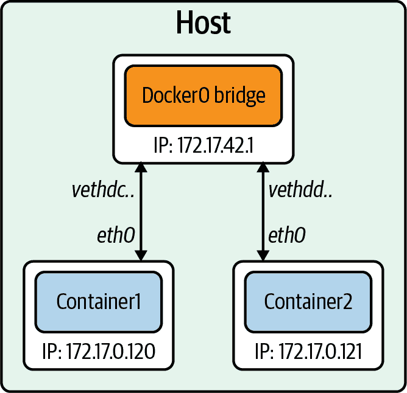

###### 图 3-9\. Docker 桥接

CNM 将网络模式映射到我们已经讨论过的驱动程序。以下是网络模式及其 Docker 引擎等效的列表：

桥接

默认的 Docker 桥接（参见图 3-9，我们之前的示例中展示过这一点）

自定义或远程

用户定义的桥接，或允许用户创建或使用其插件

覆盖

覆盖

Null

无网络选项

桥接网络用于在同一主机上运行的容器之间通信。与在不同主机上运行的容器通信可以使用覆盖网络。Docker 使用本地和全局驱动程序的概念。例如，本地驱动程序（如桥接）以主机为中心，不进行跨节点协调，这是全局驱动程序（如 Overlay）的工作。全局驱动程序依赖于 libkv，一个键值存储抽象层，在多台机器之间协调。CNM 不提供键值存储，因此需要外部存储如 Consul、etcd 和 Zookeeper。

接下来的部分将深入讨论启用覆盖网络的技术。

## 覆盖网络

到目前为止，我们的示例都是在单个主机上，但是大规模生产应用程序并不在单个主机上运行。为了容器在不同节点上通信，需要解决几个问题，如如何在主机之间协调路由信息、端口冲突和 IP 地址管理等。一个帮助容器在主机之间路由的技术是 VXLAN。在图 3-10 中，我们可以看到在物理 L3 网络上运行的一个层 2 覆盖网络创建了一个 VXLAN。

我们在第一章简要讨论了 VXLAN，但是在这里有必要更详细地解释数据传输如何实现容器间通信。

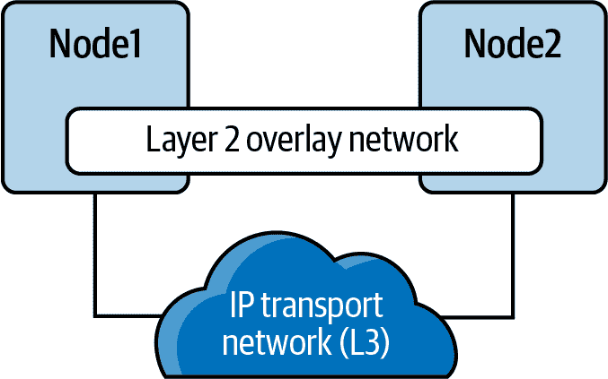

###### 图 3-10\. VXLAN 隧道

VXLAN 是 VLAN 协议的扩展，创建了 1600 万个唯一标识符。在 IEEE 802.1Q 下，给定以太网网络上的 VLAN 最大数量为 4094。在物理数据中心网络上的传输协议是 IP 加 UDP。VXLAN 定义了一种 MAC-in-UDP 封装方案，其中原始第二层帧增加了一个 VXLAN 头部，并包装在一个 UDP IP 数据包中。图 3-11 显示了 IP 数据包封装在 UDP 数据包及其头部中。

VXLAN 数据包是一个 MAC-in-UDP 封装的数据包。第二层帧增加了一个 VXLAN 头，并放置在 UDP-IP 数据包中。VXLAN 标识符为 24 位。这就是为什么 VXLAN 可以支持 1600 万个段的原因。

图 3-11 是第一章的详细版本。我们在两个主机上有 VXLAN 隧道端点（VTEP），它们附加到主机的桥接口，并连接到容器的桥接。VTEP 执行数据帧的封装和解封装。VTEP 对等体交互确保数据转发到相关目标容器地址。离开容器的数据使用 VXLAN 信息封装，并通过 VXLAN 隧道传输，由对等 VTEP 解封装。

覆盖网络（Overlay networking）允许容器在网络上进行跨主机通信。CNM 仍然存在其他问题，使其与 Kubernetes 不兼容。Kubernetes 的维护者决定使用 CoreOS 发起的 CNI 项目。这个项目比 CNM 更简单，不需要守护进程，并且设计成跨平台的。

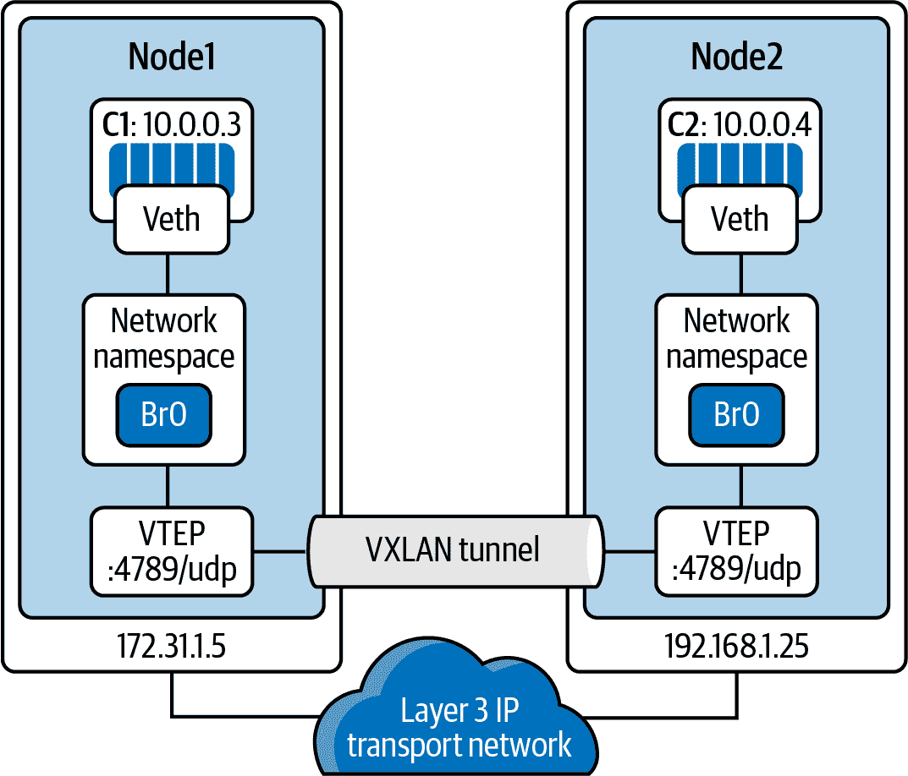

###### 图 3-11\. VXLAN 隧道详细信息

## 容器网络接口（Container Network Interface）

CNI 是容器运行时与网络实现之间的软件接口。在实现 CNI 时有很多选择；我们将讨论几个显著的选择。CNI 最初是 CoreOS 的 rkt 项目的一部分；现在是 CNCF 项目。CNI 项目包括规范和用于开发 Linux 容器中配置网络接口的插件的库。CNI 关注容器的网络连接性，通过在容器创建时分配资源，并在删除时移除它们。CNI 插件负责将网络接口关联到容器网络命名空间，并对主机进行任何必要的更改。然后，它为接口分配 IP 并为其设置路由。图 3-12 概述了 CNI 架构。容器运行时使用主机的网络信息配置文件；在 Kubernetes 中，Kubelet 也使用这个配置文件。CNI 和容器运行时相互通信，并对配置的 CNI 插件应用命令。

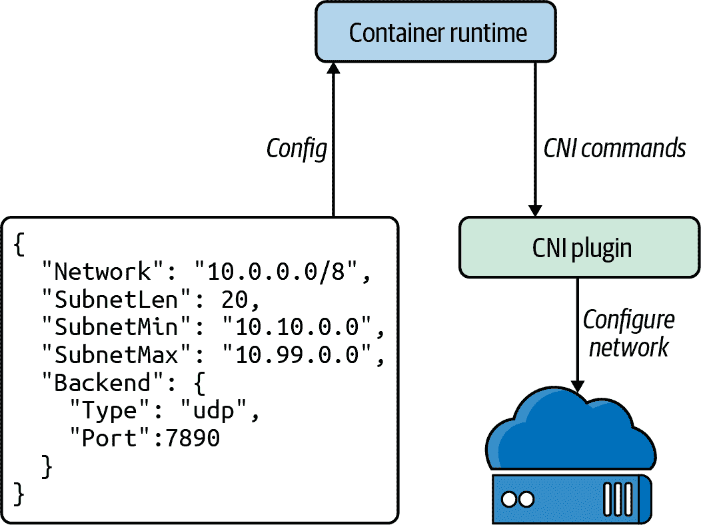

###### 图 3-12\. CNI 架构

有几个开源项目实现了带有各种功能和功能的 CNI 插件。以下是几个概述：

Cilium

Cilium 是用于保护应用程序容器之间网络连接的开源软件。Cilium 是一个 L7/HTTP 感知的 CNI，可以使用基于身份的安全模型在 L3-L7 上执行网络策略，与网络寻址分离。它由 Linux 技术 eBPF 提供支持。

Flannel

Flannel 是为 Kubernetes 设计的一种简单配置层 3 网络结构的方法。Flannel 专注于网络。Flannel 使用 Kubernetes 集群的现有`etcd`数据存储来存储其状态信息，以避免提供专用存储。

Calico

根据 Calico 的说法，“将灵活的网络功能与随处可运行的安全执行相结合，提供具有本地 Linux 内核性能和真正云原生可伸缩性的解决方案。” 它具有完整的网络策略支持，并与其他 CNI 配合良好。Calico 不使用覆盖网络。相反，Calico 配置了一个使用 BGP 路由协议在主机之间路由数据包的层 3 网络。Calico 还可以与 Istio，一个服务网格，集成，以解释和执行集群内工作负载的策略，无论是在服务网格层还是网络基础设施层。

AWS

AWS 拥有自己的 CNI 的开源实现，即 AWS VPC CNI。通过直接位于 AWS 网络上，它提供高吞吐量和可用性。通过在 AWS 网络上运行，提供了低延迟，因为没有额外的覆盖网络和在 AWS 网络上运行的最小网络抖动。集群和网络管理员可以应用现有的 AWS VPC 网络和安全最佳实践来构建在 AWS 上的 Kubernetes 网络。他们可以实现这些最佳实践，因为 AWS CNI 包括使用原生 AWS 服务的能力，如用于分析网络事件和模式的 VPC 流日志，用于流量管理的 VPC 路由策略，以及用于网络流量隔离的安全组和网络访问控制列表。我们将在第六章中更多地讨论 AWS VPC CNI。

###### 注意

Kubernetes.io 网站提供了一个[可用的 CNI 选项列表](https://oreil.ly/imDMP)。

还有许多 CNI 的选项，最佳决定权在于集群管理员、网络管理员和应用程序开发人员，以最好地决定哪种 CNI 解决了他们的业务用例。在后续章节中，我们将讨论用例并部署几种以帮助管理员做出决定。

在我们的下一节中，我们将使用 Golang Web 服务器和 Docker 来演示容器连接性的例子。

# 容器连接性

就像我们在前一章中进行的实验一样，我们将使用 Go 极简 Web 服务器来演示容器连接性的概念。当我们在 Ubuntu 主机上将 Web 服务器部署为容器时，我们将解释容器级别发生了什么。

以下是我们将要讨论的两种网络场景：

+   Docker 主机上的容器之间的连接

+   在不同主机上的容器之间的连接

Golang Web 服务器硬编码在端口 8080 上运行，`http.ListenAndServe("0.0.0.0:8080", nil)`，正如我们在 示例 3-8 中所见。

##### 示例 3-8\. Go 中的最小 Web 服务器

```
package main

import (
	"fmt"
	"net/http"
)

func hello(w http.ResponseWriter, _ *http.Request) {
	fmt.Fprintf(w, "Hello")
}

func main() {
	http.HandleFunc("/", hello)
	http.ListenAndServe("0.0.0.0:8080", nil)
}
```

为了配置我们的最小化 Golang Web 服务器，我们需要从 Dockerfile 创建它。示例 3-9 显示了我们的 Golang Web 服务器的 Dockerfile。Dockerfile 包含了指定构建镜像时要执行的指令。它从 `FROM` 指令开始，指定基础镜像应该是什么。`RUN` 指令指定要执行的命令。注释以 `#` 开始。请记住，如果改变了镜像的状态，Dockerfile 中的每一行都会创建一个新层。开发人员需要在为镜像创建很多层和 Dockerfile 的可读性之间找到平衡。

##### 示例 3-9\. Golang 最小化 Web 服务器的 Dockerfile

```
FROM golang:1.15 AS builder 
WORKDIR /opt 
COPY web-server.go . 
RUN CGO_ENABLED=0 GOOS=linux go build -o web-server . 

FROM golang:1.15 
WORKDIR /opt 
COPY --from=0 /opt/web-server . 
CMD ["/opt/web-server"] 
```


由于我们的 Web 服务器是用 Golang 编写的，我们可以在容器中编译我们的 Go 服务器，以将镜像大小减小到仅包含编译后的 Go 二进制文件。我们首先使用版本为 1.15 的 Golang 基础镜像来启动我们的 Web 服务器。


`WORKDIR` 将工作目录设置为后续所有命令要从中运行的目录。


`COPY` 复制 `web-server.go` 文件，该文件定义了我们应用的工作目录。


`RUN` 指示 Docker 在构建容器中编译我们的 Golang 应用程序。


现在，为了运行我们的应用程序，我们定义 `FROM` 作为应用程序的基础镜像，同样使用 `golang:1.15`；我们可以通过使用像 alpine 这样的其他小型镜像进一步减小镜像的最终大小。


作为一个新的容器，我们再次将工作目录设置为 `/opt`。


`COPY` 在此将从构建容器复制编译好的 Go 二进制文件到应用容器中。


`CMD` 指示 Docker 运行我们的应用程序的命令是启动我们的 Web 服务器。

在将应用程序容器化时，开发人员和管理员应该遵守一些 Dockerfile 最佳实践：

+   每个 Dockerfile 只应使用一个 `ENTRYPOINT`。`ENTRYPOINT` 或 `CMD` 告诉 Docker 在运行的容器内部启动什么进程，因此应该只有一个运行中的进程；容器完全依赖于进程隔离。

+   为了减少容器的层次，开发人员应该使用 `&&` 和 `\` 将类似的命令合并为一个命令。每个新命令在 Dockerfile 中都会为 Docker 容器镜像添加一个新层，从而增加其存储空间。

+   使用缓存系统来改进容器的构建时间。如果一个层没有变化，它应该位于 Dockerfile 的顶部。缓存是语句顺序至关重要的一部分。首先添加最不可能更改的文件，然后添加最有可能更改的文件。

+   使用多阶段构建可以显著减小最终镜像的大小。

+   不要安装不必要的工具或软件包。这样做可以减少容器的攻击面和大小，从而降低从注册表到运行容器的主机的网络传输时间。

让我们构建我们的 Golang Web 服务器并审查执行此操作的 Docker 命令。

`docker build`指示 Docker 根据 Dockerfile 指令构建我们的镜像：

```
$ sudo docker build .
Sending build context to Docker daemon   4.27MB
Step 1/8 : FROM golang:1.15 AS builder
1.15: Pulling from library/golang
57df1a1f1ad8: Pull complete
71e126169501: Pull complete
1af28a55c3f3: Pull complete
03f1c9932170: Pull complete
f4773b341423: Pull complete
fb320882041b: Pull complete
24b0ad6f9416: Pull complete
Digest:
sha256:da7ff43658854148b401f24075c0aa390e3b52187ab67cab0043f2b15e754a68
Status: Downloaded newer image for golang:1.15
 ---> 05c8f6d2538a
Step 2/8 : WORKDIR /opt
 ---> Running in 20c103431e6d
Removing intermediate container 20c103431e6d
 ---> 74ba65cfdf74
Step 3/8 : COPY web-server.go .
 ---> 7a36ec66be52
Step 4/8 : RUN CGO_ENABLED=0 GOOS=linux go build -o web-server .
 ---> Running in 5ea1c0a85422
Removing intermediate container 5ea1c0a85422
 ---> b508120db6ba
Step 5/8 : FROM golang:1.15
 ---> 05c8f6d2538a
Step 6/8 : WORKDIR /opt
 ---> Using cache
 ---> 74ba65cfdf74
Step 7/8 : COPY --from=0 /opt/web-server .
 ---> dde6002760cd
Step 8/8 : CMD ["/opt/web-server"]
 ---> Running in 2bcb7c8f5681
Removing intermediate container 2bcb7c8f5681
 ---> 72fd05de6f73
Successfully built 72fd05de6f73
```

用于我们测试的 Golang 最小 Web 服务器具有容器 ID `72fd05de6f73`，这不容易阅读，因此我们可以使用`docker tag`命令为其提供一个友好的名称：

```
$ sudo docker tag 72fd05de6f73 go-web:v0.0.1
```

`docker images`返回本地可用镜像的列表以运行。我们有一个来自 Docker 安装测试的测试镜像和用于测试我们的网络设置的 busybox。如果本地没有可用的容器，则会从注册表下载；网络加载时间会影响这一点，因此我们需要尽可能小的镜像：

```
$ sudo docker images
REPOSITORY      TAG         IMAGE ID          SIZE
<none>          <none>      b508120db6ba      857MB
go-web          v0.0.1      72fd05de6f73      845MB
golang          1.15        05c8f6d2538a      839MB
busybox         latest      6858809bf669      1.23MB
hello-world     latest      bf756fb1ae65      13.3kB
```

`docker ps`显示我们主机上运行的容器。从我们的网络命名空间示例中，我们仍然有一个正在运行的 busybox 容器：

```
$ sudo docker ps
CONTAINER ID IMAGE    COMMAND      STATUS          PORTS NAMES
1f3f62ad5e02 busybox  "/bin/sh"    Up 11 minutes   determined_shamir
```

`docker logs`将打印出容器从标准输出产生的任何日志；目前，我们的 busybox 镜像没有打印出我们可以查看的任何内容：

```
vagrant@ubuntu-xenial:~$ sudo docker logs 1f3f62ad5e02
vagrant@ubuntu-xenial:~$
```

`docker exec`允许开发者和管理员在 Docker 容器内执行命令。我们之前在调查 Docker 网络设置时就这样做了：

```
vagrant@ubuntu-xenial:~$ sudo docker exec 1f3f62ad5e02 ip a
1: lo: <LOOPBACK,UP,LOWER_UP> mtu 65536 qdisc noqueue qlen 1
link/loopback 00:00:00:00:00:00 brd 00:00:00:00:00:00
inet 127.0.0.1/8 scope host lo
valid_lft forever preferred_lft forever
7: eth0@if8: <BROADCAST,MULTICAST,UP,LOWER_UP,M-DOWN> mtu 1500 qdisc noqueue
link/ether 02:42:ac:11:00:02 brd ff:ff:ff:ff:ff:ff
inet 172.17.0.2/16 brd 172.17.255.255 scope global eth0
valid_lft forever preferred_lft forever
vagrant@ubuntu-xenial:~$
```

###### 注意

在[Docker CLI 文档](https://oreil.ly/xWkad)中可以找到更多有关 Docker CLI 的命令。

在前一节中，我们将 Golang Web 服务器构建为一个容器。为了测试连通性，我们还将使用`dnsutils`镜像，该镜像被 Kubernetes 端到端测试使用。该镜像可以从 Kubernetes 项目的`gcr.io/kubernetes-e2e-test-images/dnsutils:1.3`获取。

镜像名称将从 Google 容器注册表复制 Docker 镜像到我们的本地 Docker 文件系统：

```
$ sudo docker pull gcr.io/kubernetes-e2e-test-images/dnsutils:1.3
1.3: Pulling from kubernetes-e2e-test-images/dnsutils
5a3ea8efae5d: Pull complete
7b7e943444f2: Pull complete
59c439aa0fa7: Pull complete
3702870470ee: Pull complete
Digest: sha256:b31bcf7ef4420ce7108e7fc10b6c00343b21257c945eec94c21598e72a8f2de0
Status: Downloaded newer image for gcr.io/kubernetes-e2e-test-images/dnsutils:1.3
gcr.io/kubernetes-e2e-test-images/dnsutils:1.3
```

现在我们的 Golang 应用程序可以作为容器运行，我们可以探索容器网络的各种场景。

## 容器与容器

我们首先介绍两个运行在同一主机上的容器之间的通信。我们从启动`dnsutils`镜像并进入 shell 开始：

```
$ sudo docker run -it gcr.io/kubernetes-e2e-test-images/dnsutils:1.3 /bin/sh
/ #
```

默认的 Docker 网络设置使`dnsutils`镜像能够连接到互联网：

```
/ # ping google.com -c 4
PING google.com (172.217.9.78): 56 data bytes
64 bytes from 172.217.9.78: seq=0 ttl=114 time=39.677 ms
64 bytes from 172.217.9.78: seq=1 ttl=114 time=38.180 ms
64 bytes from 172.217.9.78: seq=2 ttl=114 time=43.150 ms
64 bytes from 172.217.9.78: seq=3 ttl=114 time=38.140 ms

--- google.com ping statistics ---
4 packets transmitted, 4 packets received, 0% packet loss
round-trip min/avg/max = 38.140/39.786/43.150 ms
/ #
```

Golang Web 服务器从默认的 Docker 桥接开始；在一个单独的 SSH 连接中，然后我们的 Vagrant 主机上，我们使用以下命令启动 Golang Web 服务器：

```
$ sudo docker run -it -d -p 80:8080 go-web:v0.0.1
a568732bc191bb1f5a281e30e34ffdeabc624c59d3684b93167456a9a0902369
```

`-it` 选项用于交互式进程（例如 shell）；我们必须使用 `-it` 分配一个 TTY 给容器进程。`-d` 在分离模式下运行容器；这允许我们继续使用终端并输出完整的 Docker 容器 ID。`-p` 在网络方面可能是最重要的选项；它在主机和容器之间创建端口连接。我们的 Golang Web 服务器在端口 8080 上运行，并在主机上的端口 80 上暴露该端口。

`docker ps` 验证我们现在运行了两个容器：Go Web 服务器容器在主机端口 80 上暴露了端口 8080，并且在我们的 `dnsutils` 容器中运行的 Shell：

```
vagrant@ubuntu-xenial:~$ sudo docker ps
CONTAINER ID  IMAGE           COMMAND          CREATED       STATUS
906fd860f84d  go-web:v0.0.1  "/opt/web-server" 4 minutes ago Up 4 minutes
25ded12445df  dnsutils:1.3   "/bin/sh"         6 minutes ago Up 6 minutes

PORTS                   NAMES
0.0.0.0:8080->8080/tcp  frosty_brown
                        brave_zhukovsky
```

让我们使用 `docker inspect` 命令获取 Golang Web 服务器容器的 Docker IP 地址：

```
$ sudo docker inspect
-f '{{range .NetworkSettings.Networks}}{{.IPAddress}}{{end}}'
906fd860f84d
172.17.0.2
```

在 `dnsutils` 镜像上，我们可以使用 Golang Web 服务器的 Docker 网络地址 `172.17.0.2` 和容器端口 `8080`：

```
/ # wget 172.17.0.2:8080
Connecting to 172.17.0.2:8080 (172.17.0.2:8080)
index.html           100% |*******************************************|
                     5   0:00:00 ETA
/ # cat index.html
Hello/ #
```

每个容器都可以通过 `docker0` 桥接和容器端口互相访问，因为它们位于同一台 Docker 主机和相同网络上。Docker 主机通过路由到容器的 IP 地址和端口来访问容器的 IP 地址：

```
vagrant@ubuntu-xenial:~$ curl 172.17.0.2:8080
Hello
```

但是对于来自 `docker run` 命令的 Docker IP 地址和主机端口，则不起作用：

```
vagrant@ubuntu-xenial:~$ curl 172.17.0.2:80
curl: (7) Failed to connect to 172.17.0.2 port 80: Connection refused
vagrant@ubuntu-xenial:~$ curl 172.17.0.2:8080
Hello
```

现在进行反向操作，使用回环接口，我们演示主机只能在主机端口 80 上暴露的 Web 服务器上访问网页服务器，而不能在 Docker 端口 8080 上进行访问：

```
vagrant@ubuntu-xenial:~$ curl 127.0.0.1:8080
curl: (7) Failed to connect to 127.0.0.1 port 8080: Connection refused
vagrant@ubuntu-xenial:~$ curl 127.0.0.1:80
Hellovagrant@ubuntu-xenial:~$
```

现在回到 `dnsutils` 上，情况也是一样的：在 Docker 网络上的 `dnsutils` 镜像中，使用 Go Web 容器的 Docker IP 地址，只能使用 Docker 端口 8080，而不能使用暴露的主机端口 80：

```
/ # wget 172.17.0.2:8080 -qO-
Hello/ #
/ # wget 172.17.0.2:80 -qO-
wget: can't connect to remote host (172.17.0.2): Connection refused
```

现在，为了表明这是一个完全分开的堆栈，让我们尝试 `dnsutils` 回环地址以及 Docker 端口和暴露的主机端口：

```
/ # wget localhost:80 -qO-
wget: can't connect to remote host (127.0.0.1): Connection refused
/ # wget localhost:8080 -qO-
wget: can't connect to remote host (127.0.0.1): Connection refused
```

预期中都不起作用；`dnsutils` 镜像有单独的网络堆栈，不共享 Go Web 服务器的网络命名空间。了解为什么不起作用对于理解 Kubernetes 至关重要，因为 Pod 是共享相同网络命名空间的一组容器。现在我们将研究两个容器如何在两个分离的主机上进行通信。

## 容器到容器分开的主机

我们之前的示例向我们展示了如何在本地系统上运行容器网络，但是两个容器如何在分开的主机网络上通信呢？在本例中，我们将在分开的主机上部署容器，并调查这一点以及与在同一主机上的不同之处。

让我们启动第二个 Vagrant Ubuntu 主机 `host-2`，并像我们的 Docker 主机一样 SSH 进入它。我们可以看到我们的 IP 地址与运行 Golang Web 服务器的 Docker 主机不同：

```
vagrant@host-2:~$ ifconfig enp0s8
enp0s8    Link encap:Ethernet  HWaddr 08:00:27:f9:77:12
          inet addr:192.168.1.23  Bcast:192.168.1.255  Mask:255.255.255.0
          inet6 addr: fe80::a00:27ff:fef9:7712/64 Scope:Link
          UP BROADCAST RUNNING MULTICAST  MTU:1500  Metric:1
          RX packets:65630 errors:0 dropped:0 overruns:0 frame:0
          TX packets:2967 errors:0 dropped:0 overruns:0 carrier:0
          collisions:0 txqueuelen:1000
          RX bytes:96493210 (96.4 MB)  TX bytes:228989 (228.9 KB)
```

我们可以通过 Docker 主机的 IP 地址 `192.168.1.20` 访问我们在 `docker run` 命令选项中暴露的端口 80 的 Web 服务器。端口 80 在 Docker 主机上暴露，但无法通过容器端口 8080 和主机 IP 地址访问：

```
vagrant@ubuntu-xenial:~$ curl 192.168.1.20:80
Hellovagrant@ubuntu-xenial:~$
vagrant@host-2:~$ curl 192.168.1.20:8080
curl: (7) Failed to connect to 192.168.1.20 port 8080: Connection refused
vagrant@ubuntu-xenial:~$
```

如果 `host-2` 尝试使用 Docker 端口或主机端口到达容器的 IP 地址，情况也是如此。请记住，Docker 使用私有地址范围 `172.17.0.0/16`。

```
vagrant@host-2:~$ curl 172.17.0.2:8080 -t 5
curl: (7) Failed to connect to 172.17.0.2 port 8080: No route to host
vagrant@host-2:~$ curl 172.17.0.2:80 -t 5
curl: (7) Failed to connect to 172.17.0.2 port 80: No route to host
vagrant@host-2:~$
```

要使主机路由到 Docker IP 地址，需要使用叠加网络或一些 Docker 外部的外部路由。路由也是 Kubernetes 外部的，许多 CNI 在解决此问题时提供帮助，并且这在部署集群时会进行探讨，参见 第六章。

前面的例子使用了 Docker 默认的网络桥接方式，将端口暴露到主机上。这就是 `host-2` 能够与运行在 Docker 主机上的 Docker 容器通信的方法。本章仅仅触及了容器网络的表面。还有许多抽象概念需要探索，比如整个集群的入站和出站流量、服务发现，以及集群内外的路由。后续章节将继续深入探讨这些容器网络基础知识。

# 结论

在这个容器网络介绍中，我们深入了解了容器如何发展，帮助应用程序部署，并通过允许在主机上容纳和分割多个应用程序来提高主机效率。我们回顾了容器的悠久历史，以及已经来去的各种项目。容器通过 Linux 内核中的命名空间和控制组（cgroups）进行动力驱动和管理。我们了解了容器运行时为应用程序开发人员维护的抽象，并学习了如何自己部署它们。理解这些 Linux 内核抽象对于决定部署哪种 CNI、以及其权衡和好处至关重要。管理员现在对容器运行时如何管理 Linux 网络抽象有了基础的理解。

我们已经完成了容器网络的基础知识！我们的知识从使用简单的网络堆栈扩展到在容器内部运行不同的不相关堆栈。了解命名空间、端口如何暴露以及通信流程，使管理员能够快速解决网络问题，并防止其在运行在 Kubernetes 集群中的应用程序中造成停机时间。快速解决端口问题或者测试主机、容器或网络之间的端口是否开放，是任何网络工程师必备的技能，也是开发人员解决其容器问题不可或缺的技能。Kubernetes 建立在这些基础之上，并为开发人员提供了抽象。下一章将审视 Kubernetes 如何创建这些抽象，并将它们整合到 Kubernetes 网络模型中。
