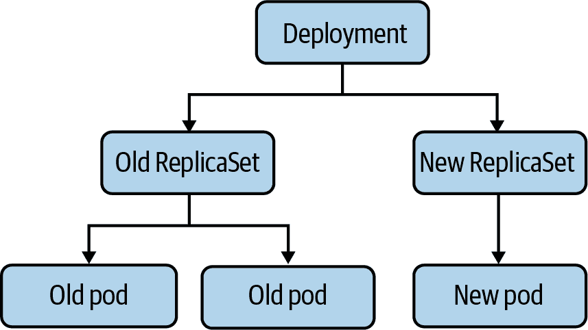
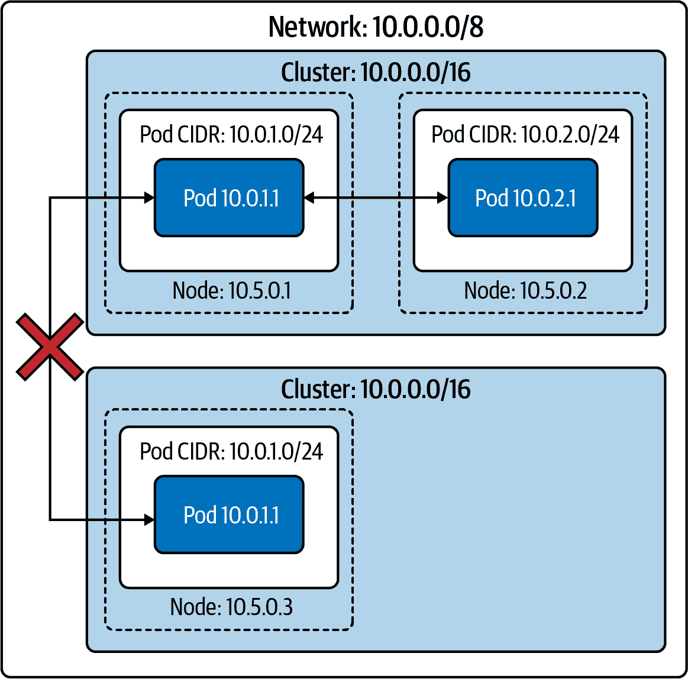
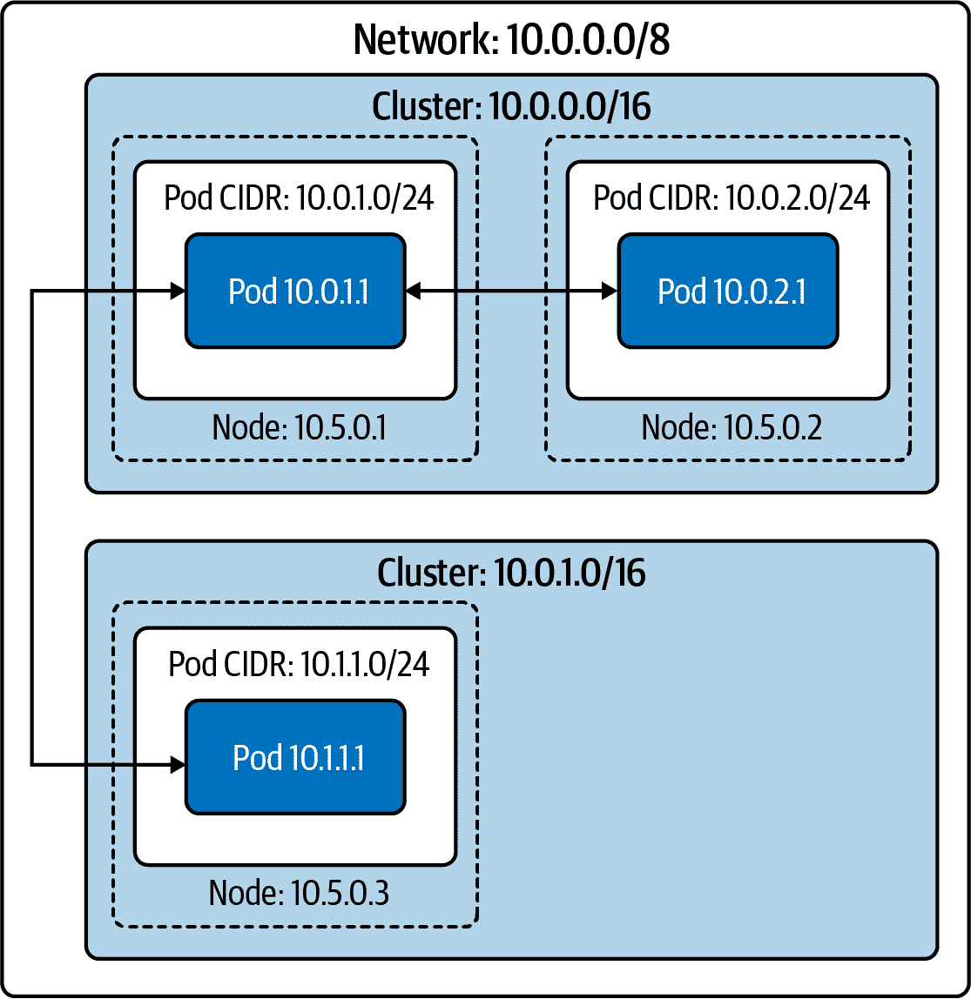
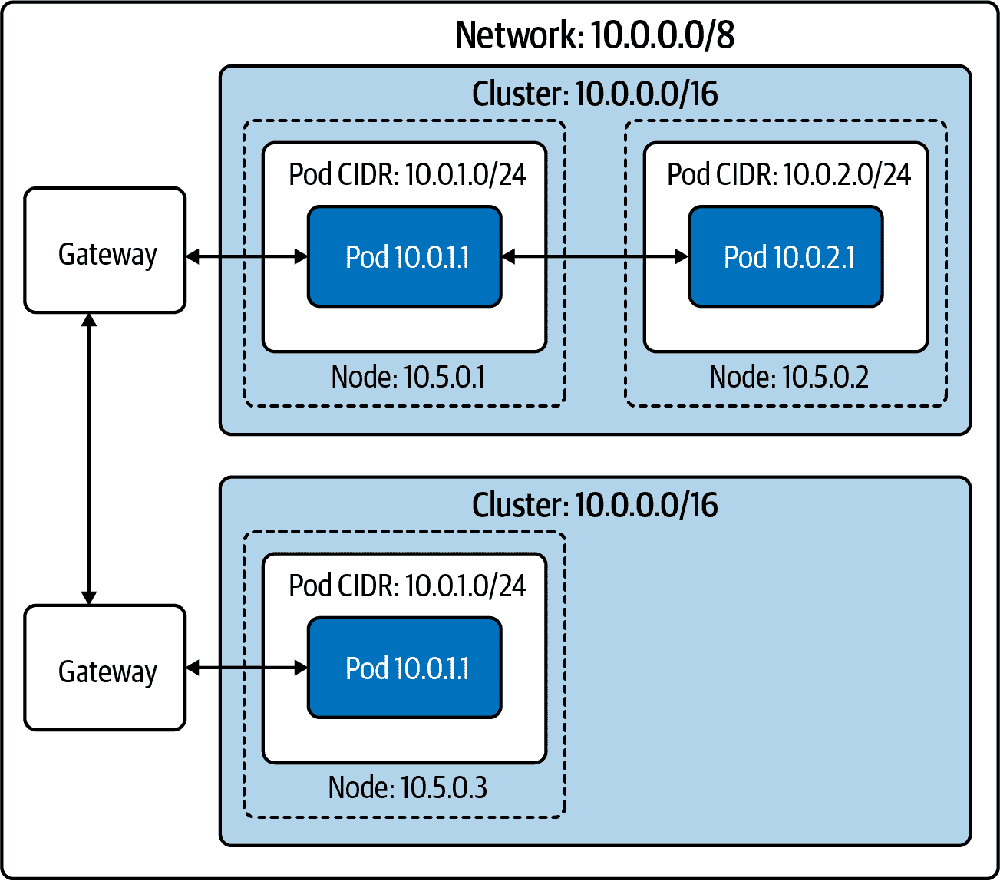
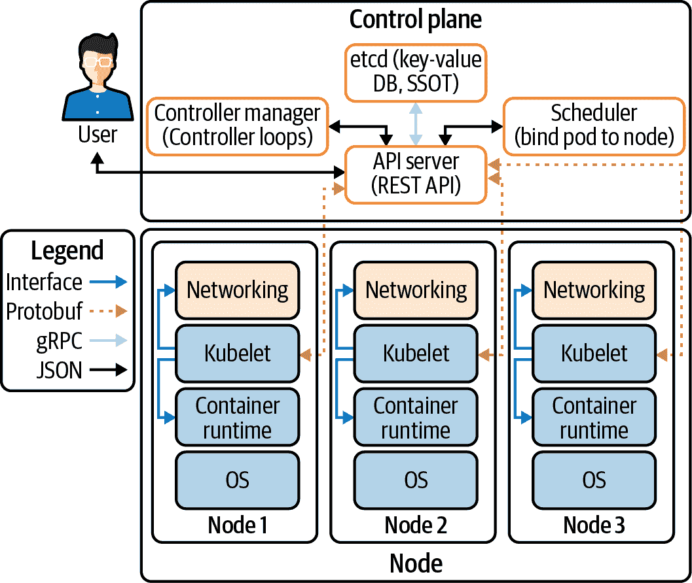
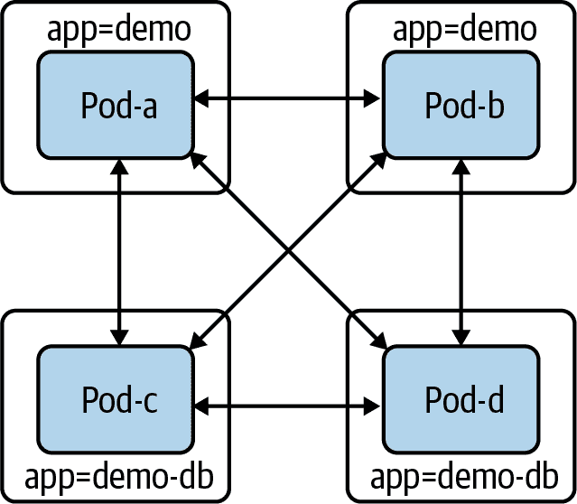
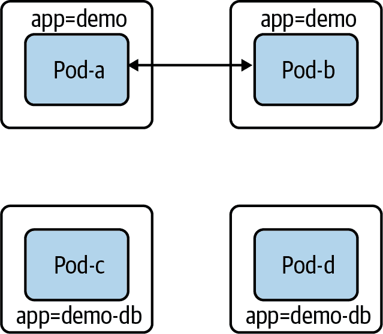
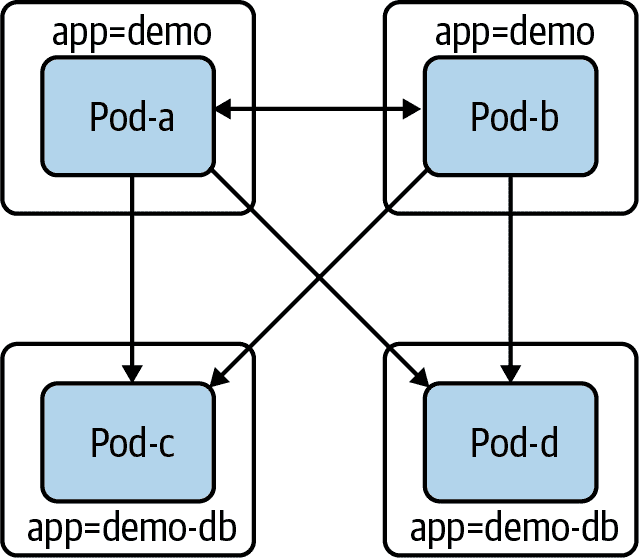
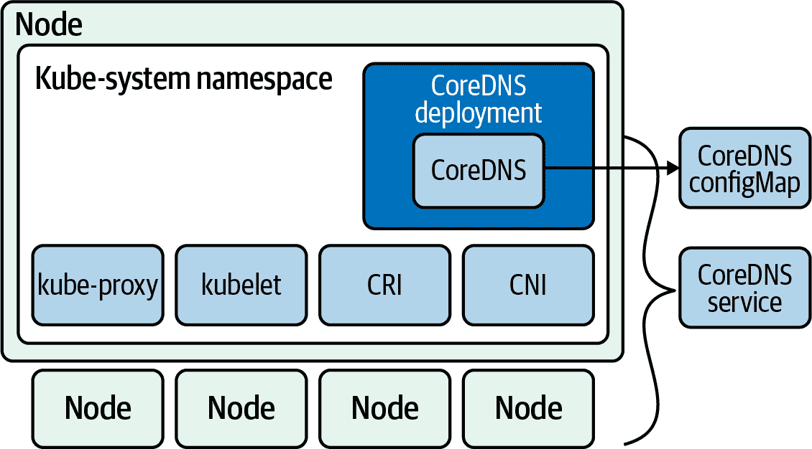

# 第四章：Kubernetes 网络介绍

现在我们已经涵盖了 Linux 和容器网络的关键组成部分，我们准备更详细地讨论 Kubernetes 网络。在本章中，我们将讨论 pod 如何在集群内外部连接。我们还将涵盖 Kubernetes 内部组件如何连接。在下一章节中，将讨论更高级别的网络抽象，如服务和入口的发现和负载均衡。

Kubernetes 网络致力于解决这四个网络问题：

+   高度耦合的容器到容器通信

+   Pod 到 Pod 的通信

+   Pod 到服务的通信

+   外部到服务的通信

Docker 网络模型默认使用虚拟桥接网络，每台主机定义一个私有网络，容器连接到这个网络。容器的 IP 地址分配为私有 IP 地址，这意味着运行在不同机器上的容器无法相互通信。开发者必须映射主机端口到容器端口，然后通过 Docker 代理流量以跨节点到达。在这种情况下，避免容器之间端口冲突由 Docker 管理员负责；通常这是系统管理员的职责。Kubernetes 网络处理方式不同。

# Kubernetes 网络模型

Kubernetes 网络模型原生支持多主机集群网络。pod 默认可以与彼此通信，无论它们部署在哪个主机上。Kubernetes 依赖于 CNI 项目来遵守以下要求：

+   所有容器必须在没有 NAT 的情况下相互通信。

+   节点可以在没有 NAT 的情况下与容器通信。

+   容器的 IP 地址与其所看到的容器外部相同。

Kubernetes 中的工作单位称为 *pod*。一个 pod 包含一个或多个容器，它们总是在同一个节点上调度和运行。“一起”运行的连接允许将服务的单个实例分开成不同的容器。例如，开发者可以选择在一个容器中运行一个服务，在另一个容器中运行日志转发器。在不同的容器中运行进程允许它们有单独的资源配额（例如，“日志转发器不能使用超过 512 MB 的内存”）。它还通过减少构建容器所需的范围，允许容器的构建和部署机制分离。

下面是一个最小化的 Pod 定义。我们省略了许多选项。Kubernetes 管理各种字段，例如 pod 的状态，这些字段是只读的：

```
apiVersion: v1
kind: Pod
metadata:
  name: go-web
  namespace: default
spec:
  containers:
  - name: go-web
    image: go-web:v0.0.1
    ports:
    - containerPort: 8080
      protocol: TCP
```

Kubernetes 用户通常不直接创建 Pod。相反，用户创建高级工作负载，如部署，根据某些预期的规范管理 Pod。在部署的情况下，如图 4-1 所示，用户指定了 Pod 的*模板*，以及希望存在的 Pod 数量（通常称为*副本*）。还有几种其他管理工作负载的方式，如 ReplicaSets 和 StatefulSets，我们将在下一章中进行审查。一些提供对中间类型的抽象，而其他一些直接管理 Pod。还有第三方工作负载类型，以自定义资源定义（CRDs）的形式存在。Kubernetes 中的工作负载是一个复杂的话题，我们只会尝试涵盖非常基础和适用于网络堆栈的部分。



###### 图 4-1\. 部署与 Pod 的关系

Pod 本身是临时的，意味着它们会被删除并替换为新版本。Pod 的短寿命是对开发人员和操作员的主要意外和挑战，他们熟悉更半永久、传统物理或虚拟机的情况。本地磁盘状态、节点调度和 IP 地址在 Pod 生命周期中都会定期更换。

一个 Pod 拥有独特的 IP 地址，该 IP 地址被 Pod 内所有容器共享。赋予每个 Pod 一个 IP 地址的主要动机是消除端口号的约束。在 Linux 中，每个地址、端口和协议只能由一个程序监听。如果 Pod 没有独特的 IP 地址，那么同一节点上的两个 Pod 可能会竞争相同的端口（例如两个 Web 服务器，都试图监听端口 80）。如果它们相同，就需要运行时配置来修复，比如 `--port` 标志。或者，需要通过丑陋的脚本更新配置文件以适应第三方软件的情况。

在某些情况下，第三方软件根本无法在自定义端口上运行，这将需要更复杂的解决方案，例如节点上的 `iptables` DNAT 规则。Web 服务器还存在一个额外问题，即期望在其软件中使用传统端口号，如 HTTP 的 80 和 HTTPS 的 443。偏离这些惯例需要通过负载均衡器进行反向代理或使下游使用者了解各种端口（对内部系统比对外系统更容易）。一些系统，如 Google 的 Borg，使用这种模型。Kubernetes 选择了每个 Pod 分配 IP 地址的模型，以便开发人员更容易接受并更轻松地运行第三方工作负载。不幸的是，为每个 Pod 分配和路由 IP 地址增加了 Kubernetes 集群的*相当复杂性*。

###### 警告

默认情况下，Kubernetes 将允许任何 Pod 之间的任何流量。这种被动的连接性意味着，在集群中的任何 Pod 都可以连接到同一集群中的任何其他 Pod。这可能很容易被滥用，特别是如果服务未使用身份验证或攻击者获取了凭证。

更多信息，请参阅“流行的 CNI 插件”。

使用其自身 IP 地址创建和删除的 Pod 可能会对不理解此行为的初学者造成问题。假设我们在 Kubernetes 上运行一个小型服务，形式为具有三个 Pod 副本的部署。当有人更新部署中的容器映像时，Kubernetes 执行*滚动升级*，删除旧的 Pod 并使用新容器映像创建新的 Pod。这些新的 Pod 可能会有新的 IP 地址，导致旧的 IP 地址无法访问。手动在配置或 DNS 记录中引用 Pod IP 并使其无法解析可能是初学者的常见错误。这是服务和端点试图解决的错误，并将在下一章讨论。

在显式创建 Pod 时，可以指定 IP 地址。StatefulSets 是一种内置的工作负载类型，旨在处理诸如数据库等工作负载，它们保持 Pod 身份概念，并使新 Pod 具有与其替换的 Pod 相同的名称和 IP 地址。还有第三方 CRD 的其他示例形式，可以编写用于特定网络目的的 CRD。

###### 注意

自定义资源是由编写者定义的 Kubernetes API 扩展。它允许软件开发人员在 Kubernetes 环境中定制其软件的安装方式。您可以在[文档](https://oreil.ly/vVcrE)中找到有关编写 CRD 的更多信息。

每个 Kubernetes 节点都运行一个名为*Kubelet*的组件，它管理节点上的 Pod。Kubelet 中的网络功能来自节点上 CNI 插件的 API 交互。CNI 插件负责管理 Pod IP 地址和单个容器网络的配置。在前一章中，我们提到了 CNI 的名义接口部分；CNI 定义了管理容器网络的标准接口。将 CNI 设计为接口的原因是为了拥有可互操作的标准，在其中存在多个 CNI 插件实现。CNI 插件负责分配 Pod IP 地址并维护所有（适用的）Pod 之间的路由。Kubernetes 并未随附默认的 CNI 插件，这意味着在标准的 Kubernetes 安装中，Pod 无法使用网络。

让我们开始讨论通过 CNI 启用 Pod 网络以及不同的网络布局。

# 节点和 Pod 网络布局

集群必须有一组 IP 地址来控制分配给 pod 的 IP 地址，例如 `10.1.0.0/16`。节点和 pod 必须在此 IP 地址空间中具有 L3 连通性。从 第 1 章 中回忆，在 L3 中，互联网层的连通性意味着带有 IP 地址的数据包可以路由到具有该 IP 地址的主机。重要的是要注意，传递 *数据包* 的能力比创建连接（L4 概念）更为基础。在 L4 中，防火墙可以选择允许从主机 A 到 B 的连接，但拒绝从主机 B 到 A 发起的连接。必须允许 A 到 B 和 B 到 A 的 L4 连接，在 L3 中，A 到 B 的连接。没有 L3 连通性，TCP 握手将不可能进行，因为 SYN-ACK 无法传递。

一般情况下，pod 没有 MAC 地址。因此，无法与 pod 建立 L2 连接。CNI 将为 pod 确定这一点。

Kubernetes 对外部世界的 L3 连通性没有任何要求。尽管大多数集群具有互联网连接，但出于安全原因，有些集群更加孤立。

我们将广泛讨论入口（离开主机或集群的流量）和出口（进入主机或集群的流量）。在这里使用的“入口”不应与 Kubernetes 入口资源混淆，后者是一种特定的 HTTP 机制，用于将流量路由到 Kubernetes 服务。

对于构建集群网络，一般有三种方法，以及许多变体：孤立、扁平和岛屿网络。我们将在此处讨论一般方法，然后在后面的章节中讨论 CNI 插件的具体实现细节。

## 孤立网络

在孤立的集群网络中，节点在更广泛的网络上是可路由的（即，不属于集群的主机可以访问集群中的节点），但是 pod 不可以。图 4-2 显示了这样一个集群。请注意，pod 不能访问集群外的其他 pod（或任何其他主机）。

因为集群不能从更广泛的网络路由，多个集群甚至可以使用相同的 IP 地址空间。请注意，如果外部系统或用户需要访问 Kubernetes API，则 Kubernetes API 服务器必须从更广泛的网络可路由。许多托管 Kubernetes 的提供者都有这样的“安全集群”选项，其中集群与互联网之间没有直接的流量。

如果集群的工作负载允许/需要这样的设置，例如批处理集群，那么将该集群与本地集群隔离对安全性来说可能是很好的。然而，并不是所有的集群都适合这种方式。大多数集群需要访问和/或被外部系统访问，例如必须支持对更广泛互联网有依赖的服务的集群。负载均衡器和代理可以用来突破这一障碍，并允许互联网流量进入或离开孤立的集群。



###### 图 4-2\. 同一网络中的两个隔离集群

## 扁平网络

在扁平网络中，所有的 Pod 都有一个 IP 地址，可以从更广泛的网络路由到达。除非有防火墙规则，网络上的任何主机都可以路由到集群内外的任何 Pod。这种配置在网络简单性和性能方面有许多优势。Pod 可以直接连接网络中的任意主机。

请注意在图 4-3 中，两个集群之间没有两个节点的 Pod CIDR 重叠，因此不会有两个 Pod 被分配相同的 IP 地址。由于更广泛的网络可以路由到每个 Pod IP 地址到该 Pod 的节点，因此网络上的任何主机都可以与任何 Pod 通信。

这种开放性允许具有足够服务发现数据的任何主机决定哪个 Pod 将接收这些数据包。集群外的负载均衡器可以负载均衡 Pod，例如另一个集群中的 gRPC 客户端。



###### 图 4-3\. 同一扁平网络中的两个集群

外部 Pod 流量（以及当连接的目的地是特定 Pod IP 地址时的传入 Pod 流量）具有低延迟和低开销。任何形式的代理或数据包重写都会带来延迟和处理成本，这些成本虽小但不可忽视（尤其是在涉及多个后端服务的应用架构中，每次延迟都会累积）。

不幸的是，这种模型要求每个集群都有一个大且连续的 IP 地址空间（即 IP 地址范围内的每个 IP 地址都在您的控制之下）。Kubernetes 对于 Pod IP 地址（每个 IP 系列）需要一个单一的 CIDR。这种模型可以通过私有子网（如 10.0.0.0/8 或 172.16.0.0/12）来实现；然而，如果使用公共 IP 地址，特别是 IPv4 地址，那就要困难得多且更加昂贵。管理员需要使用 NAT 来连接运行在私有 IP 地址空间中的集群与互联网。

除了需要大量的 IP 地址空间外，管理员还需要一个易于编程的网络。CNI 插件必须分配 Pod IP 地址，并确保存在到特定 Pod 节点的路由。

在云服务提供商环境中，私有子网上的扁平网络很容易实现。绝大多数云服务提供商网络都提供大型私有子网，并具有用于 IP 地址分配和路由管理的 API（甚至预先存在的 CNI 插件）。

## 岛屿网络

岛屿集群网络在高层次上是隔离和扁平网络的结合体。

在孤岛集群设置中，如 图 4-4 所示，节点与更广泛的网络具有 L3 连接，但是 Pod 没有。来自和发往 Pod 的流量必须通过某种形式的代理经过节点。这通常是通过 Pod 离开节点时的`iptables`源 NAT 来实现的。这种设置被称为*伪装*，使用 SNAT 将包的源地址从 Pod 的 IP 地址重写为节点的 IP 地址（有关 SNAT 的复习，请参考第 2 章）。换句话说，数据包看起来是从节点发出的，而不是从 Pod 发出的。

共享 IP 地址同时使用 NAT 会隐藏各个 Pod 的 IP 地址。在集群边界上基于 IP 地址的防火墙和识别变得困难。在集群内部，仍然可以明确哪个 IP 地址对应哪个 Pod（因此也是哪个应用程序）。在其他集群中的 Pod 或更广泛网络上的其他主机将不再具有该映射关系。基于 IP 地址的防火墙和白名单本身并不足以提供安全性，但它们是一层有价值且有时是必需的保护层。

现在让我们看看如何使用`kube-controller-manager`配置任何这些网络布局。*控制平面* 指确定发送数据包或帧所使用路径的所有功能和过程。*数据平面* 指根据控制平面逻辑从一个接口转发数据包/帧的所有功能和过程。



###### 图 4-4\. “孤岛网络”配置中的两个示例

## kube-controller-manager 配置

`kube-controller-manager` 在一个二进制和一个进程中运行大多数独立的 Kubernetes 控制器，其中大多数 Kubernetes 逻辑存在。从高层次来看，Kubernetes 中的控制器是指观察资源并采取行动以同步或强制执行特定状态（要么是期望的状态，要么反映当前状态作为状态）。Kubernetes 有许多控制器，它们通常“拥有”特定的对象类型或特定的操作。

`kube-controller-manager` 包括多个控制器，用于管理 Kubernetes 网络堆栈。特别是管理员在这里设置集群 CIDR。

`kube-controller-manager` 由于运行了大量的控制器，所以有大量的标志。 表 4-1 突出了一些显著的网络配置标志。

表 4-1\. `kube-controller-manager` 选项

| 标志 | 默认值 | 描述 |
| --- | --- | --- |
| `--allocate-node-cidrs` | true | 设置是否应在云提供商上为 Pod 分配和设置 CIDR。 |
| `--CIDR-allocator-type string` | RangeAllocator | 要使用的 CIDR 分配器类型。 |
| `--cluster-CIDR` |  | 用于分配 Pod IP 地址的 CIDR 范围。要求`--allocate-node-cidrs`为 true。如果`kube-controller-manager`启用了`IPv6DualStack`，`--cluster-CIDR`接受一个逗号分隔的 IPv4 和 IPv6 CIDR 对。 |
| `--configure-cloud-routes` | true | 设置是否应由 `allocate-node-cidrs` 分配 CIDR，并在云提供商上配置。 |
| `--node-CIDR-mask-size` | 24 用于 IPv4 集群，64 用于 IPv6 集群 | 集群中节点 CIDR 的掩码大小。Kubernetes 将为每个节点分配 `2^(node-CIDR-mask-size)` 个 IP 地址。 |
| `--node-CIDR-mask-size-ipv4` | 24 | 集群中节点 CIDR 的掩码大小。在双栈集群中使用此标志允许 IPv4 和 IPv6 设置。 |
| `--node-CIDR-mask-size-ipv6` | 64 | 集群中节点 CIDR 的掩码大小。在双栈集群中使用此标志允许 IPv4 和 IPv6 设置。 |
| `--service-cluster-ip-range` |  | 集群中服务的 CIDR 范围，用于分配服务的 ClusterIP。需要 `--allocate-node-cidrs` 为 true。如果 `kube-controller-manager` 启用了 `IPv6DualStack`，`--service-cluster-ip-range` 可接受逗号分隔的 IPv4 和 IPv6 CIDR 对。 |

###### 提示

所有 Kubernetes 二进制文件在在线文档中都有它们标志的文档。在 [文档](https://oreil.ly/xDGIE) 中查看所有 `kube-controller-manager` 选项。

现在我们已经讨论了 Kubernetes 控制平面中的高级网络架构和网络配置，让我们更详细地看一下 Kubernetes 工作节点如何处理网络。

# Kubelet

Kubelet 是在集群中每个工作节点上运行的单个二进制文件。在高层次上，Kubelet 负责管理调度到节点上的任何 Pod，并为节点及其上的 Pod 提供状态更新。然而，Kubelet 主要作为节点上其他软件的协调器。Kubelet 管理容器网络实现（通过 CNI）和容器运行时（通过 CRI）。

###### 注意

我们定义工作节点为能够运行 Pod 的 Kubernetes 节点。某些集群技术上在受限制的工作节点上运行 API 服务器和 `etcd`。这种设置可以让控制平面组件与典型工作负载一样自动化管理，但也会暴露额外的故障模式和安全漏洞。

当控制器（或用户）在 Kubernetes API 中创建一个 Pod 时，它最初只存在于 Pod API 对象中。Kubernetes 调度器会监视这样的 Pod，并尝试选择一个有效的节点来调度该 Pod。对此调度有多个约束条件。我们的 Pod 及其 CPU/内存请求不能超过节点上未请求的 CPU/内存余量。有许多选择项可用，例如与带标签节点或其他带标签 Pod 的亲和性/反亲和性或节点上的污点。假设调度器找到满足所有 Pod 约束条件的节点，则调度器将该节点的名称写入我们 Pod 的 `nodeName` 字段。假设 Kubernetes 将 Pod 调度到 `node-1`：

```
apiVersion: v1
kind: Pod
metadata:
  name: example
spec:
  nodeName: "node-1"
  containers:
    - name: example
      image: example:1.0
```

Kubelet 在 `node-1` 上监视所有调度到该节点的 pod。相应的 `kubectl` 命令将是 `kubectl get pods -w --field-selector spec.nodeName=node-1`。当 Kubelet 观察到我们的 pod 存在但不在节点上时，它会创建它。我们将跳过 CRI 的详细信息和容器本身的创建。一旦容器存在，Kubelet 就会向 CNI 发出 `ADD` 调用，告诉 CNI 插件创建 pod 网络。我们将在下一节介绍接口和插件。

# Pod 就绪和探针

Pod 就绪是一个额外指示，表明 pod 是否准备好提供流量服务。Pod 的就绪性决定了该 pod 地址是否从外部源在 `Endpoints` 对象中显示。其他管理 pod 的 Kubernetes 资源，如部署，考虑 pod 的就绪性以进行决策，例如在滚动更新期间推进。在滚动部署期间，新的 pod 变为就绪，但服务、网络策略或负载均衡器尚未准备好接受新的 pod，可能会导致服务中断或后端容量的丢失。值得注意的是，如果 pod 规范包含任何类型的探针，Kubernetes 将默认为所有三种类型的成功。

用户可以在 pod 规范中指定 pod 的就绪检查。从那里，Kubelet 执行指定的检查，并根据成功或失败更新 pod 的状态。

探测器影响 pod 的 `.Status.Phase` 字段。以下是 pod 各个阶段及其描述的列表：

等待中

pod 已被集群接受，但一个或多个容器尚未设置并准备好运行。这包括等待调度的 pod 的时间以及通过网络下载容器镜像的时间。

运行中

pod 已被调度到一个节点，并且所有的容器都已经被创建。至少有一个容器仍在运行或正在启动或重新启动过程中。请注意，某些容器可能处于失败状态，例如 CrashLoopBackoff 状态。

已成功

所有 pod 中的容器都以成功终止，并且将不会重新启动。

失败

所有 pod 中的容器已经终止，并且至少有一个容器以失败状态终止。换句话说，该容器要么以非零状态退出，要么被系统终止。

未知

由于无法确定 pod 的状态的某些原因，这一阶段通常是由于与应运行 pod 的 Kubelet 通信错误引起的。

Kubelet 对 pod 中各个容器执行多种类型的健康检查：*存活探针* (`livenessProbe`)、*就绪探针* (`readinessProbe`) 和 *启动探针* (`startupProbe`)。Kubelet（以及节点本身）必须能够连接到该节点上运行的所有容器，以执行任何 HTTP 健康检查。

每个探测器有三种结果之一：

成功

容器通过了诊断。

失败

容器未通过诊断。

未知

诊断失败，因此不应采取任何行动。

探针可以是执行探针，尝试在容器内部执行二进制文件，TCP 探针或 HTTP 探针。如果探针失败次数超过`failureThreshold`，Kubernetes 将视为检查失败。其影响取决于探针类型。

当容器的就绪探针失败时，Kubelet 不会终止它。相反，Kubelet 会将失败写入到 Pod 的状态中。

如果活跃探针失败，Kubelet 将终止容器。如果滥用或配置不当，活跃探针可能会导致意外故障。活跃探针的预期用例是告知 Kubelet 何时重新启动容器。然而，作为人类，我们很快学会，“出了问题就重启”是一种危险的策略。例如，假设我们创建一个活跃探针，加载我们 Web 应用的主页。进一步假设系统中的某些变化（超出容器代码范围）导致主页返回 404 或 500 错误。这种情况有很多频繁的原因，如后端数据库故障、必需服务故障或功能标志更改导致的错误。在这些情况中，活跃探针将重新启动容器。最好的情况下，这将毫无帮助；重新启动容器不能解决系统其他地方的问题，并且可能会迅速恶化问题。Kubernetes 拥有容器重启退避（`CrashLoopBackoff`），会在重新启动失败的容器时添加递增的延迟。如果 Pod 数量足够多或故障发生足够迅速，应用可能会从首页错误变成完全不可用。根据应用程序，Pod 在重新启动时可能也会丢失缓存数据；在假设的恶化期间可能会很费力或无法获取。因此，谨慎使用活跃探针。当 Pod 使用它们时，它们仅依赖于它们正在测试的容器，没有其他依赖性。许多工程师具有特定的健康检查端点，这些端点提供最小的验证标准，如“PHP 正在运行并提供我的 API”。

启动探针可以在活跃探针生效之前提供宽限期。在启动探针成功之前，活跃探针不会终止容器。一个示例用例是允许容器启动需要多分钟，但如果启动后变得不健康，则快速终止容器。

在 示例 4-1 中，我们的 Golang Web 服务器具有一个活跃探针，在端口 8080 上对路径 `/healthz` 执行 HTTP GET，而就绪探针使用相同端口上的 `/`。

##### 示例 4-1\. Golang 极简 Web 服务器的 Kubernetes PodSpec

```
apiVersion: v1
kind: Pod
metadata:
  labels:
    test: liveness
  name: go-web
spec:
  containers:
  - name: go-web
    image: go-web:v0.0.1
    ports:
    - containerPort: 8080
    livenessProbe:
      httpGet:
        path: /healthz
        port: 8080
      initialDelaySeconds: 5
      periodSeconds: 5
    readinessProbe:
      httpGet:
        path: /
        port: 8080
      initialDelaySeconds: 5
      periodSeconds: 5
```

此状态不影响 Pod 本身，但其他 Kubernetes 机制对其做出反应。一个关键示例是 ReplicaSets（以及由此延伸的部署）。如果就绪探针失败，ReplicaSet 控制器将计算 Pod 为未就绪，当太多新的 Pod 不健康时导致部署停止。`Endpoints`/`EndpointsSlice`控制器也会对就绪探针失败做出反应。如果 Pod 的就绪探针失败，Pod 的 IP 地址将不在端点对象中，并且服务将不会将流量路由到它。我们将在下一章节更详细地讨论服务和端点。

`startupProbe`会告知 Kubelet 容器内的应用程序是否已启动。此探针优先于其他探针。如果 Pod 规范中定义了`startupProbe`，则会禁用所有其他探针。一旦`startupProbe`成功，Kubelet 将开始运行其他探针。但是如果启动探针失败，Kubelet 会终止容器，并根据重启策略执行容器。与其他探针一样，如果不存在`startupProbe`，默认状态为成功。

探测配置选项：

初始延迟秒数

容器启动后多少秒开始执行存活或就绪探针。默认为 0；最小为 0。

周期秒数

探测频率。默认为 10；最小为 1。

超时秒数

多少秒后探针超时。默认为 1；最小为 1。

成功阈值

探测失败后必须连续成功的最小次数。默认为 1；存活探针和启动探针必须为 1；最小为 1。

失败阈值

当探针失败时，Kubernetes 将尝试此次数后放弃。对于存活探针，放弃意味着容器将重新启动。对于就绪探针，Pod 将标记为未就绪。默认为 3；最小为 1。

应用开发者还可以使用就绪门来帮助确定 Pod 内部应用程序何时准备就绪。自 Kubernetes 1.14 以来可用且稳定，要使用就绪门，清单编写者将在 Pod 规范中添加`就绪门`，以指定 Kubelet 用于 Pod 准备就绪的额外条件列表。这是在就绪门的`ConditionType`属性中完成的。`ConditionType`是 Pod 条件列表中具有匹配类型的条件。就绪门由 Pod 的`status.condition`字段的当前状态控制，如果 Kubelet 在 Pod 的`status.conditions`字段中找不到这样的条件，则条件的状态默认为 False。

正如您在以下示例中所看到的，`feature-Y`就绪门为 true，而`feature-X`为 false，因此 Pod 的状态最终为 false：

```
kind: Pod
…
spec:
  readinessGates:
  - conditionType: www.example.com/feature-X
  - conditionType: www.example.com/feature-Y
…
status:
  conditions:
  - lastProbeTime: null
    lastTransitionTime: 2021-04-25T00:00:00Z
    status: "False"
    type: Ready
  - lastProbeTime: null
    lastTransitionTime: 2021-04-25T00:00:00Z
    status: "False"
    type: www.example.com/feature-X
  - lastProbeTime: null
    lastTransitionTime: 2021-04-25T00:00:00Z
    status: "True"
    type: www.example.com/feature-Y
  containerStatuses:
  - containerID: docker://xxxxxxxxxxxxxxxxxxxxxxxxxxxxxx
    ready : true
```

负载均衡器（如 AWS ALB）可以在发送流量之前使用就绪探针作为 Pod 生命周期的一部分。

Kubelet 必须能够连接到 Kubernetes API 服务器。在 图 4-5 中，我们可以看到集群中所有组件进行的连接：

CNI

Kubelet 中的网络插件，用于为 pod 和服务获取 IP。

gRPC

从 API 服务器到 `etcd` 的通信 API。

Kubelet

所有 Kubernetes 节点都有一个 Kubelet，确保任何分配给它的 pod 都在运行并配置为所需状态。

CRI

Kubelet 中编译的 gRPC API，允许 Kubelet 使用 gRPC API 与容器运行时进行通信。容器运行时提供者必须将其适配到 CRI API，以允许 Kubelet 使用 OCI 标准（runC）与容器进行通信。CRI 包括协议缓冲区和 gRPC API 和库。



###### 图 4-5\. 组件之间的集群数据流

pod 和 Kubelet 之间的通信是通过 CNI 可能的。在下一节中，我们将通过几个流行的 CNI 项目的示例讨论 CNI 规范。

# CNI 规范

CNI 规范本身非常简单。根据规范，CNI 插件必须支持四种操作：

ADD

将容器添加到网络中。

DEL

从网络中删除容器。

CHECK

如果容器的网络出现问题，则返回错误。

VERSION

报告关于插件的版本信息。

###### Tip

完整的 CNI 规范可以在 [GitHub](https://oreil.ly/1uYWl) 上找到。

在 图 4-6 中，我们可以看到 Kubernetes（或作为 CNI 项目指向容器编排器的 *runtime*）如何通过执行二进制文件调用 CNI 插件操作。Kubernetes 通过 `stdin` 向命令提供任何配置，并通过 `stdout` 接收命令的输出。CNI 插件通常具有非常简单的二进制文件，这些文件作为 Kubernetes 调用的包装器，而二进制文件通过 HTTP 或 RPC API 调用持久后端。CNI 维护者已讨论过在频繁启动 Windows 进程时基于性能问题将其更改为 HTTP 或 RPC 模型。

Kubernetes 每次只使用一个 CNI 插件，尽管 CNI 规范允许多插件设置（即为容器分配多个 IP 地址）。Multus 是一个 CNI 插件，通过作为多个 CNI 插件的扇出器，绕过 Kubernetes 中的此限制。

###### Note

截至撰写本文时，CNI 规范版本为 0.4\. 多年来并未有大幅变化，并且未来看起来也不太可能发生变化——规范的维护者计划很快发布 1.0 版本。


###### 图 4-6\. CNI 配置

# CNI 插件

CNI 插件有两个主要责任：为 Pod 分配唯一的 IP 地址并确保在 Kubernetes 中存在到每个 Pod IP 地址的路由。这些责任意味着集群所在的主要网络决定了 CNI 插件的行为。例如，如果 IP 地址太少或无法将足够的 IP 地址附加到节点上，则集群管理员将需要使用支持覆盖网络的 CNI 插件。硬件堆栈或所使用的云提供商通常决定了哪些 CNI 选项适合使用。第六章将讨论主要云平台及其网络设计如何影响 CNI 的选择。

要使用 CNI，请在 Kubelet 的启动参数中添加 `--network-plugin=cni`。默认情况下，Kubelet 从目录 `/etc/cni/net.d/` 读取 CNI 配置，并期望在 `/opt/cni/bin/` 中找到 CNI 二进制文件。管理员可以使用 `--cni-config-dir=<directory>` 覆盖配置位置，使用 `--cni-bin-dir=<directory>` 覆盖 CNI 二进制文件目录。

###### 注意

托管的 Kubernetes 提供和许多 Kubernetes 的“发行版”都预配置了 CNI。

CNI 网络模型有两大类：平面网络和覆盖网络。在平面网络中，CNI 驱动程序使用集群网络的 IP 地址，通常需要集群中有很多 IP 地址可用。在覆盖网络中，CNI 驱动程序在 Kubernetes 内部创建一个次要网络，该网络使用集群网络（称为*底层网络*）发送数据包。覆盖网络在集群内创建虚拟网络。在覆盖网络中，CNI 插件封装数据包。我们在第三章中详细讨论了覆盖网络。覆盖网络增加了相当多的复杂性，不允许集群网络上的主机直接连接到 Pod。但是，覆盖网络允许集群网络更小，因为只需为节点分配 IP 地址。

CNI 插件通常也需要一种方式在节点之间传递状态。插件采取不同的方法，例如将数据存储在 Kubernetes API 中或专用数据库中。

CNI 插件还负责调用 IPAM 插件进行 IP 地址分配。

## IPAM 接口

CNI 规范还有第二个接口，即 IP 地址管理（IPAM）接口，以减少在 CNI 插件中 IP 分配代码的重复。IPAM 插件必须确定并输出接口 IP 地址、网关和路由，如示例 4-2 所示。IPAM 接口与 CNI 类似：它是一个二进制文件，通过标准输入接收 JSON 输入，并通过标准输出返回 JSON 输出。

##### 示例 4-2\. CNI 0.4 规范文档中的 IPAM 插件输出示例

```
{
  "cniVersion": "0.4.0",
  "ips": [
      {
          "version": "<4-or-6>",
          "address": "<ip-and-prefix-in-CIDR>",
          "gateway": "<ip-address-of-the-gateway>"  (optional)
      },
      ...
  ],
  "routes": [                                       (optional)
      {
          "dst": "<ip-and-prefix-in-cidr>",
          "gw": "<ip-of-next-hop>"                  (optional)
      },
      ...
  ]
  "dns": {                                          (optional)
    "nameservers": <list-of-nameservers>            (optional)
    "domain": <name-of-local-domain>                (optional)
    "search": <list-of-search-domains>              (optional)
    "options": <list-of-options>                    (optional)
  }
}
```

当部署 CNI 时，现在我们将回顾集群管理员可供选择的几个选项。

## 热门的 CNI 插件

Cilium 是一种开源软件，用于在应用程序容器之间透明地保护网络连接。Cilium 是一个 L7/HTTP 感知的 CNI，可以使用基于身份的安全模型在 L3-L7 上执行网络策略，与网络寻址分离。我们在第二章中讨论的 Linux 技术 eBPF 是 Cilium 的动力来源。本章稍后我们将深入探讨`NetworkPolicy`对象；现在只需知道它们实际上是面向 Pod 的防火墙。

Flannel 专注于网络，并且是为 Kubernetes 设计的第 3 层网络结构的简单易用方式。如果集群需要网络策略等功能，管理员必须部署其他 CNI，例如 Calico。Flannel 使用 Kubernetes 集群的现有`etcd`来存储其状态信息，以避免提供专用数据存储。

根据 Calico 的说法，它“结合了灵活的网络功能和运行任何地方的安全执行，提供具有本地 Linux 内核性能和真正云原生可伸缩性的解决方案。” Calico 不使用覆盖网络。相反，Calico 配置一个第 3 层网络，使用 BGP 路由协议在主机之间路由数据包。Calico 还可以与服务网格 Istio 集成，在服务网格和网络基础设施层面解释和执行工作负载的策略。

表 4-2 提供了主要 CNI 插件的简要概述，供选择。

表 4-2\. 主要 CNI 插件的简要概述

| 名称 | NetworkPolicy 支持 | 数据存储 | 网络设置 |
| --- | --- | --- | --- |
| Cilium | 是 | etcd 或 consul | Ipvlan(beta), veth, L7 感知 |
| Flannel | 否 | etcd | 第 3 层 IPv4 覆盖网络 |
| Calico | 是 | etcd 或 Kubernetes API | 使用 BGP 的第 3 层网络 |
| Weave Net | 是 | 没有外部集群存储 | 网格覆盖网络 |

###### 注意

KIND、Helm 和 Cilium 的完整运行说明可在书籍的 GitHub 存储库中找到。

让我们在示例 4-3 中使用我们的 Golang Web 服务器测试部署 Cilium。我们将需要一个 Kubernetes 集群来部署 Cilium。我们发现用于本地测试部署集群最简单的方法之一是 KIND，它代表 Kubernetes in Docker。它将允许我们使用一个 YAML 配置文件创建一个集群，然后使用 Helm 将 Cilium 部署到该集群。

##### 示例 4-3\. 适用于 Cilium 本地部署的 KIND 配置

```
kind: Cluster 
apiVersion: kind.x-k8s.io/v1alpha4 
nodes: 
- role: control-plane 
- role: worker 
- role: worker 
- role: worker 
networking: 
disableDefaultCNI: true 
```


指定我们正在配置一个 KIND 集群


KIND 配置的版本


集群中的节点列表


一个控制平面节点


工作节点 1


工作节点 2


工作节点 3


KIND 网络配置选项


禁用默认网络选项，以便部署 Cilium

###### 注意

在[文档](https://oreil.ly/12BRh)中可以找到配置 KIND 集群等的说明。

使用 KIND 集群配置 YAML，我们可以使用以下命令使用 KIND 创建该集群。如果这是您第一次运行它，下载工作和控制平面 Docker 镜像将需要一些时间：

```
$ kind create cluster --config=kind-config.yaml
Creating cluster "kind" ...
✓ Ensuring node image (kindest/node:v1.18.
2) Preparing nodes
✓ Writing configuration Starting control-plane
Installing StorageClass Joining worker nodes Set kubectl context to "kind-kind"
You can now use your cluster with:

kubectl cluster-info --context kind-kind

Have a question, bug, or feature request?
Let us know! https://kind.sigs.k8s.io/#community ߙ⊭---

Always verify that the cluster is up and running with kubectl.
```

```
$ kubectl cluster-info --context kind-kind
Kubernetes master -> control plane is running at https://127.0.0.1:59511
KubeDNS is running at
https://127.0.0.1:59511/api/v1/namespaces/kube-system/services/kube-dns:dns/proxy
To further debug and diagnose cluster problems, use 'kubectl cluster-info dump.'
```

###### 注意

直到 Cilium 部署网络，集群节点将保持 NotReady 状态。这对于集群是正常行为。

现在我们的集群在本地运行，我们可以开始使用 Helm 安装 Cilium，这是一个 Kubernetes 部署工具。根据其文档，Helm 是安装 Cilium 的首选方式。首先，我们需要添加 Cilium 的 Helm 仓库。可选地，您可以下载 Cilium 的 Docker 镜像，最后指示 KIND 将 Cilium 镜像加载到集群中：

```
$ helm repo add cilium https://helm.cilium.io/
# Pre-pulling and loading container images is optional.
$ docker pull cilium/cilium:v1.9.1
kind load docker-image cilium/cilium:v1.9.1
```

现在，Cilium 的先决条件已完成，我们可以使用 Helm 在我们的集群中安装它。Cilium 有许多配置选项，Helm 使用 `--set NAME_VAR=VAR` 配置选项：

```
$ helm install cilium cilium/cilium --version 1.10.1 \
  --namespace kube-system

NAME: Cilium
LAST DEPLOYED: Fri Jan  1 15:39:59 2021
NAMESPACE: kube-system
STATUS: deployed
REVISION: 1
TEST SUITE: None
NOTES:
You have successfully installed Cilium with Hubble.

Your release version is 1.10.1.

For any further help, visit https://docs.cilium.io/en/v1.10/gettinghelp/
```

Cilium 在集群中安装了几个部件：代理、客户端、运营商和 `cilium-cni` 插件：

代理

Cilium 代理 `cilium-agent` 在集群中的每个节点上运行。代理通过 Kubernetes API 接受配置，描述网络、服务负载均衡、网络策略以及可见性和监控需求。

客户端（CLI）

Cilium CLI 客户端（Cilium）是与 Cilium 代理一起安装的命令行工具。它与同一节点上的 REST API 进行交互。CLI 允许开发人员检查本地代理的状态和状态。它还提供了访问 eBPF 映射以直接验证其状态的工具。

运营商

运营商负责在集群中管理职责，应按集群而不是按节点处理。

CNI 插件

CNI 插件 (`cilium-cni`) 与节点的 Cilium API 进行交互，触发配置以为 pods 提供网络、负载均衡和网络策略。

我们可以通过 `kubectl -n kube-system get pods --watch` 命令在集群中观察所有这些组件的部署情况：

```
$ kubectl -n kube-system get pods --watch
NAME                                         READY   STATUS
cilium-65kvp                                 0/1     Init:0/2
cilium-node-init-485lj                       0/1     ContainerCreating
cilium-node-init-79g68                       1/1     Running
cilium-node-init-gfdl8                       1/1     Running
cilium-node-init-jz8qc                       1/1     Running
cilium-operator-5b64c54cd-cgr2b              0/1     ContainerCreating
cilium-operator-5b64c54cd-tblbz              0/1     ContainerCreating
cilium-pg6v8                                 0/1     Init:0/2
cilium-rsnqk                                 0/1     Init:0/2
cilium-vfhrs                                 0/1     Init:0/2
coredns-66bff467f8-dqzql                     0/1     Pending
coredns-66bff467f8-r5nl6                     0/1     Pending
etcd-kind-control-plane                      1/1     Running
kube-apiserver-kind-control-plane            1/1     Running
kube-controller-manager-kind-control-plane   1/1     Running
kube-proxy-k5zc2                             1/1     Running
kube-proxy-qzhvq                             1/1     Running
kube-proxy-v54p4                             1/1     Running
kube-proxy-xb9tr                             1/1     Running
kube-scheduler-kind-control-plane            1/1     Running
cilium-operator-5b64c54cd-tblbz              1/1     Running
```

现在我们已经部署了 Cilium，我们可以运行 Cilium 连通性检查，以确保它正常运行：

```
$ kubectl create ns cilium-test
namespace/cilium-test created

$ kubectl apply -n cilium-test \
-f \
https://raw.githubusercontent.com/strongjz/advanced_networking_code_examples/
master/chapter-4/connectivity-check.yaml

deployment.apps/echo-a created
deployment.apps/echo-b created
deployment.apps/echo-b-host created
deployment.apps/pod-to-a created
deployment.apps/pod-to-external-1111 created
deployment.apps/pod-to-a-denied-cnp created
deployment.apps/pod-to-a-allowed-cnp created
deployment.apps/pod-to-external-fqdn-allow-google-cnp created
deployment.apps/pod-to-b-multi-node-clusterip created
deployment.apps/pod-to-b-multi-node-headless created
deployment.apps/host-to-b-multi-node-clusterip created
deployment.apps/host-to-b-multi-node-headless created
deployment.apps/pod-to-b-multi-node-nodeport created
deployment.apps/pod-to-b-intra-node-nodeport created
service/echo-a created
service/echo-b created
service/echo-b-headless created
service/echo-b-host-headless created
ciliumnetworkpolicy.cilium.io/pod-to-a-denied-cnp created
ciliumnetworkpolicy.cilium.io/pod-to-a-allowed-cnp created
ciliumnetworkpolicy.cilium.io/pod-to-external-fqdn-allow-google-cnp created
```

连通性测试将部署一系列 Kubernetes 部署，这些部署将使用各种连接路径。连接路径包括具有和不具有服务负载均衡以及各种网络策略组合。Pod 名称指示了连接变体，并且就绪性和存活性门指示了测试的成功或失败：

```
$ kubectl get pods -n cilium-test -w
NAME                                                     READY   STATUS
echo-a-57cbbd9b8b-szn94                                  1/1     Running
echo-b-6db5fc8ff8-wkcr6                                  1/1     Running
echo-b-host-76d89978c-dsjm8                              1/1     Running
host-to-b-multi-node-clusterip-fd6868749-7zkcr           1/1     Running
host-to-b-multi-node-headless-54fbc4659f-z4rtd           1/1     Running
pod-to-a-648fd74787-x27hc                                1/1     Running
pod-to-a-allowed-cnp-7776c879f-6rq7z                     1/1     Running
pod-to-a-denied-cnp-b5ff897c7-qp5kp                      1/1     Running
pod-to-b-intra-node-nodeport-6546644d59-qkmck            1/1     Running
pod-to-b-multi-node-clusterip-7d54c74c5f-4j7pm           1/1     Running
pod-to-b-multi-node-headless-76db68d547-fhlz7            1/1     Running
pod-to-b-multi-node-nodeport-7496df84d7-5z872            1/1     Running
pod-to-external-1111-6d4f9d9645-kfl4x                    1/1     Running
pod-to-external-fqdn-allow-google-cnp-5bc496897c-bnlqs   1/1     Running
```

现在 Cilium 管理我们集群的网络，我们将在本章稍后使用它来进行 `NetworkPolicy` 的概述。并非所有的 CNI 插件都支持 `NetworkPolicy`，这在选择插件时是一个重要的细节。

# kube-proxy

`kube-proxy` 是 Kubernetes 中另一个每节点的守护程序，就像 Kubelet 一样。`kube-proxy` 在集群内提供基本的负载均衡功能。它实现了服务，并依赖于 `Endpoints`/`EndpointSlices`，这两个我们将在下一章节关于网络抽象中详细讨论的 API 对象。可能会对该部分进行参考，但以下是相关的简要解释：

+   Services 定义了一组 pod 的负载均衡器。

+   Endpoints（和 endpoint slices）列出一组就绪的 pod IP 地址。它们自动从一个服务创建，并且与服务具有相同的 pod 选择器。

大多数类型的服务都有一个服务的 IP 地址，称为集群 IP 地址，这个地址在集群外部不能路由。`kube-proxy` 负责将请求路由到服务的集群 IP 地址到健康的 pod。`kube-proxy` 是 Kubernetes 服务中目前最常见的实现，但是也有替代 `kube-proxy` 的选择，比如替代模式 Cilium。我们在 第二章 中关于路由的大部分内容也适用于 `kube-proxy`，特别是在调试服务连接或性能时。

###### 注意

集群 IP 地址通常不能从集群外部路由。

`kube-proxy` 有四种模式，这些模式改变了它的运行模式和具体功能集：`userspace`、`iptables`、`ipvs` 和 `kernelspace`。你可以使用 `--proxy-mode <mode>` 来指定模式。值得注意的是，所有模式在某种程度上都依赖于 `iptables`。

## userspace 模式

第一个且最古老的模式是 `userspace` 模式。在 `userspace` 模式中，`kube-proxy` 运行一个 web 服务器，并将所有服务 IP 地址路由到该 web 服务器，使用 `iptables`。Web 服务器终止连接并代理请求到服务端点中的 pod。`userspace` 模式不再常用，我们建议除非有明确的理由，否则避免使用它。

## iptables 模式

`iptables` 模式完全使用 `iptables`。它是默认模式，也是最常用的（部分原因可能是 `IPVS` 模式最近才稳定并普及，而 `iptables` 是熟悉的 Linux 技术）。

`iptables` 模式执行连接扇出，而不是真正的负载均衡。换句话说，`iptables` 模式将一个连接路由到一个后端的 pod，所有使用该连接的请求将会发送到同一个 pod，直到连接终止。在理想情况下（例如，相同连接中的连续请求可以从后端 pod 的本地缓存中受益），这很简单且行为可预测。但在处理长连接时（例如 HTTP/2 连接，特别是 gRPC 的传输），则可能会变得不可预测。假设你有两个 pod，`X` 和 `Y`，为一个服务提供服务，而你在正常的滚动更新期间将 `X` 替换为 `Z`。老旧的 pod `Y` 仍然具有所有现有的连接，再加上半数需要在 pod `X` 关闭时重新建立的连接，导致 pod `Y` 承载更多的流量。类似的情况有很多，导致流量不平衡。

请回想我们在 第二章 的“实际 iptables”部分中的示例。在其中，我们展示了 `iptables` 可以配置为具有 IP 地址列表和随机路由概率，使得连接随机分布在所有 IP 地址之间。给定一个有健康后端 pod `10.0.0.1`、`10.0.0.2`、`10.0.0.3` 和 `10.0.0.4` 的服务，`kube-proxy` 将创建顺序规则以以下方式路由连接：

+   25% 的连接将到 `10.0.0.1`。

+   33.3% 的未路由连接将到 `10.0.0.2`。

+   50% 的未路由连接将到 `10.0.0.3`。

+   所有未路由的连接都会到 `10.0.0.4`。

这可能看起来不直观，并导致一些工程师认为 `kube-proxy` 在路由流量时出现问题（特别是因为当服务按预期工作时，很少有人会关注 `kube-proxy`）。关键细节在于，每个路由规则都适用于之前未路由的连接。最终的规则将所有连接路由到 `10.0.0.4`（因为连接必须去“某个地方”），半最终的规则有 50% 的机会将连接路由到 `10.0.0.3` 作为两个 IP 地址的选择，以此类推。路由的随机分数总是计算为 `1 / 剩余 IP 地址的数量`。

这是集群中 `kube-dns` 服务的 `iptables` 转发规则。在我们的示例中，`kube-dns` 服务的集群 IP 地址是 `10.96.0.10`。此输出已经经过过滤和重新格式化以便清晰查看：

```
$ sudo iptables -t nat -L KUBE-SERVICES
Chain KUBE-SERVICES (2 references)
target     prot opt source destination

/* kube-system/kube-dns:dns cluster IP */ udp dpt:domain
KUBE-MARK-MASQ  udp  -- !10.217.0.0/16        10.96.0.10
/* kube-system/kube-dns:dns cluster IP */ udp dpt:domain
KUBE-SVC-TCOU7JCQXEZGVUNU  udp  --  anywhere  10.96.0.10
/* kube-system/kube-dns:dns-tcp cluster IP */ tcp dpt:domain
KUBE-MARK-MASQ  tcp  -- !10.217.0.0/16        10.96.0.10
/* kube-system/kube-dns:dns-tcp cluster IP */ tcp dpt:domain
KUBE-SVC-ERIFXISQEP7F7OF4  tcp  --  anywhere 10.96.0.10 ADDRTYPE
    match dst-type LOCAL
/* kubernetes service nodeports; NOTE: this must be the
    last rule in this chain */
KUBE-NODEPORTS  all  --  anywhere             anywhere
```

为 `kube-dns` 设置了一对 UDP 和 TCP 规则。我们将重点关注 UDP 规则。

第一个 UDP 规则将来自于非 pod IP 地址（`10.217.0.0/16` 是默认的 pod 网络 CIDR）的服务连接标记为伪装。

下一个 UDP 规则以 `KUBE-SVC-TCOU7JCQXEZGVUNU` 作为其目标链条。让我们仔细看看：

```
$ sudo iptables -t nat -L KUBE-SVC-TCOU7JCQXEZGVUNU
Chain KUBE-SVC-TCOU7JCQXEZGVUNU (1 references)
target     prot opt source destination

/* kube-system/kube-dns:dns */
KUBE-SEP-OCPCMVGPKTDWRD3C  all -- anywhere anywhere  statistic mode
    random probability 0.50000000000
/* kube-system/kube-dns:dns */
KUBE-SEP-VFGOVXCRCJYSGAY3  all -- anywhere anywhere
```

这里我们看到一个有 50% 执行机会的链条，以及另一个将执行的链条。如果我们检查第一个链条，我们会看到它路由到 `10.0.1.141`，这是我们两个 CoreDNS pod 中的一个 IP 地址之一：

```
$ sudo iptables -t nat -L KUBE-SEP-OCPCMVGPKTDWRD3C
Chain KUBE-SEP-OCPCMVGPKTDWRD3C (1 references)
target     prot opt source destination

/* kube-system/kube-dns:dns */
KUBE-MARK-MASQ  all  --  10.0.1.141           anywhere
/* kube-system/kube-dns:dns */ udp to:10.0.1.141:53
DNAT       udp  --  anywhere             anywhere
```

## ipvs 模式

`ipvs` 模式使用 IPVS 进行连接负载平衡，详见第二章，而不是使用`iptables`。`ipvs` 模式支持六种负载均衡模式，可以使用`--ipvs-scheduler`指定：

+   `rr`: 轮询

+   `lc`: 最少连接

+   `dh`: 目的哈希

+   `sh`: 源哈希

+   `sed`: 最短预期延迟

+   `nq`: 永不排队

`Round-robin` (`rr`) 是默认的负载均衡模式。它与`iptables`模式的行为最接近（即无论 Pod 状态如何，连接都会相对均匀地建立），尽管`iptables`模式实际上并不执行循环轮询路由。

## kernelspace 模式

`kernelspace` 是最新的，仅适用于 Windows 的模式。它为 Kubernetes 在 Windows 上提供了一种替代`userspace`模式的选择，因为`iptables`和`ipvs`是特定于 Linux 的。

现在我们已经介绍了 Kubernetes 中 Pod 之间流量的基础知识，让我们来看看`NetworkPolicy`和保护 Pod 之间流量的方法。

# NetworkPolicy

Kubernetes 的默认行为是允许集群网络中任意两个 Pod 之间的流量。这种行为是一种有意设计的选择，以便于采纳和配置的灵活性，但在实践中却是极其不可取的。允许任何系统进行（或接收）任意连接会带来风险。攻击者可以探测系统，潜在地利用截获的凭据或找到弱化或缺失的认证机制。允许任意连接还会使得通过受损工作负载从系统中渗透数据变得更加容易。总之，我们*强烈*不建议在真实集群中运行没有`NetworkPolicy`的情况。由于所有 Pod 可以与所有其他 Pod 通信，我们强烈建议应用所有者使用`NetworkPolicy`对象以及其他应用层安全措施，例如认证令牌或互相认证传输层安全（mTLS），来进行任何网络通信。

`NetworkPolicy` 是 Kubernetes 中的一种资源类型，包含基于允许的防火墙规则。用户可以添加`NetworkPolicy`对象来限制与 Pod 的连接。`NetworkPolicy`资源作为 CNI 插件的配置，CNI 插件负责确保 Pod 之间的连接性。Kubernetes API 声明`NetworkPolicy`对于 CNI 驱动是可选的，这意味着一些 CNI 驱动程序不支持网络策略，如表 4-3 所示。如果开发人员在使用不支持`NetworkPolicy`对象的 CNI 驱动程序时创建了`NetworkPolicy`，它不会影响 Pod 的网络安全性。一些 CNI 驱动程序，如企业产品或公司内部 CNI 驱动程序，可能会引入它们自己的`NetworkPolicy`等效物。一些 CNI 驱动程序可能也会对`NetworkPolicy`规范有稍微不同的“解释”。

表 4-3\. 常见 CNI 插件及其 NetworkPolicy 支持

| CNI 插件 | 支持 NetworkPolicy |
| --- | --- |
| Calico | 是，并支持额外的插件特定策略 |
| Cilium | 是的，并支持额外的特定插件策略 |
| Flannel | 否 |
| Kubenet | 否 |

示例 4-4 详细介绍了一个 `NetworkPolicy` 对象，其中包含一个 pod 选择器、入口规则和出口规则。该策略将适用于与匹配选择器标签的 `NetworkPolicy` 同一命名空间中的所有 pods。这种选择器标签的用法与其他 Kubernetes API 保持一致：一个规范通过它们的标签而不是它们的名称或父对象来识别 pods。

##### 示例 4-4\. 一个 `NetworkPolicy` 的广泛结构

```
apiVersion: networking.k8s.io/v1
kind: NetworkPolicy
metadata:
  name: demo
  namespace: default
spec:
  podSelector:
    matchLabels:
      app: demo
  policyTypes:
  - Ingress
  - Egress
  ingress: []NetworkPolicyIngressRule # Not expanded
  egress: []NetworkPolicyEgressRule # Not expanded
```

在深入探讨 API 之前，让我们通过创建一个简单的示例来演示如何创建一个 `NetworkPolicy` 来减少某些 pods 的访问范围。假设我们有两个不同的组件：`demo` 和 `demo-DB`。在 图 4-7 中，因为没有现有的 `NetworkPolicy`，所有 pods 可以与所有其他 pods 通信（包括假设的无关 pods，未显示）。



###### 图 4-7\. 没有 `NetworkPolicy` 对象的 Pods

让我们限制 `demo-DB` 的访问级别。如果我们创建以下选择 `demo-DB` pods 的 `NetworkPolicy`，`demo-DB` pods 将无法发送或接收任何流量：

```
apiVersion: networking.k8s.io/v1
kind: NetworkPolicy
metadata:
  name: demo-db
  namespace: default
spec:
  podSelector:
    matchLabels:
      app: demo-db
  policyTypes:
  - Ingress
  - Egress
```

在 图 4-8 中，我们现在可以看到标有 `app=demo` 的 pods 不再能够创建或接收连接。



###### 图 4-8\. 标有 app:demo-db 标签的 Pods 无法接收或发送流量

对大多数工作负载来说，没有网络访问是不理想的，包括我们的示例数据库。我们的 `demo-db` 应该（仅）能够从 `demo` pods 接收连接。为此，我们必须向 `NetworkPolicy` 添加一个入口规则：

```
apiVersion: networking.k8s.io/v1
kind: NetworkPolicy
metadata:
  name: demo-db
  namespace: default
spec:
  podSelector:
    matchLabels:
      app: demo-db
  policyTypes:
  - Ingress
  - Egress
  ingress:
  - from:
    - podSelector:
        matchLabels:
          app: demo
```

现在 `demo-db` pods 只能从 `demo` pods 接收连接。此外，`demo-db` pods 不能创建连接（如 图 4-9 所示）。



###### 图 4-9\. 标有 app:demo-db 标签的 Pods 无法创建连接，它们只能接收来自 app:demo pods 的连接

###### 警告

如果用户无意或恶意更改标签，他们可以改变 `NetworkPolicy` 对象应用于所有 pods 的方式。在我们之前的示例中，如果攻击者能够在同一命名空间中的某个 pod 上编辑 `app: demo-DB` 标签，那么我们创建的 `NetworkPolicy` 将不再适用于该 pod。类似地，如果攻击者能够在同一命名空间中的另一个 pod 上添加标签 `app: demo`，他们可以从受损的 pod 获得访问权限。

先前的示例只是一个示例；使用 Cilium，我们可以为我们的 Golang web 服务器创建这些 `NetworkPolicy` 对象。

## 使用 Cilium 的 NetworkPolicy 示例

我们的 Golang Web 服务器现在连接到一个没有 TLS 的 Postgres 数据库。此外，在没有 `NetworkPolicy` 对象的情况下，网络上的任何 pod 都可以嗅探 Golang Web 服务器与数据库之间的流量，这是一个潜在的安全风险。接下来将部署我们的 Golang Web 应用程序及其数据库，然后部署 `NetworkPolicy` 对象，只允许从 Web 服务器连接到数据库。使用与 Cilium 安装相同的 KIND 集群，让我们使用以下的 `YAML` 和 `kubectl` 命令来部署 Postgres 数据库：

```
$ kubectl apply -f database.yaml
service/postgres created
configmap/postgres-config created
statefulset.apps/postgres created
```

在这里，我们将我们的 Web 服务器部署为 Kubernetes 部署到我们的 KIND 集群中：

```
$ kubectl apply -f web.yaml
deployment.apps/app created
```

为了在集群网络内运行连通性测试，我们将部署并使用一个具有基本网络工具如 `ping` 和 `curl` 的 `dnsutils` pod：

```
$ kubectl apply -f dnsutils.yaml
pod/dnsutils created
```

由于我们没有部署具有入口的服务，我们可以使用 `kubectl port-forward` 来测试连接到我们的 Web 服务器的连通性：

```
kubectl port-forward app-5878d69796-j889q 8080:8080
```

###### 注意

关于 `kubectl port-forward` 的更多信息可以在 [文档](https://oreil.ly/Ac6jk) 中找到。

现在从我们的本地终端，我们可以访问我们的 API：

```
$ curl localhost:8080/
Hello
$ curl localhost:8080/healthz
Healthy
$ curl localhost:8080/data
Database Connected
```

让我们测试从其他 pod 内部连接到我们集群中的 Web 服务器的连通性。为此，我们需要获取我们 Web 服务器 pod 的 IP 地址：

```
$ kubectl get pods -l app=app -o wide
NAME                  READY  STATUS   RESTARTS  AGE  IP            NODE
app-5878d69796-j889q  1/1    Running  0         87m  10.244.1.188  kind-worker3
```

现在我们可以从 `dnsutils` pod 测试到 Web 服务器的 L4 和 L7 连通性：

```
$ kubectl exec dnsutils -- nc -z -vv 10.244.1.188 8080
10.244.1.188 (10.244.1.188:8080) open
sent 0, rcvd 0
```

从我们的 `dnsutils` 中，我们可以测试层 7 的 HTTP API 访问：

```
$ kubectl exec dnsutils -- wget -qO- 10.244.1.188:8080/
Hello

$ kubectl exec dnsutils -- wget -qO- 10.244.1.188:8080/data
Database Connected

$ kubectl exec dnsutils -- wget -qO- 10.244.1.188:8080/healthz
Healthy
```

我们也可以在数据库 pod 上进行测试。首先，我们必须获取数据库 pod 的 IP 地址，`10.244.2.189`。我们可以使用 `kubectl` 结合标签和选项来获取这些信息：

```
$ kubectl get pods -l app=postgres -o wide
NAME         READY   STATUS    RESTARTS   AGE   IP             NODE
postgres-0   1/1     Running   0          98m   10.244.2.189   kind-worker
```

再次使用 `dnsutils` pod 来测试通过默认端口 5432 连接到 Postgres 数据库的连通性：

```
$ kubectl exec dnsutils -- nc -z -vv 10.244.2.189 5432
10.244.2.189 (10.244.2.189:5432) open
sent 0, rcvd 0
```

由于没有设置网络策略，所有人都可以使用这个端口。现在让我们用 Cilium 网络策略来限制这一点。以下命令将部署网络策略，以便测试安全的网络连接。首先，限制对数据库 pod 的访问，只允许来自 Web 服务器的流量。应用只允许从 Web 服务器 pod 到数据库的网络策略：

```
$ kubectl apply -f layer_3_net_pol.yaml
ciliumnetworkpolicy.cilium.io/l3-rule-app-to-db created
```

Cilium 对象的 Cilium 部署创建的资源可以像使用 `kubectl` 获取 pod 一样检索。通过 `kubectl describe ciliumnetworkpolicies.cilium.io l3-rule-app-to-db`，我们可以看到通过 YAML 部署的规则的所有信息：

```
$ kubectl describe ciliumnetworkpolicies.cilium.io l3-rule-app-to-db
Name:         l3-rule-app-to-db
Namespace:    default
Labels:       <none>
Annotations:  API Version:  cilium.io/v2
Kind:         CiliumNetworkPolicy
Metadata:
Creation Timestamp:  2021-01-10T01:06:13Z
Generation:          1
Managed Fields:
API Version:  cilium.io/v2
Fields Type:  FieldsV1
fieldsV1:
f:metadata:
f:annotations:
.:
f:kubectl.kubernetes.io/last-applied-configuration:
f:spec:
.:
f:endpointSelector:
.:
f:matchLabels:
.:
f:app:
f:ingress:
Manager:         kubectl
Operation:       Update
Time:            2021-01-10T01:06:13Z
Resource Version:  47377
Self Link:
/apis/cilium.io/v2/namespaces/default/ciliumnetworkpolicies/l3-rule-app-to-db
UID:       71ee6571-9551-449d-8f3e-c177becda35a
Spec:
Endpoint Selector:
Match Labels:
App:  postgres
Ingress:
From Endpoints:
Match Labels:
App:  app
Events:       <none>
```

应用了网络策略后，`dnsutils` pod 无法再访问数据库 pod；我们可以从 `dnsutils` pod 尝试连接到 DB 端口的超时中看到这一点：

```
$ kubectl exec dnsutils -- nc -z -vv -w 5 10.244.2.189 5432
nc: 10.244.2.189 (10.244.2.189:5432): Operation timed out
sent 0, rcvd 0
command terminated with exit code 1
```

虽然 Web 服务器 pod 仍然连接到数据库 pod，但 `/data` 路由将 Web 服务器连接到数据库，并且 `NetworkPolicy` 允许这样做：

```
$ kubectl exec dnsutils -- wget -qO- 10.244.1.188:8080/data
Database Connected

$ curl localhost:8080/data
Database Connected
```

现在让我们应用层 7 策略。Cilium 是层 7 感知的，所以我们可以阻止或允许特定的 HTTP URI 路径请求。在我们的示例策略中，我们允许 `/` 和 `/data` 上的 HTTP GET 请求，但不允许 `/healthz` 上的请求；让我们测试一下：

```
$ kubectl apply -f layer_7_netpol.yml
ciliumnetworkpolicy.cilium.io/l7-rule created
```

我们可以看到策略像 Kubernetes API 中的其他对象一样应用：

```
$ kubectl get ciliumnetworkpolicies.cilium.io
NAME      AGE
l7-rule   6m54s

$ kubectl describe ciliumnetworkpolicies.cilium.io l7-rule
Name:         l7-rule
Namespace:    default
Labels:       <none>
Annotations:  API Version:  cilium.io/v2
Kind:         CiliumNetworkPolicy
Metadata:
  Creation Timestamp:  2021-01-10T00:49:34Z
  Generation:          1
  Managed Fields:
    API Version:  cilium.io/v2
    Fields Type:  FieldsV1
    fieldsV1:
      f:metadata:
        f:annotations:
          .:
          f:kubectl.kubernetes.io/last-applied-configuration:
      f:spec:
        .:
        f:egress:
        f:endpointSelector:
          .:
          f:matchLabels:
            .:
            f:app:
    Manager:         kubectl
    Operation:       Update
    Time:            2021-01-10T00:49:34Z
  Resource Version:  43869
  Self Link:/apis/cilium.io/v2/namespaces/default/ciliumnetworkpolicies/l7-rule
  UID:               0162c16e-dd55-4020-83b9-464bb625b164
Spec:
  Egress:
    To Ports:
      Ports:
        Port:      8080
        Protocol:  TCP
      Rules:
        Http:
          Method:  GET
          Path:    /
          Method:  GET
          Path:    /data
  Endpoint Selector:
    Match Labels:
      App:  app
Events:     <none>
```

正如我们所见，`/` 和 `/data` 可用，但 `/healthz` 不可用，这正是我们从 `NetworkPolicy` 中期望的。

```
$ kubectl exec dnsutils -- wget -qO- 10.244.1.188:8080/data
Database Connected

$kubectl exec dnsutils -- wget -qO- 10.244.1.188:8080/
Hello

$ kubectl exec dnsutils -- wget -qO- -T 5 10.244.1.188:8080/healthz
wget: error getting response
command terminated with exit code 1
```

这些小例子展示了 Cilium 网络策略如何在集群内强制执行网络安全。我们强烈建议管理员选择支持网络策略并强制开发人员使用网络策略的 CNI。网络策略是命名空间的，如果团队有类似的设置，集群管理员可以并且应该强制开发人员为增加安全性定义网络策略。

我们使用了 Kubernetes API 的两个方面，标签和选择器；在下一节中，我们将提供更多关于它们如何在集群内使用的示例。

## 选择 Pods

直到被 `NetworkPolicy` *选中*，Pods 是不受限制的。如果选中，则 CNI 插件仅在匹配规则允许的情况下允许 Pod 的入口或出口。`NetworkPolicy` 包含一个 `spec.policyTypes` 字段，其中包含策略类型（入口或出口）的列表。例如，如果我们选择一个具有列出入口但没有列出出口的 `NetworkPolicy` 的 Pod，则将限制入口而不限制出口。

`spec.podSelector` 字段将决定将 `NetworkPolicy` 应用于哪些 Pod。一个空的 `label selector` (`podSelector: {}`) 将选择命名空间中的所有 Pod。我们将在稍后详细讨论标签选择器。

`NetworkPolicy` 对象是 *命名空间* 对象，这意味着它们存在于特定的命名空间并且应用于该命名空间。`spec.podSelector` 字段只能在与 `NetworkPolicy` 相同的命名空间中选择 Pod。这意味着选择 `app: demo` 将仅在当前命名空间中应用，并且在另一个命名空间中具有 `app: demo` 标签的任何 Pod 将不受影响。

有多种解决方法可以实现默认防火墙行为，包括以下几种：

+   为每个命名空间创建一个拒绝所有流量的 `NetworkPolicy` 对象，这将要求开发人员添加额外的 `NetworkPolicy` 对象来允许所需的流量。

+   添加一个定制的 CNI 插件，故意违反默认开放的 API 行为。多个 CNI 插件具有额外的配置，暴露出这种类型的行为。

+   创建入学政策要求工作负载具有 `NetworkPolicy`。

`NetworkPolicy` 对象严重依赖于标签和选择器；因此，让我们深入探讨更复杂的示例。

### LabelSelector 类型

这是本书第一次在资源中看到 `LabelSelector`。它是 Kubernetes 中一个无处不在的配置元素，在下一章中将多次提到，因此当你到达那里时，回顾本节可能会有所帮助。

Kubernetes 中的每个对象都有一个 `metadata` 字段，类型为 `ObjectMeta`。这为每种类型提供了相同的元数据字段，如标签。标签是键-值字符串对的映射：

```
metadata:
  labels:
    colour: purple
    shape: square
```

`LabelSelector` 通过现有标签（或不存在）标识一组资源。 Kubernetes 中很少有资源会通过名称引用其他资源。 相反，大多数资源（如 `NetworkPolicy` 对象、服务、部署和其他 Kubernetes 对象）使用标签匹配与 `LabelSelector`。 `LabelSelector` 也可以在 API 和 `kubectl` 调用中使用，并避免返回无关的对象。 `LabelSelector` 有两个字段：`matchExpressions` 和 `matchLabels`。 空 `LabelSelector` 的正常行为是选择范围内的所有对象，例如，与 `NetworkPolicy` 相同命名空间中的所有 pod。 `matchLabels` 是两者中较简单的一个。 `matchLabels` 包含一个键值对映射。 要使对象匹配，每个键必须存在于对象上，并且该键必须具有相应的值。 通常情况下，具有单个键（例如 `app=example-thing`）的 `matchLabels` 就足以作为选择器。

在 示例 4-5 中，我们可以看到一个匹配对象，其标签既有 `colour=purple` 又有 `shape=square`。

##### 示例 4-5\. `matchLabels` 示例

```
matchLabels:
  colour: purple
  shape: square
```

`matchExpressions` 更强大但也更复杂。 它包含一个 `LabelSelectorRequirement` 列表。 所有要求必须为真，对象才能匹配。 表 4-4 显示了 `matchExpressions` 的所有必需字段。

表 4-4\. `LabelSelectorRequirement` 字段

| Field | 描述 |
| --- | --- |
| key | 此需求与之比较的标签键。 |
| operator | `Exists`, `DoesNotExist`, `In`, `NotIn` 中的一个。`Exists`: 如果存在具有该键的标签，则匹配对象，无论其值如何。`NotExists`: 如果不存在具有该键的标签，则匹配对象。`In`: 如果存在具有该键的标签，并且该值是提供的值之一，则匹配对象。`NotIn`: 如果不存在具有该键的标签，或者该键的值不是提供的值之一，则匹配对象。 |
| values | 问题中关键字的字符串值列表。 当运算符为 `In` 或 `NotIn` 时，必须为空。 当运算符为 `Exists` 或 `NotExists` 时，不得为空。 |

让我们来看两个 `matchExpressions` 的简短示例。

我们先前 `matchLabels` 示例中的 `matchExpressions` 等效示例显示在 示例 4-6 中。

##### 示例 4-6\. `matchExpressions` 示例 1

```
matchExpressions:
  - key: colour
    operator: In
    values:
      - purple
  - key: shape
    operator: In
    values:
      - square
```

在 示例 4-7 中的 `matchExpressions` 将匹配颜色不等于红色、橙色或黄色，并具有形状标签的对象。

##### 示例 4-7\. `matchExpressions` 示例 2

```
matchExpressions:
  - key: colour
    operator: NotIn
    values:
      - red
      - orange
      - yellow
  - key: shape
    operator: Exists
```

现在我们已经涵盖了标签，我们可以讨论规则。 规则将在识别出匹配后强制执行我们的网络策略。

## 规则

`NetworkPolicy` 对象包含不同的入口和出口配置部分，分别包含入口规则和出口规则的列表。 `NetworkPolicy` 规则充当例外，或者说是默认阻止由策略中选择的 pod 引起的“允许列表”。规则不能阻止访问；它们只能添加访问。如果多个 `NetworkPolicy` 对象选择一个 pod，则每个 `NetworkPolicy` 对象中的所有规则都适用。可能有意义为相同的一组 pod 使用多个 `NetworkPolicy` 对象（例如，在一个策略中声明应用程序允许，而在另一个策略中声明基础设施允许，如遥测导出）。但是，请记住它们不 *需要* 是单独的 `NetworkPolicy` 对象，并且有太多 `NetworkPolicy` 对象会变得难以理解。

###### 警告

为了支持来自 Kubelet 的健康检查和存活检查，CNI 插件必须始终允许来自 pod 节点的流量。

如果攻击者可以访问节点（即使没有管理员权限），则可能会滥用标签。攻击者可以伪造节点的 IP 并传递带有节点 IP 地址作为源的数据包。

入口规则和出口规则是 `NetworkPolicy` API 中的离散类型（`NetworkPolicyIngressRule` 和 `NetworkPolicyEgressRule`）。但是，它们在功能上结构相同。每个 `NetworkPolicyIngressRule`/`NetworkPolicyEgressRule` 包含一个端口列表和一个 `NetworkPolicyPeers` 列表。

`NetworkPolicyPeer` 有四种方式让规则引用网络实体：`ipBlock`、`namespaceSelector`、`podSelector` 和组合。

`ipBlock` 对于允许与外部系统之间的流量很有用。它可以在规则中单独使用，而无需 `namespaceSelector` 或 `podSelector`。`ipBlock` 包含一个 CIDR 和一个可选的 `except` CIDR。`except` CIDR 将排除一个子 CIDR（它必须在 CIDR 范围内）。在 示例 4-8 中，我们允许来自范围 `10.0.0.0` 到 `10.0.0.255` 中所有 IP 地址的流量，但排除 `10.0.0.10`。示例 4-9 允许来自任何命名空间中标记为 `group:x` 的所有 pod 的流量。

##### 示例 4-8\. 允许流量示例 1

```
from:
  - ipBlock:
    - cidr: "10.0.0.0/24"
    - except: "10.0.0.10"
```

##### 示例 4-9\. 允许流量示例 2

```
#
from:
  - namespaceSelector:
    - matchLabels:
      group: x
```

在 示例 4-10 中，我们允许来自任何命名空间中标记为 `service: x` 的所有 pod 的流量。`podSelector` 的行为类似于我们之前讨论的 `spec.podSelector` 字段。如果没有 `namespaceSelector`，它将选择与 `NetworkPolicy` 相同命名空间中的 pod。

##### 示例 4-10\. 允许流量示例 3

```
from:
  - podSelector:
    - matchLabels:
      service: y
```

如果我们指定了`namespaceSelector`和`podSelector`，则规则将选择所有具有指定 pod 标签的所有命名空间中的 pod，并且具有指定命名空间标签。保持命名空间范围较小是常见且被安全专家强烈推荐的做法；典型的命名空间范围是每个应用程序或服务组或团队。在示例 4-11 中展示了第四种选项，带有命名空间*和* pod 选择器。此选择器行为类似于命名空间和 pod 选择器的 AND 条件：pod 必须具有匹配的标签，并且位于具有匹配标签的命名空间中。

##### 示例 4-11\. 允许流量示例 4

```
from:
  - namespaceSelector:
    - matchLabels:
      group: monitoring
    podSelector:
    - matchLabels:
      service: logscraper
```

请注意，这在 API 中是一种独特的类型，尽管 YAML 语法看起来*非常*相似。由于`to`和`from`部分可以有多个选择器，一个字符就可能导致`AND`和`OR`之间的区别，因此编写策略时务必小心。

我们之前关于 API 访问的安全警告在这里同样适用。如果用户可以自定义其命名空间上的标签，他们可以使另一个命名空间中的`NetworkPolicy`适用于他们的命名空间，这是不期望的。在我们之前的选择器示例中，如果用户可以在任意命名空间上设置标签`group: monitoring`，他们可能会发送或接收他们不应该的流量。如果相关的`NetworkPolicy`只有一个命名空间选择器，那么该命名空间标签就足以匹配策略。如果`NetworkPolicy`选择器中还有一个 pod 标签，用户将需要设置 pod 标签以匹配策略选择。然而，在典型的设置中，服务所有者将在该服务的命名空间上授予 pod 的创建/更新权限（直接在 pod 资源上或间接通过像部署这样的资源定义 pod）。

典型的`NetworkPolicy`看起来可能是这样的：

```
apiVersion: networking.k8s.io/v1
kind: NetworkPolicy
metadata:
  name: store-api
  namespace: store
spec:
  podSelector:
    matchLabels: {}
  policyTypes:
  - Ingress
  - Egress
  ingress:
  - from:
    - namespaceSelector:
        matchLabels:
          app: frontend
      podSelector:
        matchLabels:
          app: frontend
    ports:
    - protocol: TCP
      port: 8080
  egress:
  - to:
    - namespaceSelector:
        matchLabels:
          app: downstream-1
      podSelector:
        matchLabels:
          app: downstream-1
    - namespaceSelector:
        matchLabels:
          app: downstream-2
      podSelector:
        matchLabels:
          app: downstream-2
    ports:
    - protocol: TCP
      port: 8080
```

在这个例子中，我们的`store`命名空间中的所有 pod 只能从标记为`app: frontend`的命名空间中的 pod 接收连接。这些 pod 只能与其 pod 和命名空间都有`app: downstream-1`或`app: downstream-2`的 pod 建立连接。在这些情况下，只允许到端口 8080 的流量。最后，请记住，此策略并不保证与`downstream-1`或`downstream-2`匹配的策略（请参阅下一个示例）。接受这些连接并不排除我们命名空间中 pod 的其他策略，添加额外的异常情况：

```
apiVersion: networking.k8s.io/v1
kind: NetworkPolicy
metadata:
  name: store-to-downstream-1
  namespace: downstream-1
spec:
  podSelector:
    app: downstream-1
  policyTypes:
  - Ingress
  ingress:
  - from:
    - namespaceSelector:
        matchLabels:
          app: store
    ports:
    - protocol: TCP
      port: 8080
```

尽管它们是“稳定”的资源（即网络/ v1 API 的一部分），我们认为`NetworkPolicy`对象仍然是 Kubernetes 网络安全的早期版本。配置`NetworkPolicy`对象的用户体验有些粗糙，而默认的开放行为是极不理想的。目前有一个工作组讨论`NetworkPolicy`的未来以及 v2 API 将包含什么内容。

CNIs 及其部署者使用标签和选择器来确定哪些 Pod 受网络限制的影响。正如我们在许多先前的示例中所看到的，它们是 Kubernetes API 的重要组成部分，开发人员和管理员都必须全面了解如何使用它们。

`NetworkPolicy` 对象是集群管理员工具箱中的一个重要工具。它们是控制内部集群流量的唯一工具，原生于 Kubernetes API。我们将讨论服务网格，这将为管理员增加更多工具，以确保和控制工作负载，详见“服务网格”。

接下来我们将讨论另一个重要工具，以便管理员能够了解其在集群内部的工作方式：域名系统（DNS）。

# DNS

DNS 对于任何网络都是关键基础设施。在 Kubernetes 中也不例外，因此有必要进行简要概述。在接下来的“服务”部分中，我们将看到它们在 DNS 上的依赖程度以及为什么 Kubernetes 发行版如果没有提供遵循规范的 DNS 服务，则不能宣称为符合 Kubernetes 分发。但首先，让我们回顾一下 Kubernetes 内部 DNS 的工作方式。

###### 注意

我们不会在本书中详细阐述整个规范。如果读者对此感兴趣，可以在[GitHub](https://oreil.ly/tiB8V) 上找到更多信息。

KubeDNS 在较早版本的 Kubernetes 中使用。KubeDNS 在单个 Pod 内包含多个容器：`kube-dns`、`dnsmasq` 和 `sidecar`。`kube-dns` 容器监视 Kubernetes API，并根据 Kubernetes DNS 规范提供 DNS 记录，`dnsmasq` 提供缓存和 stub 域支持，`sidecar` 提供指标和健康检查。从 Kubernetes 1.13 版本后，现在使用单独的组件 CoreDNS。

CoreDNS 和 KubeDNS 之间有几个区别：

+   为简单起见，CoreDNS 作为单个容器运行。

+   CoreDNS 是一个复制和增强 Kube-DNS 功能的 Go 进程。

+   CoreDNS 被设计为一个通用的 DNS 服务器，与 Kubernetes 兼容，并且其可扩展的插件能够执行超出 Kubernetes DNS 规范所提供的功能。

图 4-10 显示了 CoreDNS 的组件。它以默认副本数为 2 运行部署，并且为了运行，CoreDNS 需要访问 API 服务器，一个 ConfigMap 用于保存其 Corefile，一个服务来使 DNS 可用于集群，并一个部署来启动和管理其 Pod。所有这些也在 `kube-system` 命名空间中运行，与集群中的其他关键组件一起。



###### 图 4-10\. CoreDNS 组件

与大多数配置选项一样，Pod 如何进行 DNS 查询是在 Pod 规范的 `dnsPolicy` 属性下定义的。

如示例 4-12 所示，Pod 规范中的 `dnsPolicy` 是 `ClusterFirstWithHostNet`。

##### 示例 4-12\. 带有 DNS 配置的 Pod 规范

```
apiVersion: v1
kind: Pod
metadata:
  name: busybox
  namespace: default
spec:
  containers:
  - image: busybox:1.28
    command:
      - sleep
      - "3600"
    imagePullPolicy: IfNotPresent
    name: busybox
  restartPolicy: Always
  hostNetwork: true
  dnsPolicy: ClusterFirstWithHostNet
```

有四种选项的`dnsPolicy`会显著影响 pod 内部 DNS 解析的工作方式：

`默认`

pod 从运行其的节点继承名称解析配置。

`ClusterFirst`

任何不匹配集群域后缀的 DNS 查询，例如 www.kubernetes.io，都会发送到从节点继承的上游名称服务器。

`ClusterFirstWithHostNet`

对于使用`hostNetwork`运行的 pod，管理员应将 DNS 策略设置为`ClusterFirstWithHostNet`。

`无`

所有 DNS 设置使用 pod 规范中的`dnsConfig`字段。

如果为`none`，开发人员必须在 pod 规范中指定名称服务器。`nameservers:`是一个 IP 地址列表，pod 将使用它作为 DNS 服务器。最多可以指定三个 IP 地址。`searches:`是用于在 pod 中进行主机名查找的 DNS 搜索域列表。Kubernetes 允许最多六个搜索域。以下是一个这样的示例规范：

```
apiVersion: v1
kind: Pod
metadata:
  namespace: default
  name: busybox
spec:
  containers:
  - image: busybox:1.28
    command:
      - sleep
      - "3600"
    imagePullPolicy: IfNotPresent
    name: busybox
  dnsPolicy: "None"
  dnsConfig:
    nameservers:
      - 1.1.1.1
    searches:
      - ns1.svc.cluster-domain.example
      - my.dns.search.suffix
```

其他在`options`字段中，该字段是一个对象列表，每个对象可能具有`name`属性和`value`属性（可选）。

所有这些生成的属性与从 DNS 策略中的`resolv.conf`合并。常规查询选项使 CoreDNS 通过以下搜索路径：

```
<service>.default.svc.cluster.local
                ↓
        svc.cluster.local
                ↓
          cluster.local
                ↓
        The host search path
```

主机搜索路径来自 pod DNS 策略或 CoreDNS 策略。

在 Kubernetes 中查询 DNS 记录可能会导致许多请求，并增加应用程序等待 DNS 请求响应的延迟。CoreDNS 有一个名为 Autopath 的解决方案。Autopath 允许服务器端搜索路径完成。它通过去除集群搜索域并在 CoreDNS 服务器上执行查找来快速完成客户端的搜索路径解析；当它找到答案时，它将结果存储为 CNAME，并以一个查询返回，而不是五个。

使用 Autopath 确实会增加 CoreDNS 的内存使用量。确保将 CoreDNS 副本的内存与集群的大小相匹配。确保适当设置 CoreDNS pod 的内存和 CPU 请求。要监视 CoreDNS，它会导出多个指标，这里列出了它暴露的几个：

coredns 构建信息

CoreDNS 本身的信息

DNS 请求总数

总查询计数

DNS 请求持续时间（秒）

处理每个查询的持续时间

DNS 请求大小（字节）

请求大小（字节）

coredns 插件已启用

指示插件是否在每个服务器和区域基础上启用

将 pod 的度量标准与 CoreDNS 的度量标准结合起来，插件管理员将确保 CoreDNS 在集群内保持健康且运行良好。

###### 提示

这只是可用指标的简要概述。完整列表可在[此处](https://oreil.ly/gm8IO)找到。

通过插件启用 Autopath 和其他指标。这使得 CoreDNS 能够专注于其 DNS 任务，但仍可通过插件框架进行扩展，类似于 CNI 模式。在 Table 4-5 中，我们看到当前可用插件的列表。作为开源项目，任何人都可以贡献插件。有几个特定于云的插件，如 router53，可以从 AWS route53 服务中提供区域数据。

Table 4-5\. CoreDNS 插件

| Name | 描述 |
| --- | --- |
| auto | 启用从 RFC 1035 风格的主文件中自动选取的区域数据。 |
| autopath | 允许服务器端搜索路径完成。autopath [ZONE…] RESOLV-CONF。 |
| bind | 覆盖服务器应绑定到的主机。 |
| cache | 启用前端缓存。cache [TTL] [ZONES…]。 |
| chaos | 允许响应 TXT 查询中的 CH 类。 |
| debug | 禁用崩溃时的自动恢复，以便获得漂亮的堆栈跟踪。text2pcap。 |
| dnssec | 对提供的数据进行即时的 DNSSEC 签名。 |
| dnstap | 启用到 dnstap 的日志记录。[*http://dnstap.info*](http://dnstap.info) golang: go get -u -v github.com/dnstap/golang-dnstap/dnstap。 |
| erratic | 用于测试客户端行为的实用插件。 |
| errors | 启用错误日志记录。 |
| etcd | 从 etcd 版本 3 实例读取区域数据。 |
| federation | 通过 kubernetes 插件解析联合查询。 |
| file | 从 RFC 1035 风格的主文件中提供区域数据。 |
| forward | 方便地将 DNS 消息代理到上游解析器。 |
| health | 启用健康检查端点。 |
| host | 从 /etc/hosts 样式文件中提供区域数据。 |
| kubernetes | 从 Kubernetes 集群中读取区域数据。 |
| loadbalancer | 随机化 A、AAAA 和 MX 记录的顺序。 |
| log enables | 查询日志输出到标准输出。 |
| loop detect | 简单的转发循环检测并停止服务器。 |
| metadata | 启用元数据收集器。 |
| metrics | 启用 Prometheus 指标。 |
| nsid | 将此服务器的标识符添加到每个回复中。RFC 5001。 |
| pprof | 在 /debug/pprof 端点下发布运行时分析数据。 |
| proxy | 提供基本的反向代理和强大的负载均衡器。 |
| reload | 允许自动重新加载已更改的 Corefile。优雅的重新加载。 |
| rewrite | 执行内部消息重写。重写名称 foo.example.com foo.default.svc.cluster.local。 |
| root | 简单地指定查找区域文件的根目录。 |
| router53 | 从 AWS route53 提供区域数据。 |
| secondary | 启用从主服务器检索的区域。 |
| template | 根据传入查询动态生成响应。 |
| tls | 配置用于 TLS 和 gRPC 服务器的服务器证书。 |
| trace | 启用基于 OpenTracing 的 DNS 请求跟踪。 |
| whoami | 返回解析器的本地 IP 地址、端口和传输协议。 |

###### 注意

CoreDNS 插件的全面列表可在[此处查看](https://oreil.ly/rlXRO)。

CoreDNS 具有极高的配置能力，并与 Kubernetes 模型兼容。我们只是触及了 CoreDNS 能力的表面；如果您想了解更多关于 CoreDNS 的信息，我们强烈推荐阅读[*Learning CoreDNS*](https://oreil.ly/O7Xuh)，作者是 John Belamaric 和 Cricket Liu（O’Reilly）。

CoreDNS 允许 Pod 确定用于访问集群内外的应用程序和服务器的 IP 地址。在下一节中，我们将更深入地讨论集群中 IPv4 和 IPv6 的管理。

# IPv4/IPv6 双栈

Kubernetes 对在 IPv4/IPv6“双栈”模式下运行仍在不断演进的支持，允许集群同时使用 IPv4 和 IPv6 地址。Kubernetes 对在 IPv6-only 模式下运行集群已经有了稳定的支持；然而，在 IPv6-only 模式下运行是与仅支持 IPv4 的客户端和主机通信的障碍。双栈模式是允许 IPv6 采用的重要桥梁。我们将尝试描述截至 Kubernetes 1.20 时双栈网络在 Kubernetes 中的当前状态，但请注意，此功能可能会在后续版本中发生重大变化。双栈支持的完整 Kubernetes 增强提案（KEP）可在[GitHub](https://oreil.ly/T83u5)上找到。

###### 警告

在 Kubernetes 中，如果设计尚未最终确定，可扩展性/测试覆盖率/可靠性不足，或者在现实世界中尚未充分证明自己，那么一个功能被标记为“alpha”。Kubernetes 增强提案（KEPs）设定了一个单独功能升级到 beta 然后稳定的标准。与所有 alpha 功能一样，Kubernetes 默认禁用双栈支持，必须显式启用该功能。

IPv4/IPv6 功能使得 Pod 网络可以实现以下功能：

+   每个 Pod 具有单独的 IPv4 和 IPv6 地址

+   IPv4 和 IPv6 服务

+   通过 IPv4 和 IPv6 接口进行 Pod 集群出口路由

作为一个 alpha 功能，管理员必须启用 IPv4/IPv6 双栈；为此，必须为您的集群配置网络组件的`IPv6DualStack`功能门。以下是双栈集群网络选项的列表：

`kube-apiserver`

+   `feature-gates="IPv6DualStack=true"`

+   `service-cluster-ip-range=<IPv4 CIDR>,<IPv6 CIDR>`

`kube-controller-manager`

+   `feature-gates="IPv6DualStack=true"`

+   `cluster-cidr=<IPv4 CIDR>,<IPv6 CIDR>`

+   `service-cluster-ip-range=<IPv4 CIDR>,<IPv6 CIDR>`

+   `node-cidr-mask-size-ipv4|--node-cidr-mask-size-ipv6`默认为/24 用于 IPv4 和/64 用于 IPv6

`kubelet`

+   `feature-gates="IPv6DualStack=true"`

`kube-proxy`

+   `cluster-cidr=<IPv4 CIDR>,<IPv6 CIDR>`

+   `feature-gates="IPv6DualStack=true"`

当集群开启 IPv4/IPv6 时，服务现在有一个额外的字段，开发者可以选择`ipFamilyPolicy`来部署他们的应用程序：

`SingleStack`

单栈服务。控制平面为服务分配集群 IP，使用首个配置的服务集群 IP 范围。

`PreferDualStack`

仅在集群启用双栈时使用。此设置将与 `SingleStack` 具有相同的行为。

`RequireDualStack`

从 IPv4 和 IPv6 地址范围中分配服务集群 IP 地址。

`ipFamilies`

一个定义单栈使用哪个 IP 簇或定义双栈 IP 簇顺序的数组；您可以通过在服务上设置此字段来选择地址簇。允许的值为 `["IPv4"]`、`["IPv6"]` 和 `["IPv4","IPv6"]`（双栈）。

###### 注意

从 1.21 版开始，默认启用 IPv4/IPv6 双栈。

这里是一个示例服务清单，其中 PreferDualStack 设置为 PreferDualStack：

```
apiVersion: v1
kind: Service
metadata:
  name: my-service
  labels:
    app: MyApp
spec:
  ipFamilyPolicy: PreferDualStack
  selector:
    app: MyApp
  ports:
    - protocol: TCP
      port: 80
```

# 结论

Kubernetes 网络模型是集群内部网络设计的基础。运行在节点上的 CNI 实现了 Kubernetes 网络模型中设定的原则。该模型并不定义网络安全性；Kubernetes 的可扩展性允许 CNI 通过网络策略来实现网络安全。

CNI、DNS 和网络安全是集群网络的重要部分；它们连接了第二章中涵盖的 Linux 网络和第三章和第五章中分别涵盖的容器和 Kubernetes 网络。

选择正确的 CNI 需要从开发者和管理员的角度进行评估。需要明确需求并测试 CNIs。我们认为，没有关于网络安全和支持其的 CNI 的讨论，集群就不完整。

DNS 是必不可少的；完整的设置和顺畅运行的网络需要网络和集群管理员在他们的集群中熟练地扩展 CoreDNS。大量 Kubernetes 问题源于 DNS 和 CoreDNS 的配置错误。

在讨论第六章中的云网络和管理员在设计和部署生产集群网络时的选项时，本章中的信息将非常重要。

在我们的下一章中，我们将深入探讨 Kubernetes 如何利用所有这些内容来支持其抽象化。
