# 第五章：Kubernetes 网络抽象

之前，我们涵盖了大量的网络基础知识，以及 Kubernetes 中如何将流量从 A 点传输到 B 点。在本章中，我们将讨论 Kubernetes 中的网络抽象，主要是服务发现和负载均衡。特别值得注意的是，这是关于服务和入口的章节。由于它们试图解决多种用例，这两个资源都因选项繁多而复杂。它们是 Kubernetes 网络栈中最显著的部分，因为它们定义了在 Kubernetes 上部署的应用程序的基本网络特性。这是开发人员与其应用程序的网络堆栈交互的地方。

本章将涵盖 Kubernetes 网络抽象的基本示例及其工作原理的详细信息。为了跟上进度，您需要以下工具：

+   Docker

+   KIND

+   Linkerd

你需要熟悉`kubectl exec`和`Docker exec`命令。如果你不熟悉，我们的代码仓库会包含我们讨论的所有命令，所以不要太担心。我们还将使用来自第二章和第三章的`ip`和`netns`。请注意，这些工具大多用于调试和显示实现细节；在正常操作期间，您不一定需要它们。

Docker、KIND 和 Linkerd 的安装可以在它们各自的网站上找到，我们还在书籍的代码仓库中提供了更多信息。

###### 提示

`kubectl` 是本章示例中的一个关键工具，也是操作员与集群及其网络进行交互的标准工具。您应该熟悉`kubectl create`、`apply`、`get`、`delete`和`exec`命令。在[Kubernetes 文档](https://oreil.ly/H8bTU)中了解更多信息或运行`kubectl [command] --help`。

本章将探讨这些 Kubernetes 网络抽象：

+   有状态副本集

+   终结点

    +   Endpoint slices

+   服务

    +   NodePort

    +   集群

    +   无头

    +   外部

    +   LoadBalancer

+   入口

    +   入口控制器

    +   入口规则

+   服务网格

    +   Linkerd

要探索这些抽象，我们将按照以下步骤将示例部署到我们的 Kubernetes 集群中：

1.  使用启用了入口的 KIND 集群进行部署。

1.  探索有状态副本集。

1.  部署 Kubernetes 服务。

1.  部署一个入口控制器。

1.  部署 Linkerd 服务网格。

这些抽象是 Kubernetes API 为开发人员和管理员提供的核心内容，用于在集群内程序控制通信流动。理解和掌握如何部署这些抽象对于集群内任何工作负载的成功至关重要。通过这些示例，您将了解在特定情况下为您的应用程序使用哪些抽象。

使用 KIND 集群配置 YAML，我们可以使用下一节中的命令使用 KIND 创建该集群。如果这是第一次运行它，下载工作和控制平面 Docker 镜像将需要一些时间。

###### 注意

以下示例假设您仍然从上一章节运行本地的 KIND 集群，以及 Golang Web 服务器和用于测试的`dnsutils`镜像。

# StatefulSets

StatefulSets 是 Kubernetes 中的工作负载抽象，用于像管理部署一样管理 Pod。与部署不同，StatefulSets 为需要这些功能的应用程序添加以下功能：

+   稳定且唯一的网络标识符

+   稳定的持久存储

+   有序、优雅的部署和扩展

+   有序、自动化的滚动更新

部署资源更适合于不具备这些要求的应用程序（例如，将数据存储在外部数据库的服务）。

我们的 Golang 最小 Web 服务器的数据库使用了 StatefulSet。数据库具有服务、用于 Postgres 用户名、密码、测试数据库名称的 ConfigMap，以及运行 Postgres 的容器的 StatefulSet。

现在让我们部署它：

```
kubectl apply -f database.yaml
service/postgres created
configmap/postgres-config created
statefulset.apps/postgres created
```

让我们来分析使用 StatefulSet 时 DNS 和网络带来的影响。

要测试集群内的 DNS，我们可以使用`dnsutils`镜像；该镜像是`gcr.io/kubernetes-e2e-test-images/dnsutils:1.3`，用于 Kubernetes 测试：

```
kubectl apply -f dnsutils.yaml

pod/dnsutils created

kubectl get pods
NAME       READY   STATUS    RESTARTS   AGE
dnsutils   1/1     Running   0          9s
```

配置为两个 Pod 的副本，我们看到 StatefulSet 依次部署`postgres-0`和`postgres-1`，具有分别为 10.244.1.3 和 10.244.2.3 的 IP 地址：

```
kubectl get pods -o wide
NAME         READY   STATUS    RESTARTS   AGE   IP           NODE
dnsutils     1/1     Running   0          15m   10.244.3.2   kind-worker3
postgres-0   1/1     Running   0          15m   10.244.1.3   kind-worker2
postgres-1   1/1     Running   0          14m   10.244.2.3   kind-worker
```

这是我们的无头服务 Postgres 的名称，客户端可以用来查询返回端点 IP 地址：

```
kubectl get svc postgres
NAME       TYPE        CLUSTER-IP       EXTERNAL-IP   PORT(S)    AGE
postgres   ClusterIP                    <none>        5432/TCP   23m
```

使用我们的`dnsutils`镜像，我们可以看到 StatefulSets 的 DNS 名称将返回这些 IP 地址以及 Postgres 服务的集群 IP 地址：

```
kubectl exec dnsutils -- host postgres-0.postgres.default.svc.cluster.local.
postgres-0.postgres.default.svc.cluster.local has address 10.244.1.3

kubectl exec dnsutils -- host postgres-1.postgres.default.svc.cluster.local.
postgres-1.postgres.default.svc.cluster.local has address 10.244.2.3

kubectl exec dnsutils -- host postgres
postgres.default.svc.cluster.local has address 10.105.214.153
```

StatefulSets 试图模拟一组固定的持久化机器。作为有状态工作负载的通用解决方案，特定行为可能在特定用例中令人沮丧。

用户常遇到的一个问题是，在使用`.spec.updateStrategy.type: RollingUpdate`和`.spec.podManagementPolicy: OrderedReady`时，更新需要手动干预。使用这些设置，如果更新后的 Pod 永远无法准备就绪，用户必须手动干预。

此外，StatefulSets 需要一个服务（最好是无头服务），负责管理 Pod 的网络标识，并且最终用户负责创建此服务。

StatefulSets 有许多配置选项，并且存在许多第三方替代方案（既通用有状态工作负载控制器，也特定软件的工作负载控制器）。

StatefulSets 在 Kubernetes 中针对特定用例提供功能。它们不应用于日常应用程序部署。在本节后面，我们将讨论更适合普通部署的网络抽象。

在接下来的章节中，我们将探讨 endpoints 和 endpoint slices，这是 Kubernetes 服务的支柱。

# Endpoints

Endpoints 帮助识别为其提供服务的 pods 正在运行的内容。Endpoints 是由 services 创建和管理的。我们稍后将单独讨论 services，以避免一次性涵盖太多新内容。现在，让我们只说服务包含标准标签选择器（在 第四章 中介绍），定义 endpoints 中的 pods。

在 图 5-1 中，我们可以看到流量被定向到节点 2 上的 endpoint，pod 5。

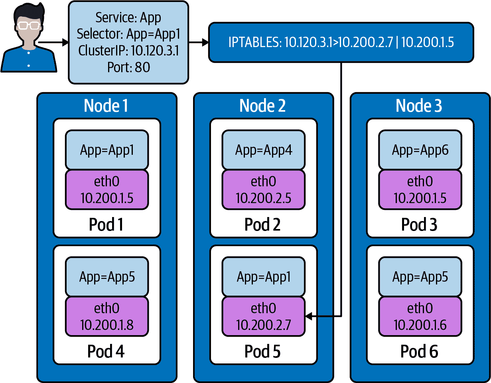

###### 图 5-1\. 服务中的 Endpoints

让我们讨论如何在集群中创建和维护此 endpoint 的更好视图。

每个 endpoint 包含一个端口列表（适用于所有 pods）和两个地址列表：ready 和 unready：

```
apiVersion: v1
kind: Endpoints
metadata:
  labels:
    name: demo-endpoints
subsets:
- addresses:
  - ip: 10.0.0.1
- notReadyAddresses:
  - ip: 10.0.0.2
  ports:
  - port: 8080
    protocol: TCP
```

如果通过了 pod 的就绪检查，地址将列在 `.addresses` 中。如果没有通过，地址将列在 `.notReadyAddresses` 中。这使得 endpoints 成为一个 *服务发现* 工具，您可以观察 `Endpoints` 对象以查看所有 pods 的健康状态和地址：

```
kubectl get endpoints clusterip-service
NAME                ENDPOINTS
clusterip-service   10.244.1.5:8080,10.244.2.7:8080,10.244.2.8:8080 + 1 more...
```

我们可以使用 `kubectl describe` 查看所有地址的更好视图：

```
 kubectl describe endpoints clusterip-service
Name:         clusterip-service
Namespace:    default
Labels:       app=app
Annotations:  endpoints.kubernetes.io/last-change-trigger-time:
2021-01-30T18:51:36Z
Subsets:
  Addresses:          10.244.1.5,10.244.2.7,10.244.2.8,10.244.3.9
  NotReadyAddresses:  <none>
  Ports:
    Name     Port  Protocol
    ----     ----  --------
    <unset>  8080  TCP

Events:
  Type     Reason                  Age   From                 Message
  ----     ------                  ----  ----                 -------
```

让我们移除 app 标签，看看 Kubernetes 的反应。在另一个终端中，运行此命令。这将允许我们实时查看 pods 的变化：

```
kubectl get pods -w
```

在另一个单独的终端中，让我们用 endpoints 做同样的事情：

```
kubectl get endpoints -w
```

现在我们需要获取要从 `Endpoints` 对象中删除的 pod 名称：

```
 kubectl get pods -l app=app -o wide
NAME                  READY   STATUS   RESTARTS  AGE  IP           NODE
app-5586fc9d77-7frts  1/1     Running  0         19m  10.244.1.5   kind-worker2
app-5586fc9d77-mxhgw  1/1     Running  0         19m  10.244.3.9   kind-worker3
app-5586fc9d77-qpxwk  1/1     Running  0         20m  10.244.2.7   kind-worker
app-5586fc9d77-tpz8q  1/1     Running  0         19m  10.244.2.8   kind-worker
```

使用 `kubectl label`，我们可以修改 pod 的 `app-5586fc9d77-7frts` 的 `app=app` 标签：

```
 kubectl label pod app-5586fc9d77-7frts app=nope --overwrite
pod/app-5586fc9d77-7frts labeled
```

对于相同的原因，endpoints 和 pods 的观察命令都会看到一些变化：移除 pod 上的标签 `app=app`。endpoint 控制器将注意到 pod 的变化，部署控制器也会。所以 Kubernetes 做了 Kubernetes 擅长的事情：使实际状态反映所需状态：

```
kubectl get pods -w
NAME                   READY   STATUS             RESTARTS   AGE
app-5586fc9d77-7frts   1/1     Running            0          21m
app-5586fc9d77-mxhgw   1/1     Running            0          21m
app-5586fc9d77-qpxwk   1/1     Running            0          22m
app-5586fc9d77-tpz8q   1/1     Running            0          21m
dnsutils               1/1     Running            3          3h1m
postgres-0             1/1     Running            0          3h
postgres-1             1/1     Running            0          3h
app-5586fc9d77-7frts   1/1     Running            0          22m
app-5586fc9d77-7frts   1/1     Running            0          22m
app-5586fc9d77-6dcg2   0/1     Pending            0          0s
app-5586fc9d77-6dcg2   0/1     Pending            0          0s
app-5586fc9d77-6dcg2   0/1     ContainerCreating  0          0s
app-5586fc9d77-6dcg2   0/1     Running            0          2s
app-5586fc9d77-6dcg2   1/1     Running            0          7s
```

部署有四个 pods，但我们重新标记的 pod 仍然存在：`app-5586fc9d77-7frts`：

```
kubectl get pods
NAME                   READY   STATUS    RESTARTS   AGE
app-5586fc9d77-6dcg2   1/1     Running   0          4m51s
app-5586fc9d77-7frts   1/1     Running   0          27m
app-5586fc9d77-mxhgw   1/1     Running   0          27m
app-5586fc9d77-qpxwk   1/1     Running   0          28m
app-5586fc9d77-tpz8q   1/1     Running   0          27m
dnsutils               1/1     Running   3          3h6m
postgres-0             1/1     Running   0          3h6m
postgres-1             1/1     Running   0          3h6m
```

Pod `app-5586fc9d77-6dcg2` 现在已成为部署和 endpoint 对象的一部分，带有 IP 地址 `10.244.1.6`：

```
kubectl get pods app-5586fc9d77-6dcg2 -o wide
NAME                  READY  STATUS   RESTARTS  AGE   IP           NODE
app-5586fc9d77-6dcg2  1/1    Running  0         3m6s  10.244.1.6   kind-worker2
```

像往常一样，我们可以使用 `kubectl describe` 查看详细的完整图片：

```
 kubectl describe endpoints clusterip-service
Name:         clusterip-service
Namespace:    default
Labels:       app=app
Annotations:  endpoints.kubernetes.io/last-change-trigger-time:
2021-01-30T19:14:23Z
Subsets:
  Addresses:          10.244.1.6,10.244.2.7,10.244.2.8,10.244.3.9
  NotReadyAddresses:  <none>
  Ports:
    Name     Port  Protocol
    ----     ----  --------
    <unset>  8080  TCP

Events:
  Type     Reason                  Age   From                 Message
  ----     ------                  ----  ----                 -------
```

对于大型部署，那个 endpoint 对象可能会变得非常庞大，以至于实际上会减慢集群中的变更速度。为了解决这个问题，Kubernetes 的维护者提出了 endpoint slices。

# Endpoint Slices

你可能会问，它们与 endpoints 有何不同？这正是我们开始深入研究 Kubernetes 网络的地方。

在典型集群中，Kubernetes 在每个节点上运行 `kube-proxy`。`kube-proxy` 负责使服务正常工作的每个节点部分，通过处理路由和 *出站* 负载均衡到服务中的所有 pod。为了做到这一点，`kube-proxy` 监视集群中的所有 endpoints，以便了解所有服务应路由到的适用 pod。

现在，想象一下我们有一个 *大* 的集群，有数千个节点和成千上万个 pod。这意味着成千上万个 kube-proxy 在监视 endpoints。当 `Endpoints` 对象中的地址发生变化（比如滚动更新、扩展、驱逐、健康检查失败或其他任何原因），更新后的 `Endpoints` 对象会推送到所有正在监听的 kube-proxy。由于 pod 的数量更多，意味着 `Endpoints` 对象更大且变化更频繁，这加剧了问题。这最终会对 `etcd`、Kubernetes API 服务器和网络本身造成压力。Kubernetes 的扩展限制是复杂的，并且取决于具体的标准，但 endpoint 监视是具有数千节点的集群中常见的问题。据传闻，许多 Kubernetes 用户认为 endpoint 监视是集群大小的最终瓶颈。

这个问题是 `kube-proxy` 设计的一个功能，期望任何 pod 都能立即路由到任何服务而无需通知。Endpoint 切片是一种方法，允许 `kube-proxy` 的基本设计继续存在，同时大大减少在使用大型服务的大集群中的监视瓶颈。

Endpoint 切片与 `Endpoints` 对象有类似的内容，但也包括一个 endpoints 数组：

```
apiVersion: discovery.k8s.io/v1beta1
kind: EndpointSlice
metadata:
  name: demo-slice-1
  labels:
    kubernetes.io/service-name: demo
addressType: IPv4
ports:
  - name: http
    protocol: TCP
    port: 80
endpoints:
  - addresses:
      - "10.0.0.1"
    conditions:
      ready: true
```

endpoints 和 endpoint 切片之间的显著区别不在于架构，而在于 Kubernetes 如何处理它们。对于“常规” endpoints，Kubernetes 服务为服务中的所有 pod 创建一个 endpoint。一个服务创建 *多个* endpoint 切片，每个切片包含一部分 pod；图 5-2 描述了这个子集。服务的所有 endpoint 切片的并集包含服务中的所有 pod。这样，IP 地址的变化（由于新的 pod、已删除的 pod 或 pod 的健康状态变化）将导致向观察者传输的数据量大大减少。由于 Kubernetes 没有事务 API，同一个地址可能会暂时出现在多个切片中。任何消费 endpoint 切片的代码（如 `kube-proxy`）必须能够处理这种情况。

使用 `--max-endpoints-per-slice` `kube-controller-manager` 标志设置 endpoint 切片中地址的最大数目。当前默认值为 100，最大值为 1000。Endpoint 切片控制器在创建新的切片之前会尝试填充现有的 endpoint 切片，但不会重新平衡 endpoint 切片。

端点片段控制器将端点镜像到端点片段，以允许系统在将端点视为事实来源的同时继续编写端点。这种行为的确切未来以及端点总体的未来尚未最终确定（但作为 v1 资源，端点将在大幅通知后被废弃）。有四个例外情况会阻止镜像：

+   没有对应的服务。

+   对应的服务资源选择 Pod。

+   `Endpoints`对象具有标签`endpointslice.kubernetes.io/skip-mirror: true`。

+   `Endpoints`对象具有注释`control-⁠⁠plane.alpha.kubernetes​​.io/leader`。

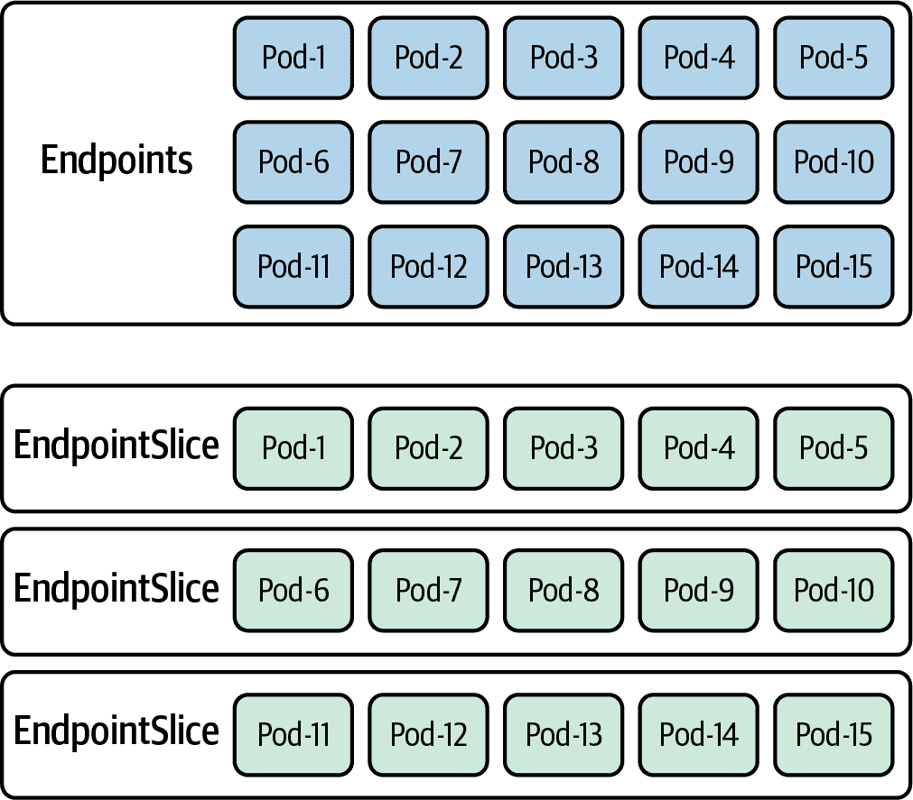

###### 图 5-2\. `Endpoints`与`EndpointSlice`对象

您可以通过获取以`.metadata.labels."kubernetes.io/service-name"`中的所需名称为过滤条件的端点片段来获取特定服务的所有端点片段。

###### 警告

自 Kubernetes 1.17 以来，端点片段一直处于 Beta 状态。在撰写本文时，Kubernetes 1.20 仍然如此。Beta 资源通常不会有重大更改，并最终升级为稳定的 API，但这并不保证。如果直接使用端点片段，请注意未来的 Kubernetes 版本可能会进行重大更改而没有提前警告，或者这里描述的行为可能会发生变化。

在集群中运行的一些端点可以通过`kubectl get endpointslice`来查看：

```
kubectl get endpointslice
NAME                      ADDRESSTYPE   PORTS   ENDPOINTS
clusterip-service-l2n9q   IPv4          8080    10.244.2.7,10.244.2.8,10.244.1.5
+ 1 more...
```

如果我们想要关于端点片段`clusterip-service-l2n9q`的更多细节，可以使用`kubectl describe`来查看它：

```
kubectl describe endpointslice clusterip-service-l2n9q
Name:         clusterip-service-l2n9q
Namespace:    default
Labels:
endpointslice.kubernetes.io/managed-by=endpointslice-controller.k8s.io
kubernetes.io/service-name=clusterip-service
Annotations:  endpoints.kubernetes.io/last-change-trigger-time:
2021-01-30T18:51:36Z
AddressType:  IPv4
Ports:
  Name     Port  Protocol
  ----     ----  --------
  <unset>  8080  TCP
Endpoints:
  - Addresses:  10.244.2.7
    Conditions:
      Ready:    true
    Hostname:   <unset>
    TargetRef:  Pod/app-5586fc9d77-qpxwk
    Topology:   kubernetes.io/hostname=kind-worker
  - Addresses:  10.244.2.8
    Conditions:
      Ready:    true
    Hostname:   <unset>
    TargetRef:  Pod/app-5586fc9d77-tpz8q
    Topology:   kubernetes.io/hostname=kind-worker
  - Addresses:  10.244.1.5
    Conditions:
      Ready:    true
    Hostname:   <unset>
    TargetRef:  Pod/app-5586fc9d77-7frts
    Topology:   kubernetes.io/hostname=kind-worker2
  - Addresses:  10.244.3.9
    Conditions:
      Ready:    true
    Hostname:   <unset>
    TargetRef:  Pod/app-5586fc9d77-mxhgw
    Topology:   kubernetes.io/hostname=kind-worker3
Events:         <none>
```

在输出中，我们可以看到通过`TargetRef`支持端点片段的 Pod。`Topology`信息为我们提供了 Pod 部署到的工作节点的主机名。最重要的是，`Addresses`返回端点对象的 IP 地址。

理解端点和端点片段很重要，因为它们标识了负责服务的 Pod，无论部署的类型如何。在本章后面，我们将详细讨论如何使用端点和标签进行故障排除。接下来，我们将调查所有的 Kubernetes 服务类型。

# Kubernetes 服务

Kubernetes 中的服务是集群内的负载均衡抽象。由`.spec.Type`字段指定四种类型的服务。每种类型提供不同形式的负载均衡或发现，我们将分别介绍这四种类型。这四种类型是：ClusterIP、NodePort、LoadBalancer 和 ExternalName。

服务使用标准的 Pod 选择器来匹配 Pod。服务包含所有匹配的 Pod。服务创建一个端点（或端点片段）来处理 Pod 的发现：

```
apiVersion: v1
kind: Service
metadata:
  name: demo-service
spec:
  selector:
    app: demo
```

对于所有的服务示例，我们将使用 Golang 最小化 Web 服务器。我们已经为应用程序添加了功能，在 REST 请求中显示主机和 Pod IP 地址。

Figure 5-3 概述了我们作为集群中单个 Pod 的网络状态。我们即将探讨的网络对象将在某些情况下将我们的应用 Pod 暴露到集群外部，在其他情况下，允许我们扩展应用程序以满足需求。回顾第 3 和第四章节中的内容，运行在 Pod 内部的容器共享网络命名空间。此外，每个 Pod 都会创建一个暂停容器来管理命名空间。

###### 注意

暂停容器是 Pod 内所有运行容器的父容器。它持有并共享 Pod 的所有命名空间。您可以在 Ian Lewis 的[博文](https://oreil.ly/n51eq)中详细了解有关暂停容器的信息。

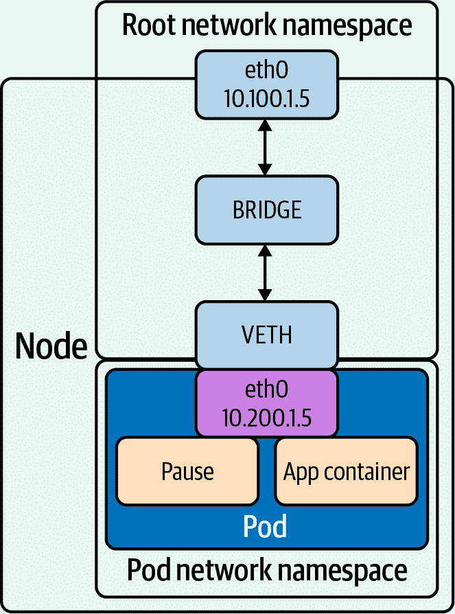

###### 第 5-3 图。主机上的 Pod

在部署服务之前，我们必须首先部署 Web 服务器，这些服务将路由流量到它，如果我们尚未部署：

```
 kubectl apply -f web.yaml
deployment.apps/app created

kubectl get pods -o wide
NAME                  READY  STATUS    RESTARTS  AGE  IP           NODE
app-9cc7d9df8-ffsm6   1/1    Running   0         49s  10.244.1.4   kind-worker2
dnsutils              1/1    Running   0         49m  10.244.3.2   kind-worker3
postgres-0            1/1    Running   0         48m  10.244.1.3   kind-worker2
postgres-1            1/1    Running   0         48m  10.244.2.3   kind-worker
```

让我们从 NodePort 开始看每种类型的服务。

## NodePort

NodePort 服务为外部软件（如负载均衡器）提供了一种简单的方式来将流量路由到 Pod。该软件只需知道节点 IP 地址和服务的端口。NodePort 服务在所有节点上公开一个固定端口，该端口将流量路由到适用的 Pod。NodePort 服务使用`.spec.ports.[].nodePort`字段指定要在所有节点上打开的端口，用于对应 Pod 上的端口：

```
apiVersion: v1
kind: Service
metadata:
  name: demo-service
spec:
  type: NodePort
  selector:
    app: demo
  ports:
    - port: 80
      targetPort: 80
      nodePort: 30000
```

如果 `nodePort` 字段为空，则 Kubernetes 会自动选择一个唯一的端口。`kube-controller-manager` 中的 `--service-node-port-range` 标志设置端口的有效范围为 30000–32767。手动指定的端口必须在此范围内。

使用 NodePort 服务，外部用户可以连接到任何节点上的 nodeport，并被路由到托管该服务的 Pod 的节点；Figure 5-4 展示了这一点。服务将流量定向到节点 3，`iptables` 规则将流量转发到托管 Pod 的节点 2。这有点低效，因为典型的连接将被路由到另一个节点上的 Pod。

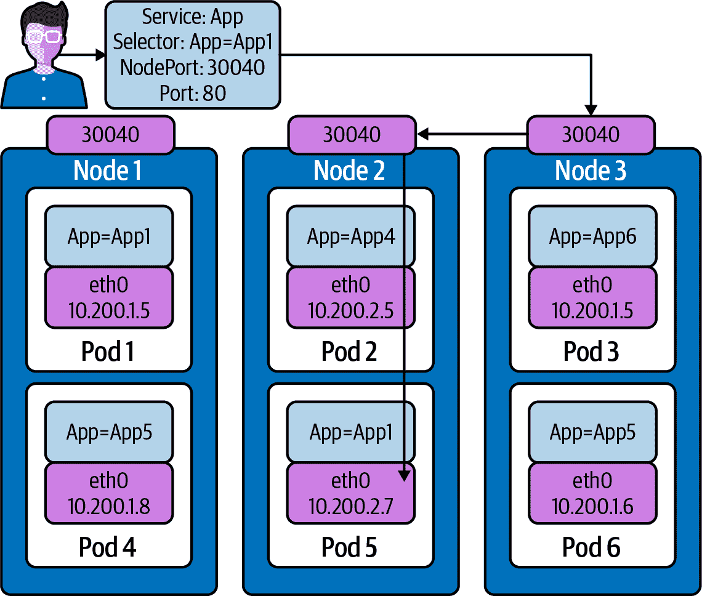

###### 第 5-4 图。NodePort 流量流向

图 5-4 需要我们讨论服务的一个属性，即 externalTrafficPolicy。ExternalTrafficPolicy 表示服务将如何将外部流量路由到节点本地或集群范围的端点。`Local` 会保留客户端源 IP，避免 LoadBalancer 和 NodePort 类型服务的第二跳，但可能导致流量分布不均衡。Cluster 会隐藏客户端源 IP，并可能导致第二跳到另一个节点，但应具有良好的整体负载平衡。`Cluster` 值意味着对于每个工作节点，`kube-proxy iptable` 规则都设置为将流量路由到集群中任何位置支持服务的 pod，就像我们在 图 5-4 中展示的那样。

`Local` 值意味着 `kube-proxy iptable` 规则仅在运行相关 pod 的工作节点上设置，以将流量路由到工作节点本地。使用 `Local` 还允许应用开发人员保留用户请求的源 IP。如果将 externalTrafficPolicy 设置为值 `Local`，`kube-proxy` 将仅代理请求到节点本地端点，并且不会将流量转发到其他节点。如果没有本地端点，则发送到节点的数据包将被丢弃。

让我们扩展我们的 web 应用程序的部署以进行更多测试：

```
 kubectl scale deployment app --replicas 4
deployment.apps/app scaled

 kubectl get pods -l app=app -o wide
NAME                  READY   STATUS      IP           NODE
app-9cc7d9df8-9d5t8   1/1     Running     10.244.2.4   kind-worker
app-9cc7d9df8-ffsm6   1/1     Running     10.244.1.4   kind-worker2
app-9cc7d9df8-srxk5   1/1     Running     10.244.3.4   kind-worker3
app-9cc7d9df8-zrnvb   1/1     Running     10.244.3.5   kind-worker3
```

当有四个 pod 运行时，集群中每个节点将有一个 pod：

```
 kubectl get pods -o wide -l app=app
NAME                   READY   STATUS     IP           NODE
app-5586fc9d77-7frts   1/1     Running    10.244.1.5   kind-worker2
app-5586fc9d77-mxhgw   1/1     Running    10.244.3.9   kind-worker3
app-5586fc9d77-qpxwk   1/1     Running    10.244.2.7   kind-worker
app-5586fc9d77-tpz8q   1/1     Running    10.244.2.8   kind-worker
```

现在让我们部署我们的 NodePort 服务：

```
kubectl apply -f services-nodeport.yaml
service/nodeport-service created

kubectl describe svc nodeport-service
Name:                     nodeport-service
Namespace:                default
Labels:                   <none>
Annotations:              Selector:  app=app
Type:                     NodePort
IP:                       10.101.85.57
Port:                     echo 8080/TCP
TargetPort:               8080/TCP
NodePort:                 echo 30040/TCP
Endpoints:                10.244.1.5:8080,10.244.2.7:8080,10.244.2.8:8080
+ 1 more...
Session Affinity:         None
External Traffic Policy:  Cluster
Events:                   <none>
```

要测试 NodePort 服务，我们必须获取一个工作节点的 IP 地址：

```
kubectl get nodes -o wide
NAME                 STATUS   ROLES   INTERNAL-IP OS-IMAGE
kind-control-plane   Ready    master  172.18.0.5  Ubuntu 19.10
kind-worker          Ready    <none>  172.18.0.3  Ubuntu 19.10
kind-worker2         Ready    <none>  172.18.0.4  Ubuntu 19.10
kind-worker3         Ready    <none>  172.18.0.2  Ubuntu 19.10
```

集群外部的通信将在每个工作节点和节点工作的 IP 地址上开放一个值为 `NodePort` 的端口 30040。

我们可以看到我们的 pod 在集群中每个主机上都是可访问的：

```
kubectl exec -it dnsutils -- wget -q -O-  172.18.0.5:30040/host
NODE: kind-worker2, POD IP:10.244.1.5

kubectl exec -it dnsutils -- wget -q -O-  172.18.0.3:30040/host
NODE: kind-worker, POD IP:10.244.2.8

kubectl exec -it dnsutils -- wget -q -O-  172.18.0.4:30040/host
NODE: kind-worker2, POD IP:10.244.1.5
```

同样重要的是考虑其限制。如果 NodePort 部署无法分配所请求的端口，则会失败。此外，端口必须在使用 NodePort 服务的所有应用程序之间进行跟踪。手动选择端口可能会引发端口冲突的问题（特别是在将工作负载应用于多个可能没有相同空闲 NodePorts 的集群时）。

使用 NodePort 服务类型的另一个缺点是负载均衡器或客户端软件必须知道节点 IP 地址。静态配置（例如运营人员手动复制节点 IP 地址）可能会随时间变化而过时（特别是在云提供商上），因为 IP 地址会发生变化或节点被替换。可靠的系统会自动填充节点 IP 地址，可以通过观察已分配给集群的机器或从 Kubernetes API 中列出节点来实现。

NodePort 是服务的最早形式。我们将看到其他服务类型在其架构中使用 NodePort 作为基础结构。不应仅使用 NodePort，因为客户端需要知道主机和节点的 IP 地址以进行连接请求。我们将在本章后面讨论云网络时看到如何使用 NodePort 来启用负载均衡器。

接下来是服务的默认类型，ClusterIP。

## ClusterIP

pod 的 IP 地址与 pod 的生命周期共享，因此不适合客户端用于请求。服务有助于克服这种 pod 网络设计。ClusterIP 服务提供了一个内部负载均衡器，具有一个单一的 IP 地址，映射到所有匹配的（并且就绪的）pod。

服务的 IP 地址必须在 API 服务器中 `service-cluster-ip-range` 中设置的 CIDR 范围内。您可以手动指定一个有效的 IP 地址，或者将 `.spec.clusterIP` 置空以自动分配一个。ClusterIP 服务地址是一个虚拟 IP 地址，仅在内部可路由。

`kube-proxy` 负责将 ClusterIP 服务地址路由到所有适用的 pod。在“正常”配置中，`kube-proxy` 执行 L4 负载平衡，可能不足以满足需求。例如，旧的 pod 可能由于客户端积累了更多的长连接而看到更多的负载。或者，少数客户端的大量请求可能导致负载不均匀分布。

ClusterIP 的一个特定用例示例是当工作负载需要同一集群内的负载均衡器时。

在 图 5-5 中，我们可以看到部署了一个 ClusterIP 服务。服务名称为 App，具有选择器，或者 App=App1。有两个支持该服务的 pod。Pod 1 和 Pod 5 匹配服务的选择器。

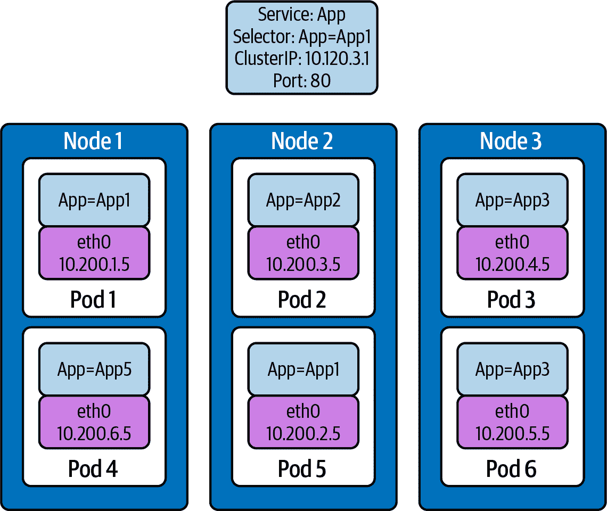

###### 图 5-5\. Cluster IP 示例服务

让我们深入到使用我们的 KIND 集群的命令行中的示例中。

我们将为我们的 Golang web 服务器部署一个 ClusterIP 服务以供使用：

```
kubectl apply -f service-clusterip.yaml
service/clusterip-service created

kubectl describe svc clusterip-service
Name:              clusterip-service
Namespace:         default
Labels:            app=app
Annotations:       Selector:  app=app
Type:              ClusterIP
IP:                10.98.252.195
Port:              <unset>  80/TCP
TargetPort:        8080/TCP
Endpoints:         <none>
Session Affinity:  None
Events:            <none>
```

ClusterIP 服务名称在网络中是可解析的：

```
kubectl exec dnsutils -- host clusterip-service
clusterip-service.default.svc.cluster.local has address 10.98.252.195
```

现在我们可以使用 Cluster IP 地址 `10.98.252.195` 和服务名称 `clusterip-service` 或直接使用 pod IP 地址 `10.244.1.4` 和端口 8080 来访问主机 API 端点：

```
kubectl exec dnsutils -- wget -q -O- clusterip-service/host
NODE: kind-worker2, POD IP:10.244.1.4

kubectl exec dnsutils -- wget -q -O- 10.98.252.195/host
NODE: kind-worker2, POD IP:10.244.1.4

kubectl exec dnsutils -- wget -q -O- 10.244.1.4:8080/host
NODE: kind-worker2, POD IP:10.244.1.4
```

ClusterIP 服务是服务的默认类型。在默认状态下，我们应该探索 ClusterIP 服务为我们抽象出了什么。如果您回忆起第二章和第三章，此列表类似于在 Docker 网络中设置的内容，但现在我们还有 `iptables` 用于所有节点的服务：

+   查看 VETH 对并与 pod 匹配。

+   查看网络命名空间并与 pod 匹配。

+   验证节点上的 PID 并与 pod 匹配。

+   将服务与 `iptables` 规则匹配。

为了探索这一点，我们需要知道 pod 部署到哪个工作节点，即 `kind-worker2`：

```
kubectl get pods -o wide --field-selector spec.nodeName=kind-worker2 -l app=app
NAME                  READY   STATUS    RESTARTS   AGE     IP           NODE
app-9cc7d9df8-ffsm6   1/1     Running   0          7m23s   10.244.1.4   kind-worker2

```

###### 注意

您的容器 ID 和名称将不同。

因为我们正在使用 KIND，我们可以使用 `docker ps` 和 `docker exec` 从运行的工作节点 `kind-worker-2` 中获取信息：

```

docker ps
CONTAINER ID  COMMAND                  PORTS                      NAMES
df6df0736958  "/usr/local/bin/entr…"                               kind-worker2
e242f11d2d00  "/usr/local/bin/entr…"                               kind-worker
a76b32f37c0e  "/usr/local/bin/entr…"                               kind-worker3
07ccb63d870f  "/usr/local/bin/entr…"   0.0.0.0:80->80/tcp,         kind-control-plane
                                       0.0.0.0:443->443/tcp,
                                       127.0.0.1:52321->6443/tcp

```

`kind-worker2` 容器 ID 是 `df6df0736958`；KIND 很“kind”地用名称标记了每个容器，所以我们可以通过其名称 `kind-worker2` 引用每个工作节点：

让我们查看我们的 pod `app-9cc7d9df8-ffsm6` 的 IP 地址和路由表信息：

```
kubectl exec app-9cc7d9df8-ffsm6 ip r
default via 10.244.1.1 dev eth0
10.244.1.0/24 via 10.244.1.1 dev eth0 src 10.244.1.4
10.244.1.1 dev eth0 scope link src 10.244.1.4
```

我们 pod 的 IP 地址是`10.244.1.4`，运行在`eth0@if5`接口上，其默认路由为`10.244.1.1`。这与 pod `veth45d1f3e8@if5`上的接口 5 匹配：

```
kubectl exec app-9cc7d9df8-ffsm6 ip a
1: lo: <LOOPBACK,UP,LOWER_UP> mtu 65536 qdisc noqueue state UNKNOWN group default
qlen 1000
    link/loopback 00:00:00:00:00:00 brd 00:00:00:00:00:00
    inet 127.0.0.1/8 scope host lo
       valid_lft forever preferred_lft forever
    inet6 ::1/128 scope host
       valid_lft forever preferred_lft forever
2: tunl0@NONE: <NOARP> mtu 1480 qdisc noop state DOWN
group default qlen 1000
    link/ipip 0.0.0.0 brd 0.0.0.0
3: ip6tnl0@NONE: <NOARP> mtu 1452 qdisc noop state DOWN group default qlen 1000
    link/tunnel6 :: brd ::
5: eth0@if5: <BROADCAST,MULTICAST,UP,LOWER_UP> mtu 1500 qdisc noqueue state UP
group default
    link/ether 3e:57:42:6e:cd:45 brd ff:ff:ff:ff:ff:ff link-netnsid 0
    inet 10.244.1.4/24 brd 10.244.1.255 scope global eth0
       valid_lft forever preferred_lft forever
    inet6 fe80::3c57:42ff:fe6e:cd45/64 scope link
       valid_lft forever preferred_lft forever

```

让我们也从`node ip a`输出中检查网络命名空间：

```
 docker exec -it kind-worker2 ip a
<trimmerd>
5: veth45d1f3e8@if5: <BROADCAST,MULTICAST,UP,LOWER_UP> mtu 1500 qdisc noqueue
state UP group default
    link/ether 3e:39:16:38:3f:23 brd <>
    link-netns cni-ec37f6e4-a1b5-9bc9-b324-59d612edb4d4
    inet 10.244.1.1/32 brd 10.244.1.1 scope global veth45d1f3e8
       valid_lft forever preferred_lft forever
```

`netns list`确认网络命名空间与我们的 pod 匹配，接口与主机接口，`cni-ec37f6e4-a1b5-9bc9-b324-59d612edb4d4`：

```
docker exec -it kind-worker2 /usr/sbin/ip netns list
cni-ec37f6e4-a1b5-9bc9-b324-59d612edb4d4 (id: 2)
cni-c18c44cb-6c3e-c48d-b783-e7850d40e01c (id: 1)
```

让我们看看那个网络命名空间内运行的进程。为此，我们将使用`docker exec`在托管该 pod 及其网络命名空间的节点`kind-worker2`上运行命令：

```
 docker exec -it kind-worker2 /usr/sbin/ip netns pid
 cni-ec37f6e4-a1b5-9bc9-b324-59d612edb4d4
4687
4737
```

现在我们可以`grep`每个进程 ID 并检查它们在做什么：

```
docker exec -it kind-worker2 ps aux | grep 4687
root      4687  0.0  0.0    968     4 ?        Ss   17:00   0:00 /pause

docker exec -it kind-worker2 ps aux | grep 4737
root      4737  0.0  0.0 708376  6368 ?        Ssl  17:00   0:00 /opt/web-server
```

`4737`是运行在`kind-worker2`上的我们的 Web 服务器容器的进程 ID。

`4687`是我们的暂停容器，持有所有我们的命名空间。

现在让我们看看工作节点上的`iptables`会发生什么变化：

```
docker exec -it kind-worker2 iptables -L
Chain INPUT (policy ACCEPT)
target                  prot opt source destination
/* kubernetes service portals */
KUBE-SERVICES           all  --  anywhere   anywhere    ctstate NEW
/* kubernetes externally-visible service portals */
KUBE-EXTERNAL-SERVICES  all  --  anywhere   anywhere    ctstate NEW
KUBE-FIREWALL           all  --  anywhere   anywhere

Chain FORWARD (policy ACCEPT)
target        prot opt source destination
/* kubernetes forwarding rules */
KUBE-FORWARD  all  --  anywhere   anywhere
/* kubernetes service portals */
KUBE-SERVICES all  --  anywhere   anywhere             ctstate NEW

Chain OUTPUT (policy ACCEPT)
target          prot opt source destination
/* kubernetes service portals */
KUBE-SERVICES   all  --  anywhere             anywhere             ctstate NEW
KUBE-FIREWALL   all  --  anywhere             anywhere

Chain KUBE-EXTERNAL-SERVICES (1 references)
target     prot opt source destination

Chain KUBE-FIREWALL (2 references)
target     prot opt source destination
/* kubernetes firewall for dropping marked packets */
DROP       all  --  anywhere  anywhere   mark match 0x8000/0x8000

Chain KUBE-FORWARD (1 references)
target  prot opt source destination
DROP    all  --  anywhere  anywhere    ctstate INVALID
/*kubernetes forwarding rules*/
ACCEPT  all  --  anywhere  anywhere     mark match 0x4000/0x4000
/*kubernetes forwarding conntrack pod source rule*/
ACCEPT  all  --  anywhere  anywhere     ctstate RELATED,ESTABLISHED
/*kubernetes forwarding conntrack pod destination rule*/
ACCEPT  all  --  anywhere  anywhere     ctstate RELATED,ESTABLISHED

Chain KUBE-KUBELET-CANARY (0 references)
target     prot opt source destination

Chain KUBE-PROXY-CANARY (0 references)
target     prot opt source destination

Chain KUBE-SERVICES (3 references)
target     prot opt source destination
```

Kubernetes 正在管理大量的表格。

我们可以深入了解我们部署的服务所负责的`iptables`。让我们检索已部署的`clusterip-service`的 IP 地址。我们需要这个来找到匹配的`iptables`规则：

```
kubectl get svc clusterip-service
NAME                TYPE        CLUSTER-IP       EXTERNAL-IP   PORT(S)    AGE
clusterip-service   ClusterIP   10.98.252.195    <none>        80/TCP     57m
```

现在使用服务的`clusterIP`，`10.98.252.195`，来查找我们的`iptables`规则：

```
docker exec -it  kind-worker2 iptables -L -t nat | grep 10.98.252.195
/* default/clusterip-service: cluster IP */
KUBE-MARK-MASQ  tcp  -- !10.244.0.0/16        10.98.252.195 tcp dpt:80
/* default/clusterip-service: cluster IP */
KUBE-SVC-V7R3EVKW3DT43QQM  tcp  --  anywhere  10.98.252.195 tcp dpt:80
```

列出链`KUBE-SVC-V7R3EVKW3DT43QQM`上的所有规则：

```
docker exec -it  kind-worker2 iptables -t nat -L KUBE-SVC-V7R3EVKW3DT43QQM
Chain KUBE-SVC-V7R3EVKW3DT43QQM (1 references)
target     prot opt source destination
/* default/clusterip-service: */
KUBE-SEP-THJR2P3Q4C2QAEPT  all  --  anywhere             anywhere
```

`KUBE-SEP-`将包含服务的端点，`KUBE-SEP-THJR2P3Q4C2QAEPT`。

现在我们可以看到`iptables`中这个链的规则是什么：

```
docker exec -it kind-worker2 iptables -L KUBE-SEP-THJR2P3Q4C2QAEPT -t nat
Chain KUBE-SEP-THJR2P3Q4C2QAEPT (1 references)
target          prot opt source destination
/* default/clusterip-service: */
KUBE-MARK-MASQ  all  --  10.244.1.4      anywhere
/* default/clusterip-service: */
DNAT            tcp  --  anywhere        anywhere    tcp to:10.244.1.4:8080
```

`10.244.1.4:8080`是服务端点之一，也就是支持服务的 pod，这与`kubectl get ep clusterip-service`的输出确认一致：

```
kubectl get ep clusterip-service
NAME                ENDPOINTS                         AGE
clusterip-service   10.244.1.4:8080                   62m

kubectl describe ep clusterip-service
Name:         clusterip-service
Namespace:    default
Labels:       app=app
Annotations:  <none>
Subsets:
  Addresses:          10.244.1.4
  NotReadyAddresses:  <none>
  Ports:
    Name     Port  Protocol
    ----     ----  --------
    <unset>  8080  TCP

Events:  <none>
```

现在，让我们探索 ClusterIP 服务的限制。ClusterIP 服务用于集群内部流量，并且面临与端点相同的问题。随着服务规模的增长，对其的更新将变慢。在第二章中，我们讨论了通过将 IPVS 作为`kube-proxy`的代理模式来减轻这一问题。我们将在本章后面讨论如何通过 Ingress 和其他服务类型 LoadBalancer 将流量引入集群。

ClusterIP 是默认的服务类型，但还有几种其他特定类型的服务，如无头服务和 ExternalName。ExternalName 是一种帮助访问集群外服务的特定类型服务。我们简要介绍了 StatefulSets 中的无头服务，现在让我们深入了解这些服务。

## 无头

无头服务不是服务的正式类型（即没有`.spec.type: Headless`）。无头服务是一种带有`.spec.clusterIP: "None"`的服务。这与仅*不设置*集群 IP 地址是不同的，后者使 Kubernetes 自动分配集群 IP 地址。

当 ClusterIP 设置为 None 时，该服务不支持任何负载平衡功能。相反，它只会为所选和就绪的所有 pod 分配一个`Endpoints`对象，并将服务 DNS 记录指向它们。

无头服务提供了一种通用的方式来监视端点，无需与 Kubernetes API 交互。获取 DNS 记录比与 Kubernetes API 集成简单得多，对于第三方软件可能无法实现。

无头服务允许开发人员在部署中部署多个 Pod 的副本。与 ClusterIP 服务返回单个 IP 地址不同，查询返回所有端点的 IP 地址。然后由客户端选择使用哪个。为了看到这一点，请扩展我们 Web 应用程序的部署：

```
 kubectl scale deployment app --replicas 4
deployment.apps/app scaled

 kubectl get pods -l app=app -o wide
NAME                  READY   STATUS      IP           NODE
app-9cc7d9df8-9d5t8   1/1     Running     10.244.2.4   kind-worker
app-9cc7d9df8-ffsm6   1/1     Running     10.244.1.4   kind-worker2
app-9cc7d9df8-srxk5   1/1     Running     10.244.3.4   kind-worker3
app-9cc7d9df8-zrnvb   1/1     Running     10.244.3.5   kind-worker3
```

现在让我们部署无头服务：

```
kubectl apply -f service-headless.yml
service/headless-service created
```

DNS 查询将返回所有四个 Pod IP 地址。使用我们的`dnsutils`镜像，我们可以验证这一点：

```
kubectl exec dnsutils -- host -v -t a headless-service
Trying "headless-service.default.svc.cluster.local"
;; ->>HEADER<<- opcode: QUERY, status: NOERROR, id: 45294
;; flags: qr aa rd; QUERY: 1, ANSWER: 4, AUTHORITY: 0, ADDITIONAL: 0

;; QUESTION SECTION:
;headless-service.default.svc.cluster.local. IN A

;; ANSWER SECTION:
headless-service.default.svc.cluster.local. 30 IN A 10.244.2.4
headless-service.default.svc.cluster.local. 30 IN A 10.244.3.5
headless-service.default.svc.cluster.local. 30 IN A 10.244.1.4
headless-service.default.svc.cluster.local. 30 IN A 10.244.3.4

Received 292 bytes from 10.96.0.10#53 in 0 ms
```

查询返回的 IP 地址也与服务的端点匹配。使用`kubectl describe`确认了端点的情况：

```
 kubectl describe endpoints headless-service
Name:         headless-service
Namespace:    default
Labels:       service.kubernetes.io/headless
Annotations:  endpoints.kubernetes.io/last-change-trigger-time:
2021-01-30T18:16:09Z
Subsets:
  Addresses:          10.244.1.4,10.244.2.4,10.244.3.4,10.244.3.5
  NotReadyAddresses:  <none>
  Ports:
    Name     Port  Protocol
    ----     ----  --------
    <unset>  8080  TCP

Events:  <none>
```

无头服务有一个特定的用例，通常不用于部署。正如我们在“StatefulSets”中提到的，如果开发人员需要让客户端决定使用哪个端点，则无头是部署的适当服务类型。无头服务的两个示例是集群数据库和在代码中构建了客户端负载均衡逻辑的应用程序。

我们的下一个示例是 ExternalName，它有助于迁移到集群外的服务。它还在集群 DNS 内部提供其他 DNS 优势。

## ExternalName 服务

ExternalName 是一种特殊类型的服务，它没有选择器，而是使用 DNS 名称。

当查找主机`ext-service.default.svc.cluster.local`时，集群 DNS 服务返回了`database.mycompany.com`的 CNAME 记录：

```
apiVersion: v1
kind: Service
metadata:
  name: ext-service
spec:
  type: ExternalName
  externalName: database.mycompany.com
```

如果开发人员将应用程序迁移到 Kubernetes，但其依赖项保留在集群外部，ExternalName 服务允许他们定义一个内部集群的 DNS 记录，无论服务实际运行在哪里。

DNS 将尝试如下示例中显示的搜索：

```
 kubectl exec -it dnsutils -- host -v -t a github.com
Trying "github.com.default.svc.cluster.local"
Trying "github.com.svc.cluster.local"
Trying "github.com.cluster.local"
Trying "github.com"
;; ->>HEADER<<- opcode: QUERY, status: NOERROR, id: 55908
;; flags: qr rd ra; QUERY: 1, ANSWER: 1, AUTHORITY: 0, ADDITIONAL: 0

;; QUESTION SECTION:
;github.com.                    IN      A

;; ANSWER SECTION:
github.com.             30      IN      A       140.82.112.3

Received 54 bytes from 10.96.0.10#53 in 18 ms
```

例如，ExternalName 服务允许开发人员将一个服务映射到一个 DNS 名称。

现在如果我们这样部署外部服务：

```
kubectl apply -f service-external.yml
service/external-service created
```

github.com 的 A 记录从`external-service`查询返回：

```
kubectl exec -it dnsutils -- host -v -t a external-service
Trying "external-service.default.svc.cluster.local"
;; ->>HEADER<<- opcode: QUERY, status: NOERROR, id: 11252
;; flags: qr aa rd; QUERY: 1, ANSWER: 2, AUTHORITY: 0, ADDITIONAL: 0

;; QUESTION SECTION:
;external-service.default.svc.cluster.local. IN A

;; ANSWER SECTION:
external-service.default.svc.cluster.local. 24 IN CNAME github.com.
github.com.             24      IN      A       140.82.112.3

Received 152 bytes from 10.96.0.10#53 in 0 ms
```

外部服务的 CNAME 返回 github.com：

```
kubectl exec -it dnsutils -- host -v -t cname external-service
Trying "external-service.default.svc.cluster.local"
;; ->>HEADER<<- opcode: QUERY, status: NOERROR, id: 36874
;; flags: qr aa rd; QUERY: 1, ANSWER: 1, AUTHORITY: 0, ADDITIONAL: 0

;; QUESTION SECTION:
;external-service.default.svc.cluster.local. IN CNAME

;; ANSWER SECTION:
external-service.default.svc.cluster.local. 30 IN CNAME github.com.

Received 126 bytes from 10.96.0.10#53 in 0 ms
```

通过 DNS 记录发送流量到无头服务是可能的，但不建议这样做。DNS 作为负载均衡的方式并不理想，因为软件在处理返回多个 IP 地址的 A 或 AAAA DNS 记录时采取的方法很不同（通常是简单或不直观的方法），例如，软件通常会选择响应中的第一个 IP 地址并/或者缓存并重复使用同一个 IP 地址。如果需要能够发送流量到服务的 DNS 地址，请考虑（标准的）ClusterIP 或 LoadBalancer 服务。

使用无头服务的“正确”方法是查询服务的 A/AAAA DNS 记录，并在服务器端或客户端负载均衡器中使用该数据。

我们讨论的大多数服务都是用于集群网络的内部流量管理。在接下来的章节中，我们将会审查如何通过 LoadBalancer 和 Ingress 类型服务将请求路由到集群中。

## 负载均衡器

负载均衡器服务将服务暴露给集群网络之外的外部。它们结合了 NodePort 服务的行为和外部集成，如云服务提供商的负载均衡器。值得注意的是，负载均衡器服务处理 L4 流量（不像 Ingress 处理 L7 流量），因此它们适用于任何 TCP 或 UDP 服务，只要所选的负载均衡器支持 L4 流量。

配置和负载均衡选项极大地依赖于云服务提供商。例如，有些支持`.spec.loadBalancerIP`（需要不同的设置），而有些则会忽略它：

```
apiVersion: v1
kind: Service
metadata:
  name: demo-service
spec:
  selector:
    app: demo
  ports:
    - protocol: TCP
      port: 80
      targetPort: 8080
  clusterIP: 10.0.5.1
  type: LoadBalancer
```

一旦负载均衡器被配置完成，其 IP 地址将被写入`.status.loadBalancer.ingress.ip`。

负载均衡器服务非常适用于将 TCP 或 UDP 服务暴露给外部。流量将通过其公共 IP 地址和 TCP 端口 80 进入负载均衡器，由`spec.ports[*].port`定义，并路由到集群 IP 地址`10.0.5.1`，然后进入容器目标端口 8080，`spec.ports[*].targetPort`。示例中未显示的是`.spec.ports[*].nodePort`；如果未指定，Kubernetes 会为服务选择一个。

###### 提示

服务的`spec.ports[*].targetPort`必须与您的 Pod 容器应用程序的`spec.container[*].ports.containerPort`及其协议匹配。否则，在 Kubernetes 网络中会像缺少分号一样。

在图 5-6 中，我们可以看到负载均衡器类型是如何在其他服务类型基础上构建的。云负载均衡器将决定如何分发流量；我们将在下一章节深入讨论这一点。

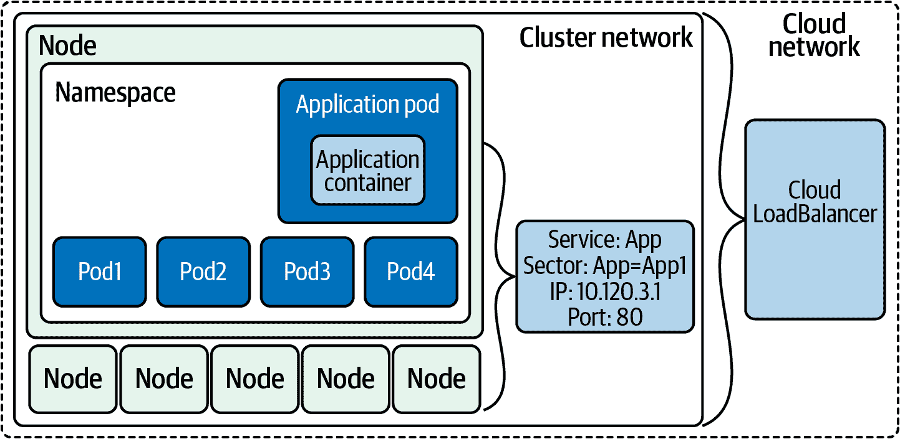

###### 图 5-6\. 负载均衡器服务

让我们继续通过 LoadBalancer 服务扩展我们的 Golang Web 服务器示例。

因为我们是在本地机器上运行，而不是在像 AWS、GCP 或 Azure 这样的服务提供商上，所以我们可以使用 MetalLB 作为负载均衡器服务的示例。MetalLB 项目旨在允许用户为其集群部署裸金属负载均衡器。

此示例已从[KIND 示例部署](https://oreil.ly/h8xIt)修改而来。

我们的第一步是为 MetalLB 部署一个单独的命名空间：

```
kubectl apply -f mlb-ns.yaml
namespace/metallb-system created
```

MetalLB 成员还需要一个用于加入负载均衡器集群的秘钥；让我们现在为他们在我们的集群中部署一个：

```
kubectl create secret generic -n metallb-system memberlist
--from-literal=secretkey="$(openssl rand -base64 128)"
secret/memberlist created
```

现在我们可以部署 MetalLB 了！

```
 kubectl apply -f ./metallb.yaml
podsecuritypolicy.policy/controller created
podsecuritypolicy.policy/speaker created
serviceaccount/controller created
serviceaccount/speaker created
clusterrole.rbac.authorization.k8s.io/metallb-system:controller created
clusterrole.rbac.authorization.k8s.io/metallb-system:speaker created
role.rbac.authorization.k8s.io/config-watcher created
role.rbac.authorization.k8s.io/pod-lister created
clusterrolebinding.rbac.authorization.k8s.io/metallb-system:controller created
clusterrolebinding.rbac.authorization.k8s.io/metallb-system:speaker created
rolebinding.rbac.authorization.k8s.io/config-watcher created
rolebinding.rbac.authorization.k8s.io/pod-lister created
daemonset.apps/speaker created
deployment.apps/controller created
```

如您所见，它部署了许多对象，现在我们等待资源的部署完成。我们可以在`metallb-system`命名空间中使用`--watch`选项监视资源的部署：

```
kubectl get pods -n metallb-system --watch
NAME                          READY   STATUS              RESTARTS   AGE
controller-5df88bd85d-mvgqn   0/1     ContainerCreating   0          10s
speaker-5knqb                 1/1     Running             0          10s
speaker-k79c9                 1/1     Running             0          10s
speaker-pfs2p                 1/1     Running             0          10s
speaker-sl7fd                 1/1     Running             0          10s
controller-5df88bd85d-mvgqn   1/1     Running             0          12s
```

要完成配置，我们需要为 MetalLB 提供一个它控制的 IP 地址范围。此范围必须在 Docker KIND 网络上：

```
docker network inspect -f '{{.IPAM.Config}}' kind
[{172.18.0.0/16  172.18.0.1 map[]} {fc00:f853:ccd:e793::/64  fc00:f853:ccd:e793::1 map[]}]

```

`172.18.0.0/16`是我们在本地运行的 Docker 网络。

我们希望我们的 LoadBalancer IP 范围来自这个子类。例如，我们可以通过创建 ConfigMap 配置 MetalLB，使用 `172.18.255.200` 到 `172.18.255.250`：

ConfigMap 将如下所示：

```
apiVersion: v1
kind: ConfigMap
metadata:
  namespace: metallb-system
  name: config
data:
  config: |
    address-pools:
    - name: default
      protocol: layer2
      addresses:
      - 172.18.255.200-172.18.255.250
```

让我们部署它，这样我们就可以使用 MetalLB：

```
kubectl apply -f ./metallb-configmap.yaml
```

现在我们为我们的 web 应用程序部署一个负载均衡器：

```
kubectl apply -f services-loadbalancer.yaml
service/loadbalancer-service created
```

为了好玩，让我们将 web 应用程序部署扩展到 10 个，如果你有资源的话：

```
kubectl scale deployment app --replicas 10

 kubectl get pods -o wide
NAME                  READY  STATUS    RESTARTS  AGE   IP           NODE
app-7bdb9ffd6c-b5x7m  2/2    Running   0         26s   10.244.3.15  kind-worker
app-7bdb9ffd6c-bqtf8  2/2    Running   0         26s   10.244.2.13  kind-worker2
app-7bdb9ffd6c-fb9sf  2/2    Running   0         26s   10.244.3.14  kind-worker
app-7bdb9ffd6c-hrt7b  2/2    Running   0         26s   10.244.2.7   kind-worker2
app-7bdb9ffd6c-l2794  2/2    Running   0         26s   10.244.2.9   kind-worker2
app-7bdb9ffd6c-l4cfx  2/2    Running   0         26s   10.244.3.11  kind-worker2
app-7bdb9ffd6c-rr4kn  2/2    Running   0         23m   10.244.3.10  kind-worker
app-7bdb9ffd6c-s4k92  2/2    Running   0         26s   10.244.3.13  kind-worker
app-7bdb9ffd6c-shmdt  2/2    Running   0         26s   10.244.1.12  kind-worker3
app-7bdb9ffd6c-v87f9  2/2    Running   0         26s   10.244.1.11  kind-worker3
app2-658bcd97bd-4n888 1/1    Running   0         35m   10.244.2.6   kind-worker3
app2-658bcd97bd-mnpkp 1/1    Running   0         35m   10.244.3.7   kind-worker
app2-658bcd97bd-w2qkl 1/1    Running   0         35m   10.244.3.8   kind-worker
dnsutils              1/1    Running   1         75m   10.244.1.2   kind-worker3
postgres-0            1/1    Running   0         75m   10.244.1.4   kind-worker3
postgres-1            1/1    Running   0         75m   10.244.3.4   kind-worker
```

现在我们可以测试配置的负载均衡器。

随着我们应用程序在负载均衡器后面部署更多副本，我们需要负载均衡器的外部 IP，`172.18.255.200`：

```
kubectl get svc loadbalancer-service
NAME                   TYPE           CLUSTER-IP     EXTERNAL-IP
PORT(S)        AGE
loadbalancer-service   LoadBalancer   10.99.24.220   172.18.255.200
80:31276/TCP   52s

kubectl get svc/loadbalancer-service -o=jsonpath='{.status.loadBalancer.ingress[0].ip}'
172.18.255.200

```

因为 Docker for Mac 或 Windows 不会将 KIND 网络暴露给主机，所以无法直接访问 Docker 私有网络上的 `172.18.255.200` LoadBalancer IP。

我们可以通过将 Docker 容器附加到 KIND 网络并模拟 cURL 负载均衡器来模拟它。

###### 提示

如果你想进一步了解这个问题，这里有一篇很棒的 [博客文章](https://oreil.ly/6rTKJ)。

我们将使用另一个称为 `nicolaka/netshoot` 的出色的网络 Docker 镜像在本地运行，附加到 KIND Docker 网络，并发送请求到我们的 MetalLB 负载均衡器。

如果我们运行多次，我们可以看到负载均衡器正在有效地将流量路由到不同的 pod：

```
docker run --network kind -a stdin -a stdout -i -t nicolaka/netshoot
curl 172.18.255.200/host
NODE: kind-worker, POD IP:10.244.2.7

docker run --network kind -a stdin -a stdout -i -t nicolaka/netshoot
curl 172.18.255.200/host
NODE: kind-worker, POD IP:10.244.2.9

docker run --network kind -a stdin -a stdout -i -t nicolaka/netshoot
curl 172.18.255.200/host
NODE: kind-worker3, POD IP:10.244.3.11

docker run --network kind -a stdin -a stdout -i -t nicolaka/netshoot
curl 172.18.255.200/host
NODE: kind-worker2, POD IP:10.244.1.6

docker run --network kind -a stdin -a stdout -i -t nicolaka/netshoot
curl 172.18.255.200/host
NODE: kind-worker, POD IP:10.244.2.9
```

每次新请求时，metalLB 服务都会将请求发送到不同的 pod。LoadBalancer 与其他服务一样，使用选择器和标签来选择 pod，我们可以在 `kubectl describe endpoints loadbalancer-service` 中看到这一点。Pod IP 地址与我们从 cURL 命令的结果匹配：

```
 kubectl describe endpoints loadbalancer-service
Name:         loadbalancer-service
Namespace:    default
Labels:       app=app
Annotations:  endpoints.kubernetes.io/last-change-trigger-time:
2021-01-30T19:59:57Z
Subsets:
  Addresses:
  10.244.1.6,
  10.244.1.7,
  10.244.1.8,
  10.244.2.10,
  10.244.2.7,
  10.244.2.8,
  10.244.2.9,
  10.244.3.11,
  10.244.3.12,
  10.244.3.9
  NotReadyAddresses:  <none>
  Ports:
    Name          Port  Protocol
    ----          ----  --------
    service-port  8080  TCP

Events:  <none>
```

重要的是要记住，LoadBalancer 服务需要特定的集成，并且如果没有云提供商支持或手动安装软件如 MetalLB，将无法工作。

它们通常不是 L7 负载均衡器，因此无法智能处理 HTTP(S) 请求。负载均衡器与工作负载是一对一映射，这意味着发送到该负载均衡器的所有请求必须由相同的工作负载处理。

###### 提示

虽然它不是网络服务，但重要的是提到 Horizontal Pod Autoscaler 服务，它将根据 CPU 利用率扩展副本控制器、部署、ReplicaSet 或 StatefulSet 中的 pod。

我们可以根据用户的需求扩展我们的应用程序，而无需任何人员的配置更改。Kubernetes 和 LoadBalancer 服务会为开发人员、系统和网络管理员处理所有这些。

我们将在下一章节看到如何通过云服务进一步扩展这一点。

## 服务总结

如果出现端点或服务问题，这里有一些故障排除提示：

+   删除 pod 上的标签允许其继续运行，并更新端点和服务。端点控制器将从端点对象中删除未标记的 pod，并重新部署另一个 pod；这将允许您调试特定未标记的 pod 的问题，但不会对最终客户的服务产生不利影响。在开发过程中，我经常使用这个方法，我们在上一节的示例中也这样做了。

+   有两个探测器将 pod 的健康状态传达给 Kubelet 和 Kubernetes 环境的其余部分。

+   YAML 配置很容易弄乱，因此请确保比较服务和 pod 上的端口，并确保它们匹配。

+   我们在第三章讨论了网络策略，这也可以阻止 pod 之间及服务之间的通信。如果您的集群网络正在使用网络策略，请确保为应用程序流量正确设置它们。

+   还要记得使用诊断工具，如 `dnsutils` pod；集群网络上的 `netshoot` pod 是有用的调试工具。

+   如果端点在集群中启动时间过长，可以在 Kubelet 上配置几个选项来控制其对 Kubernetes 环境中变化的响应速度：

    `--kube-api-qps`

    设置 Kubelet 在与 Kubernetes API 服务器通信时使用的每秒查询速率；默认为 5。

    `--kube-api-burst`

    临时允许 API 查询突发到这个数字；默认值为 10。

    `--iptables-sync-period`

    这是刷新 `iptables` 规则的最大间隔时间（例如 5 秒，1 分钟，2 小时 22 分钟）。必须大于 0；默认为 30 秒。

    `--ipvs-sync-period duration`

    这是刷新 IPVS 规则的最大间隔时间。必须大于 0；默认为 30 秒。

+   建议针对较大的集群增加这些选项，但也请记住，这会增加 Kubelet 和 API 服务器的资源使用量，所以请注意。

这些提示可以帮助减轻问题，并且随着集群中服务和 pod 的数量增长，了解这些是很好的。

各种类型的服务展示了 Kubernetes 中网络抽象的强大。我们深入研究了如何为工具链的每一层配置这些服务。希望要将应用程序部署到 Kubernetes 的开发人员现在具备了选择合适服务的知识。不再需要网络管理员手动更新负载均衡器的 IP 地址，Kubernetes 会为他们管理这些。

我们刚刚触及了服务可能性的表面。随着 Kubernetes 的每个新版本，都有调整选项和运行服务的配置。为您的用例测试每个服务，并确保您使用适当的服务来优化 Kubernetes 网络上的应用程序。

LoadBalancer 服务类型是唯一允许流量进入集群的类型，通过负载均衡器公开 HTTP(S) 服务，供外部用户连接使用。Ingress 支持基于路径的路由，允许不同的 HTTP 路径由不同的服务提供。接下来的部分将讨论 Ingress 及其作为管理集群资源连接的替代方法。

# Ingress

Ingress 是 Kubernetes 特有的 L7（HTTP）负载均衡器，可以从外部访问，与集群内部的 L4 ClusterIP 服务形成对比。这通常是暴露 HTTP(S) 工作负载给外部用户的典型选择。Ingress 可以是 API 或基于微服务架构的单一入口点。流量可以根据请求中的 HTTP 信息路由到服务。Ingress 是一个配置规范（具有多种实现），用于将 HTTP 流量路由到 Kubernetes 服务。图 5-7 概述了 Ingress 的组件。

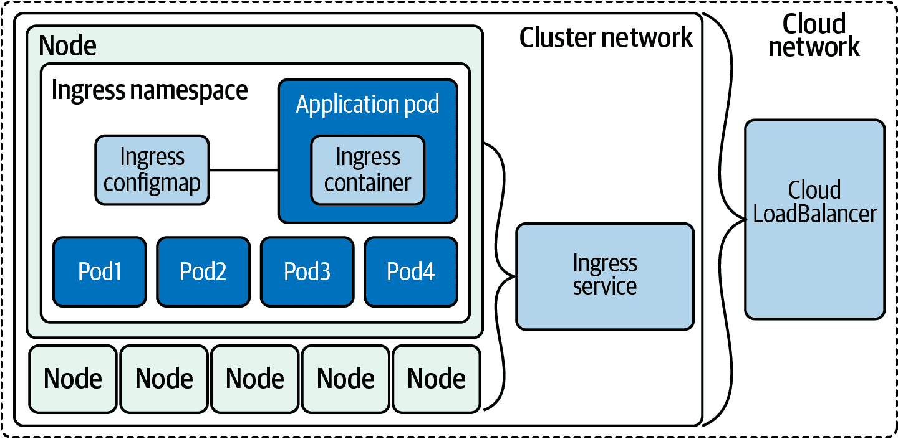

###### 图 5-7\. Ingress 架构

使用 Ingress 管理集群中的流量需要两个必要组件：控制器和规则。控制器管理 Ingress pods，而部署的规则定义了流量的路由方式。

# Ingress 控制器和规则

我们称 Ingress 实现为 Ingress *控制器*。在 Kubernetes 中，控制器是负责管理典型资源类型并使实际状态与期望状态匹配的软件。

有两种常见类型的控制器：外部负载均衡器控制器和内部负载均衡器控制器。外部负载均衡器控制器创建一个存在于集群“外部”的负载均衡器，如云提供商的产品。内部负载均衡器控制器部署一个运行在集群内部的负载均衡器，并不直接解决将消费者路由到负载均衡器的问题。集群管理员运行内部负载均衡器的方式有多种，例如在特定节点子集上运行负载均衡器，并以某种方式将流量路由到这些节点。选择内部负载均衡器的主要动机是降低成本。Ingress 的内部负载均衡器可以为多个 Ingress 对象路由流量，而外部负载均衡器控制器通常每个 Ingress 需要一个负载均衡器。由于大多数云提供商按负载均衡器收费，支持集群内部的单个云负载均衡器比多个云负载均衡器更便宜。但要注意，这会增加操作开销、延迟和计算成本，所以务必确保节省的资金是值得的。许多公司有优化无关紧要的云支出项目的不良习惯。

让我们看一下 Ingress 控制器的规范。与 LoadBalancer 服务一样，大多数规范是通用的，但不同的 Ingress 控制器具有不同的功能并接受不同的配置。我们将从基础知识开始：

```
apiVersion: networking.k8s.io/v1
kind: Ingress
metadata:
  name: basic-ingress
spec:
  rules:
  - http:
      paths:
      # Send all /demo requests to demo-service.
      - path: /demo
        pathType: Prefix
        backend:
          service:
            name: demo-service
            port:
              number: 80
  # Send all other requests to main-service.
  defaultBackend:
    service:
      name: main-service
      port:
        number: 80
```

前面的例子代表了一个典型的 Ingress。它将流量发送到 `/demo` 的一个服务，将所有其他流量发送到另一个服务。Ingress 有一个“默认后端”，如果没有匹配的规则，请求将路由到它。这可以在许多 Ingress 控制器中的控制器配置本身中配置（例如通用的 404 页面），并且许多支持 `.spec.defaultBackend` 字段。Ingress 支持多种指定路径的方法。目前有三种：

精确

仅匹配特定路径及该路径（包括结尾的 `/` 或缺失的 `/`）。

前缀

匹配所有以给定路径开头的路径。

ImplementationSpecific

允许从当前 Ingress 控制器获得自定义语义。

当请求匹配多个路径时，将选择最具体的匹配。例如，如果有 `/first` 和 `/first/second` 的规则，任何以 `/first/second` 开头的请求将转发到 `/first/second` 的后端。如果路径匹配精确路径和前缀路径，请求将转发到精确规则的后端。

Ingress 还可以在规则中使用主机名：

```
apiVersion: networking.k8s.io/v1
kind: Ingress
metadata:
  name: multi-host-ingress
spec:
  rules:
  - host: a.example.com
    http:
      paths:
      - pathType: Prefix
        path: "/"
        backend:
          service:
            name: service-a
            port:
              number: 80
  - host: b.example.com
    http:
      paths:
      - pathType: Prefix
        path: "/"
        backend:
          service:
            name: service-b
            port:
              number: 80
```

在这个例子中，我们从一个服务向 `a.example.com` 提供流量，从另一个服务向 `b.example.com` 提供流量。这类似于 Web 服务器中的虚拟主机。您可能希望使用主机规则来使用单个负载均衡器和 IP 来为多个唯一域名提供服务。

Ingress 具有基本的 TLS 支持：

```
apiVersion: networking.k8s.io/v1
kind: Ingress
metadata:
  name: demo-ingress-secure
spec:
  tls:
  - hosts:
      - https-example.com
    secretName: demo-tls
  rules:
  - host: https-example.com
    http:
      paths:
      - path: /
        pathType: Prefix
        backend:
          service:
            name: demo-service
            port:
              number: 80
```

TLS 配置引用一个 Kubernetes 密钥，位于 `.spec.tls.[*].secretName`。Ingress 控制器期望在 `.data."tls.crt"` 和 `.data."tls.key"` 中提供 TLS 证书和密钥，如下所示：

```
apiVersion: v1
kind: Secret
metadata:
  name: demo-tls
type: kubernetes.io/tls
data:
  tls.crt: cert, encoded in base64
  tls.key: key, encoded in base64
```

###### 提示

如果您不需要手动管理传统颁发的证书，可以使用 [cert-manager](https://oreil.ly/qkN0h) 自动获取和更新证书。

我们前面提到，Ingress 只是一个规范，存在极大的不同实现。可以在单个集群中使用多个 Ingress 控制器，使用 `IngressClass` 设置。Ingress 类表示一个 Ingress 控制器，因此表示特定的 Ingress 实现。

###### 警告

Kubernetes 中的注解必须是字符串。因为 `true` 和 `false` 有不同的非字符串含义，所以不能在不加引号的情况下设置注解为 `true` 或 `false`。`"true"` 和 `"false"` 都是有效的。这是一个[长期存在的问题](https://oreil.ly/76uSI)，在设置默认优先级类时经常会遇到。

`IngressClass` 在 Kubernetes 1.18 中引入。在 1.18 之前，使用 `kubernetes.io/ingress.class` 注解 Ingress 是一种常见的约定，但依赖于所有已安装的 Ingress 控制器是否支持它。Ingress 可以通过在 `.spec.ingressClassName` 中设置类名来选择一个 Ingress 类。

###### 警告

如果设置了多个默认的入口类别，默认情况下，Kubernetes 将不允许您创建没有入口类别或从现有入口中移除入口类别。您可以使用准入控制来防止将多个入口类别标记为默认。

入口仅支持 HTTP(S) 请求，如果您的服务使用不同的协议（例如，大多数数据库使用其自己的协议），这是不够的。某些入口控制器，如 NGINX 入口控制器，支持 TCP 和 UDP，但这不是标准。

现在我们来部署一个入口控制器，以便我们可以向我们的 Golang Web 服务器示例添加入口规则。

当我们部署 KIND 群集时，我们必须添加几个选项，以便我们可以部署入口控制器：

+   extraPortMappings 允许本地主机通过端口 80/443 请求入口控制器。

+   Node-labels 仅允许入口控制器在匹配标签选择器的特定节点上运行。

具有入口控制器的选择有很多。与其他组件不同，Kubernetes 系统没有默认控制器或启动控制器。Kubernetes 社区支持 AWS、GCE 和 Nginx 入口控制器。Table 5-1 概述了几个入口的选项。

表 5-1\. 入口控制器选项简要列表

| 名称 | 商业支持 | 引擎 | 协议支持 | SSL 终止 |
| --- | --- | --- | --- | --- |
| Ambassador 入口控制器 | 是 | Envoy | gRPC, HTTP/2, WebSockets | 是 |
| 社区版入口 Nginx | 否 | NGINX | gRPC, HTTP/2, WebSockets | 是 |
| NGINX Inc. 入口 | 是 | NGINX | HTTP, Websocket, gRPC | 是 |
| HAProxy 入口 | 是 | HAProxy | gRPC, HTTP/2, WebSockets | 是 |
| Istio 入口 | 否 | Envoy | HTTP, HTTPS, gRPC, HTTP/2 | 是 |
| 用于 Kubernetes 的 Kong 入口控制器 | 是 | Lua 在 Nginx 之上 | gRPC, HTTP/2 | 是 |
| Traefik Kubernetes 入口 | 是 | Traefik | HTTP/2, gRPC 和 WebSockets | 是 |

在选择群集的入口时需要考虑一些事项：

+   协议支持：您是否需要超过 TCP/UDP 的更多支持，例如 gRPC 集成或 WebSocket？

+   商业支持：您是否需要商业支持？

+   高级功能：您的应用程序是否需要 JWT/oAuth2 认证或断路器功能？

+   API 网关功能：您是否需要一些 API 网关功能，例如速率限制？

+   流量分发：您的应用程序是否需要支持特殊的流量分发，例如金丝雀 A/B 测试或镜像？

对于我们的示例，我们选择使用 NGINX 入口控制器的社区版。

###### 提示

要选择更多入口控制器，请访问 [kubernetes.io](https://oreil.ly/Lzn5q) 维护的列表。

让我们将 NGINX 入口控制器部署到我们的 KIND 群集中：

```
kubectl apply -f ingress.yaml
namespace/ingress-nginx created
serviceaccount/ingress-nginx created
configmap/ingress-nginx-controller created
clusterrole.rbac.authorization.k8s.io/ingress-nginx created
clusterrolebinding.rbac.authorization.k8s.io/ingress-nginx created
role.rbac.authorization.k8s.io/ingress-nginx created
rolebinding.rbac.authorization.k8s.io/ingress-nginx created
service/ingress-nginx-controller-admission created
service/ingress-nginx-controller created
deployment.apps/ingress-nginx-controller created
validatingwebhookconfiguration.admissionregistration.k8s.io/
ingress-nginx-admission created
serviceaccount/ingress-nginx-admission created
clusterrole.rbac.authorization.k8s.io/ingress-nginx-admission created
clusterrolebinding.rbac.authorization.k8s.io/ingress-nginx-admission created
role.rbac.authorization.k8s.io/ingress-nginx-admission created
rolebinding.rbac.authorization.k8s.io/ingress-nginx-admission created
job.batch/ingress-nginx-admission-create created
job.batch/ingress-nginx-admission-patch created
```

与所有部署一样，我们必须等待控制器准备就绪，然后才能使用它。使用以下命令，我们可以验证我们的入口控制器是否准备好供使用：

```
kubectl wait --namespace ingress-nginx \
>   --for=condition=ready pod \
>   --selector=app.kubernetes.io/component=controller \
>   --timeout=90s
pod/ingress-nginx-controller-76b5f89575-zps4k condition met
```

控制器已部署到集群中，现在我们准备为我们的应用编写入口规则。

### 部署入口规则

我们的 YAML 清单定义了几个入口规则，用于我们的 Golang Web 服务器示例：

```
kubectl apply -f ingress-rule.yaml
ingress.extensions/ingress-resource created

kubectl get ingress
NAME               CLASS    HOSTS   ADDRESS   PORTS   AGE
ingress-resource   <none>   *                 80      4s
```

使用 `describe` 我们可以看到映射到 ClusterIP 服务和 pod 的所有后端：

```
kubectl describe ingress
Name:             ingress-resource
Namespace:        default
Address:
Default backend:  default-http-backend:80 (<error:
endpoints "default-http-backend" not found>)
Rules:
  Host        Path  Backends
  ----        ----  --------
  *
              /host  clusterip-service:8080 (
10.244.1.6:8080,10.244.1.7:8080,10.244.1.8:8080)
Annotations:  kubernetes.io/ingress.class: nginx
Events:
  Type    Reason  Age   From                      Message
  ----    ------  ----  ----                      -------
  Normal  Sync    17s   nginx-ingress-controller  Scheduled for sync
```

我们的入口规则仅适用于 `/host` 路由，并将请求路由到我们的 `clusterip-service:8080` 服务。

我们可以使用 cURL 来测试 http://localhost/host：

```
curl localhost/host
NODE: kind-worker2, POD IP:10.244.1.6
curl localhost/healthz
```

现在我们可以看到入口规则有多么强大；让我们部署第二个部署和 ClusterIP 服务。

我们的新部署和服务将用于响应 `/data` 的请求：

```
kubectl apply -f ingress-example-2.yaml
deployment.apps/app2 created
service/clusterip-service-2 configured
ingress.extensions/ingress-resource-2 configured
```

现在 `/host` 和 `/data` 都可以工作，但将会路由到不同的服务：

```
curl localhost/host
NODE: kind-worker2, POD IP:10.244.1.6

curl localhost/data
Database Connected
```

由于入口在第 7 层工作，有许多其他选项可以用来路由流量，例如主机头和 URI 路径。

对于更高级的流量路由和发布模式，需要在集群网络中部署服务网格。让我们接下来深入探讨这一点。

# 服务网格

使用默认选项的新群集有一些限制。所以，让我们了解这些限制是什么，以及服务网格如何解决其中的一些限制。*服务网格* 是一个 API 驱动的基础设施层，用于处理服务间的通信。

从安全角度来看，集群内部所有流量在 pod 之间都是未加密的，运行服务的每个应用团队必须单独为每个服务配置监控。我们已经讨论了服务类型，但我们还没有讨论如何更新它们的 pod 部署。服务网格支持的不仅仅是基本的部署类型；它们支持滚动更新和重建，就像 Canary 一样。从开发者的角度来看，将故障注入网络是有用的，但默认的 Kubernetes 网络部署不直接支持。通过服务网格，开发者可以添加故障测试，而不仅仅是杀死 pod，还可以使用服务网格来注入延迟——同样，每个应用程序都必须构建故障测试或断路器。

在默认的 Kubernetes 集群网络中，服务网格增强或提供了几个功能：

服务发现

服务网格管理服务发现，不再依赖 DNS，消除了在每个单独应用程序中实现服务发现的需要。

负载均衡

服务网格增加了更先进的负载均衡算法，如最小请求、一致性哈希和区域感知。

通信韧性

服务网格可以通过在应用程序中不必实现重试、超时、断路或速率限制来增加应用程序的通信韧性。

安全性

服务网格可以提供以下功能：*服务之间的端到端加密通过 mTLS* *授权策略，授权哪些服务可以与其他服务通信，不仅限于 Kubernetes 网络策略的第 3 和第 4 层。

可观测性

服务网格通过丰富的第 7 层指标、添加跟踪和警报来增强可观测性。

路由控制

集群中的流量转移和镜像。

API

所有这些都可以通过服务网格实现提供的 API 进行控制。

让我们看一下图 5-8 中服务网格的几个组件。

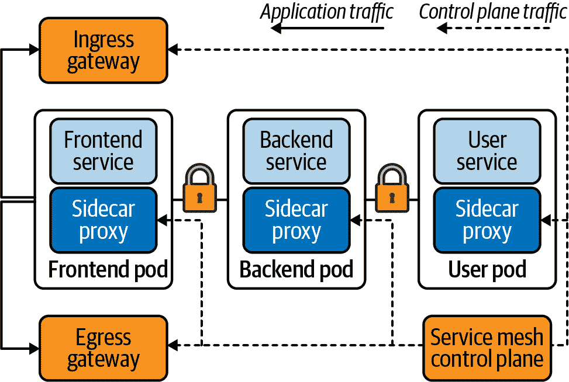

###### 图 5-8\. 服务网格组件

流量根据组件或流量的目的地处理不同。进出集群的流量由网关管理。前端、后端和用户服务之间的流量都使用双向 TLS（mTLS）进行加密，并由服务网格处理。即使控制平面关闭且无法更新网格，服务和应用程序流量也不会受到影响。

在部署服务网格时有几个选项可供选择；以下是其中几个要点：

+   Istio

    +   使用带有 Envoy 代理的 Go 控制平面。

    +   这是一个由 Lyft 最初发布的基于 Kubernetes 的本地解决方案。

+   Consul

    +   使用 HashiCorp Consul 作为控制平面。

    +   Consul Connect 在每个节点上安装一个代理作为 DaemonSet，它与处理流量路由和转发的 Envoy Sidecar 代理通信。

+   AWS App Mesh

    +   这是 AWS 管理的解决方案，实现了自己的控制平面。

    +   没有 mTLS 或流量策略。

    +   使用 Envoy 代理作为数据平面。

+   Linkerd

    +   Linkerd 代理也使用 Go 控制平面。

    +   没有流量转移和分布式跟踪。

    +   是一个仅限于 Kubernetes 的解决方案，这导致移动部件较少，意味着 Linkerd 总体上复杂性较低。

我们认为服务网格的最佳用例是服务之间的 mTLS。开发人员的其他高级用例包括断路器和 API 的故障测试。对于网络管理员来说，可以使用服务网格部署高级路由策略和算法。

让我们看一个服务网格的例子。如果您还没有安装，请首先[安装 Linkerd CLI](https://oreil.ly/jVaPm)。

如果您使用 Mac，您可以选择 cURL、bash 或 brew：

```
curl -sL https://run.linkerd.io/install | sh

OR

brew install linkerd

linkerd version
Client version: stable-2.9.2
Server version: unavailable
```

这个预检查列表将验证我们的集群是否能运行 Linkerd：

```
 linkerd check --pre
kubernetes-api
--------------
√ can initialize the client
√ can query the Kubernetes API

kubernetes-version
------------------
√ is running the minimum Kubernetes API version
√ is running the minimum kubectl version

pre-kubernetes-setup
--------------------
√ control plane namespace does not already exist
√ can create non-namespaced resources
√ can create ServiceAccounts
√ can create Services
√ can create Deployments
√ can create CronJobs
√ can create ConfigMaps
√ can create Secrets
√ can read Secrets
√ can read extension-apiserver-authentication configmap
√ no clock skew detected

pre-kubernetes-capability
-------------------------
√ has NET_ADMIN capability
√ has NET_RAW capability

linkerd-version
---------------
√ can determine the latest version
√ cli is up-to-date

Status check results are √
```

Linkerd CLI 工具可以将 Linkerd 安装到我们的 KIND 集群中：

```
linkerd install | kubectl apply -f -
namespace/linkerd created
clusterrole.rbac.authorization.k8s.io/linkerd-linkerd-identity created
clusterrolebinding.rbac.authorization.k8s.io/linkerd-linkerd-identity created
serviceaccount/linkerd-identity created
clusterrole.rbac.authorization.k8s.io/linkerd-linkerd-controller created
clusterrolebinding.rbac.authorization.k8s.io/linkerd-linkerd-controller created
serviceaccount/linkerd-controller created
clusterrole.rbac.authorization.k8s.io/linkerd-linkerd-destination created
clusterrolebinding.rbac.authorization.k8s.io/linkerd-linkerd-destination created
serviceaccount/linkerd-destination created
role.rbac.authorization.k8s.io/linkerd-heartbeat created
rolebinding.rbac.authorization.k8s.io/linkerd-heartbeat created
serviceaccount/linkerd-heartbeat created
role.rbac.authorization.k8s.io/linkerd-web created
rolebinding.rbac.authorization.k8s.io/linkerd-web created
clusterrole.rbac.authorization.k8s.io/linkerd-linkerd-web-check created
clusterrolebinding.rbac.authorization.k8s.io/linkerd-linkerd-web-check created
clusterrolebinding.rbac.authorization.k8s.io/linkerd-linkerd-web-admin created
serviceaccount/linkerd-web created
customresourcedefinition.apiextensions.k8s.io/serviceprofiles.linkerd.io created
customresourcedefinition.apiextensions.k8s.io/trafficsplits.split.smi-spec.io
created
clusterrole.rbac.authorization.k8s.io/linkerd-linkerd-proxy-injector created
clusterrolebinding.rbac.authorization.k8s.io/linkerd-linkerd-proxy-injector
created
serviceaccount/linkerd-proxy-injector created
secret/linkerd-proxy-injector-k8s-tls created
mutatingwebhookconfiguration.admissionregistration.k8s.io
 /linkerd-proxy-injector-webhook-config created
clusterrole.rbac.authorization.k8s.io/linkerd-linkerd-sp-validator created
clusterrolebinding.rbac.authorization.k8s.io/linkerd-linkerd-sp-validator
created
serviceaccount/linkerd-sp-validator created
secret/linkerd-sp-validator-k8s-tls created
validatingwebhookconfiguration.admissionregistration.k8s.io
 /linkerd-sp-validator-webhook-config created
clusterrole.rbac.authorization.k8s.io/linkerd-linkerd-tap created
clusterrole.rbac.authorization.k8s.io/linkerd-linkerd-tap-admin created
clusterrolebinding.rbac.authorization.k8s.io/linkerd-linkerd-tap created
clusterrolebinding.rbac.authorization.k8s.io/linkerd-linkerd-tap-auth-delegator
created
serviceaccount/linkerd-tap created
rolebinding.rbac.authorization.k8s.io/linkerd-linkerd-tap-auth-reader created
secret/linkerd-tap-k8s-tls created
apiservice.apiregistration.k8s.io/v1alpha1.tap.linkerd.io created
podsecuritypolicy.policy/linkerd-linkerd-control-plane created
role.rbac.authorization.k8s.io/linkerd-psp created
rolebinding.rbac.authorization.k8s.io/linkerd-psp created
configmap/linkerd-config created
secret/linkerd-identity-issuer created
service/linkerd-identity created
service/linkerd-identity-headless created
deployment.apps/linkerd-identity created
service/linkerd-controller-api created
deployment.apps/linkerd-controller created
service/linkerd-dst created
service/linkerd-dst-headless created
deployment.apps/linkerd-destination created
cronjob.batch/linkerd-heartbeat created
service/linkerd-web created
deployment.apps/linkerd-web created
deployment.apps/linkerd-proxy-injector created
service/linkerd-proxy-injector created
service/linkerd-sp-validator created
deployment.apps/linkerd-sp-validator created
service/linkerd-tap created
deployment.apps/linkerd-tap created
serviceaccount/linkerd-grafana created
configmap/linkerd-grafana-config created
service/linkerd-grafana created
deployment.apps/linkerd-grafana created
clusterrole.rbac.authorization.k8s.io/linkerd-linkerd-prometheus created
clusterrolebinding.rbac.authorization.k8s.io/linkerd-linkerd-prometheus created
serviceaccount/linkerd-prometheus created
configmap/linkerd-prometheus-config created
service/linkerd-prometheus created
deployment.apps/linkerd-prometheus created
secret/linkerd-config-overrides created
```

与入口控制器和 MetalLB 一样，我们可以看到许多组件安装在我们的集群中。

Linkerd 可以使用`linkerd check`命令验证安装。

它将验证 Linkerd 安装的大量检查，包括但不限于 Kubernetes API 版本、控制器、Pod 和配置以运行 Linkerd，以及运行 Linkerd 所需的所有服务、版本和 API：

```
linkerd check
kubernetes-api
--------------
√ can initialize the client
√ can query the Kubernetes API

kubernetes-version
------------------
√ is running the minimum Kubernetes API version
√ is running the minimum kubectl version

linkerd-existence
-----------------
√ 'linkerd-config' config map exists
√ heartbeat ServiceAccount exists
√ control plane replica sets are ready
√ no unschedulable pods
√ controller pod is running
√ can initialize the client
√ can query the control plane API

linkerd-config
--------------
√ control plane Namespace exists
√ control plane ClusterRoles exist
√ control plane ClusterRoleBindings exist
√ control plane ServiceAccounts exist
√ control plane CustomResourceDefinitions exist
√ control plane MutatingWebhookConfigurations exist
√ control plane ValidatingWebhookConfigurations exist
√ control plane PodSecurityPolicies exist

linkerd-identity
----------------
√ certificate config is valid
√ trust anchors are using supported crypto algorithm
√ trust anchors are within their validity period
√ trust anchors are valid for at least 60 days
√ issuer cert is using supported crypto algorithm
√ issuer cert is within its validity period
√ issuer cert is valid for at least 60 days
√ issuer cert is issued by the trust anchor

linkerd-webhooks-and-apisvc-tls
-------------------------------
√ tap API server has valid cert
√ tap API server cert is valid for at least 60 days
√ proxy-injector webhook has valid cert
√ proxy-injector cert is valid for at least 60 days
√ sp-validator webhook has valid cert
√ sp-validator cert is valid for at least 60 days

linkerd-api
-----------
√ control plane pods are ready
√ control plane self-check
√ [kubernetes] control plane can talk to Kubernetes
√ [prometheus] control plane can talk to Prometheus
√ tap api service is running

linkerd-version
---------------
√ can determine the latest version
√ cli is up-to-date

control-plane-version
---------------------
√ control plane is up-to-date
√ control plane and cli versions match

linkerd-prometheus
------------------
√ prometheus add-on service account exists
√ prometheus add-on config map exists
√ prometheus pod is running

linkerd-grafana
---------------
√ grafana add-on service account exists
√ grafana add-on config map exists
√ grafana pod is running

Status check results are √
```

现在我们的 Linkerd 安装看起来一切正常，我们可以将我们的应用程序添加到服务网格中：

```
kubectl -n linkerd get deploy
NAME                     READY   UP-TO-DATE   AVAILABLE   AGE
linkerd-controller       1/1     1            1           3m17s
linkerd-destination      1/1     1            1           3m17s
linkerd-grafana          1/1     1            1           3m16s
linkerd-identity         1/1     1            1           3m17s
linkerd-prometheus       1/1     1            1           3m16s
linkerd-proxy-injector   1/1     1            1           3m17s
linkerd-sp-validator     1/1     1            1           3m17s
linkerd-tap              1/1     1            1           3m17s
linkerd-web              1/1     1            1           3m17s
```

让我们打开 Linkerd 控制台，调查我们刚刚部署的内容。我们可以使用 `linkerd dashboard &` 启动控制台。

这将把控制台代理到我们的本地机器上，位于 `http://localhost:50750` 可用：

```
linkerd viz install | kubectl apply -f -
linkerd viz dashboard
Linkerd dashboard available at:
http://localhost:50750
Grafana dashboard available at:
http://localhost:50750/grafana
Opening Linkerd dashboard in the default browser
```

###### 提示

如果您在访问仪表板时遇到问题，可以运行 `linkerd viz check` 并在 Linkerd [文档](https://oreil.ly/MqgAp) 中找到更多帮助。

我们可以在 图 5-9 中看到之前练习中部署的所有对象。

我们的 ClusterIP 服务不是 Linkerd 服务网格的一部分。我们需要使用代理注入器将我们的服务添加到网格中。它通过观察可以添加到 pod 规范中的特定注释来实现这一点，可以通过 Linkerd 的 `inject` 或手动方式添加。

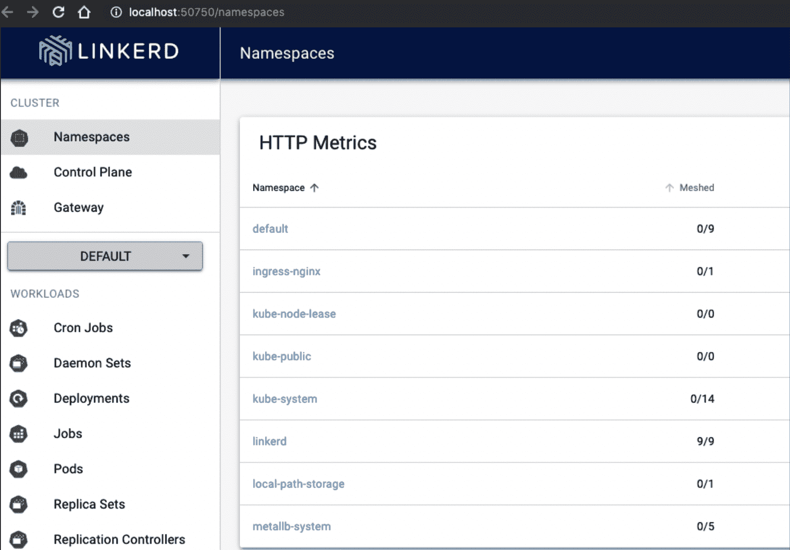

###### 图 5-9\. Linkerd 仪表板

让我们清理一些旧练习资源，以便更清晰：

```
kubectl delete -f ingress-example-2.yaml
deployment.apps "app2" deleted
service "clusterip-service-2" deleted
ingress.extensions "ingress-resource-2" deleted

kubectl delete pods app-5586fc9d77-7frts
pod "app-5586fc9d77-7frts" deleted

kubectl delete -f ingress-rule.yaml
ingress.extensions "ingress-resource" deleted
```

我们可以使用 Linkerd CLI 将适当的注释注入到我们的部署规范中，以便它成为网格的一部分。

我们首先需要获取我们的应用程序清单，`cat web.yaml`，然后使用 Linkerd 将注释注入，`linkerd inject -`，最后将它们应用回 Kubernetes API，`kubectl apply -f -`：

```
cat web.yaml | linkerd inject - | kubectl apply -f -

deployment "app" injected

deployment.apps/app configured
```

如果我们描述我们的应用部署，我们可以看到 Linkerd 为我们注入了新的注释，`注释: linkerd.io/inject: enabled`：

```
kubectl describe deployment app
Name:                   app
Namespace:              default
CreationTimestamp:      Sat, 30 Jan 2021 13:48:47 -0500
Labels:                 <none>
Annotations:            deployment.kubernetes.io/revision: 3
Selector:               app=app
Replicas:               1 desired | 1 updated | 1 total | 1 available |
0 unavailable
StrategyType:           RollingUpdate
MinReadySeconds:        0
RollingUpdateStrategy:  25% max unavailable, 25% max surge
Pod Template:
  Labels:       app=app
  Annotations:  linkerd.io/inject: enabled
  Containers:
   go-web:
    Image:      strongjz/go-web:v0.0.6
    Port:       8080/TCP
    Host Port:  0/TCP
    Liveness:   http-get http://:8080/healthz delay=5s timeout=1s period=5s
    Readiness:  http-get http://:8080/ delay=5s timeout=1s period=5s
    Environment:
      MY_NODE_NAME:             (v1:spec.nodeName)
      MY_POD_NAME:              (v1:metadata.name)
      MY_POD_NAMESPACE:         (v1:metadata.namespace)
      MY_POD_IP:                (v1:status.podIP)
      MY_POD_SERVICE_ACCOUNT:   (v1:spec.serviceAccountName)
      DB_HOST:                 postgres
      DB_USER:                 postgres
      DB_PASSWORD:             mysecretpassword
      DB_PORT:                 5432
    Mounts:                    <none>
  Volumes:                     <none>
Conditions:
 Type           Status  Reason
 ----           ------  ------
 Available      True    MinimumReplicasAvailable
 Progressing    True    NewReplicaSetAvailable
OldReplicaSets:  <none>
NewReplicaSet:   app-78dfbb4854 (1/1 replicas created)
Events:
 Type   Reason            Age   From                   Message
 ----   ------            ----  ----                   -------
 Normal ScalingReplicaSet 4m4s  deployment-controller  Scaled down app-5586fc9d77
 Normal ScalingReplicaSet 4m4s  deployment-controller  Scaled up app-78dfbb4854
 Normal Injected          4m4s  linkerd-proxy-injector Linkerd sidecar injected
 Normal ScalingReplicaSet 3m54s deployment-controller  Scaled app-5586fc9d77
```

如果我们在仪表板中导航到应用程序，我们可以看到我们的部署现在是 Linkerd 服务网格的一部分，如 图 5-10 所示。

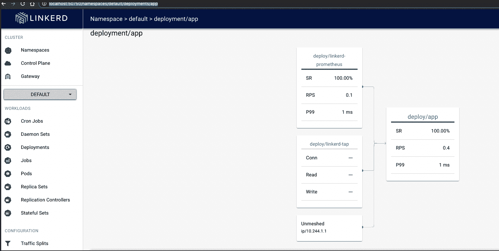

###### 图 5-10\. Web 应用部署 Linkerd 仪表板

CLI 还可以为我们显示统计信息：

```
linkerd stat deployments -n default
NAME  MESHED  SUCCESS    RPS LATENCY_P50 LATENCY_P95 LATENCY_P99 TCP_CONN
app      1/1  100.00% 0.4rps         1ms         1ms         1ms              1
```

再次，让我们扩展我们的部署：

```
kubectl scale deploy app --replicas 10
deployment.apps/app scaled
```

在 图 5-11 中，我们导航到 Web 浏览器并打开 [此链接](https://oreil.ly/qQx9T)，这样我们就可以实时查看统计数据。选择默认的命名空间，在资源中选择我们的部署/应用。然后点击“为 Web 启动”以开始显示指标。

在单独的终端中，让我们使用 `netshoot` 镜像，但这次在我们的 KIND 集群内运行：

```
kubectl run tmp-shell --rm -i --tty --image nicolaka/netshoot -- /bin/bash
If you don't see a command prompt, try pressing enter.
bash-5.0#
```

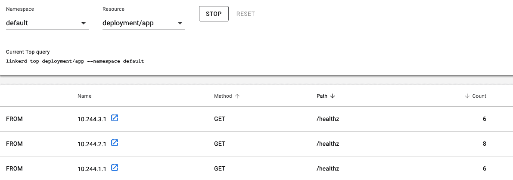

###### 图 5-11\. Web 应用仪表板

让我们发送几百个查询，查看统计数据：

```
bash-5.0#for i in `seq 1 100`;
do curl http://clusterip-service/host && sleep 2;
done
```

在我们的终端中，我们可以看到所有的存活探针、就绪探针以及我们的 `/host` 请求。

`tmp-shell` 是我们的 `netshoot` bash 终端，其中运行着我们的 `for` 循环。

`10.244.2.1`、`10.244.3.1` 和 `10.244.2.1` 是运行我们探测的主机的 Kubelet：

```
linkerd viz stat deploy
NAME   MESHED   SUCCESS     RPS  LATENCY_P50  LATENCY_P95  LATENCY_P99  TCP_CONN
app       1/1   100.00%  0.7rps          1ms          1ms          1ms         3
```

我们的示例仅展示了服务网格的可观察功能。Linkerd、Istio 等等还有许多可用于开发人员和网络管理员控制、监控和故障排除集群网络内运行服务的选项。与入口控制器一样，提供了许多选项和功能。由您和您的团队决定哪些功能和特性对您的网络重要。

# 结论

Kubernetes 网络世界功能丰富，团队可以通过多种选项部署、测试和管理其 Kubernetes 集群。每个新的添加都会给集群操作增加复杂性和开销。我们已经为开发人员、网络管理员和系统管理员提供了 Kubernetes 提供的抽象视图。

从内部流量到集群外部流量，团队必须选择最适合其工作负载的抽象方法。这并不是一件小事，现在你已经掌握了开始这些讨论的知识。

在我们的下一章中，我们将把我们的 Kubernetes 服务和网络学习带到云端！我们将探索每个云提供商提供的网络服务，并了解它们如何集成到其 Kubernetes 管理服务中。
