# 第六章：Kubernetes 和云网络

云及其服务的使用增长迅速：77% 的企业在某种程度上使用公共云，81% 可以比本地更快地进行创新。随着云中的流行和创新，将 Kubernetes 运行在云中是一个逻辑的步骤。每个主要云提供商都有其自己的托管 Kubernetes 服务，使用其云网络服务。

在本章中，我们将探讨主要云服务提供商 AWS、Azure 和 GCP 提供的网络服务，重点关注它们对在特定云环境中运行 Kubernetes 集群所需网络的影响。所有提供商还都有一个 CNI 项目，通过与其云网络 API 的集成视角，使运行 Kubernetes 集群更加顺畅，因此有必要探索这些 CNI。阅读本章后，管理员将了解云提供商如何在其云网络服务的基础上实现其托管 Kubernetes。

# Amazon Web Services

亚马逊网络服务（AWS）已经从简单队列服务（SQS）和简单存储服务（S3）扩展到超过 200 多种服务。Gartner 研究将 AWS 定位在其 2020 年云基础设施与平台服务的魔力象限图的领导者象限中。许多服务都建立在其他基础服务之上。例如，Lambda 使用 S3 进行代码存储，使用 DynamoDB 进行元数据存储。AWS CodeCommit 使用 S3 进行代码存储。EC2、S3 和 CloudWatch 集成到亚马逊弹性 MapReduce 服务中，创建一个托管数据平台。AWS 网络服务也是如此。高级服务如对等连接和端点使用核心网络基础组件构建。了解这些基础组件，这些组件使 AWS 能够构建全面的 Kubernetes 服务，对管理员和开发人员至关重要。

## AWS 网络服务

AWS 拥有许多服务，允许用户扩展和保护其云网络。Amazon Elastic Kubernetes Service（EKS）充分利用了 AWS 云中可用的这些网络组件。我们将讨论 AWS 网络组件的基础知识，以及它们与部署 EKS 集群网络的关系。本节还将讨论几种其他开源工具，这些工具使集群和应用程序部署变得简单。第一个是`eksctl`，这是一个 CLI 工具，用于部署和管理 EKS 集群。正如我们在之前的章节中所看到的，运行集群需要许多组件，在 AWS 网络中也是如此。`eksctl`将为集群和网络管理员在 AWS 中部署所有组件。接下来，我们将讨论 AWS VPC CNI，它允许集群使用原生的 AWS 服务来扩展 Pod 并管理其 IP 地址空间。最后，我们将研究 AWS 应用负载均衡器入口控制器，它自动化、管理和简化了在 AWS 网络上运行应用程序负载均衡器和入口的部署。

### 虚拟私有云

AWS 网络的基础是虚拟私有云（VPC）。大多数 AWS 资源将在 VPC 内部工作。VPC 网络是由管理员定义的孤立虚拟网络，仅用于其帐户及其资源。在图 6-1 中，我们可以看到一个 VPC，其定义了一个 CIDR 为`192.168.0.0/16`的单一范围。VPC 内的所有资源将使用该范围的私有 IP 地址。AWS 不断增强其服务提供；现在，网络管理员可以在 VPC 中使用多个不重叠的 CIDR。Pod IP 地址也将来自 VPC CIDR 和主机 IP 地址；关于这一点更多内容请参阅“AWS VPC CNI”。每个 AWS 区域设置一个 VPC；您可以在每个区域拥有多个 VPC，但 VPC 仅在一个区域中定义。


###### 图 6-1\. AWS 虚拟私有云

### 区域和可用区

AWS 资源是由边界定义的，例如全局、区域或可用区。AWS 网络包括多个区域；每个 AWS 区域由多个隔离且物理上分离的可用区（AZ）组成，位于地理区域内。一个 AZ 可以包含多个数据中心，如图 6-2 所示。一些区域可能包含六个 AZ，而较新的区域可能只包含两个。每个 AZ 直接连接到其他 AZ，但与另一个 AZ 的故障是隔离的。这种设计对于多个原因都很重要：高可用性、负载均衡和子网都会受到影响。在一个区域中，负载均衡器将通过多个 AZ 路由流量，这些 AZ 有单独的子网，因此为应用程序提供了高可用性。

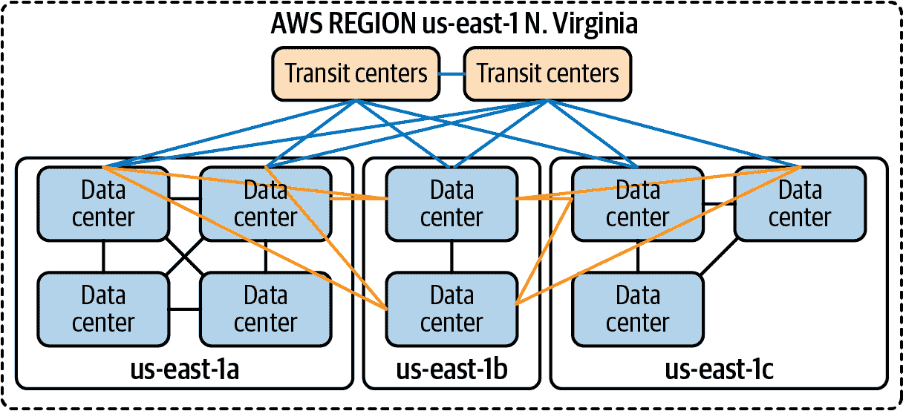

###### 图 6-2\. AWS 区域网络布局

###### 注意

AWS 区域和 AZ 的最新列表可以在[文档](https://oreil.ly/gppRp)中找到。

### 子网

VPC 由多个子网组成，这些子网来自 CIDR 范围并部署到单个 AZ。需要高可用性的应用程序应在多个 AZ 中运行，并且可以使用任何可用的负载均衡器进行负载平衡，如“区域和可用区”中讨论的。

如果路由表有通往互联网网关的路由，则子网是公共的。在图 6-3 中，有三个公共子网和私有子网。私有子网没有直接通往互联网的路由。这些子网用于内部网络流量，如数据库。在部署网络架构时，VPC CIDR 范围的大小和公共与私有子网的数量是设计考虑因素。VPC 最近的改进允许多个 CIDR 范围，有助于减少设计选择不良的影响，因为现在网络工程师可以简单地向预配的 VPC 添加另一个 CIDR 范围。

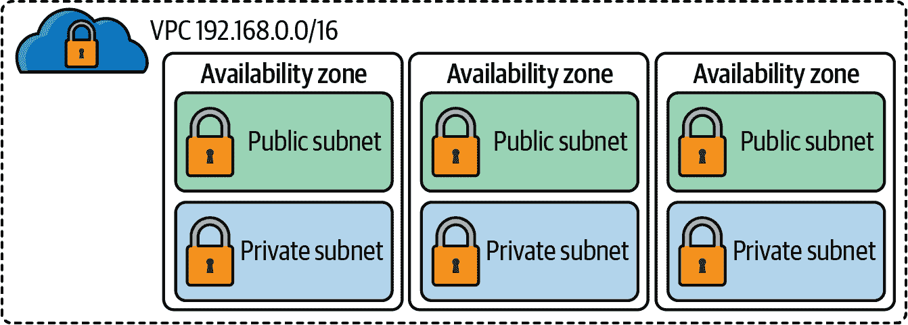

###### 图 6-3\. VPC 子网

让我们讨论那些有助于定义子网是公共还是私有的组件。

### 路由表

每个子网恰好与一个路由表关联。如果未明确关联，则主路由表是默认的路由表。在 VPC 内部部署应用程序的开发人员必须了解如何操作路由表，以确保流量按预期流动。

以下是主路由表的规则：

+   主路由表无法删除。

+   网关路由表不能设为主路由表。

+   主路由表可以替换为自定义路由表。

+   管理员可以在主路由表中添加、移除和修改路由。

+   本地路由是最具体的。

+   子网可以明确关联到主路由表。

有特定目标的路由表；以下是它们的列表及其区别的描述：

主路由表

此路由表自动控制未明确关联到任何其他路由表的所有子网的路由。

自定义路由表

网络工程师为特定应用程序流量创建和定制的路由表。

边缘关联

用于将入站 VPC 流量路由至边缘设备的路由表。

子网路由表

与子网相关联的路由表。

网关路由表

与互联网网关或虚拟专用网关相关联的路由表。

每个路由表有几个组件确定其职责：

路由表关联

路由表与子网、互联网网关或虚拟专用网关之间的关联。

规则

定义表的路由条目列表；每条规则都有目标、目的地、状态和传播标志。

目的地

想要传输流量的 IP 地址范围（目标 CIDR）。

目标

发送目标流量的网关、网络接口或连接；例如，互联网网关。

状态

路由表中路由的状态：活动或黑洞。黑洞状态表示路由的目标不可用。

传播

路由传播允许虚拟私有网关自动向路由表传播路由。此标志指示您该路由是否通过传播添加。

本地路由

用于 VPC 内部通信的默认路由。

在图 6-4 中，路由表中有两条路由。所有目标为`11.0.0.0/16`的流量保持在 VPC 内的本地网络上。所有其他流量，`0.0.0.0/0`，都经由 Internet 网关`igw-f43c4690`到达，使其成为公共子网。

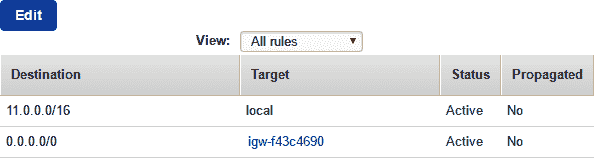

###### 图 6-4\. 路由表

### 弹性网络接口

弹性网络接口（ENI）是 VPC 中的一个逻辑网络组件，相当于虚拟网络卡。ENI 包含一个 IP 地址，用于实例，它们在弹性上意味着可以在保留其属性的同时关联和取消关联到实例。

ENI 具有以下属性：

+   主要私有 IPv4 地址

+   次要私有 IPv4 地址

+   每个私有 IPv4 地址一个弹性 IP（EIP）地址

+   在启动实例时，可以将一个公共 IPv4 地址自动分配给网络接口`eth0`。

+   一个或多个 IPv6 地址

+   一个或多个安全组

+   MAC 地址

+   源/目标检查标志

+   描述

ENI 的一个常见用例是创建仅从公司网络访问的管理网络。AWS 服务如 Amazon WorkSpaces 使用 ENI 允许访问客户 VPC 和 AWS 管理的 VPC。Lambda 可以通过提供并附加到 ENI 来访问 VPC 内的资源，如数据库。

在本节后面，我们将看到 AWS VPC CNI 如何与 IP 地址一起使用和管理 ENI。

### 弹性 IP 地址

EIP 地址是用于 AWS 云中动态网络寻址的静态公共 IPv4 地址。EIP 与任何 VPC 中的任何实例或网络接口相关联。借助 EIP，应用程序开发人员可以通过将地址重新映射到另一个实例来掩盖实例的故障。

EIP 地址是 ENI 的属性，并通过更新附加到实例的 ENI 与实例关联。将 EIP 与 ENI 关联而不是直接与实例关联的优势在于，所有网络接口属性可以一次性从一个实例移动到另一个实例。

以下规则适用：

+   一个 EIP 地址一次可以与单个实例或网络接口关联。

+   EIP 地址可以从一个实例或网络接口迁移到另一个实例。

+   最多五个 EIP 地址的（软）限制。

+   不支持 IPv6。

类似 NAT 和 Internet 网关的服务使用 EIP 以保持 AZ 之间的一致性。其他网关服务（如堡垒）可以从使用 EIP 中受益。子网可以自动为 EC2 实例分配公共 IP 地址，但该地址可能会更改；使用 EIP 可以防止这种情况发生。

### 安全控制

AWS 网络中有两个基本安全控制：安全组和网络访问控制列表（NACL）。根据我们的经验，许多问题源于安全组和 NACL 的配置错误。开发人员和网络工程师需要理解两者之间的区别以及对它们的更改影响。

#### 安全组

安全组在实例或网络接口级别操作，并充当这些设备的防火墙。安全组是一组需要彼此和网络上其他设备共享网络访问的网络设备。在图 6-5 中，我们可以看到安全组跨 AZ 运行。安全组有两张表，用于入站和出站流量。安全组是有状态的，因此如果允许入站流量，则允许出站流量。每个安全组都有一系列规则，定义了流量的过滤器。在做出转发决策之前，会评估每条规则。

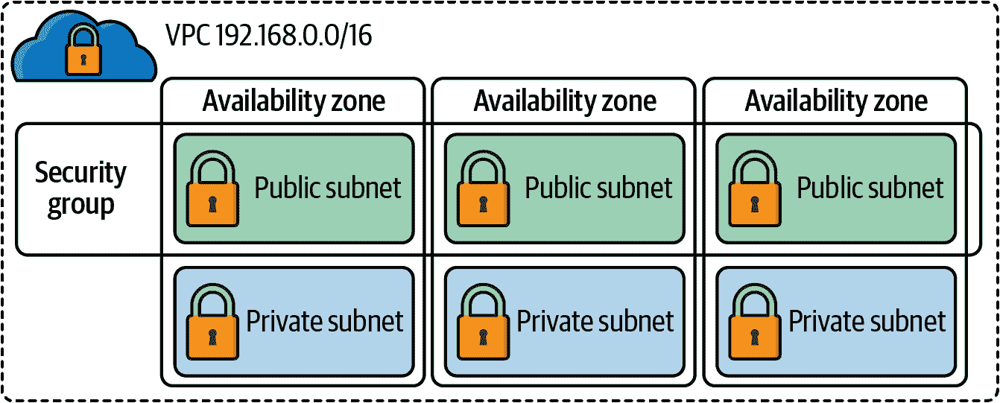

###### 图 6-5. 安全组

以下是安全组规则组件的列表：

源/目的地

流量检查的源（入站规则）或目的地（出站规则）：

+   IPv4 或 IPv6 地址的个体或范围

+   另一个安全组

+   其他 ENIs、网关或接口

协议

被过滤的第 4 层协议是哪个，6（TCP），17（UDP）和 1（ICMP）

端口范围

正在过滤的协议的特定端口

描述

用户定义字段，以通知其他人安全组的意图

安全组类似于我们在前几章中讨论的 Kubernetes 网络策略。它们是一种基本的网络技术，应始终用于保护 AWS VPC 中的实例。EKS 部署了几个安全组，用于 AWS 管理的数据平面与您的工作节点之间的通信。

#### 网络访问控制列表

网络访问控制列表的操作方式与其他防火墙中的操作方式类似，因此网络工程师将熟悉它们。在图 6-6 中，您可以看到每个子网都有一个默认的 NACL 与之关联，并且与 AZ 绑定，与安全组不同。过滤规则必须在两个方向上明确定义。默认规则非常宽松，允许在两个方向上的所有流量。用户可以为子网定义自己的 NACL 以增加安全层级，如果安全组过于开放。默认情况下，自定义 NACL 会拒绝所有流量，因此在部署时添加规则；否则，实例将失去连接。

这是 NACL 的组成部分：

规则编号

规则从编号最低的规则开始评估。

类型

交通类型，如 SSH 或 HTTP。

协议

任何具有标准协议号的协议：TCP/UDP 或 ALL。

端口范围

流量的监听端口或端口范围。例如，HTTP 流量的 80 端口。

来源

仅入站规则；流量的 CIDR 范围源。

目的地

只有出站规则；流量的目的地。

允许/拒绝

是否允许或拒绝指定的流量。

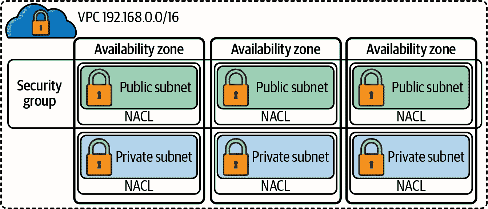

###### 图 6-6\. NACL

NACL 为可能受保护免于安全组缺乏或配置错误的子网增加了一层额外的安全性。

表 6-1 总结了安全组和网络 ACL 之间的基本区别。

表 6-1\. 安全组和 NACL 比较表

| 安全组 | 网络 ACL |
| --- | --- |
| 操作在实例级别。 | 操作在子网级别。 |
| 仅支持允许规则。 | 支持允许和拒绝规则。 |
| 有状态：返回流量始终允许，不受任何规则限制。 | 无状态：返回流量必须按规则显式允许。 |
| 所有规则在进行转发决策之前都会被评估。 | 规则按顺序处理，从最低编号规则开始。 |
| 适用于实例或网络接口。 | 所有规则适用于其关联的所有子网中的所有实例。 |

了解 NACL 和安全组之间的区别至关重要。由于安全组未允许特定端口上的流量或某人未在 NACL 上添加出站规则，AWS 网络连接问题经常会出现。在排除 AWS 网络问题时，开发人员和网络工程师都应该将这些组件添加到其排查列表中进行检查。

到目前为止，我们讨论的所有组件都管理 VPC 内部的流量。以下服务管理来自客户请求进入 VPC 并最终到运行在 Kubernetes 集群内的应用程序的流量：网络地址转换设备、互联网网关和负载均衡器。让我们深入了解一下这些服务。

### 网络地址转换设备

当 VPC 内部的实例需要互联网连接，但不能直接连接到实例时，使用网络地址转换（NAT）设备。应该运行在 NAT 设备后面的实例的示例包括数据库实例或其他中间件，这些中间件需要运行应用程序。

在 AWS 中，网络工程师有几种选项可以运行 NAT 设备。他们可以管理自己部署的 EC2 实例作为 NAT 设备，也可以使用 AWS 托管服务 NAT 网关（NAT GW）。无论选择哪种方式，都需要在多个可用区部署公共子网以实现高可用性和 EIP。NAT GW 的限制是部署后其 IP 地址不能更改。此外，该 IP 地址将是与互联网网关通信时使用的源 IP 地址。

在 图 6-7 中的 VPC 路由表中，我们可以看到两个路由表的存在，以建立到互联网的连接。主路由表有两条规则，一个是用于 VPC 内部的本地路由，另一个是目标为 NAT GW ID 的 `0.0.0.0/0` 路由。私有子网的数据库服务器将通过其路由表中的 NAT GW 规则路由流量到互联网。

EKS 中的 Pod 和实例将需要流出 VPC，因此必须部署 NAT 设备。您选择的 NAT 设备将取决于网络设计的操作开销、成本或可用性要求。

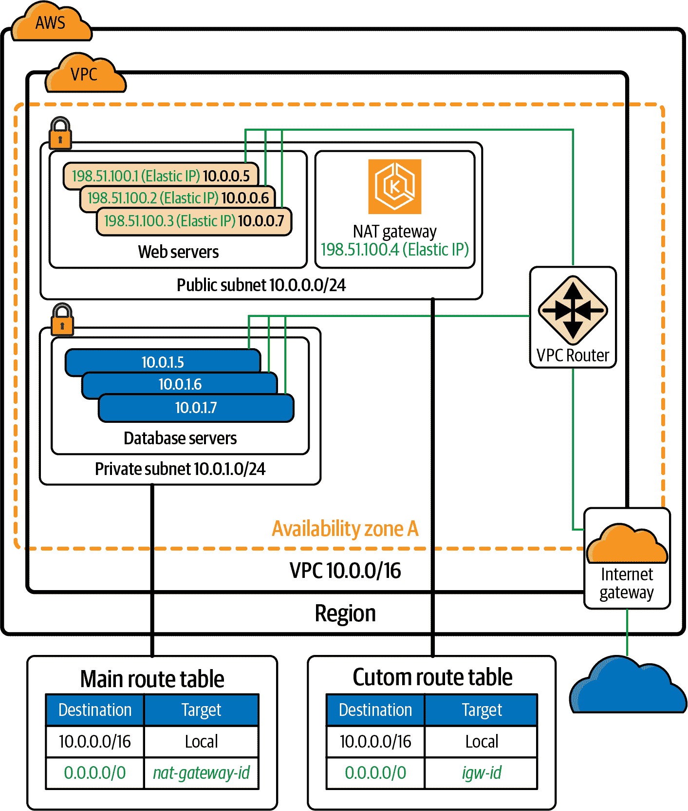

###### 图 6-7\. VPC 路由图

### 互联网网关

互联网网关是 VPC 网络中的 AWS 托管服务和设备，允许 VPC 中的所有设备连接到互联网。以下是确保在 VPC 中访问互联网的步骤：

1.  部署并附加一个互联网网关（IGW）到 VPC。

1.  在子网的路由表中定义一条路由，将互联网流量引导到互联网网关（IGW）。

1.  验证网络访问控制列表（NACLs）和安全组规则允许流向和从实例流动的流量。

所有这些都显示在 VPC 路由中，来自图 6-7。我们看到了为 VPC 部署的 IGW，一个自定义的路由表设置，将所有流量`0.0.0.0/0`路由到 IGW。Web 实例具有 IPv4 互联网可路由地址，`198.51.100.1-3`。

### 弹性负载均衡器

现在从互联网流入的流量，并且客户端可以请求访问运行在 VPC 内的应用程序，我们需要扩展和分发请求的负载。AWS 为开发者提供了几种选项，具体取决于应用程序负载和网络流量的需求。

弹性负载均衡器有四个选项：

经典

经典负载均衡器为 EC2 实例提供基本的负载均衡。它在请求和连接级别操作。经典负载均衡器功能有限，不适用于容器。

应用程序

应用程序负载均衡器具有第 7 层感知能力。流量路由是通过特定于请求的信息，如 HTTP 头或 HTTP 路径来进行的。应用程序负载均衡器与应用程序负载均衡器控制器一起使用。ALB 控制器允许开发人员无需使用控制台或 API，只需几行 YAML 代码即可自动化部署和管理 ALB。

网络

网络负载均衡器在第 4 层运行。流量可以基于传入 TCP/UDP 端口路由到运行该端口服务的个体主机。网络负载均衡器还允许管理员使用 EIP 部署它们，这是网络负载均衡器独有的功能。

网关

网关负载均衡器管理 VPC 级别的设备流量。可以使用网关负载均衡器处理的网络设备包括深度数据包检查或代理。网关负载均衡器被添加到 AWS 服务中，但不在 EKS 生态系统内使用。

AWS 负载均衡器在处理不仅限于容器的工作负载时具有几个重要属性：

规则

（仅 ALB）您为监听器定义的规则决定负载均衡器如何将所有请求路由到目标组中的目标。

监听器

检查来自客户端的请求。它们支持 HTTP 和 HTTPS 在端口 1-65535 上。

目标

EC2 实例、IP 地址、Pods 或运行应用程序代码的 Lambda。

目标组

用于将请求路由到注册的目标。

健康检查

确保目标仍能接受客户请求。

每个 ALB 的这些组件在图 6-8 中概述。当请求进入负载均衡器时，侦听器将持续检查是否有与其定义的协议和端口匹配的请求。每个侦听器都有一组规则，定义了如何处理请求。规则将有一个操作类型来确定如何处理请求：

authenticate-cognito

（HTTPS 侦听器）使用 Amazon Cognito 对用户进行身份验证。

authenticate-oidc

（HTTPS 侦听器）使用符合 OpenID Connect 的身份提供者对用户进行身份验证。

fixed-response

返回自定义 HTTP 响应。

forward

将请求转发到指定的目标组。

重定向

将请求从一个 URL 重定向到另一个 URL。

具有最低顺序值的动作首先执行。每个规则必须包括以下动作之一：转发、重定向或固定响应。在图 6-8 中，我们有目标组，这些组将成为我们转发规则的接收者。目标组中的每个目标都将进行健康检查，因此负载均衡器将知道哪些实例是健康且准备好接收请求。

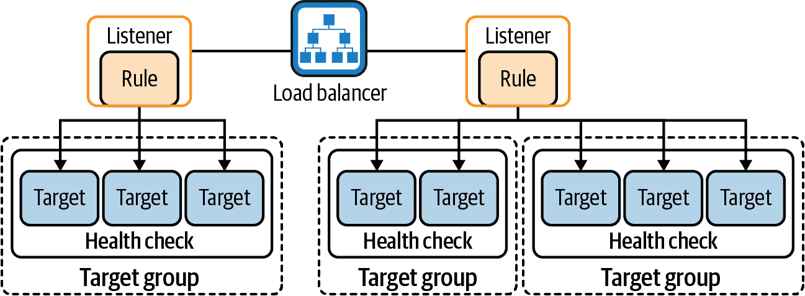

###### 图 6-8\. 负载均衡器组件

现在我们对 AWS 如何构建其网络组件有了基本的理解，我们可以开始看到 EKS 如何利用这些组件来构建和保护托管的 Kubernetes 集群和网络。

## Amazon Elastic Kubernetes Service

Amazon Elastic Kubernetes Service（EKS）是 AWS 的托管 Kubernetes 服务。它允许开发人员、集群管理员和网络管理员快速部署生产规模的 Kubernetes 集群。利用云的扩展性和 AWS 网络服务，一个 API 请求可以部署许多服务，包括我们在前面章节中审查的所有组件。

EKS 是如何实现这一点的？与 AWS 发布的任何新服务一样，EKS 变得功能更加丰富且易于使用。EKS 现在支持在 EKS Anywhere 上进行本地部署，在 EKS Fargate 上进行无服务器部署，甚至支持 Windows 节点。EKS 集群可以通过 AWS CLI 或控制台传统部署。`eksctl`是 Weaveworks 开发的命令行工具，迄今为止是部署运行 EKS 所需组件的最简单方法。我们的下一节将详细介绍运行 EKS 集群的要求以及`eksctl`如何为集群管理员和开发人员完成这一任务。

让我们讨论 EKS 集群网络的组件。

### EKS 节点

EKS 中的工作节点有三种类型：EKS 管理的节点组、自管理节点和 AWS Fargate。管理员的选择在于他们想要承担多少控制和运营开销。

管理的节点组

Amazon EKS 管理的节点组为您创建和管理 EC2 实例。所有托管节点都作为由 Amazon EKS 管理的 EC2 自动扩展组的一部分进行预配。所有资源，包括 EC2 实例和自动扩展组，都在您的 AWS 帐户内运行。托管节点组的自动扩展组跨越您创建组时指定的所有子网。

自管理节点组

Amazon EKS 节点在您的 AWS 帐户中运行，并通过 API 端点连接到集群的控制平面。您将节点部署到一个节点组中。节点组是部署在 EC2 自动扩展组中的 EC2 实例集合。节点组中的所有实例必须执行以下操作：

+   必须是相同的实例类型

+   必须运行相同的 Amazon Machine Image

+   使用相同的 Amazon EKS 节点 IAM 角色

Fargate

Amazon EKS 通过使用由 AWS 构建的控制器将 Kubernetes 与 AWS Fargate 集成，使用 Kubernetes 提供的上游可扩展模型。在 Fargate 上运行的每个 Pod 都有自己的隔离边界，不与另一个 Pod 共享底层内核、CPU、内存或弹性网络接口。您也不能使用安全组来管理运行在 Fargate 上的 Pod。

实例类型还影响集群网络。在 EKS 中，节点上可以运行的 Pod 数量由实例可以运行的 IP 地址数量定义。我们在 “AWS VPC CNI” 和 “eksctl” 中进一步讨论这个问题。

节点必须能够与 Kubernetes 控制平面和其他 AWS 服务进行通信。IP 地址空间对于运行 EKS 集群至关重要。节点、Pod 和所有其他服务将使用 VPC CIDR 地址范围进行组件通信。EKS VPC 需要一个 NAT 网关用于私有子网，并且这些子网需要标记以供 EKS 使用：

```
Key – kubernetes.io/cluster/<cluster-name>
Value – shared
```

每个节点的放置将决定 EKS 运行的网络“模式”；这对你的子网和 Kubernetes API 的流量路由有设计考量。

### EKS 模式

图 6-9 概述了 EKS 的组件。Amazon EKS 控制平面为每个集群在您的 VPC 中创建高达四个跨帐户弹性网络接口。EKS 使用两个 VPC，一个用于 Kubernetes 控制平面，包括 Kubernetes API 主节点、API 负载均衡器和根据网络模型的 etcd；另一个是客户 VPC，用于在其中运行您的 Pod 的 EKS 工作节点。在 EC2 实例的引导过程中，启动 Kubelet。节点的 Kubelet 将联系 Kubernetes 集群端点注册节点。它连接到 VPC 外的公共端点或 VPC 内的私有端点。`kubectl` 命令连接到 EKS VPC 中的 API 端点。最终用户可以访问运行在客户 VPC 中的应用程序。

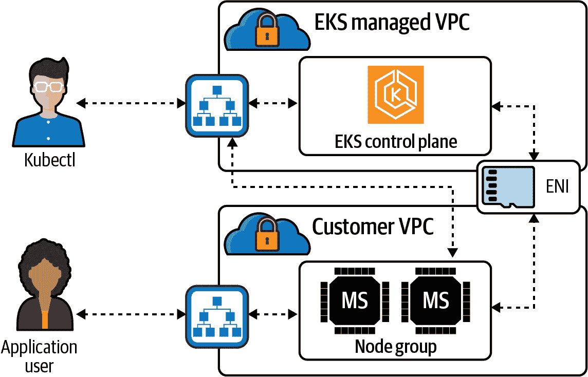

###### 图 6-9\. EKS 通信路径

根据 Kubernetes 组件的控制和数据平面运行位置，有三种配置 EKS 集群控制流量和 Kubernetes API 端点的方式。

网络模式如下：

仅公共

所有内容均在公共子网中运行，包括工作节点。

仅私有

仅在私有子网中运行，Kubernetes 无法创建面向 Internet 的负载均衡器。

混合

公共和私有的组合。

公共端点是默认选项；它是公共的，因为 API 端点的负载均衡器位于公共子网上，如 图 6-10 所示。来自集群 VPC 内的 Kubernetes API 请求（例如当工作节点连接到控制平面时）离开客户 VPC，但不离开 Amazon 网络。使用公共端点时需要考虑的一个安全问题是 API 端点位于公共子网上，并且可以通过 Internet 访问。

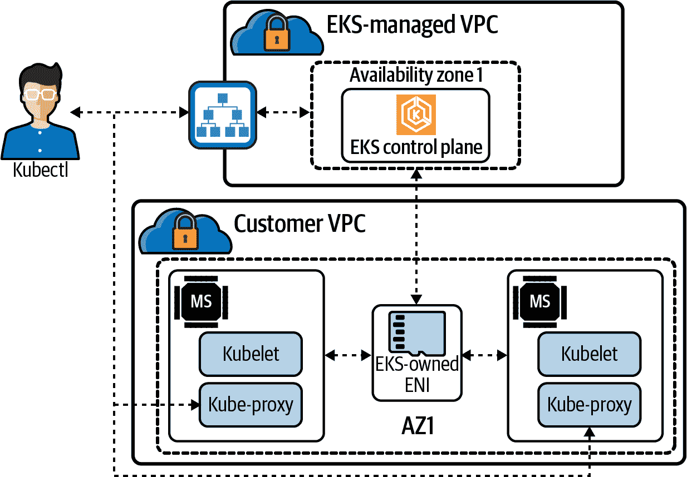

###### 图 6-10\. EKS 仅公共网络模式

图 6-11 显示了私有端点模式；所有访问集群 API 的流量必须来自集群的 VPC。API 服务器没有 Internet 访问权限；任何 `kubectl` 命令必须来自 VPC 内或连接的网络。集群的 API 端点通过公共 DNS 解析为 VPC 内的私有 IP 地址。

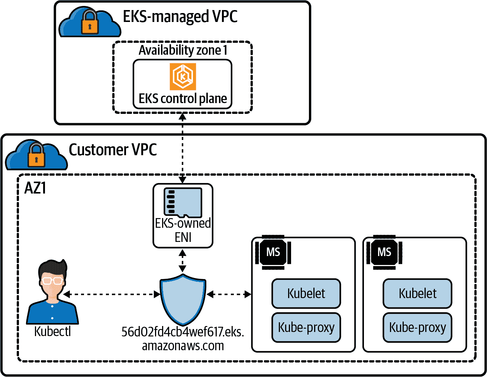

###### 图 6-11\. EKS 仅私有网络模式

当启用公共和私有端点时，从 VPC 内的任何 Kubernetes API 请求都通过客户 VPC 中的 EKS 管理的 ENI 与控制平面通信，如 图 6-12 所示。集群 API 仍可通过 Internet 访问，但可以使用安全组和 NACLs 进行限制。

###### 注意

请参阅 [AWS 文档](https://oreil.ly/mW7ii) 了解更多部署 EKS 的方法。

确定运行模式是管理员们需要做出的关键决策。它会影响应用程序流量、负载均衡器的路由以及集群的安全性。在 EKS 部署集群时，还有许多其他要求。`eksctl` 是一种工具，可以帮助管理所有这些要求。但是`eksctl` 是如何做到的呢？

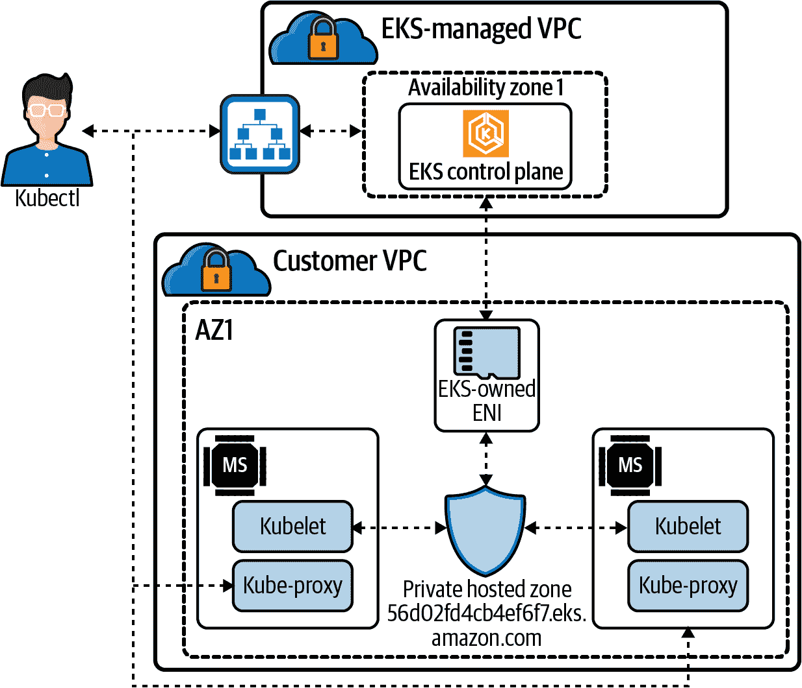

###### 图 6-12\. EKS 公共和私有网络模式

### eksctl

`eksctl` 是由 Weaveworks 开发的命令行工具，是部署运行 EKS 所需的所有组件最简单的方式。

###### 注意

关于 `eksctl` 的所有信息都可以在其 [网站](https://eksctl.io) 上找到。

`eksctl` 默认使用以下默认参数创建集群：

+   一个自动生成的集群名称

+   两个 m5.large 工作节点

+   使用官方 AWS EKS AMI

+   Us-west-2 默认的 AWS 区域

+   一个专用的 VPC

一个带有 192.168.0.0/16 CIDR 范围的专用 VPC，默认情况下，`eksctl` 将创建 8 个 /19 子网：三个私有子网、三个公共子网和两个保留子网。`eksctl` 还将部署一个 NAT GW，允许位于私有子网中的节点进行通信，并部署一个 Internet Gateway，以便访问所需的容器镜像和与 Amazon S3 以及 Amazon ECR API 的通信。

为 EKS 集群设置了两个安全组：

Ingress inter node group SG

允许节点在所有端口上彼此通信

控制平面安全组

允许控制平面和工作节点组之间的通信

公共子网中的节点组将禁用 SSH。初始节点组中的 EC2 实例会获得公共 IP，并且可以通过高级别端口进行访问。

默认情况下，一个包含两个 m5.large 节点的节点组是 `eksctl` 的默认设置。但是一个节点可以运行多少个 Pod 呢？AWS 提供了一个基于节点类型、接口数量和支持的 IP 地址数量的公式。该公式如下：

```
(Number of network interfaces for the instance type ×
(the number of IP addresses per network interface - 1)) + 2
```

使用上述公式和 `eksctl` 的默认实例大小，一个 m5.large 实例最多支持 29 个 Pod。

###### 警告

系统 Pod 会计入最大 Pod 数量。CNI 插件和 `kube-proxy` Pod 在集群中的每个节点上运行，因此您只能额外部署 27 个 Pod 到一个 m5.large 实例中。CoreDNS 也会在集群中的节点上运行，这进一步减少了节点可以运行的最大 Pod 数量。

运行集群的团队必须决定集群大小和实例类型，以确保不会因为节点和 IP 限制而导致部署问题。如果没有可用具有 Pod IP 地址的节点，Pod 将处于“等待”状态。EKS 节点组的扩展事件也可能触及 EC2 实例类型限制并引发级联问题。

所有这些网络选项都可以通过 `eksctl` 配置文件进行配置。

###### 注意

`eksctl` 中的 VPC 选项详见 [eksctl 文档](https://oreil.ly/m2Nqc)。

我们已经讨论过节点大小对于 Pod IP 地址分配及其可运行数量的重要性。一旦节点部署完成，AWS VPC CNI 将管理节点的 Pod IP 地址分配。让我们深入了解一下 CNI 的内部工作原理。

### AWS VPC CNI

AWS 有自己的 CNI 开源实现。AWS VPC CNI 用于 Kubernetes 插件在 AWS 网络上提供高吞吐量和可用性、低延迟以及最小的网络抖动。网络工程师可以应用现有的 AWS VPC 网络和安全最佳实践来构建在 AWS 上的 Kubernetes 集群。这包括使用像 VPC 流日志、VPC 路由策略和安全组进行网络流量隔离。

###### 注意

AWS VPC CNI 的开源代码可以在 [GitHub](https://oreil.ly/akwqx) 上找到。

AWS VPC CNI 有两个组成部分：

CNI 插件

当调用时，CNI 插件负责连接主机和 Pod 的网络堆栈。它还配置接口和虚拟以太网对。

ipamd

长时间运行的节点本地 IPAM 守护程序负责维护一组可用 IP 地址，并为 Pod 分配 IP 地址。

图 6-13 演示了 VPC CNI 对节点的影响。在 AWS 中，客户 VPC 在子网 10.200.1.0/24 中提供给我们此子网中的 250 个可用地址。我们的集群中有两个节点。在 EKS 中，托管节点作为守护进程运行 AWS CNI。在我们的示例中，每个节点只有一个运行的 pod，在 ENI 上有一个次要 IP 地址，即 `10.200.1.6` 和 `10.200.1.8`，分别对应每个 pod。当工作节点首次加入集群时，只有一个 ENI 及其所有地址在 ENI 中。当第三个 pod 被调度到节点 1 时，ipamd 为该 pod 分配 IP 地址。在这种情况下，`10.200.1.7` 是节点 2 上的 pod 4 的同样情况。

当工作节点首次加入集群时，只有一个 ENI 及其所有地址在 ENI 中。没有任何配置时，`ipamd` 总是尝试保持额外的一个 ENI。当节点上运行的多个 pod 数量超过单个 ENI 上的地址数量时，CNI 后端开始分配新的 ENI。CNI 插件通过为 EC2 实例分配多个 ENI，然后将次要 IP 地址附加到这些 ENI 上来工作。此插件允许 CNI 尽可能多地为每个实例分配 IP。

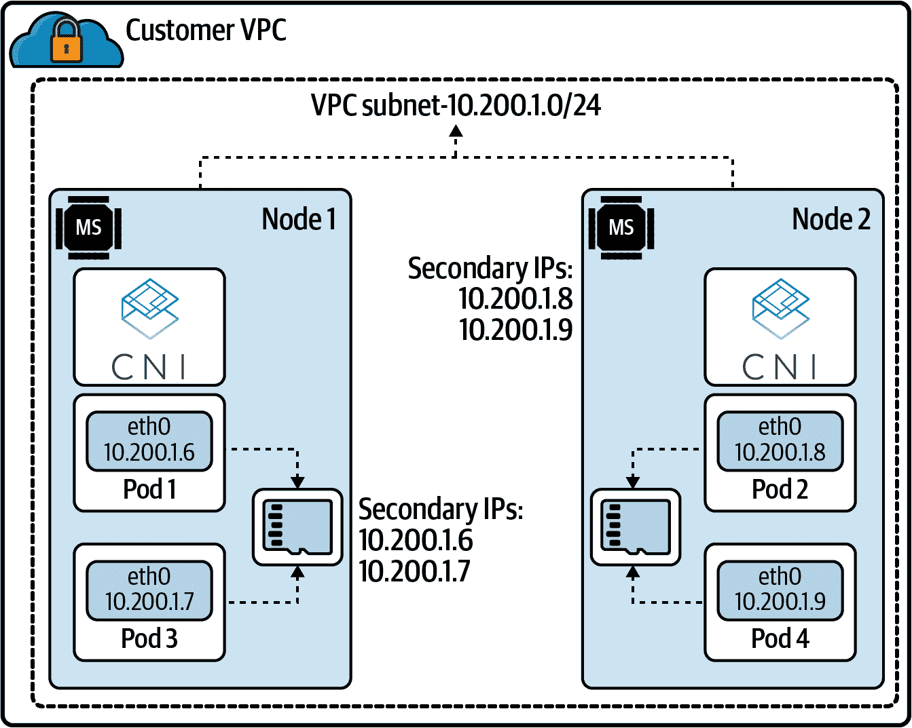

###### 图 6-13\. AWS VPC CNI 示例

AWS VPC CNI 高度可配置。此列表仅包括一些选项：

AWS_VPC_CNI_NODE_PORT_SUPPORT

指定是否在工作节点的主要网络接口上启用了 NodePort 服务。这需要额外的 `iptables` 规则，并且需要将内核的反向路径过滤器设置为宽松模式。

AWS_VPC_K8S_CNI_CUSTOM_NETWORK_CFG

工作节点可以配置在公共子网中，因此您需要将 pod 配置为部署在私有子网中，或者如果 pod 的安全需求与其他节点上运行的需求不同，将其设置为 `true` 将启用这一功能。

AWS_VPC_ENI_MTU

默认值：9001。用于配置附加 ENI 的 MTU 大小。有效范围为 576 到 9001。

WARM_ENI_TARGET

指定 `ipamd` 守护进程应尝试保持供分配给节点上的 pod 的弹性网络接口及其所有可用 IP 地址的数量。默认情况下，`ipamd` 尝试保持一个弹性网络接口及其所有 IP 地址供 pod 分配使用。每个网络接口的 IP 地址数量因实例类型而异。

AWS_VPC_K8S_CNI_EXTERNALSNAT

指定是否应使用外部 NAT 网关来提供次要 ENI IP 地址的 SNAT。如果设置为 `true`，则不会应用 SNAT `iptables` 规则和外部 VPC IP 规则，并且如果已经应用了这些规则，则将其删除。如果需要允许来自外部 VPN、直接连接和外部 VPC 的入站通信，并且您的 pod 不需要通过互联网网关直接访问互联网，则禁用 SNAT。

例如，如果您的带有私有 IP 地址的 Pod 需要与其他人的私有 IP 地址空间通信，您可以使用以下命令启用 `AWS_VPC_K8S_CNI_EXTERNALSNAT`：

```
kubectl set env daemonset
-n kube-system aws-node AWS_VPC_K8S_CNI_EXTERNALSNAT=true
```

###### 注意

EKS Pod 网络的所有信息都可以在 [EKS 文档](https://oreil.ly/RAVVY) 中找到。

AWS VPC CNI 允许在 AWS 网络中对 EKS 的网络选项进行最大控制。

还有 AWS ALB 入口控制器，使在 AWS 云网络上管理和部署应用程序变得顺畅和自动化。让我们接着深入了解。

### AWS ALB 入口控制器

让我们通过 图 6-14 中的示例来了解 AWS ALB 与 Kubernetes 的工作原理。要了解什么是入口控制器，请查看 第五章。

让我们讨论 ALB 入口控制器的所有组成部分：

1.  ALB 入口控制器会监视来自 API 服务器的入口事件。当满足要求时，它将开始创建 ALB 的过程。

1.  在 AWS 中为新的入口资源创建 ALB。这些资源可以是集群内部或外部的。

1.  为每个在入口资源中描述的唯一 Kubernetes 服务在 AWS 中创建目标组。

1.  为入口资源注释中详细说明的每个端口创建侦听器。如果未指定，默认设置 HTTP 和 HTTPS 流量的默认端口。每个服务的 NodePort 服务创建用于我们的健康检查的节点端口。

1.  为入口资源中指定的每个路径创建规则。这确保将流量路由到正确的 Kubernetes 服务的特定路径。

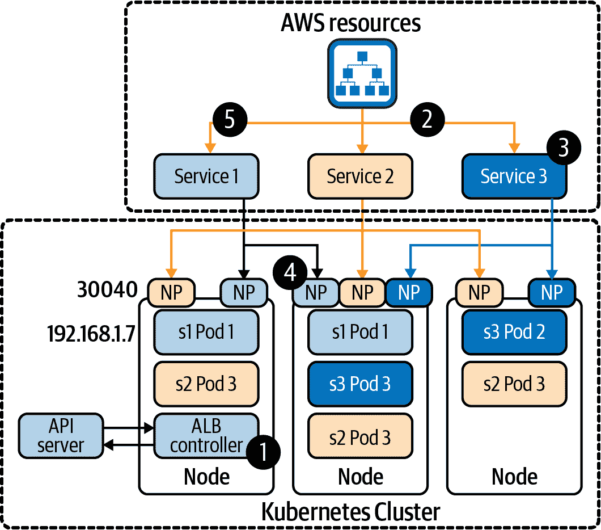

###### 图 6-14\. AWS ALB 示例

流量如何到达节点和 Pod 受 ALB 运行的两种模式之一的影响：

实例模式

入口流量从 ALB 开始，并通过每个服务的 NodePort 到达 Kubernetes 节点。这意味着从入口资源引用的服务必须通过 `type:NodePort` 暴露才能被 ALB 访问。

IP 模式

入口流量从 ALB 开始，直接到达 Kubernetes Pod。CNIs 必须支持通过 ENI 上的辅助 IP 地址直接访问的 Pod IP 地址。

AWS ALB 入口控制器允许开发人员管理其网络需求，如应用程序组件。在流水线中不需要其他工具集。

AWS 网络组件与 EKS 紧密集成。了解它们的基本工作方式的选项对于所有希望在 AWS 上使用 EKS 扩展其应用程序的人来说是基本的。子网的大小，节点在这些子网中的放置位置，当然还有节点的大小将影响您可以在 AWS 网络上运行多大规模的 Pod 和服务的网络。使用像 `eksctl` 这样的开源工具与托管服务（如 EKS）将大大减少运行 AWS Kubernetes 集群的操作开销。

## 在 AWS EKS 集群上部署应用程序

让我们逐步部署一个 EKS 集群来管理我们的 Golang Web 服务器：

1.  部署 EKS 集群。

1.  部署 Web 服务器应用程序和 LoadBalancer。

1.  验证。

1.  部署 ALB Ingress Controller 并验证。

1.  清理。

### 部署 EKS 集群。

让我们部署一个 EKS 集群，使用当前和最新版本 EKS 支持的版本 1.20：

```
export CLUSTER_NAME=eks-demo
eksctl create cluster -N 3 --name ${CLUSTER_NAME} --version=1.20
eksctl version 0.54.0
using region us-west-2
setting availability zones to [us-west-2b us-west-2a us-west-2c]
subnets for us-west-2b - public:192.168.0.0/19 private:192.168.96.0/19
subnets for us-west-2a - public:192.168.32.0/19 private:192.168.128.0/19
subnets for us-west-2c - public:192.168.64.0/19 private:192.168.160.0/19
nodegroup "ng-90b7a9a5" will use "ami-0a1abe779ecfc6a3e" [AmazonLinux2/1.20]
using Kubernetes version 1.20
creating EKS cluster "eks-demo" in "us-west-2" region with un-managed nodes
will create 2 separate CloudFormation stacks for cluster itself and the initial
nodegroup
if you encounter any issues, check CloudFormation console or try
'eksctl utils describe-stacks --region=us-west-2 --cluster=eks-demo'
CloudWatch logging will not be enabled for cluster "eks-demo" in "us-west-2"
you can enable it with
'eksctl utils update-cluster-logging --enable-types={SPECIFY-YOUR-LOG-TYPES-HERE
(e.g. all)} --region=us-west-2 --cluster=eks-demo'
Kubernetes API endpoint access will use default of
{publicAccess=true, privateAccess=false} for cluster "eks-demo" in "us-west-2"
2 sequential tasks: { create cluster control plane "eks-demo",
3 sequential sub-tasks: { wait for control plane to become ready, 1 task:
{ create addons }, create nodegroup "ng-90b7a9a5" } }
building cluster stack "eksctl-eks-demo-cluster"
deploying stack "eksctl-eks-demo-cluster"
waiting for CloudFormation stack "eksctl-eks-demo-cluster"
<truncate>
building nodegroup stack "eksctl-eks-demo-nodegroup-ng-90b7a9a5"
--nodes-min=3 was set automatically for nodegroup ng-90b7a9a5
deploying stack "eksctl-eks-demo-nodegroup-ng-90b7a9a5"
waiting for CloudFormation stack "eksctl-eks-demo-nodegroup-ng-90b7a9a5"
<truncated>
waiting for the control plane availability...
saved kubeconfig as "/Users/strongjz/.kube/config"
no tasks
all EKS cluster resources for "eks-demo" have been created
adding identity
"arn:aws:iam::1234567890:role/
eksctl-eks-demo-nodegroup-ng-9-NodeInstanceRole-TLKVDDVTW2TZ" to auth ConfigMap
nodegroup "ng-90b7a9a5" has 0 node(s)
waiting for at least 3 node(s) to become ready in "ng-90b7a9a5"
nodegroup "ng-90b7a9a5" has 3 node(s)
node "ip-192-168-31-17.us-west-2.compute.internal" is ready
node "ip-192-168-58-247.us-west-2.compute.internal" is ready
node "ip-192-168-85-104.us-west-2.compute.internal" is ready
kubectl command should work with "/Users/strongjz/.kube/config",
try 'kubectl get nodes'
EKS cluster "eks-demo" in "us-west-2" region is ready
```

在输出中，我们可以看到 EKS 正在创建一个节点组，`eksctl-eks-demo-nodegroup-ng-90b7a9a5`，包含三个节点：

```
ip-192-168-31-17.us-west-2.compute.internal
ip-192-168-58-247.us-west-2.compute.internal
ip-192-168-85-104.us-west-2.compute.internal
```

它们都位于一个 VPC 内，有三个公共子网和三个私有子网，跨三个 AZ：

```
public:192.168.0.0/19 private:192.168.96.0/19
public:192.168.32.0/19 private:192.168.128.0/19
public:192.168.64.0/19 private:192.168.160.0/19
```

###### 警告

我们使用了 eksctl 的默认设置，并且将 k8s API 部署为公共端点，`{publicAccess=true, privateAccess=false}`。

现在我们可以在集群中部署我们的 Golang Web 应用程序，并使用 LoadBalancer 服务暴露它。

### 部署测试应用程序。

您可以分别或一起部署应用程序。*dnsutils.yml* 是我们的 `dnsutils` 测试 Pod，*database.yml* 是用于 Pod 连通性测试的 Postgres 数据库，*web.yml* 是 Golang Web 服务器和 LoadBalancer 服务：

```
kubectl apply -f dnsutils.yml,database.yml,web.yml
```

让我们运行 `kubectl get pods` 来查看所有的 Pod 是否运行正常：

```
kubectl get pods -o wide
NAME                   READY   STATUS    IP               NODE
app-6bf97c555d-5mzfb   1/1     Running   192.168.15.108   ip-192-168-0-94
app-6bf97c555d-76fgm   1/1     Running   192.168.52.42    ip-192-168-63-151
app-6bf97c555d-gw4k9   1/1     Running   192.168.88.61    ip-192-168-91-46
dnsutils               1/1     Running   192.168.57.174   ip-192-168-63-151
postgres-0             1/1     Running   192.168.70.170   ip-192-168-91-46
```

现在检查 LoadBalancer 服务：

```

kubectl get svc clusterip-service
NAME                TYPE           CLUSTER-IP
EXTERNAL-IP                                                              PORT(S)        AGE
clusterip-service   LoadBalancer   10.100.159.28
a76d1c69125e543e5b67c899f5e45284-593302470.us-west-2.elb.amazonaws.com   80:32671/TCP   29m

```

服务还有端点：

```
kubectl get endpoints clusterip-service
NAME                ENDPOINTS                                                   AGE
clusterip-service   192.168.15.108:8080,192.168.52.42:8080,192.168.88.61:8080   58m

```

我们应该验证应用程序是否可以在集群内访问，使用 ClusterIP 和端口 `10.100.159.28:8080`；服务名和端口 `clusterip-service:80`；最后是 Pod IP 和端口 `192.168.15.108:8080`：

```
kubectl exec dnsutils -- wget -qO- 10.100.159.28:80/data
Database Connected

kubectl exec dnsutils -- wget -qO- 10.100.159.28:80/host
NODE: ip-192-168-63-151.us-west-2.compute.internal, POD IP:192.168.52.42

kubectl exec dnsutils -- wget -qO- clusterip-service:80/host
NODE: ip-192-168-91-46.us-west-2.compute.internal, POD IP:192.168.88.61

kubectl exec dnsutils -- wget -qO- clusterip-service:80/data
Database Connected

kubectl exec dnsutils -- wget -qO- 192.168.15.108:8080/data
Database Connected

kubectl exec dnsutils -- wget -qO- 192.168.15.108:8080/host
NODE: ip-192-168-0-94.us-west-2.compute.internal, POD IP:192.168.15.108
```

数据库端口可以从 `dnsutils` 到达，使用 Pod IP 和端口 `192.168.70.170:5432`，服务名和端口 `postgres:5432`：

```
kubectl exec dnsutils -- nc -z -vv -w 5 192.168.70.170 5432
192.168.70.170 (192.168.70.170:5432) open
sent 0, rcvd 0

kubectl exec dnsutils -- nc -z -vv -w 5 postgres 5432
postgres (10.100.106.134:5432) open
sent 0, rcvd 0
```

集群内的应用程序已经运行起来了。让我们从集群外部测试一下。

### 验证 Golang Web 服务器的 LoadBalancer 服务。

`kubectl` 将返回我们测试所需的所有信息，包括 ClusterIP、外部 IP 和所有端口：

```

kubectl get svc clusterip-service
NAME                TYPE           CLUSTER-IP
EXTERNAL-IP                                                              PORT(S)        AGE
clusterip-service   LoadBalancer   10.100.159.28
a76d1c69125e543e5b67c899f5e45284-593302470.us-west-2.elb.amazonaws.com   80:32671/TCP   29m

```

使用负载均衡器的外部 IP：

```
wget -qO-
a76d1c69125e543e5b67c899f5e45284-593302470.us-west-2.elb.amazonaws.com/data
Database Connected
```

让我们测试负载均衡器，并向后端发起多个请求：

```
wget -qO-
a76d1c69125e543e5b67c899f5e45284-593302470.us-west-2.elb.amazonaws.com/host
NODE: ip-192-168-63-151.us-west-2.compute.internal, POD IP:192.168.52.42

wget -qO-
a76d1c69125e543e5b67c899f5e45284-593302470.us-west-2.elb.amazonaws.com/host
NODE: ip-192-168-91-46.us-west-2.compute.internal, POD IP:192.168.88.61

wget -qO-
a76d1c69125e543e5b67c899f5e45284-593302470.us-west-2.elb.amazonaws.com/host
NODE: ip-192-168-0-94.us-west-2.compute.internal, POD IP:192.168.15.108

wget -qO-
a76d1c69125e543e5b67c899f5e45284-593302470.us-west-2.elb.amazonaws.com/host
NODE: ip-192-168-0-94.us-west-2.compute.internal, POD IP:192.168.15.108
```

再次运行 `kubectl get pods -o wide` 将验证我们的 Pod 信息是否与负载均衡器请求匹配：

```
kubectl get pods -o wide
NAME                  READY  STATUS    IP              NODE
app-6bf97c555d-5mzfb  1/1    Running   192.168.15.108  ip-192-168-0-94
app-6bf97c555d-76fgm  1/1    Running   192.168.52.42   ip-192-168-63-151
app-6bf97c555d-gw4k9  1/1    Running   192.168.88.61   ip-192-168-91-46
dnsutils              1/1    Running   192.168.57.174  ip-192-168-63-151
postgres-0            1/1    Running   192.168.70.170  ip-192-168-91-46
```

我们还可以检查节点端口，因为 `dnsutils` 正在我们的 VPC 内的 EC2 实例上运行，它可以在私有主机 `ip-192-168-0-94.us-west-2.compute.internal` 上进行 DNS 查询，并且 `kubectl get service` 命令给出了我们的节点端口，32671：

```
kubectl exec dnsutils -- wget -qO-
ip-192-168-0-94.us-west-2.compute.internal:32671/host
NODE: ip-192-168-0-94.us-west-2.compute.internal, POD IP:192.168.15.108
```

在我们的集群中，一切似乎在外部和本地都运行良好。

### 部署 ALB Ingress 并验证。

在部署的某些部分，我们需要知道我们正在部署的 AWS 账户 ID。让我们将其放入一个环境变量中。要获取您的账户 ID，您可以运行以下命令：

```
aws sts get-caller-identity
{
    "UserId": "AIDA2RZMTHAQTEUI3Z537",
    "Account": "1234567890",
    "Arn": "arn:aws:iam::1234567890:user/eks"
}

export ACCOUNT_ID=1234567890
```

如果集群还没有设置，我们需要为集群设置 OIDC 提供程序。

这一步是为了给在集群中运行的 Pod 使用 SA 的 IAM 权限赋予 IAM 权限：

```
eksctl utils associate-iam-oidc-provider \
--region ${AWS_REGION} \
--cluster ${CLUSTER_NAME}  \
--approve
```

对于 SA 角色，我们需要创建一个 IAM 策略，来确定 ALB 控制器在 AWS 中的权限：

```
aws iam create-policy \
--policy-name AWSLoadBalancerControllerIAMPolicy \
--policy-document iam_policy.json
```

现在我们需要创建 SA 并将其附加到我们创建的 IAM 角色：

```
eksctl create iamserviceaccount \
> --cluster ${CLUSTER_NAME} \
> --namespace kube-system \
> --name aws-load-balancer-controller \
> --attach-policy-arn
arn:aws:iam::${ACCOUNT_ID}:policy/AWSLoadBalancerControllerIAMPolicy \
> --override-existing-serviceaccounts \
> --approve
eksctl version 0.54.0
using region us-west-2
1 iamserviceaccount (kube-system/aws-load-balancer-controller) was included
(based on the include/exclude rules)
metadata of serviceaccounts that exist in Kubernetes will be updated,
as --override-existing-serviceaccounts was set
1 task: { 2 sequential sub-tasks: { create IAM role for serviceaccount
"kube-system/aws-load-balancer-controller", create serviceaccount
"kube-system/aws-load-balancer-controller" } }
building iamserviceaccount stack
deploying stack
waiting for CloudFormation stack
waiting for CloudFormation stack
waiting for CloudFormation stack
created serviceaccount "kube-system/aws-load-balancer-controller"
```

我们可以通过以下方法查看 SA 的所有细节：

```
kubectl get sa aws-load-balancer-controller -n kube-system -o yaml
apiVersion: v1
kind: ServiceAccount
metadata:
annotations:
eks.amazonaws.com/role-arn:
arn:aws:iam::1234567890:role/eksctl-eks-demo-addon-iamserviceaccount-Role1
creationTimestamp: "2021-06-27T18:40:06Z"
labels:
app.kubernetes.io/managed-by: eksctl
name: aws-load-balancer-controller
namespace: kube-system
resourceVersion: "16133"
uid: 30281eb5-8edf-4840-bc94-f214c1102e4f
secrets:
- name: aws-load-balancer-controller-token-dtq48
```

`TargetGroupBinding` CRD 允许控制器将 Kubernetes 服务端点绑定到 AWS 的`TargetGroup`：

```
kubectl apply -f crd.yml
customresourcedefinition.apiextensions.k8s.io/ingressclassparams.elbv2.k8s.aws
configured
customresourcedefinition.apiextensions.k8s.io/targetgroupbindings.elbv2.k8s.aws
configured
```

现在我们准备用 Helm 部署 ALB 控制器。

设置版本环境进行部署：

```
export ALB_LB_VERSION="v2.2.0"
```

现在部署它，添加`eks` Helm 仓库，获取集群运行的 VPC ID，最后通过 Helm 部署。

```
helm repo add eks https://aws.github.io/eks-charts

export VPC_ID=$(aws eks describe-cluster \
--name ${CLUSTER_NAME} \
--query "cluster.resourcesVpcConfig.vpcId" \
--output text)

helm upgrade -i aws-load-balancer-controller \
eks/aws-load-balancer-controller \
-n kube-system \
--set clusterName=${CLUSTER_NAME} \
--set serviceAccount.create=false \
--set serviceAccount.name=aws-load-balancer-controller \
--set image.tag="${ALB_LB_VERSION}" \
--set region=${AWS_REGION} \
--set vpcId=${VPC_ID}

Release "aws-load-balancer-controller" has been upgraded. Happy Helming!
NAME: aws-load-balancer-controller
LAST DEPLOYED: Sun Jun 27 14:43:06 2021
NAMESPACE: kube-system
STATUS: deployed
REVISION: 2
TEST SUITE: None
NOTES:
AWS Load Balancer controller installed!
```

我们可以在这里观看部署日志：

```
kubectl logs -n kube-system -f deploy/aws-load-balancer-controller
```

现在使用 ALB 部署我们的入口：

```
kubectl apply -f alb-rules.yml
ingress.networking.k8s.io/app configured
```

通过`kubectl describe ing app`输出，我们可以看到 ALB 已经部署。

我们还可以看到 ALB 的公共 DNS 地址、实例规则和支持服务的端点。

```
kubectl describe ing app
Name:             app
Namespace:        default
Address:
k8s-default-app-d5e5a26be4-2128411681.us-west-2.elb.amazonaws.com
Default backend:  default-http-backend:80
(<error: endpoints "default-http-backend" not found>)
Rules:
Host        Path  Backends
  ----        ----  --------
*
          /data   clusterip-service:80 (192.168.3.221:8080,
192.168.44.165:8080,
192.168.89.224:8080)
          /host   clusterip-service:80 (192.168.3.221:8080,
192.168.44.165:8080,
192.168.89.224:8080)
Annotations:  alb.ingress.kubernetes.io/scheme: internet-facing
kubernetes.io/ingress.class: alb
Events:
Type     Reason                  Age                     From
Message
----     ------                  ----                    ----
-------
Normal   SuccessfullyReconciled  4m33s (x2 over 5m58s)   ingress
Successfully reconciled
```

是时候测试我们的 ALB 了！

```
wget -qO- k8s-default-app-d5e5a26be4-2128411681.us-west-2.elb.amazonaws.com/data
Database Connected

wget -qO- k8s-default-app-d5e5a26be4-2128411681.us-west-2.elb.amazonaws.com/host
NODE: ip-192-168-63-151.us-west-2.compute.internal, POD IP:192.168.44.165
```

### 清理工作：

当您完成与 EKS 的工作和测试后，请确保删除应用程序的 Pod 和服务，以确保一切都已删除：

```
kubectl delete -f dnsutils.yml,database.yml,web.yml
```

清理 ALB：

```
kubectl delete -f alb-rules.yml
```

删除 ALB 控制器的 IAM 策略：

```
aws iam  delete-policy
--policy-arn arn:aws:iam::${ACCOUNT_ID}:policy/AWSLoadBalancerControllerIAMPolicy
```

验证没有残留的 EBS 卷来自于测试应用程序的 PVC。删除任何发现的为 Postgres 测试数据库的 PVC 的 EBS 卷：

```
aws ec2 describe-volumes --filters
Name=tag:kubernetes.io/created-for/pv/name,Values=*
--query "Volumes[].{ID:VolumeId}"
```

验证没有运行的负载均衡器，无论是 ALB 还是其他类型的：

```
aws elbv2 describe-load-balancers --query "LoadBalancers[].LoadBalancerArn"
```

```
aws elb describe-load-balancers --query "LoadBalancerDescriptions[].DNSName"
```

让我们确保删除集群，以免因没有运行的集群而产生费用：

```
eksctl delete cluster --name ${CLUSTER_NAME}
```

我们部署了一个服务负载均衡器，每个服务都会在 AWS 中部署一个经典 ELB。ALB 控制器允许开发者使用 ALB 或 NLB 通过入口来外部暴露应用程序。如果我们要将应用程序扩展到多个后端服务，入口允许我们使用一个负载均衡器，并基于第 7 层信息进行路由。

在下一节中，我们将以与 AWS 相同的方式探索 GCP。

# Google Compute Cloud（GCP）

2008 年，Google 宣布推出 App Engine，一个平台即服务，用于部署 Java、Python、Ruby 和 Go 应用程序。像其竞争对手一样，GCP 已扩展了其服务提供。云服务提供商致力于区分其产品，因此没有两个产品完全相同。尽管如此，许多产品确实有许多共同点。例如，GCP Compute Engine 是一个基础设施即服务，用于运行虚拟机。GCP 网络由 25 个云区域、76 个区域和 144 个网络边缘位置组成。利用 GCP 网络和 Compute Engine 的规模，GCP 推出了 Google Kubernetes Engine，其容器即服务平台。

## GCP 网络服务：

在 GCP 上，托管和非托管的 Kubernetes 集群共享相同的网络原则。托管或非托管集群中的节点都作为 Google Compute Engine 实例运行。GCP 的网络是 VPC 网络。GCP VPC 网络像 AWS 一样，包含 IP 管理、路由、防火墙和对等连接功能。

GCP 网络分为不同的层级供客户选择；有高级和标准层级。它们在性能、路由和功能上有所不同，因此网络工程师必须决定哪种适合其工作负载。高级层级为您的工作负载提供最高性能。VPC 网络中所有与互联网和实例之间的流量尽可能通过 Google 网络路由。如果您的服务需要全球可用性，应使用高级层级。请记住，默认情况下高级层级是默认设置，除非您进行配置更改。

标准层级是一种成本优化的层级，互联网和 VPC 网络中的 VM 之间的流量通常通过互联网一般路由。网络工程师应为完全托管在一个区域内的服务选择此层级。标准层级不能保证性能，因为它受到所有工作负载在互联网上共享的性能的限制。

GCP 网络不同于其他提供商，其拥有所谓的*全局*资源。全局意味着用户可以在同一项目的任何区域访问这些资源。这些资源包括 VPC、防火墙及其路由等。

###### 注意

查看[GCP 文档](https://oreil.ly/mzgG2)以获取网络层的更全面概述。

### 区域和区域

区域是独立的地理区域，包含多个区域。区域资源通过在该区域的多个区域部署来提供冗余。区域是区域内资源的部署区域。一个区域通常是一个区域内的数据中心，管理员应将其视为单一故障域。在容错应用程序部署中，最佳实践是在区域内的多个区域部署应用程序，对于高可用性，应在各个区域部署应用程序。如果某个区域不可用，所有区域资源将不可用，直到所有者恢复服务。

### 虚拟专用云

VPC 是为 GCP 项目内的资源提供连接性的虚拟网络。与账户和订阅一样，项目可以包含多个 VPC 网络，默认情况下，新项目将使用默认自动模式 VPC 网络，并在每个区域包括一个子网。自定义模式 VPC 网络可以不包含子网。正如前文所述，VPC 网络是全局资源，不与任何特定区域或区域关联。

VPC 网络包含一个或多个区域子网。子网具有区域、CIDR 和全局唯一名称。您可以为子网使用任何 CIDR，包括与另一个私有地址空间重叠的 CIDR。特定选择的子网 CIDR 将影响您可以访问的 IP 地址和可以互连的网络。

###### 警告

Google 创建了一个“默认”VPC 网络，为每个区域随机生成子网。一些子网可能与另一个 VPC 网络的子网重叠（例如另一个 Google Cloud 项目中的默认 VPC 网络），这将阻止对等连接。

VPC 网络支持对等连接和共享 VPC 配置。对等连接 VPC 网络允许一个项目中的 VPC 路由到另一个项目中的 VPC，使它们位于同一个 L3 网络上。您不能与任何重叠的 VPC 网络进行对等连接，因为某些 IP 地址存在于两个网络中。共享 VPC 允许另一个项目使用特定的子网，例如创建属于该子网的机器。[VPC 文档](https://oreil.ly/98Wav)提供更多信息。

###### 小贴士

对等连接 VPC 网络是标准的，因为组织通常会将不同的团队、应用程序或组件分配给其 Google Cloud 项目。对等连接对于访问控制、配额和报告有益。一些管理员也可能在一个项目中创建多个 VPC 网络出于类似的原因。

### 子网

子网是 VPC 网络中的部分，具有一个主要 IP 范围和零个或多个次要范围的能力。子网是区域资源，每个子网定义了一系列 IP 地址。一个区域可以拥有多个子网。在创建子网时有两种模式：自动或自定义。当您创建自动模式的 VPC 网络时，将自动在其中的每个区域创建一个子网，使用预定义的 IP 范围。当您定义自定义模式的 VPC 网络时，GCP 不会提供任何子网，使管理员可以控制范围。自定义模式的 VPC 网络适用于企业和网络工程师在生产环境中使用。

Google Cloud 允许您为内部和外部 IP 地址“预留”静态 IP 地址。用户可以将保留的 IP 地址用于 GCE 实例、负载均衡器和我们的其他产品。保留的内部 IP 地址有一个名称，可以自动生成或手动分配。保留内部静态 IP 地址可以防止在不使用时随机自动分配。

保留外部 IP 地址类似；虽然您可以请求自动分配的 IP 地址，但您不能选择要保留的 IP 地址。因为您正在保留一个全球可路由的 IP 地址，在某些情况下会产生费用。您不能保护分配给您的外部 IP 地址作为短暂 IP 地址的自动分配。

### 路由和防火墙规则

部署 VPC 时，您可以使用防火墙规则根据部署的规则允许或拒绝与应用实例之间的连接。每个防火墙规则可以应用于入站或出站连接，但不能同时应用于两者。实例级别是 GCP 强制执行规则的地方，但配置与 VPC 网络配对，您不能在 VPC 网络之间共享防火墙规则，包括对等网络。VPC 防火墙规则是有状态的，因此当 TCP 会话启动时，防火墙规则允许类似 AWS 安全组的双向流量。

### 云负载均衡

Google Cloud 负载均衡器（GCLB）在 GCP 中提供全分布式、高性能、可扩展的负载均衡服务，具有各种负载均衡器选项。通过 GCLB，您可以获得一个 Anycast IP，它覆盖全球所有后端实例，包括多区域故障转移。此外，软件定义的负载均衡服务使您能够将负载均衡应用于您的 HTTP(S)、TCP/SSL 和 UDP 流量。您还可以使用 SSL 代理和 HTTPS 负载均衡终止 SSL 流量。内部负载均衡使您能够为内部实例构建高可用的内部服务，而无需将任何负载均衡器暴露到互联网上。

绝大多数 GCP 用户使用 GCP 的负载均衡器与 Kubernetes Ingress。GCP 提供内部和外部负载均衡器，支持 L4 和 L7。GKE 集群默认为 Ingress 和 `type: LoadBalancer` 服务创建 GCP 负载均衡器。

要将应用程序暴露在 GKE 集群外部，GKE 提供内置的 GKE Ingress 控制器和 GKE 服务控制器，代表 GKE 用户部署 Google Cloud 负载均衡器。GKE 提供三种不同的负载均衡器以控制访问并尽可能均匀地分布入站流量到您的集群中。您可以配置一个服务同时使用多种类型的负载均衡器：

外部负载均衡器

管理来自集群外部和 VPC 网络外部的流量。外部负载均衡器使用与 Google Cloud 网络关联的转发规则将流量路由到 Kubernetes 节点。

内部负载均衡器

管理来自同一 VPC 网络内部的流量。与外部负载均衡器类似，内部负载均衡器使用与 Google Cloud 网络关联的转发规则将流量路由到 Kubernetes 节点。

HTTP 负载均衡器

专门用于 HTTP 流量的外部负载均衡器。它们使用 Ingress 资源而不是转发规则将流量路由到 Kubernetes 节点。

当您创建一个入口对象时，GKE 入口控制器根据入口清单和相关的 Kubernetes 服务规则清单配置 Google Cloud HTTP(S)负载均衡器。客户端向负载均衡器发送请求。负载均衡器是一个代理；它选择一个节点并将请求转发到该节点的 NodeIP:NodePort 组合。节点使用其`iptables` NAT 表来选择一个 pod。正如我们在早期章节中学到的，`kube-proxy`在该节点上管理`iptables`规则。

当入口创建负载均衡器时，负载均衡器是“pod 感知的”，而不是路由到所有节点（并依赖服务将请求路由到 pod），负载均衡器会路由到单个 pod。它通过跟踪底层的`Endpoints`/`EndpointSlice`对象（如第五章中所述）并使用单个 pod IP 地址作为目标地址来实现这一点。

集群管理员可以使用集群内的入口提供者，例如 ingress-Nginx 或 Contour。在这种设置中，负载均衡器指向运行入口代理的适用节点，该代理从那里将请求路由到适用的 pod。对于具有许多入口的集群来说，这种设置更便宜，但会产生性能开销。

### GCE 实例

GCE 实例具有一个或多个网络接口。网络接口具有网络和子网络、私有 IP 地址和公共 IP 地址。私有 IP 地址必须是子网的一部分。私有 IP 地址可以是自动和临时的、自定义和临时的或静态的。外部 IP 地址可以是自动和临时的或静态的。您可以向 GCE 实例添加更多网络接口。附加网络接口不需要在同一个 VPC 网络中。例如，您可能有一个实例，它在具有不同安全级别的两个 VPC 之间进行桥接。让我们讨论一下 GKE 如何使用这些实例并管理赋予 GKE 力量的网络服务。

## GKE

Google Kubernetes Engine（GKE）是谷歌的托管 Kubernetes 服务。GKE 运行一个隐藏的控制平面，无法直接查看或访问。您只能访问特定的控制平面配置和 Kubernetes API。

GKE 公开了围绕诸如机器类型和集群扩展等方面的广泛集群配置。它仅显示一些与网络相关的设置。在撰写本文时，NetworkPolicy 支持（通过 Calico）、每个节点的最大 pod 数（kubelet 中的`maxPods`，`kube-controller-manager`中的`--node-CIDR-mask-size`）和 pod 地址范围（`kube-controller-manager`中的`--cluster-CIDR`）是可定制的选项。无法直接设置`apiserver/kube-controller-manager`标志。

GKE 支持公共和私有集群。私有集群不向节点分配公共 IP 地址，这意味着节点只能在您的私有网络内访问。私有集群还允许您将对 Kubernetes API 的访问限制为特定的 IP 地址。GKE 通过创建 *节点池* 来使用自动管理的 GCE 实例来运行工作节点。

### GCP GKE 节点

GKE 节点的网络配置与在 GKE 上管理的 Kubernetes 集群的网络配置类似。GKE 集群定义 *节点池*，这是一组具有相同配置的节点。此配置包含 GCE 特定设置以及一般 Kubernetes 设置。节点池定义（虚拟）机器类型、自动缩放和 GCE 服务帐户。您还可以为每个节点池设置自定义污点和标签。

集群存在于一个 VPC 网络上。单个节点可以具有其网络标记，以制定特定的防火墙规则。任何运行版本为 1.16 或更高版本的 GKE 集群都将拥有 `kube-proxy` DaemonSet，因此集群中的所有新节点将自动启动 `kube-proxy`。子网的大小将影响集群的大小。因此，在部署可扩展的集群时，请注意子网大小。有一个公式可以用来计算给定 netmask 可支持的节点的最大数量 `N`，使用 `S` 表示 netmask 大小，其有效范围为 8 到 29：

```
N = 2(32 -S) - 4
```

计算所需的 netmask 大小 `S`，以支持最多 `N` 个节点：

```
S = 32 - ⌈log2(N + 4)⌉
```

表 6-2 还概述了集群节点和随子网大小如何缩放。

表 6-2\. 随子网大小缩放的集群节点规模

| 子网主 IP 范围 | 最大节点数 |
| --- | --- |
| /29 | 子网主 IP 范围的最小大小：4 节点 |
| /28 | 12 节点 |
| /27 | 28 节点 |
| /26 | 60 节点 |
| /25 | 124 节点 |
| /24 | 252 节点 |
| /23 | 508 节点 |
| /22 | 1,020 节点 |
| /21 | 2,044 节点 |
| /20 | 在自动模式网络中子网主 IP 范围的默认大小：4,092 节点 |
| /19 | 8,188 节点 |
| /8 | 子网主 IP 范围的最大大小：16,777,212 节点 |

如果使用 GKE 的 CNI，veth 对中的一端附加到其命名空间中的 pod，并连接到 Linux 桥接设备 cbr0.1 的另一端，与我们在第 2 和 3 章节中概述的方式完全一致。

集群跨越区域或区域边界；区域集群仅具有单个控制平面的副本。当您部署集群时，GKE 有两种集群模式：VPC-native 和基于路由的。使用别名 IP 地址范围的集群称为 VPC-native 集群。在 VPC 网络中使用自定义静态路由的集群称为 *基于路由的集群*。表 6-3 概述了创建方法与集群模式的映射。

表 6-3\. 使用集群创建方法的集群模式

| 集群创建方法 | 集群网络模式 |
| --- | --- |
| Google Cloud 控制台 | VPC 原生 |
| REST API | 基于路由 |
| gcloud v256.0.0 及更高或 v250.0.0 及更低 | 基于路由 |
| gcloud v251.0.0–255.0.0 | VPC 原生 |

当使用 VPC 原生时，管理员还可以利用网络端点组（NEG），表示由负载均衡器服务的一组后端。 NEGs 是由 NEG 控制器管理的 IP 地址列表，并由 Google Cloud 负载均衡器使用。 NEG 中的 IP 地址可以是虚拟机的主要或次要 IP 地址，这意味着它们可以是 pod IP。这使得容器原生负载均衡能够通过 Google Cloud 负载均衡器直接向 pod 发送流量。

VPC 原生集群有几个好处：

+   Pod IP 地址在集群的 VPC 网络内本地可路由。

+   在创建 pod 之前，网络中预留了 pod IP 地址。

+   Pod IP 地址范围依赖于自定义静态路由。

+   防火墙规则仅适用于集群节点上的 pod IP 地址范围，而不适用于任何 IP 地址。

+   GCP 云网络连接到本地的扩展到 pod IP 地址范围。

图 6-15 显示了 GKE 与 GCE 组件的映射。

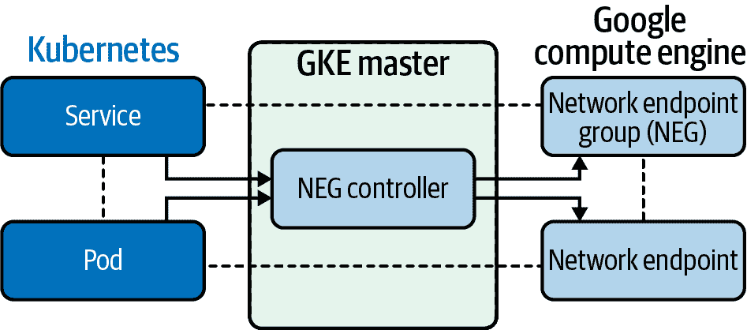

###### 图 6-15\. NEG 到 GCE 组件的映射

这里是 NEGs 带给 GKE 网络的改进列表：

改善的网络性能

容器原生负载均衡器直接与 pod 进行通信，连接的网络跳数较少，延迟和吞吐量都得到了改善。

增强的可见性

使用容器原生负载均衡时，您可以查看从 HTTP 负载均衡器到 pod 的延迟。可以看到从 HTTP 负载均衡器到每个 pod 的延迟，这在基于节点 IP 的容器原生负载均衡中是汇总的。这增加的可见性使得在 NEG 级别更容易排除故障您的服务。

支持高级负载均衡

容器原生负载均衡为 GKE 提供了对多个 HTTP 负载均衡功能的原生支持，例如与 Google Cloud Armor、Cloud CDN 和身份验证代理的集成。它还具有用于准确流量分发的负载均衡算法。

与主要提供商的大多数托管 Kubernetes 提供的解决方案一样，GKE 与 Google Cloud 提供紧密集成。虽然驱动 GKE 的许多软件是不透明的，但它使用标准资源，如可以像其他 GCP 资源一样检查和调试的 GCE 实例。如果您确实需要管理自己的集群，您将错过一些功能，例如容器感知负载均衡。

值得注意的是，与 AWS 和 Azure 不同，GCP 尚不支持 IPv6。

最后，我们将看一下 Azure 上的 Kubernetes 网络。

# Azure

就像其他云提供商一样，Microsoft Azure 提供了各种企业就绪的网络解决方案和服务。在讨论 Azure AKS 网络如何工作之前，我们应该讨论 Azure 部署模型。多年来，Azure 经历了一些重大迭代和改进，导致两种不同的部署模型，这些模型在资源部署和管理方式上存在差异，可能会影响用户如何利用这些资源。

第一个部署模型是经典部署模型。这个模型是 Azure 的初始部署和管理方法。所有资源都是独立存在的，无法逻辑分组。这很麻烦；用户必须为解决方案的每个组件创建、更新和删除，导致错误、遗漏资源以及额外的时间、精力和成本。最后，这些资源甚至无法轻松标记以便搜索，增加了解决方案的难度。

2014 年，微软推出了 Azure 资源管理器作为第二个模型。这种新模型是微软推荐的模型，甚至建议您应该使用 Azure 资源管理器（ARM）重新部署您的资源。这个模型的主要变化是引入了资源组。资源组是资源的逻辑分组，允许对资源进行跟踪、标记和组配置，而不是单独进行配置。

现在我们了解了如何在 Azure 中部署和管理资源的基础知识，我们可以讨论 Azure 网络服务提供的服务和与 Azure Kubernetes 服务（AKS）及非 Azure Kubernetes 服务的互动方式。

## Azure 网络服务

Azure 网络服务的核心是虚拟网络，也称为 Azure Vnet。Vnet 建立了一个隔离的虚拟网络基础设施，用于连接您部署的 Azure 资源，如虚拟机和 AKS 集群。通过附加资源，Vnet 将您的部署资源连接到公共互联网以及您的本地基础设施。除非更改配置，所有 Azure Vnet 都可以通过默认路由与互联网通信。

在图 6-16 中，Azure Vnet 具有单个 CIDR 为`192.168.0.0/16`。像其他 Azure 资源一样，Vnets 需要订阅将 Vnet 放入资源组。可以配置 Vnet 的安全性，但某些选项（如 IAM 权限）是从资源组和订阅继承的。Vnet 限制在指定的区域内。一个区域内可以存在多个 Vnet，但一个 Vnet 只能存在于一个区域内。

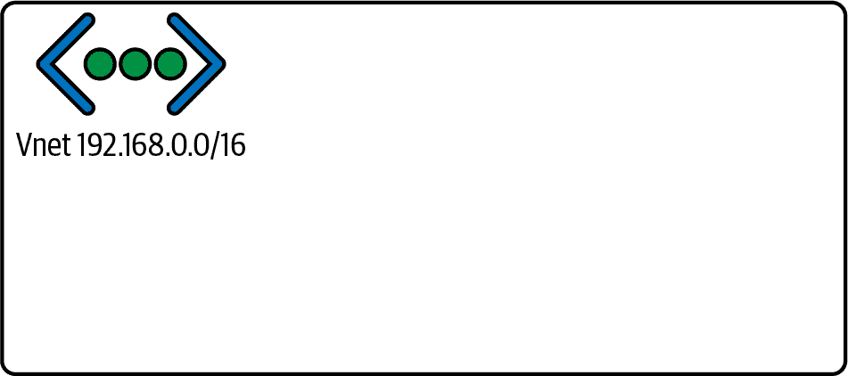

###### 图 6-16\. Azure Vnet

### Azure 骨干基础设施

Microsoft Azure 利用全球分布的数据中心和区域网络。这种分布的基础是 Azure 区域，它包括一组在延迟定义区域内的数据中心，通过低延迟的专用网络基础设施连接。一个区域可以包含任意数量符合这些标准的数据中心，但每个区域通常包含两到三个。包含至少一个 Azure 区域的任何区域都称为 Azure 地理位置。

可用区进一步划分区域。可用区是物理位置，可以包含由独立电源、冷却和网络基础设施维护的一个或多个数据中心。区域与其可用区的关系经过设计，以确保单个可用区故障不会使整个服务区域崩溃。区域中的每个可用区与该区域中的其他可用区连接，但不依赖于不同的区域。可用区使得 Azure 能够为支持的服务提供 99.99% 的可用性。一个区域可以包含多个可用区，如 图 6-17 所示，这些可用区可以进一步包含大量数据中心。

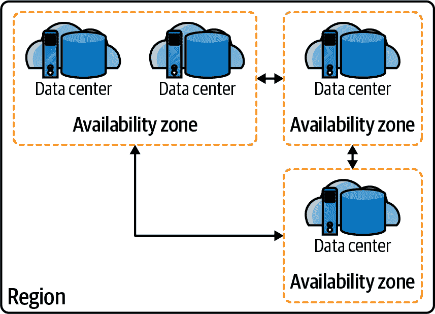

###### 图 6-17\. 区域

由于 Vnet 在区域内，而区域被划分为可用区，因此部署的 Vnet 也跨区域的可用区。如 图 6-18 所示，在部署基础设施以实现高可用性时，最佳做法是利用多个可用区进行冗余。可用区使得 Azure 能够为支持的服务提供 99.99% 的可用性。Azure 允许使用负载均衡器用于跨这些冗余系统的网络。

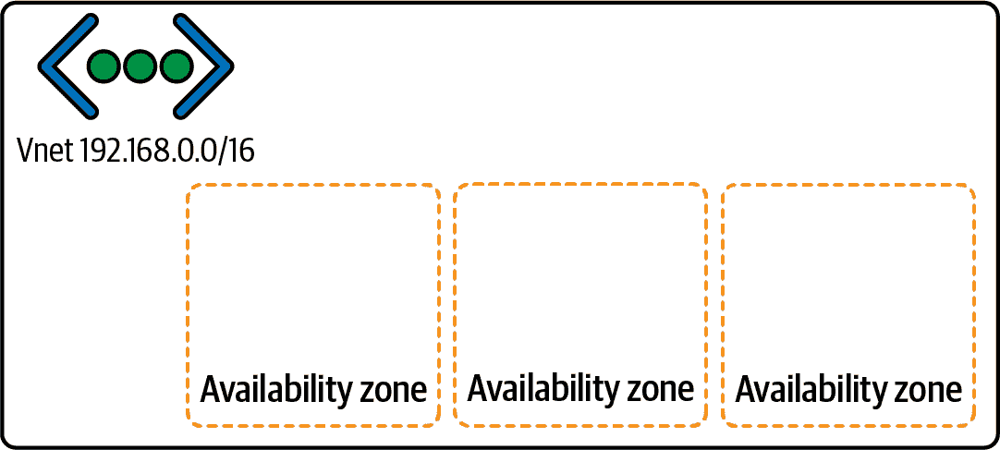

###### 图 6-18\. 具有可用区的 Vnet

###### 注意

Azure [文档](https://oreil.ly/Pv0iq) 提供了 Azure 地理位置、区域和可用区的最新列表。

### 子网

资源 IP 不直接从 Vnet 分配。而是子网划分并定义了 Vnet。子网从 Vnet 接收其地址空间。然后，在每个子网中为已配置的资源分配私有 IP。这是 AKS 集群和 pod 的 IP 地址分配的地方。与 Vnet 类似，Azure 子网跨可用区，如 图 6-19 所示。

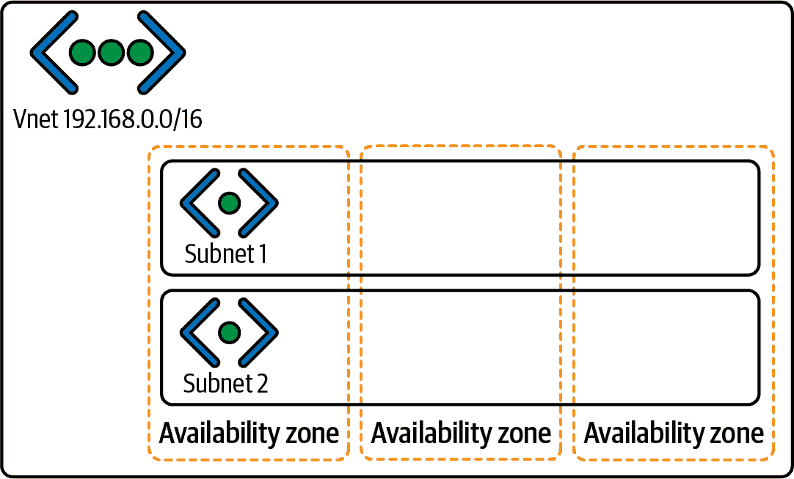

###### 图 6-19\. 跨可用区的子网

### 路由表

正如前面所述，路由表管理子网通信或指示网络流量发送的方向数组。每个新创建的子网都配备有一个默认的路由表，其中包含一些默认的系统路由。这些路由无法删除或更改。系统路由包括到定义子网的 Vnet 的路由，以及默认设置为无效的`10.0.0.0/8`和`192.168.0.0/16`的路由，最重要的是到互联网的默认路由。互联网的默认路由允许任何新创建的具有 Azure IP 的资源默认与互联网通信。这种默认路由是 Azure 与某些其他云服务提供商之间的重要区别，需要足够的安全措施来保护每个 Azure Vnet。

图 6-20 显示了一个新创建的 AKS 设置的标准路由表。其中包括代理池的路由及其 CIDR 和它们的下一跳 IP。下一跳 IP 是路由表为该路径定义的下一跳，下一跳类型设置为虚拟设备，这在此案例中是负载均衡器。这些默认系统路由并不在路由表中显示。理解 Azure 的默认网络行为对于安全、故障排除和规划至关重要。

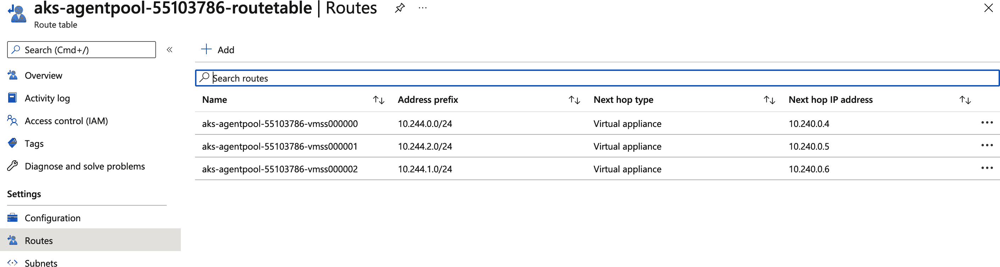

###### 图 6-20\. 路由表

某些系统路由称为可选的默认路由，仅在启用功能（如 Vnet 对等连接）时才会影响。Vnet 对等连接允许全球任何位置的 Vnet 通过 Azure 全局基础设施骨干建立私有连接以进行通信。

自定义路由还可以填充路由表，边界网关协议可以创建或使用用户定义的路由。用户定义的路由非常重要，因为它们允许网络管理员定义超出 Azure 默认建立的路由，例如代理或防火墙路由。自定义路由还会影响系统默认路由。虽然无法更改默认路由，但具有更高优先级的客户路由可以覆盖它。一个例子是使用用户定义的路由将流向互联网的流量发送到虚拟防火墙设备的下一跳，而不是直接发送到互联网。图 6-21 定义了一个名为 Google 的自定义路由，其下一跳类型为互联网。只要设置优先级正确，这个自定义路由将把流量发送到互联网的默认系统路由，即使其他规则重定向剩余的互联网流量。

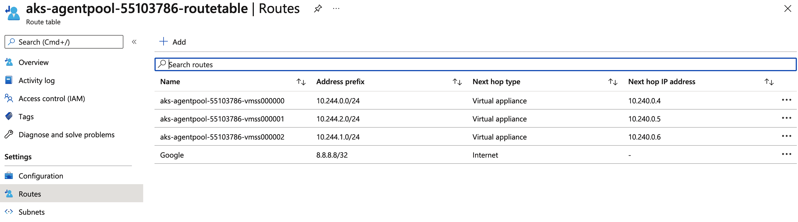

###### 图 6-21\. 带有自定义路由的路由表

路由表也可以单独创建，然后用于配置子网。这对于为多个子网维护单个路由表特别有用，尤其是涉及许多用户定义的路由时。一个子网只能关联一个路由表，但一个路由表可以关联多个子网。配置用户创建的路由表和作为子网默认创建的路由表的规则是相同的。它们具有相同的默认系统路由，并且将随着生效而更新相同的可选默认路由。

虽然路由表中的大多数路由将使用 IP 范围作为源地址，但 Azure 已经开始引入使用服务标记作为源的概念。服务标记是表示 Azure 后端内的一组服务 IP 的短语，例如 SQL.EastUs，这是一个描述美国东部 Microsoft SQL 平台服务提供的 IP 地址范围的服务标记。通过这个功能，可能可以定义一个从一个 Azure 服务（如 AzureDevOps）到另一个服务（如 Azure AppService）的路由，而不需要知道任何 IP 范围。

###### 注意

[Azure 文档](https://oreil.ly/CDedn)中列出了可用的服务标记列表。

### 公共和私有 IP 地址

Azure 将 IP 地址分配为独立的资源，这意味着用户可以创建公共 IP 或私有 IP 而不将其附加到任何内容。这些 IP 地址可以命名并构建在允许未来分配的资源组中。这是准备 AKS 集群扩展的关键步骤，因为您希望确保为可能的 pod 保留足够的私有 IP 地址，如果决定利用 Azure CNI 进行网络连接。Azure CNI 将在后面的部分中讨论。

IP 地址资源，包括公共和私有 IP 地址，也被定义为动态或静态。静态 IP 地址保留不变，而动态 IP 地址如果未分配给资源（如虚拟机或 AKS pod）则可以更改。

### 网络安全组

NSG 用于配置虚拟网络（Vnets）、子网和网络接口卡（NIC），具有入站和出站安全规则。这些规则过滤流量，并确定流量是否允许继续传输或被丢弃。NSG 规则灵活，可以根据源 IP 地址、目标 IP 地址、网络端口和网络协议来过滤流量。一个 NSG 规则可以使用一个或多个这些过滤项，并且可以应用多个 NSG。

NSG 规则可以具有以下任何组件来定义其过滤：

优先级

这是 100 到 4096 之间的数字。数字越小，优先级越高，第一个匹配的规则将被使用。一旦找到匹配项，将不再评估其他规则。

源/目标

被检查流量的源（入站规则）或目标（出站规则）。源/目标可以是以下任何一种：

+   单个 IP 地址

+   CIDR 块（即，10.2.0.0/24）

+   Microsoft Azure 服务标记

+   应用安全组

协议

TCP、UDP、ICMP、ESP、AH 或 Any。

方向

入站或出站流量的规则。

端口范围

可以在此处指定单个端口或范围。

操作

允许或拒绝流量。

图 6-22 显示了一个 NSG 的示例。

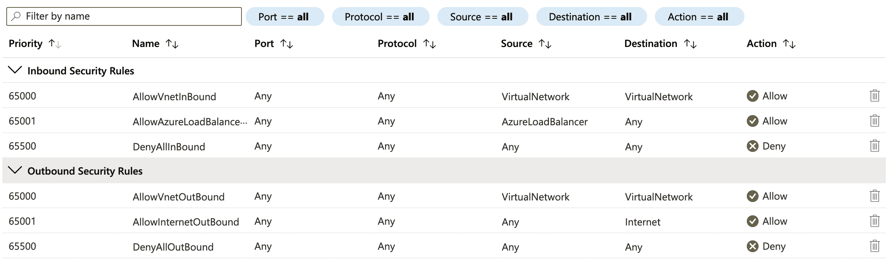

###### 图 6-22\. Azure NSG

在配置 Azure 网络安全组时需要注意几点。首先，不能存在两个或更多具有相同优先级和方向的规则。只要优先级或方向匹配，就可以进行匹配，但其他方面则不能。其次，在资源管理器部署模型中可以使用端口范围，但在经典部署模型中不能。此限制还适用于源/目标的 IP 地址范围和服务标记。第三，在指定 Azure 资源作为源/目标的 IP 地址时，如果资源同时具有公共和私有 IP 地址，则应使用私有 IP 地址。Azure 在此过程之外执行从公共到私有 IP 地址的转换，因此在处理时选择私有 IP 地址是正确的选择。

### 虚拟网络之外的通信

到目前为止描述的概念主要涉及单个 Vnet 内的 Azure 网络。这种类型的通信在 Azure 网络中至关重要，但远非唯一类型。大多数 Azure 实施需要与虚拟网络之外的其他网络进行通信，包括但不限于本地网络、其他 Azure 虚拟网络和互联网。这些通信路径需要与内部网络处理相同的许多考虑因素，并使用许多相同的资源，但也有一些不同之处。本节将扩展一些这些差异。

Vnet 互连可以使用全局虚拟网络互连将位于不同区域的 Vnet 连接起来，但在某些服务（如负载均衡器）上存在约束。

###### 注意

有关这些约束的列表，请参阅 Azure [文档](https://oreil.ly/wnaEi)。

到互联网的 Azure 外部通信使用不同的资源集。如前所述，公共 IP 可以在 Azure 中创建并分配给资源。资源在 Azure 内部网络中使用其私有 IP 地址进行所有网络通信。当来自资源的流量需要从内部网络退出到互联网时，Azure 将私有 IP 地址转换为资源分配的公共 IP。此时，流量可以离开到互联网。针对 Azure 资源的公共 IP 地址的传入流量在 Vnet 边界处将其转换为资源分配的私有 IP 地址，并从此使用私有 IP 地址完成其余通向目标的流量。这种流量路径是为什么诸如 NSG 的所有子网规则都使用私有 IP 地址定义的原因。

NAT 也可以在子网上配置。如果配置了，具有启用 NAT 的子网上的资源无需公共 IP 地址即可与互联网通信。NAT 在子网上启用，以允许仅出站的互联网流量，使用从预配置的公共 IP 地址池中获取的公共 IP。NAT 将使资源能够路由到互联网以进行更新或安装等请求，并返回所请求的流量，但防止这些资源对互联网可访问。需要注意的是，当配置了 NAT 时，它将优先于所有其他出站规则，并替换子网的默认互联网目的地。NAT 还默认使用端口地址转换（PAT）。

### Azure 负载均衡器

现在您有了在网络外部进行通信并使通信回流到 Vnet 的方法，需要一种方式来保持这些通信线路可用。Azure 负载均衡器通常用于通过将流量分发到后端资源池而不是单个资源来实现此目的。Azure 中有两种主要的负载均衡器类型：标准负载均衡器和应用网关。

Azure 标准负载均衡器是第 4 层系统，根据诸如 TCP 和 UDP 的第 4 层协议分发传入流量，这意味着流量基于 IP 地址和端口路由。这些负载均衡器过滤来自互联网的传入流量，但也可以将来自一个 Azure 资源的流量负载均衡到一组其他 Azure 资源。标准负载均衡器使用零信任网络模型。该模型要求 NSG 打开要由负载均衡器检查的流量。如果附加的 NSG 不允许该流量，则负载均衡器将不尝试路由该流量。

Azure 应用网关与标准负载均衡器类似，它们分发传入流量，但不同之处在于它们在第 7 层执行此操作。这允许检查传入的 HTTP 请求，以便基于 URI 或主机头部进行过滤。应用网关还可以用作 Web 应用程序防火墙，以进一步安全和过滤流量。此外，应用网关还可用作 AKS 集群的入口控制器。

负载均衡器，无论是标准还是应用网关，都具有一些基本概念，应予考虑：

前端 IP 地址

根据使用情况可为公共或私有 IP 地址，此 IP 地址用于定位负载均衡器及其平衡的后端资源。

SKU

像其他 Azure 资源一样，这定义了负载均衡器的“类型”，因此也定义了可用的不同配置选项。

后端池

这是负载均衡器分发流量的资源集合，例如一组虚拟机或 AKS 集群中的 Pod。

健康探针

这些是负载均衡器用于确保后端资源可用于流量的方法，例如返回 OK 状态的健康端点：

监听器

一个配置，告诉负载均衡器期望的流量类型，例如 HTTP 请求。

规则

确定如何路由该监听器的传入流量。

图 6-23 展示了 Azure 负载均衡器架构中的一些主要组件。流量进入负载均衡器并与监听器进行比较，以确定负载均衡器是否平衡流量。然后根据规则评估流量，最终发送到后端池。具有适当响应健康探测的后端池资源将处理流量。

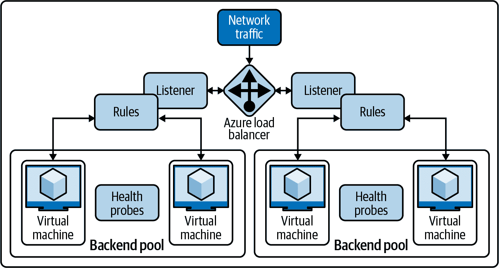

###### 图 6-23\. Azure 负载均衡器组件

图 6-24 展示了 AKS 如何使用负载均衡器。

现在我们已经对 Azure 网络有了基本了解，我们可以讨论 Azure 如何在其托管 Kubernetes 提供中使用这些构建，即 Azure Kubernetes 服务（AKS）。

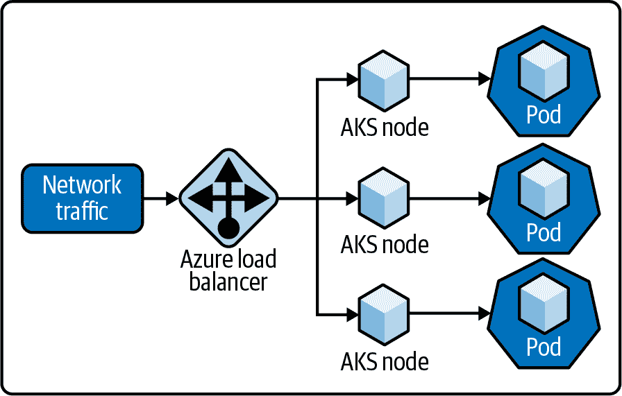

###### 图 6-24\. AKS 负载均衡

## Azure Kubernetes 服务

与其他云提供商一样，微软理解了利用 Kubernetes 的力量的必要性，因此推出了 Azure Kubernetes 服务作为 Azure Kubernetes 提供。AKS 是 Azure 的托管服务提供，因此处理大部分管理 Kubernetes 的开销。Azure 处理健康监控和维护等组件，使开发和运维工程师有更多时间利用 Kubernetes 的可扩展性和强大功能来解决问题。

AKS 可以使用 Azure CLI、Azure PowerShell、Azure 门户以及其他基于模板的部署选项（如 ARM 模板和 HashiCorp 的 Terraform）来创建和管理集群。在 AKS 中，Azure 管理 Kubernetes 主节点，因此用户只需处理节点代理。这使得 Azure 能够将 AKS 的核心作为免费服务提供，用户只需支付节点代理和存储、网络等外围服务的费用。

Azure 门户允许轻松管理和配置 AKS 环境。图 6-25 显示了新配置的 AKS 环境的概述页面。在此页面上，您可以看到许多关键集成和属性的信息和链接。在基本信息部分中可见集群的资源组、DNS 地址、Kubernetes 版本、网络类型以及节点池的链接。

图 6-26 放大了概述页面的属性部分，用户可以在此找到额外的信息和相应组件的链接。大部分数据与基本信息部分中的信息相同。但是，可以在此查看 AKS 环境组件的各种子网 CIDR，例如 Docker 桥接和 pod 子网。

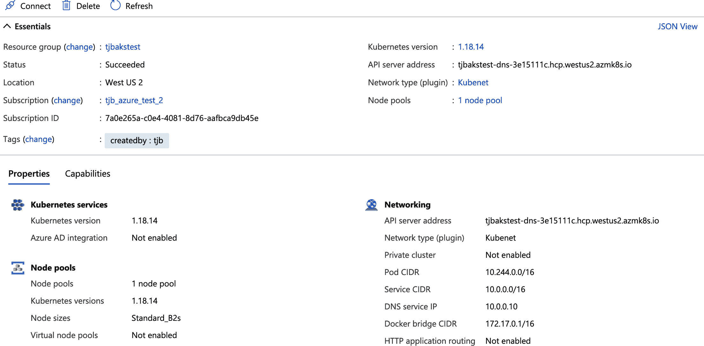

###### 图 6-25\. Azure 门户 AKS 概述

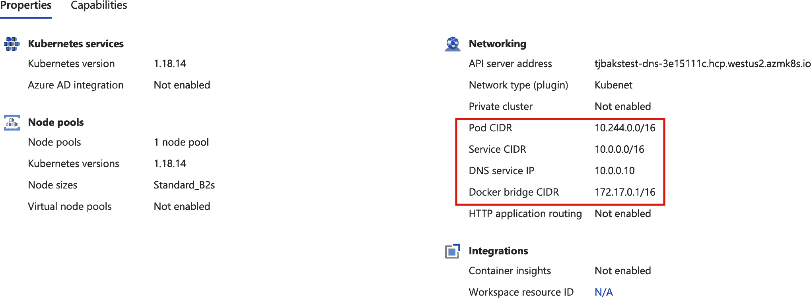

###### 图 6-26\. Azure 门户 AKS 属性

在 AKS 内创建的 Kubernetes pod 附加到虚拟网络，并可以通过抽象访问网络资源。每个 AKS 节点上的 kube-proxy 创建此抽象，此组件允许入站和出站流量。此外，AKS 通过简化如何对虚拟网络进行变更来使 Kubernetes 管理更加流畅。在特定变更发生时，AKS 会自动配置网络服务。例如，向 pod 打开网络端口也会触发相应的更改以打开这些端口所附的 NSG。

默认情况下，AKS 将创建一个具有公共 IP 的 Azure DNS 记录。但默认网络规则阻止了公共访问。私有模式可以创建集群以使用没有公共 IP 的方式，并且仅允许集群内部使用来阻止公共访问。此模式将使集群仅能从 Vnet 内部访问。默认情况下，标准 SKU 将创建一个 AKS 负载均衡器。如果通过 CLI 部署，则可以在部署期间更改此配置。未包含在集群中的资源将在单独生成的资源组中创建。

当在 AKS 中利用 kubenet 网络模型时，以下规则为真：

+   节点从 Azure 虚拟网络子网接收 IP 地址。

+   Pod 从逻辑上不同的地址空间中接收 IP 地址，而不是从节点中。

+   流量的源 IP 地址会切换到节点的主要地址。

+   为了使 pod 能够在 Vnet 上访问 Azure 资源，已配置 NAT。

需要注意的是，只有节点会接收可路由的 IP；而 pod 不会。

虽然 kubenet 是在 Azure Kubernetes 服务内部管理 Kubernetes 网络的一种简单方式，但并非唯一方式。与其他云提供商一样，Azure 在管理 Kubernetes 基础设施时也允许使用 CNI。我们在下一节来讨论 CNI。

### Azure CNI

Microsoft 为 Azure 和 AKS 提供了自己的 CNI 插件，即 Azure CNI。这与 kubenet 的一个显著区别是，pod 接收可路由的 IP 信息，并且可以直接访问。这种差异增加了 IP 地址空间规划的重要性。每个节点可以使用的 pod 的最大数量和为此使用保留的许多 IP 地址。

###### 注意

Azure 容器网络的更多信息可以在 [GitHub](https://oreil.ly/G2zyC) 上找到。

使用 Azure CNI 后，Vnet 内部的流量不再通过节点的 IP 地址进行 NAT 转发，而是直接到 pod 的 IP 地址本身，正如 图 6-27 所示。外部流量（例如互联网流量）仍然会经过节点的 IP 地址进行 NAT 转发。Azure CNI 仍然为这些项执行后端 IP 地址管理和路由，因为在同一个 Azure Vnet 上的所有资源默认可以相互通信。

Azure CNI 也可以用于 AKS 之外的 Kubernetes 部署。虽然需要在 Azure 通常会处理的集群上进行额外的工作，但这使您可以利用 Azure 网络和其他资源，同时保持对 AKS 下通常管理的 Kubernetes 方面的更多控制。

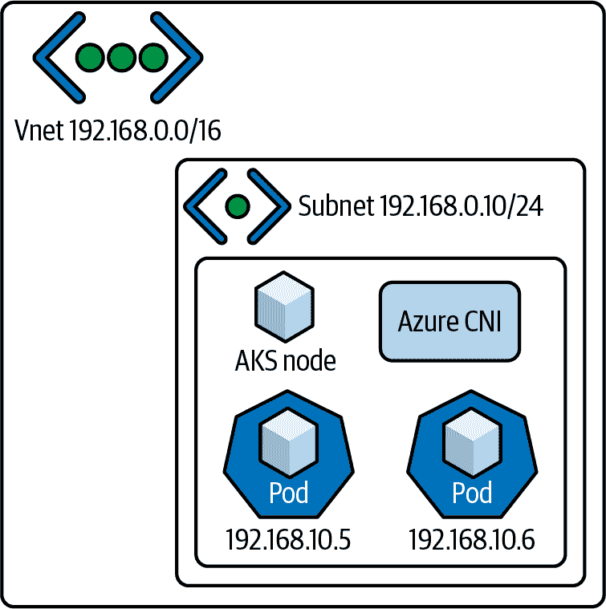

###### 图 6-27\. Azure CNI

Azure CNI 还提供了一个额外的好处，即在保持 AKS 基础架构的同时分离职责。Azure CNI 在单独的资源组中创建网络资源。处于不同的资源组中可以更好地控制 Azure 资源管理部署模型中资源组级别的权限。不同的团队可以访问 AKS 的某些组件，如网络，而无需访问应用程序部署等其他组件。

Azure CNI 并非利用额外 Azure 服务增强 Kubernetes 网络基础架构的唯一方式。接下来的部分将讨论使用 Azure 应用网关作为控制入口到 Kubernetes 集群的手段。

### 应用网关入口控制器

Azure 允许在 AKS 集群部署内部部署应用网关作为应用网关入口控制器 (AGIC)。这种部署模型消除了在 AKS 基础架构外部维护辅助负载均衡器的需要，从而减少了维护开销和错误点。AGIC 在集群中部署其 Pod。然后，它监视集群的其他方面以进行配置更改。当检测到变更时，AGIC 更新 Azure 资源管理器模板，配置负载均衡器，然后应用更新后的配置。图 6-28 说明了这一过程。

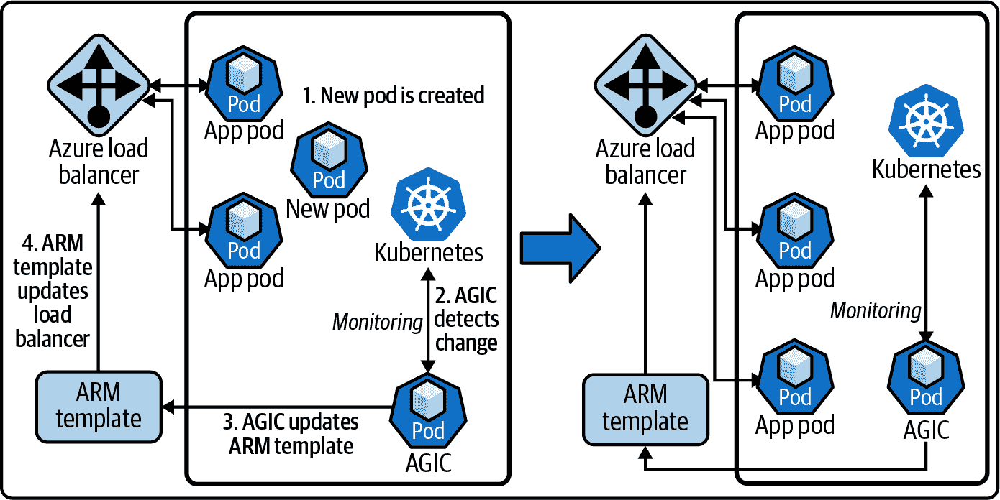

###### 图 6-28\. Azure AGIC

对于 AGIC 的使用，AKS SKU 有限制，仅支持 Standard_v2 和 WAF_v2，但这些 SKU 还具有自动缩放能力。使用这种形式的入口的用例，如需要高可扩展性，有潜力让 AKS 环境扩展。Microsoft 支持使用 Helm 和 AKS 插件作为 AGIC 的部署选项。这些是两种选项之间的关键区别：

+   使用 AKS 插件时，无法编辑 Helm 部署值。

+   Helm 支持被禁止目标配置。AGIC 可以配置应用网关仅针对 AKS 实例，而不影响其他后端组件。

+   作为托管服务的 AKS 插件将自动更新到当前版本和更安全的版本。Helm 部署将需要手动更新。

即使 AGIC 被配置为 Kubernetes 入口资源，它仍然能够带来整个集群标准的第 7 层应用程序网关的全部优势。应用程序网关服务，如 TLS 终结、URL 路由和 Web 应用程序防火墙功能，都可以作为 AGIC 的一部分配置到集群中。

尽管许多 Kubernetes 和网络基础在各云服务提供商之间是通用的，但 Azure 通过其面向企业的资源设计和管理，为 Kubernetes 网络提供了自己的特色。无论您是需要一个使用基本设置和 kubenet 的单个集群，还是通过部署的负载均衡器和应用程序网关实现高级网络的大规模部署，微软的 Azure Kubernetes 服务都可以提供可靠的托管 Kubernetes 基础设施。

## 在 Azure Kubernetes 服务上部署应用程序

部署 Azure Kubernetes 服务集群是开始探索 AKS 网络的基本技能之一。本节将介绍如何创建一个示例集群，并将来自 第一章 的 Golang Web 服务器示例部署到该集群。我们将使用 Azure 门户、Azure CLI 和 `kubectl` 的组合来执行这些操作。

在开始集群部署和配置之前，我们应该讨论 Azure 容器注册表 (ACR)。ACR 是您在 Azure 中存储容器镜像的位置。在本例中，我们将使用 ACR 作为将要部署的容器镜像的位置。要将图像导入到 ACR，您需要将图像在本地计算机上可用。一旦图像可用，我们就需要为 ACR 准备好它。

首先，识别您想要将图像存储在的 ACR 仓库，并使用 `docker login <acr_repository>.azurecr.io` 从 Docker CLI 登录。在本例中，我们将使用 ACR 仓库 `tjbakstestcr`，因此命令将是 `docker login tjbakstestcr.azurecr.io`。接下来，使用 `<acr_repository>.azurecr.io\<imagetag>` 对本地想要导入到 ACR 的图像进行标记。在本例中，我们将使用当前标记为 `aksdemo` 的图像。因此，标记将是 `tjbakstestcr.azure.io/aksdemo`。要标记图像，请使用命令 `docker tag <local_image_tag> <acr_image_tag>`。本示例将使用命令 `docker tag aksdemo tjbakstestcr.azure.io/aksdemo`。最后，使用 `docker push tjbakstestcr.azure.io/aksdemo` 将图像推送到 ACR。

###### 注意

您可以在官方 [文档](https://oreil.ly/5swhT) 中找到有关 Docker 和 Azure 容器注册表的额外信息。

一旦镜像位于 ACR 中，最后一个先决条件是设置一个服务主体。在开始之前设置这一点更容易，但您也可以在创建 AKS 集群期间执行此操作。Azure 服务主体是 Azure Active Directory 应用程序对象的表示。服务主体通常用于通过应用程序自动化与 Azure 交互。我们将使用服务主体允许 AKS 集群从 ACR 拉取 `aksdemo` 镜像。服务主体需要访问您存储图像的 ACR 仓库。您需要记录您要使用的服务主体的客户端 ID 和密钥。

###### 注意

在 [文档](https://oreil.ly/pnZTw) 中可以找到有关 Azure Active Directory 服务主体的额外信息。

现在，我们在 ACR 中有我们的镜像和服务主体的客户端 ID 和密钥，可以开始部署 AKS 集群。

### 部署 Azure Kubernetes Service 集群

现在是部署我们的集群的时候了。我们将从 Azure 门户开始。转到 [*portal.azure.com*](https://oreil.ly/Wx4Ny) 登录。登录后，您应该看到一个仪表板，顶部有一个搜索栏，用于定位服务。从搜索栏中，我们将键入 **kubernetes** 并从下拉菜单中选择 Kubernetes 服务选项，如 图 6-29 所示。

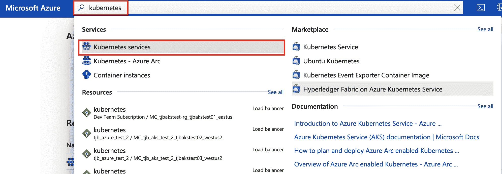

###### 图 6-29\. Azure Kubernetes 搜索

现在我们在 Azure Kubernetes 服务页面上。使用过滤器和查询查看部署的 AKS 集群。这也是创建新 AKS 集群的屏幕。在屏幕顶部附近，我们将选择 Create，如 图 6-30 所示。这将导致一个下拉菜单出现，在其中我们将选择“创建 Kubernetes 集群”。

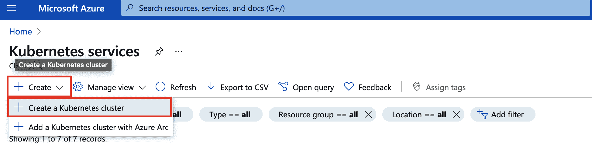

###### 图 6-30\. 创建 Azure Kubernetes 集群

接下来，我们将从“创建 Kubernetes 集群”屏幕中定义 AKS 集群的属性。首先，我们将通过选择将部署集群的订阅来填充“项目详细信息”部分。有一个下拉菜单，可以更轻松地搜索和选择。在本例中，我们使用 `tjb_azure_test_2` 订阅，但只要您有访问权限，任何订阅都可以使用。接下来，我们必须定义将用于分组 AKS 集群的资源组。这可以是现有的资源组，也可以是新建的。在本例中，我们将创建一个名为 `go-web` 的新资源组。

完成项目详情部分后，我们将转到集群详情部分。在这里，我们将定义集群的名称，例如本示例中将为“go-web”。区域、可用性区域和 Kubernetes 版本字段也在此部分定义，并将具有可以更改的预定义默认值。然而，对于本例，我们将使用默认的“(US) West 2”区域，没有可用性区域，并且默认的 Kubernetes 版本为 1.19.11。

###### 注意

不是所有的 Azure 区域都有可选择的可用性区域。如果可用性区域是部署的 AKS 架构的一部分，应考虑适当的区域。您可以在可用性区域的[文档](https://oreil.ly/enxii)中找到更多关于 AKS 区域的信息。

最后，我们将通过选择节点大小和节点数来完成“创建 Kubernetes 集群”屏幕的主节点池部分。例如，我们将保持 DS2 v2 的默认节点大小和 3 个默认节点数。虽然大多数虚拟机大小在 AKS 中可供使用，但也有一些限制。图 6-31 显示了我们已经选择填写的选项。

###### 注意

您可以在[文档](https://oreil.ly/A4bHq)中找到更多关于 AKS 限制的信息，包括受限节点大小。

单击“下一步：节点池”按钮以转到节点池选项卡。此页面允许为 AKS 集群配置额外的节点池。例如，我们将在此页面保留默认设置，并通过点击屏幕底部的“下一步：认证”按钮转到认证页面。

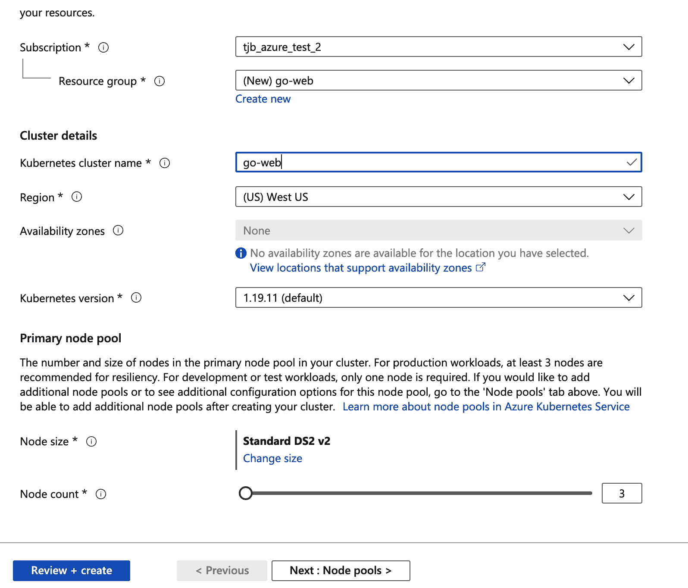

###### 图 6-31\. Azure Kubernetes 创建页面

图 6-32 显示了认证页面，我们将在此页面定义 AKS 集群连接到附加的 Azure 服务（如我们在本章前面讨论过的 ACR）所使用的认证方法。“系统分配的托管标识”是默认的认证方法，但我们将选择“服务主体”单选按钮。

如果您在本节开头没有创建服务主体，可以在此处创建一个新的服务主体。如果在此阶段创建服务主体，则必须返回并授予该服务主体访问 ACR 的权限。然而，由于我们将使用先前创建的服务主体，因此我们将点击“配置服务主体”链接并输入客户端 ID 和密钥。

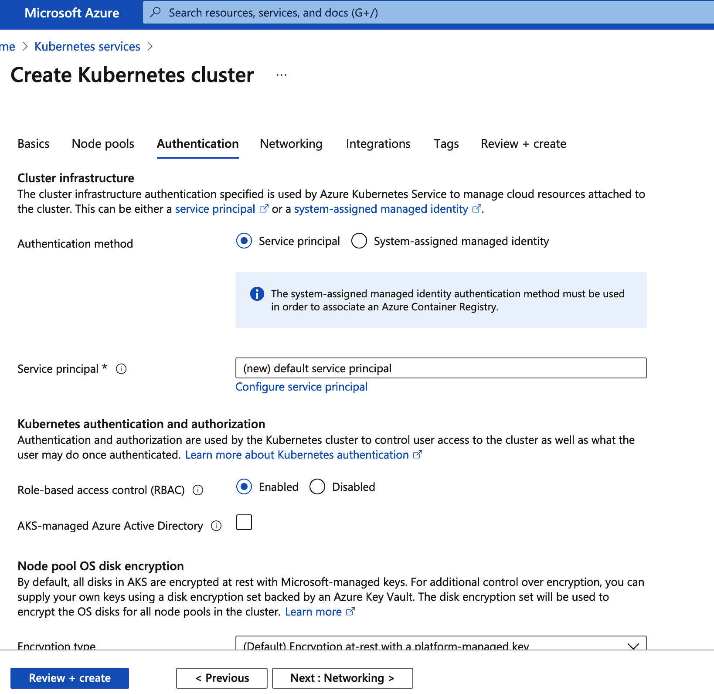

###### 图 6-32\. Azure Kubernetes 认证页面

其余配置将暂时保持默认设置。要完成 AKS 集群的创建，我们将点击“Review + create”按钮。这将带我们到验证页面。如 Figure 6-33 所示，如果一切都被正确定义，验证将在屏幕顶部返回一个“Validation Passed”消息。如果有配置错误，则会显示“Validation Failed”消息。只要验证通过，我们将审查设置并点击 Create。

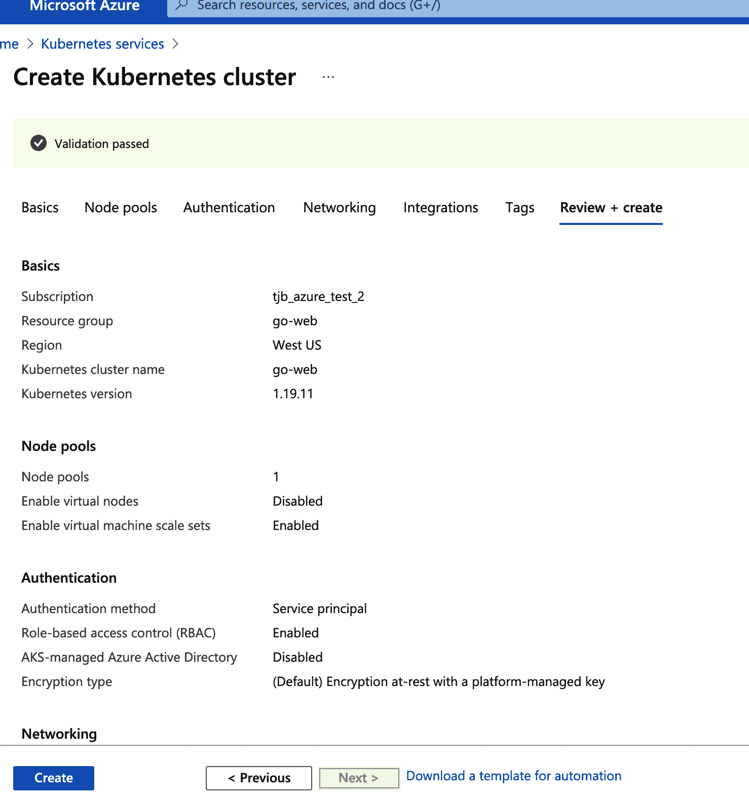

###### Figure 6-33\. Azure Kubernetes 验证页面

您可以从 Azure 屏幕顶部的通知钟查看部署状态。Figure 6-34 显示了我们示例部署正在进行中的情况。此页面包含可用于与 Microsoft 进行故障排除的信息，例如部署名称、开始时间和关联 ID。

我们的示例完全没有问题地部署完成，如 Figure 6-35 所示。现在 AKS 集群已部署，我们需要连接并配置它以便与我们的示例 Web 服务器一起使用。

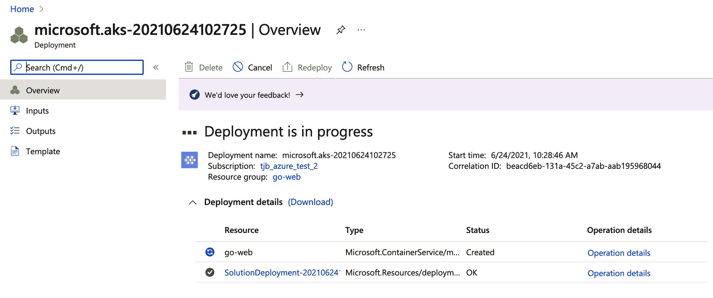

###### Figure 6-34\. Azure Kubernetes 部署进度

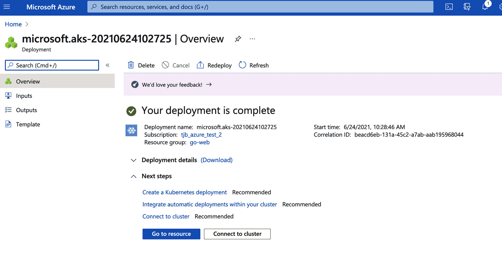

###### Figure 6-35\. Azure Kubernetes 部署完成

### 连接和配置 AKS

我们现在将转向从命令行操作示例`go-web` AKS 集群。要从命令行管理 AKS 集群，我们将主要使用`kubectl`命令。Azure CLI 有一个简单的命令`az aks install-cli`，用于安装`kubectl`程序以便使用。不过，在使用`kubectl`之前，我们需要访问集群。命令`az aks get-credentials --resource-group <resource_group_name> --name <aks_cluster_name>`用于访问 AKS 集群。对于我们的示例，我们将使用`az aks get-credentials --resource-group go-web --name go-web`来访问我们的`go-web`资源组中的`go-web`集群。

接下来，我们将附加包含我们的`aksdemo`镜像的 Azure 容器注册表。命令`az aks update -n` `<aks_cluster_name> -g` `<clus⁠⁠ter_resource_​​group_name>` `--attach-acr <acr_repo_name>`将命名的 ACR 存储库附加到现有的 AKS 集群。对于我们的示例，我们将使用命令`az aks update -n tjbakstest -g tjbakstest --attach-acr tjbakstestcr`。我们的示例运行片刻后，将生成 Example 6-1 中显示的输出。

##### Example 6-1\. AttachACR 输出

```
{- Finished ..
  "aadProfile": null,
  "addonProfiles": {
    "azurepolicy": {
      "config": null,
      "enabled": false,
      "identity": null
    },
    "httpApplicationRouting": {
      "config": null,
      "enabled": false,
      "identity": null
    },
    "omsAgent": {
      "config": {
        "logAnalyticsWorkspaceResourceID":
        "/subscriptions/7a0e265a-c0e4-4081-8d76-aafbca9db45e/
 resourcegroups/defaultresourcegroup-wus2/providers/
 microsoft.operationalinsights/
 workspaces/defaultworkspace-7a0e265a-c0e4-4081-8d76-aafbca9db45e-wus2"
      },
      "enabled": true,
      "identity": null
    }
  },
  "agentPoolProfiles": [
    {
      "availabilityZones": null,
      "count": 3,
      "enableAutoScaling": false,
      "enableNodePublicIp": null,
      "maxCount": null,
      "maxPods": 110,
      "minCount": null,
      "mode": "System",
      "name": "agentpool",
      "nodeImageVersion": "AKSUbuntu-1804gen2containerd-2021.06.02",
      "nodeLabels": {},
      "nodeTaints": null,
      "orchestratorVersion": "1.19.11",
      "osDiskSizeGb": 128,
      "osDiskType": "Managed",
      "osType": "Linux",
      "powerState": {
        "code": "Running"
      },
      "provisioningState": "Succeeded",
      "proximityPlacementGroupId": null,
      "scaleSetEvictionPolicy": null,
      "scaleSetPriority": null,
      "spotMaxPrice": null,
      "tags": null,
      "type": "VirtualMachineScaleSets",
      "upgradeSettings": null,
      "vmSize": "Standard_DS2_v2",
      "vnetSubnetId": null
    }
  ],
  "apiServerAccessProfile": {
    "authorizedIpRanges": null,
    "enablePrivateCluster": false
  },
  "autoScalerProfile": null,
  "diskEncryptionSetId": null,
  "dnsPrefix": "go-web-dns",
  "enablePodSecurityPolicy": null,
  "enableRbac": true,
  "fqdn": "go-web-dns-a59354e4.hcp.westus.azmk8s.io",
  "id":
  "/subscriptions/7a0e265a-c0e4-4081-8d76-aafbca9db45e/
 resourcegroups/go-web/providers/Microsoft.ContainerService/managedClusters/go-web",
  "identity": null,
  "identityProfile": null,
  "kubernetesVersion": "1.19.11",
  "linuxProfile": null,
  "location": "westus",
  "maxAgentPools": 100,
  "name": "go-web",
  "networkProfile": {
    "dnsServiceIp": "10.0.0.10",
    "dockerBridgeCidr": "172.17.0.1/16",
    "loadBalancerProfile": {
      "allocatedOutboundPorts": null,
      "effectiveOutboundIps": [
        {
          "id":
          "/subscriptions/7a0e265a-c0e4-4081-8d76-aafbca9db45e/
 resourceGroups/MC_go-web_go-web_westus/providers/Microsoft.Network/
 publicIPAddresses/eb67f61d-7370-4a38-a237-a95e9393b294",
          "resourceGroup": "MC_go-web_go-web_westus"
        }
      ],
      "idleTimeoutInMinutes": null,
      "managedOutboundIps": {
        "count": 1
      },
      "outboundIpPrefixes": null,
      "outboundIps": null
    },
    "loadBalancerSku": "Standard",
    "networkMode": null,
    "networkPlugin": "kubenet",
    "networkPolicy": null,
    "outboundType": "loadBalancer",
    "podCidr": "10.244.0.0/16",
    "serviceCidr": "10.0.0.0/16"
  },
  "nodeResourceGroup": "MC_go-web_go-web_westus",
  "powerState": {
    "code": "Running"
  },
  "privateFqdn": null,
  "provisioningState": "Succeeded",
  "resourceGroup": "go-web",
  "servicePrincipalProfile": {
    "clientId": "bbd3ac10-5c0c-4084-a1b8-39dd1097ec1c",
    "secret": null
  },
  "sku": {
    "name": "Basic",
    "tier": "Free"
  },
  "tags": {
    "createdby": "tjb"
  },
  "type": "Microsoft.ContainerService/ManagedClusters",
  "windowsProfile": null
}
```

此输出是 AKS 集群信息的 CLI 表示。这意味着附加成功。现在我们可以访问 AKS 集群并附加了 ACR 后，可以将示例 Go Web 服务器部署到 AKS 集群上。

### 部署 Go Web 服务器

我们将部署示例 6-2 中显示的 Golang 代码 Example 6-2。正如本章前面提到的，此代码已构建为 Docker 镜像，并存储在 `tjbakstestcr` 仓库的 ACR 中。我们将使用以下部署 YAML 文件来部署应用程序。

##### 示例 6-2\. Golang 极简 Web 服务器的 Kubernetes Podspec

```
apiVersion: v1
kind: Pod
metadata:
  labels:
    test: liveness
  name: go-web
spec:
  containers:
  - name: go-web
    image: go-web:v0.0.1
    ports:
    - containerPort: 8080
    livenessProbe:
      httpGet:
        path: /healthz
        port: 8080
      initialDelaySeconds: 5
      periodSeconds: 5
    readinessProbe:
      httpGet:
        path: /
        port: 8080
      initialDelaySeconds: 5
      periodSeconds: 5
```

解析这个 YAML 文件，我们可以看到我们正在创建两个 AKS 资源：一个部署（deployment）和一个服务（service）。部署被配置为创建一个名为`go-web`的容器，以及一个容器端口 8080。部署还引用了`aksdemo` ACR 镜像，具体在这行 `image: tjbakstestcr.azurecr.io/aksdemo` 中指定将部署到容器中的镜像。服务也被配置为名为 go-web。YAML 指定服务是一个负载均衡器，监听端口 8080 并指向`go-web`应用。

现在我们需要将应用程序发布到 AKS 集群。命令`kubectl apply -f <yaml_file_name>.yaml`将应用程序发布到集群。从输出中我们可以看到两个东西被创建：`deployment.apps/go-web`和`service/go-web`。当我们运行命令`kubectl get pods`时，我们可以看到如下输出：

```
○ → kubectl get pods
NAME                      READY   STATUS    RESTARTS   AGE
go-web-574dd4c94d-2z5lp   1/1     Running   0          5h29m
```

现在应用程序已部署，我们将连接到它以验证其正常运行。当默认的 AKS 集群启动时，会随之部署一个带有公共 IP 地址的负载均衡器。我们可以通过门户找到该负载均衡器和公共 IP 地址，但是 `kubectl` 提供了一条更简单的路径。命令 `kubectl get` [.keep-together]#`service` `go-web` 生成了这样的输出：

```
○ → kubectl get service go-web
NAME     TYPE           CLUSTER-IP   EXTERNAL-IP    PORT(S)          AGE
go-web   LoadBalancer   10.0.3.75    13.88.96.117   8080:31728/TCP   21h
```

在这个输出中，我们看到外部 IP 地址为 13.88.96.117。因此，如果一切部署正确，我们应该能够使用命令 `curl 13.88.96.117:8080` 来 cURL 13.88.96.117 的端口 8080。正如我们从这个输出中看到的，我们已经成功部署了：

```
○ → curl 13.88.96.117:8080 -vvv
*   Trying 13.88.96.117...
* TCP_NODELAY set
* Connected to 13.88.96.117 (13.88.96.117) port 8080 (#0)
> GET / HTTP/1.1
> Host: 13.88.96.117:8080
> User-Agent: curl/7.64.1
> Accept: */*
>
< HTTP/1.1 200 OK
< Date: Fri, 25 Jun 2021 20:12:48 GMT
< Content-Length: 5
< Content-Type: text/plain; charset=utf-8
<
* Connection #0 to host 13.88.96.117 left intact
Hello* Closing connection 0
```

进入网页浏览器并导航到 http://13.88.96.117:8080 也是可以的，如图所示 Figure 6-36。

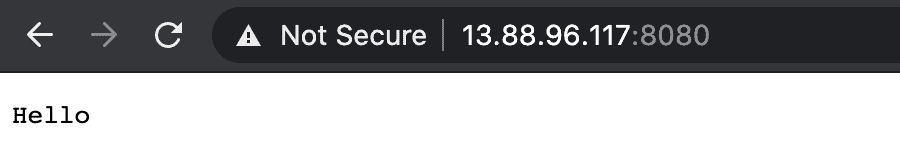

###### 图 6-36\. Azure Kubernetes Hello 应用程序

### AKS 结论

在本节中，我们将一个示例 Golang web 服务器部署到 Azure Kubernetes Service 集群。我们使用了 Azure 门户，`az cli` 和 `kubectl` 来部署和配置集群，然后部署应用程序。我们利用了 Azure 容器注册表来托管我们的 Web 服务器镜像。我们还使用了一个 YAML 文件来部署应用程序，并用 cURL 和 Web 浏览进行了测试。

# 结论

当涉及到为 Kubernetes 集群提供网络服务时，每个云提供商都有其微妙的差异。Table 6-4 强调了其中一些差异。在选择云服务提供商和运行的托管 Kubernetes 平台时，有很多因素可以选择。本章的目标是教育管理员和开发人员，在管理 Kubernetes 上的工作负载时需要做出的选择。

表 6-4\. 云网络和 Kubernetes 总结

|  | AWS | Azure | GCP |
| --- | --- | --- | --- |
| 虚拟网络 | VPC | Vnet | VPC |
| 网络范围 | 区域 | 区域 | 全球 |
| 子网边界 | 区域 | 区域 | 区域 |
| 路由范围 | 子网 | 子网 | VPC |
| 安全控制 | NACL/SecGroups | 网络安全组/应用程序安全组 | 防火墙 |
| IPv6 | 是 | 是 | 否 |
| Kubernetes 管理 | eks | aks | gke |
| 入口 | AWS ALB 控制器 | Nginx-Ingress | GKE 入口控制器 |
| 云自定义 CNI | AWS VPC CNI | Azure CNI | GKE CNI |
| 负载均衡器支持 | ALB L7、L4 w/NLB 和 Nginx | L4 Azure 负载均衡器、L7 w/Nginx | L7、HTTP(S) |
| 网络策略 | 是（Calico/Cilium） | 是（Calico/Cilium） | 是（Calico/Cilium） |

我们涵盖了许多层次，从 OSI 基础到为我们的集群在云中运行的网络。集群管理员、网络工程师和开发人员都需要做出许多决策，比如子网大小、选择的 CNI 以及负载均衡器类型等。理解所有这些以及它们对集群网络的影响是本书的基础。这只是你在大规模管理集群旅程的开始。我们已经涵盖了管理 Kubernetes 集群可用的网络选项。存储、计算甚至如何将工作负载部署到这些集群上都是你现在需要做出的决策。O'Reilly 图书馆有大量的书籍可以帮助，如[*生产 Kubernetes*](https://oreil.ly/Xx12u)（Rosso 等著）中，你将了解在使用 Kubernetes 时通向生产环境的路径，以及[*黑客攻击 Kubernetes*](https://oreil.ly/FcU8C)（Martin 和 Hausenblas 著），介绍如何加固 Kubernetes 并审查 Kubernetes 集群中的安全弱点。

希望本指南能帮助您轻松做出这些网络选择。我们受到 Kubernetes 社区的启发，并期待看到您在 Kubernetes 提供的抽象之上构建的内容。
