# 1 Podman：下一代容器引擎

本章涵盖

+   Podman 是什么

+   使用 Podman 而不是 Docker 的优势

+   Podman 的使用示例

开始这本书是困难的，因为许多人带着不同的期望和经验来到这里。您可能对容器、Docker 或 Kubernetes 有一些经验，或者至少是因为您听说过 Podman 而对学习 Podman 感兴趣。如果您使用过或评估过 Docker，您会发现 Podman 在大多数情况下与 Docker 的工作方式相同，但它解决了 Docker 中固有的某些问题；最显著的是，Podman 提供了增强的安全性和使用非 root 权限运行命令的能力。这意味着您可以使用 Podman 来管理容器，而无需 root 访问或权限。由于 Podman 的设计，它默认情况下可以比 Docker 运行得更加安全。

除了是开源的（因此是免费的）之外，Podman 的命令，从命令行界面（CLI）运行，与 Docker 的命令非常相似。这本书展示了您如何使用 Podman 作为本地容器引擎在单个节点上启动容器，无论是本地还是通过远程 REST API。您还将学习如何使用 Podman 以及 Buildah 和 Skopeo 等开源工具来查找、运行和构建容器。

## 1.1 关于所有这些术语

在您继续之前，我认为定义本书中将使用的术语非常重要。在容器世界中，诸如 *容器编排器*、*容器引擎* 和 *容器运行时* 这样的术语经常被互换使用，这通常会导致混淆。以下列表是每个术语在本文中的含义的总结：

+   *容器编排器*——将容器编排到多个不同机器或节点上的软件项目和产品。这些编排器与容器引擎通信以运行容器。主要的容器编排器是 Kubernetes，它最初是为了与 Docker 守护进程容器引擎通信而设计的，但使用 Docker 正在变得过时，因为 Kubernetes 主要使用 CRI-O 或 containerd 作为其容器引擎。CRI-O 和 containerd 是专门为运行编排的 Kubernetes 容器而构建的（CRI-O 在附录 A 中介绍）。Docker Swarm 和 Apache Mesos 是其他容器编排器的例子。

+   *容器引擎*——主要用于配置容器化应用程序在单个本地节点上运行。它们可以直接由用户、管理员和开发者启动。它们也可以在启动时从 systemd 单元文件中启动，以及由容器编排器如 Kubernetes 启动。如前所述，CRI-O 和 containerd 是 Kubernetes 用于本地管理容器的容器引擎。它们实际上并不打算直接由用户使用。Docker 和 Podman 是用户用于在单个机器上开发、管理和运行容器化应用程序的主要容器引擎。Podman 很少用于启动 Kubernetes 的容器；因此，本书通常不涉及 Kubernetes。Buildah 是另一个容器引擎，尽管它仅用于构建容器镜像。

+   *开放容器倡议（OCI）容器运行时*——配置 Linux 内核的不同部分，然后最终启动容器化应用程序。最常用的两个容器运行时是 `runc` 和 `crun`。Kata 和 gVisor 是其他容器运行时的例子。请参阅附录 B 了解 OCI 容器运行时的区别。

图 1.1 展示了这些开源容器项目属于哪些类别。

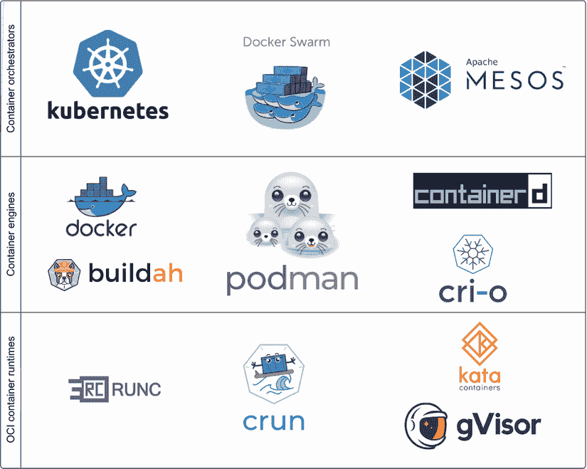

图 1.1 不同开源项目在编排器、引擎和运行时类别中处理容器。

*Podman* 是 *Pod Manager* 的简称。*Pod*，一个由 Kubernetes 项目普及的概念，是指一个或多个共享相同命名空间和 `cgroups`（资源限制）的容器。Pods 在第四章中有更深入的介绍。Podman 可以运行单个容器以及 pods。图 1.2 中的 Podman 标志是一群塞尔基（Selkies），这是爱尔兰关于美人鱼的概念。塞尔基群被称为 pods。

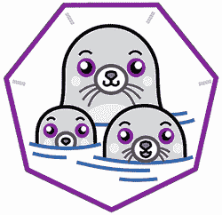

图 1.2 Podman 的标志

Podman 项目将 Podman 描述为“一个无守护进程的容器引擎，用于在您的 Linux 系统上开发、管理和运行 OCI 容器。容器可以以 root 用户身份运行或在无 root 模式下运行” ([`podman.io`](https://podman.io))。Podman 常常被简单地概括为 *alias Docker = Podman*，因为 Podman 几乎可以执行 Docker 可以用相同命令行完成的几乎所有操作。但正如您将在本书中学到的，Podman 可以做更多的事情。理解 Docker 对于理解 Podman 不是必需的，但却是很有帮助的。

注意：开放容器倡议（Open Container Initiative，OCI）是一个标准机构，其主要目标是创建关于容器格式和运行时的开放行业标准。更多信息，请参阅 [`opencontainers.org`](https://opencontainers.org)。

Podman 上游项目位于 github.com 的容器项目中，如图 1.3 所示，([`github.com/containers/podman`](https://github.com/containers/podman))，与其他容器库和容器管理工具如 Buildah 和 Skopeo 一起。 (有关这些工具的描述，请参阅附录 A。)

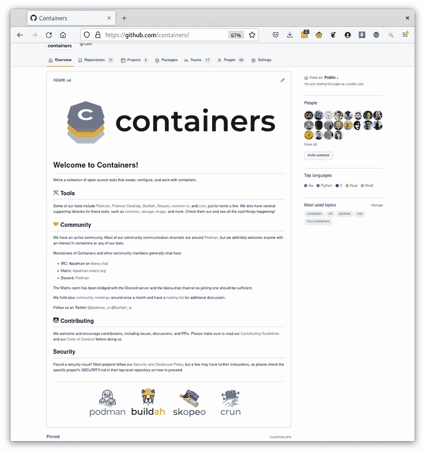

图 1.3 容器是 Podman 和其他相关容器工具的开发者网站（见[`github.com/containers`](https://github.com/containers)）。

Podman 使用新的 OCI 格式运行镜像，如第 1.1.2 节所述，以及传统的 Docker（v2 和 v1）格式镜像。Podman 可以在容器注册库中运行任何可用的镜像，如 docker.io 和 quay.io，以及数百个其他容器注册库。Podman 将这些镜像拉取到 Linux 主机上，并以与 Docker 和 Kubernetes 相同的方式启动它们。Podman 支持所有 OCI 运行时，包括`runc`、`crun`、`kata`和`gvisord`（附录 B），就像 Docker 一样。

本书旨在帮助 Linux 管理员了解使用 Podman 作为其主要容器引擎的优势。您将学习如何以尽可能安全的方式配置您的系统，同时仍然允许您的用户与容器一起工作。Podman 的主要用例之一是在单节点环境中运行容器化应用程序，例如边缘设备。Podman 和 systemd 允许您在不进行人工干预的情况下管理节点上应用程序的整个生命周期。Podman 的目标是在 Linux 盒子上自然运行容器，利用 Linux 平台的所有功能。

注意：Podman 适用于许多不同的 Linux 发行版，以及 Mac 和 Windows 平台。请参阅附录 C 了解如何在您的平台上获取 Podman。

应用程序开发人员也是本书的目标读者。Podman 是开发者寻求以安全方式容器化其应用程序的绝佳工具。Podman 允许开发者在所有 Linux 发行版上创建 Linux 容器。此外，Podman 还可在 Mac 和 Windows 平台上使用，它可以在 VM 内或网络上可用的 Linux 盒子上与运行的 Podman 服务进行通信。“Podman in Action”向您展示如何与容器一起工作，构建容器镜像，然后将它们的容器化应用程序转换为在边缘设备上运行的单一节点服务或基于 Kubernetes 的微服务。

Podman 和容器工具是开源项目，来自许多不同的公司、大学和组织。贡献者来自世界各地。项目始终在寻找新的贡献者以改进它们；请参阅附录 D 了解您如何加入这一努力。在本章中，我首先简要概述容器，然后解释一些使 Podman 成为处理容器优秀工具的关键特性。

## 1.2 容器简要概述

*容器*是运行在 Linux 系统上的进程组，彼此之间是隔离的。容器确保一个进程组不会干扰系统上的其他进程。恶意进程无法控制系统资源，这可能会阻止其他进程执行其任务。容器的最终目标之一是允许应用程序安装具有自己版本的共享库，这些库不会与需要不同版本相同库的应用程序冲突。相反，它们允许应用程序生活在虚拟化环境中，给人一种它们拥有整个系统的印象。

容器通过以下方式隔离：

+   *资源约束（cgroups**）*—cgroup 手册页([`man7.org/linux/man-pages/man7/cgroups.7.xhtml`](https://man7.org/linux/man-pages/man7/cgroups.7.xhtml))将 cgroups 定义为以下内容：“控制组，通常称为 cgroups，是 Linux 内核的一个特性，它允许将进程组织成层次结构分组，然后可以限制和监控这些分组对各种类型资源的使用。”

    cgroups 控制的资源示例包括以下内容：

    +   一组进程可以使用的内存量

    +   进程可以使用的 CPU 量

    +   进程可以使用的网络资源量

    cgroups 的基本思想是防止一个进程组以某种方式控制某些系统资源，以至于另一个进程组无法在系统上取得进展。

+   *安全约束*—容器使用内核中可用的许多安全工具彼此隔离。目标是阻止权限提升，防止恶意进程组对系统进行敌对行为，以下是一些示例：

    +   丢弃 Linux 能力限制了 root 的权限。

    +   SELinux 控制对文件系统的访问。

    +   对内核文件系统只有只读访问。

    +   Seccomp 限制了内核中可用的系统调用。

    +   用户命名空间将主机中的一组 UID 映射到另一组，允许访问有限的 root 环境。

    表 1.1 提供了更多信息和有关这些安全特性的更多详细信息的链接。

表 1.1 高级 Linux 安全特性

| 组件 | 描述 | 参考 |
| --- | --- | --- |
| Linux 能力 | Linux 能力将 root 权限细分为不同的能力。 | 能力手册页是一个关于可用能力的良好概述([`bit.ly/3A3Ppeg`](https://bit.ly/3A3Ppeg))。 |
| SELinux | 安全增强型 Linux (SELinux) 是一种 Linux 内核机制，它为系统上的每个进程和每个文件系统对象打上标签。SELinux 策略定义了标记进程如何与标签对象交互的规则。Linux 内核强制执行这些规则。 | 我编写了 *SELinux 彩色图书*，这是一种有趣的方式来帮助您理解 SELinux ([`bit.ly/33plEbD`](https://bit.ly/33plEbD))。如果您真的想研究这个主题，请查看 SELinux 笔记本 ([`bit.ly/3GxGhkm`](https://bit.ly/3GxGhkm))。 |
| Seccomp | seccomp 是 Linux 内核的一种机制，它限制了系统上进程组可以调用的系统调用数量。您可以移除可能危险的系统调用，防止进程调用它们。 | Seccomp 的 man 页面是获取关于 seccomp 的额外信息的良好来源 ([`bit.ly/3rnnim1`](https://bit.ly/3rnnim1))。 |
| 用户命名空间 | 用户命名空间允许您在命名空间分配的 UIDs 和 GIDs 组内拥有 Linux 能力，而无需在主机上具有 root 能力。 | 用户命名空间在第三章中得到了全面解释。 |

+   *虚拟化技术（命名空间**）*—Linux 内核采用了一种称为 *命名空间* 的概念，它创建了虚拟化环境，其中一组进程看到一组资源，而另一组进程看到不同的资源集。这些虚拟化环境消除了进程对系统其他部分的视图，使它们感觉像虚拟机（VM）而没有开销。命名空间的例子包括以下内容：

    +   *网络命名空间*—消除对主机网络的访问，但允许访问虚拟网络设备

    +   *挂载命名空间*—消除对除容器文件系统之外的所有文件系统的视图

    +   *PID 命名空间*—消除对系统上其他进程的视图；容器进程只能看到容器内的进程

这些容器技术在 Linux 内核中已经存在了许多年。用于隔离进程的安全工具始于 Unix 时代的 1970 年代，而 SELinux 则始于 2001 年。命名空间大约在 2004 年引入，cgroups 大约在 2006 年引入。

注意 Windows 容器镜像确实存在，但本书专注于基于 Linux 的容器。即使运行 Windows 上的 Podman，您仍在处理 Linux 容器。Podman 在 Mac 上的内容包含在附录 E 中。Podman 在 Windows 上的内容包含在附录 F 中。

### 1.2.1 容器镜像：一种新的软件分发方式

容器技术直到 Docker 项目引入了容器镜像和容器注册的概念才真正兴起。基本上，它们创造了一种新的软件分发方式。

传统上，在 Linux 系统上安装多个软件应用程序导致了依赖管理问题。在容器出现之前，开发者使用 RPM 和 Debian 包管理等包管理器打包软件。这些包安装在主机上，并在主机上共享内容，包括共享库。当开发者测试他们的代码时，在主机机器上运行可能一切正常。然后，质量工程团队可能在具有不同包的不同机器上测试软件，并看到失败。两个团队都需要共同努力来生成正确的要求。最后，软件被发送给客户，他们有许多不同的配置和安装的软件，导致应用程序进一步损坏。

容器镜像通过将运行应用程序所需的所有软件捆绑成一个单元来解决依赖管理问题。你将所有库、可执行文件和配置文件一起发送。软件通过容器技术从主机隔离。通常，应用程序与主机系统交互的唯一部分是主机内核。

开发者、质量工程师和客户都运行与应用程序相同的精确容器化环境。这有助于保证一致性，并限制由配置错误引起的错误数量。

容器通常与虚拟机（VMs）相提并论，因为它们都可以在单个节点上运行多个隔离的应用程序。当使用虚拟机时，你需要管理整个虚拟机操作系统以及隔离的应用程序。你需要管理不同内核、init 系统、日志、安全更新、备份等不同组件的生命周期。系统还必须处理整个运行操作系统的开销，而不仅仅是应用程序。在容器世界中，你运行的是容器化的应用程序——没有开销，也没有额外的操作系统管理。图 1.4 展示了在三个不同的虚拟机上运行三个应用程序。

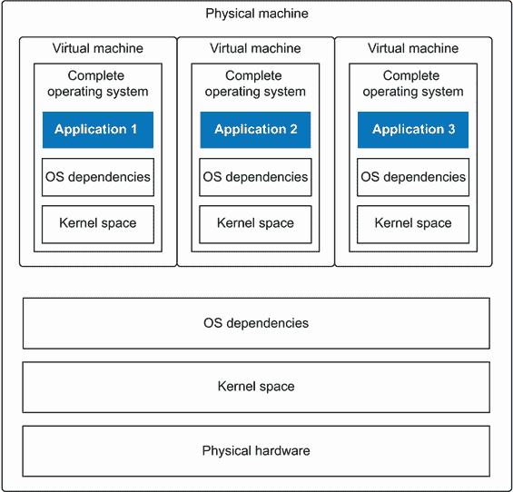

图 1.4 物理机在三个虚拟机上运行三个应用程序

使用虚拟机，你最终需要管理四个操作系统，而使用容器，三个应用程序只需运行它们所需的用户空间。如图 1.5 所示，你最终只需管理一个操作系统。


图 1.5 物理机在三个容器化应用程序中运行三个应用程序

### 1.2.2 容器镜像导致微服务

将应用程序打包到容器镜像中允许在同一主机上安装具有冲突要求的多应用程序。例如，一个应用程序可能需要与另一个应用程序不同的 C 库版本，这阻止了它们同时安装。图 1.6 展示了在没有使用容器的情况下，在操作系统中运行的传统应用程序。

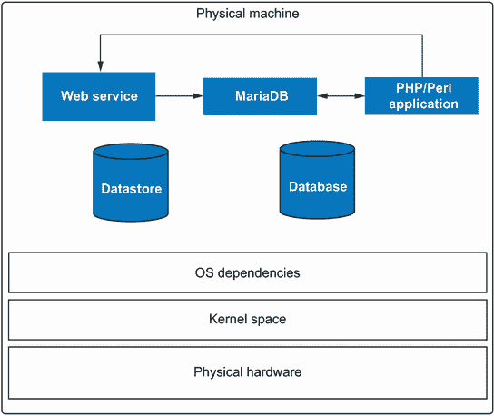

图 1.6 传统 LAMP 栈（Linux、Apache、MariaDB 和 PHP/PERL 应用程序）在服务器上运行

容器可以在其镜像中包含正确的 C 库，每个镜像可能具有针对容器应用程序的不同版本的库。您可以从完全不同的发行版中运行应用程序。

容器使得运行同一应用程序的多个实例变得容易，如图 1.7 所示。容器镜像鼓励将单个服务或应用程序打包到单个容器中。容器允许您通过网络轻松地将多个应用程序连接在一起。

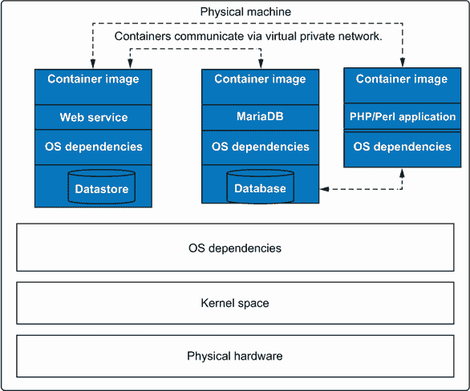

图 1.7 将 LAMP 栈（Linux、Apache、MariaDB 和 PHP/PERL 应用程序）分别打包到微服务容器中。由于容器通过网络进行通信，它们可以轻松地移动到其他虚拟机中，使得重用变得更加容易。

您可以不设计单体应用程序，其中包含一个网络前端、负载均衡器和数据库，而是构建三个不同的容器镜像，然后将它们连接起来以构建微服务。微服务允许您和其他用户尝试运行多个数据库和网络前端，然后一起编排它们。容器化的微服务使得软件的共享和重用成为可能。

### 1.2.3 容器镜像格式

容器镜像由三个组件组成：

+   包含运行您应用程序所需所有软件的目录树

+   描述根文件系统内容的 JSON 文件

+   另一个名为清单列表的 JSON 文件，它将多个镜像链接在一起以支持不同的架构

目录树被称为 *rootfs*（根文件系统）。软件布局就像它是 Linux 系统的根 (/) 一样。

在根文件系统中运行的可执行文件、工作目录、要使用的环境变量、可执行文件的维护者以及其他帮助识别镜像内容的标签定义在第一个 JSON 文件中。您可以使用 `podman` 的 `inspect` 命令查看此 JSON 文件：

```
$ podman inspect docker:/ /registry.access.redhat.com/ubi8
{
...
  "created": "2022-01-27T16:00:30.397689Z",      ❶
  "architecture": "amd64",                       ❷
  "os": "linux",                                 ❸
  "config": {
         "Env": [                                ❹
            "PATH=/usr/local/sbin:/usr/local/bin:/usr/sbin:/usr/bin:/sbin:/bin",
            "container=oci"
         ],
         "Cmd": [                                ❺
                   "/bin/bash"
         ],
         "Labels": {                             ❻
                     "architecture": "x86_64",
                     "build-date": "2022-01-27T15:59:52.415605",
       ...
}
```

❶ 镜像创建的日期

❷ 此镜像的架构

❸ 此镜像的操作系统

❹ 图像开发者希望在容器内设置的环境变量

❺ 容器启动时默认要执行的命令

❻ 帮助描述镜像内容的标签。这些字段可以是自由形式的，不会影响镜像的运行方式，但可以用于搜索和描述镜像。

第二个 JSON 文件，即清单列表，允许 arm64 机器上的用户拉取与他们在 arm64 机器上相同的名称的镜像。Podman 根据机器的默认架构使用此清单列表来拉取镜像。Skopeo 是一个使用与 Podman 相同的底层库的工具，可在 [github.com/containers/skopeo](http://github.com/containers/skopeo) 上找到（见附录 A）。Skopeo 提供了检查容器镜像结构的底层输出。在以下示例中，使用带有 `--raw` 选项的 `skopeo` 命令来检查 registry.access.redhat.com/ ubi8 镜像清单规范：

```
$ skopeo inspect --raw docker:/ /registry.access.redhat.com/ubi8
{
    "manifests": 
      {
              "digest": "sha256:cbc1e8cea
➥ 8c78cfa1490c4f01b2be59d43ddbb
➥ ad6987d938def1960f64bcd02c",                                                   ❶
              "mediaType": "application/vnd.docker.distribution.manifest.v2+json",❷
              "platform": {
              "architecture": "amd64",                                            ❸
              "os": "linux"                                                       ❹
              },
              "size": 737
      },
      {
              "digest":                                                           ❺
➥ "sha256:f52d79a9d0a3c23e6ac4c3c8f2ed8d6337ea47f4e2dfd46201756160ca193308",
              "mediaType": "application/vnd.docker.distribution.manifest.v2+json",
              "platform": {
              "architecture": "arm64", 
              "os": "linux"
              },
              "size": 737
      },
...
}
```

❶ 当架构和操作系统匹配时，提取的确切镜像摘要

❷ mediaType 描述了镜像的类型，如 OCI、Docker 等。

❸ 此镜像摘要的架构：amd64

❹ 此镜像摘要的操作系统：Linux

❺ 此节指向不同架构的另一个镜像：arm64。

图片使用 Linux tar 工具将 rootfs 和 JSON 文件打包在一起。这些镜像随后存储在称为容器注册库的 Web 服务器上（例如，docker.io, quay.io 和 Artifactory）。Podman 等容器引擎可以将这些镜像复制到主机上，并在文件系统上解包。然后，引擎将镜像的 JSON 文件、引擎的内置默认值和用户的输入合并，以创建一个新的容器 OCI 运行时规范 JSON 文件。该 JSON 文件描述了如何运行容器化应用程序。

在最后一步，容器引擎启动一个名为容器运行时的程序（例如，`runc`、`crun`、`kata` 或 `givisord`）。容器运行时在最终启动容器的首要进程之前，读取容器的 JSON 文件，并配置内核 cgroups、安全约束和命名空间。

### 1.2.4 容器标准

OCI 标准机构定义了存储和定义容器镜像的标准格式。他们还定义了运行容器的容器引擎的标准。OCI 创建了 OCI 镜像格式，该格式标准化了容器镜像和镜像 JSON 文件的格式。他们还创建了 OCI 运行时规范，该规范标准化了用于 OCI 运行时的容器 JSON 文件。OCI 标准允许其他容器引擎，如 Podman[¹，遵循标准，能够与容器注册库中存储的所有镜像一起工作，并以与其他容器引擎（包括 Docker）完全相同的方式运行它们（见图 1.7）。

## 1.3 为什么在有 Docker 的情况下还要使用 Podman？

我经常被问到这样的问题，“为什么你已经有了 Docker，还需要 Podman？”好吧，一个原因就是 *开源就是关于选择*。操作系统有不止一个编辑器，不止一个 shell，不止一个文件系统，还有不止一个互联网网页浏览器。我相信 Podman 的设计在本质上优于 Docker，并提供了提高容器安全和使用的功能。

### 1.3.1 为什么只有一种运行容器的方式？

Podman 的一个优点是它是在 Docker 存在之后创建的。Podman 的开发者从完全不同的角度审视了改进 Docker 设计的方法。因为 Docker 是以开源的形式编写的，Podman 共享了一些代码并利用了新的标准，如开放容器倡议。Podman 与开源社区合作，专注于开发新功能。

在本节的其余部分，我将介绍一些这些改进。表 1.2 描述并比较了 Podman 和 Docker 中可用的功能。

表 1.2 Podman 和 Docker 功能比较

| 功能 | Podman | Docker | 描述 |
| --- | --- | --- | --- |
| 支持所有 OCI 和 Docker 镜像 | ✔ | ✔ | 从容器注册库（即，quay.io 和 docker.io）拉取和运行容器镜像。请参阅第二章。 |
| 启动 OCI 容器引擎 | ✔ | ✔ | 启动`runc`、`crun`、Kata、gVisor 和 OCI 容器引擎。请参阅附录 B。 |
| 简单的命令行界面 | ✔ | ✔ | Podman 和 Docker 共享相同的 CLI。请参阅第二章。 |
| 与 systemd 集成 | ✔ | ✘ | Podman 支持在容器内运行 systemd 以及许多 systemd 功能。请参阅第七章。 |
| Fork/exec 模型 | ✔ | ✘ | 容器是命令的子进程。 |
| 完全支持用户命名空间 | ✔ | ✘ | 只有 Podman 支持在单独的用户命名空间中运行容器。请参阅第六章。 |
| 客户端-服务器模型 | ✔ | ✔ | Docker 是一个 REST API 守护进程。Podman 通过 systemd 套接字激活服务支持 REST API。请参阅第九章。 |
| 支持`docker-compose` | ✔ | ✔ | Compose 脚本针对 REST API 工作。Podman 以 rootless 模式运行。请参阅第九章。 |
| 支持 docker-py | ✔ | ✔ | Docker-py Python 绑定针对 REST API 工作。Podman 以 rootless 模式运行。Podman 还支持 podman-py 以运行高级功能。请参阅第九章。 |
| 无守护进程模式 | ✔ | ✘ | Podman 命令的运行方式类似于传统的命令行工具，而 Docker 需要多个在 root 模式下运行的守护进程。 |
| 支持类似 Kubernetes 的 Pod | ✔ | ✘ | Podman 支持在同一个 Pod 中运行多个容器。请参阅第四章。 |
| 支持 Kubernetes YAML | ✔ | ✘ | Podman 可以根据 Kubernetes YAML 启动容器和 Pod。它还可以从运行中的容器生成 Kubernetes YAML。请参阅第八章。 |
| 支持 Docker Swarm | ✘ | ✔ | Podman 认为容器编排的多节点容器的未来是 Kubernetes，并且不打算实现 Swarm。 |
| 可定制的注册库 | ✔ | ✘ | Podman 允许您配置用于短名展开的注册库。当您指定短名时，Docker 被硬编码为 docker.io。请参阅第五章。 |
| 可定制的默认设置 | ✔ | ✘ | Podman 支持完全自定义其所有默认设置，包括安全、命名空间和卷。请参阅第五章。 |
| macOS 支持 | ✔ | ✔ | Podman 和 Docker 支持通过运行 Linux 的 VM 在 Mac 上运行容器。请参阅附录 E。 |
| Windows 支持 | ✔ | ✔ | Podman 和 Docker 支持在 Windows WSL 2 或运行 Linux 的虚拟机上运行容器。请参阅附录 F。 |
| Linux 支持 | ✔ | ✔ | Podman 和 Docker 支持所有主要的 Linux 发行版。请参阅附录 C。 |
| 软件升级时容器不会停止。 | ✔ | ✘ | Podman 不需要在容器运行时保持运行。由于 Docker 守护进程正在监控容器，默认情况下，当它停止时，所有容器都会停止。 |

### 1.3.2 Rootless 容器

Podman 最显著的功能可能是其能够在 rootless 模式下运行。在许多情况下，你不想给你的用户完全的 root 访问权限，但用户和开发者仍然需要运行容器和构建容器镜像。需要 root 访问权限阻止了许多注重安全的公司广泛采用 Docker。另一方面，Podman 可以在 Linux 上运行容器，无需额外的安全功能，只需一个标准的登录账户。

你可以通过将用户添加到 Docker 用户组（/etc/group）来以普通用户身份运行 Docker 客户端，但我认为授予这种访问权限是在 Linux 机器上你能做的最危险的事情之一。对 docker.sock 的访问允许你通过运行以下命令在主机上获得完整的 root 访问权限。在命令中，你将整个主机操作系统/挂载到容器内的/host 目录。`--privileged`标志关闭了所有容器安全特性，然后你`chroot`到/host。`chroot`之后，你就在操作系统的/目录下的 root shell 中，拥有完整的 root 权限：

```
$ docker run -ti --name hacker --privileged -v /:/host ubi8  chroot /host
#
```

在这一点上，你在机器上拥有完整的 root 权限，你可以做任何你想做的事情。当你完成对机器的破解后，你可以简单地执行`docker rm`命令来删除容器和你所做的一切记录：

```
$ docker rm hacker
```

当 Docker 配置为默认文件日志记录时，你启动容器的所有记录都会被删除。我相信这比没有 root 设置`sudo`还要糟糕，因为至少在日志文件中，你有机会看到`sudo`被运行。

使用 Podman 时，系统上运行的进程始终属于用户，并且没有比普通用户更大的能力。即使你从容器中逃逸出来，进程仍然以你的 UID 运行，系统上的所有操作都会记录在审计日志中。Podman 的用户不能简单地删除容器并掩盖他们的踪迹。更多信息请参阅第六章。

注意，Docker 现在可以像 Podman 一样以 rootless 模式运行，但几乎没有人那样使用。仅仅为了启动一个容器而在家目录中启动多个服务并没有流行起来。

### 1.3.3 Fork/exec 模型

Docker 被构建为一个 REST API 服务器。本质上，Docker 是一个包含多个守护进程的客户端-服务器架构。当用户执行 Docker 客户端时，他们执行一个连接到 Docker 守护进程的命令行工具。然后 Docker 守护进程将其存储中的镜像拉取到其存储中，然后连接到 containerd 守护进程，该守护进程最终执行一个 OCI 运行时来创建容器。然后，Docker 守护进程是一个通信平台，它从容器中创建的初始进程（PID1）读取和写入`stdin`、`stdout`和`stderr`。守护进程将所有输出回传给 Docker 客户端。用户想象容器的进程只是当前会话的子进程，但幕后有很多通信在进行。图 1.8 展示了 Docker 客户端-服务器架构。

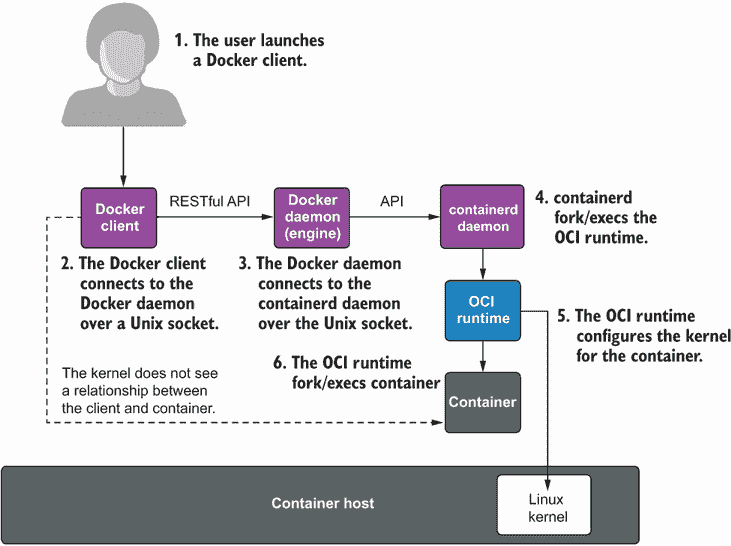

图 1.8 Docker 客户端-服务器架构。容器是 containerd 的直接后裔，而不是 Docker 客户端。内核看不到客户端程序和容器之间的任何关系。

核心是 Docker 客户端与 Docker 守护进程通信，然后 Docker 守护进程与 containerd 守护进程通信，最终启动一个如`runc`这样的 OCI 运行时来启动容器的 PID1。以这种方式运行容器涉及很多复杂性。多年来，任何守护进程的故障都可能导致所有容器关闭，而且通常很难诊断发生了什么。Podman 的核心工程团队来自一个基于 Unix 哲学的操作系统背景。

Unix 和 C 都是基于计算中的 fork/exec 模型设计的。基本上，当你执行一个新程序时，像 Bash shell 这样的父程序会创建一个新的进程，然后作为旧程序的子程序执行新程序。Podman 工程团队认为，通过构建一个从容器注册库拉取容器镜像、配置容器存储并最终启动 OCI 运行时的工具，可以使容器更简单。这个运行时作为你的容器引擎的子程序启动容器。

在 Unix 操作系统中，进程可以通过文件系统和进程间通信（IPC）机制共享内容。这些操作系统特性使得多个容器引擎可以共享存储，而无需运行守护进程来控制访问和共享内容。除了使用操作系统文件系统提供的锁定机制外，引擎之间不需要相互通信。未来的章节将探讨这种机制的优势和劣势。图 1.9 展示了 Podman 架构和通信流程。

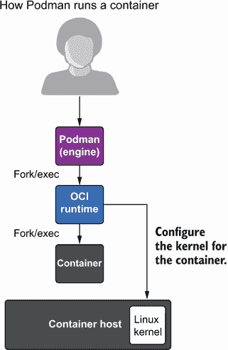

图 1.9 Podman fork/exec 架构。用户启动 Podman，它执行 OCI 运行时，然后启动容器。容器是 Podman 的直接后裔。

### 1.3.4 Podman 是无守护进程的

Podman 与 Docker 基本上不同，因为它是无守护进程的。Podman 可以运行与 Docker 相同的所有容器镜像，并使用相同的容器运行时启动容器。然而，Podman 在没有多个持续以 root 权限运行的守护进程的情况下完成这些操作。

想象一下，你有一个希望在启动时运行的 Web 服务。这个 Web 服务被封装在一个容器中，因此你需要一个容器引擎。在 Docker 的情况下，你需要将其设置在您的机器上运行，并且每个守护进程都在运行并接受连接。接下来，启动 Docker 客户端以启动 Web 服务。现在，你的容器化应用程序以及所有的 Docker 守护进程都在运行。在 Podman 的情况下，使用 Podman 命令来启动你的容器，Podman 将会消失。你的容器将继续运行，而无需运行多个守护进程的开销。在低端机器上，如 IOT 设备和边缘服务器，更少的开销非常受欢迎。

### 1.3.5 用户体验友好的命令行

Docker 的一个伟大特性是简单的命令行界面。曾经有过其他容器命令行，如 `RKT`、`lxc` 和 `lxcd`，但它们都有自己的命令行界面。Podman 团队很早就意识到，如果 Podman 有自己的命令行界面，那么它将无法获得市场份额。Docker 是主导工具，几乎每个玩过容器的人都使用过它的 CLI。此外，如果你在网上搜索如何使用容器，不可避免地你会得到一个使用 Docker 命令行的示例。从一开始，Podman 就必须与 Docker 命令行相匹配。一个用 Podman 替换 Docker 的座右铭很快就被开发出来了：`alias Docker = Podman`。

使用这个命令，你可以继续输入你的 Docker 命令，但 Podman 会运行你的容器。如果 Podman 命令行与 Docker 不同，则被认为是 Podman 的一个错误，并且用户要求 Podman 修复以使工具匹配。有一些命令，如 Docker Swarm，Podman 不支持，但就大部分而言，Podman 是 Docker CLI 的完整替代品。

许多发行版提供了一个名为 `podman-docker` 的软件包，它将别名从 `docker` 更改为 `podman` 并链接到 man 页面。别名意味着当你输入 `docker ps` 时，会运行 `podman ps` 命令。如果你执行 `man docker ps`，Podman 的 `ps` man 页面就会出现。图 1.10 是一位 Podman 用户发布的推文，他将 `docker` 命令别名为 `podman`，并惊讶地记得他已经使用 Podman 两个月了，而当时他以为自己在使用 Docker。

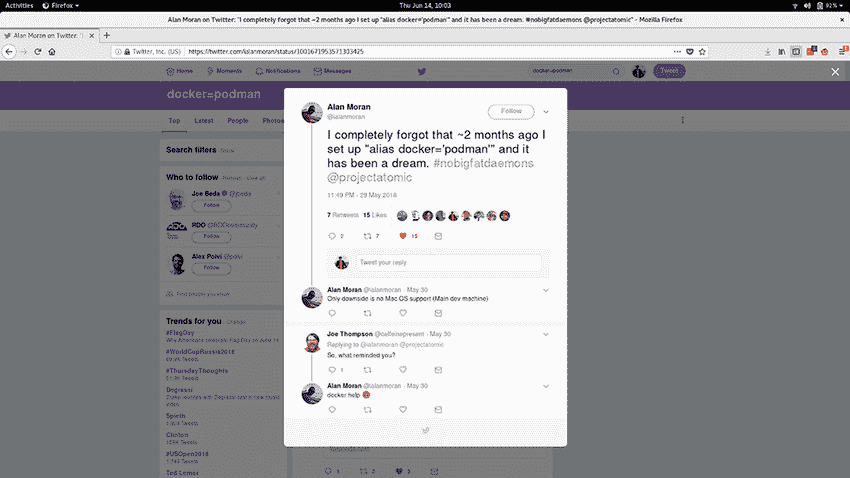

图 1.10 关于“alias docker=’podman’”的推文

回到 2018 年，Alan Moran 推文说：“我完全忘记了大约两个月前我设置了‘alias docker=“podman”’，这真是个梦。#nobigfatdaemons...”。Joe Thomson 回应道：“那么，是什么提醒你的？”Alan Moran 回答说：“docker help。”然后出现了 Podman 的帮助信息。

### 1.3.6 支持 REST API

Podman 可以作为 socket 激活的 REST API 服务运行。这允许远程客户端管理和启动 Podman 容器。Podman 支持 Docker API 以及用于高级 Podman 功能的 Podman API。通过使用 Docker API，Podman 支持`docker-compose`和其他使用 docker-py Python 绑定的用户。这意味着即使你围绕使用 Docker 套接字来启动容器构建了你的基础设施，你也可以简单地用 Podman 服务替换 Docker，并继续使用你现有的脚本和工具。第九章涵盖了 Podman 服务。

Podman REST API 还允许远程的 Mac、Windows 和 Linux 系统上的 Podman 客户端与 Linux 机器上的 Podman 容器交互。附录 E 和 F 涵盖了在 Mac 和 Windows 机器上使用 Podman。

### 1.3.7 与 systemd 的集成

Systemd 是操作系统中的基本初始化系统。Linux 系统上的初始化进程是内核在启动时启动的第一个进程。因此，初始化系统是所有进程的祖先，可以监控它们所有。Podman 希望将容器的运行与初始化系统完全集成。用户希望使用 systemd 在启动时启动和停止容器。容器应该执行以下操作：

+   在容器内支持 systemd

+   支持套接字激活

+   支持容器化应用程序完全激活的 systemd 通知

+   允许 systemd 完全管理容器化应用程序的 cgroups 和生命周期

基本上，容器在 systemd 单元文件中充当服务的作用。许多开发者希望在一个容器内运行 systemd，以便在容器内运行多个系统定义的服务。

然而，上游的 Docker 社区对此表示不同意，并拒绝了所有尝试将 systemd 集成到 Docker 中的拉取请求。他们认为 Docker 应该管理容器的生命周期，他们不希望满足那些希望在容器中运行 systemd 的用户的需求。

上游的 Docker 社区认为，与 systemd 相比，Docker 守护进程应该是进程的控制者，它应该管理容器的生命周期，并在启动时启动和停止它们。问题是 systemd 比 Docker 有更多功能，包括启动顺序、套接字激活、服务就绪通知等。图 1.11 是 DockerCon EU 上一位 Docker 员工的实际徽章，展示了他们对 systemd 的敌意。

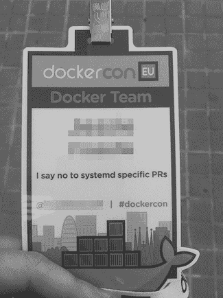

图 1.11 DockerCon EU 上 Docker 员工的徽章

当设计 Podman 时，开发者想要确保它与 systemd 完全集成。当你在一个容器内运行 systemd 时，Podman 会按照 systemd 期望的方式设置容器，并允许它以有限的权限简单地作为容器的 PID1 运行。Podman 允许你以与系统或虚拟机中相同的方式在容器内运行服务：通过 systemd 单元文件。Podman 支持套接字激活、服务通知以及许多其他 systemd 单元文件功能。Podman 使得生成适用于在 systemd 服务中运行容器的最佳实践 systemd 单元文件变得简单。有关更多信息，请参阅第七章关于 systemd 集成的部分。

容器项目([`github.com/containers`](https://github.com/containers))，其中包含 Podman、容器库和其他容器管理工具，希望拥抱操作系统的所有功能并完全集成。第七章解释了 Podman 与 systemd 的集成。

### 1.3.8 Pods

Podman 的一个优点可以从其名称中看出。如前所述，*Podman*实际上是*Pod Manager*的缩写。正如官方 Kubernetes 文档所述，“Pod（就像海豹群，因此有该标志，或豌豆荚）是一组一个或多个容器，具有共享的存储/网络资源，以及如何运行容器的规范。”Podman 可以一次与单个容器一起工作，就像 Docker 一样，或者它可以一起管理 Pod 中的容器组。容器的设计目标之一是将服务分离到单个容器中：微服务。然后你将容器组合起来构建更大的服务。Pods 允许你将多个服务组合在一起形成一个更大的服务，该服务作为一个单一实体进行管理。Podman 的一个目标之一是允许你尝试使用 Pods。图 1.12 显示了在系统上运行的两个 Pod，每个 Pod 包含三个容器。

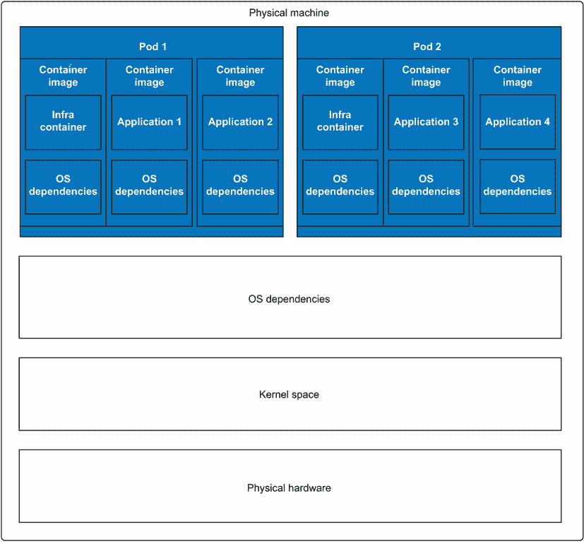

图 1.12 在主机上运行的两个 Pod。每个 Pod 运行两个不同的容器以及基础设施容器。

Podman 有一个`podman` `generate` `kube`命令，允许你从运行中的容器和 Pod 生成 Kubernetes YAML 文件，正如第七章中所示。同样，它还有一个`podman` `play` `kube`命令，允许你播放 Kubernetes YAML 文件并在你的主机上生成 Pod 和容器。我建议在单个主机上使用 Podman 运行 Pod 和容器，并使用 Kubernetes 将你的 Pod 和容器运行在多台机器上，并且在整个基础设施中运行。其他项目，如 kind ([`kind.sigs.k8s.io/docs/user/rootless`](https://kind.sigs.k8s.io/docs/user/rootless))，正在尝试在 Kubernetes 的指导下使用 Podman 运行 Pod。

### 1.3.9 可定制注册表

类似于 Podman 这样的容器引擎支持使用短名称拉取镜像的概念，例如 ubi8，而不必指定它们所在的注册库：[registry.access.redhat.com](http://registry.access.redhat.com)。完整的镜像名称包括它们从中拉取的容器注册库的名称：[registry.access.redhat.com/library/ubi8:latest](http://registry.access.redhat.com/library/ubi8:latest)。表 1.3 显示了镜像名称的组成部分。

表 1.3 短名称到容器镜像名称表

| Name | Registry | Repo | Name | Tag |
| --- | --- | --- | --- | --- |
| 短名称 |  |  | ubi8 |  |
| 完整名称 | registry.access.redhat.com | library | ubi8 | `latest` |

Docker 在默认情况下，使用短名称时总是从[`docker.io`](https://docker.io)拉取。如果您想从不同的容器注册库拉取镜像，您必须完全指定镜像。在以下示例中，我尝试拉取 ubi8/httpd-24，但失败了，因为容器镜像不在 docker.io 上。该镜像在[registry.access.redhat.com](http://registry.access.redhat.com)：

```
# docker pull ubi8/httpd-24
Using default tag: latest
Error response from daemon: pull access denied for ubi8/httpd-24, 
repository does not exist or may require 'docker login': denied: requested 
access to the resource is denied
```

因此，如果我想使用 ubi8/httpd-24，我被迫输入整个名称，包括注册库：

```
# docker pull registry.access.redhat.com/ubi8/httpd-24
```

Docker 引擎给 docker.io 带来了优势，使其成为首选的注册库。Podman 被设计成允许您指定多个注册库，就像使用`dnf`、`yum`和`apt`工具安装软件包时一样。您甚至可以删除 docker.io。如果您尝试使用 Podman 拉取 ubi8/httpd-24，Podman 会向您提供一个注册库列表以供选择：

```
$ podman pull ubi8/httpd-24
? Please select an image:  
    registry.fedoraproject.org/ubi8/httpd-24:latest
       ▸ registry.access.redhat.com/ubi8/httpd-24:latest
    docker.io/ubi8/httpd-24:latest
    quay.io/ubi8/httpd-24:latest
```

一旦您做出决定，Podman 会记录短名称别名，并且不再提示并使用之前选择的注册库。Podman 支持许多其他功能，如阻止注册库、仅拉取签名镜像、设置镜像镜像以及指定硬编码的短名称，以便特定的短名称直接映射到长名称（见第五章）。

### 1.3.10 多种传输

Podman 支持许多不同的容器镜像源和目标，这些被称为*传输*（见表 1.4）。Podman 可以从容器注册库和本地容器存储中拉取镜像，同时也支持存储在 OCI 格式、OCI TAR 格式、传统 Docker TAR 格式、目录格式以及直接从 Docker 守护进程中的镜像。Podman 命令可以轻松运行来自每种格式的镜像。

表 1.4 Podman 支持的传输

| 传输 | 描述 |
| --- | --- |
| 容器注册库（`docker`） | 引用存储在远程容器镜像注册网站中的容器镜像。注册库存储和共享容器镜像（例如，docker.io 和 quay.io）。 |
| `oci` | 引用符合 OCI 布局规范的容器镜像。manifest 和层 tar 包位于本地目录中作为单独的文件。 |
| `dir` | 引用符合 Docker 镜像布局的容器镜像，类似于`oci`传输，但使用传统的`docker`格式存储文件。 |
| `docker-archive` | 指向打包成 TAR 归档的 Docker 镜像布局中的容器镜像。 |
| `oci-archive` | 指向符合 OCI 布局规范的容器镜像，该镜像被打包成 TAR 归档。 |
| `docker-daemon` | 指向存储在 Docker 守护进程内部存储中的镜像。 |
| `container-storage` | 指向存储在本地存储中的容器镜像。Podman 默认使用容器存储来处理本地镜像。 |

### 1.3.11 完全可定制性

容器引擎通常有很多内置的常量，例如它们运行的命名空间、SELinux 是否启用以及容器运行时使用的权限。在 Docker 中，这些值大多数是硬编码的，默认情况下无法更改。而 Podman 则具有非常可定制的配置。

Podman 有其内置的默认值，但定义了三个位置来存储其配置文件：

+   */usr/share/containers/containers.conf*—在这里，发行版可以定义它希望使用的更改

+   */etc/containers/containers.conf*—在这里可以设置系统覆盖项

+   *$HOME/.config/containers/containers.conf*—只能在无根模式下指定

配置文件允许您通过默认方式配置 Podman 以满足您的需求。您甚至可以选择以更高的安全性默认运行。

### 1.3.12 用户命名空间支持

Podman 完全集成了用户命名空间。无根模式依赖于用户命名空间，这允许为用户分配多个 UID。用户命名空间在系统上的用户之间提供隔离，因此您可以拥有多个无根用户，他们使用多个用户 ID 运行容器，所有这些用户都是相互隔离的。

用户命名空间可以用来隔离容器。Podman 使启动具有唯一用户命名空间的多个容器变得简单。然后内核根据 UID 分隔将进程从主机用户以及彼此之间隔离。

Docker 只支持在单个、独立的用户命名空间中运行容器，这意味着所有容器都在同一个用户命名空间内运行。一个容器中的 root 与另一个容器中的 root 相同。它不支持在不同的用户命名空间中运行每个容器，这意味着容器从用户命名空间的角度相互攻击。尽管 Docker 支持这种模式，但几乎没有人使用 Docker 在单独的用户命名空间中运行容器。

## 1.4 何时不使用 Podman

与 Docker 类似，Podman 不是一个容器编排器。Podman 是一个用于在单个主机上以无根或根模式运行容器工作负载的工具。如果您想在多台机器上编排运行中的容器，则需要更高层次的工具。

我认为目前做这件事最好的工具是 Kubernetes。在市场份额方面，Kubernetes 赢得了容器编排器的战争。Docker 有一个名为 Swarm 的编排器，曾经相当受欢迎，但现在似乎已经不再流行。因为 Podman 团队认为 Kubernetes 是多机容器化的正确选择，所以 Podman 不支持 Swarm 功能。Podman 已被用于不同的编排器，并用于网格/HPC 计算，开源开发者甚至将其添加到了 Kubernetes 前端。

## 摘要

+   容器技术已经存在很多年了，但容器镜像和容器注册表的引入为开发者提供了更好的软件分发方式。

+   Podman 是一个出色的容器引擎，适用于几乎所有的单节点容器项目。它对于开发、构建和运行容器化应用程序非常有用。

+   Podman 的使用与 Docker 一样简单，具有完全相同的命令行界面。

+   Podman 支持 REST API，允许远程工具和语言，包括 `docker-compose`，与 Podman 容器一起工作。

+   与 Docker 不同，Podman 包含诸如用户命名空间支持、多种传输方式、可定制的注册表、系统集成、fork/exec 模型以及开箱即用的无根模式等显著特性。

+   Podman 是运行容器的一种更安全的方式。

* * *

¹ 其他容器引擎包括 Buildah、CRI-O、containerd 以及许多其他引擎。
