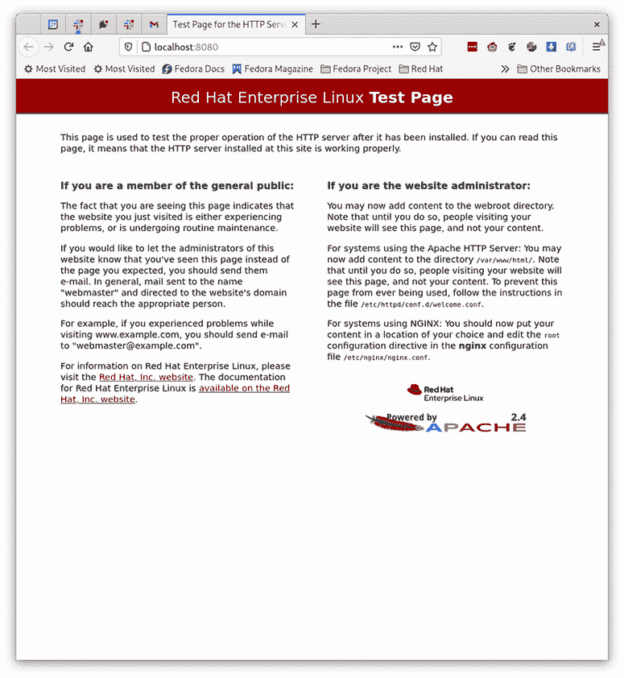
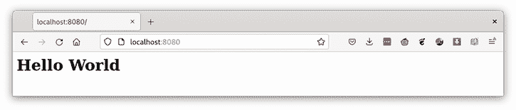
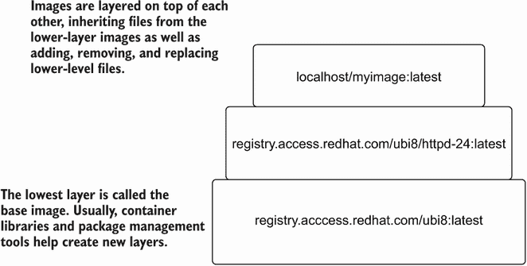
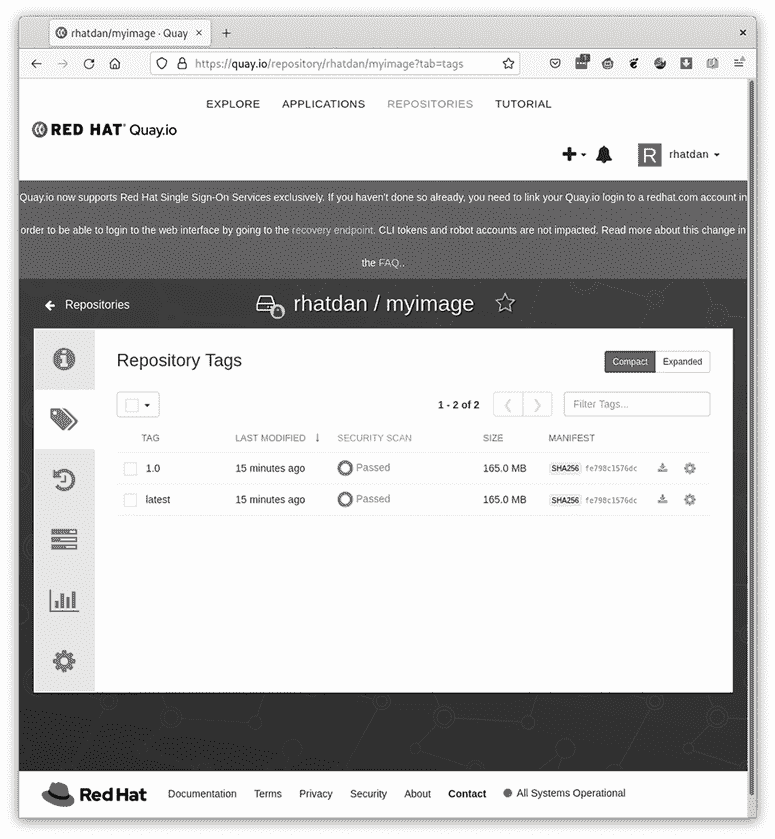

# 2 命令行

本章涵盖

+   Podman 命令行

+   运行 OCI 应用程序

+   比较容器和镜像

+   构建 OCI 基础镜像

Podman 是运行和构建容器化应用程序的优秀工具。在本章中，你将通过构建一个简单的 Web 应用程序来开始，以展示 Podman 命令行中常用的功能。

如果你的机器上没有安装 Podman，你可以跳转到附录 C，然后再返回这里。本章假设 Podman 4.1 或更高版本已经安装。Podman 的旧版本可能运行良好，但所有示例都是使用 Podman 4.1 进行测试的。我使用的示例基础镜像来自 registry.access.redhat.com/ubi8/httpd-24。

注意：通用基础镜像（UBI）可以在任何地方使用，但由 Red Hat 维护和审核的容器软件以及运行在 Red Hat 操作系统上的软件完全受支持。有数百个 Apache 镜像与此镜像类似，你也可以尝试使用。

第二章展示了 Podman 是一个处理容器的优秀工具。在本章中，我将带你通过运行可能用于构建容器化应用程序的场景。你启动一个容器，修改其内容，创建一个镜像，并将其发送到注册库。然后我解释了如何以自动化的方式执行这些操作以维护容器镜像的安全性。在这个过程中，你将接触到许多 Podman 命令行界面，并深入了解如何使用 Podman。

如果你是一个经验丰富的 Docker 用户，你可能只想快速浏览本章。你会知道很多内容，但 Podman 有许多独特的功能，例如挂载容器镜像（第 2.2.10 节）和不同的传输方式（第 2.2.4 节）。让我们先运行我们的第一个容器。

注意：Podman 是一个处于高度开发中的开源项目。Podman 被打包并提供在许多不同的 Linux 发行版上，以及 Mac 和 Windows 上。这些发行版可能正在运输 Podman 的旧版本，其中一些当前书籍中涵盖的功能可能不存在。本书中的一些示例假设你正在使用 Podman 4.1 或更高版本。如果示例无法正常工作，请更新你的 Podman 版本到最新版本。有关安装 Podman 的更多信息，请参阅附录 C。

## 2.1 与容器一起工作

在容器注册库中坐落着成千上万的不同的容器镜像。开发者、管理员、质量工程师和普通用户主要使用 `podman` `run` 命令来拉取和运行、测试或探索这些容器镜像。要开始构建容器化应用程序，你需要做的第一件事是与基础镜像开始工作。在我们的示例中，你将 registry.access.redhat.com/ubi8/httpd-24 镜像拉取并运行到你的家目录中的容器存储，并开始探索容器内部。

### 2.1.1 探索容器

在本节中，你将逐步检查一个典型的 Podman 命令。你将执行 `podman` 的 `run` 命令，该命令连接到 registry.access.redhat.com 容器注册库，并开始拉取镜像并将其存储在本地主目录中：

```
$ podman run -ti --rm registry.access.redhat.com/ubi8/httpd-24 bash
```

现在，我将分解你刚才执行的命令。默认情况下，`podman` 的 `run` 命令在容器退出前在前台执行容器化的命令。在这种情况下，你最终会在容器内看到一个 Bash 提示符，显示 `bash-4.4$` 提示符。当你退出这个 Bash 提示符时，Podman 会停止容器。

在这个例子中，你使用了两个选项：`-t` 和 `-i`，作为 `-ti`，这告诉 Podman 连接到终端。这会将容器的 `bash` 进程的输入、输出和错误流连接到你的屏幕，允许你在容器内进行交互：

```
$ podman run -ti --rm registry.access.redhat.com/ubi8/httpd-24 bash
```

`--rm` 选项告诉 Podman 在容器退出时立即删除容器，从而释放容器占用的所有存储空间：

```
$ podman run -ti --rm registry.access.redhat.com/ubi8/httpd-24 bash
```

接下来，指定你正在使用的容器镜像，即 registry.access.redhat.com/ubi8/httpd-24。`podman` 命令连接到 registry.access.redhat.com 容器注册库，并开始下载 ubi8/httpd-24:latest 镜像。Podman 会复制多个层（也称为 blob），如下所示，并将它们存储在本地容器存储中。你可以看到随着镜像层的拉取，进度条的变化。一些镜像相当大，拉取时可能需要很长时间。如果你稍后要在同一镜像上运行不同的容器，Podman 会跳过镜像拉取步骤，因为你已经拥有正确的镜像在本地容器存储中。

列表 2.1 从注册库拉取并运行容器镜像

```
$ podman run -ti --rm registry.access.redhat.com/ubi8/httpd-24 bash
Trying to pull registry.access.redhat.com/
➥ ubi8/httpd-24:latest...                                   ❶
Getting image source signatures
Checking if image destination supports signatures        
Copying blob 296e14ee2414 skipped: already exists            ❷
Copying blob 356f18f3a935 skipped: already exists            ❷
Copying blob 359fed170a21                                    ❷
➥ [========================>---------] 11.8MiB / 16.2MiB    ❷
Copying blob 226cafc3a0c6                                    ❷
➥ [=====>----------------------------]                      ❷
➥ 10.1MiB / 61.1MiB                                         ❷
```

❶ 与注册库建立联系

❷ 跳过层拉取。

最后，指定容器内要运行的可执行文件，在本例中是 `bash`：

```
$ podman run -ti --rm registry.access.redhat.com/ubi8/httpd-24 bash 
...
bash-4.4$
```

注意：镜像几乎总是有默认要执行的命令。只有当你想要覆盖镜像运行的默认应用程序时，才需要指定命令。在 registry.access.redhat.com/ubi8/httpd-24 镜像的情况下，它运行 Apache 网络服务器。

当你在 bash shell 容器内部时，运行 `cat /etc/os-release`，并注意它可能是一个不同的操作系统或版本，与容器外部的 `/etc/os-release` 不同。在容器内四处探索，并注意它与主机环境的不同之处：

```
bash-4.4$ grep PRETTY_NAME /etc/os-release 
PRETTY_NAME="Red Hat Enterprise Linux 8.4 (Ootpa)"
```

在我的主机上的另一个终端中，相同的命令输出

```
$ grep PRETTY_NAME /etc/os-release 
PRETTY_NAME="Fedora Linux 35 (Workstation Edition Prerelease)"
```

回到容器内部，你会注意到可用的命令要少得多：

```
bash-4.4$ ls /usr/bin | wc -l
525
```

然而，在主机上你看到

```
$ ls -l /usr/bin | wc -l
3303
```

执行 `ps` 命令以查看容器内正在运行哪些进程：

```
$ ps
PID TTY        TIME CMD
1 pts/0    00:00:00 bash
2 pts/0    00:00:00 ps
```

你只能看到两个进程：`bash` 脚本和 `ps` 命令。不用说，在我的主机机器上，有成百上千个进程正在运行（包括这两个进程）。你可以进一步探索容器内部，以了解容器内正在发生的事情。

完成后，你退出`bash`脚本，容器将关闭。由于你使用了`--rm`选项，Podman 将删除所有容器存储并删除容器。容器镜像仍然保留在`container/storage`中。现在你已经探索了容器的内部工作原理，是时候开始使用容器中的默认应用程序了。

### 2.1.2 运行容器化应用程序

在上一个示例中，你在一个容器化的应用程序中拉取并运行了`bash`，但你没有运行开发者希望你运行的应用程序。在这个下一个示例中，你将通过移除命令并使用几个新选项来运行实际的应用程序。

首先，移除`-ti`和`--rm`选项，因为你希望在`podman`命令退出时容器保持运行。你不是一个在容器内交互式运行的 shell，因为它只是运行容器化的网络服务：

```
$ podman run -d -p 8080:8080 --name myapp registry.access.redhat.com/ubi8/httpd-24
37a1d2e31dbf4fa311a5ca6453f53106eaae2d8b9b9da264015cc3f8864fac22
```

首先要注意的选项是`-d`（`--detach`）选项，它告诉 Podman 启动容器然后从它断开连接。基本上，在后台运行容器。Podman 命令实际上会退出并留下容器运行。第六章将更深入地探讨幕后发生的事情：

```
$ podman run -d -p 8080:8080 --name myapp registry.access.redhat.com/ubi8/httpd-24
```

`-p`（`--publish`）选项告诉 Podman 在容器运行时将容器端口`8080`发布或绑定到主机端口`8080`。使用`-p`选项时，冒号之前的部分指的是主机端口，而冒号之后的部分指的是容器端口。在这种情况下，你可以看到端口是相同的。如果你只指定一个端口，Podman 认为这个端口是容器端口，并随机选择一个主机端口来绑定容器端口。你可以使用`podman` `port`命令来发现哪些端口绑定到了容器。

列表 2.2 `podman` `port`命令的示例

```
$ podman port myapp
8080/tcp -> 0.0.0.0:8080    ❶
```

❶ 显示容器内部的 8080/tcp 端口绑定到主机网络的所有网络（0.0.0.0）的 8080 端口

默认情况下，容器在其自己的网络命名空间内创建，这意味着它们绑定到虚拟化网络而不是主机网络。假设我没有使用`-p`选项来执行容器。在这种情况下，容器内的 Apache 服务器绑定到容器网络命名空间内的网络接口，但 Apache 没有绑定到主机网络。

只有容器内的进程能够连接到端口`8080`以与网络服务器通信。通过带有`-p`选项的命令执行，Podman 将容器内的端口连接到指定端口的主机网络。这个连接允许外部进程，如网络浏览器，从网络服务中读取。

注意：如果您以无根模式运行容器，如第三章所述，Podman 用户默认不允许内核绑定端口 < 1024。一些容器想要绑定到较低的端口，如端口 80，这在容器内部是允许的，但 `-p` `80:80` 会失败，因为 80 小于 1024。使用 `-p` `8080:80` 会导致 Podman 将主机的端口 `8080` 绑定到容器内的端口 `80`。上游 Podman 仓库包含有关绑定端口小于 1024 以及许多其他问题的故障排除信息（见 [`mng.bz/69ry`](http://mng.bz/69ry)）。

`-p` 选项可以将容器内的端口号映射到容器外的不同端口号：

```
$ podman run -d -p 8080:8080 --name myapp registry.access.redhat.com/ubi8/httpd-24
```

在示例名称中，容器 `myapp` 使用了 `--name` `myapp` 选项。指定名称可以更容易地找到容器，并允许您指定一个名称，然后可以用于其他命令（例如，`podman` `stop` `myapp`）。如果您不指定名称，Podman 会自动生成一个唯一的容器名称以及容器 ID。所有与容器交互的 Podman 命令都可以使用名称或 ID：

```
$ podman run -d --name myapp -p 8080:8080 registry.access.redhat.com/ubi8/httpd-24
```

当 `podman` `run` 命令完成后，容器正在运行。由于此容器以分离模式运行，Podman 打印出容器 ID 并退出，但容器仍然在运行：

```
$ podman run -d -p 8080:8080 --name myapp registry.access.redhat.com/ubi8/httpd-24
37a1d2e31dbf4fa311a5ca6453f53106eaae2d8b9b9da264015cc3f8864fac22
```

现在容器正在运行，您可以通过启动一个网络浏览器来与容器内部的 Web 服务器进行通信，该服务器在 localhost 端口 `8080` 上运行（见图 2.1）：

```
$ web-browser localhost:8080
```



图 2.1 使用 Podman 运行的 ubi8/httpd-24 容器连接到 Web 浏览器窗口

恭喜！您已成功启动了您的第一个容器化应用程序。

现在假设您想要启动另一个容器。您可以通过进行一些更改来执行类似的命令：

```
$ podman run -d -p 8081:8080 --name myapp1 \ 
➥ registry.access.redhat.com/ubi8/httpd-24
fa41173e4568a8fa588690d3177150a454c63b53bdfa52865b5f8f7e4d7de1e1
```

注意，您需要将容器的名称更改为 `myapp1`；否则，由于容器之前已存在，使用 `myapp` 名称的 `podman` `run` 命令会失败。您还需要将 `-p` 选项更改为使用 `8081` 作为主机端口，因为之前的容器 `myapp` 目前正在运行并绑定到端口 `8080`。第二个容器不允许绑定到端口 `8080`，直到第一个容器退出：

```
$ podman run -d -p 8081:8080 --name myapp1 
     registry.access.redhat.com/ubi8/httpd-24
```

`podman` 的 `create` 命令几乎与 `podman` 的 `run` 命令相同。如果镜像不在容器存储中，`create` 命令会拉取镜像并配置容器信息以便运行，但不会执行容器。它通常与第 2.1.4 节中描述的 `podman` `start` 命令一起使用。您可能想要创建一个容器，然后稍后使用 systemd 单元文件来启动和停止容器。

一些值得注意的 `podman` `run` 选项包括以下内容：

+   --`user` `USERNAME`—这告诉 Podman 以在镜像中定义的特定用户运行容器。默认情况下，Podman 将以 root 用户身份运行容器，除非容器镜像指定了默认用户。

+   `--rm` — 这会在容器退出时自动删除容器。

+   `--tty` `-(t)` — 这分配一个伪 `-tty` 并将其附加到容器的标准输入。

+   `--interactive` `(-i)` — 这将 `stdin` 连接到容器的首要进程。这些选项在容器内为你提供了一个交互式 shell。

注意：有数十个 `podman run` 选项可供使用，允许你更改安全功能、命名空间、卷等。我在本书中使用了其中一些并进行了解释。请参阅 `podman-run` 的 man 页面以了解所有选项的描述。表 2.1 中定义的大多数 `podman create` 选项也适用于 `podman run`。

使用 `man podman-run` 命令获取所有选项的信息。现在容器已经启动并运行，是时候停止容器并进入下一步了。

### 2.1.3 停止容器

你有两个正在运行的容器，并且通过运行网页浏览器对它们进行了测试。为了通过实际向网页添加内容来继续开发，你可以使用 `podman stop` 命令停止容器：

```
$ podman stop myapp
```

`stop` 命令会停止之前使用 `podman run` 命令启动的容器。

当停止容器时，Podman 会检查正在运行的容器，并向容器的首要进程（PID1）发送停止信号，通常是 `SIGTERM`，然后默认等待 10 秒以等待容器停止。停止信号告诉容器内的首要进程优雅地退出。如果容器在 10 秒内没有停止，Podman 会向进程发送 `SIGKILL` 信号，强制容器停止。这 10 秒的等待时间给容器内的进程提供了清理和提交更改的时间。

可以使用 `podman run --stop-signal` 选项更改容器的默认停止信号。有时容器的首要或初始化进程会忽略 `SIGTERM`（例如，在容器内部使用 systemd 作为首要进程的容器）。systemd 忽略 `SIGTERM` 并指定使用 `SIGRTMIN+3`（信号 `#37`）信号来关闭。停止信号可以嵌入到容器镜像中，正如我在第 2.3 节中描述的那样。

一些容器会忽略 `SIGTERM` 停止信号，这意味着你必须等待 10 秒才能让容器退出。如果你知道容器忽略了默认的停止信号，并且你不在乎容器进行清理，你只需将 `-t 0` 选项添加到 `podman stop` 中，就可以立即发送 `SIGKILL` 信号：

```
$ podman stop -t 0 myapp1
myapp1
```

Podman 有一个类似的命令 `podman kill`，它发送指定的终止信号。当你想要向容器发送信号而不实际停止容器时，`podman kill` 命令非常有用。

一些值得注意的 Podman 停止选项包括以下内容：

+   `--timeout` `(-t)` — 这设置超时时间；`-t 0` 在等待容器停止之前发送 `SIGKILL` 信号。

+   `--latest` `(-l``)`—这是一个有用的选项，允许您停止最后一个创建的容器，而不是必须使用容器名称或容器 ID。大多数需要您指定容器名称或 ID 的 Podman 命令也接受 `--latest` 选项。此选项仅在 Linux 机器上可用。

+   `--all`—这告诉 Podman 停止所有正在运行的容器。类似于 `--latest`，需要容器名称或容器 ID 参数的 Podman 命令也接受 `--all` 选项。

使用 `man` `podman-stop` 命令获取所有选项的信息。

最终，您的系统将会有很多停止的容器，有时您需要重新启动它们（例如，如果系统重启）。另一个常见用例是首先创建一个容器，然后稍后启动它。下一节将解释如何启动容器。

### 2.1.4 启动容器

您创建的容器现在已经停止。接下来，您可能想要使用以下列表中的命令重新启动它。

列表 2.3 启动容器的示例

```
$ podman start myapp
myapp                  ❶
```

❶ 启动命令打印已启动容器的名称。

`podman` `start` 命令启动一个或多个容器。此命令将输出容器 ID，表示您的容器正在运行。您现在可以使用网络浏览器重新连接到它。`podman` `start` 的一个常见用例是在重启后启动所有在关机期间停止的容器。

一些喜欢的 Podman 启动选项包括以下内容：

+   `--all`—这会启动容器存储中所有停止的容器。

+   `--attach`—这会将您的终端连接到容器的输出。

+   `--interactive` `(-i``)`—这会将终端输入连接到容器。

使用 `man` `podman-start` 命令获取所有选项的信息。

在您使用 Podman 一段时间并拉取并运行了许多不同的容器镜像之后，您可能想要找出哪些容器正在运行或您在本地存储中有哪些容器。您将需要能够列出这些容器。

### 2.1.5 列出容器

您可以列出正在运行的容器和之前创建的所有容器。使用 `podman` `ps` 命令列出容器：

```
$ podman ps
CONTAINER ID IMAGE                      COMMAND        CREATED \ 
➥   STATUS         PORTS          NAMES
b1255e94d084 registry.access.redhat.com/ubi8/httpd-24:latest /usr/bin/run-\ 
➥ http... 6 minutes ago Up 4 minutes ago 0.0.0.0:8080->8080/tcp myapp
```

注意，默认情况下 `podman` `ps` 命令列出正在运行的容器。使用 `--all` 选项查看所有容器：

```
$ podman ps --all
CONTAINER ID IMAGE                       COMMAND        CREATED \ 
➥   STATUS          PORTS          NAMES
b1255e94d084 registry.access.redhat.com/ubi8/httpd-24:latest /usr/bin/run-\
➥ http... 9 minutes ago Up 8 minutes ago     0.0.0.0:8080->8080/tcp myapp
3efee4d39965 registry.access.redhat.com/ubi8/httpd-24:latest /usr/bin/run-\
➥ http... 7 minutes ago Exited (0) 3 minutes ago 0.0.0.0:8081->8080/tcp myapp1
```

一些值得注意的 `podman` `ps` 选项包括以下内容：

+   `--all`—这告诉 Podman 列出所有容器而不是仅列出正在运行的容器。

+   `--quiet`—这告诉 Podman 只打印容器 ID。

+   `--size`—这告诉 Podman 返回每个容器（除了基于它们的镜像）当前使用的磁盘空间量。

使用 `man` `podman-ps` 命令获取所有选项的信息。现在您已经知道了系统上所有的容器，您可能想要检查它们的内部结构。

### 2.1.6 检查容器

为了完全了解一个容器，有时您想知道容器基于哪个镜像，容器默认获取哪些环境变量，或者容器使用的安全设置是什么。`podman` `ps`命令为我们提供了一些关于容器的数据，但如果您想真正检查有关容器的信息，您可以使用`podman` `inspect`命令。

`podman` `inspect`命令也可以用来检查镜像、网络、卷和 Pod。`podman` `container` `inspect`命令也是可用的，并且是针对容器的。但大多数用户只是输入较短的`podman` `inspect`命令：

```
$ podman inspect myapp
[
  {
      "Id": "240271ae90480d3836b1477e5c0b49fbd3883846ca474e3f6effdfb271f4ff54",
      "Created": "2021-09-27T05:27:47.163828842-04:00",
      "Path": "container-entrypoint",
      "Args": [
          "/usr/bin/run-httpd"
      ],
...
]
```

如您所见，`podman` `inspect`命令输出一个大的 JSON 文件——在我的机器上有 307 行。所有这些信息最终都会传递给 OCI 运行时以启动容器。当使用`inspect`命令时，通常最好将其输出通过`less`或`grep`管道，以找到您感兴趣的字段。或者，您可以使用格式选项。如果您想检查启动容器时执行的命令，请执行以下操作。

列表 2.4 检查要执行的指定容器命令

```
$ podman inspect --format '{{ .Config.Cmd }}' myapp     ❶
[/usr/bin/run-httpd]
```

❶ 检查正在显示来自 OCI 镜像规范的数据。

或者，如果您想查看停止信号，请执行以下操作。

列表 2.5 检查停止容器时使用的停止信号

```
$ podman inspect --format '{{ .Config.StopSignal }}' myapp
15       ❶
```

❶ 所有容器的默认停止信号为 15（SIGTERM）。

一些显著的`podman` `inspect`选项包括以下内容：

+   `--latest` `(-l``)`—这很方便，因为它允许您快速检查最新创建的容器，而不是指定容器名称或容器 ID。

+   `--format`—正如之前所示，这很有用，可以从中提取 JSON 中的特定字段。

+   `--size`—这会增加容器使用的磁盘空间量。收集这些信息需要很长时间，因此默认情况下不会执行。

使用`man` `podman-inspect`命令获取有关所有选项的信息。在检查完容器后，您可能会意识到您不再需要占用存储空间的该容器，因此您需要删除它。

### 2.1.7 删除容器

如果您已经使用完一个容器，您可能想删除该容器以释放磁盘空间或重用容器名称。记得您启动了第二个名为`myapp1`的容器吗？您不再需要它，因此可以删除它。在删除之前，请确保停止容器（第 2.1.3 节）。然后使用`podman` `rm`命令删除容器：

```
$ podman rm myapp1
3efee4d3996532769356ffea23e1f50710019d4efc704d39026c5bffd6aa18be
```

一些显著的`podman` `rm`选项包括以下内容：

+   `--all`—如果您想删除所有容器，此选项很有用。

+   `--force`—此选项告诉 Podman 在删除时停止所有正在运行的容器。

使用`man` `podman-rm`命令获取有关所有选项的信息。现在您已经了解了一些命令，是时候开始修改正在运行的容器了。

### 2.1.8 在容器中执行

通常，当容器正在运行时，你可能会想在容器内启动另一个进程以进行调试或检查正在发生的事情。在某些情况下，你可能想要修改容器使用的一些内容。

假设你想进入你的容器并修改它显示的网页。你可以使用`podman` `exec`命令进入容器。使用`--interactive`（`-i`）选项允许你在容器内执行命令。你需要指定容器的名称`myapp`并在容器内执行 Bash 脚本。如果你停止了`myapp`容器，你需要重新启动它，因为`podman` `exec`只对正在运行的容器有效。

在以下示例中，你将在容器中`exec`一个`bash`进程来创建`/var/www/html/index.xhtml`文件。你将写入 HTML 内容，使容器化的网站显示`Hello` `World`：

```
 $ podman exec -i myapp bash -c 'cat > /var/www/html/index.xhtml' << _EOF
<html>
 <head>
 </head>
 <body>
  <h1>Hello World</h1>
 </body>
</html>
_EOF
```

第二次`exec`回到容器中，你可以看到文件已被成功修改。这表明通过`exec`对容器的修改是永久性的，即使你停止并重新启动了容器，这些修改也会保留。`podman` `run`和`podman` `exec`之间的一个关键区别是`run`从一个带有内部运行进程的图像创建一个新的容器，而`exec`在现有容器内部启动进程：

```
$ podman exec myapp cat /var/www/html/index.xhtml
<html>
 <head>
 </head>
 <body>
  <h1>Hello World</h1>
 </body>
</html>
```

现在，让我们将一个网络浏览器连接到容器以查看内容是否已更改（见图 2.2）：

```
$ web-browser localhost:8080
```



图 2.2 Web 浏览器窗口连接到在 Podman 中运行的更新后的 Hello World HTML 的 ubi8/httpd-24 容器

一些值得注意的`podman` `exec`选项包括以下内容：

+   `--tty`—这会将一个`-tty`连接到`exec`会话。

+   `--interactive`—`-i`选项告诉 Podman 以交互模式运行，这意味着你可以与一个`exec`执行的程序交互，比如一个 shell。

使用`man` `podman-exec`命令获取所有选项的信息。

现在你已经创建了一个应用程序，你可能想要与他人分享它。首先，你需要将容器提交为一个图像。

### 2.1.9 从容器创建图像

开发者通常从基础镜像运行容器以创建一个新的容器环境。一旦完成，他们将这个环境打包成一个容器图像以便与其他用户分享。然后，这些用户可以使用 Podman 启动容器化应用程序。你可以通过将容器提交到 OCI 图像来实现这一点。

首先，停止或暂停容器以确保在提交过程中没有任何内容被修改：

```
$ podman stop myapp
```

现在你可以执行`podman` `commit`命令，将你的应用程序容器`myapp`提交，创建一个名为`myimage`的新图像：

```
$ podman commit myapp myimage
Getting image source signatures
Copying blob e39c3abf0df9 skipped: already exists
Copying blob 8f26704f753c skipped: already exists
Copying blob 83310c7c677c skipped: already exists
Copying blob 654b3bf1361e skipped: already exists
Copying blob 9e816183404c done              Copying config e38084bb8a done
Writing manifest to image destination
Storing signatures
e38084bb8a76104a7cac22b919f67646119aff235bb1cfcba5478cc1fbf1c9eb
```

现在你可以通过调用`podman` `start`继续运行现有的`myapp`容器，或者你可以基于`myimage`创建一个新的容器：

```
$ podman run -d --name myapp1 -p 8080:8080 myimage
0052cb32c8e63b845ac5dfd5ba176b8204535c2c6cafa3277453424de601263f
```

注意：使用 `podman` `commit` 命令来创建镜像不是一种常见的方法。构建容器镜像的整个过程可以使用 `podman` `build` 脚本化和自动化。有关此过程的更多信息，请参阅第 2.3 节。

一些显著的 `podman` `commit` 选项包括以下内容：

+   `--pause`—在提交过程中暂停正在运行的容器。注意我在提交之前停止了容器，尽管我可以简单地暂停它。`podman` `pause` 和 `podman` `unpause` 命令允许您直接暂停和恢复容器。

+   `--change`—此选项允许您提交关于使用镜像的说明。说明包括 `CMD`、`ENTRYPOINT`、`ENV`、`EXPOSE`、`LABEL`、`ONBUILD`、`STOPSIGNAL`、`USER`、`VOLUME` 和 `WORKDIR`。这些说明与 Containerfile 或 Dockerfile 中的指令相对应。

使用 `man` `podman-commit` 命令获取所有选项的信息。表 2.1 列出了所有 Podman 容器命令。

现在您已经将容器提交为镜像，是时候展示 Podman 如何与镜像一起工作了。

注意：您已经检查了一些 Podman 容器命令，但还有很多。使用 `podman-container(1)` 手册页来探索所有这些命令，以及本节中指定命令的完整描述。

表 2.1 Podman 容器命令

| 命令 | 手册页 | 描述 |
| --- | --- | --- |
| `attach` | `podman-container-attach(1)` | 连接到正在运行的容器。 |
| `checkpoint` | `podman-container-checkpoint(1)` | 创建容器的检查点。 |
| `cleanup` | `podman-container-cleanup(1)` | 清理容器的网络和挂载点。 |
| `commit` | `podman-container-commit(1)` | 将容器提交到镜像中。 |
| `cp` | `podman-container-cp(1)` | 将文件或文件夹复制到容器中或从容器中复制出来。 |
| `create` | `podman-container-create(1)` | 创建一个新的容器。 |
| `diff` | `podman-container-diff(1)` | 检查容器文件系统中的更改。 |
| `exec` | `podman-container-exec(1)` | 在容器中运行进程。 |
| `exists` | `podman-container-exists(1)` | 检查容器是否存在。 |
| `export` | `podman-container-export(1)` | 将容器的文件系统导出为 TAR 归档。 |
| `init` | `podman-container-init(1)` | 初始化容器。 |
| `inspect` | `podman-container-inspect(1)` | 显示容器的详细信息。 |
| `kill` | `podman-container-kill(1)` | 向容器中的主进程发送信号。 |
| `List` `(ps``)` | `podman-container-list(1)` | 列出所有容器。 |
| `logs` | `podman-container-logs(1)` | 获取容器的日志。 |
| `mount` | `podman-container-mount(1)` | 挂载容器的根文件系统。 |
| `pause` | `podman-container-pause(1)` | 暂停容器。 |
| `port` | `podman-container-port(1)` | 列出容器的端口映射。 |
| `prune` | `podman-container-prune(1)` | 删除所有非运行中的容器。 |
| `rename` | `podman-container-rename(1)` | 重命名现有的容器。 |
| `restart` | `podman-container-restart(1)` | 重新启动一个容器。 |
| `restore` | `podman-container-restore(1)` | 恢复已检查点的容器。 |
| `rm` | `podman-container-rm(1)` | 删除一个容器。 |
| `run` | `podman-container-run(1)` | 在新容器中运行命令。 |
| `runlabel` | `podman-container-runlabel(1)` | 执行由镜像标签描述的命令。 |
| `start` | `podman-container-start(1)` | 启动一个容器。 |
| `stats` | `podman-container-stats(1)` | 显示容器的统计信息。 |
| `stop` | `podman-container-stop(1)` | 停止一个容器。 |
| `top` | `podman-container-top(1)` | 显示容器中的运行进程。 |
| `unmount` | `podman-container-unmount(1)` | 卸载容器的根文件系统。 |
| `unpause` | `podman-container-unpause(1)` | 恢复 pod 中所有容器的暂停状态。 |
| `wait` | `podman-container-wait(1)` | 等待容器退出。 |

## 2.2 与容器镜像一起工作

在上一节中，你尝试了与容器的基本操作，包括检查和提交到容器镜像。在本节中，你将尝试与容器镜像一起工作，了解它们与容器之间的区别，以及如何通过容器注册库来共享它们。

### 2.2.1 容器和镜像之间的区别

计算机编程的一个问题是，相同的名称被不断地用于不同的目的。在容器世界中，没有比 *container* 更被过度使用的术语了。通常 *container* 指的是 Podman 启动的运行进程。但 *container* 也可以指作为非运行对象坐在容器存储中的容器数据。正如你在上一节中看到的，`podman ps --all` 显示了运行和非运行的容器。

另一个例子是术语 *namespace*，它在许多不同的方式中被使用。当人们谈论 Kubernetes 中的命名空间时，我经常感到困惑。有些人听到这个术语就会想到 *虚拟集群*，但当我听到它时，我会想到与 Pods 和容器一起使用的 Linux 命名空间。同样，*image* 可以指 VM 镜像、容器镜像、OCI 镜像或存储在容器注册库中的 Docker 镜像。

我认为容器是在环境中执行进程或在准备运行的东西。相比之下，镜像是被 *提交* 的 *容器*，准备与他人共享。其他用户或系统可以使用这些镜像来创建新的容器。

容器镜像只是提交的容器。OCI 定义了镜像的格式。Podman 使用容器/镜像库 ([`github.com/containers/image`](https://github.com/containers/image)) 与镜像的所有交互。容器镜像可以存储在不同的存储或传输类型中，因为 *container/image* 就是指这些。这些传输可以是容器注册库、Docker 存档、OCI 存档、`docker-daemon`，以及 containers/storage。有关传输的更多信息，请参阅 2.2.4 节。

在 Podman 的上下文中，我通常将镜像称为存储在容器存储或容器注册库（如 docker.io 和 quay.io）中的本地内容。Podman 使用 GitHub container/storage 库（[`github.com/containers/storage`](https://github.com/containers/storage)）来处理本地存储的镜像。让我们更详细地看看它。

容器/存储库提供了存储容器的概念。基本上，存储容器是尚未提交的中间存储内容。把它们想象成磁盘上的文件和一些描述内容的 JSON。Podman 有自己的与 Podman 容器相关的数据存储库，Podman 需要同时处理其容器的多个用户。它依赖于 containers/storage 提供的文件系统锁定，以确保数百个 Podman 可执行文件可以可靠地共享相同的数据存储库。

当你将容器提交到存储时，Podman 将容器存储复制到镜像存储。镜像存储在一系列层中，每次提交都会创建一个新的层。

我喜欢将镜像想象成一个婚礼蛋糕（图 2.3）。在我们之前的例子中，你使用了 ubi8/httpd-24 镜像，它由两层组成：基础层是 ubi8，然后镜像提供的添加了 `httpd` 包和其他一些内容，创建了 ubi8/httpd-24。现在当你提交上一节中的容器时，Podman 在 ubi8/httpd-24 镜像之上添加了另一个层，称为 `myimage`。



图 2.3 展示了构成我们的 Hello World 应用程序的镜像的婚礼蛋糕展示。

一个方便的 Podman 命令，用于显示镜像的层，是 `podman` `image` `tree` 命令：

```
$ podman image tree myimage
Image ID: 2c7e43d88038
Tags:   [localhost/myimage:latest]
Size:   461.7MB
Image Layers
├── ID: e39c3abf0df9 Size: 233.6MB
├── ID: 42c81bd2b468 Size: 20.48kB Top Layer of: [registry.access.redhat.com/ubi8:latest]
├── ID: 51a7beaa0b88 Size: 57.43MB
├── ID: 519e681b5702 Size: 170.6MB Top Layer of: [registry.access.redhat.com/ubi8/httpd-24:latest]
└── ID: bc3dcdefdac3 Size: 69.63kB Top Layer of: [localhost/myimage:latest localhost/myapp:latest]
```

你可以看到，镜像 `myimage` 由五个层组成。

另一个有用的 Podman 命令，`podman` `image` `diff`，允许你看到与另一个镜像或底层相比实际已更改（C）、已添加（A）或已删除（D）的文件和目录：

```
$ podman image diff myimage ubi8/httpd-24 
C /etc/group
C /etc/httpd/conf
C /etc/httpd/conf/httpd.conf
C /etc/httpd/conf.d
C /etc/httpd/conf.d/ssl.conf
C /etc/httpd/tls
C /etc
C /etc/httpd
A /etc/httpd/tls/localhost.crt
A /etc/httpd/tls/localhost.key
...
```

镜像只是应用于底层镜像的软件的 TAR 差分，容器内容是软件的一个未提交层。一旦容器被提交，你就可以在你的镜像之上创建其他容器。你还可以与他人共享镜像，这样他们就可以在你的镜像上创建其他容器。现在让我们看看你的容器存储中的所有镜像。

### 2.2.2 列出镜像

在容器部分，你正在处理镜像，并使用 `podman` `images` 命令列出本地存储中的镜像：

```
$ podman images
REPOSITORY                   TAG        IMAGE ID       CREATED     SIZE
localhost/myimage         latest    2c7e43d88038  46 hours ago   462 MB
registry.access.redhat
➥.com/ubi8/httpd-24      latest    8594be0a0b57   5 weeks ago   462 MB
registry.access.redhat
➥.com/ubi8               latest    ad42391b9b46   5 weeks ago   234 MB
```

让我们看看默认输出中的不同字段。表 2.2 描述了 `podman` `images` 命令可用的不同字段和数据。你将在本节中使用 `podman` `images` 命令。

表 2.2 由 `podman` `images` 命令列出的默认字段

| 标题 | 描述 |
| --- | --- |
| `Repository` | 镜像的完整名称。 |
| `TAG` | 镜像的版本（标签）。镜像标记将在 2.2.6 节中介绍。 |
| `IMAGE ID` | 镜像的唯一标识符。它由 Podman 通过镜像的 JSON 配置对象的 SHA256 哈希生成。 |
| `CREATED` | 自镜像创建以来经过的时间。默认情况下，镜像按此字段排序。 |
| `SIZE` | 镜像使用的存储量。 |

注意：随着时间的推移，你拉取的所有镜像使用的存储量会增加。用户耗尽磁盘空间相对常见，因此你应该监控镜像和容器的大小，在你不再使用它们时删除它们。使用 `man` `podman-system-prune` 命令获取更多关于清理的信息。

一个值得注意的 `podman` 镜像选项如下：

+   `--all`——此选项对于列出所有镜像很有用。默认情况下，`podman-images` 只列出当前正在使用的镜像。当一个镜像被具有相同标签的新镜像替换时，之前的镜像会被标记为 `<none><none>`；这些镜像被称为悬挂镜像。我在第 2.3.1 节中介绍了悬挂镜像。

使用 `man` `podman-images` 命令来获取所有选项的信息。类似于容器，你可能会想通过检查来查看与镜像关联的配置信息。

### 2.2.3 检查镜像

在前面的章节中，我提到了几个检查镜像的命令。我使用了 `podman` `image` `diff` 来检查镜像之间创建或删除的文件和目录。我还展示了使用 `podman` `image` `tree` 命令查看镜像层次结构或婚礼蛋糕层的办法。

有时你可能想检查镜像的配置；使用 `podman` `image` `inspect` 命令来做这件事。`podman` `inspect` 命令也可以用来检查镜像，但名称可能与容器冲突，所以我更喜欢使用特定的镜像命令：

```
$ podman image inspect myimage
[
  {
      "Id": "3b8fcf9081b4c4e6c16d763b8d02684df0737f3557a1e03ebfe4cc7cd6562135",
      "Digest":
"sha256:ff49aa6253ae47569d5aadbd73d70e7d0431bcf3a2f57b1b56feecdb531029a3",
      "RepoTags": [
          "localhost/myimage:latest"
      ],
      "RepoDigests": [       "localhost/myimage@sha256:ff49aa6253ae47569d5aadbd73d70e7d0431bcf3a2f57b1b\
➥ 56feecdb531029a3"
      ],
...
]
```

如你所见，这个命令输出了一个大的 JSON 数组——在先前的例子中有 153 行——它包括了用于 OCI 镜像格式规范的所需数据。当你从一个镜像创建容器时，这些信息被用作创建容器的输入之一。

当使用 `inspect` 命令时，通常最好将其输出通过 `less` 或 `grep` 管道，以找到你感兴趣的特定字段。或者，你也可以使用 `--format` 选项。

如果你想要检查从这个镜像执行默认命令的情况，请执行以下操作：

```
$ podman image inspect --format '{{ .Config.Cmd }}' myimage
[/usr/bin/run-httpd]
```

或者，如果你想查看停止信号，执行以下命令：

```
$ podman image inspect --format '{{ .Config.StopSignal }}' myimage
```

如你所见，没有输出任何内容，这意味着应用程序的开发者没有指定 `STOPSIGNAL`。当你从这个镜像构建容器时，`STOPSIGNAL` 是默认的 `15`，除非你通过命令行覆盖它。

一个值得注意的 `podman` `image` `inspect` 选项如下：

+   `--format`——如上所示，这很有用，可以提取 json 中的特定字段。

使用 `man` `podman-image-inspect` 命令来获取关于该命令的信息。

一旦你对一个容器满意并将其提交为镜像，下一步就是与他人分享或者可能在另一个系统上运行它。你需要将镜像推送到其他类型的容器存储，通常是容器注册库。

### 2.2.4 推送镜像

在 Podman 中，你使用 `podman` 的 `push` 命令将镜像及其所有层从容器存储复制出来，并将其推送到其他形式的容器镜像存储，如容器注册库。Podman 支持几种不同类型的容器存储，它称之为传输。

容器传输

Podman 使用 containers/image 库（[`github.com/containers/image`](https://github.com/containers/image)）来拉取和推送镜像。我把 containers/image 项目描述为在不同类型的容器存储之间复制镜像的库。正如你所看到的，其中一种存储是 containers/storage。

当推送一个镜像时，使用 `transport:ImageName` 格式指定 `[destination]`。如果没有指定传输方式，默认使用 `docker`（容器注册库）传输方式。

如我之前解释的，Docker 做的一件新颖的事情是发明了容器注册库的概念——基本上是一个包含容器镜像的网页服务器。docker.io、quay.io 和 Artifactory 网页服务器都是容器注册库的例子。Docker 工程团队定义了一个从容器注册库拉取和推送这些镜像的协议，我将其称为容器注册库或 `docker` 传输。

当我想运行一个镜像的容器时，我可以完全指定镜像名称，包括传输方式，如下面的命令所示：

```
$ podman run docker://registry.access.redhat.com/ubi8/httpd-24:latest echo hello
hello
```

对于 Podman，`docker://` 传输是默认的；为了方便可以省略：

```
$ podman run registry.access.redhat.com/ubi8/httpd-24:latest echo hello
hello
```

在上一节中创建的 `myimage` 镜像是本地创建的，这意味着它没有与之关联的注册库。默认情况下，本地创建的镜像与 localhost 注册库相关联。你可以使用 `podman` 的 `images` 命令在 `containers/storage` 中查看镜像：

```
$ podman images
REPOSITORY                        TAG        IMAGE ID       CREATED    SIZE
localhost/myimage              latest    2c7e43d88038  46 hours ago  462 MB
registry.access.redhat
➥.com/ubi8/httpd-24           latest    8594be0a0b57   5 weeks ago  462 MB
registry.access.redhat
➥.com/ubi8                    latest    ad42391b9b46   5 weeks ago  234 MB
```

如果镜像与远程注册库相关联（例如，registry.access.redhat.com/ubi8），则可以不指定 `[destination]` 字段进行推送。相反，由于 localhost/myimage 没有与之关联的注册库，需要指定远程注册库（例如，quay.io/rhatdan）：

```
$ podman push myimage quay.io/rhatdan/myimage
Getting image source signatures
Copying blob 164d51196137 done 
Copying blob 8f26704f753c done 
Copying blob 83310c7c677c done 
Copying blob 654b3bf1361e [==================>-------------------] 82.0MiB / 162.7MiB
Copying blob e39c3abf0df9 [================>---------------------] 100.0MiB / 222.8MiB
```

注意：在执行 `podman` 的 `push` 命令之前，我使用 `podman` 的 `login` 登录到 quay.io/rhatdan 账户，这将在下一节中介绍。

在 `push` 命令完成后，如果其他用户有权访问这个容器注册库，镜像将可供他们拉取。表 2.3 描述了支持不同类型容器存储的传输方式。

表 2.3 Podman 支持的传输

| 传输 | 描述 |
| --- | --- |
| 容器注册库（Docker） | 默认传输。它引用存储在远程容器图像注册库中的容器图像。容器注册库是存储和共享容器图像的地方（例如，docker.io 或 quay.io）。 |
| `oci` | 指向符合 Open Container Image Layout 规范的容器图像。清单和层 tarball 作为单独的文件位于本地目录中。 |
| `dir` | 指向符合 Docker 图像布局的容器图像。它与 `oci` 传输非常相似，但使用传统的 Docker 格式存储文件。它是一种非标准化格式，主要用于调试或非侵入式容器检查。 |
| `docker-archive` | 指向 Docker 图像布局中的容器图像，它被打包成一个 TAR 归档。 |
| `oci-archive` | 指向符合 Open Container Image Layout 规范的图像，它被打包成一个 TAR 归档。它与 `docker-archive` 传输非常相似，但它以 OCI 格式存储图像。 |
| `docker-daemon` | 指向存储在 Docker 守护进程内部存储中的图像。由于 Docker 守护进程需要 root 权限，Podman 必须由 root 用户运行。 |
| `container-storage` | 指向位于本地容器存储中的图像。它不是一个传输，而更像是一种存储图像的机制。它可以用来将其他传输转换为 `container-storage`。Podman 默认使用 `container-storage` 来存储本地图像。 |

您想将图像推送到容器注册库，但如果您尝试推送，容器注册库会拒绝您的推送，因为您没有提供登录授权信息。您需要执行 `podman` `login` 来创建授权。

### 2.2.5 podman login：登录到容器注册库

在上一节中，我通过执行以下操作将图像推送到我的容器注册库：

```
$ podman push myimage quay.io/rhatdan/myimage
```

然而，我遗漏了一个关键步骤：使用正确的凭证登录到容器注册库。这是推送容器图像的必要步骤。它也是从私有注册库拉取容器图像所必需的。

要在本节中跟随操作，您需要在容器注册库中设置一个账户；有多个容器注册库可供选择。[`quay.io`](https://quay.io) 和 [`docker.io`](https://docker.io) 注册库都提供免费账户和存储。您的公司可能有一个私有注册库，在那里您也可以获得一个账户。

对于示例，我将继续使用我在 quay.io 的 rhatdan 账户。登录以获取您的凭证：

```
$ podman login quay.io
Username: rhatdan
Password: 
Login Succeeded!
```

注意 Podman 命令会在注册库中提示您输入用户名和密码。`podman` `login` 命令有选项可以在命令行上传递用户名/密码信息，以避免提示，让您能够自动化登录过程。

要为用户存储认证信息，`podman login` 命令会创建一个 auth.json 文件。默认情况下，它存储在 /run/user/$UID/containers/auth.json 文件中：

```
cat /run/user/3267/containers/auth.json 
{
  "auths": {
    "quay.io": {
      "auth": "OBSCURED-BASE64-PASSWORD"
    }
  }
}
```

auth.json 文件包含你的注册表密码，以 Base64 编码的字符串形式；其中不涉及加密。因此，auth.json 文件需要受到保护。Podman 默认将文件存储在 /run 中，因为它是一个临时文件系统，当你注销或系统重启时会被销毁。/run/user/$UID/containers 目录对系统上的其他用户不可访问。

可以通过指定 `--auth-file` 选项来覆盖位置。或者，你可以使用 `REGISTRY_AUTH_FILE` 环境变量来修改其位置。如果两者都指定了，则使用 `--auth-file` 选项。所有容器工具都使用此文件来访问容器注册表。

可以多次运行 `podman login` 命令以登录多个注册表，并将登录信息存储在同一个授权文件的不同部分中。

注意 Podman 支持其他存储密码信息的机制。这些被称为 *凭证助手*。

使用完注册表后，你可以通过执行 `podman logout` 来注销。此命令会删除存储在 auth.json 文件中的缓存凭证：

```
$ podman logout quay.io
Removed login credentials for quay.io
```

一些值得注意的 `podman login` 和 `logout` 选项包括以下内容：

+   `--username`，`(-u)`—这提供了在登录注册表时使用的 Podman 用户名。

+   `--authfile`—这告诉 Podman 将授权文件存储在不同的位置。你也可以使用 `REGISTRY_AUTH_FILE` 环境变量来更改位置。

+   `--all`—这允许你注销所有注册表。

使用 `man podman-login` 和 `man podman-logout` 命令获取所有选项的信息。

注意当你将镜像推送到容器注册表时，你将 `myimage` 重命名为 quay.io/rhatdan/myimage：

```
$ podman push myimage quay.io/rhatdan/myimage
```

很好，如果只是有一个名为 quay.io/rhatdan/myimage 的本地镜像，那么你就可以直接执行

```
$ podman push quay.io/rhatdan/myimage
```

在下一节中，你将学习如何为镜像添加名称。

### 2.2.6 镜像标记

在本章前面，我指出本地创建的镜像使用 localhost 注册表创建。当你将容器提交为镜像或使用 `podman build` 命令构建镜像时，镜像会使用 localhost 注册表创建。Podman 有一个机制来为镜像添加额外的名称；它将这些名称称为标签，命令是 `podman tag`。

使用 `podman images` 命令，在 container/storage 中列出镜像（们）：

```
$ podman images
REPOSITORY                      TAG        IMAGE ID         CREATED     SIZE
localhost/myimage            latest    2c7e43d88038   46 \hours ago   462 MB
registry.access.redhat
➥.com/ubi8/httpd-24         latest    8594be0a0b57     5 weeks ago   462 MB
registry.access.redhat
➥.com/ubi8                  latest    ad42391b9b46     5 weeks ago   234 MB
```

你希望最终计划发布的镜像被称为 quay.io/rhatdan/myimage。为了实现这一点，使用以下 `podman tag` 命令添加该名称：

```
$ podman tag myimage quay.io/rhatdan/myimage 
```

现在再次运行 `podman images` 来检查镜像。你会看到名称现在是 quay.io/rhatdan/myimage。注意 localhost/myimage 和 quay.io/rhatdan/myimage 有相同的镜像 ID `2c7e43d88038`：

```
$ podman images
REPOSITORY                      TAG        IMAGE ID        CREATED      SIZE
localhost/myimage            latest    2c7e43d88038   46 hours ago    462 MB
quay.io/rhatdan/myimage      latest    2c7e43d88038   46 hours ago    462 MB
registry.access.redhat
➥.com/ubi8/httpd-24         latest    8594be0a0b57    5 weeks ago    462 MB
registry.access.redhat
➥.com/ubi8                  latest    ad42391b9b46    5 weeks ago    234 MB
```

由于这些图像具有相同的图像 ID，它们是具有多个名称的同一图像。现在您可以直接与 quay.io/rhatdan/myimage 交互。首先，您需要重新登录到 quay.io：

```
$ podman login --username rhatdan quay.io
Password: 
Login Succeeded!
```

现在无需指定目标名称即可推送：

```
$ podman push quay.io/rhatdan/myimage
Getting image source signatures
...
Storing signatures
```

这非常简单。

让我们给之前使用的镜像添加一个版本号，1.0：

```
$ podman tag quay.io/rhatdan/myimage quay.io/rhatdan/myimage:
```

再次检查图像；注意`myimage`现在有三个不同的名称/标签。所有三个都具有相同的图像 ID `2c7e43d88038`：

```
$ podman images
REPOSITORY                      TAG        IMAGE ID        CREATED     SIZE
localhost/myimage            latest    2c7e43d88038   46 hours ago   462 MB
quay.io/rhatdan/myimage         1.0    2c7e43d88038   46 hours ago   462 MB
quay.io/rhatdan/myimage      latest    2c7e43d88038   46 hours ago   462 MB
registry.access.redhat
➥.com/ubi8/httpd-24         latest    8594be0a0b57    5 weeks ago   462 MB
registry.access.redhat
➥.com/ubi8                  latest    ad42391b9b46    5 weeks ago   234 MB
```

现在，您可以将`myimage`（应用程序）的 1.0 版本推送到注册库：

```
$ podman push quay.io/rhatdan/myimage:1.0
Getting image source signatures
Copying blob 8f26704f753c skipped: already exists 
Copying blob e39c3abf0df9 skipped: already exists 
Copying blob 654b3bf1361e skipped: already exists 
Copying blob 83310c7c677c skipped: already exists 
Copying blob 164d51196137 [--------------------------------------] 0.0b / 0.0b
Copying config 2c7e43d880 [--------------------------------------] 0.0b / 4.0KiB
Writing manifest to image destination
Storing signatures
```

用户可以拉取最新版本或 1.0 版本。稍后，当您构建应用程序的 2.0 版本时，您可以在注册库中存储这两个镜像。您可以在主机上同时运行应用程序的 1.0 和 2.0 版本。

使用网络浏览器（例如，Firefox、Chrome、Safari、Internet Explorer 或 Microsoft Edge）查看 quay.io 上的镜像。您可以在图 2.4 中看到 1.0 和最新版本：

```
$ web-browser quay.io/repository/rhatdan/myimage?tab=tags
```



图 2.4 quay.io 上`myimage`标签列表（[`quay.io/repository/rhatdan/myimage/?tab=tags`](https://quay.io/repository/rhatdan/myimage/?tab=tags)）

现在您已经将镜像推送到容器注册库，您可能想通过删除镜像来释放您主目录中的存储空间。

注意：与常识相反，标签`latest`并不指向存储库中最新的镜像。它只是一个没有魔力的普通标签。更糟糕的是，因为它被用作未标记推送的镜像的默认标签，它可能指向任何随机的镜像版本。使用此标签，容器注册库中可能有比您本地容器存储空间中更新的镜像。因此，始终最好指定您想要使用的特定图像版本，而不是依赖`latest`。

### 2.2.7 删除镜像

随着时间的推移，镜像可能会占用大量的磁盘空间。因此，删除不再使用的镜像将是一个好主意。让我们首先列出本地镜像：

```
$ podman images
REPOSITORY                          TAG        IMAGE ID       CREATED    SIZE
localhost/myimage                   1.0    2c7e43d88038  46 hours ago  462 MB
quay.io/rhatdan/myimage             1.0    2c7e43d88038  46 hours ago  462 MB
quay.io/rhatdan/myimage          latest    2c7e43d88038  46 hours ago  462 MB
registry.access.redhat
➥.com/ubi8/httpd-24             latest    8594be0a0b57   5 weeks ago  462 MB
registry.access.redhat
➥.com/ubi8                      latest    ad42391b9b46   5 weeks ago  234 MB
```

使用`podman`的`rmi`命令删除本地镜像：

```
$ podman rmi localhost/myimage
Untagged: localhost/myimage:latest
```

再次列出本地镜像，您会看到命令实际上并没有删除图像，只是从图像中删除了`localhost`标签。Podman 仍然有两个对同一图像 ID 的引用：图像的实际内容尚未删除。没有释放任何磁盘空间：

```
$ podman images
REPOSITORY                         TAG        IMAGE ID      CREATED     SIZE
quay.io/rhatdan/myimage            1.0    2c7e43d88038  46 hours ago  462 MB
quay.io/rhatdan/myimage         latest    2c7e43d88038  46 hours ago  462 MB
registry.access.redhat
➥.com/ubi8/httpd-24            latest    8594be0a0b57   5 weeks ago  462 MB
registry.access.redhat
➥.com/ubi8                     latest    ad42391b9b46   5 weeks ago   234 MB
```

您可以使用简短名称删除其他标签（参见第 2.2.8 节）。Podman 使用简短名称，并在本地存储中找到与简短名称匹配的第一个名称（无注册表），然后将其删除，这就是为什么我需要删除两次才能去除两个图像。除了`latest`之外的标签需要明确指定：

```
$ podman rmi myimage
Untagged: quay.io/rhatdan/myimage:latest
$ podman rmi myimage:1.0
Untagged: quay.io/rhatdan/myimage:1.0
Deleted: 2c7e43d88038669e8cdbdff324a9f9605d99697215a0d21c360fe8dfa8471bab

```

只有当最后一个标签被删除时，实际的磁盘空间才会被回收：

```
$ podman images
REPOSITORY                         TAG        IMAGE ID       CREATED     SIZE
registry.access.redhat
➥.com/ubi8/httpd-24            latest    8594be0a0b57   5 weeks ago   462 MB
registry.access.redhat
➥.com/ubi8                     latest    ad42391b9b46   5 weeks ago   234 MB
```

或者，您可以通过指定图像 ID 来尝试删除图像：

```
$ podman rmi 14119a10abf4
Error: unable to delete image\ 
➥ "2c7e43d88038669e8cdbdff324a9f9605d99697215a0d21c360fe8dfa8471bab" by\ 
➥ ID with more than one tag ([quay.io/rhatdan/myimage:1.0\ 
➥ quay.io/rhatdan/myimage:latest]): please force removal
```

但这失败了，因为同一图像有多个标签。添加`--force`选项将删除图像及其所有标签：

```
$ podman rmi 14119a10abf4 --force
Untagged: quay.io/rhatdan/myimage:1.0
Untagged: quay.io/rhatdan/myimage:latest
Deleted: 2c7e43d88038669e8cdbdff324a9f9605d99697215a0d21c360fe8dfa8471bab
```

随着你的镜像大小和数量增长以及创建更多容器，确定哪些镜像不再需要变得更加困难。Podman 有另一个有用的命令—`podman` `image` `prune`—用于移除所有悬挂镜像。*悬挂镜像*是指不再与任何标签相关联或被任何容器使用的镜像。`prune` 命令也有 `--all` 选项，它移除所有当前未被任何容器使用的镜像，包括悬挂镜像：

```
$ podman image prune -a
WARNING! This command removes all images without at least one container \
➥ associated with them.
Are you sure you want to continue? [y/N] y
6d633c2626113fb4e5aa75babb2af39268948497893f7bb5b4c2043d7a986ba0
B9097177b416944cabdcfcab0e74a319223ad1acaed38ac57a262b2421732355
```

注意：没有运行容器时，使用 `podman` `image` `prune` 命令会移除所有本地镜像。这会释放主目录中的所有磁盘空间。你可以使用 `podman` `system` `df` 命令来显示 Podman 在主目录中使用的所有存储。

```
$ podman images
REPOSITORY                              TAG       IMAGE ID    CREATED    SIZE
```

一些显著的 `podman` `image` `prune` 选项包括以下内容：

+   `--all`—这告诉 Podman 移除所有镜像，释放所有存储空间。运行在镜像上的容器不会被移除。

+   `--force`—这告诉 Podman 停止并移除任何正在运行的容器，并移除任何依赖于你试图删除的镜像的镜像。

使用 `man` `podman-image-prune` 命令获取有关所有选项的信息。

推送到注册库的镜像也可能因各种原因而被拉取，包括但不限于与他人共享应用程序、测试其他版本、恢复已删除的本地版本以及开发镜像的新版本。

### 2.2.8 拉取镜像

尽管你之前已经移除了所有本地镜像，但你仍然可以拉取之前推送到 quay.io/rhatdan/myimage 的镜像。Podman 有 `podman` `pull` 命令，可以从容器注册库（传输）拉取镜像到本地容器存储：

```
$ podman pull quay.io/rhatdan/myimage
Trying to pull quay.io/rhatdan/myimage:latest...
Getting image source signatures
Copying blob dfd8c625d022 done 
Copying blob e21480a19686 done 
Copying blob 68e8857e6dcb done 
Copying blob 3f412c5136dd done 
Copying blob fbfcc23454c6 done 
Copying config 2c7e43d880 done 
Writing manifest to image destination
Storing signatures
2c7e43d880382561ebae3fa06c7a1442d0da2912786d09ea9baaef87f73c29ae
```

输出看起来熟悉吗？你可能记得 2.1.2 节中 `podman` `run` 命令的类似输出：

```
$ podman run -d -p 8080:8080 --name myapp\ 
➥ registry.access.redhat.com/ubi8/httpd-24
Trying to pull registry.access.redhat.com/ubi8/httpd-24:latest...
Getting image source signatures
Checking if image destination supports signatures
Copying blob 296e14ee2414 skipped: already exists  
Copying blob 356f18f3a935 skipped: already exists  
Copying blob 359fed170a21 done
Copying blob 226cafc3a0c6 done
Writing manifest to image destination
Storing signatures
37a1d2e31dbf4fa311a5ca6453f53106eaae2d8b9b9da264015cc3f8864fac22
```

许多 Podman 命令在本地没有所需镜像时会隐式执行 `podman` `pull` 命令。

执行 `podman` `images` 命令会显示容器存储中的镜像，准备用于容器：

```
$ podman images
REPOSITORY                   TAG        IMAGE ID     CREATED    SIZE
quay.io/rhatdan/myimage   latest    2c7e43d88038  2 days ago  462 MB
```

到目前为止，你一直使用完整的名称作为镜像，例如 registry.access.redhat.com/ubi8/httpd-24 或 quay.io/rhatdan/myimage，但如果你像我一样不是打字高手，这可能会很痛苦。你真的需要一个方法通过短名称来引用镜像。

短名称和容器注册库

当 Docker 首次出现时，它们定义了一个镜像引用为存储镜像的容器注册库、仓库、镜像名称以及镜像的标签或版本的组合。在我们的示例中，我们一直在使用 quay.io/rhatdan/myimage。在表 2.4 中，你可以看到这个镜像名称的分解；注意，`latest` 标签是隐式使用的，因为未指定镜像版本。

表 2.4 容器镜像名称表

| 注册库 | 仓库 | 名称 | 标签 |
| --- | --- | --- | --- |
| quay.io | rhatdan | myimage | `latest` |

Docker 命令行内部已将 docker.io 注册表设置为唯一注册表，因此使得每个短镜像名称都指向 docker.io 上的镜像。还有一个特殊的仓库库，用于存储认证镜像。

所以，您不必输入

```
# docker pull docker.io/library/alpine:latest
```

您只需执行

```
# docker pull alpine
```

相反，如果您想从不同的注册表拉取镜像，您需要指定镜像的完整名称：

```
# docker pull registry.access.redhat.com/ubi8/httpd-24:latest
```

表 2.5 显示了短名使用的镜像名称与完全指定的镜像名称之间的区别。请注意，当使用短名时，注册表、仓库和标签都没有指定。

表 2.5 短名到容器镜像名称表

| 注册表 | 仓库 | 名称 | 标签 |
| --- | --- | --- | --- |
|  |  | alpine |  |
| docker.io | library | alpine | `latest` |

由于我懒惰且不喜欢输入额外的字符，我几乎总是使用短名。在 Podman 中，开发者不想将一个注册表，docker.io，硬编码到工具中。Podman 允许发行版、公司和您控制要使用的注册表，并能够配置多个注册表。同时，Podman 提供了对易于使用的短名的支持。

Podman 通常包含多个注册表定义，由打包 Podman 的发行版控制。您可以使用`podman` `info`命令查看为您的 Podman 安装定义了哪些注册表：

```
$ podman info
...
registries:
  search:
  - registry.fedoraproject.org
  - registry.access.redhat.com
  - docker.io
  - quay.io
```

注册表列表可以在`registries.conf`文件中修改，该文件在 5.2.1 节中有所描述。

让我们使用这些命令来讨论安全方面的问题：

```
$ podman pull rhatdan/myimage
$ podman pull quay.io/rhatdan/myimage
```

从安全角度考虑，在从注册表中拉取镜像时始终指定完整镜像名称总是更好的。这样，Podman 可以保证它从指定的注册表拉取。想象一下，您正在尝试拉取 rhatdan/myimage。使用之前的搜索顺序，有人可能在 docker.io/rhatdan 上设置了一个账户，并诱使您错误地拉取 docker.io/rhatdan/myimage。

为了帮助防止这种情况，在第一次拉取镜像时，Podman 会提示您从配置的注册表中找到的镜像列表中选择一个确切的镜像：

```
$ podman create -p 8080:8080 ubi8/httpd-24 
? Please select an image: 
   registry.fedoraproject.org/ubi8/httpd-24:latest
 ▸ registry.access.redhat.com/ubi8/httpd-24:latest
   docker.io/ubi8/httpd-24:latest
   quay.io/ubi8/httpd-24:latest
```

一旦您成功选择并拉取了镜像，Podman 会记录短名映射。在未来，当您使用此短名运行容器时，Podman 会使用短名映射来选择正确的注册表，而不会提示。

Linux 发行版还提供了最常用短名的映射，因为它们希望您从它们支持的注册表中拉取。您可以在 Linux 主机上的`/etc/containers/registries.conf.d`目录中找到这些短名配置文件。公司也可以将短名别名文件放入此目录：

```
$ cat /etc/containers/registries.conf.d/000-shortnames.conf
[aliases]
  # centos
  "centos" = "quay.io/centos/centos"
  # containers
  "skopeo" = "quay.io/skopeo/stable"
  "buildah" = "quay.io/buildah/stable"
  "podman" = "quay.io/podman/stable"
...
```

一些显著的`podman` `pull`选项包括以下内容：

+   `--arch`——这告诉 Podman 为不同的架构拉取镜像。例如，在我的 x86_64 机器上，我可以拉取 arm64 镜像。默认情况下，`podman` `pull`命令会拉取本地架构的镜像。

+   `--quiet` `(-q)` — 这告诉 Podman 完成时不要打印所有进度信息。它只打印镜像 ID。

使用 `man podman-pull` 命令获取所有选项的信息。

我在这本书中提到了一些镜像，但可供选择的有成千上万。您需要一个机制来搜索这些镜像以找到完美的匹配。

### 2.2.9 搜索镜像

您可能不知道要运行或用作自己镜像基础的特定镜像的名称。Podman 提供了 `podman search` 命令，允许您在容器注册库中搜索匹配的名称：

```
$ podman search registry.access.redhat.com/httpd
INDEX     NAME                                                     
➥   DESCRIPTION                      redhat.com 
➥ registry.access.redhat.com/rhscl/httpd-24-rhel7
➥ Apache HTTP 2.4\ Server                                          
redhat.com  registry.access.redhat.com/ubi8/httpd-24\                
➥ Platform for running Apache httpd 2.4 or bui...                   
redhat.com  registry.access.redhat.com/rhscl/varnish-6-rhel7        Varnish\
➥ available as container is a base pla...
...
```

在这个例子中，我们正在搜索在 repository.registry.access.redhat.com 仓库中名称包含字符串 *httpd* 的镜像。

一些显著的 `podman search` 选项包括以下内容：

+   `--no-trunc` — 这告诉 Podman 显示镜像的完整描述。

+   `--format` — 这允许您自定义 Podman 显示的字段。

使用 `man podman-search` 命令获取所有选项的信息。

到目前为止，您已经看到了几种管理和操作容器镜像的方法，包括检查、推送、拉取和搜索它们。但您只能通过将其作为容器运行来查看镜像的内容。简化此过程的一种方法是将容器镜像挂载。

### 2.2.10 挂载镜像

通常，您可能想要检查容器镜像的内容，一种方法是启动一个运行中的容器内的 shell。但问题是，您用于检查容器镜像的工具可能不在容器内可用。此外，还存在一个安全风险，即容器中的应用程序可能是恶意的，这使得使用此容器不受欢迎。

为了帮助解决这些问题，Podman 提供了 `podman image mount` 命令，可以在不创建容器的情况下以只读模式挂载镜像的根文件系统。挂载的镜像将立即在主机系统上可用，允许您检查其内容。

现在尝试挂载您之前拉取的镜像：

```
$ podman mount quay.io/rhatdan/myimage
Error: cannot run command "podman mount" in rootless mode, must execute `podman unshare` first
```

出现此错误的原因是，无根模式不允许挂载镜像。您需要进入用户命名空间和单独的挂载命名空间。第五章解释了大多数无根 Podman 命令在执行时如何进入用户命名空间和挂载命名空间。现在，只需知道 `podman unshare` 命令进入用户和挂载命名空间，并在您执行 shell 的 `exit` 命令时关闭即可。

注意：名称 `unshare` 来自 Linux 系统调用 `unshare` (`man` `2` `unshare`)。Linux 还包括一个名为 `unshare` 的工具 (`man` `1` `unshare`)，它允许你手动创建命名空间。另一个名为 `nsenter` 的低级工具，或称为命名空间进入 (`man` `1` `nsenter`)，允许你将进程加入到不同的命名空间中。Podman `unshare` 使用相同的内核功能。它简化了创建和配置命名空间以及将进程插入命名空间的过程。

`podman` 的 `unshare` 命令将你置于一个 `#` 提示符，在那里你可以实际挂载一个镜像：

```
$ podman unshare
#
```

挂载镜像，并将挂载的文件系统位置保存在一个环境变量中：

```
# mnt=$(podman image mount quay.io/rhatdan/myimage)
```

现在，你实际上可以检查镜像的内容。让我们在终端上打印一个文件的目录：

```
# cat $mnt/var/www/html/index.xhtml 
<html>
 <head>
 </head>
 <body>
  <h1>Hello World</h1>
 </body>
</html>
```

当你完成时，卸载镜像，并退出 `unshare` 会话：

```
# podman image unmount quay.io/rhatdan/myimage
# exit
```

注意：你已经检查了大约一半的 `podman` `image` 子命令，可以说是最常用的。请参考 Podman 的 man 页面以获取这些和其他 `podman` `image` 命令子命令的完整解释：`$` `man` `podman-image`。

现在你对容器和镜像有了更好的理解，下一步重要的步骤是更新你的镜像。主要原因包括需要更新你的应用程序以及你使用的基镜像的新版本可用。你可以编写脚本来手动运行构建镜像的命令，但幸运的是，Podman 优化了这一体验。

## 2.3 构建镜像

到目前为止，你一直在处理已经创建并上传到容器注册库的镜像。创建容器镜像的过程称为 *构建*。

在构建容器镜像时，你不仅要管理你的应用程序，还要管理该应用程序使用的镜像内容。在容器出现之前，你将应用程序作为 RPM 或 DEB 软件包分发，然后由发行版负责确保操作系统的其他部分保持最新和安全。但在容器世界中，容器镜像包括了应用程序以及操作系统的子集。保持镜像内容最新和安全是开发者的责任。

我的同事 Scott McCarty（smccarty@redhat.com，@fatherlinux）有一句话，“容器镜像不像葡萄酒那样越陈越香，更像奶酪。随着镜像变老，它变得越来越臭。”

这意味着如果开发者没有跟上安全更新，镜像中的漏洞数量将以惊人的速度增长。幸运的是，对于开发者来说，Podman 有一个特殊的机制来帮助你为应用程序构建镜像。`podman` 的 `build` 命令使用 Buildah 工具 ([`github.com/containers/buildah`](https://github.com/containers/buildah)) 作为库来构建容器镜像；Buildah 的内容在附录 A 中介绍。

`podman` `build` 使用一种特殊的文本文档，称为 Containerfile 或 Dockerfile，来自动化容器镜像的构建。该文档列出了构建容器镜像所使用的命令。

注意：Dockerfile 及其语法的概念最初是为 Docker 工具创建的，该工具由 Docker, Inc. 开发。Podman 默认使用 Containerfile 作为名称，它使用完全相同的语法。Dockerfile 也支持作为向后兼容。Docker 构建命令默认不支持 Containerfile，但可以使用 Containerfile。你可以指定 `-f` 选项：`#` `docker` `build` `-f` `Containerfile.`

### 2.3.1 Containerfile 或 Dockerfile 的格式

Containerfiles 包含许多指令。我将这些指令分为两类，一类是向容器镜像添加内容，另一类是描述和记录如何使用该镜像。

向镜像添加内容

回想一下，在第 1.1.2 节中，我描述了容器镜像为一个类似于 Linux 系统上的根目录的磁盘上的目录。这个目录被称为 rootfs。容器作业中的许多指令都是向这个 rootfs 添加内容。这个 rootfs 最终包含创建你的容器镜像所使用的所有内容。

每个 Containerfile 都必须包含一个`FROM`行。`FROM`行指定了新镜像基于的镜像，通常称为基础镜像。`podman` `build` 命令支持一个名为`scratch`的特殊镜像，这意味着以无内容的方式开始你的镜像。当 Podman 看到指定的`FROM scratch`指令时，它只是在容器存储中为空根文件系统分配空间，然后可以使用`COPY`来填充根文件系统。更常见的是，`FROM`指令使用现有的镜像。例如，`FROM registry.access.redhat.com/ubi8`会导致 Podman 从 registry.access.redhat.com 容器注册库中拉取 ubi8 镜像并将其复制到容器存储中。`podman` `build` 拉取与你在第 2.2.8 节中学习的`podman` `pull`命令相同的镜像。当镜像被拉取时，Podman 使用容器存储在根文件系统目录上挂载镜像，使用类似于 OverlayFS 的写时复制文件系统，这样其他指令就可以开始添加内容。这个镜像成为根文件系统的底层。

`COPY` 指令通常用于将文件、目录或 tarball 从本地主机复制到新创建的 rootfs 中。`RUN` 指令是 Containerfile 中最常用的指令之一。`RUN` 指令告诉 Podman 在镜像上实际运行一个容器。像 DNF/YUM 和 `apt-get` 这样的包管理工具被用来将发行版的软件包安装到你的新镜像中。`RUN` 指令在容器镜像中运行任何命令作为容器。`podman` `build` 命令使用与 `podman` `run` 命令相同的权限约束来运行命令。

例如，假设您想向容器镜像添加`ps`命令；您可以创建如下所示的指令。`RUN`命令执行容器，更新基础镜像中的所有包，然后安装包含`ps`命令的`procps-ns`包。最后，容器化命令执行`yum`来自动清理，从而从容器镜像中移除冗余：

```
RUN yum -y update; yum -y install procps-ng; yum -y clean all
```

在创建容器镜像时，向容器镜像添加内容只是您需要完成的一半工作。您还需要描述和记录其他用户下载并运行您的镜像时如何使用该镜像。

记录如何使用镜像

回想一下，在 1.1.2 节中，我也描述了包含镜像规范的 JSON 文件。该规范描述了容器镜像的运行方式、命令、运行它的用户以及其他镜像要求。Containerfile 也支持许多指令，这些指令告诉 Podman 如何运行容器。以下是一些指令：

+   *`ENTRYPOINT`* 和 *`CMD`* 指令——这些指令为用户使用 Podman `run`执行镜像时默认要执行的命令配置了镜像。`CMD`是实际要运行的命令。`ENTRYPOINT`可以使整个镜像作为一个单独的命令执行。

+   *`ENV`* 指令——此指令设置 Podman 在镜像上运行容器时默认的环境变量。

+   *`EXPOSE`* 指令——此指令记录 Podman 在容器中基于镜像暴露的网络端口。如果您执行`podman run --publish-all ...`，Podman 会在镜像内部查找`EXPOSE`网络端口并将它们连接到主机。

表 2.6 解释了在 Containerfile 中用于向容器镜像添加内容的指令。

表 2.6 更新镜像的 Containerfile 指令

| 指令示例 | 说明 |
| --- | --- |
| `FROM` `quay.io/rhatdan/myimage` | 设置后续指令的基础镜像。Containerfile 必须以`FROM`作为其第一条指令。`FROM`可以在单个 Containerfile 中多次出现以创建多个构建阶段。 |
| `ADD` `start.sh` `/usr/bin/start.sh` | 将新文件、目录或远程文件 URL 复制到容器文件系统的指定路径。 |
| `COPY` `start.sh` `/usr/bin/start.sh` | 将文件复制到容器文件系统的指定路径。 |
| `RUN` `dnf` `-y` `update` | 在当前镜像之上执行新层的命令，并提交结果。提交的镜像用于 Containerfile 中的下一步。 |
| `VOLUME` `/var/lib/mydata` | 创建具有指定名称的挂载点，并将其标记为包含来自本地主机或其他容器的外部挂载卷。有关卷的更多信息，请参阅第三章。 |

表 2.7 解释了在 Containerfile 中使用的指令，这些指令用于将信息填充到 OCI 运行时规范中，以便容器引擎（如 Podman）了解镜像以及如何运行镜像。你可以在 `containerfile(5)` 手册页中找到有关 Containerfile 的更多信息。

表 2.7 定义 OCI 运行时规范的 Containerfile 指令

| 指令示例 | 说明 |
| --- | --- |
| `CMD` `/usr/bin/start.sh` | 指定在从该镜像启动容器时运行的默认命令。如果没有指定 `CMD`，则继承父镜像的 `CMD`。请注意，`RUN` 和 `CMD` 非常不同。`RUN` 在构建过程中运行命令，而 `CMD` 仅在用户启动镜像且未指定命令时使用。 |
| `ENTRYPOINT` `“/bin/sh -c”` | 允许你配置容器以可执行文件的方式运行。当向 `podman run` 传递参数时，`ENTRYPOINT` 指令不会被覆盖。这允许将参数传递给入口点——例如，`podman run <image> -d` 将 `-d` 参数传递给 `ENTRYPOINT`。 |
| `ENV` `foo=”bar”` | 在镜像构建和容器执行期间添加一个环境变量。 |
| `EXPOSE` `8080` | 宣布容器化应用程序将要暴露的端口。这实际上不会映射或打开任何端口。 |
| `LABEL Description=”Web browser which displays Hello World”` | 向镜像添加元数据。 |
| `MAINTAINER Daniel Walsh` | 设置生成镜像的 `Author` 字段。 |
| `STOPSIGNAL SIGTERM` | 设置发送给容器以退出时的默认停止信号。信号可以是有效的无符号数字或格式为 `SIGNAME` 的信号名称。 |
| `USER apache` | 设置用于任何 `RUN`、`CMD` 和 `ENTRYPOINT` 指定的用户名（或 UID）和组名（或 GID）。 |
| `ONBUILD` | 向镜像添加一个触发指令，在稍后使用该镜像作为其他构建的基础时执行。 |
| `WORKDIR` /var/www/html | 设置 `RUN`、`CMD`、`ENTRYPOINT` 和 `COPY` 指令的工作目录。如果该目录不存在，将会创建它。 |

提交镜像

当 `podman` `build` 完成处理 Containerfile 后，它会提交镜像，使用与你在 2.1.9 节中学习的 `podman` `commit` 相同的代码。基本上，Podman 将根文件系统中新内容与通过 `FROM` 指令拉取的基本镜像之间的所有差异打包成 TAR 文件。Podman 还会提交 JSON 文件，并将其保存为容器存储中的镜像。现在你可以采取构建容器化应用程序的步骤，并使用 Containerfile 和 Podman 构建来自动化它们。

小贴士 使用 `--tag` 选项通过 `podman` `build` 命令命名你正在创建的新镜像。这告诉 Podman 以与 `podman` `tag` 命令相同的方式将指定的标签或名称添加到容器存储中的镜像。

### 2.3.2 自动化构建我们的应用程序

首先，创建一个目录来放置您的 Containerfile 以及任何其他用于容器镜像的内容。这个目录被称为上下文目录：

```
mkdir myapp
```

接下来，在 `myapp` 目录中创建您计划在容器化应用程序中使用的 index.xhtml 文件：

```
$ cat > myapp/index.xhtml << _EOF
<html>
 <head>
 </head>
 <body>
 <h1>Hello World</h1>
 </body>
</html>
_EOF
```

接下来，在 `myapp` 目录中创建一个简单的 Containerfile，用于构建您的应用程序。Containerfile 的第一行是 `FROM` 指令，用于拉取您作为基础镜像的 ubi8/httpd-24 镜像。然后添加一个 `COPY` 命令，将 index.xhtml 文件复制到镜像中。`COPY` 指令告诉 Podman 将 index.xhtml 文件从上下文目录（./myapp）复制出来，并将其复制到镜像内的 /var/www/html/index.xhtml 文件中：

```
$ cat > myapp/Containerfile << _EOF
FROM ubi8/httpd-24
COPY index.xhtml /var/www/html/index.xhtml
_EOF
```

最后，使用 `podman` `build` 构建您的容器化应用程序。指定 `--tag` (`-t`) 来命名镜像为 quay.io/rhatdan/myimage。您还需要指定上下文目录 ./myapp：

```
$ podman build -t quay.io/rhatdan/myimage ./myapp
STEP 1/2: FROM ubi8/httpd-24
STEP 2/2: COPY index.xhtml /var/www/html/index.xhtml
COMMIT quay.io/rhatdan/myimage
--> f81b8ace4f1
Successfully tagged quay.io/rhatdan/myimage:latest
F81b8ace4f134d08cedb20a9156ae727444ae4d4ec1ceb3b12d3aff23d18128b
```

当 `podman` `build` 命令完成后，它会提交镜像并使用 quay.io/rhatdan/myimage 名称对其进行标记。现在它已准备好使用 `podman` `push` 命令将其推送到容器注册库。

现在，您可以设置 CI/CD 系统，甚至一个简单的 cron 作业，以定期构建和替换 `myapplication`：

```
$ cat > myapp/automate.sh << _EOF
#!/bin/bash
podman build -t quay.io/rhatdan/myimage ./myapp
podman push quay.io/rhatdan/myimage
_EOF
$ chmod +x myapp/automate.sh
```

添加一些测试脚本，以确保在替换上一个版本之前，您的应用程序按预期工作。让我们看看构建的镜像：

```
$ podman images
REPOSITORY                         TAG        IMAGE ID        CREATED    SIZE
quay.io/rhatdan/myimage         latest    f81b8ace4f13  2 minutes ago  462 MB
<none>                          <none>    2c7e43d88038     2 days ago  462 MB
registry.access.redhat
➥.com/ubi8/httpd-24            latest    8594be0a0b57    5 weeks ago  462 MB
```

注意，quay.io/rhatdan/myimage 的旧版本仍然存在于容器存储中，其镜像 ID 为 `2c7e43d88038`，但现在其 `REPOSITORY` 和 `TAG` 都是 `<none>` `<none>`。这样的镜像被称为悬挂镜像。由于我已使用 `podman` `build` 命令创建了一个新的 quay.io/rhatdan/myimage 版本，因此旧镜像失去了那个名称。您仍然可以使用带有镜像 ID 的 Podman 命令，或者如果新镜像不起作用，只需使用 `podman` `tag` 命令将旧镜像重命名为 quay.io/ rhatdan/myimage。如果新镜像运行正确，您可以使用 `podman` `rmi` 命令删除旧镜像。这些 `<none><none>` 镜像往往会随着时间的推移而积累，浪费空间，但您可以使用 `podman` `image` `prune` 命令定期删除它们。

`podman` `build` 实际上需要一个章节，甚至一本书来专门介绍。人们使用这里简要描述的命令以数千种不同的方式构建镜像。

`--tag` 是一个显著的 `podman` `build` 选项，用于指定镜像的标签或名称。请记住，您可以在使用 2.2.6 节中使用的 `podman` `tag` 命令创建镜像后添加额外的名称。使用 `man` `podman-build` 命令获取有关所有选项的信息（见表 2.8）。

表 2.8 Podman 镜像命令

| 命令 | 手册页 | 描述 |
| --- | --- | --- |
| `build` | `podman-image-build(1)` | 使用容器文件中的指令构建镜像 |
| `diff` | `podman-image-diff(1)` | 检查镜像文件系统的更改 |
| `exists` | `podman-image-exists(1)` | 检查镜像是否存在 |
| `history` | `podman-image-history(1)` | 显示指定镜像的历史记录 |
| `import` | `podman-image-import(1)` | 从 tarball 导入以创建文件系统镜像 |
| `inspect` | `podman-image-inspect(1)` | 显示镜像的配置 |
| `list` | `podman-image-list(1)` | 列出所有镜像 |
| `load` | `podman-image-load(1)` | 从 tarball 加载镜像 |
| `mount` | `podman-image-mount(1)` | 挂载镜像的根文件系统 |
| `prune` | `podman-image-prune(1)` | 删除未使用的镜像 |
| `pull` | `podman-image-pull(1)` | 从仓库拉取镜像 |
| `push` | `podman-image-push(1)` | 将镜像推送到仓库 |
| `rm` | `podman-image-rm(1)` | 删除镜像 |
| `save` | `podman-image-save(1)` | 将镜像保存到存档 |
| `scp` | `podman-image-scp(1)` | 安全地将镜像复制到其他容器/存储 |
| `search` | `podman-image-search(1)` | 在仓库中搜索镜像 |
| `sign` | `podman-image-sign(1)` | 签名镜像 |
| `tag` | `podman-image-tag(1)` | 向本地镜像添加额外的名称 |
| `tree` | `podman-image-tree(1)` | 以树形格式打印镜像的层层次结构 |
| `trust` | `podman-image-trust(1)` | 管理容器镜像信任策略 |
| `unmount` | `podman-image-unmount(1)` | 卸载镜像的根文件系统 |
| `untag` | `podman-image-untag(1)` | 从本地镜像中移除一个名称 |

## 摘要

+   Podman 简单的命令行界面使得与容器的工作变得容易。

+   Podman 的 `run`、`stop`、`start`、`ps`、`inspect`、`rm` 和 `commit` 都是用于处理容器的命令。

+   Podman 的 `pull`、`push`、`login` 和 `rmi` 是用于处理镜像并通过容器仓库共享它们的工具。

+   Podman 的 `build` 命令是自动化构建容器镜像的一个强大工具。

+   Podman 的命令行界面基于 Docker CLI，并完全支持它，这使得我们可以告诉人们只需将 Docker 别名为 Podman。

+   Podman 有额外的命令和选项来支持更高级的概念，如 `podman` `image` `mount`。
