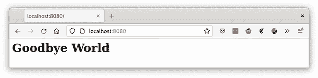

# 3 卷

本章涵盖

+   使用卷将容器化应用程序的数据隔离开来

+   通过卷将主机内容共享到容器中

+   使用用户命名空间和 SELinux 的卷

+   将卷嵌入到容器镜像中

+   探索不同类型的卷和卷命令

到目前为止，您一直在使用的容器将所有内容都包含在容器镜像中。正如我在第一章中描述的，与传统的容器共享的唯一要求是 Linux 内核。您需要将应用程序数据与应用程序隔离开来的原因有很多，包括以下内容：

+   避免嵌入数据库等应用程序的实际数据。

+   使用相同的容器镜像运行多个环境。

+   通过卷直接写入文件系统，从而减少开销并提高存储读写性能，因为容器使用 overlay 或 fuse-overlayfs 文件系统来挂载它们的层。*Overlay*是一种分层文件系统，这意味着内核需要完全复制前一层来创建新层，而 fuse-overlayfs 将每个读写操作从内核空间切换到用户空间，然后再切换回来。所有这些都造成了相当大的开销。

+   通过网络存储共享内容。

注意`bind`挂载会在文件系统中的不同位置重新挂载文件层次结构的一部分。`bind`挂载中的文件和目录与原始文件相同（有关`bind`挂载的解释，请参阅`mount`命令的手册页）。`bind`挂载允许相同的内容在两个地方可访问，而无需任何额外的开销。重要的是要理解`bind`不会复制数据或创建新数据。

支持卷也增加了复杂性，尤其是在安全性方面。容器的大多数安全特性都阻止容器进程访问容器镜像之外的文件系统。在本章中，您将了解 Podman 允许您绕过这些障碍的方法。

## 3.1 使用容器卷

让我们回到您的容器化应用程序。到目前为止，您只是直接将 Web 应用程序数据嵌入到容器文件系统中。回想一下，在 2.1.8 节中，您使用了`podman` `exec`命令来修改容器内的 Hello World index.xhtml 数据：

```
$ podman exec -i myapp bash -c 'cat > /var/www/html/index.xhtml' << _EOF
<html>
 <head>
 </head>
 <body>
 <h1>Hello World</h1>
 </body>
</html>
_EOF 
```

您通过允许用户为网络服务提供自己的内容或可能是在线更新网络服务，使容器化镜像更加灵活。同时，虽然这种方法是可行的，但它容易出错且不可扩展；这就是卷派上用场的地方。

Podman 允许您通过`podman` `run`命令使用`--volume` `(-v)`选项将主机文件系统内容挂载到容器中。

`--volume` `HOST-DIR:CONTAINER-DIR`选项告诉 Podman 将主机上的`HOST-DIR`绑定挂载到容器中的`CONTAINER-DIR`。Podman 还支持其他类型的卷，但在这个部分，我将专注于`bind`挂载卷。

有可能在一个选项中挂载文件或目录。主机上内容的变化将在容器内看到。同样，如果容器进程更改容器内的内容，这些更改将在主机上看到。

让我们来看一个例子。在你的主目录中创建一个名为 html 的目录，然后在其中创建一个新的 html/index.xhtml 文件：

```
$ mkdir html
$ cat > html/index.xhtml << _EOF
<html>
 <head>
 </head>
 <body>
 <h1>Goodbye World</h1>
 </body>
</html>
_EOF
```

现在，使用选项 `-v` `./html:/var/www/html` 启动容器：

```
$ podman run -d -v ./html:/var/www/html:ro,z -p 8080:8080
     quay.io/rhatdan/myimage
94c21a3d8fda740857abc571469aaaa181f4db27a464ceb6743c4a37fb875772
```

注意 `--volume` 选项中的额外 `:ro,z` 字段。`ro` 选项告诉 Podman 以只读模式挂载卷。只读挂载意味着容器内的进程不能修改 /var/www/html 下的任何内容，而主机上的进程仍然可以修改内容。Podman 默认所有卷挂载为读写模式。`z` 选项告诉 Podman 将内容重新标记为共享标签，以便 SELinux 使用（见 3.1.2 节）。

现在，你已经启动了容器，打开网页浏览器，导航到 localhost:8080 以确保已发生更改（见图 3.1）。

```
$ web-browser localhost:8080
```



图 3.1 网页浏览器窗口连接到带有挂载卷的 `myimage` Podman 容器

现在，你可以关闭并删除你刚刚创建的容器。删除容器不会影响内容。以下命令删除最新的（`--latest`）容器，即你的容器。`--force` 选项告诉 Podman 停止容器然后删除它：

```
$ podman rm --latest --force
```

最后，使用此命令删除内容：

```
$ rm -rf html
```

注意：`--latest` 选项在 Mac 和 Windows 上不可用。你必须指定容器名称或 ID。远程模式在第九章中解释，Mac 和 Windows 上的 Podman 在附录 E 和 F 中解释。

### 3.1.1 命名卷

在第一个卷示例中，你在磁盘上创建了一个目录，然后将其挂载到容器中。同样，只要你对该文件或目录有读取权限，你就可以将其挂载到容器中。

持久化 Podman 容器数据的另一种机制称为 `volume`。你可以使用 `podman volume create` 命令创建其中一个。在以下示例中，你将创建一个名为 `webdata` 的 `volume`：

```
$ podman volume create webdata
webdata
```

Podman 默认创建本地命名的卷，存储在容器存储目录中。你可以使用以下命令检查卷并查找其挂载点：

```
$ podman volume inspect webdata
[
  {
      "Name": "webdata",
      "Driver": "local",
      "Mountpoint":
➥ "/home/dwalsh/.local/share/containers/storage/volumes/webdata/_data",
      "CreatedAt": "2021-10-11T14:10:48.741367132-04:00",
      "Labels": {},
      "Scope": "local",
      "Options": {}
  }
]
```

Podman 实际上在你的本地容器存储中创建一个目录，/home/dwalsh/ .local/share/containers/storage/volumes/webdata/_data，以存储卷的内容。你可以在该目录中创建来自主机的内容：

```
$ cat > /home/dwalsh/.local/share/containers/storage/volumes/webdata/_
data/index.xhtml << _EOL
<html>
 <head>
 </head>
 <body>
 <h1>Goodbye World</h1>
 </body>
</html>
_EOL
```

现在，你可以使用这个卷来运行 `myimage` 应用程序：

```
$ podman run -d -v webdata :/var/www/html:ro,z -p 8080:8080 quay.io/rhatdan/myimage
0c8eb612831f8fe22438d73d801e5bb664ec3b1d524c5c10759ee0049061cb6b
```

现在刷新网页浏览器，以确保在主机目录中创建的文件显示“再见，世界”（见图 3.2）。


图 3.2 网页浏览器窗口连接到带有命名卷挂载的 `myimage` Podman 容器

命名卷可以同时用于多个容器，并且即使容器被移除后它们也会保留。如果你完成了命名卷和容器的使用，你可以首先停止容器，无需等待进程完成：

```
$ podman stop -t 0 0c8eb61283
```

然后使用`podman volume rm`命令移除卷。注意`--force`选项，它告诉 Podman 移除卷以及所有依赖该卷的容器：

```
$ podman volume rm --force webdata 
```

现在，你可以通过执行`volume list`命令来确保卷已被移除：

```
$ podman volume list
```

如果在执行`podman run`命令之前不存在命名卷，它将被自动创建。在以下示例中，你将指定`webdata1`作为命名卷的名称，然后列出卷：

```
$ podman run -d -v webdata1:/var/www/html:ro,z -p 8080:8080\ 
➥ quay.io/rhatdan/myimage
58ccaf37958496322e34cd933cd4dd5a61ab06c5ba678beb28fdc29cfb81f407

$ podman volume list
DRIVER   VOLUME NAME
local     webdata1
```

当然，这个卷是空的。移除`webdata1`卷和容器：

```
$ podman volume rm --force webdata1 
```

Podman 还支持其他类型的卷。它使用卷插件的概念，以便第三方可以提供卷；有关更多信息，请参阅`podman-volume-create`手册页。

Podman 还有其他有趣的卷功能。`podman volume export`命令将卷的所有内容导出到一个外部的 TAR 归档中。这个归档可以被复制到其他机器，使用`podman volume import`命令在另一台机器上重新创建卷。现在你了解了卷的处理方法，是时候深入了解卷选项了。

### 3.1.2 卷挂载选项

你在本章中一直在使用卷挂载选项。`ro`选项告诉 Podman 挂载只读卷，而小写`z`选项告诉 Podman 使用 SELinux 标签重新标记内容，这将允许多个容器在卷中读写：

```
$ podman run -d -v ./html:/var/www/html:ro,z -p 8080:8080 quay.io/rhatdan/myimage
```

Podman 支持一些其他有趣的卷选项。

U 卷选项

有时当你运行无根容器时，你需要一个由容器用户拥有的卷。想象一下，如果你的应用程序需要允许 Web 服务器向卷写入。在你的容器中，Apache Web 服务器进程（`httpd`）以`apache`（`UID==60`）用户身份运行。你的主目录中的 html 目录属于你的 UID，这意味着在容器内部属于 root。内核不允许以`UID==60`运行的容器进程更改属于 root 的目录。你必须将卷的所有权设置为`UID==60`。

在无根容器中，容器的 UID 通过用户命名空间进行偏移。我的用户命名空间映射如下所示：

```
$ podman unshare cat /proc/self/uid_map
       0     3267      1
       1   100000    65536
```

容器内的`UID==0`是我的`UID` `3267`，`UID` `1==100000`，`UID` `2==10000` ... `UID60==100059`，这意味着我需要将 html 目录的所有权设置为`100059`。

我可以相当简单地使用`podman unshare`命令来完成这项操作，如下所示：

```
$ podman unshare chown 60:60 ./html
```

现在一切正常。这个问题的一个问题是，我需要做一些心理体操来弄清楚容器将使用哪个 UID。

许多容器镜像都定义了默认的 UID。`mariadb`镜像就是这样一个例子；它以`mysql`用户运行，`UID=999`：

```
$ podman run docker.io/mariadb grep mysql /etc/passwd
mysql:x:999:999::/home/mysql:/bin/sh
```

如果你创建了一个用于数据库的卷，你需要弄清楚`UID=999`在用户命名空间中的映射。在我的系统中这是`UID=100998`。

Podman 为此提供了`U`命令选项。`U`选项告诉 Podman 递归地更改源卷的所有权（`chown`），使其与容器执行的默认 UID 相匹配。

通过首先创建数据库目录来尝试一下。注意家目录中的目录是由你的用户拥有的：

```
$ mkdir mariadb
$ ls -ld mariadb/
drwxrwxr-x. 1 dwalsh dwalsh 0 Oct 23 06:55 mariadb/
```

现在运行带有`--user mysql`的`mariadb`容器，并使用`:U`选项将./mariadb 目录绑定挂载到`/var/lib/mariadb`。注意，现在目录是由`mysql`用户拥有的：

```
$ podman run --user mysql -v ./mariadb:/var/lib/mariadb:U \
➥ docker.io/mariadb ls -ld /var/lib/mariadb
drwxrwxr-x. 1 mysql mysql 0 Oct 23 10:55 /var/lib/mariadb
```

如果你再次查看主机上的 mariadb 目录，你会看到它现在由`UID` `100998`或`UID` `999`映射到你的用户命名空间中的任何`UID`：

```
$ ls -ld mariadb/
drwxrwxr-x. 1 100998 100998 0 Oct 23 06:55 mariadb/
```

用户命名空间并不是你需要绕过的唯一安全机制，与无根容器一起使用时，SELinux 虽然对容器安全很有帮助，但在处理卷时可能会引起一些问题。

SELinux 卷选项

在我看来，SELinux 是保护文件系统免受恶意容器进程侵害的最佳机制。多年来，通过 SELinux 阻止了多次容器逃逸（有关 SELinux 的更多信息，请参阅第 10.8 节）。

正如我之前解释的那样，卷会将文件从操作系统泄露到容器中，从 SELinux 的角度来看，这些文件和目录必须正确标记，否则内核会阻止访问。

你在本章中一直使用的带下划线的`z`命令选项告诉 Podman 递归地使用可以由所有容器从 SELinux 角度读取和写入的标签重新标记源目录中的所有内容。如果卷不会由多个容器使用，使用带下划线的`z`选项并不是你想要的。如果另一个敌对的容器逃逸了限制，它可能能够访问这些数据并对其进行读写。Podman 提供了一个大写`Z`选项，告诉 Podman 以这种方式递归地重新标记内容，这样只有容器内的进程可以读取/写入内容。

在这两种情况下，你都重新标记了目录的内容。如果目录被指定用于容器使用，重新标记效果很好。有时你可能想使用容器来检查系统特定目录中的内容——例如，如果你想运行一个容器来检查`/var/log`中的所有日志或检查所有家目录（`/home/dwalsh`）。

注意：在主目录上使用此选项可能会对系统产生灾难性的影响，因为它会递归地重新标记目录中的所有内容，好像数据是容器私有的。其他受限域将无法使用错误标记的数据。

对于这些情况，您需要禁用 SELinux 强制执行以允许容器使用卷。Podman 提供了命令选项 `--security-opt` `label=disable` 来禁用单个容器的 SELinux 支持，基本上是以 SELinux 视角使用 *未限制* 标签运行容器：

```
$ podman run --security-opt label=disable -v /home/dwalsh:/home/dwalsh -p\ 
➥ 8080:8080 quay.io/rhatdan/myimage
```

表 3.1 列出并描述了 Podman 中所有可用的挂载选项。

表 3.1 卷挂载选项

| 卷选项 | 描述 |
| --- | --- |
| `nodev` | 防止容器进程在卷上使用字符或块设备。 |
| `noexec` | 防止容器进程直接在卷上的任何二进制文件上执行。 |
| `nosuid` | 防止 SUID 应用程序在卷上更改它们的权限。 |
| `O` | 使用 overlay 文件系统将主机上的目录作为临时存储挂载。当容器执行完成后，对挂载点的修改将被销毁。此选项对于将主机上的软件包缓存共享到容器中以加快构建速度非常有用。 |

| `[r]shared&#124;``[r]slave&#124;``[r]private&#124;``[r]unbindable` | 指定挂载传播模式。挂载传播控制挂载更改如何在挂载边界之间传播：

+   `private`（默认）—在容器内完成的任何挂载在主机上不可见，反之亦然。

+   `shared`—在该卷内部容器中完成的挂载将在主机上可见，反之亦然。

+   `slave`—在主机上在该卷下完成的挂载将在容器内可见，但反之则不然。

+   `unbindable`—私有模式的非绑定版本。

前缀 `r` 代表 *递归的*，意味着挂载点下方的任何挂载也将以相同的方式处理。 |

| `rw&#124;ro` | 以只读 (`ro`) 或读-写 (`rw`) 模式挂载卷。默认情况下，读/写是隐含的。 |
| --- | --- |
| `U` | 根据容器内的 UID 和 GID 使用正确的主机 UID 和 GID。使用时请谨慎，因为这将修改主机文件系统。 |
| `z&#124;Z` | 在共享卷上重新标记文件对象。选择 `z` 选项将卷内容标记为在多个容器之间共享。选择 `Z` 选项将内容标记为非共享且私有。 |

有关更多信息，请参阅 `mount` 和 `mount_namespaces(7)` 的手册页。

大多数时候，简单的 `--volume` 选项就足以将卷挂载到容器中。随着时间的推移，对新挂载选项的需求变得越来越复杂，因此添加了一个名为 `--mount` 的新选项。

### 3.1.3 podman run - -mount 命令选项

`podman` `run` `--mount` 选项与底层 Linux 挂载命令非常相似。它允许您指定挂载命令理解的所有挂载选项；Podman 直接将它们传递给内核。

当前支持的唯一挂载类型是 `bind`、`volume`、`image`、`tmpfs` 和 `devpts`。（有关更多信息，请参阅 `podman-mount(1)` 手册页。）

卷和挂载是保持数据与容器镜像分离的绝佳方式。在大多数情况下，容器镜像应该被视为只读的，任何需要写入或与应用程序不特定的数据都应该通过卷存储在容器镜像之外。在许多情况下，通过保持数据分离可以获得更好的性能，因为读写不会产生写时复制的文件系统开销。这些挂载还使得使用不同的数据（表 3.2）与相同的容器镜像变得更容易。

表 3.2 Podman 卷命令

| 命令 | 手册页 | 描述 |
| --- | --- | --- |
| `create` | `podman-volume-create(1)` | 创建一个新的卷。 |
| `exists` | `podman-volume-exists(1)` | 检查卷是否存在。 |
| `export` | `podman-volume-export(1)` | 将卷的内容导出到一个 tar 包中。 |
| `import` | `podman-volume-import(1)` | 将 tar 包解压到卷中。 |
| `inspect` | `podman-volume-inspect(1)` | 显示卷的详细信息。 |
| `list` | `podman-volume-list(1)` | 列出所有卷。 |
| `prune` | `podman-volume-prune(1)` | 删除所有未使用的卷。 |
| `rm` | `podman-volume-rm(1)` | 删除一个或多个卷。 |

## 摘要

+   卷对于将容器使用的数据与应用程序镜像内的数据分离非常有用。

+   卷将文件系统的部分挂载到容器环境中，这意味着需要修改像 SELinux 和用户命名空间这样的安全相关设置，以允许访问。
