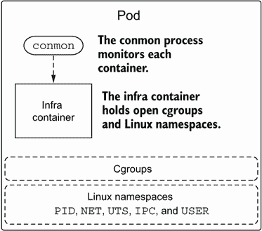
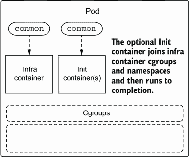
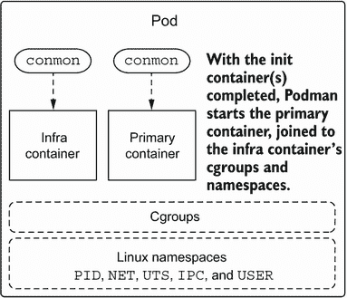
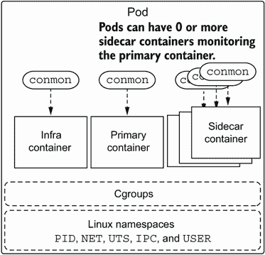
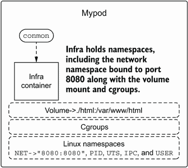
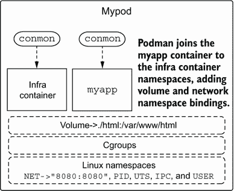
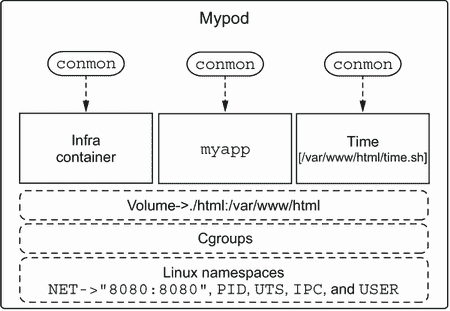
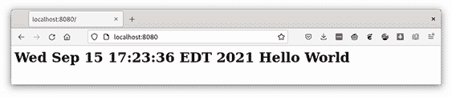

# 4 个 Pod

本章涵盖

+   Pod 简介

+   在 pod 内管理多个容器

+   使用 Pod 与卷

*Podman* 是 *Pod Manager* 的简称。*pod* 是 Kubernetes 项目推广的一个概念；它是一组一个或多个容器，为了共同目的而协同工作，并共享相同的命名空间和 cgroups（资源限制）。此外，Podman 确保在 SELinux 机器上，pod 内的所有容器进程共享相同的 SELinux 标签。这意味着它们可以从 SELinux 角度协同工作。

## 4.1 运行 pod

Podman pod（见图 4.1），就像 Kubernetes Pods 一样，始终包含一个名为 *infra* 的容器——有时称为 *pause* 容器（不要与第 5.2 节中提到的无根暂停容器混淆）。infra 容器仅保留内核中的命名空间和 cgroups，允许容器在 pod 内来去。当 Podman 向 pod 添加容器时，它会将容器进程添加到 cgroups 和命名空间中。注意 infra 容器有一个容器监控进程 `conmon` 在监控它。pod 内的每个容器都有自己的 `conmon`。

Conmon 是一个轻量级的 C 程序，监控容器直到其退出，允许 Podman 可执行文件退出并重新连接到容器。当监控容器时，Conmon 执行以下操作：

1.  Conmon 执行 OCI 运行时，将其指向 OCI 规范文件的路径以及指向 containers/storage 中的容器层挂载点。挂载点称为 rootfs。

1.  Conmon 监控容器直到其退出，并将退出代码返回。

1.  当用户连接到容器时，Conmon 处理这种情况，提供一个套接字以流式传输容器的 `STDOUT` 和 `STDERR`。

1.  `STDOUT` 和 `STDERR` 也被记录到 Podman 日志文件中。

注意：infra 容器（暂停容器；见图 4.1）类似于无根暂停容器；它的唯一目的是保持命名空间和 cgroups 打开，同时容器来去。然而，每个 pod 将有一个不同的 infra 容器。



图 4.1 Podman pod 使用 infra 容器启动 conmon，该容器将保留 cgroups 和 Linux 命名空间。

Podman pod 也支持 init 容器，如图 4.2 所示。这些容器在 pod 中的主要容器执行之前运行。init 容器的一个例子是在卷上进行的数据库初始化。这将允许主要容器使用数据库。Podman 支持以下两类 init 容器：

+   *一次*——仅在 pod 首次创建时运行

+   *总是*——每次启动 pod 时都会运行

主要容器运行应用程序。



图 4.2 Podman 接着使用 conmon 启动任何 init 容器。这些 init 容器检查 infra 容器并加入其 cgroups 和命名空间。

Pods 还支持额外的容器，这些容器通常被称为*sidecar*容器（见图 4.4）。Sidecar 容器通常监控主容器，如图 4.3 所示，或者主容器运行的环境。Kubernetes 文档([`kubernetes.io/docs/concepts/workloads/pods`](https://kubernetes.io/docs/concepts/workloads/pods))将带有 sidecar 容器的 pods 描述如下：



图 4.3 Podman 在将带有`conmon`的主容器启动到 pod 中之前，会等待 init 容器完成。

一个 Pod 可以封装由多个紧密耦合且需要共享资源的容器组成的应用程序。这些紧密耦合的容器形成一个单一的服务单元——例如，一个容器向公众提供存储在共享卷中的数据，而另一个 sidecar 容器刷新或更新这些文件。Pod 将这些容器、存储资源和短暂的网络标识符作为一个单一单元封装起来。

如果你想要深入了解 sidecar 容器，以下网站上有多篇优秀的文章：[`www.magalix.com/blog/the-sidecar-pattern`](https://www.magalix.com/blog/the-sidecar-pattern)。



图 4.4 Podman 可以启动额外的称为 sidecar 容器的容器。

注意：虽然 pods 可以支持多个 sidecar 容器，但我建议你只使用一个。人们滥用这种能力的诱惑是真实的，尤其是在 Kubernetes 中，但它可能会消耗更多资源并变得难以控制。

使用 pods 的一个大优点是你可以将它们作为独立的单元进行管理。启动 pod 将启动其中的所有容器，停止 pod 将停止所有容器。

## 4.2 创建 pod

在本节中，你将创建一个包含 myimage 应用程序作为 pod 中主容器的 pod。你还将向 pod 添加第二个容器，一个 sidecar 容器，该容器将更新应用程序使用的 web 内容，以显示在 pod 内一起工作的两个容器。

你可以使用`podman` `pod` `create`命令创建一个名为`mypod`的 pod，如下面的命令所示：

```
$ podman pod create -p 8080:8080 --name mypod --volume ./html:/var/www/html:z
790fefe97b280e5f67c526e3a421e9c9f958cf5a98f3709373ef1afd91965955
```

`podman`的`pod` `create`命令具有与`podman`的`container` `create`命令许多相同的选项。当你在一个 pod 中创建容器时，该容器会继承这些选项作为其默认设置（见图 4.5）。



图 4.5 Podman 创建一个网络命名空间，并在容器中将主机的`/var/www/html`目录绑定到容器的端口`8080`。Podman 在容器中创建基础设施容器，并加入 cgroups 和网络命名空间。

注意，与前面的例子一样，你正在将 pod 绑定到端口`-p` `8080:8080`：

```
$ podman pod create -p 8080:8080 --name mypod --volume ./html:/var/www/html:z
```

因为 Pod 内的容器共享相同的网络命名空间，所以这个端口绑定被所有容器共享。内核只允许一个进程监听端口`8080`。最后，请注意，./html 目录被挂载到 Pod 中，`--volume` `./html:/var/www/html:z`：

```
$ podman pod create -p 8080:8080 --name mypod --volume ./html:/var/www/html:z
```

`:z`参数导致 Podman 重新标记目录的内容。Podman 会自动将此目录挂载到加入 Pod 的每个容器中。Pod 内的容器共享相同的 SELinux 标签，这意味着它们可以共享相同的卷。

## 4.3 将容器添加到 Pod

您可以使用`podman` `create`命令在 Pod 内创建一个容器（见图 4.6）。使用`--pod` `mypod`选项将 quay.io/rhatdan/myimage 容器添加到 Pod 中：

```
$ podman create --pod mypod --name myapp quay.io/rhatdan/myimage
Cec045acb1c2be4a6e4e88e21275076fb1de5519a25fb5a55f192da70708a640
```



图 4.6 因为 Pod 没有初始化容器，所以第一个`myapp`容器被启动到 Pod 中。

当您将第一个容器添加到 Pod 时，Podman 读取与基础设施容器相关联的信息，并将卷挂载添加到`myapp`容器中，然后将其加入到基础设施容器持有的命名空间中。下一步是将侧边容器添加到 Pod 中。侧边容器将更新/var/www/html 卷中的 index.xhtml 文件，每秒添加一个新时间戳。

创建一个简单的 Bash 脚本来更新`myapp`容器使用的 index.xhtml，命名为 html/time.sh。您可以在./html 目录中创建它，这样它就会在 Pod 内的进程可用：

```
$ cat > html/time.sh << _EOL
#!/bin/sh
data() {
  echo "<html><head></head><body><h1>"; date;echo "Hello World</h1></body></html>"
  sleep 1
}
while true; do
   data > index.xhtml
done
_EOL
```

确保它是可执行的。您可以在 Linux 上使用`chmod`命令来完成此操作：

```
$ chmod +x html/time.sh
```

现在创建第二个容器（`--name` `time`），这次使用不同的镜像：ubi8。Pod 内的容器可以使用完全不同的镜像，甚至是来自不同发行版的镜像。回想一下，容器镜像默认情况下只共享主机内核：

```
$ podman create --pod mypod --name time --workdir /var/www/html ubi8 ./time.sh
Resolved "ubi8" as an alias (/etc/containers/registries.conf.d/000-shortnames.conf)
Trying to pull registry.access.redhat.com/ubi8:latest...
...
1be0b2fae53029d518e75def71c0d6961b662d0e8b4a1082edea5589d1353af3
```

记住第二章中提到的短名概念。您可以输入长名，registry.access.redhat.com/ubi8，但这需要很多输入。幸运的是，短名，ubi8，已经映射到其长名，这意味着您不需要从注册表列表中选择它。Podman 在输出中显示了它找到长名别名的位置：

```
$ podman create --pod mypod --name time --workdir /var/www/html ubi8 ./time.sh
Resolved "ubi8" as an alias (/etc/containers/registries.conf.d/000-shortnames.conf)
```

您还使用了`--workdir`命令选项来设置容器的默认目录为/var/www/html。当容器启动时，./time.sh 将在`workdir`中运行，实际上是/var/www/html/time.sh（见图 4.7）：

```
$ podman create --pod mypod --name time --workdir /var/www/html ubi8 ./time.sh
```

因为这个容器将在`mypod` Pod 内运行，所以它会继承 Pod 的`-v` ./html:/var/www/html 选项，这意味着主机目录中的./html/time.sh 命令对 Pod 内的每个容器都是可用的。



图 4.7 最后，Podman 启动了名为`time`的侧边容器。

Podman 检查基础设施容器，在启动侧边容器时挂载了/var/www/html 卷，并加入了命名空间。现在，是时候启动 Pod 并看看会发生什么了。

## 4.4 启动 pod

您可以使用`podman` `pod` `start`命令启动 pod：

```
$ podman pod start mypod
790fefe97b280e5f67c526e3a421e9c9f958cf5a98f3709373ef1afd91965955
```

使用`podman` `ps`命令查看 pod 启动了哪些容器：

```
$ podman ps
CONTAINER ID  IMAGE                  COMMAND             CREATED       STATUS          PORTS                 NAMES
b9536ea4a8ab localhost/podman-pause:4.0.3-1648837314                      14 minutes ago  Up 5 seconds ago  0.0.0.0:8080->8080/tcp  8920b1ccd8b0-infra
a978e0005273  quay.io/rhatdan/myimage:latest        /usr/bin/run-http...  14 minutes ago  Up 5 seconds ago  0.0.0.0:8080->8080/tcp  myapp
be86937986e9  registry.access.redhat.com/ubi8:latest  ./time.sh           13 minutes ago  Up 5 seconds ago  0.0.0.0:8080->8080/tcp  time
```

注意现在已启动了三个容器。基础容器基于 k8s.gcr.io/pause 镜像，您的应用程序基于 quay.io/rhatdan/myimage:latest 镜像，更新容器基于 registry.access.redhat.com/ubi8:latest 镜像。

当 ubi8 侧边容器启动时，它开始通过 time.sh 脚本来修改 index.xhtml 索引文件。由于`myapp`容器共享卷挂载，/var/www/html，因此它可以看到/var/www/html/index.xhtml 文件中的更改。启动您喜欢的网页浏览器，导航到 http://localhost:8080 以验证应用程序是否正在运行，如图 4.8 所示。



图 4.8 网页浏览器与 pod 中运行的`myapp`进行通信。

几秒钟后，按刷新按钮。注意日期变化，表明侧边容器正在运行并更新主容器内运行的`myapp`网络服务器使用的数据，如图 4.9 所示。


图 4.9 网页浏览器显示`myapp`的内容已被 pod 中运行的第二个容器更改。

一些显著的`podman` `pod` `start`选项包括以下内容：

+   `--all`—这告诉 Podman 启动所有 pod。

+   `--latest`—`-l`告诉 Podman 启动最后创建的 pod。（在 Mac 和 Windows 上不可用。）

现在您已经在 pod 内运行了应用程序，您可能想要停止应用程序。

## 4.5 停止 pod

现在您看到应用程序运行成功，您可以使用`podman` `pod` `stop`命令停止 pod，如下所示：

```
$ podman pod stop mypod
790fefe97b280e5f67c526e3a421e9c9f958cf5a98f3709373ef1afd91965955
```

使用`podman` `ps`命令确保 Podman 已停止 pod 内的所有容器：

```
$ podman ps
CONTAINER ID  IMAGE     COMMAND   CREATED   STATUS    PORTS     NAMES
```

一些显著的`podman` `pod` `stop`选项包括以下内容：

+   `--all`—这告诉 Podman 停止所有 pod。

+   `--latest`—`-l`告诉 Podman 停止最近启动的 pod。

+   `--timeout`—`-t`告诉 Podman 在尝试停止 pod 内的容器时设置超时。

现在您已经创建了、运行并停止了 pod，您可以开始检查它。首先，列出您系统上的所有 pod。

## 4.6 列出 pod

您可以使用`podman` `pod` `list`命令列出 pod：

```
$ podman pod list
POD ID        NAME      STATUS    CREATED         INFRA ID      # OF CONTAINERS
790fefe97b28  mypod     Exited    22 minutes ago  b9536ea4a8ab  3
```

一些显著的`podman` `pod` `list`选项包括以下内容：

+   `--ctr*`—这告诉 Podman 列出 pod 内的容器信息。

+   `--format`—这告诉 Podman 更改 pod 的输出。

现在您已经完成了演示，是时候清理 pod 和容器了。

## 4.7 删除 pod

在第八章中，我讨论了您如何生成 Kubernetes YAML 文件，以便您可以使用 Podman 或其他系统或 Kubernetes 内部启动您的 pod。但到目前为止，您可以使用`podman` `pod` `rm`命令删除 pod。

在进行此操作之前，列出系统上的所有容器`--all`。使用`--format`选项仅显示 ID、镜像和 pod ID，您将看到组成您的 pod 的三个容器：

```
$ podman ps --all --format "{{.ID}}  {{.Image}} {{.Pod}}"
b9536ea4a8ab  k8s.gcr.io/pause:3.5 790fefe97b28
a978e0005273  quay.io/rhatdan/myimage:latest 790fefe97b28
be86937986e9  registry.access.redhat.com/ubi8:latest 790fefe97b28
```

现在，您可以使用以下命令删除 pod：

```
$ podman pod rm mypod
790fefe97b280e5f67c526e3a421e9c9f958cf5a98f3709373ef1afd91965955
```

确保它已消失：

```
$ podman pod ls
POD ID    NAME      STATUS    CREATED   INFRA ID  # OF CONTAINERS
```

太好了！看起来您的 pod 已经消失了。通过运行以下命令验证 Podman 是否删除了所有容器：

```
$ podman ps -a --format "{{.ID}} {{.Image}}"
```

系统已完全清理。

一些显著的`podman` `pod` `rm`选项包括以下内容（也请参阅表 4.1）：

+   `--all`—这告诉 Podman 删除所有 pod。

+   `--force`—这告诉 Podman 在尝试删除容器之前先停止所有正在运行的容器。否则，Podman 只会删除非运行的 pod。

表 4.1 `podman` `pod`命令

| 命令 | 手册页 | 描述 |
| --- | --- | --- |
| `create` | `podman-pod-create(1)` | 创建一个新的 pod。 |
| `exists` | `podman-pod-exists(1)` | 检查 pod 是否存在。 |
| `inspect` | `podman-pod-inspect(1)` | 显示 pod 的详细信息。 |
| `kill` | `podman-pod-kill(1)` | 向 pod 中容器的首要进程发送信号。 |
| `list` | `podman-pod-list(1)` | 列出所有 pod。 |
| `logs` | `podman-pod-logs(1)` | 获取包含一个或多个容器的 pod 的日志。 |
| `pause` | `podman-pod-pause(1)` | 暂停 pod 中的所有容器。 |
| `prune` | `podman-pod-prune(1)` | 删除所有停止的 pod 及其容器。 |
| `restart` | `podman-pod-restart(1)` | 重新启动一个 pod。 |
| `rm` | `podman-pod-rm(1)` | 删除一个或多个 pod。 |
| `stats` | `podman-pod-stats(1)` | 显示 pod 中容器的统计信息。 |
| `start` | `podman-pod-start(1)` | 启动一个 pod。 |
| `stop` | `podman-pod-stop(1)` | 停止一个 pod。 |
| `top` | `podman-pod-top(1)` | 显示 pod 中的运行进程。 |
| `unpause` | `podman-pod-unpause(1)` | 取消暂停 pod 中的所有容器。 |

## 摘要

+   Pod 是将容器组合在一起形成更复杂应用的一种方式，共享命名空间和资源限制。

+   Pod 与容器使用的多数选项相同，当您将容器添加到 pod 中时，它会与 pod 中的所有容器共享这些选项。
