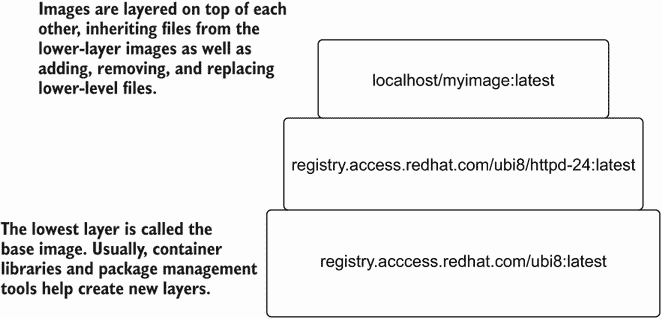
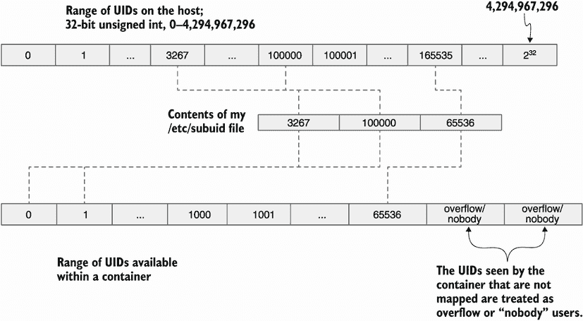

# 5 自定义和配置文件

本章涵盖

+   根据使用的库使用 Podman 配置文件

+   配置 storage.conf 文件

+   使用 registries.conf 和 policy.json 文件进行配置

+   使用 containers.conf 文件配置其他默认设置

+   使用系统配置文件允许非 root 用户命名空间访问

Podman 等容器引擎内置了数十个硬编码的默认值。这些默认值决定了 Podman 的功能性和非功能性行为的许多方面，例如网络和安全设置。Podman 开发者试图选择最大程度的安全，但仍然允许大多数容器成功运行。同样，我也希望尽可能多地从主机隔离。

安全默认设置包括要使用的 Linux 能力、要设置的 SELinux 标签以及容器可用的系统调用集合。对于资源约束，如内存使用量和容器内允许的最大进程数，也有默认值。其他默认设置包括存储镜像的本地路径、容器注册库列表，甚至允许无根模式工作的系统配置。Podman 开发者希望允许用户对这些默认值拥有最终控制权，因此容器引擎配置文件提供了一种自定义 Podman 和其他容器引擎运行方式的机制。

默认配置的问题在于它们是开发者基于最佳猜测得出的估计。虽然大多数用户都在默认配置下运行 Podman，但有时需要更改配置。并非每个环境都有相同的配置，你可能希望将某些机器的默认安全级别和注册表配置设置为不同级别。即使是无根用户也可能需要与有根用户不同的配置。在本章中，我将向您展示如何自定义 Podman 的不同部分，并解释您可以在哪里找到有关所有可用旋钮的更多信息。

如您在前面章节中学到的，Podman 使用多个库在处理容器时执行不同的任务。表 5.1 描述了 Podman 使用的不同库。

表 5.1 Podman 使用的容器库

| 库 | 描述 |
| --- | --- |
| containers/storage | 定义了容器镜像和其他基本存储的存储，这些存储由容器引擎使用 |
| containers/image | 定义了用于在不同类型存储之间移动容器镜像的机制；通常用于容器注册库和本地容器存储之间 |
| containers/common | 定义了在 containers/storage 或 containers/image 中未定义的所有容器引擎默认配置选项 |
| containers/buildah | 如第二章所述，它用于使用在 Containerfile 或 Dockerfile 中定义的规则将容器镜像构建到本地存储；有关 Buildah 的更多信息，请参阅附录 A。 |

这些库中的每一个都有单独的配置文件，用于设置特定库的默认设置，Buildah 除外。容器引擎 Podman 和 Buildah 共享 containers/common 配置文件 containers.conf，这在第 5.3 节中进行了描述。

注意：Podman 所使用的所有非系统配置文件都使用 TOML 格式。TOML 的语法由名称 = “值” 对、[部分名称] 和 # 注释组成。TOML 的格式可以简化为以下形式：

+   `[表格]`

+   `选项` `=` `值`

+   `[表格子表格 1]`

+   `选项` `=` `值`

+   `[表格子表格 2]`

+   `选项` `=` `值`

请参阅 [`toml.io`](https://toml.io) 以获取对 TOML 语言的更完整解释。当配置 Podman 时，通常第一个关注的问题之一是您打算在哪里存储您的容器和镜像。

## 5.1 存储配置文件

Podman 使用 [github.com/containers/storage](http://github.com/containers/storage) 库，该库提供了存储文件系统层、容器镜像和容器的相关方法。此库的配置是通过 storage.conf 配置文件完成的，该文件可以存储在多个不同的目录中。

Linux 发行版通常提供 /usr/share/containers/storage.conf 文件，可以通过创建 /etc/containers/storage.conf 文件来覆盖。无根用户可以将他们的配置存储在 $XDG_CONFIG_HOME/containers/storage.conf 文件中；如果 $XDG_CONFIG_HOME 环境变量未设置，则使用 $HOME/.config/ containers/storage.conf 文件。大多数用户永远不会更改 storage.conf 文件，但在少数情况下，高级用户需要进行一些自定义设置。最常见的更改原因是重新定位容器的存储。

注意：当在远程模式下使用 Podman，例如在 Mac 或 Windows 系统上时，Podman 服务会使用位于 Linux 系统上的 storage.conf 文件。要修改这些文件，您需要进入虚拟机。在使用 Podman 机器时，执行 `podman machine ssh` 命令进入虚拟机。有关更多信息，请参阅附录 E 和 F。

Podman 只读取一个 storage.conf 文件，并忽略所有后续的文件。Podman 首先尝试使用您主目录中的 storage.conf 文件；其次是 /etc/storage/ 目录下的 storage.conf 文件；最后，如果这两个文件都不存在，Podman 会读取 /usr/share/ containers/storage.conf 文件。您可以通过 `podman info` 命令查看 Podman 命令正在使用的 storage.conf 文件：

```
$ podman info --format '{{ .Store.ConfigFile }}'
/home/dwalsh/.config/containers/storage.conf
```

### 5.1.1 存储位置

默认情况下，无根 Podman 配置为将您的镜像存储在 $HOME/.local/ share/containers/storage 目录中。默认的带根存储位置是 /var/lib/ containers/storage。

有时您需要更改此默认位置。可能您在 /var 或用户主目录中没有足够的磁盘空间，因此您希望将镜像存储在不同的磁盘上。storage.conf 文件将存储位置称为 `graphRoot`，并且可以在 /etc/containers/storage.conf 中为带根容器覆盖。

在本节中，你将修改图驱动程序的位置到 /var/mystorage。首先，成为 root 并确保 /etc/containers/storage.conf 文件存在。如果不存在，只需将 /usr/share/containers/storage.conf 文件复制到其中：

```
$ sudo cp /usr/share/containers/storage.conf /etc/containers/storage.conf
```

注意：某些发行版仅提供 /etc/containers/storage.conf。

现在，创建一个备份，并打开 /etc/containers/storage.conf 文件进行编辑：

```
$ sudo cp /etc/containers/storage.conf /etc/containers/storage.conf.orig
$ sudo vi /etc/containers/storage.conf 
```

将 `graphdriver` 变量的 `graphroot` 设置为 `"/var/lib/containers/storage"` 并保存文件。

你的 storage.conf 文件应包括以下内容：

```
$ grep -B 1 graph /etc/containers/storage.conf 
# Primary Read/Write location of container storage
graphroot = "/var/mystorage"
```

执行 `podman info` 来查看更改是否发生：

```
$ sudo podman info
...
Store:
 configFile: /etc/containers/storage.conf
...
 graphDriverName: overlay
 graphOptions:
  overlay.mountopt: nodev,metacopy=on
 graphRoot: /var/mystorage
...
 volumePath: /var/mystorage/volumes
```

注意在存储部分，`graphRoot` 现在是 /var/mystorage。所有镜像和容器都将存储在这个目录中。

现在，在无根模式下运行 `podman info` 命令。存储位置不会改变；它仍然是 /home/dwalsh/.local/share/containers/storage：

```
$ podman info
store:
 configFile: /home/dwalsh/.config/containers/storage.conf
 containerStore:
  number: 27
  paused: 0
  running: 0
  stopped: 27
 graphDriverName: overlay
 graphOptions: {}
 graphRoot: /home/dwalsh/.local/share/containers/storage
```

你可以在 $HOME/.config/containers/storage.conf 中创建一个并更改它，但这对于有多个用户的系统来说扩展性不好。键 `rootless_storage_path` 允许你更改系统中所有用户的位置。

这次，取消注释并修改 `rootless_storage_path` 行：

```
$ sudo vi /etc/containers/storage.conf 
```

将 storage.conf 中的 `rootless_storage_path` 行修改为

```
# rootless_storage_path = "$HOME/.local/share/containers/storage"
```

将其更改为

```
rootless_storage_path = "/var/tmp/$UID/var/mystorage"
```

保存 storage.conf 文件。当你完成时，它应该看起来像这样：

```
$ grep -B 3 rootless_storage_path /etc/containers/storage.conf
# Storage path for rootless users
#
rootless_storage_path = "/var/tmp/$UID/var/mystorage"
```

现在，运行 `podman info` 来查看更改。注意，`graphRoot` 现在指向 /var/tmp/3267/var/mystorage 目录：

```
$ podman info
...
store:
 configFile: /home/dwalsh/.config/containers/storage.conf
...
 graphOptions: {}
 graphRoot: /var/tmp/3267/var/mystorage
```

容器/存储支持为此路径扩展 `$HOME` 和 `$UID` 环境变量。要撤销更改，复制并恢复原始的 storage.conf 文件：

```
$ sudo cp /etc/containers/storage.conf.orig /etc/containers/storage.conf
```

注意：如果你在一个 SELinux 系统上运行，并更改存储的默认位置，你需要使用以下 `semanage` 命令通知 SELinux。这将告诉 SELinux 将新位置标记为如果它在旧位置一样。接下来，你需要使用 `restorecon` 命令更改磁盘上的标记。你可以使用以下命令来完成此操作：

```
sudo semanage fcontext -a -e /var/lib/containers/storage /var/mystorage
  sudo restorecon -R -v /var/mystorage
```

在无根模式下，你需要执行以下操作：

```
sudo semanage fcontext -a -e $HOME/.local/share/containers/storage/
➥ var/tmp/3267/var/mystorage
sudo restorecon -R -v /var/tmp/3267/var/mystorage
```

有时你可能想更改存储驱动程序，或者更可能的是，更改存储驱动程序的配置。

### 5.1.2 存储驱动程序

回想第二章中的婚礼蛋糕插图。这个插图显示图像通常由多个层组成。这些层由容器/存储库存储在磁盘上，但当你在这上面运行容器时，每个层都需要挂载到前一个层（图 5.1）。



图 5.1 层叠在一起的分层图像通过容器/存储重新组装和挂载。

Container/storage 使用 Linux 内核文件系统概念，称为*分层文件系统*来完成这项工作。Podman 通过 container/storage 支持多种不同类型的分层文件系统。在 Linux 中，这些文件系统被称为*写时复制（CoW）*文件系统。在容器/storage 中，这些不同的文件系统类型被称为*驱动程序*。默认情况下，Podman 使用`overlay`存储驱动程序。

注意 Docker 支持两种类型的 overlay 驱动程序：`overlay`和`overlay2`。`overlay2`是`overlay`的改进版，原始的`overlay`驱动程序现在很少使用。相比之下，Podman 使用较新的`overlay2`驱动程序，并称之为`overlay`。您可以在 Podman 中选择`overlay`驱动程序，但这只是`overlay2`的别名。

表 5.2 列出了 Podman 和 container/storage 支持的存储驱动程序。我建议您只坚持使用`overlay`驱动程序，因为这是世界上绝大多数人使用的驱动程序。

表 5.2 容器存储驱动程序

| 存储驱动程序 | 描述 |
| --- | --- |
| `overlay (overlay2)` | 这是默认驱动程序，我强烈推荐使用它。它基于 Linux 内核 overlay 文件系统。在 Podman 中，`overlay`和`overlay2`完全相同。这是最经过测试的驱动程序，绝大多数用户都在使用它。 |
| `vfs` | 这是最简单的驱动程序；它为每一层创建完整的副本到下一层。它在任何地方都适用，但速度较慢且非常占用磁盘。 |
| `devmapper` | 当 Docker 最初变得流行时，此驱动程序被广泛使用——在`overlay`驱动程序可用之前。它会重新分配每个层的最大大小。现在不再推荐使用。 |
| `aufs` | 此驱动程序从未合并到上游内核中，因此它仅在少数 Linux 发行版上可用。 |
| `btrfs` | 此驱动程序允许基于 Btrfs 文件系统的快照进行存储。一些用户在使用此文件系统时取得了成功。 |
| `zfs` | 此驱动程序使用 ZFS 文件系统，这是一个专有文件系统，在大多数发行版上不可用。 |

overlay 存储选项

`overlay`驱动程序有一些有趣的定制选项。这些选项位于 storage.conf [storage.options.overlay]表中。

配置 overlay 驱动程序有多个高级选项可用。我将简要提及几个以描述用例。

`mount_program`选项允许您指定一个可执行文件来代替内核 overlay 驱动程序。Podman 通常附带`fuse-overlayfs`可执行文件，它提供了一个`FUSE`（用户空间）overlay 驱动程序。如果系统不支持无根原生 overlay，Podman 会自动切换到`fuse-overlayfs`的`mount_program`。大多数内核支持原生 overlay；然而，在某些情况下，您可能需要配置`mount_program`。`fuse-overlayfs`具有目前原生 overlay 不支持的高级功能。

Podman 正迅速被高性能计算 (HPC) 社区采用。HPC 社区不允许有 root 权限的容器，并且在许多情况下只允许工作负载以单个 UID 运行。这意味着一些 HPC 系统不允许具有多个 UIDs 的用户命名空间。由于许多镜像都带有多个 UIDs，Podman 为 containers/storage 添加了 `ignore_chown_errors` 选项，以便将具有不同 UIDs 的文件扁平化到单个 UID。表 5.3 列出了容器存储支持的所有当前存储选项。

注意：您已经检查了 storage.conf 的一些字段，但还有很多。使用 containers-storage.conf 手册页来探索所有这些选项：

```
https:/ /github.com/containers/storage/blob/main/docs/containers-storage.conf.5.md 
$ man containers-storage.conf
```

表 5.3 容器存储驱动程序

| 存储驱动程序 | 描述 |
| --- | --- |
| `ignore_chown_errors` | 忽略对无 root 权限容器中具有单个 UID 的文件进行 `chown` 的 UIDs。/etc/subuid 中没有条目。 |
| `mount_program` | 用于挂载文件系统的辅助程序路径，而不是使用内核覆盖来挂载。较旧的内核不支持无 root 权限的覆盖。 |
| `mountopt` | 要传递给内核的挂载选项的逗号分隔列表。默认为 `"nodev,metacopy=on"`。 |
| `skip_mount_home` | 不要在存储主目录上创建 `PRIVATE` 绑定挂载。 |
| `inode` | 容器镜像中 inode 的最大数量 |
| `size` | 容器镜像的最大大小 |

| `force_mask` | 图像中新文件和目录的权限掩码。值如下：

+   `private`—这会将所有文件系统对象设置为 `0700`。系统上的其他用户无法访问这些文件。

+   `shared`—这相当于 `0755`。系统上的每个人都可以读取、访问和执行镜像中的文件。这对于与其他用户共享容器存储很有用。

图像中的所有文件都允许系统上的任何用户读取和执行。即使您镜像中的 /etc/shadow 现在也可以被任何用户读取。当 `force_mask` 设置时，原始权限掩码存储在 `xattr`s 中，而 `mount_program`（如 /usr/bin/fuse-overlayfs）向容器内的进程呈现 `xattr` 权限。

现在，您已经了解了如何配置容器存储！接下来，您将查看的是容器注册表访问的配置。

## 5.2 注册表配置文件

Podman 使用 github.com/containers/image 库来拉取和推送容器镜像，通常来自容器注册表。Podman 使用 registries.conf 配置文件来指定注册表，并使用 policy.json 文件对镜像进行签名验证。与容器存储的 storage.conf 一样，大多数用户永远不会修改这些文件，只是使用发行版的默认设置。

### 5.2.1 registries.conf

registries.conf 配置文件是容器镜像注册表的系统级配置文件。如果存在，Podman 使用 $HOME/.config/containers/registries.conf；否则，它使用 /etc/containers/registries.conf。

注意：当在远程模式下使用 Podman，例如在 Mac 或 Windows 机器上时，registries.conf 文件存储在服务器端的 Linux 机器上。你需要通过 `ssh` 登录到 Linux 机器以进行更改。使用 Podman 机器，你可以执行 `podman machine ssh`。有关更多信息，请参阅附录 E 和 F。

与 registries.conf 文件一起使用的主要键值是 `unqualified-search-registries`。该字段指定了一个 `host[:port]` 注册库数组，用于通过短名称拉取时尝试，按顺序。如果你在 `unqualified-search-registries` 选项中只指定一个注册库，Podman 将与 Docker 类似，并强制用户使用单个注册库。

在这个练习中，你需要修改 Podman 使用的默认搜索注册库。首先，你需要备份 /etc/containers/registries.conf 文件，然后删除 docker.io 并添加 example.com：

```
$ sudo cp /etc/containers/registries.conf /etc/containers/registries.conf.orig
$ sudo vi /etc/containers/registries.conf 
```

修改以下行：

```
unqualified-search-registries = ["registry.fedoraproject.org", "registry.access.redhat.com", "docker.io", "quay.io"]
```

将行更改为

```
unqualified-search-registries = ["registry.fedoraproject.org", "registry.access.redhat.com", "example.com", "quay.io"]
```

保存文件后，执行 `podman info` 以验证更改：

```
$ podman info
registries:
  search:
  - registry.fedoraproject.org
  - registry.access.redhat.com
  - example.com
  - quay.io
```

现在，如果你尝试通过一个未知的短名称进行拉取，你应该看到以下提示：

```
$ podman pull foobar
? Please select an image: 
  ▸ registry.fedoraproject.org/foobar:latest
    registry.access.redhat.com/foobar:latest
    example.com/foobar:latest
    quay.io/foobar:latest
```

将原始内容复制到 registries.conf 文件中：

```
$ sudo cp /etc/containers/registries.conf.orig /etc/containers/registries.conf
```

表 5.4 描述了 registries.conf 文件中所有可用的选项。

表 5.4 Container registries.conf 全局字段

| 字段 | 描述 |
| --- | --- |
| `unqualified-search-registries` | 一个 `host[:port]` 注册库数组，用于按顺序尝试拉取未经验证的镜像。 |

| `short-name-mode` | 确定 Podman 如何处理短名称。值包括以下内容：

+   `enforcing`—如果有一个未经验证的搜索注册库，则使用它。如果有两个或更多注册库定义，并且你在终端中运行 Podman，则提示用户选择一个搜索注册库；否则，将出现错误。

+   `permissive`—行为类似于 `enforcing`，但如果没有终端则不会导致错误：只需使用未经验证的搜索注册库中的每个条目，直到成功。

+   `disabled`—使用所有未经验证的搜索注册库而无需提示。

|

| `credential-helpers` | 使用默认凭证助手数组作为外部凭证存储。请注意，containers-auth.json 是一个保留值，用于使用 `containers-auth.json(5)` 中指定的认证文件。如果没有指定任何凭证助手，则将凭证助手设置为 `["containers-auth.json"]`。 |
| --- | --- |

阻止从容器注册库拉取

在 registries.conf 中可以配置的另一个有趣的功能是阻止用户从容器注册库拉取的能力。在以下示例中，你将配置 registries.conf 以阻止从 docker.io 拉取。registries.conf 文件有一个特定的 `[[registry]]` 表条目，可以指定如何处理单个容器注册库。你可以多次添加此表——每个注册库一次：

```
$ sudo vi /etc/containers/registries.conf
```

添加以下内容：

```
[[registry]]
Location = "docker.io"
blocked=true
```

保存文件。使用 `podman info` 检查设置：

```
$ podman info
...
registries:
 Docker.io:
  Blocked: true
  Insecure: false
  Location: docker.io
  MirrorByDigestOnly: false
  Mirrors: null
  Prefix: docker.io
  search:
  - registry.fedoraproject.org
  - registry.access.redhat.com
  - docker.io
  - quay.io
```

现在，尝试从 docker.io 拉取镜像：

```
$ podman pull docker.io/ubuntu
Trying to pull docker.io/library/ubuntu:latest...
Error: initializing source docker:/ /ubuntu:latest: registry docker.io is blocked in /etc/containers/registries.conf or /home/dwalsh/.config/containers/registries.conf.d
```

这表明管理员有阻止来自特定注册表内容的能力。表 5.5 描述了在 registries.conf 文件中的 `[[registry]]` 表中可用的子选项。

注意：将原始 registries.conf 复制到 docker.io 以从本书的其余部分拉取：

```
$ sudo cp /etc/containers/registries.conf.orig/
➥ etc/containers/registries.conf
```

表 5.5 `[[registry]]` 表字段

| 字段 | 描述 |
| --- | --- |
| `location` | 要应用筛选器的注册表/存储库名称 |
| `prefix` | 在尝试拉取与特定前缀匹配的镜像时选择指定的配置。 |
| `insecure` | 如果为真，则允许未加密的 HTTP 以及与不受信任证书的 TLS 连接。 |
| `blocked` | 如果为真，则禁止拉取具有匹配名称的镜像。 |

一些用户在完全与互联网隔离的系统上工作，但仍需要使用依赖于互联网镜像的应用程序。这种情况的一个例子是，如果您有一个期望使用 registry.access.redhat.com/ubi8/ httpd-24:latest 的应用程序，但没有访问 registry.access.redhat.com 的互联网。您可以下载镜像并将其放入内部注册表，然后配置 registries.conf 以使用镜像注册表。如果您在 registries.conf 中配置条目，它将看起来像这样：

```
[[registry]]
location="registry.access.redhat.com"
[[registry.mirror]]
location="mirror-1.com"
```

然后，您的用户可以使用 `podman` `pull` 命令：

```
$ podman pull registry.access.redhat.com/ubi8/httpd-24:latest
```

Podman 实际上拉取 mirror-1.com/ubi8/httpd-24:latest，但用户不会注意到差异。

注意：您已经检查了一些 registries.conf 字段，但还有很多。使用 `containers-registries.conf(5)` 手册页来探索所有这些字段：

```
$ man containers-registries.conf
https:/ /github.com/containers/image/blob/main/docs/containers-registries.conf.5.md
```

现在您已经知道了如何配置存储和注册表，是时候看看如何配置 Podman 的所有核心选项了。

## 5.3 引擎配置文件

Podman 和其他容器引擎使用 github.com/containers/common 库来处理与容器存储或容器注册表无关的默认设置。这些配置设置来自 containers.conf 文件。如果存在，Podman 会读取表 5.6 中的文件。

表 5.6 读取 rootful 和 rootless Podman 的 containers.conf 文件

| 文件 | 描述 |
| --- | --- |
| /usr/share/containers/containers.conf | 通常与发行版默认值一起提供 |
| /etc/containers/containers.conf | 系统管理员可以使用此文件来设置和修改不同的默认值。 |
| /etc/containers/containers.conf.d/*.conf | 一些包工具可能会将额外的默认文件放入此目录，按数字排序。 |

当以 rootless 模式运行时，如果存在，Podman 也会读取表 5.7 中的文件。

表 5.7 rootless Podman 读取的 containers.conf 文件

| 文件 | 描述 |
| --- | --- |
| $HOME/.config/containers/containers.conf | 用户可以创建此文件以覆盖系统默认值。 |
| $HOME/.config/containers/containers.conf.d/*.conf | 用户也可以将文件放在这里，如果他们愿意，它们将被按数字排序。 |

与 storage.conf 和 registries.conf 不同，containers.conf 文件是合并在一起的，并且它们不会完全覆盖之前的版本。单个字段可以覆盖高级 containers.conf 文件中的相同字段。由于 Podman 内置了默认设置，因此它不需要任何 containers.conf 文件存在。大多数系统只包含 /usr/share/containers/containers.conf 中的发行版默认覆盖设置。

注意：Podman 支持使用 CONTAINERS_CONF 环境变量，这会强制 Podman 使用 $CONTAINERS_CONF 的目标。所有其他 containers.conf 文件都将被忽略。这在测试环境或确保没有人自定义了 Podman 默认设置时非常有用。

containers.conf 当前支持五个不同的表格，如表 5.8 所示。当你修改选项时，请确保你处于正确的表格中。

表 5.8：containers.conf 表格

| 表格 | 描述 |
| --- | --- |
| `[containers]` | 对运行单个容器的配置。例如，将容器粘附在命名空间中、是否启用 SELinux 以及容器的默认环境变量。 |
| `[engine]` | Podman 使用时的默认配置。例如，默认的日志系统、OCI 运行时使用的路径以及 conmon 的位置。 |
| `[service_destinations]` | 与 `podman --remote` 一起使用的远程连接数据。远程服务在第九章中有介绍。 |
| `[secrets]` | 关于用于容器的 `secrets` 插件驱动程序的信息 |
| `[network]` | 网络配置的特殊配置，包括默认网络名称、CNI 插件的位置以及默认子网 |

许多 Podman 用户希望改变它在环境中启动容器的方式。我之前解释了高性能计算社区如何希望使用 Podman 来运行他们的工作负载，但他们对于添加到容器中的卷、添加的环境变量以及启用的命名空间有非常具体的要求。

可能你希望所有容器的环境变量都设置得相同。让我们尝试一个例子。运行 `podman` 来显示 ubi8 镜像中的默认环境。

```
$ podman run --rm ubi8 printenv
PATH=/usr/local/sbin:/usr/local/bin:/usr/sbin:/usr/bin:/sbin:/bin
TERM=xterm
container=oci
HOME=/root
HOSTNAME=ba4acf180386
```

注意：当在远程模式下使用 Podman，例如在 Mac 或 Windows 机器上时，大多数 containers.conf 文件的设置都是从服务器端的 Linux 机器上使用的。用户主目录中的 containers.conf 文件用于存储连接数据，这部分内容在第九章中有详细说明。Mac 和 Windows 客户端在第 E 和 F 附录中有介绍。

现在在主目录中创建一个名为 env.conf 的文件，并设置 `env="[foo=bar]"`：

```
$ mkdir -p $HOME/.config/containers/containers.conf.d
$ cat << _EOF > $HOME/.config/containers/containers.conf.d/env.conf
[containers]
env=[ "foo=bar" ]
_EOF
Run any container and you see the foo=bar environment set.
$ podman run --rm ubi8 printenv
PATH=/usr/local/sbin:/usr/local/bin:/usr/sbin:/usr/bin:/sbin:/bin
TERM=xterm
container=oci
foo=bar
HOME=/root
HOSTNAME=406fc182d44b
```

我使用 containers.conf 来配置 Podman 在容器内运行。许多用户希望将 Podman 运行在容器内，用于 CI/CD 系统，或者只是测试比他们的发行版提供的 Podman 更新版本的 Podman。由于很多人在容器内运行 Podman 时遇到了困难，我决定尝试创建一个默认镜像 quay.io/podman/stable，以帮助他们。在创建该镜像时，我意识到 Podman 的几个默认设置在容器内运行时效果不佳，因此我使用了 containers.conf 来更改这些设置。您可以通过此链接查看我的 containers.conf 文件：[`mng.bz/o5DM`](http://mng.bz/o5DM)。

你可以通过实际运行镜像来查看 contains.conf：

```
$ podman run quay.io/podman/stable cat /etc/containers/containers.conf 
[containers]
netns="host"
userns="host"
ipcns="host"
utsns="host"
cgroupns="host"
cgroups="disabled"
log_driver = "k8s-file"
[engine]
cgroup_manager = "cgroupfs"
events_logger="file"
runtime="crun"
```

在编写此文件时，我考虑了以下几点。首先，由于 Podman 在容器内运行，我决定除了挂载和用户命名空间之外，禁用所有其他 cgroups 和命名空间。如果用户设置了 cgroups 或配置了命名空间，那么 Podman 在容器内运行的容器将遵循父 Podman 的规则：

```
[containers]
netns="host"
userns="host"
ipcns="host"
utsns="host"
cgroupns="host"
cgroups="disabled"
```

许多分布默认的 `log_driver`、事件记录器和 cgroup 管理器分别是 journald 和 system，但在容器内，systemd 和 journald 都没有运行，因此容器引擎需要使用文件系统：

```
[containers]
log_driver = "k8s-file"
[engine]
cgroup_manager = "cgroupfs"
events_logger="file"
```

最后，使用 OCI 运行时 `crun` 而不是 `runc`，主要是因为 `crun` 比较小：

```
[engine]
runtime="crun"
```

现在尝试在一个容器内运行一个容器。使这成为可能的一个技巧是使用 `--user podman` 运行 podman/stable 镜像。这会导致容器内的 Podman 以无根模式运行。由于 podman/stable 镜像在容器内使用 `fuse-overlay` 驱动程序，因此你还需要添加 /dev/fuse 设备：

```
$ podman run --device /dev/fuse --user podman quay.io/podman/stable podman 
➥ run ubi8-micro echo hi
Resolved "ubi8" as an alias (/etc/containers/registries.conf.d/
➥ 000-shortnames.conf
Trying to pull registry.access.redhat.com/ubi8:latest...
Getting image source signatures
Copying blob sha256:5368f457acd16b337e2b150741f727c46f886c69eea
➥ 1a4d56d0114c88029ed87
...
hi
```

注意：您检查了几个 containers.conf 字段，但还有很多。使用 `container.conf(5)` 手册页来探索所有这些字段：

```
$ man containers.conf
https:/ /github.com/containers/common/blob/main/docs/containers.conf.5.md
```

现在你已经了解了针对容器工具如 Podman 的特定配置工具。接下来，你将了解 Podman 需要的一些其他系统配置文件。

## 5.4 系统配置文件

当你运行无根 Podman 时，你正在使用 /etc/subuid 和 /etc/subgid 文件来指定容器的 UID 范围。正如我在 3.1.2 节中解释的那样，Podman 读取 /etc/subuid 和 /etc/subgid 文件以获取为你的用户账户分配的 UID 和 GID 范围。然后，Podman 启动 /usr/bin/newuidmap 和 /usr/bin/newgidmap，这些程序会验证 Podman 指定的 UID 和 GID 范围实际上是否分配给了你。在某些情况下，你需要修改这些文件来添加 UID。例如，当我安装我的笔记本电脑时，`useradd` 将我的用户账户设置为使用 UID `3267`，并将映射 `dwalsh:100000:65536` 添加到 /etc/subuid 和 /etc/subgid。图 5.2 展示了基于此映射在我的系统上看起来像什么容器。



图 5.2 容器用户命名空间映射

注意：您希望为每个用户保留唯一的 UID 范围，并确保它们不与任何系统 UID 冲突。Podman 和系统不会验证是否存在冲突。如果两个不同的用户在其范围内有相同的 UID，容器中的进程将允许从用户命名空间的角度相互攻击。验证这是一个手动过程。`useradd` 工具会自动选择唯一的范围。

如 `subuid(5)` 和 `subgid(5)` 手册页所述，`/etc/subuid` 和 `/etc/subgid` 中的每一行都包含一个用户名和一个用户允许使用的从属用户 ID 或 GID 的范围。条目由冒号分隔的三个字段指定。这些字段如下：

+   登录名或 UID

+   数值从属用户 ID 或组 ID

+   数值从属用户 ID 或组 ID 计数

操作系统的较新版本，特别是包含 `/usr/bin/newuidmap` 和 `/usr/bin/newgidmap` 软件的包，正在获得通过 LDAP 服务器共享这些文件内容的能力。在 Fedora 上，这些可执行文件包含在 `shadow-utils` 包中。版本 4.9 或更高版本具有此功能。

小贴士：对 `/etc/subuid` 和 `/etc/subgid` 的更改可能不会立即反映在用户的账户中。这是修改这些文件后已经运行 Podman 的用户常见的问题。但请记住：当 Podman 首次运行时，它会在用户命名空间中启动 `podman pause` 进程，然后所有其他容器都加入这个 Podman 进程的用户命名空间。要使新的用户命名空间生效，您必须执行 `podman system migrate` 命令，该命令停止 `podman pause` 进程并重新创建用户命名空间。

## 摘要

+   Podman 根据所使用的库具有多个配置文件。

+   配置文件在 rootful 和 rootless 环境之间共享。

+   `storage.conf` 文件用于配置 `containers/storage`，包括存储驱动程序以及容器及其镜像的存储位置。

+   `registries.conf` 和 `policy.json` 文件用于配置容器/镜像库——主要影响对容器注册库、短名称和镜像站的访问。

+   `containers.conf` 文件用于配置 Podman 内部使用的所有其他默认设置。

+   系统配置文件 `/etc/subuid` 和 `/etc/subgid` 用于配置运行无根 Podman 所需的用户命名空间。
