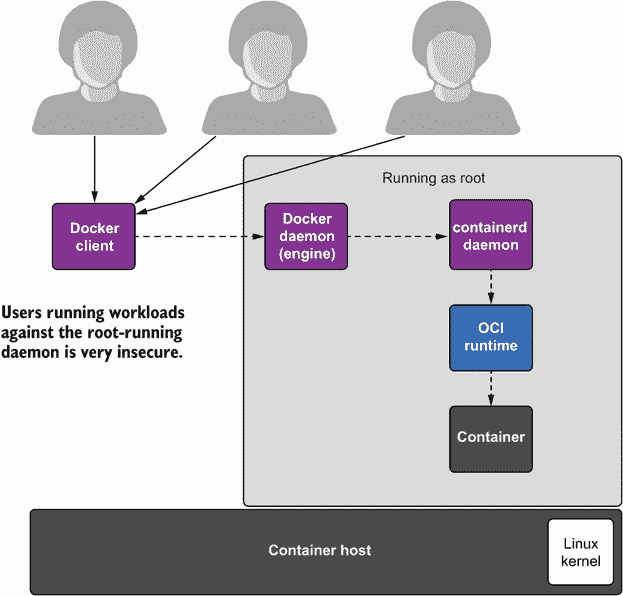
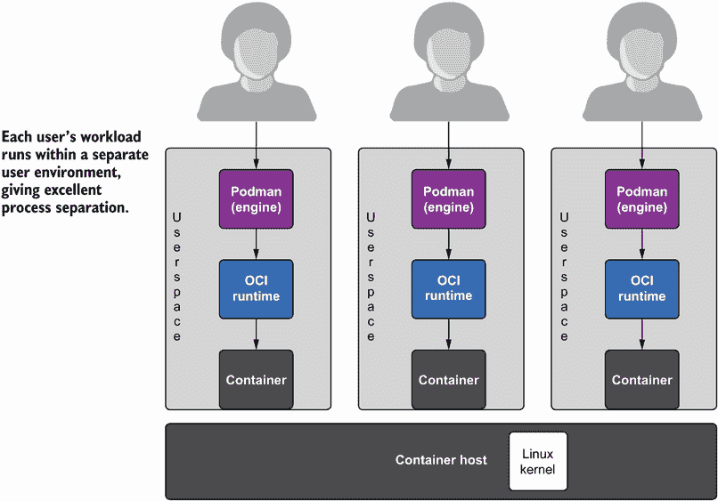
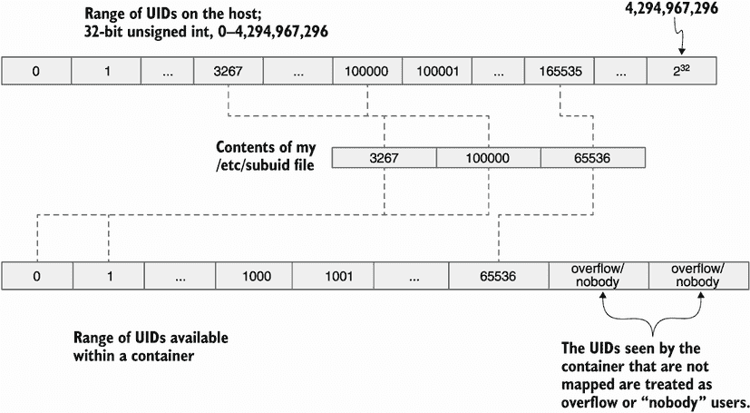
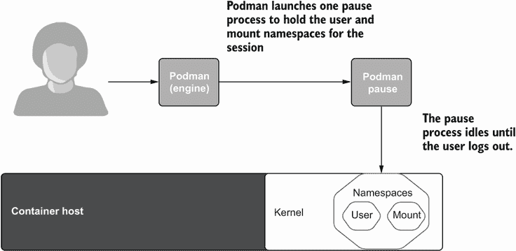
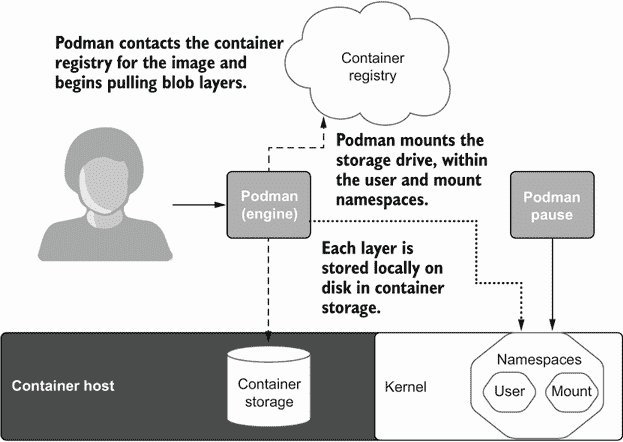
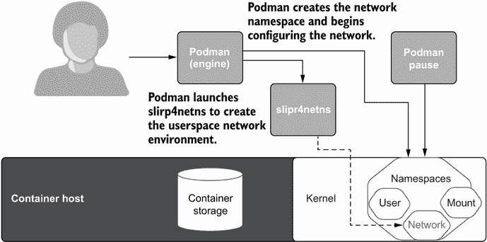
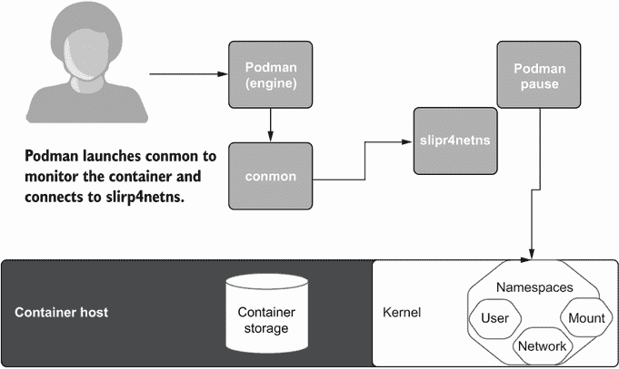
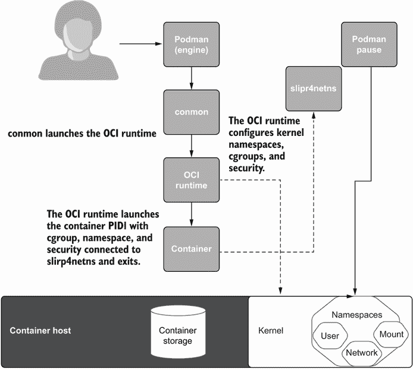
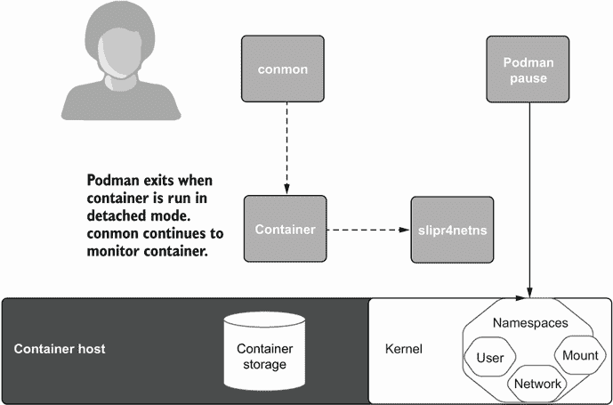

# 6 无 root 容器

本章涵盖了

+   为什么无 root 模式更安全

+   Podman 如何与用户和挂载命名空间协同工作

+   无 root 模式运行 Podman 的架构

在本章中，你将深入了解在无 root 模式下运行 Podman 时发生的情况。我相信了解运行无 root 容器时发生的情况，以及了解在无 root 模式下运行可能引起的问题，是有帮助的。随着过去几年容器化应用程序的引入，某些高度安全的环境无法利用这项新技术。

高性能计算（HPC）系统运行着世界上最快的计算机。这些系统通常位于国家实验室和大学，处理高度机密信息。它们还处理世界上一些最安全的数据，并明确禁止使用 root 容器。HPC 系统处理大量数据集，包括人工智能、核武器、全球天气模式和医学研究。这些系统通常有数千台共享计算机，由于它们的多用户共享环境，需要被锁定。HPC 计算认为以 root 身份运行守护进程太不安全。如果一个恶意容器进程突破限制并获得 root 访问权限，它可以访问高度敏感的数据。HPC 环境的管理员在 Podman 出现之前无法使用开放容器倡议（OCI）容器。现在，HPC 社区正在努力迁移到无 root 的 Podman。

同样，大型金融公司管理员出于对涉及财务数据的担忧，不允许用户和开发人员访问他们共享计算机系统上的 root 权限。世界上最大的金融公司发现很难完全采用 OCI 容器。图 6.1 显示，尽管 Docker 客户端可以以非 root 身份运行，但它连接到一个 root 运行的守护进程，从而为宿主操作系统提供完整的 root 访问权限。



图 6.1 多个用户的工作负载共享同一个以 root 身份运行的守护进程，这在本质上是不安全的。

核心问题是，允许共享计算系统上的用户运行访问相同 root 运行守护进程的容器工作负载，这太不安全了。在各个用户的账户下以无 root 模式运行每个用户的容器更安全。图 6.2 显示了多个用户独立运行 Podman，没有任何 root 访问权限。



图 6.2 每个工作负载在其独特的用户空间中运行，这更安全。

Linux 从一开始就被设计为在特权模式（rootful）和非特权模式（rootless）之间进行分离。在 Linux 中，几乎所有任务都是非特权运行的。特权操作仅需要修改核心操作系统。几乎在容器、Web 服务器、数据库和用户工具中运行的所有应用程序都不需要 root 权限。这些应用程序不会修改系统的核心部分。遗憾的是，你将在容器注册表中找到的大多数镜像都是构建为需要 root 权限，或者至少以 root 身份启动然后降级权限的。

在企业界，管理员非常不愿意向用户授予 root 访问权限。如果你从雇主那里收到了一台企业笔记本电脑，通常你不会获得任何 root 访问权限。管理员需要控制他们系统上安装的内容，因为规模的原因，他们需要能够同时更新数百到数千台机器，因此控制操作系统中的内容至关重要。如果有人正在管理你的机器，他们需要控制谁可以获得 root 访问权限。

作为一名安全人员，当我看到没有密码的 sudo 时，我仍然会有些紧张。当我最初开始使用 Docker 时，我震惊地发现它鼓励使用 Docker 组，给予用户在主机上的完全 root 访问权限，而不需要密码。黑客的圣杯是获得根漏洞；这意味着黑客可以完全控制系统。

核心观点是，如果你遇到了容器逃逸，尽管这很糟糕，但在无根模式下你会更好。这是因为黑客只能控制非特权进程，而不是像根漏洞那样，他们可以完全控制整个系统和所有数据（忽略其他安全机制，如 SELinux）。Podman 的设计目标包括尽可能多地运行工作负载而不需要 root 权限，并推动核心操作系统，使其更容易以这种更安全的方式运行。

## 6.1 无根 Podman 是如何工作的？

你是否曾经好奇过无根 Podman 容器背后的情况？在第二章中，所有的 Podman 示例都是在无根模式下运行的。让我们看看无根 Podman 容器底下的情况。我会解释每个组件，然后分解所有涉及的步骤。

注意：本节中的一些内容是从“无根 Podman 容器背后的情况”博客（[`www.redhat.com/sysadmin/behind-scenes-podman`](https://www.redhat.com/sysadmin/behind-scenes-podman)）中复制和改写的，该博客由我和同事 Matthew Heon 和 Giuseppe Scrivano 撰写。

首先，让我们清理所有存储，以便你获得一个全新的环境，然后在 quay.io/rhatdan/myimage 上运行一个容器。（记住，`podman rmi --all --force`命令会从存储中删除所有镜像和容器。）

```
$ podman rmi --all --force
Untagged: registry.access.redhat.com/ubi8/httpd-24:latest
Untagged: registry.access.redhat.com/ubi8-init:latest
Untagged: localhost/myimage:latest
Untagged: quay.io/rhatdan/myimage:latest
Deleted: d2244a4379d6f1981189d35154beaf4f9a17666ae3b9fba680ddb014eac72adc
Deleted: 82eb390304938f16dd707f32abaa8464af8d4a25959ab342e25696a540ec56b5
Deleted: 8773554aad01d4b8443d979cdd509e7b8fa88ddbc966987fe91690d05614c961
```

现在您有一个干净的系统，您需要从第二章中您推送到容器注册中心的容器镜像 quay.io/ rhatdan/myimage 中检索应用程序镜像。在以下命令中，在您的机器上重新创建应用程序。该命令从容器注册中心拉取镜像，并在您的宿主机上启动`myapp`容器。

```
$ podman run -d -p 8080:8080 --name myapp quay.io/rhatdan/myimage
Trying to pull quay.io/rhatdan/myimage:latest...
...  
2f111737752dcbf1a1c7e15e807fb48f55362b67356fc10c2ade24964e99fa09
```

现在我们深入探讨一下当你运行无根 Podman 容器时发生了什么。首先发生的事情是 Podman 需要设置用户命名空间。在下一节中，我将解释为什么需要这样做以及它是如何工作的。

### 6.1.1 图像包含多个用户标识符（UID）拥有的内容

在 Linux 中，用户标识符（UID）和组标识符（GID）被分配给进程并存储在文件系统对象上。文件系统对象也分配了权限值。Linux 根据这些 UID 和 GID 控制进程对文件系统的访问。这种访问称为*自主访问控制*（DAC）。当您登录 Linux 机器时，您的无根用户进程以单个 UID 运行——比如说`1000`——但容器镜像通常在其镜像层中包含多个不同的 UID。让我们检查运行我们的镜像所需的 UID。在这个例子中，您通过运行另一个容器来检查容器镜像中定义的所有 UID。

在以下命令中，使用 quay.io/rhatdan/myimage 镜像启动一个容器。您需要在容器内部以 root（`- -user=root`）身份运行容器，以检查镜像中的每个文件。

```
$ podman run --user=root --rm quay.io/rhatdan/myimage -- bash -c "find / 
➥ -mount -printf \”%U=%u\n\” | sort -un" 2>/dev/null
```

由于这是一个临时容器，请使用`--rm`选项确保容器在运行完成后被删除。容器运行一个 Bash 脚本，该脚本查找容器中每个文件/目录关联的所有 UID 和用户。脚本将输出通过管道传递以显示唯一条目，并将`stderr`重定向到`/dev/null`以消除任何错误。

```
$ podman run --user=root --rm quay.io/rhatdan/myimage -- bash -c "find /
➥ -mount -printf \”%U=%u\n\” | sort -un" 2>/dev/null
0=root
48=apache
1001=default
65534=nobody
```

如您从输出中可以看到，我们的容器镜像使用了四个不同的 UID，如表 6.1 所示。

表 6.1 运行容器镜像所需的唯一 UID

| UID | Name | Description |
| --- | --- | --- |
| `0` | `root` | 拥有容器镜像中的大部分内容 |
| `48` | `apache` | 拥有所有 Apache 内容 |
| `1001` | `default` | 容器运行时的默认用户 |
| `65634` | `nobody` | 分配给任何未映射到容器中的 UID |

为了将容器镜像拉取到您的家目录中，Podman 需要存储至少三个不同的 UID：`0`、`48`和`1001`。由于 Linux 内核阻止非特权账户使用超过一个 UID，因此您无法创建具有不同 UID 的文件。您需要利用用户命名空间。

用户命名空间

Linux 支持用户命名空间的概念，这是将主机上的 UID/GID 映射到命名空间内部的不同 UID 和 GID。以下是手册页对该概念的描述：

```
$ man user namespaces
...
```

用户命名空间隔离了与安全相关的标识符和属性——特别是用户 ID 和组 ID（见`credentials(7)`）、根目录、密钥（见`keyrings(7)`）和权限（见`capabilities(7)`）。进程的用户和组 ID 可以在用户命名空间内外不同。特别是，进程可以在用户命名空间外有一个普通的无特权的用户 ID，同时在该命名空间内有一个用户 ID 为`0`；换句话说，进程在用户命名空间内的操作具有完全权限，但在命名空间外的操作是无特权的。

由于您的容器需要多个 UID，Podman 进程首先创建并进入一个用户命名空间，在那里它可以访问更多的 UID。Podman 还必须挂载几个文件系统来运行容器。这些挂载命令在用户命名空间之外不允许（包括挂载命名空间）。图 6.3 显示了用户命名空间内的 UID。



图 6.3 容器的用户命名空间映射

当我创建我的系统时，我使用了`useradd`程序来创建我的账户。它将`3267`分配给我作为 UID 和 GID，这些在`/etc/passwd`和`/etc/group`中定义。它还分配了 UID `100000-1065535`——为我定义在`/etc/subuid`和`/etc/subgid`中的额外 UID 和 GID。让我们看看这些文件的内容：

```
$ cat /etc/subuid
dwalsh:100000:65536
Testuser:165536:65536
$ cat /etc/subgid
dwalsh:100000:65536
Testuser:165536:65536
```

您可以在您的系统上查看这些文件，您将看到类似的内容。在我的系统中，我还有一个`testuser`账户；`useradd`也为该用户添加了 UID/GID，在我分配之后立即开始。

在用户命名空间内，我能够访问 UID `3267`（我的 UID）以及`100000`、`100001`、`100002`、...、`165535`，总共 65,537 个 UID。root 用户可以通过修改`/etc/subuid`和`/etc/subgid`文件来增加或减少这个数字。

`useradd`命令从 UID `100000`开始，这样您就可以在 Linux 系统上拥有大约 99,000 个普通用户，以及为系统服务预留的 1,000 个 UID。内核支持超过 40 亿个 UID（2³² = 4,294,967,296）。由于`useradd`为每个用户分配 65,537 个，Linux 可以支持超过 60,000 个用户。选择 65,536（2¹⁶）这个数字是因为直到 Linux 内核 2.4，这曾是 Linux 系统上的最大用户数。让我们更深入地了解用户命名空间。

Linux 系统上的每个进程都在一个命名空间中，包括 init 进程和 systemd。这些都是主机命名空间。因此，每个进程都在一个用户命名空间中。您可以通过检查/proc 文件系统来查看您进程的用户命名空间映射。/proc/PID/uid_map 和/proc/PID/gid_map 包含了操作系统上每个进程的用户命名空间映射。/proc/self/uid_map 包含了当前进程的 UID 映射：

```
$ cat /proc/self/uid_map 
      0        0 4294967295
```

映射意味着从 UID `0`开始的 UID 映射到 UID `0`的范围为 4,294,967,295 个 UID。

另一种看待这种映射的方式是

```
UID 0->0, 1->1,...3267->3267,...,4294967294->4294967294.
```

基本上，没有映射，所以 root 是 root。我的 UID `3267`映射到`3267`——它自己。

现在让我们进入用户命名空间，看看映射情况。Podman 有一个特殊的命令`podman unshare`，它允许你进入用户命名空间而不启动容器。它允许你在系统上作为常规进程运行的同时检查用户命名空间内发生的情况。

在以下命令中，我运行`podman unshare`以在我的账户的默认用户命名空间中启动`cat /proc/self/uid_map`：

```
$ podman unshare cat /proc/self/uid_map 
       0     3267        1
       1   100000    65536
```

映射显示 UID `0`映射到 UID `3267`（我的 UID）的范围为`1`。然后 UID `1`映射到 UID `100000`的范围为`65536`个 UID。

任何未映射到用户命名空间的 UID 在用户命名空间内都报告为`nobody`用户。你之前在搜索容器镜像中的 UID 时已经看到了这一点：

```
$ podman run --user=root --rm quay.io/rhatdan/myimage -- bash -c "find / 
➥ -mount -exec stat -c %u=%U {} \; | sort -un" 2>/dev/null
0=root
48=apache
1001=default
65534=nobody
```

如果你查看宿主机的`/`，你会发现它属于真正的 root：

```
$ ls -l -ld /
dr-xr-xr-x. 18 root root 242 Sep 21 22:32 /
```

如果你检查用户命名空间内的相同目录，你会发现它属于`nobody`用户：

```
$ podman unshare ls -ld /
dr-xr-xr-x. 18 nobody nobody 242 Sep 21 22:32 /
```

由于宿主机的 UID `0`没有映射到用户命名空间，内核报告的 UID 是`nobody`用户。用户命名空间内的进程只能根据`other`或`world`权限访问`nobody`文件。在下面的例子中，你将启动一个 Bash 脚本，它显示用户在用户命名空间内是 root，但看到`/etc/passwd`属于用户`nobody`。你可以使用 grep 命令读取文件，因为`/etc/passwd`是可读的。但 touch 命令失败，因为即使是 root 也无法修改未映射到用户命名空间的 UID 的所有文件：

```
$ podman unshare bash -c "id ; ls -l /etc/passwd; grep *dwalsh* 
➥ /etc/passwd; touch /etc/passwd"
uid=0(root) gid=0(root) groups=0(root),65534(nobody)
-rw-r--r--. 1 nobody nobody 2942 Sep 28 07:08 /etc/passwd
dwalsh:x:3267:3267:Dan Walsh:/home/dwalsh:/bin/bash
touch: cannot touch '/etc/passwd': Permission denied
```

在宿主机上查看你的家目录与用户命名空间内部，你会发现相同的文件被报告为属于你的 UID：

```
$ ls -ld /home/dwalsh
drwx------. 365 dwalsh dwalsh 24576 Sep 28 07:30 /home/dwalsh
```

在用户命名空间内，它们属于 root：

```
$ podman unshare ls -ld */home/dwalsh*
drwx------. 365 root root 24576 Sep 28 07:30 */home/dwalsh*
```

默认情况下，Podman 将你的 UID 映射到用户命名空间内的 root。Podman 默认为 root，因为我在本章开头指定了，大多数容器镜像假设它们以 root 身份启动。

我将给出最后一个例子。在用户命名空间内创建一个目录和一个文件，并使用`chown`命令将内容 UID 更改为`1:1`：

```
$ podman unshare bash -c "mkdir test;touch test/testfile; chown -R 1:1 test"
```

在用户命名空间外，你会看到测试文件的所有者是 UID `100000`：

```
$ ls -l test
total 0
-rw-r--r--. 1 100000 100000 0 Sep 28 07:53 testfile
```

当你在用户命名空间内创建测试文件并将其`chown`为 UID/GID `1:1`时，磁盘上的所有者实际上是 UID `100000`/`100000`。记住，在用户命名空间内，UID `1`映射到 UID `100000`，所以当你创建用户命名空间内的 UID `1`文件时，操作系统实际上创建的是 UID `100000`。

如果你尝试在用户命名空间外删除文件，你会得到一个错误：

```
$ rm -rf test
rm: cannot remove 'test/testfile': Permission denied
```

在用户命名空间外，你只能访问你的 UID；你不能访问额外的 UID。

注意：在 3.1.2 节中，我展示了用户命名空间映射可能对容器卷造成问题，并讨论了你可以处理这些问题的方法。

重新进入用户命名空间，你可以删除文件：

```
$ podman unshare rm -rf test
```

希望你现在已经开始对用户命名空间有所感觉；`podman` 的 `unshare` 命令使得在用户命名空间内探索你的系统变得容易，并理解在无根容器中发生了什么。当运行无根容器时，Podman 需要的不仅仅是以 root 身份运行；它还需要访问一些称为 Linux 能力的 root 特权。

在 Linux 中，root 进程实际上并不都是同等强大的。Linux 将 root 权限分解为一系列 Linux 能力。具有所有 Linux 能力的 root 进程是全能的，而没有 Linux 能力的 root 进程则不允许操纵系统中的许多部分。例如，它不能读取非 root 文件，除非这些文件具有允许系统上所有 UID 读取的权限标志（世界可读）。

让我们看看能力如何与用户命名空间一起工作：

```
$ man capabilities
...
DESCRIPTION
For the purpose of performing permission checks, traditional UNIX 
implementations distinguish two categories of processes: privileged 
processes (whose effective user ID is 0, referred to as superuser or root), 
and unprivileged processes (whose effective UID is nonzero). Privileged 
processes bypass all kernel permission checks, while unprivileged processes 
are subject to full permission checking based on the process's credentials 
(usually: effective UID, effective GID, and supplementary group list).
Starting with kernel 2.2, Linux divides the privileges traditionally 
associated with superuser into distinct units, known as capabilities, which 
can be independently enabled and disabled. Capabilities are a per-thread 
attribute.
```

Linux 目前大约有 40 个能力。例如，`CAP_SETUID` 和 `CAP_SETGID` 允许进程更改它们的 UID 和 GID。`CAP_NET_ADMIN` 允许你管理网络堆栈。

另一个名为 `CAP_CHOWN` 的能力允许进程更改磁盘上文件的 UID/GID。在先前的例子中，当你将测试目录 `chown` 为 `1:1` 时，你是在用户命名空间内使用了 `CAP_CHOWN` 能力：

```
$ podman unshare bash -c "mkdir test;touch test/testfile; chown -R 1:1 test"
```

当你在用户命名空间内运行时，你正在使用命名空间能力。你用户命名空间内的 root 用户拥有这些能力，而不仅仅是命名空间内定义的 UID 和 GID。具有命名空间能力 `CAP_CHOWN` 的进程允许将你用户命名空间内拥有的文件的所有权更改给也位于用户命名空间内的 UID。如果一个用户命名空间内的进程尝试将一个未映射到用户命名空间的文件（由 `nobody` 用户拥有）的所有权更改，该进程将被拒绝权限。同样，尝试将具有用户命名空间内未定义 UID 的文件的所有权更改的进程也会被拒绝。同样，`CAP_SETUID` 能力只允许进程将 UID 更改为用户命名空间内定义的 UID。

当 Podman 运行容器时，它需要为容器挂载几个文件系统。在 Linux 中，挂载文件系统需要 `CAP_SYS_ADMIN` 能力。从安全角度来看，在 Linux 上挂载文件系统可能是一件危险的事情。内核增加了对可以挂载的文件系统类型的额外控制，并要求你的用户命名空间进程也位于一个唯一的挂载命名空间中。在第十章中，你将看到 Podman 如何限制容器内命名空间 root 可用的 Linux 能力的数量。

挂载命名空间

挂载命名空间允许其内的进程挂载文件系统，其中挂载点对挂载命名空间外的进程是不可见的。在挂载命名空间内，你可以在 /tmp 上挂载一个 `tmpfs`，这将阻止命名空间内的进程看到 /tmp。在挂载命名空间外，进程仍然可以看到原始挂载和 /tmp 中的文件，但它们看不到你的挂载。

在无根容器中，Podman 需要挂载容器镜像中的内容以及 /proc、/sys、/dev 中的设备和一些 `tmpfs` 文件系统。为此，Podman 需要创建一个挂载命名空间：

```
$ man mount namespaces
...
Mount namespaces provide isolation of the list of mount points seen by the 
processes in each namespace instance. Thus, the processes in each of the 
mount namespace instances see distinct single-directory hierarchies.
```

当你执行 `podman` `unshare` 命令时，你实际上是在进入一个不同的挂载命名空间以及不同的用户命名空间。

你可以通过以下方式列出 /proc/self/ns/ 目录来检查进程的命名空间：

```
$ ls -l /proc/self/ns/user /proc/self/ns/mnt
lrwxrwxrwx. 1 dwalsh dwalsh 0 Sep 28 09:17 /proc/self/ns/mnt -> 
➥ 'mnt:[4026531840]'
lrwxrwxrwx. 1 dwalsh dwalsh 0 Sep 28 09:17 /proc/self/ns/user -> 
➥ 'user:[4026531837]'
```

注意，当你进入用户命名空间和挂载命名空间时，标识符会发生变化：

```
$ podman unshare ls -l /proc/self/ns/user /proc/self/ns/mnt
lrwxrwxrwx. 1 root root 0 Sep 28 09:17 /proc/self/ns/mnt -> 
➥ 'mnt:[4026533087]'
lrwxrwxrwx. 1 root root 0 Sep 28 09:17 /proc/self/ns/user -> 
➥ 'user:[4026533086]'
```

在以下测试中，你可以在 /tmp 上创建一个文件，然后尝试将其绑定挂载到 /etc/shadow。在命名空间外，内核正确地阻止了你挂载文件，如下面的输出所示：

```
$ echo hello > /tmp/testfile
$ mount --bind /tmp/testfile /etc/shadow
mount: /etc/shadow: must be superuser to use mount.

Once you enter the user namespace and mount namespace, your namespaced 
process can successfully mount over the /etc/shadow file. You can see when 
you run the following command that /etc/shadow is actually modified:
$ podman unshare bash -c "mount -o bind /tmp/testfile /etc/shadow; cat 
/etc/shadow" 
hello
```

一旦你退出 `unshare`，一切都会恢复正常。

用户命名空间和挂载命名空间

正如你之前看到的，当你覆盖挂载 /etc/shadow 文件时，你可能会欺骗一些 `setuid` 应用程序，如 /bin/su 或 /bin/sudo，让你获得完整的 root 权限。不允许无根用户挂载文件系统的原因是为了防止这种类型的攻击。

正如你所看到的，独立的挂载命名空间阻止了你影响主机对系统的视图，而你挂载的任何内容只会在挂载命名空间内可见。在用户命名空间内，容器已经有一个命名空间的根。对你的挂载点的攻击只能在用户命名空间内升级到 root，而不是主机上的真实 root。容器化进程不能更改它们的 UID (`setuid`) 为真实 root 或任何映射到用户命名空间的 UID。

即使有命名空间，Linux 内核也只允许挂载某些文件系统类型。许多文件系统类型对无根用户来说过于危险，因为它们可以访问内核的敏感部分。我正在与文件系统内核工程师合作，看看是否有方法可以锁定其他可以以无根模式挂载的文件系统类型，同时不影响系统的安全性。

截至 5.13 内核版本，内核工程师将原生 overlay 挂载添加到了允许挂载的列表中。当前允许的文件系统类型列在表 6.2 中。

表 6.2 当前在无根模式下支持挂载的文件系统

| 挂载类型 | 描述 |
| --- | --- |
| `bind` | 在无根容器中大量使用。因为无根用户不允许创建设备，Podman 将主机上的/dev 挂载到容器中。Podman 还使用`bind`挂载来隐藏主机文件系统中的内容，使其对容器不可见。Podman 还将/dev/null 通过/proc 和/sys 中的文件`bind`挂载，以隐藏内容。第三章中描述的卷挂载也使用`bind`挂载。 |
| `binderfs` | 用于 Android binder IPC 机制的文件系统。Podman 不支持它。 |
| `devpts` | 虚拟文件系统挂载在/dev/pts 上。它包含用于终端模拟器的设备文件 |
| `cgroupfs` | 用于操作 cgroups 的内核文件系统；无根容器可以使用`cgroupfs`在 cgroups v2 中操作 cgroups。在 v1 中不支持。它挂载在/sys/fs/cgroups 上。 |
| `FUSE` | 用于在无根模式下使用`fuse-overlayfs`挂载容器镜像。在内核 5.13 之前，这是在无根模式下使用 overlay 文件系统的唯一方法。 |
| `procfs` | 在容器内挂载在/proc 上。你可以检查容器内的进程。 |
| `mqueue` | 实现 POSIX 消息队列 API。Podman 将此文件系统挂载在/dev/mqueue 上。 |
| `overlayfs` | 用于挂载镜像。在`fuse-overlayfs`文件系统中表现更好。在特定用例中，它比原生 overlay 提供更多好处，例如 NFS 家目录。 |
| `ramfs` | 动态可调整大小的基于 RAM 的 Linux 文件系统，目前与 Podman 不兼容。 |
| `sysfs` | 挂载在/sys 上。 |
| `tmpfs` | 用于隐藏内核文件系统目录，使其在/proc 和/sys 中的容器不可见。 |

## 6.2 无根 Podman 的内部机制

现在你已经对用户命名空间和挂载命名空间的工作原理以及为什么需要它们有了了解，让我们深入探讨 Podman 在运行容器时做了什么。当你首次登录后运行 Podman 容器时，Podman 读取/etc/subuid 和/etc/subgid 文件，寻找你的用户名或 UID。一旦 Podman 找到条目，它就会使用条目内容以及你的当前 UID/GID 为你生成一个用户命名空间。然后 Podman 启动`podman` `pause`进程以保持用户和挂载命名空间打开（图 6.4）。



图 6.4 Podman 启动 pause 进程以保持用户和挂载命名空间打开。

用户通常报告，在运行 Podman 容器后，当他们运行以下命令时，仍然可以看到一个`podman`进程在运行：

```
$ ps -e | grep podman
  2541 ?     00:00:00 podman pause 
```

Podman 命令的后续运行会将`podman pause`进程的命名空间连接起来。Podman 这样做是为了避免在用户命名空间上下文切换时发生竞争条件。`pause`进程会一直运行，直到你注销。你也可以执行`podman system migrate`命令来删除它。`pause`进程的作用是保持用户命名空间活跃，因为所有无根容器都必须在同一个用户命名空间中运行。如果不是这样，共享内容和其他命名空间（如从另一个容器共享网络命名空间）是不可能的。

注意，我经常有用户报告说，在更改`/etc/subuid`和`/etc/subgid`文件时，他们的容器不会立即反映这些更改。由于`pause`进程是在先前的用户命名空间设置下启动的，因此需要将其删除。执行`podman system migrate`命令会在用户命名空间内重新启动`pause`进程。

你可以随时终止`pause`进程，但 Podman 会在下一次运行时重新创建它。默认情况下，每个无根用户都有自己的用户命名空间，并且它们的所有容器都在同一个用户命名空间中运行。你可以细分用户命名空间，并使用不同的用户命名空间运行容器，但请注意，默认情况下，你只有 65,000 个 UID 可以工作。当运行有根容器时，在多个用户命名空间中运行多个容器要容易得多。现在用户命名空间和挂载命名空间已经创建，Podman 为容器的镜像创建存储，并设置挂载点以开始存储镜像。

### 6.2.1 拉取镜像

当拉取镜像（图 6.5）时，Podman 会检查容器镜像 quay.io/rhatdan/myimage 是否存在于本地容器存储中。如果存在，Podman 会设置容器网络（参见 6.2.3 节）。然而，如果容器镜像不存在，Podman 会使用 containers/image 库来拉取镜像。以下是 Podman 在拉取镜像时采取的步骤：

1.  解析注册表的 IP 地址：quay.io。

1.  通过 HTTPS 端口（`443`）连接到 IP 地址。

1.  使用 HTTP 协议开始拉取镜像的清单、所有层和配置。

1.  查找 quay.io/rhatdan/myimage 的多个层或 blob。

1.  从容器注册表同时复制所有层到主机。



图 6.5 Podman 从一个容器注册库拉取镜像并将其存储在容器存储中。

随着每一层被复制到主机，Podman 使用 containers/storage 库按顺序重新组装层，并在`~/.local/share/containers/storage`上为每个层创建一个 overlay 挂载点。如果没有先前的层，它将创建初始层。

接下来，containers/storage 将层的内容解压缩到新的存储层中。随着层的解压缩，containers/storage 会对 tar 包中的文件进行`chown`操作，将 UID/GID 更改为家目录。Podman 利用用户命名空间的`CAP_CHOWN`权限，如前几节所述。请记住，如果 TAR 文件中指定的 UID 或 GID 未映射到用户命名空间，Podman 将无法创建内容。

### 6.2.2 创建容器

一旦 containers/storage 库完成下载镜像和创建存储，Podman 将基于该镜像创建一个新的容器。Podman 将容器添加到 Podman 的内部数据库中。然后，它告诉 containers/storage 在磁盘上创建可写空间并使用默认的存储驱动程序，通常是`overlayfs`，将此空间挂载为新的容器层。新的容器层作为最终的读写层，并挂载在镜像之上。

注意：具有 root 权限的容器默认使用原生 Linux overlay 挂载。在无 root 模式下，对于版本高于 5.13 的内核或具有 rootless overlay 功能回滚的内核（RHEL 8.5 内核或更高版本也具有此功能）使用原生 overlay 挂载。在较旧的内核上，Podman 使用`fuse-overlayfs`可执行文件来创建层。在 Podman 中，`overlay`和`overlay2`是相同的驱动程序。

在这一点上，Podman 需要配置网络命名空间内的网络。

### 6.2.3 设置网络

在无 root Podman 中，您不能为容器创建完整的、独立的网络，因为无 root 进程不允许创建网络设备并修改防火墙规则。无 root Podman 使用 slirp4netns ([`github.com/rootless-containers/slirp4netns`](https://github.com/rootless-containers/slirp4netns))来配置主机网络并为容器模拟 VPN。Slirp4netns 为无特权的网络命名空间提供用户模式网络（slirp）。见图 6.6。



图 6.6 Podman 创建一个网络命名空间并启动 slirp4netns 以中继网络连接。

注意：在具有 root 权限的容器中，Podman 使用 CNI 插件来配置网络设备。在无 root 模式下，尽管用户被允许创建和加入一个网络命名空间，但他们不允许创建网络设备。slirp4netns 程序模拟一个虚拟网络以连接主机网络到容器网络。更高级的网络设置需要具有 root 权限的容器。

记住，在我们的原始示例中，您指定了如下`8080:8080`端口映射：

```
$ podman run -d -p 8080:8080 --name myapp 
     registry.access.redhat.com/ubi8/httpd-24
```

Podman 配置 slirp4netns 程序在主机网络的端口 `8080` 上监听，并允许容器进程绑定到端口 `8080`。slirp4netns 命令创建一个 tap 设备，该设备注入到新的网络命名空间中，容器就位于其中。每个数据包都会从 slirp4netns 读取并模拟用户空间中的 TCP/IP 堆栈。容器网络命名空间之外的所有连接都会转换为无特权的用户可以在主机网络命名空间中运行的套接字操作。

注意 Linux TAP 设备创建一个用户空间网络桥。在用户空间中，TAP 设备可以模拟网络命名空间内的网络设备。命名空间内的进程与网络设备交互。从网络设备读取/写入的数据包通过 TUN/TAP 设备路由到用户空间程序：slirp4netns。

现在存储和网络配置完成，Podman 准备最终启动容器进程。

### 6.2.4 启动容器监控器：conmon

Podman 现在执行 conmon（容器监控器）以启动容器，并告诉它使用其配置的 OCI 运行时，通常是 `crun` 或 `runc`。当容器退出时，它还执行 `podman` `container` `cleanup` `$CTRID` 命令（见图 6.7）。conmon 在第 4.1 节中描述。



图 6.7 Podman 启动容器监控器，该监控器启动 OCI 运行时。

### 6.2.5 启动 OCI 运行时

OCI 运行时读取 OCI 规范文件并配置内核以运行容器（见图 6.8）。OCI 运行时执行以下操作：

1.  为容器设置额外的命名空间。

1.  配置 cgroups v2（cgroups v1 不支持无根容器）。

1.  为运行容器设置 SELinux 标签。

1.  将 /usr/share/containers/seccomp.json seccomp 规则加载到内核中。

1.  设置容器的环境变量。

1.  将任何卷绑定到 rootfs 中的路径。

1.  将当前的 `/` 切换到 rootfs 的 `/`。

1.  分叉容器进程。

1.  执行任何 OCI 钩子程序，并将 rootfs 以及容器的 PID 1 传递给它们。

1.  执行由镜像指定的命令。

1.  退出 OCI 运行时，留下 conmon 监控容器。



图 6.8 conmon 启动 OCI 运行时，该运行时配置内核。

最后，conmon 将成功报告回 Podman（见图 6.9）。



图 6.9 Podman 和 OCI 运行时退出，留下容器在 conmon 监控下运行，并由 slirp4netns 提供网络。

Podman 命令现在退出，因为它在 `--detach` (`-d`) 模式下运行。

```
$ podman run -d -p 8080:8080 --name myapp 
     registry.access.redhat.com/ubi8/httpd-24
```

注意：如果您以后想让 Podman 与分离的容器交互，请使用 `podman` `attach` 命令，该命令连接到 conmon 套接字。conmon 允许 Podman 通过 `STDIN`、`STDOUT` 和 `STDERR` 文件描述符与容器进程交互，这些文件描述符是 conmon 监控的。

### 6.2.6 容器化应用程序运行至完成

应用进程可以自行退出，或者你可以通过执行 `podman` `stop` 命令来停止容器：

```
$ podman stop myapp
```

当容器进程退出时，内核向 `conmon` 进程发送 `SIGCHLD` 信号。反过来，conmon 执行以下操作：

1.  记录容器的退出代码

1.  关闭容器的日志文件

1.  关闭 Podman 命令的 `STDOUT`/`STDERR`

1.  执行 `podman` `container` `cleanup` `$CTRID` 命令

1.  退出本身

`podman` `container` `cleanup` 命令关闭 slirp4netns 网络，并卸载所有容器的挂载点。如果你指定了 `--rm` 选项，容器将被完全删除——层将从容器/存储中移除，容器定义将从数据库中删除。

## 摘要

+   运行无根容器比运行有根容器更安全。

+   用户命名空间使普通用户能够操作多个 UID，是运行容器的关键。

+   挂载命名空间允许 Podman 在用户命名空间内挂载文件系统。

+   Podman 使用 slirp4netns 为容器提供网络访问。

+   Podman 启动 `conmon` 进程以监控容器。
