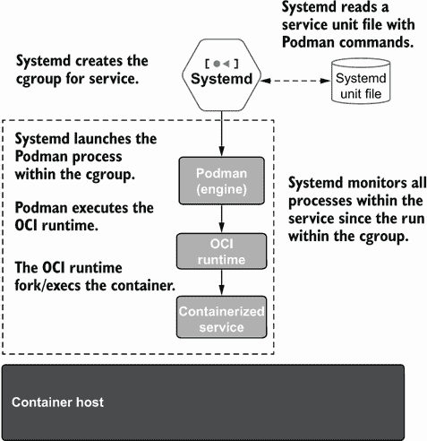
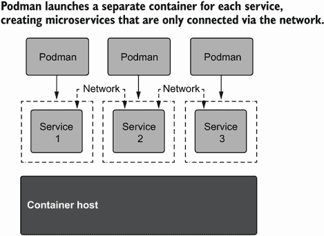
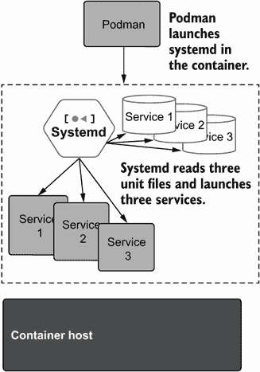
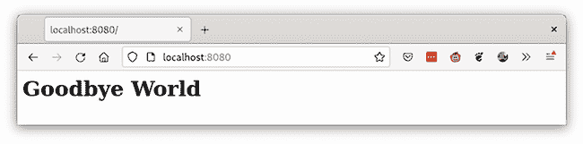
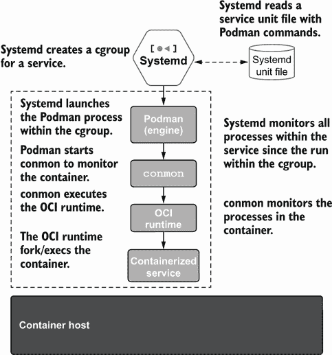
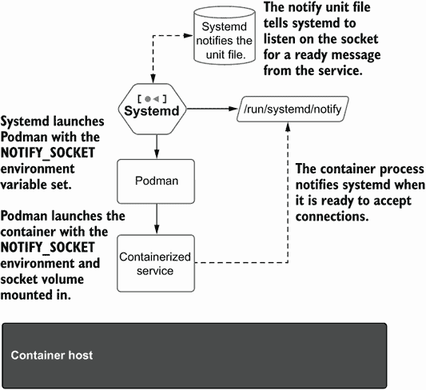
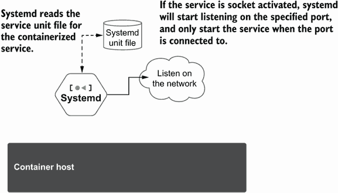
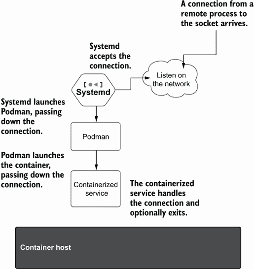
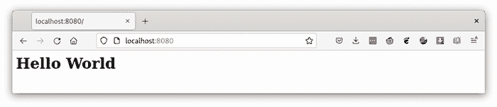

# 7 与 systemd 的集成

本章涵盖

+   在容器中将 systemd 作为主进程运行

+   从现有容器生成 systemd 单元文件

+   套接字激活的容器化服务

+   使用`sd-notify`容器化服务

+   使用 journald 作为日志驱动程序和事件后端的优势

+   使用 Podman 和 systemd 管理边缘设备上容器化服务的生命周期

Systemd 是 Linux 的事实上的初始化系统。几乎每个 Linux 发行版都将 systemd 作为内核启动后的第一个进程默认启动，然后启动所有服务，包括用户的登录会话。Podman 拥抱 systemd 的力量，并使用它来启动许多服务。在启动引导时的容器化服务时，Podman 鼓励用户使用 systemd 单元文件与 Podman 命令一起使用。单元文件是 systemd 所说的配置文件。Systemd 支持几种不同类型的单元文件，包括可以定义服务的服务文件，你希望 systemd 管理这些服务。SystemD.socket 是 systemd 使用的另一种类型的单元文件（见第 7.6 节）。systemd 服务单元文件是向世界分享你的容器化服务的一种方式。如图 7.1 所示，Podman 的 fork/exec 模型赋予了 systemd 跟踪容器化服务内进程的能力。



图 7.1 Systemd 执行 Podman 容器

Systemd 将一个单元文件服务（称为作用域）内的所有进程放入相同的 cgroup 层次结构中。然后它使用 PID cgroup 来跟踪所有进程，并使用这些信息来管理服务。使用客户端-服务器方法的容器引擎阻止 systemd 跟踪容器化进程。

Podman 也利用了其他服务，正如你将在本章中看到的，来处理容器的自动重启、自动更新以及容器化服务的常规管理。在本章中，你将接触到许多 Podman 和 systemd 的功能，但首先你将在 Podman 容器中运行 systemd。

## 7.1 在容器中运行 systemd

当容器化技术刚开始流行时，许多传教士教授了微服务概念。*微服务*被定义为容器中的一个专业服务。这个单一的服务作为容器中的初始 PID（PID 1）运行，并将其日志直接写入`stdout`和`stderr`。Kubernetes 假设微服务，因此从它运行的容器中收集`stdin`/`stderr`的日志。图 7.2 显示了 Podman 运行微服务。



图 7.2 Podman 运行三个微服务

另一个想法是在容器内以初始 PID 运行 systemd，然后允许 systemd 在容器内启动一个或多个服务。这种观点认为，容器化服务应以与在虚拟机内启动相同的方式启动。因为服务包设计者（例如，RPM 和 APT）将 systemd 单元文件作为在操作系统内启动其服务的一种精确方式，容器开发者应该利用这些单元文件。这种方法允许在同一个容器内运行多个服务，利用本地通信路径，并加快将大型多服务应用程序转换为容器，然后随着时间的推移，将每个服务分解为其自己的微服务。

systemd 在容器中的最后一个巨大优势是 init 系统处理僵尸进程的清理。在 Linux 中，当进程退出时，内核向父进程发送信号 `SIGCHLD`，父进程应该收集退出进程的退出状态。当父进程读取退出状态时，内核从系统中删除该进程。如果没有父进程读取退出状态，退出的进程将保留在退出状态，被称为 *僵尸进程*。init 系统，systemd，回收系统中的大多数进程。在容器中，容器内运行的初始进程应该回收这些进程。有时容器进程会退出，如果 PID1 不回收它们，它们就会徘徊，永远不会消失。

注意：`podman-run` 命令支持 `–init` 选项，该选项将启动一个微小的 init 程序，专门用于回收僵尸进程。

Podman 被设计为支持两种方法——微服务和多服务容器。图 7.3 显示了 systemd 在容器内运行多服务应用程序。



图 7.3 Podman 在容器中运行 systemd 并包含三个服务

Podman 检查容器的 `cmd` 选项，然后启动 systemd 以进行 init 或系统。然后它自动以 systemd 模式启动容器。

以下列表显示了所有触发 Podman 在 systemd 模式下运行的命令：

+   /sbin/init

+   /usr/sbin/init

+   /usr/local/sbin/init

+   /*/systemd（任何以 systemd 命令结尾的路径）

registry.access.redhat.com/ubi8-init 图像是一个旨在以 systemd 模式运行的图像示例。

下载 ubi8-init 图像，并检查命令：

```
$ podman pull ubi8-init
Resolved "ubi8-init" as an alias (/etc/containers/registries.conf.d/
➥ 000-shortnames.conf)
Trying to pull registry.access.redhat.com/ubi8-init:latest...
...
8cb83279f877a4bf3412827bf71c53188c3983194bd4663a1fc1378360844463
$ podman inspect ubi8-init --format '{{ .Config.Cmd }}'
[/sbin/init]
```

systemd 需要环境以某种方式配置；否则，systemd 会尝试纠正环境。下一节将解释 Podman 如何满足 systemd 的要求。

### 7.1.1 容器化 systemd 要求

systemd 对其启动的环境做出一些假设，例如 /run 和 /tmp 需要挂载上 tmpfs。当环境不正确时，systemd 会尝试通过在 /run 和 /tmp 上挂载 tmpfs 来纠正它。挂载需要在容器内具有 `CAP_SYS_ADMIN` 权限，这在非特权容器中是不允许的。然后 systemd 会崩溃。

为了解决这个问题，在检查容器镜像的入口点和 `CMD` 以查看它们是否运行 systemd 之后，Podman 修改容器环境以匹配 systemd 的期望。当 systemd 看到挂载时，它会跳过它们，允许 systemd 在锁定环境中运行。表 7.1 描述了 systemd 需要的要求和 Podman 提供的要求，以便在非特权容器中成功运行。

表 7.1 在非特权容器中运行 systemd 的要求

| Systemd expectations | 描述 |
| --- | --- |
| /run on a tmpfs | systemd 需要挂载在 /run 上的 tmpfs。如果 /run 没有使用 tmpfs 挂载，systemd 将尝试在 /run 上挂载一个 tmpfs。默认的锁定容器被阻止挂载，因此 systemd 将失败。 |
| /tmp on a tmpfs | 类似于 /run，systemd 将尝试在 /tmp 上挂载一个 tmpfs，如果那里还没有挂载的话。 |
| /var/log/journald as a tmpfs | 容器内的 systemd 期望能够写入 /var/log/journald，因此 Podman 挂载一个 tmpfs 来实现这一点。 |
| `container` environment variable | systemd 利用 `container` 环境变量已设置的事实来改变其一些默认行为，使其在容器内运行得更好。 |
| `STOPSIGNAL=SIGRTMIN+3` | 与系统上的大多数进程不同，systemd 忽略 `SIGTERM`，并且只有在接收到信号 `SIGRTMIN+3 (37)` 时才会干净地退出。 |

### 7.1.2 Podman 容器在 systemd 模式下

您可以使用 `--systemd =always` 标志检查基于 systemd 的容器的环境。首先，使用 `--systemd=always` 标志启动一个启用 systemd 模式的容器。此选项即使在未运行 systemd 的情况下也会以 systemd 模式运行容器，这使得调试环境更容易。您现在可以 `exec systemd` 并将其作为 PID1 启动：

```
$ podman create –rm –name SystemD -ti –systemd=always ubi8-init sh
774a50204204768edd73f178b6afdf975cf9353e3b90af9df77273d639f60ac3
```

使用 `podman` `inspect` 检查容器的 `StopSignal`；Podman 将其设置为 `37` `(SIGRTMIN+3)`：

```
$ podman inspect SystemD --format '{{ .Config.StopSignal}}'
37
```

现在，启动容器，查看 /run 和 /tmp 的挂载情况；您将看到两者都使用 tmpfs 挂载。最后，检查容器环境变量是否已设置：

```
$ podman start --attach SystemD
# mount | grep -e /tmp -e /run | head -2
tmpfs on /tmp type tmpfs 
➥ (rw,nosuid,nodev,relatime,context="system_u:object_r:container_file_t:s0:
➥ c37,c965",uid=3267,gid=3267,inode64)
tmpfs on /run type tmpfs 
➥ (rw,nosuid,nodev,relatime,context="system_u:object_r:container_file_t:s
➥ 0:c37,c965",uid=3267,gid=3267,inode64)
# printenv container
Oci
```

如果您仅运行基于 `ubi8-init` 的容器，您将看到 systemd 启动：

```
$ podman run -ti ubi8-init
SystemD 239 (239-45.el8_4.3) running in system mode. (+PAM +AUDIT +SELINUX 
➥ +IMA -APPARMOR +SMACK +SYSVINIT +UTMP +LIBCRYPTSETUP +GCRYPT +GNUTLS 
➥ +ACL +XZ +LZ4 +SECCOMP +BLKID +ELFUTILS +KMOD +IDN2 -IDN +PCRE2 
➥ default-hierarchy=legacy)
Detected virtualization container-other.
Detected architecture x86-64.
Welcome to Red Hat Enterprise Linux 8.4 (Ootpa)!
Set hostname to <26bbf9077219>.
Initializing machine ID from random generator.
Failed to read AF_UNIX datagram queue length, ignoring: 
➥ No such file or directory
[  OK  ] Listening on initctl Compatibility Named Pipe.
[  OK  ] Reached target Swap.
[  OK  ] Listening on Journal Socket (/dev/log).
[  OK  ] Listening on Journal Socket.
...
```

在这里，您可以注意到 systemd 通过按 Ctrl-C 忽略 `SIGTERM`。因此，要停止此容器，您需要进入不同的终端并执行

```
# podman stop -l
```

这导致 Podman 向容器中的 systemd 发送正确的 `STOPSIGNAL` `(SIGRTMIN+3)`。当 systemd 收到此信号时，它会立即关闭。

现在你已经了解了 systemd 的要求，是时候创建一个 systemd 将要运行的服务了。在下面的章节中，你将构建一个基于 systemd 的 Apache 服务，该服务将在容器内与 systemd 一起运行。

### 7.1.3 在 systemd 容器内运行 Apache 服务

在本节中，你将创建一个 `Containerfile`，使用 `ubi8-init` 作为基础镜像，然后安装 Apache `httpd`。最后，你将启用此服务并设置我们一直在使用的 Apache 脚本。

创建一个 `Containerfile`：

```
$ cat << _EOF >  /tmp/Containerfile
FROM ubi8-init
RUN dnf -y install httpd; dnf -y clean all
RUN systemctl enable httpd.service
_EOF
```

回想一下，`FROM` `ubi8-init` 这行命令将告诉 Podman 使用 `ubi8-init` 镜像作为新镜像的基础镜像：

```
FROM ubi8-init
RUN dnf -y install httpd; dnf -y clean all
RUN systemctl enable httpd.service
```

`RUN` `dnf` `-y` `install` `httpd;` `dnf` `-y` `clean` `all` 这行命令告诉 Podman 运行一个容器，执行 `dnf` 命令并在 `ubi8-init` 镜像上安装 `httpd` 软件包。第二个 `dnf` 命令删除多余的文件并记录安装过程中创建的 `dnf` 日志，因为这些文件没有必要包含在镜像中：

```
FROM ubi8-init
RUN dnf -y install httpd; dnf -y clean all
RUN systemctl enable httpd.service
```

最后的 `RUN` `systemctl` `enable` `httpd.service` 命令告诉 Podman 启动另一个构建容器并执行 `systemctl` 命令以启用 `httpd` `.service`。当 systemd 在从新创建的镜像创建的容器上运行时，`httpd` 服务将被启动：

```
FROM ubi8-init
RUN dnf -y install httpd; dnf -y clean all
RUN systemctl enable httpd.service
```

现在使用 `podman` 的 `build` 命令构建镜像，并将镜像命名为 `my-systemd`：

```
$ podman build -t my-systemd /tmp
STEP 1/3: FROM ubi8-init
STEP 2/3: RUN dnf -y install httpd; dnf -y clean all
Updating Subscription Management repositories.
Unable to read consumer identity
...
COMMIT my-systemd
--> 104fa99d9a2
Successfully tagged localhost/my-systemd:latest
104fa99d9a2138404039cf15b470ab04784cdaab2226f29bd8343f8e24ec60e2
```

现在运行一个基于 systemd 的容器镜像，并从主机挂载一个卷。由于默认的 Apache 软件包监听端口 `80`，使用 `--p` `8080:80`，正如你所学的，这会将端口 `8080` 映射到容器内的端口 `80`。使用来自第 3.1 节的 html 文件夹和 index.xhtml 文件：

```
$ podman run -d --rm -p 8080:80 -v ./html:/var/www/html:Z my-systemd
71f1678084390925b7488f68ab58cd55e16009d69b717045b8ed5ef14e8599ce
```

你在 ./html 目录中挂载了卷 `(-v` `./html/:/var/www/html:Z)`，并包含 goodbye world index.xhtml 文件：

```
$ podman run -d --rm -p 8080:80 -v ./html:/var/www/html:Z my-systemd
```

启动一个网页浏览器来检查容器化服务是否正常工作（如图 7.4 所示）：

```
$ web-browser localhost:8080
```



图 7.4 显示基于系统容器的镜像运行你的内容的网页浏览器窗口

注意，在设计镜像时，你不需要特别处理 HTTPD 服务器进程；你的容器以与虚拟机相同的方式运行 HTTPD。如果你需要在镜像内启用另一个服务，你可以通过安装软件包并启用其单元文件轻松地做到这一点。

要查看这种设置的不足之处，你可以运行 `podman` 的 `logs` 命令：

```
$ podman logs 71f1678084
```

没有输出。由于 systemd 在容器的 PID1 上运行，它没有将任何输出写入日志。你需要进入容器并使用 `journalctl` 或读取 `/var/log/httpd/error_log` 中的 `httpd` 日志来查看是否有任何问题。现在你已经看到了如何在容器中使用 systemd，是时候看看你如何可以使用 systemd 和 Podman 利用高级 systemd 功能了。

## 7.2 Journald 用于日志和事件

systemd 日志（journald）是 Linux 上的现代日志系统。它是一个收集和存储日志数据的系统服务。使用 journald 的一个主要优势是记录永久存储，并且日志轮转是内置的。Podman 默认使用 journald 存储其日志数据。

### 7.2.1 日志驱动程序

Podman 默认在以 systemd 作为初始化系统的系统上使用 journald 作为日志驱动程序。如果你在没有 systemd 运行的容器中运行 Podman，它将回退到使用文件驱动程序。在选择日志驱动程序时，需要考虑的一个因素是当容器被移除时日志数据是否会持久化。

第二个关注点是日志文件的大小。日志记录了容器内的所有 `stdout` 和 `stderr`。运行时间非常长的容器可以创建大量的日志内容。只有 journald 驱动程序内置了日志轮转，由 systemd 提供。如果你使用 k8s-file 驱动程序，你的系统可能会耗尽空间。表 7.2 展示了可用的日志驱动程序以及日志数据是否持久化以及系统是否支持日志轮转。

表 7.2 日志驱动程序选项

| Library | 描述 | 容器移除后持久化日志 | 日志轮转 |
| --- | --- | --- | --- |
| Journald | 使用 systemd 日志存储日志信息 | ✔ | ✔ |
| k8s-file | 以 Kubernetes 格式将日志数据存储在平面文件中 | ✘ | ✘ |
| None | 不存储任何日志信息 | ✘ | ✘ |

虽然我推荐你使用 journald 作为日志驱动程序，但根据系统配置，一些无根用户可能不允许使用 journald。在其他情况下，例如在容器内运行 Podman，journald 可能不可用。

你可以通过以下命令查看系统上的默认日志驱动程序：

```
$ podman info --format '{{ .Host.LogDriver }}'
k8s-file
```

由于某种原因，你的主机系统设置被设置为将日志记录到 k8s-file。使用 containers.conf 覆盖系统默认日志驱动程序很简单。在主目录中创建一个 log_driver.conf 文件，$HOME/.config/containers/containers .conf.d，并设置 `log_driver` 选项：

```
$ mkdir -p $HOME/.config/containers/containers.conf.d
$ cat > $HOME/.config/containers/containers.conf.d/log_driver.conf << _EOF
[containers]
log_driver="journald"
_EOF
$ podman info --format '{{ .Host.LogDriver }}'
journald
```

很好。接下来，你将通过使用 `--rm` 选项启动容器来移除容器退出时的日志驱动程序的好处：

```
$ podman run --rm --name test2 ubi8 echo "Check if logs persist"
Check if logs persist
```

检查日志是否记录了容器启动的情况：

```
$ journalctl -b | grep "Check if logs persist"
Nov 10 06:19:54 fedora conmon[657915]: Check if logs persist
```

如果你使用 `k8s_file` 选项启动，当容器被移除时，Podman 会移除日志文件。不会留下任何日志条目。与日志一样，Podman 支持使用 systemd 日志存储事件。

### 7.2.2 事件

Podman 事件记录了容器生命周期中的不同步骤；例如，你可以看到你运行的最后一个容器的启动事件：

```
$ podman events --filter event=start --since 1h
2021-11-10 06:35:06.780429582 -0500 EST container start 
➥ ecf04c4802bb120f34533560fbfc19ab023bcce63d48945ab0e8ff06cc6eeda1
...
```

使用 Podman info 命令检查默认的事件记录器：

```
$ podman info --format '{{ .Host.EventLogger }}'
journald
```

你可以通过在 containers.conf 中使用 `events_logger` 选项来修改事件记录器，类似于你为 `log_driver` 所做的修改。表 7.3 展示了可用的日志记录选项。

表 7.3 事件记录器选项

| Library | 描述 | 重启后持久化日志数据 | 日志轮转 |
| --- | --- | --- | --- |
| Journald | systemd 日志将记录所有事件。 | ✔ | ✔ |
| File | 将事件存储在文件中，通常在 /run。 | ✘ | ✘ |
| None | 不存储任何事件信息。 | ✘ | ✘ |

如果你的系统使用文件事件记录器，事件后端文件存储在 `$XDG_RUNTIME_DIR`，对于 rootless 用户默认在 tmpfs 上。事件后端文件会持续增长，直到你使用文件驱动程序重启系统。这可能会导致容器运行失败或系统空间不足，因为事件后端不会自动回滚，除非你使用 journald。此外，当你重启时，事件日志会丢失。切换到 journald 可以保留事件并处理事件日志的轮换。我建议你保持日志驱动程序和事件驱动程序具有相同的值，无论是 journald、平面文件还是 none，如果你不需要事件和日志。 

你已经检查了在 Podman 中使用 systemd 以及 journald 来管理日志文件和事件。现在，你将了解如何设置系统，以便在系统启动时使用 systemd 自动运行容器。

## 7.3 启动时启动容器

正如你在第一章中学到的，Podman 不会作为守护进程运行，这意味着你无法依赖守护进程在启动时自动启动容器。通常，你需要通过 systemd 运行容器化服务。Systemd 可以配置为安装、运行和管理容器化应用程序。许多应用程序以容器镜像的形式提供，并将包含用于启动的系统服务单元文件。systemd 提供了许多功能，以改善容器化服务在你的系统上的运行方式。

### 7.3.1 容器重启

Podman 依赖于 systemd 通过在 systemd 单元文件中启动 Podman 来启动容器化服务。`podman run` 命令允许你选择是否在容器未由用户停止时重启容器（例如，如果容器崩溃或系统重启）。表 7.4 显示了 Podman 可用的重启策略。

systemd 帮助的一个简单方法是使用 `always` 重启策略启动容器。如果你设置了 `always` 选项并且系统重启，Podman 将使用两个 systemd 服务自动重启标记为 `--restart=always` 的容器。一个服务处理 rootful 容器，另一个处理系统上的所有 rootless 容器。

表 7.4 重启策略

| 选项 | 描述 | 启动时重启 |
| --- | --- | --- |
| `no` | 容器退出时不重启。 | ✘ |
| `on-failure[:max_retries]` | 当容器以非零退出码退出时重启容器，无限重试或直到达到可选的 `max_retries` 重试次数。 | ✘ |
| `always` 或 `unless-stopped` | 当容器退出时重启容器，无论状态如何，无限重试。 | ✔ |

当您的系统启动时，systemd 会运行以下 Podman 命令以启动任何设置为 `always` 重启策略的容器：

```
/usr/bin/podman start --all --filter restart-policy=always
```

注意 Podman 随附两个 systemd 服务文件，用于重启服务——一个用于 rootful，一个用于 rootless：

/usr/lib/systemd/system/podman-restart.service

/usr/lib/systemd/user/podman-restart.service

`--restart=always` 工作得很好，但它要求你在系统上创建一个容器，并且即使容器失败也会重启容器。systemd 是为了运行服务而设计的；你将在下一节中看到，你可以使用 Podman 轻松创建一个服务单元文件来运行你的容器化服务。

### 7.3.2 Podman 容器作为 systemd 服务

如你所见，systemd 使用单元文件来指定如何运行一个服务。图 7.5 展示了 systemd 如何与 Podman 协同启动一个容器。



图 7.5 Podman fork/exec 架构非常适合 systemd 服务管理。

在图 7.5 中，我指出 systemd 能够监控 systemd 单元文件中运行的所有进程。这使得它能够轻松地启动和停止进程。`conmon` 进程也在 systemd 服务中运行，监控容器进程。`conmon` 仍然会在容器退出时注意到，保存其退出代码，并干净地关闭容器环境。systemd 并不知道容器；它只知道单元文件中运行的进程，包括容器进程。

Systemd 单元文件有许多不同的方式来运行和启动进程，而 Podman 提供了许多不同的选项来运行容器。配置单元文件可能非常复杂。许多用户已经编写了单元文件来运行容器，但在这样做时遇到了一些问题。最常见的问题是，在单元文件中运行 `podman run --detach` 命令。当 Podman 命令断开连接并退出时，systemd 假设服务已完成并将其关闭，即使 `conmon` 和容器仍在运行。我经常从用户那里听到以下问题：“我应该如何在 systemd 单元文件中运行我的容器？”

Podman 有一个功能可以生成具有最佳默认设置的单元文件。首先，从 `myimage` 重新创建容器，然后使用 `podman systemd generate` 创建一个 systemd 服务单元文件来管理你的容器。

基于你在第二章中创建的镜像创建一个容器：

```
$ podman create -p 8080:8080 --name myapp quay.io/rhatdan/myimage  
...
8879112805e976b4b6d97c07c9426bdde22ee4ffc7ba4daa59965ae25aa08331
```

现在用 Podman 生成一个基于此容器的单元文件：

```
$ mkdir -p $HOME/.config/systemd/user
$ podman generate systemd myapp > $HOME/.config/systemd/user/myapp.service
```

注意在 myapp.service 脚本中，Podman 创建了一个 `ExecStart` 字段。在服务启动时，systemd 将执行 `ExecStart` 命令，该命令简单地启动你创建的容器：

```
ExecStart=/usr/bin/podman start 8879112805…
```

在服务停止时，systemd 执行单元文件中添加的 `ExecStop` 命令：

```
ExecStop=/usr/bin/podman stop -t 10 8879112805...
Let's take a look at the generated service file: 
$ cat $HOME/.config/systemd/user/myapp.service
# container-8879112805e976b4b6d97c07c9426bdde22ee4ffc7ba4daa59965ae25aa08331.service
# autogenerated by Podman 3.4.1
# Wed Nov 10 08:23:06 EST 2021 
[Unit]
Description=Podman container-8879112805...service
Documentation=man:podman-generate-SystemD(1)
Wants=network-online.target
After=network-online.target
RequiresMountsFor=/run/user/3267/containers 
[Service]
Environment=PODMAN_SYSTEMD_UNIT=%n
Restart=on-failure
TimeoutStopSec=70
ExecStart=/usr/bin/podman start 8879112805...
ExecStop=/usr/bin/podman stop -t 10 8879112805...
ExecStopPost=/usr/bin/podman stop -t 10 8879112805...
PIDFile=/run/user/3267/containers/overlay-containers/8879112805.../userdata/conmon.pid
Type=forking
[Install]
WantedBy=multi-user.target default.target
```

为了让这一切都能正常工作，你需要告诉 systemd 重新加载其数据库，这样它就会注意到单元文件中的更改：

```
$ systemctl --user daemon-reload
```

使用以下命令启动服务：

```
$ systemctl --user start myapp
```

检查服务是否正在运行：

```
$ systemctl --user status myapp
• myapp.service - Podman container-8879112805....service
   Loaded: loaded (/home/dwalsh/.config/SystemD/user/myapp.service; 
➥ disabled; vendor preset: disabled)
   Active: active (running) since Thu 2021-11-11 07:19:08 EST; 3min 9s ago
...
$ podman ps
CONTAINER ID  IMAGE                             COMMAND           
➥ CREATED     STATUS          PORTS         NAMES
8879112805e9  quay.io/rhatdan/myimage:latest    /usr/bin/run-http...  
➥ 23 hours ago  Up 5 minutes ago  0.0.0.0:8080->8080/tcp  myapp
```

现在，你可以通过 localhost 端口 `8080` 运行浏览器来查看它是否正在运行（见图 7.6）：

```
$ web-browser localhost:8080
```


图 7.6 浏览器窗口连接 `myapp`

要关闭服务，执行

```
$ systemctl --user stop myapp
```

生成 systemd 服务文件的能力为用户提供了很多灵活性，并且故意模糊了容器与主机上任何其他程序或服务之间的区别。

这个单元文件的一个问题是它特定于你创建的容器。你需要首先创建容器并生成特定的服务文件。你不能将单元文件交给另一个用户，让他们在你的机器上运行你的服务。幸运的是，Podman 支持创建更便携的 systemd 单元文件：`podman` `generate` `systemd` `--new`。

### 7.3.3 分发 systemd 单元文件以管理 Podman 容器

如前所述，`podman` `generate` `systemd` `command` 生成了一个单元文件，该文件启动并停止了一个现有的容器。`--new` 标志指示 Podman 生成运行、停止和删除容器的单元。在同一个容器中试一试：

```
$ podman generate systemd --new myapp > $HOME/.config/systemd/user/
➥ myapp-new.service
```

注意，使用 `--new` 选项时，Podman 创建了一个略微不同的单元文件。检查以下 `ExecStart` 命令，你会看到你用来创建容器的原始 `podman` `create` `-p` `8080:8080` `--name` `myapp` `quay.io/rhatdan/myimage` 命令已被更改为使用 `podman` `run` 命令。同时注意，Podman 添加了额外的选项，以使在 systemd 下运行更容易（`--cidfile =%t/%n.ctr-id` `--cgroups=no-conmon` `--rm` `--sdnotify=conmon` `-d` `--replace`)。

Podman 现在添加了 `ExecStop` 命令 (`/usr/bin/podman` `stop` `--ignore` `--cidfile=%t/%n.ctr-id`)，它告诉 systemd 当有人执行 `systemctl` `stop` 或系统关闭时如何停止容器。

最后，Podman 添加了一个 `ExecStopPost` 命令 (`/usr/bin/podman` `rm` `-f` `--ignore` `--cidfile=%t/%n.ctr-idType=notify`)，systemd 在 `ExecStop` 命令完成后执行该命令。Podman 命令从系统中删除容器：

```
$ cat $HOME/.config/systemd/user/myapp-new.service
# container-8879112805....service
# autogenerated by Podman 3.4.1
# Thu Nov 11 07:40:34 EST 2021
[Unit]
Description=Podman container-8879112805...service
Documentation=man:podman-generate-SystemD(1)
Wants=network-online.target
After=network-online.target
RequiresMountsFor=%t/containers
[Service]
Environment=PODMAN_SystemD_UNIT=%n
Restart=on-failure
TimeoutStopSec=70
ExecStartPre=/bin/rm -f %t/%n.ctr-id
ExecStart=/usr/bin/podman run --cidfile=%t/%n.ctr-id --cgroups=no-conmon –
➥ rm --sdnotify=conmon -d --replace -p 8080:8080 --name myapp 
➥ quay.io/rhatdan/myimage
ExecStop=/usr/bin/podman stop --ignore --cidfile=%t/%n.ctr-id
ExecStopPost=/usr/bin/podman rm -f --ignore --cidfile=%t/%n.ctr-idType=notify
NotifyAccess=all
[Install]
WantedBy=multi-user.target default.target
```

你可以从系统中删除容器和镜像，当你告诉 `systemctl` 启动服务时，Podman 将拉取镜像并创建一个新的容器。这意味着 myapp-new.service 单元文件可以与其他用户共享，当他们运行服务时，Podman 同样会拉取镜像并在他们的系统上运行容器，而他们从未创建过容器。表 7.5 显示了根据你是否使用了 `--new` 标志添加到单元文件中的不同命令。

表 7.5 单元文件之间的差异

| 选项 | 命令 |
| --- | --- |
| 使用 `--new` | `ExecStart=/usr/bin/podman run ...--cidfile=%t/%n.ctr-id --cgroups=no-`➥ `conmon --rm --sdnotify=conmon -d --replace -p 8080:8080 --name`➥ `myapp quay.io/rhatdan/myimage``ExecStop=/usr/bin/podman stop --ignore --cidfile=%t/%n.ctr-id``ExecStopPost=/usr/bin/podman rm -f --ignore --cidfile=%t/%n`➥ `.ctr-idType=notify` |
| 不使用 `--new` | `ExecStart=/usr/bin/podman start 8879112805...``ExecStop=/usr/bin/podman stop -t 10 8879112805...``ExecStopPost=/usr/bin/podman stop -t 10 8879112805...` |

一旦你的容器化服务在多台机器上运行，你需要考虑如何维护它。Podman 有一种无需人工干预的方式来维护：自动更新。

### 7.3.4 自动更新 Podman 容器

在第二章中，我们讨论了容器镜像像臭奶酪一样老化。当容器镜像通过新的软件或漏洞修复进行更新时，你需要联系这些机器，拉取更新的镜像，并重新创建容器化服务。当机器自己管理自己的更新时，这要少得多的人工干预。

想象一下，你配置了一个服务在数百个节点上运行在容器镜像上。几个月后，你在镜像中的应用程序中添加了新功能，或者更重要的是，发现了一个新的 CVE。现在你需要更新镜像，然后在所有节点上重新创建服务。

Podman 通过自动更新自动化此过程；每个节点都会监视容器注册库中出现的新镜像。当镜像出现时，节点会拉取镜像并重新创建容器。无需人工交互。

Podman 自动更新功能使你能够在边缘用例中使用 Podman，一旦连接到网络，就更新工作负载，并将故障回滚到已知良好状态。此外，在远程数据中心或物联网（IoT）设备上实施边缘计算时，运行容器是至关重要的。自动更新使你能够在边缘用例中使用 Podman，一旦连接到网络就更新工作负载，并降低维护成本。

要实现此行为，Podman 需要容器具有特殊的标签，`--label` `"io.containers.autoupdate=registry"`，并且容器必须以由`podman` `generate` `systemd` `--new`生成的 systemd 单元运行。表 7.6 描述了可用的自动更新模式。

表 7.6 自动更新模式

| `io.containers.autoupdate` | 描述 |
| --- | --- |
| `registry` | Podman 连接到容器注册库，并检查是否有与创建容器时使用的不同镜像可用；如果有，Podman 将更新容器。 |
| `local` | Podman 连接到容器注册库，但将本地镜像与创建容器时使用的镜像进行比较；如果它们不同，Podman 将更新容器。 |

首先，如果 systemd 服务正在运行，请停止它，并删除现有的`myapp`容器：

```
$ systemctl --user stop myapp-new
$ podman rm myapp --force -t 0
```

使用特殊标签`"io.containers.autoupdate=registry"`重新创建 myapp 容器：

```
$ podman create --label "io.containers.autoupdate=registry" -p 8080:8080 
➥ --name myapp quay.io/rhatdan/myimage 
397ad15601868eb6fd77fe0b67136869cde9e0ffad90ee5095a19de5bb4b999e
```

使用`--new`选项重新创建 systemd 单元文件：

```
$ podman generate systemd myapp --new > $HOME/.config/systemd/user/
➥ myapp-new.service
```

通过执行`daemon-reload`告诉 systemd 单元文件已更改，并启动服务：

```
$ systemctl --user daemon-reload
$ systemctl --user start myapp-new
```

`myapp-new`服务现在已准备好自动更新。当您执行`podman` `auto-update`命令时，Podman 会检查运行中的容器是否有设置为`image`的`io.containers.autoupdate`标签。对于带有该标签的每个容器，Podman 会联系容器注册表，检查镜像自容器创建以来是否已更改。如果镜像已更改，Podman 将重启相应的 systemd 单元。回想一下，在 systemd 重启时，以下步骤会发生：

1.  systemd 通过执行`podman` `stop`命令来停止服务：

    ```
    ExecStop=/usr/bin/podman stop --ignore --cidfile=%t/%n.ctr-id
    ```

1.  systemd 通过执行`ExecStopPost`脚本来停止服务。一旦容器停止，此脚本将使用`podman` `rm`删除容器：

    ```
    ExecStopPost=/usr/bin/podman rm -f --ignore --cidfile=%t/
    ➥ %n.ctr-idType=notify
    ```

1.  systemd 使用`podman` `run`命令重启服务，包括`--label` `"io.containers.autoupdate=registry"`选项：

    ```
    ExecStart=/usr/bin/podman run --cidfile=%t/%n.ctr-id --cgroups=no-conmon --rm 
    ➥ --sdnotify=conmon -d --replace --label 
    ➥ io.containers.autoupdate=registry -p 8080:8080 
    ➥ --name myapp quay.io/rhatdan/myimage
    ```

第三步中的`podman` `run`命令将联系注册表并拉取更新的容器镜像，并在其上重新创建容器化应用程序。容器、其环境和所有依赖项都将重新启动。

您可以通过更改镜像，将其推送到注册表，然后按照以下方式运行`podman` `auto-update`命令来测试：

```
$ podman exec -i myapp bash -c 'cat > /var/www/html/index.xhtml' << _EOF
<html>
 <head>
 </head>
 <body>
  <h1>Welcome to the new Hello World<h1>
 </body>
</html>
_EOF
```

现在，将镜像提交为`myimage-new`，并使用原始名称`myimage`推送到注册表。最后，从本地存储中删除镜像以模拟该镜像从未在您的系统上存在：

```
$ podman commit myapp quay.io/rhatdan/myimage-new
...
226ec055eef82ac185c53a26de9e98da4e6403640e72c7461a711edcbcaa2422
$ podman push quay.io/rhatdan/myimage-new quay.io/rhatdan/myimage
...
$ podman rmi quay.io/rhatdan/myimage-new
```

一旦新镜像在注册表中，并且您已将其从本地存储中删除，您就可以运行`podman` `auto-update`，它会注意到新镜像并重启服务。这会触发 Podman 拉取新镜像并重新创建容器化服务：

```
$ podman auto-update
Trying to pull quay.io/rhatdan/myimage...
Getting image source signatures
Copying blob ecfb9899f4ce done   
Copying config 37e5619f4a done   
Writing manifest to image destination
Storing signatures
UNIT             CONTAINER           IMAGE                
➥ POLICY    UPDATED
myapp-new.service  c8888d1319c4 (myapp)  quay.io/rhatdan/myimage  registry
➥ true
```

您的应用程序已更新到镜像的最新版本。

一些显著的`podman` `auto-update`选项包括以下内容：

+   `--dry-run`——此选项很有用，可以查看是否有任何容器需要更新，而实际上并不更新它们。

+   `--roll-back`——此选项告诉 Podman 在更新失败时回滚到上一个镜像，如下一节所述。

systemd 定时器触发 Podman 更新

Podman 附带两个自动更新 systemd 定时器单元和两个自动更新服务单元——每个用于 rootful 容器和 rootless 容器。systemd 每天触发一次的定时器单元如下：

+   /usr/lib/systemd/system/podman-auto-update.timer

+   /usr/lib/systemd/user/podman-auto-update.timer

定时器单元告诉 systemd 执行适当的自动更新服务单元文件：

+   /usr/lib/systemd/system/podman-auto-update.service

+   /usr/lib/systemd/user/podman-auto-update.service

使用此功能，systemd 将启动 Podman，Podman 会寻找带有`"io.containers.autoupdate=registry"`标签的容器，就像你在上一节创建的那样。一旦 Podman 找到带有标签的容器，它会检查容器镜像是否已在注册表中更新。如果镜像已更改，Podman 将启动更新过程。这意味着你可以无人值守地运行系统，每次你向注册表推送更新镜像时，系统都会在 24 小时内更新到最新的容器镜像版本。如果你与他人共享你生成的单元文件，那么他们也会获得自动更新。

自动更新的一大担忧是如果更新失败会发生什么。在这种情况下，你将有数百个节点更新到一个损坏的服务。Systemd 有一个名为`sd-notify`的功能，允许服务声明其初始化已完成，并且它已准备好作为服务使用。

注意：本节的部分内容基于我之前撰写的博客，从“如何在 Podman 中使用自动更新和回滚”博客（[`mng.bz/neDK`](http://mng.bz/neDK)）中复制并改写，该博客由我和同事 Valentin Rothberg 和 Preethi Thomas 撰写。

## 7.4 在 notify 单元文件中运行容器

单元文件服务可以指定它们等待其他服务启动并运行后再开始。例如，你可以有一个在网站接受连接之前需要数据库运行的网站。Systemd 通常认为在启动服务的主要进程之后启动的服务已启动。然而，许多服务需要一段时间才能初始化，不能立即接受连接。在先前的例子中，数据库可能需要几分钟才能准备好让网站开始接收连接。

Systemd 定义了一种特殊的服务类型，称为`notify`（或`sd-notify`），允许服务进程在实际上完全启动并运行时通知 systemd。Systemd 仅在接收到数据库已准备好的通知后才会启动网络服务。

Systemd 通过传递指向要通知的 systemd 套接字的`NOTIFY_SOCKET`环境变量来告诉服务它需要通知服务已准备好。默认情况下，systemd 监听在/run/SystemD/notify 套接字上。当 Podman 在`NOTIFY`单元文件中执行时，它需要将套接字挂载到容器中，并将环境变量传递到容器中（图 7.7）。



图 7.7 Podman 启动的容器化`sd_notify` systemd 服务

如果服务在指定时间内没有通知 systemd，systemd 会将该服务标记为失败。Podman 自动更新会检查新服务是否完全启动并运行，如果检查失败，Podman 可以自动回滚到之前的容器——同样，无需人工干预。

## 7.5 更新后回滚失败的容器

如果您定义的服务支持`sd-notify`并在时间限制内写入通知套接字，则`podman` `auto-update`命令将成功。然而，如果失败，Podman 将删除新的容器并重新标记原始镜像。最后，它将在之前的镜像上创建容器，并且您的服务将恢复到之前的状态。您甚至可以设置基于系统的容器化服务来通知您的日志系统更新失败。回滚给您时间来找出问题所在并发布新镜像，再次触发自动更新。如您所见，systemd 可以用作单个系统的容器编排器。

您现在已经发现了一些 systemd 提供的功能，可以在无需人工干预的情况下运行容器。Podman 可以利用的一个额外功能是套接字激活，它允许您在单元文件中指定一个容器，该容器将在第一个数据包到达其套接字之前不会运行。

## 7.6 套接字激活的 Podman 容器

当 systemd 首次推出时，它因加快系统启动速度而受到赞誉。在 systemd 之前，每个服务都是顺序启动的，依赖于其他服务启动的服务需要等待。为了加快启动速度并优化资源分配，systemd 使用*套接字激活服务*。当您设置套接字激活服务时，systemd 代表您的服务设置监听 IP 或 UNIX 域套接字，而无需启动服务（见图 7.8）。



图 7.8 Systemd 在套接字上监听套接字激活的容器

当套接字连接到达时，systemd 激活服务并将连接交给它。之后，服务处理连接。服务可以在未来的某个时刻通过退出使自己空闲。如果新的连接进来，systemd 接受新的连接并再次启动服务。

套接字激活允许 systemd 指示一个服务立即启动，而无需实际启动或等待服务启动，从而加快启动过程。套接字激活允许 systemd 在系统上运行更多服务，因为许多服务处于空闲状态且未使用系统资源。基本上，您的服务可以在实际需要时停止，而不是空闲等待另一个连接。对于容器化服务，服务的主要进程是 Podman，它需要将连接传递给容器内运行的服务（见图 7.9）。



图 7.9 当连接到 systemd 正在监听的套接字时，systemd 激活 Podman，它启动容器，并将套接字传递给容器。

关闭 myapp.service，并创建 myapp.socket：

```
$ systemctl --user stop myapp.service
$ cat > $HOME/.config/systemd/user/myapp.socket <<_EOF
[Unit]
Description=myapp socket service
PartOf=myapp.service
[Socket]
ListenStream=127.0.0.1:8080
[Install]
WantedBy=sockets.target
_EOF
```

现在，启用套接字，并确保没有容器正在运行：

```
$ systemctl --user enable --now myapp.socket
$ podman ps
CONTAINER ID  IMAGE     COMMAND   CREATED   STATUS    
➥ PORTS     NAMES
```

将网络浏览器连接到套接字（见图 7.10）：

```
$ web-browser localhost:8080
```



图 7.10 一个网络浏览器窗口连接到在 Podman 中运行的更新后的 `ubi8/httpd-24` 容器，该容器运行了 Hello World HTML。

注意 podman.socket 启动了 podman.service，该服务创建了一个容器来处理连接：

```
$ podman ps
CONTAINER ID  IMAGE                         COMMAND             CREATED
➥ STATUS          PORTS                 NAMES
69c34949d632  quay.io/rhatdan/myimage:latest  /usr/bin/run-http...  
➥ 2 minutes ago  Up 2 minutes ago  0.0.0.0:8080->8080/tcp  myapp
```

现在如果您停止服务，不仅容器会停止，它还会被移除：

```
$ systemctl --user stop myapp.service
$ podman ps -a
CONTAINER ID  IMAGE     COMMAND   CREATED   STATUS    
➥ PORTS     NAMES
```

Socket 激活允许您仅在需要时运行服务，从而节省系统资源。稍后，您可以停止该服务，知道如果新的连接到来，systemd 和 Podman 将会处理它。

## 摘要

+   Podman 允许在容器内以 systemd 作为主要进程运行。

+   Journald 推荐用于 Podman 的日志和事件。

+   Systemd 可以在启动时启动和重启容器。

+   Podman 自动更新用于管理容器及其镜像的生命周期。

+   可以使用基于 Podman 的容器与 Socket-activated systemd 服务一起使用。

+   `podman` `generate` `systemd` 命令可以轻松生成运行您的容器的 systemd 服务文件。
