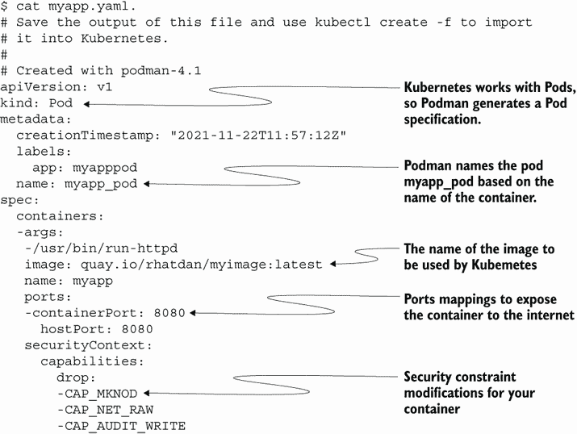
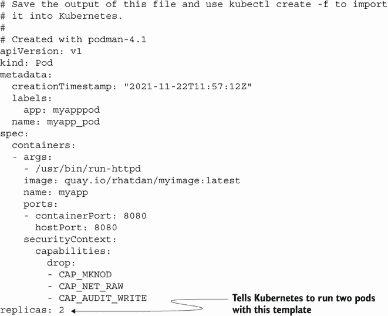
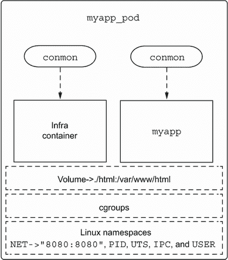

# 8 使用 Kubernetes

本章涵盖

+   从现有的 Podman pods 和容器创建 Kubernetes YAML 文件

+   从 Kubernetes YAML 文件创建 Podman 容器和 pods

+   使用 Kubernetes YAML 文件关闭和删除 pods 和容器

+   在从 Kubernetes YAML 文件启动 pods 和容器之前即时构建容器镜像

+   在 Podman 和 Kubernetes 容器内运行 Podman

一些读者期待在本章中看到如何将 Podman 用作 Kubernetes 的容器引擎，类似于它过去如何使用 Docker。虽然有一些努力将 Podman 用作 Kubernetes 的容器引擎（例如，kind 项目支持这一点），但我通常不推荐您使用 Podman 来实现这一目的。我建议您使用附录 A 中描述的 CRI-O，因为它专门为与 Kubernetes 一起工作而构建，并且与 Podman 共享底层库。现在 Kubernetes 正在劝阻用户使用 Docker 后端，并鼓励他们使用 CRI-O 或 containerd 作为后端。

本章介绍了使用与 Kubernetes 和 Podman 相同的结构化语言，以及如何在 Kubernetes 集群内运行 Podman 容器。您已经学习了如何使用 Podman 从命令行创建作为容器和 pods 的微服务。通常，软件开发人员和打包人员需要将他们的应用程序部署到多台机器上。您可能想将您的 Web 应用程序添加一个数据库后端。如果 Web 应用程序变得流行，您将需要在不同的节点上运行多个实例。将不同的微服务连接在一起并协调所有这些服务不是 Podman 能做到的。这正是 Kubernetes 发挥作用的地方。

在本章中，您将学习如何在 Kubernetes 中运行这些相同的容器和 pods。kubernetes.io 网站表示，“Kubernetes，也称为 K8s，是一个开源系统，用于自动化容器化应用程序的部署、扩展和管理。”我将 Kubernetes 视为在多台机器上同时运行容器的工具——一种协调大量容器化微服务集群的方式。

您可能会遇到的一个问题是，大多数容器开发都是使用 Podman 和 Docker 等工具进行的，这些工具使用相当简单的命令行界面来创建容器和 pods。但 Kubernetes 使用的是以 YAML 文件编写的声明性语言。

我不会在本章深入探讨 Kubernetes 的工作原理，因为已经有许多关于该主题的深入书籍，包括 Marko Lukša 的《Kubernetes in Action》（Manning，2020）和 William Denniss 的《Kubernetes for Developers》（Manning，2020），它们描述了 Kubernetes 的所有功能。但我将描述 Kubernetes 的开发者语言：Kubernetes YAML 文件。

注意：yaml.org 网站首先将 YAML 描述为“YAML Ain’t Markup Language”。它进一步阐述，“YAML 是一种适用于所有编程语言的友好数据序列化语言。”

将命令行选项转换为结构化语言如 YAML 对从单个节点上的容器迁移到大规模运行的容器中的开发者来说是一个障碍。你如何指定卷、要使用的镜像、安全约束、网络端口等等？在第 8.2 节中，你将学习如何使用 Podman 将你本地创建的 pods 和容器转换为 Kubernetes YAML 文件。

在使用 Kubernetes YAML 文件编写和部署你的应用程序后，用户可能会发现你的应用程序在 Kubernetes 中运行时存在问题。在规模上测试应用程序可能很困难，而且你通常只想在本地系统上运行应用程序，而不需要设置和配置 Kubernetes 集群。在第 8.3 节中，你将了解 `podman` `play` `kube`。这个 Podman 命令允许你在没有 Kubernetes 的情况下本地运行 Kubernetes YAML 文件，以便你可以测试和调试问题。

本章的最后一部分将涵盖在容器中运行 Podman，包括在 Kubernetes 集群中运行它。管理员、开发人员和质量工程师需要使用 Podman 在他们的持续集成（CI）系统中测试容器。通常这些 CI 系统建立在 Kubernetes 集群之上。第 8.4 节将教你如何在 Podman 和 Kubernetes 启动的容器中运行 Podman 命令的不同方法。

## 8.1 Kubernetes YAML 文件

Kubernetes YAML 文件是在 Kubernetes 中启动 pods 和容器的对象。在第五章中，你学习了 Podman 使用的配置文件是用 TOML 编写的，它与 YAML 非常相似。这两种配置语言都试图做到人类可读。YAML 依赖于缩进子句，这与你学过的 TOML 语法不同。你可以访问 [yaml.org](http://yaml.org) 网站了解更多关于这种语言的信息。

如果你打算大量使用 Kubernetes YAML 文件，那么拥有一个至少能理解 YAML 的文本编辑器或 IDE，比如 Visual Studio 和 VS Code，会很好；如果它还了解 Kubernetes 语言，那就更好了。Kubernetes YAML 是描述性和强大的。它允许你使用声明性语言来建模你应用程序的期望状态。正如本章引言中所述，编写这些 YAML 文件是开发者在将容器从本地系统迁移到 Kubernetes 时需要克服的障碍。大多数开发者只是在网上搜索现有的 Kubernetes YAML 文件，然后将他们的容器命令、镜像和选项剪切粘贴到 YAML 文件中。虽然这样做可以工作，但它可能导致意想不到的后果——并且通常是多余的工作。

Podman 的产品经理 Scott McCarty 提出了一个想法：“我真正想做的就是帮助用户从 Podman 过渡到使用 Kubernetes 管理他们的容器。”这促使 Podman 开发者创建了一个新的 Podman 命令：`podman` `generate` `kube`。

## 8.2 使用 Podman 生成 Kubernetes YAML 文件

假设你想要在 Kubernetes 中运行之前章节中生成的容器。你需要编写 Kubernetes YAML 文件来实现这一点。你应该从哪里开始？

在本章中，你将学习一个新命令：`podman` `generate` `kube`。这个 Podman 命令捕获本地 pod 和容器的描述，然后将它们转换为 Kubernetes YAML 格式。这有助于你过渡到更复杂的编排环境，如 Kubernetes。生成的 Kubernetes YAML 文件可以由 Kubernetes 命令使用，以将你的 pod 和容器部署到 Kubernetes 集群中。

你可以使用你在前几章中学到的相同的 Podman `run`、`create`和`stop`命令，在命令行上重新创建容器或 pod。使用以下命令重新创建你一直在使用的容器。

首先，使用`podman` `rm`删除容器（如果存在）。你将引入一个新的标志`--ignore`，它告诉`podman` `rm`命令在容器不存在时不报告错误。然后，从命令行重新创建容器：

```
$ podman rm -f --ignore myapp
$ podman create -p 8080:8080 --name myapp quay.io/rhatdan/myimage
9305822e6089ca28a1fdbb005c12f57f4a26be273fe5d49a1908eadbcfdcb7d4
```

现在，使用命令`podman` `generate` `kube` `myapp`生成 Kubernetes YAML 文件。Podman 检查其数据库中现有的容器或 pod，以获取在 Kubernetes 中运行容器所需的所有字段，并将它们填充到 Kubernetes YAML 文件中：

```
$ podman generate kube myapp > myapp.yaml
```

图 8.1 显示了`podman` `generate` `kube`命令的结果。



图 8.1 展示了从`myapp`容器生成的`myapp.yaml`文件

检查 YAML 文件的各个部分。理解 Kubernetes 与 pod 协同工作，尽管你创建了一个容器，`podman` `generate` `kube`，它创建了一个 pod 规范。Podman 根据原始容器的名称命名 pod 为`myapp-pod`，容器为`myapp`：

```
metadata:
  creationTimestamp: "2021-11-22T11:57:12Z"
  labels:
    app: myapppod
  name: myapp-pod
spec:
  containers:
  - args:
    - /usr/bin/run-httpd
    image: quay.io/rhatdan/myimage:latest
    name: myapp
```

注意，在容器部分，记录了镜像名称`quay.io/rhatdan/myimage: latest`，这告诉 Kubernetes 从哪里下载容器的镜像。它还告诉 Kubernetes 在容器内启动应用程序的命令参数，即`/usr/bin/run-httpd`：

```
spec:  
  containers:
  - args:
    - /usr/bin/run-httpd
    image: quay.io/rhatdan/myimage:latest
```

在相同的容器部分，你可以看到 Podman 端口被记录，`-p` `8080: 8080` `spec`：

```
  containers:
  - args:
    - /usr/bin/run-httpd
    image: quay.io/rhatdan/myimage:latest
    name: myapp
    ports:
    - containerPort: 8080
    hostPort: 8080
```

最后，在容器部分的末尾，你可以看到`securityContext`，它记录了 Podman 默认丢弃三个额外的 Linux 功能：`CAP_MKNOD`、`CAP_NET_RAW`和`CAP_AUDIT_WRITE`：

```
    securityContext:
    capabilities:
    drop:
    - CAP_MKNOD
    - CAP_NET_RAW
    - CAP_AUDIT_WRITE
```

大多数容器在没有这些 Linux 功能的情况下运行良好，但 OCI 规范默认启用这三个功能。这告诉 Kubernetes，这个 pod 可以在没有这些功能的情况下更安全地运行，并且 Kubernetes 将丢弃它们。你可以通过运行命令`man` `capabilities`来了解更多关于 Linux 功能的信息。

到目前为止，你可以在任何 Kubernetes 集群中运行这个 Kubernetes YAML 文件，通常运行以下命令：

```
kubectl create -f myapp.yml
```

通常，你需要在 YAML 文件中添加复杂性和编排，并利用 Kubernetes 的高级功能。例如，生成的 Kubernetes YAML 文件只会生成你应用程序的单个实例。如果你想在不同节点上运行你应用程序的多个版本，你可以在 YAML 文件中添加`replicas`选项，如图 8.2 所示。



图 8.2 修改后的 Kubernetes YAML 文件，准备运行两个副本

`replicas`标志告诉 Kubernetes，myapp.yaml 文件希望始终在两个不同的节点上运行两个`myapp` Pod。副本和其他高级 Kubernetes 功能超出了 Podman 的范围。`podman` `play` `kube`命令忽略这些字段。

一些显著的`podman` `generate` `kube`选项包括以下内容：

+   `-f,` `--filename`—这会将输出写入指定的路径。

+   `-s,` `--service`—这会为 Kubernetes 服务对象生成 YAML。

现在你已经生成了一个 Kubernetes YAML 文件，能够反转这个过程会很好。如果你有一个 Kubernetes YAML 文件，你可能希望生成 Podman 的 Pod 和容器。

## 8.3 从 Kubernetes YAML 生成 Podman 的 Pod 和容器

假设你得到了一个 Kubernetes YAML 文件并想在本地上运行它进行检查。你可以设置一个本地的 Kubernetes 集群，但如果你能直接在本地上运行 Pod 会更好。Podman 提供了一个执行此操作的命令。`podman` `play` `kube`命令根据结构化的 Kubernetes YAML 文件创建 Pod、容器和卷。创建的 Pod 和容器会自动启动。为了测试这一点，你可以简单地删除你创建的容器，然后使用以下命令运行生成的 myapp.yaml 文件：

```
$ podman rm -f --ignore myapp
$ podman play kube myapp.yaml
Pod:
b70aedd8105a6915428928a2b33fd7ecede632298088ea25d9db74ba9b16201e
Container:
a4d78fdfa5d8f751aafb06f3782e36a3aaf5b3804ca57694385de2ea1e400fe6
```

Kubernetes 只运行带有容器的 Pod；它不会单独运行容器。当`podman` `play` `kube`命令读取 YAML 文件时，它会启动 Pod 以及容器。注意图 8.3 中`play`命令创建了一个包含你的容器以及基础设施容器的 Pod。



图 8.3 `myapp-pod`与`myapp`容器和基础设施容器一起运行

`podman` `generate` `kube`命令根据 myapp.yaml 文件中的名称创建名为`myapp-pod`的 Pod。容器的名称通过将 Pod 的名称附加到容器名称来生成：`myapp-pod-myapp`。如果 YAML 文件定义了额外的容器，它们需要以类似的方式进行标记：

```
$ cat myapp.yaml
...
  name: myapp-pod
spec:
  containers:
  - args:
 name: myapp
```

你可以使用`podman` `pod` `ps`命令显示系统上运行的 Pod。添加`--ctr-names`选项也可以列出 Pod 内运行的容器：

```
$ podman pod ps --ctr-names
POD ID       NAME      STATUS  CREATED   INFRA ID     NAMES
b70aedd8105a myapp-pod Running 1 day ago b7a276c62c1d 
➥ myapp-pod-myapp ,b70aedd8105a-infra
```

现在检查使用`podman` `ps`命令运行的两个容器，使用以下命令：

```
$ podman ps
CONTAINER ID  IMAGE                         COMMAND             CREATED   
➥ STATUS          PORTS                 NAMES
b7a276c62c1d  k8s.gcr.io/pause:3.5                                
➥ 3 minutes ago  Up 3 minutes ago  0.0.0.0:8080->8080/tcp  b70aedd8105a-infra
a4d78fdfa5d8  quay.io/rhatdan/myimage:latest  /usr/bin/run-http...  
➥ 3 minutes ago  Up 3 minutes ago  0.0.0.0:8080->8080/tcp myapp-pod-myapp
```

使用`podman` `pod` `stop`命令关闭 Pod 和容器：

```
$ podman pod stop myapp-pod
b70aedd8105a6915428928a2b33fd7ecede632298088ea25d9db74ba9b16201e
```

`podman` `play` `kube` 可以执行更复杂的 YAML 文件，包括定义了多个 pod、卷和容器的文件。在之前的简单示例中，你可以使用 `podman` `pod` `stop` 命令来关闭 pod，但当 `podman` `play` `kube` 生成多个唯一的 pod 时，关闭它们会变得稍微复杂一些。

### 8.3.1 基于 Kubernetes YAML 文件关闭 pod 和容器

虽然你可以停止 `podman` `play` `kube` 启动的每个 pod，但有时你不仅想要停止 pod 和容器，实际上还想从系统中删除它们。`podman` `play` `kube` `--down` 命令销毁 `play` `kube` 上一次运行创建的 pod。pod 被停止然后删除。任何创建的卷都保持完整。关闭之前示例中创建的 myapp.yaml pod：

```
$ podman play kube myapp.yaml --down
Pods stopped:
B70aedd8105a6915428928a2b33fd7ecede632298088ea25d9db74ba9b16201e
Pods removed:
b70aedd8105a6915428928a2b33fd7ecede632298088ea25d9db74ba9b16201e
```

注意 Podman 不仅停止了 pod，还将其删除了。你可以使用 `podman` `pod` `ps` 命令来验证 pod 是否已消失：

```
$ podman pod ps
POD ID     NAME       STATUS     CREATED    INFRA ID    # OF CONTAINERS
```

这让你回到了可以再次运行 `podman` `play` `kube` 的状态，它将创建新的 pod 和容器：

```
$ podman play kube myapp.yaml
Pod:
302b1d2c0048a49ea32c2e6ffa0e0549af199ab2bc32de285eef5da628efe28c
Container:
b9f080dc6e13b4a4c37fa66a9b727dbeb2af30f0c3824044aba8a46eebfe15c5
```

这模仿了 Kubernetes 运行 pod 和容器时发生的情况。Kubernetes 总是创建新的 pod 和容器，并在完成时将其销毁。从 YAML 文件生成所有 pod 和容器，然后使用 `--down` 标志将其删除的功能类似于 `docker-compose` 的工作流程。Podman 的一个重大优势是使用与在具有 Kubernetes 的多节点编排环境中运行 pod 和容器相同的 YAML 文件。`docker-compose` 另一个具有的功能是能够构建 YAML 文件中定义的镜像，Podman 开发者也将其添加到了 `podman` `play` `kube`。

### 8.3.2 使用 Podman 和 Kubernetes YAML 文件构建镜像

使用 `podman` `play` `kube` 作为 `docker-compose` 替代品的用户请求 Podman 添加一个构建镜像的功能，而不是总是从容器仓库中拉取它们。虽然 Kubernetes 不支持这样的功能，但 Podman 开发者决定向 `podman` `play` `kube` 添加 `--build` 标志。因为 `podman` `build` 可以处理 Containerfile 或 Dockerfile，增强 `podman` `play` `kube` 是简单的。

想法是通过一个按需生成的容器镜像来创建容器化应用程序。正常的 Kubernetes 工作流程要求开发者使用 `podman` `build` 构建镜像，并使用 `podman` `push` 将其推送到容器仓库，正如你在第二章中学到的。然后你可以使用 `podman` `play` `kube` 从仓库检索镜像。`podman` `play` `kube` `--build` 选项允许它内部执行 `podman` `build` 并按需生成镜像，而不是强迫你使用容器仓库。

注意：`--build` 选项在远程 Podman 客户端中不可用，因此你无法在 Mac 或 Windows 上使用它。

在这个示例中，你将重新创建 6.1.3 节中使用的 Containerfile：

```
$ cat > ./Containerfile << _EOF
FROM ubi8-init
RUN dnf -y install httpd; dnf -y clean all
RUN systemctl enable httpd.service
_EOF
```

回想一下，这个 Containerfile 构建了一个以 systemd 作为 init 系统运行的容器镜像，HTTPD 服务在端口 `80` 上运行并监听。首先，删除所有 pod 和容器：

```
$ podman pod rm --all --force
$ podman rm --all --force
```

现在重新构建 `my-systemd` 镜像：

```
$ podman build -t mysystemd.
STEP 1/3: FROM ubi8-init
STEP 2/3: RUN dnf -y install httpd; dnf -y clean all
Updating Subscription Management repositories.
Unable to read consumer identity
...
Successfully tagged localhost/mysystemd:latest
bb1634ce1457f2eb70f84af33599d211eae64cb5f951e40e91481b6e58b747bf
```

现在重新创建一个包含 ./html 目录的容器镜像（使用第 3.1 节的代码示例）：

```
$ podman create --rm -p 8080:80 --name myapp -v ./:/var/www/
➥ html:Z mysystemd
fec6de5716ac246613723a4cc26407005e0bc315affdc62b56883bd94acd795e
```

现在生成 Kubernetes YAML 文件，使用 `podman` `generate` `kube`:

```
$ podman generate kube myapp > myapp2.yaml
```

注意这次 Podman 生成了包含 `html` 卷部分的 YAML 文件：

```
$ cat myapp2.yaml
...
spec:
  containers:
  - image: localhost/mysystemd:latest
    ...
    volumeMounts:
    - mountPath: /var/www/html
    name: home-dwalsh-podman-html-host-0
  volumes:
  - hostPath:
    path: /home/dwalsh/podman/html
    type: Directory
    name: home-dwalsh-podman-html-host-0
```

使用 `podman` `pod` `rm` `--all` `--force` 命令删除所有 pod，以回到一个干净的环境。使用 `podman` `rm` 和 `podman` `rmi` 命令删除所有容器和镜像，以便您可以从头开始：

```
$ podman pod rm --all --force
$ podman rm --all --force
fec6de5716ac246613723a4cc26407005e0bc315affdc62b56883bd94acd795e
$ podman rmi mysystemd
Untagged: localhost/mysystemd:latest
Deleted: bb1634ce1457f2eb70f84af33599d211eae64cb5f951e40e91481b6e58b747bf
Deleted: 70e0c1a7580089420267b5928210ad59fdd555603e647b462159ea94f97946f9
```

`podman` `play` `kube` `--build` 命令需要存在与镜像名称匹配的子目录，以便构建镜像。Podman 检查 Kubernetes YAML 文件中的所有镜像，然后寻找匹配的子目录。每个目录都被视为上下文目录，应包含一个 Containerfile 或 Dockerfile。然后 Podman 在每个子目录上执行 `podman` `build`。由于 YAML 文件需要 mysystemd 镜像，您需要创建一个 mysystemd 目录并将 Containerfile 放入该目录：

```
$ mkdir mysystemd
$ mv Containerfile mysystemd/
```

您现在可以运行 `podman` `play` `kube` `--build`，它将重新构建容器镜像并启动您的应用程序的 Pod 和容器：

```
$ podman play kube myapp2.yaml --build
STEP 1/3: FROM ubi8-init
STEP 2/3: RUN dnf -y install httpd; dnf -y clean all
Updating Subscription Management repositories.
...
--> 305bb9b8da1
Successfully tagged localhost/mysystemd:latest
305bb9b8da12db682b0eae93ad492e632d2ba43e03f6a6b68467d7429a8a2664
a container exists with the same name ("myapp") as the pod in your YAML file;
➥ changing podname to myapp-pod
Pod:
30739dd554acfeab66a9767301127bab0fe994461686f45a3a89b137c3954840
Container:
ce633ac4e7a1e4d08e0428a8401fcfc4ac75fbcca4be07bc167add6093a44afa
```

Podman 基于 mysystemd/Containerfile 重建了 mysystemd 镜像，然后为您的应用程序生成了 `myapp-pod` pod 和 `myapp` 容器，甚至没有接触到容器注册库。

您可以将此 YAML 文件和 mysystemd 目录与其他用户共享，他们可以使用 Podman 构建和启动您的应用程序。不过，如果您想在 Kubernetes 内部启动它，您需要将构建的镜像推送到容器注册库，然后编辑 YAML 文件以指向注册库中的镜像。现在您已经了解了 Podman 与 Kubernetes 的集成，我想探讨最后一个想法：在 Podman 和 Kubernetes 容器内运行 Podman。

## 8.4 在容器内运行 Podman

在容器内或 Kubernetes 集群内运行 Podman 是一个常见问题。用户希望在 CI/CD 系统中使用容器测试容器镜像和工具。通常，他们想使用 `podman` `build` 构建容器镜像。有时，他们只想测试比他们发行版中发布的 Podman 更新版本的 Podman。

Podman 的一大挑战是它可以以多种不同的方式配置，以至于用户在容器内运行 Podman 时寻找最佳实践。正因为如此，我以及我的几位同事决定创建一个容器镜像，quay.io/podman`/`stable，这使得在容器内运行 Podman 更加容易。如您所知，Podman 可以以两种不同的模式运行：有根模式和 无根模式。默认情况下，Podman 容器在其用户命名空间内以容器根用户启动。为了帮助您理解在容器内运行 Podman，您将首先尝试在 Podman 内运行 Podman。表 8.1 描述了您可以在容器内运行容器的方式以及允许内部 Podman 执行容器的所需能力。

表 8.1 在容器内运行 Podman 的要求

| 主机模式 | 容器模式 | 能力 | 说明 |
| --- | --- | --- | --- |
| 有根模式 | 有根模式 | `CAP_SYS_ADMIN` | 具有对主机用户命名空间的完全访问权限 |
| 有根模式 | 无根模式 | `CAP_SETUIDCAP_SETGID` | 在容器内部基于 /etc/subuid 和 /etc/subgid 运行在单独的用户命名空间中 |
| 无根模式 | 有根模式 | 命名空间 `CAP_SYS_ADMIN` | 具有对用户用户命名空间的完全访问权限 |
| 无根模式 | 无根模式 | 命名空间 `CAP_SETUID`, `CAP_SETGID` | 在容器内部基于 /etc/subuid 和 /etc/subgid 运行在单独的用户命名空间中。用户命名空间必须是您运行 Podman 命令的用户命名空间的子集。 |

### 8.4.1 在 Podman 容器内运行 Podman

在第一个示例中，您将在无根容器内运行有根 Podman。您需要使用 `--privileged` 命令，因为为了成功运行，Podman 需要能够挂载文件系统。当 Podman 以 root 用户运行时，挂载需要 `CAP_SYS_ADMIN` 能力，这由 `--privileged` 选项提供。通过执行以下命令来尝试：

```
$ podman run --privileged quay.io/podman/stable podman version
Trying to pull quay.io/podman/stable:latest...
Getting image source signatures
Copying blob b1f89b7294d7 done 
...
Version:    4.1.0
API Version:     4.1.0
Go Version:      go1.18.2
Built:      Mon May 30 12:03:28 2022
OS/Arch:    linux/amd64
```

quay.io/podman/stable 镜像还配置为在 Podman 容器内运行无根 Podman。您可以通过添加 `--user podman` 选项以 Podman 用户身份运行来激活此行为。在此模式下，容器内的 Podman 需要 `CAP_SETUID` 和 `CAP_SETGID` 来设置用户命名空间。幸运的是，Podman 默认将此访问权限提供给容器：

```
$ podman run --user podman quay.io/podman/stable podman version
```

如果您真的想锁定容器，您可以使用 `--cap-drop=all` `--cap-add CAP_SETUID,CAP_SETGID` 选项来丢弃除 `CAP_SETUID` 和 `CAP_SETGID` 之外的所有能力：

```
$ podman run --cap-drop=all --cap-add CAP_SETUID,CAP_SETGID 
➥ --user podman quay.io/podman/stable podman version
Version:    4.1.0
API Version:     4.1.0
Go Version:      go1.18.2
Built:      Mon May 30 12:03:28 2022
OS/Arch:    linux/amd64
```

这些示例展示了如何在 Podman 容器内运行 Podman，同样也可以用 Docker 在容器内运行 Podman 来轻松实现。

注意，Docker 在运行时使用 seccomp 过滤器，该过滤器阻止了 unshare 和 mount 系统调用。您需要要么在 Docker 中禁用 seccomp 过滤器——

```
docker run –security-opt seccomp=unconfined ...
```

—或者运行带有 Podman 的 seccomp 过滤器的 Docker：

```
docker run –security-opt seccomp=/usr/share/containers/seccomp.json ... .
```

在本节中，您学习了 Podman 与 Kubernetes 的集成。在下一节中，您将学习如何配置 Podman 以在 Kubernetes pod 或容器中运行。

### 8.4.2 在 Kubernetes 容器中运行 Podman

CI/CD 系统的一个常见用例是使用 Podman 在 Kubernetes 中运行容器。正如你所学的，在容器中运行 Podman 需要 `CAP_SYS_ADMIN` 权限用于 rootful 容器，或者 `CAP_SETUID` 和 `CAP_SETGID` 以 rootless 模式运行。理解 Podman 容器几乎总是需要多个 UID 来运行，尤其是在运行 `podman build` 时。许多 Kubernetes 用户在尝试在锁定环境中的 Kubernetes 容器中运行 Podman，只有一个 UID 且没有 Linux 权限时遇到了 Podman 问题。这些容器是 OpenShift 的默认设置，以及许多基于云的 Kubernetes 环境的默认设置。在没有某些 Linux 权限和访问多个 UID 的情况下，在环境中运行容器引擎如 Podman 是不可能的。

使用 quay.io/podman/stable 镜像在 `privileged` Kubernetes 容器中运行 rootful Podman 的等效版本可以通过以下 Kubernetes YAML 文件启动：

```
apiVersion: v1
kind: Pod
metadata:
 name: podman-priv
spec:
 containers:
   - name: priv
     image: quay.io/podman/stable
     args:
       - podman
       - version
     securityContext:
       privileged: true
```

类似地，你可以通过以下 YAML 文件在 Kubernetes 容器中启动无根 Podman。请注意，你指定 `runAsUser`: `1000` 作为 UID，而不是 `podman` 用户。Kubernetes 不支持在容器内将用户名转换为 UIDs：

```
apiVersion: v1
kind: Pod
metadata:
  name: podman-rootless
spec:
  containers:
  - name: rootless
    image: quay.io/podman/stable
    args:
      - podman 
      - version
    securityContext:
      capabilities:
        add:
          - "SETUID"
          - "SETGID"
      runAsUser: 1000
```

注意：请参阅以下由我和我的同事 Urvashi Mohnani 撰写的文章，这些文章提供了更多关于在容器中运行 Podman 的示例：

+   “如何在容器中使用 Podman” ([`mng.bz/vXDM`](http://mng.bz/vXDM))

+   “如何在 Kubernetes 中使用 Podman” ([`mng.bz/49EV`](http://mng.bz/49EV))

如你所见，只要理解 Podman 的要求，在 Kubernetes 中运行 Podman 容器相当容易。Kubernetes 社区正在进行工作，利用用户命名空间，使在 Kubernetes 容器中运行 Podman 容器变得更加容易，并使它们更加安全。

## 摘要

+   `podman generate kube` 命令可以轻松地将本地运行的 pod 和容器移动到适合在 Kubernetes 集群中运行的 Kubernetes YAML 文件。

+   这些 YAML 文件也可以通过 `podman play kube` 命令生成本地 pod 和容器。

+   `--down` 选项允许 `podman play kube` 命令关闭由之前的 `podman play kube` 命令启动的所有 pod 和容器。

+   `--build` 选项允许 `podman play kube` 命令根据 Containerfile/Dockerfile 生成 Kubernetes YAML 文件中定义的容器镜像，从而消除了将镜像推送到容器注册库的需要。

+   `podman play kube` 是 `docker-compose` 的合适替代品，因为它与 Kubernetes 使用相同的 YAML 格式。

+   只要理解在锁定环境中运行 Podman 的要求，在 Podman 和 Kubernetes 容器中运行 Podman 是可能的。
