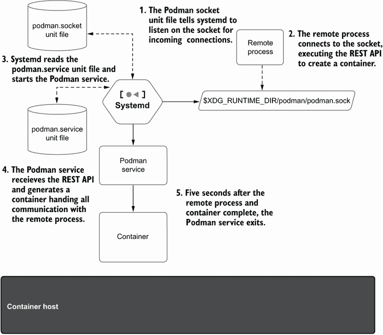
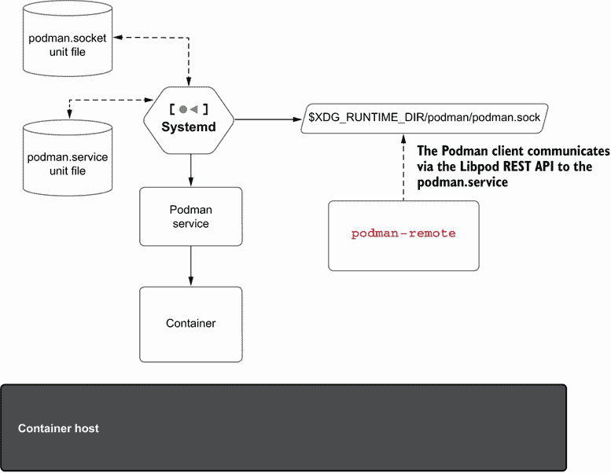
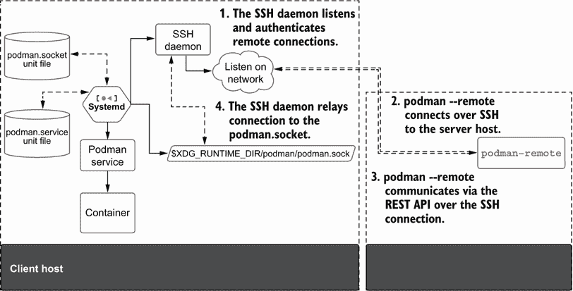

# 9 Podman 作为服务

本章涵盖

+   以服务形式运行 Podman

+   Podman 服务支持两个 REST API

+   用于管理 Podman 容器的 Python 库 podman-py 和 docker-py

+   支持 `docker-compose`

+   使用 Podman 服务进行远程命令行通信

+   管理与远程 Podman 实例的 SSH 通信

在前面的章节中，你学习了 Podman 命令行。问题是有时你想要从远程系统与容器一起工作。同样，你可能想用脚本语言编写代码来与容器交互。Docker 作为客户端-服务器应用程序编写，支持流行的远程 API，这导致了用 Python 和 JavaScript 编写的库的创建，用于访问守护进程。Docker-py 是一个流行的 Python 库，用于与 Docker 守护进程交互。

已经构建了许多 CI/CD、GUI 和远程管理系统来管理 Docker 容器。像 Visual Studio 这样的代码编辑器甚至有内置的插件，可以直接与 Docker API 通信。像 `docker-compose` 这样的高级工具导致了一种新的编程语言的出现，该语言通过与 Docker 守护进程交互来在主机上编排多个容器。

Podman 提供类似的功能，可以作为服务运行。Podman 支持以无根模式以及有根模式运行 Podman 服务。在本章中，你将了解服务以及如何与之交互。你将编写一个简单的 Python 程序，使用 docker-py 和较新的 podman-py 库与 Podman 服务进行交互。你将学习如何设置基于 Docker 的远程工具，包括 `docker-compose`，以实际使用 Podman 服务，即使没有可用的 Docker 守护进程。

注意 Podman 服务仅在 Linux 上受支持。因为 Podman 服务启动 Linux 容器，所以它只能在 Linux 机器上运行。Podman 的 Windows 和 Mac 版本通过 REST API 与 Podman 服务通信以启动容器。有关 Podman 在 Mac 上的更多信息，请参阅附录 E，有关 Windows 的更多信息，请参阅附录 F。

Podman 命令有一个 `--remote` 选项，允许你与 Podman 服务交互，无论是在本地机器上还是在远程机器上。你将学习如何设置 Podman 连接，以便轻松且安全地与远程服务交互。但首先你需要知道如何启用 Podman 服务。

## 9.1 Podman 服务的介绍

Podman 项目支持 REST（或 RESTful）API。`podman` `system` `service` 命令创建一个监听服务，用于响应 Podman 的 API 调用。该服务可以在有根模式或无根模式下运行。此命令提供了一个可选参数，用于指定 Podman 服务将监听的 URI。例如，unix:///tmp/podman.sock URI 告诉 Podman 在 /tmp/podman.sock UNIX 域套接字上监听。tcp:localhost:10000 URI 套接字告诉 Podman 在 TCP 套接字、端口 `10000` 上监听。默认情况下，Podman 在 /run 目录下的 UNIX 域套接字上监听（表 9.1）。

注意：如果您不熟悉 REST API 或一般远程 API，我建议您阅读 Red Hat 的“什么是 REST API？”：[`www.redhat.com/en/topics/api/what-is-a-rest-api`](https://www.redhat.com/en/topics/api/what-is-a-rest-api)。

在这种情况下，Podman 作为服务运行与像 Docker 那样拥有集中式守护进程的方式在多个方面不同。最大的区别是 Podman 命令可以在没有服务的情况下运行，并与由服务创建的容器和镜像交互。其他容器工具可以在不通过服务的情况下与存储和容器交互。当没有连接到服务时，服务也会退出。您甚至可以在同一数据存储上同时运行多个服务（尽管我不推荐这样做）。Docker 守护进程强制所有与容器和镜像的交互都通过守护进程进行。表 9.1 显示了 Podman 服务监听传入连接的默认位置。

表 9.1 podman.socket 的默认位置

| 模式 | 默认位置 |
| --- | --- |
| 有根 | unix:///run/podman/podman.sock |
| 无根 | unix://$XDG_RUNTIME_DIR/podman/podman.sock（例如 unix:///run/user/1000/podman/podman.sock） |

尽管 Podman 服务也可以设置为在 TCP 套接字上运行，但我警告您要非常小心，因为服务中没有任何授权或额外的安全措施来防止黑客获取访问权限。服务依赖于 SSH 服务来获取对 Podman 服务的远程访问，并且这种方法是推荐的。

Podman 服务被设计为按需服务，在最后一个连接后退出，5 秒后结束。这个时间限制避免了即使服务未被使用，长时间运行的守护进程也会占用系统资源。虽然 Podman 服务可以为每个连接启动一个单独的进程，但这可能会成为瓶颈。通过运行以下命令来尝试一下；5 秒后，您将看到命令退出。如果您与服务有活跃的连接，它将继续运行：

```
$ podman system service
```

您可以使用 `--time` 选项指定退出超时时间（以秒为单位）。指定 `--time` `0` 将导致 `podman` `system` `service` 命令运行，直到您停止它。大多数用户从不直接与 Podman 系统服务交互以激活服务，而是依赖于 systemd 服务来管理它。

### 9.1.1 系统服务

Podman 提供了多个 systemd 单元文件，用于以服务形式运行 Podman。由于 Podman 并未设计为守护进程，并且开发者不希望总是有一个长时间运行的守护进程，他们决定利用 systemd 套接字激活。这允许 Podman 服务作为按需服务启动。图 9.1 展示了 systemd 如何监听 Podman 套接字，并在收到连接时启动 Podman 服务。



图 9.1 在 systemd 下运行的 Podman 服务

Podman 软件包提供了两个 podman.socket 单元文件：一个用于有根 Podman，另一个用于无根 Podman。表 9.2 定义了在有根和无根模式下使用的 systemd 套接字文件的位置。

表 9.2 Podman 套接字单元文件

| 模式 | Systemd 套接字文件 |
| --- | --- |
| 有根 | /usr/lib/systemd/system/podman.socket |
| 无根 | /usr/lib/systemd/user/podman.socket |

这两个套接字激活服务告诉 systemd 监听表 9.1 中列出的默认 UNIX 域套接字。当进程连接到套接字时，systemd 启动匹配的服务，该服务运行 `podman` `system` `service` 命令。然后 systemd 将套接字传递给服务。当 Podman 服务完成 API 请求后，它等待另一个连接。如果 5 秒内没有连接发生，Podman 将退出，释放其使用的资源。如果出现新的连接，systemd 重复此过程并启动 Podman 服务的另一个实例。

在本章的其余部分，你将交互使用 Podman 服务，因此你需要开始运行它。你可以使用 `--user` 选项在你的机器上启用并启动 Podman 套接字，这告诉 systemd 启用用户服务（或无根模式服务）：

```
$ systemctl --user enable podman.socket
Created symlink 
➥ /home/dwalsh/.config/systemd/user/sockets.target.wants/podman.socket → 
➥ /usr/lib/systemd/user/podman.socket. 
$ systemctl --user start podman.socket
```

你可以看到 podman.sock 已在你的 `XDG_RUNTIME_DIR` 中创建：

```
$ ls $XDG_RUNTIME_DIR/podman/podman.sock
/run/user/3267/podman/podman.sock
```

在这一点上，systemd 正在监听套接字，但没有 Podman 进程在运行。当服务接收到数据包时，systemd 启动 Podman 服务进程来处理连接。

要尝试该服务，你可以运行以下 `curl` 命令来探测 Podman 服务的版本：

```
$ curl -s --unix-socket $XDG_RUNTIME_DIR/podman/podman.sock 
➥ http://d/v1.0.0/libpod/version | jq
{
  "Platform": {
  "Name": "linux/amd64/fedora-35"
  },
  "Components": [
  {
    "Name": "Podman Engine",
    "Version": "4.0.0-dev",
    "Details": {
        "APIVersion": "4.0.0-dev",
          "Arch": "amd64",
          "BuildTime": "2022-01-04T13:42:14-05:00",
          "Experimental": "false",
        "GitCommit": "66ffbc845d1f0fd5c29611ac3f09daa24749dc1e-dirty",
        "GoVersion": "go1.16.12",
        "KernelVersion": "5.15.10-200.fc35.x86_64",
        "MinAPIVersion": "3.1.0",
        "Os": "linux"
      }
  },
  {
      "Name": "Conmon",
      "Version": "conmon version 2.0.30, commit: ",
      "Details": {
        "Package": "conmon-2.0.30-2.fc35.x86_64"
      }
  },
  {
      "Name": "OCI Runtime (crun)",
      "Version": "crun version 1.4\ncommit:
3daded072ef008ef0840e8eccb0b52a7efbd165d\nspec: 1.0.0\n+SYSTEMD 
➥ +SELINUX +APPARMOR +CAP +SECCOMP +EBPF +CRIU +YAJL",
      "Details": {
        "Package": "crun-1.4-1.fc35.x86_64"
    }
  }
  ],
  "Version": "4.0.0-dev",
  "ApiVersion": "1.40",
  "MinAPIVersion": "1.24",
  "GitCommit": "66ffbc845d1f0fd5c29611ac3f09daa24749dc1e-dirty",
  "GoVersion": "go1.16.12",
  "Os": "linux",
  "Arch": "amd64",
  "KernelVersion": "5.15.10-200.fc35.x86_64",
  "BuildTime": "2022-01-04T13:42:14-05:00"
}
```

现在你已经运行了服务，是时候调查 API 了。

## 9.2 Podman 支持的 API

Podman 服务在相同的套接字（表 9.1）上提供两个 API。兼容 API 面向 Docker API 的最新发布版本，实现了所有端点，除了 Swarm API。Podman 团队将任何与 Docker API 差异相关的问题视为一个错误。如果 API 对 Docker 守护进程有效，则它必须对 Podman 服务有效。

Podman Libpod API 提供了对 Podman 独特功能的支持，例如 pods。虽然所有项目都支持本机 Libpod API 将是件好事，但过渡需要时间，并且对于基于 Docker API 的较老且不再维护的项目来说可能是不可能的。

我建议所有新的 Podman 用户使用 Libpod API，但如果你正在使用遗留代码或想要开发既可与 Podman 也可与 Docker 一起工作的代码，那么你应该使用兼容 API。表 9.3 列出了 Podman 提供的两个不同的 REST API。

表 9.3 Podman 支持的 API

| 模式 | 描述 | 文档 |
| --- | --- | --- |
| 兼容性 | 提供对 Docker v1.40 API 支持的兼容层 | [`docs.docker.com/engine/api/`](https://docs.docker.com/engine/api/) |
| Libpod | Podman 原生的 Libpod 层 | [`docs.podman.io/en/latest/_static/api.xhtml`](https://docs.podman.io/en/latest/_static/api.xhtml) |

与远程 API 交互的最简单方法是使用 `curl` 命令。检查使用 `curl` 命令和 `jq` 命令可用的图像列表，并注意 URL 中的 `libpod` 字段。此字段告诉 Podman 使用其原生 API。

列表 9.1 将 `curl` 连接到 Podman 套接字时的默认输出

```
$ curl -s --unix-socket $XDG_RUNTIME_DIR/podman/podman.sock 
➥ http://d/v1.0.0/libpod/images/json | jq 
[
  {
  "Id":
"Sha256:2c7e43d880382561ebae3fa06c7a1442d0da2912786d09ea9baaef87f73c29ae",
  "ParentId": "",
  "RepoTags": [
    "quay.io/rhatdan/myimage:latest"    ❶
  ],
...
  }
]
```

❶ 你一直在工作的镜像

你也可以通过消除 `libpod` 字段来运行 Docker API。对于这个命令，你得到相同的输出，因为 API 有相同的输出：

```
$ curl -s --unix-socket $XDG_RUNTIME_DIR/podman/podman.sock 
➥ http://d/v1.0.0/images/json | jq
[
  {
  "Id":
"Sha256:2c7e43d880382561ebae3fa06c7a1442d0da2912786d09ea9baaef87f73c29ae",
  "ParentId": "",
  "RepoTags": [
    "quay.io/rhatdan/myimage:latest"
  ],
...
  }
]
```

一个 API 不同的例子是列出 pods，因为 Docker 不支持 pod 的概念，所以 `compat` API 没有针对它的接口。

首先，通过运行以下命令为测试创建一个 pod：

```
$ podman pod create --name mypod
116291543d5691c597132ec73a428f29f2c1f71a65fdfbaca17eb5440a5d47f6
```

现在，使用 Libpod pods 或 JSON API 来查看与你刚刚创建的 pod 相关的 JSON：

```
$ curl -s --unix-socket $XDG_RUNTIME_DIR/podman/podman.sock 
➥ http://d/v1.0.0/libpod/pods/json | jq
[
  {
    "Cgroup": "user.slice",
    “Containers": [
      {
      "Id": "8eeceeb4fd6aa3897e05b5361b5c27c6e98bc29707484f95994f49437536599e",
      "Names": "4b10a21c5b8c-infra",
      "Status": "running"
      }
    ],
    "Created": "2022-01-05T06:51:52.604528462-05:00",
    "Id": "4b10a21c5b8c2b4f8a598de1eace7b94918d813055891276c2472df856a7fbc1",
    "InfraId": 
➥ "8eeceeb4fd6aa3897e05b5361b5c27c6e98bc29707484f95994f49437536599e",
    "Name": "test_pod",
    "Namespace": "",
    “Networks": [],
    "Status": "Running",
    "Labels": {}
  },
  {
    "Cgroup": "user.slice",
    "Containers": [
      {
      "Id": "7a7405a31917da7bde01a6000809e0ee12f40b69fc76963d87a8ae254b34d8c7",
      "Names": "e10eb9303705-infra",
      "Status": "configured"
      }
    ],
    "Created": "2022-01-05T09:18:01.648324833-05:00",
    "Id": "e10eb930370592834fc168a7460fabe9b3e0e20a54b48a2bf3236cecd75f8138",
    "InfraId": 
➥ "7a7405a31917da7bde01a6000809e0ee12f40b69fc76963d87a8ae254b34d8c7",
    "Name": "mypod",
    "Namespace": "",
    "Networks": [],
    "Status": "Created",
    "Labels": {}
  }
]
```

如果你尝试对 Docker API 端点执行相同的查询，它将因找不到错误而失败。

```
$ curl -s --unix-socket $XDG_RUNTIME_DIR/podman/podman.sock 
➥ http://d/v1.0.0/pods/json
Not Found
```

这是因为 Docker API 和 Docker 本身都不理解 pods。虽然你可以使用 `curl` 等工具直接通过 API 进行大量测试，但使用像 Python 这样的高级语言与 API 交互会更好。

## 9.3 与 Podman 交互的 Python 库

Python 可以说是 Linux 平台上最受欢迎的脚本语言。几乎每个 Linux 系统都默认安装了 Python。就像 API 一样，有两个非常相似的 Python 库可用：与兼容库一起工作的 docker-py 库，以及支持较新 Libpod API 的 podman-py。本节将使用一些 Python 命令，可能需要有限的 Python 知识，但如果你经验有限，也足够你跟随。

### 9.3.1 使用 docker-py 与 Podman API 一起使用

与容器交互最流行的 Python 包是 docker-py ([`github.com/docker/docker-py`](https://github.com/docker/docker-py)). Docker-py 是一个最初用于与 Docker 守护进程通信的 Python 绑定库。它也可以与 Podman 兼容服务通信。Docker-py 库允许你运行与 Podman 命令相同的容器，但你可以在 Python 中完成这项操作。

基于 docker-py 构建了数千个工具和示例，并在生产环境中运行。这些工具已被用于 CI/CD 系统、GUI、管理工具和调试工具。对于这些命令，你可以使用 Podman `compat` API，它与 docker-py 一起工作得很好。

通常，你可以使用 `apt-get` 或 `dnf install` 安装 docker-py。它也通过 PyPI 提供。请咨询您 Linux 平台的安装命令。在基于 RPM 的系统上，该软件包称为 `python-docker`。

在我的基于 Red Hat 的系统上，我使用以下 `dnf` 命令安装它：

```
$ sudo dnf install -y python-docker
```

在 docker-py 安装后，你可以开始使用它来与 Podman 服务交互。想象一下，你想要编写一个 Python 脚本来与 Podman 服务交互，列出当前可用的镜像。注意我必须将 `DockerClient` 的 URL 重置为指向 Podman 套接字。你可能需要修改系统上 podman.sock 的位置：

```
$ cat > images.py << _EOF
import docker
client=docker.DockerClient(base_url='unix:/run/user/1000/podman/podman.sock')
print(client.images.list(all=True))
_EOF
```

运行 images.py 脚本，查看你盒子上安装的镜像：

```
$ python images.py
[<Image: 'quay.io/rhatdan/myimage:latest'>, <Image: 'k8s.gcr.io/pause:3.5'>]
```

在 Python 脚本中完全指定 Podman 套接字的路径是不方便的，但幸运的是，Docker 工具支持一个名为 `DOCKER_HOST` 的特殊环境变量。你可以设置 `DOCKER_HOST` 以指向实现 Docker API 的套接字。

首先，将 `DOCKER_HOST` 环境变量设置为指向 podman.sock：

```
$ export DOCKER_HOST=unix://$XDG_RUNTIME_DIR/podman/podman.sock
```

现在，将脚本更改为使用 `docker.from_env()` 函数：

```
$ cat > images.py << _EOF
import docker
client=docker.from_env()
print(client.images.list(all=True))
_EOF
```

运行新的脚本，你会看到它使用 `DOCKER_HOST` 环境变量来发现 Podman 服务套接字：

```
$ python images.py
[<Image: 'quay.io/rhatdan/myimage:latest'>, <Image: 'k8s.gcr.io/pause:3.5'>]
```

注意：在许多 Linux 发行版中，`podman-docker` 包是本地可用的。当你安装此包时，它会安装一个 Docker 脚本，该脚本将 Docker 命令重定向为运行 Podman 命令。它还将所有 Docker man 页链接到 Podman man 页。最后，它为 rootful 容器在 docker.sock 和 podman.sock 之间设置符号链接，允许 Docker 工具使用 /var/run/podman/podman.sock，无需修改环境变量。

优点在于这个 `DOCKER_HOST` 技巧可以用于大多数多年来编写的 docker-py 脚本，并且你可以轻松地将你的脚本从使用 Docker 守护进程切换到使用 Podman 服务。如果你想使用更高级的 Podman 功能，你需要使用 podman-py 包。

### 9.3.2 使用 podman-py 与 Podman API

Podman-py ([`github.com/containers/podman-py`](https://github.com/containers/podman-py))，像 docker-py 一样，是一个用于与 Podman 服务通信的 Python 绑定库。podman-py 库比 docker-py 库更新，并使用 Libpod API 支持 Podman 的所有高级功能。

Podman Python 库使用 podman.sock 的默认位置并自动连接到它。当以非 root 用户运行时，库连接到位于 /run/user/$UID/podman/podman.sock 的无根套接字。以 root 用户运行 Python 并使用 Podman 库时，会自动连接到 /run/podman/podman.sock。

与 docker-py 类似，在我的系统上，我可以通过 `python-podman` 包安装 podman-py 库：

```
$ sudo dnf install -y python-podman
Last metadata expiration check: 0:27:40 ago on Sun 19 Jun 2022 02:14:49 PM EDT.
Dependencies resolved.
...
Installed:
  python3-podman-3:4.0.0-1.fc36.noarch
Complete!
```

现在构建一个功能相似的脚本，podman-images.py，使用 podman-py 库。这次你不需要担心 Podman 套接字的位置。podman-py 库连接到默认位置：

```
$ cat > podman-images.py << _EOF
import podman
client=podman.PodmanClient()
print(client.images.list())
_EOF
```

运行脚本，你将看到与 docker-py 示例相同的结果，但这个库使用的是 Libpod API：

```
$ python podman-images.py
[<Image: 'quay.io/rhatdan/myimage:latest'>, <Image: 'k8s.gcr.io/pause:3.5'>]
```

如果你想要展示高级功能，例如 Podman 数据库中所有 pod 的信息，调用 `pod.lists()` 函数，并遍历每个 pod：

```
$ cat >> podman-images.py << _EOF
for i in client.pods.list():
    print(i.attrs)
_EOF
Now the script shows the images as well as information on the pods.
$ python podman-images.py
[<Image: 'quay.io/rhatdan/myimage:latest'>, <Image: 'k8s.gcr.io/pause:3.5'>]
{'Cgroup': 'user.slice', 'Containers': [{'Id': 
➥ 'f8679839c25729eb422d38e505ae3a4b7ffe18942e2f77a997bd388e0f52313e', 
➥ 'Names': '116291543d56-infra', 'Status': 'configured'}], 'Created': 
➥ '2021-12-14T06:44:04.56055485-05:00', 'Id': '116291543d5691c597132ec73a428f29f2c1f71a65fdfbaca17eb5440a5d47f6', 
➥ 'InfraId': 'f8679839c25729eb422d38e505ae3a4b7ffe18942e2f77a997bd388e0f52313e', 
➥ 'Name': 'mypod', 'Namespace': '', 'Networks': None, 'Status': 
➥ 'Created', 'Labels': {}}
```

如你所见，使用 Python 绑定，你可以开始构建一个 Python 版本的 Podman，它可以与远程套接字进行通信。

### 9.3.3 应该使用哪个 Python 库？

podman-py 库的开发者基于 docker-py 库进行设计，以便于开发者过渡。如果你想要构建一个与 Podman 和 Docker 兼容的应用程序，唯一的选择是 docker-py，因为 podman-py 不与 Docker 兼容。如果你想要利用 Podman 的高级功能，你必须使用 podman-py。Podman-py 正在积极开发中，但 docker-py 拥有庞大的安装基础。Podman-py 可以与 rootful 和 rootless Podman 服务无缝工作，而如果你使用 docker-py，你必须设置 `DOCKER_ HOST` 环境变量以指向 podman.socket。表 9.4 比较了 podman-py 和 docker-py 库的功能，以帮助你了解何时使用特定的库。

表 9.4 Podman-py 与 docker-py 对比

| 支持 | Podman-py | Docker-py |
| --- | --- | --- |
| Podman 服务 | ✔ | ✔ |
| Docker 守护进程 | ✘ | ✔ |
| 支持 pods | ✔ | ✘ |
| 高级 Podman 功能 | ✔ | ✘ |

使用低级别的 Python 库 docker-py 和 podman-py 与容器引擎守护进程和服务进行通信，工程师开发了高级工具来编排和管理容器。其中最受欢迎的是 `docker-compose`。

## 9.4 使用 Podman 服务与 docker-compose

在前面的章节中，你已经看到了如何使用 Podman 命令行管理容器，以及如何使用 `podman` `play` `kube` 启动 Kubernetes YAML 来管理多个容器。你已经介绍了使用 Kubernetes 启动容器。在本节中，你将使用另一个编排工具，`docker-compose` ([`docs.docker.com/compose`](https://docs.docker.com/compose))，通常简称为 `compose`。

`compose` 是启动容器中最受欢迎的工具之一。`compose` 工具早于 Kubernetes，专注于在单个节点上编排多个容器，而 Kubernetes 则在多个节点上编排多个容器。`compose`，就像 Kubernetes 一样，使用 YAML 文件来定义其容器。`compose` 被创建的一个原因是因为构建复杂的命令行来运行多个容器可能很复杂。使用结构化语言如 YAML 使得支持在单个节点上运行具有多个容器的复杂应用程序变得更加容易。

`compose` 拥有庞大的用户群，你可能会想在你的基础设施中运行一个 `compose` YAML 文件。如果你不相信这会发生，你可以跳过这一节。

`compose` 工具是用 docker-py 编写的，并通过使用 Docker REST API 启动容器。由于 Podman 现在支持 `compat` REST API，它也支持使用 `docker-compose` 启动 Podman 容器。因为 Podman 既可以以无根模式工作，也可以以有根模式工作，您甚至可以使用 `docker-compose` 启动无根 Podman 容器。

在本节的其余部分，您将创建一个 `compose` YAML 文件，只是为了了解 `compose` 命令如何与 Podman 服务一起工作。您首先需要安装 `docker-compose`。在我的 Fedora 系统上，我可以使用以下命令完成此操作：

```
$ sudo dnf -y install docker-compose
```

通过运行以下命令确保 Podman systemd socket-activated 服务正在运行：

```
$ systemctl –user start podman.socket
```

通过 ping 端点检查系统服务是否正在运行，并查看是否收到响应。在您继续下一步之前，此步骤必须成功。

```
$ curl -H "Content-Type: application/json" --unix-socket 
➥ $XDG_RUNTIME_DIR/podman/podman.sock http://localhost/_ping
OK
```

由于 `docker-compose` 支持使用 `DOCKER_HOST` 环境变量，请确保使用以下命令设置它：

```
$ export DOCKER_HOST=unix://$XDG_RUNTIME_DIR/podman/podman.sock
```

如本节前面所述，`compose` 支持其自己的 YAML 文件，这与第八章中描述的 Kubernetes YAML 不同。

首先，创建一个名为 example 的目录，然后进入它。将您一直在使用的 html 目录移动到 example 目录中：

```
$ mkdir example
$ mv ./html example
$ cd example
```

您需要在您一直在工作的示例目录中创建 docker-compose.yaml 文件。该 YAML 文件将基于 quay.io/rhatdan/myimage:latest 创建一个名为 `myapp` 的容器。设置容器使用来自主机 ./html 目录的卷以及一个内置卷 `myapp_vol`，该卷仅用于示例：

```
cat > docker-compose.yaml << _EOF
version: "3.7"
services:
  myapp:
    image: quay.io/rhatdan/myimage:latest
    volumes:
      - ./html:/var/www/html
      - myapp_vol:/vol
    ports:
      - 8080:80
volumes:
  myapp_vol: {}
_EOF
```

现在，清理您系统上的镜像和容器，以确保您从一个干净的状态开始。运行以下命令来完成此操作：

```
$ podman pod rm --all --force
$ podman rm --all --force
$ podman rmi --all --force
$ podman volume rm --all --force
```

要展示 `compose` 如何与 Podman 服务交互，请使用 `compose` 命令启动容器。注意，`compose` 会告诉 Podman 下载镜像。然后 `compose` 会告诉 Podman 创建一个名为 `example_myapp_1` 的容器，以及一个名为 `example_myapp_vol` 的卷，该卷将与 ./html 目录一起挂载到容器中。

列表 9.2 执行 `docker-compose` 对 Podman 套接字的输出

```
$ docker-compose up
Pulling myapp (quay.io/rhatdan/myimage:latest)...   ❶
59bf1c3509f3: Download complete
c059bfaa849c: Download complete
Creating example_myapp_1 ... done                   ❷
Attaching to example_myapp_1
```

❶ 拉取 myimage 镜像

❷ 创建 example_myapp_1 容器

在不同的终端中运行 `podman ps` 命令：

```
$ podman ps --format "{{.ID}}  {{.Image}}  {{.Ports}}  {{.Names}}"
230fce823ff6  quay.io/rhatdan/myimage:latest  0.0.0.0:8080->80/tcp  
➥ example_myapp_1
```

现在检查 Podman 是否创建了一个卷：

```
$ podman volume ls
DRIVER    VOLUME NAME
local     example_myapp_vol
```

返回到原始窗口，并按 Ctrl-C 停止 `docker-compose`：

```
^CGracefully stopping... (press Ctrl+C again to force)
Stopping example_myapp_1   ... done
```

这将关闭容器：

```
$ podman ps --format "{{.ID}}  {{.Image}}  {{.Ports}}  {{.Names}}"
```

如果您执行 `podman ps -a` 命令，您将看到容器仍然存在，但未运行：

```
$ podman ps -a --format "{{.ID}}  {{.Image}}  {{.Ports}}  {{.Names}}"
230fce823ff6  docker.io/library/alpine:latest  0.0.0.0:8080->80/tcp  
➥ example_myapp_1
```

现在，如果您运行 `docker-compose down`，它将告诉 Podman 从系统中删除容器：

```
$ docker-compose down
Removing example_myapp_1 ... done
Removing network example_default
```

再次使用 `podman ps -a` 命令验证所有容器都已消失：

```
$ podman ps -a --format "{{.ID}}  {{.Image}}  {{.Ports}}  {{.Names}}"
```

如您所见，Podman 与 `docker-compose` 一起很好地工作，以编排容器。

小贴士：虽然 `docker-compose` 与 Podman 服务配合得很好，但我认为如果您正在启动一个全新的项目，最好使用 Kubernetes YAML 和 `podman` `play` `kube`，因为这可以使您更容易地将容器移动到 Kubernetes。

正如您所看到的，Podman 服务对于允许远程进程操作您的 pods 和容器非常有用。甚至 Podman 命令也可以用作客户端并与 Podman 服务进行通信。

## 9.5 podman - -remote

当您扩展应用程序时，您可能希望在多台机器上运行容器化的应用程序。您可以通过 `ssh` 登录到每个盒子并在本地运行 Podman 命令来管理环境，或者您可以编写代码来使用 9.4 节中描述的 Python 库。Podman 开发者还在 Podman 命令中构建了客户端支持。您可以使用 `podman` 命令直接连接到这些远程 Podman 服务并管理远程机器上的容器环境。

Podman 命令有一个特殊选项，`--remote`，允许它与通过套接字激活的 Podman 服务进行通信。它不是作为 Podman 进程的子进程执行命令和容器，而是通过 REST API 与服务进行通信。



图 9.2 `podman` `--remote` 连接到本地 podman.socket

由于 Podman 是运行 Linux 容器的工具，因此 `complete` `podman` 命令只能在 Linux 上运行。Podman 开发者希望支持其他操作系统，至少在客户端模式下。为了在非 Linux 机器上运行 Podman，Podman 可以以两种不同的方式构建。到目前为止，您一直在使用具有 `--remote` 选项的完整 Podman。Podman 可执行文件可以编译成仅支持与 Podman 服务通信的形式。以这种方式构建的 Podman 通常被称为 `podman-remote`。`podman-remote` 命令是某些操作系统（如 Mac 和 Windows，在附录 E 和 F 中有更全面的介绍）中提供的命令。如果您在阅读这本书的同时在 Mac 或 Windows 机器上测试 Podman，那么您已经在使用 `podman-remote`，它透明地与在虚拟机或不同机器上运行的 Podman 服务进行通信。

### 9.5.1 本地连接

如前所述，`podman` `--remote` 命令默认连接到本地的 podman.socket，称为本地连接（图 9.2）。尝试使用在 9.1.1 节中启用的 Podman 系统服务运行 `podman` `--remote`。注意 `podman` `--remote` 版本向您显示了 Podman 客户端和 Podman 服务器的版本；在这种情况下，它们是相同的可执行文件。

列表 9.3 执行 `podman` `--remote` 的版本 API 的输出

```
$ podman --remote version
Client:
Version:      4.1.0        ❶
API Version:  4.1.0
Go Version:   go1.18.2
Built:        Sun Jun 19 07:35:42 2022
OS/Arch:      linux/amd64
Server:
Version:      4.1.0        ❷
API Version:  4.1.0
Go Version:   go1.18.2
Git Commit:   a2b78b627f0a9deef83a5b5e4ecffc9cdb5a72b1-dirty
Built:        Sun Jun 19 07:35:42 2022
OS/Arch:      linux/amd64
```

❶ Podman 的客户端版本

❷ Podman 的服务器版本

您可以使用完全相同的命令来启动容器：

```
$ podman --remote run ubi8 echo hi
Resolved "ubi8" as an alias (/etc/containers/registries.conf.d/
➥ 000-shortnames.conf)
Trying to pull registry.access.redhat.com/ubi8:latest...
..
hi
```

如您所想，在这种模式下并不那么有用，因为您可以在不使用`--remote`选项的情况下运行 Podman，并管理相同的容器环境。本地连接主要用于 API 的测试，尤其是在持续集成（CI）系统中。当您使用`podman` `--remote`与真正远程的机器进行通信时，它变得更有趣。

### 9.5.2 远程连接

`podman` `--remote`命令的主要目的是允许您使用 Podman 服务在另一台机器上操作 pods 和容器。在 Linux 机器或 VM 上安装 Podman，该机器也运行着 SSH 守护进程。在本地操作系统上，当您运行 Podman 命令时，Podman 通过 SSH 连接到服务器。然后，它通过 systemd 套接字激活连接到 Podman 服务，并通过我们的 REST API 进行通信，如图 9.3 所示。



图 9.3 `podman --remote`通过 SSH 连接到服务器机器

带有`--remote`选项的 Podman 命令行界面与常规的 Podman 命令完全相同。当您运行 Podman 命令时，感觉就像您是在本地运行容器；然而，容器进程是在远程机器上运行的。有一些选项在远程模式下不支持，列于表 9.5 中。

表 9.5 `podman --remote`命令不支持选项

| 选项 | 说明 |
| --- | --- |
| `--env-host` | 在两台不同的机器上共享环境几乎没有意义；在某些情况下，这些可能是不同的操作系统，例如 Windows 和 Mac 与 Linux Podman 服务进行通信。 |
| `--group-add=keep-groups` | `--group-add`选项在`--remote`模式下工作，但`keep-groups`特殊标志不行。`keep-groups`标志告诉 Podman 将当前进程可访问的组泄露到容器中。由于这是一个客户端-服务器过程，泄露是不可能的。 |
| `--http-proxy` | `--http-proxy`选项告诉 Podman 使用客户端机器上的 HTTP 代理环境变量，并将它们泄露到服务器。由于代理通常设置在服务器上，因此不允许与`--remote`选项一起使用`--http-proxy`选项。 |
| `--preserve-fds` | `--preserve-fds`选项会将调用进程的文件描述符泄露到容器中；由于这是一个远程连接，没有方法可以泄露文件描述符。 |
| `--volume` | 这是支持的，但源卷将来自远程机器，不一定是从运行`podman`命令的机器（除非它们在同一台机器上）。如果您正在使用 VM，您需要首先将宿主机的目录挂载到 VM 中；然后 VM 内部的 Podman 看到挂载并将其挂载到容器中。 |
| `--latest`, `-l` | 由于可能同时有多个不同的用户在与同一服务器通信，`--latest`的概念太冒险，因此不支持。 |

Podman 命令在服务器上执行。从客户端的角度来看，Podman 好像是在本地运行。现在您需要完成远程服务器上 Podman 服务的配置。

启用 SSHD 连接

为了 Podman 客户端能够与服务器通信，您需要在您的 Linux 机器上启用并启动 SSH 守护进程，如果它尚未启用的话：

```
$ sudo systemctl enable --now -s sshd
```

现在 SSHD 守护进程正在运行，您需要在远程机器上启用 Podman 服务。

在服务器机器上启用 Podman 服务

在执行任何 Podman 客户端命令之前，您必须在 Linux 服务器或虚拟机上启用 podman.sock systemd 服务。在这些示例中，您是以普通、非特权用户身份运行 Podman 的。为了使服务器上的无根 Podman 正确运行，请使用以下命令永久启用此套接字：

```
$ systemctl --user enable --now podman.socket
```

通常，当您从系统中注销时，systemd 会停止系统上的所有进程。您需要告诉 systemd 允许远程用户进程在无根模式下 `linger`：

```
$ sudo loginctl enable-linger $USER
```

这也告诉 systemd 在启动时监听此套接字。一旦在一个系统上运行了该服务，您可以使用 Podman 命令验证套接字是否正在监听：

```
$ podman --remote info
Host:
  arch: amd64
  buildahVersion: 1.16.0-dev
...
```

注意：您可以使用以下命令启用根有 `podman` 服务：

```
$ sudo systemctl enable --now podman.socket
```

之前的 `enable-linger` 命令仅适用于无根模式。现在您已经启用了远程服务并使其与 SSHD 守护进程一起运行，您可以回到客户端机器。

### 9.5.3 在客户端机器上设置 SSH

远程 Podman 使用 SSH 在客户端和服务器之间进行通信，当它们位于不同的机器上时。默认情况下，SSH 会要求您在每次命令中提供用户名和密码，除非您设置了 SSH 密钥。要设置您的 SSH 连接，您需要从您的客户端机器生成一个 SSH 密钥对。如果您已经有了现有的 SSH 密钥，您可以直接使用它们；如果您已经与服务器共享了密钥，那就更好了。在我的 Linux 系统上，我可以用以下类似的命令生成 SSH 密钥：

```
$ ssh-keygen -t ed25519
Generating public/private ed25519 key pair.
Enter file in which to save the key (/home/myuser/.ssh/id_ed25519):
```

生成密钥完成后，您可以使用 `ssh-copy-id` 命令或类似命令在客户端和服务器机器之间设置信任。默认情况下，公钥将位于您的家目录下 $HOME/.ssh/id_ed25519.pub。您需要将 id_ed25519.pub 的内容复制并追加到 Linux 服务器上的 ~/.ssh/authorized_keys。有关配置您的 SSH 环境的更多信息，请参阅 [`red.ht/3HuxPT6`](https://red.ht/3HuxPT6)：

```
$ ssh-copy-id myuser@192.168.122.1
passwd:
```

如果您不想使用 SSH 密钥，每次执行 Podman 命令时都会提示您输入登录密码。现在您已经与服务器共享了 SSH 密钥，下一步是配置 Podman 的连接。

### 9.5.4 配置连接

`podman` `system` `connection` 命令允许您管理用于 `podman` `--remote` 命令的 SSH 连接。您可以使用 `podman` `system` `connection` `add` 命令添加连接，将连接命名为 `server1`。默认将选择身份文件，或者您可以使用 `-–identity` 选项指定要使用的 SSH 密钥。最后，您需要指定 Podman 套接字的完整 SSH URL。这包括用户账户 `myuser`、IP 地址以及用户账户的 Podman 套接字路径：

```
$ podman system connection add server1 --identity ~/.ssh/id_ed25519 
➥ ssh://myuser@192.168.122.1/run/user/1000/podman/podman.sock
```

此 Podman 命令向 Podman 添加远程连接。由于这是第一个添加的连接，Podman 将该连接标记为默认连接。

使用 `podman` `system` `connection` `list` 命令列出可用的连接。注意，连接名称后面的 `*` 表示它是默认连接：

```
$ podman system connection list
Name    Identity          URI
system1*    id_ed25519     
➥ ssh://myuser@192.168.122.1/run/user/1000/podman/podman.sock
```

现在，您可以使用 `podman` `info` 测试连接：

```
$ podman --remote info
host:
  arch: amd64
  buildahVersion: 1.23.1
  cgroupControllers:
...
```

注意：如果您有多个连接并且想为所有可能的选项选择非默认的 `man` `podman-system-connection`，可以使用 `--connection` `(-c)` 选项。

您可以使用 `podman` 选项或 `podman-remote` 客户端来管理在 Linux 服务器或虚拟机上运行的容器。客户端与服务器之间的通信高度依赖于 SSH 连接，并鼓励使用 SSH 密钥。一旦您在远程服务器上安装了 Podman，您需要使用 `podman` `system` `connection` `add` 命令设置连接，然后后续的 Podman 命令可以使用该连接。表 9.6 列出了可用的 Podman 系统命令。

表 9.6 Podman 系统命令

| 命令 | 手册页 | 描述 |
| --- | --- | --- |
| `connection` | `podman-system-connection(1)` | 管理远程 SSH 目标 |
| `df` | `podman-system-df(1)` | 显示 Podman 的磁盘使用情况 |
| `info` | `podman-system-info(1)` | 显示 Podman 系统信息 |
| `migrate` | `podman-system-migrate(1)` | 将容器迁移到新的用户命名空间 |
| `prune` | `podman-system-prune(1)` | 删除未使用的 pod、容器、卷和镜像数据 |
| `renumber` | `podman-system-renumber(1)` | 迁移锁号 |
| `reset` | `podman-system-reset(1)` | 重置 Podman 存储 |
| `service` | `podman-system-service(1)` | 运行 API 服务 |

## 摘要

+   Podman 可以作为 REST API 服务运行。

+   Podman 支持两个 REST API 端点。

+   Podman 套接字支持两个 API。

+   兼容模式或 Docker 模式允许 Docker 客户端工具与 Podman 一起工作。

+   Podman 模式允许远程客户端利用 Podman 的高级功能。

+   Podman-py 是一个用于与 Podman 服务通信的 Python 绑定库。

+   Docker-py 是一个用于与 Podman 兼容服务通信的 Python 绑定库。

+   Podman 支持使用兼容服务运行 `docker-compose`，以在单个节点上编排 `compose` 容器。

+   `podman` `--remote` 命令通过 SSH 与 Podman 服务通信，以管理容器。

+   `podman` `system` `connect` 命令管理对远程 Podman 服务的 SSH 连接，使得管理您环境中的容器更加便捷。
