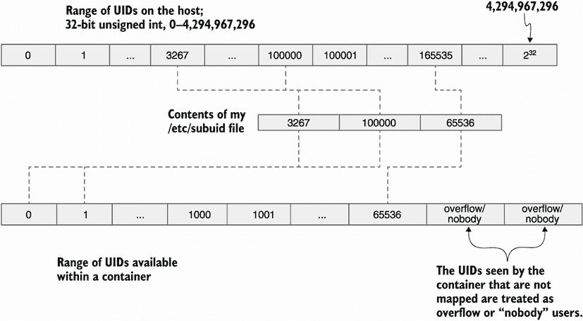
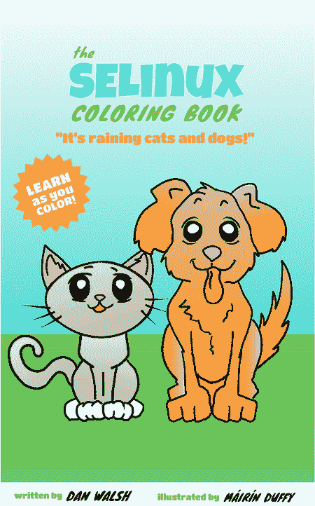

# 10 安全容器隔离

本章涵盖了

+   所有用于保持容器彼此隔离的 Linux 安全功能

+   容器内进程需要的对内核文件系统的只读访问，但必须阻止写入访问

+   隐藏内核文件系统以从宿主系统隐藏信息

+   Linux 能力限制 root 的权力

+   PID、IPC 和网络命名空间，它们隐藏了操作系统的大部分内容，使容器内的进程无法访问。

+   挂载命名空间，它与 SELinux 一起限制容器进程只能访问指定的镜像和卷

+   用户命名空间，它允许您在容器内写入不是 root 的 root 进程

在本章和第十一章中，我回顾并演示了使用 Podman 运行容器时的一些额外的安全考虑。其中一些内容在其他章节中已经介绍过，但我认为从安全角度集中关注这些功能是有用的。

我看到人们在运行容器时最常见的问题之一是，当容器进程被拒绝某些访问时，用户的第一个反应就是以`--privileged`模式运行容器，这会关闭您容器的所有安全隔离。了解如何处理本章中讨论的安全功能可以帮助您避免需要这样做。

当我从安全的角度看待容器时，我检查如何保护宿主内核和文件系统免受容器内进程的侵害。我写了一本彩绘书，《容器彩绘书》([`red.ht/3gfVlHF`](https://red.ht/3gfVlHF))，由 Máirín Duffy (@marin) 插图，描述了基于三只猪的容器安全功能（图 10.1）。


图 10.1 *容器彩绘书* ([`red.ht/3gfVlHF`](https://red.ht/3gfVlHF))

我在书中使用的类比是三只猪是应用程序。然后我讨论了它们的生活方式和与计算机系统相比的住房选择。

单户住宅相当于单个隔离节点上的一个应用程序。住在联排别墅中相当于在单独的虚拟机中运行每个应用程序。住在酒店或公寓楼中类似于容器，您有自己的公寓，但您依赖于前台的安全来控制您生活空间的使用。如果前台被攻破，那么您的公寓也将被攻破。容器在这方面类似，因为它们依赖于内核的安全。如果一个容器可以接管宿主内核，那么它可以接管系统上运行的所有的容器应用程序。此外，如果它们逃逸到底层文件系统，它们可能能够读取和写入系统上所有容器的所有数据。

从这个角度来看，我认为宿主机的首要目标是保护宿主内核和文件系统免受容器进程的侵害。本章的其余部分描述了用于保护宿主内核和文件系统免受容器进程侵害的工具。

保护内核免受潜在敌对容器的侵害是容器安全的首要目标。如果内核存在漏洞，那么整个系统和所有容器都将面临风险。在许多情况下，容器对宿主系统的唯一暴露就是宿主内核本身。

容器内的进程可以通过许多不同的方式与内核进行交互。本节将检查这些通信以及用于保护容器进程的操作系统功能。

Linux 内核提供了允许进程进行通信和配置内核的文件系统。保护这些文件系统免受受限制的容器进程的侵害是您将首先检查的安全功能。

## 10.1 只读 Linux 内核伪文件系统

这些 Linux 内核伪文件系统通常挂载在/proc 和/sys 下。表 10.1 列出了我机器上挂载的一些 Linux 内核伪文件系统。

表 10.1 仅作为只读挂载的文件系统

| 文件系统挂载点 | 伪文件系统描述 |
| --- | --- |
| /sys | sysfs 文件系统允许从`用户空间`查看和操作由内核空间创建和销毁的对象。 |
| /sys/kernel/security | 安全伪文件系统用于读取和配置通用安全模块。一个例子是完整性测量架构（IMA）模型。 |
| /sys/fs/cgroup | cgroup 文件系统用于管理控制组。 |
| /sys/fs/pstore | pstore 文件系统存储对诊断系统崩溃原因有用的非易失性信息。 |
| /sys/fs/bpf | 勃朗克斯包过滤器（BPF）文件系统是一种机制，允许用户程序对 Linux 内核进行仪器化，以揭示内核信息并控制系统上进程的运行方式。 |
| /sys/fs/selinux | SELinux 文件系统用于在内核中配置 SELinux（见第 10.2.7 节）。 |
| /sys/kernel/config | configfs 文件系统用于从`用户空间`创建、管理和销毁内核对象。 |

大多数进程需要读取这些伪内核文件系统的访问权限才能成功，但只有管理员进程需要写入访问权限。通常，内核依赖于根用户与非根用户或拥有`CAP_SYS_ADMIN`能力（见第 10.2.2 节）来修改这些文件系统。

通常容器需要以 root 用户身份运行，需要容器安全使用其他方法来防止 root 进程写入这些内核文件系统。Podman 不挂载大多数这些高级内核伪文件系统。它只以只读方式挂载 /sys, /sys/fs/cgroup, 和 /sys/fs/selinux。当您处于 PID 命名空间中时，/proc 文件系统会发生变化，这意味着容器内的 /proc 不是主机的 /proc。容器内的进程只能影响容器内的其他进程。

/sys 文件系统和命名空间的 /proc 文件系统有时会将主机信息泄露到容器中。因此，Podman 在文件上挂载 /dev/null，并在目录上挂载只读 tmpfs 文件系统，以防止容器访问。Podman 还将某些子目录以只读方式绑定挂载到自身，以防止容器进程写入它们。请参阅表 10.2 以获取 Podman 为安全目的覆盖的文件和目录的完整列表。

表 10.2 Podman 覆盖的文件系统字段

| 隐藏类型 | 路径 |
| --- | --- |
| 只读 tmpfs 挂载覆盖目录 | /proc/acpi, /proc/kcore, /proc/keys, /proc/latency_stats, /proc/timer_list, /proc/timer_stats, /proc/sched_debug, /proc/scsi, /sys/firmware, /sys/fs/selinux, /sys/dev/block |
| 只读绑定挂载覆盖目录 | /proc/asound, /proc/bus, /proc/fs, /proc/irq, /proc/sys, /proc/sysrq-trigger |

我发现几乎所有的容器镜像都运行得很好，并带有这种额外的安全性。有时容器化的应用程序可能需要访问这些被覆盖的目录之一。

### 10.1.1 揭示被隐藏的路径

而不是强制容器以 `--privileged` 模式运行，您可以告诉 Podman 揭示一个目录。在以下示例中，您运行一个容器并看到 /proc/scsi 下没有文件或目录，因为它被 tmpfs 覆盖：

```
$ podman run --rm ubi8 ls /proc/scsi
```

您可以使用 `--security-opt` `unmask=/proc/scsi` 标志来移除挂载点并暴露底层文件和目录：

```
$ podman run --rm --security-opt unmask=/proc/scsi ubi8 ls /proc/scsi
device_info
scsi
sg
```

您甚至可以使用 `*` 来卸载特定路径下的所有目录：

```
$ podman run --rm --security-opt unmask=/proc/* ubi8 ls /proc/scsi
device_info
scsi
sg
```

揭示会使您的容器稍微不太安全，但比完全使用 `--privileged` 并关闭所有安全措施要好得多。在特定情况下，您可能希望通过覆盖伪文件系统的一部分来提高系统的安全性。`podman` 的 `run` 手册页列出了被隐藏的文件系统：

```
$ man podman run
...
   • unmask=ALL or /path/1:/path/2, or shell expanded paths (/proc/*): 
Paths to unmask separated by a colon. If set to ALL, it will unmask all the 
paths that are masked or made read only by default. The default masked
    paths are /proc/acpi, /proc/kcore, /proc/keys, /proc/latency_stats, 
/proc/sched_debug, /proc/scsi, /proc/timer_list, /proc/timer_stats, 
/sys/firmware, and /sys/fs/selinux. 
    The default paths that are read only are /proc/asound, /proc/bus, 
/proc/fs, /proc/irq, /proc/sys, /proc/sysrq-trigger, /sys/fs/cgroup.
```

### 10.1.2 隐藏其他路径

如果您非常注重安全性或有一个您不信任的容器，它提供了某些访问权限给容器，您可以使用 `--security-opt` mask 标志添加额外的隐藏路径。例如，如果您想防止容器进程看到 /proc/sys/dev 中的设备，请运行以下命令：

```
$ podman run --rm ubi8 ls /proc/sys/dev
cdrom
hpet
i915
mac_hid
raid
scsi
tty
```

您可以使用 `--security-opt` `mask=/proc/sys/dev` 标志来覆盖它：

```
$ podman run --rm --security-opt mask=/proc/sys/dev ubi8 ls /proc/sys/dev
```

你看到了 Podman 如何防止 root 进程读取和，更重要的是，写入伪文件系统。容器进程实际上可以通过查看/proc/self/mountinfo 来看到容器内挂载了什么。

列表 10.1 Podman 容器内的挂载表

```
$ podman run –rm ubi8 cat /proc/self/mountinfo
...
1628 1610 0:5 /null /proc/kcore rw,nosuid – 
➥ devtmpfs devtmpfs rw,seclabel,size=4096k,
➥ nr_inodes=1048576,mode=755,inode64                          ❶
...
1620 1595 0:86 / /sys/firmware ro,relatime - tmpfs tmpfs       ❷
rw,context="system_u:object_r:container_file_t:s0:c406,c915",size=0k,uid=32
➥ 67,gid=3267,inode64
...
```

❶ 显示/dev/null 挂载在/proc/kcore 上

❷ 显示 tmpfs 以只读方式挂载在/sys/firmware 上

你可能自己在想，“如果容器知道已经挂载了什么，那么是什么阻止容器内的 root 用户移除挂载或重新挂载文件系统的读写，然后攻击宿主内核？

## 10.2 Linux 能力

大多数 Linux 用户都了解 Linux 有两种类型的用户：root（特权进程）和所有人（非特权进程）。root 拥有全部权力，而 non-root 的权力则受到很大限制，特别是在配置和修改内核时。有时非特权进程需要特权来执行某些命令行`ping`或`sudo`。Linux 支持一种标记这些文件为`setuid`的方式，当非特权进程执行它们时，新进程会获得特权。

在 Linux 中，特权进程和非特权进程之间的二进制差异大约在 2000 年结束。内核工程师将 root 的权力分解为不同的特权能力组。目前，在我的系统中，Linux 内核支持 41 个。你可以使用`capsh`程序查看能力的完整列表。执行`capsh`程序以查看系统上的能力列表。你会看到你的进程的`current`能力集为空。`Bounding`能力集是进程可以通过执行`setuid`程序获得的能力集。

列表 10.2 `capsh` `–print` 显示用户进程可用的能力

```
$ capsh --print
Current: =                                 ❶
Bounding set =                             ❷
cap_chown,cap_dac_override,cap_dac_read_search,cap_fowner,cap_fsetid,cap_kill,
➥ cap_setgid,cap_setuid,cap_setpcap,cap_linux_immutable,cap_net_bind_service,
➥ cap_net_broadcast,cap_net_admin,cap_net_raw,cap_ipc_lock,cap_ipc_owner,
➥ cap_sys_module,cap_sys_rawio,cap_sys_chroot,cap_sys_ptrace,cap_sys_pacct,
➥ cap_sys_admin,cap_sys_boot,cap_sys_nice,cap_sys_resource,cap_sys_time,
➥ cap_sys_tty_config,cap_mknod,cap_lease,cap_audit_write,cap_audit_control,
➥ cap_setfcap,cap_mac_override,cap_mac_admin,cap_syslog,cap_wake_alarm,
➥ cap_block_suspend,cap_audit_read,cap_perfmon,cap_bpf,cap_checkpoint_restore
Ambient set =
...
uid=3267(dwalsh) euid=3267(dwalsh)          ❸
gid=3267(dwalsh)
```

❶ 当前能力集显示没有能力。

❷ 限制能力集显示所有（41）能力。

❸ 因为你是以普通用户身份运行`capsh`命令的，所以你看到你的 UID 和 GID 被列出。

这意味着你的用户进程可以执行`sudo`命令并获得与 root 相同的全部能力。你可以通过执行`man capabilities`来阅读关于每个能力做什么的信息。多年来，社区已经发现几乎所有的容器都不需要完整的能力列表，因为它们很少修改内核。

### 10.2.1 丢弃的 Linux 能力

由于容器限制进程不应该操作操作系统，特别是内核，Podman 可以在其容器中以远少于 root 的能力运行。你可以通过执行相同的`capsh`程序来检查 Podman 容器内可用的默认能力列表。

列表 10.3 Podman 容器内可用的默认能力列表

```
$ podman run --rm ubi8 capsh --print
Current: =                                                             ❶
cap_chown,cap_dac_override,cap_fowner,cap_fsetid,cap_kill,cap_setgid,
➥ cap_setuid,cap_setpcap,cap_net_bind_service,cap_sys_chroot,
➥ cap_setfcap+eip
Bounding set =                                                         ❷
cap_chown,cap_dac_override,cap_fowner,cap_fsetid,cap_kill,cap_setgid,
➥ cap_setuid,cap_setpcap,cap_net_bind_service,cap_sys_chroot,cap_setfcap
...
uid=0(root)                                                            ❸
gid=0(root)
groups=
```

❶ 当前能力集只显示 11 个能力，因为容器进程是以 root 身份运行的。

❷ 能力的边界集显示了相同的能力（11 个）。

❸ 因为容器默认以 root 身份运行，所以你看到 UID 和 GID 都是 root。

如你所见，Podman 默认在运行容器时放弃了 30 个能力——从 41 个减少到 11 个。即使容器具有 root 权限，它也比系统上的 root 权限弱得多。

注意 Docker 也放弃了能力，但留下了 14 个能力。Podman 通过放弃以下附加能力来运行更严格的安全：`CAP_ MKNOD`、`CAP_AUDIT_WRITE`和`CAP_NET_RAW`。

容器内允许的能力列表主要涉及控制多个进程；例如，`CAP_SETUID`和`CAP_SETGID`允许容器内的进程更改到不同的 UID。一个重要的例子是运行你的 Web 应用作为`UID=60`，但当容器进程启动时，它需要短暂地以 root 身份运行，然后将其 UID 更改为`60`。如果 Podman 放弃了`CAP_SETUID`，那么容器内的 root 进程不允许更改到 Web 服务的 UID。

Podman 允许的另一个有趣的能力是`CAP_NET_BIND_SERVICE`，它使进程能够绑定到小于`1024`的网络端口——例如端口`80`。回想第二章，你无法将主机上的端口`80`绑定到容器内的端口`80`。用户进程没有`CAP_NET_BIND_SERVICE`，因此它们无法绑定到端口`80`。表 10.3 列出了 Podman 在容器中允许的默认能力。此列表可以通过在容器表下的`default_capabilities`字段中修改容器.conf 文件来修改。

表 10.3 Podman 在容器中允许 root 进程的默认能力列表

| 选项 | 描述 |
| --- | --- |
| `CAP_CHOWN` | 对文件 UID 和 GID 进行任意更改。 |
| `CAP_DAC_OVERRIDE` | 绕过文件读取、写入和执行权限检查。 |
| `CAP_FOWNER` | 在对文件系统 UID 的操作中绕过权限检查。 |
| `CAP_SETFSID` | 修改文件时不要清除`set-user-ID`和`set-group-ID`模式位。 |
| `CAP_KILL` | 绕过发送信号的权限检查。 |
| `CAP_NET_BIND_SERVICE` | 将套接字绑定到互联网域的特权端口（端口号小于`1024`）。 |
| `CAP_SETFCAP` | 在文件上设置任意能力。 |
| `CAP_SETGID` | 更改进程的组 ID（GID）或附加 GID 列表。 |
| `SET_SETPCAP` | 从调用线程的边界集中添加和删除任何能力。 |
| `CAP_SETUID` | 对进程用户 ID（UID）进行任意操作。 |
| `CAP_SYS_CHROOT` | 允许`chroot`，并更改挂载命名空间。 |

我通过询问什么阻止了 root 进程卸载或重新挂载只读文件系统来引入第 10.2 节。答案是 Podman 放弃了`CAP_ SYS_ADMIN`能力。

### 10.2.2 放弃 CAP_SYS_ADMIN

最强大的 Linux 能力是 `CAP_SYS_ADMIN`。我这样描述这个能力：想象你是一名内核工程师，正在内核中添加一个新特性，而这个特性需要特权访问。你查看能力列表，但没有找到与访问非常匹配的能力。内核工程师可以通过创建一个新的能力来避免麻烦；或者，可以说这是系统管理员需要做的事情，而有一个 `CAP_SYS_ADMIN`。我可能需要这个能力。如果你查看 man 能力信息，你会看到 `CAP_SYS_ADMIN` 能力阻止了多个页面的功能。

`CAP_SYS_ADMIN` 能力控制的一个功能是挂载和卸载文件系统的能力。因为这个能力默认被移除，Podman 容器中的 root 进程无法卸载或重新挂载只读挂载点。

如你之前所学，仍有 11 个能力被允许。在大多数情况下，你的容器化进程甚至不需要那些能力，这意味着你可以移除额外的能力。

### 10.2.3 移除能力

我建议人们尽可能以最低的权限运行他们的应用程序。提高系统安全性的一个方法就是移除额外的能力。

想象你的容器化进程不需要绑定到小于 `1024` 的端口。你可以使用 `--cap-drop=CAP_NET_BIND_SERVICE` 标志执行 Podman，并从你的容器中移除这个能力。

列表 10.4 当移除 `CAP_NET_BIND_SERVICE` 时的容器内能力

```
$ podman run --cap-drop CAP_NET_BIND_SERVICE ubi8 capsh --print
Current: =                                                             ❶
cap_chown,cap_dac_override,cap_fowner,cap_fsetid,cap_kill,cap_setgid,
➥ cap_setuid,cap_setpcap,cap_sys_chroot,cap_setfcap+eip
Bounding set =                                                         ❷
cap_chown,cap_dac_override,cap_fowner,cap_fsetid,cap_kill,cap_setgid,
➥ cap_setuid,cap_setpcap,cap_sys_chroot,cap_setfcap
...
```

❶ 注意当前能力列表不再包括 CAP_NET_BIND_SERVICE。

❷ 注意边界能力列表不再包括 CAP_NET_BIND_SERVICE。

你甚至可以使用 `--cap-drop=all` 标志移除所有能力：

```
$ podman run --cap-drop all ubi8 capsh --print
Current: =
Bounding set =
```

即使你的容器以 root 身份运行，它也没有修改内核的能力。有时你的容器因为 Podman 提供的有限能力列表而无法运行；在这种情况下，你可以添加所需的能力。

### 10.2.4 添加能力

在某些情况下，如果你的容器没有某个能力，它可能会失败。你可以简单地运行 `--privileged` 并关闭所有安全设置，但更好的解决方案是仅添加所需的能力。

想象你有一个容器，它想在它的命名空间网络中创建原始 IP 数据包，这需要 `CAP_NET_RAW`。默认情况下，Podman 不允许这样做。与其以 `--privileged` 运行容器，你可以使用 `--cap-add` `CAP_NET_RAW` 标志：

```
$ podman run --cap-add CAP_NET_RAW ubi8 capsh --print
Current: = cap_chown,cap_dac_override,cap_fowner,cap_fsetid,cap_kill,
➥ cap_setgid,cap_setuid,cap_setpcap,cap_net_bind_service,cap_net_raw,cap_
➥ sys_chroot,cap_setfcap+eip
Bounding set =cap_chown,cap_dac_override,cap_fowner,cap_fsetid,cap_kill,
➥ cap_setgid,cap_setuid,cap_setpcap,cap_net_bind_service,cap_net_raw,cap_
➥ sys_chroot,cap_setfcap
...
```

如果这是你的容器所需唯一的权限，你可以同时使用 `--cap-drop` 和 `--cap-add` 标志来移除所有能力并仅添加回 `CAP_NET_RAW`：

```
$ podman run --cap-drop=all --cap-add CAP_NET_RAW ubi8 capsh --print
Current: = cap_net_raw+eip
Bounding set =cap_net_raw
...
```

### 10.2.5 没有新权限

Podman 有一个选项`--security-opt` `no-new-privileges`，它禁用了容器进程获取额外权限的能力。基本上，它将进程锁定在它们启动时拥有的 Linux 能力组中。即使它们可以执行`setuid`程序，内核也会拒绝它们获取额外的能力。`no-new-privileges`选项还会影响 SELinux 并防止 SELinux 标签转换。即使 SELinux 在其规则数据库中存在错误，容器进程也不允许更改其标签。

### 10.2.6 没有能力的 root 仍然危险

降级能力意味着您的容器运行得更加安全，但运行没有任何 Linux 能力的所有容器会更加安全。当以 root 身份运行容器时，即使您降级了所有能力，也要考虑的一个问题是进程仍然以 root 身份运行。root 进程允许修改属于 root 的所有系统文件。root 进程可以修改系统文件，并诱使特权管理员执行它。此外，一些客户端-服务器应用程序仅当客户端以 root 身份运行时才信任连接的客户端（例如，Docker）。Podman 可以通过使用用户命名空间来解决这两个问题。

## 10.3 UID 隔离：用户命名空间

在 6.1.1 节中，我介绍了用户命名空间的概念。回想一下，UID 是通过`/etc/subuid`和`/etc/subgid`文件为无根用户分配的。对于我的账户，UID 的范围从`100000`到`165535`被分配，并使用我的 UID `3265`，由 Podman 在启动容器时使用。参见图 10.2，了解用户命名空间映射的描述。



图 10.2 无根 Podman 为我账户使用的 UID 映射

这个用户命名空间允许我的账户在宿主机上不是 root 的容器内拥有 root 访问权限。在用户命名空间中运行容器消除了进程以 root 用户身份运行的问题，并且固有的信任被内置到某些守护程序中。

无根用户的一个问题是，默认情况下，所有容器都使用相同的用户命名空间。从用户命名空间的角度来看，理论上一个容器可以攻击另一个容器，因为它们运行时具有重复的 UID。此外，如果容器进程越界，它们可以读取/写入您的主目录内容，因为容器内的根进程是以您的 UID 运行的。

### 10.3.1 使用`- -userns=auto`标志隔离容器

Podman 为它启动的每个容器分配唯一的 UID 范围。由于为每个用户账户分配的 UID 有限，因此当由 root 用户启动时，此功能效果最佳。

要在各自的用户命名空间内启动多个容器，你首先需要为这些容器分配要使用的 UIDs 和 GIDs。在 Linux 系统上，有 40 亿个 UIDs 可用。Podman 建议你为容器分配最高的 20 亿个 UIDs。你可以通过将以下容器行添加到你的 /etc/subuid 和 /etc/subgid 文件中来实现这一点。

列表 10.5 /etc/subuid 和 /etc/subgid 文件的内容

```
# cat /etc/subuid
dwalsh:100000:65536
containers:2147483647:2147483648   ❶
# cat /etc/subgid
dwalsh:100000:65536
containers:2147483647:2147483648   ❶
```

❶ 为 Podman 使用的容器用户分配前 20 亿个 UIDs。添加此行会告诉系统上的其他工具，如 useradd，避免在此范围内分配 UIDs 和 GIDs。

你可以使用 `--userns=auto` 选项在独特的用户命名空间内启动容器。Podman 从 UID `2147483647` 开始为容器分配 UIDs，这是你在 /etc/subuid 文件中指定的。然后 Podman 检查容器镜像中定义的所有 UIDs，以及如果镜像中存在 /etc/passwd 文件，还会检查该文件，然后使用这些信息来分配运行容器所需的 UIDs 数量，默认最小值为 `1024`：

```
# podman run --userns=auto ubi8 cat /proc/self/uid_map
     0 2147483647   1024
```

如果我使用特定的用户 `2000` 运行第二个容器，那么 UIDs 的分配将反映这一点。你会看到分配的 UIDs 数量为 `2001`——UID `2000` 加上根用户的 UIDs：

```
# podman run --user=2000 --userns=auto ubi8 cat /proc/self/uid_map
     0 2147484671   2001
```

此外，请注意，第一个容器的起始 UID 为 `2147483647`，而第二个容器的起始 UID 为 `2147484671`。从第一个 UID `2147483647` 减去第二个 UID `2147484671` 得到 `1024`，这是第一个容器分配的 UIDs 数量。第一个容器内的任何 UID 都不会与第二个容器重叠，这意味着第一个容器内的任何进程都不能攻击第二个容器内的进程，反之亦然。

如果你发现 Podman 为你的容器分配的 UIDs 或 GIDs 数量不足，你可以使用大小选项覆盖容器内使用的用户命名空间的默认大小。在这个例子中，你告诉 Podman 使用 `--userns=auto:size=5000` 为容器分配 `5000` 个 UIDs：

```
# podman run --userns=auto:size=5000 ubi8 cat /proc/self/uid_map
     0 2147486672   5000
```

当容器被移除时，Podman 会回收用于已删除容器的 UIDs，并将这些 UIDs 用于下一个使用 `--userns=auto` 标志创建的容器。当你使用 `--rm` 选项连续启动容器时，你会看到这一点。注意，它们以相同的 UID 开始。在以下示例中，两个容器都以 UID `2147491672` 开始：

```
# podman run --rm --userns=auto ubi8 cat /proc/self/uid_map
     0 2147491672   1024
# podman run --rm --userns=auto ubi8 cat /proc/self/uid_map
     0 2147491672   1024
```

在 /etc/subuid 中使用的名称以及用于用户命名空间的 UIDs 的最小和最大数量在表 10.4 中描述的 storage.conf 文件中定义。

表 10.4 在 storage.conf 文件中用于覆盖用户命名空间自动设置的字段

| 选项 | 描述 |
| --- | --- |
| `root-auto-userns-user` | 定义用于在`/etc/subuid`和`/etc/subgid`文件中查找一个或多个 UID/GID 范围的用户名。这些范围被分配给配置为自动创建用户命名空间的容器。配置为自动创建用户命名空间的容器还可以与设置了显式映射的容器重叠。`root-auto-userns-user`设置被无根用户忽略。默认为`containers`。 |
| `auto-userns-min-size` | 定义自动创建的用户命名空间的最小大小。默认为`1024`。 |
| `auto-userns-max-size` | 定义自动创建的用户命名空间的最大大小。默认为`65536`。 |

### 10.3.2 用户命名空间 Linux 功能

在第 10.2 节中，您学习了 Linux 功能以及它们是如何用来分割 root 的权力的。当一个容器在用户命名空间内启动时，它可以具有 Linux 功能。这些功能只能影响映射到用户命名空间中的 UID 和 GID。不涉及 UID 和 GID 的功能是有限的。通常，它们只会影响与用户命名空间一起映射的其他命名空间。

例如，`CAP_NET_ADMIN`是允许您操作网络堆栈的功能。它允许进程设置防火墙规则和网络路由表。具有命名空间`CAP_NET_ADMIN`的进程只能修改分配给用户命名空间的名字空间网络，而不能修改主机的网络命名空间。

在以下示例中，用户命名空间容器内的功能列表与您在没有用户命名空间的情况下启动容器时相同。在第二个命令中使用`--userns=auto`标志时，这些功能是命名空间功能：

```
# podman run --rm ubi8 capsh --print | grep Current
Current: = cap_chown,cap_dac_override,cap_fowner,cap_fsetid,cap_kill,
➥ cap_setgid,cap_setuid,cap_setpcap,cap_net_bind_service,cap_sys_chroot,
➥ cap_setfcap+eip
# podman run --rm --userns=auto ubi8 capsh --print | grep Current
Current: = cap_chown,cap_dac_override,cap_fowner,cap_fsetid,cap_kill,
➥ cap_setgid,cap_setuid,cap_setpcap,cap_net_bind_service,cap_sys_chroot,
➥ cap_setfcap+eip
```

为了证明这一点，尝试在容器内将文件的所有权`chown`给一个不存在的 UID。它失败了，因为`CAP_CHOWN`功能只允许容器内的 root 进程将文件的所有权`chown`给任何 UID，只要该 UID 映射到用户命名空间：

```
# podman run --rm --userns=auto:size=5000 ubi8 chown 6000 /etc/motd
chown: changing ownership of '/etc/motd': Invalid argument
```

如果您将`chown`到用户命名空间内映射的 UID，则操作成功：

```
# podman run --rm --userns=auto:size=5000 ubi8 chown 4000 /etc/motd
```

假设您使用`--userns=auto`标志启动了所有系统容器。在这种情况下，您将获得在独特的用户命名空间中运行容器的利益，该命名空间与其他所有容器和主机系统上的 UID 隔离。您还获得了有限的 root 权限，并且这些容器外的进程在主机系统上没有权限。

### 10.3.3 使用`- -userns=auto`标志的无根 Podman

`--userns=auto`与无根容器一起工作，基于用户可用的 UID 数量。但这个数量非常有限。您可以运行前面的示例并看到用户命名空间从 UID `1`开始。UID `1`相对于无根用户的用户命名空间：

```
$ podman run --userns=auto ubi8 cat /proc/self/uid_map
     0   1      1024
$ podman run --userns=auto ubi8 cat /proc/self/uid_map
     0   1025   1024
```

如果您检查您的用户命名空间，您会看到您的用户命名空间中的 UID `1`是`100000`：

```
$ podman run --rm ubi8 cat /proc/self/uid_map
     0   3267    1
     1   100000    65536
```

这意味着第一个无 root 用户命名空间容器正在运行 UID `0`，映射到无 root 用户命名空间的 UID `1`。UID `1`是主机系统上的无 root UID `100000`。使用`--userns=auto`的 rootless 用户的几个问题是，由于默认用户只能获得 65,536 个 UID，最多可以启动 64 个容器，并且不能运行需要超过 65,536 个 UID 的任何容器。

注意：如果你不使用`--userns=auto`标志启动容器，映射到用户命名空间的 UID 可能会并且很可能与用户命名空间隔离容器中的 UID 重叠。你需要小心，确保这些容器内使用的 UID 中没有任何一个使用这些 UID，因为这些 UID 从 UID 的角度来看容易受到攻击。为了避免重叠，我建议使用高范围的 UID。

### 10.3.4 使用带有`- -userns=auto`标志的用户卷

当使用用户命名空间时，很难确定哪个用户的 UID 需要拥有你挂载到容器中的卷以允许访问。在下面的示例中，你首先创建一个目录，然后将卷挂载到容器中，并尝试在其中创建一个文件。

列表 10.6 使用用户命名空间内卷的缺点

```
# mkdir /mnt/test
# ls -ld /mnt/test
drwxr-xr-x. 2 root root 6 Feb 8 16:23 /mnt/test                           ❶
# podman run --rm -v /mnt/test:/mnt/test --userns=auto ubi8 ls -ld /mnt/test
drwxr-xr-x. 2 nobody nobody 6 Feb 8 21:23 /mnt/test                       ❷
# podman run --rm -v /mnt/test:/mnt/test:Z --userns=auto ubi8 touch /mnt/test
touch: setting times of '/mnt/test': 
➥ Permission denied                                                      ❸
```

❶ 该目录由主机上的 root 所有。

❷ 目录列出的用户为 nobody，因为 root UID=0 没有映射到用户命名空间。所有未映射到容器的 UID 的所有文件和目录都被视为 nobody 用户。`:Z`告诉 Podman 重新标记 SELinux。

❸ 即使 root 也不允许写入未映射用户的目录，除非目录是可写给所有人的。

Podman 在`--volume`标志上支持一个特殊选项`U``,`，它告诉 Podman 将源目录中的所有文件或目录的所有权`chown`为与容器主进程的 UID 匹配：

```
# ls -ld /mnt/test
drwxr-xr-x. 2 root root 6 Feb 8 16:38 /mnt/test
# podman run --rm -v /mnt/test:/mnt/test:Z,U 
➥ --userns=auto ubi8 touch /mnt/test/test1       ❶
# ls -ld /mnt/test
drwxr-xr-x. 2 2147503960 2147503960 
➥ 19 Feb 8 16:38 /mnt/test                       ❷
```

❶ 添加 U 选项后，容器内的进程可以写入卷。

❷ Podman 将源卷的所有权更改为 2147503960，以匹配容器中的 root 用户映射。

Linux 内核的一个新、高级特性被称为`idmapped` `mounts`。它允许用户将源卷内的 UID 重新映射以匹配用户命名空间，而无需实际上在磁盘上`chown`文件。在下一个示例中，你将重新创建/mnt/test 目录，这次使用`idmap`选项挂载它。当 ID 映射卷出现在容器内时，文件看起来是由用户命名空间的 root 拥有的，并且你可以根据标准权限读取和写入文件。当你完成文件编写后，它们会被正确映射回用户命名空间，与`U`选项不同，它根据容器进程的真实 UID 将它们写回：

```
# chown -R root:root /mnt/test                         ❶
# podman run --rm -v /mnt/test:/mnt/test:idmap,Z 
➥ --userns=auto ubi8 ls -ld /mnt/test                 ❷
drwxr-xr-x. 2 root root 31 Feb 9 11:56 /mnt/test
# podman run --rm -v /mnt/test:/mnt/test:idmap,Z 
➥ --userns=auto ubi8 touch /mnt/test/test             ❸
# ls -l /mnt/test                                      ❹
total 0
-rw-r--r--. 1 root root 0 Feb 9 06:57 test
-rw-r--r--. 1 root root 0 Feb 8 17:02 test1
```

❶ 将源卷的所有权重置为 root。

❷ 使用 idmap 选项将源卷/mnt/test 挂载到容器中。注意路径在容器内属于 root。

❸ 在源目录内创建一个文件，以证明容器可以写入该目录。

❹ 注意在主机系统上，新创建的文件属于真实根用户。

注意 `idmap` 功能是写作时新出现的，并且不是所有文件系统都支持。目前，它只支持在特权模式下运行，但希望这种情况很快会改变。目前，支持此功能的 OCI 运行时是 `crun`。

理解运行带有用户命名空间的容器所带来的安全优势非常重要。接下来，我将向你展示其他命名空间的一些安全优势。

## 10.4 进程隔离：PID 命名空间

我经常说命名空间并非旨在作为安全机制，但事实上，它们通过隔离和信息隐藏提供了额外的安全。PID 命名空间隐藏了系统上运行着其他进程的事实。意识到某个应用程序正在系统上运行对于攻击容器的人来说可能是有价值的。当你在一个容器内运行其自己的 PID 命名空间时，它只能看到容器内运行的其它进程。默认情况下，Podman 在其自己的 PID 命名空间内运行容器。

一些作为容器镜像分发的应用程序需要额外的系统访问权限。如果你有一个需要监控主机进程的应用程序，你需要关闭 PID 命名空间以暴露系统上的所有进程。使用 Podman 关闭 PID 命名空间很简单：只需添加 `--pid=host` 标志。在接下来的几个示例中，你会看到，有了 PID 命名空间，你只能看到容器内的容器进程。第二个命令将系统内的所有进程暴露给容器。

列表 10.7 使用 `pid` 命名空间和不使用它的区别

```
$ podman run --rm ubi8 find /proc -maxdepth 1 
➥ -type d -regex ".*/[0-9]*"                     ❶
/proc/1
$ podman run --rm --pid=host ubi8 find 
➥ /proc -maxdepth 1 -type d -regex ".*/[0-9]*"   ❷
/proc/1
/proc/2
/proc/3
/proc/4
...
```

❶ 运行查找容器内所有进程的 find 命令，你只能看到一个进程。

❷ 在 `--pid=host` 容器中运行 find 命令，你将看到系统上的所有进程。

注意 在 SELinux 系统上，通过 `--pid=host` 选项暴露主机的进程也会产生禁用 SELinux 分隔的副作用。SELinux 会阻止对主机进程的访问，当容器内的进程与这些进程交互时会引起问题。其他安全机制，如丢弃的能力和用户命名空间，不会被丢弃并且可以阻止对进程的访问。

## 10.5 网络隔离：网络命名空间

网络命名空间为主机网络设置隔离。它允许 Podman 设置虚拟专用网络，以控制哪些容器可以与其他容器通信。Podman 有能力创建多个网络，并将这些网络中的容器分配到这些网络中。默认情况下，所有容器都在主机网络中运行。但使用 `podman` `network` `create` 命令设置额外的网络很简单。在下一个示例中，你将创建两个网络——`net1` 和 `net2`：

```
$ podman network create net1
net1
$ podman network create net2
net2
```

当你创建新的容器时，你可以使用 `--network` `net1` 选项将它们分配到特定的网络：

```
$ podman run -d --network net1 --name 
➥ cnet1 ubi8 sleep 1000                                 ❶
74ce5b2396f77fce8c499b121aeb8731f1e1b22e363a6a72d243487cf93a5897
$ podman run --network net1 alpine 
➥ ping -c 1 cnet1                                       ❷
PING cnet1 (10.89.0.4): 56 data bytes
64 bytes from 10.89.0.4: seq=0 ttl=42 time=0.077 ms
```

❶ 在网络 net1 中启动一个后台容器。

❷ 确保容器可以从网络中的另一个容器访问。

如果您尝试通过容器名称或甚至 IP 地址从默认网络命名空间 ping 网络，它将失败：

```
$ podman run --rm alpine ping -c 1 cnet1
ping: bad address 'cnet1'
$ podman run alpine ping -c 1 10.89.0.4         ❶
PING 10.89.0.4 (10.89.0.4): 56 data bytes
64 bytes from 10.89.0.4: seq=0 ttl=42 time=0.073 ms
```

❶ 确保 cnet1 容器仍然可以通过 IP 地址访问。

类似地，如果您尝试从不同的网络 `--network` `net2` ping 它，它也会失败：

```
$ podman run --rm --network net2 alpine ping -c 1 cnet1
ping: bad address 'cnet1'
```

为您的容器创建私有网络允许您使用网络命名空间将它们彼此隔离，即使在网络上也是如此。

注意：对于这些示例，我使用了 alpine 镜像，因为它自带安装了 ping 包，而 ubi8 镜像则没有包含它。您可以通过 Containerfile 和 `podman` `build` 容器轻松添加 ping 可执行文件。

您可以使用 `--net=host` 选项将主机网络暴露给容器，允许容器绑定到主机上的端口。在某些情况下，当您消除网络命名空间时，您可以获得更好的性能。

## 10.6 IPC 隔离：IPC 命名空间

进程间通信（IPC）命名空间隔离了某些 IPC 资源，即 System V IPC 对象和 POSIX 消息队列。它还隔离了主机和其他容器中的 /dev/shm tmpfs。IPC 命名空间允许容器创建与同一系统上其他容器具有相同名称的命名 IPC，而不会引起冲突。

因此，IPC 隔离防止一个容器通过 IPC 或 /dev/shm 攻击另一个容器。您可以使用 `--ipc=container:NAME` 将两个 IPC-命名空间容器连接在一起，或者在一个 pod 中运行它们。它们共享相同的 IPC 命名空间。它们可以一起使用 IPC，但仍然与主机隔离。

列表 10.8 IPC 命名空间保持 /dev/shm 对每个容器私有

```
$ podman run -d --rm --name ipc1 ubi8 bash 
➥ -c "touch /dev/shm/ipc1; sleep 1000"                              ❶
93df44264dd4b87d24f59dfffb92a6a0b6359bc5bcf94213d5e38499a10d3f3e
$ podman run --rm ubi8 ls /dev/shm                                   ❷
$ podman run --rm --ipc=container:ipc1 ubi8 ls /dev/shm              ❸
ipc1
```

❶ 创建一个名为 ipc1 的容器，触摸 /dev/shm/ipc1，然后进入睡眠状态。

❷ 运行第二个容器以查看 /dev/shm/ipc 是否不存在，因为容器正在运行在独立的 IPC 命名空间中。

❸ 运行一个具有共享 IPC 命名空间的容器，您将看到 /dev/shm 是共享的，并且 IPC 文件存在。

您可以通过执行 `--ipc=host` 选项将主机的 IPC 命名空间与您的容器共享。

注意：在 SELinux 系统上，Podman 将所有共享相同 IPC 命名空间的容器修改为共享相同的 SELinux 标签。否则，当标签不匹配时，SELinux 会阻止容器之间的 IPC 通信。使用 `--ipc=host` 选项会导致 SELinux 分隔被禁用；否则，SELinux 会阻止对主机 IPC 的访问。

## 10.7 文件系统隔离：挂载命名空间

接下来，也许是最重要的，是命名空间隔离，即挂载命名空间。挂载命名空间隐藏了整个主机文件系统，使其对容器进程不可见。容器进程只能看到挂载命名空间中定义的文件系统内容。Podman 创建文件系统挂载点`rootfs`并将所有卷绑定到它上。然后 Podman 执行 OCI 运行时，该运行时再执行`pivot_root`系统调用，这反过来又改变了调用进程的挂载命名空间中的根挂载。它将根挂载移动到`rootfs`目录。因此，主机操作系统的所有内容都消失了，容器进程只能看到提供的内容。通过丢弃`CAP_SYS_ADMIN`能力，容器内的进程无法影响根 fs 的挂载，从而暴露底层文件系统。

注意：阅读`pivot_root(2)`手册页以了解更多关于`pivot_root`系统调用的信息：`man 2 pivot_root`。

虽然挂载命名空间和缺少`CAP_SYS_ADMIN`提供了优秀的隔离，但已经有一些容器逃逸到底层文件系统，这正是 SELinux 介入的地方。一个例子是 OCI 运行时`runc`（CVE-2019-5736）中的漏洞，该漏洞允许容器进程在 rootful 容器中覆盖`runc`可执行文件。这个漏洞允许容器逃出它们的容器并接管用户的系统。这个漏洞影响了所有容器引擎，包括 Podman、Docker、CRI-O 和 containerd。好消息是，配置良好的 SELinux 可以阻止它。Podman 主要在无根模式下运行，无根 Podman 通过两种方式得到保护：SELinux 和不以 root 身份运行。我在这篇“最新的容器漏洞（runc）可以通过 SELinux 阻止”博客文章中讨论了这个漏洞，该文章可在 Red Hat 网站上找到（[`mng.bz/Qn6j`](http://mng.bz/Qn6j)）。

## 10.8 文件系统隔离：SELinux

SELinux 是一个标签系统，其中每个进程和文件系统对象都会被标记。然后，将规则写入内核，关于进程标签如何与文件系统标签以及其他进程标签交互。SELinux 支持多种不同的安全机制；容器利用了其中两种。第一种被称为*类型强制*，通过它 SELinux 根据进程的类型控制进程可以做什么。第二种被称为*MCS 强制*，它还使用分配给进程的类别。

SELinux 并非在所有发行版上都得到支持。Fedora、RHEL 和其他 Red Hat 发行版支持 SELinux，而基于 Debian 的发行版，如 Ubuntu，通常不支持。如果你的 Linux 发行版不支持 SELinux，你可能想跳过这一节。

### 10.8.1 SELinux 类型强制

SELinux 标签有四个组成部分：SELinux 用户、角色、类型和 MCS 级别（见表 10.5）。

表 10.5 SELinux 标签类型示例

| 对象 | 用户 | 角色 | 类型 | MCS 级别 |
| --- | --- | --- | --- | --- |
| 容器进程 | `system_u` | `system_r` | `container_t` | `s0:c1,c2` |
| 容器进程 | `system_u` | `system_r` | `container_t` | `s0:c361,c871` |
| 容器文件 | `system_u` | `object_r` | `container_file_t` | `s0:c1,c2` |
| 容器文件 | `system_u` | `object_r` | `container_file_t` | `s0:s361,c871` |
| /etc/shadow 标签 | `system_u` | `object_r` | `shadow_t` | `s0` |
| 容器进程 | `system_u` | `system_r` | `spc_t` | `s0` |
| 用户进程 | `unconfined_u` | `unconfined_r` | `unconfined_t` | `s0-s0:c0.c1023` |

在本节中，你将专注于 SELinux 类型。我写了*SELinux 彩色画册*来解释标签，使用了猫和狗的类比（图 10.3）。



图 10.3 *SELinux 彩色画册* ([`mng.bz/Xay6`](http://mng.bz/Xay6))

如彩色画册所述，想象你有一组被标记为`cat`类型的进程和另一组被标记为`dog`类型的进程。想象你还有在文件系统中被标记为`dog` `food`类型和`cat` `food`类型的对象。最后，想象你向内核写入规则，说明`cat`类型可以吃`cat` `food`类型，而`dog`类型可以吃`dog` `food`类型。使用 SELinux，任何未明确允许的行为都会被拒绝。`cat`进程可以吃`cat` `food`，而`dog`进程可以吃`dog` `food`，但如果一个`dog`类型尝试吃`cat` `food`，Linux 内核会介入并阻止访问。

容器的工作方式相同。Podman 将每个容器进程标记为`container_t`类型。容器内的所有文件都被标记为`container_file_t`类型。规则被写入内核，说明`container_t`进程可以读取、写入和执行标记为`container_file_t`类型的文件。

注意 SELinux 不关心所有权和权限，因此你可以定义一个进程类型，它有权访问所有文件系统类型，并且不受 SELinux 的限制，通常称为*未限制类型*。你可以在 Linux 系统上看到一些未限制类型的运行。`id` `-Z`命令显示你的用户进程以`unconfined_t`类型运行，而特权容器以`spc_t`类型运行。

当 Podman 为容器构建 rootfs 时，它会将 rootfs 中的所有文件标记为`container_file_t`。这意味着容器进程可以读取、写入和执行容器 rootfs 中的所有文件，但如果它们逃逸到宿主文件系统，SELinux 内核会阻止对宿主文件系统对象的访问。在接下来的几个示例中，你可以检查 SELinux 容器中发生的情况。在这个第一个示例中，你可以看到容器化进程的标签；注意类型是`container_t`。但是当你使用`--privileged`标志运行时，Podman 将标签更改为`spc_t`，一个未限制域：

```
$ podman run --rm ubi8 cat /proc/self/attr/current
system_u:system_r:container_t:s0:c694,c944
$ podman run --rm --privileged ubi8 cat /proc/self/attr/current
unconfined_u:system_r:spc_t:s0
```

使用`ls` `-Z`命令检查容器内的文件。你看到所有文件都被标记为`container_file_t`：

```
$ podman run --rm ubi8 ls -Z /
system_u:object_r:container_file_t:s0:c88,c191 bin
system_u:object_r:container_file_t:s0:c88,c191 boot
system_u:object_r:container_file_t:s0:c88,c191 dev
system_u:object_r:container_file_t:s0:c88,c191 etc
system_u:object_r:container_file_t:s0:c88,c191 home
system_u:object_r:container_file_t:s0:c88,c191 lib
...
```

由于 Podman 正确配置了 SELinux 环境，容器进程可以完全访问容器 rootfs 中的所有对象，SELinux 基本上不会干涉，除非其他事情出了问题，并且容器进程从 rootfs 逃逸到宿主操作系统。在这种情况下，SELinux 开始阻止访问。想象一下，您在系统上运行的容器进程从容器中逃逸出来，试图读取您家目录中的 SSH 密钥。让我们看看这些文件的标签。您会看到这些文件被标记为`ssh_home_t`类型：

```
$ ls -1Z $HOME/.ssh/
unconfined_u:object_r:ssh_home_t:s0 authorized_keys
unconfined_u:object_r:ssh_home_t:s0 authorized_keys2
unconfined_u:object_r:ssh_home_t:s0 config
...
```

由于 SELinux 策略中没有允许`container_t`进程读取`ssh_home_t`文件的规则，SELinux 内核阻止了访问。您可以通过将.ssh 目录挂载到容器中来演示这一点。当您尝试列出目录时，容器进程会收到`Permission` `denied`：

```
$ podman run -v $HOME/.ssh:/.ssh ubi8 ls /.ssh
ls: cannot open directory '/.ssh': Permission denied
```

正如您在 3.1.2 节中学到的，Podman 有 SELinux 卷选项`z`和`Z`，这些选项告诉 SELinux 重新标记源卷的内容，使其在容器内可用。对于.ssh 目录来说，这样做并不是一个好主意。

相反，让我们创建一个临时文件并展示 SELinux 标签的实际应用。首先，在您的家目录中创建一个名为 foo 的临时文件。将其标记为`user_home_t`。将其挂载到容器中，并查看容器进程被拒绝访问。

列表 10.9 Podman 容器内卷的 SELinux 工作方式

```
$ mkdir foo
$ ls -Zd foo                                          ❶
unconfined_u:object_r:user_home_t:s0 foo
$ podman run -v ./foo:/foo ubi8 touch /foo/bar        ❷
touch: cannot touch '/foo/bar': Permission denied
$ podman run --privileged -v ./foo:/foo ubi8 touch 
➥ /foo/bar                                           ❸
$ ls -Z foo                                           ❹
unconfined_u:object_r:user_home_t:s0 bar
$ rm foo/bar
$ podman run -v ./foo:/foo:Z ubi8 touch /foo/bar      ❺
$ ls -Z ./foo                                         ❻
system_u:object_r:container_file_t:s0:c454,c510 bar
```

❶ 在您的家目录中创建的文件默认为 user_home_t 类型。

❷ 默认情况下，容器进程不允许写入用户主目录中的内容。Podman 默认不会更改卷的标签。

❸ `--privileged`标志会导致 SELinux 隔离被禁用，以未限制的类型（spc_t）运行容器。该命令模拟容器逃逸，显示在没有 SELinux 的情况下，逃逸的容器被允许写入文件系统。

❹ 由特权容器创建的文件具有用户主目录的标签（user_home_t）。

❺ 卷挂载上的`:Z`选项告诉 Podman 将目录内容重新标记以匹配 rootfs（container_file_t）内文件的标签。

❻ 新创建的文件标签与容器内的标签相匹配。

SELinux 类型强制执行已经证明在阻止容器逃逸方面非常有价值，当没有其他机制可用时。表 10.6 显示了由 SELinux 阻止的容器逃逸列表。

SELinux 类型强制执行在保护宿主操作系统免受容器进程侵害方面做得很好。问题是类型强制执行并不能保护您免受一个容器攻击另一个容器。

表 10.6 SELinux 阻止的主要容器漏洞

| 常见漏洞和暴露 | 描述 |
| --- | --- |
| CVE-2019-5736 | 恶意容器的执行允许容器逃逸并访问宿主文件系统。 |
| CVE-2015-3627 | 不安全地打开文件描述符 1，导致权限提升 |
| CVE-2015-3630 | 读写 proc 路径允许主机修改和信息泄露。 |
| CVE-2015-3631 | 卷挂载允许 Linux 安全模块（LSM）配置文件提升。 |
| CVE-2016-9962 | `runc` 执行漏洞 |

### 10.8.2 SELinux 多类别安全分隔

SELinux 不会阻止同一类型的进程攻击同一类型的其他进程。一种思考方式是回到猫和狗的类比。类型强制防止 `狗` 吃 `猫` 的 `食物`，但它不会阻止 `猫-A` 吃 `猫-B` 的 `猫` `食物`。

回想当我介绍这个部分时，我说过 Podman 利用 SELinux 安全性有两种类型。SELinux 有一种机制可以根据多类别安全（MCS）级别字段强制执行进程分隔。SELinux 定义了 1,024 个类别，可以组合在一起为每个容器提供一个级别。Podman 为每个容器分配两个类别，然后确保进程标签级别与文件系统标签级别相匹配。然后 SELinux 内核强制执行 MCS 级别匹配，否则拒绝访问。

注意，MCS 分隔实际上关于支配性。每个类别必须支配 MCS 级别。`S0:C1,C2` 级别可以写入 `S0:C1,C2`、`S0:C1`、`S0:C2` 和 `S0` 级别，但 `S0:C1,C2` 级别不允许写入 `S0:C1,C3`，因为原始标签不包括 `C3`。在实践中，Podman 只使用两个类别或没有类别。当你在一个卷上使用 `:z` 选项时，Podman 会将源目录重新标记为 `s0` 级别——没有类别。`s0` 级别允许来自任何容器的进程以该级别读取和写入文件系统对象，从 SELinux 的角度来看。

重新查看表 10.4，但这次专注于 MCS 级别字段（表 10.7）。

表 10.7 容器进程标签，MCS 级别已突出显示

| 对象 | 用户 | 角色 | 类型 | MCS 级别 |
| --- | --- | --- | --- | --- |
| 容器进程 | `system_u` | `system_r` | `container_t` | `s0:c1,c2` |
| 容器进程 | `system_u` | `system_r` | `container_t` | `s0:c361,c871` |
| 容器文件 | `system_u` | `object_r` | `container_file_t` | `s0:c1,c2` |
| 容器文件 | `system_u` | `object_r` | `container_file_t` | `s0:s361,c871` |
| /etc/shadow 标签 | `system_u` | `object_r` | `shadow_t` | `s0` |
| 容器进程 | `system_u` | `system_r` | `spc_t` | `s0` |
| 用户进程 | `unconfined_u` | `unconfined_r` | `unconfined_t` | `s0-s0:c0.c1023` |

现在看看 MCS 级别如何与 Podman 一起工作。如果你连续运行容器并检查 SELinux 标签，你会注意到每个容器的 MCS 级别是唯一的：

```
$ podman run --rm ubi8 cat /proc/self/attr/current
System_u:system_r:container_t:s0:c648,c1009
$ podman run --rm ubi8 cat /proc/self/attr/current
system_u:system_r:container_t:s0:c393,c834
```

这个 MCS 级别阻止进程相互攻击。回想一下在 10.2.8 节中，你使用容器私有标签创建了 foo/bar 文件。如果你将此文件挂载到另一个容器中，然后尝试写入文件，你会得到权限被拒绝。

列表 10.10 SELinux 阻止不同容器共享卷

```
$ ls -Z ./foo                                            ❶
system_u:object_r:container_file_t:s0:c454,c510 bar
$ podman run -v ./foo:/foo ubi8 touch /foo/bar           ❷
touch: cannot touch '/foo/bar': Permission denied
$ podman run --security-opt label=level:s0:c454,c510 
➥ -v ./foo:/foo ubi8 touch /foo/bar                     ❸
```

❶ 文件 foo/bar 有一个私有的 MCS 级别，Podman 不会将其提供给另一个容器。

❷ 其他容器不允许根据不同的 MCS 级别访问 foo/bar 文件。

❸ 如果您强制容器 MCS 级别与上一个容器的标签匹配，SELinux 允许访问。

回想一下，`Z` 卷选项告诉 Podman 将容器标记为对容器私有，而 `z` 卷选项告诉 Podman 将容器标记为对所有容器共享。如果您有一个希望允许多个容器使用的目录，可以使用此选项。

列表 10.11 卷选项 `z` 导致 Podman 重新标记卷为共享标签

```
$ podman run -v ./foo:/foo:z ubi8 touch /foo/bar       ❶
$ ls -Z foo/                                           ❷
system_u:object_r:container_file_t:s0 bar
$ podman run --rm -v ./foo:/foo ubi8 touch /foo/bar    ❸
```

❶ `-v ./foo:/foo:z` 告诉 Podman 将卷标记为共享。

❷ Podman 使用 :s0 MCS 级别，因为所有容器都被允许写入。

❸ 其他具有不同 MCS 级别的容器可以成功修改内容。

注意 SELinux 有 1,024 个类别，Podman 为每个容器选择两个类别。级别 `s0:c1,c1` 是不允许的。这些类别不得匹配，顺序也不重要。级别 `s0:c1,c2` 与 `s0:c2,c1` 相同。有 1024 x 1024 ÷ 2 – 1024 = ~500,000 种独特的组合，这意味着您可以在系统上创建五十万个独特的容器。

有时有必要禁用 SELinux 容器隔离以适应您的容器。例如，您可能希望在容器内共享您的家目录。使用 `Z` 或 `z` 选项重新标记您的家目录是一个糟糕的想法。回想一下，当重新标记卷时，它们需要对容器是私有的。重新标记家目录可能会引起其他受限域的 SELinux 问题。您可以使用带有 `--privileged` 标志的容器运行，但您可能希望其他安全机制仍然得到执行。为了实现这一点，您可以使用 `--security-opt` `label:disable` 标志：

```
$ podman run --rm --security-opt label=disable ubi8 cat 
➥ /proc/self/attr/current
unconfined_u:system_r:spc_t:s0
$ podman run --rm -v $HOME/.ssh:/ssh --security-opt label=disable ubi8 ls /ssh
authorized_keys
authorized_keys2
config
fedora_rsa
fedora_rsa.pub
...
```

注意 udica 项目（[`github.com/containers/udica`](https://github.com/containers/udica)）的目标是为容器生成 SELinux 策略。基本上，Udica 通过 `podman` `inspect` 检查您创建的容器，然后编写一个策略类型，允许访问您想要挂载到容器中的卷。

SELinux 是一种非常强大的工具，可以保护宿主操作系统免受容器的影响。只要您了解如何处理卷，它就很容易处理容器。了解如何保护文件系统后，现在应该看看如何保护 Linux 内核免受可能存在漏洞的系统调用的影响。

## 10.9\. 系统调用隔离 seccomp

*系统调用*，通常称为 *syscall*，是计算机程序请求其执行的操作系统内核上的服务的方式。常见的 syscalls 包括 `open`、`read`、`write`、`fork` 和 `exec`。在 Linux 中，有超过 700 个系统调用。

回想一下本章开头的内容，Linux 内核是敌意容器可以攻击以逃离限制的单一点。如果 Linux 内核中存在可以通过系统调用攻击的漏洞，容器进程可能会逃逸。Linux 内核的 seccomp 功能允许进程自愿限制它们及其子进程可以调用的系统调用数量。默认情况下，Podman 通过此功能消除了数百个系统调用。假设 Linux 内核在其系统调用中的一个存在缺陷，容器进程可以使用它来逃逸，但 Podman 已将其从容器可用的系统调用表中删除。在这种情况下，容器将无法使用它。

Podman 的 seccomp 过滤器存储在 `/usr/share/containers/seccomp.json` 文件中，以 JSON 格式保存。Podman 还会根据您允许容器拥有的能力来修改 seccomp 过滤器的列表。当您添加一个能力时，Podman 会添加实现该能力所需的系统调用。能力和 seccomp 都会分别强制执行；Podman 只是试图让用户更容易操作。如果用户提供了自己的 seccomp JSON 文件，它需要与默认文件相似，以便能力修改才能生效。

您可以通过编辑此文件来修改 seccomp 过滤器。在以下示例中，您从 seccomp.json 中删除了 `mkdir` 系统调用，然后在一个尝试创建目录的容器中运行。seccomp 过滤器阻止了系统调用，您的容器失败。

列表 10.12 如何使用 seccomp 过滤器在 Podman 容器内阻止系统调用

```
$ sed '/mkdir/d' /usr/share/containers
➥ /seccomp.json > /tmp/seccomp.json                    ❶
$ diff /usr/share/containers/seccomp.json/ 
➥ tmp/seccomp.json                                     ❷
249,250d248
<        "mkdir",
<        "mkdirat",
$ podman run --rm --security-opt seccomp=/
➥ tmp/seccomp.json ubi8 mkdir /foo                     ❸
mkdir: cannot create directory '/foo': Function not implemented
$ podman run --rm ubi8 mkdir /foo                       ❹
```

❶ 使用 sed 命令删除所有创建 mkdir 和 /tmp/seccomp.json 的条目。

❷ 使用 diff 命令显示已删除的 mkdir 条目。

❸ 使用 `--security-opt seccomp=/tmp/seccomp.json` 标志使用替代的 seccomp 过滤器；mkdir 命令失败，因为 mkdir 系统调用不可用。

❹ 再次运行相同的命令，使用默认过滤器以显示 mkdir 成功。

注意：由于难以确定容器所需的系统调用数量，因此修改 seccomp 过滤器的人不多。有工具可以使用伯克利包过滤器（BPF）生成系统调用列表。以下网页上的软件包是一个钩子，它监控容器并自动生成 seccomp.json 文件，稍后可用于锁定容器：[`github.com/containers/oci-seccomp-bpf-hook/`](https://github.com/containers/oci-seccomp-bpf-hook/)。

有时默认的容器 seccomp.json 文件过于严格。您的容器可能无法工作，因为它需要不可用的系统调用。在这种情况下，您可以使用 `--security-opt` `seccomp=unconfined` 标志来禁用 seccomp 过滤。

如您所见，系统调用过滤功能强大，确实可以限制容器进程对宿主内核的访问。下一级是使用 KVM 隔离。

## 10.10 虚拟机隔离

在本章的开头，我比较了基于三只小猪选择居住地点的过程隔离。它们可以选择住在单独的房子里、一栋联排别墅，或者公寓。每一个选择都稍微降低了安全性。默认情况下，容器安全就是住在公寓里。但你可以使用虚拟机隔离，这基本上是将你的容器放入虚拟机中，以获得更好的隔离。

在附录 B 中，我介绍了不同的 OCI 运行时，如 Kata 和 libkrun，如何利用基于内核的虚拟机（KVM）在轻量级虚拟机中运行它们的容器。这些虚拟机运行它们自己的内核和初始化工具来启动容器。通过这种方式，几乎消除了宿主机的所有系统调用，使得逃逸隔离变得更加困难。

这种隔离的问题在于它是有代价的。就像联排别墅一样，你最终会在容器之间共享更少的服务。内存管理、CPU 和其他资源更难共享。将卷共享到容器中也会表现得更差。

现在你已经完成了对用于容器隔离的 Podman 安全特性的检查。接下来，让我们看看其他的安全特性。

## 摘要

+   容器安全全部关乎保护 Linux 内核和宿主机文件系统免受敌对容器进程的侵害。

+   多层次防御意味着你的容器工具利用尽可能多的安全机制。如果一个安全机制失败，其他机制可能仍然可以保护你的系统。
