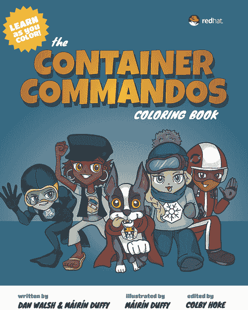
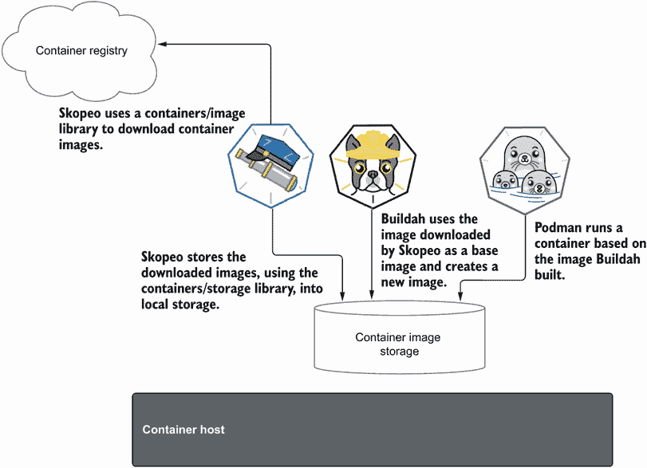

# 附录 A. Podman 相关的容器工具

本附录描述了使用 containers/storage 和 containers/image 库的三个工具。这些工具解决了以下功能：

+   在不同的容器注册表和存储之间移动容器镜像

+   构建容器镜像

+   在单个节点上测试、开发和在生产环境中运行容器

+   在生产环境中大规模运行容器

作为 Podman 的原始创建者，我认识到需要专门的工具，每个工具都执行特定的功能，而不是一刀切的单体解决方案。

从安全角度来看，这四个类别需要不同的安全约束。在生产环境中运行的容器需要在一个比开发和测试环境中运行得更安全的环境中运行。在注册表中移动容器镜像不需要对您运行命令的主机具有特权访问权限——只需要对注册表的远程访问。如果您在构建过程中需要更多访问权限，那么在生产环境中，它们将获得与构建过程中相同的访问权限。

单体守护进程的另一个关键问题是它阻止了对工具的实验，并且不允许它们独立发展。一个例子是我们提出更改 Docker 守护进程，允许用户从容器注册表中拉取不同类型的 OCI 内容。这个更改被拒绝了，因为它与 Docker 容器几乎没有关系。

同样，当单体守护进程为某个产品修改时，它可能会对使用该守护进程的另一个产品的功能产生负面影响。它可能导致性能下降或完全损坏。这发生在 Kubernetes 开发期间，因为它依赖于 Docker 守护进程作为容器引擎。但由于 Docker 是单体的，并且为许多其他项目开发，其中许多更改影响了 Kubernetes，导致不稳定。很明显，Kubernetes 需要为其工作负载提供一个专门的容器引擎，2020 年 12 月宣布 Kubernetes 最终将使用新开发的标准化接口，即容器运行时接口（CRI；见[`mng.bz/yaDq`](http://mng.bz/yaDq)），以改善编排程序与不同容器运行时之间的交互。我编写了一本彩色书，《容器指挥官》（图 A.1；[`red.ht/3gfVlHF`](https://red.ht/3gfVlHF)），由 Máirín Duffy (@marin) 插图，描述了本附录中讨论的容器工具，基于超级英雄。



图 A.1 容器彩色书 ([`red.ht/3gfVlHF`](https://red.ht/3gfVlHF))

最后，有时存在相互冲突的利益或发布计划。拥有独立的独立工具允许以它们自己的速度独立部署，从而确保向客户保证新功能。为表 A.1 中描述的独立功能创建了四个项目。

表 A.1 基于 containers/storage 和 containers/image 的主要容器工具。

| 工具 | 描述 |
| --- | --- |
| Skopeo | 对容器镜像和镜像仓库执行各种操作 ([`github.com/containers/skopeo`](https://github.com/containers/skopeo)) |
| Buildah | 促进对容器镜像执行广泛的操作 ([`github.com/containers/buildah`](https://github.com/containers/buildah)) |
| Podman | Pod、容器和镜像的全能管理工具 ([`github.com/containers/podman`](https://github.com/containers/podman)) |
| CRI-O | 基于 OCI 的 Kubernetes 容器运行时接口实现 ([`github.com/cri-o/cri-o`](https://github.com/cri-o/cri-o)) |

由于你已经学到了很多关于 Podman 的知识，你现在知道为什么它被包含在这个列表中。Podman 是一个理解和发展容器、Pod 和镜像的优秀工具。它封装了 Docker CLI 所做的所有事情，但不需要将所有内容锁定在一个中央守护进程下。因为 Podman 无守护进程工作并使用操作系统共享数据，其他工具可以与相同的数据存储和库一起工作。本附录的其余部分描述了其余的工具，从 Skopeo（图 A.2）开始。



图 A.2 Skopeo、Buildah 和 Podman 通过共享相同的容器/存储镜像和容器/镜像库来协同工作，以拉取和推送镜像。

## A.1 Skopeo

当使用 Docker 或 Podman 等容器引擎时，如果你想检查注册表中的容器镜像，你必须从注册表将其拉取到本地存储。只有在这种情况下，你才能检查它。问题是这个镜像可能非常大，在检查后，你可能会意识到它不是你预期的，你浪费了时间拉取它。因为用于拉取和检查镜像的协议只是一个网络协议，所以创建了一个简单的工具 Skopeo 来拉取镜像的详细信息并在屏幕上显示。*Skopeo* 是希腊语中 *远程查看* 的意思。

![图片 A-UN01.png]

执行以下 `skopeo` `inspect` 命令以以 JSON 格式检查镜像的详细信息：

```
$ skopeo inspect docker:/ /quay.io/rhatdan/myimage
{
  "Name": "quay.io/rhatdan/myimage",
  "Digest":
"sha256:fe798c1576dc7b70d7de3b3ab7c72cd22300b061921f052279d88729708092d8",
  "RepoTags": [
      "Latest",
      "1.0"
  ],
...
```

Skopeo 被扩展以也能从注册表中复制镜像。最终，Skopeo 成为了在不同类型存储（传输）之间复制镜像的工具。这些存储类型成为了表 A.2 中定义的传输。

表 A.2 Podman 支持的传输方式

| 传输 | 描述 |
| --- | --- |
| 容器注册表 (`docker`) | 这是默认的传输方式。它引用存储在远程容器镜像注册网站中的容器镜像。注册表存储和共享容器镜像（例如，docker.io 和 quay.io）。 |
| `oci` | 引用容器镜像；符合 Open Container Initiative 格式规范。清单和层 tarball 位于本地目录中作为单独的文件。 |
| `dir` | 引用符合 Docker 图像布局的容器图像。它与 `oci` 传输方式非常相似，但使用传统的 Docker 格式存储文件。作为一个非标准化格式，它主要用于调试或非侵入式容器检查。 |
| `docker-archive` | 引用打包在 TAR 归档中的 Docker 图像布局中的容器图像。 |
| `oci-archive` | 引用符合 Open Container Initiative 格式规范的图像，该图像打包在 TAR 归档中。它与 `docker-archive` 传输方式非常相似，但以 OCI 格式存储图像。 |
| `docker-daemon` | 引用存储在 Docker 守护进程内部存储中的图像。由于 Docker 守护进程需要 root 权限，Podman 必须由 root 用户运行。 |
| `container-storage` | 引用位于本地容器存储中的图像。它不是一个传输方式，而是一种存储图像的机制。它可以用来将其他传输方式转换为 `container-storage`。Podman 默认使用 `container-storage` 来存储本地图像。 |

其他容器引擎和工具希望使用 Skopeo 中开发的复制图像的功能，因此 Skopeo 被拆分为两部分：命令行 Skopeo 和底层库 containers/image。将功能拆分为单独的库使得构建其他容器工具成为可能，包括 Podman。

`skopeo` `copy` 命令在在不同类型的容器存储之间复制图像时非常受欢迎。与 Podman 和 Buildah 相比，一个不同之处在于，正如你在 A.2 节中看到的，Skopeo 强制用户指定源和目的地的传输方式。Podman 和 Buildah 默认根据上下文和命令使用 `docker` 或 `containers-storage` 传输方式。在以下示例中，你将使用 `docker` 传输方式从一个容器注册库复制图像，并使用 `container-storage` 传输方式将图像本地存储：

```
$ skopeo copy docker:/ /quay.io/rhatdan/myimage containers-storage:quay.io/rhatdan/myimage
Getting image source signatures
Copying blob dfd8c625d022 done 
Copying blob 68e8857e6dcb done 
Copying blob e21480a19686 done 
Copying blob fbfcc23454c6 done 
Copying blob 3f412c5136dd done 
Copying config 2c7e43d880 done 
Writing manifest to image destination
Storing signatures
```

另一个许多 Skopeo 用户使用的命令是 `skopeo` `sync`，它允许你在容器注册库和本地存储之间同步图像。

Skopeo 主要用于基础设施项目，以帮助配置多个容器注册库——例如，将公共注册库中的图像复制到私有注册库中。表 A.3 描述了与 Skopeo 一起使用的最常用命令。第一个利用 containers/image 库的工具是 Buildah。

表 A.3 Skopeo 主要命令及其描述

| 命令 | 描述 |
| --- | --- |
| `skopeo` `copy` | 从一个位置复制图像（清单、文件系统层或签名）到另一个位置。 |
| `skopeo` `delete` | 标记图像名称，以便由注册库的垃圾收集器稍后删除。 |
| `skopeo` `inspect` | 返回关于注册库中图像名称的低级信息。 |
| `skopeo` `list-tags` | 列出特定传输图像存储库中的标签。 |
| `skopeo` `login` | 登录到容器注册库（与 `podman` `login` 相同）。 |
| `skopeo` `logout` | 从容器注册库登出（与 `podman logout` 相同）。 |
| `skopeo` `manifest` `digest` | 计算一个清单文件的清单摘要，并将其写入标准输出。 |
| `skopeo` `sync` | 在容器注册库和本地目录之间同步镜像。 |

## A.2 Buildah

正如你在 1.1.2 节中学到的，创建容器镜像意味着在磁盘上创建一个目录并向其中添加内容，使其看起来像 Linux 机器上的根目录 `/`，称为 rootfs。最初，完成这一点的唯一方法是通过 `docker build` 使用 Dockerfile。虽然 Dockerfile 和 Containerfile 是创建容器镜像配方的好方法，但还需要一个低级别的构建块工具，允许以其他方式构建容器镜像——允许将镜像构建过程分解成单独的命令，让你可以使用比 Containerfile 更强大的脚本工具和语言来构建镜像。我们创建了一个名为 Buildah 的工具 ([`buildah.io`](https://buildah.io)) 来满足这个目的。


Buildah 被设计成构建容器镜像的简单工具。它建立在容器存储和容器图像库之上，就像 Podman 和 Skopeo 一样。它具有许多与 Podman 相似的功能。你可以拉取镜像、推送镜像、提交镜像，甚至可以在镜像上运行容器。Podman 与 Buildah 主要的区别在于其底层的 *容器* 概念。Podman 容器是一个长期运行的容器，一个 *运行* 的容器，而 Buildah 容器只是一个临时的容器，一个 *工作* 的容器，它将被用来创建一个 OCI 镜像。

注意：Buildah 是一个仅适用于 Linux 的工具，在 Mac 或 Windows 上不可用。然而，Podman 在 `podman build` 命令中集成了 Buildah。Mac 和 Windows 上的 Podman 使用服务器端的 Buildah 代码，允许这些平台使用 Containerfiles 和 Dockerfiles 进行构建。有关更多信息，请参阅附录 E 和 F。

Buildah 是为了将 Dockerfile 中定义的步骤在命令行中可用而设计的。Buildah 希望通过允许你使用操作系统内所有可用的工具来填充镜像，从而简化容器镜像的构建过程。你可以通过标准 Linux 工具，如 `cp`、`make`、`yum install` 等将数据添加到这个目录中。然后提交 rootfs 到一个 tarball 中，添加一些 JSON 来描述镜像创建者希望镜像执行的操作，最后将这个 tarball 推送到容器注册库。基本上，Buildah 将你在 Containerfile 中学到的步骤分解成可以在 shell 中执行的单独命令。

注意：名称 *Buildah* 是我对 *builder* 这个词发音的戏谑。如果你曾经听过我说话，你会注意到我有一个强烈的波士顿口音。当核心团队问我想要给这个工具起什么名字时，我说：“我不在乎，就叫它 *builder* 吧。” 他们听成了 *Buildah*。

构建新的容器镜像的第一步是拉取基础镜像。在 Containerfile 中，这是通过 `FROM` 指令完成的。

### A.2.1 从基础镜像创建工作容器

首先要查看的命令是 `buildah from`。它等同于 Containerfile 的 `FROM` 指令。当执行 `buildah from IMAGE` 时，它会从容器注册库中拉取指定的镜像，将其保存在本地容器存储中，并基于此镜像创建一个工作容器。如前所述，这个容器类似于 Podman 容器，但它只临时存在，以成为容器镜像。在以下示例中，基于 ubi8-init 镜像创建了一个工作容器。

附录 A.1 Buildah 拉取镜像并创建 Buildah 容器

```
$ buildah from ubi8-init
Resolved "ubi8-init" as an alias (/etc/containers/registries.conf.d/
➥ 000-shortnames.conf) 
Trying to pull registry.access.redhat.com/
➥ ubi8-init:latest...                        ❶
Getting image source signatures
Checking if image destination supports signatures
Copying blob adffa6963146 done 
Copying blob 29250971c1d2 done 
Copying blob 26f1167feaf7 done 
Copying config 4b85030f92 done 
Writing manifest to image destination
Storing signatures
ubi8-init-working-container                 ❷
```

❶ 从容器注册库拉取镜像

❷ 输出新的容器名称

注意到 `buildah from` 的输出看起来与 `podman pull` 的输出相同，除了最后一行，它输出了容器名称：`ubi8-init-working-container`。如果您再次运行 `buildah from` 命令，您将得到第二个容器名称：

```
$ buildah from ubi8-init
ubi8-init-working-container-1
```

Buildah 会跟踪其容器，并通过递增计数器来生成每个容器。当然，您可以使用 `--name` 选项覆盖容器名称。接下来，您将向这个容器镜像添加内容。

### A.2.2 向工作容器添加数据

Buildah 有两个命令，`buildah copy` 和 `buildah add`，用于将文件、URL 或目录的内容复制到容器的当前工作目录。它们映射到 Containerfile 的 `COPY` 和 `ADD` 指令的功能。

注意：有两个命令几乎做同样的事情，这可能会有些令人困惑。在大多数情况下，我建议您只使用 Containerfile 中的 `buildah copy` 和 `COPY` 命令。这两个命令的主要区别在于 `COPY` 命令只将主机上的本地文件和目录复制到容器镜像中。`add` 命令支持使用 URL 拉取远程内容并将其插入到您的容器中。`ADD` 命令还支持将 TAR 和 ZIP 文件复制到容器镜像中并展开它们。

`buildah copy` 命令的语法要求您指定由 `buildah from` 命令先前创建的容器名称，然后是源和（可选的）目标。如果没有提供目标，源数据将被复制到容器的当前工作目录。如果目标目录不存在，将会创建它。

以下示例将本地 html/index.xhtml 文件（在 3.1 节中创建）复制到容器中的 /var/lib/www/html 目录：

```
$ buildah copy ubi8-init-working-container html/index.xhtml 
➥ /var/lib/www/html/
```

如果您想使用更高级的工具，如包管理器，向容器添加内容，Buildah 支持在容器内运行命令。

### A.2.3 在工作容器中运行命令

要在运行中的容器内运行命令，你需要执行`buildah` `run`。在底层，这个命令与`RUN`指令的工作方式完全相同；它会在当前容器之上启动一个新的容器，执行指定的命令，并将结果提交回运行中的容器。`buildah` `run`的语法要求你指定运行中的容器名称，然后跟随着命令。在下面的示例中，你将在容器内安装`httpd`服务：

```
$ buildah run ubi8-init-working-container dnf -y install httpd
Updating Subscription Management repositories.
Unable to read consumer identity
This system is not registered with an entitlement server. You can use 
➥ subscription-manager to register.
...
Complete!
```

为了确保在创建运行中的容器后，你将有一个正在运行的 Web 服务器，下一个命令将启用 Apache HTTP 服务器服务：

```
$ buildah run ubi8-init-working-container systemctl enable httpd.service
Created symlink /etc/systemd/system/multi-user.target.wants/httpd.service → 
➥ /usr/lib/systemd/system/httpd.service.
```

表 A.4 展示了 Containerfile 指令与 Buildah 命令之间的关系。

表 A.4 将 Containerfile 指令映射到 Buildah 命令

| 指令 | 命令 | 描述 |
| --- | --- | --- |
| `ADD` | `buildah` `add` | 将文件、URL 或目录的内容添加到容器中。 |
| `COPY` | `buildah` `copy` | 将文件、URL 或目录的内容复制到容器的运行目录中。 |
| `FROM` | `buildah` `from` | 创建一个新的运行中的容器，要么从头开始，要么使用指定的镜像作为起点。 |
| `RUN` | `buildah` `run` | 在容器内运行命令。 |

### A.2.4 直接从宿主机向运行中的容器添加内容

到目前为止，你已经看到了 Buildah 如何执行与你在 Containerfile 中执行的相同命令，但 Buildah 的一个目标是将容器镜像的 rootfs 直接暴露给宿主机。这允许你使用宿主机上可用的命令向容器镜像添加内容，而无需在容器镜像内部存在这些命令。

`buildah` `mount`命令允许你将运行中容器的根文件系统直接挂载到你的系统上，然后使用`cp`、`make`、`dnf`或甚至是一个编辑器来操作容器根文件系统的内容。

如果你以 root 用户运行 Buildah，你可以简单地执行`buildah` `mount`命令。但在无 root 模式下，这是不允许的。回想一下第 2.2.10 节，你学习了`podman` `mount`命令，你必须首先进入用户命名空间。同样，`buildah` `unshare`命令创建一个在用户命名空间中运行的 shell。一旦你进入用户命名空间，你就可以挂载容器。在下面的示例中，使用你迄今为止所学的内容，你将使用宿主机的操作系统`grep`命令向容器添加内容：

```
$ buildah unshare
# mnt=$(buildah mount ubi8-init-working-container)
# echo $mnt
/home/dwalsh/.local/share/containers/storage/overlay/133e1728eac26589b07984
➥ e3bdf31b5e318159940c866d9e0493a1d08e1d2f6a/merged
# grep dwalsh /etc/passwd >> $mnt/etc/passwd
# exit
```

现在你可以检查你的更改是否实际上已应用于运行中的容器内部：

```
$ buildah run ubi8-init-working-container grep dwalsh /etc/passwd
dwalsh:x:3267:3267:Daniel J Walsh:/home/dwalsh:/bin/bash
```

在填充运行中容器的内容完成后，现在是时候指定 Containerfile 中的其他指令了。这些指令将描述你作为容器镜像创建者的意图。

### A.2.5 配置运行中的容器

您可能在表 A.3 中注意到有很多 Containerfile 指令缺失。`LABEL`、`EXPOSE`、`WORKDIR`、`CMD` 和 `ENTRYPOINT` 等 Containerfile 指令用于填充 OCI 镜像规范。

现在，使用 `buildah config` 命令，您可以添加一个端口以暴露（`EXPOSE`）并标记容器根文件系统内的一个位置作为卷（`VOLUME`），该卷将用作网站根目录：

```
$ buildah config --port=80 --volume=/var/lib/www/html 
➥ ubi8-init-working-container
```

您可以使用 `buildah inspect` 命令检查相应的 OCI 镜像规范字段：

```
$ buildah inspect --format '{{ .OCIv1.Config.ExposedPorts }} {{ 
➥ .OCIv1.Config.Volumes }}' ubi8-init-working-container
map[80:{}] map[/var/lib/www/html:{}]
```

表 A.4 显示了 Containerfile 指令与 Buildah 配置选项之间的关系。您还可以参考表 A.5 以获取有关这些指令的更多信息。

表 A.5 将 Containerfile 指令映射到 Buildah 配置选项

| 指令 | 选项 | 描述 |
| --- | --- | --- |
| `MAINTAINER` | `--author` | 设置镜像作者的联系方式 |
| `CMD` | `--cmd` | 设置在容器内运行的默认命令 |
| `ENTRYPOINT` | `--entrypoint` | 为将在容器中运行的可执行文件设置命令 |
| `ENV` | `--env` | 为所有后续指令设置环境变量 |
| `HEALTHCHECK` | `--healthcheck` | 指定一个命令以检查容器是否仍在运行 |
| `LABEL` | `--label` | 添加键值元数据 |
| `ONBUILD` | `--onbuild` | 设置当镜像用作其他镜像的基础时运行的命令 |
| `EXPOSE` | `--port` | 指定容器在运行时将监听的端口 |
| `STOPSIGNAL` | `--stop-signal` | 设置在容器停止时发送的停止信号 |
| `USER` | `--user` | 设置运行容器时以及所有后续的 `RUN`、`CMD` 和 `ENTRYPOINT` 指令所使用的用户 |
| `VOLUME` | `--volume` | 为外部数据添加挂载点并将其标记为卷 |
| `WORKDIR` | `--workingdir` | 为所有后续的 `RUN`、`CMD`、`ENTRYPOINT`、`COPY` 和 `ADD` 指令设置工作目录 |

完成向 Buildah 容器镜像添加内容以及向 OCI 镜像规范添加配置后，您需要从工作容器创建镜像。

### A.2.6 从工作容器创建镜像

您到目前为止一直在构建的工作容器可以使用 `buildah commit` 命令创建符合 OCI 规范的镜像。此命令与您在 2.1.9 节中学习的 `podman commit` 命令的工作方式相同。此命令的输入是工作容器名称和一个可选的镜像标签；如果没有指定标签，则镜像将没有名称：

```
$ buildah commit ubi8-init-working-container quay.io/rhatdan/myimage2
Getting image source signatures
Copying blob 352ba846236b skipped: already exists 
Copying blob 3ba8c926eef9 skipped: already exists 
Copying blob 421971707f97 skipped: already exists 
Copying blob 9ff25f020d5a done 
Copying config 5e47dbd9b7 done 
Writing manifest to image destination
Storing signatures
5e47dbd9b7b7a43dd29f3e8a477cce355e42c019bb63626c0a8feffae56fcbf9
```

您可以使用 `buildah images` 查看镜像：

```
$ buildah images
REPOSITORY                         TAG       IMAGE ID         CREATED    SIZE
quay.io/rhatdan/myimage2        latest   5e47dbd9b7b7   2 minutes ago  293 MB
registry.access.redhat
➥ .com/ubi8-init               latest   4b85030f924b     5 weeks ago  253 MB
```

由于 Podman 和 Buildah 共享相同的容器镜像存储，您可以使用 `podman images` 看到相同的镜像：

```
$ podman images
REPOSITORY                         TAG        IMAGE ID        CREATED    SIZE
quay.io/rhatdan/myimage2        latest    5e47dbd9b7b7  4 minutes ago  293 MB
registry.access.redhat
➥ .com/ubi8-init               latest    4b85030f924b    5 weeks ago  253 MB
```

您甚至可以在镜像上运行 Podman 容器：

```
$ podman run quay.io/rhatdan/myimage2 grep dwalsh /etc/passwd
dwalsh:x:3267:3267:Daniel J Walsh:/home/dwalsh:/bin/bash
```

### A.2.7 将镜像推送到容器注册库

与 Podman 类似，Buildah 有 `buildah` `login` 和 `buildah` `push` 命令，这些命令允许您将镜像推送到容器注册库，如下面的示例所示：

```
$ buildah login quay.io
Username: rhatdan
Password:
Login Succeeded!
$ buildah push quay.io/rhatdan/myimage2
Getting image source signatures
Copying blob 3ba8c926eef9 done 
Copying blob 421971707f97 done 
Copying blob 9ff25f020d5a done 
Copying blob 352ba846236b done 
Copying config 5e47dbd9b7 done 
Writing manifest to image destination
Copying config 5e47dbd9b7 done 
Writing manifest to image destination
Storing signatures
```

注意：您也可以使用 `podman` `login` 和 `podman` `push` 或甚至 `skopeo` `login` 和 `skopeo` `copy` 来完成相同任务。

恭喜！您已成功手动构建了一个符合 OCI 标准的容器镜像，而不是使用 Containerfile。此外，如果您想使用现有的 Containerfile 或 Dockerfile 创建镜像，可以使用 `buildah` `build` 命令。

### A.2.8 从 Containerfiles 构建镜像

您可以使用 `buildah` `build` 命令从 Containerfile 或 Dockerfile 构建一个符合 OCI 标准的镜像。Buildah 包含一个解析器，它理解 Containerfile 格式，并可以使用之前描述的命令自动执行所有任务。在下一个示例中，使用第 2.3.2 节中的 Containerfile：

```
$ cat myapp/Containerfile
FROM ubi8/httpd-24
COPY index.xhtml /var/www/html/index.xhtml
```

您可以通过执行以下命令使用此 Containerfile 构建您的容器镜像：

```
$ buildah build ./myapp
STEP 1/2: FROM ubi8/httpd-24
Resolved "ubi8/httpd-24" as an alias (/home/dwalsh/.cache/containers/
➥ short-name-aliases.conf)
Trying to pull registry.access.redhat.com/ubi8/httpd-24:latest
...
Getting image source signatures
Checking if image destination supports signatures
Copying blob adffa6963146 skipped: already exists 
...
STEP 2/2: COPY html/index.xhtml /var/www/html/index.xhtml
COMMIT
Getting image source signatures
Copying blob 352ba846236b skipped: already exists 
...
bbfcf76c994c738f8496c1f274bd009ddbc960334b59a74953691fff00442417
```

您可能已经注意到，这个输出与 `podman` `build` 命令的输出完全匹配。这是因为 `podman` `build` 命令使用了 Buildah。

### A.2.9 Buildah 作为库

Buildah 被设计成不仅可以用作命令行工具，还可以用作基于 Golang 的库。Buildah 被用于几个不同的工具中，例如 Podman 和 OpenShift 镜像构建器。Buildah 允许这些工具内部构建 OCI 镜像。每次您执行 `podman` `build` 时，您都在执行 Buildah 库代码。在学会了如何使用 Buildah 构建容器镜像、使用 Skopeo 在容器存储之间复制镜像以及使用 Podman 在主机上管理和运行容器之后，让我们来谈谈这些工具如何在 Kubernetes 生态系统中使用。

## A.3 CRI-O：OCI 容器的容器运行时接口

当 Kubernetes 正在开发时，它使用 Docker API 内部运行容器。Kubernetes 依赖于 Docker 从一个版本到另一个版本变化的特性，有时会破坏 Kubernetes。同时，CoreOS 想要他们的替代容器引擎，称为 RKT ([`github.com/rkt/rkt`](https://github.com/rkt/rkt))，与 Kubernetes 一起工作。Kubernetes 开发者决定，然后，将 Docker 功能拆分出来并使用一个新的 API，称为容器运行时接口 (CRI；[`mng.bz/yaDq`](http://mng.bz/yaDq))。此接口允许 Kubernetes 使用除了 Docker 之外的其他容器引擎。

当 Kubernetes 想要拉取一个容器镜像时，它会通过 CRI 调用一个远程套接字，并要求监听器为它拉取一个 OCI 镜像。当它想要启动一个 Pod/容器时，它会调用套接字并要求启动容器。

注意：CoreOS 最终被 Red Hat 收购，RKT 项目已结束。Kubernetes 已弃用 Docker 作为容器运行时。

Red Hat 将 CRI 视为开发新容器引擎的机会，他们最终将其称为 OCI 容器容器运行时接口（CRI-O；[`cri-o.io/`](https://cri-o.io/)）。CRI-O 基于与 Skopeo、Buildah 和 Podman 相同的容器/storage 和容器/image 库，可以与这些工具一起使用。CRI-O 的主要目标是取代 Docker 服务作为 Kubernetes 的容器引擎。


CRI-O 与 Kubernetes 版本绑定。当发布新的 Kubernetes 版本时，版本号会同步。CRI-O 针对 Kubernetes 工作负载进行了优化；从事该工作的工程师了解 Kubernetes 试图做什么，并确保 CRI-O 以最有效的方式完成。由于 CRI-O 没有其他用户，Kubernetes 不必担心 CRI-O 中的破坏性更改。

注意，CRI-O 是 Red Hat 的基于 OpenShift Kubernetes 产品的核心技术。OpenShift 在 Kubernetes 开始运行之前使用 Podman 来安装和配置 CRI-O。OpenShift 镜像构建器集成了 Buildah 功能，使用户能够在他们的 OpenShift 集群内构建镜像。
