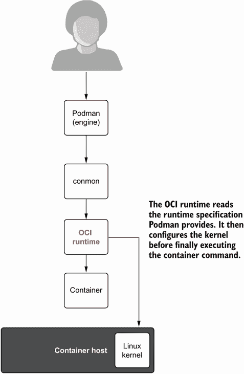
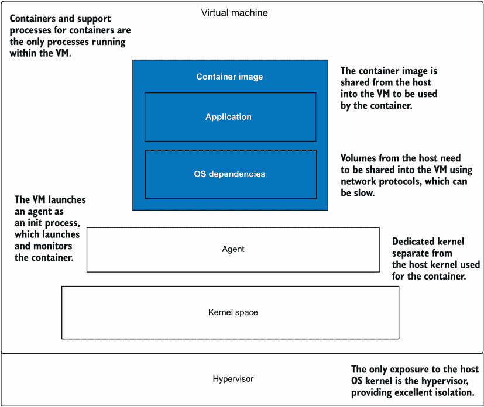

# 附录 B. OCI 运行时

本附录描述了与 Podman 等容器引擎一起使用的主要 OCI 运行时。如第一章所述，OCI 运行时 ([`opencontainers.org`](https://opencontainers.org/)) 是由容器引擎（包括 Podman）启动的可执行文件，用于配置 Linux 内核和子系统以运行内核；其最后一步是启动容器。OCI 运行时读取 OCI 运行时规范 JSON 文件，然后配置命名空间、安全控制和 cgroups，最终启动容器进程（图 B.1）。



图 B.1 Podman 执行 OCI 运行时来启动容器。

在本附录中，您将了解正在使用的四个主要 OCI 运行时。`--runtime` 选项允许您在不同的 OCI 运行时之间切换。在下一个示例中，您将运行相同的容器命令两次，每次使用不同的运行时。在第一个命令中，您使用在 containers.conf 中定义的运行时 `crun` 来运行容器，因此您不需要指定运行时的路径。

列表 B.1 Podman 使用备用 OCI 运行时 `crun`

```
$ podman --runtime crun run --rm ubi8 echo hi     ❶
hi
```

❶ `--runtime` 选项告诉 Podman 使用 crun OCI 运行时，而不是默认的运行时。

默认运行时在 Linux 机器上 containers.conf 文件中的 `[containers]` 表下定义。

列表 B.2 修改默认 OCI 运行时

```
$ grep -iA 3 "Default OCI Runtime" /usr/share/containers/containers.conf
# Default OCI runtime
#
#runtime = "crun"      ❶
```

❶ Podman 在大多数系统上默认使用 crun；在一些较旧的发行版，如 Red Hat Enterprise Linux 上，Podman 默认使用 runc。

在第二个示例中，您使用 OCI 运行时的完整路径，/usr/bin/runc：

```
$ podman --runtime /usr/bin/runc run –rm ubi8 echo hi
hi
```

如果您想永久更改默认的 OCI 运行时，您可以在家目录中的 containers.conf 文件中的 `[engine]` 表中设置运行时选项：

```
$ cat > ~/.config/containers/containers.conf << EOF
[engine]
runtime="runc"
EOF
$ podman --help | grep -- runc
   --runtime string Path to the OCI-compatible binary used to run containers. (default "runc")`
```

注意：`--runtime` 选项仅在 Linux 上可用。`podman` `--remote`，因此 Podman 在 Mac 和 Windows 上不支持 `--runtime` 选项，所以您需要在服务器端设置 containers.conf 文件。

查看更多关于 `podman(1)` 的信息：`man` `podman.`。

OCI 运行时正在不断开发和实验中。您可以期待未来在这个领域发生创新。第一个开发的容器运行时，以及事实上的标准，是 `runc`。

## B.1 runc

`runc` 是原始的 OCI 运行时 ([`github.com/opencontainers/runc`](https://github.com/opencontainers/runc)). 当 OCI 最初形成时，Docker 将 `runc` 捐赠给 OCI，作为 OCI 运行时的默认实现。OCI 继续支持和开发 `runc`。它用 Golang 编写，还包括 libcontainer 库，该库被许多容器引擎和 Kubernetes 使用。

`runc` 网站声明，`runc` 以及所有 OCI 运行时，是一个低级工具，不建议直接由最终用户使用。建议由容器引擎如 Podman 或 Docker 启动。

请记住，容器引擎的工作是拉取容器镜像到主机，配置并挂载根文件系统（rootfs）以在容器内使用，最后在启动 OCI 运行时之前写入 OCI 运行时 JSON 文件。

OCI 运行时规范仅描述了 OCI 运行时使用的 JSON 文件的内容。因为每个 OCI 引擎都支持 `runc` 命令行，其他 OCI 运行时也采用了相同的 CLI 命令和选项。这使得当一个运行时被容器引擎启动时，替换另一个运行时变得更加容易。表 B.1 显示了 `runc` 支持的命令，因此所有 OCI 运行时都支持这些命令。|

表 B.1 `runc` 命令

| 命令 | 描述 |
| --- | --- |
| `checkpoint` | 检查点一个正在运行的容器 |
| `create` | 创建一个容器 |
| `delete` | 删除容器持有的任何资源，通常与分离容器一起使用 |
| `events` | 显示容器事件，例如 OOM 通知、CPU、内存和 IO 使用统计信息 |
| `init` | 初始化命名空间并启动进程 |
| `kill` | 向容器的 init 进程发送指定的信号（默认：`SIGTERM`） |
| `List` | 列出由 `runc` 启动的、给定根目录下的容器 |
| `pause` | 暂停容器内的所有进程 |
| `ps` | 显示容器内运行的进程 |
| `restore` | 从之前的检查点恢复容器 |
| `resume` | 恢复之前暂停的所有进程 |
| `run` | 创建并运行一个容器 |
| `spec` | 创建一个新的规范文件 |
| `start` | 在创建的容器中执行用户定义的进程 |
| `state` | 输出容器的状态 |
| `update` | 更新容器资源限制 |

`runc` 仍在不断发展，并拥有一个非常活跃的社区。`runc` 的问题在于它是用 Golang 编写的。Golang 并非为小型、经常执行的应用程序而设计，这种应用需要快速启动、执行 fork/exec 命令并快速退出。在 Golang 中，fork/exec 是一个重量级的操作，尽管 `runc` 尝试解决这个问题，但最终还是牺牲了一部分性能。然而，“一点”性能损失可能会随着时间的推移而累积，因此 `crun` 在大规模应用中表现更佳。

## B.2 crun

`runc` 是用 Golang 编写的，是一个非常庞大的可执行文件——大小为 12 兆字节。Golang 是一种非常好的语言，但它没有充分利用共享库。由于这个原因，Golang 可执行文件会占用更多的内存。`runc` 的大小导致它在容器启动时加载速度较慢。Golang 的另一个问题是它不支持 fork/exec 模型，它在其他语言（例如 C）中的 fork/exec 模型要慢得多。当你启动和停止数百或数千个容器时（例如，在 Kubernetes 集群中），这种速度的缺乏更为重要。像 Podman 这样的容器引擎，也是用 Go 编写的，通常运行时间更长，因此启动时间并不那么重要。像 `runc` 这样的 OCI 运行时执行时间非常短，并且快速退出。

Giuseppe Scrivano，`runc` 和 Podman 的贡献者，理解了 `runc` 中的这些不足，并希望用 C 语言编写一个兼容的 OCI 运行时。他创建了一个非常轻量级的 OCI 运行时，称为 `crun`。

`crun` 将自己描述为“*一个快速且轻量级的 OCI 运行时。” ([`github.com/containers/crun`](https://github.com/containers/crun)) 它支持与 `runc` 相同的所有命令和选项，而 `crun` 可执行文件的大小比 `runc` 小得多。执行 `du` `-s` 命令以比较大小：

```
$ du -s /usr/bin/runc /usr/bin/crun
14640    /usr/bin/runc
392    /usr/bin/crun
```

`crun` 是用 C 编写的，比 `Golang` 更好地支持 fork 和 exec，因此在启动容器时速度更快。

这也使得它能够轻松地集成到系统上的其他库中，并且有一些实验正在使用 `crun` 作为处理 OCI 运行时 JSON 文件和启动不同类型的容器（例如，Linux 上的 WASM 和 Windows 容器）的库。`crun` 还基于 libkrun 有潜力启动基于 KVM 分离的容器。

`crun` 现在是 Podman 在 Fedora 和 Red Hat Enterprise Linux 9 中使用的默认 OCI 运行时。`runc` 继续得到支持，并在 Red Hat Enterprise Linux 8 中是默认的 OCI 运行时。

`crun` 和 `runc` 是管理使用命名空间分离的传统容器的两个主要 OCI 运行时。这两个项目工作得相当紧密。当在任一 OCI 运行时中发现错误或问题时，它们会迅速在两个项目中修复。有关更多信息，请参阅 `crun(1)` 手册页：`man` `crun`。

## B.3 Kata


OCI 运行时也被编写为使用虚拟机隔离，其中主要的例子是 Kata Containers。Kata Container 项目（[`katacontainers.io`](https://katacontainers.io)）自我宣传如下：“*拥有容器的速度，虚拟机的安全性。Kata Containers 是一个开源容器运行时，构建轻量级的虚拟机，可以无缝地集成到容器的生态系统中。”*



图 B.2 Kata containers 启动一个轻量级虚拟机，该虚拟机仅运行容器。

Kata 容器使用虚拟机技术来启动每个容器，这与在虚拟机内部启动 VM 和运行 Podman 的方式非常不同。一个标准的虚拟机有一个初始化系统，它会启动各种服务，如日志系统、cron 等。另一方面，Kata 容器启动一个微操作系统，它只运行容器及其支持服务（图 B.2）。由于其唯一目的是启动容器，当容器退出时，这个虚拟机就会消失。

我认为在 VM/虚拟机分离中运行容器比传统的容器分离提供了更好的安全隔离，在传统的容器分离中，容器直接与主机内核通信。VM 分离容器必须首先在虚拟机内部突破隔离，然后找到一种方法突破虚拟机管理程序——只有在这种情况下才会面临攻击主机内核。

虽然 VM 分离容器更安全，但这确实带来了一些缺点。启动 Kata 容器、配置虚拟机管理程序、在虚拟机内部启动内核和其他进程，以及最终启动容器，都需要相当大的开销。虚拟机的内存、CPU 等资源必须预先分配，并且难以更改。在云中在虚拟机内部运行 Kata 通常是不允许的，或者至少更昂贵，因为大多数云服务提供商都不赞成嵌套虚拟化。

最后，也是最重要的，VM 分离容器由于其本质属性，在与其他容器和主机操作系统共享内容方面存在困难。最大的问题是卷。

在传统容器中与主机机器共享内容只是一个绑定挂载，而在 VM 分离容器中，绑定挂载不起作用。由于主机和容器中的进程运行在两个不同的内核上，你需要一个网络协议来共享内容。Kata 容器最初使用 NFS 和 Plan 9 网络文件系统。在这些网络文件系统上读写数据比使用绑定挂载获得的本地文件系统读写要慢得多。

Virtiofs 是一种新的文件系统，它具有网络文件系统的属性，但允许虚拟机访问主机上的文件。它能够在速度上对基于网络的文件系统有显著的提升，同时仍然处于高度开发中。

Kata 容器有两种启动方式。Kata 传统上有一个基于 Podman 支持的`runc`命令的 OCI 命令行，`kata-runtime`。你可以在 Linux 机器上通过搜索`#kata`来查看在`containers.conf`中定义的路径：

```
$ grep -A 9 '^#kata' /usr/share/containers/containers.conf
#kata = [
#  "/usr/bin/kata-runtime",
#  "/usr/sbin/kata-runtime",
#  "/usr/local/bin/kata-runtime",
#  "/usr/local/sbin/kata-runtime",
#  "/sbin/kata-runtime",
#  "/bin/kata-runtime",
#  "/usr/bin/kata-qemu",
#  "/usr/bin/kata-fc",
#]
```

关于 Kata 容器的底线是，你可以在性能开销的情况下获得更好的安全性。你可以根据工作负载的需求在这些 OCI 运行时之间进行选择。

## B.4 gVisor


在这个附录中，我最后要介绍的是 gVisor ([`gvisor.dev/`](https://gvisor.dev/))。gVisor 网站将自己宣传为“为容器提供高效深度防御的应用内核。”

gVisor 包含一个名为 `runsc` 的 OCI 运行时，并与 Podman 以及其他容器引擎协同工作。gVisor 项目将自己称为一个应用内核，使用 Golang 编写，实现了 Linux 系统调用接口的大部分功能。它为运行中的应用程序和宿主操作系统之间提供了一个额外的隔离层。Google 工程师编写了 gVisor 的原始版本，并声称 Google Cloud 运行的容器中大部分都使用了 gVisor OCI 运行时。

gVisor 在某种程度上类似于 VM 隔离容器，因为 gVisor 会拦截容器内部几乎所有的系统调用，然后对其进行处理。gVisor 将自己描述为使用 Golang 编写的容器应用内核，限制了宿主内核的访问。同时，它没有像 Kata 那样的嵌套虚拟化问题。

然而，gVisor 引入了额外的 CPU 周期和更高的内存使用，从而带来性能损失。这可能会导致延迟增加、吞吐量减少，或者两者兼而有之。gVisor 还是对系统调用表面的一种独立实现，这意味着许多子系统或特定调用没有像更成熟的实现那样进行优化。
