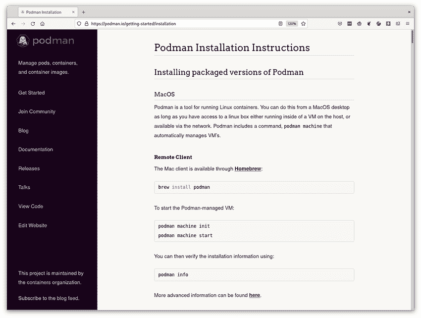

# 附录 C. 获取 Podman

Podman 是一个用于处理容器的优秀工具，但如何在您的系统上安装它呢？需要哪些软件包才能使其正常工作？本附录涵盖了在您的系统上安装或构建 Podman 的方法。

## C.1 安装 Podman

Podman 几乎可以通过所有 Linux 发行版的软件包管理器获得。它也适用于 Mac、Windows 和 FreeBSD 平台。官方 podman.io 网站提供了如何为不同发行版安装 Podman 的新指令，[`podman.io/getting-started/installation`](https://podman.io/getting-started/installation) 网站会定期更新。本附录中的大部分内容源自 podman.io 网站，如图 C.1 所示。



图 C.1 Podman 安装说明网站

### C.1.1 macOS

由于 Podman 是一个运行 Linux 容器的工具，因此您只能在访问到本地或远程运行的 Linux 机器的情况下在 macOS 桌面上使用它。为了使这个过程变得更容易一些，Podman 包含一个 `podman` `machine` 命令，可以自动管理虚拟机。

Homebrew

Mac 客户端可通过 Homebrew 获取 ([`brew.sh/`](https://brew.sh/))：

```
$ brew install podman
```

Podman 有能力使用 `podman` `machine` 命令在您的机器上安装虚拟机并运行 Linux 实例。在 Mac 上，您必须执行以下命令来安装和启动 Linux 虚拟机，才能成功在本地运行容器：

```
$ podman machine init
$ podman machine start
```

可选地，您可以使用 `podman` `system` `connection` 命令来设置 SSH 连接到运行 Podman 服务的远程 Linux 机器。

您可以使用以下命令验证安装信息：

```
$ podman info
```

Podman 命令在 Mac 上以原生方式运行，但与在虚拟机中运行的 Podman 实例进行通信。

### C.1.2 Windows

由于 Podman 是一个运行 Linux 容器的工具，因此您只能在访问到本地或远程运行的 Linux 机器的情况下在 Windows 桌面上使用它。在 Windows 上，Podman 还可以利用 Windows Subsystem for Linux 系统。

Windows 远程客户端

您可以在 [`github.com/containers/podman/releases`](https://github.com/containers/podman/releases) 网站上获取最新的 Windows 远程客户端。

安装完成后，您可以使用 `podman` `system` `connection` 命令配置 Windows 远程客户端以连接到 Linux 服务器。您可以在 [`mng.bz/M0Kn`](http://mng.bz/M0Kn) 上了解更多关于此过程的信息。

Windows Subsystem for Linux (WSL) 2.0

请参阅有关安装 WSL 2.0 的 Windows 文档，然后选择包含 Podman 的发行版，其中许多在本节中已描述。或者，`podman` `machine` `init` 命令可以为您自动安装和配置 WSL，在它上面下载和配置 Fedora Core 虚拟机，并为 Podman 远程客户端创建相应的 SSH 连接。

注意：WSL 1.0 不受支持。

### C.1.3 Arch Linux 和 Manjaro Linux

Arch Linux 和 Manjaro Linux 使用 `pacman` 工具安装软件：

```
$ sudo pacman -S podman
```

### C.1.4 CentOS

Podman 可在 CentOS 7 的默认 Extras 仓库中找到，在 CentOS 8 和 Stream 的 AppStream 仓库中可用：

```
$ sudo yum -y install podman
```

### C.1.5 Debian

`podman` 软件包可在 Debian 11（bullseye）仓库及其以后的版本中找到：

```
$ sudo apt-get -y install podman
```

### C.1.6 Fedora

```
$ sudo dnf -y install podman
```

### C.1.7 Fedora-CoreOS, Fedora Silverblue

Podman 在这些发行版中预装。无需安装。

### C.1.8 Gentoo

```
$ sudo emerge app-emulation/podman
```

### C.1.9 OpenEmbedded

Podman 及其依赖项的 BitBake 脚本在 meta-virtualization 层中可用 ([`mng.bz/aPzB`](http://mng.bz/aPzB))。将层添加到您的 OpenEmbedded 构建环境，并使用以下命令构建 Podman：

```
$ bitbake podman
```

### C.1.10 openSUSE

```
sudo zypper install podman
```

### C.1.11 openSUSE Kubic

openSUSE Kubic 发行版内置了 Podman。无需安装。

### C.1.12 Raspberry Pi OS arm64

Raspberry Pi OS 使用标准的 Debian 仓库，因此它与 Debian 的 arm64 仓库完全兼容：

```
$ sudo apt-get -y install podman
```

### C.1.13 Red Hat Enterprise Linux

RHEL7

确保您拥有 RHEL7 订阅，然后启用 extras 频道并安装 Podman：

```
$ sudo subscription-manager repos --enable=rhel-7-server-extras-rpms
$ sudo yum -y install podman
```

注意：RHEL7 已不再接收 Podman 软件包的更新，除非是安全修复。

RHEL8

Podman 包含在 `container-tools` 模块中，与 Buildah 和 Skopeo 一起：

```
$ sudo yum module enable -y container-tools:rhel8
$ sudo yum module install -y container-tools:rhel8
```

RHEL9（及其以后版本）

```
$ sudo yum install podman
```

### C.1.14 Ubuntu

`podman` 软件包可在 Ubuntu 20.10 及更高版本的官方仓库中找到：

```
$ sudo apt-get -y update
$ sudo apt-get -y install podman
```

## C.2 从源代码构建

我通常建议人们获取 Podman 的打包版本，因为成功在 Linux 上运行 Podman 需要安装额外的工具，例如 conmon（容器监控器）、`containernetworking-plugins`（网络配置）和 `containers-common`（通用配置）。虽然从源代码构建 Podman 的过程并不复杂，但依赖项列表因 Linux 发行版而异。您始终可以在以下 Podman 页面上找到最新说明：[`mng.bz/gRDE`](http://mng.bz/gRDE)。

## C.3 Podman Desktop

此外，还有一个用于浏览、管理和检查来自不同容器引擎的容器和镜像的 GUI，Podman Desktop，可在 [`github.com/containers/podman-desktop`](https://github.com/containers/podman-desktop) 获取。Podman Desktop 提供了同时连接到多个引擎的能力，并提供了一个统一的界面。这是一个相对较新的项目，正处于快速发展中，因此请期待一些粗糙的边缘。

为了提供一些背景信息，2021 年 9 月，Docker Inc. 宣布他们将开始对之前免费的 macOS Docker Desktop 版本收费。Docker 的公告导致许多人转向并寻找替代品。

## 摘要

+   Podman 是一个运行 Linux 容器的工具，因此它仅在 Linux 上运行。

+   Podman 可在大多数主要 Linux 发行版的默认软件包仓库中找到。

+   Podman 可作为 Mac 和 Windows 上的远程客户端使用，连接到本地或远程 Linux 服务器。

+   Podman 为 macOS 和 Windows 上的 Linux VM 管理提供了一个特殊的命令。

+   Podman 可以从源代码构建，但需要许多其他工具才能成功运行。

+   Podman Desktop 是 Docker Desktop 的一个替代方案。
