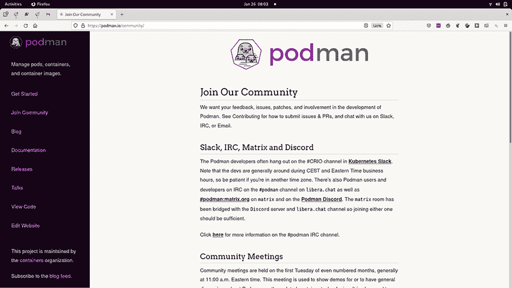
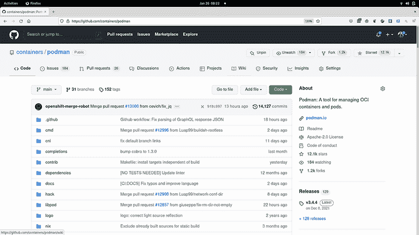

# 附录 D. 为 Podman 做出贡献

我最喜欢的开源事情是社区的努力。能够为项目做出贡献，并且更好地，能够让人们为你的项目做出贡献，这是很棒的。我喜欢用的类比来自《格林童话》中的故事“精灵”([`sites.pitt.edu/~dash/grimm039.xhtml`](https://sites.pitt.edu/~dash/grimm039.xhtml))：

一个鞋匠，没有任何过错，变得如此贫穷，以至于他只有足够的皮革做一双鞋。他一个晚上剪出了鞋样，然后上床睡觉，打算第二天早上完成。他心地善良，睡得很平静，向上帝祈祷，然后入睡。第二天早上，在祈祷之后，他正准备回到工作中，却发现他的工作台上鞋子已经完全做好了。

这个故事继续讲述了一对每晚来访并完成鞋子的精灵。我认为这就是开源工作的方式。基本上，进行小贡献、错误报告、错误修复、文档修复、功能请求以及宣传项目的人都是精灵。有时我甚至睡觉，当我醒来时，我会发现有人已经修复了我前一天晚上试图解决的问题！有时这些精灵会成长为维护者。一些小的贡献随着时间的推移而增长，这些开发者最终成为 Podman 团队的核心成员。我们甚至雇佣了一些人。

## D.1 加入社区

每一点小的改变都有助于使项目变得更好。当我与大学生谈论开源时，我会告诉他们他们作为学生时所没有的独特机会。他们可以为软件项目或产品做出贡献，并将其列在简历上。当面试实习生或工作时，简历上有几个 github.com 的贡献是非常令人印象深刻的。

Podman 及其底层技术一直在寻找新的贡献（图 D.1）。任何大小的贡献都是受欢迎的——从手册中的拼写错误到完整的功能。你不需要是软件开发者才能做出贡献。我们总是在寻找帮助文档、podman.io 的网页设计以及软件方面的帮助。许多伟大的想法都来自产品的用户。仅仅报告一个错误或指出你不满意的地方，都可能带来改进项目的全新想法。我经常要求那些使用 Podman 搭建复杂环境的人撰写博客，这样其他人也可以从中学习。

图 D.1 Podman 社区页面 ([`podman.io/community`](https://podman.io/community))

Podman 是一个包容性的社区，就像 github.com/containers 的所有项目一样。容器项目的行为准则声明位于[`mng.bz/5mEB`](http://mng.bz/5mEB)，内容如下：

*作为[`github.com/containers`](https://github.com/containers) 仓库下项目的贡献者和维护者，为了促进一个开放和欢迎的社区，我们承诺尊重通过报告问题、发布功能请求、更新文档、提交拉取请求或补丁以及其他活动向任何容器项目做出贡献的所有人。*

## D.2 Podman 在 github.com

问题、讨论和拉取请求都位于[github.com/containers/podman](http://github.com/containers/podman) 仓库中（图 D.2）。截至本文撰写时，该项目已有超过 1,200 个分支和 12,000 个星标。总的来说，这是一个非常活跃的项目。

图 D.2 Podman 的 github 页面 ([github.com/containers/podman](https://github.com/containers/podman))

您还可以在 libera.chat 上的#podman 频道直接与核心维护者进行交流。该 IRC 频道也链接到 Matrix 上的#podman:matrix.org (https://matrix.to/#/#podman:matrix.org) 和 Podman Discord ([`discord.com/invite/x5GzFF6QH4`](https://discord.com/invite/x5GzFF6QH4)) 以便进行网络访问。

您还可以通过发送电子邮件到 podman-join@lists.podman.io 加入一个低流量的邮件列表。最后，您可以在 Twitter 上关注@podman_io 或关注我@rhatdan。
