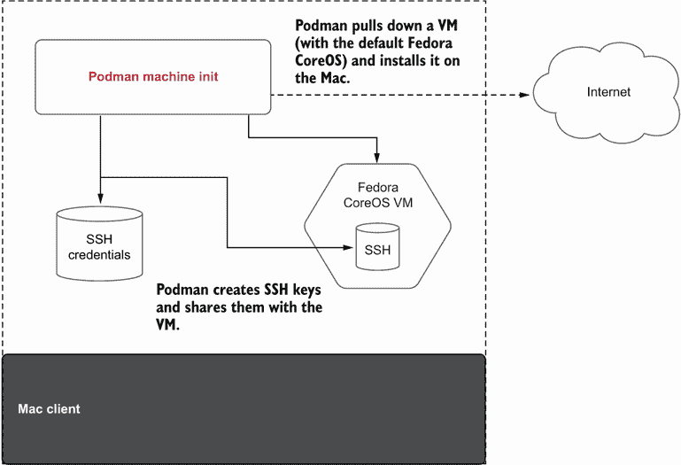

# 附录 E. macOS 上的 Podman

本附录涵盖

+   在 macOS 上安装 Podman

+   使用 `podman machine init` 命令下载已安装 Podman 服务的虚拟机

+   使用 `podman` 命令与虚拟机中运行的 Podman 服务进行通信

+   使用 `podman machine` start/stop 命令启动或停止虚拟机

Podman 是一个用于启动 Linux 容器的工具。Linux 容器需要一个 Linux 内核。尽管我很想说服全世界像我用一样迁移到 Linux 桌面，但大多数用户在 macOS 和 Windows 操作系统上工作——也许甚至包括您。如果您使用 Linux 桌面，太好了！如果您不使用 macOS 机器，请随意跳过本附录。

由于您没有跳过本附录，我将假设您希望在无需 `ssh` 登录 Linux 机器的情况下创建 Linux 容器。您可能希望使用本地的软件开发工具，并保持开发本地化。

实现这一目标的一种方法是在 Linux 机器上作为服务运行 Podman，并使用 `podman --remote` 命令与该服务进行通信。Podman 提供了 `podman system connection` 命令来配置 Podman 如何与 Linux 机器通信。然而，这种方法的问题是一个繁琐的过程，需要许多手动步骤。请参阅此网页以获取有关此过程的最新教程：[`mng.bz/69ro`](http://mng.bz/69ro)。

更好的方法是用一个新的命令 `podman machine`，它封装了所有这些步骤，并改善了您管理用于 `podman-remote` 的 Linux 机器的体验。在本附录中，您将学习如何在 macOS 上安装 Podman，然后使用 `podman machine` 命令安装、配置和管理虚拟机，以便您可以使用本地的 Podman 客户端启动容器。

在 macOS 上启动 Podman 的第一步是安装它。macOS 客户端可通过 Homebrew 获取（[`brew.sh/`](https://brew.sh/))。

注意：Homebrew 自称是“...安装 UNIX 工具最容易且最灵活的方式，Apple 没有将其包含在 macOS 中” ([`docs.brew.sh/Manpage`](https://docs.brew.sh/Manpage))。

Homebrew 是在您的 macOS 上安装开源软件的最佳方式。如果您目前尚未在 macOS 上安装 Homebrew，请在终端中打开它，并在提示符下使用以下命令进行安装：

```
$ /bin/bash -c "$(curl -fsSL 
➥ https:/ /raw.githubusercontent.com/Homebrew/install/HEAD/install.sh)"
```

现在运行以下 `brew` 命令，将仅支持 `--remote` 的 Podman 剪减版安装到 /opt/homebrew/bin 目录：

```
$ brew install podman
```

如果您无法访问 Linux 虚拟机或远程 Linux 服务器，Podman 允许您使用 `podman machine` 命令创建一个本地运行的虚拟机。它通过创建和配置一个启用了 Podman 服务的虚拟机来简化这一过程。

注意：如果您已经有一个现有的 Linux 机器，您可以使用 Podman 系统连接命令设置与这些机器的连接。

## E.1 使用 podman machine

`podman` `machine` 命令允许您从互联网上拉取虚拟机并启动它、停止它或删除它。此虚拟机已预配置了 Podman 服务。此外，此命令创建 SSH 连接并将此信息添加到 `podman` `system` `connection` 数据存储中，极大地简化了设置 `podman-remote` 环境的过程。表 E.1 列出了用于管理 Podman 虚拟机生命周期的所有 `podman` `machine` 子命令。第一步是使用 `podman` `machine` `init` 命令在您的系统上初始化一个新的虚拟机，以下章节将描述此命令。

表 E.1 Podman machine 命令

| 命令 | 描述 |
| --- | --- |
| `init` | 初始化一个新的虚拟机。 |
| `list` | 列出虚拟机。 |
| `rm` | 删除虚拟机。 |
| `ssh` | 通过 `ssh` 登录到虚拟机。这对于进入虚拟机并运行原生 Podman 命令很有用。一些 Podman 命令不支持远程操作，并且您可能希望在虚拟机内部更改一些配置。 |
| `start` | 启动虚拟机。 |
| `stop` | 停止虚拟机。如果您没有运行容器，您可能想关闭虚拟机以节省系统资源。 |

### E.1.1 podman machine init

`podman machine` `init` 命令在您的 macOS 系统上下载和配置虚拟机（图 E.1）。默认情况下，如果之前未下载，它将下载最新的发布版 `fedora-coreos` 镜像（[`getfedora.org/en/coreos`](https://getfedora.org/en/coreos)）。Fedora CoreOS 是一个专为运行容器而设计的最小化操作系统。

注意：虚拟机相对较大，下载可能需要几分钟。



图 E.1 podman `machine init` 命令拉取虚拟机并配置 SSH

列表 E.1 Podman 在 Mac 上下载虚拟机并准备执行

```
$ podman machine init
Downloading VM image: fedora-coreos-35.20211215.2.
➥ 0-qemu.x86_64.qcow2.xz                                    ❶
[=========>------------------------------------------------] 111.0MiB /
➥ 620.7MiB
Downloading VM image: fedora-coreos-35.20211215.2.0-qemu.x86_64.qcow2.xz: done
Extracting compressed file                                   ❷
```

❶ Podman 在您的系统上查找并下载最新的 fedora-coreos qcow 镜像。

❷ 下载镜像后，Podman 解压缩镜像并配置 qemu 以准备执行。它还配置了到 Podman 系统连接数据存储的 SSH 连接。

Podman 预配置了虚拟机使用的内存、磁盘大小和 CPU 数量。这些值可以使用 `init` 子命令选项进行配置。表 E.2 描述了这些选项。

表 E.2 Podman machine `init` 命令选项

| 选项 | 描述 |
| --- | --- |
| `--cpus uint` | CPU 数量（默认为 1） |
| `--disk-size uint` | 磁盘大小（以 GB 为单位，默认为 10）。这是一个重要的设置，因为它限制了虚拟机内部可以使用的容器和镜像数量。如果您有空间，我建议增加该字段。 |
| `--image-path string` | `qcow` 图像的路径（默认为 `testing`）。Podman 有两个内置的 Fedora CoreOS 图像可以拉取：`testing` 和 `stable`。您还可以选择其他操作系统和虚拟机进行下载，但虚拟机必须支持 CoreOS/Ignition 文件 ([`coreos.github.io/ignition/`](https://coreos.github.io/ignition/)))。 |
| `--memory integer` | 以 MB 为单位的内存（默认为 2048）。虚拟机运行需要一定量的内存，并且根据您在虚拟机内想要运行的容器，可能需要更多内存。 |

一旦 `podman` `machine` `init` 完成下载和安装虚拟机，您可以使用 `podman` `machine` `list` 命令查看虚拟机。注意 `*` 表示默认要使用的虚拟机。`podman` `machine` 命令目前一次只能运行一个虚拟机：

```
$ podman machine list
NAME                    VM TYPE   CREATED      LAST UP     CPUS   
➥ MEMORY    DISK SIZE
podman-machine-default  qemu      2 minutes ago  2 minutes ago  1     
➥ 2.147GB   10.74GB
```

在下一节中，您将检查自动创建的 SSH 连接。

### E.1.2 Podman machine SSH 配置

`podman` `machine` `init` 命令为操作系统提供 Ignition 配置，其中包含 core 用户的 SSH 密钥。然后 Podman 在客户端机器上为无根和根模式添加 SSH 连接，配置用户账户，并在虚拟机内添加所需的软件包和配置。SSH 配置允许从客户端对 `core` 和 `root` 账户执行无密码 SSH 命令。`podman` `machine` `init` 命令还配置了 Podman 系统连接信息（见第 9.5.4 节）。系统连接数据库在虚拟机内的根用户和无根用户中进行了配置。如果没有现有的连接，`podman` `machine` `init` 命令将新创建的连接设置为默认连接。

您可以使用 `podman` `system` `connection` `list` 命令检查所有连接。默认连接 `podman-machine-default` 是无根连接：

```
$ podman system connection list
Name                       URI                                                     
Identity                                   Default
podman-machine-default
➥ ssh:/ /core@localhost:50107/run/user/501/podman/podman.sock  
➥ /Users/danwalsh/.ssh/podman-machine-default true
podman-machine-default-root  
➥ ssh:/ /root@localhost:50107/run/podman/podman.sock       
➥ /Users/danwalsh/.ssh/podman-machine-default  false
```

有时您想要执行的容器需要 root 权限，并且不能在无根模式下运行。为此，您可以使用 `podman` `system` `connection` `default` 命令修改系统连接，使其默认为根模式服务：

```
$ podman system connection default podman-machine-default-root
```

再次查看连接以确认默认连接现在是 `podman-machine-default-root`：

```
$ $ podman system connection list
Name                       URI                                                     
➥ Identity                                   Default
podman-machine-default   
➥ ssh:/ /core@localhost:50107/run/user/501/podman/podman.sock  
➥ /Users/danwalsh/.ssh/podman-machine-default  false
podman-machine-default-root 
➥ ssh:/ /root@localhost:50107/run/podman/podman.sock       
➥ /Users/danwalsh/.ssh/podman-machine-default true
n-machine-default ssh:/ /root@localhost:38243/run/podman/podman.sock
```

现在，所有 Podman 命令都直接连接到在 root 账户内运行的 Podman 服务。再次使用 Podman 系统连接默认命令将默认连接更改为无根用户：

```
$ podman system connection default podman-machine-default
```

如果您此时尝试运行 Podman 容器，它将失败，因为虚拟机实际上并没有运行。您需要启动虚拟机。

### E.1.3 启动虚拟机

在添加虚拟机并将特定连接设置为默认连接后，尝试运行一个 `podman` 命令：

```
$ podman version
Cannot connect to Podman. Please verify your connection to the Linux system 
using `podman system connection list`, or try `podman machine init` and 
`podman machine start` to manage a new Linux VM
Error: unable to connect to Podman. failed to create sshClient: Connection 
to bastion host (ssh:/ /root@localhost:38243/run/podman/podman.sock) 
failed.: dial tcp [::1]:38243: connect: connection refused
```

正如错误信息所指出的，虚拟机没有运行，必须启动。

您可以使用 `podman` `machine` `start` 命令启动单个虚拟机。Podman 一次只能运行一个虚拟机。默认情况下，启动命令启动默认虚拟机。如果您有多个虚拟机并想启动不同的虚拟机，您可以指定可选的机器名称：

```
$ podman machine start
INFO[0000] waiting for clients...   
INFO[0000] listening tcp:/ /127.0.0.1:7777
INFO[0000] new connection from @ to /run/user/3267/podman/
➥ qemu_podman-machine-default.sock
Waiting for VM ...
macOShine "podman-machine-default" started successfully
```

您现在可以开始在运行 Podman 服务的 Linux 箱子上运行 Podman 命令了。运行 `podman` `version` 命令以确认客户端和服务器配置正确。如果不正确，Podman 命令应指导您配置系统：

```
$ podman version
Client:
Version:      4.1.0
API Version:  4.1.0
Go Version:   go1.18.1
Built:        Thu May  5 16:07:47 2022
OS/Arch:      darwin/arm64
Server:
Version:      4.1.0
API Version:  4.1.0
Go Version:   go1.18
Built:        Fri May  6 12:16:38 2022
OS/Arch:      linux/arm64
```

现在，您可以直接在 macOS 上使用之前章节中学到的 Podman 命令。当您完成在 VM 中与容器的操作后，您可能应该关闭它以节省资源。

注意：Podman 也在 M1 arm64 机器以及 x86 平台上得到支持。`podman` `machine` `init` 下载匹配架构的 VM，允许您为该架构构建镜像。关于在其他架构上构建镜像的支持正在写作时进行中。

### E.1.4 停止 VM

`podman` `machine` `stop` 命令允许您关闭 VM 内的所有容器以及 VM 本身：

```
$ podman machine stop
```

当您需要再次开始使用容器时，使用 `podman` `machine` `start` 命令启动 VM。

注意：所有的 `podman` `machine` 命令在 Linux 上同样有效，并允许您同时测试 Podman 的不同版本。Linux 上的 Podman 是完整的命令；因此，您需要使用 `--remote` 选项与由 Podman machine 启动的 VM 内运行的 Podman 服务进行通信。在非 Linux 平台上，不需要 `--remote` 选项，因为客户端已经预先配置为 `--remote` 模式。

## 摘要

+   Linux 容器需要 Linux 内核，这意味着在 macOS 上运行容器需要运行 Linux 的虚拟机。

+   在 macOS 上运行的 Podman 不在本地运行容器。实际上，Podman 命令是与运行在 Linux 机器上的 Podman 服务进行通信。

+   `podman` `machine` `init` 命令将 Fedora CoreOS VM 下载并安装到您的平台上，该 VM 正在运行 Podman 服务。

+   `podman` `machine` `init` 命令还设置了允许 Podman 远程客户端与 VM 内的 Podman 服务器通信所需的 SSH 环境。
