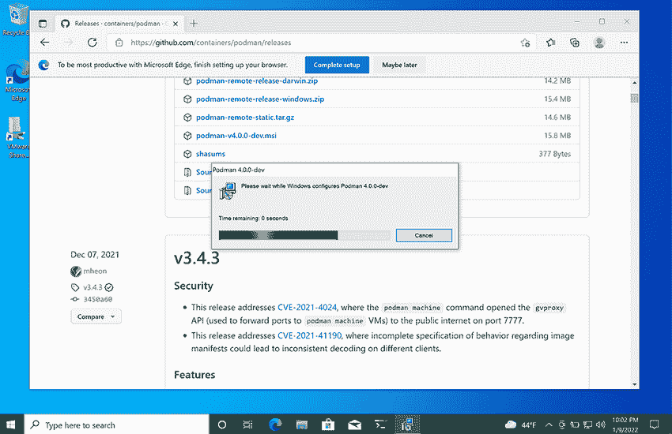
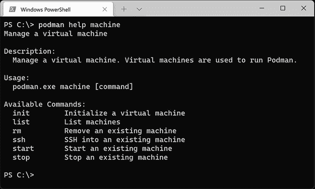
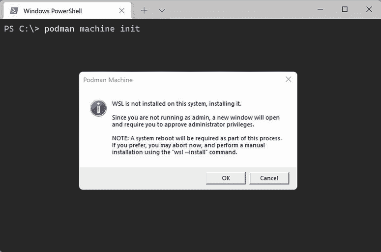
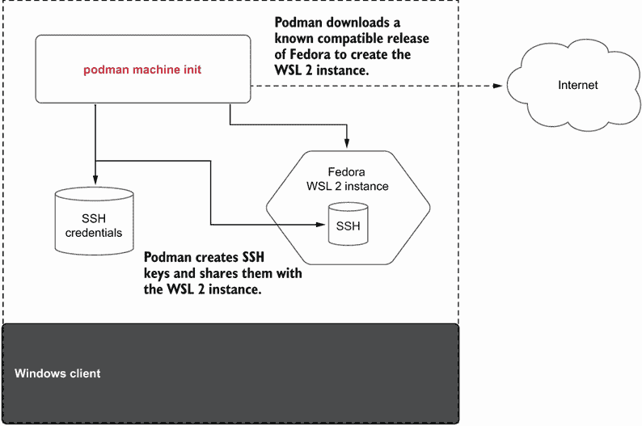

# 附录 F. Windows 上的 Podman

本附录涵盖

+   在 Windows 上安装 Podman

+   使用 `podman` `machine` `init` 命令创建运行 Podman 的基于 Fedora 的 WSL 2 发行版

+   在 Windows 上使用 `podman` 命令与在 WSL 2 实例中运行的 Podman 服务进行通信

+   使用 `podman` `machine` `start/stop` 命令启动或停止 WSL 2 实例

Podman 是一个用于启动 Linux 容器的工具。Linux 容器需要一个 Linux 内核。尽管我很想说服全世界像我自己一样迁移到 Linux 桌面，但大多数用户在 Mac 和 Windows 操作系统上工作——也许甚至是你。如果你使用 Linux 桌面，太好了！如果你不使用 Windows 机器，请随意跳过本附录。

由于你没有跳过这个附录，我假设你想要创建 Linux 容器，而不必通过 `ssh` 登录到 Linux 机器并在那里创建容器。你很可能想使用本地的软件开发工具，并将它们的软件保留在本机上。

在 Linux 上，Podman 可以作为服务运行，允许远程连接来启动容器。然后，从另一台系统，可以使用 `podman` `--remote` 命令与远程 Podman 服务进行通信以启动容器。

此外，你可以使用 `podman` `system` `connection` 来配置 `podman` `--remote` 以通过 SSH 与运行 Podman 服务的远程 Linux 机器进行通信，而不需要在每个命令中提供 URL。所有这些的问题在于，有人必须配置远程机器以使用正确的 Podman 服务版本，然后你必须配置 SSH 会话。

认识到这种体验对于 Windows 桌面上的 Podman 新用户来说并不理想，Podman 添加了一个新的命令：`podman` `machine`。`podman` `machine` 命令使得创建和管理基于 WSL 2 的 Linux 环境变得容易，Podman 预先安装并配置好。Windows 上的 Podman 命令实际上是一个精简版的 Podman 命令，只支持 `podman` `--remote`。在本附录中，你将学习如何在 Windows 机器上安装 Podman，然后使用 `podman` `machine` 命令来安装、配置和管理 WSL 2 实例。

## F.1 第一步

Windows 上的 `podman` `machine` 命令接受与 Linux 和 Mac 上使用的所有相同命令，具有非常相似的行为。尽管如此，由于 Windows 的底层后端基于 Windows Subsystem for Linux ([`docs.microsoft.com/en-us/windows/wsl/`](https://docs.microsoft.com/en-us/windows/wsl/)) 而不是 VM，因此在其他操作系统中有一些差异。

WSL 2 涉及使用 Windows Hyper-V 虚拟机管理程序；然而，与基于标准 VM 的方法不同，WSL 2 在用户安装的每个 Linux 发行版实例之间共享相同的 VM 和 Linux 内核实例。例如，如果你创建了两个 WSL 2 发行版，并且在每个实例上运行 `dmesg`，你会看到相同的输出，因为相同的内核在托管这两个实例。

注意：WSL 1 与 Podman 不兼容；您必须将您的 Windows 机器升级到支持 WSL 2 的操作系统版本。对于 x64 系统，您需要 Windows 版本 1,903 或更高版本，构建号 18,362 或更高。对于 arm64 系统，您需要 Windows 版本 2004 或更高版本，构建号 19,041 或更高。

使用 WSL 2 运行 Podman 可以在主机和所有运行实例之间实现高效的资源共享，但牺牲了较低的隔离性。请注意，`podman` `machine` 命令与您运行的任何其他发行版共享相同的内核，因此在任何发行版中操作任何内核级设置（例如，网络接口和 netfilter 策略）时请谨慎，因为您可能会无意中影响 Podman 执行的容器。

### F.1.1 前提条件

Windows 版本的 Podman 需要 Windows 10（构建号 19,041 或更高）或 Windows 11。由于 WSL 2 使用虚拟机管理程序，您的计算机必须启用虚拟化指令（例如，Intel VT-x 或 AMD-V）。此外，虚拟机管理程序需要二级地址转换（SLAT）支持。最后，您的系统必须具有互联网连接或所有要由 `podman` `machine` 获取的软件的离线副本。

注意：如果您在任何时候遇到错误 0x80070003 或 0x80370102（或任何表示虚拟机无法启动的错误），您很可能已禁用虚拟化。检查您的 BIOS（或 WSL 2 实例）设置以验证 VT-x/AMD-V/WSL 2 实例和 SLAT 是否已启用。

虽然不是必需的，但强烈建议安装 Windows Terminal（与标准 CMD 命令应用或 PowerShell 相比），因为 Windows 11 的未来版本默认包含它。除了拥有现代终端功能，如透明剪切和粘贴以及分格屏幕外，它还提供了直接 WSL 和 PowerShell 集成，使得在不同环境之间切换变得容易。您可以通过 Windows 商店或 `winget` 来安装它：

```
PS C:\Users\User> winget install Microsoft.WindowsTerminal
```

### F.1.2 安装 Podman

安装 Podman 很简单。访问 Podman 网站或 Podman GitHub 仓库，然后在“发布”部分下载最新的 Podman MSI Windows 安装程序（图 F.1；[`github.com/containers/podman/releases`](https://github.com/containers/podman/releases)）。



图 F.1 下载和运行 Podman 安装程序

运行安装程序后，打开一个终端（如果您按照建议安装了 Windows Terminal，请使用 `wt` 命令），并执行您的第一个 `podman` 命令（图 F.2）。



图 F.2 在 Windows Terminal 中运行的 Podman 命令

自动 WSL 安装

如果您的 Windows 系统上没有安装 WSL，Podman 会为您安装它。只需执行`podman` `machine` `init`命令（如图 F.3 所示）来创建您的第一个机器实例，然后 Podman 会提示您安装 WSL 的权限。WSL 安装过程需要重启，但会继续执行机器创建过程。（请确保等待几分钟，以便终端重新启动并安装。）如果您更喜欢手动安装，请参阅 WSL 安装指南：[`docs.microsoft.com/en-us/windows/wsl/install`](https://docs.microsoft.com/en-us/windows/wsl/install)。



图 F.3 podman machine init 启动 WSL 安装。

## F.2 使用 podman machine

通过使用`podman` `machine`命令，可以轻松设置和使用 Linux 环境。在 Windows 上，这些命令创建和管理 WSL 2 发行版，包括从互联网下载基本 Linux 镜像和软件包，并为您设置一切。WSL 2 发行版预先配置了 Podman 服务，并将 SSH 连接配置自动添加到`podman` `system` `connection`数据存储中。最终结果是您可以在 Windows 桌面上轻松运行 Podman 命令，就像在 Linux 系统上一样。表 F.1 列出了用于管理 WSL 2 支持的 Linux 环境生命周期的所有`podman` `machine`命令。

表 F.1 `podman` `machine`命令

| 命令 | 描述 |
| --- | --- |
| `init` | 初始化一个新的基于 WSL 2 的机器实例。 |
| `list` | 列出 WSL 2 机器。 |
| `rm` | 删除一个 WSL 2 机器实例。 |
| `set` | 设置可更新的 WSL 机器设置。 |
| `ssh` | 通过`ssh`连接到 WSL 2 机器实例。这对于进入 WSL 2 实例并运行原生 Podman 命令很有用。一些 Podman 命令不支持远程执行，您可能需要在 WSL 2 实例内部更改一些配置。 |
| `start` | 启动一个 WSL 2 机器实例。 |
| `stop` | 停止一个 WSL 2 机器实例。如果您没有运行容器，您可能想要停止以节省系统资源。 |

在安装 Podman（见 F.1.2 节）后，第一步是在您的系统上创建一个 WSL 2 机器实例。您将使用以下部分中描述的`podman` `machine` `init`命令。

### F.2.1 podman machine init

如图 F.4 所示，您可以使用`podman` `machine` `init`命令来自动安装一个基于 WSL 2 的 Linux 环境，该环境托管 Podman 服务以运行容器。默认情况下，`podman` `machine` `init`会下载一个已知的兼容版本的 Fedora 来创建 WSL 2 实例（[`getfedora.org`](https://getfedora.org)）。使用 Fedora 是因为它与 Podman 集成良好，并且是大多数 Podman 核心开发者使用的操作系统。



图 F.4 podman machine init 命令创建 WSL 2 发行版并配置 SSH 连接。

注意：除了基本镜像外，还需要下载和安装一些软件包，这可能需要几分钟才能完成。

以下是从运行 `podman` `machine` `init` 命令中得到的简化输出：

```
PS C:\Users\User> podman machine init
Downloading VM image: fedora-35.20211125-x86_64.tar.xz: done
Extracting compressed file
Importing operating system into WSL (this may take 5+ minutes on a new WSL 
➥ install)...
Installing packages (this will take awhile)...
Fedora 35 - x86_64                                5.5 MB/s |  79 MB     00:14
Complete!
Configuring system...
Generating public/private ed25519 key pair.
Machine init complete
To start your machine run:
        podman machine start
```

表 F.2 解释了允许你自定义默认设置的 `init` 选项。

表 F.2 `podman` `machine` `init` 命令选项

| 选项 | 描述 |
| --- | --- |
| `--cpus` `uint` | 未使用 |
| `--disk-size` `uint` | 未使用 |
| `--image-path` `string` | 在 Windows 上，此选项指的是 Fedora 发行版编号（例如，35）。与 Linux 和 Mac 一样，你也可以指定一个任意 URL 或文件系统位置，使用自定义镜像，但 Podman 预期的是 Fedora 衍生的布局。 |
| `--memory` `integer` | 未使用 |
| `--rootful` | 确定此机器实例是否应该是 rootful 或 rootless |

注意：表 F.2 中指定的物理限制（例如，CPU、内存和磁盘）目前在 Windows 上被忽略，因为 Windows Subsystem for Linux (WSL) 后端会根据不同的发行版动态调整和共享资源。如果你需要限制资源，你可以在你的用户 .wslconfig 文件中配置这些限制。然而，由于它们共享相同的底层虚拟机，因此它们适用于所有 WSL 2 发行版。

### F.2.2 Podman machine SSH 配置

`podman` `machine` `init` 命令在 WSL 2 实例中创建一个账户。默认情况下，Fedora 中的用户是 user@localhost。Podman 在客户端机器上配置 SSH，以及 WSL 2 实例中的新用户账户和 root。SSH 配置允许从客户端对 `user` 和 `root` 账户执行无密码 SSH 命令。`podman` `machine` `init` 命令还配置了 Podman 系统连接信息（见第 9.5.4 节）。系统连接数据库为 WSL 2 实例中的 rootful 用户和 rootless 用户配置。如果你没有任何现有的连接，`podman` `machine` `init` 命令会创建并设置一个默认的 rootless 用户连接到你的 WSL 2 实例。

你可以使用 `podman` `system` `connection` list 命令检查所有连接。默认连接 `podman-machine-default` 是 rootless 连接：

```
PS C:\Users\User> podman system connection ls
Name                         URI                           Identity 
➥ Default
podman-machine-default       ssh:/ /user@localhost:57051..  podman-machine-
➥ default  true
podman-machine-default-root  ssh:/ /root@localhost:57051..  podman-machine-
➥ default  false
```

有时，你想要执行的容器需要 root 权限，并且不能在 rootless 模式下运行。你可以通过切换创建的机器实例的默认模式来将默认连接更改为 rootful。使用 `podman` `machine` `set` 命令将默认服务修改为 rootful：

```
PS C:\Users\User> podman machine set --rootful
```

再次查看连接以确认默认连接现在是 `podman-machine-default-root`：

```
PS C:\Users\User> podman system connection ls
Name                         URI                          Identity         
➥ Default
podman-machine-default       ssh:/ /user@localhost:57051.. 
➥ podman-machine-default  false
podman-machine-default-root  ssh:/ /root@localhost:57051.. 
➥ podman-machine-default  true
```

现在，所有 Podman 命令都直接连接到在 root 账户中运行的 Podman 服务。再次使用 `podman` `machine` `set` 命令将默认连接更改为 rootless 用户：

```
PS C:\Users\User> podman machine set --rootful=false
```

如果你现在尝试运行 Podman 容器，它会失败，因为机器实例实际上并没有运行。你需要启动机器实例。

### F.2.3 启动 WSL 2 实例

尝试执行 `podman` `version` 命令失败，因为 WSL 2 实例尚未启动：

```
PS C:\Users\User> podman version
Cannot connect to Podman. Please verify your connection to the Linux system 
using `podman system connection list`, or try `podman machine init` and 
`podman machine start` to manage a new Linux Linux VM
Error: unable to connect to Podman. failed to create sshClient: Connection 
to bastion host (ssh:/ /root@localhost:38243/run/podman/podman.sock) 
failed.: dial tcp [::1]:38243: connect: connection refused
```

正如错误信息所指出的，虚拟化 Linux 环境（WSL 2 机器实例）尚未运行，必须启动。

你可以使用 `podman` `machine` `start` 命令启动单个 WSL 2 实例。默认情况下，它会启动默认的 WSL 2 实例：`podman-machine-default`。如果你有多个 WSL 2 实例并且想要启动不同的 WSL 2 实例，你可以为 `podman` `machine` `start` 命令指定可选的机器名称：

```
PS C:\Users\User> podman machine start
Starting machine "podman-machine-default"
This machine is currently configured in rootless mode. If your containers
require root permissions (e.g. ports < 1024), or if you run into compatibility
issues with non-podman clients, you can switch using the following command:
        podman machine set --rootful
API forwarding listening on: npipe:////./pipe/docker_engine
Docker API clients default to this address. You do not need to set 
DOCKER_HOST.
Machine "podman-machine-default" started successfully
```

现在，你已准备好开始在主机上运行 Podman 命令，该主机与在 WSL 2 实例中运行的 Podman 服务进行通信。运行 `podman` `version` 命令以确认客户端和服务器配置正确。如果不正确，Podman 命令将指导你如何配置系统：

```
PS C:\Users\User> podman version
Client:       Podman Engine
Version:      4.0.0-dev
API Version:  4.0.0-dev
Go Version:   go1.17.1
Git Commit:   bac389043f268e632c45fed7b4e88bdefd2d95e6-dirty
Built:        Wed Feb 16 00:33:20 2022
OS/Arch:      windows/amd64
Server:       Podman Engine
Version:      4.0.1
API Version:  4.0.1
Go Version:   go1.16.14
Built:      Fri Feb 25 13:22:13 2022
OS/Arch:    linux/amd64
```

现在，你可以在 Windows 上直接使用之前章节中学到的 Podman 命令。请确保你理解 Windows 上的 Podman 等同于 `podman` `--remote` 远程与 WSL 2 实例内部的 Podman 服务进行通信。

### F.2.4 使用 podman machine 命令

在你的机器实例运行后，你可以在 PowerShell 提示符下执行 Podman 命令，就像在 Windows 内运行一样：

```
PS C:\Users\User> podman run ubi8-micro date
Thu Jan  6 05:09:59 UTC 2022
```

关闭 WSL 2 实例

当你在系统上完成容器使用后，你可能想要关闭 WSL 2 实例以节省系统资源。使用 `podman` `machine` `stop` 命令来关闭 WSL 2 实例内的所有容器以及 WSL 2 实例：

```
PS C:\Users\User> podman machine stop
```

当你需要再次开始使用容器时，使用 `podman` `machine` `start` 命令启动 WSL 2 实例。

注意 所有 `podman` `machine` 命令在 Linux 上也有效，并允许你同时测试 Podman 的不同版本。Linux 上的 Podman 是完整的命令；因此，你需要使用 `--remote` 选项与由 `podman` `machine` 命令启动的 WSL 2 实例内部的 Podman 服务进行通信。在非 Linux 平台上，不需要 `--remote` 选项，因为客户端已预先配置为 `--remote` 模式。

列出机器

你可以使用 `podman` `machine` `ls` 命令列出可用的机器实例。此命令在 Windows 上返回的值反映了当前的活动使用情况，而不是固定的资源限制，这与 Mac 和 Linux 上的情况不同。磁盘存储反映了分配给每个机器实例的磁盘空间。CPU 值传达了 Windows 主机上的 CPU 数量（除非由 WSL 限制），每个机器实例重复一次。返回的内存值也重复（略有变化，这是由于采样变异性），反映了所有使用分布的 Linux 内核使用的总内存量（因为它共享）。换句话说，对于总使用量，你将磁盘大小相加，但不包括内存和 CPU。

```
PS C:\Users\User> podman machine ls
NAME                    VM TYPE     CREATED        LAST UP  CPUS        
➥ MEMORY      DISK SIZE
podman-machine-default  wsl         3 days ago     Running  4           
➥ 528.4MB     845.2MB
other                   wsl         4 minutes ago  Running  4           
➥ 524.5MB     778MB
```

在 WSL 提示符下使用 Podman

除了 `podman` `machine` `ssh` 命令外，您还可以使用 WSL 提示符访问 `podman` `machine` `guest`。如果您正在运行 Windows Terminal，则 `podman` `machine` `guests`（以 Podman 为前缀的名称）位于向下箭头下拉菜单中。或者，您可以通过使用 `wsl` 命令并指定支持的分发名称，从任何 PowerShell 提示符进入 WSL shell。例如，`podman` `machine` `init` 创建的默认实例是 `podman-machine-default`。您可以使用这两种方法来管理虚拟机并在功能齐全的 Linux shell 环境中执行 Podman 命令：

```
PS C:\Users\User> wsl -d podman-machine-default
[root@WIN10PRO /]# podman version
Client:       Podman Engine
Version:      4.0.1
API Version:  4.0.1
Go Version:   go1.16.14

Built:      Fri Feb 25 13:22:13 2022
OS/Arch:    linux/amd64
```

更新 Fedora

由于 Windows 机器实现基于 Fedora，而不是 Fedora CoreOS，因此修复和增强不是自动的。它们必须在虚拟机中使用 Fedora 的包管理命令 `dnf` 明确启动。此外，升级到 Fedora 的新版本需要导出您需要保留的所有数据，并使用 `podman` `machine` `init` 创建第二个机器实例（或在执行 `podman` `machine` `rm` 命令后替换现有的实例）。

注意 目前，在 WSL 内运行 Fedora CoreOS 难以实现，因此默认选择 Fedora。如果将来 Windows 对 CoreOS 的支持发生变化，`podman` `machine` 将迁移到 Fedora CoreOS。

例如，要获取在 `p`odman` `guest` 上运行的 Fedora 版本的最新软件包，请执行以下命令：

```
PS C:\Users\User> podman machine ssh dnf upgrade -y
Warning: Permanently added '[localhost]:52581' (ED25519) to the list of 
known hosts.
Last metadata expiration check: 1:18:35 ago on Wed Jan  5 21:13:15 2022.
Dependencies resolved.
...
Complete!
```

高级停止和重启

通常，要停止和重启 Podman，您会使用相应的 `podman` `machine` `stop` 和 `podman` `machine` `start` 命令。停止机器是首选方法，因为系统服务可以干净地停止。然而，在某些情况下，您可能希望强制重启 WSL 设施，包括共享的 Linux 内核，即使在机器停止后，内核仍然保持活跃。要杀死与 WSL 发行版相关的所有进程，请使用 `wsl` `--terminate` `<machine` `name>` 命令。要关闭 Linux 内核，杀死所有正在运行的发行版，请使用 `wsl` `--shutdown` 命令。在发出这些命令后，您可以使用标准的 `podman` `machine` `start` 命令重新启动您的实例：

```
PS C:\Users\User> wsl --shutdown
PS C:\Users\User> podman machine start
Starting machine...
Machine "podman-machine-default" started successfully
```

## 摘要

+   Linux 容器需要一个 Linux 内核，这意味着在 Mac 或 Windows 平台上运行容器需要运行 Linux 的虚拟机。

+   Windows 上的 Podman 不在本地运行容器。实际上，Podman 命令是 `podman` `--remote` 与在 Linux 机器上运行的 Podman 服务通信，该机器由 WSL 2 支持。

+   `podman` `machine` `init` 命令将下载并安装一个虚拟 Linux 环境到您的平台上，该环境运行 Podman 服务。

+   `podman` `machine` `init` 命令还设置了 SSH 环境，以便 Podman 远程客户端能够与 WSL 2 实例内部的 Podman 服务器通信。

+   在 WSL 上运行的 Windows Podman 是完整的 Podman 命令。WSL 在 Linux 内核下运行 Podman 命令，尽管它感觉就像是在 Windows 机器上原生运行一样。
