# 1 （在 Kubernetes 之上的）平台兴起

本章涵盖

+   理解平台及其必要性

+   在 Kubernetes 之上构建平台

+   介绍一个“行走骨架”应用程序

平台工程在技术行业中不是一个新术语。但在云原生空间和 Kubernetes 的背景下，它相当新颖。当我 2020 年开始写这本书时，我们并没有在云原生社区中使用这个术语。然而，到撰写这本书的时候（2023 年），平台工程已经成为云原生和 Kubernetes 社区中的新热点。本书旨在进行一次探索之旅，了解平台是什么，为什么你会使用 Kubernetes，以及更具体地说，使用核心的 Kubernetes API 来构建平台，并使你的内部团队能够更高效地交付软件。

要了解为什么平台工程成为行业趋势，你首先需要了解云原生和 Kubernetes 生态系统。由于本书假设你已经熟悉 Kubernetes、容器和云原生应用程序，我们将专注于描述你在基于 Kubernetes 和云提供商构建和运行这些应用程序时将面临的挑战。我们将采取以开发者为中心的方法，这意味着大多数涵盖的主题都是以与开发者的日常任务相关的方式处理的，以及云原生空间中的无数工具和框架将如何影响他们。

每个软件开发团队的最高目标是向客户交付新的功能和错误/安全修复。新的功能和更稳定的应用程序直接转化为竞争优势和满意的客户。为了更高效地交付更多软件，开发团队必须能够访问他们完成工作所需的工具。平台和平台工程团队的主要目标是使开发者能够更高效地交付软件。这需要一种不同的技术方法，以及一种文化转变，将我们即将构建的平台视为内部客户。

我们将在整个章节中使用一个简单的应用程序（由多个服务组成）作为示例，以构建一个平台，该平台通过使用云原生空间中的所有开源工具，支持团队构建、发布和管理此应用程序。

## 1.1 什么是平台，为什么我需要一个？

平台是一组服务，帮助公司让他们的软件在客户面前运行（内部或外部）。平台旨在成为团队的一站式商店，拥有所有他们需要的工具，以保持高效并持续交付业务价值——随着流行度的上升和日益增长的提高开发周期的需求，曾经只提供计算资源的平台已经升级了堆栈，提供了越来越多的服务。

平台并不新鲜，云平台也是如此。像 AWS、Google、Microsoft、Alibaba 和 IBM 这样的云服务提供商已经为我们提供了多年的平台。这些云服务提供商为团队提供了许多工具，让他们可以使用按需付费的模式来构建、运行和监控他们的业务关键型应用程序。从业务敏捷性的角度来看，这些云服务提供商提供的平台从根本上改变了使用其服务的团队对期望的设定。这使得公司和团队能够快速启动并创建可以全球扩展的应用程序，而无需进行大量初始投资。如果没有人使用他们正在构建的应用程序，他们的账单在月底时不会很大。在光谱的另一端，如果你成功了，你的应用程序很受欢迎，你必须为月底的大额账单做好准备。你使用的资源（存储、网络流量、服务等）越多，你支付的金额就越多。另一个需要考虑的方面是，如果你依赖云服务提供商提供的工具，随着整个组织习惯了该云服务提供商的工具、工作流程和服务，你将更难离开他们。在不同提供商之间规划和迁移应用程序将变成一种痛苦的经历。

在接下来的章节中，我们将介绍云平台当前的状况以及本书将讨论哪些类型的平台。最近，正如我们行业经常发生的那样，那些可以用来描述非常具体工具和实践的术语往往被营销团队滥用，变成了流行语。我们必须为本书的其余部分设定上下文，以避免混淆。

### 1.1.1 云服务和特定领域需求

我们可以将云服务组织成不同的层次，这是我们为了了解行业目前处于何种状态以及它将走向何方所必须做的。以下图表显示了云服务提供商提供的服务的一系列类别，从低级基础设施服务，如按需提供硬件，到高级应用程序服务，开发者可以与机器学习模型交互，而无需担心这些模型运行在哪里。图 1.1 显示了这些层次，从底层的低级计算资源开始，向上层扩展到应用层和行业特定服务。

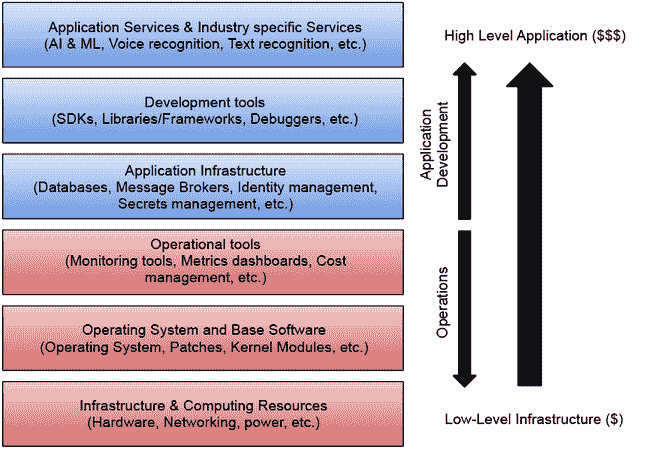

图 1.1 云服务提供商的服务类别

类别越高，你为服务支付的费用就越高，因为这些服务通常为你处理所有底层层和运营成本。例如，假设你在云服务提供商提供的托管服务中配置了一个新的高可用性 PostgreSQL 数据库。图 1.2 显示了一个关系型数据库，如 PostgreSQL 的示例。

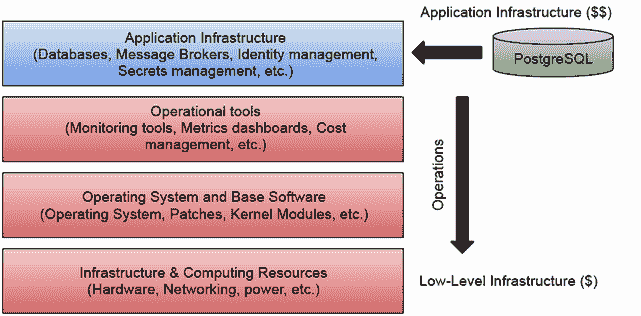

图 1.2 在云中配置 PostgreSQL 数据库实例

在这种情况下，服务成本包括所需数据库软件的成本和管理、数据库运行的操作系统以及运行所需的硬件。因为您可能希望监控并获取数据库在应用承受重负载时的性能指标，云服务提供商也会为服务配置所有可用的监控工具。然后，您需要自己进行计算：是否值得支付云服务提供商为我们做出所有这些决定，或者您能否组建一个拥有足够知识、能够本地运行和操作所有这些软件和硬件的内部团队？有时，金钱可能不是问题；您必须处理公司或行业的政策法规。在这种情况下，您是否可以在云服务提供商处运行工作负载和托管数据？

### 1.1.2 您作为组织的职责

跟踪所有提供的服务、库、框架和工具是一项全职工作。运营和维护公司运行应用所需的广泛软件和硬件需要您拥有合适的团队，最终，如果您在软件交付实践中不是一个大型的成熟组织，或者您通过管理自己的硬件/软件堆栈没有获得任何竞争优势，采用云服务提供商通常是正确的选择。

每个公司和开发人员的职责仍然是查看可用的服务，并选择他们将使用什么以及如何混合匹配这些服务来构建新功能。在组织中发现云架构师（特定云服务提供商的专家或本地专家）定义如何以及使用哪些服务来构建核心应用是很常见的。与云服务提供商的咨询服务合作以获得特定用例和最佳实践的咨询和指导也是很常见的。

云服务提供商可能会建议工具和工作流程来创建应用程序。然而，每个组织都需要经历一个学习曲线，并成熟其应用这些工具以解决特定挑战的实践。聘请云服务专家始终是一个好主意，因为他们从以往的经验中带来知识，为经验较少的团队节省时间。

在本书中，我们将专注于组织特定的平台，而不是那些可以直接购买的通用云平台，例如云服务提供商所提供的那些。我们还希望关注可以在我们组织硬件上本地运行的平台。这对于不能在公共云上运行的更多受监管行业来说非常重要。这迫使我们拥有更广泛的视角，考虑可以应用于云服务提供商领域之外的工具、标准和工作流程。从多个云服务提供商那里消费服务也越来越受欢迎。这可能是由于为一家收购了或被另一家使用不同提供商的公司工作，最终导致多个提供商必须共存，并且应该有一个共享策略。在其他情况下，在更多受监管的行业中，组织被迫在不同的提供商（包括本地工作负载）上运行工作负载，以确保在整个云服务提供商可能崩溃的情况下保持弹性。

我们将要探讨的平台类型将之前提到的客户行为层扩展到包括公司特定的服务、公司特定的标准和开发体验，这些体验允许组织的开发团队为组织和他们的客户构建复杂系统。图 1.3 展示了无论我们是在消费云服务、第三方服务还是内部服务，组织都必须通过在顶部构建专注于解决特定业务挑战的层来混合和匹配这些服务。

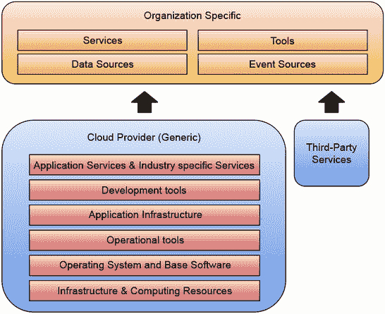

图 1.3 组织特定层

这些额外的层大多数情况下是现有服务、数据和事件源之间的“胶水”，它们结合在一起解决业务面临的特定挑战或为他们的客户提供新功能。依赖于第三方服务提供商提供更多特定于业务的工具是很常见的，例如行业特定的或通用的客户关系管理（CRM）系统，如 Salesforce。

对于客户来说，平台、云服务提供商以及服务运行的位置完全无关紧要。在内部，对于开发团队来说，平台作为开发团队完成工作的推动者。平台不是静态的，它们的主要目标是帮助组织改进并擅长持续向客户提供高质量的软件。

无论您的公司在哪个行业运营，无论您是否选择使用云服务提供商，您的公司用于向客户交付新功能的工具和工作流程的组合都可以描述为您的平台。从技术角度来看，平台全部关于系统集成、最佳实践和可组合服务，我们可以将它们组合起来构建更复杂的系统。本书将探讨使平台成功的标准实践、工具和行为，以及您如何构建云原生平台，无论是在一个或多个云服务提供商上运行还是在本地运行。

我们将使用云服务提供商作为参考，比较它们提供的服务和工具，并学习如何通过使用开源工具，在多云服务和本地环境中实现类似的结果。但在探讨具体工具之前，了解我们可以从云服务提供商那里获得什么样的体验是至关重要的。

### 1.1.3 与云平台合作

所有云服务提供商的共同特点是它们都采用以 API 为首要的方法来提供服务。这意味着要访问它们提供的任何服务，用户都将有一个 API 可供请求和交互。这些 API 暴露了所有服务功能，例如可以创建哪些资源，使用哪些配置参数，资源在哪里（在世界的哪个地区）运行等。这些 API 的另一个重要方面是它们要求一个团队拥有这些 API 定义；这意味着一个团队将负责确定这些 API 将如何被使用，以及它们将如何演变，并明确定义这些 API 不负责的内容。

可以通过查看它们的 API 来分析每个云服务提供商，因为通常每个提供的服务都会有一个 API。常见的情况是，服务仅在测试阶段通过 API 提供给早期用户进行实验、测试和提供反馈，直到服务正式发布。虽然云服务提供商提供的所有服务的结构、格式和风格通常相似，但云服务提供商之间没有标准来定义这些服务应该如何公开以及它们需要支持哪些功能。

手动针对云服务提供商的服务和 API 构建复杂请求是复杂且容易出错的。云服务提供商通常通过提供 SDK（软件开发工具包）来简化开发者的生活，这些 SDK 消耗了用不同编程语言实现的 API 服务。这意味着开发者可以通过在应用程序中包含一个依赖项（库、云服务提供商 SDK）来程序化地连接和使用云服务提供商的服务。虽然这很方便，但它引入了应用程序代码和云服务提供商之间的一些强烈依赖，有时甚至需要我们发布应用程序代码来升级这些依赖。

与 API 一样，SDKs 没有标准，每个 SDK 都严重依赖于编程语言生态系统中的最佳实践和工具。有些情况下，SDKs/客户端与您所使用的编程语言中流行的框架或工具不兼容。SDKs/客户端可能出错的情况包括与云服务提供商提供的版本不匹配的数据库驱动程序，或者云服务提供商尚未支持的编程语言和生态系统。在这种情况下，直接访问 API 是可能的，但很困难，通常不鼓励这样做，因为您的团队将维护连接到云服务提供商服务的所有代码。

云服务提供商还提供 CLIs（命令行界面），这些界面是操作团队和一些开发者工作流程的工具。CLIs 是您可以从操作系统终端下载、安装和使用的二进制文件。CLIs 直接与云服务提供商的 API 交互，但不需要您知道如何创建新应用程序来与 SDKs 交互的服务。CLIs 对于持续集成和自动化管道特别有用，在这些管道中，可能需要按需创建资源，例如运行我们的集成测试。

图 1.4 展示了应用程序和自动化，例如 CI/CD 管道和集成测试，它们消耗相同的 API，但使用由云服务提供商设计的不同工具来简化这些场景。该图还显示了仪表板组件，通常在云服务提供商内部运行，它提供了对所有创建的服务和资源的可视化访问。

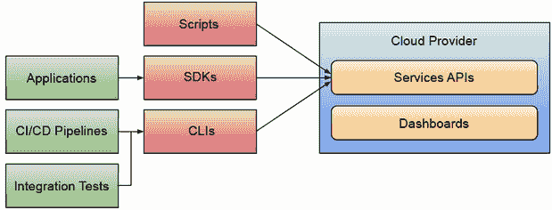

图 1.4 云服务提供商的 SDKs、CLIs 和仪表板客户端

最后，由于提供的服务数量和服务之间的相互连接，云服务提供商提供仪表板和用户界面，以便访问和交互所有提供的服务。这些仪表板还提供报告、计费和其他难以使用 CLIs 或直接通过 API 可视化的功能。通过使用这些仪表板，用户可以访问大多数由服务提供的标准功能，并实时查看云服务提供商内部正在创建的内容。

正如之前提到的，仪表板、CLIs 和 SDKs 需要您的团队了解许多云服务提供商特定的流程、工具和术语。由于每个云服务提供商提供的服务数量，难怪找到能够覆盖多个服务提供商的专家具有挑战性。

由于这是一本以 Kubernetes 为重点的书，我想展示云服务提供商创建 Kubernetes 集群所提供的服务体验，这展示了 Google Cloud Platform 提供的仪表板、CLI 和 API。一些云服务提供商提供的体验比其他提供商更好，但总体而言，您应该能够使用所有主要的服务提供商实现相同的效果。

### 1.1.4 GCP 仪表板、CLIs 和 API

查看图 1.5 中的 Google Kubernetes Engine 仪表板以创建新的 Kubernetes 集群。一旦你点击创建新集群，就会弹出一个表单，要求你填写一些必填字段，例如集群的名称。

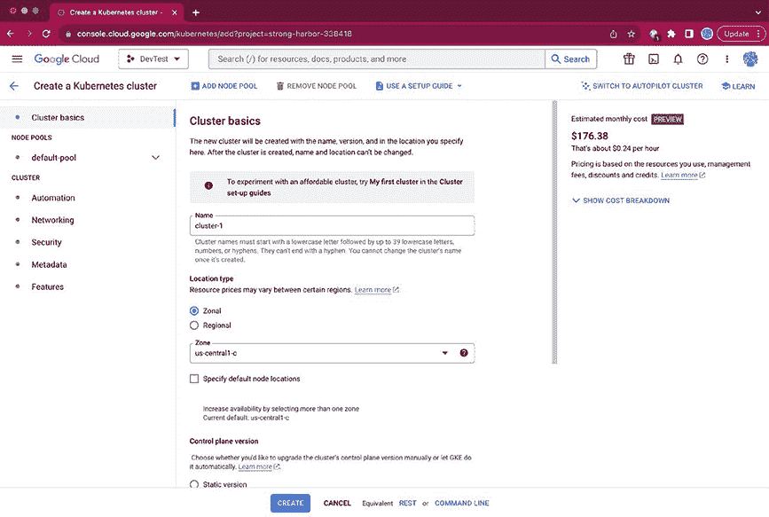

图 1.5 Google Kubernetes Engine 创建表单

云服务提供商在提供合理的默认值方面做得非常出色，以避免在创建所需资源之前让你填写 200 个参数。一旦你填写了所有必填字段，表单就提供了一个快速启动配置过程的方法，只需点击底部的创建按钮即可。在这种情况下，Google Cloud Platform 为你提供了你配置的资源每小时的预估成本，这突出了为技术团队提供功能和提供全面服务之间的差异，全面服务涵盖了技术团队的需求，并阐明了这些决策如何影响整个业务。你可以开始调整参数以查看成本如何变化（通常，它会增加）。

图 1.6 通过仪表板、REST 或使用命令行界面（CLI）工具创建

如图 1.6 所示，在创建按钮旁边，你可以看到 REST 选项。这里的云服务提供商通过构建 REST 请求到它们的 API，帮助你创建可以配置的资源，使用表单即可完成。如果你不想花费数小时查看它们的 API 文档来找到负载的形状和创建请求所需的属性，这将非常方便；参见图 1.7。

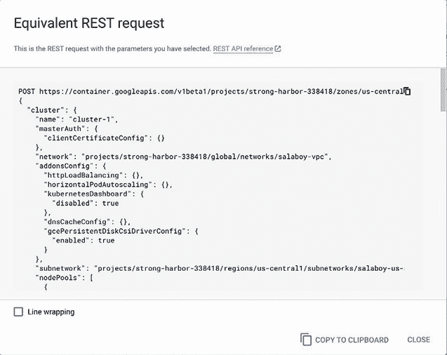

图 1.7 使用 REST 请求通过 Kubernetes 集群创建

最后，CLI 命令选项，使用云服务提供商的 CLI，在本例中是`gcloud`，再次被构建以包含 CLI 命令所需的全部参数，这些参数基于你在表单中配置的内容，如图 1.8 所示。

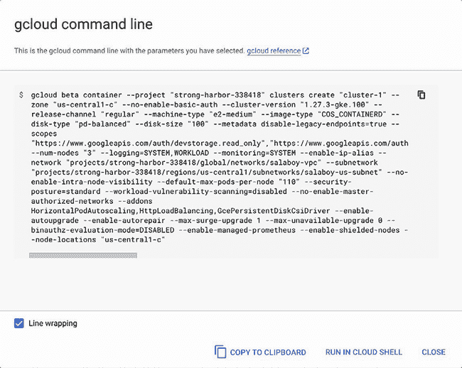

图 1.8 使用`gcloud` CLI 通过 Kubernetes 集群创建

注意图 1.8 中的水平滚动；这个命令可以变得极其复杂。Google Cloud Platform 的用户体验团队已经做了出色的工作，通过依靠合理的默认值来简化团队设置所有这些参数的方式。在这些方法之间，预期的行为没有差异，但您需要考虑的是，当您使用云服务提供商的仪表板时，您的账户凭证正在当前会话中使用。如果您在云服务提供商的网络之外构建请求或使用 CLI，您必须在发出请求或执行创建资源（s）的命令之前先与云服务提供商进行身份验证。重要的是要注意，这些交互将因云服务提供商而异。您不能期望 AWS 或 Azure 中的命令、仪表板交互或安全机制如何验证 CLI 或 REST 请求的方式相似。

### 1.1.5 为什么云服务提供商能工作？

虽然可以争论仪表板、CLI、API 和 SDK 是我们将从云服务提供商那里消费的主要工件，但最大的问题是：我们将如何结合这些工具来交付软件？假设您分析为什么全球的组织信任 AWS、Google Cloud Platform 和 Microsoft Azure。您可能会发现，通过采用 API 优先的方法并提供仪表板、CLI、SDK 和众多服务，这些平台为团队提供了三个主要特性，这些特性定义了当今的平台（图 1.9）：

+   *APIs (合约):* 无论您使用哪种工具，平台都必须公开一组 API，使团队能够消费或配置他们完成工作所需的资源。这些 API 是平台工程团队负责维护和发展的责任。

+   *黄金路径到生产环境:* 平台将团队将更改推送到生产环境所需的流程编码和自动化，这些生产环境允许真实客户/用户访问。

+   *可见性:* 在任何时候，通过查看云服务提供商的仪表板，组织可以监控正在使用的资源，每个服务的成本，处理事件，并全面了解组织如何交付软件。

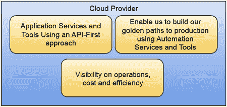

图 1.9 云服务提供商平台的优势

这些关键特性是通过一种具有竞争力的按需付费模式提供的，该模式高度依赖需求（流量），在全球范围内（并非所有服务），允许组织将所有运营和基础设施成本外部化。

当云服务提供商不断向更高层次发展（提供高级服务，而不仅仅是提供硬件和应用基础设施，如数据库），您的团队仍然需要学习和整合这些服务来解决他们的业务挑战。

这就是为什么 Kubernetes 和 CNCF 景观（云原生计算基金会，[`www.cncf.io/`](https://www.cncf.io/))成为探索如何构建云服务提供商无关的平台的关键领域，这些平台允许我们从众多充满活力的项目中挑选和选择。让我们继续探讨下一个话题。

## 1.2 基于 Kubernetes 构建的平台

我们简要讨论了平台是什么以及云服务提供商如何推动前进，以定义这些平台可以为负责交付软件的组织和开发团队做什么。但这与 Kubernetes 如何对应？Kubernetes 不是一个平台吗？

Kubernetes 被设计成我们云原生应用的声明式系统。Kubernetes 定义了一系列构建块，使我们能够运行和部署我们的工作负载。如今，每个主要的云服务提供商都提供 Kubernetes 管理的服务，这使我们能够以标准化的方式（容器）打包和部署工作负载到云服务提供商。因为 Kubernetes 自带工具和生态系统（CNCF 景观，[`landscape.cncf.io/`](https://landscape.cncf.io/))），你可以创建云无关的工作流程来构建、运行和监控你的应用程序。但学习 Kubernetes 只是起点，因为 Kubernetes 提供的构建块非常底层，旨在组合构建工具和系统，以解决更具体的场景。将 Kubernetes 提供的这些底层构建块结合起来，构建更复杂的工具来解决更具体的问题，是一个自然的进化步骤。

虽然 Kubernetes 为我们提供了 API（Kubernetes API）、CLI（kubectl）和仪表板（Kubernetes 仪表板，[`kubernetes.io/docs/tasks/access-application-cluster/web-ui-dashboard/`](https://kubernetes.io/docs/tasks/access-application-cluster/web-ui-dashboard/))），但 Kubernetes 不是一个平台。Kubernetes 是一个元平台或构建平台的平台，因为它提供了构建具体平台所需的所有构建块，这些平台将解决特定领域的挑战。

图 1.10 展示了 Kubernetes 工具和组件如何映射到我们讨论的平台和云服务提供商。

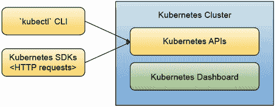

图 1.10 Kubernetes 为我们提供了 CLI、SDK 和仪表板，它是平台吗？

Kubernetes 可以扩展，这也是为什么这本书将探讨使用 Kubernetes API、工具或内部机制来解决通用挑战（如持续集成、持续交付、云资源配置、监控和可观察性、开发者体验等）的具体项目。

### 1.2.1 Kubernetes 采用之旅

无论如何，平台团队选择哪些工具，我们都必须抽象出所有复杂性以及我们编写的粘合代码，以便使这些工具协同工作。请记住，应用程序开发团队、测试团队和运维团队等，都有不同的优先级和关注点。作为 Kubernetes 采用之旅的一部分，我们必须意识到，并非所有使用这些工具的团队都是 Kubernetes 的专家。

使用您自定义的扩展来扩展 Kubernetes 是使其适应您组织特定挑战的一种方法。请记住，无论您在您的 Kubernetes 集群中编写或安装哪些工具，运维团队都需要在您的生产环境中运行它们，并保持其大规模运行。您编写的每个新工具或扩展都将需要培训消费者团队了解这些工具的工作原理以及它们是为哪些场景设计的。很容易陷入这样的情况：您选择了 10 个不同的工具需要集成，并且需要编写粘合代码。平台团队通常会评估编写粘合代码、为他们的用例重写更定制化的解决方案或扩展现有工具之间的权衡。我强烈建议您熟悉 CNCF 生态系统中的工具([`landscape.cncf.io`](https://landscape.cncf.io))，以避免走向每个工具都是为您的组织量身定制的方向，这意味着您最终需要长期内部维护所有这些工具。

抽象复杂性是构建平台的关键部分。与您的团队明确说明平台能为他们做什么的清晰合同对于成功的平台工程举措至关重要。这些合同作为 API 公开，团队可以通过编程方式、使用仪表板或通过自动化与之交互。

图 1.11 展示了典型的 Kubernetes 采用之旅，旨在实现平台工程。旅程从采用 Kubernetes 作为运行工作负载的目标平台开始，然后研究和选择工具，通常来自 CNCF 生态系统。当初始工具被选中时，您的平台开始成形，并且需要一些投资来配置这些工具，并使它们为您的团队工作。最后，所有这些配置和选定的工具都可以隐藏在更友好的平台 API 后面，使用户能够专注于他们的工作流程，而不是试图了解构成平台的工具和粘合代码的每个细节。

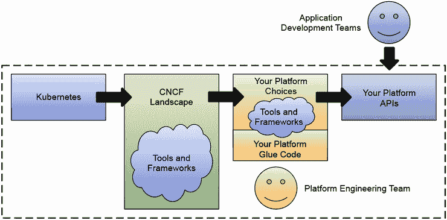

图 1.11 Kubernetes 平台之旅

在这段旅程中，我们可以将平台定义为如何编码提供给我们开发团队所需的所有工作流程所需的知识。操作知识以及关于实现这些工作流程所使用的工具的决定被封装在作为平台 API 的合同中。这些 API 可以使用 Kubernetes API 提供声明式方法，但这不是必需的。一些平台隐藏了平台使用 Kubernetes 的信息，这也可以减少与平台交互的团队的认知负荷。

尽管我已经尝试从非常高的层面来解释什么是平台，但我更倾向于将所有正式的定义委托给负责定义和更新术语的云原生空间的工作组。我强烈建议您查看 CNCF 关于平台的白皮书中的 App Delivery TAG - 平台工作组（[`tag-app-delivery.cncf.io/whitepapers/platforms/`](https://tag-app-delivery.cncf.io/whitepapers/platforms/)），该工作组承担了尝试定义平台是什么的工作。

他们目前的定义，在撰写本书时，如下所示：“云原生计算平台是一组集成能力，这些能力是根据平台用户的需要定义和展示的。它是一个横切层，确保为广泛的应用程序和用例获取和集成典型能力和服务的持续体验。一个好的平台为使用和管理其能力和服务提供一致的用户体验，例如网络门户、项目模板和自助服务 API。”

在这本书中，我们将通过查看可用的云原生工具来开始构建示例平台的旅程，看看它们如何提供不同的平台能力。但我们从哪里找到这些工具？这些工具是否可以协同工作？我们如何在不同选择之间进行选择？让我们快速看一下 CNCF 景观。

### 1.2.2 CNCF 景观拼图

跟踪云服务提供商的服务是一项全职工作，每个云服务提供商都会举办年度会议和较小规模的活动来宣布新事物和亮点。在 Kubernetes 和云原生空间中，您也可以期待同样的情况。CNCF 景观持续扩展和演变。正如您在图 1.12 中可以看到的，景观非常庞大，一开始看起来很难阅读。

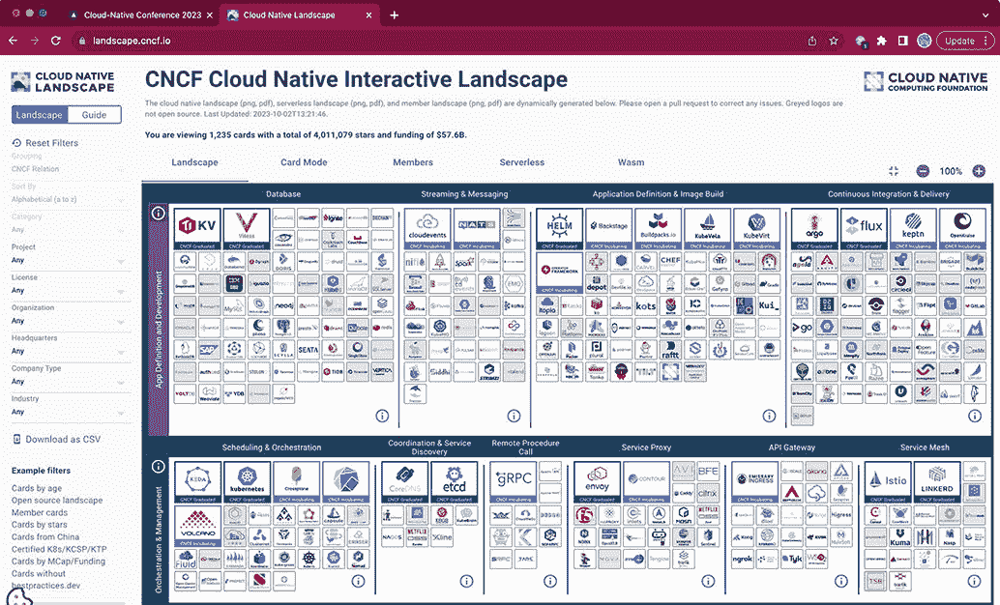

图 1.12 CNCF 景观（来源：https://landscape.cncf.io）

与云服务提供商提供的服务相比，一个显著的不同点是 CNCF 中每个项目都必须遵循的公开和社区驱动的成熟度模型，以获得毕业状态。每个项目的成熟度之旅独立于任何云服务提供商，作为个人或组织，您都可以影响项目的发展方向或其达到该方向的速度。

虽然云服务提供商已经定义了云的形状，但现在大多数都参与了 CNCF 项目，推动这些开放倡议的成功。他们正在开发可以在云服务提供商之间使用的工具，消除障碍，并在开放环境中而不是在每一个云服务提供商的门后进行创新。图 1.13 显示了 Kubernetes 如何使云原生创新生态系统在云服务提供商之外繁荣发展。云服务提供商没有停止提供新的、更专业的服务，但在过去五年中，我们看到了云服务提供商和软件供应商之间合作改进的转向，以开发新的工具和开放创新。

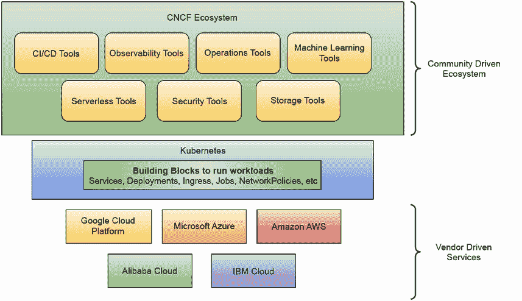

图 1.13 Kubernetes 使多云云原生生态系统得以实现

大多数由 CNCF 托管的项目的一个共同特点是它们都使用 Kubernetes，扩展其功能并解决更接近开发团队的挑战。CNCF 已经达到一个阶段，越来越多的工具被创建出来以简化开发工具和工作流程。有趣的是，这些工具并不仅仅关注开发者。它们还使运维团队和系统集成商能够将项目粘合在一起，并定义原生于 Kubernetes 的新开发者体验。开发团队无需担心日常工作流程所需的工具和集成。CNCF 生态系统中参与社区的成熟度提高以及推动简化开发团队与所有这些工具交互的方式，催生了关于平台工程的讨论。下一节将探讨这些讨论，为什么你不能购买一个平台，以及我们将在本书的其余部分如何探索这个庞大的生态系统。

## 1.3 平台工程

与云服务提供商拥有内部团队定义将提供哪些新服务、这些服务将如何扩展以及需要向客户公开哪些工具和 API 一样，很明显，组织可以从拥有自己的内部平台工程团队中受益。这些团队通过决定最佳解决软件交付问题和加快流程的工具选择，帮助使开发团队能够启用。

一个常见的趋势是拥有一个专门的平台工程团队来定义这些 API 并做出平台级决策。平台团队与开发团队、运维团队和云服务提供商专家合作，实施满足工作流程应用团队需求的技术。除了拥有专门的平台工程团队外，书籍《团队拓扑学》（[`teamtopologies.com/`](https://teamtopologies.com/））所倡导的关键文化变革是将平台本身视为一个内部产品，并将你的开发团队视为客户。这并不新鲜，但它促使平台团队在利用平台工具的同时，关注这些内部开发团队的满意度。

图 1.14 展示了应用开发团队（App Dev Teams）如何专注于使用他们偏好的工具开发新功能，同时平台团队创建黄金路径（到生产），这些团队产生的所有工作都用于验证功能并将这些更改交付给我们的组织客户/最终用户。

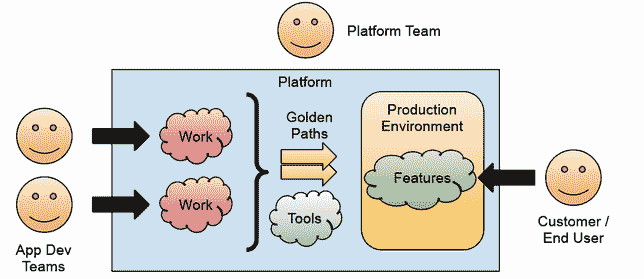

图 1.14 平台团队安全地将开发者的工作带到生产中。

平台团队与开发团队之间的关系创造了协同效应，专注于提高整个组织的软件交付实践。通过创建黄金路径，平台不仅关注日常开发任务，还旨在自动化开发团队所做的更改如何到达我们组织的最终客户/消费者。

通过在整个过程中增加可见性，你可以帮助整个组织理解和看到团队如何产生新功能，以及这些功能何时将可供我们的最终用户使用。这可以是非常有价值的商业决策、市场营销以及一般规划。

### 1.3.1 为什么我不能只是购买一个平台？

不幸的是，你无法购买现成的平台来解决你组织的所有需求。正如我们讨论的，你可以购买一个或多个云服务提供商的服务，但你的内部团队需要弄清楚哪些服务以及如何组合它们来解决特定问题。确定哪些工具和服务符合你组织的需要和合规要求，以及如何将这些决策封装在团队可以通过自助方式使用的接口后面，通常是一件你无法购买的事情。

有一些工具是针对这种情况设计的，旨在通过实施一系列开箱即用的流程或提供一套他们支持的非常具有观点的工具来减少平台团队的工作量。这类工具中，同时大量使用和扩展 Kubernetes 的包括 Red Hat OpenShift ([`www.redhat.com/en/technologies/cloud-computing/openshift`](https://www.redhat.com/en/technologies/cloud-computing/openshift)) 和 VMware Tanzu ([`tanzu.vmware.com/tanzu`](https://tanzu.vmware.com/tanzu))。这些工具对首席技术官（CTO）和架构师来说非常吸引人，因为它们涵盖了他们需要解决方案的大部分主题，如 CI/CD、运维、开发者工具和框架。根据我的经验，虽然这些工具有助于许多场景，但平台团队在选择工具时需要灵活性，以适应他们现有的实践。最终，如果你购买了这些工具，你的团队也需要花时间学习它们，这就是为什么像 Red Hat OpenShift 和 VMware Tanzu 这样的工具会附带咨询服务，这也是需要考虑在内的额外成本。对于中等和大型组织，采用和适应这些具有观点的现成工具可能需要改变已经为团队所熟知的明确的工作流程和实践。对于较小且不够成熟的组织，这些工具可以通过减少团队在启动新项目时面临的选择数量来节省大量时间，但这些工具和服务的成本可能对于一个年轻组织来说太高。

图 1.15 展示了平台团队选择不同工具时旅程的变化。这些 Kubernetes 发行版（OpenShift、Tanzu 等）可以限制平台团队可以做出的选择数量，但它们也可以节省时间，并附带培训和服务等支持，你的团队可以依赖这些服务。

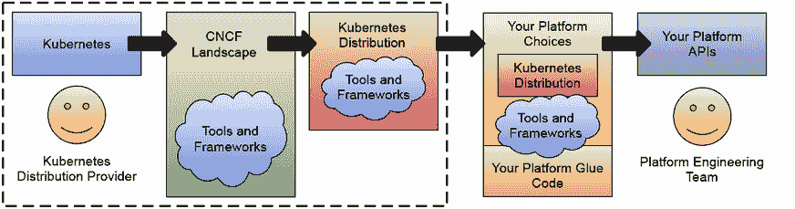

图 1.15 在 Kubernetes 发行版上构建平台

无论你是否已经是这些工具的客户，你仍然需要负责在这些工具之上构建平台。如果你有 Red Hat OpenShift 或 VMware Tanzu 可供你的团队使用，我强烈建议你熟悉他们支持的工具及其设计选择和决策。与你的工具保持一致并咨询其架构师可能会帮助你找到在工具之上构建层的捷径。

*注意事项：* 注意，这些工具可以被视为 Kubernetes 发行版。与 Linux 发行版相同的发行版意味着我预计会有越来越多的发行版出现，解决不同的挑战和用例。例如，用于物联网和边缘情况的 K0s 和 MicroK8s 等工具。虽然你可以采用这些发行版中的任何一个，但请确保它们与你的组织目标一致。

因为我想让这本书尽可能实用，所以我们将查看一个简单的应用程序，我们将在下一节中使用它来继续我们的旅程。我们不会为通用用例构建一个通用的平台。我们将构建一个示例平台，展示上一节中涵盖的概念。拥有一个你可以运行、实验和更改的具体示例应该有助于你将讨论的主题映射到你的日常挑战中。下一节中介绍的应用程序突出了你在大多数商业领域中创建、构建和维护分布式应用程序时将面临的挑战。因此，我们将构建的示例平台应该映射到你业务领域中的挑战。

## 1.4 需要一个行走骨架

在 Kubernetes 生态系统中，通常需要集成至少 10 个或更多的项目或框架来交付一个简单的 PoC（概念验证）。这项工作可能包括将项目构建到可以在 Kubernetes 内部运行的容器中，以及将流量路由到每个服务提供的 REST 端点。如果你想尝试新项目以查看它们是否适合你的生态系统，可以构建一个 PoC 来验证你对这个新项目/框架的工作原理以及它将如何为你和你的团队节省时间的理解。

对于这本书，我创建了一个简单的“行走骨架”。这个云原生应用不仅仅是一个简单的 PoC（Proof of Concept），它还允许你探索如何应用不同的架构模式。它还让你测试如何将不同的工具和框架集成，而无需为实验改变你的项目。我更喜欢使用“行走骨架”这个术语，而不是“概念验证”或“演示应用”，因为“行走骨架”这个术语更接近于本节中引入的应用程序的意图。

这个行走骨架的主要目的是突出从架构角度解决非常具体的挑战，你的应用程序将需要的需求，以及交付实践的角度。你应该能够将样本云原生应用程序中解决这些挑战的方式映射到你的特定领域。挑战可能不会总是相同，但我希望突出每个建议解决方案背后的原则以及引导你决策的方法。

使用这个行走骨架，你还可以确定你需要的最小可行产品，并快速将其部署到生产环境中，在那里你可以对其进行改进。通过将行走骨架带入生产环境，你可以获得关于你需要为其他服务以及从基础设施角度所需的有价值见解。它还可以帮助你的团队了解与这些项目合作需要什么，以及事情可能出错的地方和方式。

构建步行骨架所使用的技术栈并不重要。更重要的是理解各个部分是如何组合在一起的，以及哪些工具和实践可以使得每个服务（或一组服务）背后的团队能够安全且高效地演进。

### 1.4.1 构建会议应用

在本书的整个过程中，你将使用一个会议应用。这个会议应用可以部署在不同的环境中，以服务于不同的活动。此应用依赖于容器、Kubernetes 以及将在任何主要云提供商和本地 Kubernetes 安装上工作的工具。

图 1.16 展示了应用主页面看起来是什么样子。

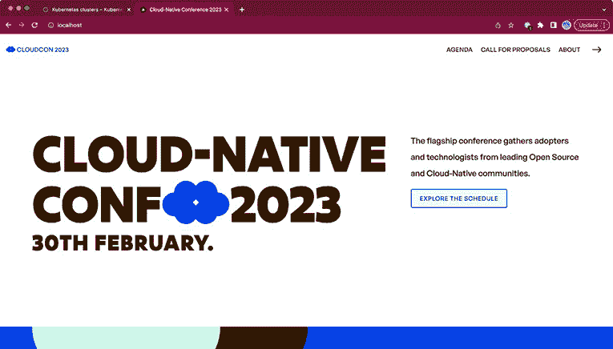

图 1.16 会议应用主页

会议应用允许用户管理会议活动，并提供了一个基本着陆页、一个议程页，其中将列出所有批准的演讲，以及一个提案征集表单，潜在演讲者可以在此提交他们的演讲提案。应用还允许会议组织者执行管理任务，例如审查提交的提案以及批准或拒绝它们（见图 1.17）。

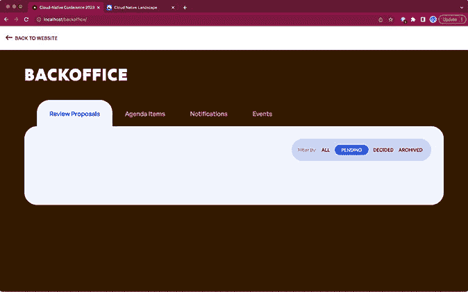

图 1.17 会议应用后台页面

此应用由一组具有不同职责的服务组成。图 1.18 展示了你所控制的应用的主要组件——换句话说，就是你和你团队将更改和交付的服务。

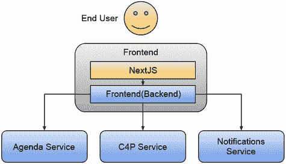

图 1.18 会议应用服务。最终用户与前端交互，前端将请求路由到所有后端服务。

团队创建了这些服务来实现一个具有展示业务价值的功能的基本步行骨架。以下是每个服务的简要描述：

+   *前端:* 该服务是用户访问应用的主要入口点。因此，该服务托管了一个 NextJS 应用（HTML、JavaScript 和 CSS 文件），客户端浏览器将下载这些文件。客户端应用与后端服务交互，该服务接受来自浏览器的请求并将每个请求路由到一个或多个后端服务。

+   *议程服务:* 该服务负责列出所有获得会议批准的演讲。在会议期间，该服务需要高度可用，因为与会者将在一天中多次访问此服务以在会议之间移动。

+   *提案征集 (C4P):* 该服务包含处理会议组织期间提案征集用例（简称 C4P）的逻辑。此功能允许潜在演讲者提交演讲提案，会议组织者将对其进行审查并决定哪些提案包含在会议议程中。

+   *通知服务:* 该服务使会议组织者能够向与会者和演讲者发送通知。

图 1.19 显示了团队选择的提案征集流程，用于构建行走骨架并验证他们对会议应用程序工作方式的假设。通过端到端实现此用例，团队可以验证其选择的技术堆栈和架构假设。

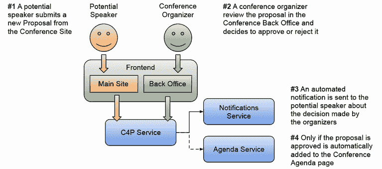

图 1.19 提案征集用例

在实现提案征集用例的基本功能之后，团队可以决定接下来实现哪个用例。会议组织者是否需要管理赞助商？演讲者是否需要一个专门的个人资料页面？添加新功能或服务应该是直接的，因为基础构建块已经就位。

当查看这些用例的实现方式时，你还需要考虑当新的用例将被实施或需要引入变更时，如何跨团队进行协调。为了提高协作效率，你需要有可见性，并且需要了解应用程序是如何工作的。

你还需要考虑这个云原生应用程序的运营方面。你可以想象，在一段时间内，应用程序将打开提案征集请求，供潜在演讲者提交提案，然后接近会议日期时，打开参会者注册页面等。

在整本书中，我将鼓励你通过添加新服务和实现新用例进行实验。在第二章中，当你将应用程序部署到 Kubernetes 集群时，你将检查这些服务的配置方式，不同服务之间的数据流，以及如何扩展服务。

通过使用一个虚构的应用程序进行实验，你可以自由地更改每个服务的内部结构，使用不同的工具，比较结果，甚至可以并行尝试每个服务的不同版本。每个服务都提供了部署这些服务到你的环境所需的所有资源。在第三章和第四章中，我们将更深入地探讨每个服务，了解如何构建和部署每个服务，以便团队可以更改当前的行为并创建和部署新的版本。

在部署这个云原生会议应用程序之前，重要的是要提到与将这些功能捆绑在一个单体应用程序中的主要区别。

但如果会议应用程序是使用单体方法创建的呢？让我们简要讨论一下主要会有哪些区别。

### 1.4.2 单体与分布式服务集之间的差异

理解单一单体应用程序与完全分布式服务集之间的区别对于理解为什么增加的复杂性是值得努力的关键。如果你仍在使用你想要拆分以采用分布式方法的单体应用程序，本节将突出你将遇到的主要区别。

图 1.20 显示了实现之前讨论过的相同用例的单体应用，但在这种情况下，不同团队在开发不同功能时将共享相同的代码库。在开发单体应用时，没有明确要求内部服务之间有强接口。将不同功能的逻辑分离到封装良好的模块中是可选的。接口的缺乏和功能重叠迫使对应用程序进行更改的团队拥有复杂的协调策略，以确保功能不会冲突，并且更改可以合并到代码库中。

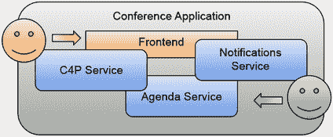

图 1.20 在单体应用中，实现不同用例的所有逻辑都捆绑在一起。这促使不同团队在相同的代码库上工作，并需要他们拥有复杂的协调实践来避免冲突的更改。

从功能上讲，它们是相同的，你可以做同样数量的用例，但单体应用已经显示出一些你可能已经在单体应用中遇到的缺点。以下要点突出了我们将在这本书中使用的云原生应用的优点以及与平行宇宙中的替代单体实现相关的某些缺点：

+   *现在服务可以独立演进，团队被赋予了加快速度的权力，并且在代码库级别上没有瓶颈：* 在单体应用中，不同团队共同工作有一个单一源代码仓库，项目有一个单一的持续集成管道，这很慢，团队使用特性分支，这会导致复杂合并时出现问题。

+   *现在应用程序可以根据不同场景进行不同的扩展：* 从可扩展性的角度来看，每个服务可以根据其经历的负载级别进行扩展。在单体应用中，如果只需要扩展单个功能，运维团队只能创建整个应用程序的新实例。对如何扩展不同功能进行精细控制可以成为您用例的一个显著差异化因素，但您必须做好尽职调查。

+   *云原生版本要复杂得多，因为它是一个分布式系统：* 它更好地利用了云基础设施的灵活性和特性，允许运维团队使用工具来管理这种复杂性以及日常运营。在构建单体应用时，创建内部机制来操作大型应用要普遍得多。在云原生环境中，云提供商和开源项目提供了大量工具，可用于操作和监控云原生应用。

+   *欢迎多语言：* 每个服务都可以使用不同的编程语言或不同的框架来构建。在单体应用中，应用开发者被束缚在旧版本的库中，因为更改或升级库通常涉及大量的重构，整个应用程序都需要经过测试以确保应用程序不会崩溃。在云原生方法中，服务没有被强制使用单一的技术栈。这允许团队在选择工具时更加自主，在某些情况下可以加快交付时间。

+   *单体应用的全有或全无：* 如果单体应用程序崩溃，整个应用程序都会崩溃，用户将无法访问任何内容。在云原生版本中，即使服务中断，用户仍然可以访问应用程序。示例中的“行走骨架”展示了如何通过采用流行的工具来支持降级服务。通过使用 Kubernetes，它被设计用来监控您的服务并在服务出现异常时采取行动，平台将尝试自我修复您的应用程序。

+   *每次会议活动都需要单体应用的不同版本：* 在处理不同事件时，每次会议都需要一个与其它事件略有不同的单体应用版本。这导致了代码库的分歧和整个项目的重复。大多数为会议所做的更改在活动结束后都丢失了。在云原生方法中，我们通过拥有可以互换的细粒度服务来促进可重用性，避免了整个应用程序的重复。

虽然单体应用程序在操作和开发方面比云原生应用程序简单得多，但本书的其余部分将专注于理解和减少构建分布式应用程序的复杂性。我们将通过采用正确的工具和实践来实现这一点，这将使你的团队能够更加独立和高效，同时促进应用程序的弹性和健壮性。

如果你目前正在使用单体应用程序，我希望这本书能帮助你比较不同的方法，并介绍构建分布式应用程序所需的工具和实践。

### 1.4.3 我们的“行走骨架”和构建平台

现在我们有一个简单的应用程序，我们的客户将会使用，我们可以专注于理解我们的团队需要所有工具来持续改进这些服务。本书中我们将涵盖的平台是那些为特定领域目的而构建的组织，而不是通用的。通过为特定场景创建我们的“行走骨架”，我们可以模拟一个优化工具和工作流程的平台，以改善这些团队软件交付的方式。我们的“行走骨架”不是一个简单的“Hello World”应用程序，因此它允许进行更多实验，编写更复杂的功能，并使用工具使应用程序更加健壮。

现在，我们将开始一段云原生之旅。首先，我们将探讨分布式应用如何在 Kubernetes 上运行，Kubernetes 提供了什么，以及其挑战。紧接着，我们将开始探讨扩展基本 Kubernetes 功能的工具，以帮助我们构建、部署和运行我们的云原生应用。

在第六章中，在评估构建和交付分布式应用的一些挑战之后，我们将构建我们的*平台原型*，这将帮助团队在安全的环境中创建新功能，与现有应用一起工作，而不会与其他团队冲突。一旦我们有了平台原型，我们将构建和提供更高级别的平台功能，以使我们的团队能够更高效地工作，并减少他们理解 Kubernetes 以及本书中将要讨论的所有工具的复杂性。

最后，为了结束这本书，我们将探讨如何衡量我们所构建的平台的好坏。就像任何软件一样，我们需要对其进行衡量，以确保我们引入的新工具或更改使事情变得更好，而不是更糟。

这段旅程将迫使我们做出艰难的决定和选择，这些决定和选择将对我们平台工程实践至关重要。以下列表概述了这段旅程中的主要里程碑，而不涉及每个章节中涵盖的具体工具的细节。

+   *第二章：云原生应用挑战*：在 Kubernetes 集群中使会议应用运行起来后，我们将分析你在 Kubernetes 上开发和运行云原生应用时将面临的主要和最常见的挑战。在本章中，你将从运行时角度检查应用，并尝试以不同的方式破坏它，以了解事情出错时它的行为。

+   *第三章：服务管道：构建云原生应用*：一旦应用运行起来，你和你的团队将更改应用的服务以添加新功能或修复错误。本章涵盖了构建这些应用服务所需的内容，包括使用服务管道创建部署这些新版本到生产环境所需的工件发布的最新更改。

+   *第四章：环境管道：部署云原生应用*：如果我们解决了如何打包和发布服务的新版本，那么我们需要有一个明确的策略来将这些新版本推广到不同的环境，以便在面临真实客户之前进行测试和验证。本章涵盖了环境管道的概念，以及在云原生社区中流行的 GitOps 趋势，用于在不同环境中配置和部署应用。

+   *第五章：多云（应用）基础设施：* 您的应用程序不能孤立运行。应用程序服务需要应用程序基础设施组件，如数据库、消息代理、身份服务等，才能工作。本章重点介绍如何使用多云和 Kubernetes 原生方法来配置我们应用程序服务所需的组件。

+   *第六章：在 Kubernetes 上构建平台：* 一旦我们了解了应用程序的运行方式、构建和部署方式以及它与云基础设施的连接方式，我们将把注意力集中在从对应用程序进行更改的团队中抽象出我们使用所有工具引入的复杂性。我们不希望我们的开发团队在设置云提供商账户、配置构建管道将运行的服务器或担心他们的环境在哪里运行时分心。欢迎加入平台工程团队！

+   *第七章：平台功能 I：共享应用程序关注点：* 我们如何减少应用程序和运维团队之间的摩擦和依赖？我们如何进一步解耦我们应用程序的逻辑与这些应用程序需要运行的组件？本章介绍了一系列平台功能，使应用程序开发者能够专注于编写代码。平台团队可以专注于决定如何连接应用程序所需的所有组件，然后向开发者提供简单且标准化的 API。

+   *第八章：平台功能 II：使团队能够进行实验：* 现在我们有一个平台，可以为我们团队提供工作环境，那么平台还能为应用程序开发团队做些什么呢？如果您允许您的团队同时运行多个版本的应用程序服务，新功能或修复可以逐步推出。有空间进行实验可以让组织更快地发现问题，并减少每次发布相关的压力。本章介绍如何为您的云原生应用程序实施不同的发布策略。

+   *第九章：衡量您的平台：* 平台的价值在于它为组织带来的改进。我们需要衡量平台性能，以了解其表现如何，因为我们应采用持续改进的方法来确保我们使用的工具正在帮助我们的团队更快、更有效地交付。本章重点介绍使用 DORA 指标来了解组织交付软件的情况以及平台变更如何提高我们的交付管道吞吐量。

现在您已经知道了即将发生的事情，让我们部署我们的云原生会议应用程序。

## 摘要

+   （云）平台为团队提供了一套服务，以构建他们特定的应用程序。

+   平台通常提供三个主要功能：API、仪表板和 SDK，供不同团队使用，以适应他们的工作流程。

+   云平台提供按需付费的模式来消费硬件和软件。你越往上层走，服务费用就越高。

+   Kubernetes 提供了基本的构建块，以便以独立于底层云提供商的方式构建平台，甚至可以在本地部署我们的平台。

+   云原生计算基金会促进和培养云原生空间中开源项目之间的合作。跟踪这些社区中的动态是一项全职工作。

+   在 Kubernetes 上进行的平台工程（特别是针对本书）有助于管理选择哪些工具和实践以使团队更高效地交付将在 Kubernetes 上运行的软件的复杂性。
