# 2 云原生应用挑战

本章涵盖

+   与在 Kubernetes 集群中运行的云原生应用一起工作

+   在本地和远程 Kubernetes 集群之间进行选择

+   理解主要组件和 Kubernetes 资源

+   理解与云原生应用一起工作的挑战

当我想尝试新事物时，无论是框架、新工具还是新应用，我往往缺乏耐心；我想立即看到它运行。然后，当它运行时，我想深入了解并理解它是如何工作的。我破坏事物以进行实验并验证我是否理解这些工具、框架或应用的内部工作原理。这正是我们在本章中将要采取的方法！

要使云原生应用启动并运行，您需要一个 Kubernetes 集群。在本章中，您将使用名为 KinD（Docker 中的 Kubernetes，[`kind.sigs.k8s.io/`](https://kind.sigs.k8s.io/)) 的项目与本地 Kubernetes 集群一起工作。这个本地集群将允许您在本地部署应用以进行开发和实验。要安装一组微服务，您将使用 Helm，这是一个帮助打包、部署和分发 Kubernetes 应用的项目。您将安装第一章中引入的行走骨架服务，该服务实现了一个会议应用。

一旦会议应用的服务启动并运行，您将使用 `kubectl` 检查其 Kubernetes 资源，以了解应用是如何架构的以及其内部工作原理。一旦您对应用内部的主要组件有了概述，您将跳到尝试破坏应用，寻找您的云原生应用可能面临的常见挑战和陷阱。本章涵盖了在基于 Kubernetes 的现代技术堆栈中运行云原生应用的基础，突出了开发、部署和维护分布式应用所带来的利弊。接下来的章节将通过研究主要关注加快和使项目交付更高效的项目来应对这些相关挑战。

## 2.1 运行我们的云原生应用

要理解云原生应用的固有挑战，我们需要能够对我们可以控制、配置和为了教育目的而破坏的简单示例进行实验。在云原生应用的背景下，“简单”不能是一个单一的服务，因此对于简单应用，我们需要处理分布式应用的复杂性，如网络延迟、某些应用服务的容错性以及最终的不一致性。要运行云原生应用，在这种情况下，第一章中引入的“行走骨架”，您需要一个 Kubernetes 集群。这个集群将安装在哪里，谁将负责设置它，是开发者首先会有的问题。开发者希望在本地运行事物，在他们的笔记本电脑或工作站上，而 Kubernetes 使得这一点成为可能——但这是否是最优的？让我们分析在本地集群与其他选项相比运行的优势和劣势。

### 2.1.1 为您选择最佳的 Kubernetes 环境

本节不涵盖所有可用的 Kubernetes 风味的完整列表，但它关注于 Kubernetes 集群可以如何配置和管理的一些常见模式。有三种可能的替代方案——它们都有优点和缺点：

+   *笔记本电脑/台式电脑上的本地 Kubernetes：* 我倾向于不鼓励人们在他们的笔记本电脑上运行 Kubernetes。正如您将在本书的其余部分看到的那样，在类似生产环境的环境中运行您的软件被高度推荐，以避免可以总结为“但在我的笔记本电脑上它运行正常”的问题。这些问题大多是由于当您在笔记本电脑上运行 Kubernetes 时，您并不是在真实的机器集群上运行。因此，没有网络往返和真正的负载均衡。

    +   *优点：* 轻量级，快速启动，适合测试、实验和本地开发。适合运行小型应用程序。

    +   *缺点：* 这不是一个真正的集群，其行为不同，且硬件资源减少，无法运行工作负载。您无法在笔记本电脑上运行大型应用程序。

+   *数据中心内的本地 Kubernetes：* 这是对拥有私有云的公司来说的一个典型选择。这种方法要求公司拥有一个专门的团队和硬件来创建、维护和运行这些集群。如果您的公司足够成熟，可能已经有一个自助服务平台，允许用户按需请求新的 Kubernetes 集群。

    +   *优点：* 在真实硬件之上的真实集群将更接近于生产集群的工作方式。您将清楚地了解在您的环境中，哪些功能可供应用程序使用。

    +   *缺点：* 需要一个成熟的运维团队来设置集群并向用户提供凭证，并且需要为开发者提供专用硬件来进行实验。

+   *云提供商提供的托管服务 Kubernetes：* 我倾向于支持这种方法，因为使用云提供商的服务允许你按使用付费，像 Google Kubernetes Engine (GKE)、Azure AKS 和 AWS EKS 这样的服务都是基于自助服务理念构建的，使开发者能够快速启动新的 Kubernetes 集群。有两个主要考虑因素：

    1.  你需要选择一个云提供商，并拥有一个信用卡账户来支付你的团队将消耗的费用。这可能涉及到在预算中设置一些上限并定义谁有权访问。如果不小心，选择云提供商可能会使你陷入供应商锁定的情况。

    1.  所有的东西都是远程的，对于习惯本地工作的开发者和其他团队来说，这是一个很大的变化。开发者需要时间来适应，因为工具和大部分的工作负载都将远程运行。这也是一个优势，因为你的开发者和他们部署的应用程序将表现得好像它们正在生产环境中运行。

    +   *优点：* 你正在与真实的（完全成熟的）集群一起工作。你可以定义你的任务需要多少资源，完成工作后，你可以删除它们以释放资源。你不需要预先投资硬件。

    +   *缺点：* 你可能需要一个大的信用卡，并且你需要你的开发人员与远程集群和服务进行工作。

最后的建议是检查以下存储库，其中包含主要云提供商的免费 Kubernetes 信用额度：[`github.com/learnk8s/free-kubernetes`](https://github.com/learnk8s/free-kubernetes)。我创建了此存储库以保持这些免费试用版本的最新列表，你可以使用这些试用版在真实基础设施上运行本书中的所有示例。图 2.1 总结了前面项目符号中包含的信息。

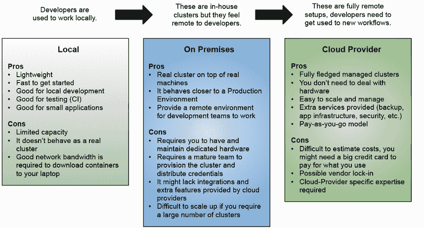

图 2.1 Kubernetes 集群本地与远程设置。

虽然这三个选项都是有效的，但都有缺点，在接下来的几节中，你将使用 Kubernetes KinD（Docker 中的 Kubernetes，[`kind.sigs.k8s.io/`](https://kind.sigs.k8s.io/））在你的笔记本电脑/电脑上运行的本地 Kubernetes 环境中部署第一章中介绍的行走骨架。查看位于 [https://github.com/salaboy/platforms-on-k8s/tree/main/chapter-2#creating-a-local-cluster-with-kubernetes-kind](https://github.com/salaboy/platforms-on-k8s/tree/main/chapter-2#creating-a-local-cluster-with-kubernetes-kind) 的分步教程，以创建我们将用于部署行走骨架、会议应用程序的本地 KinD 集群。

注意，教程创建了一个本地 KinD 集群，模拟拥有三个节点和特殊的端口映射，以允许我们的 Ingress 控制器路由我们发送到 http://localhost 的传入流量。

### 2.1.2 安装行走骨架

要在 Kubernetes 上运行容器化应用程序，您需要将每个服务打包成容器镜像，并且您需要定义这些容器将如何配置以在您的 Kubernetes 集群中运行。为此，Kubernetes 允许您定义不同类型的资源（使用 YAML 格式）来配置您的容器将如何运行和相互通信。最常见的资源类型是：

+   *部署:* 声明性地定义您的容器需要多少个副本才能使应用程序正确运行。部署还允许我们选择我们想要运行的容器（或容器集），以及这些容器必须如何配置（使用环境变量）。

+   *服务:* 声明性地定义一个高级抽象，将流量路由到由您的部署创建的容器。它还充当部署内部副本之间的负载均衡器。服务使集群内的其他服务和应用程序能够使用服务名称而不是容器的物理 IP 地址进行通信，提供所谓的服务发现。

+   *入口:* 声明性地定义一个路由，用于将集群外部的流量路由到集群内部的服务。使用入口定义，我们可以暴露集群外运行的客户端应用程序所需的服务。

+   *ConfigMap/secret:* 声明性地定义和存储配置对象以设置我们的服务实例。Secret 被认为是敏感信息，应该受到保护访问。

如果您有包含数十或数百个服务的大型应用程序，这些 YAML 文件将变得复杂且难以管理。跟踪更改并使用`kubectl`应用这些文件来部署应用程序成为一项复杂的工作。本书的范围不包括对这些资源的详细描述，其他资源如官方 Kubernetes 文档页面（[`kubernetes.io/docs/concepts/workloads/`](https://kubernetes.io/docs/concepts/workloads/)）也是可用的。在本书中，我们将专注于如何处理大型应用程序的资源以及可以帮助我们完成这项任务的工具。以下部分提供了将这些工具打包和安装到您的 Kubernetes 集群中的概述。

打包和安装 Kubernetes 应用程序

有不同的工具用于打包和管理您的 Kubernetes 应用程序。大多数时候，我们可以将这些工具分为两大类：模板引擎和包管理器。在现实场景中，为了完成任务，您可能需要这两种类型的工具。让我们讨论这两种类型的工具：为什么你需要一个模板引擎？你想要管理哪种类型的包？

模板引擎允许你在不同的环境中重用相同的资源定义，在这些环境中，应用程序可能需要略微不同的参数。资源模板化的典型例子是数据库 URL。如果你的服务需要连接到不同环境中的不同数据库实例，例如测试环境中的测试数据库和生产环境中的生产数据库，你希望避免维护两个具有不同 URL 的相同 YAML 文件副本。图 2.2 展示了你现在如何向 YAML 文件添加变量，然后引擎会根据你想要使用最终（渲染）资源的位置找到并替换这些变量。

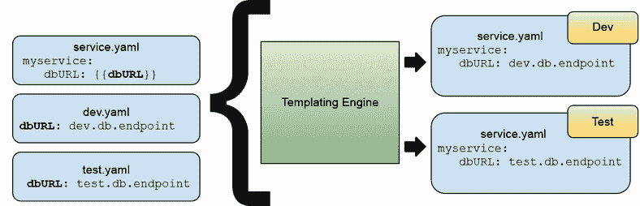

图 2.2 模板引擎通过替换变量来渲染 YAML 资源。

使用模板引擎可以节省你维护相同文件不同副本的大量时间，因为当文件开始堆积时，维护它们就变成了一项全职工作。社区中有几个工具可以处理 Kubernetes 文件的模板化。有些工具仅处理 YAML 文件，而有些工具则更专注于 Kubernetes 资源。以下是一些你应该检查的项目：

+   *Kustomize:* [`kustomize.io/`](https://kustomize.io/)

+   *Carvel YTT:* [`carvel.dev/ytt/`](https://carvel.dev/ytt/)

+   *Helm Templates:* [`helm.sh/docs/chart_best_practices/templates/#helm`](https://helm.sh/docs/chart_best_practices/templates/#helm)

现在，你该如何处理所有这些文件呢？将这些文件组织成逻辑包是一种很自然的冲动。如果你正在构建一个由不同服务组成的应用程序，将所有与某个服务相关的资源放在同一个目录内，甚至是在包含该服务源代码的同一个仓库中，这可能是有意义的。你还想确保能够将这些文件分发给部署这些服务的不同环境中的团队，并且你很快就会意识到你需要以某种方式对这些文件进行版本控制。这种版本控制可能与你的服务本身的版本有关，或者与对应用程序有意义的较高层次的逻辑聚合有关。当我们谈论分组、版本控制和分发这些资源时，我们正在描述包管理器的职责。开发者和运维团队已经习惯了使用包管理器，无论他们使用的技术栈是什么。Java 的 Maven/Gradle，NodeJS 的 NPM，Linux/Debian/Ubuntu 软件包的 APT-GET，以及最近，用于云原生应用的容器和容器注册库。那么，YAML 文件的包管理器是什么样的呢？包管理器的主要职责是什么？

作为用户，包管理器允许你浏览可用的包及其元数据，以便决定你想安装哪个包。一旦你决定使用哪个包，你应该能够下载它然后安装它。一旦包安装完成，作为用户，你期望能够升级到新版本的包。升级/更新包需要手动干预，这意味着作为用户，你需要明确告诉包管理器将某个包的安装升级到新版本（或最新版本）。

从包提供者的角度来看，包管理器应该提供创建包的约定和结构，以及打包你想要分发的文件的工具。包管理器处理版本和依赖关系，这意味着如果你创建了一个包，你必须为其关联一个版本号。一些包管理器使用*semver*（语义版本控制）方法，它使用三个数字来描述包的成熟度（例如 1.0.1，其中这些数字代表主版本、次版本和修补版本）。包管理器不需要提供集中的包仓库，但它们通常这么做。这个包仓库负责为用户提供包托管服务。集中式仓库很有用，因为它们为开发者提供了成千上万的可用包。这些集中式仓库的例子包括 Maven Central、NPM、Docker Hub、GitHub Container Registry 等。这些仓库负责索引包的元数据（这可能包括版本、标签、依赖关系和简短描述），以便用户可以搜索。这些仓库还处理访问控制，以拥有公共和私有包，但最终，包仓库的主要责任是允许包生产者上传包，以及包消费者从它们那里下载包（见图 2.3）。

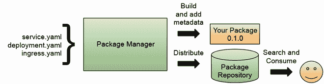

图 2.3 包管理器的责任：构建、打包和分发

当我们谈论 Kubernetes 时，Helm 是一个非常流行的工具，它既提供包管理器，又提供模板引擎。但还有其他值得关注的工具，例如：

+   Imgpkg ([`carvel.dev/imgpkg/`](https://carvel.dev/imgpkg/))，它使用容器注册库来存储包。

+   Kapp ([`carvel.dev/kapp/`](https://carvel.dev/kapp/))，它提供了更高层次的抽象，可以将资源作为应用程序分组。

+   类似于 Terraform 和 Pulumi 这样的工具，允许你以代码的方式管理基础设施。

在下一节中，我们将探讨如何使用 Helm ([`helm.sh`](http://helm.sh))将会议应用程序安装到我们的 Kubernetes 集群中。

## 2.2 使用单个命令安装会议应用程序

让我们将第一章第 1.4 节中介绍的 Conference 应用程序使用 Helm 安装到我们的 Kubernetes 集群中。此 Conference 应用程序允许会议组织者接收潜在演讲者的提案，评估这些提案，并保持已批准提交的更新议程。我们将在这本书中使用此应用程序来举例说明你在构建现实应用程序时可能遇到的挑战。

注意：要获取完整步骤列表，请遵循位于 [`github.com/salaboy/platforms-on-k8s/tree/main/chapter-2`](https://github.com/salaboy/platforms-on-k8s/tree/main/chapter-2) 的逐步教程。它包括运行本节中描述的命令所需的所有先决条件，例如创建集群和安装示例工作所需的命令行工具。

此应用程序被构建为一个“行走骨架”，这意味着它不是一个完整的应用程序，但它包含了“提案征集”流程所需的所有组件。这些服务可以进一步迭代以支持其他流程和现实场景。在以下章节中，你将安装应用程序到集群中，并与它交互以查看它在 Kubernetes 上运行时的行为。让我们使用以下命令安装应用程序：

```
helm install conference oci://docker.io/salaboy/conference-app --version v1.0.0
```

你应该看到与列表 2.1 相似的输出。

列表 2.1 Helm 安装了 conference-app 版本 1.0.0

```
> helm install conference oci://docker.io/salaboy/conference-app --version 
➥v1.0.0 
Pulled: registry-1.docker.io/salaboy/conference-app:v1.0.0
Digest: sha256:e5dd1a87a867fd7d6c6caecef3914234a12f23581c5137edf63bfd9add7d5459
NAME: conference
LAST DEPLOYED: Mon Jun 26 08:19:15 2023
NAMESPACE: default
STATUS: deployed
REVISION: 1
TEST SUITE: None
NOTES:
Cloud-Native Conference Application v1.0.0
Chart Deployed: conference-app - v1.0.0
Release Name: conference
For more information visit: https://github.com/salaboy/platforms-on-k8s
Access the Conference Application Frontend by running 
➥'kubectl port-forward svc/frontend -n default 8080:80'
```

注意：自 Helm 3.7+ 开始，你可以将 Helm 图表打包并作为 OCI 容器镜像分发，Helm 图表的 URL 包含 oci://，因为此图表托管在 Docker Hub 上，应用程序容器存储在那里。在 Helm 支持 OCI 镜像之前，你需要手动从 Helm 图表仓库添加和检索包，这些图表使用 tar 文件进行分发。

`helm install` 创建一个 Helm 发布，这意味着你已经创建了一个应用程序实例，在这种情况下，实例被称为 `conference`。使用 Helm，如果你想要的话，可以部署多个应用程序实例。你可以通过运行以下命令列出 Helm 发布：

```
helm list
```

输出应该看起来像图 2.4。

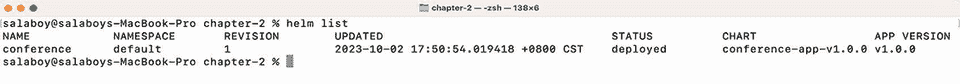

图 2.4 列出 Helm 发布版本

注意：如果你不使用 `helm install`，而是运行 `helm template oci://docker.io/salaboy/conference-app --version v1.0.0`，Helm 将输出 YAML 文件，这些文件将应用于集群。在某些情况下，你可能想这样做而不是 `helm install`，例如，如果你想覆盖 Helm 图表不允许参数化的值或在对 Kubernetes 发送请求之前应用任何其他转换。

### 2.2.1 验证应用程序是否正在运行

一旦应用程序部署，容器将被下载到您的笔记本电脑上运行，这可能需要一段时间。根据您的互联网连接，这个过程可能需要长达 10 分钟，因为 Kafka、PostgreSQL 和 Redis 将与应用程序容器一起下载。RESTARTS 列显示了容器由于错误而重新启动的频率。在分布式应用程序中，这是正常的，因为组件可能相互依赖，当它们同时启动时，连接可能会失败。按照设计，应用程序应该能够从问题中恢复，并且 Kubernetes 将自动重启失败的容器。

您可以通过列出您集群中运行的所有 Pod 来监控进度，再次使用`-owide`标志来获取更多信息：

```
kubectl get pods -owide
```

输出应类似于图 2.5。

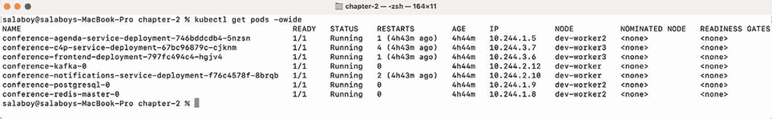

列表 2.5 列出应用程序 Pod

您可能在 Pod 列表中注意到，我们不仅运行了应用程序的服务，还运行了 Redis、PostgreSQL 和 Kafka，因为 C4P（Call for Proposals）和议程服务需要持久存储。应用程序将使用 Kafka 在服务之间交换异步消息。除了服务之外，我们还将运行这两个数据库和一个消息代理（Kafka）在我们的 Kubernetes 集群内部。

在图 2.5 所示的输出中，您需要注意 READY 和 STATUS 列，其中 READY 列中的 1/1 表示一个容器副本正在运行，另一个预期正在运行。如您所见，RESTART 列显示 Call for Proposals Service (`conference-c4p-service`)为 7。这是因为该服务依赖于 Redis 处于运行状态，以便服务能够连接到它。当 Redis 启动时，应用程序将尝试连接，如果失败，它将尝试重新连接。一旦 Redis 启动，服务将连接到它。同样适用于 Kafka 和 PostgreSQL。为了快速回顾，我们运行的应用程序服务、数据库和消息代理如图 2.6 所示。

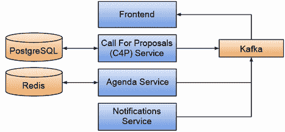

图 2.6 应用程序服务、数据库和消息代理

注意 Pod 可以在不同的节点上调度。您可以在`NODE`列中检查这一点；这是 Kubernetes 高效使用集群资源。如果所有 Pod 都处于运行状态，您就成功了！现在应用程序正在运行，您可以通过将您喜欢的浏览器指向`http://localhost`来访问它。

如果您对 Helm 和构建自己的 Conference 应用程序 Helm Chart 感兴趣，我建议您查看教程中提供的源代码：[`github.com/salaboy/platforms-on-k8s/tree/main/conference-application/helm/conference-app`](https://github.com/salaboy/platforms-on-k8s/tree/main/conference-application/helm/conference-app)。

### 2.2.2 与您的应用程序交互

在上一节中，我们将应用程序安装到我们的本地 Kubernetes 集群中。在本节中，我们将快速与该应用程序交互，以了解服务如何交互以完成一个简单的用例：接收和批准提案。请记住，您可以通过将浏览器指向`http://localhost`来访问应用程序。会议应用程序应类似于图 2.7。

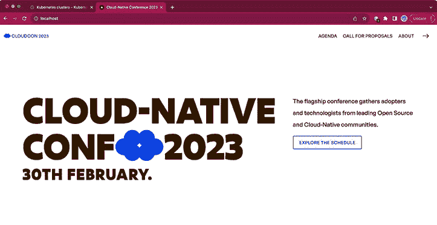

图 2.7 会议着陆页

如果您现在切换到议程部分，您应该会看到类似于图 2.8 的内容。

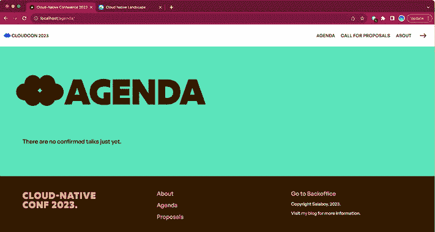

图 2.8 首次安装应用程序时的会议空议程

应用程序的议程页面列出了会议安排的所有演讲。潜在的演讲者可以提交会议组织者将审查的提案。当您第一次启动应用程序时，议程上不会有任何演讲，但现在您可以从提案征集部分提交提案。查看图 2.9。

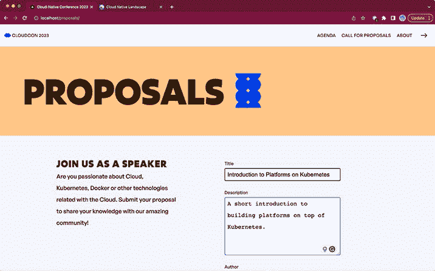

图 2.9 向组织者提交提案以供审查

注意，在提交提案的表单中有四个字段（标题、描述、作者和电子邮件）。填写所有字段，然后通过点击表单底部的提交提案按钮提交。组织者将使用这些信息来评估您的提案，并在您的提案被批准或拒绝时通过电子邮件与您联系。一旦提交提案，您就可以转到后台办公室（点击顶部菜单中的指向右方的箭头）并检查审查提案标签页，在那里您可以批准或拒绝提交的提案。您将在这个屏幕上扮演会议组织者的角色；见图 2.10。

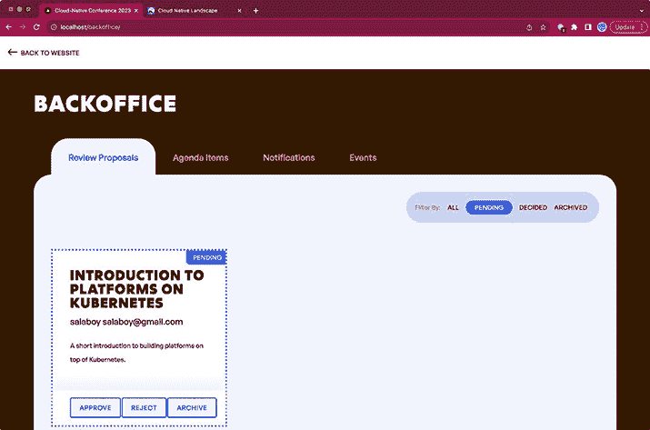

图 2.10 会议组织者可以接受或拒绝传入的提案

已批准的提案将出现在主议程页面上。在此阶段访问该页面的与会者可以浏览会议的主要演讲者。图 2.11 显示了我们在主要会议页面议程部分的新批准提案。

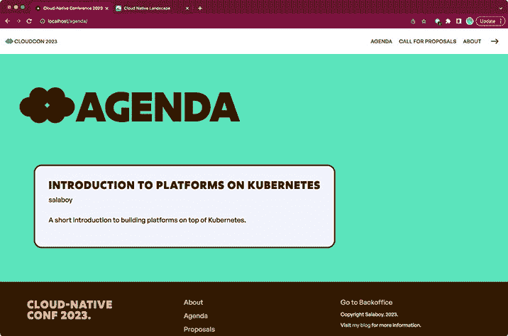

图 2.11 您的提案现在已在议程上实时发布！

在此阶段，潜在的演讲者应该已经收到了关于其提案批准或拒绝的电子邮件。您可以通过查看通知服务日志来检查这一点，使用终端中的`kubectl`；查看图 2.12 中的命令输出：

```
kubectl logs -f conference-notifications-service -deployment-<POD_ID>
```

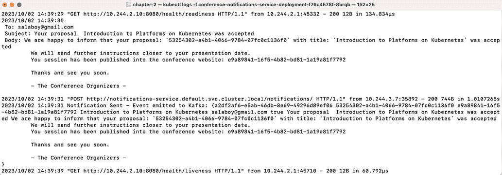

图 2.12 通知服务日志（电子邮件和事件）

这些日志显示了应用程序的两个重要方面。首先，通知通过电子邮件发送给潜在的演讲者。组织者需要跟踪这些通信。在会议后台办公室页面上，您可以找到通知标签页，其中显示了通知的内容（见图 2.13）。

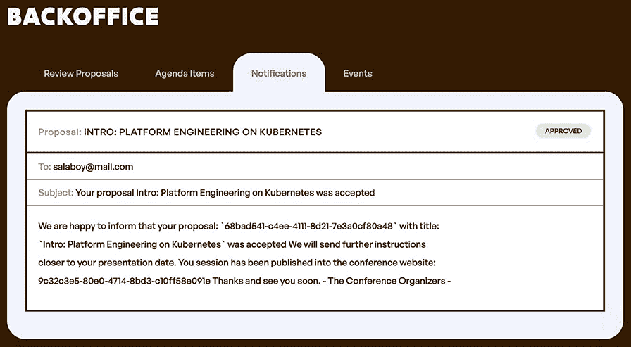

图 2.13 在后台办公室显示的通知

这里显示的第二方面是事件。当执行相关操作时，此应用程序的所有服务都会发出事件。通知服务正在发出事件，在这种情况下是向 Kafka 发送通知。这允许其他服务和应用程序异步地与应用程序服务集成。图 2.14 显示了后台办公室的事件部分。

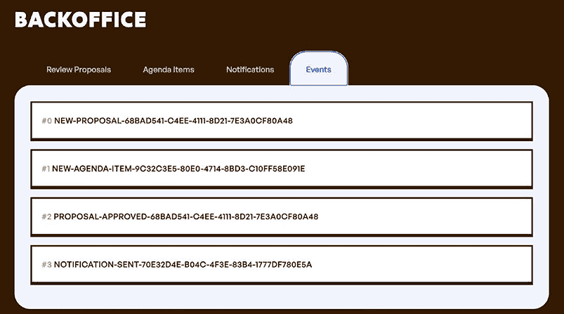

图 2.14 后台办公室中所有服务事件

图 2.14 显示了应用程序服务发出的所有事件；请注意，您可以看到服务执行的所有有意义操作，以完成提案征集流程（新提案 > 新议程项 > 提案批准 > 发送通知）。

如果您已经做到这一步，恭喜您，会议应用程序按预期工作。我鼓励您提交另一个提案并拒绝它，以验证是否向潜在演讲者发送了正确的通知和事件。

在本节中，您使用 Helm 安装了会议应用程序。然后我们验证了应用程序正在运行，并且潜在演讲者可以提交提案，同时会议组织者可以批准或拒绝这些提案。这些决定将通过电子邮件通知潜在演讲者。

这个简单的应用程序使我们能够演示一个基本用例，我们现在可以扩展和改进以支持真实用户。我们已经看到安装应用程序的新实例相当简单。我们使用 Helm 安装了一组相互连接的服务以及一些基础设施组件，如 Redis、PostgreSQL，在下一节中，我们将更深入地了解我们安装了什么以及应用程序是如何工作的。

## 2.3 检查行走骨架

如果您已经使用 Kubernetes 一段时间了，您可能已经对 `kubectl` 非常熟悉。因为这个应用程序版本使用的是原生 Kubernetes 部署和服务，您可以使用 `kubectl` 检查和调试这些 Kubernetes 资源。

通常，除了查看正在运行的 pod（使用 `kubectl get pods`）之外，为了理解和操作应用程序，您将查看服务和部署。让我们首先探索部署资源。

### 2.3.1 Kubernetes 部署基础

让我们从部署开始。在 Kubernetes 中，部署负责包含运行我们容器的配方。部署还负责定义容器将如何运行，以及当需要时如何升级到新版本。通过查看部署详情，您可以获得非常有用的信息，例如：

+   这个部署所使用的 *容器*。请注意，这只是一个简单的 Docker 容器，这意味着如果您想的话，甚至可以在本地使用 `docker run` 运行这个容器。这对于故障排除是基本的。

+   部署所需的 *副本* 数量。在本例中，它被设置为 1，但在下一节中你将更改此设置。更多的副本可以增加应用程序的弹性，因为这些副本可能会失败。Kubernetes 将会启动新的实例以保持所需副本数始终不变。

+   容器的 *资源分配*。根据负载和构建服务所使用的负载和技术堆栈，你可能需要微调 Kubernetes 允许容器使用的资源数量。

+   *就绪* 和 *存活* 探针的状态。默认情况下，Kubernetes 会监控你的容器健康状况。它是通过执行两个探针来完成的：1) “就绪探针”检查容器是否准备好响应请求，2) “存活探针”检查容器的主进程是否正在运行。

+   滚动更新策略定义了我们的 Pods 将如何更新以避免对用户造成停机。使用 `RollingUpdateStrategy`，你可以定义在触发和更新到新版本时允许多少副本。

首先，让我们列出所有可用的部署：

```
kubectl get deployments
```

输出应类似于列表 2.2。

列表 2.2 列出应用程序的部署

```
NAME                                          READY   UP-TO-DATE   AVAILABLE   
conference-agenda-service-deployment          1/1     1            1           
conference-c4p-service-deployment             1/1     1            1           
conference-frontend-deployment                1/1     1            1           
conference-notifications-service-deployment   1/1     1            1           
```

### 2.3.2 探索部署

在以下示例中，你将描述前端部署。你可以使用 `kubectl describe deploy conference-frontend-deployment`（参见列表 2.3）来更详细地描述每个部署。

列表 2.3 描述部署以查看其详细信息

```
> kubectl describe deploy conference-frontend-deployment 
Name:                   conference-frontend-deployment
Namespace:              default
CreationTimestamp:      Tue, 27 Jun 2023 08:21:21 +0100
Labels:                 app.kubernetes.io/managed-by=Helm
Annotations:            deployment.kubernetes.io/revision: 1
                        meta.helm.sh/release-name: conference
                        meta.helm.sh/release-namespace: default
Selector:               app=frontend
Replicas:               1 desired | 1 updated | 1 total | 1 available   ①
StrategyType:           RollingUpdate
MinReadySeconds:        0
RollingUpdateStrategy:  25% max unavailable, 25% max surge
Pod Template:
  Labels:  app=frontend
  Containers:
   frontend:
    Image:      salaboy/frontend-go...                                  ②
    Port:       8080/TCP
    Host Port:  0/TCP
    ...
    ...
    Environment:                                                        ③
      AGENDA_SERVICE_URL:         agenda-service.default.svc.cluster.local
      C4P_SERVICE_URL:            c4p-service.default.svc.cluster.local
      NOTIFICATIONS_SERVICE_URL:  notifications-service.default.svc.cluster.local
      KAFKA_URL:                  conference-kafka.default.svc.cluster.local
      POD_NODENAME:                (v1:spec.nodeName)
      POD_NAME:                    (v1:metadata.name)
      POD_NAMESPACE:               (v1:metadata.namespace)
      POD_IP:                      (v1:status.podIP)
      POD_SERVICE_ACCOUNT:         (v1:spec.serviceAccountName)
    Mounts:                       <none>
  Volumes:                        <none>
Conditions:
  Type           Status  Reason
  ----           ------  ------
  Available      True    MinimumReplicasAvailable
  Progressing    True    NewReplicaSetAvailable
OldReplicaSets:  <none>
NewReplicaSet:   conference-frontend-deployment-<ID> (1/1 replicas created)
Events:                                                                 ④
  Type    Reason             Age   From                   Message
  ----    ------             ----  ----                   -------
  Normal  ScalingReplicaSet  48m   deployment-controller  Scaled up replica ➥set conference-frontend-deployment-59d988899 to 1
```

① 显示此部署可用的副本。这为你提供了关于部署状态的快速指示。

② 容器镜像，包括用于此服务的名称和标签。

③ 用于配置此容器的环境变量。

④ 事件显示有关我们的 Kubernetes 资源的相关信息——在本例中，当副本被创建时。

列表 2.3 显示，如果由于某种原因部署未按预期工作，以这种方式描述部署非常有帮助。例如，如果所需的副本数未满足，描述资源将帮助你了解问题可能出在哪里。始终检查底部与资源相关的事件，以获取更多关于资源状态的见解。在这种情况下，部署在 48 分钟前扩展到有一个副本。

如前所述，部署还负责协调版本或配置升级和回滚。默认情况下，部署更新策略设置为“滚动”，这意味着部署将逐步升级一个接一个的 pods 以最小化停机时间。可以设置一个名为 `Recreate` 的替代策略，该策略将关闭所有 pods 并创建新的。

与 pod 相比，部署不是短暂的；因此，如果您创建了一个 `Deployment`，无论底层的容器是否失败，它都会在那里供您查询。默认情况下，当您创建部署资源时，Kubernetes 会创建一个中间资源来处理和检查部署请求的副本。

### 2.3.3 ReplicaSets

拥有多个容器副本是扩展应用程序的重要功能。如果您的应用程序正在经历来自用户的巨大流量，您可以轻松增加服务的副本数量以适应所有传入的请求。同样，如果您的应用程序没有经历大量的请求，这些副本可以缩小以节省资源。Kubernetes 创建的对象称为 `ReplicaSet`，可以通过运行以下命令进行查询：

```
kubectl get replicaset
```

输出应该看起来像列表 2.4。

列表 2.4 列出部署的 ReplicaSets

```
> kubectl get replicasets
NAME                                              DESIRED   CURRENT   READY
conference-agenda-service-deployment-7cc9f58875        1       1         1
conference-c4p-service-deployment-76dfc94444           1       1         1
conference-frontend-deployment-59d988899               1       1         1
conference-notifications-service-deployment-7cbcb8677b 1       1         1
```

这些 `ReplicaSet` 对象完全由部署的资源管理，通常，您不需要处理它们。ReplicaSets 在处理滚动更新时也非常重要，您可以在 [`kubernetes.io/docs/tutorials/kubernetes-basics/update/update-intro/`](https://kubernetes.io/docs/tutorials/kubernetes-basics/update/update-intro/) 找到更多关于这个主题的信息。您将在后面的章节中使用 Helm 对应用程序进行更新，届时这些机制将启动。

如果您想更改部署的副本数量，您仍然可以使用 `kubectl` 来实现：

```
> kubectl scale --replicas=2 deployments/<DEPLOYMENT_ID>
```

您可以用前端部署来尝试这个操作：

```
> kubectl scale --replicas=2 deployments/conference-frontend-deployment
```

如果我们现在列出应用程序的 pod，我们会看到前端服务有两个副本：

```
conference-frontend-deployment-<ID>-8gpgn  1/1     Running   7 (53m ago)   59m
conference-frontend-deployment-<ID>-z4c5c  1/1     Running   0             13s
```

此命令更改 Kubernetes 中的部署资源并触发为前端部署创建第二个副本。增加面向用户服务的副本数量相当常见，因为所有用户在访问会议页面时都会访问该服务。

如果我们现在访问应用程序，作为最终用户，我们不会注意到任何区别，但每次刷新时，可能由不同的副本为我们提供服务。为了使这一点更加明显，我们可以打开内置在前端服务中的一个功能，该功能显示有关应用程序容器的更多信息。您可以通过设置环境变量来启用此功能：

```
kubectl set env deployment/conference-frontend-deployment ➥FEATURE_DEBUG_ENABLED=true
```

注意，当你更改部署对象配置（`spec.template.spec` 块内的任何内容）时，Deployment 资源的滚动更新机制将会启动。该部署管理的所有现有 Pod 都将升级到新的规范（在本例中包括新的 `FEATURE_DEBUG_ENABLED` 环境变量）。默认情况下，这将启动一个新的 Pod 并使用新的规范，在终止旧版本的 Pod 之前等待它就绪。这个过程将重复进行，直到所有 Pod（部署的副本）都使用新的配置。

如果你再次在浏览器中访问应用程序（如果浏览器缓存了网站，你可能需要使用隐身模式访问），在后台办公室部分，有一个新的调试标签页。你可以看到所有服务的 Pod 名称、Pod IP、命名空间以及 Pod 运行的节点名称（如图 2.15）。

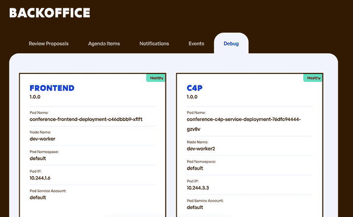

图 2.15 前端第一个副本响应你的请求（运行在节点名称：dev-worker）

如果你等待 3 秒钟，页面将自动刷新，你应该看到这次是第二个副本在响应，如果不是，请等待下一个周期（如图 2.16）。

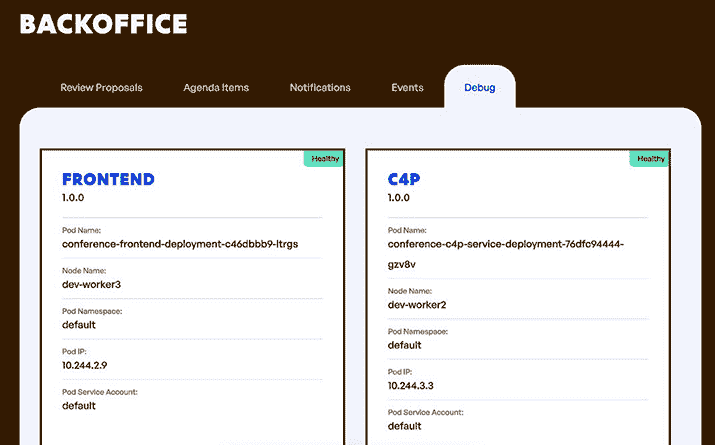

图 2.16 前端第二个副本响应你的请求（运行在节点名称：dev-worker3）

默认情况下，Kubernetes 将在副本之间进行请求的负载均衡。只需通过更改副本的数量即可进行扩展，无需部署任何新内容，Kubernetes 将分配一个新的 Pod（其中包含新的容器）来处理更多的流量。Kubernetes 还将确保始终存在所需数量的副本。你可以通过删除一个 Pod 并观察 Kubernetes 如何自动重新创建它来测试这一点。对于这种场景，你需要小心，因为网络应用程序的前端正在执行多个请求以获取 HTML、CSS 和 JavaScript 库；因此，每个请求都可能落在不同的副本上。

### 2.3.4 连接服务

我们已经探讨了部署，它们负责将我们的容器启动并运行，并保持这种状态，但到目前为止，这些容器只能在 Kubernetes 集群内部访问。如果我们想让其他服务与这些容器交互，我们需要查看另一个名为 `Service` 的 Kubernetes 资源。Kubernetes 提供了一种高级的服务发现机制，允许服务通过仅知道它们的名称来相互通信。这对于连接许多服务而不需要知道 Kubernetes Pod 的 IP 地址至关重要，因为随着时间的推移，这些 IP 地址可能会发生变化，例如，它们可以被升级、重新调度到不同的节点，或者在出现问题时使用新的 IP 地址重新启动。

### 2.3.5 探索服务

要将您的容器暴露给其他服务，您需要使用一个 `Kubernetes Service` 资源。每个应用程序服务都定义了这个 `Service` 资源，因此其他服务和客户端可以连接到它们。在 Kubernetes 中，服务将负责将流量路由到您的应用程序容器。这些服务代表了一个逻辑名称，您可以使用它来抽象容器运行的位置。如果您有多个容器的副本，服务资源将负责在所有副本之间进行流量负载均衡。您可以通过运行以下命令来列出所有服务：

```
kubectl get services
```

运行命令后，您应该看到类似于列表 2.5 的内容。

列表 2.5 列出应用程序的服务

```
NAME                        TYPE        CLUSTER-IP      PORT(S)
agenda-service              ClusterIP   10.96.90.100    80/TCP
c4p-service                 ClusterIP   10.96.179.86    80/TCP
conference-kafka            ClusterIP   10.96.67.2      9092/TCP
conference-kafka-headless   ClusterIP   None     9092/TCP,9094/TCP,9093/TCP
conference-postgresql       ClusterIP   10.96.121.167   5432/TCP
conference-postgresql-hl    ClusterIP   None            5432/TCP
conference-redis-headless   ClusterIP   None            6379/TCP
conference-redis-master     ClusterIP   10.96.225.138   6379/TCP
frontend                    ClusterIP   10.96.60.237    80/TCP
kubernetes                  ClusterIP   10.96.0.1       443/TCP
notifications-service       ClusterIP   10.96.65.248    80/TCP
```

您还可以使用以下命令来描述一个服务，以获取更多关于它的信息：

```
kubectl describe service frontend
```

这应该会给出类似于列表 2.6 中的内容。服务和部署通过选择器属性链接，如下图中突出显示。换句话说，服务将路由流量到包含标签 `app=frontend` 的部署创建的所有 pod。 

列表 2.6 描述前端服务

```
Name:              frontend
Namespace:         default
Labels:            app.kubernetes.io/managed-by=Helm
Annotations:       meta.helm.sh/release-name: conference
                   meta.helm.sh/release-namespace: default
Selector:          app=frontend    ①
Type:              ClusterIP
IP Family Policy:  SingleStack
IP Families:       IPv4
IP:                10.96.60.237
IPs:               10.96.60.237
Port:              <unset>  80/TCP
TargetPort:        8080/TCP
Endpoints:         10.244.1.6:8080,10.244.2.9:8080
Session Affinity:  None
Events:            <none>
```

① 用于匹配服务和部署的选择器

### 2.3.6 Kubernetes 中的服务发现

通过使用服务，如果您的应用程序服务需要向任何其他服务发送请求，它可以使用 Kubernetes 服务的名称和端口；在大多数情况下，如果您使用 HTTP 请求，您可以使用端口 80，因此您只需要使用服务名称。如果您查看服务的源代码，您将看到 HTTP 请求是对服务名称的创建；不需要 IP 地址或端口。

最后，如果您想将服务暴露在 Kubernetes 集群之外，您需要一个 Ingress 资源。正如其名称所表示的，这个 Kubernetes 资源负责将集群外部的流量路由到集群内部的服务。通常，您不会暴露多个服务，这限制了您应用程序的入口点。

您可以通过运行以下命令来获取所有可用的 Ingress 资源：

```
kubectl get ingress
```

输出应该看起来像列表 2.7。

列表 2.7 列出应用程序的 Ingress 资源

```
NAME                          CLASS   HOSTS   ADDRESS     PORTS   AGE
conference-frontend-ingress   nginx   *       localhost   80      84m
```

然后，您可以像描述其他资源类型一样描述 Ingress 资源，以获取更多关于它的信息：

```
kubectl describe ingress conference-frontend-ingress
```

您应该期望输出看起来像列表 2.8。

列表 2.8 描述 Ingress 资源

```
Name:             conference-frontend-ingress
Labels:           app.kubernetes.io/managed-by=Helm
Namespace:        default
Address:          localhost
Ingress Class:    nginx
Default backend:  <default>
Rules:
  Host        Path  Backends
  ----        ----  --------
  *           
              /   frontend:80 (10.244.1.6:8080,10.244.2.9:8080)   ①
Annotations:  meta.helm.sh/release-name: conference
              meta.helm.sh/release-namespace: default
              nginx.ingress.kubernetes.io/rewrite-target: /
Events:       <none>
```

① 所有前往 `'`/`'` 的流量都将路由到前端：80 服务。

如您所见，Ingress 也使用服务的名称来路由流量。为了使其工作，您需要一个 Ingress 控制器，就像我们在创建 KinD 集群时安装的那样。如果您在云服务提供商上运行，可能需要安装一个 Ingress 控制器。

以下电子表格是一个社区资源，用于跟踪您可用的不同 Ingress 控制器的选项：[`mng.bz/K9Bn`](http://mng.bz/K9Bn)。

使用 Ingress，您可以配置单个入口点，并使用基于路径的路由将流量重定向到您需要公开的每个服务。列表 2.8 中的上一个 Ingress 资源将发送到 `/` 的所有流量路由到 `frontend` 服务。请注意，Ingress 规则相当简单，您不应在此级别添加任何业务逻辑路由。

### 2.3.7 故障排除内部服务

有时，访问内部服务以调试或排除不工作的服务的问题很重要。对于此类情况，您可以使用 `kubectl port-forward` 命令临时访问使用 Ingress 资源未公开于集群外部的服务。例如，要访问 Agenda 服务而不通过前端，可以使用以下命令：

```
kubectl port-forward svc/agenda-service 8080:80 
```

您应该看到以下输出（列表 2.9）并确保不要终止该命令。

列表 2.9 `kubectl port-forward` 允许您为调试目的公开服务

```
Forwarding from 127.0.0.1:8080 -> 8080
Forwarding from [::1]:8080 -> 8080
```

然后使用您的浏览器，在另一个标签页中使用 `curl` 或其他任何工具指向 `http://localhost:8080/service/info` 以访问公开的 Agenda 服务。以下列表显示了如何使用 `curl` 访问 Agenda 服务信息端点，并使用 `jq`（您必须单独安装）打印一个漂亮的/彩色的 JSON 有效负载。

列表 2.10 使用 port-forward 访问 Agenda 服务

```
> curl -s localhost:8080/service/info | jq --color-output
{
  "Name": "AGENDA",
  "Version": "1.0.0",
  "Source": "https://github.com/salaboy/platforms-on-k8s/tree/main/
                conference-application/agenda-service",
  "PodName": "conference-agenda-service-deployment-7cc9f58875-28wrt",
  "PodNamespace": "default",
  "PodNodeName": "dev-worker3",
  "PodIp": "10.244.2.2",
  "PodServiceAccount": "default"
}
```

在本节中，您已经检查了为在 Kubernetes 内运行您的应用程序容器而创建的主要 Kubernetes 资源。通过查看这些资源及其关系，您可以在出现问题时进行故障排除。

对于日常操作，`kubectl` 命令行工具可能不是最佳选择，可以使用不同的仪表板来探索和管理您的 Kubernetes 工作负载，例如 k9s ([`k9scli.io/`](https://k9scli.io/))、Kubernetes 仪表板 ([`kubernetes.io/docs/tasks/access-application-cluster/web-ui-dashboard/`](https://kubernetes.io/docs/tasks/access-application-cluster/web-ui-dashboard/)) 和 Skooner ([`github.com/skooner-k8s/skooner`](https://github.com/skooner-k8s/skooner))。

## 2.4 云原生应用程序挑战

与如果出现问题整个应用程序会崩溃的单体应用程序相比，云原生应用程序在服务崩溃时不应崩溃。云原生应用程序是为故障而设计的，应在出现错误的情况下继续提供有价值的功能。在修复问题期间提供降级服务比无法访问应用程序要好。在本节中，您将更改 Kubernetes 中的一些服务配置，以了解应用程序在不同情况下的行为。

在某些情况下，应用程序/服务开发人员需要确保他们构建的服务具有弹性，Kubernetes 或基础设施将解决一些问题。

本节涵盖了与云原生应用程序相关的一些最常见挑战。我发现提前知道将要出错的事情比我在构建和交付应用程序时更有用。这不是一个详尽的列表；这只是确保您不会遇到众所周知的问题的开始。以下各节将通过会议应用程序举例说明并突出这些挑战：

+   *不允许停机*：如果您在 Kubernetes 上构建和运行云原生应用程序，并且您仍在遭受应用程序停机，那么您没有充分利用您所使用的技术堆栈的优势。

+   *服务的内置弹性*：下游服务会崩溃，您需要确保您的服务为这种情况做好准备。Kubernetes 帮助进行动态服务发现，但这对于您的应用程序具有弹性来说还不够。

+   *处理应用程序状态并非易事*：我们必须了解每个服务的架构需求，以便让 Kubernetes 能够高效地扩展和缩减我们的服务。

+   *数据不一致*：与分布式应用程序一起工作的一个常见问题是数据不是存储在单一位置，而是倾向于分布。应用程序需要准备好处理不同服务对世界状态有不同的看法的情况。

+   *理解应用程序的工作方式（监控、跟踪和遥测）*：在事情出错时，了解应用程序的表现以及它是否正在执行其应有的操作对于快速发现问题至关重要。

+   *应用程序安全和身份管理*：处理用户和安全问题总是被放在次要位置。对于分布式应用程序，在早期就明确记录和实现这些方面将帮助您通过定义“谁可以在何时做什么”来细化应用程序需求。

让我们从第一个挑战开始：不允许停机。

### 2.4.1 不允许停机

当使用 Kubernetes 时，我们可以轻松地扩展和缩减服务的副本。当您的服务是基于平台将通过创建运行服务的容器的新副本来扩展它们的假设而设计时，这是一个很棒的功能。那么，当服务没有准备好处理复制或没有给定服务的副本可用时会发生什么呢？

让我们将前端服务扩展到有两个副本运行。为了实现这一点，您可以运行以下命令：

```
kubectl scale --replicas=2 deployments/conference-frontend-deployment
```

如果其中一个副本停止运行或因任何原因损坏，Kubernetes 将尝试启动另一个副本，以确保始终有两个副本处于运行状态。图 2.17 显示了两个前端副本正在为用户提供流量。

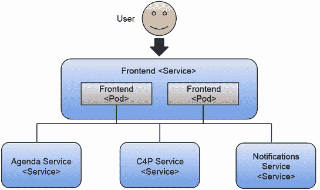

图 2.17 通过运行两个 Frontend 容器的副本，我们允许应用容忍故障，并增加应用可以处理的并发请求数量。

您可以通过终止应用 Frontend 的两个 Pod 中的任意一个来快速尝试 Kubernetes 的这项自愈功能。您可以通过运行以下命令来完成此操作，如列表 2.11 和 2.12 所示。

列表 2.11 检查两个副本是否正在运行

```
> kubectl get pods 
NAME                                             READY   STATUS    RESTARTS      AGE
conference-agenda-service-deployment-<ID>        1/1     Running   7 (92m ago)   100m
conference-c4p-service-deployment-<ID>           1/1     Running   7 (92m ago)   100m
conference-frontend-deployment-<ID>              1/1     Running   0             25m
conference-frontend-deployment-<ID>              1/1     Running   0             25m
conference-kafka-0                               1/1     Running   0             100m
conference-notifications-service-deployment-<ID> 1/1     Running   7 (91m ago)   100m
conference-postgresql-0                          1/1     Running   0             100m
conference-redis-master-0                        1/1     Running   0             100m
```

现在，复制两个 Pod ID 之一并删除它：

```
> kubectl delete pod conference-frontend-deployment-c46dbbb9-ltrgs
```

然后再次列出 Pods（列表 2.12）。

列表 2.12 一旦一个副本失败，就会自动创建一个新的副本

```
> kubectl get pods
NAME                                             READY   STATUS    RESTARTS      AGE
conference-agenda-service-deployment-<ID>        1/1     Running   7 (92m ago)   100m
conference-c4p-service-deployment-<ID>           1/1     Running   7 (92m ago)   100m
conference-frontend-deployment-<NEW ID>          0/1     ContainerCreating 0     1s
conference-frontend-deployment-<ID>              1/1     Running   0             25m
conference-kafka-0                               1/1     Running   0             100m
conference-notifications-service-deployment-<ID> 1/1     Running   7 (91m ago)   100m
conference-postgresql-0                          1/1     Running   0             100m
conference-redis-master-0                        1/1     Running   0             100m
```

您可以看到，当 Kubernetes（更具体地说，是 ReplicaSet）检测到只有一个正在运行的副本时，它会立即创建一个新的 Pod。在新的 Pod 被创建并启动的过程中，您只有一个副本在响应您的请求，直到第二个副本启动并运行。这种机制确保至少有两个副本来响应用户的请求。图 2.18 显示，由于我们仍然有一个 Pod 在处理请求，因此应用仍然可以工作。

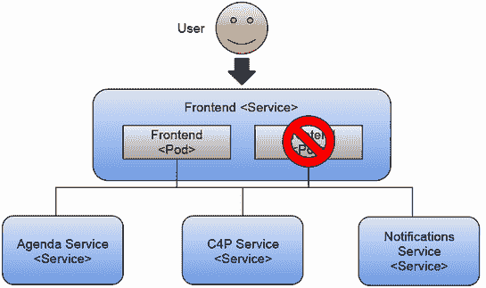

图 2.18 如果其中一个实例失败，Kubernetes 将自动终止并重新创建该实例。但至少其他正在运行的容器可以继续响应用户请求。

如果您只有一个副本并终止了正在运行的 Pod，您的应用将在新容器创建并准备好服务请求之前出现停机时间。您可以使用以下命令恢复到单个副本：

```
> kubectl scale --replicas=1 deployments/conference-frontend-deployment
```

继续尝试。仅删除 Frontend Pod 可用的副本：

```
> kubectl delete pod <POD_ID>
```

图 2.19 显示应用不再工作，因为没有 Frontend Pod 来服务来自用户的请求。

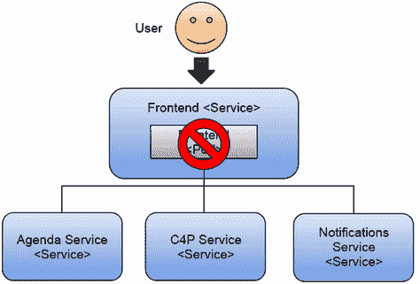

图 2.19 当单个副本重启时，没有备份来响应用户请求。如果没有副本可供服务用户的请求，您将经历停机时间。这正是我们想要避免的。

在终止 Pod 后，通过刷新浏览器（http://localhost）尝试访问应用。您应该在浏览器中看到“503 服务暂时不可用”，因为 Ingress 控制器（为了简化，在之前的图中未显示）找不到位于 Frontend 服务后面的正在运行的副本。如果您稍等片刻，您将看到应用重新启动。图 2.20 显示了负责将流量路由到 Frontend 服务的 NGINX Ingress 控制器组件返回的 503“服务暂时不可用”。

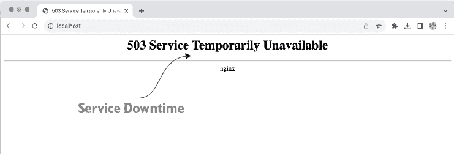

图 2.20 当单个副本重启时，没有备份来响应用户请求

这个错误信息相当棘手，因为应用大约需要一秒钟的时间才能重启并完全恢复正常功能，所以如果您没有看到它，您可以尝试使用`kubectl scale --replicas=0 deployments/conference-frontend-deployment`将前端服务缩放到零个副本来模拟停机。

这种行为是可以预期的，因为前端服务是一个面向用户的服务。如果它关闭，用户将无法访问任何功能，因此建议有多个副本。从这个角度来看，前端服务是整个应用程序最重要的服务，因为我们的主要目标是避免应用程序的停机时间。

总结来说，请特别注意集群外部暴露的面向用户的服务。无论是用户界面还是 API，确保您有足够的副本来处理传入的请求。除了开发之外，大多数用例应避免使用单个副本。

### 2.4.2 服务内置的弹性

但是现在，如果其他服务也关闭了怎么办？例如，Agenda 服务仅负责向会议参与者列出所有接受的提案。这项服务同样关键，因为议程列表就在应用程序的主页上。所以，让我们缩小服务规模：

```
kubectl scale --replicas=0 deployments/conference-agenda-service-deployment
```

图 2.21 显示了即使其中一个服务表现不佳，应用程序仍然可以继续工作。

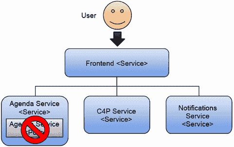

图 2.21 没有 Agenda 服务的 Pod。如果一个服务失败，用户应该能够继续使用应用程序，但功能有限。

运行此命令后，容器将被终止，并且没有容器会响应用户的请求。尝试在浏览器中刷新应用程序，你应该会看到一个如图 2.22 所示的缓存响应。


图 2.22 如果 Agenda 服务没有正在运行的副本，前端足够智能，会向用户显示一些缓存条目。

如您所见，应用程序仍在运行，但 Agenda 服务目前不可用。检查后台办公室部分的调试选项卡，它应该显示 Agenda 服务不健康（图 2.23）。

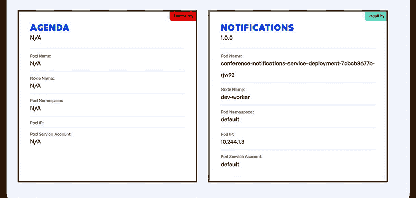

图 2.23 如果处于调试模式，后台办公室应显示不健康的服务。

您可以为这样的场景准备您的应用程序；在这种情况下，前端有一个缓存响应，至少可以向用户显示一些内容。如果由于某种原因，Agenda 服务关闭，至少用户将能够访问其他服务和应用程序的其他部分。从应用程序的角度来看，重要的是不要将错误传播回用户。用户应该能够继续使用其他应用程序服务，例如，提案征集表单，直到 Agenda 服务恢复。

在开发将在 Kubernetes 中运行的服务时，你需要特别注意，因为现在你的服务负责处理由下游服务生成的错误。这很重要，以确保错误或服务崩溃不会使你的整个应用程序崩溃。简单的机制，如缓存响应，会使你的应用程序更加健壮，并允许你逐步升级这些服务，而不用担心将一切关闭。对于我们的会议场景，有一个定期缓存议程条目的 CronJob 可能就足够了。记住，不允许停机时间。

让我们谈谈如何处理我们应用程序中的状态，以及从可扩展性的角度来看理解我们的应用程序服务如何处理状态的重要性。由于我们将讨论可扩展性，数据一致性是我们接下来要尝试解决的问题。

### 2.4.3 处理应用程序状态并不简单

让我们再次扩展 Agenda 服务，使其只有一个副本：

```
> kubectl scale --replicas=1 deployments/conference-agenda-service-deployment
```

如果你之前创建过提案，你会注意到，一旦 Agenda 服务恢复，你会在 Agenda 页面上再次看到已接受的提案。这仅因为 Agenda 服务和 C4P 服务都将所有提案和议程项存储在外部数据库中（PostgreSQL 和 Redis）。在这个上下文中，外部意味着在 pod 内存之外。如果我们将 Agenda 服务扩展到两个副本，会发生什么？请参见列表 2.13。

列表 2.13 运行 Agenda 服务的两个副本

```
> kubectl scale --replicas=2 deployments/conference-agenda-service-deployment
NAME                                                    READY   STATUS          AGE
conference-agenda-service-deployment-<ID>               1/1     Running         2m30s
conference-agenda-service-deployment-<ID>               1/1     Running         22s
conference-c4p-service-deployment-<ID>                  1/1     Running         150m
conference-frontend-deployment-<ID>                     1/1     Running         8m55s
conference-kafka-0                                      1/1     Running         150m
conference-notifications-service-deployment-<ID>        1/1     Running         150m
conference-postgresql-0                                 1/1     Running         150m
conference-redis-master-0                               1/1     Running         150m
```

图 2.24 展示了 Agenda 服务同时运行两个服务副本的情况。

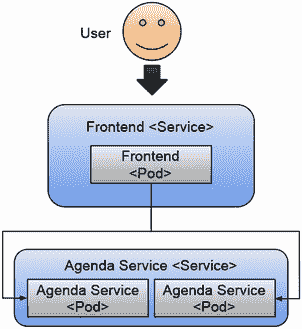

图 2.24 现在两个副本可以处理更多的流量。由前端转发的请求可以被两个可用的副本回答，这使得应用程序能够处理更多的负载。

当两个副本处理你的用户请求时，现在前端将有两个实例进行查询。Kubernetes 将在两个副本之间进行负载均衡，但你的应用程序将无法控制请求击中的副本。因为我们使用数据库在 pod 的上下文之外备份数据，所以我们可以将副本扩展到许多处理应用程序需求的 pod。图 2.25 显示了 Agenda 服务如何依赖 Redis 来存储应用程序状态，而 Call for Proposals 则使用 PostgreSQL 来完成同样的工作。

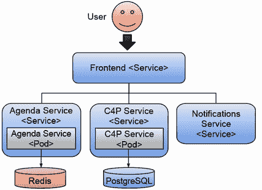

图 2.25 两个数据敏感的服务都使用持久存储。将状态存储委托给外部组件，使你的服务无状态且更容易扩展。

这种方法的一个局限性是数据库在其默认配置中支持的数据库连接数。如果你继续扩展副本，始终需要考虑审查数据库连接池设置，以确保数据库可以处理所有副本创建的所有连接。但为了学习，让我们假设我们没有数据库，我们的议程服务将所有议程项都保存在内存中。如果我们开始扩展议程服务 Pod，应用程序将如何表现？图 2.26 展示了应用程序内部有内存数据的假设情况。

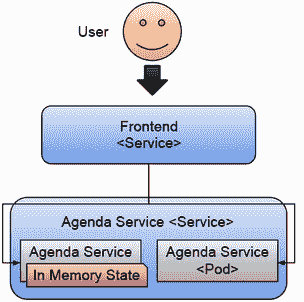

图 2.26 如果议程服务将状态保存在内存中会发生什么？如果状态保存在内存中，就很难在副本之间共享。这使得扩展服务变得更加困难。

通过扩大这些服务规模，我们发现应用程序服务设计中存在一个问题。议程服务正在内存中保持状态，这将影响 Kubernetes 的扩展能力。对于这种场景，当 Kubernetes 在不同的副本之间平衡请求时，前端服务将根据哪个副本处理了请求而接收不同的数据。

当在 Kubernetes 中运行现有应用程序时，你需要深入了解它们在内存中保持多少数据，因为这将影响你如何扩展它们。对于保持 HTTP 会话并需要粘性会话（后续请求都发送到同一副本）的 Web 应用程序，你需要设置 HTTP 会话复制以使多个副本工作。这可能需要在基础设施级别配置更多组件，例如缓存。

了解你的服务需求将帮助你规划和自动化你的基础设施需求，例如数据库、缓存、消息代理等。应用程序越复杂，它对这些基础设施组件的依赖性就越大。

如我们之前所见，我们已经将 Redis 和 PostgreSQL 作为应用程序 Helm 图的一部分安装。这通常不是一个好主意，因为数据库和像消息代理这样的工具需要运营团队的特别关注，他们可以选择不在 Kubernetes 内运行这些服务。我们将在第四章中进一步探讨这个主题，我们将更深入地探讨在 Kubernetes 和云提供商合作时如何处理基础设施。

### 2.4.4 处理不一致的数据

在关系型数据库存储如 PostgreSQL 或 NoSQL 方法如 Redis 中存储数据并不能解决不同存储之间数据不一致的问题。因为这些存储应该通过服务 API 隐藏起来，你需要有机制来检查服务处理的数据是否一致。在分布式系统中，经常谈论“最终一致性”，意味着最终系统将会是一致的。拥有最终一致性比完全没有一致性要好。在这个例子中，我们可以构建一个简单的检查机制，偶尔（想象一下每天一次）检查议程服务中已接受的演讲是否在提案征集服务中得到批准。如果有一个提案服务（C4P）尚未批准的条目，那么我们可以发出一些警报或给会议组织者发送电子邮件（图 2.27）。

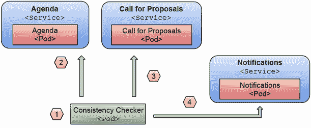

图 2.27 一致性检查可以作为 CronJobs 运行。我们可以定期执行针对应用程序服务的检查，以确保状态的一致性。例如：(1)每天午夜我们查询议程服务(2)以验证发布的会议是否在(3)提案征集服务中得到批准，并且(4)通知服务已经发送了相应的通知。

在图 2.27 中，我们可以看到 CronJob（1）将每隔 X 个周期执行一次，这取决于我们修复一致性问题的紧迫性。然后它将查询议程服务的公共 API（2）以检查哪些已接受的提案被列出，并将其与提案征集服务批准的列表（3）进行比较。最后，如果发现任何不一致性，可以使用通知服务的公共 API（4）发送电子邮件。

考虑这个应用程序被设计用于的简单用例；你还需要进行哪些检查？一个立即想到的是验证已拒绝和批准的提案是否正确发送了电子邮件。对于这个用例，电子邮件非常重要，我们需要确保这些电子邮件被发送到我们接受的和拒绝的演讲者。

### 2.4.5 理解应用程序的工作方式

分布式系统是复杂的生物，从第一天开始就完全理解它们是如何工作的，这有助于你在事情出错时节省时间。这促使监控、跟踪和遥测社区努力开发出帮助我们理解在任何给定时间事物是如何运作的解决方案。

[`opentelemetry.io/`](https://opentelemetry.io/) OpenTelemetry 社区与 Kubernetes 一起发展，现在它可以提供您监控服务运行情况所需的大部分工具。正如他们的网站所述，“您可以使用它来对软件进行仪器化、生成、收集和导出遥测数据（指标、日志和跟踪）以进行分析，以了解软件的性能和行为。” 图 2.28 展示了一个常见用例，其中所有服务都将指标、跟踪和日志推送到一个集中位置，该位置存储和聚合信息，以便在仪表板中显示或由其他工具使用。

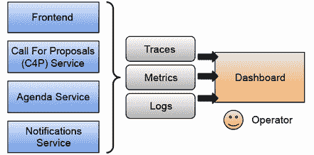

图 2.28 将所有服务的可观察性聚合到单一位置可以减少负责保持应用程序正常运行团队的认知负荷。

重要的是要注意，OpenTelemetry 专注于您软件的行为和性能，因为它们都会影响您的用户和用户体验。从行为角度来看，您想确保应用程序正在执行它应该执行的操作，为此，您需要了解哪些服务正在调用哪些其他服务或基础设施来执行任务。

使用 Prometheus 和 Grafana 可以让我们查看服务遥测数据并构建特定领域的仪表板来突出某些应用级指标，例如，随着时间的推移，批准与拒绝提案的数量对比，如图 2.29 所示。

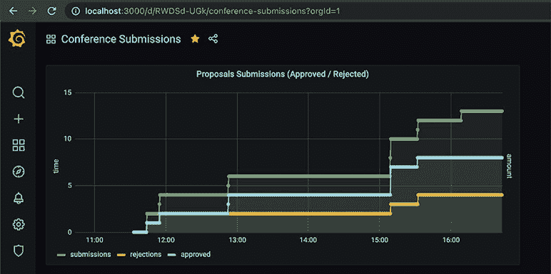

图 2.29 使用 Prometheus 和 Grafana 监控遥测数据

从性能角度来看，您需要确保服务遵守其服务级别协议（SLA），这意味着它们以很短的时间回答请求。如果您的某个服务表现不佳，耗时超过正常水平，您希望知道。

对于跟踪，您必须修改您的服务以了解其内部操作和性能。OpenTelemetry 在大多数语言中提供即插即用的仪器库，以外部化服务指标和跟踪。图 2.30 展示了 OpenTelemetry 架构，您可以看到 OpenTelemetry 收集器从每个应用程序代理接收信息，同时也从共享基础设施组件接收信息。

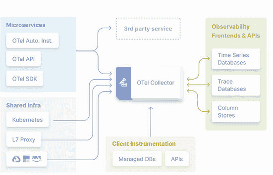

图 2.30 OpenTelemetry 架构和库（来源：https://opentelemetry.io/docs/）

这里的建议是，如果您正在创建一个“行走骨架”，请确保它内置了 OpenTelemetry。如果您将监控推迟到项目的后期阶段，那就太晚了，事情会出错，找出责任人会花费太多时间。

### 2.4.6 应用程序安全和身份管理

如果你曾经构建过 Web 应用程序，你就会知道提供身份管理（用户账户和用户身份）以及认证和授权是一项相当艰巨的任务。破坏任何应用程序（无论是云原生还是非云原生）的一个简单方法就是执行你不应该执行的操作，比如删除所有提议的演示文稿，除非你是会议组织者。

这在分布式系统中也变得具有挑战性，因为授权和用户身份必须在不同的服务之间传播。在分布式架构中，有一个代表用户生成请求的组件而不是直接暴露所有服务供用户交互是很常见的。在我们的例子中，前端服务就是这样的组件。大多数时候，你可以使用这个面向外部的组件作为外部和内部服务之间的屏障。因此，将前端服务配置为连接到使用 OAuth2 协议的授权和认证提供者是相当常见的。图 2.31 显示了前端服务与身份管理服务的交互，该服务负责连接到身份提供者（Google、GitHub、你内部的 LDAP 服务器）以验证用户凭据，并提供定义用户在不同服务中可以做什么和不能做什么的角色或组成员资格。前端服务处理登录流程（认证和授权），但一旦完成，只有上下文才会传播到后端服务。

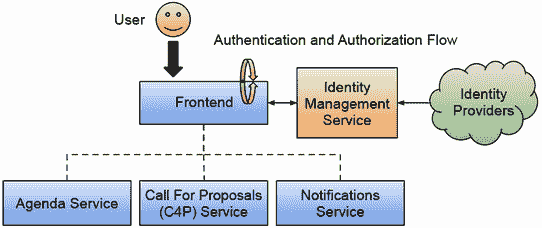

图 2.31 身份管理：角色/组被传播到后端服务。

在身份管理方面，你已经看到应用程序不处理用户或他们的数据，这对于 GDPR 等法规来说是个好事。我们可能希望允许用户使用他们的社交媒体账户登录到我们的应用程序，而无需他们创建单独的账户。这通常被称为社交登录。

一些流行的解决方案将 OAuth2 和身份管理结合在一起，例如 Keycloak ([`www.keycloak.org/`](https://www.keycloak.org/)) 和 Zitadel ([`zitadel.com/opensource`](https://zitadel.com/opensource))。这些开源项目为单点登录解决方案和高级身份管理提供了一站式服务。在 Zitadel 的情况下，它还提供了一种托管服务，如果你不想在你的基础设施内安装和维护 SSO 和身份管理组件，你可以使用这项服务。

追踪和监控也是如此。如果你计划拥有用户（你迟早会这么做），包括单点登录和身份管理到行走骨架中会促使你思考“谁将能够做什么”的具体细节，进一步细化你的用例。

### 2.4.7 其他挑战

在前几节中，我们已经介绍了一些你在构建云原生应用时可能会遇到的一些常见挑战，但这些并非全部。你能想到其他破坏这个应用第一版的方法吗？

注意，解决本章讨论的挑战会有所帮助，但还有其他与如何交付由不断增长的服务组成的持续演变的应用相关的挑战。

## 2.5 回顾平台工程

在前几节中，我们讨论了许多主题。我们回顾了打包和分发 Kubernetes 应用程序的选择，然后使用 Helm 在 Kubernetes 集群中安装我们的“行走骨架”。我们通过与它交互来测试应用程序的功能，最后，我们深入分析了团队在构建分布式应用程序时可能会遇到的一些常见的云原生挑战。

但你可能想知道所有这些话题如何与本书的标题“持续交付”以及平台工程的一般概念相关。在本节中，我们将更明确地将第一章中介绍的主题与这些话题联系起来。

首先，创建 Kubernetes 集群并在其上运行应用程序的目的是确保我们涵盖 Kubernetes 内置的弹性和扩展应用程序服务的能力。Kubernetes 提供了构建块，使我们能够在不中断服务的情况下运行我们的应用程序，即使我们不断更新它们。这使得我们，Kubernetes 用户，可以更频繁地发布我们组件的新版本，因为我们不应该停止整个应用程序来更新其某个部分。在第八章中，我们将看到 Kubernetes 内置机制如何扩展以实现不同的发布策略。

如果你没有使用 Kubernetes 提供的能力来持续向客户发布软件，那么你需要拉响警报。这种情况通常是由于 Kubernetes 之前的老旧做法阻碍了进程，缺乏自动化，或者服务之间没有明确定义的合同，这阻碍了依赖服务独立发布。我们将在未来的几章中多次涉及这个话题，因为这是尝试改进你的持续交付实践的基本原则，也是平台工程团队需要优先考虑的事项。

在本章中，我们也看到了如何使用封装了部署我们应用程序所需配置文件的包管理器来安装一个云原生应用程序。这些配置文件（以 YAML 文件形式表达 Kubernetes 资源）描述了我们的应用程序拓扑，并包含每个应用程序服务使用的容器的链接。这些 YAML 文件还包含每个服务的配置，例如配置每个服务的环境变量。对这些配置文件进行打包和版本控制，使我们能够轻松地在不同的环境中创建新的应用程序实例，这将在第四章中介绍。

如果你想要深入了解配置作为代码如何帮助你更可靠地交付更多软件的持续交付方面，我强烈推荐 Christie Wilson 的书籍《Grokking Continuous Delivery》（Manning Publications，2018 年出版）。

因为我想确保你有一个可以玩的应用程序，并且我们需要涵盖 Kubernetes 内置机制，所以我做出了一个有意识的决策，从可以轻松部署到任何 Kubernetes 集群（无论它是本地运行还是在云提供商上）的已打包应用程序开始。我们可以识别出两个不同的阶段。一个是我们还没有覆盖的，那就是如何生产这些可以部署到任何 Kubernetes 集群的包，第二个阶段，我们已经开始尝试，就是在我们具体的集群中运行这个应用程序（我们可以将这个集群视为一个环境，也许是一个开发环境），如图 2.32 所示。

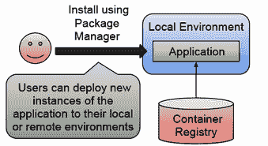

图 2.32 应用程序的生命周期，从构建和打包到在环境中运行

理解这一点很重要，即为我们本地环境执行的步骤将适用于任何 Kubernetes 集群，无论集群大小和位置如何。虽然每个云提供商都将有自己的安全和身份机制，但我们安装应用程序 Helm 图表到集群时创建的 Kubernetes API 和资源将是相同的。如果你现在使用 Helm 模板功能来微调你的应用程序（例如，资源消耗和网络配置）以适应目标环境，你可以轻松地将这些部署自动化到任何 Kubernetes 集群。

在继续之前，让我们明确一点，推动开发者配置应用程序实例可能不是他们时间的最佳利用方式。访问生产环境（用户/客户正在访问的环境）的开发者可能也不是最佳选择。我们希望确保开发者专注于构建新功能和改进我们的应用程序。图 2.33 展示了我们应该自动化所有涉及构建、发布和部署开发者创建的工件步骤，确保他们可以专注于向应用程序添加功能，而不是在准备就绪时手动处理打包、分发和部署新版本。这是本章的主要关注点。

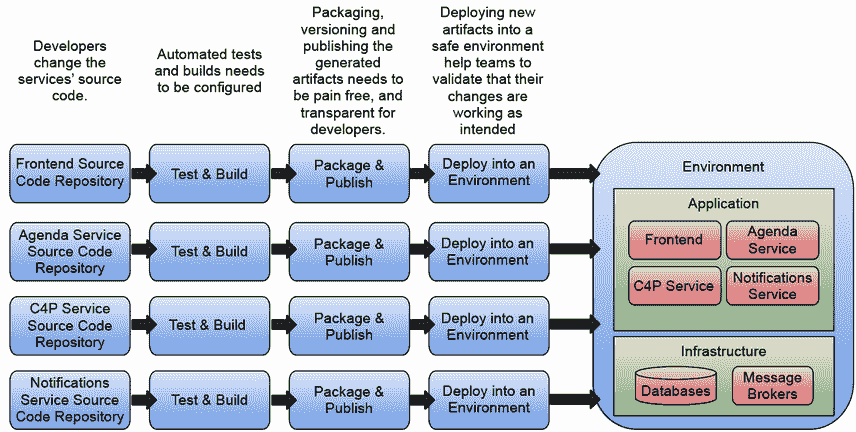

图 2.33 开发者可以专注于构建功能，但平台团队需要在更改后自动化整个流程。

了解我们可以使用的工具来自动化从源代码更改到在 Kubernetes 集群中运行软件的路径，这对于使开发者能够专注于他们最擅长的事情“编写新功能”是至关重要的。我们将解决的另一个重大差异是，云原生应用程序不是静态的。正如您在前面的图中可以看到的，我们不会安装静态的应用程序定义。我们希望随着服务的可用性，发布和部署新版本的服务。 

手动安装应用程序容易出错；手动更改我们的 Kubernetes 集群中的配置可能会使我们陷入不知道如何在不同的环境中复制应用程序当前状态的情况。因此，在第三章和第四章中，我们将讨论使用通常称为管道的自动化。

在下一章中，我们将通过管道来覆盖我们分布式应用的更多动态方面，以交付我们服务的新版本。第四章将探讨我们如何使用基于 Kubernetes 的 GitOps 工具来管理我们的环境。

## 摘要

+   在本地和远程 Kubernetes 集群之间进行选择需要认真考虑：

    +   您可以使用 Kubernetes KinD 引导本地 Kubernetes 集群以开发您的应用程序。主要缺点是您的集群受限于您的本地资源（CPU 和内存），并且不是一个真正的机器集群。

    +   您可以在云提供商中拥有一个账户，并针对远程集群进行所有开发。这种方法的主要缺点是，大多数开发者不习惯于一直远程工作，并且需要有人为远程资源付费。

+   包管理器，如 Helm，可以帮助您打包、分发和安装您的 Kubernetes 应用程序。在本章中，您只需一条命令行就能将应用程序安装到 Kubernetes 集群中。

+   了解您的应用程序创建的 Kubernetes 资源可以给您一个关于当事情出错时应用程序将如何表现以及在实际场景中需要考虑哪些额外因素的印象。

+   即使是非常简单的应用，你也会遇到必须逐一解决的挑战。提前了解这些挑战有助于你以正确的思维方式规划和设计你的服务。

+   拥有一个“行走骨架”可以帮助你在受控环境中尝试不同的场景和技术。在本章中，你已经尝试了：

    +   通过扩展和缩减你的服务来亲眼看到当事情出错时应用程序的表现。

    +   维护状态很困难，我们需要专门的组件来高效地完成这项工作。

    +   至少为我们的服务保留两个副本可以最小化停机时间。确保用户界面组件始终处于运行状态，可以保证即使在出现问题的情况下，用户也能与应用程序的部分进行交互。

    +   当问题出现时，拥有回退和内置机制来处理问题可以使你的应用更具弹性。

+   如果你已经遵循了链接的逐步教程，你现在已经有了一手经验创建本地 Kubernetes 集群，安装应用程序，扩展和缩减服务，最重要的是，检查应用程序是否按预期运行。
