# 3 个服务管道：构建云原生应用程序

本章涵盖

+   发现交付云原生应用程序的组件

+   学习创建和标准化服务管道的优势

+   使用 Tekton、Dagger 和 GitHub Actions 构建云原生应用程序

在上一章中，你安装并交互了一个由四个服务组成的简单分布式会议应用程序。本章将介绍如何使用 *管道* 作为交付机制来持续交付每个组件。本章描述并展示了如何构建、打包、发布和发布这些服务，以便它们可以在你的组织环境中运行。

本章介绍了 *服务管道* 的概念。服务管道包括从源代码构建软件到工件准备运行的所有步骤。本章分为两个主要部分：

+   连续交付云原生应用程序需要哪些条件？

+   服务管道

    +   什么是服务管道？

    +   使用以下方式实现服务管道：

        +   Tekton，一个 Kubernetes 原生管道引擎

        +   使用 Dagger 编写你的管道，然后在任何地方运行

        +   我应该使用 Tekton、Dagger 还是 GitHub Actions？

## 3.1 连续交付云原生应用程序需要哪些条件？

当与 Kubernetes 一起工作时，团队现在负责更多的移动部件和涉及容器以及如何在 Kubernetes 中运行的任务。这些额外任务并非免费提供。团队必须学会自动化和优化保持每个服务运行所需的步骤。原本由运维团队负责的任务现在越来越多地成为负责每个单独服务的团队的责任。新的工具和新的方法赋予开发者开发、运行和维护他们所产生服务的权力。本章我们将探讨的工具旨在自动化从源代码到在 Kubernetes 集群内部署并运行的服务所需的所有任务。本章描述了将软件组件（我们的应用程序服务）交付到多个环境的机制。但在深入研究工具之前，让我们快速看一下我们面临的挑战。

构建和交付云原生应用程序面临着显著的挑战，团队必须应对：

+   *在构建应用程序的不同部分时处理不同的团队互动：* 这需要团队之间的协调，并确保服务被设计成负责某个服务的团队不会阻碍其他团队的进度或他们改进服务的能力。

+   *我们需要支持在不中断或停止所有其他运行服务的情况下升级服务：* 如果我们想要实现持续交付，服务应该能够独立升级，而不必担心整个应用程序会崩溃。这需要我们考虑新版本的后向兼容性，以及新版本是否可以与旧版本并行运行，以避免大爆炸式升级。

+   *存储和发布每个服务所需的多件工件，这些工件可以从不同的环境访问/下载，这些环境可能位于不同的地区：* 如果我们在云环境中工作，所有服务器都是远程的，所有产生的工件都需要对每个服务器都是可访问的，以便它们可以检索。如果你在本地环境中工作，存储这些工件的所有仓库都必须内部配置、配置和维护。

+   *管理和配置不同环境以满足各种目的，如开发、测试、Q&A 和生产：* 如果你想加快你的开发和测试工作，开发者和团队应该能够按需配置这些环境。将环境配置得尽可能接近真实的生产环境，将节省你大量时间，在错误影响到你的实际用户之前捕捉到它们。

正如我们在上一章中看到的，与云原生应用程序一起工作时，主要的范式转变是我们的应用程序没有单一的代码库。团队可以独立地在其服务上工作，但这需要新的方法来弥补与分布式系统一起工作的复杂性。如果每次需要向系统中添加新服务时，团队都会感到担忧并浪费时间，那么我们就是在做错事。端到端自动化对于团队来说，是舒适地添加或重构服务所必需的。这种自动化通常由通常被称为管道的机制执行。如图 3.1 所示，这些管道描述了构建和运行我们的服务需要做什么，通常它们可以在没有人为干预的情况下执行。

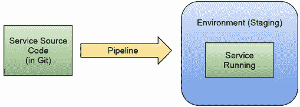

图 3.1 我们使用管道的概念将源代码转换成一个可以在环境中运行的工件。

你甚至可以拥有管道来自动化新服务的创建或添加新用户到你的身份管理解决方案。但这些管道究竟在做什么？我们需要从头开始创建我们的管道吗？我们如何在项目中实现这些管道？我们需要一个或多个管道来实现这一点？

第 3.2 节专注于使用管道构建可以复制、共享和多次执行以产生相同结果的解决方案。可以为不同的目的创建管道，通常将它们定义为一组步骤（按顺序依次执行）以产生一组预期的输出。基于这些输出，可以将这些管道分类到不同的组中。

大多数管道工具允许您将管道定义为一系列任务（也称为步骤或作业），这些任务将运行特定的作业或脚本以执行具体操作。这些步骤可以是任何事情，从运行测试、将代码从一个地方复制到另一个地方、部署软件、提供虚拟机、创建用户等。

管道定义可以由一个称为*管道引擎*的组件执行，该组件负责拾取管道定义以创建一个新的管道实例，该实例运行每个任务。任务将按顺序依次执行，每个任务的执行可能会生成可以与后续任务共享的数据。如果管道中涉及任何步骤出现错误，则管道停止，并将管道状态标记为错误（失败）。如果没有错误，则管道执行（也称为管道实例）可以标记为成功。根据管道定义和执行是否成功，我们应该验证是否生成了预期的输出或产生了输出。

在图 3.2 中，我们可以看到管道引擎正在拾取我们的管道定义并创建不同的实例，这些实例可以根据不同的输出进行不同的参数化。例如，管道实例 1 正确完成，而管道实例 2 未能执行定义中包含的所有任务。在这种情况下，管道实例 3 仍在运行。

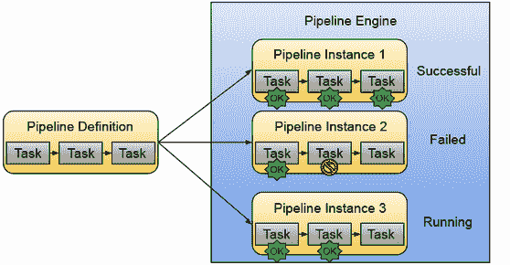

图 3.2 管道定义可以被管道引擎多次实例化，它描述了需要完成的工作。管道引擎创建管道实例，运行管道定义中包含的任务。这些管道实例可能会失败或运行更长时间，具体取决于它们执行的任务。作为用户，您始终可以询问管道引擎特定管道实例及其任务的状态。

如预期的那样，使用这些管道定义，我们可以创建大量的不同自动化解决方案，并且常见的是找到在管道引擎之上构建更具体解决方案的工具，甚至隐藏处理管道引擎的复杂性以简化用户体验。在接下来的章节中，我们将寻找不同工具的例子，一些更底层和灵活，一些更高级，更有观点，旨在解决一个非常具体的场景。

但这些概念和工具如何应用于交付云原生应用程序呢？对于云原生应用程序，我们对如何构建、打包、发布和发布我们的软件组件（服务）以及它们应该部署在哪里有非常具体的要求。在交付云原生应用程序的上下文中，我们可以定义两种主要的管道类型：

+   *服务管道*：这些负责构建、单元测试、打包和分发（通常到工件存储库）我们的软件工件。

+   *环境管道*：这些负责部署和更新给定环境中的所有服务，例如预发布、测试、生产等，通常从事实来源消费需要部署的内容。

第三章侧重于服务管道，而第四章侧重于帮助我们使用称为 GitOps 的更声明式方法定义环境管道的工具。

通过将构建过程（服务管道）和部署过程（环境管道）分开，我们给予负责在客户面前推广新版本的团队更多的控制权。服务管道和环境管道在不同的资源上执行，并且有不同的期望。下一节将详细介绍我们在服务管道中通常定义的步骤。第四章涵盖了环境管道的期望内容。

## 3.2 服务管道

服务管道定义并执行构建、打包和分发服务工件所需的所有步骤，以便将其部署到环境中。服务管道不负责部署新创建的服务工件，但它可以负责通知感兴趣的各方，服务有新的版本可用。

如果您标准化服务的构建、打包和发布方式，就可以为不同的服务共享相同的管道定义。尽量避免让每个团队为每个服务定义一个完全不同的管道，因为他们可能会重新发明已经被其他团队定义、测试和改进过的东西。需要执行相当多的任务，并且有一套约定，遵循这些约定可以减少完成整个流程所需的时间。

“服务管道”这个名字指的是我们应用程序的每个服务都将有一个管道，描述了该特定服务所需的任务。如果服务相似并且它们使用相似的技术堆栈，那么管道看起来相当相似是有意义的。这些服务管道的主要目标之一是包含足够的细节，以便在没有人工干预的情况下运行，自动化管道中的所有任务。

服务管道可以用作一种机制，以改善创建服务的开发团队和在生产环境中运行该服务的运维团队之间的沟通。开发团队期望这些管道能够运行，并在他们尝试构建的代码出现任何问题时通知他们。如果没有错误，他们期望作为管道执行的一部分生成一个或多个工件。运维团队可以向这些管道添加所有检查，以确保生成的工件已准备好投入生产。这些检查可以包括策略和合规性检查、签名、安全扫描以及其他要求，以验证生成的工件符合预期在生产环境中运行的标准。

注意：可能会诱使人们考虑为整个应用程序（服务集合）创建一个单一的管道，就像我们处理单体应用程序那样。然而，这样做违背了独立按各自节奏更新每个服务的初衷。你应该避免为一系列服务定义单一管道的情况，因为这会阻碍你独立发布服务的能力。

## 3.3 节省你时间的约定

服务管道可以在结构和范围上更加具有意见性。通过遵循这些强烈的意见和约定，你可以避免让你的团队定义每一个细节，并通过试错来发现这些约定。以下方法已被证明是有效的：

+   *主干开发:* 这里的想法是确保你源代码仓库的*主分支*中的内容始终准备好发布。你不合并会破坏此分支构建和发布过程的更改。只有当你合并的更改准备好发布时，你才进行合并。这种方法还包括使用功能分支，允许开发者在不破坏主分支的情况下工作。当功能完成并经过测试后，开发者可以向其他开发者发送拉取请求（变更请求）以供审查和合并。这也意味着当你将某些内容合并到主分支时，你可以自动创建服务（以及所有相关工件）的新版本。这创建了一个连续的发布流，每次新功能合并到主分支后都会生成新的发布。因为每个发布都是一致的并且已经过测试，所以你可以将这个新版本部署到一个包含你应用程序中所有其他服务的环境中。这种方法使得服务背后的团队能够继续前进并持续发布，而无需担心其他服务。

+   *源代码和配置管理:* 处理软件及其运行所需配置的方法有很多种。当我们谈论服务和分布式应用程序时，存在两种不同的思想流派：

    +   *一个服务/一个仓库/一个管道：* 您将服务的源代码以及所有需要构建、打包、发布和部署的配置保存在同一个仓库中。这使得服务背后的团队能够以他们想要的任何速度推送更改，而不用担心其他服务的源代码。通常的做法是将源代码保存在包含描述如何创建 Docker 镜像的 `Dockerfile` 和部署服务到 Kubernetes 集群所需的 Kubernetes 清单的同一个仓库中。这些配置应包括用于构建和打包您的服务的管道定义。

    +   *单仓库：* 或者，采用单仓库方法，其中使用单个仓库，并为仓库内的不同目录配置不同的管道。虽然这种方法可以工作，但您需要确保您的团队不会因为等待彼此的拉取请求合并而相互阻塞。

+   *消费者驱动的合同测试：* 您的服务使用合同对其他服务进行测试。对单个服务的单元测试不应需要其他服务正在运行。通过创建消费者驱动的合同，每个服务都可以对其功能进行其他 API 的测试。如果任何下游服务发布，新的合同将与所有上游服务共享，以便它们可以对其新版本进行测试。

我强烈推荐以下两本书：

+   《持续交付：通过构建、测试和部署自动化实现可靠的软件发布》（Continuous Delivery: Reliable Software Releases through Build, Test, and Deployment Automation）作者：Jez Humble 和 David Farley（Addison-Wesley Professional，2010 年）

+   《精通持续交付》（Grokking Continuous Delivery）作者：Christie Wilson（Manning Publications，2022 年）

这些书中提到的大多数工具都允许您实现这些实践以提高交付效率。如果我们考虑这些实践和惯例，我们可以将服务管道的职责定义为如下：*服务管道将源代码转换为一个或多个可以在环境中部署的工件。*

## 3.4 服务管道结构

带着这个定义，让我们看看在 Kubernetes 上运行的云原生应用的服务管道中包含哪些任务：

+   *注册以接收有关源代码仓库主分支更改的通知：*（源代码版本控制系统，如今通常是 Git 仓库。）如果源代码发生变化，我们需要创建一个新的版本。我们通过触发服务管道来创建新版本。这通常是通过 Webhook 或基于拉取的机制实现的，该机制检查是否有新更改提交。

+   *从仓库克隆源代码：* 为了构建服务，我们需要将源代码克隆到一台具有构建/编译源代码为可执行二进制格式的工具的机器上。

+   *为即将发布的版本创建一个新的标签:* 基于主干开发，每次发生更改时都可以创建一个新的发布版本。这将帮助我们了解正在部署的内容以及每个新版本中包含的更改。

+   *构建和测试源代码:*

    +   作为构建过程的一部分，大多数项目都会执行单元测试，如果出现任何失败，则会中断构建。

    +   根据我们的技术栈，我们需要在这个步骤中可用的工具，例如，编译器、依赖项、linters（静态源代码分析器）等。

    +   使用 CodeCov 等工具，它测量代码被测试覆盖的程度，如果未达到覆盖率阈值，则用于阻止更改合并。

    +   安全扫描器也用于评估我们的应用程序依赖项中的漏洞。如果发现新的 CVE（常见漏洞与暴露），更改也可以被阻止。

+   *将二进制工件发布到工件存储库:* 我们需要确保这些二进制文件可供其他系统消费，包括管道中的下一步。这一步涉及通过网络将二进制工件复制到不同的位置。这个工件将与在仓库中创建的标签具有相同的版本，为我们提供了从二进制文件到用于生成它的源代码的可追溯性。

+   *构建容器镜像:* 如果我们正在构建云原生服务，我们必须构建一个容器镜像。目前最常见的方法是使用 Docker 或其他容器替代品。这一步需要源代码仓库中有一个`Dockerfile`，定义如何构建这个容器镜像以及构建（构建器）容器镜像的机制。一些工具，如 CNCF Buildpacks ([`buildpacks.io`](https://buildpacks.io))，可以让我们避免使用`Dockerfile`并自动化容器构建过程。拥有适合工作的正确工具是至关重要的，因为可能需要为不同的平台生成多个容器镜像。对于一个发布的服务，我们可能有多个容器镜像，例如，一个用于`amd64`平台，另一个用于`arm64`平台。本书中的所有示例都是为这两个平台构建的。

+   *将容器镜像发布到容器注册库:* 与我们发布构建服务源代码时生成的二进制工件的方式相同，我们需要将我们的容器镜像发布到一个集中位置，以便其他人可以访问它。这个容器镜像将与在仓库中创建的标签和发布的二进制文件具有相同的版本。这有助于我们了解运行容器镜像时将运行哪个源代码。

+   *检查、验证并可选地打包用于 Kubernetes 部署的 YAML 文件* *(此处可以使用 Helm)：* 如果你在这些容器内部署 Kubernetes，你需要管理、存储和版本化一个 Kubernetes 清单，该清单定义了容器将如何部署到 Kubernetes 集群中。如果你使用包管理器如 Helm，你可以使用与二进制文件和容器镜像相同的版本对包进行版本控制。我打包 YAML 文件的规则如下：“如果你有足够多的人尝试安装你的服务（开源项目或非常大的全球分布式组织），你可能想要打包和版本化你的 YAML 文件。如果你只有少数团队和环境要处理，你很可能可以在不使用打包工具的情况下分发 YAML 文件。”

+   *(可选) 将这些 Kubernetes* *清单发布到集中位置:* 如果你使用 Helm，将 Helm 包（称为图表）推送到集中位置是有意义的。这将允许其他工具检索这些图表，以便它们可以在任意数量的 Kubernetes 集群中部署。正如我们在第二章中看到的，这些 Helm 图表现在可以作为 OCI 容器镜像分发到容器注册库。

+   *通知相关方关于服务新版本的更新:* 如果我们尝试从源自动化到运行中的服务，服务管道可以向所有可能等待新版本部署的相关服务发送通知。这些通知可以是向其他存储库的拉取请求、事件总线的事件、发送给对这些发布感兴趣团队的电子邮件等。基于拉取的方法也可以工作，其中代理持续监控工件存储库（或容器注册库）以查看是否存在给定工件的新版本。

图 3.3 展示了前述要点描述的步骤作为一系列步骤。大多数管道工具都将有一个可视化表示，允许你看到哪些步骤将被执行。

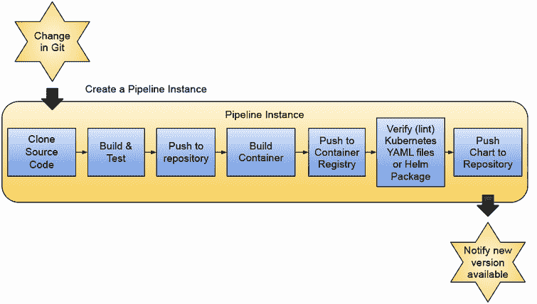

图 3.3 显示服务管道自动化了在多个环境中运行所需的所有步骤。服务管道通常由源代码的变化触发，但并不负责在特定环境中部署创建的工件。它们可以通知其他组件关于这些新版本的信息。

该管道的输出是一组可以部署到环境中以使服务运行起来的工件。服务需要以不依赖于任何特定环境的方式构建和打包。服务可以依赖于其他服务在环境中工作，例如数据库、消息代理或其他下游服务。

无论你选择哪种工具来实现这些管道，你应该关注以下特性：

+   管道根据更改自动运行（如果您遵循基于主干的开发，则为主分支的每个更改创建一个管道实例）。

+   管道执行将通知关于成功或失败状态，并带有清晰的消息。这包括有简单的方法来查找，例如，管道失败的原因和位置，以及执行每个步骤所需的时间。

+   每个管道执行都有一个唯一的 `id`，我们可以使用它来访问日志和运行管道时使用的参数，这样我们就可以重现用于解决问题的设置。使用这个唯一的 `id`，我们还可以访问管道中所有步骤创建的日志。通过查看管道执行，我们也应该能够找到所有生成的工件以及它们发布的位置。

+   管道也可以手动触发，并针对特殊情况配置不同的参数。例如，测试一个正在开发中的功能分支。

让我们深入了解服务管道在现实生活中的具体细节。

### 3.4.1 生活中的服务管道

在现实生活中，服务管道将在您将更改合并到存储库主分支的每次都运行。如果您遵循基于主干的开发方法，它应该这样工作：

+   当您将更改合并到主分支时，此服务管道将运行并使用最新的代码库创建一系列工件。如果服务管道成功，我们的工件将可发布。我们希望确保我们的主分支始终处于可发布状态，因此运行在主分支之上的服务管道必须始终成功。如果由于某种原因，此管道失败，负责服务的团队需要尽快将重点转向解决问题。换句话说，团队不应该将破坏其服务管道的代码合并到主分支中。我们还必须在我们的功能分支中运行管道来完成这项工作。

+   对于您的每个功能分支，应该运行一个非常相似的管道来验证分支中的更改是否可以构建、测试和与主分支一起发布。在现代环境中，使用 GitHub 拉取请求的概念来运行这些管道，以确保在合并任何拉取请求之前，管道验证了更改。

+   在将一组功能合并到主分支后，由于我们知道主分支始终可以发布，负责服务的团队决定标记一个新的发布版本。在 Git 中，基于主分支创建一个新的标签（指向特定提交的指针）。标签名称通常用于表示管道将创建的工件版本。

图 3.4 显示了为主分支配置的管道和一个仅当创建拉取请求时才验证功能分支的通用管道。可以触发这些管道的多个实例来持续验证新更改。


图 3.4 主分支和功能分支的服务管道

图 3.4 中所示的服务管道代表了每次将内容合并到主分支时必须执行的常见步骤。尽管如此，还有一些在此管道基础上进行的变体，您可能需要在不同的环境下运行。不同的事件可以触发管道执行，我们可以为不同的目的拥有略微不同的管道，例如：

+   *验证功能分支中的变更:* 此管道可以执行与主分支中相同的步骤，但生成的工件应包括分支名称，可能作为版本号或作为工件名称的一部分。每次变更后运行管道可能成本太高且不是每次都需要，因此您应根据需要做出决定。

+   *验证拉取请求（PR）/变更请求:* 管道将验证拉取请求/变更请求的更改是否有效，并且可以使用最近的更改生成工件。通常，管道的结果可以通知给负责合并 PR 的用户，如果管道失败，还可以阻止合并选项。此管道用于验证合并到主分支的内容是否有效并可发布。验证拉取请求和变更请求可以是一个很好的选项，以避免在功能分支的每次变更时运行管道。当开发者准备好从构建系统获取反馈时，它可以创建一个将触发管道的 PR。如果开发者在 PR 之上进行了更改，则管道将被重新触发。

尽管可以添加一些细微的差异和优化到这些管道中，但行为和生成的工件基本上是相同的。这些约定和方法依赖于执行足够的测试以验证生成的服务可以部署到环境中。

### 3.4.2 服务管道要求

本节涵盖了服务管道工作的基础设施要求以及管道执行工作所需的源存储库内容。

让我们从服务管道需要工作的基础设施要求开始：

+   *源代码变更通知的 Webhooks:* 首先，它需要访问权限来将 Webhooks 注册到包含服务源代码的 Git 仓库中，以便在新的更改合并到主分支时创建一个管道实例。

+   *工件存储库可用以及推送二进制工件的有效凭证:* 一旦构建了源代码，我们需要将新创建的工件推送到存储所有工件的工件存储库。这需要配置一个具有有效凭证的工件存储库以推送新工件。

+   *容器注册库和有效的凭证以推送新的容器镜像:* 就像我们需要推送二进制工件一样，我们还需要分发我们的 Docker 容器，以便 Kubernetes 集群在我们想要部署服务的新实例时可以获取到镜像。需要一个带有有效凭证的容器注册库来完成这一步骤。

+   *Helm 图表存储库和有效的凭证:* Kubernetes 清单可以打包并作为 Helm 图表分发。如果您使用 Helm，您必须有一个 Helm 图表存储库和有效的凭证来推送这些包。

图 3.5 显示了管道实例将与之交互的最常见外部系统。从 Git 仓库到工件存储库和容器注册库，维护这些管道的团队必须确保正确的凭证到位，并且这些组件可以从管道运行的位置（从网络角度来看）访问。

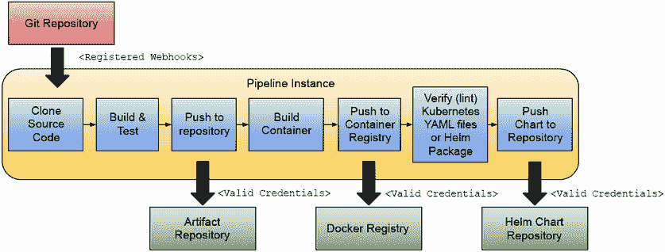

图 3.5 运行管道需要大量的基础设施就绪。这包括维护服务和存储库、创建用户和凭证，并确保这些服务（存储库）可以从远程位置访问。

为了让服务管道完成其工作，包含服务源代码的存储库也需要有一个`Dockerfile`或生成容器镜像的方式以及必要的 Kubernetes 清单，以便将服务部署到 Kubernetes 中。

图 3.6 显示了我们的服务源代码存储库的可能目录布局，其中包含所有将被编译成二进制格式的文件所在的源（src）目录。`Dockerfile`用于构建服务的容器镜像，Helm 图表目录包含创建可以分发以安装到 Kubernetes 集群的 Helm 图表所需的所有文件。您可以选择为每个服务创建一个 Helm 图表，或者为所有应用程序服务创建一个单独的 Helm 图表。

图 3.6 显示了服务布局，包括 Helm 图表定义。这有助于独立打包和分发服务。如果我们把构建、打包和运行我们的服务所需的所有内容都包含到一个 Kubernetes 集群中，服务管道需要在主分支的每次更改后运行，以创建新的服务版本。

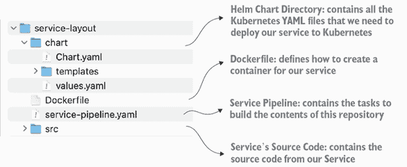

图 3.6 服务源代码存储库需要所有配置，以便服务管道能够工作。

总结来说，服务管道负责构建我们的源和相关工件以部署到环境中。如前所述，服务管道不负责将生成的服务部署到实际环境中。环境管道的责任将在下一章中介绍。

### 3.4.3 关于服务管道的意见、限制和妥协

在创建服务管道方面，没有“一刀切”的解决方案。在现实生活中，您必须根据您的需求做出妥协。在查看 Tekton、Dagger 和 GitHub Actions 等工具之前，让我快速谈谈一些我看到团队在斗争中的实际方面。以下是在设计您的服务管道时需要考虑的一些简短且非详尽的清单：

+   *避免制定严格的规则和观点来定义服务管道的起点和终点：* 例如，您的服务可能不需要像前几节中提到的那样打包成 Helm 图表。如果没有足够的案例表明您想要安装一个隔离的服务——例如，您的服务严重依赖于其他服务——那么从服务管道和图表定义中移除这一步骤可能很有意义。

+   *了解您组件和工件的生命周期：* 根据服务变更的频率及其依赖关系，服务管道可以相互链接，共同构建一组服务。映射这些关系并理解操作这些服务的团队的需求，将为您提供创建服务管道的正确粒度。例如，您可以允许您的团队持续发布新版本的服务的新容器镜像，但不同的团队控制着将所有应用程序服务捆绑在一起的 Helm 图表的节奏和发布。

+   *找到最适合您组织的方案：* 根据业务优先级优化端到端自动化。如果一个关键服务导致发布和部署延迟，请在尝试覆盖其他服务之前，确保服务管道已准备就绪并完全可用。创建通用的解决方案是没有意义的，因为这些方案可能需要一段时间才能发现您的组织在 80%的情况下都只使用单一服务。

+   *不要创建不必要的步骤，直到它们是必需的：* 我在这本书中多次提到 Helm 这样的工具来打包和分发 Kubernetes 清单，但我并不是建议这就是正确的方法。我使用 Helm 作为一个广泛采用的示例工具，但您可能处于不需要打包您的 Kubernetes 清单进行分发的情况。如果这种情况发生，您的服务管道不应该包含这一步骤。如果以后需要，您可以扩展您的服务管道以包含更多步骤。

现在我们来看看这个领域的一些工具。

## 3.5 服务管道的实际应用

目前市面上有几种管道引擎，甚至包括像 GitHub Actions（[`github.com/features/actions`](https://github.com/features/actions)）这样的完全托管服务以及几个知名的 CI（持续集成）托管服务，它们将为您提供大量集成，以便您构建和打包应用程序的服务。

在接下来的几节中，我们将考察两个项目：Tekton 和 Dagger。这些项目为你提供了与云原生应用程序一起工作的工具，正如我们将在第六章中看到的，它们使平台团队能够打包、分发和重用组织在一段时间内构建的特定知识。Tekton（[`tekton.dev`](https://tekton.dev)）被设计为 Kubernetes 的管道引擎。因为 Tekton 是一个通用的管道引擎，你可以用它创建任何管道。另一方面，一个名为 Dagger（[`dagger.io`](https://dagger.io)）的更新的项目被设计为可以在任何地方运行。我们将通过 GitHub Actions 对比 Tekton 和 Dagger。

### 3.5.1 Tekton 应用实例

Tekton 最初是由 Google 的 Knative 项目（[`knative.dev`](https://knative.dev)）的一部分创建的。（我们将在第八章中更深入地了解 Knative）。Tekton 最初被称为 Knative Build，后来从 Knative 中分离出来成为一个独立的项目。Tekton 的主要特点是它是一个为 Kubernetes 设计的云原生管道引擎。本节将探讨如何使用 Tekton 定义服务管道。

在 Tekton 中，你有两个主要概念：任务和管道。在 Tekton 中，管道引擎是一组理解如何执行 `Tasks` 和 `Pipelines` Kubernetes 资源组件。Tekton，就像本书中涵盖的大多数 Kubernetes 项目一样，可以安装到你的 Kubernetes 集群中。我强烈建议你查看他们的官方文档页面，该页面解释了使用像 Tekton 这样的工具的价值，网址为 [`tekton.dev/docs/concepts/overview/`](https://tekton.dev/docs/concepts/overview/)。

注意：我在这个存储库中包含了一系列逐步教程。你可以从查看如何在你的集群中安装 Tekton 以及 `tekton/hello-world/` 示例开始，该示例位于 [`github.com/salaboy/platforms-on-k8s/tree/main/chapter-3/tekton`](https://github.com/salaboy/platforms-on-k8s/tree/main/chapter-3/tekton)。

当你安装 Tekton 时，你安装了一套自定义资源定义，这是 Kubernetes API 的扩展，用于定义任务和管道。Tekton 还安装了知道如何处理 `Tasks` 和 `Pipelines` 资源的管道引擎。请注意，在安装 Tekton 之后，你还可以安装 Tekton Dashboard 和 `tkn` 命令行界面工具。

一旦安装了 Tekton 版本，你将看到一个名为 `tekton-pipelines` 的新命名空间，其中包含管道控制器（管道引擎）和管道 webhook 监听器，后者用于监听来自外部源的事件，例如 Git 仓库。

Tekton 中的任务看起来就像一个普通的 Kubernetes 资源，如列表 3.1 所示。

列表 3.1 简单的 Tekton 任务定义

```
apiVersion: tekton.dev/v1
kind: Task
metadata:
 name: hello-world-task                     ①
spec:
  params:
   - name: name                             ②
     type: string
     description: who do you want to welcome?
     default: tekton user
 steps:
   - name: echo
     image: ubuntu                          ③
     command:
       - echo                               ④
     args:
       - "Hello World: $(params.name)"      ⑤
```

① 元数据中定义的资源名称代表任务定义名称。

② 我们可以使用 `params` 部分来定义可以为我们的任务定义配置哪些参数。

③ 这个任务将使用名为 Ubuntu 的 Docker 镜像。

④ 在这种情况下，命令参数（args）只是一个“Hello World”字符串；请注意，你可以为更复杂的命令发送参数列表。

⑤ 在这种情况下，命令参数（args）只是一个“Hello World: $(params.name)”字符串，它将使用任务参数。

你可以在这个存储库中找到任务定义，以及一个逐步教程，教你如何在你的集群中运行它：[`github.com/salaboy/platforms-on-k8s/blob/main/chapter-3/tekton/hello-world/hello-world-task.yaml`](https://github.com/salaboy/platforms-on-k8s/blob/main/chapter-3/tekton/hello-world/hello-world-task.yaml)。

从这个例子中，你可以为任何你想要的东西创建一个任务，因为你有权定义使用哪个容器以及运行哪些命令。一旦你有任务定义，你需要通过将此文件应用到集群中（`kubectl apply -f task.yaml`）来使它对 Tekton 可用。通过将文件应用到 Kubernetes 中，我们只是在集群中使定义对 Tekton 组件可用，但任务不会运行。

如果你想要运行这个任务，一个任务可以被多次执行。Tekton 要求你创建一个类似于以下列表的 TaskRun 资源。

列表 3.2 任务运行表示任务定义的一个实例

```
apiVersion: tekton.dev/v1
kind: TaskRun
metadata:
  name: hello-world-task-run-1
spec:
  params: 
  - name: name
    value: "Building Platforms on top of Kubernetes reader!"  ①
  taskRef:
    name: hello-world-task                                    ②
```

① 我们可以为这个 TaskRun 定义特定的参数值。

② 我们需要引用我们想要运行的任务定义的名称。请注意，这个名称对于每个我们定义的任务资源都是唯一的。

TaskRun 资源可以在[`github.com/salaboy/platforms-on-k8s/blob/main/chapter-3/tekton/hello-world/task-run.yaml`](https://github.com/salaboy/platforms-on-k8s/blob/main/chapter-3/tekton/hello-world/task-run.yaml)找到。

如果你将这个 TaskRun 应用到集群中（`kubectl apply -f taskrun.yaml`），管道引擎将执行这个任务。你可以通过查看列表 3.3 中的 TaskRun 资源来查看 Tekton 任务的实际操作。

列表 3.3 获取所有 TaskRun 实例

```
> kubectl get taskrun
NAME                             SUCCEEDED       STARTTIME   COMPLETIONTIME
hello-world-task-run-1           True            66s         7s
```

如果你列出所有正在运行的 Pod，你会注意到每个任务都会创建一个 Pod，如列表 3.4 所示。

列表 3.4 列出与 TaskRuns 关联的所有 Pod

```
> kubectl get pods
> kubectl get pods
NAME                                     READY   STATUS   AGE
NAME                                     READY   STATUS   AGE
hello-world-task-run-1-pod               0/1     Init:0/1 2s
```

由于你有一个 Pod，你可以使用 Pod 名称来查看任务正在做什么，如列表 3.5 所示。

列表 3.5 使用 Pod 名称访问 TaskRun 日志

```
> kubectl logs -f hello-world-task-run-1-pod
> kubectl get pods
NAME                                     READY   STATUS   AGE
Defaulted container "step-echo" out of: step-echo, prepare (init)
> kubectl get pods
NAME                                     READY   STATUS   AGE
Hello World: Building Platforms on top of Kubernetes reader!
```

你刚刚执行了你的第一个 Tekton TaskRun。恭喜！但单个任务根本不有趣。如果我们能将多个任务串联起来，我们就可以创建我们的服务管道。让我们看看如何从这个简单的任务示例构建 Tekton 管道。

### 3.5.2 Tekton 中的管道

一个任务可能很有用，但当你使用管道创建这些任务的序列时，Tekton 才变得有趣。

管道是一系列按具体顺序排列的任务。以下管道使用了我们之前定义的任务定义。它打印一条消息，从 URL 获取一个文件，然后读取其内容，该内容被转发到我们的 Hello World 任务，该任务打印一条消息。

图 3.7 显示了一个包含三个 Tekton 任务的简单 Tekton 管道。

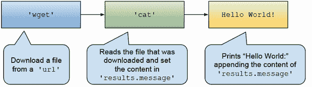

图 3.7 使用我们的 Hello World 任务的简单 Tekton 管道

在这个简单的管道中，我们使用了一个来自 Tekton Hub 的现有任务定义（`wget`），Tekton Hub 是一个社区仓库，托管通用任务，然后我们在管道内定义了`cat`任务，以展示 Tekton 的灵活性，最后使用我们在上一节中定义的`Hello World`任务。

让我们看看 Tekton 中定义的一个简单服务管道（`hello-world-pipeline.yaml`）。别害怕。这是一大堆 YAML，我警告过您。参见列表 3.6。

列表 3.6 管道定义

```
apiVersion: tekton.dev/v1
kind: Pipeline
metadata:
  name: hello-world-pipeline
  annotations:
    description: |
      Fetch resource from internet, cat content and then say hello
spec:
  results:                                            ①
  - name: message
    type: string
    value: $(tasks.cat.results.messageFromFile)
  params:                                             ②
  - name: url
    description: resource that we want to fetch
    type: string
    default: ""
  workspaces:                                         ③
  - name: files
  tasks:
  - name: wget
    taskRef:                                          ④
      name: wget
    params:
    - name: url
      value: "$(params.url)"
    - name: diroptions
      value:
        - "-P"  
    workspaces:
    - name: wget-workspace
      workspace: files
  - name: cat
    runAfter: [wget]
    workspaces:
    - name: wget-workspace
      workspace: files
    taskSpec:                                         ⑤
      workspaces:
      - name: wget-workspace
      results: 
        - name: messageFromFile
          description: the message obtained from the file
      steps:
      - name: cat
        image: bash:latest
        script: |
          #!/usr/bin/env bash
          cat $(workspaces.wget-workspace.path)/welcome.md | 
> kubectl get pods
NAME                                     READY   STATUS   AGE
➥tee /tekton/results/messageFromFile
  - name: hello-world
    runAfter: [cat]
    taskRef:
      name: hello-world-task                           ⑥
    params:
      - name: name
        value: "$(tasks.cat.results.messageFromFile)"  ⑦
```

① 管道资源可以定义在执行时预期的结果数组。任务

② 与任务一样，我们可以定义在运行此管道时用户可以设置的参数。如果需要，这些管道参数可以转发到单个任务。可以在它们执行时设置这些结果值。

③ 管道和任务允许使用 Tekton Workspaces 来存储持久信息。这可以用于在任务之间共享信息。由于每个任务都在其容器中执行，因此使用持久存储来共享信息很容易设置。

④ 我们使用对未创建的任务的任务引用。我们需要确保在为该管道创建 PipelineRun 之前安装此任务定义。

⑤ 如果我们想的话，可以在管道内定义任务。这使得管道文件更复杂，但有时有一个仅仅将其他任务粘合在一起的任务是有用的，就像在这个例子中一样。这个任务的唯一目的是读取下载文件的内容，并将其作为字符串提供给我们的 Hello World 任务，该任务不接受文件。

⑥ 这也要求在集群中安装“hello-world-task”定义。请记住，您始终可以运行“kubectl get tasks”来查看哪些任务可用。

⑦ 我们可以使用 Tekton 强大的模板机制为 Hello World 任务提供值。我们使用对“cat”任务结果的引用。

您可以在[`github.com/salaboy/platforms-on-k8s/blob/main/chapter-3/tekton/hello-world/hello-world-pipeline.yaml`](https://github.com/salaboy/platforms-on-k8s/blob/main/chapter-3/tekton/hello-world/hello-world-pipeline.yaml)找到完整的管道定义。

在应用管道定义之前，您需要安装由 Tekton 社区创建和维护的`wget` Tekton 任务：

```
kubectl apply -f
➥https://raw.githubusercontent.com/tektoncd/catalog/main/task/wget/0.1/wget.yaml
```

再次强调，您必须将此管道资源应用到您的集群中，以便 Tekton 能够识别：`kubectl apply -f hello-world-pipeline.yaml`。

正如你在管道定义中所见，`spec.tasks`字段包含一个任务数组。这些任务需要已经部署到集群中，并且管道定义定义了这些任务将执行的顺序。这些任务引用可以是你的任务，或者如示例所示，它们可以来自 Tekton 目录，这是一个包含社区维护的任务定义的存储库，你可以重用它。

同样地，因为任务需要 TaskRuns 来执行，所以每次你想执行你的管道时，你都需要创建一个 PipelineRun，如下面的列表所示。

列表 3.7 PipelineRun 代表我们管道的一个实例（执行）

```
apiVersion: tekton.dev/v1
kind: PipelineRun
metadata:
  name: hello-world-pipeline-run-1
spec:
  workspaces:                      ①
    - name: files
      volumeClaimTemplate: 
        spec:
          accessModes:
          - ReadWriteOnce
          resources:
            requests:
              storage: 1M 
  params: 
  - name: url                      ②
    value: 
➥"https://raw.githubusercontent.com/salaboy/salaboy/main/welcome.md"
  pipelineRef:
    name: hello-world-pipeline     ③
```

① 当我们创建一个 PipelineRun 时，我们需要将管道定义中定义的工作区绑定到实际的存储。在这种情况下，创建了一个 VolumeClaim，请求为 PipelineRun 使用 1 Mb 的存储。

② 管道参数“url”可以是任何你想要的 URL，因为它可以从 PipelineRun 上下文中访问（这意味着它可以访问该 URL，并且它不在防火墙后面）。

③ 与任务一样，我们需要提供我们想要用于此 PipelineRun 的管道定义的名称。

你可以在[`github.com/salaboy/platforms-on-k8s/blob/main/chapter-3/tekton/hello-world/pipeline-run.yaml`](https://github.com/salaboy/platforms-on-k8s/blob/main/chapter-3/tekton/hello-world/pipeline-run.yaml)找到 PipelineRun 资源。

当你将此文件应用到集群中`kubectl apply -f pipeline-run.yaml`时，Tekton 将通过运行管道定义中定义的所有任务来执行管道。在运行此管道时，Tekton 将为每个任务创建一个 pod 和三个 TaskRun 资源。管道只是编排任务，换句话说，就是创建 TaskRuns。

要检查 TaskRuns 是否已创建并且管道已成功执行，请参阅列表 3.8。

列表 3.8 从管道执行中获取任务运行

```
> kubectl get taskrun
NAME                                   SUCCEEDED  STARTTIME  COMPLETIONTIME
hello-world-pipeline-run-1-cat         True       109s       104s
hello-world-pipeline-run-1-hello-world True       103s       98s
hello-world-pipeline-run-1-wget        True       117s       109s
```

对于每个 TaskRun，Tekton 会创建一个 pod（见 3.9 列表）。

列表 3.9 检查属于管道的所有 TaskRun 是否已完成

```
> kubectl get pods
NAME                                         READY   STATUS         AGE
hello-world-pipeline-run-1-cat-pod           0/1     Completed      11s
hello-world-pipeline-run-1-hello-world-pod   0/1     Completed      5s
hello-world-pipeline-run-1-wget-pod          0/1     Completed      19s
```

查看来自`hello-world-pipeline-run-1-hello-world-pod`的日志，以查看任务打印了什么，如列表 3.10 所示。

列表 3.10 获取最后一个任务的日志

```
> kubectl logs hello-world-pipeline-run-1-hello-world-pod
Defaulted container "step-echo" out of: step-echo, prepare (init)
Hello World: Welcome, Internet traveler! Do you want to learn more about Platforms on top of Kubernetes? Check this repository: https://github.com/salaboy/platforms-on-k8s
```

你可以始终在 Tekton 仪表板中查看 Tasks、TaskRuns、Pipelines 和 PipelineRuns。要访问 Tekton 仪表板，如果你在集群中安装了它，你首先需要运行：

```
> kubectl port-forward -n tekton-pipelines 
➥services/tekton-dashboard 9097:9097
```

图 3.8 显示了 Tekton 仪表板用户界面，在那里我们可以探索我们的任务和管道定义，以及触发新的任务和管道运行并探索每个任务输出的日志。

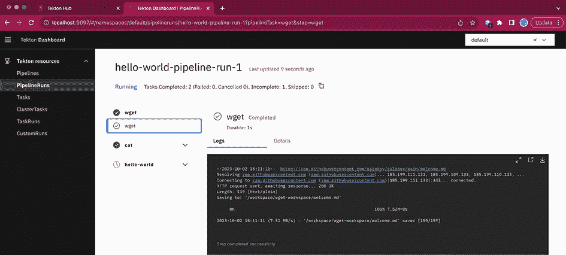

图 3.8 Tekton 仪表板中的我们的 PipelineRun 执行

如果需要，你可以在以下存储库中找到如何在你的 Kubernetes 集群中安装 Tekton 以及如何运行服务流水线的分步教程：[`github.com/salaboy/platforms-on-k8s/blob/main/chapter-3/tekton/hello-world/README.md`](https://github.com/salaboy/platforms-on-k8s/blob/main/chapter-3/tekton/hello-world/README.md)。

在教程的最后，你可以找到链接到我为每个会议应用服务定义的更复杂的流水线的链接。这些流水线更复杂，因为它们需要访问外部服务、发布工件和容器镜像的凭证，以及在集群内部执行一些特权操作的权限。如果你对这个部分感兴趣，请查看教程的此部分：[`github.com/salaboy/platforms-on-k8s/tree/main/chapter-3/tekton#tekton-for-service-pipelines`](https://github.com/salaboy/platforms-on-k8s/tree/main/chapter-3/tekton#tekton-for-service-pipelines)。

### 3.5.3 Tekton 优点和附加功能

正如我们所见，Tekton 非常灵活，允许你创建高级流水线，并且它还包括其他功能，例如：

+   输入和输出映射，用于在任务之间共享数据

+   事件触发器，允许你监听将触发流水线或任务的事件

+   一个命令行工具，可以轻松地从终端与任务和流水线交互

+   一个简单的仪表板，用于监控你的流水线和任务执行（图 3.9）

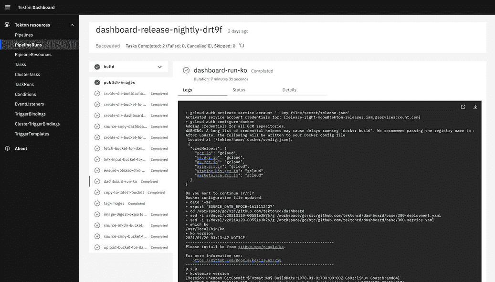

图 3.9 Tekton 仪表板——用于监控你的流水线的用户界面

图 3.9 展示了由社区驱动的 Tekton 仪表板，你可以使用它来可视化你的流水线执行。记住，因为 Tekton 是构建在 Kubernetes 之上的，你可以像监控其他 Kubernetes 资源一样使用 `kubectl` 来监控你的流水线。然而，对于不太懂技术的用户来说，没有什么能比用户界面更好的了。

但现在，如果你想要使用 Tekton 实现一个服务流水线，你将花费相当多的时间来定义任务、流水线、如何映射输入和输出、定义适合你的 Git 仓库的正确事件监听器，然后更深入地定义每个任务将使用的 Docker 镜像。创建和维护这些流水线及其相关资源可能变成一份全职工作，为此，Tekton 启动了一个项目来定义一个目录，其中可以共享任务（为未来的发布计划了流水线和资源）。Tekton 目录可在 [`github.com/tektoncd/catalog`](https://github.com/tektoncd/catalog) 找到。

在 Tekton 目录的帮助下，我们可以创建引用目录中定义的任务的管道。在前一节中，我们使用了从该目录下载的 `wget` 任务；您可以在 [`hub.tekton.dev/tekton/task/wget`](https://hub.tekton.dev/tekton/task/wget) 找到 `wget` 任务的完整描述。因此，我们不需要担心定义它们。您还可以访问 [`hub.tekton.dev`](https://hub.tekton.dev)，它允许您搜索任务定义，并提供有关在管道中安装和使用这些任务的详细文档（图 3.10）。

Tekton Hub 和 Tekton 目录允许您重用大量用户和公司创建的任务和管道。我强烈建议您查看 Tekton 概述页面，该页面总结了使用 Tekton 的优势，包括谁应该使用 Tekton 以及原因：[`tekton.dev/docs/concepts/overview/`](https://tekton.dev/docs/concepts/overview/)。

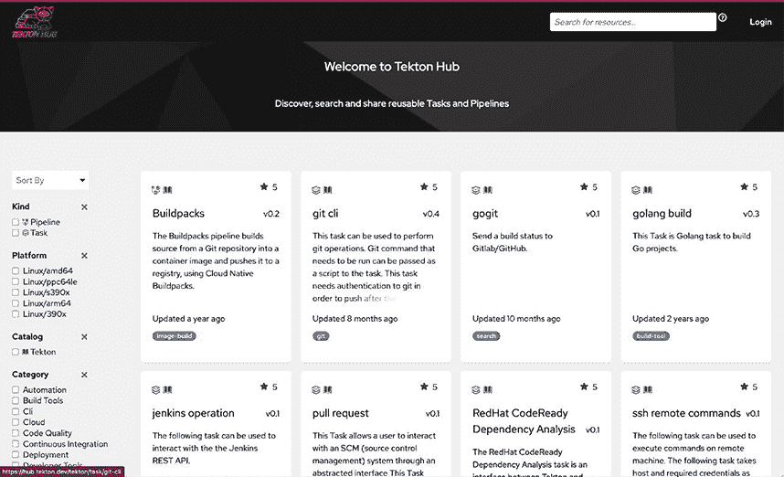

图 3.10 Tekton Hub 是一个共享和重用任务和管道定义的门户

Tekton 是云原生空间中相当成熟的项目，但也带来了一些挑战：

+   您需要在 Kubernetes 集群内部署并维护 Tekton。您不希望您的管道直接运行在应用程序工作负载旁边，因此您可能需要一个单独的集群。

+   在本地运行 Tekton 管道没有简单的方法。出于开发目的，您需要能够访问 Kubernetes 集群以手动运行管道。

+   您需要了解 Kubernetes 来定义和创建任务和管道。

+   虽然 Tekton 提供了一些条件逻辑，但它受到 YAML 中可以执行的操作以及 Kubernetes 的声明式方法的限制。

现在我们将跳入一个名为 Dagger 的项目，该项目旨在缓解一些这些问题，不是为了取代 Tekton，而是为了提供解决日常挑战的不同方法，当构建复杂管道时。

### 3.5.4 Dagger 在行动

Dagger ([`dagger.io`](https://dagger.io)) 的诞生有一个目标：“让开发者能够使用他们喜欢的编程语言构建管道，并且可以在任何地方运行。”Dagger 只依赖于容器运行时来运行可以使用代码定义的管道，而任何开发者都可以编写这些代码。Dagger 目前支持 Go、Python、TypeScript 和 JavaScript SDKs，但 Dagger 背后的团队正在快速扩展到新的语言。

Dagger 并不专注于 Kubernetes。平台团队必须确保，在团队使用 Kubernetes 强大且声明式特性的同时，开发团队也能高效工作并使用适合工作的适当工具。本节将探讨 Dagger 与 Tekton 的比较，它更适合的地方，以及它如何补充其他工具。

如果您想开始使用 Dagger，您可以查看这些资源：

+   *Dagger 文档*: [`docs.dagger.io`](https://docs.dagger.io)

+   *Dagger 快速入门*: [`docs.dagger.io/648215/quickstart/`](https://docs.dagger.io/648215/quickstart/)

+   *Dagger GraphQL playground*: [`play.dagger.cloud`](https://play.dagger.cloud)

Dagger，就像 Tekton 一样，也有一个管道引擎，但这个引擎可以在本地和远程工作，为不同环境提供统一的运行时。Dagger 不直接与 Kubernetes 集成。这意味着没有 Kubernetes CRDs 或 YAML 涉及。这取决于负责创建和维护这些管道的团队的技术和偏好，可能很重要。

在 Dagger 中，我们通过编写代码来定义管道。因为管道只是代码，所以这些管道可以使用任何代码打包工具进行分发。例如，如果我们的管道是用 Go 编写的，我们可以使用 Go 模块导入其他团队编写的管道或任务。如果我们使用 Java，我们可以使用 Maven 或 Gradle 打包和分发我们的管道库以促进重用。

图 3.11 展示了开发团队如何使用 Dagger SDKs 编写管道，然后使用 Dagger 引擎执行这些管道，使用任何 OCI 容器运行时，如 Docker 或 PodMan。无论你是在本地开发环境（装有 Docker for Mac 或 Windows 的笔记本电脑）中运行管道，还是在持续集成环境中，甚至是在 Kubernetes 集群内部，这些管道的行为都是相同的。

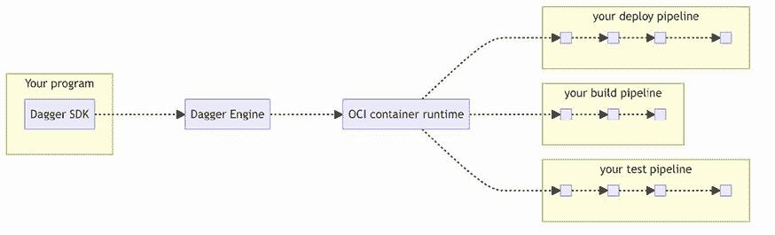

图 3.11 使用你喜欢的编程语言及其工具编写管道（来源：dagger.io）

Dagger 管道引擎负责协调管道中定义的任务，并优化每个任务使用的容器运行时请求的内容。Dagger 管道引擎的一个显著优势是它从一开始就被设计用来优化管道的运行方式。想象一下，如果你每天要构建成吨的服务多次，你不仅会保持你的 CPU 热起来，而且下载工件所产生的流量，一次又一次地，变得昂贵——如果你在云服务提供商之上运行，他们根据消费量向你收费，那就更贵了。

Dagger，类似于 Tekton，使用容器来执行管道中的每个任务（步骤）。管道引擎通过缓存先前执行的结果来优化资源消耗，防止你重新执行已经使用相同输入执行的任务。此外，你可以在你的笔记本电脑/工作站上本地运行 Dagger 引擎，甚至远程运行，甚至在 Kubernetes 集群内部。

当我将 Dagger 与类似 Tekton 的东西进行比较时，凭借我的开发者背景，我倾向于喜欢使用我熟悉的编程语言来编写管道的灵活性。对于开发者来说，创建、版本控制和共享代码很容易，因为我不需要学习任何新工具。

我不想看一个 Hello World 的例子，而是想展示在 Dagger 中服务管道的样子。因此，让我们看看如何使用 Dagger Go SDK 定义服务管道。以下代码片段展示了定义每个服务想要执行的主要目标的管道。看看 `buildService`、`testService` 和 `publishService` 函数。这些函数将构建、测试和发布每个服务的含义编码化。这些函数使用 Dagger 客户端在 Dagger 将要编排的容器内执行操作，如列表 3.11 所示。

列表 3.11 使用 Dagger 定义任务的 Go 应用程序

```
func main() {
  var err error
  ctx := context.Background()
  if len(os.Args) < 2 {
    ...)
  }
  client := getDaggerClient(ctx)
  defer client.Close()
  switch os.Args[1] {
    case "build":
      if len(os.Args) < 3 {
        panic(...)
      }
      _, err = buildService(ctx, client, os.Args[2])

    case "test":
      err = testService(ctx, client, os.Args[2])
    case "publish":
      pv, err := buildService(ctx, client, os.Args[2])

      err = publishService(ctx, client, os.Args[2], pv, os.Args[3])
    case "all":
      pv, err := buildService(ctx, client, os.Args[2])
      err = testService(ctx, client, os.Args[2])
      err = publishService(ctx, client, os.Args[2], pv, os.Args[3])
   default:
     log.Fatalln("invalid command specified")
}
```

你可以在 [`github.com/salaboy/platforms-on-k8s/blob/main/conference-application/service-pipeline.go`](https://github.com/salaboy/platforms-on-k8s/blob/main/conference-application/service-pipeline.go) 找到 `service-pipeline.go` 的定义。

通过运行 `go run service-pipeline.go build notifications-service`，Dagger 将使用容器构建我们的 Go 应用程序源代码，然后构建一个准备推送到容器注册库的容器。如果你查看列表 3.12 中的 `buildService` 函数，你会注意到它构建我们的服务源代码，在这种情况下，遍历目标平台列表（amd64 和 arm64）以为每个平台生成二进制文件。一旦生成了二进制文件，就使用 Dagger 客户端的 `client.Container` 函数创建一个容器。因为我们是以编程方式定义每个步骤，所以我们还可以定义后续构建需要缓存的文件（使用 `client.CacheVolume`）。

列表 3.12 任务：使用 Dagger 内置函数的 Go 代码

```
func buildService(ctx context.Context, 
                  client *dagger.Client, 
                  dir string) ([]*dagger.Container, error) {
  srcDir := client.Host().Directory(dir)
  platformVariants := make([]*dagger.Container, 0, len(platforms))
  for _, platform := range platforms {
    ctr := client.Container()
    ctr = ctr.From("golang:1.20-alpine")
    // mount in our source code
    ctr = ctr.WithDirectory("/src", srcDir)
    ctr = ctr.WithMountedCache("/go/pkg/mod", client.CacheVolume("go-mod"))
    ctr = ctr.WithMountedCache("/root/.cache/go-build", 
    ➥ client.CacheVolume("go-build"))
    // mount in an empty dir to put the built binary
    ctr = ctr.WithDirectory("/output", client.Directory())
    // ensure the binary will be statically linked and thus executable
    // in the final image
    ctr = ctr.WithEnvVariable("CGO_ENABLED", "0")
    // configure go to support different architectures
    ctr = ctr.WithEnvVariable("GOOS", "linux")
    ctr = ctr.WithEnvVariable("GOARCH", architecture(platform))
    // build the binary and put the result at the mounted output directory
    ctr = ctr.WithWorkdir("/src")
    ctr = ctr.WithExec([]string{"go", "build","-o", "/output/app",".",})
    // select the output directory
    outputDir := ctr.Directory("/output")
    // create a new container with the output and the platform label
    binaryCtr := client.Container(dagger.ContainerOpts{Platform: platform}).
                        WithEntrypoint([]string{"./app"}).
                        WithRootfs(outputDir)
    platformVariants = append(platformVariants, binaryCtr)
  }
  return platformVariants, nil
}
```

这些管道是用 Go 编写的，并构建 Go 应用程序，但没有任何阻止你构建其他语言并使用必要工具的限制。每个任务只是一个容器。Dagger 和开源社区将创建所有基本构建块，但每个组织都必须创建特定领域的库以与第三方或内部/遗留系统集成。通过专注于使开发者能够选择合适的工具来创建这些集成，Dagger 让你可以选择合适的工具来创建这些集成。无需编写插件，只需可以像其他库一样分发的代码即可。

尝试运行其中一个服务的管道，或者按照你可以在 [`github.com/salaboy/platforms-on-k8s/blob/main/chapter-3/dagger/README.md`](https://github.com/salaboy/platforms-on-k8s/blob/main/chapter-3/dagger/README.md) 找到的逐步教程进行操作。如果你运行管道两次，第二次运行几乎会立即完成，因为大多数步骤都是缓存的。

与 Tekton 相比，我们是在本地而不是在 Kubernetes 集群上运行 Dagger 管道，这有一些优势。例如，我们不需要 Kubernetes 集群来运行和测试这个管道，我们也不需要等待远程反馈。开发人员可以在将任何更改推送到 Git 存储库之前，使用本地容器运行时（如 Docker 或 Podman）运行这些管道，包括集成测试。快速的反馈使他们能够更快地工作。

但现在，这如何转化为远程环境？如果我们想在 Kubernetes 集群上远程运行这个管道怎么办？好消息是它的工作方式相同：它只是一个远程的 Dagger 管道引擎，将执行我们的管道。无论这个远程管道引擎在哪里，无论是运行在 Kubernetes 内部还是作为一个托管服务，我们的管道行为和管道引擎提供的缓存机制都将以相同的方式运行。图 3.12 显示了如果我们在 Kubernetes 内部安装 Dagger 管道引擎并运行相同的管道，执行将如何进行。

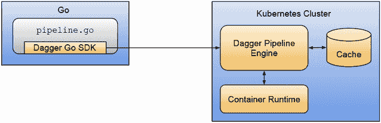

图 3.12 当配置与远程 Dagger Pipeline Engine 时，Dagger SDK 将收集并发送管道执行的上下文。

当 Dagger Pipeline Engine 安装在远程环境，如 Kubernetes 集群、虚拟机或任何其他计算资源中时，我们可以连接并运行我们的管道。Dagger Go SDK 从本地环境获取所有必要的上下文，并将其发送到 Dagger Pipeline Engine 以远程执行任务。我们不需要担心将应用程序源代码在线发布以供管道使用。

检查这个分步教程，了解如何在 Kubernetes 上运行你的 Dagger 管道：[`github.com/salaboy/platforms-on-k8s/blob/main/chapter-3/dagger/README.md#running-your-pipelines-remotely-on-kubernetes`](https://github.com/salaboy/platforms-on-k8s/blob/main/chapter-3/dagger/README.md#running-your-pipelines-remotely-on-kubernetes)。

如你所见，Dagger 将使用持久存储（缓存）来缓存所有构建和任务以优化性能并减少管道运行时间。负责在 Kubernetes 内部部署和运行 Dagger 的操作团队需要根据组织运行的管道来跟踪所需的存储量。

在本节中，我们看到了如何使用 Dagger 创建我们的服务管道。我们了解到 Dagger 与 Tekton 非常不同：你不需要使用 YAML 编写你的管道，你可以使用任何支持的编程语言编写你的管道，你可以使用相同的代码在本地或远程运行你的管道，并且你可以使用为你的应用程序使用的相同工具来分发你的管道。

从 Kubernetes 的角度来看，当你使用像 Dagger 这样的工具时，你会失去像管理其他 Kubernetes 资源一样管理你的流水线的 Kubernetes 原生方法。如果他们得到足够的反馈和请求，我认为 Dagger 社区会向那个方向发展。

从平台工程的角度来看，你可以创建和分发复杂的流水线（和任务）供你的团队使用和扩展，他们可以使用他们已经知道的工具。这些流水线无论在哪里执行都会以相同的方式运行，这使得它成为一个极其灵活的解决方案。平台团队可以利用这种灵活性来决定在哪里更有效地运行这些流水线（基于成本和资源），而不会复杂化开发者的生活，因为他们将始终能够在开发目的上本地运行他们的流水线。

### 3.5.5 我应该使用 Tekton、Dagger 还是 GitHub Actions？

正如你所看到的，Tekton 和 Dagger 为我们提供了构建无特定观点流水线的基本构建块。换句话说，我们可以使用 Tekton 和 Dagger 来构建服务流水线和几乎所有可想象的流水线。使用 Tekton，我们使用基于 Kubernetes 资源的方法、可扩展性和自我修复功能。使用 Kubernetes 原生资源可以帮助将 Tekton 与其他 Kubernetes 工具（如管理和监控 Kubernetes 资源）集成。使用 Kubernetes 资源模型，你可以将你的 Tekton 流水线和 PipelineRuns 视为任何其他 Kubernetes 资源，并重用所有现有的工具。

使用 Dagger，我们可以使用众所周知的编程语言和工具来定义我们的流水线，并在任何地方运行这些流水线（在本地工作站上运行的方式与远程运行相同）。这使得 Tekton 和 Dagger 成为平台构建者可以用来构建更多具有特定观点的流水线的完美工具，这些流水线可以被开发团队使用。

另一方面，你可以使用像 GitHub Actions 这样的托管服务。你可以查看如何使用 GitHub Actions 配置这里提到的所有项目的服务流水线。例如，你可以检查通知服务的服务流水线，[`github.com/salaboy/platforms-on-k8s/blob/main/.github/workflows/notifications-service-service-pipelines.yaml`](https://github.com/salaboy/platforms-on-k8s/blob/main/.github/workflows/notifications-service-service-pipelines.yaml)。

这个 GitHub Action 流水线使用 `ko-build` 构建服务，然后将新的容器镜像推送到 Docker Hub。请注意，这个流水线没有运行任何测试，它使用一个自定义步骤（[`github.com/salaboy/platforms-on-k8s/blob/main/.github/workflows/notifications-service-service-pipelines.yaml#L17`](https://github.com/salaboy/platforms-on-k8s/blob/main/.github/workflows/notifications-service-service-pipelines.yaml#L17)）来检查服务的代码是否已更改；只有当服务源代码有更改时，才运行构建并将镜像推送到 Docker Hub。

使用 GitHub Actions 的优势是，你不需要维护运行它们的底层基础设施，或者为运行这些管道的机器付费（如果你的量足够小）。但是，如果你正在运行大量的管道，并且这些管道是数据密集型的，GitHub Actions 将会变得昂贵。

由于成本相关的原因，或者由于行业法规限制你无法在云中运行管道，Tekton 和 Dagger 在为你提供构建和运行复杂管道的所有构建块方面表现出色。虽然 Dagger 已经专注于成本和运行时优化，但 Tekton 和其他管道引擎也将实现这一点。

需要注意的是，你可以将 Tekton 和 Dagger 与 GitHub 集成。例如，使用 Tekton Triggers ([`github.com/tektoncd/triggers/blob/main/docs/getting-started/README.md`](https://github.com/tektoncd/triggers/blob/main/docs/getting-started/README.md)) 来响应 GitHub 仓库中的提交。你还可以在 GitHub Action 中运行 Dagger，使开发者能够运行在 GitHub Actions 中本地执行的相同管道，而这通常不容易实现。

现在我们已经准备好了要部署到多个环境中的工件和配置，让我们看看通常被称为通过环境管道进行持续部署的 GitOps 方法。

## 3.6 回到平台工程

作为你的平台倡议的一部分，你需要帮助团队以自动化的方式构建他们的服务。大多数时候，必须做出决定，以标准化跨团队构建和打包服务的方式。如果平台团队能够提供一个团队可以尝试本地使用或测试的解决方案，并在将更改推送到 Git 仓库之前拥有正确的环境，这将提高这些团队所需的移动速度和反馈循环，从而增强他们的信心。可能需要单独的设置来验证拉取请求，并在主分支不可发布时提醒团队。

虽然 GitHub Actions（以及其他托管服务）是一个流行的解决方案，但平台工程团队可能会根据他们的预算和其他平台级决策（例如与 Kubernetes API 保持一致）选择不同的工具或服务。

我为这本书的演示和分步教程（[`github.com/salaboy/platforms-on-k8s/tree/main/chapter-3`](https://github.com/salaboy/platforms-on-k8s/tree/main/chapter-3)）做了有意识的选择，这些选择可能与你的项目大相径庭。首先，因为本书中展示的项目复杂度相当低，而且为了保持资源组织化和版本控制以支持未来的修订，所有应用程序服务的源代码都被保存在一个简单的目录结构下。将所有服务的源代码集中存储在同一存储库中的这一决定影响了我们的服务管道的形状。

提供的服务管道（无论是使用 Tekton 还是 Dagger）都将用户想要构建的存储库目录作为参数。如果你设置了触发管道的 webhooks，你必须过滤更改的位置，以确定要运行哪个服务管道。这增加了整个设置的复杂性。如前几节所建议，一种替代方法是每个服务有一个存储库。这使你能够为每个服务拥有定制的服务管道定义（可以重用通用任务）和简单的 webhook 定义，因为你确切知道在更改时运行什么。拥有每个服务一个存储库的主要问题是处理用户和访问权限，因为添加新服务将迫使你创建新的存储库并确保开发者可以访问它。

平台团队还需要做出的另一个重大决策是关于服务管道的起点和终点。在本例中提供的示例中，服务管道从提交更改开始，在为每个服务发布容器镜像后结束。对于行走骨架服务的服务管道不会打包和发布单个服务的 Helm 图表。图 3.13 显示了由示例定义的服务管道的责任。

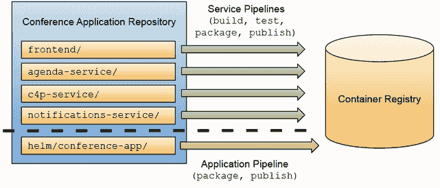

图 3.13 服务管道和应用管道有不同的生命周期。

你需要问自己，为每个服务创建 Helm 图表是一个好主意还是过度设计。你应该清楚地了解谁将消费这些工件。尝试回答以下问题，以找到适合你团队的战略：

+   你将单独部署服务，还是它们总是作为一个集合部署？

+   你的服务多久会变化一次？你是否有一些变化更频繁的服务？

+   将有多少团队部署这些服务？

+   你是否在创建一个开源社区将消费的工件，许多用户将单独部署服务？

对于本章提供的示例，提供了一个单独的应用级管道来打包和发布会议应用的 Helm 图表。

这个决策背后的原因很简单：每个读者都会在集群中安装应用程序，我需要一个简单的方法来实现这一点。如果读者不想在他们的集群中使用 Helm 安装应用程序，他们可以导出运行 `helm template` 命令的输出，并使用 `kubectl` 应用该输出。那个决策背后的另一个重要因素是 Helm 图表和应用程序服务的生命周期。应用程序的形状变化不大。Helm 图表定义可能只会改变，如果我们需要添加或删除服务。然而，服务的代码变化很大，我们希望让在这些服务上工作的团队能够继续向它们添加更改。

图 3.14 显示了服务管道的两种互补方法。在开发人员环境中运行的服务提供快速的反馈循环，而在远程运行的服务生成团队将用于在不同环境中部署相同应用程序的工件。

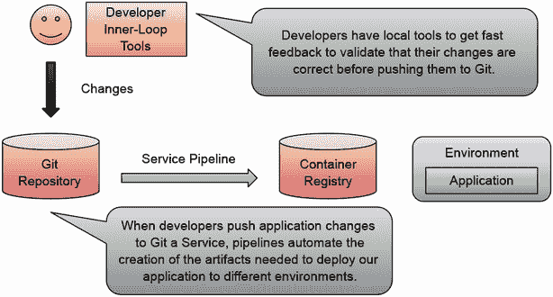

图 3.14 本地与远程服务管道

最后，本书中的所有示例都没有提供配置来从 Git 仓库中访问 webhooks，除了使用 GitHub Actions 链接的那些。推动读者获取正确的令牌并使用多个 Git 提供商配置这并不复杂，但解释它将占用我许多页面。消费这些机制的团队不需要担心处理服务管道所需的凭证。作为一个平台团队，自动化开发（和其他）团队访问凭证以连接到服务是加快他们工作流程的基本方法。

## 摘要

+   服务管道定义了如何从源代码到可以在多个环境中部署的工件的过程。遵循基于主干的开发和“一个服务 = 一个仓库”的实践有助于您的团队更高效地标准化构建和发布软件工件。

+   您需要找到适合您团队和应用程序的方法。没有一种适合所有情况的解决方案，必须做出妥协。您的应用程序的服务多久会发生变化，您又是如何将它们部署到环境中的？回答这些问题可以帮助您定义服务管道的起点和终点。

+   Tekton 是一个为 Kubernetes 设计的管道引擎。您可以使用 Tekton 设计您自己的管道，并使用在 Tekton 目录中公开可用的所有共享任务和管道。您现在可以在您的集群中安装 Tekton 并开始创建管道。

+   Dagger 允许您使用您喜欢的编程语言编写和分发管道。这些管道可以在任何环境中执行，包括您的开发人员的笔记本电脑。

+   像 GitHub Actions 这样的工具非常有用，但可能很昂贵。平台构建者必须寻找提供足够灵活性的工具，以构建和分发其他团队可以重用并遵循公司指南的任务。允许团队在本地运行他们的管道是一个很大的加分项，因为它将改善他们的开发体验并缩短他们的反馈时间。

+   如果您遵循了逐步教程，您就获得了使用 Tekton 和 Dagger 创建和运行服务管道的实践经验。
