# 4 环境管道：部署云原生应用程序

本章涵盖

+   将生成的工件部署到环境中

+   使用环境管道和 GitOps 来管理环境

+   使用 Helm 与 Argo CD 高效交付软件

本章介绍了*环境管道*的概念。我们涵盖了将服务管道创建的工件部署到具体运行环境直至生产的步骤。我们将探讨在云原生领域出现的一种常见做法，称为 GitOps，它允许我们使用 Git 存储库来定义和配置我们的环境。最后，我们将探讨一个名为 Argo CD 的项目，它实现了在 Kubernetes 上管理应用程序的 GitOps 方法。本章分为三个主要部分：

+   环境管道

+   使用 Argo CD 实现的环境管道

+   服务+环境管道协同工作

## 4.1 环境管道

我们可以构建尽可能多的服务并产生新版本，但如果这些版本不能自由地跨越不同的环境进行测试，最终被我们的客户使用，我们的组织将难以拥有顺畅的端到端软件交付实践。环境管道负责配置和维护我们的环境。

对于公司来说，根据不同的目的拥有不同的环境是很常见的，例如，一个预发布环境，开发者可以部署他们服务的最新版本；一个质量保证（QA）环境，在这里进行手动测试；以及一个或多个生产环境，这是真实用户与我们的应用程序交互的地方。这些（预发布、QA 和生产）只是例子。我们拥有的环境数量不应该有任何硬性限制。图 4.1 展示了单个发布版本如何在不同的环境中流动，直到达到生产环境，在那里它将面向我们的应用程序用户公开。

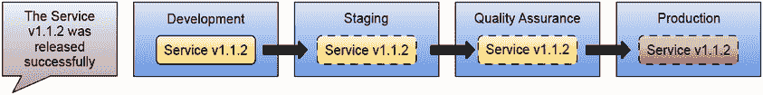

图 4.1 发布的服务在不同环境中的流动

每个环境（开发、预发布、QA 和生产）将有一个环境管道。这些管道将负责保持环境配置与运行环境硬件同步。这些环境管道使用包含环境配置的存储库作为真相来源，包括需要部署哪些服务和每个服务的哪个版本（图 4.2）。

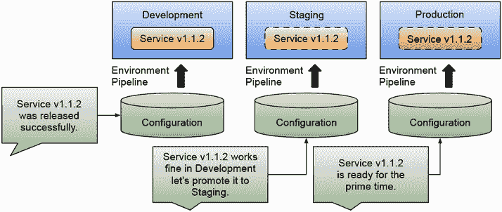

图 4.2 将服务推广到不同环境意味着更新环境配置

如果你使用这种方法，每个环境都将有自己的配置存储库。推广新发布的版本意味着更改环境配置存储库以添加新服务或更新配置以指向新发布的版本。一些组织将所有敏感环境配置都保存在单个存储库中；这有助于集中管理读取和修改这些配置所需的凭证。

这些配置更改可以是自动化的，或者需要手动干预。对于更敏感的环境，例如生产环境，你可能需要在添加或更新服务之前要求不同的利益相关者签字。

但环境管道是从哪里来的？为什么你之前没有听说过它们？在深入探讨环境管道可能看起来像什么之前，我们需要了解为什么这从一开始就很重要。

### 4.1.1 过去这是如何工作的，最近又发生了什么变化？

传统上，创建新的环境既困难又昂贵。由于这两个原因，按需创建新环境并不是一件事情。首先，开发人员用来创建应用程序的环境和应用程序为最终用户运行的环境之间的差异完全不同。这些差异，不仅在计算能力上，给负责运行这些应用程序的运维团队带来了巨大的压力。根据环境的能力，他们需要调整应用程序的配置（他们没有设计）。其次，自动化复杂设置配置的工具已经变得主流。借助容器和 Kubernetes，这些工具的设计和工作方式在云提供商之间实现了标准化。这些工具已经达到了开发者可以使用他们选择的编程语言来编码基础设施，或者依赖 Kubernetes API 来创建这些定义的程度。

在云原生应用兴起之前，部署一个新的应用程序或应用程序的新版本需要关闭服务器，运行一些脚本，复制一些二进制文件，然后再次启动服务器，使新版本运行。服务器再次启动后，应用程序可能会失败启动。因此可能需要更多的配置调整。大多数这些配置都是在服务器本身手动完成的，这使得很难记住并跟踪更改了什么以及为什么。

作为自动化这些流程的一部分，像 Jenkins ([`www.jenkins.io/`](https://www.jenkins.io/), 一个非常流行的管道引擎) 和/或脚本这样的工具被用来简化新二进制的部署。因此，而不是手动停止服务器并复制二进制文件，操作员可以运行一个 Jenkins 作业，定义他们想要部署的工件版本，Jenkins 将运行作业并通知操作员关于输出的信息。这种方法有两个主要优点：

+   像 Jenkins 这样的工具可以访问环境的凭证，避免操作员手动访问服务器。

+   像 Jenkins 这样的工具会记录每次作业执行和参数，使我们能够跟踪执行了什么以及执行结果。

与手动部署新版本相比，虽然使用像 Jenkins 这样的工具进行自动化是一个很大的改进，但仍然存在一些问题，例如具有固定环境的环境与软件开发和测试的地方完全不同。我们需要指定环境是如何创建和配置的，包括操作系统的版本和安装到机器或虚拟机中的软件，以减少不同环境之间的差异。虚拟机在完成这项任务时非常有帮助，因为我们可以轻松地创建两个或更多配置相似的虚拟机。

我们甚至可以将这些虚拟机提供给我们的开发者使用。但现在我们遇到了一个新的问题。我们需要新的工具来管理、运行、维护和存储我们的虚拟机。如果我们有多个物理机想要在上面运行虚拟机，我们不希望我们的运维团队在每个服务器上手动启动这些虚拟机。因此，我们需要一个虚拟化软件来监控和运行物理计算机集群中的虚拟机。

使用像 Jenkins 和虚拟机（带有虚拟化软件）这样的工具是一个巨大的改进。因为我们实现了一些自动化，操作员不需要访问服务器或虚拟机来手动更改配置，并且我们的环境是通过在固定的虚拟机配置中预定义的配置创建的。像 Ansible ([`www.ansible.com/`](https://www.ansible.com/)) 和 Puppet ([`www.puppet.com/`](https://www.puppet.com/)) 这样的工具就是建立在这些概念之上的。

图 4.3 显示了配置为创建托管我们应用程序的虚拟机的 Jenkins 作业。但请注意，这些虚拟机托管了一个完整的操作系统。该操作系统捆绑的所有工具都将与你的应用程序一起运行！

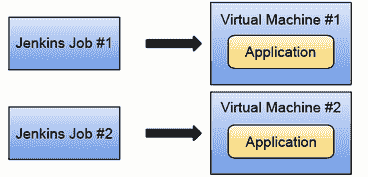

图 4.3 中的 Jenkins 作业或脚本以命令式的方式封装了如何进行部署的操作知识，定义了需要按步骤完成的操作。这是一个复杂且难以维护和修改的任务，并且非常特定于我们使用的工具。另一方面，虚拟机资源密集且不可跨云提供商迁移。

虽然这种方法在业界仍然很常见，但还有很多改进的空间，例如以下方面：

+   Jenkins 作业和脚本本质上是命令式的，这意味着它们指定了需要按步骤执行的操作。这有一个很大的缺点，因为如果有什么变化——比如说服务器不再存在或者需要更多数据来验证服务——管道的逻辑将失败，并且需要手动更新。

+   虚拟机很重。每次你启动一个虚拟机时，你都在启动一个操作系统的完整实例。运行操作系统进程不会增加任何业务价值；集群越大，操作系统开销就越大。在开发者的环境中运行虚拟机可能是不可能的。

+   环境的配置是隐藏的，并且没有版本控制。大多数环境配置以及部署是如何进行的都被编码在像 Jenkins 这样的工具中，其中复杂的管道往往会失去控制，使得更改非常危险，迁移到新的工具和堆栈也非常困难。

+   每个云服务提供商都有创建虚拟机的不标准方式。这可能会使我们陷入供应商锁定的情况。如果我们为亚马逊网络服务创建了虚拟机，我们就无法将这些虚拟机运行在谷歌云平台或微软 Azure 上。

团队是如何使用现代工具来处理这个问题的？这是一个简单的问题。我们现在有 Kubernetes 和容器，它们旨在通过依赖容器和广泛采用的 Kubernetes API 来解决由虚拟机和云提供商的可移植性带来的开销。Kubernetes 还提供了构建块，确保我们不需要关闭服务器来部署新应用程序或更改它们的配置。如果我们按照 Kubernetes 的方式行事，我们的应用程序不应该有任何停机时间。

但仅 Kubernetes 本身并不能解决配置集群本身的过程。我们如何应用更改到它们的配置，或者部署应用程序到这些集群涉及的过程和工具，也同样重要。这就是为什么你可能听说过 GitOps。

什么是 GitOps，它与我们的环境管道有何关联？我们将在下一节回答这个问题。

### 4.1.2 什么是 GitOps，它与环境管道有何关联？

如果我们不希望在像 Jenkins 这样的工具中编码所有的操作知识，那里很难维护、更改和跟踪它，我们需要不同的方法。

GitOps 这个术语是由 CNCF 的 GitOps 工作组定义的（[`opengitops.dev/`](https://opengitops.dev/)），它定义了使用 Git 作为真相来源，以声明性方式创建、维护和应用我们环境和应用程序配置的过程。OpenGitOps 定义了我们在谈论 GitOps 时需要考虑的四个核心原则：

1.  *声明式*: 由 GitOps 管理的系统([`github.com/open-gitops/documents/blob/v1.0.0/GLOSSARY.md#software-system`](https://github.com/open-gitops/documents/blob/v1.0.0/GLOSSARY.md#software-system))必须以声明式([`github.com/open-gitops/documents/blob/v1.0.0/GLOSSARY.md#declarative-description`](https://github.com/open-gitops/documents/blob/v1.0.0/GLOSSARY.md#declarative-description))表达其所需状态。如果我们使用 Kubernetes 清单，我们就有了这个保障，因为我们使用 Kubernetes 将进行协调的声明性资源来定义需要部署的内容以及如何配置。

1.  *版本化和不可变*: 所需状态以强制执行不可变性和版本化并保留完整版本历史记录的方式存储([`github.com/open-gitops/documents/blob/v1.0.0/GLOSSARY.md#state-store`](https://github.com/open-gitops/documents/blob/v1.0.0/GLOSSARY.md#state-store))。OpenGitOps 倡议不强制使用 Git。一旦我们的定义被存储、版本化和不可变，我们就可以将其视为 GitOps。这为将文件存储在例如 S3 存储桶中打开了大门，这些存储桶也是版本化和不可变的。

1.  *自动拉取*: 软件代理自动从源中拉取所需状态声明。GitOps 软件以自动化的方式定期从源中拉取更改。用户无需担心何时拉取更改。

1.  *持续协调*: 软件代理持续([`github.com/open-gitops/documents/blob/v1.0.0/GLOSSARY.md#continuous`](https://github.com/open-gitops/documents/blob/v1.0.0/GLOSSARY.md#continuous))观察系统状态，并尝试应用([`github.com/open-gitops/documents/blob/v1.0.0/GLOSSARY.md#reconciliation`](https://github.com/open-gitops/documents/blob/v1.0.0/GLOSSARY.md#reconciliation))所需状态。这种持续的协调有助于我们在环境和整个交付过程中建立弹性，因为我们有负责应用所需状态并监控环境配置漂移的组件。如果协调失败，GitOps 工具将通知我们问题，并持续尝试应用更改，直到达到所需状态。

通过将环境和应用程序的配置存储在 Git 仓库中，我们可以跟踪和版本化我们所做的更改。通过依赖 Git，如果这些更改不符合预期，我们可以轻松地回滚更改。GitOps 涵盖了配置存储以及这些配置如何应用到应用程序运行的计算资源中。

GitOps 是在 Kubernetes 的背景下提出的，但这种方法并不新颖，因为配置管理工具已经存在很长时间了。相反，GitOps 代表了这些经过验证的方法的改进，这些方法可以应用于任何软件操作，而不仅仅是 Kubernetes。随着云提供商管理基础设施即代码的工具的普及，像 Chef ([`www.chef.io/`](https://www.chef.io/))、Ansible ([`www.ansible.com/`](https://www.ansible.com/))、Terraform ([`www.terraform.io/`](https://www.terraform.io/))和 Pulumi ([`www.pulumi.com/`](https://www.pulumi.com/))这样的工具受到运维团队的喜爱，因为这些工具允许他们定义如何配置云资源，并以可重复的方式一起配置它们。如果您需要一个新的环境，只需运行这个 Terraform 脚本或 Pulumi 应用程序，然后，环境就绪并运行。这些工具还配备了与云提供商的 API 通信的能力，以便我们可以自动化这些集群的创建。

使用 GitOps，我们管理配置并依赖于 Kubernetes API 作为将我们的应用程序部署到 Kubernetes 集群的标准方式。使用 GitOps，我们将 Git 仓库作为我们环境内部配置（Kubernetes YAML 文件）的真相来源，同时消除了手动与 Kubernetes 集群交互的需求，以避免配置漂移和安全问题。当使用 GitOps 工具时，我们可以期待有软件代理定期从真相来源（本例中的 Git 仓库）拉取，并持续监控环境以提供连续的协调循环。这确保 GitOps 工具将尽最大努力确保仓库中表达的期望状态与我们的实际环境相符。

我们可以通过运行环境管道重新配置任何 Kubernetes 集群，使其具有存储在我们 Git 仓库中的相同配置。图 4.4 展示了这些组件是如何组合在一起的。在左侧，我们有可以创建云资源（包括 Kubernetes 集群和我们的环境的应用程序基础设施）的基础设施即代码工具。一旦环境设置完成，使用 GitOps 方法的环境管道可以将我们环境的所有配置同步到目标 Kubernetes 集群，并定期检查 Git 中存储的配置是否与集群同步。

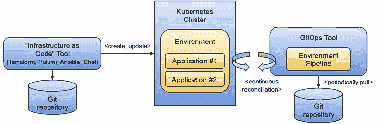

图 4.4 基础设施即代码、GitOps 和环境管道协同工作。基础设施即代码工具通过运行脚本以可重复的方式创建云资源。我们可以使用这些工具创建出所有相同的 Kubernetes 集群。GitOps 工具运行环境管道以持续地协调声明性配置，这些配置存储在版本化和不可变的仓库中。

通过分离基础设施和应用关注点，我们的环境管道使我们能够确保我们的环境易于复制和更新，无论何时需要。通过依赖 Git 作为真相的来源，我们可以根据需要回滚我们的基础设施和应用更改。重要的是要理解，因为我们正在使用 Kubernetes API，我们的环境定义现在以声明式的方式表达，支持在应用这些配置的上下文中进行更改，并让 Kubernetes 处理如何实现这些配置所表达的状态。

图 4.5 展示了这些交互，其中操作团队仅更改包含我们环境配置的 Git 仓库，然后执行一个管道（一系列步骤）来确保此配置与目标环境保持同步。

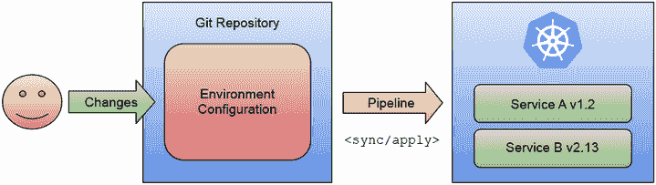

图 4.5 使用 Git 中的配置定义集群状态（GitOps）。环境管道监控 Git 仓库中的配置更改，并在检测到新更改时将这些更改应用到基础设施（Kubernetes 集群）中。遵循这种方法允许我们通过在 Git 上回滚提交来撤销基础设施中的更改。我们还可以通过在另一个集群上运行相同的管道来复制确切的环境配置。

当您开始使用环境管道时，目标是停止手动交互、更改或修改环境的配置，所有交互都仅通过这些管道进行。为了给出一个非常具体的例子，我们不是直接在我们的 Kubernetes 集群中执行 `kubectl apply -f` 或 `helm install`，而是由一个操作员负责根据包含集群中需要安装的定义和配置的 Git 仓库的内容来运行这些命令。

理论上，一个监控 Git 仓库并对更改做出反应的操作员就是您所需要的，但在实践中，需要一系列步骤来确保我们对部署到我们环境中的内容有完全的控制。因此，将 GitOps 视为一个管道有助于我们理解，对于某些场景，我们可能需要在每次环境配置更改时触发的这些管道中添加额外的步骤。

让我们用更具体的工具来看这些步骤，这些工具在现实场景中很常见。

### 4.1.3 环境管道中涉及到的步骤

无论您将何种应用程序部署到不同的环境中，环境管道通常包含一系列预定义的步骤。图 4.6 展示了这些步骤作为一个序列，因为大多数情况下，这些步骤是在脚本内部定义的，或者编码在负责检查每个步骤是否正确执行的工具中。让我们更深入地探讨这些步骤的细节：

+   *响应配置变化*：这可以通过轮询或推送来完成：

    +   *对更改进行投票:* 组件可以拉取仓库并检查自上次检查以来是否有新的提交。如果检测到新更改，则会创建一个新的环境管道实例。

    +   *使用 webhooks 推送更改:* 如果仓库支持 webhooks，仓库可以通知我们的环境管道有新的更改需要同步。记住，GitOps 原则声明“自动拉取”，这意味着我们可以使用 webhooks，但不应该完全依赖它们来获取配置更改更新。

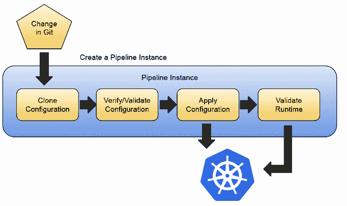

图 4.6 Kubernetes 环境的环境管道

+   *从包含我们环境所需状态的仓库中克隆源代码:* 此步骤从包含环境配置的远程 Git 仓库中获取配置。像 Git 这样的工具仅获取远程仓库与我们本地拥有的内容之间的差异。

+   *将所需状态应用到实际环境中:* 这通常包括执行 `kubectl apply -f` 或 `helm install` 命令来安装新版本的工件。请注意，无论是使用 `kubectl` 还是 `helm`，Kubernetes 都足够智能，能够识别更改的位置，并且只应用差异。一旦管道在本地拥有所有配置，它将使用一组凭证将这些更改应用到 Kubernetes 集群。请注意，我们可以微调管道对集群的访问权限，以确保它们不会被从安全角度滥用。这也允许您从部署服务的集群中移除个别团队成员的访问权限。

+   *验证更改是否已应用，并且状态与 Git 仓库内描述的一致（处理配置漂移**）:* 一旦更改应用到生产集群，需要检查新版本的服务是否正常运行，以确定是否需要回滚到之前的版本。如果需要回滚更改，由于所有历史记录都存储在 Git 中，所以操作非常简单。应用上一个版本只需查看仓库中的上一个提交。

+   *验证您的应用程序按预期工作:* 一旦配置正确应用，我们需要验证部署的应用程序是否按预期工作，并且正在执行它们应该执行的操作。

为了使环境管道工作，需要一个能够将更改应用到环境的组件，并且需要根据正确的访问凭证进行相应配置。这个组件背后的主要思想是确保没有人会通过手动与集群交互来更改环境配置。这个组件是唯一允许更改环境配置、部署新服务、升级版本或从环境中删除服务的组件。为了使环境管道工作，需要满足以下两个条件：

+   存储环境所需状态的仓库必须包含所有必要的配置，以确保环境能够成功创建和配置。

+   环境将运行的 Kubernetes 集群需要配置正确的凭证，以便管道可以更改状态。

“环境管道”这个术语指的是每个环境都将有一个与之关联的管道。由于通常需要多个环境（开发、测试、生产）来交付应用程序，因此每个环境都将有一个负责部署和升级其中运行的组件的管道。通过使用这种方法，通过向环境的仓库发送拉取请求/更改请求来实现不同环境之间服务的提升。管道将在目标集群中反映这些更改。

### 4.1.4 环境管道的要求和不同方法

那么，这些环境仓库的内容是什么呢？如图 4.7 所示，环境仓库的内容仅仅是定义了哪些服务需要存在于环境中。然后，环境管道就可以将这些 Kubernetes 清单应用到目标集群中。

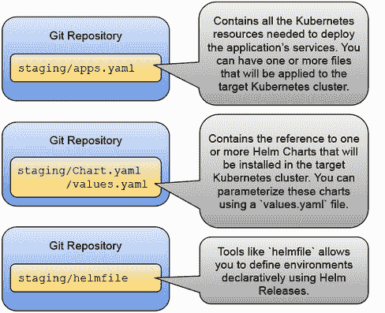

图 4.7 环境配置选项

第一个选项（简单布局）是将所有 Kubernetes YAML 文件存储在 Git 仓库中，然后环境管道将直接对配置的集群使用 `kubectl apply -f *`。虽然这种方法很简单，但有一个很大的缺点：如果你在服务仓库中有每个服务的 Kubernetes YAML 文件，那么环境仓库将会有这些文件的重复，并且它们可能会不同步。想象一下，如果你有多个环境，你必须维护所有副本的同步，这可能会变得具有挑战性。

第二个选项（使用 Helm 图表）现在使用 Helm 定义集群状态后，变得更加复杂。你可以使用 Helm 依赖关系创建一个父图表，它将包括所有应该存在于环境中的服务作为依赖项。如果你这样做，环境管道可以使用 `helm update .` 将图表应用到集群中。我不喜欢这种方法的一点是，你为每次更改创建一个 Helm 发布，而且没有为每个服务创建单独的发布。这种方法使用 Helm 依赖关系来获取每个服务定义，因此这种方法的一个先决条件是每个服务包都必须是一个 Helm 图表。

第三个选择是使用一个名为`helmfile`的项目（[`github.com/helmfile/helmfile`](https://github.com/helmfile/helmfile)），专为这个特定目的设计，用于定义环境配置。`helmfile`允许你声明性地定义集群中需要存在的 Helm 发布。当我们运行`helmfile sync`并定义了一个包含我们希望在集群中存在的 Helm 发布的`helmfile`时，这些 Helm 发布将被创建。

无论你使用这些方法中的任何一种还是其他工具来完成这项任务，期望都是明确的。你有一个包含配置的仓库（每个环境一个仓库或每个环境一个目录），一个管道负责获取配置并使用工具将其应用到集群中。

通常会有几个环境（预发布、QA、生产），甚至允许团队创建按需环境来运行测试或日常开发任务。如果你使用图 4.8 所示的“每个命名空间一个环境”的方法，通常为每个环境有一个单独的 Git 仓库，因为这有助于保持对环境的访问隔离和安全。这种方法很简单，但它在 Kubernetes 集群上提供的隔离性不足，因为 Kubernetes 命名空间是为了集群的逻辑分区而设计的。在这种情况下，预发布环境将与生产环境共享集群资源。

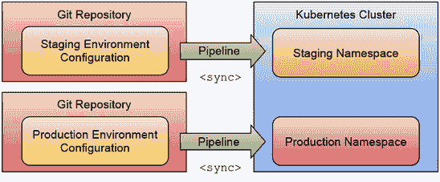

图 4.8 展示了每个 Kubernetes 命名空间一个环境的方法。一种策略是使用不同的命名空间来区分不同的环境。虽然这样做简化了将服务部署到不同环境所需的配置，但命名空间并不提供强大的隔离保证。

另一种方法是为每个环境使用一个全新的集群。主要区别在于隔离和访问控制。通过为每个环境拥有一个集群，你可以更严格地定义谁和哪些组件可以部署和升级这些环境中的内容，并为每个集群配置不同的硬件配置，例如多区域设置和其他可能在预发布和测试环境中没有意义的可扩展性关注点。使用不同的集群，你还可以追求多云设置，其中不同的云提供商可以托管不同的环境。

图 4.9 展示了如何使用命名空间方法为开发环境，这些环境将由不同的团队创建，然后分别有用于预发布和生产的不同集群。这里的想法是将预发布和生产的集群配置得尽可能相似，以便部署到不同环境中的应用程序表现一致。

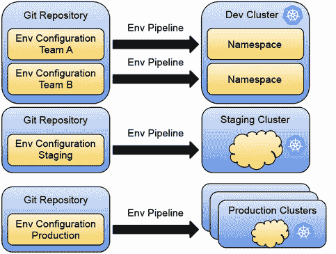

图 4.9 不同环境配置，基于需求。更现实的方法可以使用相同的集群为多个团队进行日常工作，而更敏感的环境，如预发布和生产，则在自己的集群和 Git 仓库中分离，以存储它们的配置。要将服务提升到新环境，需要向相应的 Git 仓库提交一个拉取请求。

好的，但我们如何实现这些管道？我们应该使用 Tekton 来实现这些管道吗？在下一节中，我们将探讨 Argo CD ([`argo-cd.readthedocs.io/en/stable/`](https://argo-cd.readthedocs.io/en/stable/))，这是一个将环境管道逻辑和最佳实践编码到非常具体的持续部署工具中的工具。

## 4.2 环境管道的实际应用

你可以使用 Tekton 或 Dagger 实现如前所述的环境管道。这在像 Jenkins X ([`jenkins-x.io`](https://jenkins-x.io))这样的项目中已经实现，但如今，环境管道的步骤被编码在像 Argo CD ([`argo-cd.readthedocs.io/en/stable/`](https://argo-cd.readthedocs.io/en/stable/))这样的持续部署专用工具中。

与服务管道不同，我们可能需要根据所使用的特定技术栈使用专门的工具来构建我们的工件，Kubernetes 的环境管道在 GitOps 的框架下已经得到了很好的标准化。考虑到所有我们的工件都是由我们的服务管道构建和发布的，我们首先需要创建我们的环境 Git 仓库，它将包含环境的配置，包括部署到该环境的服务。

Argo CD 提供了一个非常具有意见但非常灵活的 GitOps 实现。我们将把将软件部署到我们的环境中所需的全部步骤委托给 Argo CD。Argo CD 可以开箱即用地监控包含我们的环境（们）配置的 Git 仓库，并定期将配置应用到实时集群。这使得我们能够减少与目标集群的手动交互，因为 Git 成为了我们的真相来源。

使用像 Argo CD 这样的工具允许我们声明性地定义我们想在环境中安装的内容，而 Argo CD 则负责在出现问题时或我们的集群不同步时通知我们。Argo CD 不仅限于单个集群，这意味着我们的环境可以存在于不同的集群中，甚至在不同的云服务提供商中。图 4.10 显示了 Argo CD 在不同的集群上管理不同的环境，使用不同的 Git 仓库作为真相来源来保持每个环境的配置。

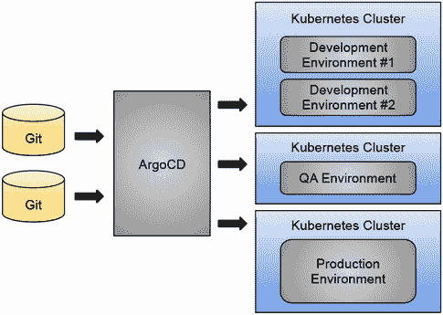

图 4.10 Argo CD 将同步环境，从 Git 到实时集群的配置

就像我们现在为每个服务都有单独的服务管道一样，我们也可以为我们的环境配置拥有单独的仓库、分支或目录。Argo CD 可以监控仓库或仓库内部的目录，以同步我们的环境配置。

在这个例子中，我们将安装 Argo CD 到我们的 Kubernetes 集群中，并使用 GitOps 方法配置我们的预发布环境。为此，我们需要一个 Git 仓库作为我们的真相来源。你可以遵循位于 [`github.com/salaboy/platforms-on-k8s/blob/main/chapter-4/README.md`](https://github.com/salaboy/platforms-on-k8s/blob/main/chapter-4/README.md) 的分步教程。

对于安装 Argo CD，我建议你查看他们的入门指南，你可以在 [`argo-cd.readthedocs.io/en/stable/getting_started/`](https://argo-cd.readthedocs.io/en/stable/getting_started/) 找到。此指南安装了 Argo CD 运作所需的所有组件，因此完成此指南后，我们应该拥有启动我们的预发布环境所需的一切。它还指导你安装 `argocd` CLI（命令行界面），这在某些情况下非常有用。在接下来的章节中，我们将关注用户界面，但你也可以使用 CLI 访问相同的功能。Argo CD 提供了一个非常有用的用户界面，让你可以监控你的环境和应用程序的表现，并快速找出是否存在任何问题。

本节的主要目标是复制我们在第二章第 2.1.3 节中做的事情，在那里我们安装并交互了应用程序，但在这里我们旨在完全自动化使用 git 仓库配置的环境的过程。再次，我们将使用 Helm 来定义环境配置，因为 Argo CD 提供了开箱即用的 Helm 集成。

注意：Argo CD 使用了与这里不同的命名约定。在 Argo CD 中，你配置应用程序而不是环境。在下面的屏幕截图中，你会看到我们将配置一个 Argo CD 应用程序来表示我们的预发布环境。由于 Helm 图表中没有包含内容的限制，我们将使用 Helm 图表来配置我们的会议应用程序到这个环境中。

### 4.2.1 创建 Argo CD 应用程序

如果你访问 Argo CD 用户界面，你会在屏幕的左上角看到 + 新应用按钮（图 4.11）。

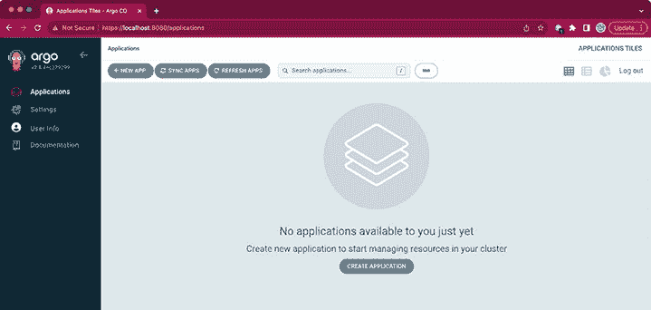

图 4.11 Argo CD 用户界面—创建新应用程序

按下那个按钮，看看应用程序创建表单。除了添加一个名称并选择我们的 Argo CD 应用程序将驻留的项目（我们将选择 `default` 项目）外，我们还将检查 `自动创建命名空间` 选项，如图 4.12 所示。

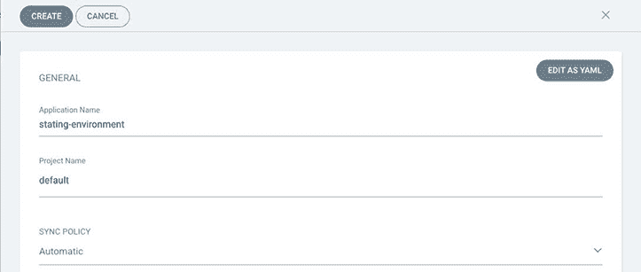

图 4.12 新的应用参数、手动同步和自动创建命名空间

通过将我们的环境与集群中的新命名空间关联起来，我们只能使用 Kubernetes RBAC 机制来允许管理员修改该命名空间中的 Kubernetes 资源。记住，通过使用 Argo CD，我们希望确保开发者不会意外更改应用程序配置或手动将配置更改应用到集群中。Argo CD 将同步 Git 仓库中定义的资源。那么那个 Git 仓库在哪里？这正是我们需要配置的下一个步骤（图 4.13）。

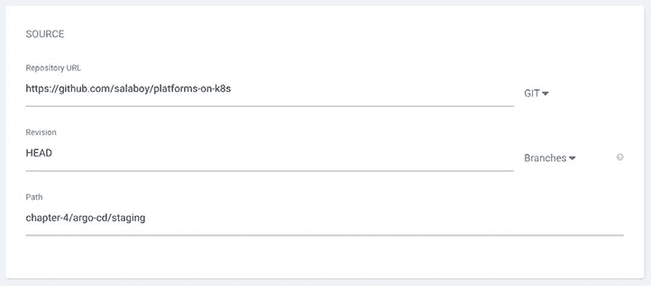

图 4.13 Argo CD 应用的配置仓库、修订版本和路径

如前所述，我们将在[`github.com/salaboy/platforms-on-k8s/`](https://github.com/salaboy/platforms-on-k8s/)仓库内部的一个目录中定义我们的预发布环境。你应该复制这个仓库（然后使用你的复制 URL）来对环境配置进行任何你想要的更改。包含环境配置的目录可以在 chapter-4/argo-cd/staging/下找到。如图 4.14 所示，你还可以在不同的分支和标签之间进行选择，这允许你对配置的来源和配置如何演变有更精细的控制。

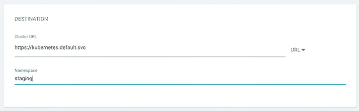

图 4.14 配置目标，在本例中，是安装了 Argo CD 的集群

下一步是定义 Argo CD 将应用此环境配置的位置。我们可以使用 Argo CD 在不同的集群中安装和同步环境，但在这个例子中，我们将使用我们安装 Argo CD 和`staging`命名空间的同一个 Kubernetes 集群。Argo CD 有一个选项可以为你创建这个命名空间，或者你可以在设置集群和不同命名空间的权限时手动创建它。

最后，由于在类似环境中重用相同的配置是有意义的，Argo CD 使我们能够配置特定于此安装的不同参数。由于我们使用 Helm，并且 Argo CD 用户界面足够智能，可以扫描我们输入的仓库/路径的内容，因此它知道它正在处理 Helm Chart。如果我们没有使用 Helm Chart，Argo CD 允许我们为配置脚本设置环境变量作为参数（图 4.15）。

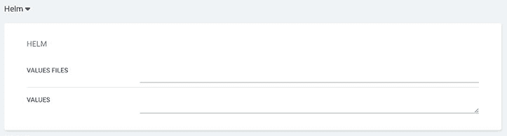

图 4.15 预发布环境的 Helm 配置参数

如前图所示，Argo CD 还识别出我们在提供的仓库路径内部的一个空的 values.yaml 文件。如果 values.yaml 文件有任何参数，用户界面将解析它们并显示给你进行验证。我们可以在`VALUES`文本框中添加更多参数来覆盖任何其他图表（或子图表）的配置。

在我们提供所有这些配置后，我们就可以点击表单顶部的创建按钮。Argo CD 将创建应用程序并自动同步更改，因为我们选择了自动同步选项（图 4.16）。

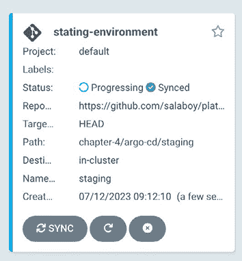

图 4.16 创建的应用程序和自动同步

如果你点击进入应用程序，你将深入到应用程序的完整视图，该视图显示了与应用程序关联的所有资源的状态，如图 4.17 所示。

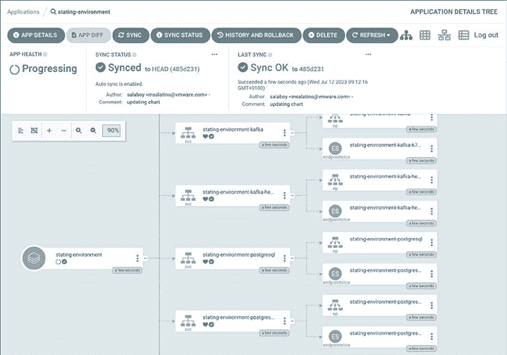

图 4.17 我们的中转环境运行正常，所有服务都在运行。

如果你在一个本地集群或真实的 Kubernetes 集群中创建环境，你应该访问应用程序并与它交互。让我们回顾一下我们已经取得的成果：

+   我们已经将 Argo CD 安装到我们的 Kubernetes 集群中。使用提供的 Argo CD 仪表板（用户界面），我们为我们的中转环境创建了一个新的 Argo CD 应用程序。

+   我们在 GitHub 上托管的 Git 仓库中创建了我们的中转环境配置，该配置使用 Helm Chart 定义来配置我们的会议应用程序服务及其依赖项（Redis、PostgreSQL 和 Kafka）。

+   我们已经将配置同步到了与安装 Argo CD 的同一集群中的命名空间（`staging`）。

+   最重要的是，我们已经消除了与目标集群手动交互的需求。理论上，将不再需要针对`staging`命名空间执行`kubectl`命令。

为了使此设置生效，我们需要确保 Helm Charts（以及它们内部的 Kubernetes 资源）中的工件对目标集群可用以便拉取。我强烈建议你遵循逐步教程([`github.com/salaboy/platforms-on-k8s/tree/main/chapter-4`](https://github.com/salaboy/platforms-on-k8s/tree/main/chapter-4))，以亲身体验 Argo CD，了解这个工具的工作原理以及它如何帮助你的团队将应用程序持续部署到多个环境中。

### 4.2.2 以 GitOps 方式处理更改

假设现在负责开发用户界面（`frontend`）的团队决定引入一个新功能。他们向`frontend`仓库提交了一个 pull request。一旦这个 pull request 与`main`分支合并，团队就可以决定为服务创建一个新的版本。发布过程应包括使用发布号创建标记的工件。这些工件创建的责任属于服务管道，正如我们在前面的章节中看到的。图 4.18 显示了 Argo CD 在这种情况下如何同步从中转配置仓库的配置更改。

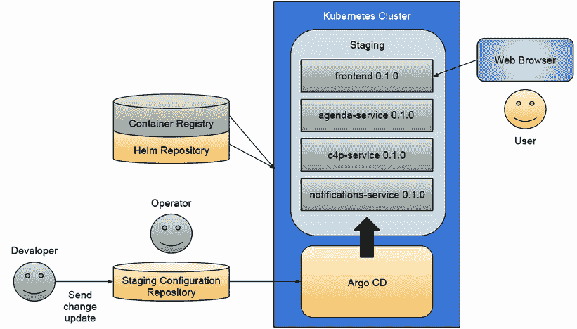

图 4.18 使用 Argo CD 设置中转环境的组件

一旦我们有了发布的工件，我们现在可以更新环境。我们可以通过向我们的 GitHub 仓库提交拉取请求来更新预发布环境，该请求在合并到主分支之前可以进行审查，主分支是我们用于配置 Argo CD 应用程序的分支。环境配置存储库中的更改通常包括：

+   *提升或回滚服务版本：* 对于我们的示例，这就像更改一个或多个服务的图表版本一样简单。将其中一个服务回滚到上一个版本就像在环境图表中回退版本号，甚至回退最初增加版本号的提交。请注意，回退提交始终是推荐的，因为回滚到上一个版本可能还包括对服务的配置更改，如果这些更改未应用，旧版本可能无法工作。

+   *添加或删除服务：* 添加新服务稍微复杂一些，因为你需要添加图表引用和服务配置参数。为了使其工作，图表定义需要可通过 Argo CD 安装访问。假设服务（的）图表可用，配置参数有效。在这种情况下，下一次我们同步 Argo CD 应用程序时，新的服务（们）将被部署到环境中。删除服务更为直接，因为一旦你从环境 Helm 图表中删除依赖项，服务将从环境中删除。

+   *调整图表参数：* 有时，我们不想更改任何服务版本，我们可能正在尝试微调应用程序参数以适应性能或可扩展性要求、监控配置或一组服务的日志级别。这些更改也是版本化的，应被视为新功能和错误修复。

如果我们将此与手动安装 Helm 将应用程序安装到集群中进行比较，我们会很快注意到差异。首先，开发者可能在自己的笔记本电脑上拥有环境配置，这使得环境很难从不同位置复制。未使用版本控制系统跟踪的环境配置更改将会丢失，我们将无法验证这些更改是否在实时集群中工作。配置漂移的跟踪和故障排除要困难得多。

使用 Argo CD 的这种自动化方法可以为更高级的场景打开大门。例如，我们可以为我们的拉取请求创建预览环境（图 4.19），以便在合并和发布工件之前测试更改。

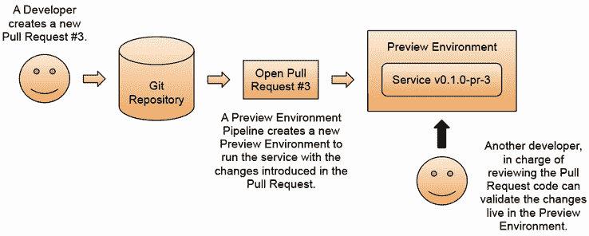

图 4.19 预览环境以加快迭代

使用预览环境可以帮助更快地迭代，并使团队能在合并到项目的主要分支之前验证更改。当拉取请求合并时，预览环境也可以收到通知，这使得实现自动清理机制变得简单。

注意：在使用 Argo CD 和 Helm 时，还有一个重要的细节需要提及，那就是与手动使用 Helm Charts 相比，每次我们在集群中更新图表时，Helm 都会创建发布资源，而 Argo CD 不会使用这个 Helm 功能。Argo CD 采用使用 Helm 模板来渲染 Kubernetes 资源 YAML 的方法，然后使用`kubectl apply`应用输出。这种方法依赖于 Git 中的一切都是版本化的，并允许统一不同的 YAML 模板引擎。除了某些安全优势外，这是在 Argo CD 中启用 diff 功能的关键，它允许我们指定哪些资源应由 Argo CD 管理，哪些元素可能由不同的控制器管理。

最后，为了使事情更加连贯，让我们看看服务管道和环境管道是如何交互以提供端到端自动化，从代码更改到将新版本部署到多个环境。

## 4.3 服务+环境管道

让我们看看服务管道和环境管道是如何连接的。这两个管道之间的连接是通过 Git 仓库的拉取/更改请求来实现的，因为当提交和合并更改时，管道将被触发（图 4.20）。

图 4.20 一个服务管道可以通过拉取请求触发环境管道。

开发者完成一个新功能后，会向仓库的主要分支创建一个拉取/更改请求。这个拉取/更改请求可以被专门的服务管道审查和构建。当这个新功能合并到仓库的主要分支时，会触发一个新的服务管道实例。这个实例创建一个新的发布，以及部署服务新版本到 Kubernetes 集群所需的所有工件。正如我们在第三章中看到的，这包括一个包含编译源代码的二进制文件、一个容器镜像以及可以使用 Helm 等工具打包的 Kubernetes Manifests。

作为服务管道的最后一步，你可以包含一个通知步骤，该步骤可以通知感兴趣的运行环境，它们正在运行的服务有新版本可用。这种通知通常是一个自动的拉取/更改请求到环境的仓库。或者，你可以监控（或订阅通知）你的工件仓库，当检测到新版本时，就会创建一个拉取/更改请求到配置的环境。

为环境仓库创建的拉取/变更请求可以由专门的环境管道自动测试。与我们对服务管道所做的方式相同，对于低风险环境，这些拉取/变更请求可以自动合并，无需任何人工干预。

通过实施此流程，我们可以让开发者专注于修复错误和创建新功能，这些功能将自动发布并推广到低风险环境。一旦新版本在预发布等环境中经过测试，并且我们知道这些新版本或配置没有引起任何问题，就可以为包含生产环境配置的仓库创建拉取/变更请求。

环境越敏感，所需的检查和验证就越多。在这种情况下，如图 4.21 所示，要将新服务版本推送到生产环境，需要创建一个新的测试环境来验证和测试在提交的拉取/变更请求中引入的更改。一旦完成这些验证，就需要手动签核以合并拉取请求并触发环境管道同步。

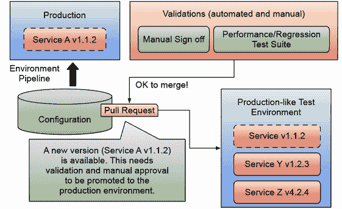

图 4.21 推送到生产环境的更改

环境管道是您用来编码组织需求以将软件发布和推广到不同环境的机制。在本章中，我们已经看到了像 Argo CD 这样的工具能为我们做什么。接下来，我们需要评估单个 Argo CD 安装是否足够，以及谁将负责管理和保持其安全性。您是否需要通过自定义钩点扩展 Argo CD？您是否需要将其与其他工具集成？我们将在第六章探讨这些问题，因此在结束本章之前，让我们看看环境管道和像 Argo CD 这样的工具如何融入平台工程的故事。

## 4.4 回到平台工程

从平台工程的角度来看，为团队提供 GitOps 方法正变得越来越流行，以便配置不同的环境。随着像 Argo CD 这样的工具的普及，越来越多的人对在版本控制系统（如 Git）上存储和操作环境配置感到舒适。作为平台工程团队，您可以使团队能够使用这种方法，而无需强迫他们学习如何安装、维护和配置这些工具。

平台可以自动化创建环境仓库，并确保正确的团队有权读取和写入配置以推广服务。这些平台的消费者预计知道如何与其环境交互，但不知道平台提供的工具是如何工作或如何配置的。例如，在开发环境中，使用 GitOps 方法可能不起作用，因为某些开发团队可能希望直接访问集群，而您的平台应该足够灵活，以便在需要时允许这种访问。

如第 4.3 节所述，服务和环境管道协同工作，生成软件工件并在环境之间移动。服务和环境管道是实现所谓的黄金路径的关键机制。随着平台日益成熟，环境管道之间的协调变得至关重要，以自动化新软件发布从源到生产环境的过程，并经过最终用户（客户）的验证。这些黄金路径是自动化工作流程，将我们团队产生的更改移动到我们的生产环境中，以便客户能够访问它们。图 4.22 从高层次展示了我们的应用程序的黄金路径是什么样的。

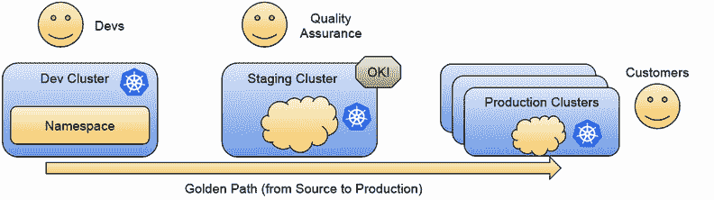

图 4.22 将新版本提升到我们的生产环境需要哪些步骤？

考虑一下需要执行多少服务和环境管道才能将我们在开发环境中产生的软件带到我们的生产集群中，客户可以访问单个服务的发布。这些管道是如何协调和连接的，以确保我们的部署按预期工作？在整个过程中你需要进行多少手动验证？最重要的是，你能为你的团队自动化哪些内容，以便他们不必担心所有这些复杂的交互？

到目前为止，我们已经介绍了如何将应用程序安装到 Kubernetes 集群中，构建和打包应用程序服务到容器中，以及打包和分发部署这些服务到 Kubernetes 集群所需的配置文件。本章补充了如何使用 GitOps 方法管理应用程序将运行的不同环境的情况。图 4.23 展示了所有部件的组合。

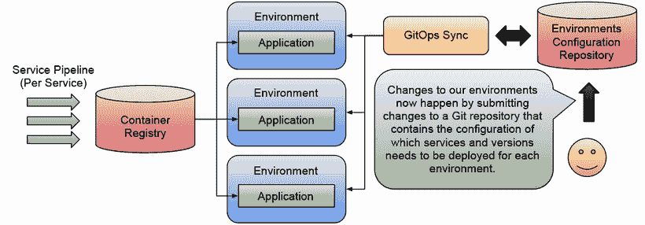

图 4.23 将 GitOps 添加到管理多个环境

在深入探讨黄金路径（第六章）之前，我们必须探索我们在将应用程序部署到不同环境时面临的另一个挑战：应用基础设施，下一章将介绍。

## 摘要

+   环境管道负责将软件工件部署到实际环境中。环境管道避免团队直接与运行应用程序的集群交互，从而减少错误和配置错误。环境管道应在更新其配置后检查环境是否完全运行。

+   使用像 Argo CD 这样的工具，你可以将每个环境的内容定义到一个 Git 仓库中，该仓库用作环境配置应如何看起来的事实来源。Argo CD 将跟踪运行环境所在集群的状态，并确保在集群中应用配置时没有漂移。

+   团队可以通过向存储环境配置的仓库提交拉取/更改请求来升级或降级环境中运行的服务版本。一个团队或自动化流程可以验证这些更改，一旦获得批准并合并，这些更改将在实际环境中体现。如果出现问题，可以通过回滚 git 仓库中的提交来回滚更改。

+   如果你遵循了逐步教程，你将获得通过使用 Argo CD 采用 GitOps 方法部署应用程序工作负载的动手经验。
