# 5 多云（应用程序）基础设施

本章涵盖

+   定义和管理云原生应用程序的基础设施

+   识别管理基础设施组件的挑战

+   学习如何使用 Crossplane 以 Kubernetes 的方式处理基础设施

在前面的章节中，我们安装了一个行走骨架，并学习了如何使用服务管道构建每个单独的组件，然后如何使用环境管道将它们部署到不同的环境中。我们现在面临一个重大挑战：处理我们的应用程序基础设施，这意味着不仅要运行和维护我们的应用程序服务，还要运行和维护我们的服务所需的组件。这些服务期望其他组件能够正确工作，例如数据库、消息代理、身份管理解决方案、电子邮件服务器等。虽然存在一些工具可以自动化这些组件的安装（对于本地设置）或在不同云提供商中的配置，但本章将专注于仅以 Kubernetes 方式完成这一点的工具。本章有三个主要部分：

+   处理基础设施的挑战

+   如何使用 Kubernetes 结构处理基础设施

+   如何使用 Crossplane 为我们的行走骨架配置基础设施

让我们开始吧。为什么管理我们的应用程序基础设施如此困难？

## 5.1 Kubernetes 中管理基础设施的挑战

当你设计像第一章中介绍的那种行走骨架的应用程序时，你会面临一些并非实现业务目标核心的特定挑战。安装、配置和维护支持我们应用程序服务的*应用程序基础设施*组件是一项需要由具备正确专业知识的团队精心计划的大任务。

这些组件被归类为应用程序基础设施，通常涉及第三方组件，这些组件不是内部开发的，例如数据库、消息代理、身份管理解决方案等。现代云服务提供商成功的一个重要原因是他们擅长提供和维护这些组件，并允许你的开发团队专注于构建应用程序的核心功能，这为业务带来了价值。

区分应用程序基础设施和硬件基础设施至关重要，因为本书不涉及硬件配置，其余内容主要关注应用程序空间。我假设对于公共云服务，提供商解决了所有与硬件相关的问题。对于本地场景，你可能有一个专门的团队负责硬件（根据需要移除、添加和维护硬件）。

依赖云服务提供商来配置应用程序基础设施是很常见的。这样做有很多优点，例如按需付费服务、易于大规模配置和自动化维护。但到了那个阶段，你将严重依赖提供商特定的操作方式和他们的工具。一旦你在云服务提供商中创建数据库或消息代理，你就已经跳出了 Kubernetes 的领域。现在你依赖于他们的工具和自动化机制，并且正在在业务和云服务提供商之间建立强烈的依赖关系。

让我们来看看配置和维护应用程序基础设施所面临的挑战，以便您的团队能够规划和选择合适的工具：

+   *配置组件以进行扩展:* 每个组件都需要不同的专业知识来配置（数据库管理员对数据库，消息代理专家，机器学习专家等），以及深入了解我们的应用程序服务将如何使用它，以及可用的硬件。这些配置需要版本控制和密切监控，以便可以快速创建新环境来重现问题或测试我们应用程序的新版本。

+   *长期维护组件:* 数据库和消息代理不断发布和修补以改进性能和安全。这种持续的变化迫使运维团队确保他们可以升级到新版本并保持所有数据的安全，而不会使整个应用程序崩溃。所有这些复杂性都需要在提供和消费这些组件的团队之间进行大量的协调和影响分析。

+   *云服务提供商服务影响我们的多云策略:* 如果我们依赖于特定于云的应用程序基础设施和工具，我们需要找到一种方法来使开发者能够为他们开发和服务创建和配置组件。我们需要一种方法来抽象基础设施的配置，以便应用程序可以定义它们需要的基础设施，而无需直接依赖于特定于云的工具。

有趣的是，我们在拥有分布式应用程序之前就已经面临这些挑战，配置和配置架构组件一直很困难，通常远离开发者。云服务提供商通过将这些主题带到开发者身边，做得非常出色，使他们能够更加自主和快速迭代。不幸的是，当与 Kubernetes 一起工作时，我们有更多的选项需要仔细考虑，以确保我们理解权衡。下一节将介绍我们如何在 Kubernetes 内部管理我们的应用程序基础设施。虽然这通常不推荐，但对于某些场景来说，它可能是实际且成本更低的。

### 5.1.1 管理您的应用程序基础设施

应用基础设施已经成为一个令人兴奋的领域。随着容器技术的兴起，每个开发者都可以通过几条命令启动数据库或消息代理，这对于开发目的通常已经足够。在 Kubernetes 世界中，这转化为 Helm 图表，它使用容器来配置和提供数据库（关系型和非关系型）、消息代理、身份管理解决方案等。正如我们在第二章中看到的，您只需一条命令就可以安装包含四个服务、两个数据库（Redis 和 PostgreSQL）和一个消息代理（Kafka）的行走骨架应用程序。

对于我们的行走骨架，我们正在为议程服务提供 Redis NoSQL 数据库的一个实例，为提案征集（C4P）服务提供一个 PostgreSQL 数据库的实例，以及一个 Kafka 集群的实例，所有这些都使用 Helm 图表。目前可用的 Helm 图表数量令人印象深刻，很容易想到安装 Helm 图表将成为一种趋势。示例应用程序中使用的 Helm 图表都可以在 Bitnami Helm 图表存储库[`bitnami.com/stacks/helm`](https://bitnami.com/stacks/helm)中找到。

如第二章所述，如果我们想扩展保持状态的服务，我们必须提供专门的组件，如数据库。应用程序开发者将根据需要存储的数据及其结构来定义最适合他们的数据库类型。图 5.1 展示了应用程序服务对我们为行走骨架确定的某些应用程序基础设施组件的依赖关系。

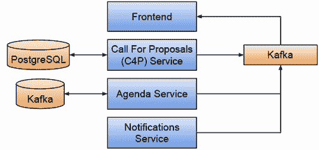

图 5.1 服务及其对应用程序基础设施组件的依赖关系

在您的 Kubernetes 集群内部署这些（PostgreSQL、Redis 和 Kafka）组件的过程涉及以下步骤：

+   寻找或创建适合您要启动的组件的 Helm 图表。对于行走骨架，PostgreSQL ([`bitnami.com/stack/postgresql/helm`](https://bitnami.com/stack/postgresql/helm))、Redis ([`bitnami.com/stack/redis/helm`](https://bitnami.com/stack/redis/helm)) 和 Kafka ([`bitnami.com/stack/kafka/helm`](https://bitnami.com/stack/kafka/helm)) 都可以在 Bitnami Helm 图表存储库中找到。如果您找不到 Helm 图表，但有一个您要提供的组件的 Docker 容器，您可以在定义部署所需的基本 Kubernetes 构造之后创建您的图表。

+   研究图表配置和参数，您必须设置以适应您的需求。每个图表都提供了一组参数，您可以根据不同的用例进行调整。检查图表网站以了解可用的选项。包括您的运维团队和数据库管理员（DBAs）来检查针对您的用例的最佳数据库配置；这不是开发者可以完成的事情。这项分析还需要 Kubernetes 专业知识，以确保组件可以在 Kubernetes 内部以高可用性（HA）模式工作。

+   使用 `helm install` 将图表安装到您的 Kubernetes 集群中。通过运行 `helm install`，您将下载一组 Kubernetes 清单（YAML 文件），这些文件描述了这些组件需要如何部署。然后 Helm 将继续将这些 YAML 文件应用到您的集群中。对于我们在第二章中安装的 Conference 应用 Helm 图表（第 2.1.3 节），所有应用程序基础设施组件都被添加为图表的依赖项。

+   配置您的服务以连接到新配置的组件。您可以通过提供新配置的实例 URL 和连接凭据来实现这一点。对于数据库，将是处理请求的数据库 URL，可能还包括用户名和密码。一个有趣的细节是，您的应用程序需要某种类型的驱动程序才能连接到目标数据库。更多内容将在第八章中介绍。

+   在长期维护这些组件，进行备份并确保故障转移机制按预期工作。

图 5.2 展示了将应用程序基础设施组件安装和连接到我们的应用程序服务的步骤。

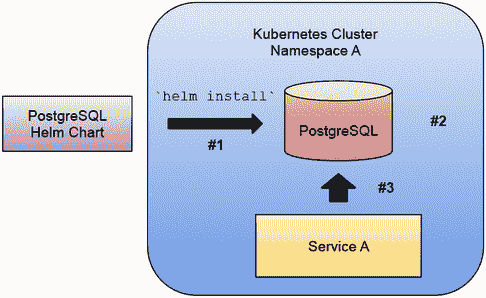

图 5.2 使用 PostgreSQL Helm 图表配置新的 PostgreSQL 实例。#1 在 Kubernetes 集群内的命名空间中安装 helm 图表；#2 图表创建 Kubernetes 资源，如 StatefulSets 和 Deployments，以配置 PostgreSQL 实例；#3 需要一个服务连接到新创建的实例，这可以通过手动操作或通过引用包含凭据和连接详情的 Kubernetes 密钥来实现。

如果您正在使用 Helm 图表，有一些注意事项和技巧您需要了解：

+   如果图表不允许您配置您想要更改的参数，您始终可以使用 `helm template`，然后修改输出以添加或更改您需要最终使用 `kubectl apply -f` 安装组件的参数。或者，您可以向图表存储库提交一个拉取请求。不公开所有可能的参数并等待社区成员建议更多要公开的参数是常见的做法。如果这种情况发生，不要害羞，联系维护者。无论您进行何种修改，都必须维护和记录图表内容。使用 `helm template` 会失去 Helm 发布管理功能，允许您在新版本可用时升级图表。

+   大多数图表都有一个默认配置，旨在进行扩展，这意味着默认部署将针对高可用性场景。这导致安装时消耗大量资源（CPU 和内存）的图表，这些资源在使用笔记本电脑上的 Kubernetes KinD 或 Minikube 时可能不可用。再次强调，图表文档通常包括针对开发和资源受限环境的特殊配置。

+   如果您在 Kubernetes 集群内安装数据库，每个数据库容器（Pod）必须能够访问底层 Kubernetes 节点的存储。对于数据库，您可能需要一种特殊的存储类型，以使数据库能够弹性扩展，这可能需要在 Kubernetes 之外进行高级配置。

例如，对于我们的“行走骨架”，我们设置了 Redis 图表使用 `architecture` 参数为 `standalone`，（如环境管道配置和 Agenda 服务 Helm Chart values.yaml 文件所示），以便在您可能拥有有限资源的环境中更容易运行，例如您的笔记本电脑/工作站。这会影响 Redis 的可用性以容忍故障，因为它将只运行一个副本，而与默认设置中创建一个主节点和两个从节点的情况相比。

### 5.1.2 将我们的服务连接到新配置的基础设施

安装图表不会使我们的应用程序服务自动连接到 Redis、PostgreSQL 或 Kafka 实例。我们需要提供服务所需的配置以连接，同时也要意识到这些组件（如数据库）启动所需的时间。

图 5.3 展示了通常的连接方式，因为大多数图表会自动创建一个 Kubernetes 机密，托管所有应用程序服务需要连接的详细信息。

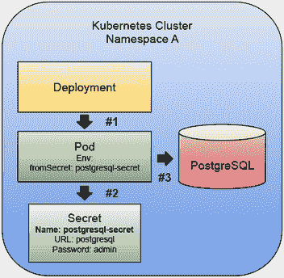

图 5.3 使用 secrets 连接服务到已配置的资源。#1 创建了一个 Kubernetes 部署来运行你的一个服务，并且 pod 模板包含配置 pod 的环境变量，这些 pod 将由该部署创建；#2 使用部署资源中指定的模板创建了 pod，该模板指向包含连接到 db 实例详细信息的 secret；#3 运行在 pod 内部的容器需要准备就绪，以便消费环境变量以连接到 db 实例。

常见的做法是使用 Kubernetes secrets 来存储这些应用基础设施组件的凭证。我们用于构建行走框架的 Redis 和 PostgreSQL Helm Chart 会创建一个新的 Kubernetes secret，其中包含连接所需的详细信息。这些 Helm Charts 还创建了一个 Kubernetes 服务，用作实例运行的地点（URL）。

要将提案征集服务（Call for Proposals，C4P）连接到 PostgreSQL 实例，你需要确保 C4P 服务的 Kubernetes Deployment (`conference-c4p-service-deployment`) 具有正确的环境变量（见 5.1 列表）。

列表 5.1 连接到应用基础设施（PostgreSQL）的环境变量

```
- name: KAFKA_URL
  value: <KAFKA SERVICE URL>
- name: POSTGRES_HOST
  valueFrom:
    secretKeyRef:
      name: <POSTGRESQL SECRET NAME>
      key: postgres-url
- name: POSTGRES_PASSWORD
  valueFrom:
    secretKeyRef:
      name: <POSTGRESQL SECRET NAME>
      key: postgres-password
```

粗体部分突出显示了我们在安装图表时如何消费动态生成的密码以及 DB 端点 URL，该 URL 是由图表创建的 PostgreSQL Kubernetes 服务。如果你使用了不同的图表发布名称，DB 端点将会有所不同。

类似的配置也适用于议程服务（`conference-agenda-service-deployment`）和 Redis（见 5.2 列表）。

列表 5.2 连接到应用基础设施（Redis）的环境变量

```
- name: KAFKA_URL
  value: <KAFKA SERVICE URL>
- name: REDIS_HOST
  valueFrom:
    secretKeyRef:
      name: <REDIS SECRET NAME>
      key: redis-url
- name: REDIS_PASSWORD
  valueFrom:
    secretKeyRef:
      name: <REDIS SECRET NAME>
      key: redis-password
```

如前所述，我们从安装 Redis Helm Chart 时生成的 Kubernetes secret 中提取密码。secret 的名称将派生自我们使用的 Helm Chart 发布名称。`REDIS_HOST` 从图表创建的 Kubernetes 服务的名称中获取，这取决于你使用的 `helm release` 名称。对于应用的所有服务，我们都需要设置 `KAFKA_URL` 环境变量，以便服务可以连接到 Kafka。为应用基础设施组件配置不同的实例为我们打开了将供应和维护委托给其他团队甚至云提供商的大门。

### 5.1.3 我听说过 Kubernetes operators。我应该使用它们吗？

现在你的 Kubernetes 集群内部有四个应用服务、两个数据库和一个消息代理。信不信由你，你现在需要负责七个组件的维护和扩展，这些组件根据应用的需求而定。构建服务的团队将确切知道如何维护和升级每个服务，但他们不是维护和扩展数据库或消息代理的专家。

根据服务需求的不同，您可能需要帮助来处理这些数据库和消息代理。想象一下，您在 Agenda 服务上收到了太多的请求，因此您决定将议程部署的副本数量扩展到 200 个。在那个时刻，Redis 必须拥有足够的资源来处理连接到 Redis 集群的 200 个 Pod。在这个场景中使用 Redis 的优势在于，在会议进行期间我们可能会遇到大量的读取操作，Redis 集群允许我们从副本中读取数据，从而实现负载的分散。

图 5.4 展示了高需求的一个典型情况，我们可能会被诱惑增加应用服务的副本数量，而不会检查或更改我们的 PostgreSQL 实例的配置。在这些场景中，即使应用服务可以扩展，如果未相应配置（以支持 200+并发连接），PostgreSQL 实例将成为瓶颈。

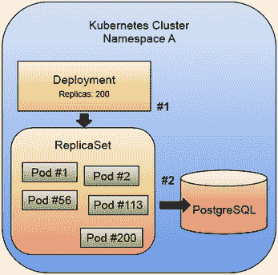

图 5.4 显示，应用基础设施的配置需要根据我们的服务扩展方式来设置。#1 如果您注意到某个服务的需求激增，您可能会想增加副本数量，使用 ReplicaSet 的部署不会对此提出异议。如果集群有足够的资源，副本将被创建；#2 如果应用基础设施配置不正确，您可能会遇到许多问题，例如耗尽数据库连接池或数据库 Pod 过载，因为当您扩展部署时，它们并没有进行扩展。

如果您使用 Helm 安装应用基础设施，请注意，Helm 不会检查这些组件的健康状况——它只是在进行安装。如今，找到另一种在 Kubernetes 集群中安装组件的方法非常普遍，这种方法被称为 Operators。通常与应用基础设施相关联，您会发现更多活跃的组件，这些组件将安装并监控已安装的组件。这些 operator 的一个例子是 Zalando PostgreSQL Operator，您可以在[`github.com/zalando/postgres-operator`](https://github.com/zalando/postgres-operator)找到它。虽然这些 operator 专注于允许您为 PostgreSQL 数据库提供新实例，但它们还实现了其他专注于维护的功能，例如：

+   在 Postgres 集群更改上进行滚动更新，包括快速的小版本更新

+   在不重启 Pod 的情况下实时调整卷大小（AWS EBS，PVC）

+   使用 PGBouncer 进行数据库连接池

+   支持快速就地主要版本升级

通常，Kubernetes 运营商试图封装与特定组件相关的操作任务，在本例中是 PostgreSQL。虽然使用运营商可能为安装的组件添加更多功能，但您现在仍然需要维护该组件和运营商本身。每个运营商都附带一个非常具有意见的流程，您的团队将需要研究和学习以进行管理。在研究和决定使用哪个运营商时，请考虑这一点。

如果您计划在集群内部运行这些组件，您和您的团队决定使用哪些应用程序基础设施，请相应地规划，以便拥有管理、维护和扩展这些额外组件所需的内部专业知识。

在下一节中，我们将探讨如何通过查看一个开源项目来解决这些挑战，该项目旨在通过声明性方法简化应用程序基础设施组件的云和本地资源的配置。

## 5.2 使用 Crossplane 实现声明性基础设施

使用 Helm 在 Kubernetes 内部安装应用程序基础设施组件远非理想，尤其是在大型应用程序和面向用户的场景中，因为维护这些组件及其要求，如高级存储配置，可能变得过于复杂，难以处理。

云提供商在允许我们配置基础设施方面做得非常出色，但它们都依赖于云提供商特定的工具，这些工具超出了 Kubernetes 的范畴。

在本节中，我们将探讨一个替代工具——一个名为 Crossplane 的 CNCF 项目([`crossplane.io`](https://crossplane.io))，它使用 Kubernetes API 和扩展点以声明性方式允许用户使用 Kubernetes API 部署真实基础设施。Crossplane 依赖于 Kubernetes API 来支持多个云提供商；这也意味着它与所有现有的 Kubernetes 工具很好地集成。

通过了解 Crossplane 的工作原理以及如何扩展它，您可以构建多云方法，并使用不同的提供商运行您的云原生应用程序及其依赖项，而无需担心被锁定在单个供应商上。因为 Crossplane 使用与 Kubernetes 相同的声明性方法，您可以创建关于您试图部署和维护的应用程序的高级抽象。

要使用 Crossplane，您必须首先在 Kubernetes 集群中安装其控制平面。您可以遵循官方文档([`docs.crossplane.io/`](https://docs.crossplane.io/))或第 5.3 节中介绍的逐步教程。

仅靠 Crossplane 的核心组件对您来说帮助不大。根据您的云提供商，您将安装和配置一个或多个 *Crossplane 提供商*。让我们看看 Crossplane 提供商能为我们提供什么。

### 5.2.1 Crossplane 提供商

Crossplane 通过安装一组称为 Crossplane 提供商的组件来扩展 Kubernetes，这些组件负责理解和与云提供商特定的服务交互，代表我们配置云资源。图 5.5 展示了通过安装 GCP 提供商和 AWS 提供商，我们的 Crossplane 安装可以在两个云上配置资源。

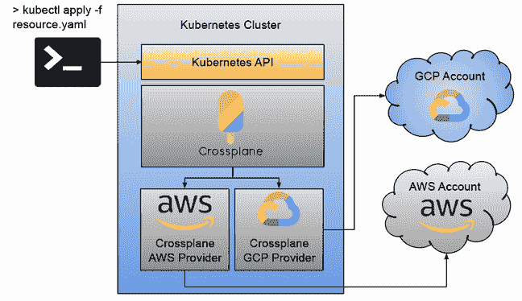

图 5.5 配置了 GCP 和 AWS 提供商的 Crossplane

通过安装 Crossplane 提供商，您正在扩展 Kubernetes API 的功能，以配置外部资源，如数据库、消息代理、桶以及其他将存在于您的 Kubernetes 集群之外但位于云提供商领域内的云资源。有几个 Crossplane 提供商涵盖了主要的云提供商，如 GCP、AWS 和 Azure。您可以在 Crossplane GitHub 组织中找到这些 Crossplane 提供商：[`docs.crossplane.io/latest/concepts/providers/`](https://docs.crossplane.io/latest/concepts/providers/)。

一旦安装了 Crossplane 提供商，您就可以以声明性方式创建特定于提供商的资源，这意味着您可以创建一个 Kubernetes 资源，使用 `kubectl apply -f` 应用它，将这些定义打包在 Helm 图表中，或者使用环境管道将这些资源存储在 Git 仓库中。

例如，使用 Crossplane GCP 提供商在 Google Cloud 中创建一个桶看起来像列表 5.4。

列表 5.4 Google Cloud Platform 桶资源定义

```
cat <<EOF | kubectl create -f -
apiVersion: storage.gcp.upbound.io/v1beta1    ①
kind: Bucket                                  ②
metadata:
  generateName: crossplane-bucket-
  labels:
    docs.crossplane.io/example: provider-gcp 
spec:                                         ③
  forProvider:
    location: US
  providerConfigRef:
    name: default
EOF
```

① apiVersion 和 kind 都由 Crossplane GCP 提供商定义。您可以在 Crossplane 提供商文档中找到所有支持的资源类型。

通过在我们的 Kubernetes 集群中创建一个桶资源，其中安装了 Crossplane，您正在创建一个请求，让 Crossplane 代表您配置和监控此资源。

③ 对于每种资源类型，您都有一组参数来配置资源。在这种情况下，我们希望桶位于美国。不同的资源将公开不同的配置

依赖于 Kubernetes API 配置云特定资源是一个很大的进步，但 Crossplane 并没有停止在这里。如果您看看在任何一个主要云提供商中配置数据库需要什么，您将意识到配置组件只是使组件准备好使用的任务之一。您需要额外的网络和安全配置、用户凭证以及其他云提供商特定的配置来连接到这些已配置的资源。欢迎 Crossplane 组合！

### 5.2.2 Crossplane 组合

Crossplane 旨在服务于两个不同的角色：*平台团队*和*应用团队*。虽然*平台*团队是云服务提供商的专家，了解如何配置特定云服务提供商的组件，但*应用*团队了解应用程序的需求，并从应用程序基础设施的角度理解需要什么。这个方法有趣的地方在于，当使用 Crossplane 时，平台团队可以为特定云服务提供商定义这些复杂的配置，并为应用团队提供简化的接口。

在现实场景中，创建单个组件的情况很少见。例如，如果我们想要配置一个数据库实例，应用团队还需要正确的网络和安全配置，以便能够访问新创建的实例。能够组合和连接多个组件是一个非常方便的功能，为了实现这些抽象和简化接口，Crossplane 引入了两个概念，*组合资源定义（XRDs）*和*组合资源（XRs）*。

图 5.6 展示了如何使用 Crossplane XRD 为不同的云服务提供商定义抽象。平台团队可能非常了解 Google Cloud 或 Azure，因此他们将负责定义针对特定应用程序需要连接在一起的具体资源。应用团队有一个简单的资源接口来请求他们感兴趣的资源。但正如通常情况一样，抽象是复杂的，有助于展示谁负责什么，但让我们通过一个具体例子来了解 Crossplane 组合的强大功能。

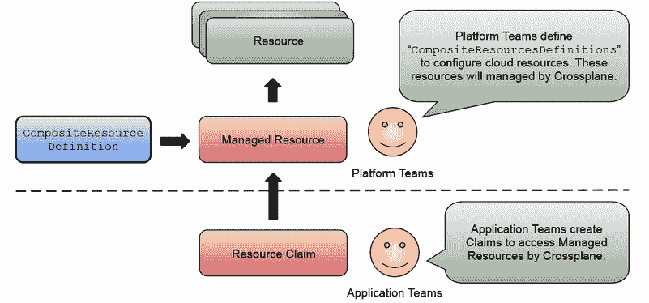

图 5.6 通过 Crossplane 组合资源进行资源组合抽象

图 5.7 展示了应用团队如何创建一个简单的 PostgreSQL 资源，并在 Google Cloud 中配置一个 CloudSQL 实例，同时还需要网络配置和一个存储桶。应用团队对创建的资源类型或它们在哪个云服务提供商下创建并不感兴趣。他们只关心拥有一个 PostgreSQL 实例，以便将应用程序连接到它。

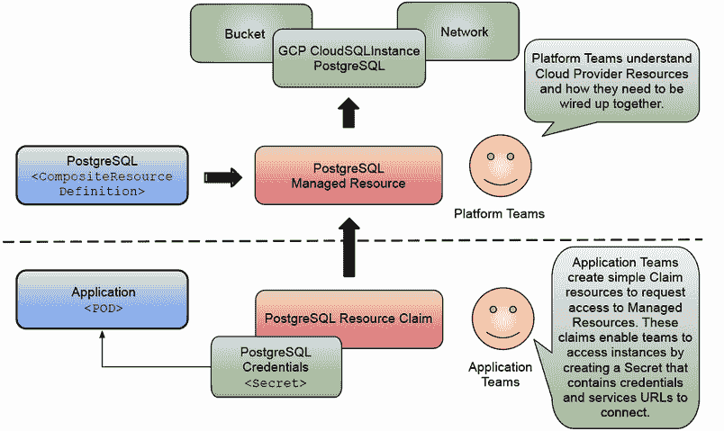

图 5.7 使用 Crossplane 组合在 Google Cloud 中配置 PostgreSQL 实例

这将带我们到图中的 `Secret` 框，代表 Crossplane 将为我们应用程序/服务 pod 连接到已部署的资源而创建的 Kubernetes 机密。Crossplane 使用所有应用程序连接到新创建的资源所需的所有详细信息创建此 Kubernetes 机密（或仅包含与应用程序相关的信息）。此机密通常包含 URL、用户名、密码、证书或任何应用程序连接所需的内容。平台团队在定义复合资源时定义了机密中应包含的内容。在以下章节中，当我们向我们的会议应用程序添加真实的基础设施时，我们将探讨这些 `CompositeResourceDefinitions` 的外观以及它们如何应用于创建我们应用程序所需的所有组件。

### 5.2.3 Crossplane 组件和需求

要与 Crossplane 提供程序和 `CompositeResourceDefinitions` 一起工作，我们需要了解 Crossplane 组件将如何协同工作以在不同的云提供商内部提供和管理这些组件。

本节介绍了 Crossplane 需要运行的方式以及 Crossplane 组件将如何管理我们的 `CompositeResources`。首先，重要的是要理解您必须在 Kubernetes 集群中安装 Crossplane。这可以是运行您应用程序的集群，也可以是 Crossplane 将运行的单独集群。此集群将包含一些 Crossplane 组件，它们将理解我们的 `CompositeResourceDefinitions` 并在云平台上拥有足够的权限代表我们提供资源。

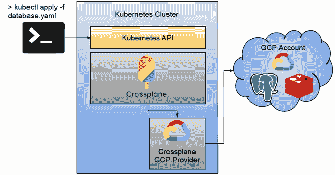

图 5.8 Google Cloud Platform 中的 Crossplane

图 5.8 展示了 Crossplane 在 Kubernetes 集群内部安装的情况，其中已安装并配置了 Crossplane GCP 提供程序，以使用具有足够权限来部署 PostgreSQL 和 Redis 实例的 Google Cloud Platform 账户。这意味着在某些情况下，您将拥有在云提供商上创建资源的管理员访问权限。

为了使图 5.8 在 GCP 中正常工作，您需要在云提供商上进行以下配置：

+   在 GCP 中创建 Redis 实例。

    +   您的 GCP 项目需要启用 `redis.googleapis.com` API。

    +   您还需要对 Redis 资源拥有管理员权限 `roles/redis.admin`。

+   在 GCP 中创建 PostgreSQL 实例：

    +   您的 GCP 项目需要启用 `sqladmin.googleapis.com` API。

    +   您还需要对 SQL 资源 `roles/cloudsql.admin` 拥有管理员权限。

每个可用的 Crossplane 提供程序都需要特定的安全配置才能工作，并在我们想要创建资源的云提供商内部有一个账户。一旦安装并配置了 Crossplane 提供程序（在本例中为 GCP 提供程序），我们就可以开始创建由该提供程序管理的资源。您可以在以下文档网站上找到每个提供程序提供的资源：[`doc.crds.dev/github.com/crossplane/provider-gcp`](https://doc.crds.dev/github.com/crossplane/provider-gcp)（图 5.9）。

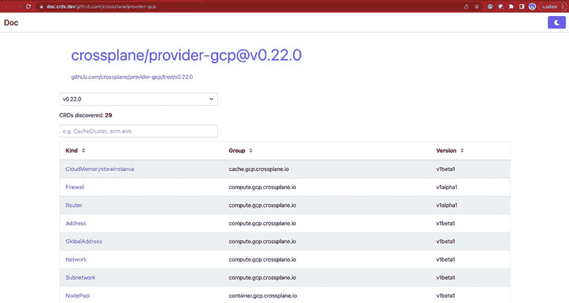

图 5.9 Crossplane 支持的 GCP 资源

如前图所示，GCP 提供者版本 0.22.0 支持 29 个不同的 CRD（自定义资源定义），用于在 Google Cloud Platform 中创建资源。Crossplane 将这些资源定义为托管资源。每个托管资源都需要启用，以便 Crossplane 提供者能够访问列表、创建和修改这些资源。

在第 5.3 节中，我们将探讨如何使用不同的 Crossplane 提供者和 Crossplane 组合为我们的应用程序配置云或本地资源。在深入技术细节之前，让我们看看在使用 Kubernetes 空间中的工具时应寻找的 Crossplane 核心行为。

### 5.2.4 Crossplane 行为

与在我们的 Kubernetes 集群中安装 Helm 组件相比，我们使用 Crossplane 与云提供者特定的 API 交互，以在云基础设施内部配置资源。这应该简化与这些资源相关的维护任务和成本。另一个重要的区别是，Crossplane 提供者（在本例中为 GCP 提供者）将为我们观察创建的托管资源。与仅使用 Helm 安装的资源相比，这些托管资源提供了一些优势。托管资源具有非常明确的行为。以下是您可以从 Crossplane 托管资源中期待的内容摘要：

+   *与其他 Kubernetes 资源一样可见:* Crossplane 托管资源只是 Kubernetes 资源。这意味着我们可以使用任何 Kubernetes 工具来监控和查询这些资源的状态。

+   *持续同步*: 当创建一个托管资源时，提供者将不断监控该资源以确保其存在且正在运行，并将状态报告给 Kubernetes 资源。托管资源内部定义的参数被认为是期望状态（真实来源）并且 Crossplane 提供者将努力将这些配置应用到云提供者资源上。再次强调，我们可以使用标准的 Kubernetes 工具来监控状态变化并触发修复流程。

+   *不可变属性* 提供者负责报告用户是否手动更改了云提供者的属性。这里的想法是避免配置漂移，即从定义的状态到云提供者中运行的实际状态。如果是这样，状态将被报告回托管资源。Crossplane 不会删除云提供者资源，而是会通知以便采取行动。其他工具如 Terraform ([`www.terraform.io`](https://www.terraform.io)) 将自动删除远程资源以重新创建它们。

+   *延迟初始化:* 托管资源中的一些属性可能是可选的，这意味着每个提供程序将为这些属性选择默认值。当这种情况发生时，Crossplane 将使用默认值创建资源，然后将选定的值设置到托管资源中。这简化了创建资源所需的配置，并可以重用云提供商定义的合理默认值，通常在他们的用户界面中。

+   *删除:* 当删除托管资源时，云提供商将立即触发操作。然而，托管资源将保留，直到资源完全从云提供商中移除。在云提供商上删除过程中可能发生的错误将被添加到托管资源状态字段中。

+   *导入现有资源:* Crossplane 不一定需要创建资源来管理它们。您可以为之前安装 Crossplane 之前创建的组件创建托管资源，并开始监控它们。您可以使用托管资源上的特定 Crossplane 注释来实现这一点：`crossplane.io/external-name`。

为了总结 Crossplane、Crossplane GCP 提供程序和我们的托管资源之间的交互，让我们看看图 5.10。

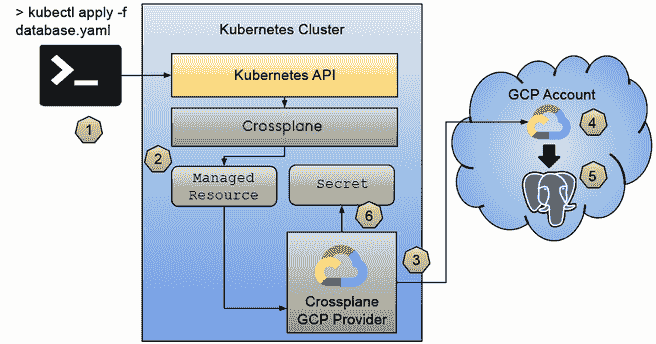

图 5.10 使用 Crossplane 的托管资源生命周期

下面的点表明了图 5.10 中观察到的顺序：

1.  首先，我们需要创建一个资源。我们可以使用任何工具来创建 Kubernetes 资源；这里的 `kubectl` 只是一个例子。

1.  如果创建的资源是 Crossplane 托管资源，让我们想象一个 GCP Crossplane 提供程序将选择并管理的 CloudSQLInstance 资源。

1.  管理资源的第一步将是检查它是否存在于基础设施中（即在配置的 GCP 账户中）。如果不存在，提供程序将请求在基础设施中创建该资源。将根据资源上设置的属性（例如所需的 SQL 数据库类型）提供适当的 SQL 数据库。假设我们为了示例的目的选择了 PostgreSQL 数据库。

1.  云提供商在收到请求后，如果资源已启用，将在托管资源中配置的参数下创建一个新的 PostgreSQL 实例。

1.  PostgreSQL 的状态将被报告回托管资源，这意味着我们可以使用 `kubectl` 或其他任何工具来监控已配置资源的状态。Crossplane 提供程序将保持这些状态同步。

1.  当数据库运行起来后，Crossplane 提供程序将创建一个密钥来存储我们的应用程序连接到新创建的实例所需的凭据和属性。

Crossplane 将定期检查 PostgreSQL 实例的状态，并更新托管资源。

通过遵循 Kubernetes 设计模式，Crossplane 使用控制器实现的 reconciliation 周期来跟踪外部资源。让我们看看这是如何付诸实践的！以下部分将探讨我们如何使用 Crossplane 与我们的行走骨架应用一起工作。

## 5.3 我们行走骨架的基础设施

在本节中，我们将使用 Crossplane 来抽象化我们为会议应用提供基础设施的方式。由于您可能无法访问像 GCP、AWS 或 Azure 这样的云提供商，我们将与一个名为 Crossplane Helm provider 的特殊提供商一起工作。这个 Crossplane Helm provider 允许我们将 Helm 图表作为云资源进行管理。这里的想法是展示如何使用 Crossplane——更具体地说，使用 Crossplane 组合——来使用户能够使用简化的 Kubernetes 资源请求资源，以提供本地或不同云提供商托管的不同云资源。

为了我们的会议申请，我们需要 Redis、PostgreSQL 和 Kafka 实例。从应用的角度来看，一旦这三个组件可用，我们就可以连接到它们，然后就可以开始了。这些组件如何配置是运维团队的责任。

我们在第二章中安装的会议应用 Helm 图表包括了使用安装时可以设置的条件值将 Redis、PostgreSQL 和 Kafka 作为 Helm 依赖项安装。让我们快速看一下这是如何为我们的 Helm 图表配置的：[`github.com/salaboy/platforms-on-k8s/blob/main/conference-application/helm/conference-app/Chart.yaml#L13`](https://github.com/salaboy/platforms-on-k8s/blob/main/conference-application/helm/conference-app/Chart.yaml#L13)。

会议 Helm 图表包括了 Redis、PostgreSQL 和 Kafka 图表依赖项，如列表 5.5 所示。

列表 5.5 使用 Helm 图表依赖项的会议应用

```
apiVersion: v2
description: A Helm chart for the Conference App
name: conference-app
version: v1.0.0
type: application
icon: https://www.salaboy.com/content/images/2023/06/avatar-new.png
appVersion: v1.0.0
home: http://github.com/salaboy/platforms-on-k8s
dependencies:                                     ①
- name: redis                                     ②
  version: 17.11.3 
  repository: https://charts.bitnami.com/bitnami
  condition: install.infrastructure               ③
- name: postgresql
  version: 12.5.7 
  repository: https://charts.bitnami.com/bitnami
  condition: install.infrastructure
- name: kafka
  version: 22.1.5
  repository: https://charts.bitnami.com/bitnami
  condition: install.infrastructure 
```

① 您可以为您的 Helm 图表包含任意数量的依赖项。这允许复杂的组合。

② 每个依赖项都需要图表名称、它所在的存储库（注意，您也可以在这里使用 oci://引用），以及您想要安装的图表版本。

③ 可以定义自定义条件来决定在安装图表时是否注入此依赖项。

在这个例子中，所有应用基础设施依赖项都在应用级别定义（在 Chart.yaml 文件的依赖项部分），但这并不妨碍你为每个服务创建一个 Helm 图表，该图表内部定义了自己的依赖项。

这种图表依赖关系适用于希望使用单个命令安装整个应用程序及其所需所有组件的开发团队。然而，我们希望将所有应用程序基础设施的关注点与应用程序服务解耦，以适应更大的场景。幸运的是，Conference 应用程序 Helm 图表允许我们关闭这些组件依赖关系，从而允许我们将由不同团队托管和管理的 Redis、PostgreSQL 和 Kafka 实例插入（如图 5.11）。

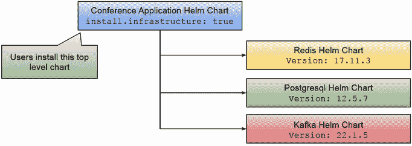

图 5.11 使用 Helm 图表依赖关系进行应用程序基础设施

通过分离谁请求和谁提供应用程序基础设施组件，我们使不同的团队能够控制和管理这些组件何时更新、备份，或者在发生故障时如何恢复。通过使用 Crossplane，我们可以使团队能够按需请求这些数据库，然后可以将它们连接到我们的应用程序服务。我们将在下一节中使用的机制的一个重要方面是，我们请求的组件可以在本地（使用 Crossplane Helm 提供程序）或远程（使用 Crossplane 云提供程序）进行配置。让我们看看这会是什么样子。您可以遵循一个逐步教程来安装、配置和创建您的 Crossplane 组合：[`github.com/salaboy/platforms-on-k8s/tree/main/chapter-5`](https://github.com/salaboy/platforms-on-k8s/tree/main/chapter-5)。

在这个例子中，我们将创建一个 KinD 集群并配置 Crossplane，以便团队可以使用 Crossplane Helm 提供程序按需请求开发目的的应用程序基础设施。在生产环境中，相同的请求将通过可扩展的云资源得到满足。更具体地说，我们通过这种方式使团队能够使用简化的接口请求 Redis、PostgreSQL 和 Kafka 实例。

对于我们的 Conference 应用程序示例，平台团队决定创建两个不同的概念：

+   *数据库:* 如 Redis 和 PostgreSQL 之类的 NoSQL 和 SQL 数据库。

+   *消息代理:* 用于管理和未管理的消息代理，如 Kafka。

在安装了 Crossplane 和 Crossplane Helm 提供程序之后，平台团队需要定义两个 Kubernetes 资源：

+   *交叉平面复合资源定义（XRDs）:* 定义了我们希望向团队公开的资源——在这个例子中，是数据库和消息代理。这些复合资源定义定义了一个接口，多个组合可以实现。

+   *Crossplane 组合*：Crossplane 组合允许我们定义一组资源清单。我们可以将一个组合链接到组合资源定义并实现该 XRD。通过这样做，当用户从 XRD 定义的资源请求新资源时，组合中的所有组合资源清单将在集群中创建。我们可以提供多个组合（例如，针对不同的云提供商），所有这些组合都实现了相同的 XRD，然后使用资源中的标签来选择哪个组合应该启动。

我知道一开始这可能会听起来有些令人困惑，所以让我们看看这些概念在实际中的应用。让我们看看列表 5.6 中的数据库 Crossplane 组合资源定义（[`github.com/salaboy/platforms-on-k8s/blob/main/chapter-5/resources/app-database-resource.yaml`](https://github.com/salaboy/platforms-on-k8s/blob/main/chapter-5/resources/app-database-resource.yaml)）。

列表 5.6 数据库组合资源定义

```
apiVersion: apiextensions.crossplane.io/v1
kind: CompositeResourceDefinition
metadata:
  name: databases.salaboy.com              ①
spec:
  group: salaboy.com                       ②
  names:
    kind: Database                         ③
    plural: databases
    shortNames:
      - "db"
      - "dbs"
  versions:
  - additionalPrinterColumns:
    - jsonPath: .spec.parameters.size
      name: SIZE
      type: string
    - jsonPath: .spec.parameters.mockData
      name: MOCKDATA
      type: boolean  
    - jsonPath: .spec.compositionSelector.matchLabels.kind
      name: KIND
      type: string
    name: v1alpha1
    served: true
    referenceable: true
    schema: 
      openAPIV3Schema:
        type: object
        properties:
          spec:
            type: object
            properties:
              parameters:                  ④
                type: object
                properties:
                  size:
                    type: string 
                  mockData: 
                    type: boolean
                required:   
                - size
            required:                      ⑤
            - parameters 
```

① 就像每个 Kubernetes 资源一样，CompositeResourceDefinition 需要一个唯一的名称。

② 本 CompositeResourceDefinition 定义了一种新的资源类型，该类型需要有一个组和一种类型。

③ 我们为用户可以请求的新资源定义了一个新的资源类型，即数据库，因为我们希望让他们能够请求新的数据库。

④ 我们正在定义的新资源也可以定义自定义参数。在这个例子中，仅用于演示目的，我们只定义了两个：size 和 mockData。

⑤ 因为 Kubernetes API 服务器可以验证所有资源，所以我们可以定义哪些参数是必需的，它们的类型以及其他验证。如果这些参数未提供或无效，Kubernetes API 服务器将拒绝我们的资源请求。

我们定义了一种名为数据库的新资源类型，其中包含两个我们可以设置的参数，`size` 和 `mockData`。用户可以通过设置 `size` 参数来定义为该实例分配多少资源。他们不必担心需要多少存储空间或需要多少副本来为数据库实例提供服务，他们只需从可能值列表（小、中或大）中指定一个大小即可。使用 `mockData` 参数，您可以在需要时实现向实例注入数据的机制。这只是一个可以做到的例子，但定义这些接口和哪些参数对您的团队有意义取决于您。

让我们看看实现此 XRD 的 Crossplane 组合在列表 5.7 中的样子。

列表 5.7 关键/值数据库 Crossplane 组合

```
apiVersion: apiextensions.crossplane.io/v1
kind: Composition
metadata:
  name: keyvalue.db.local.salaboy.com             ①
  labels:                                         ②
    type: dev
    provider: local
    kind: keyvalue
spec:
  writeConnectionSecretsToNamespace: crossplane-system
  compositeTypeRef:                               ③
    apiVersion: salaboy.com/v1alpha1
    kind: Database
  resources:
    - name: redis-helm-release                    ④
      base:
        apiVersion: helm.crossplane.io/v1beta1
        kind: Release
        metadata:
          annotations:
            crossplane.io/external-name: # patched
        spec:
          rollbackLimit: 3
          forProvider:
            namespace: default
            chart:                                ⑤
              name: redis
              repository: https://charts.bitnami.com/bitnami
              version: "17.8.0"
            values:
              architecture: standalone
          providerConfigRef:                      ⑥
            name: default
      patches:                                    ⑦
        - fromFieldPath: metadata.name
          toFieldPath: metadata.annotations[crossplane.io/external-name]
          policy:
            fromFieldPath: Required
        - fromFieldPath: metadata.name
          toFieldPath: metadata.name
          transforms:
            - type: string
              string:
                fmt: "%s-redis"         
      readinessChecks:                            ⑧
      - type: MatchString
        fieldPath: status.atProvider.state
        matchString: deployed
```

① 组合资源还需要一个唯一的名称。

② 对于每个组合，我们还可以定义标签。然后我们将使用这些标签来匹配请求的数据库资源。

③ 通过使用 compositeTypeRef 属性，我们将数据库组合资源定义链接到这个组合。

④ 在资源数组内部，我们可以定义这个组合将配置的所有资源。在这里有多个资源是很常见的。在这个例子中，我们正在配置 Crossplane Helm 提供者中定义的单一类型的 Release 资源。

⑤ 我们需要提供为 Release 资源定义的值，在这种情况下，是我们想使用 Crossplane Helm 提供者安装的 Helm 图表的详细信息。正如你所见，我们指向由 Bitnami 托管的 Redis Helm 图表。

使用 providerConfigRef，我们可以针对不同的 Crossplane Helm 提供者配置进行定位。这意味着我们可以拥有指向不同目标集群的不同 Helm 提供者，并且这种组合可以选出使用哪一个。为了简化，这个组合使用了本地 Helm 提供者安装的默认配置。

因为我们在连接多个资源，我们可以修补资源以配置它们协同工作或应用请求资源的参数。请查阅 Crossplane 文档以获取更多关于这些机制可以实现的内容的详细信息。

⑧ 对于每个组合，我们可以定义一个条件来标记资源状态。在这个例子中，我们将组合标记为就绪状态，当 Helm Release 资源状态.atProvider.state 属性设置为已部署时。如果你正在配置多个资源，作为定义组合的人，你需要定义这个条件是什么。

通过这个组合，我们将我们的`Database`声明与一组资源相连接，在这种情况下，是使用我们在 Kubernetes 集群中与 Crossplane 一起安装的默认 Helm 提供者安装 Redis Helm 图表。图 5.12 显示了针对相同数据库类型的两个用户请求。

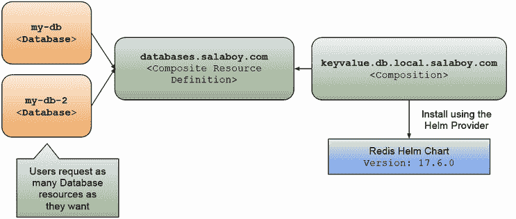

图 5.12 Crossplane 组合和组合资源定义协同工作

重要的是要注意，这个 Helm 图表将安装在安装 Crossplane 的同一 Kubernetes 集群中。尽管如此，我们仍然可以配置 Helm 提供者，使其拥有正确的凭证来安装图表到完全不同的集群。

在逐步教程([`github.com/salaboy/platforms-on-k8s/tree/main/chapter-5`](https://github.com/salaboy/platforms-on-k8s/tree/main/chapter-5))中，你将安装三个组合资源定义和三个组合。一旦安装完成，如图 5.12 所示，你可以请求新的数据库和消息代理，并且对于每个请求，组合中定义的所有资源都将被配置。为了简化，键值数据库组合仅安装 Redis，但你可以创建的资源数量没有限制（除了可用的硬件或配额）。

`Database`资源只是另一个 Kubernetes 资源，现在我们的集群理解它，看起来像列表 5.8。

列表 5.8 团队创建数据库资源以请求新的数据库实例

```
apiVersion: salaboy.com/v1alpha1
kind: Database
metadata:.  name: my-db-keyavalue    ①
spec:
  compositionSelector:
    matchLabels:                     ②
      provider: local
      type: dev
      kind: keyvalue
  parameters:                        ③
    size: small
    mockData: false
```

① 资源的唯一名称

② 我们使用 matchLabels 来选择合适的组成。

③ 我们需要设置我们的数据库资源声明所需的参数。

这个数据库资源的模式定义在 Crossplane 的 `CompositeResourceDefinition` 内部。注意 `spec.compositionSelector.matchLabels` 与用于组成的标签相匹配。我们可以使用这个机制为相同的数据库定义选择不同的组成。

如果你正在按照逐步教程进行，尝试创建多个资源，并查看 Crossplane 官方文档以了解如何实现 `small` 或 `mockData` 等参数，因为这些值目前尚未使用，仅用于演示目的。

这些机制的真正力量在于当你为相同的接口（复合资源定义）有不同的组成（实现）时。例如，我们现在可以创建另一个组成来为提案请求服务提供 PostgreSQL 实例，如列表 5.9 所示。PostgreSQL 的组成将类似于 Redis 的，但它将安装 PostgreSQL Helm 图表。

列表 5.9 SQL 数据库 Crossplane 组成

```
apiVersion: apiextensions.crossplane.io/v1
kind: Composition
metadata:
  name: sql.db.local.salaboy.com    ①
  labels:
    type: dev
    provider: local
    kind: sql                       ②
spec:
  ...
  compositeTypeRef:
    apiVersion: salaboy.com/v1alpha1
    kind: Database
  resources:
    - name: postgresql-helm-release
      base:
        apiVersion: helm.crossplane.io/v1beta1
        kind: Release
        spec:
          forProvider:
            chart:                  ③
              name: postgresql
              repository: https://charts.bitnami.com/bitnami
              version: "12.2.7"
          providerConfigRef:
            name: default
          …
```

① 我们需要一个唯一的名称来区分我们的组成与之前用于 Redis 的 keyvalue 组成。

② 我们使用不同的标签来描述这个组成，注意提供者与之前相同。

③ 我们想要安装由 Bitnami 托管的 PostgreSQL Helm 图表。

让我们看看如何使用这个组成创建一个 PostgreSQL 实例。创建 PostgreSQL 实例的过程将非常类似于我们之前为 Redis 所做的，如列表 5.10 所示。

列表 5.10 使用 kind: `sql` 标签选择实现的数据库资源

```
apiVersion: salaboy.com/v1alpha1
kind: Database
metadata:
  name: my-db-sql      ①
spec:
  compositionSelector:
    matchLabels:
      provider: local
      type: dev
      kind: sql        ②
  parameters: 
    size: small
    mockData: false
```

① 用于 PostgreSQL 数据库的唯一名称。

② 我们使用“sql”标签来匹配之前定义的组成。

我们只是使用标签来选择哪个组成将触发我们的数据库资源。图 5.13 展示了这些概念在实际中的应用。注意标签是如何根据 `kind` 标签值选择正确的组成的。

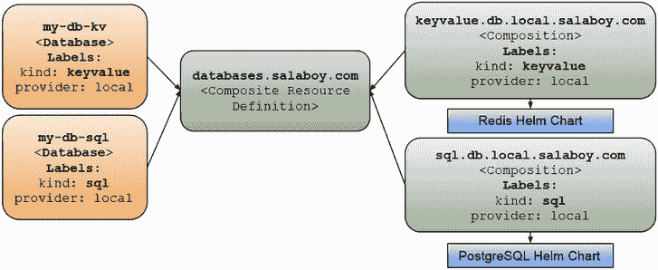

图 5.13 使用标签选择组成

哈喽！我们可以创建数据库了！但当然，这并没有结束。如果你可以访问云提供商，你可以在云提供商内部提供创建数据库实例的组成，这正是 Crossplane 发挥其优势的地方。

如果我们以 Google Cloud Platform (GCP) 为例，对于使用 GCP 云资源的组成，你需要安装 Crossplane GCP 提供者并相应地配置它，如官方 Crossplane 文档中所述：[`docs.crossplane.io/latest/getting-started/provider-gcp/`](https://docs.crossplane.io/latest/getting-started/provider-gcp/)。

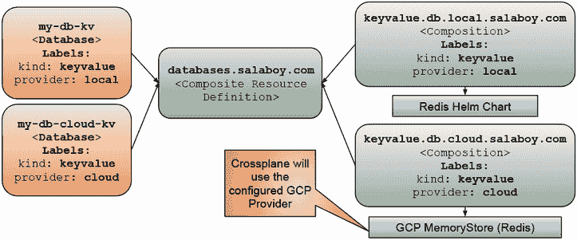

图 5.14 使用不同提供者选择组成，仍然使用标签

我们仍然可以通过匹配标签与我们的期望组合来选择不同的提供商。通过更改图 5.14 中的标签，我们可以使用本地 Helm 提供商或 GCP 提供商来实例化 Redis 实例。

注意：检查使用 Crossplane AWS 提供商的社区贡献 AWS 组合，请参阅[`github.com/salaboy/platforms-on-k8s/tree/main/chapter-5/aws`](https://github.com/salaboy/platforms-on-k8s/tree/main/chapter-5/aws)。

然后，创建将在 Google Cloud Platform 中部署的新数据库资源将类似于列表 5.11。

列表 5.11 请求新的 SQL 数据库

```
apiVersion: salaboy.com/v1alpha1
kind: Database
metadata:
  name: my-db-cloud-sql   ①
spec:
  compositionSelector:
    matchLabels:
      provider: gcp       ②
      type: dev
      kind: sql           ③
  parameters: 
    size: small
    mockData: false
```

① 我们资源的唯一名称需要与之前使用的所有名称都不同。

② 提供者标签选择带有 provider: gcp 标签的组合。换句话说，使用这个标签，我们选择数据库将在哪里部署。

③ 类型标签允许我们选择我们想要部署哪种类型的数据库。

无论我们的数据库或其他应用程序基础设施组件在哪里部署，我们都可以通过遵循一些约定来连接我们的应用程序服务。我们可以使用资源名称（例如，`my-db-cloud-sql`）来了解将用于服务发现的 Kubernetes 服务。我们还可以使用创建的密钥来获取我们需要的凭证。

步骤分解教程还提供了一个用于消息代理的 `CompositeResourceDefinition`，以及一个安装 Kafka Helm 图表的组合，您可以在[`github.com/salaboy/platforms-on-k8s/blob/main/chapter-5/resources/app-messagebroker-kafka.yaml`](https://github.com/salaboy/platforms-on-k8s/blob/main/chapter-5/resources/app-messagebroker-kafka.yaml)找到它。

对于这个例子，一个非常重要的事情要考虑的是，Google Cloud Platform 不提供托管 Kafka 服务。这促使您的团队在应用程序部署到 Google Cloud Platform 时决定替换 Kafka，在 Google Cloud 计算上安装和管理 Kafka，或者雇佣第三方服务。在 AWS 的例子中，我们有一个可以使用的 Kafka 管理服务，因此不需要更改我们的应用程序代码。但仍然，抽象出我们如何连接这些基础设施服务不是很好吗？关于这一点，请参阅第七章。

图 5.15 展示了为键值数据库提供复合资源定义的简便性，这些数据库可以使用 Helm 本地部署或由云服务提供商管理。但在 Kafka 的情况下，事情会变得稍微复杂一些，因为您可能需要集成第三方服务或领导一个团队来管理 Kafka 实例。

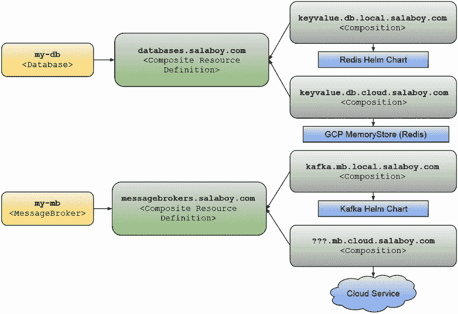

图 5.15 组合推动团队定义哪些云服务可供我们的应用程序使用。

除了 Kafka 和 Google Cloud Platform 之外，您的团队还需要一个策略来处理跨云提供商的基础设施，或者至少对如何处理这种情况做出有意识的选择。从应用程序服务的角度来看，如果您决定用 Google PubSub 代替 Kafka，您会维护两个相同服务的副本吗？一个包含 Kafka 依赖项，另一个包含连接到 Google PubSub 的 Google GCP SDK。如果您只使用 Google PubSub，您将失去在 Google Cloud 外运行应用程序的能力。

### 5.3.1 将我们的服务与新的配置基础设施连接

当我们创建新的数据库或消息代理资源时，Crossplane 将监控这些 Kubernetes 资源与特定云提供商内配置的组件的状态，保持它们同步，并确保应用了所需的配置。这意味着 Crossplane 将确保我们的数据库和消息代理正在运行。如果由于某种原因发生变化，Crossplane 将尝试重新应用我们请求的配置，直到请求的内容运行起来。

如果我们没有在我们的 KinD 集群中部署应用程序，我们可以不安装 PostgreSQL、Redis 和 Kafka 就部署它。正如我们在第二章中看到的，这可以通过设置一个标志来禁用：`install.infrastructure=false`：

```
> helm install conference oci://docker.io/salaboy/conference-app
➥--version v1.0.0 --set install.infrastructure=false
```

我强烈建议您查看位于 [`github.com/salaboy/platforms-on-k8s/tree/main/chapter-5`](https://github.com/salaboy/platforms-on-k8s/tree/main/chapter-5) 的分步教程，以亲身体验 Crossplane 和 Conference 应用程序。最好的学习方式就是动手实践！

如果我们只运行这个命令，Helm 不会通过部署任何组件（Redis、PostgreSQL 或 Kafka）。然而，应用程序的服务将不知道如何连接到我们使用 Crossplane 组合创建的 Redis、PostgreSQL 和 Kafka 实例。我们需要向应用程序图表中添加更多参数，以便服务知道连接的位置。首先，检查您的集群中可用的数据库，如列表 5.12 所示。

列表 5.12 列出所有数据库资源

```
> kubectl get dbs
NAME              SIZE     KIND       SYNCED   READY   COMPOSITION                     
my-db-keyavalue   small    keyvalue   True     True    keyvalue.db.local.salaboy.com   
my-db-sql         small    sql        True     True    sql.db.local.salaboy.com        
```

本教程还指导您创建一个消息代理，并检查您是否也拥有一个实例，如列表 5.13 所示。

列表 5.13 列出所有消息代理资源

```
> kubectl get mbs
NAME          SIZE    KIND    SYNCED   READY   COMPOSITION                  
my-mb-kafka   small   kafka   True     True    kafka.mb.local.salaboy.com   
```

列表 5.14 显示了我们的数据库实例和消息代理的 Kubernetes Pod。

列表 5.14 我们的应用基础设施的 Pod

```
> kubectl get pods
NAME                             READY   STATUS    RESTARTS   AGE
my-db-keyavalue-redis-master-0   1/1     Running   0          25m
my-db-sql-postgresql-0           1/1     Running   0          25m
my-mb-kafka-0                    1/1     Running   0          25m
```

除了 Pod 之外，还创建了四个 Kubernetes 机密：两个用于存储我们的 Crossplane 组合使用的 Helm 发布，另外两个包含我们新的数据库密码，我们的应用程序将需要使用这些密码来连接（请参阅列表 5.15）。

列表 5.15 包含连接到我们数据库的凭证的 Kubernetes 机密

```
> kubectl get secret
NAME                                    TYPE                 DATA   AGE
my-db-keyavalue-redis                   Opaque               1      26m
my-db-sql-postgresql                    Opaque               1      25m
sh.helm.release.v1.my-db-keyavalue.v1   helm.sh/release.v1   1      26m
sh.helm.release.v1.my-db-sql.v1         helm.sh/release.v1   1      25m
sh.helm.release.v1.my-mb-kafka.v1       helm.sh/release.v1   1      25m
```

在我们配置了数据库之后，查看默认命名空间中可用的服务，请参阅列表 5.16：

列表 5.16 用于连接新基础设施的自定义 values.yaml 文件

```
> kubectl get services
NAME                           TYPE        CLUSTER-IP       PORT(S)
kubernetes                     ClusterIP   10.96.0.1        443/TCP
my-db-keyavalue-redis-headless ClusterIP   None             6379/TCP
my-db-keyavalue-redis-master   ClusterIP   10.96.49.121     6379/TCP
my-db-sql-postgresql           ClusterIP   10.96.129.115    5432/TCP
my-db-sql-postgresql-hl        ClusterIP   None             5432/TCP
my-mb-kafka                    ClusterIP   10.96.239.45     9092/TCP
my-mb-kafka-headless           ClusterIP   None             9092/TCP
```

使用数据库和消息代理服务名称和机密，我们可以配置我们的会议应用程序图表，不仅不部署 Redis、PostgreSQL 和 Kafka，而且通过运行以下命令连接到正确的实例：

```
> helm install conference oci://docker.io/salaboy/conference-app
➥--version v1.0.0 -f app-values.yaml
```

我们不是在命令中设置所有参数，而是使用一个文件来应用图表的值。在这个例子中，app-values.yaml 文件看起来像列表 5.17。

列表 5.17 定制的 Helm 图表 values.yaml 文件

```
install:
  infrastructure: false                               ①
frontend:
  kafka:
    url: my-mb-kafka.default.svc.cluster.local        ②
agenda:
  kafka:
    url: my-mb-kafka.default.svc.cluster.local
  redis:
    host: my-db-keyavalue-redis-master.default.svc.cluster.local
    secretName: my-db-keyavalue-redis
c4p:
  kafka:
    url: my-mb-kafka.default.svc.cluster.local
  postgresql:
    host: my-db-sql-postgresql.default.svc.cluster.local
    secretName: my-db-sql-postgresql                  ③
notifications:
  kafka:
    url: my-mb-kafka.default.svc.cluster.local
```

① 我们禁用了 Redis、PostgreSQL 和 Kafka 的 Helm 依赖项。当我们安装应用程序时，这些组件将不会安装。

② 我们使用为我们的 Kafka 集群创建的 Kubernetes 服务将所有应用程序服务连接到创建的实例。对于 Redis 和 PostgreSQL 也采用相同的方法。

③ 对于 Redis 和 PostgreSQL，通过组合资源创建 Kubernetes 机密。我们的 Helm 图表理解如何从机密中获取凭证，因此我们只需要指定机密名称。

在这个 app-values.yaml 文件中，我们不仅关闭了 PostgreSQL、Redis 和 Kafka 的 Helm 依赖项，而且还配置了服务连接到我们新配置的数据库所需的变量。请注意，如果数据库是在不同的命名空间或不同的名称下创建的，`kafka.url`、`postgresql.host` 和 `redis.host` 应该包含服务完全限定名称中的适当命名空间，例如，`my-db-sql-postgresql.default.svc.cluster.local`（其中 `default` 是命名空间）。

图 5.16 显示了会议应用程序服务连接到使用 Crossplane 创建的应用程序基础设施。现在，开发者和平台团队之间的界限变得更加明确，因为对获取所需基础设施感兴趣的开发者有一组由平台团队精心选择并暴露给开发者的选项，这些选项使用更简单的接口。

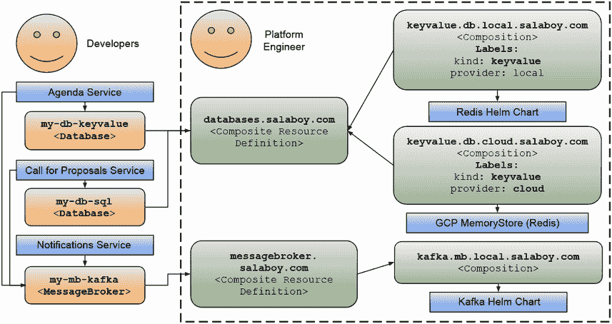

图 5.16 启用不同团队协作并专注于手头任务

所有这些努力使我们能够将定义、配置和运行所有应用程序基础设施的责任分配给另一个团队，该团队不负责处理应用程序的服务。服务可以独立发布，无需担心使用的是哪个数据库或何时需要升级。开发者不应担心云服务提供商账户或他们是否有权创建不同资源。因此，另一个具有完全不同技能组合的团队可以负责创建 Crossplane 组合和配置 Crossplane 提供商。

我们还使团队能够通过使用 Kubernetes 资源来请求应用程序基础设施组件。这使得他们能够快速创建用于实验和测试的设置，或者快速设置应用程序的新实例。这对于我们（作为开发者）习惯的做法是一个重大转变，因为在之前，云服务提供商和大多数公司必须能够访问数据库和票务系统，以便请求另一团队为你提供该资源，这可能需要几周时间！

为了总结我们迄今为止所取得的成就，我们可以这样说：

+   我们抽象了如何提供本地和云特定的组件，例如 PostgreSQL 和 Redis 数据库以及 Kafka 等消息代理，以及访问这些新实例所需的所有配置。

+   我们为应用团队提供了一个简化的界面，该界面不依赖于云服务提供商，因为它依赖于 Kubernetes API。

+   最后，我们通过依赖由 Crossplane 创建的 Kubernetes Secrets 将我们的应用程序服务连接到新提供的实例，这些 Secrets 包含连接到新创建的实例所需的所有详细信息。

如果你使用像 Crossplane 组合这样的机制来创建高级抽象，你将创建特定领域的概念，你的团队可以通过自助服务的方式使用这些概念。我们通过创建一个使用 Crossplane 组合的 Crossplane 组合资源来创建我们的数据库和消息代理概念，该组合资源知道需要提供哪些资源（以及在哪里提供云服务提供商）。

注意：您可以在[`github.com/salaboy/platforms-on-k8s/tree/main/chapter-5`](https://github.com/salaboy/platforms-on-k8s/tree/main/chapter-5)找到涵盖本节中所有步骤的逐步教程。

## 5.4 回到平台工程

我们需要谨慎行事。我们不能期望每个开发者都理解或愿意使用我们讨论过的工具（如 Crossplane、ArgoCD、Tekton 等）。我们需要一种方法来减少这些工具引入的复杂性。平台旨在减少其用户的认知负荷，正如我们在第一章中查看 Google Cloud Platform 以及它如何通过几点击就能创建 Kubernetes 集群时所描述的那样。对于 GCP 和其他平台，与平台交互的用户不需要了解底层发生了什么，使用了哪些工具，或者整个平台的设计，就可以使用它。

Crossplane 是为了服务于平台团队和开发团队（或消费者），他们有不同的优先级、兴趣和技能。通过创建正确的抽象（XRDs），平台团队可以暴露出简单的资源，开发团队可以根据他们的需求进行配置，而在幕后，一个复杂的组合正在建立，以创建和连接一组云资源。我们也看到了如何通过使用标签和选择器，我们可以在不同的组合之间进行选择，使得在不同的云提供商中创建基础设施成为可能，同时为创建请求的团队保持相同的用户体验。通过扩展 Kubernetes API，Crossplane 统一了我们管理工作负载的方式以及我们如何管理跨云提供商的应用程序基础设施。换句话说，如果我们将 Crossplane 安装到 Kubernetes 集群中，我们不仅能够部署和运行我们的集群，还可以通过使用我们用于工作负载的工具来配置和管理云资源。

尽管 Crossplane 带来了许多好处，但你必须准备好面对一些缺点和挑战。正在考虑使用 Crossplane 的平台团队有其他更受欢迎的选项来配置云资源，例如 Hashicorp 的 Terraform 和 Pulumi。Crossplane 比 Terraform 更新，而且因为 Crossplane 专注于 Kubernetes，它要求平台团队完全投入 Kubernetes。不习惯管理 Kubernetes 集群的团队可能会发现像 Crossplane 这样的工具一开始很有挑战性，因此你需要提升你的 Kubernetes 技能来运行和维护像 Crossplane 这样的工具。

平台团队将不得不在是否使用 Crossplane 或 Terraform 等工具之间做出决定，我的建议是考虑你希望将使用的工具与 Kubernetes API 对齐的程度。理论上，能够以管理应用程序相同的方式管理基础设施（云资源）是非常有意义的。然而，这也需要管理并维护这些组件的团队觉得这样做是有意义的。在过去的几年里，云原生领域在可观察性、安全和运维方面的成熟度有了巨大的提升。越来越多的团队开始感到舒适地管理和运营大规模的 Kubernetes。对于这些团队来说，Crossplane 可以是一个很好的补充，因为它将与他们现有的所有 Kubernetes 可观察性堆栈、策略执行器和仪表板协同工作。

当拥有像 Crossplane 这样灵活的工具时，你打开了通往新可能性的大门，这些可能性可以跨越云提供商。平台团队现在有更多的选择可用，这可能会适得其反，但有一点是明确的。如果你使用正确的抽象，平台可以更加灵活，因为消费者界面不会改变。同时，平台团队可以迭代他们的先前决策，并在幕后提供新的实现。

图 5.17 展示了通过使用 Crossplane，我们可以为开发团队提供自助抽象，以便他们可以请求数据库、消息代理、身份服务以及他们可能需要用于其应用程序的任何其他内部或外部服务。但他们从应用程序的角度需要什么？想想之前提供的 Kafka 示例。如果你从 Kafka 迁移到 Google PubSub，你的应用程序需要做出哪些改变？

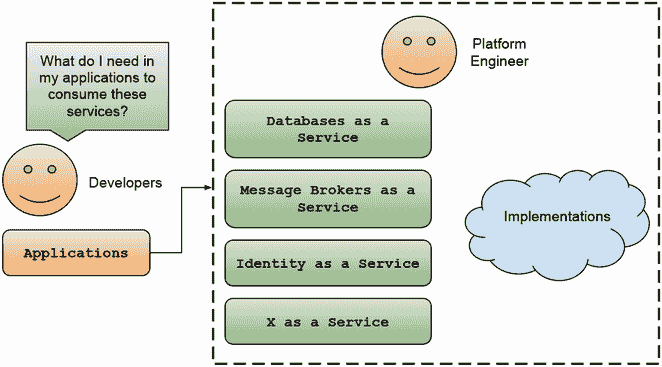

图 5.17 开发者需要消费所有这些平台服务吗？

我们已经覆盖了很多内容，从将简单应用程序安装到集群中，到构建服务并使用 GitOps 方法部署它们，现在是以声明式方式配置应用程序基础设施。图 5.18 展示了通过使用 GitOps 方法，我们不仅可以定义哪些服务/应用程序应该在环境中运行，还可以定义哪些云资源需要配置并连接到我们的应用程序服务。


图 5.18 使用声明式 GitOps 方法配置应用程序基础设施

是时候将所有内容整合到一个平台中，因为让我们的应用程序在运行我们的管道和其他工具的同一集群中运行并没有太多意义。在 Kubernetes 之上的平台会是什么样子？当你的团队试图构建一个平台时，他们会面临哪些主要挑战？只有一个方法可以找到答案：让我们在 Kubernetes 之上构建一个平台！

## 摘要

+   云原生应用程序依赖于应用程序基础设施来运行，因为每个服务可能需要不同的持久存储、消息代理来发送消息以及其他组件来工作。

+   在云提供商内部创建应用程序基础设施很容易，并且可以节省我们大量时间，但那时我们依赖于他们的工具和生态系统。

+   通过依赖 Kubernetes API 和像 Crossplane 这样的工具，以云无关的方式配置基础设施可以实现，这些工具抽象了底层云提供商，并允许我们定义必须使用 Crossplane 组合来配置哪些资源。

+   Crossplane 为主要云提供商提供支持。它可以扩展到其他服务提供商，包括可能不在云提供商上运行（例如，我们希望使用 Kubernetes API 管理的旧系统）的第三方工具。

+   通过使用 Crossplane 组合资源定义，我们创建了一个接口，应用程序团队可以使用它以自助方式请求云资源。

+   如果你遵循了逐步教程，你将获得使用 Crossplane 通过多云方法配置应用程序基础设施的实践经验。
