# 6 让我们在 Kubernetes 之上构建一个平台

本章涵盖了

+   确定平台在 Kubernetes 上应提供的功能

+   了解多集群和多租户设置的挑战

+   看看在 Kubernetes 之上的平台是什么样的

到目前为止，我们已经探讨了平台工程是什么，为什么在 Kubernetes 的背景下我们需要考虑平台，以及团队必须如何从 CNCF 景观中选择他们可以使用的工具（第一章）。然后我们跳到了探讨我们的应用程序如何在 Kubernetes 之上运行（第二章），以及如何构建、打包和部署（第三章和第四章），以及将这些应用程序连接到它们需要工作的其他服务（第五章）。本章将所有这些部分组合起来，为我们平台的骨架构建一个行走模型。我们将使用前几章中介绍的一些开源项目和新的工具来解决我们在创建平台的第一迭代时可能面临的挑战。本章分为三个主要部分：

+   平台 API 的重要性

+   Kubernetes 平台架构以及如何在多租户和多集群挑战下构建可扩展的平台

+   介绍我们的平台行走骨架，以及如何构建在 Kubernetes 之上的平台

让我们先考虑一下为什么定义平台 API 是平台构建的第一步。

## 6.1 平台 API 的重要性

在第一章中，我们研究了现有的平台，例如 Google Cloud Platform，以了解它们为构建和运行云应用程序的团队提供了哪些关键功能。我们现在需要将这一点与我们在 Kubernetes 之上构建的平台进行比较，因为这些平台在共享一些与云提供商的共同目标和功能的同时，也与我们组织的领域更接近。

平台不过是我们将要设计、创建和维护的软件。就像任何优秀的软件一样，我们的平台将不断进化，以帮助团队应对新的场景，通过提供自动化来提高团队效率，并为我们提供使业务更成功的工具。就像其他任何软件一样，我们将从查看平台 API 开始，这将为我们提供一个可管理的范围来开始，并定义我们的平台将为用户提供哪些合约和行为。

图 6.1 显示了平台 API 是如何成为平台消费者（在这种情况下，开发者）的主要入口点。这些 API 应该隐藏平台为用户提供到工具、决策、支持的流程和黄金路径的复杂性，同时同时提供一个自助服务的地方，让团队获取他们所需的东西。

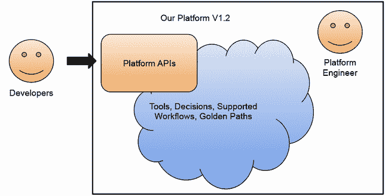

图 6.1 平台工程团队负责平台 API。

我们的平台 API 非常重要，因为好的 API 可以简化希望从我们的平台消费服务的开发团队的生活。如果我们的平台 API 设计良好，可以创建更多定制工具，如 CLIs、SDKs 或甚至用户界面，以帮助用户消费我们的平台服务。

如果我们为我们的平台构建定制和更特定领域的 API，我们可以从一次解决一个问题开始，然后将这些 API/接口扩展以覆盖更多和更多的工作流程，甚至为不同的团队。一旦我们了解我们想要覆盖哪些工作流程，并且有一个初始的平台 API 仪表板，就可以创建更多工具来帮助团队采用该平台。

让我们用一个例子来使其更加具体。我希望你能够将我这里展示的例子翻译成你组织内部更具体的例子。所有机制都应以相同的方式应用。让我们让我们的开发团队能够请求新的开发环境。

### 6.1.1 请求开发环境

一个平台可以帮助团队在开始处理新功能时快速上手的常见场景是为他们提供完成工作所需的一切。为了完成这项任务，平台工程团队必须了解他们将做什么工作，他们需要哪些工具，以及哪些其他服务必须可用才能成功。

一旦平台工程团队了解开发团队的需求，他们可以定义一个 API，以按需提供新的开发环境。在这些 API 背后，平台有创建、配置和为请求团队提供连接访问权限的机制。

对于我们的会议应用程序示例，如果一个开发团队正在扩展应用程序，我们（平台工程团队）必须确保他们有一个可运行的版本来工作并测试更改。这个隔离的应用程序实例还需要其数据库和其他基础设施组件才能工作。更高级的用例包括用模拟数据加载应用程序，允许团队使用预先填充的数据测试他们的更改，并拥有验证更改的正确工具。应用程序开发团队与平台之间的交互应类似于图 6.2。

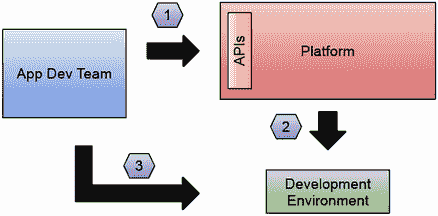

图 6.2 应用程序开发团队与平台的交互。#1 应用程序开发团队可以向平台 API 请求他们需要的任意数量的开发环境；#2 平台已经编码了如何提供应用程序开发团队工作所需的所有组件和工具；#3 平台需要为应用程序开发团队提供访问权限，以便使用新配置的环境。

如前所述，开发环境只是一个例子。你必须问自己你的团队需要哪些工具来完成他们的工作。例如，对于数据科学家团队来说，开发环境可能不是向他们展示工具的最佳方式，因为他们可能需要其他工具来收集和处理数据或训练机器学习模型。

在 Kubernetes 中实现这个简单的流程并不容易。为了实现此场景，我们需要：

+   图 6.3 显示了最简单的环境定义，它包括环境的名称和我们想要创建的环境类型（我们可能允许团队请求不同的设置，在这个例子中，我们想要一个新的 `开发` 环境）。环境定义还包括对消费团队有意义的自定义配置。在这种情况下，因为我们将会安装会议应用程序，我们希望允许团队决定是否需要安装基础设施组件。

+   拥有机制来编码开发环境对我们团队的意义。

+   拥有机制来配置和设置组件和工具。

+   拥有机制使团队能够连接到新配置的环境。

实现此场景有多种选择，包括创建自定义的 Kubernetes 扩展或使用更专业的开发环境工具。但在深入实施细节之前，让我们定义一下在此场景下我们的平台 API 应该是什么样子。

就像面向对象编程（OOP）一样，我们的 API 是 `接口`，可以被不同的 `类` 实现，最终提供具体的行为。对于配置开发环境，我们可以定义一个非常简单的接口，称为 `Environment`。请求新开发环境的开发团队可以通过创建新的环境资源向平台创建新的请求。`Environment` 接口代表了用户和平台之间的合同。此合同可以包括定义团队请求的环境类型或他们需要调整的选项和参数的参数。

创建理解开发环境请求的新 API。

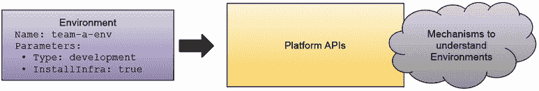

图 6.3 平台 API 定义的资源环境

重要的一点是，`Environment` 接口不应包含（或泄露）关于我们环境的任何实现细节。这些资源（在这种情况下是环境）作为我们的抽象层，用于隐藏从平台用户那里隐藏这些环境将如何创建的复杂性。这些资源越简单，对平台用户来说越好。在这个例子中，平台可以使用 `Environment Type` 参数来决定创建哪种环境，并且随着我们平台机制的演变，我们可以插入新的类型。

一旦我们认识到需要哪些接口，我们就可以逐渐添加团队可以配置的参数。对于我们的示例，如果我们还想创建应用程序基础设施或连接我们的服务到现有组件，那么为我们在环境中要部署的服务参数化一些功能可能是有意义的。图 6.4 显示了需要平台安装所需应用程序基础设施的环境定义。我们还想在我们的前端服务上启用一些调试功能。这里的可能性是无限的，具体取决于对您的团队来说什么是有意义的参数化。平台团队可以控制什么可行，什么不可行。扩展环境接口以涵盖更多用例可能看起来像图 6.4。

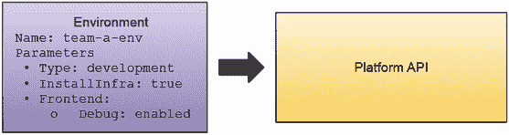

图 6.4 扩展环境资源以启用/禁用应用程序的服务。

将此环境资源编码为 JSON 或 YAML 等格式以实现平台 API 是直接的，如列表 6.1 所示。

列表 6.1 JSON 格式中的环境定义

```
{
  "name": "my-dev-env",
  "parameters":{
    "type": "development",
    "installInfra": true,
    "frontend": {
      "debug": "true",
    }
  }
}
```

一旦定义了接口，下一步合乎逻辑的步骤是为我们的平台用户提供这些环境的实施。在深入实现细节之前，我们需要解决两个主要挑战，这些挑战是在决定实现这些环境的机制将驻留何处时您将面临的。

注意：在构建这些接口时，我们正在设计用户体验。从平台工程的角度来看，将这些接口视为我们正在构建的层，以简化团队与我们的平台交互的方式。但我们也必须认识到，我们并不是试图构建一个黑盒方法，其中这个接口是唯一与我们的平台交互的方式。如果团队有与底层层和工具交互的技术经验，他们应该能够这样做。

## 6.2 平台架构

本节讨论我们将如何构建我们的平台。在构建平台的技术方面，我们将遇到需要平台团队做出一些艰难选择的挑战。在本节中，我们将讨论如何构建一个平台，使我们能够将一组工具封装在我们的平台 API 后面，并使开发团队能够执行他们的任务，而无需担心平台使用哪些工具来提供和连接复杂资源。

由于我们已经在会议应用程序中使用 Kubernetes 来部署我们的工作负载，因此将平台服务运行在 Kubernetes 之上也是合理的，对吧？但是，您会在工作负载旁边运行平台服务和组件吗？可能不会。让我们稍微退后一步。

如果您的组织采用 Kubernetes，您可能已经处理了多个 Kubernetes 集群。如第四章所述，您的组织可能已经建立了生产、预演或 QA 环境。如果您希望应用程序开发团队在感觉像生产环境的环境中工作，您必须通过 Kubernetes 集群来使他们具备这种能力。

图 6.5 展示了组织内部 Kubernetes 集群的典型分布，其中可能会为开发目的在短时间内创建大量小型集群。一个或多个中等规模的集群可用于预演和测试目的；这些集群往往保持不变，因为它们可能是为了运行性能测试或大量集成测试而有意创建的。最后，创建一个或多个大型集群用于运行我们的生产工作负载。根据我们想要覆盖多少地区，我们可能需要多个地理分布的生产集群。这些集群的配置是静态的，不会改变。与开发和测试集群相比，生产集群是站点可靠性工程团队的责任，确保这些集群及其上运行的应用程序全天候正常运行。

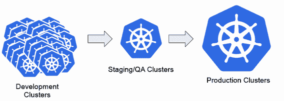

图 6.5 环境集群，如果您想使开发者能够拥有自己的环境。

虽然生产集群和预演/QA 集群应谨慎处理并加固以处理真实流量，但开发环境往往更短暂，有时甚至运行在开发团队的笔记本电脑上。当然，您不希望在任何一个环境中运行任何与平台相关的工具。原因很简单：像 Crossplane、ArgoCD 或 Tekton 这样的工具不应与我们的应用程序工作负载竞争资源。安全考虑也可能适用；我们不希望我们的应用程序的安全因平台工具中的漏洞而受到损害。

当考虑在 Kubernetes 之上构建平台时，团队往往会创建一个或多个特殊集群来运行平台特定的工具。术语仍需标准化，但创建一个平台或管理集群来安装平台级工具正变得越来越流行。

图 6.6 展示了通过拥有独立的平台集群，您可以在同时构建一套管理工具来控制工作负载运行的环境的同时，安装实现平台功能所需的工具。

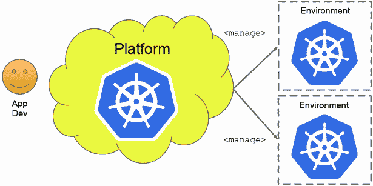

图 6.6 平台集群与平台工具管理环境

现在你有了一个单独的地方来安装这些工具，你还可以在这个集群上托管平台 API，再次避免让你的工作负载集群因平台组件而超载。如果能够重用或扩展 Kubernetes API 以作为我们的平台 API，那岂不是很好？这种做法有优点也有缺点。例如，如果我们希望我们的平台 API 遵循 Kubernetes 的约定和行为，那么我们的平台将使用 Kubernetes 的声明性特性，并推广 Kubernetes API 遵循的所有最佳实践，例如版本控制、资源模型等。这个 API 可能对非 Kubernetes 用户来说过于复杂，或者组织在创建不遵循 Kubernetes 风格的 API 时可能会遵循其他标准。*如果我们重用 Kubernetes API 作为我们的平台 API，所有为这些 API 设计的 CNCF 工具将自动与我们的平台一起工作。*我们的平台自动成为生态系统的一部分。在过去的几年里，我看到了一个趋势，即团队采用 Kubernetes API 作为他们的平台 API。你依赖于 Kubernetes API 的程度是平台工程团队需要做出的决定，而且总是有权衡。

图 6.7 展示了在同时使用 CNCF 和云原生生态系统中的 Kubernetes API 的同时，暴露一个遵循公司标准的特定组织 API 的关系。为了确保信息清晰，这些不是互斥的，正如我们将在第 6.3 节中看到的，同时拥有两者是非常有意义的。

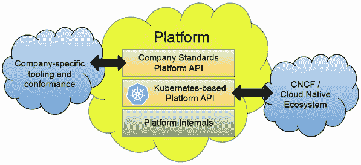

图 6.7 基于 Kubernetes 的平台 API 与公司特定 API 的互补

采用 Kubernetes API 作为你的平台 API 不会阻止你构建一个层，以便其他工具消费或遵循公司的标准。通过拥有基于 Kubernetes 的 API 层，你可以访问 CNCF 和云原生空间中创建的所有令人惊叹的工具。在基于 Kubernetes 的 API 之上，可以再添加一层，遵循公司标准和合规性检查，从而更容易与其他现有系统集成。

在我们之前的例子中，我们可以扩展 Kubernetes 以理解我们的环境请求，并提供定义这些环境如何配置的机制。

图 6.8 展示了用于定义我们环境的 Kubernetes 资源。这个资源可以被发送到安装了扩展集的 Kubernetes API 服务器，以便理解当新的环境定义到达时应该做什么。

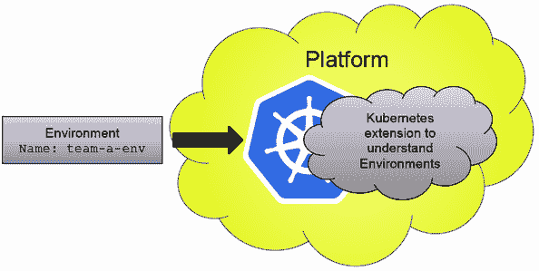

图 6.8 扩展 Kubernetes 以理解环境和作为我们的平台 API

在原则上，这似乎看起来不错且可行。然而，在实现这些 Kubernetes 扩展以作为我们的平台 API 和平台工具的中心枢纽之前，我们需要了解我们的平台实现将试图回答的问题。让我们看看在这些场景中团队将面临的主要平台挑战。

### 6.2.1 平台挑战

无论何时，如果你在处理多个 Kubernetes 集群，你必须管理它们以及与这些集群相关的所有资源。要管理所有这些资源需要什么？理解潜在问题的第一步是了解我们平台的使用者是谁。我们是在为外部客户还是内部团队构建平台？他们的需求是什么，他们需要达到何种隔离水平才能在没有打扰邻居的情况下独立操作？他们需要哪些指导方针才能成功？

虽然我不能为所有用例回答这些问题，但有一点很清楚——平台工具和工作负载需要分离。我们需要在我们的平台中编码基于每个租户期望的租户边界。无论这些租户是客户还是内部团队，我们都必须明确设定关于我们的租户模型和平台用户的保证，以便他们了解平台提供给他们的资源限制，以便他们完成工作。

我们将要构建的平台需要编码所有这些决策。在接下来的两个部分中，我们将探讨平台团队在其旅程早期将需要做出的两个最常见决策：（1）管理多个集群和（2）隔离和多租户。

### 6.2.2 管理多个集群

我们将要构建的平台需要管理和理解哪些环境可供团队使用。更重要的是，它应该允许团队在需要时请求自己的环境。

使用 Kubernetes API 作为我们的平台 API 来请求环境，我们可以使用像 ArgoCD（在第四章中介绍）这样的工具来持久化和同步我们的环境配置到实际的 Kubernetes 集群。管理我们的集群和环境变成了仅仅管理必须同步到我们的平台集群（们）的 Kubernetes 资源。

图 6.9 展示了使用我们已经使用过的两个工具（Crossplane 和 ArgoCD）来管理我们的会议应用程序，但现在是在管理平台级资源的环境中。

通过在我们的平台集群内部结合像 ArgoCD 和 Crossplane 这样的工具，我们推广了在第四章中讨论的技术，即环境管道技术，这些技术同步应用级别的组件，我们现在使用它们来管理高级平台问题。在这种情况下，像 Crossplane 这样的工具可以帮助我们在云提供商上配置完整的平台环境。

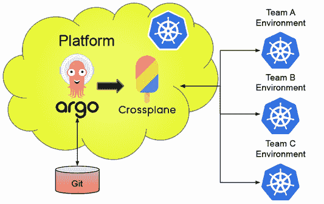


如您在前面的图中所见，我们的平台配置本身将变得更加复杂，因为它需要有一个真实来源（Git 仓库）来存储平台管理的环境和资源。它还需要访问一个密钥存储库，如 HashiCorp Vault，以使 Crossplane 能够连接并创建不同云提供商中的资源。换句话说，您现在有两个额外的关注点。首先，您需要定义、配置并授予访问权限给一个或多个 Git 仓库以包含平台中创建的资源配置。其次，您必须管理一组云提供商账户及其凭证，以便平台集群可以访问和使用这些账户。

如果您能够像管理您的作业（使用 GitOps 方法、管理凭证和用户、以及公开正确的抽象/API）一样管理所有平台资源，平台工件就只是您开发和持续交付实践的扩展。

虽然第 6.3 节的示例没有专注于配置所有这些关注点，但它提供了一个很好的游乐场，可以在其基础上构建并根据自己的团队需求进行更高级的设置实验。

我建议优先考虑哪些配置是有意义的，以便了解您的团队或租户将如何使用资源、期望和要求。让我们更深入地探讨这个领域。

### 6.2.3 隔离和多租户

根据您的租户（团队、内部或外部客户）的需求，您可能需要创建不同的隔离级别，这样他们在同一平台屋顶下工作时不会相互干扰。

多租户是 Kubernetes 生态系统中的一个复杂话题。使用 Kubernetes RBAC（基于角色的访问控制）、Kubernetes 命名空间以及可能设计有不同租户模型的多重 Kubernetes 控制器使得在同一个集群内定义租户之间的隔离级别变得困难。

正在采用 Kubernetes 的公司倾向于采取以下一种隔离方法：

+   Kubernetes 命名空间：

    +   优点：

        +   创建命名空间非常简单，并且几乎没有开销。

        +   创建命名空间成本很低，因为它只是 Kubernetes 用来在集群内部部分隔资源的逻辑边界。

    +   缺点：

        +   命名空间之间的隔离非常基础，它将需要 RBAC 角色来限制用户在他们被分配的命名空间之外的可视性。还必须定义资源配额以确保单个命名空间不会消耗所有集群资源。

        +   提供对单个命名空间的访问需要共享与管理员和所有其他租户使用的相同 Kubernetes API 端点。这限制了客户端可以在集群上执行的操作，例如安装集群范围内的资源。

        +   所有租户都将与同一个 Kubernetes API 服务器交互，这可能会根据每个租户的规模和需求引起问题。

        +   共享相同的 Kubernetes API 服务器限制了可以在集群中安装的全局资源。例如，安装同一扩展的两个不同版本是不可能的。

+   Kubernetes 集群：

    +   优点：

        +   与不同集群交互的用户可以拥有完整的管理员权限，使他们能够安装他们需要的任何工具。

        +   您可以在集群之间实现完全隔离，连接到不同集群的租户不会共享相同的 Kubernetes API 服务器端点。每个集群都可以有不同的配置，以确定其可扩展性和弹性。这允许您根据其需求定义不同的租户类别。

    +   缺点：

        +   这种方法成本高昂，因为您将支付运行 Kubernetes 的计算资源费用。您创建的集群越多，运行 Kubernetes 的费用就越高。

        +   如果您允许团队创建（或请求）他们自己的集群，管理多个 Kubernetes 集群会变得复杂。僵尸集群（无人使用且被遗弃的集群）开始出现，浪费了宝贵的资源。

        +   在多个不同的 Kubernetes 集群之间共享资源、安装和维护工具具有挑战性，并且是一项全职工作。

根据我的经验，团队会为敏感环境，如生产环境和性能测试，创建隔离的 Kubernetes 集群。这些敏感环境通常保持不变，并且仅由运维和站点可靠性团队管理。当您转向开发团队和更短暂的测试或日常开发任务环境时，使用带有命名空间的集群是一种常见做法。

在这两种选项之间做出选择很难，但重要的是不要过度承诺于单一选项。不同的团队可能有不同的需求，因此在下文中，我们将探讨平台如何抽象这些决策，使团队能够根据他们的需求访问不同的配置。

我对做出这些决策的平台团队的建议是，建立并实施能够让您从一种解决方案切换到另一种解决方案的实践。从简单的解决方案，如命名空间隔离开始是很常见的，但过了一段时间，当单个集群和大量命名空间不足以满足需求时，您需要更稳健的计划。为了使这个决定更容易，问问自己您的消费者是否需要访问 Kubernetes API。如果他们不需要，您可能希望评估采用类似于 Google Cloud Run ([`cloud.google.com/run`](https://cloud.google.com/run))、Azure Container Apps ([`azure.microsoft.com/en-us/products/container-apps`](https://azure.microsoft.com/en-us/products/container-apps)) 或 AWS App Runner ([`aws.amazon.com/apprunner/`](https://aws.amazon.com/apprunner/)) 的方法，这些方法使团队能够在不访问编排器 API 的情况下运行容器。

## 6.3 我们的平台原型

本节探讨了创建一个简单的平台，允许内部团队创建开发环境。由于我们的团队正在将会议应用程序部署到 Kubernetes 集群中，我们希望为他们提供相同的开发者体验。

注意：您可以通过一个逐步教程来跟随，在该教程中，您将安装并交互使用平台行走骨架，请参阅[`github.com/salaboy/platforms-on-k8s/tree/main/chapter-6`](https://github.com/salaboy/platforms-on-k8s/tree/main/chapter-6)。

为了实现这一点，我们将使用之前使用的一些工具，如 Crossplane，来扩展 Kubernetes 以理解开发环境。然后，我们将使用一个名为`vcluster`的项目([`vcluster.com`](https://vcluster.com))为我们的团队提供小型 Kubernetes 集群。这些集群是隔离的，允许团队安装额外的工具而不用担心其他团队正在做什么。因为团队将能够访问 Kubernetes API，他们可以自由地对集群进行操作，而无需请求复杂的权限来调试他们的工作负载。

图 6.10 展示了这个过程是如何工作的。团队可以通过创建环境 Kubernetes 资源来请求新的环境。平台将获取这些资源，并为它们使用`vcluster`提供小型 Kubernetes 集群。对于这个行走骨架，我们将保持简单，但平台本身是复杂的。

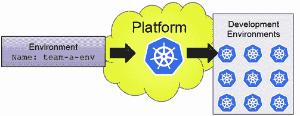

图 6.10 构建一个平台原型以提供开发环境

我必须强调，这个例子故意使用现有工具而不是创建我们自己的自定义 Kubernetes 扩展的重要性。如果你创建自定义控制器来管理环境，你将创建一个复杂的组件，这将需要维护，并且可能与本例中展示的机制重叠 95%。换句话说，在构建这个例子时，没有创建任何自定义 Kubernetes 控制器。

正如我们在本章开头讨论我们的平台 API 时一样，让我们看看我们如何构建这些 API，而不需要创建我们需要测试、维护和发布的自定义 Kubernetes 扩展。我们将使用与第五章中我们的数据库和消息代理相同的 Crossplane 组合，但现在我们将实现我们的环境自定义 Crossplane 组合资源定义。我们可以保持环境资源简单，并使用 Kubernetes 标签匹配和选择器来匹配一个资源与我们可以创建的可能的组合之一，以提供我们的环境。

图 6.11 展示了如何通过更改环境中的属性/标签来帮助 Crossplane 为我们的团队选择正确的组合。

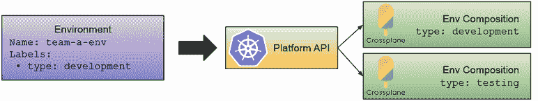

图 6.11 将环境资源映射到 Crossplane 组合

Crossplane 组合提供了使用不同的提供程序一起配置和部署资源的灵活性，正如我们在第五章中看到的，可以为不同类型的多个环境提供不同的组合（实现）。对于这个例子，我们希望每个环境都能与其他环境隔离，以避免团队无意中删除其他团队的资源。创建隔离环境的最直观的两种方式可能是为每个环境创建一个新的命名空间，或者为每个环境创建一个完整的 Kubernetes 集群。

图 6.12 展示了如何使用另一个 Crossplane 提供程序（称为 Kubernetes 提供程序）来创建 Kubernetes 资源，例如命名空间。这与使用允许我们创建完整集群的云提供商 Crossplane 提供程序形成对比，在这种情况下是在 Google Cloud Platform（GCP）中。一旦我们有一个集群，我们就可以安装我们的会议应用程序 Helm 图表。

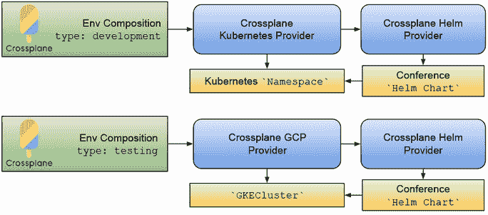

图 6.12 不同环境组成、命名空间和 GKECluster

虽然为每个开发团队创建一个完整的 Kubernetes 集群可能有些过度，但 Kubernetes 命名空间可能不足以满足你的使用案例，因为所有团队都将与同一个 Kubernetes API 服务器交互。因此，我们将使用 `vcluster` 与 Crossplane Helm 提供程序结合使用，这让我们在不需要创建新集群的成本下，获得了两者的最佳之处。图 6.13 展示了我们可以如何重复使用 Crossplane Helm 提供程序来创建 `vclusters`。

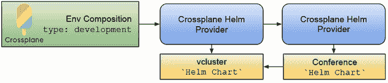

图 6.13 使用 vcluster 创建隔离环境

你可能想知道：什么是 `vcluster`？为什么我们要使用 Crossplane Helm 提供程序来创建一个？虽然 `vcluster` 只是你可以使用来构建你的平台的选择之一，但我认为它是每个平台工程师工具箱中的关键工具。

### 6.3.1 vcluster 用于虚拟 Kubernetes 集群

我是非常喜欢 `vcluster` 项目。如果你在讨论基于 Kubernetes 的多租户，`vcluster` 往往会在对话中出现，因为它为 Kubernetes 命名空间与 Kubernetes 集群之间的讨论提供了一个非常好的替代方案。

`vcluster` 通过在现有的 Kubernetes 集群（宿主集群）内部创建虚拟集群，专注于为不同的租户提供 Kubernetes API 服务器隔离。图 6.14 展示了 `vcluster` 在现有 Kubernetes 集群（宿主）内部的工作方式。

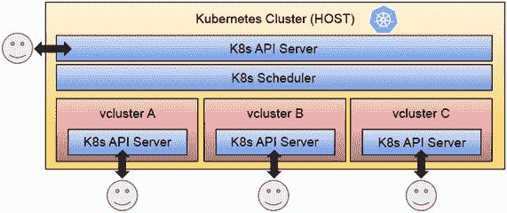

图 6.14 vcluster 在 Kubernetes (K8s) API 服务器上提供隔离

通过创建新的虚拟集群，我们可以与租户共享一个隔离的 API 服务器，他们可以在其中做任何需要的事情，无需担心其他租户正在做什么或安装什么。对于希望每个租户都能拥有集群级访问权限和完全控制 Kubernetes API 服务器的场景，`vcluster`提供了一个简单的替代方案来实现这一点。如果你不需要为你的团队提供访问 Kubernetes API 的权限，我建议使用之前提到的命名空间方法。

创建一个`vcluster`很简单：你可以通过安装`vcluster` Helm 图表来创建一个新的`vcluster`。或者，你可以使用`vcluster` CLI 来创建一个并连接到它。

最后，可以在他们的文档中找到一个很好的比较`vcluster`、Kubernetes Namespaces 和 Kubernetes 集群的表格。如果你已经与你的团队进行了这些对话，这个表格以清晰的语言解释了优势和权衡（图 6.15）。


图 6.15 Kubernetes Namespaces 与 vcluster 与 Kubernetes 集群租户的优缺点

我强烈建议查看他们的网站([`vcluster.com`](https://vcluster.com))和可用的博客文章[`www.salaboy.com/2023/06/19/cost-effective-multi-tenancy-on-kubernetes/`](https://www.salaboy.com/2023/06/19/cost-effective-multi-tenancy-on-kubernetes/)，以了解更多关于这个项目以及它如何帮助你的团队配置成本效益高的集群。

接下来，让我们看看我们的平台行走骨架对于想要创建、连接并针对使用`vcluster`的新环境工作的团队是什么样的。

### 6.3.2 平台体验

在 GitHub 仓库[`github.com/salaboy/platforms-on-k8s/tree/main/chapter-6`](https://github.com/salaboy/platforms-on-k8s/tree/main/chapter-6)中实现的平台行走骨架允许连接到平台 API 的团队创建新的环境资源，并向平台提交请求以供其为他们配置。

图 6.16 展示了我们平台行走骨架的架构。首先，应用开发团队可以向平台 API 提交创建新开发环境的请求。平台将为开发团队配置一个新的环境——在这种情况下，遵循使用 Crossplane Helm 提供程序创建新虚拟集群（使用`vcluster`）的 Crossplane 组合——然后为开发团队安装 Conference 应用 Helm 图表以进行工作。其次，应用开发团队可以连接到这个新的隔离环境，无需担心破坏其他团队的设置。

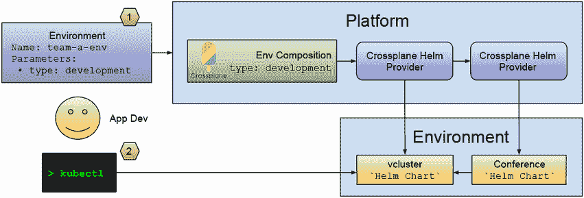

图 6.16 使用 Crossplane 和`vcluster`为应用开发团队创建隔离环境

注意：拥有一个大型集群来托管所有临时开发环境集群是非常有意义的。我们用于构建平台行走骨架的工具可以轻松配置以实现该设置，但在单个本地 KinD 集群上运行则相当困难。

平台集群使用 Crossplane 和 Crossplane 组合来定义如何配置环境。为了在一个本地 Kubernetes 集群中运行 Crossplane 组合（而不需要访问特定的云提供商），行走骨架使用`vcluster`为其自己的（虚拟）Kubernetes 集群配置每个环境。拥有独立的 Kubernetes 集群使团队能够连接到这些环境，并使用我们默认在创建环境时安装的会议应用程序完成他们需要的工作。

应用团队需要连接到平台 API（托管平台工具的 Kubernetes 集群——在本例中，是 Crossplane 和`vcluster`配置），使用如`kubectl`之类的工具来请求新的环境。对于行走骨架，将环境资源发送到平台 API 将导致平台配置一个新的`vcluster`，团队可以连接到它。请参阅列表 6.2，它显示了我们可以发送到 Kubernetes API 服务器的环境资源定义。

列表 6.2 作为 Kubernetes 资源的环境定义

```
apiVersion: salaboy.com/v1alpha1
kind: Environment
metadata:
  name: team-a-dev-env          ①
spec:
  compositionSelector:
    matchLabels:
      type: development         ②
    parameters:                 ③
      installInfra: true
```

① 我们想要创建的环境名称

② 我们想要的环境类型是通过标签定义的

③ 参数是针对您特定用例定制的。根据您想要使团队能够配置的内容，您可以为他们在请求环境时迭代定义更多和更多的参数以进行微调。

因为这些是 Kubernetes 资源，团队可以使用`kubectl`查询这些资源，如列表 6.3 所示。

列表 6.3 列出环境资源

```
> kubect get environments
NAME           CONNECT-TO           TYPE        INFRA READY
team-a-dev-env team-a-dev-env-jp7j4 development true  True  
```

一旦环境准备就绪，团队就可以连接到它。因为我们使用`vcluster`，连接到它就像连接到任何其他 Kubernetes 集群一样。幸运的是，`vcluster`使我们的生活变得更简单，我们可以使用它们的 CLI 为我们配置访问令牌。

运行以下命令将连接到刚刚创建的`vcluster`实例，并托管由 Crossplane 组合安装的会议应用程序：

```
vcluster connect team-a-dev-env-jp7j4 --server https://localhost:8443 -- zsh
```

注意：当运行`vcluster connect`时，您现在连接到了一个新的集群上下文，这意味着如果您列出所有 Pod 和 Namespaces，您将只会看到在这个新集群中可用的资源。您不应该看到任何 Crossplane 资源，例如。

对行走骨架的自然扩展是使用 Crossplane 组合在云服务提供商上创建环境，以启动 Kubernetes 集群。使用 ArgoCD 在 Git 仓库内管理这些环境资源也是一个自然的进步。在这种情况下，与要求应用开发团队直接与平台 API 连接相比，团队可以通过向一个可以验证并自动合并的仓库发送拉取请求来请求新的环境。

逐步教程([`github.com/salaboy/platforms-on-k8s/tree/main/chapter-6`](https://github.com/salaboy/platforms-on-k8s/tree/main/chapter-6))以部署自定义平台管理员用户界面应用程序结束。这个平台管理员应用程序使团队能够在不连接到 Kubernetes 平台 API 的情况下使用平台功能，通常称为“点击操作”，因为我们试图避免团队编写复杂的 YAML 文件或像云服务提供商那样执行长命令。此应用程序公开 REST 端点以及用户界面提供的功能，以减少需要了解平台幕后操作的应用团队的认知负荷。图 6.17 显示了平台门户管理员界面（这不是会议应用程序的一部分）。

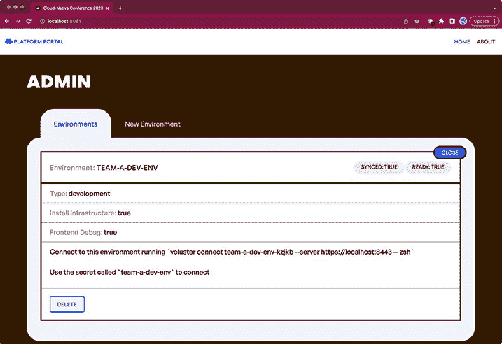

图 6.17 平台管理员用户界面允许团队在不连接到平台 Kubernetes API 的情况下创建和管理环境。

此平台管理员应用程序还公开 REST 端点，通过发送 REST 请求执行所有操作，这可以用于进一步的自动化和与现有系统的集成。

总结一下，行走骨架为平台用户提供不同的交互方式。首先，它扩展了 Kubernetes API，以启用平台工作流程，例如使用 Crossplane 创建开发环境。然后，它为不希望或不能使用扩展的 Kubernetes API 的团队提供用户界面和简化的 REST 端点。这些简化的 REST API、SDK 和 CLI 可以为团队创建，以便他们管理自己的环境。

总是提供这两种选项都是有价值的。当可能的时候，使用 Kubernetes API 和云原生生态系统的力量是好的，但同样重要的是，在需要时有一个简化的选项来减少认知负荷并遵循公司 API 标准。

在结束本章之前，让我们回顾一下我们共同看到的主题和项目。所有这些工具和配置与平台工程有何关联？谁负责哪个组件？接下来又是什么？

## 6.4 回顾平台工程

到目前为止，我们已经探讨了处理我们在构建分布式应用程序时面临的不同挑战的开源项目。这些工具中的大多数都不是针对应用程序开发者的，需要通常在构建业务应用程序和功能时不需要的技能和知识。所有工具的共同点是 Kubernetes，在大多数情况下，项目都扩展了 Kubernetes 以执行除了运行我们的工作负载之外的任务。在本节中，我想回顾一下所有这些项目是如何结合在一起以界定责任、合同和期望的。

如果我们从远处观察所有这些例子，有两种类型的团队：平台和应用开发团队。这两个团队有不同的责任，需要不同的工具来完成他们的工作。从我们迄今为止所看到的情况来看：

+   平台团队负责以下事项：

    +   理解与 IT 服务、云资源和工具相关的不同团队的需求。

    +   便于访问凭证和不同资源。

    +   为其他团队创建自动化工具以满足他们的需求。

+   应用程序开发团队负责以下事项：

    +   定义面向客户的架构和技术栈。

    +   创建面向客户的特性。

    +   发布新版本以持续改进业务运营方式。

这些责任体现在可以类似管理的软件工件中。图 6.18 显示了我们在平台行走骨架中使用的工件。未包含在逐步教程中的工具用虚线表示。

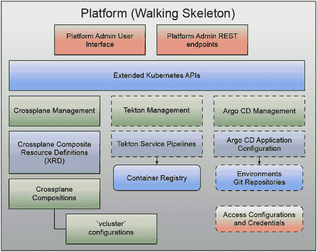

图 6.18 平台行走骨架工具、配置和服务

如您所见，即使是对于一个非常简单的平台，平台团队也在管理和维护需要高度可用以供我们的应用程序开发团队使用的不同工具。我还没有专注于管理凭证或机密，但这是平台团队在其旅程早期将面临的问题。使用像外部机密项目（[`github.com/external-secrets/external-secrets`](https://github.com/external-secrets/external-secrets)）和/或像 HashiCorp 的 Vault（[`www.vaultproject.io/`](https://www.vaultproject.io/)）这样的工具将使管理和存储凭证变得更加容易和集中化。这种复杂程度在历史上导致了两种实施场景：

1.  购买提供出色应用程序开发者体验但平台工程定制或可操作性有限的解决方案（例如，Heroku、CloudFoundry）

1.  从一组原语构建解决方案，包括脚本语言（BASH、Python 等）、声明式基础设施语言（Crossplane、Terraform、Chef、Ansible）和工作流引擎（ArgoCD Workflows、CircleCI、GitHub Actions）。

最近，出现了大量新的工具，使得第一种场景（例如，Vercel、Fly.io）成为可能。然而，对于许多组织来说，这些解决方案在全面管理其业务流程和合规性要求方面仍需要帮助。为了应对这一挑战，人们更加关注降低定制内部产品构建的成本。例如，有一个名为 Kratix（[`kratix.io/`](https://kratix.io/)）的项目，它是一个框架，旨在优化定义和实施作为服务提供给其他内部团队的经验。

Kratix 围绕平台构建体验，而不是应用用户体验。像 Kratix 这样的框架可以启用一个内部市场，专家可以在保持提供的一致性同时，将能力作为服务提供，类似于我们通过 Crossplane 组合所探索的。

无论您使用外部工具还是构建自己的工具，平台工程团队都必须构建关于他们用于构建平台的项目知识库，并有一个发布流程来管理工具上线供其他团队使用时的变更。

与本书的示例存储库[`github.com/salaboy/platforms-on-k8s/`](https://github.com/salaboy/platforms-on-k8s/)类似，平台工程团队需要管理所有配置文件，以安装和重新创建平台工作所需的所有工具和资源。

注意：理想情况下，与 Kubernetes 一样，如果控制平面（我们安装的工具）出现故障，我们的团队应该能够继续工作。我们（作为平台工程团队）需要构建具有弹性的平台，并确保如果出现问题，我们不会阻碍团队及其正在进行的重要工作。虽然我们构建的平台应该加快软件交付，但它不应该是团队成功的关键路径。换句话说，总应该有绕过平台的方法，这意味着如果团队想直接访问平台使用的某些工具，他们应该能够做到。

本章中我们构建的行走骨架为不同用户提供了不同的层，以便他们进行工作和集成。如果你的团队理解了平台工具，他们可以访问平台集群的 Kubernetes API，以获得完全的灵活性和控制。如果他们选择，他们也可以使用提供的用户界面和 REST 端点与其他系统集成。图 6.19 展示了我们的平台行走骨架，它如何为团队提供由平台 API 公开的预定义工作流程，以及平台团队在底层实现的工具和行为。

我强烈建议平台团队记录他们使用计划作为其平台倡议一部分的每个工具的旅程，因为让团队成员熟悉这些决策通常是维护像这里描述的平台最具有挑战性的方面。

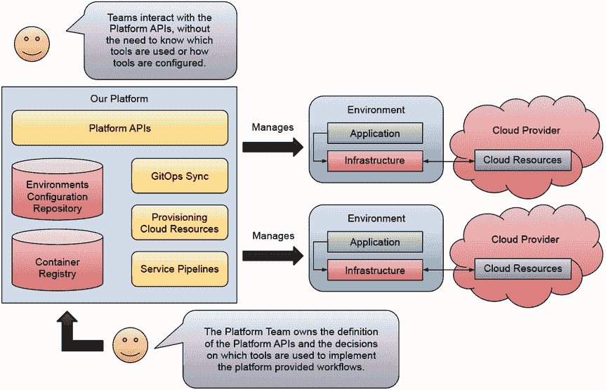

图 6.19 平台责任和边界

在接下来的几章中，我们将探讨平台在为团队创建环境时应提供的一些核心功能。可以为应用开发团队提供哪些功能，以便他们在交付软件时更加高效？第七章涵盖了发布策略及其为什么对团队进行实验和发布更多软件很重要。第八章涵盖了你需要为应用程序的所有服务提供的一些共享关注点，以及为开发者提供这些机制的不同方法。

## 摘要

+   在 Kubernetes 之上构建平台是一项复杂的工作，需要结合不同的工具来满足不同团队的需求。

+   平台就像你的业务应用程序一样是软件项目。首先理解主要用户是谁，并定义清晰的 API，这是确定如何构建平台时任务优先级的关键。

+   管理多个 Kubernetes 集群和处理租户隔离是平台团队在平台构建初期面临的主要挑战。

+   拥有一个平台的基础框架可以帮助你向内部团队展示可以构建的内容，以加快他们的云原生之旅。

+   使用 Crossplane、ArgoCD、`vcluster`和其他工具可以帮助你在平台级别推广云原生最佳实践，但最重要的是，避免创建自定义工具和用于配置和维持云原生资源复杂配置的方法的冲动。

+   如果你遵循了逐步教程，你将获得使用 Crossplane 和`vcluster`等工具来提供按需开发环境的实践经验。你还与一个简化的 API 进行了交互，这有助于减少不希望或无法与完整的 Kubernetes API 服务器交互的团队的认知负荷。
