# 7 平台功能 I：共享应用程序关注点

本章涵盖

+   95%的云原生应用程序的学习需求

+   减少应用程序与基础设施之间的摩擦

+   使用标准 API 和组件解决共同关注的问题

在第五章中，我们创建了数据库和消息代理等抽象，以配置和配置应用程序服务所需的所有组件。在第六章中，我们扩展了这些机制来构建我们的平台步行骨架。这个平台使团队能够请求新的开发环境，这些环境不仅创建隔离的环境，还安装了会议应用程序（以及应用程序所需的所有组件），以便团队能够开展工作。通过构建平台的过程，我们定义了平台团队的责任以及每个工具所属的位置及其原因。在第六章结束时，我们提供了关于像 Crossplane、Argo CD 和 Tekton 这样的工具在哪里运行以及如何管理并启用具有团队交付更多软件所需功能的不同的环境的明确指南。

到目前为止，我们为开发者提供了运行应用程序实例的 Kubernetes 集群。本章探讨了提供更接近应用程序需求的功能的机制。这些功能中的大多数将通过抽象应用程序基础设施需求的 API 来访问，允许平台团队在不更新任何应用程序代码的情况下演变（更新、重新配置、更改）基础设施组件。同时，开发者将与这些平台功能交互，而无需了解它们的实现方式，也不会因为大量依赖而使应用程序膨胀。本章分为三个部分：

+   大多数应用程序 95%的时间在做什么？

+   标准 API 和抽象，用于将应用程序代码与基础设施分离。

+   使用 Dapr（分布式应用运行时）更新我们的会议应用程序，Dapr 是一个由 CNCF 和开源项目创建的，旨在为分布式应用挑战提供解决方案的项目。

让我们先分析一下大多数应用程序在做什么。不用担心；我们也会涵盖边缘情况。

## 7.1 大多数应用程序 95%的时间在做什么？

我们已经与我们的步行骨架会议应用程序合作了七个章节。我们学习了如何在 Kubernetes 上运行它，以及如何将服务连接到数据库、键值存储和消息代理。回顾这些步骤并在步行骨架中包含这些行为是有充分理由的。大多数应用程序，如会议应用程序，将需要以下功能：

+   *调用其他服务发送或接收信息:* 应用程序服务并不是孤立的。它们需要调用其他服务，并被其他服务调用。服务可以是本地的或远程的，你可以使用不同的协议，最常见的是 HTTP 和 GRPC。我们在会议应用程序的行走骨架中使用服务之间的 HTTP 调用。

+   *存储和读取持久化存储中的数据:* 这可以是数据库、键值存储、类似 S3 存储桶的 blob 存储，甚至是从文件中写入和读取。对于会议应用程序，我们使用 Redis 和 PostgreSQL。

+   *异步发射和消费事件或消息:* 在分布式系统中，使用异步消息进行通信系统实现事件驱动架构是一种常见做法。使用像 Kafka、RabbitMQ 甚至云提供商的消息系统是常见的。会议应用程序中的每个服务都在使用 Kafka 发射或消费事件。

+   *访问凭证以连接到服务:* 当连接到应用程序的基础设施组件，无论是本地还是远程时，大多数服务都需要凭证来对其他系统进行身份验证。在这本书中，我只提到了像外部密钥（[`github.com/external-secrets/external-secrets`](https://github.com/external-secrets/external-secrets)）或 HashiCorp 的 Vault（[`www.vaultproject.io/`](https://www.vaultproject.io/)）这样的工具，但我们还没有深入探讨。

无论我们是在构建商业应用程序还是机器学习工具，大多数应用程序都将从这些能力易于消费中受益。虽然复杂的应用程序需要更多，但总有办法将复杂部分与通用部分分离。

图 7.1 展示了几个服务之间以及与可用基础设施的交互示例。服务 A 通过 HTTP 调用服务 B（对于这个主题，GRPC 同样适用）。服务 B 存储并从数据库读取数据，并需要正确的凭证来连接。服务 A 还连接到消息代理并将消息放入其中。服务 C 可以从消息代理中提取消息，并使用一些凭证连接到存储桶，以存储基于接收到的消息的一些计算。

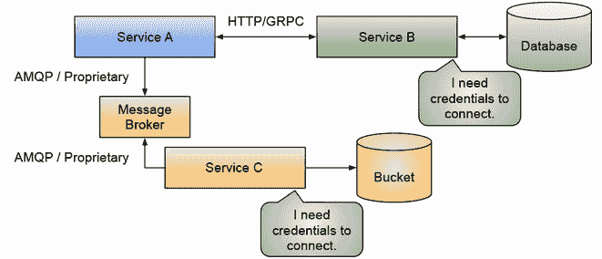

图 7.1 分布式应用程序中的常见通信模式

无论这些服务实现什么逻辑，我们都可以提取一些常量行为，并使开发团队能够消费，而无需处理低级细节，或推动他们做出关于可以在平台级别解决的问题的决策。

要了解这是如何工作的，我们必须仔细观察这些服务内部发生的事情。正如你可能已经知道的，魔鬼藏在细节中。从高层次的角度来看，我们习惯于处理如图 7.1 所示的服务执行其描述的操作，但如果我们想要在软件交付管道中实现更高的速度，我们需要再深入一层，了解我们应用程序组件之间的复杂关系。让我们快速看一下应用程序团队在尝试更改不同的服务和所需的基础设施时面临的挑战。

### 7.1.1 应用与基础设施耦合的挑战

幸运的是，这并不是编程语言竞赛，与你的选择无关。如果你想连接到数据库或消息代理，你必须向你的应用程序代码中添加一些依赖项。虽然这在软件开发行业中是一种常见做法，但它也是交付速度比预期慢的原因之一。

不同团队之间的协调是发布软件时大多数阻塞问题的原因。我们创建了架构并采用了 Kubernetes，因为我们希望更快地发展。通过使用容器，我们采用了更简单、更标准的方式来运行我们的应用程序。无论应用程序是用哪种语言编写的，或者使用了哪种技术栈，如果你给我一个包含应用程序的容器，我就可以运行它。我们已经消除了应用程序对操作系统的依赖，以及我们需要在机器（或虚拟机）上安装的软件，以便运行你的应用程序，现在这些软件都封装在容器中。

不幸的是，我们还没有解决容器（我们应用程序的服务）之间的关系和集成点。我们也没有解决这些容器将如何与本地（自托管）或由云服务提供商管理的应用程序基础设施组件交互的问题。

让我们更仔细地看看这些应用程序在哪些方面严重依赖其他服务，并且可能阻碍团队进行更改，推动他们进行复杂的协调，这可能导致我们的用户出现停机。我们将从将之前的示例分解为每个交互的具体情况开始。

### 7.1.2 服务间交互挑战

要将数据从一个服务发送到另一个服务，你必须知道另一个服务运行的位置以及它使用哪种协议来接收信息。因为我们处理的是分布式系统，我们还需要确保服务间的请求能够到达另一个服务，并具备处理意外网络问题或另一个服务可能失败的情况的机制。换句话说，我们需要在我们的服务中构建弹性。我们并不能总是信任网络或其他服务按预期行为。

让我们以服务 A 和服务 B 为例，深入探讨细节。在图 7.2 中，服务 A 需要向服务 B 发送一个请求。

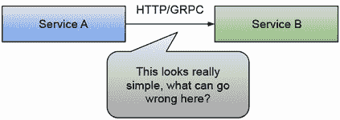

图 7.2 服务间交互挑战

但让我们更深入地探讨服务内部可以使用的机制。假设我们暂时不考虑服务 A 依赖于服务 B 的合同（API）需要稳定且不改变的事实，以便于理解这个机制。还有什么可能出错？正如提到的，开发团队应该在他们的服务内部添加一个弹性层，以确保服务 A 的请求能够到达服务 B。实现这一功能的一种方法是通过框架在请求失败时自动重试。所有编程语言都有实现这一功能的框架。像`go-retryablehttp`（[`github.com/hashicorp/go-retryablehttp`](https://github.com/hashicorp/go-retryablehttp)）或 Spring Boot 的 Spring Retry（[`github.com/spring-projects/spring-retry`](https://github.com/spring-projects/spring-retry)）这样的工具可以为你的服务间交互添加弹性。其中一些机制还包括指数退避功能，以避免在出现问题时过载服务和网络。

不幸的是，没有跨技术堆栈共享的标准库可以为所有应用程序提供相同的行为和功能，所以即使你使用相似的参数配置 Spring Retry 和`go-retryablehttp`，也很难保证它们在服务开始失败时会有相同的行为。

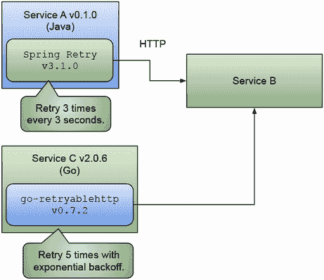

图 7.3 服务间交互重试机制

图 7.3 展示了使用 Spring Retry 库在 Java 中编写的服务 A，当请求未能被服务 B 确认时，它将重试三次，每次请求之间的等待时间为 3 秒。使用`go-retryablehttp`库编写的服务 C，用 Go 语言编写，配置为重试五次，但在出现问题时使用指数退避机制（请求之间的重试周期不是固定的；这可以为其他服务的恢复提供时间，并避免被重试请求淹没）。

即使应用程序是用相同的语言编写的并使用相同的框架，两个服务（A 和 B）也必须具有兼容的依赖项和配置版本。如果我们将服务 A 和服务 B 都推向使用框架的版本，这意味着我们将它们耦合在一起，这意味着每当这些内部依赖项版本中的任何一个发生变化时，我们都需要协调另一个服务的更新。这可能会导致更多的延迟并增加协调工作的复杂性。

注意：在本节中，我使用了重试机制作为示例，但请考虑您可能希望包括在这些服务间交互中的其他横切关注点，例如断路器（也用于弹性）、速率限制和可观察性。考虑您将需要添加到您的应用程序代码中以便从中获取指标的框架和库。

另一方面，为每个服务使用不同的框架（和版本）将使我们的操作团队对这些服务的故障排除变得复杂。如果有一种方法可以在不修改应用程序的情况下为我们的应用程序添加弹性，那岂不是很好？在回答这个问题之前，还有其他什么可能出错？

开发者经常忽视的一些事情与这些通信的安全性方面有关。服务 A 和服务 B 并不孤立存在，这意味着其他服务围绕着它们。如果这些服务中的任何一个被恶意行为者攻破，所有服务之间的自由服务间调用会使我们的整个系统不安全。这就是为什么拥有服务身份和正确的安全机制来确保，例如，服务 A 只能调用服务 B，对于图 7.4 所示的情况，极为重要。

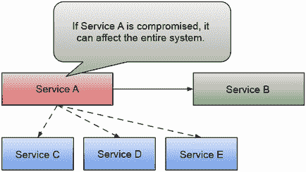

图 7.4 如果一个服务被攻破，它可能会影响整个系统。

有了允许我们定义我们的服务身份的机制，我们可以定义哪些服务间调用是被允许的，以及允许哪些协议和端口进行通信。图 7.5 展示了我们如何通过定义规则来减少影响范围（如果发生安全漏洞，受影响的服务的数量），这些规则强制规定哪些服务允许在我们的系统中，以及它们应该如何交互。

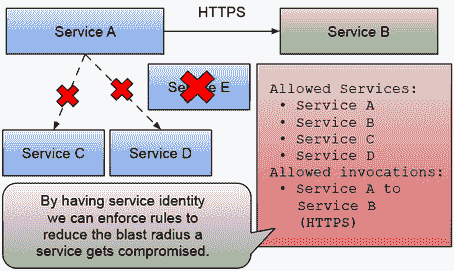

图 7.5 通过定义系统级规则来减少影响范围

定义和验证这些规则的正确机制不能轻易地构建在每个服务内部。因此，开发者倾向于假设将有一个外部机制负责执行这些检查。

正如我们将在以下章节中看到的，服务身份是我们需要跨领域的东西，而不仅仅是对于服务间交互。如果有一种简单的方法可以将服务身份添加到我们的系统中而不改变我们的应用程序服务，那岂不是很好？

在回答这个问题之前，让我们看看团队在架构分布式应用程序时面临的其他挑战。让我们谈谈存储和读取状态，这是大多数应用程序都会做的。

### 7.1.3 存储/读取状态挑战

我们的应用程序需要从持久存储中存储或读取状态。这是一个相当常见的需求，对吧？你需要数据来进行一些计算，然后将结果存储在某个地方，以防应用程序崩溃时丢失。在我们的示例中，图 7.6，服务 B 需要连接到数据库或持久存储来读取和写入数据。

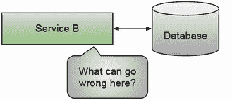

图 7.6 存储/读取状态挑战

这里可能会出什么问题？开发者习惯于连接到不同类型的数据库（关系型、NoSQL、文件、桶）并与它们交互。但是，有两个主要的摩擦点会减缓团队推进服务的步伐：依赖项和凭证。

让我们从查看依赖项开始。服务 B 需要什么类型的依赖项才能连接到数据库？图 7.7 显示了服务 B 连接到关系型数据库和 NoSQL 数据库。为了实现这些连接，服务 B 需要包含一个驱动程序和客户端库，以及用于微调应用程序如何连接到这两个数据库的配置。这些配置定义了连接池的大小（多少个应用程序线程可以同时连接到数据库）、缓冲区、健康检查以及其他可能改变应用程序行为的重要细节。

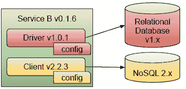

图 7.7 数据库依赖项和客户端版本

除了驱动程序和客户端的配置之外，它们的版本需要与我们所运行的数据库版本兼容，这正是挑战开始的地方。

注意：请注意，每个驱动程序/客户端都是针对您连接到的数据库（关系型或 NoSQL）特定的。本节假设您使用了特定的数据库，因为它符合您应用程序的需求。每个数据库供应商都有针对不同用例优化的独特功能。在本章中，我们更感兴趣的是不使用供应商特定功能的 95%的情况。

一旦应用程序的服务通过客户端 API 连接到数据库，与它交互应该相当简单。无论是通过发送 SQL 查询或命令来获取数据，还是使用键值 API 从数据库实例中读取键和值，开发者应该了解基础知识以开始读取和写入数据。

您是否拥有多个服务与同一数据库实例交互？它们是否都使用相同的库和版本？这些服务是否使用相同的编程语言和框架编写？即使您设法控制所有这些依赖项，仍然存在一种耦合关系，这将减慢您的速度。每当运维团队决定升级数据库版本时，连接到此实例的每个服务可能需要也可能不需要升级其依赖项和配置参数。您是先升级数据库还是依赖项？

对于凭据，我们面临类似的问题。从像 HashiCorp 的 Vault（[`www.vaultproject.io/`](https://www.vaultproject.io/)）这样的凭据存储中消费凭据相当普遍。如果没有由平台提供并且不在 Kubernetes 中管理，应用程序服务可以轻松地从应用程序代码中包含一个依赖来消费凭据。图 7.8 显示了服务 B 通过特定的客户端库连接到凭据存储，以获取连接到数据库的令牌。

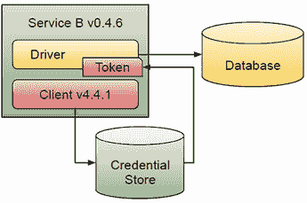

图 7.8 凭据存储依赖

在第二章和第五章中，我们使用 Kubernetes Secrets 将会议服务连接到不同的组件。通过使用 Kubernetes Secrets，我们消除了应用程序开发者担心从哪里获取这些凭据的需求。

否则，如果你的服务连接到其他服务或组件，这些服务或组件可能以这种方式需要依赖，那么服务将需要升级以适应任何组件的任何变化。这种服务代码和依赖之间的耦合创造了在应用程序开发团队、平台团队以及负责保持这些组件运行的操作团队之间进行复杂协调的需求。

我们能否消除一些这些依赖？能否将这些担忧推给平台团队，从而减少开发者更新它们的麻烦？如果我们通过一个干净的接口解耦这些服务，那么基础设施和应用可以独立更新。

在进入下一个主题之前，我想简要谈谈为什么在这一级别拥有服务身份也可以帮助减少与应用程序基础设施组件交互时的安全问题。图 7.9 展示了如何应用类似的服务身份规则来验证谁可以与基础设施组件交互。一旦服务被攻破，系统将再次限制影响范围。

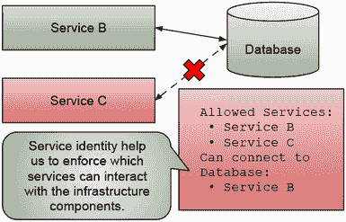

图 7.9 基于服务身份执行规则

但异步交互怎么办？在深入解决方案空间之前，让我们看看这些挑战如何与异步消息传递相关联。

### 7.1.4 异步消息传递挑战

在使用异步消息传递时，你希望解耦生产者和消费者。当使用 HTTP 或 GRPC 时，服务 A 需要了解服务 B，并且两个服务都需要运行以交换信息。当使用异步消息传递时，服务 A 对服务 C 一无所知。你可以更进一步，服务 C 可能在服务 A 将消息放入消息代理时甚至没有运行。图 7.10 展示了服务 A 将消息放入消息代理；在稍后的某个时间点，服务 C 可以连接到消息代理并从中获取消息。

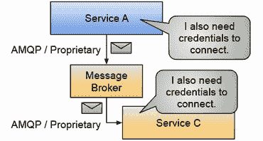

图 7.10 异步消息传递交互

与 HTTP/GRPC 服务之间的交互类似，当使用消息代理时，我们需要知道消息代理的位置，以便发送消息或订阅以接收消息。消息代理还提供隔离性，使应用程序能够使用主题的概念将消息分组在一起。服务可以连接到同一个消息代理实例，但可以从不同的主题发送和消费消息。

当使用消息代理时，我们面临与数据库描述的相同问题。我们需要根据我们决定使用的消息代理、其版本以及我们选择的编程语言，向我们的应用程序添加依赖项。消息代理将使用不同的协议来接收和发送信息。在这个领域越来越被采用的标准是 CNCF 的 CloudEvent 规范([`cloudevents.io/`](https://cloudevents.io/))。虽然 CloudEvents 是一个巨大的进步，但它并不能免除你的应用程序开发者添加依赖项以连接和与你的消息代理交互。

图 7.11 展示了服务 A，它包括用于连接到 Kafka 并发送消息的 Kafka 客户端库。除了连接到 Kafka 实例的 URL、端口和凭证外，Kafka 客户端还会接收有关客户端在连接到代理时的行为配置，类似于数据库。服务 C 使用相同的客户端，但使用不同的版本，以连接到相同的代理。

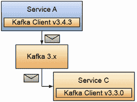

图 7.11 依赖项和 API 挑战

消息代理面临与数据库和持久化存储相同的问题。但不幸的是，在使用消息代理时，开发者需要学习特定的 API，这些 API 可能一开始并不容易。使用不同的编程语言发送和消费消息，对于没有具体消息代理经验的团队来说，会带来更多的挑战和认知负荷。

与数据库类似，如果你选择了 Kafka，例如，这意味着 Kafka 符合你的应用程序需求。你可能会想使用其他消息代理不提供的 Kafka 高级功能。然而，让我在这里重申：我们对 95%的情况感兴趣，在这些情况下，应用程序服务想要交换消息以外部化状态并让其他感兴趣的各方知道。对于这些情况，我们希望从我们的应用程序团队中移除认知负荷，让他们能够轻松地发送和消费消息，而无需学习所选消息代理的所有具体细节。通过减少开发者学习特定技术所需的认知负荷，你可以让经验较少的开发者加入，并让专家处理细节。与数据库类似，我们可以使用服务身份来控制哪些服务可以连接、读取和从消息代理中写入消息。同样的原则适用。

### 7.1.5 处理边缘情况（剩余的 5%）

总是有不止一个很好的理由将库添加到你的应用程序服务中。有时这些库会给你控制如何连接到供应商特定组件和功能的最终权力。其他时候，我们添加库是因为这是开始的最简单方式，或者因为我们被指示这样做。组织中的某个人决定使用 PostgreSQL，最快的方法是将 PostgreSQL 驱动程序添加到我们的应用程序代码中。我们通常没有意识到我们正在将应用程序耦合到特定的 PostgreSQL 版本。对于边缘情况，或者更具体地说，需要使用某些供应商特定功能的情况，考虑将那个特定功能作为一个单独的单元封装起来，从你可能会从数据库或消息代理中消耗的所有通用功能中分离出来。

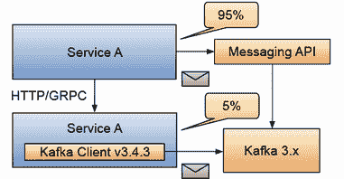

图 7.12 常见与边缘情况封装对比

我选择在图 7.12 中使用异步消息作为示例，但同样的情况也适用于数据库和凭证存储。如果我们能将 95%的服务解耦，使用通用能力来完成工作，并将边缘情况作为单独的单元封装，我们就能减少耦合和新团队成员对这些服务进行修改时的认知负荷。图 7.12 中的服务 A 正在使用平台团队提供的消息 API 异步地消费和发布消息。我们将在下一节更深入地探讨这种方法。但更重要的是，那些需要使用一些特定于 Kafka 的功能的边缘情况，例如，被提取到一个单独的服务中，服务 A 仍然可以通过 HTTP 或 GRPC 与之交互。请注意，消息 API 也使用 Kafka 来移动信息。然而，对于服务 A 来说，这已经不再相关，因为一个简化的 API 作为平台能力被暴露出来。

当我们需要更改这些服务时，95%的情况下，我们不需要团队成员担心 Kafka。消息 API 从我们的应用程序开发团队中移除了这种担忧。对于修改服务 Y，你需要 Kafka 专家，如果 Kafka 被升级，服务 Y 的代码也需要升级，因为它直接依赖于 Kafka 客户端。对于这本书，平台工程团队应该专注于尝试减少团队在常见情况下的认知负荷，同时允许团队为边缘情况和特定场景选择合适的工具，这些场景不适合常见解决方案。

以下部分将探讨一些方法来解决我们一直在讨论的一些挑战。然而，请记住，这些都是通用解决方案，在你的特定环境中可能还需要进一步的步骤。

## 7.2 将应用程序与基础设施分离的标准 API

如果我们将所有这些常用功能（存储和读取数据、消息传递、凭证存储、弹性策略）封装成开发者可以在其应用程序中使用以解决常见挑战的 API，同时，又使平台团队能够以不要求应用程序代码更改的方式连接基础设施，那会怎样呢？在图 7.13 中，我们可以看到相同的服务，但它们不是通过添加与基础设施交互的依赖项，而是使用 HTTP/GRPC 请求。

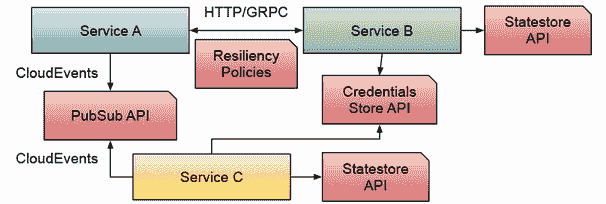

图 7.13 作为 API 的平台能力

假设我们公开了一组 HTTP/GRPC API，我们的应用程序服务可以消费这些 API。在这种情况下，我们可以从应用程序代码中移除供应商特定的依赖，并使用标准的 HTTP 或 GRPC 调用消费这些服务。

应用程序服务和平台能力之间的这种分离使得不同的团队能够处理不同的责任。平台可以独立于应用程序进行演变，并且应用程序代码现在将仅依赖于平台能力接口，而不是底层的组件版本。图 7.14 显示了由应用开发团队管理的应用程序代码（我们的三个服务）与由平台团队管理的平台能力之间的分离。

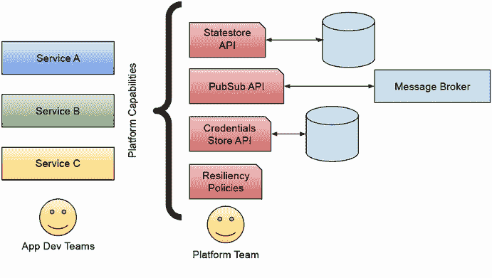

图 7.14 将应用开发团队和平台能力之间的责任解耦

当使用这里建议的方法时，平台团队能够扩展平台功能，为应用开发团队引入新的服务。更重要的是，他们可以这样做而不影响现有的应用程序或强迫它们发布新版本。这使得团队可以根据其功能和希望消费的能力来决定何时发布其服务的新版本。

通过遵循这种方法，平台团队能够为服务提供新的功能，并推广最佳实践。因为这些平台功能对所有服务都是可访问的，它们可以促进标准化，并在幕后实施最佳实践。每个团队可以根据可用的功能决定需要哪些能力来解决他们特定的难题。如果功能版本正确，团队可以决定如何以及何时升级到最新版本，允许团队根据自己的节奏进行迁移，而无需平台在每次有新版本可用时推动每个团队升级。

为了论证，假设平台团队决定向所有服务公开一致的功能标志能力。使用这项能力，所有服务都可以一致地定义和使用功能标志，而无需在它们的代码中添加任何东西，除了功能标志的条件检查。然后，团队可以一致地管理、可视化以及打开和关闭所有标志。平台团队引入并管理的能力，如功能标志，直接影响到开发者的性能，因为他们不需要担心在底层如何处理功能标志（持久性、刷新、一致性等），并且他们确信他们正在做的事情与其他服务保持一致。

图 7.15 展示了平台团队如何添加额外功能，例如，例如，功能标志，直接使团队能够在所有服务中统一使用这项新功能。不需要新的依赖项。

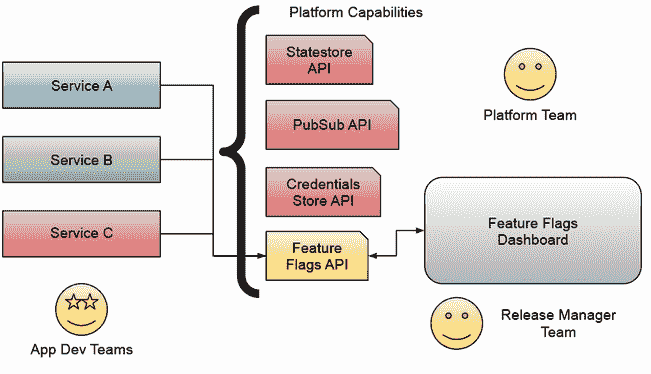

图 7.15 通过提供一致和统一的能力，如功能标志，来启用团队

在继续前进之前，这里有一个警告。让我们看看当你像前一个图所示的那样外部化能力（如 API）时，你将面临的一些挑战。

### 7.2.1 公开平台能力面临的挑战

为团队使用外部化 API 将需要首先稳定（且版本化）的合同，应用程序团队可以信任。当这些 API 发生变化时，所有使用这些 API 的应用程序都会崩溃，并且必须进行更新。平台团队可以采用非破坏性更改策略，确保对团队及其应用程序的向后兼容性。采用此类策略使你的平台更容易被消费，因为平台 API 和合同对团队来说是可靠的。

将依赖项添加到你的应用程序代码中，例如使用容器的一个主要优势是，对于本地开发，你始终可以使用 Docker 或 Docker Compose 启动一个 PostgreSQL 实例，并将你的应用程序本地连接到它。如果你转向平台提供的功能，你必须确保可以为你的团队提供本地开发体验，除非你的组织足够成熟，始终可以针对远程服务进行工作。

另一个重大区别是，你的服务和平台提供的 API 之间的连接将引入延迟并默认需要安全性。在此之前，调用 PostgreSQL 驱动 API 是在与你的应用程序相同的进程中进行的本地调用。HTTPS 或安全协议建立了与数据库本身的连接，但设置应用程序和数据库之间的安全通道是运维团队的责任。

在将这种方法应用于实际项目时，识别我们能够找到的所有边缘情况也是至关重要的。如果您想构建这些平台功能并推动您的团队使用它们，您需要确保始终为边缘情况留有通道，这样团队（甚至平台团队）就不会被迫使常见情况更加复杂，以适应仅会使用 1%时间的晦涩功能。图 7.16 显示了服务 A、B 和 C 通过平台能力 API 使用平台提供的功能。另一方面，服务 Y 对如何连接数据库有非常具体的要求，维护该服务的团队已决定绕过平台能力 API，直接使用数据库客户端连接到数据库。

将边缘情况单独处理，允许服务 A、B 和 C 独立于平台组件（数据库、消息代理、凭证存储）发展，而服务 Y 现在严重依赖于连接到的数据库，并需要客户端的特定版本。虽然这听起来很糟糕，但在实践中，这是可以接受的，应该被视为平台功能。那些无法使用公开 API 解决其业务问题的团队将讨厌这个平台，并默默地寻找解决方案。好的平台（和平台团队）将推广覆盖广泛用例的 API，解决并促进应用开发者常见功能的实现。如果这些 API 对所有团队来说都不够用，那么记录和深入理解边缘情况将导致新的 API 和平台功能，平台团队可以在未来的版本中实现。

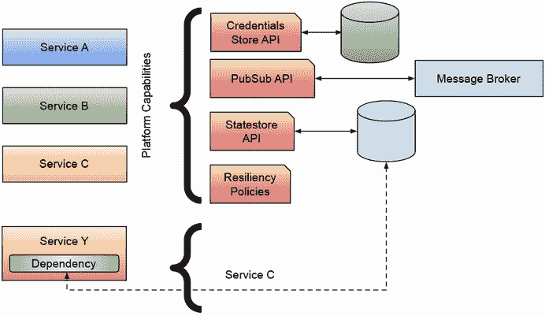

图 7.16 处理边缘情况；不要忽略它们

以下部分将探讨几个 CNCF 倡议，这些倡议将这些想法向前推进，并帮助我们实现了大多数应用程序所需的平台功能。

## 7.3 提供应用级平台功能

在本节中，我们将探讨两个项目，这些项目可以帮助开发团队在标准化这些通用 API 方面节省时间，这些 API 是我们大多数应用程序所需的。我们将首先了解 Dapr 项目([`dapr.io/`](https://dapr.io/))，它是什么，如何工作，以及它能为我们的开发和平台团队带来什么。然后我们将探讨 OpenFeature([`openfeature.dev/`](https://openfeature.dev/))，这是一个 CNCF 倡议，为我们的应用程序提供适当的抽象，以便定义和使用功能标志，而无需绑定到特定的功能标志提供者。

一旦我们对这两个项目的工作原理以及它们如何通过提供应用级平台能力来相互补充有了基本的了解，我们将探讨这些项目如何应用于我们的会议应用程序，需要做出哪些改变，采用这种方法的优势，以及一些展示边缘情况的示例。让我们从 Dapr，我们的分布式应用程序运行时开始。

### 7.3.1 Dapr 在行动

Dapr 提供了一套一致的 API 来解决常见的和反复出现的分布式应用程序挑战。Dapr 项目在过去四年中实施了一套 API（称为构建块 API），以抽象出分布式应用程序在 95% 的时间里需要面对的常见挑战和最佳实践。由微软于 2019 年创建并于 2021 年捐赠给 CNCF，Dapr 项目拥有一个庞大的社区，他们通过扩展和改进项目 API 为项目做出贡献，使其成为 2023 年 CNCF 中增长最快的第 10 个项目。

Dapr 定义了一系列构建块，它们提供具体的 API 来解决分布式应用程序的挑战，以及平台团队可以配置的可互换实现。如果你访问 [`dapr.io`](https://dapr.io) 网站，你会看到构建块 API 的列表，包括服务调用、状态管理、发布/订阅、密钥存储、输入/输出绑定、演员、配置管理，以及最近的工作流。图 7.17 展示了 Dapr 官方网站描述的当前 Dapr 构建块 API，这些 API 可以供团队用来构建他们的分布式应用程序。更多信息请查看 [`docs.dapr.io/concepts/overview/`](https://docs.dapr.io/concepts/overview/) 上的 Dapr 概述页面。

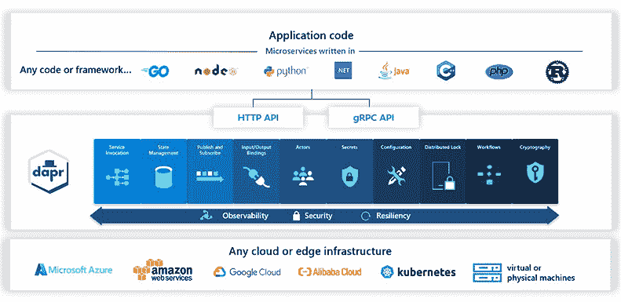

图 7.17 用于构建分布式应用程序的 Dapr 组件

虽然 Dapr 执行的任务远不止暴露 API，但在本章中，我想要专注于项目提供的 API 以及项目用来使应用程序/服务能够消费这些 API 的机制。

因为这是一本关于 Kubernetes 的书，所以我们将从 Kubernetes 的角度来探讨 Dapr，但该项目也可以在 Kubernetes 集群之外使用，这使得 Dapr 成为一个通用的工具，无论你在哪里运行它们，都可以用来构建分布式应用程序。作为旁注，Dapr 目前是 Azure 容器应用服务的一部分（[`azure.microsoft.com/en-us/products/container-apps`](https://azure.microsoft.com/en-us/products/container-apps)），在那里它与另一个 CNCF 项目 KEDA ([`keda.sh/`](https://keda.sh/)) 配置在一起，用于自动扩展你的分布式应用程序。

### 7.3.2 Dapr 在 Kubernetes 中

Dapr 作为 Kubernetes 扩展或附加组件运行。您必须在您的 Kubernetes 集群上安装一组 Dapr 控制器（Dapr 控制平面）。图 7.15 显示了在安装了 Dapr 的 Kubernetes 集群中部署的服务 A。服务 A 需要添加两个注解：`dapr.io/enabled: "true"` 以让 Dapr 控制平面了解应用程序，以及 `dapr.io/appid: "service-a"` 以使用 Dapr 服务身份功能。

一旦在您的集群中安装了 Dapr，您在集群中部署的应用程序可以通过向您的部署添加一组注解来开始使用 Dapr API。这使 Dapr 控制平面服务能够理解您的应用程序想要使用 Dapr API，如图 7.18 所示。

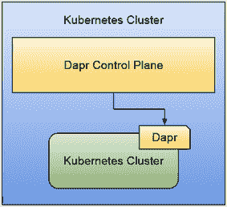

图 7.18 带有 Dapr 注解的应用程序的 Dapr 控制平面监控器

默认情况下，Dapr 将所有 Dapr API 作为侧边车（`daprd` 是将运行在您的应用程序/服务容器旁边的容器）提供给您的应用程序/服务。使用侧边车模式，我们使我们的应用程序能够与位于应用程序容器附近的本地 API（localhost）交互，从而避免网络往返。图 7.19 显示了 Dapr 控制平面如何将 `daprd` 侧边车注入带有 Dapr 注解的应用程序。这使得应用程序能够访问配置的 Dapr 组件。

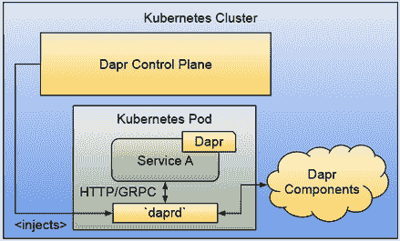

图 7.19 Dapr 侧边车（daprd）使您的应用程序能够本地访问 Dapr 组件。

一旦 Dapr 侧边车在您的应用程序/服务容器旁边运行，它就可以通过向 `localhost` 发送请求（使用 HTTP 或 GRPC）来使用 Dapr API，因为 `daprd` 侧边车与应用程序位于同一个 pod 中，共享相同的网络空间。

现在，为了让 Dapr API 有所作为，平台团队需要配置这些 API 的实现（或称为 Dapr 组件的后备机制）以使其工作。例如，如果您想从您的应用程序/服务中使用 Statestore Dapr API ([`docs.dapr.io/operations/components/setup-state-store/`](https://docs.dapr.io/operations/components/setup-state-store/))，您必须定义并配置一个 Statestore 组件。

当在 Kubernetes 上使用 Dapr 时，您可以使用 Kubernetes 资源配置 Dapr 组件规范。例如，您可以配置一个用于 Redis 的 Statestore Dapr 组件。请参阅列表 7.1 以获取 Dapr 组件资源定义的示例。

列表 7.1 Dapr Statestore 组件定义

```
apiVersion: dapr.io/v1alpha1
kind: Component
metadata:
  name: statestore
spec:
  type: state.redis           ①
  version: v1
  metadata:
  - name: keyPrefix
    value: name
  - name: redisHost           ②
    value: redis-master:6379
  - name: redisPassword       ③
    secretKeyRef:
      name: redis
      key: redis-password
auth:
  secretStore: kubernetes
```

① Statestore 组件 API 支持不同的实现，您可以在 [`docs.dapr.io/reference/components-reference/supported-state-stores/`](https://docs.dapr.io/reference/components-reference/supported-state-stores/) 找到它们。在此示例中，我们正在设置 state.redis 实现。

② 通过设置 redisHost，平台团队可以定义 Redis 实例的位置。此实例无需位于 Kubernetes 集群内部；它可以是任何可访问的 Redis 实例。

③ redisPassword 属性（由 state.redis 实现所需）可以使用，如本例所示，通过 Kubernetes Secret 引用来获取密码。

如果组件资源在 Kubernetes 集群中可用，`daprd`边车可以读取其配置并连接到本例中的 Redis 实例。从应用的角度来看，无需知道是否使用了 Redis 或 Statestore 组件的任何其他实现。图 7.20 显示了 Dapr 组件是如何连接的，以便服务 A 可以使用 Statestore 组件 API。在本例中，通过调用本地 API，服务 A 将能够从 Redis 实例存储和读取数据。

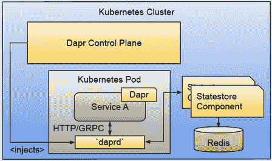

图 7.20 Dapr 边车使用组件配置来连接到组件的基础设施。

Dapr 使得使用本地/自托管 Redis 实例构建应用变得容易，但随后可以将其迁移到云中，在那里可以使用托管的 Redis 服务。无需更改代码或依赖项，只需不同的 Dapr 组件配置。

您想在不同的应用之间发出和消费消息吗？您只需配置 Dapr PubSub 组件([`docs.dapr.io/operations/components/setup-pubsub/`](https://docs.dapr.io/operations/components/setup-pubsub/))及其实现。现在，您的服务可以使用本地 API 发出异步消息。您想使所有服务交互（包括基础设施）调用都具有弹性吗？您可以使用 Dapr 弹性策略([`docs.dapr.io/operations/resiliency/policies/`](https://docs.dapr.io/operations/resiliency/policies/))来避免在应用代码中编写自定义逻辑。

图 7.21 显示了服务 A 和服务 B 如何使用服务调用 API 相互发送请求，而不是直接调用其他服务。使用这些 API（通过`daprd`边车发送流量）使平台团队能够在平台级别配置弹性策略，统一配置，无需添加任何依赖或更改应用代码。

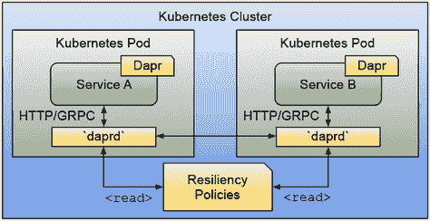

图 7.21 Dapr 启用服务可以使用服务间通信和弹性策略。

好的，所以 Dapr 控制平面将注入 Dapr 边车(`daprd`)到感兴趣使用 Dapr 组件的应用程序中。但从应用的角度来看，这看起来是怎样的呢？

### 7.3.3 Dapr 与您的应用

如果我们回到上一节中介绍的示例，其中服务 A 想要使用 Statestore 组件从持久化存储（如 Redis）中存储/读取一些数据，应用程序代码很简单。无论你使用哪种编程语言，只要你知道如何创建 HTTP 或 GRPC 请求，你就拥有了与 Dapr 一起工作的所有所需。

例如，要使用 Statestore API 存储数据，你的应用程序代码需要向以下端点发送 HTTP/GRPC 请求：

```
http://localhost:<DAPR_HTTP_PORT>/v1.0/state/<STATESTORE_NAME>
```

使用 `curl`，请求看起来是这样的，其中 `-d` 显示我们想要持久化的数据，`3500` 是默认的 `DAPR_HTTP_PORT`，我们的 Statestore 组件名为 `statestore`：

```
> curl -X POST -H "Content-Type: application/json" 
➥-d '[{ "key": "name", "value": "Bruce Wayne"}]'
➥http://localhost:3500/v1.0/state/statestore
```

要读取我们已持久化的数据，我们只需发送一个 GET 请求，而不是发送 POST 请求。使用 `curl`，它看起来是这样的：

```
curl http://localhost:3500/v1.0/state/statestore/name 
```

通常，你不会在应用程序内部使用 `curl`。你会使用你的编程语言工具来编写这些请求。所以，如果你使用 Python、Go、Java、.NET 或 JavaScript，你可以在网上找到使用流行库或内置机制编写这些请求的教程。

另一个选项是使用适用于不同编程语言的 Dapr SDK（软件开发工具包）。将 Dapr SDK 添加到你的应用程序作为依赖项，可以使开发者的生活更轻松，他们不需要手动构建 HTTP 或 GRPC 请求。重要的是要注意，虽然你现在正在向应用程序添加一个新的依赖项，但这个依赖项是可选的，并且仅用作辅助工具以加快速度，因为这个依赖项与 Dapr API 交互的任何基础设施组件都没有关联。

检查 Dapr 网站，了解如果你使用 Dapr SDK，你的代码将如何看起来。例如，对于使用 SDKs 的多编程语言示例，了解如何使用 Statestore 组件，你可以访问 [`docs.dapr.io/getting-started/quickstarts/statemanagement-quickstart/`](https://docs.dapr.io/getting-started/quickstarts/statemanagement-quickstart/)。

当我决定专注于 Dapr 进行 API 抽象时，Dapr 提供了更多功能。通过允许平台团队交换 Dapr 组件的实现，应用程序可以在不更改任何应用程序代码的情况下跨云提供商迁移。默认情况下，整个系统是可观察的 ([`docs.dapr.io/operations/observability/`](https://docs.dapr.io/operations/observability/))，安全的 ([`docs.dapr.io/operations/security/`](https://docs.dapr.io/operations/security/))，并且具有弹性 ([`docs.dapr.io/operations/resiliency/`](https://docs.dapr.io/operations/resiliency/))，因为 Dapr 侧车将强制执行服务身份和平台团队指定的规则，同时从所有启用了 Dapr 的应用程序和组件中提取指标。我建议平台团队熟悉 Dapr 项目，因为这个项目是为了解决团队在处理分布式应用程序时将面临的一些常见挑战而构建的。查看本章 7.3.5 节，了解我们如何使我们的会议应用程序启用 Dapr。现在让我们谈谈功能标志。

### 7.3.4 功能标志的实际应用

功能标志使团队能够发布包含新功能的软件，同时不立即使这些功能可用。新功能可以隐藏在可以稍后启用的功能标志后面。换句话说，功能标志允许团队持续部署其服务或应用程序的新版本，一旦这些应用程序运行，可以根据公司的需求开启或关闭功能。

与直接为开发者提供开箱即用行为的 API 相比，功能标志可以启用其他团队，这些团队在何时启用功能方面做出业务相关决策，并将这些决策传达给客户。

虽然大多数公司可能会构建机制来实现功能标志，但将其封装到专用服务或库中是一个公认的通用模式。在 Kubernetes 世界中，你可以考虑使用 `ConfigMaps` 作为参数化容器的最简单方法。一旦你的容器能够读取环境变量来开启和关闭功能，你就可以开始了。我们在第二章中使用了这种方法，通过 `FEATURE_DEBUG_ENABLED=true` 环境变量。

不幸的是，这种方法过于简单，不适用于现实世界的场景。首先，一个主要原因是如果 ConfigMap 发生变化，你的容器将需要重新启动以重新读取其内容。其次，你可能需要为不同的服务设置许多标志，因此你可能需要多个 ConfigMaps 来管理你的功能标志。第三，如果你使用环境变量，你需要制定一个约定来定义每个标志的状态、默认值和类型，因为你不能仅仅通过定义变量作为普通字符串来解决问题。

由于这是一个众所周知的问题，一些公司已经推出了工具和管理服务，如 LaunchDarkly ([`launchdarkly.com/`](https://launchdarkly.com/)) 和 Split ([`www.split.io/product/feature-flags/`](https://www.split.io/product/feature-flags/)) 等，这些服务使团队能够在提供简化访问以查看和修改功能标志的远程服务中托管其功能标志，而无需技术知识。对于这些服务中的每一个，要获取和评估复杂的功能标志，您需要下载并将依赖项添加到您的应用程序中。由于每个功能标志提供者将提供不同的功能，因此在不同提供者之间切换将需要许多更改。

OpenFeature ([`openfeature.dev/`](https://openfeature.dev/)) 是一个 CNCF 倡议，旨在统一在云原生应用程序中消费和评估功能标志的方式。与 Dapr 抽象化与 Statestores（存储和读取状态）或 PubSub（异步消息代理）组件交互的方式相同，OpenFeature 提供了一个一致的 API，无论我们使用哪个功能标志提供者，都可以消费和评估功能标志。

在本节中，我们将通过一个简单示例查看使用 ConfigMap 来保存一组功能标志定义的情况。我们还将使用 OpenFeature 提供的`flagd`实现，但这种方法的美妙之处在于，您可以在不更改应用程序中任何一行代码的情况下，轻松地更换存储功能标志的提供者。

图 7.22 展示了包含配置为连接到 OpenFeature 提供者的 OpenFeature SDK 的简单应用实例——在这种情况下，`flagd`负责托管我们的功能标志定义。

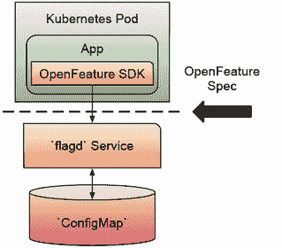

图 7.22 从我们的应用程序服务消费和评估功能标志

在这个简单的示例中，我们的应用程序是用 Go 编写的，并使用 OpenFeature Go SDK 从`flagd`服务获取功能标志。本例中的`flagd`服务配置为监视包含一些复杂功能标志定义的 Kubernetes `ConfigMap`。

虽然这是一个简单的示例，但它使我们能够看到像`flagd`这样的服务如何使我们能够抽象出作为我们平台一部分提供功能标志能力所需的所有存储和实现机制的复杂性。

与 Dapr 相比，OpenFeature SDK 是必需的，因为我们不仅获取功能标志定义，还执行可能涉及复杂功能标志的评估。

您可以将应用程序中的每个服务连接到 OpenFeature 提供者以执行功能标志评估。与仅使用纯 ConfigMap 相比，一个重要的区别是，通过使用 OpenFeature，如果容器中的值发生变化，则不需要重新启动容器来获取值；现在这是 OpenFeature 标志提供者的责任。

在下一节中，我们将探讨如何将 Dapr 和 OpenFeature 应用于会议应用程序的原型。

### 7.3.5 更新我们的会议应用程序以使用应用程序级平台功能

从概念上和平台角度来看，在不泄露实现不同行为所使用的工具的情况下，使用所有这些功能将非常棒。这将使平台团队能够更改/交换实现，并减少使用这些功能的团队的认知负荷。但正如我们与 Kubernetes 讨论的那样，了解这些工具的工作原理、它们的行为以及它们的功能是如何设计的，会影响我们构建应用程序和服务的方式。在本章的最后部分，我想展示像 Dapr 和 OpenFeature 这样的工具如何影响你的应用程序架构，同时展示这些工具如何提供构建块来创建更高级的抽象，以减少消费者的认知负荷。

对于我们的会议应用程序，我们可以使用以下 Dapr 组件，因此让我们关注这些：

+   *Dapr 状态存储组件*：使用状态存储组件 API 可以使我们从会议应用程序中包含的议程服务中移除 Redis 依赖。如果出于某种原因，我们想用另一个持久存储替换 Redis，我们将能够做到这一点，而无需更改任何应用程序代码。

+   *Dapr PubSub 组件*：对于发出事件，我们可以用 PubSub 组件 API 替换所有服务中的 Kafka 客户端，使我们能够测试不同的实现，例如 RabbitMQ 或云提供商服务，以在应用程序之间交换异步消息。

+   *Dapr 服务间调用和 Dapr 弹性策略*：如果我们使用服务间调用 API，我们可以在不向我们的服务代码添加库或自定义代码的情况下配置服务之间的弹性策略。默认情况下，如果没有提供自定义配置，所有服务都有弹性策略定义。

虽然我们可以选择使用状态存储组件 API 也从我们的提案征集服务中移除 PostgreSQL 依赖，但我选择不这样做，以支持团队为该服务所需的 SQL 和 PostgreSQL 功能。在采用 Dapr 时，你必须避免采取“全有或全无”的方法。

让我们看看如果我们决定使用 Dapr，应用程序将如何改变。图 7.23 显示了使用 Dapr 组件的应用程序服务，因为所有服务都被注释为使用 Dapr，并且 `daprd` 伴随容器已经注入到所有服务中。一旦配置了 PubSub 和状态存储组件，它们就可以被提案征集服务、议程服务和通知服务访问。最后，Dapr 订阅将事件推送到前端应用程序。

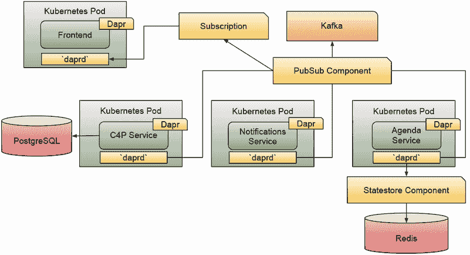

图 7.23 使用 Dapr 组件构建我们的原型/会议应用程序

可以为“提案征集”服务配置和定义弹性策略，以与议程和通知服务交互，如图 7.24 所示。

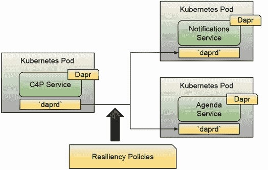

图 7.24 显示了服务到服务的交互可以通过 `daprd` 侧边车来处理，允许平台团队能够定义不同的弹性策略。

如果我们不进行配置，Dapr 将应用默认的弹性策略。这些弹性策略也适用于我们的示例，例如，联系 `statestore` 和 `pubsub` 组件。这意味着不仅我们的服务到服务的调用是弹性的，而且每次我们的应用程序代码想要与数据库、缓存和消息代理等基础设施组件交互时，弹性策略都会启动。

应用程序代码需要稍作修改，因为当服务想要相互通信时，它们需要使用 Dapr API 来使用弹性策略。

最后，因为我们希望所有服务都能使用功能标志，所以每个服务现在都包含了 OpenFeature SDK，这使得平台团队能够定义所有服务将使用哪种功能标志实现。

在图 7.25 中，每个服务都包含了 OpenFeature SDK 库，并配置为指向 `flagd` 服务，这使得平台团队能够配置用于存储、检索和管理所有服务使用的所有功能标志的机制。


图 7.25 显示了使用 `flagd` 功能标志提供者的服务。

使用 OpenFeature SDK，我们可以更改功能标志提供者，而无需更改我们的应用程序代码。OpenFeature SDK 现在标准化了我们服务代码的所有功能标志消费和评估。

虽然 Dapr 中使用 SDK 是可选的（因为你可以手动制作 HTTP 或 GRPC 请求），但在 OpenFeature 中，情况要复杂一些。因为 SDKs 提供了一些评估逻辑，以了解每个标志的类型以及它是开启还是关闭。

逐步教程([`github.com/salaboy/platforms-on-k8s/tree/v2.0.0/chapter-7`](https://github.com/salaboy/platforms-on-k8s/tree/v2.0.0/chapter-7))部署了使用 Dapr 和 OpenFeature 标志的会议应用程序的 v2.0.0 版本，以便应用程序团队能够不断演进应用程序服务。应用程序服务的 v2.0.0 版本不包括 Kafka 或 Redis 客户端以与基础设施交互。这些服务可以在不同的环境中（包括云提供商）部署，并针对这些标准 API 的不同实现进行连接。图 7.26 显示了我们使用 Dapr 组件 API 为应用程序的 v2.0.0 版本管理的依赖关系。

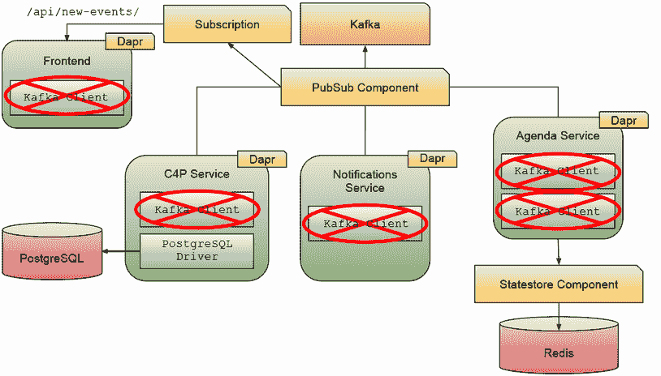

图 7.26 显示了从服务的依赖中移除了 Kafka 和 Redis 客户端。

从平台的角度来看，Dapr Statestore 组件、Dapr PubSub 组件和 Dapr 订阅定义了三个 Kubernetes 资源。

我们已经在 7.3.1 节中看到如何定义 Dapr Statestore 组件。在列表 7.2 中，我们可以看到如何定义 PubSub 组件，在这种情况下选择类型为 `pubsub.kafka`，它使用通过 Helm 安装的 Kafka 实例。

列表 7.2 Dapr PubSub 组件定义

```
apiVersion: dapr.io/v1alpha1
kind: Component
metadata:
  name: conference-pubsub
spec:
  type: pubsub.kafka
  version: v1
  metadata:
  - name: brokers                                ①
    value:  kafka.default.svc.cluster.local:9092
  - name: authType                               ②
    value: "none" 
```

① 我们需要指定 PubSub 组件可连接到的 Kafka 代理。

② 默认情况下，Bitnami 提供的 Kafka Helm 图表不需要身份验证。

您可以在官方 Dapr 网站上找到所有支持的 PubSub 实现（[`docs.dapr.io/reference/components-reference/supported-pubsub/`](https://docs.dapr.io/reference/components-reference/supported-pubsub/)）。最后，Dapr 订阅资源允许我们声明性地配置对 PubSub 组件的订阅并将事件路由到应用程序的端点，如列表 7.3 所示。

列表 7.3 Dapr 订阅定义

```
apiVersion: dapr.io/v1alpha1
kind: Subscription
metadata:
  name: frontend-subscription
spec:
  pubsubname: conference-pubsub    ①
  topic: events-topic              ②
  route: /api/new-events/          ③
scopes: 
- frontend                         ④
```

① 我们想要注册订阅的 PubSub 组件

② 订阅将监听的 PubSub 组件内的主题

③ Dapr 将事件转发到的路由

④ 范围允许我们定义哪些 Dapr 应用程序被允许接收此订阅的事件。在这种情况下，唯一的消费者是前端应用程序。范围严重依赖于服务身份来阻止消息转发到未经授权的服务。

从应用程序开发人员的角度来看，v2.0.0 版本中的更改使用 Dapr Go SDK 调用 Dapr 组件 API。例如，要从 Statestore 组件读取状态，Agenda 服务执行列表 7.4 中所示的调用。

列表 7.4 使用 Dapr SDK 从 Statestore 获取状态

```
s.APIClient.GetState(ctx, 
STATESTORE_NAME,          ①
KEY,                      ②
nil) 
```

① 要存储状态，您只需提供在 Dapr 中配置的 Statestore 组件名称。

② 您还需要提供您想要从 Statestore 中检索的密钥。

此处的 APIClient 实例只是一个提供与 DAPR HTTP 和 GRPC API 交互的辅助器的 Dapr 客户端。同样，要存储状态，您可以使用 `SaveState` 方法；请参阅列表 7.5。

列表 7.5 使用 Dapr SDK 从 Statestore 保存状态

```
s.APIClient.SaveState(ctx, 
STATESTORE_NAME,           ①
KEY,                       ②
jsonData,                  ③
nil)
```

① 与之前相同，我们需要提供 Statestore 组件名称。请注意，应用程序可以访问多个 Statestore 组件，用于不同的目的。

② KEY 将用于存储有效负载，然后可以通过调用 GetState 方法检索。

③ 状态作为 JSON 有效负载发送到 API。

最后，采用完全相同的方法，应用程序可以通过使用列表 7.6 中所示的 API 将事件发布到 PubSub 组件。

列表 7.6 使用 Dapr SDK 发布事件

```
s.APIClient.PublishEvent(ctx, 
PUBSUB_NAME,                  ①
PUBSUB_TOPIC,                 ②
eventJson)                    ③
```

① 要发布事件，我们需要指定我们想要使用的 Dapr PubSub 组件以及主题。

② 该主题使我们能够将 PubSub 组件划分为不同的逻辑桶，应用程序可以使用这些桶来交换事件和消息。

③ 事件有效负载以 JSON 格式表示。

在 OpenFeature 方面，功能标志配置定义在一个 ConfigMap 中 ([`github.com/salaboy/platforms-on-k8s/blob/v2.0.0/conference-application/helm/conference-app/templates/openfeature.yaml#L49`](https://github.com/salaboy/platforms-on-k8s/blob/v2.0.0/conference-application/helm/conference-app/templates/openfeature.yaml#L49))。教程展示了添加到会议应用程序中的三个不同功能标志，以控制前端和后端功能。通过修改包含标志定义的 ConfigMap，我们可以更改应用程序行为，而无需重新启动任何容器。列表 7.7 中的 `eventsEnabled` 功能标志显示了一个包含每个服务属性的 Object 类型功能标志。通过定义不同的变体，我们可以将配置文件编码化，从而允许我们定义复杂的场景。

列表 7.7 功能标志定义，包括变体

```
      "eventsEnabled": {
      "state": "ENABLED",
      "variants": {
        "all": {
          "agenda-service": true,
          "notifications-service": true,
          "c4p-service": true
        },
        "decisions-only": {
           "agenda-service": false,
           "notifications-service": false,
           "c4p-service": true
         },
         "none": {
           "agenda-service": false,
            "notifications-service": false,
            "c4p-service": false
          }
        },
        "defaultVariant": "all"
```

列表 7.7 展示了一个对象功能标志，它定义了三个变体：`all`、`decisions-only` 和 `none`。通过更改 `defaultVariant` 属性，我们可以更改所选的配置文件，在这种情况下是启用和禁用哪些服务将发出事件。在议程服务源代码内部，我们使用 OpenFeature GO SDK 来获取和评估标志，如下所示。

列表 7.8 使用 OpenFeature SDK 进行功能标志评估

```
s.FeatureClient.ObjectValue(ctx, "eventsEnabled", 
EventsEnabled{},
openfeature.EvaluationContext{})
```

列表 7.8 展示了使用 OpenFeature 客户端获取 `eventsEnabled` 功能标志。`EventsEnabled{}` 结构是当获取功能标志出现问题时应该返回的默认值。最后，`EvaluationContext` 结构允许你为 OpenFeature 添加额外的参数，以便在更复杂的场景中评估标志。

你可以通过比较应用程序存储库中的 `main` 分支和 `v2.0.0` 分支来找到 `v1.0.0` 和 `v2.0.0` 之间的差异。[`github.com/salaboy/platforms-on-k8s/compare/v2.0.0`](https://github.com/salaboy/platforms-on-k8s/compare/v2.0.0)。同时，平台团队可以自由配置和连接应用程序基础设施，并定义所有支持机制和功能标志、存储、消息传递、配置、管理凭证、弹性和其他他们不想直接向开发者暴露的常见挑战的实现。

## 7.4 返回到平台工程

在本章中，我们看到了如何以 API 的形式为具有平台级能力的团队启用功能。我们旨在通过为团队提供解决日常挑战的通用和标准 API 来加速他们编写和交付复杂软件的过程，这些挑战包括创建分布式应用程序和机制，如功能标志。

通过将应用基础设施与应用代码分离，我们不仅从我们的服务中移除了依赖，还使平台团队能够决定如何配置应用基础设施组件以及服务如何连接到它们。如果不同的环境需要不同的实现，平台团队能够在 API 背后工作，为不同的场景提供不同的配置。

图 7.27 展示了我们如何减少与应用基础设施相关的摩擦和依赖。这允许我们的应用服务在各种平台团队能够控制的环境中工作。使用像 Dapr 这样的项目，你还可以获得跨云提供商的应用可移植性，一致的 API，这些 API 可以从任何编程语言中使用，并使团队能够将他们的应用从本地开发环境带到生产环境，允许平台团队能够连接起应用运行所需的基础设施。通过功能标志，我们使开发者能够通过隐藏在可开关的功能标志背后的功能来持续发布软件，从而让更接近客户的团队（如产品团队）决定何时应该公开这些功能。

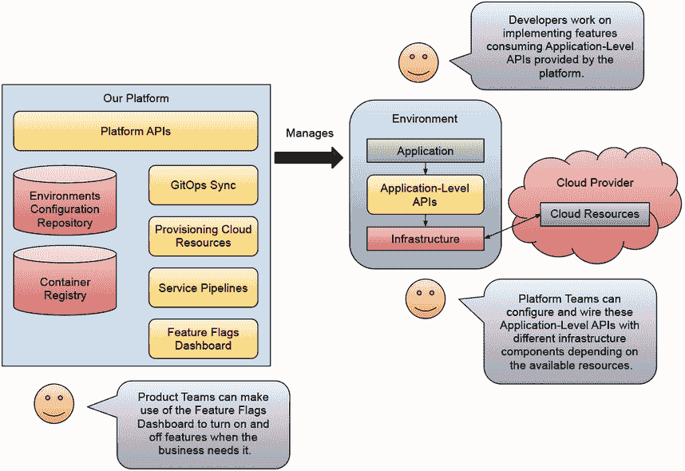

图 7.27 在环境中提供一致的能力，使通往生产的路径更加顺畅。

通过在环境中提供一致的能力，我们使通往生产的路径更加容易，因为我们可以在将新版本发布到生产后控制向客户公开哪些功能。开发者可以继续构建功能，依赖于平台提供的应用级 API，而无需知道可用的基础设施在哪里，或者生产环境中使用了哪些数据库和消息代理的版本。

为了节省空间，关于可观察性、指标和日志，以及服务网格等主题在这些部分中没有涉及，因为这些功能目前更加成熟，更侧重于运营。我决定专注于建立在运营和基础设施团队之上的功能，以加快开发团队的进度并解决日常挑战。平台团队将提前定义他们将在各个环境中使用的可观察性堆栈，以及这些数据如何可供开发者在解决问题时使用。在讨论中经常提到的服务网格和用于相互 TLS（服务之间的加密）的证书轮换工具，因为这些是开发团队不希望花费时间的话题，并且应该在平台级别提供。图 7.28 展示了我们的平台如何负责定义、检索和聚合每个环境中可用的工具数据。我们的平台应提供一个单一的入口点来了解不同环境中正在发生的事情，并为团队提供足够的信息来解决问题并访问组织交付软件给客户所需的工具。

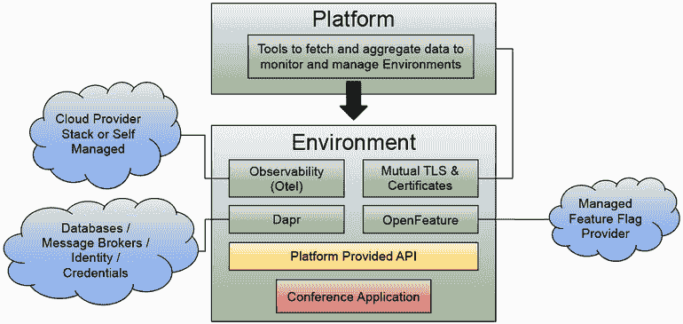

图 7.28 我们构建的平台需要定义、管理和监控每个环境中可用的工具。

下一章将探讨使团队能够在发布软件时进行实验的工具。沿着使用功能标志的相同思路，我们将更深入地探讨如何使用不同的发布策略来在发布过程中更早地发现问题，并使利益相关者能够同时尝试不同的方法。

## 摘要

+   将依赖项移动到应用程序基础设施中，使应用程序代码能够保持对平台级升级的无感知。将应用程序和基础设施的生命周期分开，使团队能够依赖稳定的 API，而不是在日常用例中处理特定供应商的客户端和驱动程序。

+   将边缘情况单独处理，使专家能够根据其应用需求做出更自觉的案例。这也允许经验较少的团队成员处理常见场景，当他们只想从应用程序代码中存储或读取数据或发出事件时，他们不需要了解工具的具体细节，例如供应商特定的数据库功能或低级消息代理配置。

+   Dapr 在构建分布式应用程序时解决常见和共享的担忧。能够编写 HTTP/GRPC 请求的开发者可以与平台团队将连接的基础设施进行交互。

+   功能标志使开发者能够通过隐藏在可以开启和关闭的功能标志后面的新功能来持续发布软件。

+   OpenFeature 标准化了应用程序消费和评估功能标志的方式。依赖 OpenFeature 抽象允许平台团队决定功能标志的存储位置以及如何管理它们。不同的提供商可以为非技术人员提供仪表板，让他们可以查看和操作标志。

+   如果你遵循了逐步教程，你将在云原生应用程序的上下文中获得使用工具如 Dapr 和 OpenFeature 的实践经验，该应用程序由四个服务组成，这些服务与 SQL 和 NoSQL 数据库以及像 Kafka 这样的消息代理进行交互。你还修改了运行中的应用程序上的功能标志，以改变其行为而无需重新启动其任何组件。
