# 8 平台功能 II：使团队能够进行实验

本章节涵盖

+   通过提供发布策略功能来使团队能力得到提升

+   识别使用 Kubernetes 内置机制实现发布策略的挑战

+   使用 Knative Serving 高级流量管理来发布我们的云原生应用程序

+   利用 Argo Rollouts 的开箱即用发布策略

在第七章中，我们探讨了如何通过为开发团队提供应用级 API 来降低开发者解决常见分布式应用程序挑战的认知负荷，同时使平台团队能够连接和配置这些组件，以便应用程序可以访问。我们还评估了使用功能标志，使开发者能够继续发布新功能，并使更接近业务的团队决定何时将这些新功能向客户公开。

在本章中，我们将探讨引入不同的发布策略如何帮助组织在流程中更早地捕捉错误，验证假设，并使团队能够同时实验同一应用程序的不同版本。

我们希望避免团队担心部署您服务的全新版本，因为这会减慢您的发布节奏，并给参与发布过程的每个人带来压力。降低风险并拥有适当的机制来部署新版本，可以极大地提高对系统的信心。它还缩短了从请求更改到在用户面前上线的时间。带有修复和新功能的全新发布与商业价值直接相关，因为软件如果不为我们公司的用户提供服务，就没有价值。

虽然 Kubernetes 内置资源如部署、服务和入口为我们提供了部署和向用户公开服务的基本构建块，但为了实现众所周知的发布策略，必须进行大量手动且容易出错的工作。因此，云原生社区创建了专门的工具，通过提供机制来实现本章中我们将讨论的最常见的发布策略模式，以帮助团队提高生产力。本章节分为三个主要部分：

+   发布策略基础：

    +   金丝雀发布、蓝/绿部署和 A/B 测试

    +   使用 Kubernetes 内置机制的限制和复杂性

+   Knative Serving：自动缩放、高级流量管理和发布策略

    +   Knative Serving 简介

    +   使用 Knative Serving 和 Conference 应用程序的实际发布策略

+   Argo Rollouts：使用 GitOps 自动化的发布策略

    +   介绍 Argo Rollouts

    +   Argo Rollouts 和渐进式交付

本章的第一部分从高层次概述了最常见且记录良好的发布策略，我们将快速探讨为什么使用 Kubernetes 构建块实现这些发布策略可能具有挑战性。第 8.2 节探讨了 Knative Serving，它提供了更高层次的构建块，极大地简化了实现这些发布策略的方法，同时为我们的工作负载提供高级流量管理和动态自动缩放。第 8.3 节介绍了 Argo Rollouts，这是 Argo 家族的另一个项目，专注于为团队提供开箱即用的发布策略和渐进式交付。让我们开始介绍发布策略的基础。

## 8.1 发布策略基础

如果你寻找团队在推广服务到敏感环境时最常采用的发布策略，你会发现有金丝雀发布、蓝绿部署和 A/B 测试。每种发布策略都有不同的目的，并且可以应用于各种场景。在接下来的简短部分中，我们将探讨每种发布策略的预期效果，这些机制实施后的预期好处，以及它们与 Kubernetes 的关系。让我们首先了解一下金丝雀发布。

### 8.1.1 金丝雀发布

在金丝雀发布中，我们希望使团队能够部署服务的新版本，并完全控制有多少实时流量被路由到这个新版本。这允许团队缓慢地将流量路由到新版本以验证在将所有生产流量路由到它之前没有引入任何问题。

图 8.1 显示了用户访问我们的软件，其中 95%的请求被转发到我们已知稳定的版本，只有 5%被转发到服务的新版本。

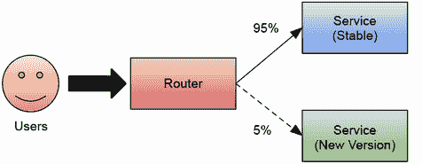

图 8.1 显示了将 5%的流量路由到新版本（金丝雀）的服务新版本发布

“金丝雀发布”这个术语来自煤矿工人，他们使用金丝雀鸟来警告他们当有毒气体达到危险水平时。在这种情况下，我们的金丝雀发布可以帮助我们在新版本引入问题或回归的早期阶段就识别出来，而将 100%的流量回滚到稳定版本并不包括完整的部署。

在 Kubernetes 的上下文中，如图 8.2 所示，你可以通过使用两个 Kubernetes 部署资源（一个用于稳定版本，一个用于新版本）和一个匹配这两个部署的单个 Kubernetes 服务来实现一种金丝雀发布。如果每个部署只有一个副本，则流量将平分，即 50%和 50%。向每个版本添加更多副本将创建不同的流量分割百分比（例如，稳定版本有三个副本，而新版本只有一个副本，将给出 75%到 25%的流量分割比率），因为 Kubernetes 服务使用轮询方式将请求路由到所有匹配服务标签的 Pod。

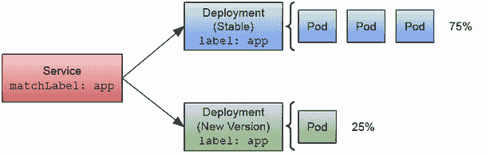

图 8.2 使用两个部署和一个服务在 Kubernetes 中进行金丝雀发布。

工具如 Istio ([`istio.io/`](https://istio.io/)) 或 Linkerd ([`linkerd.io/`](https://linkerd.io/)) 服务网格可以让你更精细地控制流量如何路由到每个服务。我强烈建议你查看马丁·福勒的网站，其中更详细地解释了这种发布策略，网址为 [`martinfowler.com/bliki/CanaryRelease.xhtml`](https://martinfowler.com/bliki/CanaryRelease.xhtml)。

### 8.1.2 蓝绿部署

使用蓝绿部署，我们的目标是让团队能够在两个并行运行的服务或应用程序版本之间切换。这个并行版本可以作为测试的预发布实例，当团队足够自信时，他们可以将流量切换到这个并行实例。这种方法给团队提供了在新版本开始出现问题时，有另一个实例准备好的安全性。这种方法需要足够的资源同时运行两个版本，这可能很昂贵，但它给了你的团队在具有与生产工作负载相同资源的实例上进行实验的自由。

图 8.3 展示了内部团队在测试服务新版本的生产环境配置。每当这个新版本准备就绪时，团队可以决定将生产流量切换到新版本，同时仍然保留稳定的版本以备出错时回滚。

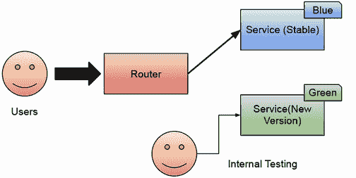

图 8.3 蓝绿部署与生产级设置并行运行，允许团队在他们对新版本有信心时切换流量。

在 Kubernetes 的上下文中，你可以通过使用两个 Kubernetes 部署资源和 Kubernetes 服务来实现蓝绿部署，但在此情况下，服务应仅匹配单个部署的 pod。将服务配置更新为匹配绿色部署的标签将自动将流量切换到新版本。

图 8.4 展示了通过将服务的 `matchLabel` 更改为“绿色”，流量将自动路由到服务的新版本。在此同时，为了测试，内部团队可以使用不同的服务来匹配新版本的部署。

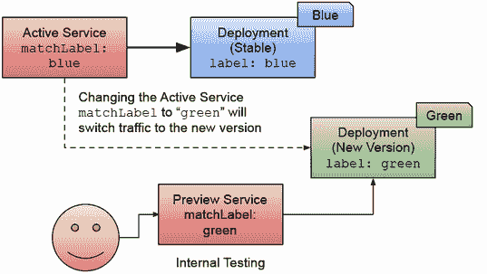

图 8.4 显示蓝绿部署并行运行。服务 matchLabel 用于定义请求的路由位置。

再次强调，我强烈建议你查看马丁·福勒关于蓝绿部署的网站 ([`martinfowler.com/bliki/BlueGreenDeployment.xhtml`](https://martinfowler.com/bliki/BlueGreenDeployment.xhtml))，因为那里有链接和更多可能对你有用的上下文。

### 8.1.3 A/B 测试

A/B 测试与金丝雀发布和蓝绿部署不同，因为它更关注最终用户而不是内部团队。通过 A/B 测试，我们希望使业务相关的其他团队能够尝试不同的方法来解决业务问题。例如，有两个不同的页面布局以查看哪一个对用户更有效，或者有不同的注册流程以验证哪一个花费用户更少的时间并引起更少的挫败感。正如第七章中讨论的功能标志一样，我们希望使其他团队（而不仅仅是开发者）能够进行实验，在这种情况下，通过为不同的用户组提供不同版本的应用程序。然后，这些团队可以验证每个功能的有效性，并决定保留哪一个。

图 8.5 展示了两种不同的服务实现，为用户提供替代的注册流程。通过 A/B 测试，我们可以同时运行这两种实现并收集数据，以便业务团队决定哪种选项效果更好。

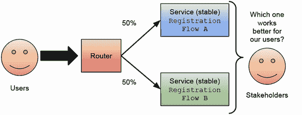

图 8.5 A/B 测试使业务相关的团队能够评估不同的方法并收集数据，以便做出改善业务成果的决策。

由于 A/B 测试不是一种技术发布策略，它可以根据应用程序的需求以不同的方式实现。拥有两个独立的 Kubernetes 服务和部署来运行和访问同一应用程序的两个不同版本是有意义的。图 8.6 展示了使用两个 Kubernetes 服务和两个部署将用户路由到同一功能的不同版本。它还显示需要一个应用程序级别的路由器来定义用户如何路由到每个替代方案。

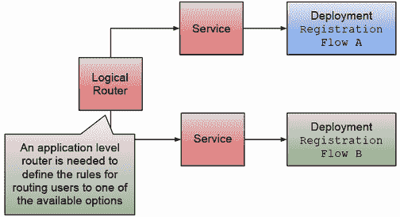

图 8.6 A/B 测试需要一些业务和应用级别的规则来定义如何将用户路由到不同的选项。

A/B 测试可以使用与金丝雀发布类似的机制实现，我们将在以下几节中探讨几个选项。"Continuous Delivery" by Jez Humble and David Farley (Addison-Wesley Professional, 2010)详细介绍了这些发布策略，所以我强烈建议你查看那本书。

### 8.1.4 使用内置 Kubernetes 构建块的局限性和复杂性

金丝雀发布、蓝绿部署和 A/B 测试可以使用内置的 Kubernetes 资源实现。但正如你所见，这需要创建不同的部署、更改标签和计算请求的百分比分布所需的副本数量，这是一项相当重大且容易出错的任务。即使你使用 GitOps 方法，如第四章中展示的 ArgoCD 或其他类似工具，创建所需资源并配置正确也是相当困难且需要大量工作。

我们可以总结使用 Kubernetes 构建块实现这些模式的缺点如下：

+   手动创建更多的 Kubernetes 资源，例如部署、服务和入口规则，以实现这些不同的策略可能会出错且繁琐。实施发布策略的团队必须了解 Kubernetes 的行为，以实现预期的输出。

+   开箱即用的自动化机制不提供协调和实施每个发布策略所需资源的功能。

+   它们可能会出错，因为需要同时在不同资源中应用多个更改，以确保一切按预期工作。

+   假设我们注意到我们的服务需求有所增加或减少。在这种情况下，我们需要手动更改部署的副本数量或安装和配置自定义自动缩放器（关于这一点，本章后面会详细介绍）。不幸的是，如果您将副本数量设置为 0，则不会有任何实例来响应请求，这意味着您至少需要一直运行一个副本。

开箱即用的 Kubernetes 不包括任何自动化或简化这些发布策略的机制，如果您处理许多相互依赖的服务，这会迅速成为一个问题。

注意：有一点很清楚：您的团队需要了解 Kubernetes 对 12 因素应用施加的隐含合同以及他们的服务 API 如何演变，以避免停机。您的开发者需要了解 Kubernetes 内置机制的工作原理，以便更好地控制应用程序的升级。

如果我们想降低发布新版本的风险，我们希望赋予我们的开发者这些发布策略，以便他们在日常实验中使用。

在接下来的章节中，我们将探讨 Knative Serving 和 Argo Rollouts，这些是在 Kubernetes 之上构建的工具和机制，旨在简化我们在尝试设置 Kubernetes 构建块以使具有不同发布机制的团队受益时遇到的所有手动工作和限制。让我们首先从 Knative Serving 开始，它通过一系列构建块扩展了我们的 Kubernetes 集群，简化了之前描述的发布策略的实施。

## 8.2 Knative Serving：高级流量管理和发布策略

Knative 是那些一旦了解其能为您做什么就很难不使用的科技之一。在与该项目合作了近三年并观察其某些组件的演变后，每个 Kubernetes 集群都应该安装 Knative Serving；您的团队会感激它的。Knative Serving 是一个 Kubernetes 扩展，它在上层 Kubernetes 内置资源之上提供高级抽象，以实现良好的实践和常见模式，使您的团队能够更快地工作并对其服务拥有更多控制。

虽然本章重点介绍发布策略，但如果您对以下主题感兴趣，您应该考虑研究 Knative Serving：

+   为您的团队提供容器即服务的方法。

+   为您的负载提供动态自动缩放，为您的团队提供一种函数即服务（Functions-as-a-Service）的方法。Knative Serving 会安装自己的自动缩放器，该缩放器对所有 Knative 服务自动可用。

+   为您的服务提供高级和细粒度的流量管理。

正如本节标题所指定的，以下章节将重点介绍 Knative 提供的功能子集，称为 Knative Serving。Knative Serving 允许您定义*Knative 服务*，这极大地简化了实现前几节中展示的发布策略。Knative 服务将为您创建 Kubernetes 内置资源，并跟踪其更改和版本，从而实现需要同时存在多个版本的场景。Knative 服务还提供高级流量处理和自动缩放，以实现无服务器方法，将副本数缩放到零。

注意：有关如何使用 Knative Serving 与会议应用程序一起实现不同发布策略的逐步教程，请参阅[`github.com/salaboy/platforms-on-k8s/blob/main/chapter-8/knative/README.md`](https://github.com/salaboy/platforms-on-k8s/blob/main/chapter-8/knative/README.md)。

解释 Knative Serving 组件和资源的工作原理超出了本书的范围；我的建议是，如果我在以下章节中的示例中成功吸引了您的注意，您应该查阅 Jacques Chester 所著的《Knative 实战》（Manning Publications, 2021）。

### 8.2.1 Knative 服务：容器即服务

一旦您安装了 Knative Serving，您就可以创建 Knative 服务。我能听到您在想：“但我们已经有了 Kubernetes 服务。为什么我们还需要 Knative 服务？”相信我，当我看到相同的名称时，我也有同样的感觉，但请继续阅读——这确实是有道理的。

当我们在第二章（会议应用程序）中部署我们的“行走骨架”时，我们至少创建了两个 Kubernetes 资源：一个 Kubernetes 部署和一个 Kubernetes 服务。正如我们在第二章中讨论的，通过使用 ReplicaSets，部署可以通过跟踪部署资源中的配置更改来执行滚动更新。我们还在第二章中讨论了创建 ingress 资源以将集群外部的流量路由到集群的需求。通常，您只创建 ingress 资源来映射公开可用的服务，例如会议应用程序的前端或会议管理门户。

注意：我们创建的 Ingress 资源将所有流量直接路由到集群内的 Kubernetes 服务，教程中使用的 ingress 控制器作为一个简单的反向代理工作。它没有任何高级功能来分割流量、速率限制或检查请求头以对其进行动态决策。

您可以遵循逐步教程来创建集群、安装 Knative Serving 并部署应用程序服务，请参阅 [`github.com/salaboy/platforms-on-k8s/blob/main/chapter-8/knative/README.md#installation`](https://github.com/salaboy/platforms-on-k8s/blob/main/chapter-8/knative/README.md#installation)。

Knative 服务是在这些资源（服务、部署、ReplicaSets）之上构建的，以简化我们定义和管理应用程序服务生命周期的过程。虽然这简化了任务并减少了我们需要维护的 YAML 文件数量，但它也增加了一些令人兴奋的功能。在深入探讨这些功能之前，让我们看看 Knative 服务在实际操作中的样子。

Knative 服务向用户提供了类似于 AWS App Runner 和 Azure Container Apps 这样的 *容器即服务* 接口的简化合约。实际上，Knative 服务与 Google Cloud Run 使用的接口相同，使用户能够按需运行容器，而无需了解 Kubernetes。

由于 Knative Serving 安装了自己的自动扩展器，Knative 服务会自动根据需求进行配置以进行扩展。这使得 Knative Serving 成为实现 *函数即服务* 平台的一种非常好的方式，因为未使用的负载将自动缩减到零。

让我们看看这些功能在实际操作中的表现，从 Knative 服务 Kubernetes 资源开始。我们将从简单开始，并使用来自 Conference 应用程序的通告服务来演示 Knative 服务的工作原理。检查 notifications-service.yaml 资源定义（可在 [`github.com/salaboy/platforms-on-k8s/blob/main/chapter-8/knative/notifications-service.yaml`](https://github.com/salaboy/platforms-on-k8s/blob/main/chapter-8/knative/notifications-service.yaml) 获取），如下所示。

列表 8.1 Knative 服务定义

```
apiVersion: serving.knative.dev/v1
kind: Service
metadata:
  name: notifications-service                           ①
spec:
  template:
    spec:
      containers:
        - image: salaboy/notifications-service:v1.0.0   ②
          Env:                                          ③
          - name: KAFKA_URL
            value: <URL>
```

① 您需要为资源指定一个名称，就像任何其他 Kubernetes 资源一样。

② 您需要指定您想要运行的容器镜像。

③ 您可以使用环境变量来参数化您的容器。

就像部署会选择 `spec.template.spec` 字段来裁剪 pod 一样，Knative 服务定义了使用相同字段创建其他资源的配置。

到目前为止，没有什么太奇怪的，但这与 Kubernetes 服务有何不同？如果您使用 `kubectl apply -f` 创建此资源，您就可以开始探索它们之间的差异。

注意：本节中的所有示例都是基于在 KinD 集群上运行逐步教程。如果您在云提供商上运行，输出将不同。请参阅 [`github.com/salaboy/platforms-on-k8s/blob/main/chapter-8/knative/README.md#knative-services-quick-intro`](https://github.com/salaboy/platforms-on-k8s/blob/main/chapter-8/knative/README.md#knative-services-quick-intro)。

您还可以使用 `kubectl get ksvc`（`ksvc` 代表 Knative 服务）列出所有 Knative 服务，并且您应该在那里看到您新创建的 Knative 服务：

```
NAME                   URL                             LATEST CREATED               READY 
notifications-service  http://notificationsl-service...notifications-service-00001  True 
```

在这里有几个细节需要注意；首先，有一个可以复制到浏览器中访问服务的 URL。如果您在云提供商上运行并安装 Knative 时配置了 DNS，这个 URL 应该可以立即访问。`LASTCREATED` 列显示服务的最新 Knative 修订版本名。Knative 修订是指向我们服务特定配置的指针，这意味着我们可以将流量路由到它们。

您可以使用 `curl` 或将浏览器指向 http://notifications-service.default.127.0.0.1.sslip.io/service/info 来测试 Knative 服务 URL。请注意，我们正在使用 jq ([`jqlang.github.io/jq/download/`](https://jqlang.github.io/jq/download/))，一个非常流行的 JSON 工具，来美化输出。您应该在列表 8.2 中看到输出。

列表 8.2 与我们新创建的 Knative 服务交互

```
curl http://notifications-service.default.127.0.0.1.sslip.io/service/info 
{
   "name" : "NOTIFICATIONS",
   "podIp" : "10.244.0.18",
   "podName" : "notifications-service-00001-deployment-74cf6f5f7f-h8kct",
   "podNamespace" : "default",
   "podNodeName" : "dev-control-plane",
   "podServiceAccount" : "default",
   "source" : "https://github.com/salaboy/platforms-on-k8s/tree/main/        
     conference-application/notifications-service",
   "version" : "1.0.0"
}
```

与任何其他 Kubernetes 资源一样，您也可以使用 `kubectl describe ksvc notifications-service` 来获取资源的更详细描述。如果您列出其他知名资源，例如部署、服务和 Pod，您会发现 Knative Serving 正在为您创建并管理它们。因为这些现在是托管资源，通常不建议手动更改它们。如果您想更改应用程序配置，您应该编辑 Knative 服务资源。

我们之前在集群中应用 Knative 服务时，默认行为与手动创建服务、部署和入口不同。Knative 服务默认：

+   *可访问：* 它在公共 URL 下暴露自己，因此您可以从集群外部访问它。它不会创建入口资源，因为它使用您之前安装的可用 Knative 网络堆栈。因为 Knative 对网络堆栈有更多控制权，并管理部署和服务，所以它知道服务何时准备好处理请求，从而减少了服务和部署之间的配置错误。

+   *管理 Kubernetes 资源：* 它创建两个服务和一项部署。Knative Serving 允许我们同时运行同一服务的多个版本。因此，它将为每个版本创建一个新的 Kubernetes 服务（在 Knative Serving 中称为修订版）。

+   *收集服务使用情况：* 它创建一个具有指定 `user-container` 的 Pod 和一个名为 `queue-proxy` 的边车容器。

+   *根据需求进行扩展和缩减：* 如果没有请求击中服务（默认情况下 90 秒后），它会自动将自己缩减到零：

    +   它通过使用 `queue-proxy` 收集的数据将 Deployment 副本缩减到 0 来实现这一点。

    +   如果有请求到达但没有可用的副本，它会排队请求的同时进行扩展，所以它不会丢失。

    +   我们的通知服务已将副本的最小数量设置为 1，以确保始终运行。

+   *配置更改历史由 Knative Serving 管理：* 如果您更改 Knative 服务配置，将创建一个新的*修订版*。默认情况下，所有流量都将路由到最新的修订版。

当然，这些都是默认设置，但您可以微调每个 Knative 服务以满足您的需求，例如实现之前描述的发布策略。

在下一节中，我们将探讨如何使用 Knative Serving 的高级流量处理功能来实现金丝雀发布、蓝/绿部署、A/B 测试和基于头部的路由。

### 8.2.2 高级流量分配功能

让我们首先看看如何使用 Knative 服务实现我们应用程序服务的一个金丝雀发布。本节首先探讨使用基于百分比的流量分配进行金丝雀发布。然后，它将进入基于标签和基于头部的流量分配的 A/B 测试。

基于百分比的流量分配的金丝雀发布

如果您获取 Knative 服务资源（使用`kubectl get ksvc notifications-service -oyaml`），您会注意到`spec`部分现在还包含一个默认创建的`spec.traffic`部分（如列表 8.3 所示），因为我们没有指定任何内容。默认情况下，100%的流量将被路由到服务的最新 Knative 修订版。

列表 8.3 Knative 服务允许我们设置流量规则

```
 traffic:
  - latestRevision: true
    percent: 100
```

现在假设您在服务中对发送电子邮件的方式进行了更改，以提高其效果，但您的团队不确定人们会接受得如何，我们希望避免因网站问题导致人们不愿意注册我们的会议。因此，我们可以同时运行两个版本，并控制将多少流量路由到每个版本（在 Knative 术语中称为修订版）。

让我们编辑 Knative 服务（`kubectl edit ksvc notifications-service`），并应用列表 8.4 中所示的变化。

列表 8.4 更改我们的 Knative 服务

```
apiVersion: serving.knative.dev/v1
kind: Service
metadata:
  name: notifications-service 
spec:
  template:
    spec:
      containers:
        - image: salaboy/image: salaboy/notifications-service-0e27884e01429ab7e350cb5dff61b525:v1.1.0 ①
          env:
name: KAFKA_URLvalue: <URL>
  traffic:                                                                                            ②
  - percent: 50
    revisionName: notifications-service-00001
  - latestRevision: true
    percent: 50
```

① 您已将服务将使用的容器镜像从“notifications-service-0e27884e01429ab7e350cb5dff61b525:v1.0.0”更新到“notifications-service-0e27884e01429ab7e350cb5dff61b525:v1.1.0”。

② 您已创建了一个 50% / 50%的流量分配，其中 50%的流量将继续流向您的稳定版本，另外 50%流向您刚刚更新的最新版本。

如果您现在使用`curl`尝试，您应该能够看到流量分配的实际操作。

列表 8.5 新请求正在影响并行运行的不同版本

```
curl http://notifications-service.default.127.0.0.1.sslip.io/service/info 
{
  "name":"NOTIFICATIONS-IMPROVED",      ①
  "version":"1.1.0", 
  …
} 

curl http://notifications-service.default.127.0.0.1.sslip.io/service/info 
{
  "name":"NOTIFICATIONS",
  "version":"1.0.0", 
  …
}

curl http://notifications-service.default.127.0.0.1.sslip.io/service/info 
{
  "name":"NOTIFICATIONS-IMPROVED", 
  "version":"1.1.0", 
  …
} 

curl http://notifications-service.default.127.0.0.1.sslip.io/service/info 
{
  "name":"NOTIFICATIONS",
  "version":"1.0.0", 
  …
}
```

① 每 5 个请求中有一个将流向新的“NOTIFICATIONS-IMPROVED”版本。请注意，这可能需要一段时间，直到新的 Knative 修订版开始运行。

一旦你验证了服务的新版本运行正确，你就可以开始发送更多流量，直到你确信可以将 100%的流量移动到它。如果出现问题，你可以将流量分割回稳定版本。

注意，你不仅限于只有两个服务版本；只要你所有版本的流量百分比总和为 100%，你就可以创建尽可能多的版本。Knative 将遵循这些规则，并扩展所需的服务版本以处理请求。你不需要创建任何新的 Kubernetes 资源，因为 Knative 会为你创建这些资源，从而降低同时修改多个资源时出现错误的可能性。

图 8.7 显示了在使用此功能时你将面临的挑战。通过使用百分比，你无法控制后续请求将落在何处。Knative 将确保根据你指定的百分比保持公平的分布。如果，例如，你有用户界面而不是简单的 REST 端点，这可能会成为一个问题。

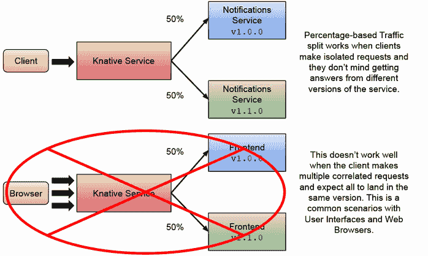

图 8.7 基于百分比的流量分割场景和挑战

用户界面很复杂，因为浏览器将执行多个相关的 GET 请求来渲染页面 HTML、CSS、图像等。你可能会迅速陷入每个请求都击中你应用程序不同版本的情况。让我们看看一种可能更适合测试用户界面或需要确保多个请求最终进入正确版本的应用程序的场景的不同方法。

基于标签的路由 A/B 测试

如果你想要对会议应用包含的不同版本的用户界面进行 A/B 测试，你需要为 Knative 提供一种区分请求发送位置的方法。你有两种选择。首先，你可以指向一个用于尝试服务的特殊 URL，第二种是使用请求头区分请求发送的位置。让我们看看这两个替代方案的实际操作。

步骤分解教程([`github.com/salaboy/platforms-on-k8s/tree/main/chapter-8/knative#run-the-conference-application-with-knative-services`](https://github.com/salaboy/platforms-on-k8s/tree/main/chapter-8/knative#run-the-conference-application-with-knative-services))定义了所有要作为 Knative 服务的会议应用服务并将它们部署到集群中。前端 Knative 服务看起来像列表 8.6。

列表 8.6 前端应用程序的 Knative 服务定义

```
apiVersion: serving.knative.dev/v1
kind: Service
metadata:
  name: frontend                                                           ①
spec:
  template:
    metadata:
      annotations:
        autoscaling.knative.dev/min-scale: "1"                             ②
    spec:
      containers:
      - image: salaboy/frontend-go-1739aa83b5e69d4ccb8a5615830ae66c:v1.0.0 ③
        env:
        - name: KAFKA_URL
          value: kafka.default.svc.cluster.local
       …
```

①你需要为这个服务指定一个名称。

②我们不希望 Knative Serving 在没有人在使用时缩小前端服务。我们希望始终保持至少一个实例运行。

③你现在定义前端容器镜像，因为我们将要测试多个请求发送到同一版本。

再次强调，我们刚刚创建了一个 Knative 服务，但由于这个容器镜像包含由 HTML、CSS、图像和 JavaScript 文件组成的 Web 应用程序，我们无法指定基于百分比的路由规则。Knative 不会阻止您这样做。不过，您会发现请求被路由到不同的版本，并出现错误，因为给定的镜像不在任何一个版本中，或者您最终得到了来自应用程序错误版本的样式表（CSS）。

让我们从定义一个标签开始，这个标签可以用来测试新的样式表，并在后台办公室部分包含调试标签。您可以通过修改 Knative 服务资源来实现这一点，就像我们之前做的那样。首先，将镜像更改为`salaboy/frontend-go-1739aa83b5e69d4ccb8a5615830ae66c:v1.1.0`，添加值为`true`的`FEATURE_DEBUG_ENABLED`环境变量，然后使用`traffic.tag`属性创建一些新的流量规则：

```
 traffic:
 - percent: 100                 ①
   revisionName: frontend-00001
 - latestRevision: true         ②
   tag: version110
```

① 100%的流量将流向我们的稳定版本，不会有请求发送到我们的新修订版本，版本号为 v1.1.0。

② 我们创建了一个名为“color”的新标签；您可以通过描述 Knative 服务资源来找到这个新标签的 URL。

如列表 8.7 所示，如果您描述 Knative 服务（`kubectl describe ksvc frontend`），您将找到我们刚刚创建的标签的 URL，如下所示。

列表 8.7 使用标签时的流量规则

```
 Traffic:
    Latest Revision:  false
    Percent:          100
    Revision Name:    frontend-00001
    Latest Revision:  true
    Percent:          0
    Revision Name:    frontend-00001
    Tag:              version110
    URL:              http://version110-frontend.default.127.0.0.1.sslip.io ①
```

① 您可以在 ksvc 流量部分找到标签及其生成的 URL。

图 8.8 展示了当未指定标签时，Knative 服务将 100%的流量路由到版本 v1.0.0。如果指定了标签“version110”，Knative 服务将流量路由到版本 v1.1.0。

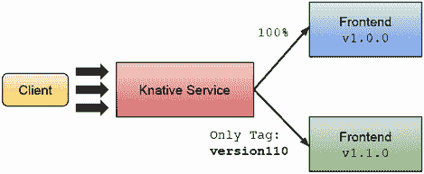

图 8.8 Knative Serving 基于标签的路由版本 v1.1.0。

使用网络浏览器，检查您是否可以通过以下 URL（http://version110-frontend.default.127.0.0.1.sslip.io）一致地访问版本 v1.1.0，并使用原始服务 URL（http://frontend.default.127.0.0.1.sslip.io）访问版本 v.1.0.0。图 8.9 展示了两者并排使用不同的调色板。

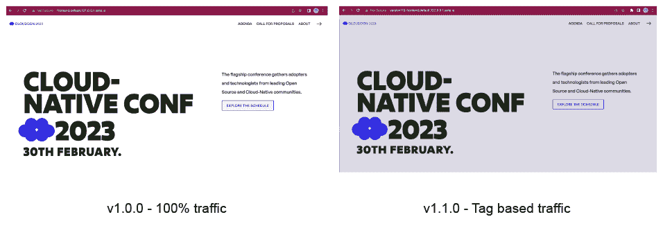

图 8.9 基于标签的路由 A/B 测试

使用标签可以确保所有请求都击中了服务正确版本的 URL。还有一个选项可以避免您在 A/B 测试时指向不同的 URL，这可能对调试很有用。下一节将探讨使用 HTTP 头而不是不同 URL 进行基于标签的路由。

基于头部的 A/B 测试

最后，让我们看看一个 Knative Serving 功能（[`knative.dev/docs/serving/configuration/feature-flags/#tag-header-based-routing`](https://knative.dev/docs/serving/configuration/feature-flags/#tag-header-based-routing)），该功能允许您使用 HTTP 头部来路由请求。此功能也使用标签来确定路由流量，但不是使用不同的 URL 来访问特定的修订版本，而是可以添加一个 HTTP 头部来完成这项工作。

假设您想启用开发者访问应用程序的调试版本。应用程序开发者可以在他们的浏览器中设置一个特殊头部，然后访问特定的修订版本。

要启用此实验性功能，您或安装 Knative 的管理员需要修补 `knative-serving` 命名空间内的 ConfigMap：

```
kubectl patch cm config-features -n knative-serving ➥-p ‘{"data":{"tag-header-based-routing":"Enabled"}}’
```

一旦启用此功能，您可以通过使用我们之前创建的 `version110` 标签来测试它。列表 8.8 展示了我们定义的流量规则。我们想要使用 HTTP 头部路由来针对的标签名称已突出显示。

列表 8.8 使用标签名称进行基于 HTTP 头部的路由

```
 traffic:
 - percent: 100 
   revisionName: frontend-00001
 - latestRevision: true
   tag: version110
```

如果您将浏览器指向 Knative 服务 URL (`kubectl get ksvc`)，您将看到与之前相同的应用程序，如图 8.10 所示，但如果您使用像 ModHeader 扩展程序（[`chrome.google.com/webstore/detail/modheader/idgpnmonknjnojddfkpgkljpfnnfcklj?hl=en`](https://chrome.google.com/webstore/detail/modheader/idgpnmonknjnojddfkpgkljpfnnfcklj?hl=en)）这样的 Chrome 工具，您可以设置浏览器产生的每个请求中都将包含的自定义 HTTP 头部。对于此示例，并且因为您创建的标签名为 `version110`，您需要设置以下 HTTP 头部：`Knative-Serving-Tag: version110`。一旦 HTTP 头部存在，Knative Serving 将将传入请求路由到 `version110` 标签。

图 8.10 展示了 Knative Serving 如何通过使用 ModHeader 设置的 HTTP 头部将请求路由到我们的 `version110` 标签。请注意，我们正在使用默认服务 URL http://frontend.default.127.0.0.1.sslip.io。

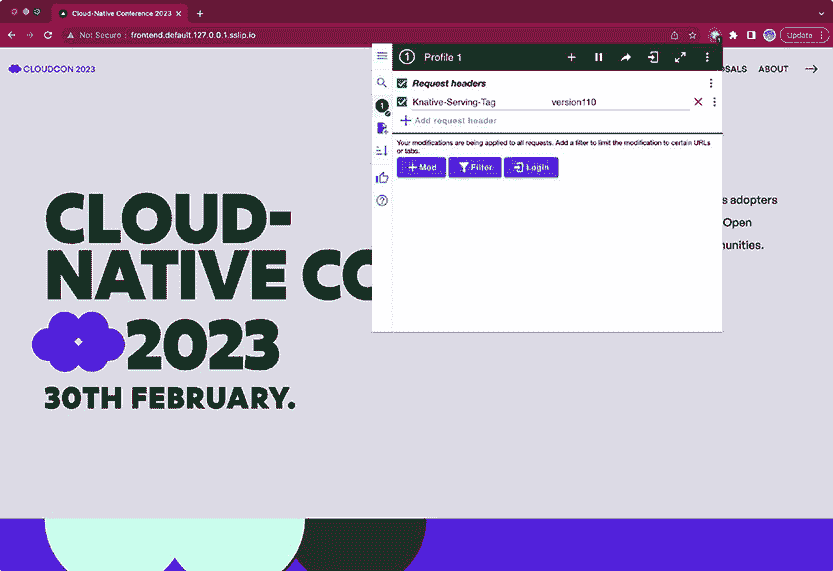

图 8.10 使用 ModHeader Chrome 扩展程序设置基于头部的自定义 HTTP 头部以进行路由。

标签和基于头部的路由都旨在确保如果访问特定的 URL（为标签创建的）或存在特定的头部，所有请求都将被路由到相同的修订版本。最后，让我们看看如何使用 Knative Serving 进行蓝绿部署。

蓝绿部署

对于我们需要在特定时间点从一个版本切换到下一个版本的情况，因为不存在向后兼容性，我们仍然可以使用基于标签的路由和百分比。我们不是逐渐从一个版本过渡到下一个版本，而是使用百分比作为新版本从 0 到 100 的开关，以及旧版本从 100 到 0 的开关。

大多数蓝绿部署场景需要不同团队和服务的协调，以确保服务和客户端同时更新。Knative Serving 允许你以声明式的方式定义何时从当前版本切换到下一个版本。图 8.11 显示了我们要部署一个与`v1.x`版本不兼容的新版本`v2.0.0`的通知服务场景。这意味着这次升级将需要修改客户端。通过使用 Knative Serving 流量规则和标签，我们可以决定何时进行切换。负责客户端和通知服务`v2.0.0`升级的团队需要协调升级。

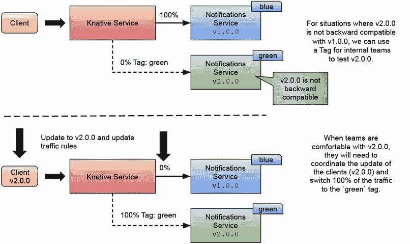

图 8.11 使用 Knative Serving 基于标签的路由进行蓝绿部署

为了实现图 8.11 中描述的场景，我们可以在 Knative 服务内部为新版本创建“green”标签，如图表 8.9 所示。

列表 8.9 使用标签定义蓝绿版本

```
...
traffic:
    - revisionName: <blue-revision-name>
      percent: 100 # All traffic is still being routed to the first revision
    - revisionName: <green-revision-name>
      percent: 0 # 0% of traffic routed to the second revision
      tag: green # A named route
```

通过创建一个新的标签（称为“green”），我们现在将有一个新的 URL 来访问用于测试的新版本。这对于测试客户端的新版本特别有用，因为如果服务 API 发生了非向后兼容的更改，客户端可能也需要更新。一旦所有测试完成，我们可以安全地将所有流量切换到服务的“green”版本，如图表 8.10 所示。注意，我们从“green”版本中移除了标签，并为“blue”版本创建了一个新的标签。

列表 8.10 使用 Knative 声明式方法切换流量

```
...
traffic:
    - revisionName: <first-revision-name>
      percent: 0 # All traffic is still being routed to the first revision
      tag: blue # A named route
    - revisionName: <second-revision-name>
      percent: 100 # 100% of traffic routed to the second revision
```

注意，更新前的“blue”原始版本现在可以通过基于头部或标签的路由访问，并接收发送到服务的所有流量。

通常，我们不能逐步将流量从当前版本移动到下一个版本，因为消费服务的客户端需要理解请求可能会落在不同的（且不兼容的）服务版本上。

在前面的章节中，我们一直在探讨 Knative Serving 如何简化团队实现不同发布策略的过程，以便持续交付功能和服务的最新版本。Knative Serving 减少了手动实现本章中描述的发布策略所需的创建多个 Kubernetes 内置资源的需要。它提供了高级抽象，例如 Knative 服务，它创建和管理 Kubernetes 内置资源以及用于高级流量管理的网络栈。

让我们切换到另一种使用 Argo Rollouts 在 Kubernetes 中管理发布策略的替代方案。

## 8.3 Argo Rollouts：使用 GitOps 自动化的发布策略

在大多数情况下，你会看到 Argo Rollouts 与 ArgoCD 一起协同工作。这很有道理，因为我们希望实现一个交付管道，该管道可以消除手动手动应用配置更改与我们的环境交互的需求。在以下章节的示例中，我们将仅关注 Argo Rollouts，但在实际场景中，你不应该使用 `kubectl` 将资源应用到环境中，因为 Argo CD 会为你完成这项工作。

如网站所定义，Argo Rollouts 是“一个 Kubernetes 控制器和一组 CRDs，它们提供了高级部署功能，如蓝绿部署、金丝雀发布、金丝雀分析、实验和渐进式交付功能。”正如我们通过其他项目所看到的那样，Argo Rollouts 通过引入 `Rollouts`、`Analysis` 和 `Experimentations` 的概念来扩展 Kubernetes，以实现渐进式交付功能。Argo Rollouts 的主要思想是使用 Kubernetes 内置的块，而无需手动修改和跟踪部署和服务资源。

Argo Rollouts 由两部分组成：一个 Kubernetes 控制器，它实现了处理我们的发布、定义（以及分析和实验）的逻辑，以及一个允许你控制这些发布如何进展的 `kubectl` 插件，它使得手动升级和回滚成为可能。使用 `kubectl` Argo Rollouts 插件，你还可以安装 Argo Rollouts 仪表板并在本地运行它。

注意：你可以在 [`github.com/salaboy/platforms-on-k8s/blob/main/chapter-8/argo-rollouts/README.md`](https://github.com/salaboy/platforms-on-k8s/blob/main/chapter-8/argo-rollouts/README.md) 上找到一个关于如何在本地 Kubernetes KinD 集群上安装 Argo Rollouts 的教程。请注意，这个教程需要创建一个不同于我们用于 Knative Serving 的不同 KinD 集群。

让我们先看看如何使用 Argo Rollouts 实现金丝雀发布，以了解它与使用纯 Kubernetes 资源或 Knative 服务相比如何。

### 8.3.1 Argo Rollouts 金丝雀发布

我们将从创建我们的第一个 `Rollout` 资源开始。使用 Argo Rollouts，我们不会定义部署，因为我们将会将这项责任委托给 Argo Rollouts 控制器。相反，我们定义一个 Argo Rollouts 资源，它也提供了我们的 pod 规范（与 Deployment 以相同的方式定义 pod 需要如何创建的 `PodSpec`）。

在这些示例中，我们将只使用来自 Conference 平台应用程序的通知服务，并且不会使用 Helm。当使用 Argo Rollouts 时，我们需要处理目前未包含在 Conference 应用程序 Helm 图表中的不同资源类型。Argo Rollouts 可以与 Helm 完美地协同工作，但我们将创建文件来测试 Argo Rollouts 在这些示例中的行为。你可以在 [`argoproj.github.io/argo-rollouts/features/helm/`](https://argoproj.github.io/argo-rollouts/features/helm/) 查看使用 Helm 的 Argo Rollouts 示例。让我们首先在列表 8.11 中创建一个用于通知服务的 Argo Rollouts 资源。

列表 8.11 Argo Rollouts 资源定义

```
apiVersion: argoproj.io/v1alpha1
kind: Rollout                        ①
metadata:
  name: notifications-service-canary
spec:
  replicas: 3                        ②
  strategy:
    canary:                          ③
      steps:                         ④
      - setWeight: 25
      - pause: {}
      - setWeight: 75
      - pause: {duration: 10}
  revisionHistoryLimit: 2
  selector:
    matchLabels:
      app: notifications-service
  template:
    metadata:
      labels:
        app: notifications-service
    spec:
      containers:
      - name: notifications-service
        image: salaboy/notifications-service-<HASH>:v1.0.0
        env: 
          - name: KAFKA_URL
            value: kafka.default.svc.cluster.local
          ... 
```

① Rollouts 资源定义允许我们配置我们的工作负载使用不同的发布。

② 注意，与部署类似，我们可以设置我们想要的通知服务的副本数量。

③ 此示例将 spec.strategy 属性设置为 canary，这需要一组特定的步骤来配置 canary 发布将如何为这个特定的服务行为。

④ 当我们对服务进行任何更新时，定义的步骤将按顺序执行。在这个例子中，canary 将从 25% 的流量开始，等待手动提升，然后切换到 75%，等待 10 秒，最后移动到 100%。

注意：你可以在这里找到完整的文件 [`github.com/salaboy/platforms-on-k8s/blob/main/chapter-8/argo-rollouts/canary-release/rollout.yaml`](https://github.com/salaboy/platforms-on-k8s/blob/main/chapter-8/argo-rollouts/canary-release/rollout.yaml)。

这个 Rollout 资源通过我们在 `spec.template` 和 `spec.replicas` 字段中定义的内容来管理 Pods 的创建。但它还添加了 `spec.strategy` 部分，在这个情况下设置为 `canary`，并定义了 rollout 将发生的步骤（将发送到 canary 的流量（权重））。正如你所看到的，你还可以定义每个步骤之间的暂停。`duration` 以秒为单位表示，允许我们精细控制流量如何转移到 canary 版本。如果你不指定 `duration` 参数，rollout 将会等待直到手动干预发生。让我们看看这个 rollout 是如何实际工作的。

让我们将 Rollout 资源应用到我们的 Kubernetes 集群中（请查看在 [`github.com/salaboy/platforms-on-k8s/tree/main/chapter-8/argo-rollouts#canary-releases`](https://github.com/salaboy/platforms-on-k8s/tree/main/chapter-8/argo-rollouts#canary-releases) 可用的逐步教程）：

```
> kubectl apply -f argo-rollouts/canary-release/ 
```

注意：此命令还将创建一个 Kubernetes 服务和一个 Kubernetes 入口资源。

记住，如果你正在使用 ArgoCD，那么你将不会手动应用资源，而是将此资源推送到 Argo CD 监控的 Git 仓库。一旦资源被应用，我们可以通过使用 `kubectl` 来看到一个新的 Rollout 资源可用，如列表 8.12 所示。

列表 8.12 获取所有 Argo Rollouts 资源

```
> kubectl get rollouts.argoproj.io 
NAME                           DESIRED   CURRENT   UP-TO-DATE   AVAILABLE   
notifications-service-canary   3         3         3            3                     
```

这看起来几乎就像一个正常的 Kubernetes 部署，但它不是。如果您使用 `kubectl get deployments`，您不应该看到任何针对我们的 `email-service` 的部署资源。Argo Rollouts 通过使用 Rollouts 资源来替代 Kubernetes 部署的使用，这些资源负责创建和操作副本集，我们可以使用 `kubectl get rs` 检查我们的 Rollout 是否创建了一个新的 ReplicaSet。请参阅列表 8.13。

列表 8.13 获取由我们的 Rollout 创建的 ReplicaSet

```
> kubectl get rs
NAME                                    DESIRED   CURRENT   READY   
notifications-service-canary-7f6b88b5fb   3          3         3             
```

Argo Rollouts 将创建和管理我们以前用部署资源管理的这些副本集，但以一种使我们能够平滑地进行金丝雀发布的方式。

如果您已安装了 Argo Rollouts Dashboard，您应该在主页上看到我们的 Rollout（见图 8.12）。

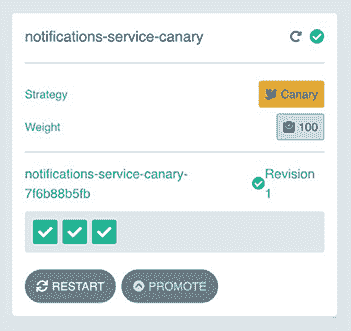

图 8.12 Argo Rollouts Dashboard

与部署一样，我们仍然需要一个服务和入口来将流量从集群外部路由到我们的服务；这些资源包含在逐步教程中（[`github.com/salaboy/platforms-on-k8s/tree/main/chapter-8/argo-rollouts/canary-release`](https://github.com/salaboy/platforms-on-k8s/tree/main/chapter-8/argo-rollouts/canary-release)）。如果您创建了以下资源，您就可以开始与稳定服务以及金丝雀进行交互，如图 8.13 所示。

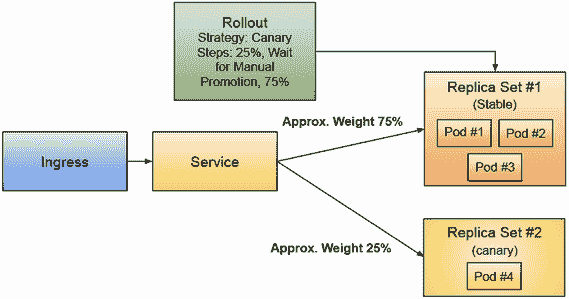

图 8.13 Argo Rollouts 金丝雀发布 Kubernetes 资源。Rollout 控制副本集，并根据每个副本集中的 Pod 数量管理近似权重。

如果您创建了一个服务和入口，您应该能够使用以下 `curl` 命令查询通知服务的 `service/info` 端点：

```
> curl localhost/service/info | jq
```

输出应该类似于列表 8.14。

列表 8.14 与通知服务版本 v1.0.0 交互

```
{
  "name": "NOTIFICATIONS",
  "version": "1.0.0",
  "source": "https://github.com/salaboy/platforms-on-k8s/tree/main/
➥conference-application/notifications-service",
  "podName": "notifications-service-canary-7f6b88b5fb-fq8mm",
  "podNamespace": "default",
  "podNodeName": "dev-worker2",
  "podIp": "10.244.1.5",
  "podServiceAccount": "default"
}
```

请求显示了我们的通知服务 `service/info` 端点的输出。因为我们刚刚创建了此 Rollout 资源，所以 Rollout 金丝雀策略机制尚未启动。现在，如果我们想通过更新 Rollout `spec.template` 部分使用新的容器镜像引用或更改环境变量，将创建一个新的修订版，并启动金丝雀策略。

在新的终端中，我们可以在进行任何修改之前查看 Rollout 状态，这样我们就可以在更改 Rollout 规范时看到 Rollout 机制的实际操作。如果我们想查看在做出一些更改后 Rollout 的进度，您可以在另一个终端中运行以下命令：

```
> kubectl argo rollouts get rollout notifications-service-canary --watch
```

您应该看到类似于图 8.14 的内容。

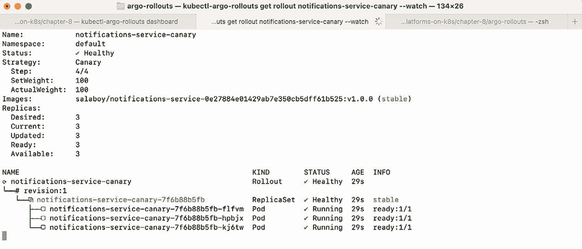

图 8.14 使用 `kubectl` 的 `argo` 插件查看 Rollout 详细信息

让我们通过运行以下命令修改我们的 `notification-service-canary` Rollout：

```
> kubectl argo rollouts set image notifications-service-canary notifications-service=salaboy/notifications-service-0e27884e01429ab7e350cb5dff61b525:v1.1.0
```

一旦我们替换了 Rollout 使用的容器镜像，滚动部署策略就会启动。如果你回到你在那里观察滚动部署的终端，你应该会看到创建了一个新的`# revision: 2`；参见图 8.15。

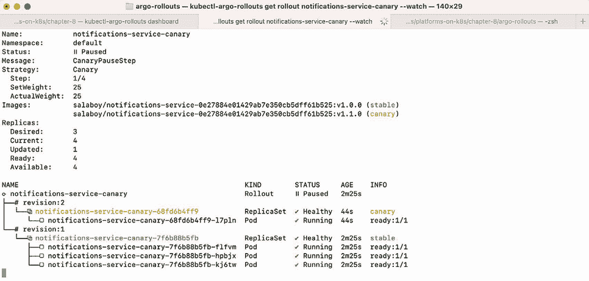

图 8.15 更新服务后的滚动部署进度

你可以看到修订版 2 被标记为“金丝雀”，滚动部署的状态为“॥ 暂停”，并且只为金丝雀创建了一个 Pod。到目前为止，滚动部署只执行了第一步，如列表 8.15 所示。

列表 8.15 Rollout 中的步骤定义

```
strategy:
   canary:
     steps:
     - setWeight: 25
     - pause: {}
```

你也可以在仪表板中检查金丝雀滚动部署的状态，如图 8.16 所示。

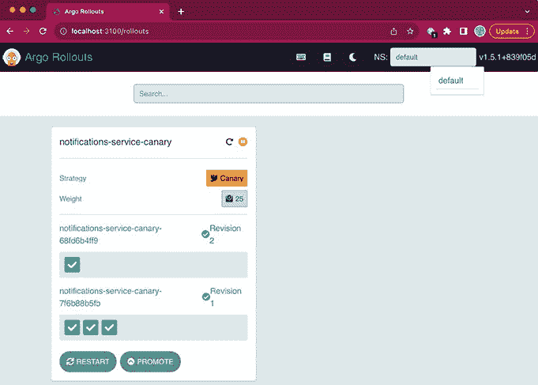

图 8.16 已创建金丝雀发布，大约 20%的流量被路由到它。

Rollout 目前处于暂停状态，等待人工干预。我们现在可以测试我们的金丝雀是否正在接收流量，以查看我们是否对金丝雀的工作情况满意，然后再继续滚动部署过程。为此，我们可以再次查询“service/info”端点，以查看大约 25%的时间我们命中了金丝雀，如列表 8.16 所示。

列表 8.16 从我们的通知服务中命中版本 v1.1.10 的示例输出

```
> curl localhost/service/info | jq
{
  "name":"NOTIFICATIONS-IMPROVED",
  "version":"1.1.0",
  …
}
```

我们可以看到有一个请求击中了我们的稳定版本，另一个请求则去了金丝雀。

Argo Rollouts 不处理流量管理；在这种情况下，Rollout 资源仅处理底层的 ReplicaSet 对象及其副本。你可以通过运行`kubectl get rs`来检查`ReplicaSets`，如列表 8.17 所示。

列表 8.17 检查与我们的 Rollout 关联的 ReplicaSets

```
> kubectl get rs
NAME                                      DESIRED   CURRENT  READY   AGE
notifications-service-canary-68fd6b4ff9   1         1        1       12s
notifications-service-canary-7f6b88b5fb   3         3        3       17m
```

这些不同 Pod（金丝雀和稳定 Pod）之间的流量管理是由 Kubernetes 服务资源管理的，因此要看到我们的请求同时击中了金丝雀和稳定版本 Pod，我们需要通过 Kubernetes 服务。我之所以提到这一点，是因为如果你使用`kubectl port-forward svc/notifications-service 8080:80`，例如，你可能会想交通是被转发到了 Kubernetes 服务（因为我们使用了`svc/notifications-service`），但`kubectl port-forward`解析为一个 Pod 实例并连接到单个 Pod，这仅允许你击中金丝雀或稳定 Pod。因此，我们使用了 ingress，它将使用服务来负载均衡流量并击中所有匹配服务选择器的 Pod。

如果我们对结果满意，我们可以通过执行以下命令继续滚动部署过程，该命令将金丝雀提升为稳定版本：

```
> kubectl argo rollouts promote notifications-service-canary
```

尽管我们刚刚手动提升了滚动部署，但最佳实践是利用 Argo Rollouts 的自动化分析步骤，我们将在第 8.3.2 节中深入探讨。

如果您查看 Argo Rollouts 仪表板，您会注意到您还可以使用 Rollout 中的“提升”按钮来提升 rollout 以继续前进。在这个上下文中，提升仅意味着 rollout 可以继续执行在 `spec.strategy` 部分中定义的下一步，如图表 8.18 所示。

列表 8.18 带有 10 秒暂停的 Rollouts 步骤定义

```
 strategy:
   canary:
     steps:
     - setWeight: 25
     - pause: {}
     - setWeight: 75
     - pause: {duration: 10}
```

在手动提升后，权重将被设置为 75%，然后暂停 10 秒，最终将等待时间设置为 100%。此时，您应该看到修订版 1 正在逐步缩放，而修订版 2 正在逐步提升以接管所有流量。请参阅图 8.17，它显示了 rollout 的最终状态。


图 8.17 所有流量已切换到修订版 2 的 Rollout 完成

您也可以在图 8.18 中的仪表板中实时查看此 rollout 进展。

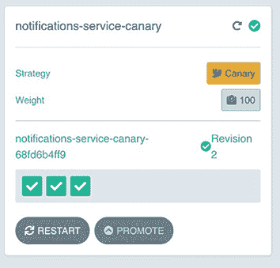

图 8.18 金丝雀修订版被提升为稳定版本。

如您所见，修订版 1 已缩放到零个 pod，修订版 2 现在标记为稳定版本。如果您检查 ReplicaSets，您将看到与列表 8.19 中相同的输出。

列表 8.19 负责修订版 1 的 ReplicaSet 已缩放到 0

```
> kubectl get rs
NAME                                      DESIRED   CURRENT   READY
notifications-service-canary-68fd6b4ff9   3         3         3
notifications-service-canary-7f6b88b5fb   0         0         0
```

我们已经成功创建、测试并提升了 Argo Rollouts 的金丝雀发布！

与我们在 8.1 节中看到的金丝雀发布相比，使用两个部署资源通过 Argo Rollouts 实现相同的模式，你可以完全控制金丝雀发布如何提升，你希望在将更多流量切换到金丝雀之前等待多少时间，以及你希望添加多少手动干预步骤。现在让我们看看 Argo Rollouts 中的蓝绿部署是如何工作的。

### 8.3.2 Argo Rollouts 蓝绿部署

在 8.1 节中，我们介绍了使用 Kubernetes 基本构建块进行蓝绿部署的优势以及您可能感兴趣的原因。我们还看到了这个过程是多么手动，以及这些手动步骤如何打开可能导致我们的服务崩溃的愚蠢错误的门。在本节中，我们将探讨 Argo Rollouts 如何使我们能够以与之前用于金丝雀部署相同的方法实现蓝绿部署。请查看 Argo Rollouts 蓝绿部署的逐步教程[`github.com/salaboy/platforms-on-k8s/tree/main/chapter-8/argo-rollouts#bluegreen-deployments`](https://github.com/salaboy/platforms-on-k8s/tree/main/chapter-8/argo-rollouts#bluegreen-deployments)。让我们看看具有蓝绿策略的 Rollout 在列表 8.20 中的样子。

列表 8.20 定义蓝绿策略的 Rollout

```
apiVersion: argoproj.io/v1alpha1
kind: Rollout
metadata:
  name: notifications-service-bluegreen
spec:
  replicas: 2
  revisionHistoryLimit: 2
  selector:
    matchLabels:
      app: notifications-service
  template:
    metadata:
      labels:
        app: notifications-service
    spec:
      containers:
      - name: notifications-service
        image: salaboy/notifications-service-<HASH>:v1.0.0
        env: 
          - name: KAFKA_URL
            value: kafka.default.svc.cluster.local
          ..
  strategy:
    blueGreen: 
      activeService: notifications-service-blue
      previewService: notifications-service-green
      autoPromotionEnabled: false
```

注意：您可以在[`github.com/salaboy/platforms-on-k8s/blob/main/chapter-8/argo-rollouts/blue-green/rollout.yaml`](https://github.com/salaboy/platforms-on-k8s/blob/main/chapter-8/argo-rollouts/blue-green/rollout.yaml)找到完整的文件。

让我们应用这个 Rollout 资源的资源，使其工作（两个 Kubernetes 服务和入口）：

```
> kubectl apply -f argo-rollouts/blue-green/
```

我们正在使用与之前相同的`spec.template`，但现在我们将 Rollout 的策略设置为`blueGreen`，因此我们需要配置对两个 Kubernetes 服务的引用。一个服务将是活动服务（蓝色），它正在处理生产流量，另一个是我们想要预览的绿色服务，但不将其路由到生产流量。`autoPromotionEnabled`: `false`是必需的，以允许手动干预以进行提升。默认情况下，一旦新的 ReplicaSet 准备好/可用，部署将自动提升。你可以通过以下命令或 Argo Rollouts 仪表板来监视部署：

```
> kubectl argo rollouts get rollout notifications-service-bluegreen --watch
```

在以下图中，你应该看到与我们在金丝雀发布中看到的输出类似的输出。

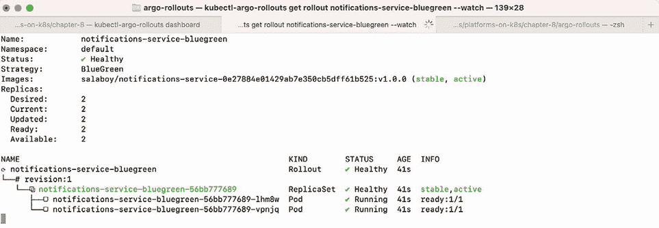

图 8.19 检查我们的蓝绿部署状态

在仪表板中，见图 8.20。

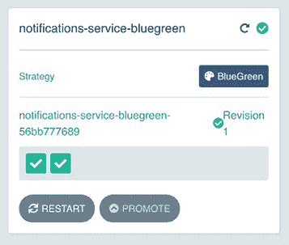

图 8.20 Argo Rollouts 仪表板中的蓝/绿部署

我们可以使用服务入口与修订版#1 进行交互，然后发送类似于列表 8.21 的请求。

列表 8.21 访问我们的服务的修订版 1

```
> curl localhost/service/info
{
  "name":"NOTIFICATIONS",
  "version":"1.0.0",
  …
}
```

如果我们现在更改我们的 Rollout `spec.template`，蓝绿策略将启动。对于这个例子，我们想要看到的结果是 previewService 现在正在路由流量到我们在更改部署时创建的第二修订版：

```
> kubectl argo rollouts set image notifications-service-bluegreen   ➥notifications-service=salaboy/notifications-service-<HASH>:v1.1.0
```

部署机制将启动，并且它将自动创建一个新的修订版 2 的 ReplicaSet，其中包含我们的更改。Argo Rollouts 用于蓝/绿部署将使用选择器通过修改我们在 Rollout 定义中引用的`previewService`来路由流量到我们的新修订版。

如果你描述`notifications-service-green` Kubernetes 服务，你会注意到添加了一个新的选择器，如列表 8.22 所示。

列表 8.22 Argo Rollouts 管理的 Kubernetes 服务选择器

```
> kubectl describe svc notifications-service-green
Name:              notifications-service-green
Namespace:         default
Labels:            <none>
Annotations:       argo-rollouts.argoproj.io/managed-by-rollouts: notifications-service-bluegreen
Selector:          app=notifications-service,rollouts-pod-template-hash=645d484596
Type:              ClusterIP
IP Family Policy:  SingleStack
IP Families:       IPv4
IP:                10.96.198.251
IPs:               10.96.198.251
Port:              http  80/TCP
TargetPort:        http/TCP
Endpoints:         10.244.2.5:8080,10.244.3.6:8080
Session Affinity:  None
Events:            <none>
```

此选择器与我们在进行更改时创建的修订版 2 的 ReplicaSet 匹配，如列表 8.23 所示。

列表 8.23 ReplicaSet 使用相同的标签来匹配服务定义

```
> kubectl describe rs notifications-service-bluegreen-645d484596
Name:           notifications-service-bluegreen-645d484596
Namespace:      default
Selector:       app=notifications-service,rollouts-pod-template-hash=645d484596
Labels:         app=notifications-service
                rollouts-pod-template-hash=645d484596
Annotations:    rollout.argoproj.io/desired-replicas: 2
                rollout.argoproj.io/revision: 2
Controlled By:  Rollout/notifications-service-bluegreen
Replicas:       2 current / 2 desired
Pods Status:    2 Running / 0 Waiting / 0 Succeeded / 0 Failed
Pod Template:
  Labels:  app=notifications-service
           rollouts-pod-template-hash=645d484596
```

通过使用选择器和标签，具有`blueGreen`策略的 Rollout 正在为我们自动处理这些链接。这避免了手动创建这些标签的需要，并确保它们匹配。如图 8.21 所示，你现在可以检查现在有两个修订版（和 ReplicaSets），每个都有两个 Pod。

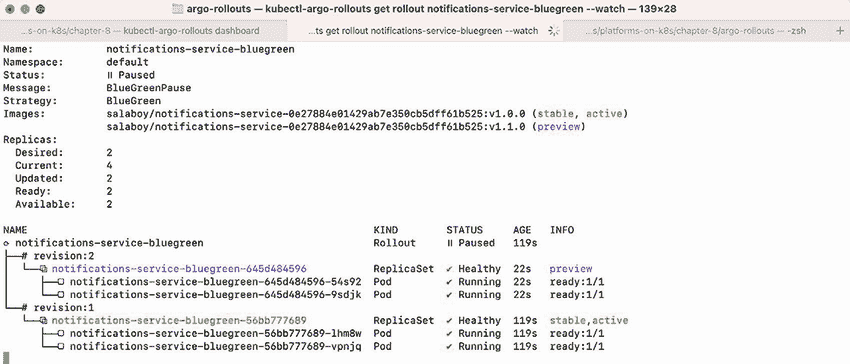

图 8.21 蓝色和绿色服务运行着相同数量的副本

在 Argo Rollouts 仪表板中，你应该看到与图 8.22 相同的信息。

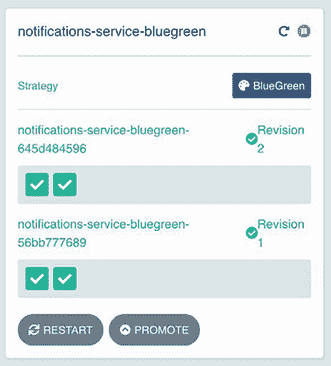

图 8.22 Argo Rollouts 仪表板蓝绿修订版已启动

现在我们可以通过以下列表中的不同路径与 Green 服务（修订版#2）进行交互。

列表 8.24 与修订版 2（我们的 Green 服务）交互

```
> curl localhost/green/service/info | jq                        
{
  "name": "NOTIFICATIONS-IMPROVED",
  "version": "1.1.0",
  "source": "https://github.com/salaboy/platforms-on-k8s/tree/v1.1.0/
➥conference-application/notifications-service",
  "podName": "notifications-service-bluegreen-645d484596-rsj6z",
  "podNamespace": "default",
  "podNodeName": "dev-worker",
  "podIp": "10.244.2.5",
  "podServiceAccount": "default"
}
```

一旦 Green 服务启动运行，Rollout 将处于暂停状态，直到我们决定将其提升为稳定服务。图 8.23 展示了 Rollout 资源将如何根据 Rollout 的进度来协调 Green 和 Blue 服务所拥有的多个副本。

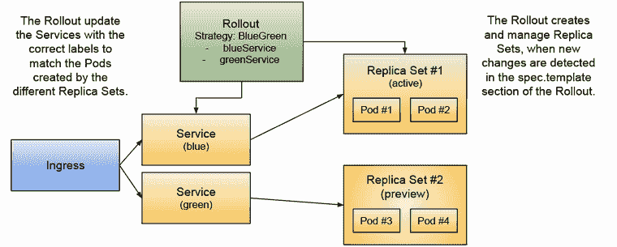

图 8.23 使用 Kubernetes 资源的蓝绿部署

由于我们现在有两个服务，我们可以同时访问它们，并在将其提升为主要（蓝色）服务之前确保我们的 Green（green-service）按预期工作。当服务处于预览状态时，集群中的其他服务可以开始将其用于测试目的的路由流量，但要路由所有流量并用我们的 Green 服务替换 Blue 服务，我们还可以再次使用终端中的 CLI 或从 Argo Rollouts 仪表板使用 Argo Rollouts 提升机制。现在尝试使用仪表板而不是`kubectl`来提升 Rollout。请记住，从终端提升 Rollout 的命令看起来像这样：

```
>kubectl argo rollouts promote notifications-service-bluegreen
```

注意，在缩小修订版#1 之前默认添加了 30 秒的延迟（这可以通过名为`scaleDownDelaySeconds`的属性来控制），但提升（切换标签到服务）发生在我们点击`PROMOTE`按钮的瞬间，如图 8.24 所示。

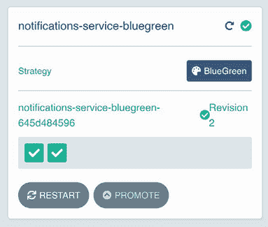

图 8.24 使用 Argo Rollouts 仪表板进行 Green 服务提升

这次提升仅将标签切换到服务的资源上，这会自动更改路由表，现在将所有来自活动服务的流量转发到我们的 Green 服务。如果我们对 Rollout 进行更多更改，过程将重新开始，预览服务将指向一个包含这些更改的新修订版。现在我们已经了解了使用 Argo Rollouts 进行金丝雀发布和蓝绿部署的基本知识，让我们来看看 Argo Rollouts 提供的更多高级机制。

### 8.3.3 Argo Rollouts 的渐进式交付分析

到目前为止，我们已经能够更好地控制我们的不同发布策略，但 Argo Rollouts 通过提供 AnalysisTemplate CRD 而显得出色，这使我们能够确保在 Rollout 过程中，我们的金丝雀和 Green 服务按预期工作。这些分析是自动化的，并作为 Rollout 的关卡，确保分析探测成功后才会继续进行。

这些分析可以使用不同的提供商来运行探针，包括 Prometheus、Datadog ([`www.datadoghq.com/`](https://www.datadoghq.com/)）、New Relic ([`newrelic.com/`](https://newrelic.com/)）和 Dynatrace ([`www.dynatrace.com/`](https://www.dynatrace.com/)）等，从而提供最大的灵活性来定义针对我们服务新版本的这些自动化测试。

图 8.25 展示了 AnalysisTemplates 如何允许 Argo Rollouts 创建 AnalysisRuns 以验证推出的新版本是否通过查看服务指标按预期运行。`AnalysisRuns` 将对服务进行指标探测，并且只有当指标匹配在 `AnalysisTemplate` 中定义的成功条件时，才会继续执行 `Rollout` 步骤。

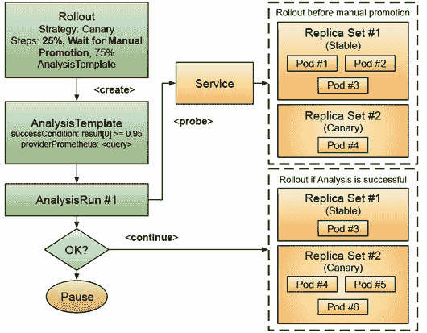

图 8.25 Argo Rollouts 和分析协同工作以确保我们的新版本在流量转移之前是可靠的。当收到前进到 Rollout 下一个步骤的信号时，将创建一个 `AnalysisRun` 来通过运行在 `AnalysisTemplate` 中定义的查询来探测服务。`AnalysisRun` 的结果将影响 `Rollout` 的更新是继续、中止还是暂停。

对于金丝雀发布，分析可以作为步骤定义的一部分触发，这意味着在任意步骤之间，或者在 Rollout 中定义的每个步骤开始，或者为每个步骤定义。使用 Prometheus 提供商定义的 `AnalysisTemplate` 看起来像列表 8.25。

列表 8.25 Argo Rollouts 提供的 AnalysisTemplate 资源

```
apiVersion: argoproj.io/v1alpha1
kind: AnalysisTemplate
metadata:
  name: success-rate
spec:
  args:
  - name: service-name
  metrics:
  - name: success-rate
    interval: 5m
    # NOTE: prometheus queries return results in the form of a vector.
    # It is common to access the index 0 to obtain the value
    successCondition: result[0] >= 0.95
    failureLimit: 3
    provider:
      prometheus:
        address: http://prometheus.example.com:9090
        query: <Prometheus Query here>
```

然后，在我们的 Rollout 中，我们可以引用此模板并定义何时创建新的 AnalysisRun，例如，如果我们想在步骤 2 之后运行第一次分析（列表 8.26）。

列表 8.26 在定义金丝雀发布时选择分析模板

```
strategy:
    canary:
      analysis:
        templates:
        - templateName: success-rate
        startingStep: 2 # delay starting analysis run until setWeight: 40%
        args:
        - name: service-name
          value: notifications-service-canary.default.svc.cluster.local
```

如前所述，分析也可以定义为步骤的一部分。在这种情况下，我们的步骤定义将类似于列表 8.27。

列表 8.27 在 Rollout 中使用 AnalysisTemplate 引用作为步骤

```
strategy:
    canary:
      steps:
      - setWeight: 20
      - pause: {duration: 5m}
      - analysis:
          templates:
          - templateName: success-rate
          args:
          - name: service-name
            value: notifications-service-canary.default.svc.cluster.local 
```

对于使用蓝绿策略的 Rollout，我们可以在推广前后触发分析运行。图 8.26 显示了通过运行 SmokeTestTemplate 来执行 PrePromotionAnalysis 步骤。如果分析运行失败，这将阻止 Rollout 切换流量到绿色服务。

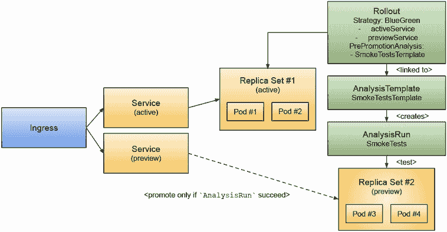

图 8.26 Argo Rollouts 与蓝绿部署和 PrePromotionAnalysis 一起工作。当在 Rollout 上触发推广时，它将使用 `SmokeTestsTemplate` 创建一个新的 `AnalysisRun`，然后在切换标签以路由流量到预览服务之前。只有当 `AnalysisRun` 成功时，预览服务才成为新的活动服务。

下面是我们在 Rollout 中配置的 PrePromotionAnalysis 的示例，见列表 8.28。

列表 8.28 在蓝绿 Rollout 中定义 PrePromotionAnalysis

```
apiVersion: argoproj.io/v1alpha1
kind: Rollout
metadata:
  name: notifications-service-rollout
spec:
...
  strategy:
    blueGreen:
      activeService: notifications-service-blue
      previewService: notifications-service-green
      prePromotionAnalysis:
        templates:
        - templateName: smoke-tests
        args:
        - name: service-name
          value: notifications-service-preview.default.svc.cluster.local
```

对于预促销测试，在将流量切换到绿色服务之前，运行一个新的 AnalysisRun 测试，并且只有当测试成功时才会更新标签。对于后促销，测试将在标签切换到绿色服务之后运行，如果 AnalysisRun 失败，Rollout 可以自动将标签回滚到上一个版本。这是可能的，因为蓝色服务不会在 AnalysisRun 完成之前进行缩放。

我建议您查看官方文档中的分析部分，因为它包含了所有提供者和旋钮的详细解释，这些提供者和旋钮可以帮助确保您的 Rollouts 顺利运行：[`argoproj.github.io/argo-rollouts/features/analysis/`](https://argoproj.github.io/argo-rollouts/features/analysis/)。

### 8.3.4 Argo Rollouts 和流量管理

最后，值得一提的是，Rollouts 使用可用的 Pod 数量来近似我们为金丝雀发布定义的权重。虽然这是一个良好的开始，也是一个简单的机制，但有时我们需要对如何将流量路由到不同的版本有更多的控制。我们可以利用服务网格和负载均衡器的力量来编写更精确的规则，关于哪些流量被路由到我们的金丝雀发布。

根据我们 Kubernetes 集群中可用的流量管理工具，Argo Rollouts 可以配置不同的`trafficRouting`规则。目前，Argo Rollouts 支持：Istio、AWS ALB Ingress Controller、Ambassador Edge Stack、Nginx Ingress Controller、Service Mesh Interface (SMI)和 Traefik Proxy 等。如文档所述，如果我们有更高级的流量管理功能，我们可以实现如下技术：

+   原始百分比（即，5%的流量应发送到新版本，其余发送到稳定版本）

+   基于头的路由（即，发送带有特定头的请求到新版本）

+   镜像流量，其中所有流量都并行复制并发送到新版本（但忽略响应）

通过结合使用 Istio 等工具和 Argo Rollouts，我们可以使开发者能够测试只有通过设置特定头或转发生产流量的副本到金丝雀以验证它们是否按预期行为的功能。

这里是一个配置 Rollout 以将 35%的流量镜像到具有 25%权重的金丝雀发布的示例。这意味着将有 35%的流量被路由到稳定服务后，会复制并转发到金丝雀。通过使用这种技术，我们不会冒任何生产流量的风险，因为 Istio 正在复制请求以进行测试，如列表 8.29 所示。

列表 8.29 使用 Istio 进行高级（基于权重的）流量分割

```
apiVersion: argoproj.io/v1alpha1
kind: Rollout
spec:
  ...
  strategy:
    canary:
      canaryService: notifications-service-canary
      stableService: notifications-service-stable
      trafficRouting:
        managedRoutes:
          - name: mirror-route
        istio:
          virtualService:
            name: notifications-service-vsvc
      steps:
        - setCanaryScale:
            weight: 25
      - setMirrorRoute:
          name: mirror-route
          percentage: 35
          match:
            - method:
                exact: GET
              path:
                prefix: /
      - pause:
          duration: 10m
      - setMirrorRoute:
          name: "mirror-route" # removes mirror based traffic route
```

如您所见，这个简单的例子已经需要了解 Istio 虚拟服务以及超出本节范围的更高级配置。如果您想了解 Istio，我强烈推荐阅读 Christian Posta 和 Rinor Maloku（Manning Publications，2022 年）的《Istio in Action》。图 8.27 显示了配置为使用 Istio 流量管理能力进行基于权重的路由的 Rollouts。

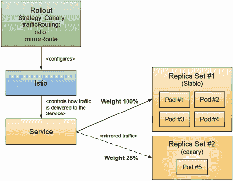

图 8.27 使用 Istio 进行流量镜像到金丝雀发布。使用 Istio 等工具设置 `trafficRouting` 可以使我们的金丝雀工作负载体验到稳定服务正在接收的真实流量。Rollout 控制器负责配置 Istio 虚拟服务为我们完成工作，并对哪些流量被发送到服务有精细的控制。

当使用“trafficManagement”功能时，Rollout 金丝雀策略的行为将与不使用任何规则时不同。更具体地说，当通过金丝雀发布滚动时，服务的稳定版本不会被缩放。这确保了稳定服务可以处理 100% 的流量。通常的计算适用于金丝雀副本数量。

我强烈建议查看官方文档（[`argoproj.github.io/argo-rollouts/features/traffic-management/`](https://argoproj.github.io/argo-rollouts/features/traffic-management/)）并遵循那里的示例，因为根据您可用的服务网格，Rollouts 的配置可能需要不同。

## 8.4 回到平台工程

在本章中，我们看到了使用基本的 Kubernetes 构建块可以实现什么，以及像 Argo Rollouts 或 Knative Serving 这样的工具如何通过发布它们应用程序的新版本到 Kubernetes 来简化团队的生活。

很遗憾，截至 2023 年今天，Argo Rollouts 和 Knative Serving 尚未集成（[`github.com/argoproj/argo-rollouts/issues/2186`](https://github.com/argoproj/argo-rollouts/issues/2186)），因为这两个社区都将从定义发布策略的统一方式中受益，而不是重复功能。我喜欢 Knative Serving 的构建块，它有助于实现这些发布策略。另一方面，我喜欢 Argo Rollouts 通过 `AnalysisTemplates` 的概念将事物提升到下一个层次，以确保我们可以自动测试和验证新版本。未来是光明的，因为这两个项目都在寻求与 Gateway API 标准的进一步集成（[`gateway-api.sigs.k8s.io/`](https://gateway-api.sigs.k8s.io/)），以统一在 Kubernetes 中管理高级流量路由能力。像 Istio、Knative Serving 和 Argo Rollouts 这样的工具都有积极的倡议来支持这个新标准。

我坚信，你在 Kubernetes 之旅中迟早会遇到交付挑战，而在你的集群内部拥有这些机制将增加你更快发布更多软件的信心。因此，我不会轻率地评估这些工具。确保你为你的团队规划时间，让他们研究和选择他们将用于实施这些发布策略的工具；许多软件供应商也可以提供帮助和建议。

从平台工程的角度来看，我们研究了如何通过提供开发者可以消费的应用级 API 来提高他们的效率，无论他们的语言是什么。我们已经使其他团队，如产品经理或更多以业务为导向的团队，能够决定何时启用某些功能以及如何根据他们的需求执行不同的发布策略。我们还使运维团队能够安全地定义规则，以验证新的 Rollouts 是否安全且按预期工作。

虽然本章的重点不是详细分析像 Knative Serving 这样的工具，但在构建平台时，提及容器即服务（container-as-a-service）和函数即服务（function-as-a-service）功能是很重要的，因为这些代表了平台团队可能希望向用户公开的常见特性。我还建议检查 Knative Functions（[`knative.dev/docs/functions/`](https://knative.dev/docs/functions/)），现在是一个官方的 Knative 模块，因为这个项目强调了基于 Knative 构建基于函数的开发工作流程并利用 Kubernetes 的多语言方法的重要性。

图 8.28 展示了像 Knative Serving 这样的工具为平台团队提供了基本的构建块，以便以不同的方式部署和运行不同团队的负载。通过添加高级流量管理，团队可以实现更复杂的发布策略。Argo Rollouts 和 Knative Serving 与 Istio 服务网格协同工作，这将涵盖其他重要方面，例如用于加密和可观察性的 mTLS。像 Dapr 和 OpenFeature 这样的工具通过为团队提供标准接口来使用，同时使平台团队能够定义后端实现，而不必承诺单一解决方案。

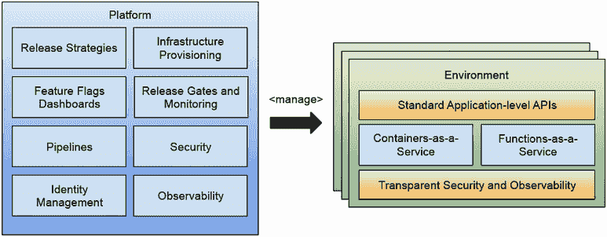

图 8.28 定义的平台能力以管理环境。

我确实看到像 Knative、Argo Rollouts、Dapr、Istio 和 OpenFeature 这样的工具在这个领域引领潮流，尽管如此，即使团队需要弄清楚这些工具的每个细节，模式也在出现。这些工具已经存在了三年多，你可以注意到它们的功能、路线图以及参与人员的成熟度。随着一些项目从 CNCF 的孵化过程中毕业，我预计会有更多的集成来帮助用户处理今天大多数公司手动实施的标准工作流程。

最后，为了回顾到目前为止的旅程，图 8.29 展示了发布策略如何融入我们的平台骨架，以及业务团队（产品团队、利益相关者）如何使用这些机制在将所有客户完全迁移到最新版本之前验证新版本。


图 8.29 允许团队实验新版本的 环境

在下一章中，为了结束本书，我决定谈谈我们如何衡量我们构建在 Kubernetes 之上的平台。这两章中描述的平台功能以及本书中描述的工具组合都是好的，因为我们正在提高我们团队交付软件的速度。因此，使用关注我们团队在交付软件方面效率的指标与平台为这些团队提供的工具直接相关。

## 摘要

+   使用 Kubernetes 内置资源实现常见的发布策略，如金丝雀发布、蓝/绿部署和 A/B 测试可能具有挑战性。

+   Knative Serving 引入了一个高级网络层，使我们能够精细控制流量如何路由到可以同时部署的不同版本的服务。此功能是在 Knative 服务之上实现的，减少了创建多个 Kubernetes 资源以实现金丝雀发布、蓝/绿部署和 A/B 测试发布策略的手动工作。Knative Serving 简化了将流量移动到新版本的运营负担，并且借助 Knative 自动扩展器，可以根据需求进行扩展和缩减。

+   Argo Rollouts 与 ArgoCD（在第四章中讨论）集成，并提供了使用 Rollouts 概念实现发布策略的替代方案。Argo Rollouts 还包括自动化测试新版本的功能，以确保我们在版本之间安全迁移（AnalysisTemplates 和 AnalysisRuns）。

+   平台团队必须通过提供灵活的机制和工作流程，使利益相关者（业务、产品经理、运营）能够通过实验来降低他们正在工作的应用程序新版本发布的风险。

+   按照逐步的教程，您可以通过使用 Knative 服务和不同的模式将流量路由到会议应用程序来获得实际操作经验。您还获得了使用 Argo Rollouts 来实现金丝雀发布和蓝/绿部署的经验。
