# 9 衡量你的平台

本章涵盖了

+   学习衡量平台性能的重要性

+   实施 DORA 指标和了解持续改进的秘密

+   使用工具和标准来收集和计算指标

在第八章中，我们介绍了如何构建一个帮助您交付软件并使团队在需要时拥有所需工具的平台的原则。这一章的全部内容都是确保平台不仅对应用开发团队，而且对整个组织都是有效的。为了了解平台的表现，我们需要能够衡量它。我们对运行的软件有不同方式进行测量。然而，在本章中，我们将重点关注 DORA（DevOps 研究和评估）指标，这些指标为我们理解组织的软件交付速度以及我们在发生故障时恢复能力提供了良好的基础。

本章分为两个主要部分：

+   要衡量什么：DORA 指标和高性能团队

+   如何衡量我们的平台举措：

    +   CloudEvents 和 CDEvents 来拯救

    +   Keptn 生命周期工具包

让我们从了解我们应该衡量什么开始，为此，我们需要查看 DORA 指标。

## 9.1 要衡量什么：DORA 指标和高性能团队

在对行业进行彻底研究后，DevOps 研究和评估（DORA）团队确定了五个关键指标，这些指标突出了交付软件的软件开发团队的性能。最初，在 2020 年，只定义了四个关键指标，因此您可能会找到对“DORA 四个关键”指标的引用。在调查了数百个团队后，DORA 发现了哪些指标和指标将高性能/精英团队与其他团队区分开来，数字相当令人震惊。DORA 使用以下四个关键来对团队及其实践进行排名：

+   *部署频率:* 组织成功向客户发布软件的频率

+   *变更领先时间:* 应用团队产生的变更达到实时客户所需的时间

+   *变更失败率:* 新变化引入到我们的生产环境中导致的问题数量

+   *恢复服务时间:* 从我们的生产环境中解决问题的恢复所需时间

图 9.1 显示了按类别划分的 DORA 指标，其中前两个与团队的速率相关。后两个，变更失败率和恢复服务时间，表明我们作为一个组织从故障中恢复的可能性。

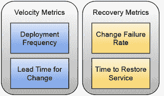

图 9.1 按类别划分的 DORA 指标

在 2022 年，一个关注可靠性的第五个关键指标被添加，以涵盖运营性能。我们只讨论四个软件交付指标，因为这本书的重点是应用开发团队，而不是运营团队。

如报告中所示，这五个关键指标建立了高性能团队与其通过这些指标表达的速率之间的明确关联。如果您管理团队以减少他们的部署频率（即他们向用户展示新版本的速度）并减少事件引起的时间，您的软件交付性能将会提高。

在本章中，我们将探讨如何计算我们正在构建的平台上的这些指标，以确保这些平台正在提高我们的持续交付实践。为了收集数据和计算这些指标，您需要利用您的团队用于交付软件的不同系统。例如，如果您想计算**部署频率**，您将需要每次新版本部署时访问生产环境的数据（见图 9.2）。另一个选择是使用执行向生产环境发布的环境管道的数据。图 9.2 显示了我们可以如何观察我们的 CI/CD 管道和生产环境，以计算部署频率等指标。

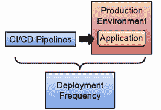

图 9.2 部署频率数据来源。

如果您想计算**变更的领先时间**，您将需要汇总来自您的源代码版本控制系统（如 GitHub/GitLab/BitBucket）的数据，并有一种方法将此信息与部署到生产环境的工件关联起来（见图 9.3）。

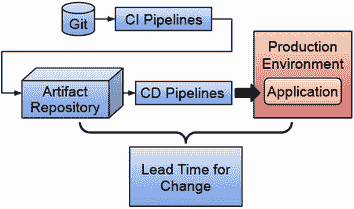

图 9.3 变更的领先时间数据来源

假设您有一种直接将提交与工件关联，然后再与部署关联的方法。在这种情况下，您可以依赖几个来源，但如果您想更详细地了解瓶颈在哪里，您可能选择汇总更多数据，以便能够看到时间是如何被花费的。

您可能需要利用事件管理和监控工具来计算变更失败率和恢复服务时间，如图 9.4 所示。

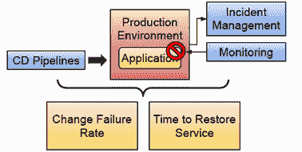

图 9.4 恢复指标数据来源

对于恢复指标（变更失败率和恢复服务时间），数据收集可能更具挑战性，因为我们需要找到一种方法来衡量应用性能下降或出现停机的时间。这可能需要来自实际用户的问题报告。

### 9.1.1 集成问题

这迅速变成一个系统集成挑战。一般来说，我们需要观察我们软件交付过程中涉及的系统，捕获相关数据，然后有机制来汇总这些信息。一旦这些信息可用，我们可以使用这些指标来优化我们的交付流程，找到并解决瓶颈。

虽然一些项目已经提供了开箱即用的 DORA 指标，但你必须评估它们是否足够灵活，以便将你的系统连接到它们。谷歌的“四要素”项目提供了一个开箱即用的体验，用于根据外部输出计算这些指标。你可以在[`cloud.google.com/blog/products/devops-sre/using-the-four-keys-to-measure-your-devops-performance`](https://cloud.google.com/blog/products/devops-sre/using-the-four-keys-to-measure-your-devops-performance)了解更多相关信息。

不幸的是，“四要素”项目要求你在 Google Cloud Platform 上运行，因为它使用 BigData 和 Google Cloud run 进行计算。遵循本书的原则，我们需要一个可以在不同云服务提供商之间工作且以 Kubernetes 为基础解决方案。其他工具，如 LinearB ([`linearb.io/`](https://linearb.io/))，提供了一种 SaaS 解决方案来跟踪不同的工具。我还推荐 Codefresh ([`codefresh.io/learn/software-deployment/dora-metrics-4-key-metrics-for-improving-devops-performance/`](https://codefresh.io/learn/software-deployment/dora-metrics-4-key-metrics-for-improving-devops-performance/)) 的一篇博客文章，该文章解释了计算这些指标所面临的挑战以及你需要的数据点。

要有一种 Kubernetes 原生的方法来计算这些指标，我们需要标准化我们从不同系统获取信息的方式，将此信息转换成我们可以用来计算这些指标的模型，并确保不同的组织能够通过它们的指标和非常多样化的信息来源扩展此模型。在下一节中，我们将探讨两个可以帮助我们完成这项任务的标准：CloudEvents ([`cloudevents.io/`](https://cloudevents.io/)) 和 CDEvents ([`cdevents.dev/`](https://cdevents.dev/))。

## 9.2 如何衡量我们的平台：CloudEvents 和 CDEvents

越来越多的工具和服务提供商正在采用 CloudEvents ([`cloudevents.io`](https://cloudevents.io)) 作为封装事件数据的标准方式。在这本书中，我们已经介绍了 Tekton ([`tekton.dev`](https://tekton.dev)) 和 Dapr PubSub ([`dapr.io`](https://dapr.io))，但如果您查看官方 CloudEvents 网站（访问 [`cloudevents.io`](https://cloudevents.io) 并滚动到 CloudEvents Adopters 部分），您将找到所有已经支持该标准的项目。在该列表中，您会发现 Argo Events ([`argoproj.github.io/argo-events/`](https://argoproj.github.io/argo-events/)) 和 Knative Eventing ([`knative.dev/docs/eventing/`](https://knative.dev/docs/eventing/))，这些是我们没有介绍但与前面章节中描述的工具配合得非常好的项目。我发现云服务提供商的服务，如 GoogleCloud Eventarc ([`cloud.google.com/eventarc/docs`](https://cloud.google.com/eventarc/docs)) 和阿里巴巴云 EventBridge ([`www.alibabacloud.com/help/en/eventbridge`](https://www.alibabacloud.com/help/en/eventbridge)) 出现在列表中，这表明 CloudEvents 将会持续存在。

虽然看到更多的采用是一个很好的指标，但在接收或想要发射 CloudEvent 时，还有很多工作要做。CloudEvents 是我们事件数据的简单且轻薄的信封。图 9.5 展示了 CloudEvent 的非常简单的结构。规范定义了 CloudEvent 所需的元数据，并验证 CloudEvent 将包含一个包含我们想要发送到其他系统的数据的事件有效载荷。

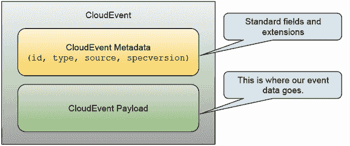

图 9.5 CloudEvents，一个简单的信封来封装我们的事件数据

使用 CloudEvents，开发者通过依赖 CloudEvents 规范来了解事件至少包含什么内容，从而发射和消费事件。由于 CloudEvents 规范不是传输特定的，我们可以使用不同的传输方式来移动 CloudEvents。该规范包括 AMQP、HTTP、AVRO、KAFKA、NATS、MQQT、JSON、XML、websockets 和 webhooks 等协议的绑定定义。您可以在[`github.com/cloudevents/spec/tree/main#cloudevents-documents`](https://github.com/cloudevents/spec/tree/main#cloudevents-documents)找到完整的列表。

当我们在第七章中使用 Dapr PubSub 时，我们使用了 CloudEvents SDK 来验证事件类型并获取 CloudEvent 有效负载 ([`github.com/salaboy/platforms-on-k8s/blob/v2.0.0/conference-application/frontend-go/frontend.go#L118`](https://github.com/salaboy/platforms-on-k8s/blob/v2.0.0/conference-application/frontend-go/frontend.go#L118))。像 Tekton、Knative Eventing 和 Argo Events 这样的项目已经产生并提供了我们可以消费的 CloudEvents 源。例如，Knative Eventing 提供了 GitHub、GitLab、Kubernetes API 服务器、Kafka、RabbitMQ 等源 ([`knative.dev/docs/eventing/sources/#knative-sources`](https://knative.dev/docs/eventing/sources/#knative-sources))。Argo Events 增加了 Slack 和 Stripe 到列表中，但它提供了 20 多个开箱即用的事件源 ([`argoproj.github.io/argo-events/concepts/event_source/`](https://argoproj.github.io/argo-events/concepts/event_source/))。虽然像 Tekton 这样的项目为我们提供了它们自己管理的资源（如管道、任务、pipelineRuns 和 taskRuns）的内部事件，但以统一的方式收集关于其他工具的事件会更好。

如果我们想衡量我们平台中包含的工具如何帮助我们的团队发布更多软件，我们需要利用这些事件源来收集数据、聚合数据并提取有意义的指标。图 9.6 展示了我们可以利用的不同事件源来衡量工具如何帮助团队交付更多软件，但如果我们想计算指标，我们需要将这些事件存储在某处以进行进一步处理。

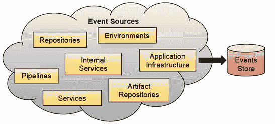

图 9.6 事件源和事件存储

如果我们想使用这些事件来计算指标，我们需要打开信封，读取数据，并根据这些数据聚合和关联这些事件。

这已经证明是一个挑战，因为每个生成 CloudEvents 的工具都可以定义其 CloudEvent 有效负载的架构。我们需要了解每个系统是如何编码有效负载的，以便提取我们用于计算指标所需的数据。如果有一个标准模型，可以快速根据它们对我们软件交付需求的意义来过滤和消费这些事件，那岂不是很好？欢迎 CDEvents ([`cdevents.dev`](https://cdevents.dev))。

### 9.2.1 持续交付的 CloudEvents：CDEvents

CDEvents 只是 CloudEvents，但具有更具体的目的。它们映射到我们持续交付实践的不同阶段。CDEvents 是由持续交付基金会 ([`cd.foundation`](https://cd.foundation)) 推动的倡议，正如其网站定义的，它们专注于在不同与持续交付相关的工具之间实现互操作性：“CDEvents 是持续交付事件的通用规范，使整个软件生产生态系统中的互操作性成为可能” ([`cdevents.dev`](https://cdevents.dev))。

为了提供互操作性，CDEvents 规范定义了四个阶段([`github.com/cdevents/spec/blob/v0.3.0/spec.md#vocabulary-stages`](https://github.com/cdevents/spec/blob/v0.3.0/spec.md#vocabulary-stages))。这些阶段用于将概念上与我们的软件交付生态系统中的不同阶段和工具相关的事件进行分组：

+   *核心*：与任务编排相关的事件通常来自管道引擎。在这里，您可以找到关于“taskRun”和“pipelineRun”主题的事件规范。在此阶段可以找到像“PipelineRun started”或“TaskRun queued”这样的事件。

+   *源代码版本控制*：与源代码变更相关的事件。规范侧重于涵盖“repository”、“branch”和“change”等主题。在此阶段可以找到像“Change created”或“Change Merged”这样的事件。

+   *持续集成*：与构建软件、生成工件和运行测试相关的事件。此阶段涵盖“工件”、“构建”、“testCase”和“testSuite”等主题。在此阶段可以找到像“Artifact published”或“Build finished”这样的事件。

+   *持续部署*：与在不同环境中部署软件相关的事件。此阶段涵盖的主题是“services”和“environments”。在此阶段可以找到像“service deployed”或“environment modified”这样的事件。

+   *持续运营*：与我们的运行服务相关的事件。

图 9.7 显示了这些类别以及每个类别的示例事件。


图 9.7 CDEvents 规范定义的四个阶段

我们可以轻松地使用 CDEvents 来计算我们的软件交付指标，因为它们已经涵盖了这些指标感兴趣的主题。例如，我们可以使用持续部署阶段的事件来计算*部署频率*指标。我们可以结合持续部署事件和源代码版本控制事件来计算*变更领先时间*。

那么，问题随之而来，我们从哪里获取 CDEvents？CDEvents 是一个相对较新的规范，目前正在 CDFoundation 进行孵化，我坚信作为互操作性故事的一部分，这个规范可以作为不同工具和实现的钩子机制，将它们的工具映射到我们可以用来计算所有这些指标的标准模型，同时允许旧系统（以及不发射云事件的工具）也能从中受益。

本章将使用 CDEvents 规范来定义我们的标准化数据模型。我们将使用 CloudEvents 从各种系统中收集信息，并依靠 CDEvents 将传入的事件映射到我们软件交付实践的不同阶段。图 9.8 显示了与软件交付相关的最常见事件来源。

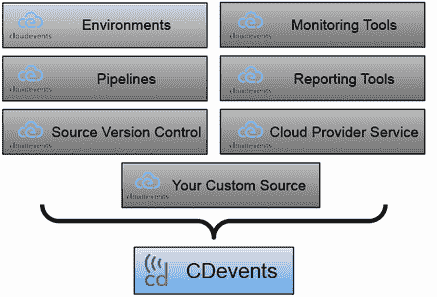

图 9.8 CDEvents 是为持续交付而设计的更专业的 CloudEvents。

工具如 Tekton 已经为 CDEvents 提供了实验性支持 ([`www.youtube.com/watch?v=GAm6JzTW4nc`](https://www.youtube.com/watch?v=GAm6JzTW4nc))，正如我们在下一节中将要看到的，我们可以使用函数将 CloudEvents 转换为 CDEvents。更重要的是，CDEvents 工作组还专注于提供不同语言的软件开发工具包 (SDKs)，这样无论你使用哪种编程语言，都可以构建消费和发射 CDEvents 的应用程序。

下一节将探讨如何构建一个基于 Kubernetes 的解决方案来计算 DORA 指标，并将其扩展以支持不同的指标和事件源。这很重要，以确保使用不同工具的不同平台可以使用它们的性能，并检测早期瓶颈和改进点。请注意，这只是一个示例，说明在不同与 Kubernetes 相关的项目背景下，不同的工具如何相互连接。

### 9.2.2 构建 CloudEvents 基础的指标收集管道

为了计算 DORA 团队提出的指标（部署频率、变更的领先时间、变更失败率和恢复服务的时间），我们需要收集数据。一旦我们有了来自不同系统的数据，我们需要将这些数据转换成标准化的模型，以便我们可以用它来计算指标。然后我们需要处理这些数据以计算每个指标的价值。我们需要存储这些计算的结果，然后我们需要使它们对所有人可用，可能使用一个图形仪表板来总结收集的数据和计算出的指标。

可以使用不同的工具来构建此数据收集、转换和聚合管道。然而，为了构建一个简单且可扩展的解决方案，我们将使用上一章中介绍的一些工具，例如 Knative Serving 来构建我们的聚合和转换函数，CloudEvents 和 CDEvents。我们还将使用 Knative Eventing 事件源，但这个演示可以很容易地扩展以支持任何其他 CloudEvent 源，例如 Argo Events。本节分为三个小节：

+   从事件源收集数据

+   数据转换为 CDEvents

+   指标计算

这些部分与提出的架构一一对应，从高层次来看，类似于图 9.9。

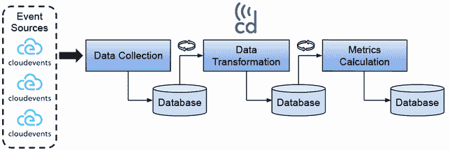

图 9.9 收集和转换数据以计算 DORA 指标

从一个高层次的角度来看，我们需要设计我们的数据收集和转换管道以支持任意数量的事件源，因为不同的公司和实现将收集我们无法预见系统的数据。我们在数据进入我们的系统之前就要求数据以 CloudEvents 的形式。如果您有不符合 CloudEvents 规范的事件源，您必须调整它们的数据以符合规范。这可以通过使用 CloudEvents SDKs（[`cloudevents.io/`](https://cloudevents.io/) > SDKs 部分）轻松实现，以包装您现有的事件以符合规范。

一旦数据进入我们的系统，我们将将其存储在持久存储中。在这种情况下，我们使用 PostgreSQL 数据库来存储所有传入的数据和计算。组件不会直接调用下一阶段（数据转换）。相反，每个组件定期从数据库中获取数据，并处理尚未处理的所有数据。这个阶段（数据转换）将已存储在数据库中的传入 CloudEvents 转换为用于计算指标的 CDEvents 结构。一旦转换到 CDEvents 结构，结果将存储在我们 PostgreSQL 数据库的单独表中。最后，“指标计算”阶段定期从数据库中读取所有未处理的新 CDEvents 并计算我们定义的指标。

这种简单的架构使我们能够根据接收到的数据插入新的数据源、新的转换逻辑，以及最终为您的特定领域指标（不仅限于 DORA 指标）的新指标计算逻辑。同样重要的是要注意，一旦我们保证传入的数据被正确存储，如果指标数据丢失，所有转换和计算都可以重新计算。让我们更深入地看看计算最简单的 DORA 四个关键指标“部署频率”所需的阶段。

### 9.2.3 从事件源收集数据

如图 9.9 所示，我们希望从多个来源消费数据，但我们已将 CloudEvents 设置为标准输入格式。虽然 CloudEvents 已被广泛采用，但许多系统仍然不支持该标准。本节将探讨 Knative Sources 作为一种机制，可以声明性地定义我们的事件源，并将非 CloudEvent 数据转换为 CloudEvents。

提出的解决方案随后暴露了一个 REST 端点以接收传入的 CloudEvents。一旦我们有了 CloudEvents，我们将验证数据并将其存储在一个名为`cloudevents_raw`的 PostgreSQL 表中。让我们看看 Knative Eventing 的事件源，因为我们只需安装和配置这些事件源，它们就可以自动为我们生成事件。

### 9.2.4 Knative Eventing 事件源

使用 Knative Eventing 事件源，您可以安装现有的事件源或创建新的事件源。图 9.10 显示了一些开箱即用的事件源以及这些事件将如何路由到我们的数据转换管道的数据收集步骤。

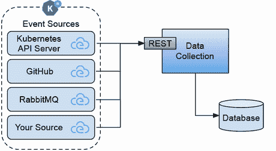

图 9.10 Knative Sources 和数据收集

Knative Eventing 提供了几个 Knative Eventing 事件源，由 Knative 社区和不同的软件供应商提供。以下列表并不详尽，但它涵盖了您可能想要用于计算您的指标的一些源：

+   APIServerSource

+   PingSource

+   GitHubSource

+   GitLabSource

+   RabbitMQSource

+   KafkaSource

在[`knative.dev/docs/eventing/sources/#third-party-sources`](https://knative.dev/docs/eventing/sources/#third-party-sources)检查第三方源的完整列表。这些源将事件转换，例如，从 Kubernetes API 服务器、GitHub 或 RabbitMQ AMQP 消息转换为 CloudEvents。

如果您想使用可用的 Knative Sources 之一，例如 `APIServerSource`，您只需确保源已安装到您的集群中，然后根据您的需求配置源（参见列表 9.1）。为了计算部署频率指标，我们将利用与部署相关的 Kubernetes 事件。您可以通过定义一个 `APIServerSource` 资源来声明性地配置源以及事件将被发送到何处。

列表 9.1 Knative Source APIServerSource 定义

```
apiVersion: sources.knative.dev/v1
kind: ApiServerSource                         ①
metadata:
 name: main-api-server-source                 ②
spec:
 serviceAccountName: api-server-source-sa     ③
 mode: Resource
 resources:
   - apiVersion: v1
     kind: Event                              ④
 sink:                                        ⑤
   ref:
     apiVersion: v1
     kind: Service
     name: cloudevents-raw-service
     namespace: dora-cloudevents
```

① ApiServerSource 是我们用来配置从 Kubernetes 事件流中读取的 Knative ApiServerSource 组件的资源类型（[`www.cncf.io/blog/2021/12/21/extracting-value-from-the-kubernetes-events-feed/`](https://www.cncf.io/blog/2021/12/21/extracting-value-from-the-kubernetes-events-feed/)），将这些事件转换为 CloudEvents，并将它们发送到接收器（目标目的地）。

② 与每个 Kubernetes 资源一样，我们需要为此资源定义一个名称。我们可以配置任意数量的 ApiServerSource。

③ 由于我们从 Kubernetes API 服务器读取事件，我们需要有访问权限。因此，需要存在一个 ServiceAccount 以启用 ApiServerSource 组件从内部事件流中读取。您可以检查为使此 ApiServerSource 资源正常工作所需的 ServiceAccount、Role 和 RoleBinding 资源，请参阅[`github.com/salaboy/platforms-on-k8s/blob/main/chapter-9/dora-cloudevents/api-serversource-deployments.yaml`](https://github.com/salaboy/platforms-on-k8s/blob/main/chapter-9/dora-cloudevents/api-serversource-deployments.yaml)。

④ 如前所述，此源对类型为 Event 的资源感兴趣。

⑤ 在接收器部分，我们定义了我们希望将从这个源生成的 CloudEvents 发送到何处。在这种情况下，我们使用了一个指向名为 cloudevents-raw-service 的 Kubernetes 服务的服务引用，该服务位于 four-keys 命名空间中。Knative 源在引用其他 Kubernetes 资源时，会检查这些资源是否存在，并且只有当目标服务被找到时才会准备就绪。或者，如果服务不在 Kubernetes API 上下文中，我们也可以指向一个 URI，但我们会失去这个有价值的检查，这可以帮助我们解决将事件发送到不存在端点的情况。

如您所想，`ApiServerSource`将生成大量的事件，这些事件被发送到`cloudevents-raw-service`并存储在 PostgreSQL 数据库中。我们只能配置更复杂的路由和过滤来转发我们感兴趣的事件，但我们也可以在下一阶段应用过滤，从而实现一种方法，使我们能够在数据收集过程演变时添加更多指标。使用这个源，每当创建、修改或删除新的部署资源时，我们都会接收到一个或多个 CloudEvents 并将它们存储在数据库中。

如果您已经有了一个正在生成事件的系统但需要 CloudEvents，您可以创建自己的自定义 Knative Eventing 事件源。查看以下教程以获取有关如何执行此操作的更多信息：[`knative.dev/docs/eventing/custom-event-source/custom-event-source/`](https://knative.dev/docs/eventing/custom-event-source/custom-event-source/)。

声明和管理您的事件源使用 Knative Eventing 事件源的一个大优点是，您可以像查询任何其他 Kubernetes 资源一样查询您的源，监控和管理它们的状态，并在出现问题时使用 Kubernetes 生态系统中的所有工具进行故障排除。一旦 CloudEvents 存储在我们的数据库中，我们就可以分析它们并将它们映射到 CDEvents 以进行进一步计算。

### 9.2.5 数据转换为 CDEvents

现在我们已经在我们的 PostgreSQL 数据库中有 CloudEvents，我们已经验证了它们是有效的 CloudEvents。我们希望将其中一些非常通用的 CloudEvents 转换为 CDEvents，我们将使用它们来计算我们的指标。

如介绍中所述，这些转换将取决于您试图计算哪种类型的指标。对于这个例子，我们将查看与部署资源相关的内部 Kubernetes 事件来计算部署频率指标，但可以使用完全不同的方法。例如，您不必查看 Kubernetes 内部事件，也可以查看 ArgoCD 事件或 Tekton Pipeline 事件来监控何时触发部署，但来自集群外部。图 9.11 显示了将 CloudEvent 映射到 CDEvents 所需的映射和转换过程。


图 9.11 从 CloudEvents 到 CDEvents 的映射和转换

我们需要一种方法将一个非常通用的 CloudEvent 映射到具体的 CDEvent，以指示服务部署已发生或已更新。这种映射和转换逻辑可以用任何编程语言编写，因为我们只处理 CloudEvents 和 CDEvents。由于我们可能接收到的事件量很大，因此不阻塞并处理所有到达的事件至关重要。因此，这里选择了更异步的方法。数据转换逻辑被安排在固定的时间间隔，这可以根据我们希望/能够处理传入事件的多寡进行配置。

在这个例子中，我们将映射和转换具有`type`等于`dev.knative.apiserver.resource.add`和`data.InvolvedObject.Kind`等于`Deployment`的传入事件到类型为`dev.cdevents.service.deployed.0.1.0`的 CDEvent。这种转换特别符合我们的需求，因为它将来自 Knative APIServerSource 的事件与 CDEvents 规范中定义的事件相关联，如图 9.12 所示。


图 9.12 部署的实体映射和 CDEvent 创建

为了计算不同的指标，我们需要更多的这些转换。一个选择是将所有转换逻辑添加到一个单独的容器中。这种方法将允许我们将所有转换作为一个单一单元进行版本控制，但同时也可能使编写新转换的团队复杂化或受限，因为他们只有一个地方可以更改代码。我们可以采取的另一种方法是使用基于函数的方法，我们可以提升创建单一用途函数来执行这些转换。通过使用函数，只有当前正在转换事件的函数才会运行。所有未被使用的函数都可以进行降级。如果我们有太多事件需要处理，可以根据流量需求进行函数的升级。

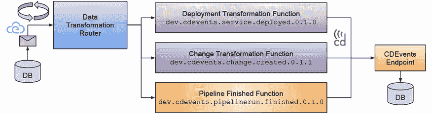


如图 9.13 所示，需要一个新组件来路由从数据库中读取的 CloudEvents 到具体的函数。每个转换函数可以通过检查其有效载荷、使用外部数据源丰富内容或简单地将整个 CloudEvent 包装成 CDEvent 来转换传入的 CloudEvent。

数据转换路由组件必须足够灵活，以便允许将新的转换函数插入到系统中，并允许多个函数处理同一事件（同一个 CloudEvent 被发送到一个或多个转换函数）。

转换和映射函数不需要关心 CDEvents 如何持久化。这使我们能够保持这些函数简单且仅关注转换。一旦转换完成并生成新的 CDEvent，函数将事件发送到 CDEvents 端点组件，该组件将 CDEvent 存储在我们的数据库中。

在转换完成后，我们将在数据库中存储零个或多个 CDEvents。这些 CDEvents 可以被我们在下一节中将要查看的指标计算函数使用。

### 9.2.6 指标计算

为了计算我们的指标（DORA 或自定义指标），我们将使用与 CDEvents 转换和映射相同的基于函数的方法。在这种情况下，我们将编写用于计算不同指标的函数。因为每个指标都需要从不同的事件和可能系统中聚合数据，所以每个指标计算函数可以实现不同的逻辑，见图 9.14。用于计算指标的机制取决于编写计算代码的开发者。

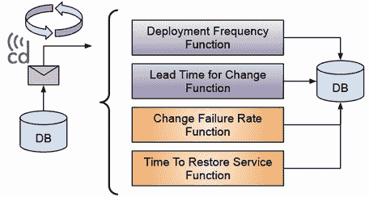

图 9.14 使用函数计算 DORA 指标

为了计算指标，每个函数可以被配置为从数据库中获取非常具体的 CDEvents，并且根据我们需要为特定指标获取更新的频率不同，有不同的时间段。指标结果可以存储在数据库中或发送到外部系统，具体取决于你想要如何处理计算出的数据。

如果我们以计算更具体的部署频率指标为例，我们需要实现一些自定义机制和数据结构来跟踪该指标，如图 9.15 所示。

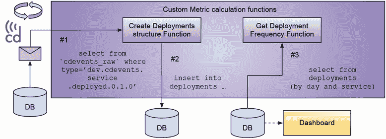

图 9.15 部署频率计算流程

计算部署频率指标的简化流程如图 9.15 所示，其中步骤#1 是从`cdevents_raw`表中获取与部署相关的 CDEvents。`Create Deployments structure function`负责读取类型为`dev.cdevents.service.deployed.0.1.0`的 CDEvents，检查有效载荷和元数据，并创建一个可以稍后查询的新结构。步骤#2 负责将这个新结构持久化到我们的数据库中。这个结构的主要目的是使我们的数据更容易和更高效地查询我们正在实施的指标。在这种情况下，创建了一个新的`deployment`结构（和表）来记录我们想要用于计算部署频率指标的数据。在这个简单的例子中，部署结构包含服务的名称、时间戳和部署的名称。在步骤#3 中，我们可以使用这些数据通过服务获取我们的部署频率，并按日、周或月显示这些信息。这些函数需要是无状态的，这意味着我们可以使用相同的 CDEvents 作为输入重新触发指标的计算，并且应该获得相同的结果。

可以向此流程添加优化；例如，可以创建一个自定义机制来避免重新处理已经处理过的 CDEvents。这些定制可以被视为每个指标的内部机制，开发者应该能够根据需要添加与其他系统和工具的集成。为了示例的目的，`获取部署频率函数`可以从数据库中检索指标。然而，在更现实的场景中，你可以有一个仪表板直接查询存储简化结构的数据库，因为许多仪表板解决方案都提供了开箱即用的 SQL 连接器。

既然我们已经覆盖了计算部署频率指标的流程，让我们看看一个工作示例，其中我们将安装所有用于数据收集、数据转换和指标计算所需的组件。

### 9.2.7 工作示例

本节将探讨一个工作示例，展示我们如何结合数据收集、将数据转换为 CDEvents 以及为我们基于 Kubernetes 的平台进行指标计算。它涵盖了一个非常基础的示例以及如何安装和运行计算部署频率指标所需组件的逐步教程（[`github.com/salaboy/platforms-on-k8s/blob/main/chapter-9/dora-cloudevents/README.md`](https://github.com/salaboy/platforms-on-k8s/blob/main/chapter-9/dora-cloudevents/README.md)）。

在本例中实现的架构将前几节中定义的阶段组合在一起：数据收集、数据转换和指标计算。该架构涵盖的主要方面之一是数据转换和指标计算组件的可扩展性和可插拔性。该架构假设我们将以 CloudEvents 的形式收集数据，因此用户负责将他们的事件源转换为 CloudEvents 以使用此架构。

图 9.16 展示了所有组件如何相互关联，以提供决定我们想要收集哪些事件以及如何将它们转换为 CDEvents 以计算 DORA 指标的功能。

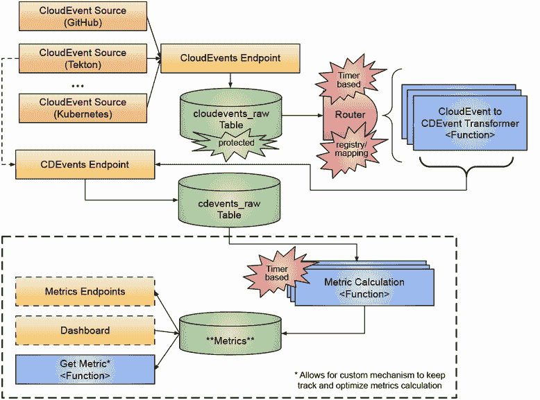

图 9.16 捕获和计算 DORA 指标的示例架构

虽然该架构最初可能看起来很复杂，但它被设计成允许收集和处理来自各种来源的事件所需的自定义扩展和映射。

按照逐步教程，你将创建一个新的 Kubernetes 集群来安装收集 CloudEvent 和计算指标所需的所有组件。然而，架构并不局限于单个集群。在你创建并连接到集群后，你将安装如 Knative Serving 这样的工具用于我们的函数运行时，以及仅用于我们的事件源的 Knative Eventing。一旦集群准备就绪，你将创建一个新的`namespace`来托管所有积极处理收集数据的组件，以及一个 PostgreSQL 实例来存储我们的事件。

存储事件和指标

一旦我们有了数据库来存储事件和指标信息，我们需要为我们的组件创建存储和读取事件的表。对于这个例子，我们将创建以下表：`cloudevents_raw`、`cdevents_raw`和`deployments`，如图 9.17 所示。

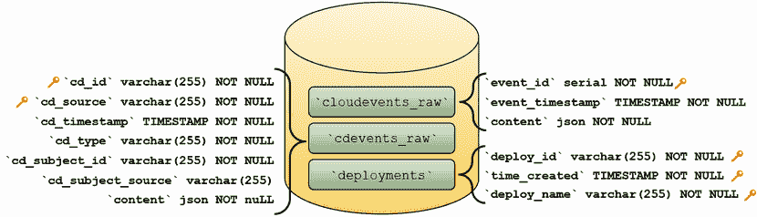

图 9.17 表格、CloudEvents、CDEvents 和指标计算

让我们看看我们将要存储在这三个表中的信息。`cloudevents_raw`表存储了来自不同来源的所有传入 CloudEvent。这个表的主要目的是数据收集：

+   这个表的架构非常简单，只有三个列：

    +   `event_id`: 这个值由数据库生成。

    +   `event_timestamp`: 存储事件接收的时间戳。这可以用于稍后对事件进行重新处理排序。

    +   `content`: 存储 CloudEvent 序列化的 JSON 版本在一个 JSON 列中。

+   这个表尽可能保持简单，因为我们不知道我们会得到什么类型的云事件，在这个阶段，我们不想反序列化和读取有效负载，因为这可以在数据转换阶段完成。

`cdevents_raw`表存储了我们过滤和转换所有传入的 CloudEvent 后感兴趣存储的所有 CDEvent。由于 CDEvent 更具体，并且我们关于这些事件的元数据更多，因此这个表有更多的列：

+   `cd_id`: 存储原始 CloudEvent 的 ID。

+   `cd_timestamp`: 存储原始 CloudEvent 接收的时间戳。

+   `cd_source`: 存储原始 CloudEvent 生成的来源。

+   `cd_type`: 存储并允许我们根据不同的 CDEvent 类型进行过滤。存储在这个表中的 CDEvent 类型由我们设置中运行的转换函数定义。

+   `cd_subject_id`: 存储与该 CDEvent 关联的实体的 ID。这个信息是在我们的转换函数分析原始 CloudEvent 的内容时获得的。

+   `cd_subject_source`: 存储与该 CDEvent 关联的实体的来源。

+   `content`: 我们 CDEvent 的 JSON 序列化版本，其中包含原始 CloudEvent 作为有效负载。

`deployments` 表是自定义的，用于计算部署频率指标。用于计算不同指标的自定义表中存储的内容没有规则。为了简化，此表只有三个列：

+   `deploy_id`: 用于识别服务部署的 ID。

+   `time_created`: 部署创建或更新的时间。

+   `deploy_name`: 用于计算指标的部署名称。

一旦我们准备好了存储事件和指标数据的表，我们需要让事件流进入我们的组件，为此，我们需要配置事件源。

配置事件源

最后，在安装数据转换或指标计算函数之前，我们将从 Knative Eventing 配置 Kubernetes API 服务器事件源以检测新部署的创建。见图 9.18。

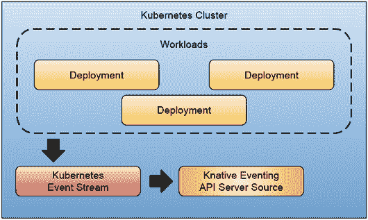

图 9.18 使用 Knative Eventing API 服务器源的示例。我们可以通过使用 Knative Eventing API 服务器源来访问 Kubernetes 事件流，该源将内部事件转换为 CloudEvents，这些事件可以被路由到不同的系统进行过滤和处理。

在这里，您可以使用任何 CloudEvent 兼容的数据源。Knative API 服务器源是展示如何轻松消费和路由事件进行进一步处理的示例。

检查类似 Argo Events ([`argoproj.github.io/argo-events/`](https://argoproj.github.io/argo-events/)) 和其他 Knative Eventing 源 ([`knative.dev/docs/eventing/sources/`](https://knative.dev/docs/eventing/sources/)) 的项目，以熟悉开箱即用的功能。还要检查 CloudEvents 规范采用者列表 ([`cloudevents.io/`](https://cloudevents.io/))，因为所有这些工具都已经生成 CloudEvents，您可以使用它们进行消费并将它们映射到计算指标。

部署数据转换和指标计算组件

现在我们有了存储事件和指标数据的地方，事件源已配置并准备好在用户与我们的集群交互时发出事件，我们可以部署将接收这些事件、过滤它们并将它们转换为计算部署频率指标的组件。逐步教程部署以下组件：

+   *CloudEvents 端点:* 提供一个 HTTP 端点以接收 CloudEvents 并将它们连接到数据库进行存储。

+   *CDEvents 端点:* 提供一个 HTTP 端点以接收 CDEvents 并将它们连接到数据库进行存储。

+   *CloudEvents 路由器:* 从数据库中读取 CloudEvents 并将它们路由到配置的转换函数。此组件允许用户将他们的转换函数插入以将 CloudEvent 转换为 CDEvent 以进行进一步处理。CloudEvents 路由器通过从数据库中检索未处理的事件定期运行。

+   *(CDEvents)转换函数:* 用户可以定义转换函数并将 CloudEvents 映射到 CDEvents。这里的想法是使用户能够添加所需的所有函数来计算 DORA 和其他指标。

+   *(部署频率)计算函数:* 指标计算函数提供了一种通过从数据库中读取 CDEvents 来计算不同指标的方法。如果需要，这些函数可以将计算出的指标存储在自定义数据库表中。

+   *(部署频率)* *指标端点:* 这些指标端点可以可选地暴露给应用程序以消费计算出的指标。或者，仪表板可以直接从数据库查询数据。

图 9.19 展示了 CloudEvents 如何流经我们已安装的不同组件。

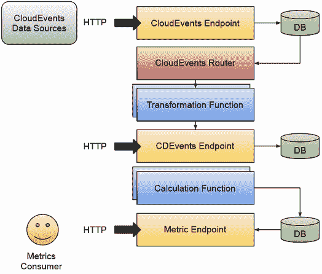

图 9.19 数据从数据源流向产生 CloudEvents 的 CloudEvents 端点，其唯一任务是将这些事件存储到事件存储中。从那里，CloudEvents Router 拥有逻辑来决定将事件路由到转换函数，这使我们能够将 CloudEvents 映射到 CDEvents 以进行进一步处理。一旦我们有了 CDEvents，计算函数就可以读取这些事件来聚合数据并产生指标。指标消费者可以通过与指标端点交互来获取指标，该端点将从指标数据库中检索计算出的指标。

一旦我们的组件启动并运行，我们就可以开始使用我们的集群来生成由这些组件过滤和处理的事件，以产生部署频率指标。

部署频率指标针对您的部署

我们需要将新的工作负载部署到我们的集群中，以计算部署频率指标。教程包括所有转换和指标计算函数，以监控来自部署资源的事件。

当开发团队能够创建和更新他们现有的部署时，平台团队能够透明地监控平台效率，以便团队能够执行他们的工作。图 9.20 显示了涉及的团队以及本例中如何计算指标。

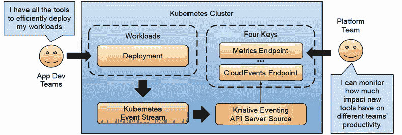

图 9.20 组件和数据流以测量性能指标

最后，如果您在 KinD 上运行示例，您可以`curl`以下端点。

```
> curl http://dora-frequency-endpoint.dora-cloudevents.127.0.0.1.sslip.io/
➥deploy-frequency/day | jq
```

您应该看到以下类似列表。

列表 9.2 获取部署频率指标

```
[
   {
      "DeployName":"nginx-deployment-1",
      "Deployments":3,
      "Time":"2022-11-19T00:00:00Z"
   },
   {
      "DeployName":"nginx-deployment-3",
      "Deployments":1,
      "Time":"2022-11-19T00:00:00Z"
   }
]
```

转换和指标计算函数每分钟调度运行一次。因此，这些指标只有在函数执行完毕后才会返回。或者，您可以使用 Grafana 这样的仪表板解决方案来连接到我们的 PostgreSQL 数据库并配置指标。仪表板工具可以专注于存储特定指标数据的表。对于我们的部署频率示例，`deployments`表是唯一与显示指标相关的表。

我强烈建议您检查示例并尝试在本地运行它，遵循逐步教程，如果您有问题或想帮助改进它，请与我联系。修改示例以不同方式计算指标或添加您自定义的指标将为您提供这些指标计算复杂性的良好概述，同时，这也说明了为什么让我们的应用开发和运维团队能够几乎实时地了解情况是多么重要。

在下一节中，我们将探讨 Keptn 生命周期工具包 ([`keptn.sh`](https://keptn.sh))，这是一个开源的 CNCF 项目，它构建了不同的机制，不仅用于监控、观察和计算我们云原生应用的指标，而且在预期之外或需要与其他系统集成时也能采取行动。

## 9.3 Keptn 生命周期工具包

Keptn 生命周期工具包 (KLT) 是一个云原生生命周期编排工具包。KLT 专注于部署可观察性、部署数据访问和部署检查编排。Keptn 不仅关注监控和观察我们的工作负载的状态，而且还提供了在出现问题时进行检查和采取行动的机制。

正如我们在上一节中看到的，获取基本指标，如部署频率，可以非常有助于衡量团队的表现。虽然部署频率只是一个指标，但我们可以用它来开始衡量我们的早期平台倡议。在本节中，我想展示 KLT 如何通过采用与第 9.2 节中讨论的不同但互补的方法来帮助您完成这项任务。

Keptn 扩展了 Kubernetes 调度器组件（它决定我们的工作负载将在我们的集群上运行的位置），以监控和提取关于我们工作负载的信息，如图 9.21 所示。这种机制使得团队可以通过提供 Keptn 任务定义资源来设置自定义的预/后部署任务。Keptn 正在计划使用 Kubernetes 内置的调度门功能，这是一个在撰写本文时被提议给 Kubernetes 社区的功能 ([`mng.bz/PRW2`](http://mng.bz/PRW2))。

注意：您可以通过以下链接跟随一个逐步教程，以了解 Keptn 的实际操作：[`github.com/salaboy/platforms-on-k8s/blob/main/chapter-9/keptn/README.md`](https://github.com/salaboy/platforms-on-k8s/blob/main/chapter-9/keptn/README.md)。

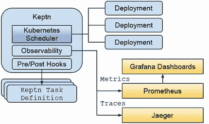

图 9.21 Keptn 架构提供即插即用的可观察性和应用程序生命周期钩子。

Keptn 使用标准的 Kubernetes 注解来识别哪些应用程序希望被监控和管理。我为 Conference 应用程序包含了以下注解，以便 Keptn 了解我们的服务。Agenda 服务部署资源包括以下注解，如列表 9.3 所示 ([`github.com/salaboy/platforms-on-k8s/blob/main/conference-application/helm/conference-app/templates/agenda-service.yaml#L14`](https://github.com/salaboy/platforms-on-k8s/blob/main/conference-application/helm/conference-app/templates/agenda-service.yaml#L14))。

列表 9.3 Kubernetes 标准应用程序注解

```
app.kubernetes.io/name: agenda-service
app.kubernetes.io/part-of: agenda-service
app.kubernetes.io/version: v1.0.0
```

Keptn 现在已经了解 Agenda 服务，并且可以监控和执行与此服务生命周期相关的操作。注意 `part-of` 注解，它允许我们监控单个服务并将一组服务分组在同一个逻辑应用下。这种分组允许 Keptn 为每个服务以及逻辑应用（共享相同 `app.kubernetes.io/part-of` 注解值的多个服务组）执行部署前后的操作。本例中没有使用该功能，因为我希望保持内容简单并专注于单个服务。

逐步教程安装了 Keptn、Prometheus、Grafana 和 Jaeger，以便我们了解 Keptn 的功能。一旦 Keptn 在您的集群中安装完成，您需要让 Keptn 知道哪些命名空间需要被监控，通过在命名空间资源上添加 Keptn 注解来实现。您可以通过运行以下命令在默认命名空间中启用 Keptn：

```
kubectl annotate ns default keptn.sh/lifecycle-toolkit="enabled"
```

一旦 Keptn 开始监控特定的命名空间，它将寻找带有注解的部署以开始获取 Keptn 应用程序 Grafana 仪表板可以消费的指标，如图 9.22 所示。

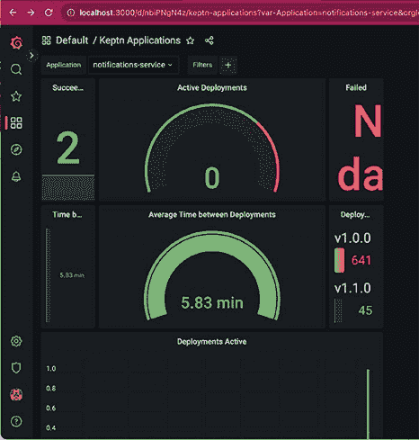

图 9.22 通知服务的 Keptn 应用程序 Grafana 仪表板

此仪表板显示了我们在默认命名空间中运行带有注解的部署（所有 Conference 应用程序的服务）的部署频率。在逐步教程中，我们对通知服务部署进行更改，以便 Keptn 可以检测到更改并在仪表板中显示新版本。如图 9.22 所示，部署的平均时间为 5.83 分钟。在旁边，您可以确切地看到部署 v1.0.0 和 v1.10 所花费的时间。这些仪表板可供每个服务的责任团队使用，有助于提供整个发布新版本过程的可见性。从第一天起就有这些信息可以帮助展示团队改进工作流程或找到可以轻松解决的瓶颈和重复性问题。

除了获得所有这些信息和前面提到的开箱即用的指标外，KLT 还更进一步，通过提供执行预/部署任务的钩子点。我们可以使用这些任务在发布前验证环境状态，向值班团队发送通知，或者只是审计流程。部署后，我们可以使用部署后钩子运行验证测试，向客户发送关于更新的自动化通知，或者只是祝贺团队出色的表现。

Keptn 引入了 KeptnTaskDefinitions 资源，它支持 Deno ([`deno.land/`](https://deno.land/))、Python3 或任何容器镜像引用 ([`lifecycle.keptn.sh/docs/yaml-crd-ref/taskdefinition/`](https://lifecycle.keptn.sh/docs/yaml-crd-ref/taskdefinition/)) 来定义任务行为。用于逐步教程的 KeptnTaskDefinition 资源相当简单，看起来像列表 9.4。

列表 9.4 使用 Deno 的 Keptn TaskDefinition

```
apiVersion: lifecycle.keptn.sh/v1alpha3
kind: KeptnTaskDefinition
metadata:
  name: stdout-notification                          ①
spec:
  function:
    inline:
      code: |
        let context = Deno.env.get("CONTEXT");      ②
        console.log("Keptn Task Executed with context: \n");
        console.log(context);
```

① 团队将使用此资源名称来定义此任务将在哪里执行。这是一个可重用的任务定义，因此可以从不同服务的生命周期钩子中调用它。

② 我们可以通过调用 Deno.env.get("CONTEXT") 来访问正在执行的任务的上下文。这为我们提供了创建任务时使用的所有详细信息，例如哪个工作负载请求执行此任务。

要将任务定义与我们的某个服务绑定，我们在部署中使用 Keptn 特定的注释：

```
 keptn.sh/post-deployment-tasks: stdout-notification
```

此注释将配置 Keptn 在更改通知服务部署并部署新版本后执行此任务。Keptn 将创建一个新的 Kubernetes Job 来运行 KeptnTaskDefinition。这意味着您可以通过查看默认命名空间中的作业执行来查询所有预/部署任务定义的执行。

通过使用注释和 KeptnTaskDefinitions，平台工程团队可以创建一个共享任务库，团队可以在他们的工作负载中重用这些任务，或者更好的是，他们可以使用突变 Webhook 或 OPA 这样的策略引擎自动突变部署资源以添加 Keptn 注释。

如果你更改了通知服务部署并跟踪日志，你应该会看到以下内容（列表 9.5）。

列表 9.5 TaskDefinition 执行的预期输出

```
Keptn Task Executed with context: 
{
  "workloadName":"notifications-service-notifications-service",
  "appName":"notifications-service",
  "appVersion":"",
  "workloadVersion":"v1.1.0",
  "taskType":"post",
  "objectType":"Workload"
}
```

如果你查看图 9.23 中的 Jaeger，你可以通过查看 Keptn 生命周期操作符跟踪来了解部署我们通知服务新版本所涉及的所有步骤。

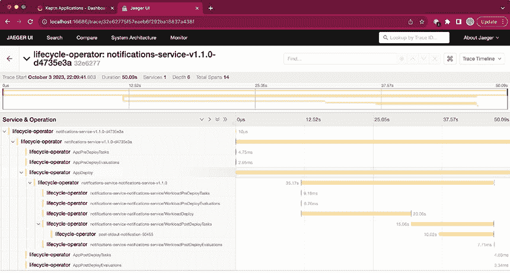

图 9.23 Keptn 生命周期操作符跟踪服务更新

如果你在你自己的环境中运行逐步教程，你可以看到在服务的新版本启动并运行后，部署后钩子正在被安排。

在这个简短的章节中，我们学习了 Keptn 生命周期工具包能为我们做什么的基础知识，以及我们如何从第一天开始就受益于这些指标，以及我们如何通过使用声明性方式添加预/部署任务来增加对我们服务生命周期的控制。

我强烈建议您查看 Keptn 网站以及他们提供的其他更高级的机制，例如评估（[`lifecycle.keptn.sh/docs-klt-v0.8.1/concepts/evaluations/`](https://lifecycle.keptn.sh/docs-klt-v0.8.1/concepts/evaluations/))，它允许我们做出决策，甚至可以阻止不符合某些要求（如内存消耗增加或 CPU 使用过多）的部署。

虽然 Keptn 使用的方法与第 9.2 节中描述的方法完全不同，但我坚信这些方法是互补的。我希望看到 Keptn 和 CloudEvents 之间的进一步集成。如果您对这个话题感兴趣，我鼓励您加入[`github.com/keptn/lifecycle-toolkit/issues/1841`](https://github.com/keptn/lifecycle-toolkit/issues/1841)的讨论。

## 9.4 平台工程之旅的下一步是什么？

本章涵盖的示例强调了衡量我们的技术决策的重要性。无论好坏，每个决策都会影响所有参与软件交付的团队。

我们平台内建这些指标可以帮助我们衡量改进并证明投资于促进我们的软件交付实践的工具有价值。如果我们想在平台中包含一个新工具，你可以测试你的假设并衡量每个工具或采用的方法的影响。让这些指标对所有团队都易于访问和可见是一种相当常见的做法，这样当事情出错或工具不符合预期时，你将会有确凿的证据来支持你的主张。

从平台工程的角度来看，我强烈建议不要将这个话题留到最后一刻（就像我在书中这一章所做的那样）。使用 KLT 等工具，你可以以较小的投入获得洞察力，并使用在业界被广泛理解的标准化监控技术。研究 CloudEvents 和 CDEvents 是值得的，不仅从监控和指标计算的角度来看，而且对于与其他工具和系统的基于事件的集成来说也是如此。图 9.24 显示，通过利用我们在黄金路径中使用的工具的事件源，我们可以让我们的团队能够了解他们的决策如何影响整个软件交付链。

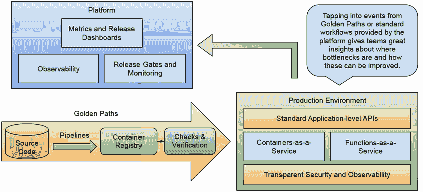

图 9.24 我们平台提供的黄金路径和工作流程是计算团队性能指标的最佳原始信息来源。

确保您的平台的基本指标可以计算，这将帮助您的团队思考每个发布版本的端到端流程——瓶颈在哪里，他们花了或浪费了大部分时间在哪里。如果 DORA 指标对您的组织来说太难实施，您可以专注于衡量您平台上的黄金路径或主要工作流程。例如，根据第六章提供的示例，您可以衡量配置开发环境所需的时间，提供哪些功能，以及团队多久请求一次新实例，如图 9.25 所示。

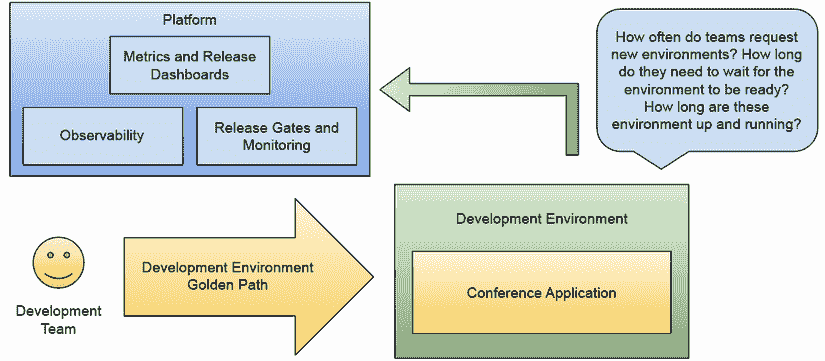

图 9.25 平台和应用行走骨架指标

通过收集指标，不仅来自客户应用程序，还来自平台特定的流程，如创建开发环境，您的团队将能够全面了解他们使用的工具以及工具的变化如何影响和释放软件交付的速度。图 9.26 展示了我们平台之旅的回顾以及这些指标对我们平台团队的重要性。记住，如果您正在衡量您的平台项目，您的平台将会变得更好。

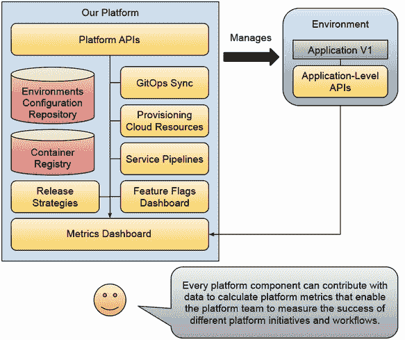

图 9.26 利用平台组件收集数据和计算指标

## 9.5 最后的想法

我希望阅读这本书的示例已经给您提供了足够的实践经验来应对现实生活中的挑战。虽然这里涵盖的示例并不全面或深入，但目的是展示平台工程团队必须处理的各种主题。云原生空间正在不断演变，我在写这本书时评估的工具在两年内已经完全改变，推动全球团队在决策上非常灵活。犯错误和审查决策是平台工程师必须为小型和大型组织做的日常工作的一部分。

回到这本书的开头，平台工程师必须将这些决策封装在可以维护和演化的平台 API 之后，因此了解不同团队所需的能力对于成功进行平台工程之旅至关重要。提供自助服务功能和关注团队的需求应该是平台工程师优先事项列表上的重要影响因素。

不幸的是，我没有无限的页面或无限的时间来不断添加内容到这本书中，但我尽力包括了我在云原生空间工作期间看到组织和社会面临的话题和挑战。我们已经到达了一个点，在 Kubernetes 生态系统中，工具正在成熟，更多项目正在毕业，这表明越来越多的公司正在重用工具而不是自己构建。

我故意省略了诸如使用自定义控制器扩展 Kubernetes 等主题，因为平衡为您的平台构建的内部构建内容需要由平台工程团队仔细定义。创建和维护您的扩展应留给非常特殊的情况，在这些情况下，没有工具可以解决您试图解决的问题。对于最常见的情况，正如我们在本书中所看到的，CI/CD、GitOps、云中的基础设施配置、开发者工具、平台构建工具和其他工具已经足够成熟，您可以使用并在必要时扩展它们。

将诸如服务网格、策略引擎、可观察性、事件管理、操作工具和云开发环境等主题排除在本书之外是非常困难的。有一些非常棒的项目需要整章来介绍。但作为一个平台工程师，您必须继续研究并关注云原生社区，以了解新的发展和项目如何帮助您的组织团队。

我强烈建议您参与您当地的 Kubernetes 社区，并在开源生态系统中保持活跃。这不仅为您提供了一个极佳的学习游乐场，而且有助于您就采用哪些技术做出正确的知情决策。了解这些项目背后的社区有多强大，对于验证它们是否在解决首先需要解决方案且足够普遍以至于可以用通用（非组织）特定方式解决的问题至关重要。像 OSS Insight ([`ossinsight.io/`](https://ossinsight.io/)) 这样的工具为决策提供了巨大的价值，并确保如果您在开源项目中投入时间和资源，一个活跃的社区将维护您的更改和改进。

最后，请关注我的博客 ([`salaboy.com`](https://salaboy.com))，因为将会有更多与本书相关的文章发表，以探讨我认为对平台工程团队重要的其他主题。如果您对开源感兴趣，扩展或修复本书中提供的示例是一个很好的方式，可以亲身体验大多数开源项目使用的所有工具。

## 摘要

+   使用 DORA 指标可以清楚地了解组织如何向客户交付软件。这可以用来理解导致我们在构建的平台上的改进的瓶颈。使用基于我们软件交付实践的团队绩效指标将帮助您了解您的平台倡议如何影响团队的工作以及整体组织的益处。

+   CloudEvents 标准化了我们消费和发射事件的方式。在过去的几年里，我们看到了 CNCF 生态系统中不同项目对 CloudEvents 的采用率上升。这种采用使我们能够依赖 CloudEvents 来获取有关组件和其他系统的信息，我们可以聚合和收集有助于决策的有用信息。

+   CDEvents 提供了一个 CloudEvents 扩展，这是一组与持续交付软件实践相关的更具体的 CloudEvents。虽然我预计 CDEvents 的采用率会随着时间的推移而增长，但我们已经看到了如何将 CloudEvents 映射到 CDEvents 来计算 DORA 指标。通过使用 CDEvents 作为计算这些指标的基础模型，我们可以将任何事件源映射以贡献这些指标的计算。

+   如果我们能衡量我们的平台，我们将知道需要改进什么以及组织在交付实践中遇到哪些困难。这些指标提供的反馈循环为负责持续改进我们团队日常使用的工具和流程的平台团队提供了宝贵的信息。

+   如果你遵循了本章的逐步教程，你将获得实际操作经验，包括设置 CloudEvent 源、监控部署以及 CDEvents 如何帮助我们标准化关于软件交付生命周期的信息。你还安装了 Keptn 作为另一种监控工作负载和执行预/后部署任务以验证新版本是否按预期工作的方法。
