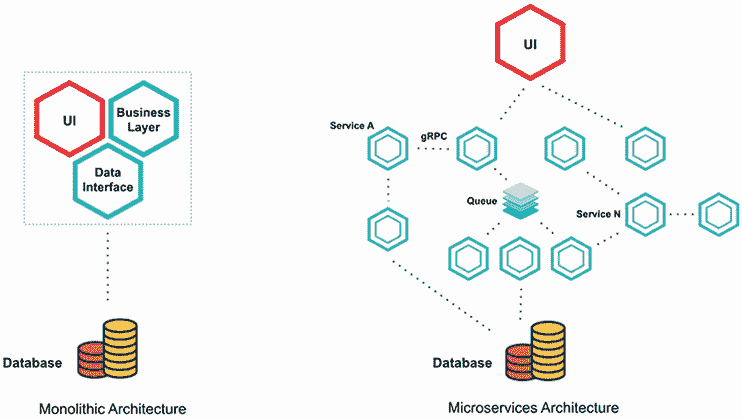
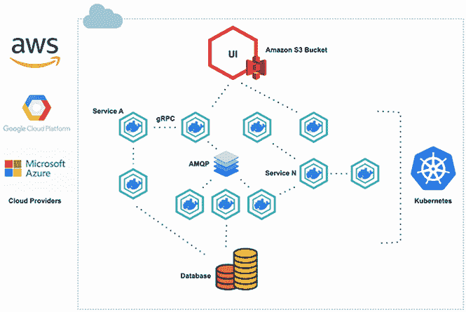
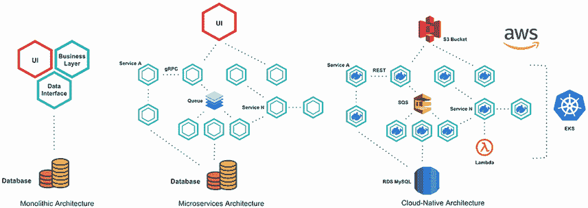
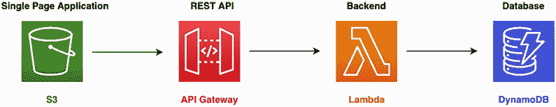
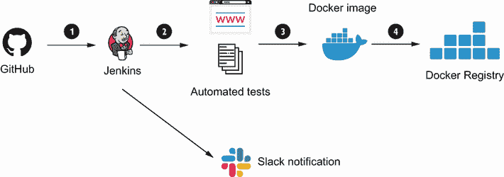
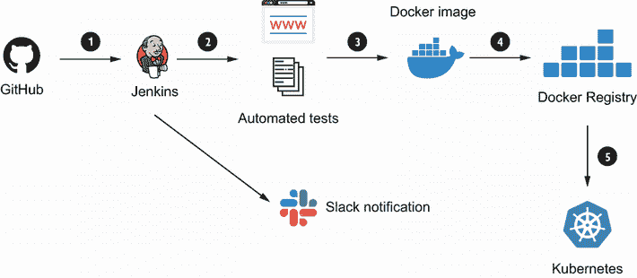
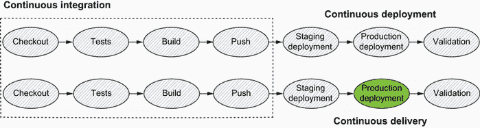
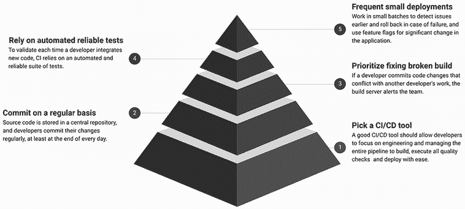
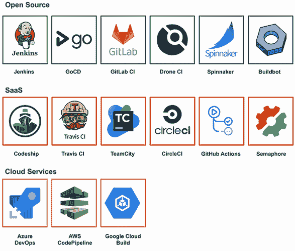

# 1 什么是 CI/CD？

本章涵盖

+   组织从单体应用向云原生应用演变的路径

+   实施 CI/CD 实践对云原生架构的挑战

+   持续集成、部署和交付概述

+   如何通过像 Jenkins 这样的 CI/CD 工具为进行持续一切旅程的组织带来商业价值

软件开发和运维最近经历了几次范式转变。这些转变为行业提供了构建和部署应用的创新方法。更重要的是，两次重大的范式转变巩固了开发、部署和管理可扩展应用的能力：云原生架构和 DevOps。

*云原生架构* 随着云的采用而出现，云服务提供商如亚马逊网络服务（AWS）、谷歌云平台（GCP）和微软 Azure 拥有基础设施的所有权。开源工具如 Kubernetes、Docker 和 Istio 提供了横向扩展能力，让开发者能够构建和运行现代可扩展应用，无需担心底层基础设施。因此，运营开销降低，应用的开发速度提高。

*DevOps* 桥梁了开发者和运维团队之间的鸿沟，通过协作、自动化工具以及迭代和敏捷开发和部署恢复了和谐。

结合这两种重大且强大的方法，组织现在有能力创建具有高度团队协作和信息共享的、可扩展、稳健和可靠的应用程序。然而，为了构建、测试和安全地部署云原生应用，必须在云原生方式下实施两个基本的 DevOps 实践：持续集成（CI）和持续部署/交付（CD）。

本书的第一部分将带您了解云原生应用的演变。您将了解 CI/CD 的主要原则以及自动化如何通过 *代码即管道* 方法实现这些原则。本章奠定了基础。它介绍了 DevOps 和云原生方法的基本原则，以及选择用于实现 CI/CD 管道的工具。

## 1.1 走向云原生

在探索云原生应用的基本特性和 CI/CD 实践如何有助于为开发者标准化反馈循环以及实现快速产品迭代之前，我们将介绍软件开发模型所经历的变革以及每个模型所面临的挑战，从单体方法开始。

### 1.1.1 单体

在过去，组织通常以 *单体* 方式构建他们的软件：所有功能都打包在一个单一的项目中，并在运行一个进程的单个服务器上部署。这种架构存在许多缺点和限制：

+   *开发速度*—在现有应用程序上添加新功能几乎是不可能的。应用程序模块紧密耦合，并且大多数情况下没有文档。因此，添加新功能通常很慢、成本高昂，并且在与分布式团队中的多个开发者合作时，在大型代码库上工作需要额外的同步。此外，由于应用程序的大型代码库，发布周期可能需要数月甚至数年。这种延迟使公司面临被新竞争对手超越的风险，并最终损害公司的利润。

+   *可维护性*—单体架构中的模块通常紧密耦合，这使得它们难以维护和测试。此外，升级到新技术仅限于用于开发应用程序的框架（没有多语言编程）。

+   *可扩展性和弹性*—应用程序在设计时没有考虑到可扩展性，如果流量增加，应用程序可能会面临停机。单体应用程序作为一个单一单元运行，并使用单一编程语言和单一技术栈进行开发。因此，为了实现部分水平扩展，整个应用程序都需要进行扩展（服务器资源的低效使用）。

+   *成本效益*—从长远来看，应用程序的维护成本很高（例如，寻找经验丰富的 COBOL 开发者既耗时又昂贵）。

在 2000 年代后期，许多网络巨头（包括 Facebook、Netflix、Twitter 和 Amazon）带着创新的想法、积极的策略和“快速行动”的方法进入科技界，这导致了他们平台的指数级增长。这些公司引入了一种新的架构模式，今天被称为*微服务*。那么，微服务架构究竟是什么呢？

### 1.1.2 微服务

James Lewis 和 Martin Fowler 在 2014 年如下定义了微服务架构：

*简而言之，微服务架构是将单个应用程序作为一系列小型服务集来开发的方法，每个服务都在自己的进程中运行，并通过轻量级机制（通常是 HTTP 资源 API）进行通信。这些服务围绕业务能力构建，并且可以由完全自动化的部署机器独立部署。对这些服务的集中式管理最少，这些服务可能使用不同的编程语言，并使用不同的数据存储技术*。

这种架构使用“分而治之”的相同技术来解决应用程序的复杂性。应用程序被分割成更小、独立且可组合的服务/片段，每个服务负责应用程序的特定功能或任务（围绕业务能力组织）。

这些微服务通过应用程序编程接口（API）进行通信，通常是通过 HTTP 或 HTTP/2（例如 gRPC、RESTful API、Google Protocol Buffers 或 Apache Thrift），或者通过消息代理（如 Apache ActiveMQ 或 Kafka）。每个微服务都可以在不同的编程语言和不同的操作系统平台上实现。

与微服务架构相比，单体架构意味着代码的组件被设计成作为一个统一的整体协同工作，共享相同的服务器资源（内存、CPU、磁盘等）。图 1.1 展示了单体架构与微服务架构之间的差异。

图 1.1 比较单体架构与微服务架构

微服务架构是*面向服务架构*（SOA）的扩展。这两种架构都依赖于服务作为主要组件，但在服务特性方面存在很大差异：

+   *粒度*——微服务架构中的服务组件通常是单一用途的服务，只做一件事。在 SOA 中，服务组件的大小可以从小的应用服务到非常大的企业服务不等。

+   *共享*——SOA 增强了组件共享，而微服务架构试图通过边界上下文（松散耦合的服务或模块）和最小依赖来最小化共享。

+   *通信*——微服务依赖于轻量级协议，如 HTTP/REST 和简单消息传递，而 SOA 架构依赖于企业服务总线（ESB）进行通信；SOA 的早期版本使用面向对象的协议进行通信，例如分布式组件对象模型（DCOM）和对象请求代理（ORBs）。后期版本则使用消息服务，如 Java 消息服务（JMS）或高级消息队列协议（AMQP）。

+   *部署*——SOA 服务部署到应用服务器（如 IBM WebSphere Application Server、WildFly、Apache Tomcat）和虚拟机。另一方面，微服务部署在容器中。这使得微服务比 SOA 更加灵活和轻量。

注意：关于微服务架构的更多细节，我推荐阅读 Morgan Bruce 和 Paulo A. Perreira 合著的《Microservices in Action》（Manning，2018）。它涵盖了微服务的定义，以及个人或专业团队如何对其进行组合，单体应用与微服务之间的持续比较，以及部署微服务时需要考虑的事项。

微服务的优势说服了一些大型企业玩家，如亚马逊、Netflix 和 Uber，采用这种方法。跟随他们的脚步，其他公司也在同一方向努力：从单体架构向灵活的基于微服务的架构演变。

但是什么让它如此特别呢？与更传统的单体设计结构相比，微服务架构具有以下优势：

+   *可伸缩性*—作为微服务构建的应用程序可以被分解成多个组件，这样每个组件都可以独立部署和扩展，而不会中断服务。对于无状态的微服务，使用 Docker 或 Kubernetes 可以在几秒钟内提供水平扩展。

+   *容错性*—如果一个微服务失败，由于组件松散耦合，其他微服务将继续工作。单个微服务可以很容易地被新的一个所替代，而不会影响整个系统。因此，微服务架构的现代化可以逐步进行，而单体架构的现代化可能会导致服务中断。

+   *开发速度*—微服务可以用不同的语言（多语言编程）编写，并使用不同的数据库或操作系统环境。例如，如果一个微服务是 CPU 密集型的，它可以由像 Golang 或 C++这样高度生产力的语言实现，而其他组件可以由像 JavaScript 或 Python 这样的轻量级编程语言实现。因此，公司可以轻松地雇佣更多的开发者并扩展开发。此外，由于微服务是自治的，开发者可以独立开发和部署服务，而不会相互干扰代码（避免组织内部的同步地狱），也不必等待一个团队完成其工作后再开始自己的工作。结果，团队的生产力提高，供应商或技术堆栈锁定减少。

+   *持续一切*—微服务架构与敏捷软件开发相结合，可以实现持续交付。在微服务应用程序中的软件发布周期变得非常小，许多功能可以通过 CI/CD 管道每天发布，使用像 Jenkins 这样的开源 CI 工具。

总结来说，微服务使解决大问题变得更容易，提高了生产力，提供了选择技术的灵活性，非常适合跨职能团队。同时，在分布式云环境中运行微服务可能对组织来说是一个严峻的挑战。以下是与微服务设计相关的潜在痛点：

+   *复杂性*—由于涉及的服务数量增加，比单体应用程序增加了复杂性。因此，需要巨大的努力、同步和自动化来处理服务间通信、监控、测试和部署。

+   *运营开销*—部署基于微服务的应用程序可能很复杂。它需要在多个服务之间进行大量协调。每个服务都必须与其自己的运行时环境和资源隔离。因此，传统的部署解决方案，如虚拟化，不能使用，必须用容器化解决方案，如 Docker，来替代。

+   *同步*——微服务需要寻求采用它们的组织进行文化变革。拥有多个开发团队在不同的服务上工作，需要巨大的努力来确保沟通、协调和自动化流程到位。像敏捷和 DevOps 实践这样的文化是强制性的，以承担基于微服务的应用程序。

注意：虽然 Docker 没有学习曲线，但在处理在机器或节点集群中部署微服务时，它很快就会变成一场噩梦。

大多数这些缺点都通过使用 AWS 提供的云计算服务以及开源工具（尤其是 Kubernetes）的兴起得到了解决。它带来了一种完全新的基础设施管理方法，并使应用程序能够以分布式的方式进行架构设计。因此，在 2014 年出现了一种新的软件架构风格：云原生应用程序。

### 1.1.3 云原生

云原生计算基金会（Cloud Native Computing Foundation，CNCF），是一个成立于 2015 年的 Linux 基金会项目，旨在帮助推进容器技术，它将*云原生*定义为如下：

*云原生技术使组织能够在现代、动态的环境中构建和运行可扩展的应用程序，如公共、私有和混合云。容器、服务网格、微服务、不可变基础设施和声明式 API 是这种方法的例证。这些技术使系统松散耦合，具有弹性、可管理和可观察性。结合强大的自动化，它们允许工程师频繁且可预测地做出高影响的变化，而工作量最小化*。

云原生是构建应用程序为微服务并在容器化和动态编排平台上运行的一种范例，这些平台充分利用了云计算模型的优势。这些应用程序使用最适合其功能的语言和框架进行开发。它们被设计为松散耦合的系统，针对云规模和性能优化，使用托管服务，并利用持续交付来实现可靠性和更快的上市时间。

总体目标是提高速度、可扩展性和最终，利润率。图 1.2 展示了云原生应用程序的一个示例。

图 1.2 云原生应用程序概述

云原生应用程序以轻量级容器打包，并作为微服务高效部署。它们使用轻量级 API 来公开其功能，并使用二进制和非二进制协议进行内部通信。更进一步，应用程序通过具有持续交付工作流程的敏捷 DevOps 流程在弹性云基础设施上管理。

注意：Docker 已成为容器技术的标准。它彻底改变了我们思考开发微服务的方式，并使我们能够轻松地在本地、本地或云中部署微服务。

*Kubernetes* ([`kubernetes.io/`](https://kubernetes.io/)) 是运行作为云原生应用的工作负载的首选平台之一。它是一个开源的容器编排平台，最初由谷歌开发。它确保了容器化应用的自动化部署、扩展和管理的高端功能。这种构建和部署应用的新范式带来了许多好处：

+   *无运营开销*—开发者可以专注于开发功能和增加商业价值，而不是处理基础设施的配置和管理。

+   *安全合规性*—由于应用程序的各个部分是隔离的，因此需要简化的安全监控。一个容器中的安全问题可能发生，而不会影响应用程序的其他区域。

+   *自动扩展*—容器可以被部署到不同可用区或多个隔离数据中心（区域）的服务器集群中。因此，云原生应用可以通过在高峰使用期间动态扩展或缩减资源来利用云的弹性，而无需采购和配置物理服务器。此外，通过采用云服务，企业可以在几分钟内实现全球化，降低适应成本，增加收入，同时无需担心可扩展性。

+   *开发速度*—由于每个容器代表一小块功能，因此应用程序架构易于理解，并且易于开发者修改，因此他们可以帮助新团队成员快速变得高效。此外，采用云原生技术和实践使公司能够内部创建软件，使业务人员能够与 IT 人员紧密合作，跟上竞争对手，并向客户提供更好的服务。

+   *弹性*—云原生微服务允许在细粒度级别上进行故障。它们通过在每个服务之间提供足够的隔离来实现这一点，并提供多种可能提高组件可用性和弹性的设计模式，例如断路器 ([`martinfowler.com/bliki/CircuitBreaker.html`](https://martinfowler.com/bliki/CircuitBreaker.html))、节流 ([www.redhat.com/architect/pros-and-cons-throttling](http://www.redhat.com/architect/pros-and-cons-throttling)) 和重试模式。像 Netflix 这样的公司使用它来开发一种名为 *混沌工程* 的新方法，以构建一个弹性的流媒体平台。

图 1.3 展示了单体架构、微服务架构和云原生架构之间的差异。

图 1.3 单体架构、微服务架构和云原生架构

总结来说，云原生架构允许你在分布式应用上动态扩展并支持大量用户、事件和请求。云原生架构在实际应用中的真实例子是无服务器模型。

### 1.1.4 无服务器

无服务器计算模型始于 2014 年的 AWS Lambda。在这个架构中，开发者可以编写成本效益高的应用程序，而无需配置或维护复杂的基础设施。

云服务提供商将客户的代码部署到完全托管、短暂、时间限制的容器中，这些容器仅在函数调用期间存在。因此，企业可以增长，而客户无需担心水平扩展或维护复杂的基础设施。

注意：无服务器并不意味着“无运维”。你只是将系统管理员外包给了无服务器服务。你仍然需要处理监控、部署和安全问题。

基于无服务器架构构建的应用程序最终可能看起来像图 1.4。

图 1.4 无服务器应用程序的示例

与维护一个专门的容器或实例来托管你的静态 Web 应用程序相比，你可以结合使用 Amazon Simple Storage Service (S3)存储桶，以更低的成本获得可伸缩性。来自网站的 HTTP 请求将通过 Amazon API Gateway HTTP 端点，触发正确的 AWS Lambda 函数来处理应用程序逻辑并将数据持久化到完全托管的数据库服务，如 DynamoDB。对于特定的用例，采用无服务器架构可能有几个原因：

+   *减少运维开销*——基础设施由云服务提供商管理，这减少了开销并提高了开发速度。操作系统更新由函数即服务（FaaS）提供商负责，补丁修复也由他们完成。这导致上市时间缩短，软件发布速度加快，并消除了系统管理员的需求。

+   *水平自动扩展*——函数成为扩展的单位，导致小型、松散耦合、无状态的组件，从长远来看，这些组件可以扩展成可伸缩的应用程序。此外，扩展机制转移到云服务提供商，它决定如何有效地使用其基础设施来服务客户端请求。

+   *成本优化*——你只需为使用的计算时间和资源付费。因此，你不需要为闲置资源付费，这显著降低了基础设施成本。

+   *多语言支持*——另一个好处是能够根据用例选择不同的语言运行时。应用程序的一部分可以是用 Java 编写的，而另一部分可以用 Python 编写；只要工作能完成，这并不重要。

注意：在采用无服务器架构时，一个主要担忧是供应商锁定。尽管你应该首先考虑开发速度和效率，但根据你的用例选择供应商是很重要的。

云原生架构通常正在获得广泛的应用，但许多团队的学习曲线很陡峭。此外，转向云原生架构对于许多组织来说可能是一把双刃剑，而在完全采用云原生方法时可能面临的挑战之一是 CI/CD。

但这些实践意味着什么？当您构建云原生应用程序时，它们如何应用？

## 1.2 定义持续集成

*持续集成*（CI）是指在共享和集中的代码仓库中，在将更改和功能集成到中央仓库（如 GitHub、Bitbucket 或 GitLab）之前，通过复杂的管道指导所有更改和功能。一个经典的 CI 管道如下：

1.  每当发生代码提交时触发构建

1.  运行单元测试和所有预集成测试（质量和安全测试）

1.  构建工件（例如，Docker 镜像、zip 文件、机器学习训练模型）

1.  运行验收测试并将结果推送到一个工件管理存储库（如 Docker Registry、Amazon S3 存储桶、Sonatype 的 Nexus 或 JFrog Artifactory）

图 1.5 显示了容器化应用程序的 CI 管道示例。

图 1.5 云原生应用程序的基本 CI 工作流程

基本上，持续集成（CI）会自动监控每个开发者做出的提交，并启动自动化测试。自动化测试是 CI/CD 管道的组成部分。没有自动化测试，CI/CD 管道将缺少质量检查，这对于应用程序的发布非常重要。

您可以实施各种类型的测试以确保您的软件满足所有初始要求。以下是最著名的几种：

+   *单元测试*—这些测试源代码的每一部分。它们包括测试单个函数和方法。您还可以输出测试覆盖率并验证您是否满足代码覆盖率要求。

+   *质量测试*—检查代码是否格式良好，遵循最佳实践，并且没有严重的编码错误。这也被称为*静态代码分析*，因为它通过寻找可能产生错误的代码模式来帮助产生高质量的代码。

+   *安全测试*—检查源代码以发现常见的安全漏洞和常见的安全缺陷（例如，泄露的用户名和密码）。

+   *UI 测试*—通过系统模拟用户行为，以确保应用程序在所有支持的浏览器（包括 Google Chrome、Mozilla Firefox 和 Microsoft Internet Explorer）和平台（如 Windows、Linux 和 macOS）上都能正确工作，并且提供用户故事中承诺的功能。

+   *集成测试*—检查应用程序使用的服务或组件是否协同工作且不存在缺陷。例如，集成测试可能会测试应用程序与数据库的交互。

手动执行所有这些测试可能会耗时且效率低下。因此，您应该始终使用适合您应用程序要求的测试框架，以可重复和可靠的方式在规模上执行这些测试。

注意第八章介绍了如何使用 Jenkins 和 Headless Chrome 运行自动化测试，以及如何集成 SonarQube 进行代码分析。

一旦测试成功，应用程序将被编译和打包，并在远程仓库中生成和版本化可发布的工件。

## 1.3 定义持续部署

*持续* *部署*（CD）是持续集成的扩展。每个通过您持续集成管道所有阶段的更改都会自动发布到您的预发布/生产环境。

在这样的过程中，无需决定部署什么以及何时部署。管道将自动部署成功通过管道的任何构建组件/包。图 1.6 展示了在 Kubernetes 中运行的微服务的典型 CI/CD 管道。

图 1.6 云原生应用的基本 CI/CD 工作流程

这个 CI 工作流程有四个步骤，CD 管道是部署到 Kubernetes（步骤 5）。然而，纯持续部署方法并不总是适合所有人。

例如，许多客户可能不会欣赏每周几次新版本落入他们手中，他们更喜欢更可预测和透明的发布周期。商业和营销考虑因素也可能在何时实际部署新版本时发挥作用。

虽然持续部署可能不适合每家公司，但持续交付是 DevOps 实践的绝对要求。只有当您持续交付代码时，您才能真正有信心，您的更改在按下“启动”按钮后的几分钟内将为您的客户提供价值，并且您实际上可以在业务准备好时随时按下该按钮。

## 1.4 定义持续交付

*持续* *交付*（CD）与持续部署类似，但在将发布部署到生产之前需要人工干预或业务决策。图 1.7 展示了 CI/CD 实践之间的关系。

图 1.7 持续部署成熟度模型

注意：在复杂的 CI/CD 工作流程中，可能存在监控和优化阶段。这一步骤包括收集和分析指标和反馈，以消除风险和浪费并优化发布时间。

## 1.5 接受 CI/CD 实践

CI/CD 和持续交付可以通过每日构建为云原生应用带来更多敏捷性，从而导致以下结果：

+   在早期阶段检测异常（降低风险）以及通过单元和功能测试最小化技术债务。根据 Atlassian ([www.atlassian.com/software-development/practices](http://www.atlassian.com/software-development/practices)) 的数据，75% 的开发团队在发布时都会遇到与虫子、缺陷或延迟相关的问题。

+   构建用户真正需要的特性。这通常会导致更好的用户交互和关于发布特性的更快反馈，这有助于产品团队专注于最受欢迎的特性并构建高质量的产品。

+   拥有一个可用于生产的软件包。这是加速上市时间的一个极好方法。

+   通过质量测试和压力测试提高产品质量和可靠性，并通过更好的可见性跟踪项目状态和健康状况。

+   通过每次迭代构建高质量产品的同时，从反馈中驱动创新。

然而，从手动到高度自动化的部署过程的转变可能需要几个月的时间。因此，公司需要迭代地采用 CI/CD，如图 1.8 所示。

图 1.8 向组织引入 CI/CD

你应该始终优先考虑 CI/CD 中的步骤。首先，自动化源代码编译的过程。理想情况下，你将每天开发新功能并修复多个错误。手动这个过程可能需要几分钟到几个小时。此外，你应该在 UI 测试之前优先进行功能测试，因为它经常发生变化，因此需要频繁的管道更改。所以确保将 CI/CD 步骤分解成更小的部分，并分批自动化，以最大限度地利用你的资源。

另一个担忧是 CI/CD 的复杂性将会增加，从处理单一应用程序到数十个微服务（多个管道）。因此，适应你的 CI/CD 工具和流程是必要的，以保持同步。

此外，你需要有一个清晰的产品路线图，并有一个经过验证的开发成功记录。你的最终客户应该能够消费持续的产品变化。因此，使用 CI/CD 需要高度的纪律性，对质量的奉献精神，以及一个学习曲线（新的技能集）。如果你无法处理这些，立即停止考虑 CI/CD。

因此，转向 CI/CD 不应是一个孤立的决定，仅由 DevOps 团队做出。CI/CD 的成功推广必须是整个组织的决定，并且只有当整个组织都同意时才能做出。

尽管你需要考虑一些担忧，但 CI/CD 的好处几乎总是超过挑战。为了实现云原生应用的全部承诺，你必须实施最适合你独特业务目标的 CI/CD 实践。

在这本书中，我们将探讨为大多数采用的云原生架构构建 CI/CD 管道的一些真实世界用例，例如同时使用 Docker Swarm 和 Kubernetes 的 Docker 化微服务，以及基于 Lambda 的无服务器应用程序。我们还将介绍如何以更少的维护麻烦来管理和扩展 CI 工具，以帮助你提高部署速度。但首先，是什么让现代 CI 工具变得独特，我们将使用哪一个？

注意：虽然单体架构可能不再流行，但许多公司仍然拥有单体旗舰产品，并且仍然可以从一个精心设计的 CI/CD 解决方案中受益巨大。所以书中的大部分例子也可以应用于单体应用的现代化。

## 1.6 使用基本的 CI/CD 工具

现在有许多优秀的 CI 工具。一些已经存在很长时间，而另一些则是相对较新的。说一个现代 CI 工具必须是快速、用户友好和灵活的有点多余，因为这些是我们已经期望的功能。CI 工具可以分为以下三个主要类别：

+   云托管解决方案，如 AWS CodePipeline ([`aws.amazon.com/codepipeline/`](https://aws.amazon.com/codepipeline/))、Google Cloud Build ([`cloud.google.com/build`](https://cloud.google.com/build)) 和 Microsoft Azure Pipelines ([`azure.microsoft.com/services/devops/pipelines/`](https://azure.microsoft.com/en-us/services/devops/pipelines/))。

+   开源解决方案，例如 Jenkins ([www.jenkins.io](http://www.jenkins.io/))、Spinnaker ([`spinnaker.io/`](https://spinnaker.io/)) 或 GoCD ([www.gocd.org](http://www.gocd.org))。

+   软件即服务 (SaaS) 解决方案，如 Travis CI ([`travis-ci.org/`](https://travis-ci.org/))、CircleCI ([`circleci.com/`](https://circleci.com/)) 和 TeamCity ([www.jetbrains.com/teamcity/](http://www.jetbrains.com/teamcity/))。

### 1.6.1 选择 CI/CD 工具

图 1.9 展示了当今市场上最受欢迎的 CI/CD 工具。这些工具是成熟的，具备您项目所需的基本功能。

图 1.9 2021 年最受欢迎的 CI/CD 工具

有许多优秀的 CI 工具可供选择，因此您需要根据以下因素选择最佳工具：

+   *团队经验和技能*—虽然许多工具使用配置 YAML 文件来声明 CI/CD 管道，但它们可能需要一些系统管理员技能来设置和提供所需的基础设施以运行 CI/CD 平台。此外，维护底层基础设施可能会引起很多麻烦，并成为您公司增长瓶颈，一旦您的项目代码库变得更大（扩展能力），因为您需要维护跨多个节点或服务器的分布式 CI/CD 复杂管道。

+   *目标平台*—考虑您的应用程序或项目运行在哪个操作系统上（一些 CI 工具不支持 macOS 和 ARM 架构），以及使用自托管基础设施或云提供商。

+   *编程语言和架构*—大多数 CI 工具支持最前沿的语言，包括 Java、Ruby、Python、PHP 和 JavaScript。然而，一些工具如 TeamCity 提供了更好的 Java 和 .NET 项目的集成和支持。同样，Bamboo 作为 Atlassian 的作品，具有对 Jira 和 Bitbucket 的原生支持。此外，部署解决方案可以是选择适合您项目的正确 CI 工具的一个因素。像 Drone ([www.drone.io](http://www.drone.io)) 和 GitLab CI ([`docs.gitlab.com/ee/ci/`](https://docs.gitlab.com/ee/ci/)) 这样的工具提供了集成的 Docker 注册表和原生 Docker 支持。

### 1.6.2 介绍 Jenkins

尽管没有单个工具能够满足每个项目的需求，但在本书中，我们将大量依赖 *Jenkins*。它被认为是市场上最受欢迎的 CI 工具之一，拥有超过一百万用户。它是用 Java 编写的，使其成为一个跨平台（Windows、Linux 和 macOS）的持续集成工具。

最初是 Hudson 项目的组成部分，在 Sun Microsystems 被甲骨文公司收购后，由于商标冲突，社区和代码库分开了。Hudson 最初于 2005 年发布，而 Jenkins 的首次发布是在 2011 年。

注意：如果您愿意为他人维护和更新解决方案支付一些额外费用，托管 SaaS 平台可能是有益的。当企业需要比 Jenkins 提供的更好的 UI 并且缺乏基础设施技能时，往往会选择这种选项。但自托管解决方案（如 Jenkins）的主要好处是，您对自己的数据安全和作业流程有更多的控制和灵活性。

一套丰富的插件集使 Jenkins 能够支持任何类型的语言或技术，例如 Docker、Maven、Git、Mercurial 和 AWS。作为一个开源项目，它使得开发者可以通过创建自定义插件来定制和扩展它。以下是 Jenkins 的关键特性：

+   可通过庞大的社区贡献的插件资源（超过 1,400 个插件）进行扩展。

+   一款免费和开源的工具，以及 CloudBees 提供的付费企业版（[www.cloudbees.com/jenkins](http://www.cloudbees.com/jenkins)），提供快速的客户支持。

+   拥有一个活跃的社区，帮助开发者减少构建工作 CI/CD 工作流程的时间。

+   可以通过用户界面或命令行轻松配置，在本地或云端部署。

+   支持具有内置并行机制的主从架构的分布式构建。

+   一个强大且灵活的工具，可以完全控制工作流程，满足每个 CI/CD 需求。

+   在许多平台上运行，并支持广泛的工具和框架。

+   支持容器作为构建代理，适用于计划使用 Docker 的团队。

+   与 GitHub、GitLab、Bitbucket 以及大多数源代码管理（SCM）系统和 Apache Subversion（SVN）无缝集成。

+   灵活的用户管理，用户角色分配，将用户分类到不同的组中，不同的用户认证方式（包括 LDAP、GitHub OAuth 和 Active Directory）。

+   由于 Jenkins 管道工作流程，CI 流程可以使用存储库内的文件或 Jenkins 网页 UI 中的文本字段使用 Groovy 语言定义。

注意：如果您只想测试特定平台上的一个小型应用程序，您不需要运行 Jenkins 服务器的复杂性。

Jenkins 的另一个关键特性是 *代码化流水线*。我们将使用这种方法来创建 Jenkins 作业。使用这种方法的好处是，我们的整个 Jenkins 作业配置可以与应用程序源代码的其他部分一起创建、更新和版本控制。

有助于注意的是，Jenkins 必须托管在服务器上，因此它通常需要具有基础设施技能的人的关注。你不能只是设置好然后期望它自行运行；系统需要频繁的更新和维护。大多数团队进入的主要障碍是初始设置、拖延或之前设置失败的尝试。人们往往知道它是好的，但许多团队却忽视了它，转而去做更紧急的编码工作。也许你的团队中有人试图部署 Jenkins，但没有成功维护它。也许这种浪费的努力给你的老板留下了不好的印象。

人们不实施 Jenkins 的原因通常非常实际。这就是为什么，在这本书中，我们将使用基础设施即代码的神奇力量，结合像 Terraform 和 Packer 这样的开源工具，在大多数流行的公共云提供商（如 AWS、GCP 和微软 Azure）上从无到有地设置我们的整个 CI 基础设施。

在这本书中，我们还将解决另一个问题，那就是如何编写测试。编写测试是大多数开发者想要做的事情，但往往没有时间去做。可以理解的是，编写实际的应用程序对于业务来说通常是优先级更高的任务。此外，测试会出错，这意味着当被测试的功能发生变化时，它需要更新。如果功能没有更新，它就停止提供价值。我们将介绍如何在 CI/CD 管道中运行各种类型的测试，以及如何集成外部代码分析工具。

总结来说，为云原生架构实施 CI/CD 需要文化和心态的转变，尤其是从管理层来说。管理者必须为这项“低效的工作”留出时间。

尽管如此，短暂的牺牲时间对于整个公司来说会带来长期的好处。使用 Jenkins，你的代码变得更容易维护，更少的错误会悄悄进入生产环境。你的团队变得更加紧密，构建所需的时间更少。你的业务可以更快地发货，并跟上客户不断变化的需求（通过更快地发货代码，组织可以迅速响应变化并保持产品在市场上）。

CI/CD 不是一个开销，而是一种投资。实施的投资回报率（ROI）可以通过节省的时间、避免的错误以及更容易交付给客户的更高品质的产品来衡量。

## 摘要

+   云原生架构正在改变格局，迫使组织思考新的模型和新的交付方法。

+   持续集成、交付和部署是旨在帮助提高开发速度和发布经过良好测试、可用的产品的实践。

+   选择合适的 CI/CD 工具对于云原生应用的长期成功至关重要，应基于平台复杂性、集成、学习曲线、定价和工作时间效率来考虑。

+   Jenkins 可以利用团队当前的流程，最大限度地利用自动化功能，并创建一个稳固的 CI/CD 流水线。
